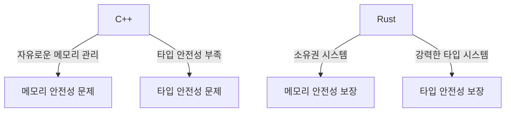
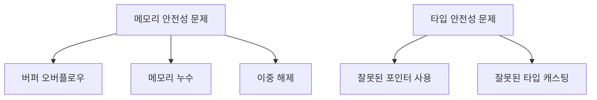
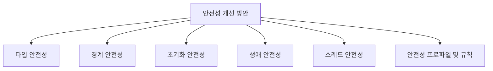
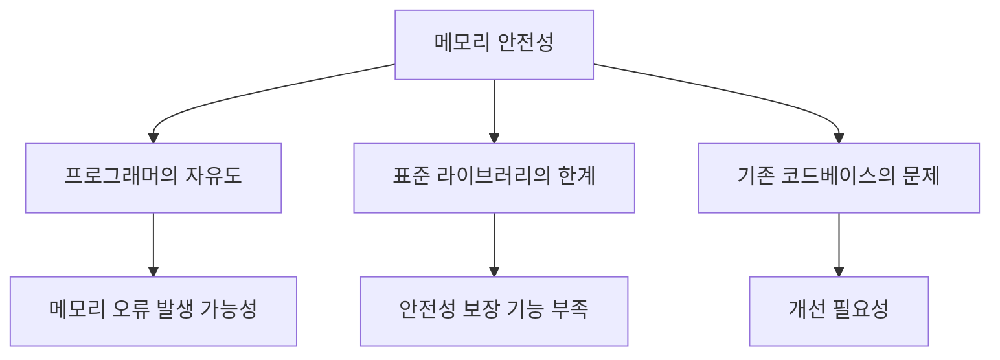
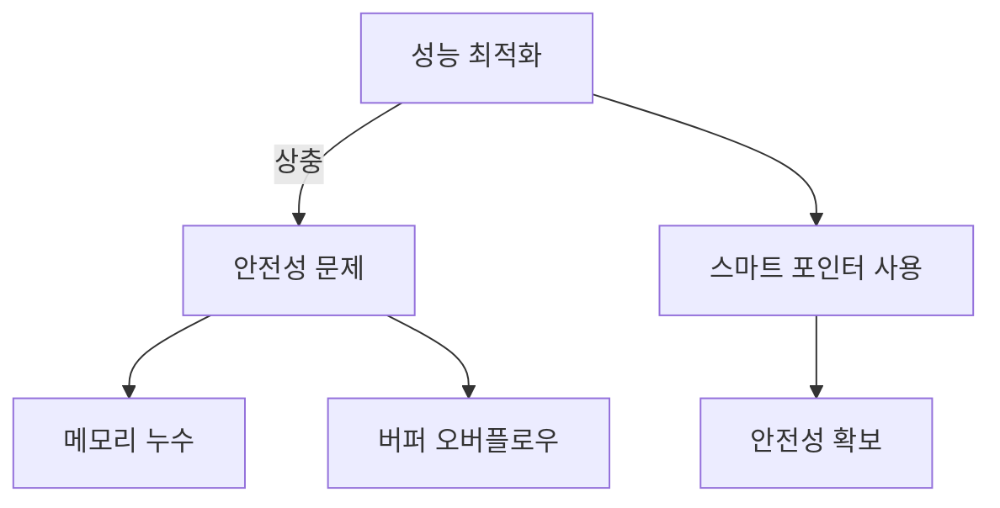
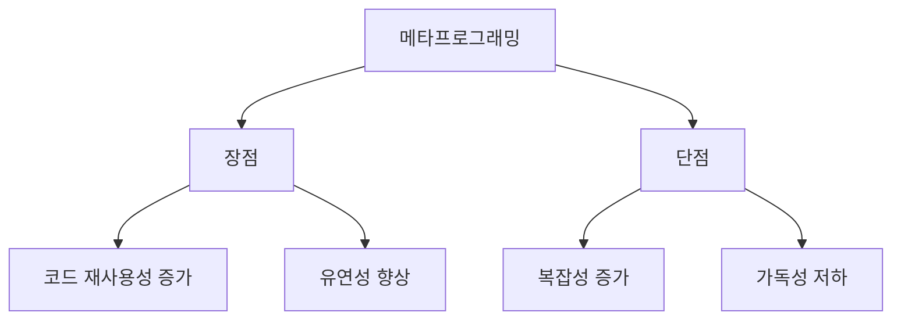
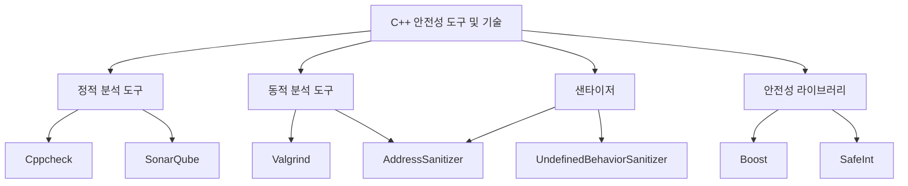
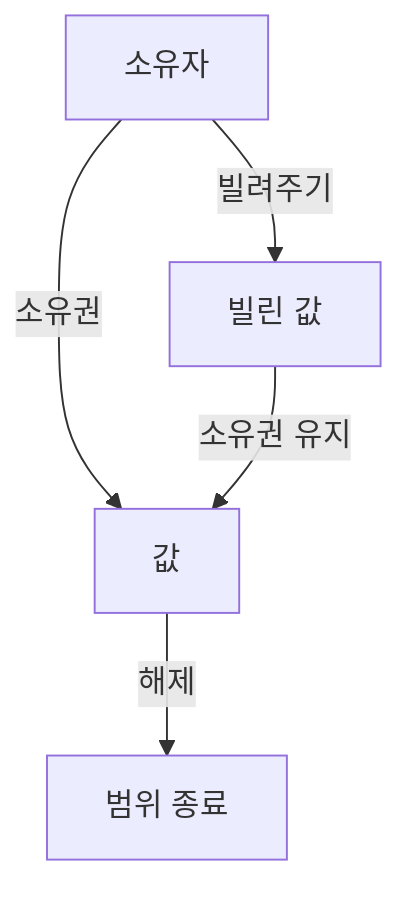

C++는 성능과 유연성이 뛰어난 대신, 메모리·타입·경계·초기화 등에서 안전성 문제를 안고 있다. Herb Sutter의 「Safety in Context」와 Rico Mariani의 비판적 견해를 바탕으로, C++의 현재 취약점·개선 방안·Rust와의 비교·실무 도구 활용까지 체계적으로 정리한다.

---

## 목차

1. [C++의 보안 및 안전성 문제](#1-c의-보안-및-안전성-문제)
2. [C++의 현재 안전성 문제](#2-c의-현재-안전성-문제)
3. [C++의 안전성 개선 방안](#3-c의-안전성-개선-방안)
4. [C++의 메모리 안전성](#4-c의-메모리-안전성)
5. [성능과 안전성의 균형](#5-성능과-안전성의-균형)
6. [메타프로그래밍과 안전성](#6-메타프로그래밍과-안전성)
7. [안전성 관련 도구 및 기술](#7-안전성-관련-도구-및-기술)
8. [관련 기술과 최신 표준](#8-관련-기술과-최신-표준)
9. [결론 및 참고 문헌](#9-결론-및-참고-문헌)

---

## 1. C++의 보안 및 안전성 문제

C++는 저수준 제어와 고성능을 제공하지만, 그만큼 **보안·안전성 리스크**가 크다. 메모리 누수, 버퍼 오버플로우, 데이터 경합 등은 심각한 취약점으로 이어질 수 있으며, Herb Sutter에 따르면 C++의 “즉각적인 문제”는 **타입·경계·초기화·생애(lifetime)** 네 가지 안전성에서 “기본값으로 취약한 코드를 쓰기 너무 쉽다”는 것이다.

### 1.1 주요 원인

- **메모리 관리의 복잡성**: 수동 할당/해제로 인한 누수·이중 해제·댕글링 포인터.
- **타입 안전성 부족**: 포인터·캐스팅으로 타입 시스템을 우회하기 쉬움.
- **예외 처리의 불완전성**: 예외 시 자원 해제·일관성 유지가 어렵고, RAII에 의존해야 함.

### 1.2 Herb Sutter의 안전성 논의 요약

Sutter는 **안전한 라이브러리 사용**, **정적/동적 분석 도구 활용**, **안전성 프로파일(규칙 집합)의 기본 적용**을 제안한다. 목표는 “이미 알려진 규칙을 기본값으로 강제하고, 필요한 경우에만 명시적 옵트아웃”하는 것이다. 98% 수준의 취약점 감소가 링크 호환성을 유지한 채 달성 가능하다는 주장이다.

### 1.3 C++와 Rust의 안전성 비교

Rust는 **소유권·빌림**으로 메모리 안전성을 언어 차원에서 보장하고, C++는 유연하지만 안전성을 확보하려면 규칙·도구·코딩 스타일에 더 많이 의존한다. 아래 다이어그램은 두 언어의 접근 차이를 요약한다.


```mermaid
graph TD
    cppLang["C++"]
    memIssue[메모리 안전성 문제]
    typeIssue[타입 안전성 문제]
    rustLang[Rust]
    memSafe[메모리 안전성 보장]
    typeSafe[타입 안전성 보장]
    cppLang -->|"자유로운 메모리 관리"| memIssue
    cppLang -->|"타입 안전성 부족"| typeIssue
    rustLang -->|"소유권 시스템"| memSafe
    rustLang -->|"강력한 타입 시스템"| typeSafe
```

프로젝트 요구사항(레거시 연동, 성능, 팀 역량)에 따라 C++를 쓸 때는 안전성 프로파일과 도구를 적극 도입하는 것이 필수에 가깝다.

---

## 2. C++의 현재 안전성 문제

### 2.1 보안·안전성 취약점

저수준 메모리 접근이 가능한 만큼 **버퍼 오버플로우**, **Use-After-Free**, **잘못된 포인터 연산** 등이 발생하기 쉽고, 이는 CVE로 이어질 수 있다.

예: 고정 크기 버퍼에 사용자 입력을 그대로 넣는 코드.

```cpp
#include <iostream>
#include <cstring>

void vulnerableFunction() {
    char buffer[10];
    std::cout << "Enter some text: ";
    std::cin >> buffer; // 버퍼 오버플로우 가능
    std::cout << "You entered: " << buffer << std::endl;
}
```

10바이트를 넘는 입력이 들어오면 경계를 넘는 쓰기가 발생할 수 있다. 실무에서는 `std::string`, `std::getline`, 또는 경계를 검사하는 API를 사용해야 한다.

### 2.2 안전성 문제의 원인

- 메모리 생애·소유권을 개발자가 직접 관리해야 함.
- 복잡한 문법(다중 상속, 템플릿, 메타프로그래밍)으로 실수와 가독성 저하.
- 기본 라이브러리 일부가 “시스템 프로그래머 친화적이지 않다”는 비판(Rico Mariani 등).

### 2.3 메모리·타입 안전성 문제 구조

메모리 안전성 문제는 버퍼 오버플로우·메모리 누수·이중 해제로, 타입 안전성 문제는 잘못된 포인터 사용·위험한 캐스팅으로 요약할 수 있다.


```mermaid
graph TD
    memSafetyProb[메모리 안전성 문제]
    bufOverflow[버퍼 오버플로우]
    memLeak[메모리 누수]
    doubleFree[이중 해제]
    typeSafetyProb[타입 안전성 문제]
    badPtr[잘못된 포인터 사용]
    badCast[잘못된 타입 캐스팅]
    memSafetyProb --> bufOverflow
    memSafetyProb --> memLeak
    memSafetyProb --> doubleFree
    typeSafetyProb --> badPtr
    typeSafetyProb --> badCast
```

`reinterpret_cast` 등 무모한 캐스팅은 타입 안전성을 깨뜨리는 대표 사례다.

```cpp
#include <iostream>

void unsafeCast() {
    int* intPtr = new int(42);
    char* charPtr = reinterpret_cast<char*>(intPtr); // 타입 안전성 위반
    std::cout << "Value: " << *charPtr << std::endl;
    delete intPtr;
}
```

---

## 3. C++의 안전성 개선 방안

### 3.1 타입 안전성: std::variant

암시적·위험한 변환 대신 **타입이 명확한** 표현을 쓰면 컴파일 타임에 오류를 줄일 수 있다. `std::variant`는 타입 안전한 유니온으로, 잘못된 타입 접근을 막는다.

```cpp
#include <iostream>
#include <variant>

int main() {
    std::variant<int, std::string> value;
    value = 42;
    std::cout << std::get<int>(value) << std::endl;
    value = "Hello, C++";
    std::cout << std::get<std::string>(value) << std::endl;
    return 0;
}
```

### 3.2 경계 안전성: std::array::at, std::span

원시 배열·포인터 대신 **경계 검사**가 있는 인터페이스를 사용한다. `std::array::at()`은 범위 초과 시 예외를 던진다. C++20의 `std::span`은 연속 메모리 뷰를 안전하게 다루는 데 유용하다.

```cpp
#include <iostream>
#include <array>

int main() {
    std::array<int, 5> arr = {1, 2, 3, 4, 5};
    try {
        std::cout << arr.at(10) << std::endl;
    } catch (const std::out_of_range& e) {
        std::cerr << "Out of range: " << e.what() << std::endl;
    }
    return 0;
}
```

### 3.3 초기화 안전성: std::optional

값이 “있을 수도, 없을 수도” 있는 경우 `std::optional`로 명시하면, 미초기화 접근을 줄일 수 있다.

```cpp
#include <iostream>
#include <optional>

int main() {
    std::optional<int> value;
    if (value.has_value()) {
        std::cout << "Value: " << value.value() << std::endl;
    } else {
        std::cout << "No value set" << std::endl;
    }
    value = 42;
    if (value) std::cout << "Value: " << *value << std::endl;
    return 0;
}
```

### 3.4 생애 안전성: 스마트 포인터

`std::unique_ptr`, `std::shared_ptr`로 소유권과 생애를 명확히 하면 메모리 누수·이중 해제를 크게 줄일 수 있다.

```cpp
#include <iostream>
#include <memory>

int main() {
    std::unique_ptr<int> ptr = std::make_unique<int>(10);
    std::cout << "Value: " << *ptr << std::endl;
    return 0;
}
```

### 3.5 스레드 안전성: mutex, lock_guard

공유 자원 접근 시 `std::mutex`와 `std::lock_guard`(또는 `std::scoped_lock`)로 데이터 경합을 방지한다.

```cpp
#include <iostream>
#include <thread>
#include <mutex>

std::mutex mtx;

void print_thread_id(int id) {
    std::lock_guard<std::mutex> lock(mtx);
    std::cout << "Thread ID: " << id << std::endl;
}

int main() {
    std::thread t1(print_thread_id, 1);
    std::thread t2(print_thread_id, 2);
    t1.join();
    t2.join();
    return 0;
}
```

### 3.6 안전성 프로파일·규칙 제안

실무에서 적용할 수 있는 규칙 예시는 다음과 같다.

1. 모든 변수는 사용 전 초기화.
2. 포인터 사용 시 `nullptr` 검사 및 가능하면 스마트 포인터 사용.
3. 배열·컨테이너 접근 시 경계 검사 또는 `at()`/`std::span` 활용.
4. 멀티스레드 구간에서는 동기화 수단 필수.

이를 한눈에 보면 다음과 같다.


```mermaid
graph TD
    safetyImprove[안전성 개선 방안]
    typeSafety[타입 안전성]
    boundsSafety[경계 안전성]
    initSafety[초기화 안전성]
    lifetimeSafety[생애 안전성]
    threadSafety[스레드 안전성]
    profileRules[안전성 프로파일 및 규칙]
    safetyImprove --> typeSafety
    safetyImprove --> boundsSafety
    safetyImprove --> initSafety
    safetyImprove --> lifetimeSafety
    safetyImprove --> threadSafety
    safetyImprove --> profileRules
```

---

## 4. C++의 메모리 안전성

### 4.1 메모리 안전성의 중요성

메모리 안전성은 **안정성**과 **보안**의 기반이다. C++는 수동 메모리 관리로 인해 누수·오버플로우·댕글링 포인터가 발생하기 쉽고, 이는 크래시·취약점으로 이어진다.

### 4.2 C++가 맞닥뜨리는 도전

- 프로그래머에게 주는 자유도가 크다 → 실수 가능성 증가.
- 표준 라이브러리만으로는 메모리 안전성을 완전히 보장하기 어렵다.
- 레거시 코드는 안전하지 않은 패턴이 많아 개선 비용이 크다.


```mermaid
graph TD
    memSafeTopic[메모리 안전성]
    progFreedom[프로그래머의 자유도]
    libLimit[표준 라이브러리의 한계]
    legacyCode[기존 코드베이스의 문제]
    memError[메모리 오류 발생 가능성]
    lackGuarantee[안전성 보장 기능 부족]
    needImprove[개선 필요성]
    memSafeTopic --> progFreedom
    memSafeTopic --> libLimit
    memSafeTopic --> legacyCode
    progFreedom --> memError
    libLimit --> lackGuarantee
    legacyCode --> needImprove
```

### 4.3 대안 언어와의 비교

Rust는 **소유권·빌림**으로 컴파일 타임에 많은 메모리 오류를 차단한다. C++는 그 수준의 기본 보장이 없으므로, 스마트 포인터·RAII·정적/동적 분석으로 보완해야 한다.

| 항목           | C++                     | Rust                         |
|----------------|-------------------------|------------------------------|
| 메모리 관리    | 프로그래머 책임        | 소유권 시스템에 의한 관리    |
| 메모리 오류 방지 | 런타임 오류 가능       | 컴파일 타임에 상당 부분 방지 |
| 안전성 보장    | 도구·규칙에 의존       | 언어 설계에 반영             |

---

## 5. 성능과 안전성의 균형

### 5.1 성능 저하 없이 안전성 높이기

- **정적 분석**: clang-tidy, Clang Static Analyzer 등으로 패턴·버그 사전 탐지.
- **안전한 추상화 사용**: `std::vector`, `std::span`, 스마트 포인터로 예측 가능한 비용과 안전성 확보.
- **const 활용**: 불변성을 명시해 부작용과 오용을 줄인다.

### 5.2 안전성 규칙의 기본값과 옵트아웃

C++20의 `[[nodiscard]]`처럼 “기본은 안전한 쪽”으로 두고, 필요한 구간에서만 명시적으로 옵트아웃하는 방식이 권장된다. Sutter의 제안도 “기본값으로 규칙 강제 + 명시적 옵트아웃”이다.

```cpp
[[nodiscard]] int calculateValue() {
    return 42;
}

int main() {
    calculateValue(); // 경고 유발
    return 0;
}
```

### 5.3 성능 최적화와 안전성의 상충

수동 메모리 조작은 성능은 줄 수 있지만 안전성은 떨어진다. **RAII·스마트 포인터**로 “일반적으로는 안전하게, 꼭 필요한 구간만 수동”으로 가져가는 전략이 현실적이다.


```mermaid
graph TD
    perfOpt[성능 최적화]
    safetyProb[안전성 문제]
    memLeakA[메모리 누수]
    bufOverflowA[버퍼 오버플로우]
    smartPtr[스마트 포인터 사용]
    safetyGain[안전성 확보]
    perfOpt -->|"상충"| safetyProb
    safetyProb --> memLeakA
    safetyProb --> bufOverflowA
    perfOpt --> smartPtr
    smartPtr --> safetyGain
```

---

## 6. 메타프로그래밍과 안전성

### 6.1 장단점

- **장점**: 코드 재사용·추상화·컴파일 타임 검사로 타입/경계 안전성 강화 가능.
- **단점**: 컴파일 타임·가독성·디버깅 비용 증가, 복잡한 에러 메시지. Rico Mariani는 “메타프로그래밍이 일상 개발자에게 남용되면 이해 비용이 크다”고 지적한다.

### 6.2 코드 품질에 미치는 영향

적절히 쓰면 중복 제거와 일관성 확보에 도움이 되지만, 과용 시 가독성과 예측 가능성이 떨어진다. 팀 규모와 역량에 맞는 수준으로 제한하는 것이 좋다.

### 6.3 안전성 개선에의 활용

템플릿으로 **경계 검사가 있는 컨테이너**나 **타입 제약(Concepts)** 을 두면, 런타임 전에 오류를 잡을 수 있다. C++20 Concepts는 이런 용도에 잘 맞는다.


```mermaid
graph TD
    metaProg[메타프로그래밍]
    pros[장점]
    cons[단점]
    reuse[코드 재사용성 증가]
    flex[유연성 향상]
    complex[복잡성 증가]
    readDrop[가독성 저하]
    metaProg --> pros
    metaProg --> cons
    pros --> reuse
    pros --> flex
    cons --> complex
    cons --> readDrop
```

---

## 7. 안전성 관련 도구 및 기술

### 7.1 정적·동적 분석 도구

- **정적 분석**: Cppcheck, Clang Static Analyzer, SonarQube — 실행 없이 패턴·잠재 버그 검사.
- **동적 분석**: Valgrind, AddressSanitizer(ASan), ThreadSanitizer(TSan) — 실행 중 메모리·스레드 오류 탐지.

### 7.2 샌타이저 사용

빌드 시 플래그로 활성화한다. 예: AddressSanitizer.

```bash
g++ -fsanitize=address -g -o my_program my_program.cpp
```

UndefinedBehaviorSanitizer(UBSan)는 정수 오버플로우·정의되지 않은 동작을 찾는 데 유용하다. Sutter는 “어떤 언어를 쓰든 샌타이저를 사용하라”고 권한다.

### 7.3 안전성 라이브러리·도구

- **Boost**: 다양한 유틸리티와 안전한 추상화.
- **SafeInt**: 정수 오버플로우 방지(MSVC 등).
- **테스트**: Google Test 등으로 회귀·엣지 케이스 검증.


```mermaid
graph TD
    toolsRoot["C++ 안전성 도구 및 기술"]
    staticTools[정적 분석 도구]
    dynamicTools[동적 분석 도구]
    sanitizers[샌타이저]
    safeLibs[안전성 라이브러리]
    cppcheck[Cppcheck]
    sonar[SonarQube]
    valgrind[Valgrind]
    asan[AddressSanitizer]
    ubsan[UndefinedBehaviorSanitizer]
    boost[Boost]
    safeInt[SafeInt]
    toolsRoot --> staticTools
    toolsRoot --> dynamicTools
    toolsRoot --> sanitizers
    toolsRoot --> safeLibs
    staticTools --> cppcheck
    staticTools --> sonar
    dynamicTools --> valgrind
    dynamicTools --> asan
    sanitizers --> asan
    sanitizers --> ubsan
    safeLibs --> boost
    safeLibs --> safeInt
```

---

## 8. 관련 기술과 최신 표준

### 8.1 Rust와 C++의 안전성 비교

Rust 소유권 규칙 요약:

1. 각 값은 하나의 소유자만 가진다.
2. 소유자가 스코프를 벗어나면 값이 정리된다.
3. 빌림(참조)은 소유권을 넘기지 않는다.

C++는 이에 상응하는 것을 RAII·스마트 포인터·코딩 규칙으로 맞춰 나가야 한다.


```mermaid
graph TD
    owner[소유자]
    value[값]
    scopeEnd[범위 종료]
    borrowed[빌린 값]
    owner -->|"소유권"| value
    value -->|"해제"| scopeEnd
    owner -->|"빌려주기"| borrowed
    borrowed -->|"소유권 유지"| value
```

### 8.2 메모리 안전 언어(MSL)와 C++

NIST/NSA/CISA 등이 권장하는 “메모리 안전 언어”는 자동 메모리 관리·강한 타입·안전한 메모리 접근을 제공한다. C++는 MSL이 아니지만, **안전한 부분집합(프로파일)** 과 도구로 그 격차를 줄이는 노력이 진행 중이다.

### 8.3 C++20·C++23과 안전성

- **C++20**: Concepts(타입 제약), Ranges, `std::span` — 타입·경계 안전성 강화.
- **C++23**: `std::expected` 등으로 오류 처리의 명시성·안전성 향상.

```cpp
#include <iostream>
#include <concepts>

template<typename T>
concept Integral = std::is_integral_v<T>;

template<Integral T>
T add(T a, T b) {
    return a + b;
}

int main() {
    std::cout << add(5, 10) << std::endl;
    return 0;
}
```

---

## 9. 결론 및 참고 문헌

### 9.1 요약

- C++의 안전성 문제는 **타입·경계·초기화·생애** 네 가지를 기본값으로 강화하는 방향으로 해결할 수 있다.
- **스마트 포인터**, **std::variant/optional/span**, **RAII**, **정적·동적 분석·샌타이저**를 조합하면 실무에서 상당한 수준까지 안전성을 끌어올릴 수 있다.
- 프로그래밍 언어 안전성만으로는 보안·안전의 모든 문제가 해결되지 않는다. 위협 모델링, 암호화, 설정·자격 증명 관리, 공급망 보안 등과 함께 다뤄야 한다.

### 9.2 참고 문헌

- [Herb Sutter — Safety in Context](https://herbsutter.com/2024/03/11/safety-in-context/)  
  C++ 안전성의 맥락, 네 가지 안전성 카테고리, 98% 개선 가능성, 오해 정리.

- [Rico Mariani — C++ for Security and Systems Programming: Objections](https://ricomariani.medium.com/c-for-security-and-systems-programming-objections-5dc07a24c815)  
  Sutter 제안에 대한 동의와 함께, 표준 라이브러리·메타프로그래밍·시스템 프로그래밍 관점의 비판.

- [Microsoft Learn — C++ 표준 라이브러리의 스레드 보안](https://learn.microsoft.com/ko-kr/cpp/standard-library/thread-safety-in-the-cpp-standard-library?view=msvc-170)  
  표준 라이브러리 타입의 스레드 안전성 규칙.

- [Microsoft Learn — 안전한 라이브러리: C++ 표준 라이브러리](https://learn.microsoft.com/ko-kr/cpp/standard-library/safe-libraries-cpp-standard-library?view=msvc-170)  
  안전하지 않은 API와 _s 접미사 대체 API.

- [Applied Informatics — C++ for Safety-Critical Systems (PDF)](https://www.appinf.com/download/SafetyCriticalC++.pdf)  
  MISRA C++, JSF C++ 등 안전 중요 시스템용 C++ 코딩 표준 개요.
