최적의 기업 아키텍처 설계는 모든 조직의 IT 시스템의 중추 역할을 하며, 이는 조직의 비즈니스 목표를 달성하기 위한 기초적인 구성 요소를 지원하는 데 필수적이다. 이러한 아키텍처는 최선의 관행, 명확하게 정의된 전략, 공통 프레임워크 및 엔지니어링 팀과 기타 이해관계자가 작업을 수행하기 위해 적절한 도구를 선택할 수 있도록 돕는 지침으로 구성된다. 대부분의 조직에서 아키텍처 팀은 비즈니스 라인을 지원하며, 아키텍처 패턴과 공통 프레임워크를 정의하는 책임을 맡고 있다. 이는 엔지니어링 및 제품 팀이 개념 증명을 위해 많은 시간을 소모하는 대신, 패턴에 기반하여 핵심 구성 요소를 설계하는 전략을 채택할 수 있도록 돕는다. 최근에는 생성적 AI가 전체 환경을 변화시키고 있으며, 많은 조직이 생성적 AI 기반 애플리케이션을 구축하거나 기존 애플리케이션에 생성적 AI 기능을 통합하고 있다. 이 글에서는 생성적 AI 솔루션을 구축하기 위한 일반적인 아키텍처 패턴과 적절한 프레임워크를 선택하기 위한 다양한 기업 전략에 대해 깊이 있게 논의할 것이다.


||
|:---:|
||


<!--
##### Outline #####
-->

<!--
# 목차

## 1. 개요
   - 기업 아키텍처의 중요성
   - Generative AI의 발전과 기업의 대응
   - 본 글의 목적 및 구성

## 2. Generative AI 솔루션을 위한 아키텍처 패턴
   - 2.1 패턴 1: 도메인 특화 미세 조정 (Domain-Specific Fine Tuning, DSFT)
     - DSFT의 정의 및 필요성
     - 사용 사례 및 적용 분야
     - 기업 전략 및 고려사항
   - 2.2 패턴 2: 검색 증강 생성 (Retrieval Augmented Generation, RAG)
     - RAG의 구조 및 작동 원리
     - 사용 사례 및 적용 분야
     - 기업 전략 및 고려사항
   - 2.3 패턴 3: 검색 증강 - 미세 조정 (Retrieval Augmented - Fine Tuning, RA-FT)
     - RA-FT의 개념 및 장점
     - 사용 사례 및 적용 분야
     - 기업 전략 및 고려사항
   - 2.4 패턴 4: 지식 그래프/RAG 그래프 (Knowledge Graph/RAG Graph)
     - GraphRAG의 정의 및 작동 원리
     - 사용 사례 및 적용 분야
     - 기업 전략 및 고려사항

## 3. Generative AI 솔루션 구축을 위한 전략
   - 3.1 데이터 처리 및 수집 전략
   - 3.2 모델 선택 및 미세 조정 전략
   - 3.3 성능 평가 및 벤치마크 설정
   - 3.4 도메인 전문가와의 협업 중요성

## 4. 예제
   - 4.1 DSFT를 활용한 고객 서비스 자동화 사례
   - 4.2 RAG를 활용한 HR 지원 애플리케이션 사례
   - 4.3 RA-FT를 활용한 의료 정보 검색 사례
   - 4.4 GraphRAG를 활용한 금융 데이터 분석 사례

## 5. FAQ
   - Q1: Generative AI 솔루션을 구축할 때 가장 큰 도전 과제는 무엇인가요?
   - Q2: DSFT와 RAG 중 어떤 패턴을 선택해야 할까요?
   - Q3: 미세 조정 과정에서 데이터의 품질은 얼마나 중요한가요?
   - Q4: GraphRAG의 장점은 무엇인가요?

## 6. 관련 기술
   - 6.1 대규모 언어 모델 (Large Language Models, LLM)
   - 6.2 전이 학습 (Transfer Learning)
   - 6.3 벡터 데이터베이스 (Vector Databases)
   - 6.4 자연어 처리 (Natural Language Processing, NLP)

## 7. 결론
   - Generative AI의 미래와 기업 아키텍처의 역할
   - 성공적인 Generative AI 솔루션 구축을 위한 제언
   - 지속적인 기술 발전과 기업의 적응 필요성

## 8. 참고 자료
   - 관련 논문 및 연구 자료
   - Generative AI 관련 블로그 및 웹사이트
   - 기업 아키텍처 관련 서적 및 자료

이 목차는 Generative AI 솔루션 구축에 대한 포괄적인 이해를 제공하며, 각 패턴과 전략에 대한 깊이 있는 논의를 포함하고 있습니다.
-->

<!--
## 1. 개요
   - 기업 아키텍처의 중요성
   - Generative AI의 발전과 기업의 대응
   - 본 글의 목적 및 구성
-->

## 1. 개요

**기업 아키텍처의 중요성**  

기업 아키텍처는 조직의 비전과 목표를 달성하기 위한 전략적 프레임워크이다. 이는 비즈니스 프로세스, 정보 시스템, 기술 인프라 및 인적 자원 간의 관계를 정의하고 조정하는 역할을 한다. 효과적인 기업 아키텍처는 기업이 변화하는 시장 환경에 신속하게 대응할 수 있도록 지원하며, 자원의 최적화와 비용 절감을 가능하게 한다. 또한, 기업의 목표와 IT 전략 간의 정렬을 통해 비즈니스 가치를 극대화하는 데 기여한다.

**Generative AI의 발전과 기업의 대응**  

Generative AI는 최근 몇 년간 급격한 발전을 이루었으며, 이는 다양한 산업 분야에서 혁신적인 변화를 가져오고 있다. Generative AI는 데이터에서 학습하여 새로운 콘텐츠를 생성하는 능력을 가지고 있으며, 이는 고객 서비스, 마케팅, 제품 개발 등 여러 분야에서 활용될 수 있다. 기업은 이러한 기술을 통해 경쟁력을 강화하고, 고객 경험을 개선하며, 운영 효율성을 높일 수 있는 기회를 가지게 된다. 그러나 이러한 기술의 도입은 단순한 기술적 변화에 그치지 않고, 기업의 전반적인 아키텍처와 전략에 대한 재고를 요구한다.

**본 글의 목적 및 구성**  

본 글은 Generative AI 솔루션 구축을 위한 기업 아키텍처의 중요성과 다양한 아키텍처 패턴을 소개하는 것을 목적으로 한다. 이를 통해 기업이 Generative AI를 효과적으로 활용할 수 있는 전략과 방향성을 제시하고자 한다. 글의 구성은 다음과 같다. 첫째, Generative AI 솔루션을 위한 아키텍처 패턴을 소개하고, 각 패턴의 정의, 필요성, 사용 사례 및 기업 전략을 논의한다. 둘째, Generative AI 솔루션 구축을 위한 전략을 제시하며, 데이터 처리, 모델 선택, 성능 평가 및 도메인 전문가와의 협업의 중요성을 강조한다. 마지막으로, 다양한 예제를 통해 실제 적용 사례를 살펴보고, FAQ를 통해 독자들의 궁금증을 해소할 예정이다.

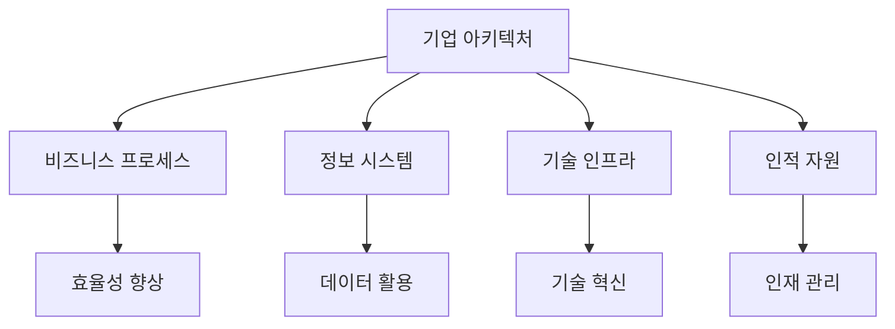

위의 다이어그램은 기업 아키텍처의 주요 구성 요소와 이들이 기업의 효율성 향상, 데이터 활용, 기술 혁신 및 인재 관리에 어떻게 기여하는지를 시각적으로 나타낸 것이다. 이러한 요소들은 Generative AI의 도입과 함께 더욱 중요해지며, 기업의 성공적인 변화를 이끌어낼 수 있는 기반이 된다.

<!--
## 2. Generative AI 솔루션을 위한 아키텍처 패턴
   - 2.1 패턴 1: 도메인 특화 미세 조정 (Domain-Specific Fine Tuning, DSFT)
     - DSFT의 정의 및 필요성
     - 사용 사례 및 적용 분야
     - 기업 전략 및 고려사항
   - 2.2 패턴 2: 검색 증강 생성 (Retrieval Augmented Generation, RAG)
     - RAG의 구조 및 작동 원리
     - 사용 사례 및 적용 분야
     - 기업 전략 및 고려사항
   - 2.3 패턴 3: 검색 증강 - 미세 조정 (Retrieval Augmented - Fine Tuning, RA-FT)
     - RA-FT의 개념 및 장점
     - 사용 사례 및 적용 분야
     - 기업 전략 및 고려사항
   - 2.4 패턴 4: 지식 그래프/RAG 그래프 (Knowledge Graph/RAG Graph)
     - GraphRAG의 정의 및 작동 원리
     - 사용 사례 및 적용 분야
     - 기업 전략 및 고려사항
-->

## 2. Generative AI 솔루션을 위한 아키텍처 패턴

### **2.1 패턴 1: 도메인 특화 미세 조정 (Domain-Specific Fine Tuning, DSFT)**

**DSFT의 정의 및 필요성**  

도메인 특화 미세 조정(DSFT)은 특정 도메인에 맞춰 사전 훈련된 모델을 추가적으로 훈련시키는 과정을 의미한다. 이는 일반적인 모델이 특정 도메인에서의 성능을 극대화하기 위해 필수적이다. DSFT는 데이터의 특성과 요구 사항에 맞춰 모델을 조정함으로써, 더 높은 정확도와 효율성을 제공할 수 있다.

**사용 사례 및 적용 분야**  

DSFT는 의료, 금융, 법률 등 다양한 분야에서 활용될 수 있다. 예를 들어, 의료 분야에서는 환자의 진단 및 치료 추천 시스템에 적용되어, 특정 질병에 대한 전문 지식을 반영한 결과를 제공할 수 있다.

**기업 전략 및 고려사항**  

기업은 DSFT를 도입할 때, 도메인 전문가와의 협업이 중요하다. 또한, 데이터의 품질과 양이 모델의 성능에 큰 영향을 미치므로, 충분한 양질의 데이터를 확보하는 것이 필수적이다.

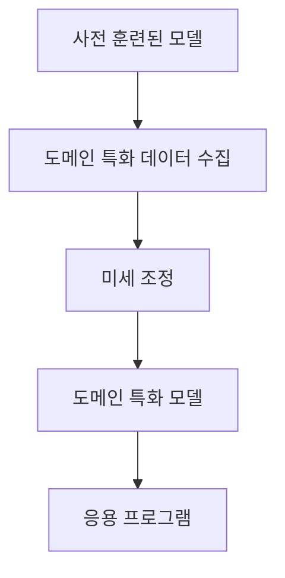

### **2.2 패턴 2: 검색 증강 생성 (Retrieval Augmented Generation, RAG)**

**RAG의 구조 및 작동 원리**  

검색 증강 생성(RAG)은 정보 검색과 생성 모델을 결합한 아키텍처이다. 이 패턴은 사용자가 입력한 질문에 대해 관련 정보를 검색하고, 이를 바탕으로 자연어로 응답을 생성하는 방식으로 작동한다. RAG는 정보의 정확성을 높이고, 더 풍부한 응답을 제공할 수 있다.

**사용 사례 및 적용 분야**  

RAG는 고객 지원 시스템, FAQ 자동화, 그리고 교육용 챗봇 등 다양한 분야에서 활용될 수 있다. 예를 들어, 고객 지원 시스템에서는 고객의 질문에 대해 관련된 문서를 검색하고, 이를 바탕으로 적절한 답변을 생성할 수 있다.

**기업 전략 및 고려사항**  

RAG를 도입하는 기업은 검색 엔진과 생성 모델 간의 통합을 고려해야 한다. 또한, 검색 결과의 품질이 최종 응답의 품질에 직접적인 영향을 미치므로, 검색 데이터의 품질 관리가 중요하다.

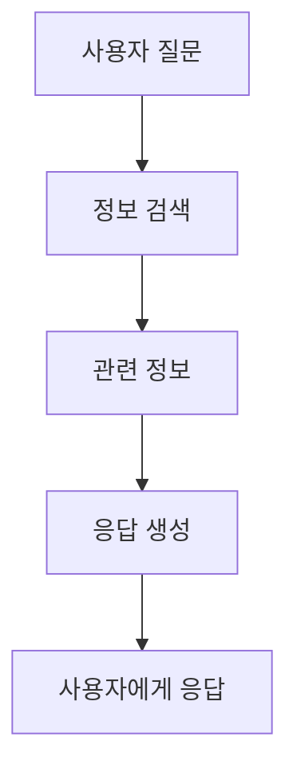

### **2.3 패턴 3: 검색 증강 - 미세 조정 (Retrieval Augmented - Fine Tuning, RA-FT)**

**RA-FT의 개념 및 장점**  

검색 증강 - 미세 조정(RA-FT)은 RAG의 개념을 기반으로 하여, 검색된 정보를 활용해 모델을 미세 조정하는 방법이다. 이 패턴은 모델이 특정 도메인에 대한 지식을 더욱 깊이 있게 학습할 수 있도록 돕는다. RA-FT는 정보 검색과 미세 조정의 장점을 결합하여, 더 높은 성능을 발휘할 수 있다.

**사용 사례 및 적용 분야** 

RA-FT는 법률 문서 분석, 기술 지원 시스템 등에서 유용하게 사용될 수 있다. 예를 들어, 법률 분야에서는 특정 사건에 대한 정보를 검색하고, 이를 바탕으로 법률 자문을 제공하는 시스템에 적용될 수 있다.

**기업 전략 및 고려사항**  

RA-FT를 도입하는 기업은 검색 데이터와 미세 조정 데이터의 조화를 고려해야 한다. 또한, 모델의 성능을 지속적으로 모니터링하고, 필요에 따라 추가적인 미세 조정을 수행하는 것이 중요하다.

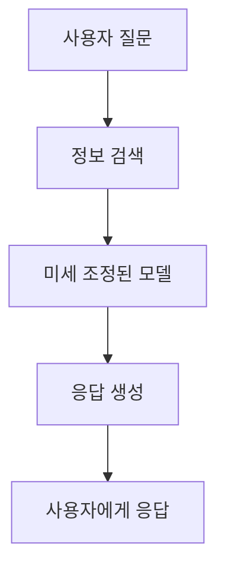

### **2.4 패턴 4: 지식 그래프/RAG 그래프 (Knowledge Graph/RAG Graph)**

**GraphRAG의 정의 및 작동 원리** 

지식 그래프(RAG 그래프)는 다양한 정보 간의 관계를 시각적으로 표현한 구조로, 정보 검색과 생성 모델을 통합하는 데 유용하다. GraphRAG는 정보의 관계를 명확히 하여, 더 정확하고 관련성 높은 응답을 생성할 수 있도록 돕는다.

**사용 사례 및 적용 분야** 

GraphRAG는 추천 시스템, 데이터 분석, 그리고 복잡한 질의 응답 시스템 등에서 활용될 수 있다. 예를 들어, 추천 시스템에서는 사용자와 아이템 간의 관계를 시각화하여, 개인화된 추천을 제공할 수 있다.

**기업 전략 및 고려사항**  

GraphRAG를 도입하는 기업은 데이터의 관계를 명확히 정의하고, 이를 기반으로 그래프를 구축해야 한다. 또한, 그래프의 업데이트와 유지 관리가 중요하며, 이를 통해 지속적으로 정확한 정보를 제공할 수 있다.

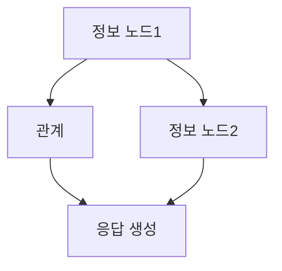

이와 같이 Generative AI 솔루션을 위한 다양한 아키텍처 패턴을 이해하고 활용하는 것은 기업의 경쟁력을 높이는 데 중요한 요소가 된다. 각 패턴의 특성과 장점을 고려하여 적절한 전략을 수립하는 것이 필요하다.

<!--
## 3. Generative AI 솔루션 구축을 위한 전략
   - 3.1 데이터 처리 및 수집 전략
   - 3.2 모델 선택 및 미세 조정 전략
   - 3.3 성능 평가 및 벤치마크 설정
   - 3.4 도메인 전문가와의 협업 중요성
-->

## 3. Generative AI 솔루션 구축을 위한 전략

Generative AI 솔루션을 성공적으로 구축하기 위해서는 여러 가지 전략을 고려해야 한다. 이 섹션에서는 데이터 처리 및 수집 전략, 모델 선택 및 미세 조정 전략, 성능 평가 및 벤치마크 설정, 그리고 도메인 전문가와의 협업 중요성에 대해 논의할 것이다.

**3.1 데이터 처리 및 수집 전략**

데이터는 Generative AI 솔루션의 핵심 요소이다. 따라서 데이터 처리 및 수집 전략은 매우 중요하다. 우선, 필요한 데이터의 종류와 양을 명확히 정의해야 한다. 데이터 수집 방법으로는 웹 스크래핑, API 활용, 그리고 기존 데이터베이스에서의 추출 등이 있다. 수집된 데이터는 정제 및 전처리 과정을 거쳐야 하며, 이 과정에서 노이즈를 제거하고 일관성을 유지하는 것이 중요하다.

```python
import pandas as pd

# 데이터 로드
data = pd.read_csv('data.csv')

# 결측치 처리
data.fillna(method='ffill', inplace=True)

# 데이터 정제
data = data[data['column_name'] != 'unwanted_value']
```

**3.2 모델 선택 및 미세 조정 전략**

모델 선택은 Generative AI 솔루션의 성능에 큰 영향을 미친다. 다양한 모델 중에서 특정 도메인에 적합한 모델을 선택해야 하며, 이 과정에서 모델의 크기, 구조, 그리고 학습 데이터의 양을 고려해야 한다. 선택한 모델은 미세 조정(fine-tuning) 과정을 통해 특정 작업에 최적화할 수 있다. 이때, 전이 학습(transfer learning) 기법을 활용하면 기존의 학습된 모델을 기반으로 빠르게 성능을 향상시킬 수 있다.

```python
from transformers import AutoModelForCausalLM, Trainer, TrainingArguments

# 모델 로드
model = AutoModelForCausalLM.from_pretrained('model_name')

# 미세 조정 설정
training_args = TrainingArguments(
    output_dir='./results',
    num_train_epochs=3,
    per_device_train_batch_size=16,
)

# Trainer 객체 생성
trainer = Trainer(
    model=model,
    args=training_args,
    train_dataset=train_dataset,
)

# 모델 학습
trainer.train()
```

**3.3 성능 평가 및 벤치마크 설정**

모델의 성능을 평가하기 위해서는 적절한 벤치마크를 설정해야 한다. 일반적으로 사용되는 평가 지표로는 정확도(accuracy), 정밀도(precision), 재현율(recall), F1-score 등이 있다. 이러한 지표를 통해 모델의 성능을 정량적으로 평가할 수 있으며, 필요에 따라 추가적인 테스트를 수행하여 모델의 일반화 능력을 확인해야 한다.

```python
from sklearn.metrics import accuracy_score, precision_score, recall_score, f1_score

# 예측 결과
y_pred = model.predict(X_test)

# 성능 평가
accuracy = accuracy_score(y_test, y_pred)
precision = precision_score(y_test, y_pred)
recall = recall_score(y_test, y_pred)
f1 = f1_score(y_test, y_pred)

print(f'Accuracy: {accuracy}, Precision: {precision}, Recall: {recall}, F1 Score: {f1}')
```

**3.4 도메인 전문가와의 협업 중요성**

Generative AI 솔루션의 성공적인 구축을 위해서는 도메인 전문가와의 협업이 필수적이다. 도메인 전문가는 특정 분야의 지식과 경험을 바탕으로 데이터 수집, 모델 선택, 그리고 결과 해석에 중요한 역할을 한다. 이들의 피드백을 통해 모델의 성능을 개선하고, 실제 비즈니스 문제를 해결하는 데 필요한 인사이트를 얻을 수 있다. 따라서, 도메인 전문가와의 긴밀한 협업은 Generative AI 솔루션의 성공을 위한 중요한 요소이다.

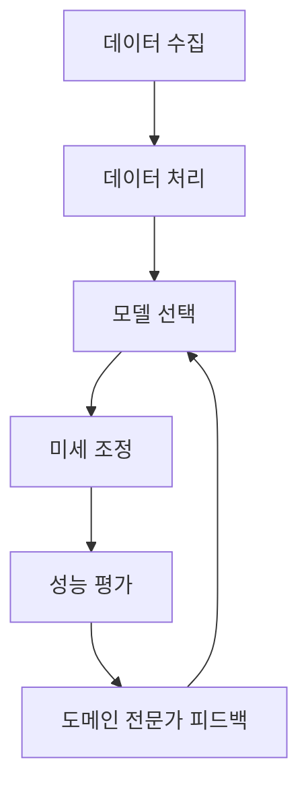

이와 같은 전략을 통해 Generative AI 솔루션을 효과적으로 구축할 수 있으며, 각 단계에서의 세심한 접근이 성공적인 결과를 가져올 것이다.

<!--
## 4. 예제
   - 4.1 DSFT를 활용한 고객 서비스 자동화 사례
   - 4.2 RAG를 활용한 HR 지원 애플리케이션 사례
   - 4.3 RA-FT를 활용한 의료 정보 검색 사례
   - 4.4 GraphRAG를 활용한 금융 데이터 분석 사례
-->

## 4. 예제

**4.1 DSFT를 활용한 고객 서비스 자동화 사례**

도메인 특화 미세 조정(DSFT)은 특정 산업이나 도메인에 맞춰 모델을 조정하는 방법이다. 고객 서비스 분야에서 DSFT를 활용하면 고객의 질문에 대한 정확한 답변을 제공할 수 있다. 예를 들어, 한 통신 회사는 고객의 자주 묻는 질문(FAQ)을 기반으로 DSFT를 적용하여 고객 서비스 챗봇을 구축하였다. 이 챗봇은 고객의 문의에 대해 신속하고 정확한 답변을 제공함으로써 고객 만족도를 높였다.

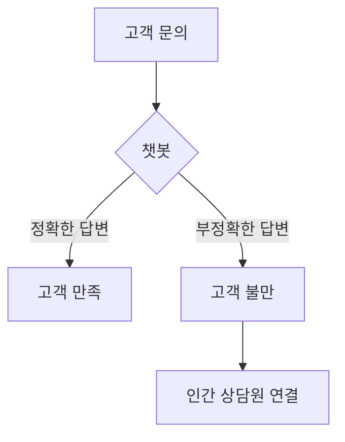

**4.2 RAG를 활용한 HR 지원 애플리케이션 사례**

검색 증강 생성(RAG)은 정보 검색과 생성 모델을 결합하여 보다 정확한 결과를 제공하는 방법이다. HR 지원 애플리케이션에서 RAG를 활용하면 직원들이 필요한 정보를 신속하게 찾을 수 있다. 예를 들어, 한 기업은 RAG를 통해 직원들이 인사 정책, 복리후생, 교육 프로그램 등에 대한 질문을 할 수 있는 시스템을 구축하였다. 이 시스템은 관련 문서를 검색하고, 그에 대한 요약 정보를 생성하여 제공한다.

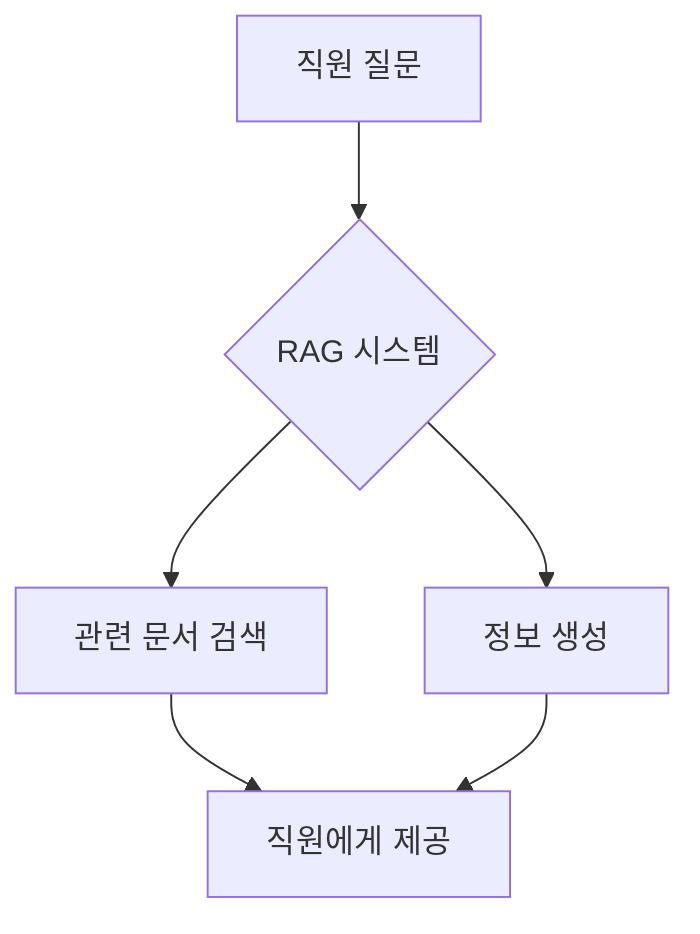

**4.3 RA-FT를 활용한 의료 정보 검색 사례**

검색 증강 - 미세 조정(RA-FT)은 RAG의 장점을 활용하면서도 특정 도메인에 맞춰 미세 조정하는 방법이다. 의료 정보 검색 시스템에서 RA-FT를 적용하면 의사와 환자가 필요한 정보를 보다 쉽게 찾을 수 있다. 예를 들어, 한 병원은 RA-FT를 통해 환자의 증상에 대한 정보를 검색하고, 관련된 의료 지식을 제공하는 시스템을 구축하였다. 이 시스템은 환자의 질문에 대해 신뢰할 수 있는 정보를 제공하여 의료 서비스의 질을 향상시켰다.

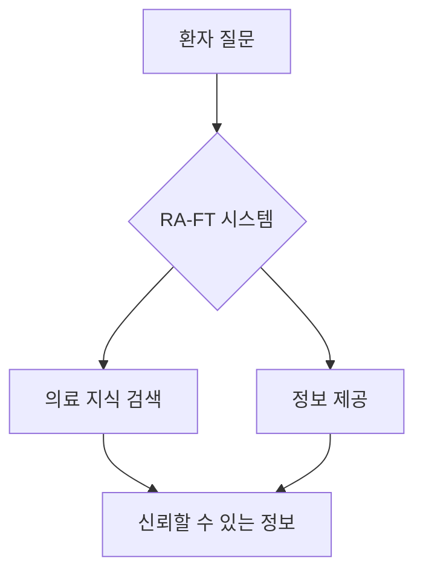

**4.4 GraphRAG를 활용한 금융 데이터 분석 사례**

지식 그래프와 검색 증강을 결합한 GraphRAG는 금융 데이터 분석에 효과적으로 활용될 수 있다. 예를 들어, 한 금융 기관은 GraphRAG를 통해 고객의 투자 성향을 분석하고, 맞춤형 투자 상품을 추천하는 시스템을 구축하였다. 이 시스템은 고객의 과거 거래 데이터를 기반으로 관련 정보를 검색하고, 이를 통해 고객에게 최적의 투자 전략을 제안한다.

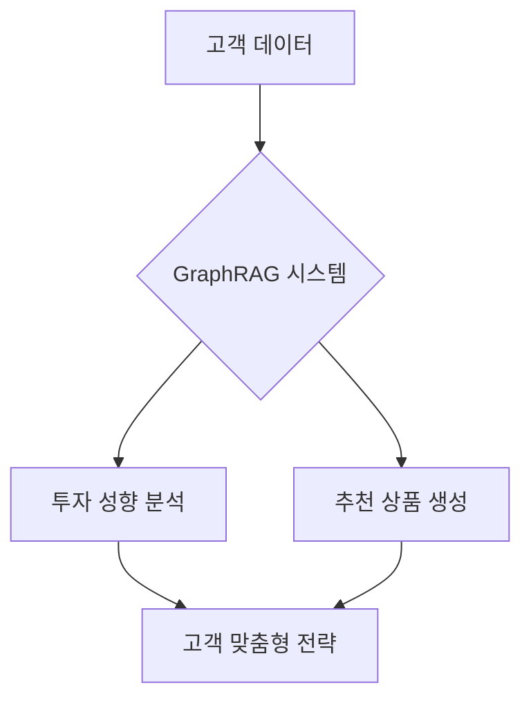

이와 같은 사례들은 Generative AI 솔루션이 다양한 산업에서 어떻게 활용될 수 있는지를 보여준다. 각 패턴의 특성을 이해하고 적절히 적용함으로써 기업은 고객의 요구에 보다 효과적으로 대응할 수 있다.

<!--
## 5. FAQ
   - Q1: Generative AI 솔루션을 구축할 때 가장 큰 도전 과제는 무엇인가요?
   - Q2: DSFT와 RAG 중 어떤 패턴을 선택해야 할까요?
   - Q3: 미세 조정 과정에서 데이터의 품질은 얼마나 중요한가요?
   - Q4: GraphRAG의 장점은 무엇인가요?
-->

## 5. FAQ

**Q1: Generative AI 솔루션을 구축할 때 가장 큰 도전 과제는 무엇인가요?**

Generative AI 솔루션을 구축할 때 가장 큰 도전 과제는 데이터의 품질과 양이다. 고품질의 데이터가 부족하면 모델의 성능이 저하될 수 있으며, 이는 결과적으로 비즈니스에 부정적인 영향을 미칠 수 있다. 또한, 데이터 수집 및 처리 과정에서의 법적 및 윤리적 문제도 중요한 고려사항이다. 따라서, 데이터의 출처와 품질을 철저히 검토하고, 필요한 경우 데이터 증강 기법을 활용하여 데이터셋을 보완하는 것이 필요하다.

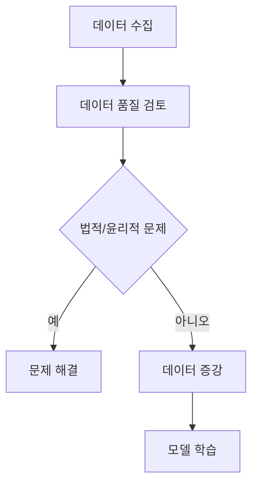

**Q2: DSFT와 RAG 중 어떤 패턴을 선택해야 할까요?**

DSFT와 RAG는 각각의 장점이 있으며, 선택은 특정 비즈니스 요구사항에 따라 달라진다. DSFT는 특정 도메인에 최적화된 모델을 구축할 수 있어, 특정 산업이나 분야에서의 성능을 극대화할 수 있다. 반면, RAG는 외부 데이터 소스를 활용하여 더 풍부한 정보를 제공할 수 있어, 정보 검색 및 생성의 정확성을 높일 수 있다. 따라서, 도메인 특화가 중요한 경우 DSFT를, 다양한 정보에 접근해야 하는 경우 RAG를 선택하는 것이 바람직하다.

**Q3: 미세 조정 과정에서 데이터의 품질은 얼마나 중요한가요?**

미세 조정 과정에서 데이터의 품질은 매우 중요하다. 고품질의 데이터는 모델이 더 정확하고 신뢰성 있는 결과를 생성하는 데 기여한다. 반면, 저품질의 데이터는 모델의 성능을 저하시킬 수 있으며, 잘못된 결과를 초래할 수 있다. 따라서, 미세 조정에 사용되는 데이터는 신뢰할 수 있는 출처에서 수집되고, 적절한 전처리 과정을 거쳐야 한다.

**Q4: GraphRAG의 장점은 무엇인가요?**

GraphRAG는 지식 그래프와 검색 증강 생성의 결합으로, 정보의 구조적 관계를 활용하여 더 나은 결과를 생성할 수 있는 장점이 있다. 이 패턴은 복잡한 쿼리에 대한 응답을 보다 정확하게 생성할 수 있으며, 다양한 데이터 소스에서 정보를 통합하여 풍부한 컨텍스트를 제공한다. 또한, GraphRAG는 데이터의 관계를 시각적으로 표현할 수 있어, 데이터 분석 및 의사결정 과정에서 유용하게 활용될 수 있다. 

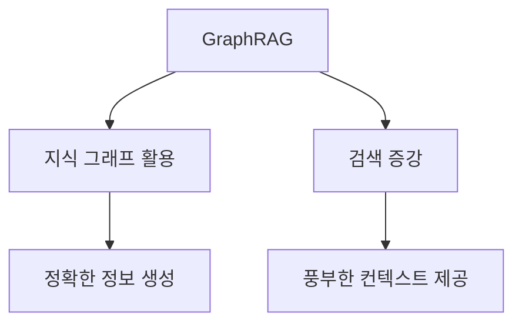

이와 같이 Generative AI 솔루션 구축에 있어 다양한 질문과 그에 대한 답변을 통해 독자들이 보다 명확한 이해를 할 수 있도록 돕는 것이 중요하다.

<!--
## 6. 관련 기술
   - 6.1 대규모 언어 모델 (Large Language Models, LLM)
   - 6.2 전이 학습 (Transfer Learning)
   - 6.3 벡터 데이터베이스 (Vector Databases)
   - 6.4 자연어 처리 (Natural Language Processing, NLP)
-->

## 6. 관련 기술

Generative AI 솔루션을 구축하기 위해서는 여러 관련 기술들이 필수적이다. 이 섹션에서는 대규모 언어 모델, 전이 학습, 벡터 데이터베이스, 그리고 자연어 처리에 대해 살펴보겠다.

**대규모 언어 모델 (Large Language Models, LLM)**

대규모 언어 모델은 방대한 양의 텍스트 데이터를 학습하여 자연어를 이해하고 생성하는 능력을 갖춘 모델이다. 이러한 모델은 다양한 자연어 처리(NLP) 작업에서 뛰어난 성능을 보이며, Generative AI의 핵심 기술로 자리 잡고 있다. LLM은 대량의 데이터를 기반으로 하여 문맥을 이해하고, 질문에 대한 답변을 생성하거나, 텍스트를 요약하는 등의 작업을 수행할 수 있다.

예를 들어, OpenAI의 GPT-3와 같은 모델은 1750억 개의 파라미터를 가지고 있으며, 이는 다양한 언어적 패턴을 학습하는 데 기여한다. 이러한 모델은 기업에서 고객 서비스, 콘텐츠 생성, 데이터 분석 등 다양한 분야에 활용될 수 있다.

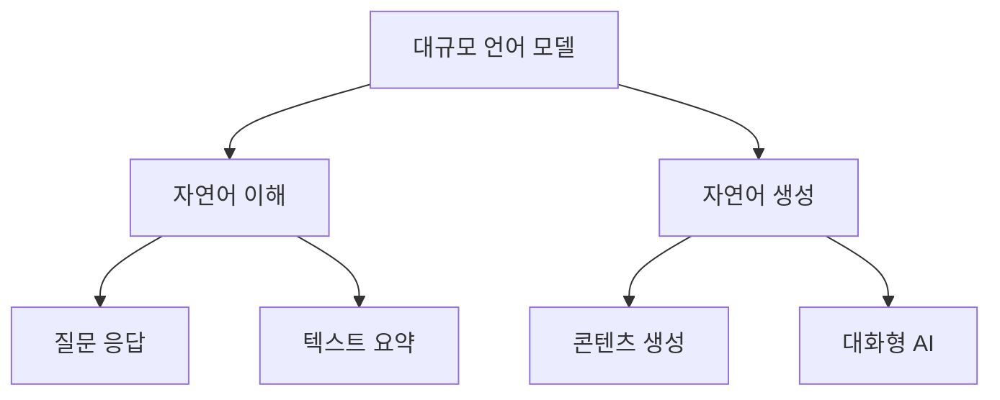

**전이 학습 (Transfer Learning)**

전이 학습은 이미 학습된 모델을 기반으로 새로운 작업에 적응시키는 방법이다. 이는 데이터가 부족한 상황에서도 효과적으로 모델을 학습할 수 있게 해준다. Generative AI에서는 대규모 언어 모델을 사전 학습한 후, 특정 도메인에 맞게 미세 조정하는 방식으로 활용된다.

예를 들어, 의료 분야에서 일반적인 언어 모델을 사용하여 의학적 용어와 문맥을 이해하도록 미세 조정할 수 있다. 이를 통해 모델은 특정 도메인에 대한 높은 정확도를 유지하면서도 적은 데이터로도 효과적으로 학습할 수 있다.

**벡터 데이터베이스 (Vector Databases)**

벡터 데이터베이스는 고차원 벡터를 저장하고 검색하는 데 최적화된 데이터베이스이다. Generative AI에서는 텍스트, 이미지, 오디오 등 다양한 데이터를 벡터 형태로 변환하여 저장하고, 유사한 데이터를 빠르게 검색하는 데 사용된다. 이는 특히 검색 증강 생성(RAG)과 같은 패턴에서 중요한 역할을 한다.

벡터 데이터베이스는 대규모 데이터셋에서 유사한 항목을 찾는 데 매우 효율적이며, 이는 사용자에게 더 나은 검색 결과를 제공하는 데 기여한다.

**자연어 처리 (Natural Language Processing, NLP)**

자연어 처리는 컴퓨터가 인간의 언어를 이해하고 해석하는 기술이다. NLP는 텍스트 분석, 감정 분석, 기계 번역 등 다양한 분야에서 활용되며, Generative AI의 핵심 요소로 자리 잡고 있다. NLP 기술을 통해 모델은 문맥을 이해하고, 자연스러운 언어로 응답을 생성할 수 있다.

NLP의 주요 기술로는 토큰화, 품사 태깅, 개체명 인식 등이 있으며, 이러한 기술들은 대규모 언어 모델과 결합되어 더욱 향상된 성능을 발휘한다.

이와 같은 관련 기술들은 Generative AI 솔루션의 성공적인 구축을 위한 필수 요소이며, 각 기술의 이해와 활용은 기업의 경쟁력을 높이는 데 기여할 것이다.

<!--
## 7. 결론
   - Generative AI의 미래와 기업 아키텍처의 역할
   - 성공적인 Generative AI 솔루션 구축을 위한 제언
   - 지속적인 기술 발전과 기업의 적응 필요성
-->

## 7. 결론

**Generative AI의 미래와 기업 아키텍처의 역할**  

Generative AI는 앞으로도 다양한 산업에서 혁신을 이끌어낼 것으로 예상된다. 기업 아키텍처는 이러한 기술을 효과적으로 통합하고 활용하기 위한 기반을 제공하는 중요한 역할을 한다. 기업은 Generative AI를 통해 고객 경험을 개선하고, 운영 효율성을 높이며, 새로운 비즈니스 모델을 창출할 수 있다. 따라서 기업 아키텍처는 Generative AI의 잠재력을 극대화하기 위해 유연하고 확장 가능한 구조를 갖추어야 한다.

**성공적인 Generative AI 솔루션 구축을 위한 제언** 

Generative AI 솔루션을 성공적으로 구축하기 위해서는 다음과 같은 몇 가지 제언이 있다. 첫째, 데이터의 품질과 양을 확보하는 것이 중요하다. 데이터가 부족하거나 품질이 낮으면 모델의 성능이 저하될 수 있다. 둘째, 도메인 전문가와의 협업을 통해 실제 비즈니스 문제를 이해하고 해결하는 데 집중해야 한다. 셋째, 지속적인 성능 평가와 피드백 루프를 통해 모델을 개선해 나가야 한다. 마지막으로, 기술적 변화에 대한 민첩한 대응이 필요하다.

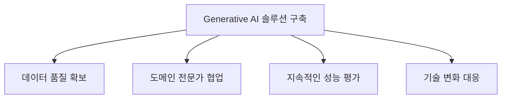

**지속적인 기술 발전과 기업의 적응 필요성**  

Generative AI 기술은 빠르게 발전하고 있으며, 기업은 이러한 변화에 적응해야 한다. 새로운 알고리즘, 모델, 도구들이 지속적으로 등장하고 있기 때문에, 기업은 최신 기술 동향을 주시하고 이를 비즈니스 전략에 반영해야 한다. 또한, 직원들의 기술 역량을 강화하고, 변화에 대한 수용성을 높이는 것이 중요하다. 이를 통해 기업은 경쟁력을 유지하고, Generative AI의 혜택을 최대한 누릴 수 있을 것이다.

<!--
## 8. 참고 자료
   - 관련 논문 및 연구 자료
   - Generative AI 관련 블로그 및 웹사이트
   - 기업 아키텍처 관련 서적 및 자료
-->

## 8. 참고 자료

**관련 논문 및 연구 자료**  
Generative AI와 관련된 연구는 빠르게 발전하고 있으며, 다양한 논문들이 이 분야의 기초와 응용을 다루고 있다. 다음은 추천할 만한 주요 논문들이다.

1. **"Attention is All You Need"** - Vaswani et al. (2017)  
   이 논문은 Transformer 모델의 기초를 다루고 있으며, Generative AI의 발전에 큰 영향을 미쳤다.

2. **"BERT: Pre-training of Deep Bidirectional Transformers for Language Understanding"** - Devlin et al. (2018)  
   BERT 모델은 자연어 처리 분야에서 혁신적인 성과를 거두었으며, Generative AI의 다양한 응용에 활용되고 있다.

3. **"Language Models are Few-Shot Learners"** - Brown et al. (2020)  
   GPT-3 모델에 대한 연구로, 대규모 언어 모델의 가능성과 한계를 탐구하고 있다.

**Generative AI 관련 블로그 및 웹사이트**  
Generative AI에 대한 최신 정보와 사례를 제공하는 블로그와 웹사이트는 다음과 같다.

- **OpenAI 블로그**: OpenAI의 연구 결과와 기술 업데이트를 다루고 있으며, Generative AI의 다양한 응용 사례를 소개한다.
- **Towards Data Science**: 데이터 과학 및 AI 관련 다양한 주제를 다루는 플랫폼으로, Generative AI에 대한 유용한 글들이 많다.
- **Distill.pub**: AI와 머신러닝의 복잡한 개념을 시각적으로 설명하는 블로그로, Generative AI의 원리를 쉽게 이해할 수 있도록 돕는다.

**기업 아키텍처 관련 서적 및 자료**  
기업 아키텍처와 Generative AI의 통합을 이해하는 데 도움이 되는 서적은 다음과 같다.

1. **"Enterprise Architecture at Work"** - Marc Lankhorst  
   기업 아키텍처의 기본 개념과 실무 적용 사례를 다루고 있어, Generative AI 솔루션 구축에 유용하다.

2. **"The Lean Startup"** - Eric Ries  
   스타트업 환경에서의 혁신과 실험을 강조하는 이 책은 Generative AI 솔루션을 기업에 통합하는 데 필요한 접근 방식을 제시한다.

3. **"Architecting the Cloud"** - Michael J. Kavis  
   클라우드 아키텍처의 원칙과 패턴을 설명하며, Generative AI 솔루션을 클라우드 환경에서 효과적으로 구축하는 방법을 다룬다.

위의 자료들은 Generative AI 솔루션 구축에 있어 이론적 배경과 실무적 접근을 모두 포함하고 있어, 독자들이 이 분야에 대한 깊이 있는 이해를 돕는 데 기여할 것이다.

<!--
##### Reference #####
-->

## Reference


* [https://dzone.com/articles/architectural-patterns-for-genai-dsft-rag-raft-graphrag](https://dzone.com/articles/architectural-patterns-for-genai-dsft-rag-raft-graphrag)
* [https://discuss.pytorch.kr/t/raft-rag-llm-rag-finetuning/3842](https://discuss.pytorch.kr/t/raft-rag-llm-rag-finetuning/3842)
* [https://www.deepset.ai/blog/graph-rag](https://www.deepset.ai/blog/graph-rag)
* [https://www.sapien.io/blog/fine-tuning-large-language-models-for-domain-specific-data-labeling-and-annotation-services](https://www.sapien.io/blog/fine-tuning-large-language-models-for-domain-specific-data-labeling-and-annotation-services)
* [https://medium.com/@pranay.janupalli/domain-specific-embedding-models-a-journey-of-adaptation-and-fine-tuning-b2b51f037d17](https://medium.com/@pranay.janupalli/domain-specific-embedding-models-a-journey-of-adaptation-and-fine-tuning-b2b51f037d17)
* [https://techcommunity.microsoft.com/t5/ai-ai-platform-blog/raft-a-new-way-to-teach-llms-to-be-better-at-rag/ba-p/4084674](https://techcommunity.microsoft.com/t5/ai-ai-platform-blog/raft-a-new-way-to-teach-llms-to-be-better-at-rag/ba-p/4084674)


<!--
A best-designed Enterprise Architecture is the backbone for any organization's
IT systems, which support the foundational building blocks to achieve the
organization's business objective. The architecture consists of best
practices, clearly outlined strategies, common frameworks, and guidelines for
the engineering team and other stakeholders to pick the right tool to
accomplish the tasks. Enterprise Architecture is mostly governed by the
architecture team that supports the line of business. In most organizations,
the architecture team is responsible for outlining the architecture patterns
and common frameworks which would help the engineering and product team not to
spend hours of effort in doing proof of concepts, but rather help them to
adopt the strategies to design the core building blocks based on the patterns.

Since [ Generative AI ](https://dzone.com/articles/introduction-generative-ai-
empowering-enterprises) has been transforming the entire landscape, most
organizations are either building Generative AI-based applications or they are
integrating Generative AI capabilities or features into their existing
applications or products. In this article, we will deep dive into the common
architectural patterns that are available for building Generative AI
solutions. We will also be discussing various enterprise-level strategies in
picking the right framework for the right use case.

##  Pattern 1: Domain-Specific Fine Tuning (DSFT)

[ Large Language Models (LLM) ](https://dzone.com/refcardz/getting-started-
with-large-language-models) play an important building block in the
architecture for Enterprise Generative AI. The LLM is responsible for
generating unique content based on the training it has undergone and the
knowledge it has. However, LLMs available from vendors like OpenAI, Microsoft,
or the open-source community lack the knowledge of Enterprise data. Sometimes
in the organization, they have their own standards and principles which should
also be followed while generating the content.

To solve use cases in this space, fine-tuning is one of the strategies which
we can utilize. Fine-tuning involves further training a pre-trained LLM on a
smaller, specialized dataset that is curated to have the enterprise's unique
data, standards, and principles. This process helps tailor the model’s outputs
to align more closely with the organization's requirements, thereby enhancing
its applicability and effectiveness in the enterprise context.

###  What Is Domain-Specific Fine Tuning?

As just stated, fine-tuning Large Language Models (LLMs) involves adapting [
pre-trained language models ](https://dzone.com/articles/transfer-learning-in-
nlp-leveraging-pre-trained-mo) to perform better in specific tasks or areas.
This is done by training the models further using smaller, specialized
datasets made up of ` <input, output> ` pairs. These pairs are examples that
show the desired behavior or output.

During fine-tuning, the model's parameters are updated, which helps bridge the
gap between the general abilities of the pre-trained model and the specific
needs of the task. This process improves the model's performance, making it
more accurate and aligned with human expectations for the given task.

###  Use Cases Where the DSFT Pattern Can Be the Best Candidate

Fine-tuning excels in the area where the organization is looking for more
specialized and domain-specific content generation. If the use case requires
specific standards and style to follow while generating the content, then
"fine-tuning" is a great tool in the toolbox.

For example, let's imagine the customer service department wants to develop an
automated workflow solution to replace a manual process. In the manual
process, the live customer service agents would respond back to the query of
their customers or prospects on their products or services. Currently, live
customer service agents respond to customer or prospect inquiries about
products or services. The agent needs to understand the intent and meaning of
the customer's email, do some research, and then follow company guidelines
when responding. This process typically takes an agent 2 to 3 hours, and the
organization receives a large volume of customer emails inquiring about their
products.

By using fine-tuning, the organization can train an AI model to understand and
respond to these inquiries automatically, following the company’s standards
and guidelines. This can save a significant amount of time and ensure that
responses are consistent and accurate.

Fine-tuning is generally classified as the following:

  * Supervised Fine Tuning (SFT) 
  * Reinforcement Learning from Human Feedback (RLHF) 
  * Parameter Efficient Fine Tuning (PEFT) 
    * Low Rank Adaptation (LoRA) 
    * Quantized Low-Rank Adaptation (QLoRA) 

###  Enterprise Strategy for Fine Tuning Pattern

If we plan to use this pattern for building the next Generative AI
application, the only pitfall is this pattern is a time-consuming and
expensive pattern, though it produces almost the perfect and high-quality
output. It is time-consuming because the LLM needs to be re-trained using any
of the above-mentioned methods which requires preparing the dataset, training
corpus, and human labelers. If the organization's data is dynamic and it gets
updated frequently then this pattern is not advisable because every time there
is a data change, the LLM needs to undergo re-training which would become a
costly solution. If the data is not very dynamic in nature and we are looking
for the LLM to produce high-quality domain-specific output, then fine-tuning
is the best approach.

##  Pattern 2: RAG (Retrieval Augmented Generation)

[ RAG or Retrieval Augmented Generation
](https://dzone.com/articles/optimizing-generative-ai-with-retrieval-
augmented) is one of the popular patterns being used in almost all Enterprise
Generative AI development, as this is one of the most cost-effective patterns
that saves significant development effort for building Gen AI applications.
The basic structure of RAG can be outlined as follows:

  * **R** \- **(R)etrieve** the context based on the similarity search algorithm. 
  * **A** \- **(A)ugment** the retrieved context along with the instruction (Prompt Engineering) for the LLM on what to generate based on the context we are supplying. 
  * **G** \- LLM will **(G)enerate** the content based on the context and the instruction (Prompt Engineering) and send this generated response to the user. 

In the RAG pattern, we integrate a [ vector database
](https://dzone.com/refcardz/getting-started-with-vector-databases) that can
store and index embeddings (numerical representations of digital content). We
use various search algorithms like HNSW or IVF to retrieve the top _k_
results, which are then used as the input context. The search is performed by
converting the user's query into embeddings. The top _k_ results are added to
a well-constructed prompt, which guides the LLM on what to generate and the
steps it should follow, as well as what context or data it should consider.

Once the LLM generates the content based on the prompt and input context, it
goes through a profanity check (optional) or moderation layer. The validated
response is then presented to the user in a human-understandable format.

###  Use Cases Where the “RAG” Pattern Can Be the Best Candidate

RAG is an easy-to-build and cost-effective solution when we need the LLM to
produce content, based on organization-specific data. Since the LLM is not
trained with the organization's private data, and training requires
significant time, we utilize the RAG pattern to build a Gen AI app.

AI-based intelligent enterprise search, virtual assistants, or chatbots that
help customers understand complex documentation, HR chatbots, recommendation
engines, and customer care agents who need to quickly understand procedures to
better assist customers are perfect use cases for RAG.

Some of the popular Enterprise-based use cases are:

  * **HR support by employee training and onboarding: The** RAG pattern can be used to build an HR support application that would deliver customized training materials and answer specific questions to facilitate smooth onboarding processes and thus free up time for the HRs to focus on other areas. 
  * **Healthcare industry:** RAG-based Generative AI applications can support medical professionals with information on various treatment protocols and medical research for better patient care. 
  * **Enterprise knowledge mining and management systems:** RAG can be used to build products to help employees find and retrieve relevant organization-specific information from vast internal content repositories. 
  * **Applications for sales and marketing:** Using RAG, it is easy to build personalized product recommendations and generate content for marketing campaigns or product-related data. 
  * **Technical support applications:** Gen-AI-based applications can summarize troubleshooting steps and relevant technical documentation for customer care agents to resolve issues faster. 

###  Enterprise Strategy for RAG

When the data source is dynamic in nature (meaning we expect the data to be
updated frequently), RAG (Retrieval-Augmented Generation) is an ideal
solution. RAG performs better in environments where data changes regularly
because it allows for real-time updates and ensures that the information
retrieved is always synced with the changes. With RAG, each time the data
source is updated, the embeddings in the vector database must also be updated
during data ingestion to reflect these changes accurately.

Most Enterprise RAG applications have the following two primary workflows in
their architecture:

####  **1\. Data Processing and Ingestion**

This workflow involves the extraction, transformation, and loading (ETL) of
source data into the vector database in the form of embeddings. When new data
is added or existing data is modified, the system processes these changes,
generates new embeddings, and updates the vector database. This ensures that
our vector database remains in sync with the latest information. This workflow
is triggered whenever there are changes in the data source. This allows the AI
system to adapt quickly to new information or changes to existing information.

####  **2\. Retrieval via Similarity Search**

In this workflow, when a user query is received, the system converts the query
into embeddings and performs a similarity search based on ANN, KNN, or another
algorithm against the updated vector database. The top- _k_ results are
retrieved and used as context for generating responses using the help of the
LLM. This ensures that the information provided is relevant and based on the
most recent data.

When there is any change in the data source, only the data processing and
ingestion workflow gets triggered, which syncs the changes and updates the
vector database. By implementing change detection mechanisms within the RAG
architecture, the system can seamlessly synchronize with updates. This ensures
that the retrieval process always uses the most recent data without requiring
a complete overhaul of the entire system.

The RAG pattern provides great benefits to the enterprise because it separates
data syncing from data retrieval. This decoupling means that updates to the
data source can be handled efficiently without disrupting the retrieval
process with zero downtime for users. This kind of modularized architectural
pattern allows for scalability and flexibility. This makes it easier to adapt
to growing data volumes and changing requirements.

This approach is not only cost-effective but also reduces build time, so it is
an efficient choice for enterprises that require up-to-date and accurate
information from dynamic data sources. This architectural pattern helps the
engineering and product team to quickly integrate and synchronize new data to
the AI system. So, for frequently changing data sources, it is always
recommended to go for RAG based approach and not the fine-tuning approach for
providing timely and relevant information that might be needed for decision-
making and operational efficiency.

##  Pattern 3: RA-FT (Retrieval Augmented - Fine Tuning)

RA-FT has been popularized by researchers at Meta, Microsoft, and UC Berkley.
A recent paper published by the team proposes a new framework to tackle the
limitations of both the generic RAG framework and the Domain Specific Fine
Tuning (DSFT) approach.

To explain the framework, the researchers have compared the RAG approach with
an "Open Book Exam" and Fine Tuning with a "Closed Book Exam."

###  Limitation of RAG

In RAG, the context is formed by doing a vector-based [ similarity search
](https://dzone.com/articles/boosting-similarity-search-with-stream-
processing) of an index. This search may bring up documents (or chunks) that
are semantically close to the query but not necessarily meaningful, causing
the LLM to struggle with generating a coherent and meaningful answer. The LLM
doesn’t know which documents are truly relevant and which are misleading.
These “distractor” documents may be included in the LLM's context even when
they are not good sources for a well-reasoned answer.

###  Limitation of DSFT

The researchers also argued that with the DSFT approach, the LLM is limited to
only what it was trained on. It can make guesses and even give incorrect
answers because it doesn't have access to external sources for accurate
information.

###  How Does RA-FT Address the Limitations of DSFT and RAG Patterns?

To solve both the limitations of DSFT and basic RAG, the RA-FT framework
combines the RAG and fine-tuning approaches in a new way. In the RA-FT
approach, the LLM is trained in such a way that it becomes smart enough to
pick out the most useful and relevant documents from the context generated
using the similarity search as part of the retrieval process.

Using RA-FT, when the model is given a question and a batch of retrieved
documents, it is taught to ignore documents that do not help answer the
question. Because of the training it underwent during the fine-tuning process,
the LLM learns how to identify the "distractor" documents and only uses the
useful and non-distractor documents (or chunks) to generate a coherent answer
for the user's query.

In RA-FT, the training data is prepared so that each data point includes a
question, a set of contextually relevant documents, and a corresponding chain-
of-thought style answer. RA-FT combines fine-tuning with this training set
consisting of question-answer pairs, using documents in a simulated imperfect
retrieval scenario. This approach effectively prepares the LLM for open-book
exams. RA-FT is a method for adapting LLMs to read and derive solutions from a
mix of relevant and irrelevant documents.

###  Enterprise Strategy for RA-FT Pattern

Since RAFT consists of both RAG and fine-tuning approaches, the cost is even
higher than the DSFT approach. However, the results are impressive, which
means this technique is suitable in use cases where providing high-quality
output along with grounded data and sources is an essential requirement. This
approach will yield the best results when you might expect to get mixed
results (having both relevant as well as distractor documents/chunks) from the
vector similarity search and you don't want to generate or formulate a
response by LLM based on distractor or not useful documents/chunks. For a
highly regulated industry, this solution would be beneficial to integrate into
the existing Gen AI ecosystem.

##  Pattern 4: Knowledge Graph/RAG Graph

As you know, basic RAG- as well RAFT-based approaches both [ depend heavily on
the underlying vector database ](https://dzone.com/articles/abcs-of-vector-
database-you-should-know-before-int) and the various similarity algorithms
(A-NN or K-NN) it uses to retrieve the chunked dataset to be used as the
context for the LLM to formulate the response. However, the biggest issue this
approach suffers is that when a contextually meaningful large paragraph is
broken into small chunks, it loses the inner meaning and the relation. Due to
this, when the similarity search is performed, it only picks the result set
where the documents (or chunks) have words close to each other based on
relevance. Generic RAG approaches, which primarily rely on vector-based
retrieval, face several limitations such as a lack of deep contextual
understanding and complex reasoning capabilities while generating the
responses for the users.

To address this shortfall, the [ Knowledge Graph
](https://dzone.com/articles/knowledge-graphs-the-secret-weapon-for-rag-apps)
database has emerged as another integral component that can be plugged into
the existing RAG system so that your Generative AI application becomes smarter
while assisting the user with answers. This technique is called GraphRAG where
a different kind of database called Knowledge Graph database is added into the
system which helps to assist the content generation based on the external
domain-specific data when RAG's similarity search has not yielded correct
responses.

###  How Does GraphRAG Work?

GraphRAG is an advanced RAG approach that uses a graph database to retrieve
information for specific tasks. Unlike traditional relational databases that
store structured data in tables with rows and columns, graph databases use
nodes, edges, and properties to represent and store data. This method provides
a more intuitive and efficient way to model, view, and query complex systems.
GraphRAG connects concepts and entities within the content using a knowledge
graph it builds based on the LLM.

####  **Ingestion Flow**

GraphRAG leverages a large language model (LLM) to automatically generate a
detailed knowledge graph from a collection of text documents. This knowledge
graph captures the meaning and structure of the data by identifying and
connecting related concepts. During indexing flow, the system extracts all
entities, relationships, and key claims from the granular text unit by using
an LLM.

It also detects "communities" or "clusters" of closely related nodes,
organizing them at different levels of detail. This helps in understanding the
data's overall semantic structure.

These community-based summaries provide a comprehensive overview of the entire
dataset and a holistic picture of the entire article. This allows the system
to address broad or complex queries that simpler Retrieval-Augmented
Generation (RAG) methods will struggle with.

####  **Retrieval Flow**

When a user asks a question, GraphRAG efficiently retrieves the most relevant
information from the knowledge graph. It then uses this information to guide
and refine the LIAM's response, improving both the accuracy of the answer and
reducing the chances of generating incorrect or misleading information.

###  Enterprise Strategy for GraphRAG Pattern

Like the basic RAG system, GraphRAG also uses a specialized database to store
the knowledge data it generates with the help of an LLM. However, generating
the knowledge graph is more costly compared to generating embeddings and
storing them in a vector database. Therefore, GraphRAG should be used in
scenarios where the basic RAG might struggle to produce accurate answers.

When the source data is highly dynamic (meaning it changes frequently), you
need to rebuild the graph of the corpus and update the graph database
accordingly. Rebuilding the graph database for every change in the source data
can be expensive but necessary to maintain the same comprehensive
understanding.

In an enterprise setting, it is recommended to integrate GraphRAG with the
basic RAG to create a more effective Generative AI system. This way, if the
basic RAG fails to retrieve the desired result, the system can search for
context in the GraphRAG database and generate response for the users instead
of hallucinating or not generating responses when the system has the right
answers and the context but spread out among different chunks or documents
which are not clustered together. Combing GraphRAG with the basic RAG system
makes the AI apps more robust.


-->

<!--


-->

<!--
###
**
PyTorchKR 
**

RAFT(Retrieval Augmented FineTuning, 검색-증강 미세조정/파인튜닝)은 LLM(대규모 언어 모델)이 특정 도메인의
지식을 보다 효과적으로 활용할 수 있도록 하는 새로운 학습 레시피를 소개합니다. 이 연구는 LLM을 법률이나 의료와 같은 특정 분야의
전문적인 지식들을 이해하고 상호 작용하도록 미세조정(FineTuning)할 수 있는 좋은 시작점이 될 것 같습니다.


#  RAFT: 언어 모델에 도메인 특화 RAG 적용하기 (RAFT: Adapting Language Model to Domain
Specific RAG)

##  연구 개요

Retrieval Augmented FineTuning(RAFT, 검색-증강 파인튜닝)는 LLM이 시의적절하거나 특화된 정보를 효율적이고
효과적으로 추가하는 최적화 방안에 초점을 맞춘 연구입니다. 기존의 단순한 파인 튜닝이나 프롬프트 기반 방법과는 달리, RAFT는 더 정교한
전략을 제안합니다. 예를 들어, RAFT는 모델이 검색된 문서 집합에서 질문에 도움이 되지 않는 문서를 무시하도록 학습시킵니다. 이를 통해
모델의 사실 정확성 뿐만 아니라 관련 소스 자료의 논리와 내용을 따르는 응답을 장려함으로써 모델의 추론 능력을 향상시킬 수 있게 됩니다.

RAG(검색-증강 생성)는 언어 모델의 생성 능력과 정보 검색 능력을 결합한 기술로, 언어 모델이 사용자 질의에 대해 응답하기 전 외부
문서나 데이터를 검색한 결과를 활용하여 더 정확한 답변을 생성할 수 있도록 하는 기법입니다. (참고: [ 대규모 언어 모델을 위한 검색-증강
생성(RAG) 기술 현황 - 1/2편 ](https://discuss.pytorch.kr/t/rag-1-2/3135) ) RAFT는 이러한
RAG 기법을 파인튜닝에 적용한 것으로, 특정 도메인에 특화된 LLM을 파인튜닝할 때 도움이 되는 기법입니다.

  

RAFT와 기존의 파인튜닝(FT), RAG를 일종의 Closed-Book과 Open-Book 시험으로 비유하며 설명할 수 있습니다.

###  미세조정(FT, Fine-Tuning) - Closed-Book

미세 조정은 기존에 학습된 모델을 특정 작업이나 도메인에 맞게 추가적으로 학습시키는 과정입니다. 이를 "Closed-Book" 시험에 비유할
수 있습니다. Closed-Book 시험에서는 학생들이 시험 도중에 책이나 외부 자료를 참조할 수 없으며, 모든 답변은 학생이 머릿속에
저장해 둔 지식을 바탕으로 해야 합니다. 마찬가지로, 미세 조정을 거친 모델은 사전 학습 과정에서 습득한 지식을 바탕으로, 추가적인 학습
없이 새로운 작업에 대한 답변을 생성해야 합니다. 여기서는 외부 정보에 실시간으로 접근하는 것이 아니라, 모델이 이미 학습한 정보를 활용하는
것입니다.

###  RAG (Retrieval-Augmented Generation) - Open-Book with Manual Search

RAG는 주어진 질문에 대해 외부 데이터 소스에서 정보를 검색한 후, 그 정보를 바탕으로 답변을 생성하는 과정입니다. 이는 "Open-
Book with Manual Search" 시험에 비유될 수 있습니다. 이런 시험에서 학생들은 참고자료나 책을 사용할 수 있지만, 필요한
정보를 찾기 위해 직접 책을 뒤적여야 합니다. RAG에서 모델은 질문에 대한 답변을 생성하기 위해 먼저 관련 정보를 검색 저장소에서 찾아야
하며, 이후 검색된 정보를 기반으로 답변을 합성합니다. 여기서 중요한 것은 모델이 적절한 정보를 검색하고 이를 활용하여 새로운 답변을
생성하는 능력입니다.

###  RAFT (Retrieval Augmented FineTuning) - Open-Book with Intelligent
Assistant

RAFT는 RAG를 한 단계 더 발전시킨 방법으로, 모델이 더 효율적으로 외부 정보를 검색하고, 그 정보를 바탕으로 더 정확한 답변을
생성하도록 합니다. 이는 "Open-Book with Intelligent Assistant" 시험에 비유할 수 있습니다. 이 시나리오에서
학생들은 시험 동안 책과 외부 자료를 자유롭게 사용할 수 있을 뿐만 아니라, 정보 검색을 돕는 지능형 보조 도구(예: 스마트 검색 시스템)도
사용할 수 있습니다. RAFT에서 모델은 외부 정보를 검색할 때, 단순히 관련 정보를 찾는 것을 넘어서, 주어진 질문에 가장 관련성이 높은
정보를 식별하고, 그 정보를 바탕으로 더 정교한 답변을 생성합니다. 여기서 모델은 외부 정보를 더 효과적으로 활용하여, 질문에 대한 더 깊이
있고 정확한 답변을 제공할 수 있는 능력을 갖춥니다.

##  RAFT 기법 소개


RAFT는 LLM이 도메인 특화 질문을 더 잘 처리할 수 있도록 하는 전략적인 검색 증강 학습의 적응을 소개합니다. 이 때, 두 가지 주요한
접근 방식을 활용합니다:

###  **선택적 정보 검색**

먼저, RAFT는 모델을 질문에 관련된 문서만을 집중적으로 살펴보고, 나머지 문서들은 '무시'하도록 가르치는 데 중점을 둡니다. 즉, 대상
문서들을 식별하고, 관련 없는 문서를 무시함으로써 모델의 주의와 추론이 가장 관련성 높은 데이터에 엄격하게 맞춰지도록 하여, 관련도가 높은
문서와 관련이 없는 문서를 구분하지 않는 방법보다 큰 발전을 이루었습니다.

RAFT가 학습 과정에서 데이터를 활용할 때는 다음과 같이 전체 데이터의 일부(P%)와 나머지((1 − P)%)를 나누는 방식을 사용합니다:

**일부(P%) 데이터** : 전체 데이터의 일부(P%)에 대해서는, 질문(Q)과 가장 관련성이 높은 문서(D*) 뿐만 아니라, 다른 관련
문서(D1, D2, ..., Dk)도 포함하여 학습 데이터로 사용합니다. 그리고 이를 바탕으로 정답(A*)을 예측하는 것이 목표입니다. 이
접근법은 모델이 가장 관련성 높은 정보뿐만 아니라, 추가적인 문서에서 정보를 추출하고 종합하는 능력을 학습할 수 있게 합니다.

**나머지((1 − P)%) 데이터** : 나머지 ((1 − P)%)의 데이터에 대해서는, 첫 번째 문서(D1)를 포함한 모든 관련
문서(D1, D2, ..., Dk)와 질문(Q)을 사용하여 학습을 진행합니다. 이 때, 질문에 대답하기 위해 필요한 가장 관련성이 높은 문서
D*는 특별히 강조되지 않으며, 모든 문서가 동등하게 처리됩니다. 이 방식은 모델이 다양한 정보 소스로부터 학습하고, 단 하나의 문서에만
의존하지 않는 균형 잡힌 학습을 촉진합니다.

이러한 내용을 수식으로표현하면 다음과 같습니다:

• P% of data: Q + D∗ + D2 + . . . + Dk → A∗  
• (1 − P)% of data: Q + D1 + D2 + . . . + Dk → A∗

이러한 접근 방식은 모델이 문서의 관련성을 판단하고, 다양한 정보 소스로부터 중요한 정보를 추출하여 학습하는 능력을 개발하는 데 도움을
줍니다. RAFT와 같은 시스템에서는 이러한 방식으로 학습 데이터를 다루어 모델이 보다 정확하고 심층적인 답변을 생성할 수 있도록 합니다.

###  **관련 정보 인용**

단순히 관련 문서를 식별하는 것을 넘어, RAFT는 모델이 이 문서들 중에서 질문에 답하는 데 도움이 되는 정확한 문장을 인용하도록
학습시킵니다. 이렇게 관련도가 높은 문서들로부터 특정 구절을 정확하게 인용할 수 있도록 하여, 응답의 사실성(정확성)을 향상시키고, 대상
문서에 대한 더 깊은 이해를 바탕으로 논리적인 답변을 구성할 수 있게 됩니다.

예를 들어, Gorilla APIBench 데이터셋과 같이 이미 답변에 추론이 포함되어 있는 데이터를 활용합니다. 이러한 상세한 추론 답변은
원본 맥락에서의 인용문을 ` ###begin_quote### ` 와 ` ###end_quote### ` 와 같은 키워드에 포함하여 인용문을
바탕으로 답변(결론)에 어떻게 도달했는지를 포함합니다. 이를 통해 모델은 단순히 정보를 반복하는 것이 아니라, 인용문과 관련한 지식을
활용하여 논리적(Chain-of-Thoughts)으로 결론에 이르는 과정을 학습하게 됩니다.

정리하면, RAFT 학습 시에 인용문을 사용함으로써 모델은 답변의 근거를 명확하게 밝히고, 해당 답변이 어떻게 도출되었는지를 학습할 수
있습니다. 이는 모델의 답변이 단순한 추측이나 일반적인 지식에만 기반한 것이 아니라, 구체적인 데이터나 사실에 근거한다는 것을 확인시켜
줍니다. 또한, 이 과정에서 사고의 연쇄(Chain-of-Thoughts) 접근 방식을 사용하면서 모델이 복잡한 질문에 대해 더 깊이 있는
답변을 생성할 수 있도록 돕습니다.

위 그림은 LLM에게 주어진 질문, 문맥, 그리고 답변을 기반으로 논리적인 추론을 제공하도록 요청합니다. 여기서 모델은 질문("The
Oberoi family is part of a hotel company that has a head office in what
city?")에 대한 문맥 정보를 분석하여, 두 개의 인용문을 활용해 답변을 도출합니다.

  1. 첫 번째 인용문은 Oberoi 가족이 호텔 사업에 관련된 인도 가문이며, Oberoi Group과 관련이 있음을 밝힙니다. 
  2. 두 번째 인용문은 Oberoi Group이 델리에 본사를 둔 호텔 회사임을 명시합니다. 

이를 통해 모델은 논리적인 추론 과정을 거쳐 "델리(Delhi)"가 올바른 답변임을 결론지을 수 있습니다. 이 과정은 ` ##Reason:
{reason} ##Answer: {answer} ` 형식을 사용하여 구조화됩니다.

이러한 접근 방식은 LLM이 자신의 추론 과정과 답변을 평가하고, 오류를 식별하여 스스로를 개선할 수 있는 능력을 갖추도록 합니다. 또한,
정확한 문맥 정보를 바탕으로 논리적 추론을 수행함으로써, 모델의 추론 능력을 향상시킵니다.

결과적으로, 모델이 단순히 정답을 맞히는 것을 넘어서, 왜 그 답변이 올바른지를 이해하고 설명할 수 있게 함으로써, 모델의 투명성과 신뢰성을
높이는 데 기여합니다. RAFT에서 ‘GenerateExplanation’ 단계는 모델이 더 정확하고 신뢰할 수 있는 답변을 생성하는 데
중요한 역할을 하며, 이는 최종 사용자에게 더 큰 가치를 제공합니다.

##  결과 정리

RAFT는 PubMed, HotpotQA, 그리고 Gorilla 데이터셋을 포함한 다양한 데이터셋에서 테스트되었으며, 도메인 특화 설정에서
LLM의 성능을 일관되게 개선하는 것으로 나타났습니다. 이 방법은 전통적인 파인 튜닝 및 RAG 접근 방식을 능가하는 성능을 보여주었으며,
응답의 사실 정확성뿐만 아니라 논리적이고 일관된 응답 생성 능력에서도 나아짐을 보였습니다.

RAFT는 특히 도메인 특화 지식을 통합하고 활용하는 새로운 방법론의 필요성을 강조합니다. 이는 정보가 빠르게 변화하는 오늘날의 환경에서
특히 중요한 점입니다. 예를 들어, 최신 의학 연구 결과나 급변하는 기술 트렌드에 대한 정확한 정보를 제공하는 능력은 많은 분야에서 LLM의
활용 가치를 크게 향상시킬 수 있습니다.

##  더 읽어보기

###  RAFT 논문

Pretraining Large Language Models (LLMs) on large corpora of textual data is
now a standard paradigm. When using these LLMs for many downstream
applications, it is common to additionally bake in new knowledge (e.g., time-
critical news, or private...

###  RAFT에 대한 소개 글

[ https://gorilla.cs.berkeley.edu/blogs/9_raft.html
](https://gorilla.cs.berkeley.edu/blogs/9_raft.html)

###  RAFT에 대한 Microsoft의 블로그 글

[ https://techcommunity.microsoft.com/t5/ai-ai-platform-blog/raft-a-new-way-
to-teach-llms ](https://techcommunity.microsoft.com/t5/ai-ai-platform-
blog/raft-a-new-way-to-teach-llms)

###  Gorilla에 포함된 RAFT 코드

  
  

* * *

_이 글은 GPT 모델로 정리한 글을 바탕으로 한 것으로, 원문의 내용 또는 의도와 다르게 정리된 내용이 있을 수 있으니 원문도 함께
참고해주세요! 읽으시면서 어색하거나 잘못된 내용을 발견하시면 덧글로 알려주시기를 부탁드립니다._


[

파이토치 한국 사용자 모임

](https://pytorch.kr/) 이 정리한 이 글이 유용하셨나요? [ 회원으로 가입
](https://discuss.pytorch.kr/signup) 하시면 주요 글들을 이메일

로 보내드립니다! (기본은 Weekly지만 [ Daily로 변경도 가능
](https://discuss.pytorch.kr/my/preferences/emails) 합니다.)

 아래

쪽에 좋아요
 를
눌러주시면 힘이 됩니다~


-->

<!--


-->

<!--
Retrieval augmented generation (RAG) has been lauded as a technique for
getting better answers from LLMs by providing the context from a reliable and
controlled data source. But as RAG has made its way into more and more
production environments, the limitations of baseline RAG have started to show.
Its answers are still based on the verbatim text in the underlying data, and
it often lacks the ability to draw more general and high-level conclusions
about a dataset like a human would.

Microsoft recently open-sourced [ GraphRAG
](https://microsoft.github.io/graphrag/) , and it is proving to be a game
changer in enhancing RAG techniques. 

_ **By combining graph-based techniques at indexing and query time, GraphRAG
is able to return much more informative and contextually relevant answers than
RAG alone.** _

What's more, GraphRAG automates the construction of knowledge graphs using
large language models (LLMs), making the concept more accessible to a broad
user base and opening up the possibility of graph-based RAG to teams working
on AI products.

##  Applications and Use Cases of GraphRAG

When given the ability to ask anything about a subject, users often start with
general questions. For example, to explore a database of earnings calls (the
data we use in the demo linked at the end of this article), users might ask:

  * "What companies are in the dataset?" 
  * "What are the top 5 themes in the data?" 
  * "Which companies are investing in AI?" 

These are all questions that RAG struggles with because the information is not
literally in the data, but must be inferred from the knowledge base as a
whole. GraphRAG, on the other hand, is excellent at answering these questions
– and all questions about the relationship between different entities in the
data in general.

In document collections about a particular domain or topic, many interrelated
ideas and entities are often spread across documents. GraphRAG can map complex
networks of information, providing a comprehensive view of the subject
landscape. This holistic representation helps users find and analyze
information more effectively. Some examples of such domains are:

  * Financial analysis and reporting 
  * Legal document review and contract analysis 
  * Medical research and literature review 
  * News aggregation and summarization 
  * Product reviews and sentiment analysis 

_ **GraphRAG transforms a collection of separate documents into an
interconnected web of knowledge, revealing the underlying structure of
information for a deeper understanding and more effective analysis. ** _

This makes it a powerful tool for anyone working with large, complex
collections of textual information, unearthing insights that might otherwise
remain hidden in the vastness of the data.

##  How Does GraphRAG Work?

At its core, GraphRAG works by constructing a knowledge graph from a given set
of documents. This involves identifying key entities within the texts – such
as people, places, concepts, or events – and representing them as nodes in a
graph structure.

In GraphRAG, and this is a major innovation, the LLM plays a crucial role in
the creation of graphs. Graphs have long fascinated people because of their
superior ability to represent information and complex relationships between
data points. But until now, creating graphs from text documents has been
difficult. This has now changed as LLMs have become much better at information
extraction.

When generating an answer, rather than basing it on a few documents at a time
(as normal RAG would), GraphRAG can access different levels of information
about interconnections in the data. This allows it to take both a birds-eye
view of the entire knowledge base, while also being able to zoom in and
observe more granular connections between data points. 

Here’s the process step by step:

###  Pre-processing and indexing

1\. Ingest textual data and extract entities and their relationships using an
external LLM like GPT-4.

2\. Map entities to one another through edges that contain detailed
information about their relationships. 

3\. Organize relationships and entities into hierarchical "communities" –
semantic clusters of related topics at varying levels of abstraction.

4\. Summarize semantic concepts revealed by the clustered graph.

###  Retrieval and answer generation

5\. Map incoming queries to the top matching context in an iterative process.

6\. Pull relevant entities and relationships into the prompt, thus
dramatically augmenting the context provided to LLM with each query.

7\. Utilize an LLM to generate summarization-focused responses based on the
enriched context.

##  Benefits of GraphRAG at a Glance

Products that use GraphRAG can provide users with a more complete
understanding of complex datasets at varying levels of detail. This technology
enables applications to handle complex queries that traditional RAG systems
struggle with, providing users with richer, more contextually relevant
answers. By implementing GraphRAG, AI product teams can deliver superior
results where traditional approaches fall short. Key benefits for users of
GraphRAG-powered systems include:

  * Comprehensive, contextual answers across complex domains. 
  * The seamless integration of information from multiple documents. 
  * Advanced reasoning about entity relationships and contexts. 
  * Uncovering hidden insights and connections within datasets. 
  * Effective handling of abstract, high-level queries. 
  * Mitigation of misinformation in noisy datasets. 

It's clear that a structured, hierarchical approach to interconnected data and
the entities within it is superior to a purely semantics-based approach, and
that many industries, especially document-heavy ones, are going to benefit
from this innovative technique for document processing.

##  deepset Cloud Demo of GraphRAG on Earnings Call Transcripts 

To experience the power of GraphRAG firsthand, [ check out our latest demo
](https://landing.deepset.ai/graph-rag-vs-rag-demo) comparing quarterly
earnings call transcripts from a wide array of companies across various
sectors, including software, financial services, and automotive. Have a look
at the side-by-side comparison of GraphRAG's graph-assisted approach versus a
traditional RAG setup – and let us know what you think of the results! 🙂

##  What’s Next

GraphRAG is a big step forward in information retrieval technology because it
bridges the gap between traditional RAG systems and graph-based knowledge
structures. As we've described in this article, it handles complex knowledge
base queries better than previous methods. This makes it useful for AI teams,
ML engineers, and product managers working on advanced information retrieval
systems, especially those dealing with volumes of interconnected data.

We'll probably be hearing a lot more about GraphRAG in the coming weeks. We
expect to see many advances in minimizing cost and latency in particular. The
benefits of this technique for information retrieval and insight mining are
immense and waiting to be explored by researchers and industry leaders alike.


-->

<!--


-->

<!--
In the fields of artificial intelligence (AI) and natural language processing
(NLP), large language models (LLMs) have emerged as a transformative force,
reshaping the way we approach data labeling and annotation services. These
powerful models, trained on vast amounts of text data, have the ability to
generate human-like responses, perform complex language tasks, and adapt to
various domains. One of the most promising applications of LLMs lies in their
potential for fine-tuning, which enables them to specialize in specific
domains and deliver enhanced performance in data labeling and annotation
services. Let's take a look at fine-tuning LLMs for domain-specific data
labeling and annotation, exploring techniques, challenges, and best practices,
while also shedding light on related topics that professionals in the field
might find intriguing.

##  Training Pre-Trained LLMs

Fine-tuning LLMs involves training a pre-trained model on a smaller, domain-
specific dataset, allowing it to adapt its knowledge and linguistic patterns
to the specific characteristics and nuances of that domain. By leveraging the
transfer learning capabilities of LLMs, fine-tuning enables the models to
acquire domain expertise and deliver more accurate and contextually relevant
results in data labeling and annotation tasks. This is particularly valuable
in industries such as healthcare, finance, legal, and scientific research,
where domain-specific terminology, jargon, and semantic relationships are
crucial for accurate data interpretation and annotation.

The process of fine-tuning LLMs for domain-specific data labeling and
annotation typically involves several key steps. Firstly, a suitable pre-
trained LLM is selected based on its architecture, training data, and
performance on benchmark tasks. Some popular LLMs used for fine-tuning include
BERT, GPT, and T5, each with its own strengths and characteristics. Next, a
domain-specific dataset is curated, containing representative samples of the
target domain's language and annotations. This dataset serves as the
foundation for fine-tuning the LLM, allowing it to learn the domain-specific
patterns and adapt its knowledge accordingly.

##  The Fine-Tuning Process

During the fine-tuning process, the pre-trained LLM is trained on the domain-
specific dataset using techniques such as supervised learning or transfer
learning. The model's weights are updated to minimize the difference between
its predictions and the ground-truth annotations, gradually aligning its
language understanding and generation capabilities with the domain-specific
requirements. Fine-tuning can be performed on various downstream tasks, such
as named entity recognition, sentiment analysis, text classification, and
sequence labeling, depending on the specific data labeling and annotation
needs of the domain.

One of the key advantages of fine-tuning LLMs for domain-specific data
labeling and annotation is the ability to leverage the model's pre-existing
knowledge and linguistic understanding. By starting from a well-trained LLM,
the fine-tuning process can be more efficient and require less domain-specific
training data compared to training a model from scratch. This is particularly
beneficial in domains where labeled data is scarce or expensive to obtain, as
the fine-tuned LLM can generalize well even with limited examples.

However, fine-tuning LLMs for domain-specific data labeling and annotation
also presents certain challenges that need to be addressed. One significant
challenge is the potential for overfitting, where the fine-tuned model becomes
too specialized to the training data and fails to generalize well to unseen
examples. To mitigate this, techniques such as regularization, early stopping,
and data augmentation can be employed to prevent the model from memorizing the
training data and encourage better generalization.

##  Selecting and Curating Datasets for Large Language Models

Another challenge lies in the selection and curation of the domain-specific
dataset used for fine-tuning. The quality and representativeness of the
dataset directly impact the performance of the fine-tuned LLM. It is crucial
to ensure that the dataset covers a diverse range of examples, captures the
nuances and variations of the domain, and aligns with the specific data
labeling and annotation requirements. Collaboration with domain experts and
iterative refinement of the dataset can help address this challenge and
improve the effectiveness of the fine-tuned model.

##  Benchmarks and Evaluation Metrics

One of the most important parts of the process is the development of domain-
specific benchmarks and evaluation metrics to assess the performance of fine-
tuned LLMs in specific industries or application areas. These benchmarks
provide a standardized way to compare and evaluate different fine-tuning
approaches, facilitating the selection of the most suitable models for
specific data labeling and annotation tasks.

Another emerging trend is the use of multi-task learning and model fusion
techniques in fine-tuning LLMs. Multi-task learning involves training a single
model on multiple related tasks simultaneously, allowing the model to learn
shared representations and benefit from the synergies between tasks. Model
fusion, on the other hand, combines the outputs of multiple fine-tuned LLMs to
obtain a more robust and accurate prediction. These techniques can further
enhance the performance and versatility of fine-tuned LLMs in domain-specific
data labeling and annotation services.

The explainability and interpretability of fine-tuned LLMs is also an
important consideration, particularly in domains where transparency and trust
are critical. Techniques such as attention visualization, feature importance
analysis, and rule extraction can help unravel the decision-making process of
fine-tuned LLMs, providing insights into how they arrive at specific
annotations or predictions. This transparency can build trust among
stakeholders and facilitate the adoption of fine-tuned LLMs in sensitive
domains.

##  A Major Milestone in LLM Development

Fine-tuning large language models for domain-specific data labeling and
annotation services represents a significant milestone in the advancement of
AI and NLP. By adapting the powerful capabilities of LLMs to specific domains,
fine-tuning enables the creation of specialized models that can accurately
understand, interpret, and annotate data in various industries. While
challenges such as overfitting and dataset curation need to be addressed, the
potential benefits of fine-tuned LLMs are immense, ranging from improved
accuracy and efficiency to enhanced contextual understanding and adaptability.

As businesses and organizations increasingly recognize the value of domain-
specific data labeling and annotation, investing in fine-tuning LLMs becomes a
strategic imperative. By embracing this transformative technology and staying
at the forefront of best practices and emerging trends, companies can unlock
new levels of insights, automate complex annotation tasks, and drive
innovation in their respective domains with LLMs.

##  Fine-Tune Your LLMs with Sapien's Domain-Specific Data Labeling Services

Fine-tuning large language models (LLMs) for domain-specific tasks has become
a transformative approach in natural language processing, enabling
organizations to harness the power of these models for their unique
requirements. Sapien recognizes the importance of high-quality, domain-
specific training data in unlocking the full potential of fine-tuned LLMs.

Our data labeling and annotation services excel in curating representative
datasets that capture the nuances and complexities of your target domain. With
our team of over 1M+ contributors, fluent in 235+ languages and dialects, we
provide the expertise and cultural understanding necessary for accurate and
contextually relevant annotations. From question-answering and text
classification to sentiment analysis and semantic segmentation, Sapien has
labeling services to fine-tune your LLMs effectively.

Experience the difference of domain-specific fine-tuning with Sapien. Our
human-in-the-loop approach, combined with advanced techniques like multi-task
learning and model fusion, ensures that your LLMs are optimized for your
specific use cases. Don't compromise on the quality of your training data.
Schedule a consult with Sapien today and unlock the true potential of fine-
tuned LLMs for your organization.


-->

<!--


-->

<!--
#  Domain-Specific Embedding Models: A Journey of Adaptation and Fine-Tuning

Have you ever tried building a search engine tailored to a specific domain,
only to find the results lacking the finesse you expected? Perhaps you
observed mediocre performance or outright disappointment in the relevance of
search results. If this sounds familiar, you’re not alone. The culprit? Your
embedding model might be missing out on the nuances of your domain.

In this blog, we’re diving deep into domain-specific embedding models. We’ll
explore how you can train your very own embedding model to understand the
nuances of your domain, unlocking its true potential.

##  The Need of Domain Adaption:

Imagine building a search engine for medical research articles without
understanding medical terminology or context. It’s like navigating through a
dense forest blindfolded. This lack of domain-specific knowledge cripples the
effectiveness of embedding models in capturing the essence of your data.

##  Domain Adaption of Embedding Model

Domain Adaption of an Embedding model can be done in two stages.  
1\. Adaptive Pretraining  
2\. Task specific finetuning

workflow of domain finetuning of embeddings

##  Prepare Base Embedding

Let’s delve into the process of preparing the base embedding model of your
choice, setting the stage for subsequent domain-specific refinements. The base
embedding model is constructed by integrating a pooling layer with a pre-
trained language model, tailored to suit your specific requirements.

**Pooling Layer Integration:**  
The crux of base embedding preparation lies in the integration of a pooling
layer with the language model. This pivotal step enables the aggregation of
contextualized representations generated by the language model into fixed-
dimensional embeddings. Depending on your desired embedding dimensionality,
the configuration of the pooling layer varies.  
Here are few pooling techniques:

**1\. Mean Pooling:**  
This technique computes the mean of all contextualized token representations,
yielding a consolidated embedding that captures the average semantic essence
of the input text. Mean pooling offers simplicity and computational
efficiency, making it a popular choice in various applications.

**2\. [CLS] Token Pooling:**  
The [CLS] token, a special token introduced by models like BERT, encapsulates
the overall contextual representation of the input sequence. [CLS] token
pooling involves solely utilizing the representation of the [CLS] token as the
embedding output. This approach is particularly suited for tasks requiring a
single, holistic representation of the input sequence.

**3\. Weighted Mean Pooling:**  
In contrast to mean pooling, weighted mean pooling assigns different weights
to individual token representations based on their significance. This enables
the model to prioritize salient tokens, thereby enhancing the discriminative
power of the resulting embeddings. Weighted mean pooling is particularly
advantageous in scenarios where certain tokens carry more semantic weight than
others.

**4\. Max Pooling:**  
Max pooling computes the maximum value across each dimension of the token
representations, capturing the most salient features within the input
sequence. This technique emphasizes the presence of critical information,
making it well-suited for tasks requiring robust feature extraction.

Now getting to domain finetuning:  
**1\. Adaptive Pretraining of Base Embedding:**  
Adaptive Pretraining constitutes the base of our domain adaptation. Herein,
the model undertakes an unsupervised immersion in domain-specific corpora,
employing techniques to draw the underlying semantic and syntactic structures
inherent to the domain.  
There are many techniques for adaptive pretraining of embeddings. Here are
few:  
**i. Masked Language Modelling  
ii. Contrastive Tension  
iii. SimCSE: Simple Contrastive Learning of Sentence Embeddings  
iv. BERT-flow  
v. TSDAE: Using Transformer-based Sequential Denoising Auto-Encoder for
Unsupervised Sentence Embedding **

**2\. Supervised Finetuning:**  
With a domain-pretrained embedding model as the foundation, the process of
supervised finetuning for semantic similarity tasks involves refining the
model on task-specific data. In this case, the focus is on enhancing semantic
similarity. The model undergoes finetuning using labeled data comprising both
positive and negative sentence pairs. Positive pairs aid the model in learning
to represent embeddings that are closer in distance for similar sentences,
while negative pairs guide the model to represent embeddings that are further
apart for dissimilar or irrelevant sentences. This targeted approach not only
optimizes the model’s performance for semantic similarity tasks but also
enhances its ability to discern and differentiate between varying degrees of
similarity within the data.  
Here are some of the techniques:  
**i. GenQ  
ii. GPL **

##  Conclusion

In conclusion, building a search engine tailored to a specific domain can be a
challenging task, especially when the results lack the desired relevance and
finesse. However, by training a domain-specific embedding model, you can
unlock the true potential of your domain and improve the search results’
quality.  
The embedding model is crucial in understanding the nuances of your domain,
and by training it with the right data, you can ensure that it captures the
unique characteristics of your domain. This will help you to provide more
relevant and accurate search results, enhancing the user experience and
engagement.  
In summary, domain-specific embedding models are a powerful tool for improving
the performance of search engines in specific domains. By investing time and
resources in training and refining your embedding model, you can provide a
better search experience for your users and gain a competitive advantage in
your field. So, don’t settle for mediocre search results, and start exploring
the possibilities of domain-specific embedding models today.


-->

<!--


-->

<!--
RAFT: A new way to teach LLMs to be better at RAG

“Retrieval-Augmented Fine-Tuning” combines the benefits of Retrieval-Augmented
Generation and Fine-Tuning for better domain adaptation

By [ Cedric Vidal ](https://www.linkedin.com/in/cedricvidal/) , Principal AI
Advocate, Microsoft

And [ Suraj Subramanian ](https://www.linkedin.com/in/surajsubramanian/) , AI
Advocate, Meta

 Gorilla Student
passing exam (Generated using DALL-E 3)

##  Introduction

One of the most impactful applications of generative AI for businesses is to
create natural language interfaces that have access to existing knowledge.
This means answering questions about specific domains such as banking, legal
and medical. There are currently two main ways to do this. First:  domain-
specific  Fine-tuning (DSF), which means training an existing base model on a
set of documents that represent the domain specific knowledge. Second: RAG
(Retrieval Augmented Generation), which involves storing those documents in a
vector database and (at query time) finding documents based on their semantic
similarity with the question and bringing them into the context of the LLM for
in context learning.

In this article, we will look at the limitations of those two approaches and
how a team of UC Berkeley researchers, [ Tianjun Zhang
](https://www.linkedin.com/in/tianjun-zhang-333bb2126/) and [ Shishir G. Patil
](https://www.linkedin.com/in/shishir-patil/) , may have just discovered a
better approach. The team previously known for [ Gorilla LLM
](https://github.com/ShishirPatil/gorilla) :gorilla: presents this new
approach in their [ RAFT paper ](https://aka.ms/raft-paper) (Retrieval
Augmented Fine Tuning) showing how they used [ Meta Llama 2
](https://llama.meta.com/) and [ Azure AI Studio ](https://ai.azure.com/) to
conduct their research and implement their approach.

The Berkeley team also published a [ blog post ](http://aka.ms/raft-blog-ucb)
about the paper explaining what those advantages and disadvantages are and how
the RAFT approach produces more effective results. The RAFT paper
implementation is available in their [ Github repository ](http://aka.ms/raft-
repo) .

Let’s start by giving an overview of how the RAFT approach works.

##  Understanding the RAFT method

In conventional RAG, when a query is posed to a model, it retrieves a few
documents from an index that are likely to contain the answer. It uses these
documents as the context to generate an answer to the user’s query.

With fine-tuning, the model answers queries like a student writing a
**_closed-book exam._ ** With RAG, this scenario resembles an **_open-book
exam_ ** , where the student has full access to a textbook to find the
answers. Open-book exams are easier to solve than closed-book exams, which
explains the efficacy and popularity of RAG.

Both approaches have limitations. With fine-tuning, the model is not only
limited to what it has been trained on, but it is also subject to
approximation and hallucination. With RAG, the model is grounded but documents
are retrieved merely on their semantic proximity with the query. The model
doesn’t know which documents are truly relevant or are just red herrings.
These “distractor” documents may be pulled into the model’s context even when
they are not good sources for a well-reasoned answer.

Tianjun and Shishir were looking to improve these deficiencies of RAG. They
hypothesized that a student who studies the textbooks before the open-book
exam was likely to perform better than a student who studies the textbook.
Translating that back to LLMs, if a model “studied” the documents beforehand,
could that improve its RAG performance? Their approach – Retrieval Augmented
Fine Tuning – attempts to get the model to study or adapt to a domain before
it is used in a RAG setup.

Using Meta Llama 2 7B language model, they first prepare a synthetic dataset
where each data sample consists of:

  * A question, 
  * A set of documents to refer to (including documents containing relevant information and documents that do not contain any relevant information to answer the question and therefore can safely be ignored), 
  * An answer generated from the documents, 
  * A Chain-of-Thought explanation including excerpts from the relevant documents (generated by a general purpose LLM such as GPT-4, or Llama 2 70B) 

This dataset is used to fine-tune the Llama 2 7B model using standard
supervised training. The model is now better adapted to the domain; it not
only aligns its tone and voice to the domain dataset but is also better at
extracting the useful bits of information from the retrieved context. The
addition of Chain-of-Thought reasoning prevents overfitting and improves
training robustness.

RAFT sits in the middle-ground between RAG and  domain-specific SFT  . It
simultaneously primes the LLM on domain knowledge and style (a la DSF), while
improving the quality of generated answers from the retrieved context. Since
pretrained models like Llama 2 are trained on a diverse set of domains,
techniques like RAFT can make it better suited for niche areas like healthcare
or legal datasets.

##  The RAFT team answers questions

Cedric and Suraj had the opportunity to sit down with Tianjun and Shishir and
ask them a few questions about their work on RAFT.

**Question: Why did you choose Llama 2 7B?**  
Answer: We chose Llama 2 7B because we focus on RAG tasks, where the task
requires a combination of the model's ability to reason, understand language,
have lower-latency inference, and be easily adaptable to diverse settings.
Llama 2 7B fit the bill well- it's a good base model for a lot of the general-
knowledge, question-answering tasks, with encouraging math skills, and the
ability to parse reasonably long documents due to its 4096k pre-training.
Llama 2 7B is also a perfect model for training on 4 A100-40G GPUs and serving
on a single GPU. Thereby in the pareto curve or performance, ease-of-
deployment, and with the right licensing, the Llama 2 model is quite apt for
the RAFT task. With the help of Microsoft AI studio, we are happy to explore
Llama 2 13b or 70b as well.  
  
**Question: What recommendations do you have for people trying to fine-tune
Llama? Any best practices you learnt on the field with fine-tuning LLMs?**  
Answer: Fine-tuning Llama is usually a complex task involving data collection,
data cleaning and actual fine-tuning. In terms of data, we recommend
collecting diverse questions with respect to your domain and constructing
chain-of-thought (CoT) answers (also talked about in our RAFT paper). We also
recommend you store intermediate checkpoints, which would then help with early
stopping. It is also critical to have the fine-tuning learning rate set to at
least a magnitude lower than what was used for pre-training. Other than this,
the usual best-practices of 16-bit precision, not training for more than 3
epochs, using large-batch sizes are also recommended.

  
**Question: Should the fine-tuning be applied to each domain? Or is the fine-
tuned model better at RAG on multiple domains in general?**  
Answer: The fine-tuned model's performance is dependent on the domain
(documents it is trained on) for knowledge but can generalize across domains
for behavior to a certain extent. There is a slight tradeoff between accuracy
vs. generalization. Usually fine-tuning for a domain is a good practice, but
fine-tuning for a limited set of enterprise docs may bring better performance
since the knowledge is strictly narrower.

**Question: What did you think about the Azure AI Studio Fine-tuning system?**  
Answer: The Azure AI fine-tuning system is very user-friendly, from training
data uploading, to hyperparameter selection, to deploying the trained models,
everything is easy to use.  
  
**Question: What are the benefits of AI Studio Fine-tuning?**  
Answer: The biggest benefit is that you do not need to worry about GPUs; Do
not need to handle training platforms; Do not need to worry about model
deployment; One click, easy to use and the performance is great!  
  
**Question: What do you think could be improved in AI Studio Fine-tuning?**  
Answer: As a researcher, it would be interesting if the developer can find
additional peak or insights into the exact fine-tuning recipe happening inside
the system (e.g., if it is Lora or full-parameter fine-tuning, how many GPUs
has been used, what's the different hyperparameters for LoRA, etc)!  
  
**Question: What do you think AI Studio Fine-tuning changes for the
industry?**  
Answer: This could enable the easy fine-tuning and deployment of LLMs for
enterprises, greatly enabling the deployments of custom models for different
enterprises.

##  Azure AI Studio Fine-tuning

The Berkeley team ( [ aka.ms/raft-repo ](https://aka.ms/raft-repo) ) to fine-
tune Meta Llama 2 for their RAFT paper using MaaS (Model as a Service) in
Azure AI Studio.

[ MS Learn ](https://learn.microsoft.com/) has a tutorial explaining how to [
Fine-tune a Llama 2 model in Azure AI Studio ](https://learn.microsoft.com/en-
us/azure/ai-studio/how-to/fine-tune-model-llama) .

So far, fine-tuning has been reserved for ML engineers with excellent
understanding of the latest advancements in generative AI, Python, ML
frameworks, GPUs and Cloud infrastructure. Azure AI Studio is a game changer:
it automates all the technicalities, infrastructure and fine-tuning ML
framework setup to focus on the data preparation.

All it takes is opening the [ AI Studio ](https://ai.azure.com/) ‘s Fine-
tuning wizard [1].


You select which model you want to fine-tune:


You upload the training dataset JSONL file (JSON Lines format):


You select which column is the prompt and which column is the completion:


And finally, select the batch size multiplier, the learning rate and the
number of epochs:


For those parameters, we asked Tianjun and Shishir what they recommend. See
their answer below.

> For fine tuning, we use multiplier of 1, learning rate 0.00002 and epoch of
> 1.

AI Studio is greatly enhancing the capacity for developers and enterprises to
adjust foundational models for their domain specific tasks, a breakthrough
because it significantly reduces the entry barrier and allows them to
concentrate on their expertise, their domain and to let the ML adjustment
infrastructure be handled by the experts.

##  Conclusion

Llama and Azure are creating value for the industry by enabling a new paradigm
of domain-specific AI development. By leveraging the power of open
foundational models, such as Llama 2 and its variants, and providing an easy-
to-use platform for fine-tuning, testing, and deploying them, they are
democratizing access to state-of-the-art natural language processing
capabilities. This will allow developers and enterprises to create innovative
and customized solutions for their specific needs and challenges, without
requiring extensive ML expertise or resources. Llama and Azure are thus paving
the way for a more diverse and inclusive AI ecosystem, where anyone can
benefit from the latest advances in Generative AI and LLMs.

[1] AI Studio Fine-tuning is currently available in US West 3


-->

<!--


-->

