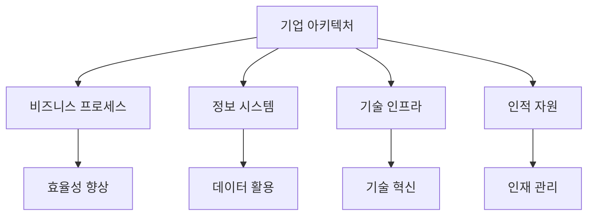
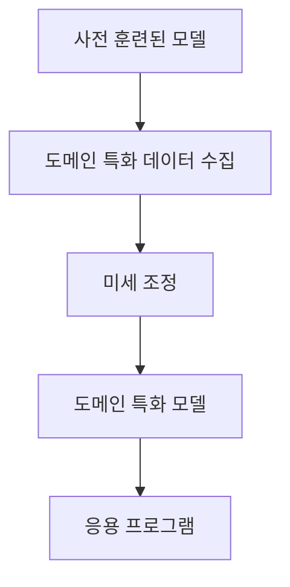
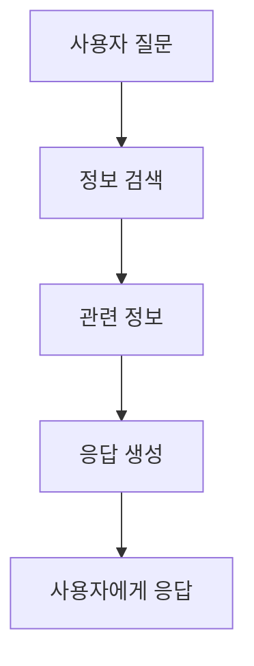
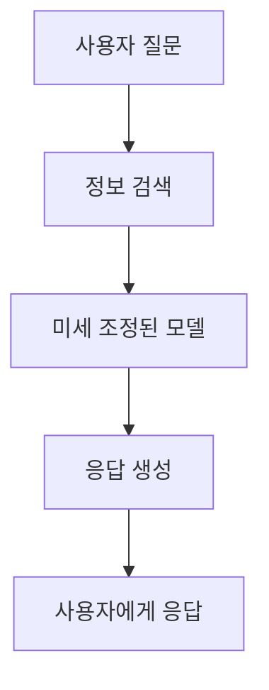
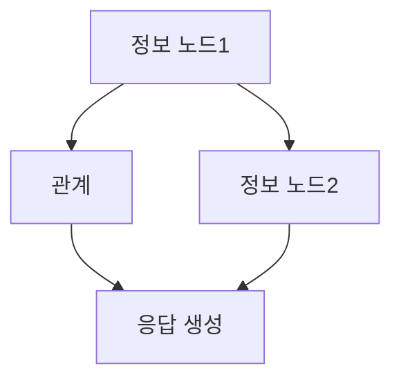
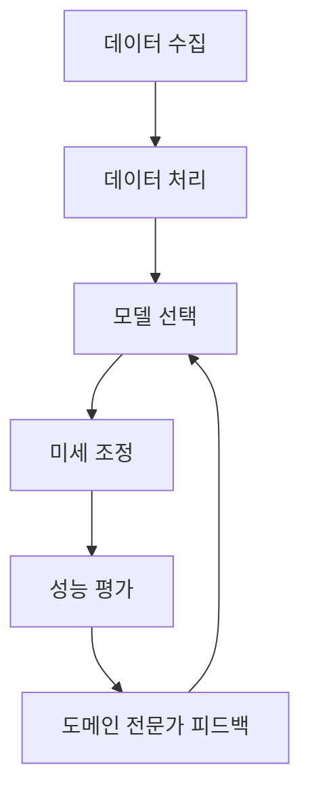
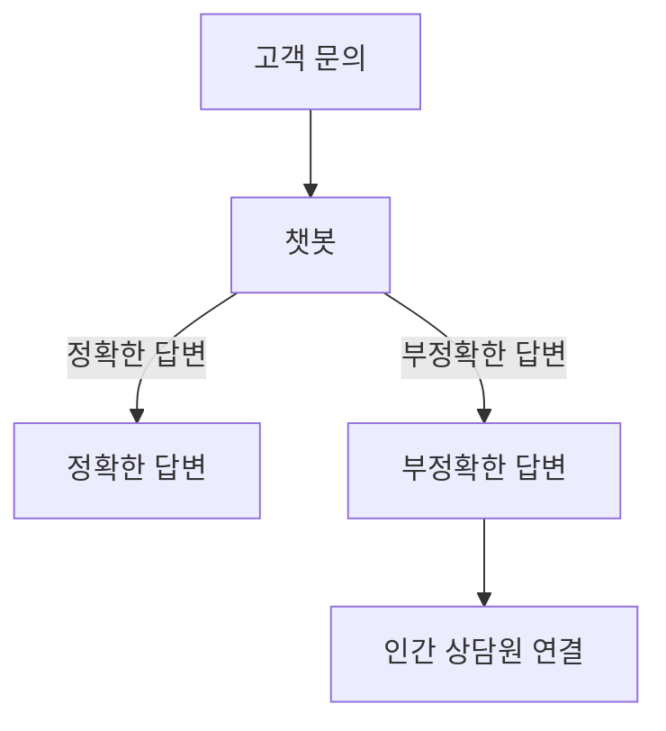
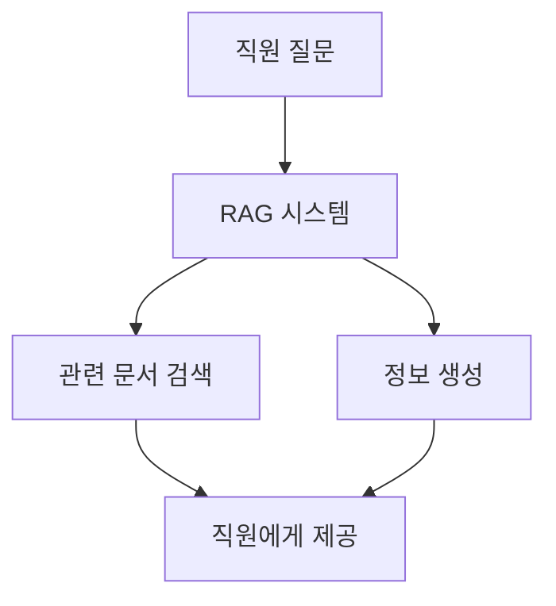
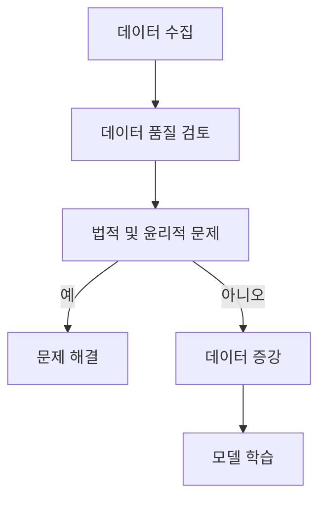
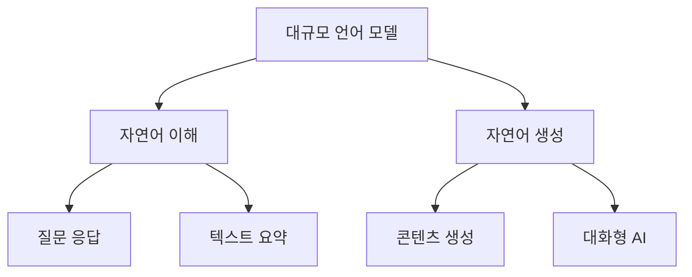

최적의 기업 아키텍처는 조직 IT 시스템의 중추이며, 비즈니스 목표 달성을 위한 기초 구성요소를 지원한다. 아키텍처 팀은 패턴과 공통 프레임워크를 정의해 엔지니어·제품 팀이 PoC에 시간을 낭비하지 않고, 검증된 패턴 기반으로 핵심 구성요소를 설계하도록 돕는다. 생성형 AI(Generative AI)가 환경을 바꾸면서 많은 조직이 Gen AI 기반 앱을 구축하거나 기존 앱에 Gen AI 기능을 통합하고 있다. 이 글에서는 **생성형 AI 솔루션 구축을 위한 아키텍처 패턴**과 **기업 전략·프레임워크 선택**을 다룬다.

## 목차

1. [개요](#개요)
2. [Generative AI 아키텍처 패턴](#generative-ai-솔루션을-위한-아키텍처-패턴) — DSFT, RAG, RA-FT, GraphRAG
3. [구축 전략](#generative-ai-솔루션-구축을-위한-전략) — 데이터·모델·평가·협업
4. [실제 적용 예제](#예제)
5. [FAQ](#faq)
6. [관련 기술](#관련-기술)
7. [결론 및 참고 자료](#결론)

---

## 개요

### 기업 아키텍처의 중요성

기업 아키텍처는 조직의 비전과 목표를 달성하기 위한 전략적 프레임워크다. 비즈니스 프로세스, 정보 시스템, 기술 인프라, 인적 자원 간의 관계를 정의하고 조정하며, 변화하는 시장에 신속히 대응하고 자원 최적화·비용 절감을 가능하게 한다. IT 전략과 비즈니스 목표의 정렬을 통해 비즈니스 가치를 극대화한다.

### Generative AI의 발전과 기업의 대응

Generative AI는 데이터에서 학습해 새로운 콘텐츠를 생성하는 능력을 갖추었고, 고객 서비스·마케팅·제품 개발 등 여러 분야에서 활용된다. 기업은 이를 통해 경쟁력 강화, 고객 경험 개선, 운영 효율 향상의 기회를 얻지만, 단순 기술 도입을 넘어 **아키텍처와 전략 전반의 재정비**가 필요하다.

### 본 글의 목적 및 구성

본 글은 **Generative AI 솔루션 구축을 위한 기업 아키텍처**의 중요성과 **DSFT, RAG, RA-FT, GraphRAG** 등 아키텍처 패턴을 소개한다. 각 패턴의 정의, 사용 사례, 기업 전략을 다루고, 데이터 처리·모델 선택·성능 평가·도메인 전문가 협업 등 구축 전략과 실제 예제, FAQ, 참고 자료를 제시한다.

```mermaid
graph TD
    EnterpriseArch["기업 아키텍처"]
    BizProcess["비즈니스 프로세스"]
    InfoSystem["정보 시스템"]
    TechInfra["기술 인프라"]
    HumanResource["인적 자원"]
    Efficiency["효율성 향상"]
    DataUsage["데이터 활용"]
    TechInnovation["기술 혁신"]
    TalentMgmt["인재 관리"]
    EnterpriseArch --> BizProcess
    EnterpriseArch --> InfoSystem
    EnterpriseArch --> TechInfra
    EnterpriseArch --> HumanResource
    BizProcess --> Efficiency
    InfoSystem --> DataUsage
    TechInfra --> TechInnovation
    HumanResource --> TalentMgmt
```

위 다이어그램은 기업 아키텍처의 주요 구성요소가 효율성·데이터 활용·기술 혁신·인재 관리에 어떻게 기여하는지 보여준다. 이러한 요소는 Gen AI 도입 시 더욱 중요해진다.

---

## Generative AI 솔루션을 위한 아키텍처 패턴

### 2.1 패턴 1: 도메인 특화 미세 조정 (DSFT)

**정의 및 필요성**  
도메인 특화 미세 조정(Domain-Specific Fine Tuning, DSFT)은 사전 훈련된 LLM을 특정 도메인 데이터로 추가 훈련시키는 과정이다. 일반 모델이 특정 도메인에서 성능을 극대화하려면 필수적이며, `<input, output>` 쌍으로 원하는 행동을 학습시킨다. 파라미터가 갱신되어 범용 능력과 태스크별 요구사항 간 간극을 줄이고, 정확도와 기대에 부합하는 출력을 만든다.

**사용 사례**  
의료(진단·치료 추천), 금융, 법률, 고객 서비스 자동화 등 **도메인 특화·특정 표준·스타일이 중요한 콘텐츠 생성**에 적합하다. 예: 고객 이메일 문의에 회사 가이드라인에 맞춰 자동 응답하는 워크플로우(에이전트당 2~3시간 소요를 크게 단축).

**기업 전략**  
DSFT는 **시간·비용이 크고**, 데이터셋·훈련 코퍼스·휴먼 라벨링이 필요하다. **데이터가 자주 바뀌면** 매번 재훈련이 필요해 비추천이다. 데이터가 비교적 정적이고 **고품질 도메인 특화 출력**이 목표일 때 DSFT를 선택하는 것이 좋다.  
미세 조정 유형: Supervised Fine Tuning (SFT), RLHF, PEFT(LoRA, QLoRA) 등.

```mermaid
graph TD
    PreTrainedModel["사전 훈련된 모델"]
    DomainDataCollect["도메인 특화 데이터 수집"]
    FineTuning["미세 조정"]
    DomainModel["도메인 특화 모델"]
    Application["응용 프로그램"]
    PreTrainedModel --> DomainDataCollect
    DomainDataCollect --> FineTuning
    FineTuning --> DomainModel
    DomainModel --> Application
```

### 2.2 패턴 2: 검색 증강 생성 (RAG)

**구조 및 작동 원리**  
RAG(Retrieval Augmented Generation)는 **검색**과 **생성**을 결합한 패턴이다.  
- **R**: 유사도 검색으로 컨텍스트를 **검색(Retrieve)**  
- **A**: 검색된 컨텍스트와 지시(Prompt)를 합쳐 LLM에 **증강(Augment)**  
- **G**: LLM이 컨텍스트와 지시에 따라 응답을 **생성(Generate)**  

벡터 DB에 임베딩을 저장·인덱싱하고, HNSW·IVF 등으로 top-k를 뽑아 프롬프트에 넣는다. (선택) 욕설·검열 레이어를 거친 뒤 사용자에게 전달한다. **구축 비용이 상대적으로 낮고** 조직 전용 데이터 기반 콘텐츠 생성에 널리 쓰인다.

**사용 사례**  
엔터프라이즈 검색, 가상 비서, 문서 이해 챗봇, HR 챗봇, 추천 엔진, 고객 지원(절차·기술 문서 요약) 등.

**기업 전략**  
**데이터 소스가 동적**(자주 갱신)일 때 RAG가 적합하다. 데이터가 바뀔 때마다 임베딩·벡터 DB만 갱신하면 되고, 검색과 데이터 동기화가 분리되어 다운타임 없이 확장·유지보수가 가능하다.  
주요 워크플로: (1) **데이터 처리·수집(ETL)** — 소스 → 임베딩 → 벡터 DB 동기화, (2) **유사도 검색 기반 검색** — 쿼리 임베딩 → ANN/KNN → top-k → LLM 컨텍스트.

```mermaid
graph TD
    UserQuery["사용자 질문"]
    InfoRetrieval["정보 검색"]
    RelatedInfo["관련 정보"]
    ResponseGen["응답 생성"]
    UserResponse["사용자에게 응답"]
    UserQuery --> InfoRetrieval
    InfoRetrieval --> RelatedInfo
    RelatedInfo --> ResponseGen
    ResponseGen --> UserResponse
```

### 2.3 패턴 3: 검색 증강 - 미세 조정 (RA-FT)

**개념 및 장점**  
RA-FT(Retrieval Augmented - Fine Tuning)는 Meta·Microsoft·UC Berkeley 연구진이 제안한 방식으로, **RAG의 한계**(검색된 문서 중 관련 없는 “distractor”가 섞여 LLM이 혼란)와 **DSFT의 한계**(학습된 지식에만 의존·환각 가능)를 함께 완화한다.  
비유: DSFT = **Closed-Book**, RAG = **Open-Book**, RA-FT = **Open-Book + 지능형 보조**(질문에 맞는 문서만 골라 사용하도록 학습).

**동작**  
RA-FT는 질문·(관련+비관련 문서 묶음)·Chain-of-Thought 스타일 답변으로 구성된 훈련 데이터로 미세 조정한다. 모델은 **질문에 도움이 안 되는 문서는 무시**하고, 유용한 문서만 사용해 일관된 답을 생성하도록 학습한다.

**기업 전략**  
RAG+미세 조정이라 **비용이 DSFT보다 더 높을 수 있으나**, 근거 있는 고품질 출력이 필수인 규제 산업(의료·법률·금융)이나, 검색 결과에 관련·비관련 문서가 섞일 때 distractor 기반 응답을 막고 싶을 때 유리하다.

```mermaid
graph TD
    UserQueryB["사용자 질문"]
    InfoRetrievalB["정보 검색"]
    FineTunedModel["미세 조정된 모델"]
    ResponseGenB["응답 생성"]
    UserResponseB["사용자에게 응답"]
    UserQueryB --> InfoRetrievalB
    InfoRetrievalB --> FineTunedModel
    FineTunedModel --> ResponseGenB
    ResponseGenB --> UserResponseB
```

### 2.4 패턴 4: 지식 그래프 / GraphRAG

**정의 및 작동 원리**  
기본 RAG·RA-FT는 벡터 DB와 유사도 검색에 크게 의존한다. **긴 문단을 작은 청크로 자르면** 의미와 관계가 끊겨, 단어 유사도 위주 검색만으로는 깊은 맥락·복잡한 추론이 부족하다.  
**GraphRAG**는 **지식 그래프**를 도입해, 엔티티·관계·커뮤니티(클러스터)를 추출하고 계층적으로 요약해 저장한다.  
- **Ingestion**: LLM으로 문서에서 엔티티·관계·주장 추출 → 노드·엣지·커뮤니티 구축 → 시맨틱 요약  
- **Retrieval**: 질의에 맞는 컨텍스트를 그래프에서 찾아 LLM에 제공 → 더 정확하고 맥락 있는 답변 생성  

넓은 질의(예: “데이터셋 내 상위 5개 테마”, “어떤 회사들이 AI에 투자하는가”)처럼 **여러 문서에 걸친 추론**이 필요한 경우 기본 RAG로는 어렵고, GraphRAG가 유리하다.

**사용 사례**  
금융 분석·리포트, 법률 문서 검토, 의료 문헌 리뷰, 뉴스 집계·요약, 제품 리뷰·감성 분석 등 **문서 간 관계·구조가 중요한 도메인**.

**기업 전략**  
지식 그래프 구축 비용이 임베딩+벡터 DB보다 크므로, **기본 RAG로 정확한 답이 나오기 어려운 시나리오**에서 GraphRAG를 사용하는 것이 좋다. 소스가 매우 동적이면 그래프 재구축 비용이 커지므로, **기본 RAG + GraphRAG 병행**(RAG 실패 시 그래프에서 컨텍스트 검색)으로 견고한 Gen AI 시스템을 만드는 것을 권장한다.

```mermaid
graph TD
    InfoNode1["정보 노드1"]
    Relation["관계"]
    InfoNode2["정보 노드2"]
    ResponseFromGraph["응답 생성"]
    InfoNode1 --> Relation
    InfoNode1 --> InfoNode2
    Relation --> ResponseFromGraph
    InfoNode2 --> ResponseFromGraph
```

---

## Generative AI 솔루션 구축을 위한 전략

### 3.1 데이터 처리 및 수집 전략

데이터는 Gen AI 솔루션의 핵심이다. 필요한 데이터 종류·양을 명확히 하고, 웹 스크래핑·API·기존 DB 추출 등으로 수집한 뒤 **정제·전처리**(노이즈 제거, 일관성 유지)를 거친다.

### 3.2 모델 선택 및 미세 조정 전략

도메인·태스크에 맞는 모델을 선택할 때 크기·구조·학습 데이터 양을 고려한다. 전이 학습과 미세 조정으로 특정 작업에 최적화하며, LoRA·QLoRA 등 PEFT로 리소스를 줄일 수 있다.

### 3.3 성능 평가 및 벤치마크 설정

정확도, 정밀도, 재현율, F1 등 지표와 도메인별 벤치마크로 성능을 정량 평가하고, 일반화 능력을 검증한다.

### 3.4 도메인 전문가와의 협업

도메인 전문가는 데이터 수집·모델 선택·결과 해석에 핵심적이다. 피드백 루프를 통해 모델을 개선하고 실제 비즈니스 문제 해결에 필요한 인사이트를 확보한다.

```mermaid
graph TD
    DataCollect["데이터 수집"]
    DataProcess["데이터 처리"]
    ModelSelect["모델 선택"]
    FineTuningStrategy["미세 조정"]
    PerfEval["성능 평가"]
    DomainFeedback["도메인 전문가 피드백"]
    DataCollect --> DataProcess
    DataProcess --> ModelSelect
    ModelSelect --> FineTuningStrategy
    FineTuningStrategy --> PerfEval
    PerfEval --> DomainFeedback
    DomainFeedback --> ModelSelect
```

---

## 예제

### 4.1 DSFT: 고객 서비스 자동화

통신사가 FAQ 기반 DSFT로 고객 서비스 챗봇을 구축한 사례. 회사 가이드라인에 맞춰 신속·정확한 응답으로 만족도를 높였다.

```mermaid
flowchart TD
    CustomerInquiry["고객 문의"]
    Chatbot["챗봇"]
    CorrectAnswer["정확한 답변"]
    WrongAnswer["부정확한 답변"]
    HumanAgent["인간 상담원 연결"]
    CustomerInquiry --> Chatbot
    Chatbot -->|"정확한 답변"| CorrectAnswer
    Chatbot -->|"부정확한 답변"| WrongAnswer
    WrongAnswer --> HumanAgent
```

### 4.2 RAG: HR 지원 애플리케이션

직원이 인사 정책·복리후생·교육 프로그램 등을 질문하면 RAG가 관련 문서를 검색하고 요약 정보를 생성해 제공한다.

```mermaid
flowchart TD
    EmployeeQuery["직원 질문"]
    RagSystem["RAG 시스템"]
    DocSearch["관련 문서 검색"]
    InfoGen["정보 생성"]
    ToEmployee["직원에게 제공"]
    EmployeeQuery --> RagSystem
    RagSystem --> DocSearch
    RagSystem --> InfoGen
    DocSearch --> ToEmployee
    InfoGen --> ToEmployee
```

### 4.3 RA-FT: 의료 정보 검색

환자 증상·질문에 대해 의료 지식을 검색하고, 신뢰할 수 있는 정보만 활용해 답변하는 시스템. 의료 서비스 품질 향상에 기여한다.

### 4.4 GraphRAG: 금융 데이터 분석

고객 거래·투자 성향을 그래프로 분석해 맞춤형 투자 상품 추천 및 전략을 제안하는 사례.

---

## FAQ

**Q1. Gen AI 솔루션 구축 시 가장 큰 도전은?**  
데이터의 **품질과 양**이다. 고품질 데이터 부족은 성능 저하와 비즈니스 리스크로 이어진다. 데이터 출처·품질 검토와 필요 시 데이터 증강이 중요하다. 법적·윤리적 이슈도 함께 검토해야 한다.

**Q2. DSFT와 RAG 중 무엇을 선택할까?**  
**도메인 특화·일관된 스타일**이 중요하면 DSFT, **동적·다양한 정보**에 기반한 응답이 중요하면 RAG. 데이터가 자주 바뀌면 RAG, 상대적으로 정적이고 최고 품질이 필요하면 DSFT를 고려한다.

**Q3. 미세 조정에서 데이터 품질은 얼마나 중요한가?**  
매우 중요하다. 고품질 데이터는 정확·신뢰 가능한 출력으로 이어지고, 저품질 데이터는 성능 저하와 잘못된 결과를 유발한다. 신뢰할 수 있는 출처와 적절한 전처리가 필수다.

**Q4. GraphRAG의 장점은?**  
정보의 **구조적 관계**를 활용해 복잡한 쿼리·여러 문서에 걸친 추론에 강하다. 다양한 소스 통합·풍부한 컨텍스트 제공, 관계 시각화로 분석·의사결정을 지원한다.

```mermaid
graph TD
    DataCollectQ["데이터 수집"]
    QualityReview["데이터 품질 검토"]
    LegalCheck["법적 및 윤리적 문제"]
    ResolveIssue["문제 해결"]
    DataAugment["데이터 증강"]
    ModelTrain["모델 학습"]
    DataCollectQ --> QualityReview
    QualityReview --> LegalCheck
    LegalCheck -->|"예"| ResolveIssue
    LegalCheck -->|"아니오"| DataAugment
    DataAugment --> ModelTrain
```

---

## 관련 기술

- **대규모 언어 모델(LLM)**: 방대한 텍스트로 학습해 이해·생성, 질의응답·요약·대화형 AI 등에 활용.
- **전이 학습(Transfer Learning)**: 사전 학습된 모델을 소량 도메인 데이터로 적응시켜, 데이터가 적어도 효과적인 학습 가능.
- **벡터 데이터베이스**: 임베딩 저장·유사도 검색에 최적화. RAG에서 핵심 인프라.
- **자연어 처리(NLP)**: 토큰화, 품사 태깅, 개체명 인식 등과 LLM이 결합해 성능을 높인다.

```mermaid
graph TD
    LLMNode["대규모 언어 모델"]
    NLU["자연어 이해"]
    NLG["자연어 생성"]
    QA["질문 응답"]
    Summarize["텍스트 요약"]
    ContentGen["콘텐츠 생성"]
    ConversationalAI["대화형 AI"]
    LLMNode --> NLU
    LLMNode --> NLG
    NLU --> QA
    NLU --> Summarize
    NLG --> ContentGen
    NLG --> ConversationalAI
```

---

## 결론

**Gen AI의 미래와 기업 아키텍처**  
Gen AI는 다양한 산업에서 혁신을 이끌 것으로 예상된다. 기업 아키텍처는 이를 효과적으로 통합·활용하기 위한 **유연하고 확장 가능한 구조**를 제공해야 한다.

**성공적인 구축을 위한 제언**  
(1) 데이터 품질·양 확보, (2) 도메인 전문가와 협업, (3) 지속적인 성능 평가와 피드백 루프, (4) 기술 변화에 대한 민첩한 대응이 핵심이다.

**지속적 적응**  
새로운 알고리즘·모델·도구가 계속 등장하므로, 동향을 주시하고 비즈니스 전략에 반영하며 직원 역량을 강화하는 것이 중요하다.

---

## 참고 자료

- [Architectural Patterns for Enterprise Generative AI: DSFT, RAG, RAFT, GraphRAG](https://dzone.com/articles/architectural-patterns-for-genai-dsft-rag-raft-graphrag) — DZone
- [RAFT: A new way to teach LLMs to be better at RAG](https://techcommunity.microsoft.com/t5/ai-ai-platform-blog/raft-a-new-way-to-teach-llms-to-be-better-at-rag/ba-p/4084674) — Microsoft Tech Community
- [GraphRAG: Using Knowledge Networks to Improve Retrieval and Generation](https://www.deepset.ai/blog/graph-rag) — deepset
- [RAFT: RAG 기법을 활용한 LLM 검색 증강형 미세조정](https://discuss.pytorch.kr/t/raft-rag-llm-rag-finetuning/3842) — PyTorch KR
- [Fine-Tuning LLMs for Domain-Specific Data Labeling](https://www.sapien.io/blog/fine-tuning-large-language-models-for-domain-specific-data-labeling-and-annotation-services) — Sapien
- [Domain-Specific Embedding Models: Adaptation and Fine-Tuning](https://medium.com/@pranay.janupalli/domain-specific-embedding-models-a-journey-of-adaptation-and-fine-tuning-b2b51f037d17) — Medium

**논문·추가 자료**  
- Vaswani et al., "Attention is All You Need" (2017) — Transformer 기반  
- Devlin et al., "BERT: Pre-training of Deep Bidirectional Transformers for Language Understanding" (2018)  
- Brown et al., "Language Models are Few-Shot Learners" (2020) — GPT-3  
- Marc Lankhorst, "Enterprise Architecture at Work" — 기업 아키텍처 실무  
- Michael J. Kavis, "Architecting the Cloud" — 클라우드·Gen AI 구축 참고
