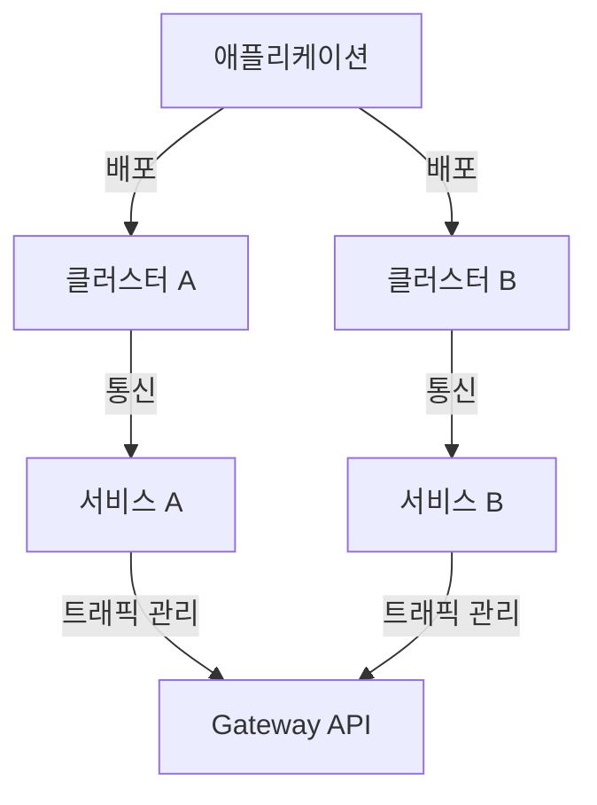
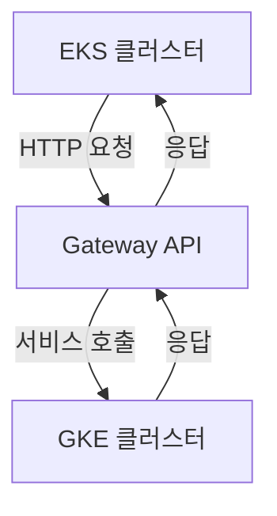
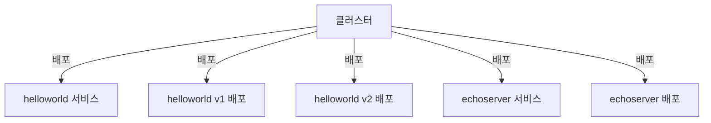
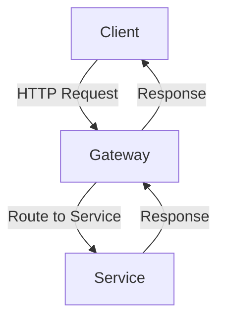
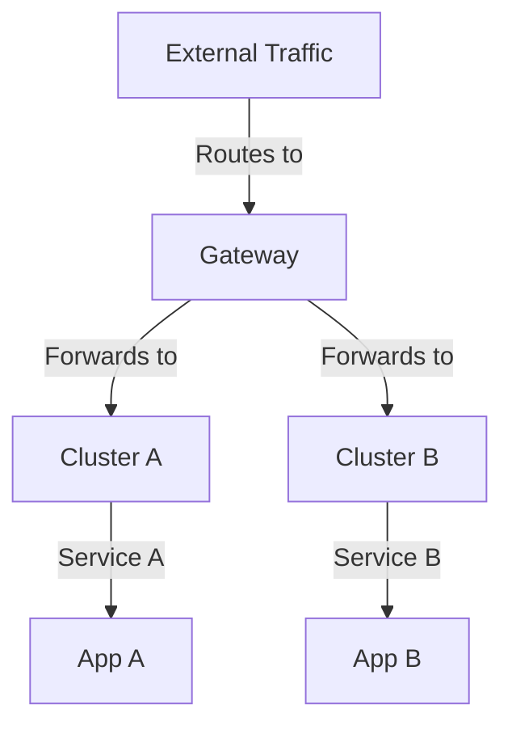
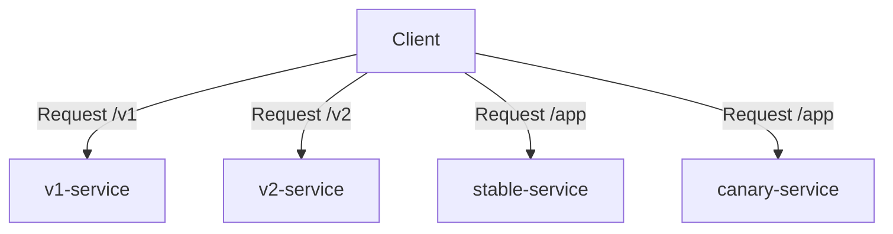
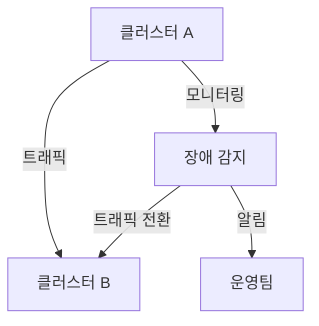
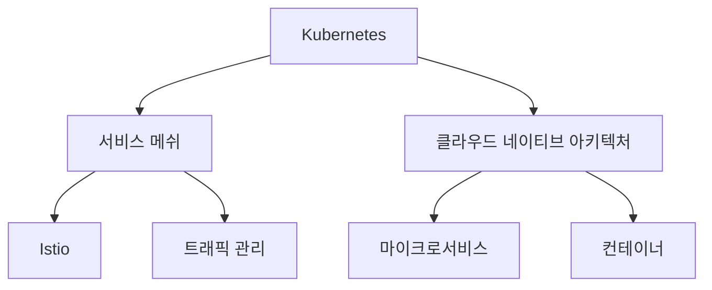
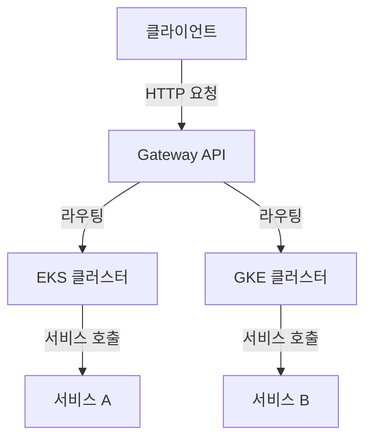

Kubernetes Gateway API는 CNCF에서 발표한 새로운 사양으로, Kubernetes Ingress 트래픽을 표준화하는 데 목적이 있다. 이제 서비스가 고가용성(HA)으로 구성되어 있다고 가정해 보자. (예를 들어, 다른 클라우드 환경에 있으며 Gateway를 통해 접근해야 하는 경우, 즉 멀티 클러스터, 멀티 클라우드 시나리오에서) 이 글에서는 Gateway API 사양을 사용하여 멀티 클러스터 설정을 위한 게이트웨이를 구성하는 방법을 소개할 것이다. 본 데모에서는 EKS(주 클러스터)와 GKE(원격 클러스터) 두 개의 클러스터를 사용하여 Istio를 배포하고, Gateway API 리소스를 구현하는 방법을 보여줄 것이다. 이 과정에서 각 클러스터에 필요한 서비스와 배포를 설정하고, Gateway API 리소스를 통해 두 클러스터 간의 통신을 검증하는 방법을 다룰 것이다. 이를 통해 멀티 클러스터 환경에서의 트래픽 관리와 부하 분산을 효과적으로 수행할 수 있는 방법을 이해할 수 있을 것이다.


||
|:---:|
||


<!--
##### Outline #####
-->

<!--
# Kubernetes Gateway API를 활용한 멀티클러스터 설정

## 개요
- Kubernetes Gateway API 소개
- 멀티클러스터 및 멀티클라우드 환경의 필요성
- 이 글의 목적 및 구성

## 멀티클러스터 Kubernetes Gateway 데모 개요
- 데모 환경 설명
  - EKS(주 클러스터)와 GKE(원격 클러스터)
  - Istio 설치 및 역할
- 데모 진행 계획
  - 서비스 및 배포 구성
  - Gateway API 리소스 배포

## 클러스터에서 애플리케이션 및 서비스 배포
- 서비스 및 배포 파일 설명
  - `helloworld-service.yaml`
  - `helloworld-deployment-v1.yaml` 및 `helloworld-deployment-v2.yaml`
  - `echoserver-service.yaml` 및 `echoserver-deployment.yaml`
- 클러스터에 서비스 및 배포 적용
- 배포 확인 방법

## K8s Gateway API 리소스 배포 및 멀티클러스터 통신 검증
- Gateway 리소스 배포
  - Istio를 컨트롤러로 사용하는 방법
- HTTPRoute 리소스 배포
  - 경로 및 백엔드 서비스 설정
- 멀티클러스터 통신 검증
  - Gateway IP 확인 및 요청 테스트

## 멀티클러스터 게이트웨이 설정
- 멀티클러스터 게이트웨이의 개념
- GKE Gateway Controller 사용
- 멀티클러스터 서비스 및 게이트웨이 설정 방법

## 보안 및 트래픽 관리
- Gateway API에서 TLS 설정 방법
- 트래픽 분할 및 라우팅 정책
- 블루-그린 배포 및 트래픽 미러링

## 예제
- 멀티클러스터 환경에서의 실제 예제
  - HTTPRoute를 통한 트래픽 분할
  - 개발 및 테스트 환경에서의 트래픽 관리

## FAQ
- Gateway API와 기존 Ingress의 차이점은 무엇인가요?
- 멀티클러스터 환경에서의 장애 조치는 어떻게 하나요?
- Istio와 Gateway API를 함께 사용할 때의 장점은 무엇인가요?

## 관련 기술
- Kubernetes
- Istio
- 서비스 메쉬
- 클라우드 네이티브 아키텍처

## 결론
- 멀티클러스터 및 멀티클라우드 환경에서 Gateway API의 중요성
- 향후 발전 방향 및 커뮤니티 기여 가능성

## 참고 자료
- 공식 Kubernetes Gateway API 문서
- Istio 공식 문서
- 관련 블로그 및 튜토리얼 링크

이 목차는 Kubernetes Gateway API를 활용한 멀티클러스터 설정에 대한 포괄적인 내용을 다루며, 독자가 이 주제에 대해 깊이 이해할 수 있도록 돕기 위해 구성되었습니다.
-->

<!--
## 개요
- Kubernetes Gateway API 소개
- 멀티클러스터 및 멀티클라우드 환경의 필요성
- 이 글의 목적 및 구성
-->

## 개요

Kubernetes Gateway API는 클라우드 네이티브 애플리케이션의 트래픽 관리를 위한 새로운 API로, 기존의 Ingress 리소스보다 더 유연하고 강력한 기능을 제공한다. 이 API는 다양한 서비스 간의 통신을 관리하고, 복잡한 라우팅 규칙을 설정할 수 있도록 돕는다. 특히, 멀티클러스터 및 멀티클라우드 환경에서의 서비스 통합과 관리에 큰 장점을 제공한다.

**Kubernetes Gateway API 소개**  

Kubernetes Gateway API는 서비스 간의 트래픽을 제어하고, 다양한 라우팅 규칙을 설정할 수 있는 API이다. 이 API는 여러 클러스터와 클라우드 환경에서의 서비스 통신을 단순화하고, 관리의 복잡성을 줄여준다. Gateway API는 HTTPRoute, TCPRoute와 같은 리소스를 통해 세밀한 트래픽 제어가 가능하다.

**멀티클러스터 및 멀티클라우드 환경의 필요성**  

현대의 애플리케이션은 종종 여러 클러스터와 클라우드 환경에 걸쳐 배포된다. 이러한 멀티클러스터 및 멀티클라우드 환경은 다음과 같은 이유로 필요하다. 첫째, 장애 조치 및 고가용성을 위한 리던던시를 제공한다. 둘째, 지역적 요구사항에 따라 데이터 센터를 분산하여 지연 시간을 최소화할 수 있다. 셋째, 다양한 클라우드 제공업체의 장점을 활용하여 비용 효율성을 극대화할 수 있다.



**이 글의 목적 및 구성**  

이 글의 목적은 Kubernetes Gateway API를 활용하여 멀티클러스터 환경을 설정하는 방법을 소개하는 것이다. 이를 통해 독자는 Gateway API의 기본 개념을 이해하고, 실제 환경에서의 적용 방법을 배울 수 있다. 글은 다음과 같은 구성으로 진행된다. 첫째, 멀티클러스터 Kubernetes Gateway 데모 환경을 설명하고, 둘째, 클러스터에서 애플리케이션 및 서비스를 배포하는 방법을 다룬다. 셋째, Gateway API 리소스를 배포하고 멀티클러스터 통신을 검증하는 방법을 설명한다. 마지막으로, 멀티클러스터 게이트웨이 설정 및 보안과 트래픽 관리에 대한 내용을 다룰 예정이다.

<!--
## 멀티클러스터 Kubernetes Gateway 데모 개요
- 데모 환경 설명
  - EKS(주 클러스터)와 GKE(원격 클러스터)
  - Istio 설치 및 역할
- 데모 진행 계획
  - 서비스 및 배포 구성
  - Gateway API 리소스 배포
-->

## 멀티클러스터 Kubernetes Gateway 데모 개요

**데모 환경 설명**

이번 데모에서는 Amazon EKS(Elastic Kubernetes Service)를 주 클러스터로, Google GKE(Google Kubernetes Engine)를 원격 클러스터로 설정하여 멀티클러스터 환경을 구성할 것이다. EKS와 GKE는 각각 AWS와 Google Cloud에서 제공하는 관리형 Kubernetes 서비스로, 서로 다른 클라우드 환경에서의 통신을 실현할 수 있다.

EKS와 GKE 간의 통신을 위해 Istio를 설치하고, 이를 통해 서비스 메쉬를 구성할 예정이다. Istio는 클라우드 네이티브 애플리케이션의 트래픽 관리, 보안, 모니터링을 지원하는 서비스 메쉬 플랫폼으로, 멀티클러스터 환경에서의 통신을 원활하게 해준다.



**데모 진행 계획**

데모는 다음과 같은 단계로 진행될 예정이다.

1. **서비스 및 배포 구성**: EKS와 GKE 각각에 배포할 애플리케이션을 정의하고, 이를 위한 Kubernetes 리소스 파일을 작성할 것이다. 예를 들어, `helloworld-service.yaml`과 `helloworld-deployment.yaml` 파일을 통해 간단한 웹 서비스를 배포할 예정이다.

2. **Gateway API 리소스 배포**: Gateway API를 활용하여 EKS 클러스터에서 GKE 클러스터로의 트래픽을 관리할 것이다. 이를 위해 Gateway 리소스와 HTTPRoute 리소스를 정의하고 배포할 예정이다. 이 과정에서 Istio를 컨트롤러로 사용하여 트래픽을 효과적으로 라우팅할 수 있도록 설정할 것이다.

다음은 서비스 및 배포 파일의 예시이다.

```yaml
# helloworld-service.yaml
apiVersion: v1
kind: Service
metadata:
  name: helloworld
spec:
  selector:
    app: helloworld
  ports:
    - protocol: TCP
      port: 80
      targetPort: 8080
```

```yaml
# helloworld-deployment.yaml
apiVersion: apps/v1
kind: Deployment
metadata:
  name: helloworld
spec:
  replicas: 2
  selector:
    matchLabels:
      app: helloworld
  template:
    metadata:
      labels:
        app: helloworld
    spec:
      containers:
        - name: helloworld
          image: my-helloworld-image:latest
          ports:
            - containerPort: 8080
```

이와 같은 방식으로 EKS와 GKE에 필요한 리소스를 설정하고, Gateway API를 통해 멀티클러스터 환경에서의 통신을 검증할 예정이다.

<!--
## 클러스터에서 애플리케이션 및 서비스 배포
- 서비스 및 배포 파일 설명
  - `helloworld-service.yaml`
  - `helloworld-deployment-v1.yaml` 및 `helloworld-deployment-v2.yaml`
  - `echoserver-service.yaml` 및 `echoserver-deployment.yaml`
- 클러스터에 서비스 및 배포 적용
- 배포 확인 방법
-->

## 클러스터에서 애플리케이션 및 서비스 배포

Kubernetes 클러스터에서 애플리케이션과 서비스를 배포하는 과정은 여러 단계로 나뉘며, 각 단계에서 필요한 YAML 파일을 정의하고 적용하는 것이 중요하다. 이 섹션에서는 서비스 및 배포 파일을 설명하고, 클러스터에 이를 적용하는 방법과 배포 확인 방법에 대해 다룬다.

**서비스 및 배포 파일 설명**

1. **`helloworld-service.yaml`**
   이 파일은 `helloworld` 애플리케이션의 서비스를 정의한다. 서비스는 클러스터 내에서 애플리케이션에 대한 접근을 제공하며, 클러스터 외부에서 접근할 수 있도록 설정할 수 있다. 아래는 `helloworld-service.yaml`의 예시이다.

   ```yaml
   apiVersion: v1
   kind: Service
   metadata:
     name: helloworld
   spec:
     selector:
       app: helloworld
     ports:
       - protocol: TCP
         port: 80
         targetPort: 8080
   ```

2. **`helloworld-deployment-v1.yaml` 및 `helloworld-deployment-v2.yaml`**
   이 두 파일은 `helloworld` 애플리케이션의 서로 다른 버전을 배포하는 데 사용된다. 각 배포는 특정 버전의 컨테이너 이미지를 사용하여 애플리케이션을 실행한다. 아래는 `helloworld-deployment-v1.yaml`의 예시이다.

   ```yaml
   apiVersion: apps/v1
   kind: Deployment
   metadata:
     name: helloworld-v1
   spec:
     replicas: 2
     selector:
       matchLabels:
         app: helloworld
         version: v1
     template:
       metadata:
         labels:
           app: helloworld
           version: v1
       spec:
         containers:
           - name: helloworld
             image: myrepo/helloworld:v1
             ports:
               - containerPort: 8080
   ```

   `helloworld-deployment-v2.yaml`는 `version: v2`로 설정된 유사한 구조를 가진다.

3. **`echoserver-service.yaml` 및 `echoserver-deployment.yaml`**
   `echoserver`는 간단한 테스트 서버로, 클러스터 내에서 다른 서비스와의 통신을 검증하는 데 사용된다. 아래는 `echoserver-service.yaml`의 예시이다.

   ```yaml
   apiVersion: v1
   kind: Service
   metadata:
     name: echoserver
   spec:
     selector:
       app: echoserver
     ports:
       - protocol: TCP
         port: 80
         targetPort: 8080
   ```

   `echoserver-deployment.yaml`은 `echoserver` 애플리케이션을 배포하는 파일로, 아래와 같은 구조를 가진다.

   ```yaml
   apiVersion: apps/v1
   kind: Deployment
   metadata:
     name: echoserver
   spec:
     replicas: 2
     selector:
       matchLabels:
         app: echoserver
     template:
       metadata:
         labels:
           app: echoserver
       spec:
         containers:
           - name: echoserver
             image: echoserver:latest
             ports:
               - containerPort: 8080
   ```

**클러스터에 서비스 및 배포 적용**

위에서 설명한 YAML 파일을 클러스터에 적용하기 위해서는 `kubectl apply` 명령어를 사용한다. 각 파일을 순서대로 적용하면 된다.

```bash
kubectl apply -f helloworld-service.yaml
kubectl apply -f helloworld-deployment-v1.yaml
kubectl apply -f helloworld-deployment-v2.yaml
kubectl apply -f echoserver-service.yaml
kubectl apply -f echoserver-deployment.yaml
```

**배포 확인 방법**

배포가 완료된 후, 각 서비스와 배포가 정상적으로 작동하는지 확인하기 위해 다음 명령어를 사용할 수 있다.

1. **서비스 확인**
   ```bash
   kubectl get services
   ```

2. **배포 확인**
   ```bash
   kubectl get deployments
   ```

3. **포드 상태 확인**
   ```bash
   kubectl get pods
   ```

이 명령어들을 통해 각 리소스의 상태를 확인하고, 필요한 경우 로그를 확인하여 문제를 진단할 수 있다.



위의 다이어그램은 클러스터에서 애플리케이션과 서비스가 어떻게 배포되는지를 시각적으로 나타낸 것이다. 각 서비스와 배포가 클러스터 내에서 어떻게 연결되는지를 이해하는 데 도움이 된다.

<!--
## K8s Gateway API 리소스 배포 및 멀티클러스터 통신 검증
- Gateway 리소스 배포
  - Istio를 컨트롤러로 사용하는 방법
- HTTPRoute 리소스 배포
  - 경로 및 백엔드 서비스 설정
- 멀티클러스터 통신 검증
  - Gateway IP 확인 및 요청 테스트
-->

## K8s Gateway API 리소스 배포 및 멀티클러스터 통신 검증

Kubernetes Gateway API를 활용하여 멀티클러스터 환경에서의 통신을 설정하는 과정은 여러 단계로 나뉘어 있다. 이 섹션에서는 Gateway 리소스와 HTTPRoute 리소스를 배포하고, 멀티클러스터 간의 통신을 검증하는 방법에 대해 설명하겠다.

**Gateway 리소스 배포**

Gateway 리소스는 클러스터 외부에서 들어오는 트래픽을 관리하는 역할을 한다. Istio를 컨트롤러로 사용하는 경우, Gateway 리소스를 정의하여 외부 요청을 적절한 서비스로 라우팅할 수 있다. 아래는 Istio Gateway 리소스를 정의하는 샘플 코드이다.

```yaml
apiVersion: networking.x-k8s.io/v1alpha1
kind: Gateway
metadata:
  name: my-gateway
spec:
  gatewayClassName: istio
  listeners:
    - name: http
      port: 80
      protocol: HTTP
      routes:
        - name: my-route
```

위의 코드에서 `gatewayClassName`은 Istio를 사용하고 있음을 나타내며, `listeners` 섹션에서는 HTTP 프로토콜을 사용하는 리스너를 정의하고 있다.

**HTTPRoute 리소스 배포**

HTTPRoute 리소스는 Gateway를 통해 들어오는 요청을 특정 서비스로 라우팅하는 역할을 한다. 아래는 HTTPRoute 리소스를 정의하는 샘플 코드이다.

```yaml
apiVersion: networking.x-k8s.io/v1alpha1
kind: HTTPRoute
metadata:
  name: my-http-route
spec:
  parentRefs:
    - name: my-gateway
  rules:
    - matches:
        - path:
            type: Prefix
            value: /api
      forwardTo:
        - serviceName: my-service
          port: 80
```

위의 코드에서 `parentRefs`는 이 HTTPRoute가 어떤 Gateway에 연결될지를 정의하며, `rules` 섹션에서는 `/api` 경로로 들어오는 요청을 `my-service`로 포워딩하도록 설정하고 있다.

**멀티클러스터 통신 검증**

Gateway와 HTTPRoute 리소스를 배포한 후, 멀티클러스터 간의 통신이 제대로 이루어지는지 검증해야 한다. 이를 위해 Gateway의 IP 주소를 확인하고, 해당 IP로 요청을 보내는 방법을 사용할 수 있다.

Gateway IP를 확인하는 방법은 다음과 같다.

```bash
kubectl get gateway my-gateway -o jsonpath='{.status.addresses[0].ip}'
```

위의 명령어를 통해 Gateway의 IP 주소를 확인한 후, curl 명령어를 사용하여 요청을 테스트할 수 있다.

```bash
curl http://<Gateway_IP>/api
```

이 요청이 성공적으로 처리되면, 멀티클러스터 간의 통신이 정상적으로 이루어지고 있음을 확인할 수 있다.



위의 다이어그램은 클라이언트가 Gateway를 통해 서비스에 요청을 보내고, 응답을 받는 과정을 나타낸다. 이와 같은 방식으로 멀티클러스터 환경에서의 통신을 설정하고 검증할 수 있다.

<!--
## 멀티클러스터 게이트웨이 설정
- 멀티클러스터 게이트웨이의 개념
- GKE Gateway Controller 사용
- 멀티클러스터 서비스 및 게이트웨이 설정 방법
-->

## 멀티클러스터 게이트웨이 설정

**멀티클러스터 게이트웨이의 개념**  

멀티클러스터 게이트웨이는 여러 Kubernetes 클러스터 간의 통신을 관리하고, 외부 트래픽을 적절한 클러스터로 라우팅하는 역할을 한다. 이를 통해 애플리케이션의 가용성과 확장성을 높일 수 있으며, 다양한 클라우드 환경에서의 서비스 통합을 용이하게 한다. 멀티클러스터 환경에서는 각 클러스터가 독립적으로 운영되지만, 게이트웨이를 통해 서로 연결되어 협력할 수 있다.

**GKE Gateway Controller 사용**  

GKE(Google Kubernetes Engine)에서는 Gateway API를 지원하는 Gateway Controller를 제공한다. 이 컨트롤러는 Gateway API 리소스를 관리하고, 클러스터 간의 트래픽을 효율적으로 라우팅하는 데 필요한 기능을 제공한다. GKE Gateway Controller를 사용하면, 멀티클러스터 환경에서의 서비스 배포 및 관리가 간편해진다.

다음은 GKE Gateway Controller를 설치하는 예제 코드이다.

```yaml
apiVersion: v1
kind: Namespace
metadata:
  name: gateway-system
---
apiVersion: apps/v1
kind: Deployment
metadata:
  name: gateway-controller
  namespace: gateway-system
spec:
  replicas: 1
  selector:
    matchLabels:
      app: gateway-controller
  template:
    metadata:
      labels:
        app: gateway-controller
    spec:
      containers:
      - name: gateway-controller
        image: gcr.io/k8s-staging-gateway-api/gateway-controller:latest
        ports:
        - containerPort: 8080
```

**멀티클러스터 서비스 및 게이트웨이 설정 방법**  

멀티클러스터 환경에서 서비스를 설정하기 위해서는 각 클러스터에 필요한 서비스와 게이트웨이를 정의해야 한다. 이를 통해 클러스터 간의 통신을 원활하게 하고, 외부 요청을 적절한 클러스터로 라우팅할 수 있다.

다음은 멀티클러스터 환경에서의 서비스 및 게이트웨이 설정을 위한 예제 코드이다.

```yaml
apiVersion: v1
kind: Service
metadata:
  name: my-service
  namespace: default
spec:
  ports:
  - port: 80
    targetPort: 8080
  selector:
    app: my-app
---
apiVersion: gateway.networking.k8s.io/v1beta1
kind: Gateway
metadata:
  name: my-gateway
  namespace: default
spec:
  gatewayClassName: my-gateway-class
  listeners:
  - name: http
    port: 80
    protocol: HTTP
    routes:
      kind: HTTPRoute
      name: my-route
```

다음은 멀티클러스터 게이트웨이 설정을 시각적으로 나타낸 다이어그램이다.



이와 같이 멀티클러스터 게이트웨이를 설정하면, 각 클러스터의 서비스가 외부 트래픽을 효율적으로 처리할 수 있게 된다. 이를 통해 애플리케이션의 가용성과 성능을 극대화할 수 있다.

<!--
## 보안 및 트래픽 관리
- Gateway API에서 TLS 설정 방법
- 트래픽 분할 및 라우팅 정책
- 블루-그린 배포 및 트래픽 미러링
-->

## 보안 및 트래픽 관리

Kubernetes Gateway API를 활용한 멀티클러스터 환경에서 보안 및 트래픽 관리는 매우 중요한 요소이다. 이 섹션에서는 Gateway API에서 TLS 설정 방법, 트래픽 분할 및 라우팅 정책, 블루-그린 배포 및 트래픽 미러링에 대해 다룰 것이다.

**Gateway API에서 TLS 설정 방법**

TLS(Transport Layer Security)는 데이터 전송 중 보안을 제공하는 프로토콜이다. Gateway API를 사용하여 TLS를 설정하는 방법은 다음과 같다.

1. **TLS 비밀 생성**: 먼저, TLS 인증서와 개인 키를 포함하는 비밀을 생성해야 한다. 다음은 `kubectl`을 사용하여 비밀을 생성하는 예제이다.

   ```bash
   kubectl create secret tls my-tls-secret --cert=path/to/tls.crt --key=path/to/tls.key -n my-namespace
   ```

2. **Gateway 리소스에 TLS 설정 추가**: 생성한 비밀을 Gateway 리소스에 연결하여 TLS를 활성화할 수 있다. 아래는 Gateway 리소스의 예제이다.

   ```yaml
   apiVersion: gateway.networking.k8s.io/v1beta1
   kind: Gateway
   metadata:
     name: my-gateway
     namespace: my-namespace
   spec:
     gatewayClassName: my-gateway-class
     listeners:
       - name: my-listener
         port: 443
         protocol: HTTPS
         tls:
           mode: SIMPLE
           certificateRefs:
             - name: my-tls-secret
   ```

**트래픽 분할 및 라우팅 정책**

트래픽 분할은 여러 버전의 애플리케이션에 트래픽을 분산시키는 방법이다. Gateway API를 사용하여 트래픽을 분할하는 방법은 다음과 같다.

1. **HTTPRoute 리소스 생성**: HTTPRoute를 사용하여 트래픽을 특정 서비스로 라우팅할 수 있다. 아래는 트래픽을 두 개의 서비스로 분할하는 예제이다.

   ```yaml
   apiVersion: gateway.networking.k8s.io/v1beta1
   kind: HTTPRoute
   metadata:
     name: my-http-route
     namespace: my-namespace
   spec:
     parentRefs:
       - name: my-gateway
     rules:
       - matches:
           - path:
               type: Prefix
               value: /
         forwardTo:
           - targetRef:
               name: service-v1
             weight: 80
           - targetRef:
               name: service-v2
             weight: 20
   ```

   위의 예제에서는 `service-v1`에 80%의 트래픽을, `service-v2`에 20%의 트래픽을 분배하고 있다.

**블루-그린 배포 및 트래픽 미러링**

블루-그린 배포는 새로운 버전의 애플리케이션을 배포할 때 기존 버전과 동시에 운영하여 안정성을 높이는 방법이다. Gateway API를 사용하여 블루-그린 배포를 설정하는 방법은 다음과 같다.

1. **HTTPRoute 리소스 설정**: 블루-그린 배포를 위해 두 개의 서비스(블루와 그린)를 설정하고, 트래픽을 블루 서비스로 라우팅한다.

   ```yaml
   apiVersion: gateway.networking.k8s.io/v1beta1
   kind: HTTPRoute
   metadata:
     name: blue-green-route
     namespace: my-namespace
   spec:
     parentRefs:
       - name: my-gateway
     rules:
       - matches:
           - path:
               type: Prefix
               value: /
         forwardTo:
           - targetRef:
               name: blue-service
             weight: 100
   ```

2. **트래픽 미러링**: 트래픽 미러링을 통해 실제 사용자 트래픽을 새로운 버전으로 복제하여 테스트할 수 있다. 아래는 미러링을 설정하는 예제이다.

   ```yaml
   apiVersion: gateway.networking.k8s.io/v1beta1
   kind: HTTPRoute
   metadata:
     name: mirroring-route
     namespace: my-namespace
   spec:
     parentRefs:
       - name: my-gateway
     rules:
       - matches:
           - path:
               type: Prefix
               value: /
         forwardTo:
           - targetRef:
               name: primary-service
             weight: 100
           - targetRef:
               name: secondary-service
             weight: 0
             mirror: true
   ```

   위의 예제에서는 `primary-service`로 모든 트래픽을 보내고, `secondary-service`로는 미러링만 수행한다.

이와 같이 Gateway API를 활용하여 보안 및 트래픽 관리를 효과적으로 수행할 수 있다. 이러한 설정을 통해 멀티클러스터 환경에서 안정적이고 안전한 서비스 운영이 가능해진다.

<!--
## 예제
- 멀티클러스터 환경에서의 실제 예제
  - HTTPRoute를 통한 트래픽 분할
  - 개발 및 테스트 환경에서의 트래픽 관리
-->

## 예제

**멀티클러스터 환경에서의 실제 예제**

멀티클러스터 환경에서 Kubernetes Gateway API를 활용하여 트래픽을 효과적으로 관리하는 방법을 살펴보겠다. 이 예제에서는 HTTPRoute를 통해 트래픽을 분할하고, 개발 및 테스트 환경에서의 트래픽 관리 방안을 제시할 것이다.

**HTTPRoute를 통한 트래픽 분할**

HTTPRoute 리소스를 사용하면 다양한 경로에 따라 트래픽을 분할할 수 있다. 예를 들어, 특정 경로에 대한 요청을 서로 다른 백엔드 서비스로 라우팅할 수 있다. 아래는 HTTPRoute를 설정하는 샘플 코드이다.

```yaml
apiVersion: gateway.networking.k8s.io/v1beta1
kind: HTTPRoute
metadata:
  name: example-route
  namespace: my-namespace
spec:
  parentRefs:
    - name: my-gateway
  rules:
    - matches:
        - path:
            type: Prefix
            value: /v1
      forwardTo:
        - targetRef:
            name: v1-service
            kind: Service
          weight: 80
        - targetRef:
            name: v2-service
            kind: Service
          weight: 20
    - matches:
        - path:
            type: Prefix
            value: /v2
      forwardTo:
        - targetRef:
            name: v2-service
            kind: Service
```

위의 예제에서는 `/v1` 경로로 들어오는 요청의 80%를 `v1-service`로, 20%를 `v2-service`로 전달하도록 설정하였다. 또한 `/v2` 경로로 들어오는 요청은 모두 `v2-service`로 전달된다.

**개발 및 테스트 환경에서의 트래픽 관리**

개발 및 테스트 환경에서는 새로운 기능을 배포할 때 기존 서비스에 영향을 주지 않도록 트래픽을 관리하는 것이 중요하다. 이를 위해 블루-그린 배포 또는 카나리 배포 전략을 사용할 수 있다. 아래는 카나리 배포를 위한 HTTPRoute 설정의 예시이다.

```yaml
apiVersion: gateway.networking.k8s.io/v1beta1
kind: HTTPRoute
metadata:
  name: canary-route
  namespace: my-namespace
spec:
  parentRefs:
    - name: my-gateway
  rules:
    - matches:
        - path:
            type: Prefix
            value: /app
      forwardTo:
        - targetRef:
            name: stable-service
            kind: Service
          weight: 90
        - targetRef:
            name: canary-service
            kind: Service
          weight: 10
```

위의 설정에서는 `/app` 경로로 들어오는 요청의 90%를 `stable-service`로, 10%를 `canary-service`로 전달하도록 설정하였다. 이를 통해 새로운 기능을 점진적으로 배포하고, 문제가 발생할 경우 쉽게 롤백할 수 있다.



위의 다이어그램은 클라이언트가 다양한 경로로 요청을 보내는 모습을 나타낸다. 각 경로에 따라 요청이 적절한 서비스로 전달되는 구조를 시각적으로 표현하였다.

이와 같은 방식으로 멀티클러스터 환경에서 Gateway API를 활용하여 트래픽을 효과적으로 관리할 수 있다. 이를 통해 서비스의 가용성과 안정성을 높일 수 있으며, 개발 및 테스트 과정에서의 유연성을 확보할 수 있다.

<!--
## FAQ
- Gateway API와 기존 Ingress의 차이점은 무엇인가요?
- 멀티클러스터 환경에서의 장애 조치는 어떻게 하나요?
- Istio와 Gateway API를 함께 사용할 때의 장점은 무엇인가요?
-->

## FAQ

**Gateway API와 기존 Ingress의 차이점은 무엇인가요?**

Gateway API는 기존의 Ingress 리소스에 비해 더 많은 기능과 유연성을 제공하는 새로운 API이다. Ingress는 주로 HTTP(S) 트래픽을 처리하는 데 중점을 두고 있으며, 기본적인 라우팅 기능을 제공한다. 반면, Gateway API는 HTTP뿐만 아니라 TCP 및 UDP 트래픽을 지원하며, 더 복잡한 라우팅 규칙과 정책을 설정할 수 있다. 또한, Gateway API는 리소스 간의 관계를 명확하게 정의할 수 있는 구조를 가지고 있어, 여러 서비스 간의 트래픽 흐름을 보다 세밀하게 제어할 수 있다.

예를 들어, Gateway API를 사용하면 다음과 같은 복잡한 라우팅 규칙을 설정할 수 있다:

```yaml
apiVersion: gateway.networking.k8s.io/v1beta1
kind: Gateway
metadata:
  name: example-gateway
spec:
  gatewayClassName: example-gateway-class
  listeners:
    - name: example-listener
      port: 80
      protocol: HTTP
      routes:
        - name: example-route
          path: /example
```

**멀티클러스터 환경에서의 장애 조치는 어떻게 하나요?**

멀티클러스터 환경에서 장애 조치는 각 클러스터의 상태를 모니터링하고, 장애 발생 시 자동으로 트래픽을 다른 클러스터로 전환하는 방식으로 이루어진다. 이를 위해서는 각 클러스터 간의 통신이 원활해야 하며, Gateway API를 통해 트래픽을 관리할 수 있다. 장애 조치를 위한 기본적인 접근 방식은 다음과 같다:

1. **모니터링**: 각 클러스터의 상태를 지속적으로 모니터링하여 장애를 조기에 감지한다.
2. **트래픽 전환**: 장애가 발생한 클러스터의 서비스에 대한 트래픽을 다른 클러스터로 전환한다.
3. **알림 및 대응**: 장애 발생 시 관련 팀에 알림을 보내고, 필요한 경우 수동으로 대응할 수 있도록 한다.

다음은 장애 조치 흐름을 나타내는 다이어그램이다:



**Istio와 Gateway API를 함께 사용할 때의 장점은 무엇인가요?**

Istio와 Gateway API를 함께 사용하면 서비스 메쉬의 강력한 기능과 Gateway API의 유연한 라우팅 기능을 결합할 수 있다. Istio는 트래픽 관리, 보안, 모니터링 등의 기능을 제공하며, Gateway API는 이러한 기능을 보다 세밀하게 제어할 수 있는 인터페이스를 제공한다. 이 조합의 주요 장점은 다음과 같다:

1. **정교한 트래픽 관리**: Istio의 트래픽 관리 기능을 활용하여, Gateway API를 통해 복잡한 라우팅 규칙을 설정할 수 있다.
2. **보안 강화**: Istio의 보안 기능을 통해 Gateway API에서 처리하는 트래픽에 대한 TLS 설정 및 인증을 강화할 수 있다.
3. **모니터링 및 로깅**: Istio의 모니터링 기능을 통해 Gateway API를 통해 흐르는 트래픽을 실시간으로 모니터링하고, 로그를 수집할 수 있다.

이러한 장점 덕분에 Istio와 Gateway API를 함께 사용하면 멀티클러스터 환경에서의 서비스 운영이 더욱 원활해진다.

<!--
## 관련 기술
- Kubernetes
- Istio
- 서비스 메쉬
- 클라우드 네이티브 아키텍처
-->

## 관련 기술

Kubernetes Gateway API를 활용한 멀티클러스터 설정을 이해하기 위해서는 몇 가지 관련 기술에 대한 이해가 필요하다. 이 섹션에서는 Kubernetes, Istio, 서비스 메쉬, 그리고 클라우드 네이티브 아키텍처에 대해 설명하겠다.

**Kubernetes**  

Kubernetes는 컨테이너화된 애플리케이션의 배포, 확장 및 관리를 자동화하는 오픈 소스 플랫폼이다. Kubernetes는 여러 클러스터에서 애플리케이션을 관리할 수 있는 기능을 제공하며, 멀티클러스터 환경에서도 유용하게 사용된다. Kubernetes의 주요 구성 요소로는 Pod, Service, Deployment, ReplicaSet 등이 있으며, 이들은 애플리케이션의 가용성과 확장성을 보장하는 데 중요한 역할을 한다.

**Istio**  

Istio는 서비스 메쉬를 구현하기 위한 오픈 소스 플랫폼으로, 마이크로서비스 간의 통신을 관리하고 보안을 강화하는 데 도움을 준다. Istio는 트래픽 관리, 보안, 모니터링 및 로깅 기능을 제공하여 복잡한 서비스 간의 상호작용을 단순화한다. Istio를 사용하면 멀티클러스터 환경에서도 서비스 간의 통신을 안전하고 효율적으로 관리할 수 있다.

**서비스 메쉬**  

서비스 메쉬는 마이크로서비스 아키텍처에서 서비스 간의 통신을 관리하는 인프라 계층이다. 서비스 메쉬는 서비스 간의 트래픽을 제어하고, 보안 및 모니터링 기능을 제공하여 애플리케이션의 복잡성을 줄인다. 서비스 메쉬를 사용하면 개발자는 비즈니스 로직에 집중할 수 있으며, 인프라 관련 문제를 서비스 메쉬가 처리하게 된다.

**클라우드 네이티브 아키텍처**  

클라우드 네이티브 아키텍처는 클라우드 환경에서 애플리케이션을 설계하고 구축하는 접근 방식이다. 이 아키텍처는 마이크로서비스, 컨테이너, 오케스트레이션, DevOps 등의 원칙을 기반으로 하며, 애플리케이션의 배포 및 확장을 용이하게 한다. 클라우드 네이티브 아키텍처를 통해 기업은 빠르게 변화하는 비즈니스 요구에 대응할 수 있는 유연성을 갖추게 된다.



위의 다이어그램은 Kubernetes, 서비스 메쉬, Istio, 클라우드 네이티브 아키텍처 간의 관계를 나타낸다. 이러한 기술들은 서로 연결되어 있으며, 멀티클러스터 환경에서의 효율적인 애플리케이션 관리를 지원한다.

<!--
## 결론
- 멀티클러스터 및 멀티클라우드 환경에서 Gateway API의 중요성
- 향후 발전 방향 및 커뮤니티 기여 가능성
-->

## 결론

**멀티클러스터 및 멀티클라우드 환경에서 Gateway API의 중요성** 

Kubernetes Gateway API는 멀티클러스터 및 멀티클라우드 환경에서의 서비스 관리를 단순화하고, 유연성을 제공하는 중요한 도구이다. 다양한 클라우드 제공업체와 클러스터 간의 통신을 원활하게 하여, 개발자와 운영팀이 복잡한 네트워크 설정을 신경 쓰지 않고도 애플리케이션을 배포하고 관리할 수 있도록 돕는다. 특히, Gateway API는 서비스 간의 트래픽을 효율적으로 라우팅하고, 보안 설정을 통합하여 관리할 수 있는 기능을 제공한다. 이러한 점에서 Gateway API는 현대의 클라우드 네이티브 아키텍처에서 필수적인 요소로 자리 잡고 있다.

**향후 발전 방향 및 커뮤니티 기여 가능성** 

Gateway API는 현재도 활발히 발전하고 있으며, 커뮤니티의 기여를 통해 더욱 향상될 가능성이 크다. 향후에는 다음과 같은 방향으로 발전할 것으로 예상된다:

1. **기능 확장**: Gateway API의 기능이 더욱 다양해지고, 다양한 클라우드 환경에서의 통합이 강화될 것이다. 예를 들어, 더 많은 인증 및 인가 메커니즘이 추가될 수 있다.
  
2. **사용자 경험 개선**: 사용자 친화적인 인터페이스와 문서화가 이루어져, 개발자들이 Gateway API를 쉽게 이해하고 사용할 수 있도록 할 것이다.

3. **커뮤니티 참여**: 오픈 소스 프로젝트로서, 커뮤니티의 참여가 더욱 활발해질 것이며, 다양한 사용 사례와 경험이 공유될 것이다. 이를 통해 Gateway API의 안정성과 신뢰성이 높아질 것이다.

다음은 Gateway API의 멀티클러스터 환경에서의 트래픽 흐름을 나타내는 다이어그램이다:



이 다이어그램은 클라이언트가 Gateway API를 통해 EKS와 GKE 클러스터에 있는 서비스로 요청을 전달하는 과정을 보여준다. 이러한 구조는 멀티클러스터 환경에서의 유연한 서비스 관리를 가능하게 한다. 

결론적으로, Kubernetes Gateway API는 멀티클러스터 및 멀티클라우드 환경에서의 서비스 관리를 혁신적으로 변화시키고 있으며, 앞으로의 발전 가능성이 무궁무진하다. 커뮤니티의 적극적인 참여와 기여를 통해 더욱 발전할 것으로 기대된다.

<!--
## 참고 자료
- 공식 Kubernetes Gateway API 문서
- Istio 공식 문서
- 관련 블로그 및 튜토리얼 링크
-->

## 참고 자료

**공식 Kubernetes Gateway API 문서**  
Kubernetes Gateway API에 대한 공식 문서는 이 API의 기본 개념, 리소스 구성 및 사용 방법에 대한 포괄적인 정보를 제공한다. 이 문서는 Gateway API의 다양한 기능과 설정 방법을 이해하는 데 큰 도움이 된다. 공식 문서는 다음 링크에서 확인할 수 있다: [Kubernetes Gateway API Documentation](https://kubernetes-sigs.github.io/gateway-api/)

**Istio 공식 문서**  
Istio는 서비스 메쉬를 구현하기 위한 강력한 도구로, Gateway API와 함께 사용할 때 많은 이점을 제공한다. Istio의 공식 문서는 설치 방법, 구성 및 다양한 기능에 대한 정보를 제공하며, Gateway API와의 통합에 대한 내용도 포함되어 있다. 자세한 내용은 다음 링크에서 확인할 수 있다: [Istio Documentation](https://istio.io/latest/docs/)

<!--
##### Reference #####
-->

## Reference


* [https://dzone.com/articles/multicluster-gateways-with-kubernetes-gateway-api](https://dzone.com/articles/multicluster-gateways-with-kubernetes-gateway-api)
* [https://cloud.google.com/kubernetes-engine/docs/how-to/deploying-multi-cluster-gateways?hl=ko](https://cloud.google.com/kubernetes-engine/docs/how-to/deploying-multi-cluster-gateways?hl=ko)
* [https://gateway-api.sigs.k8s.io/concepts/use-cases/](https://gateway-api.sigs.k8s.io/concepts/use-cases/)
* [https://cloud.google.com/kubernetes-engine/docs/how-to/enabling-multi-cluster-gateways?hl=ko](https://cloud.google.com/kubernetes-engine/docs/how-to/enabling-multi-cluster-gateways?hl=ko)
* [https://medium.com/thermokline/how-the-k8s-gateway-api-enables-multi-cluster-backend-development-98d205968065](https://medium.com/thermokline/how-the-k8s-gateway-api-enables-multi-cluster-backend-development-98d205968065)
* [https://ajtatumdigital.com/articles/web-dev/multicluster-gateways-with-kubernetes-gateway-api/](https://ajtatumdigital.com/articles/web-dev/multicluster-gateways-with-kubernetes-gateway-api/)
* [https://imesh.ai/blog/multicluster-gateways-kubernetes-gateway-api/](https://imesh.ai/blog/multicluster-gateways-kubernetes-gateway-api/)

