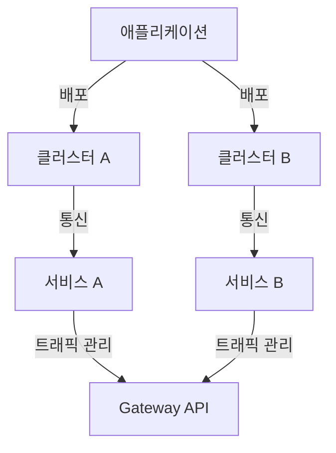
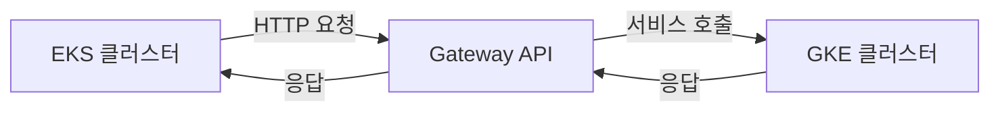
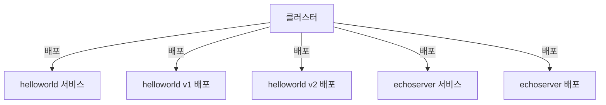
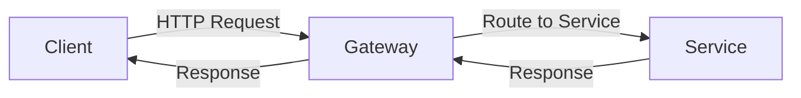
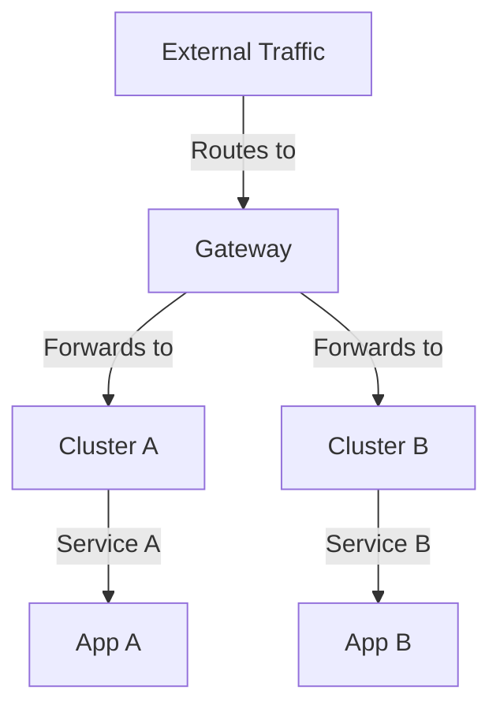
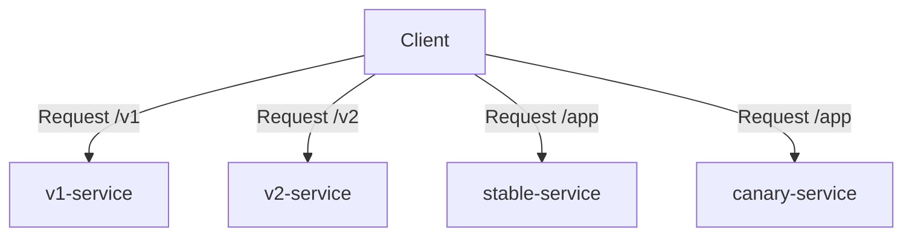
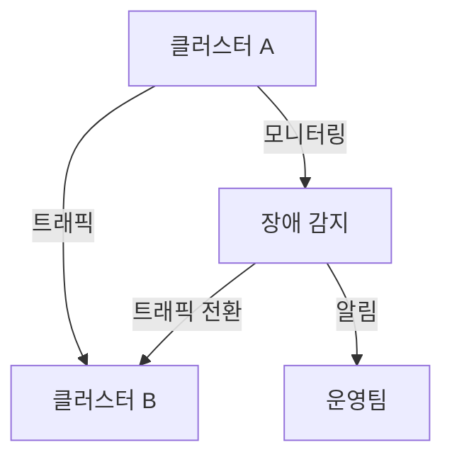
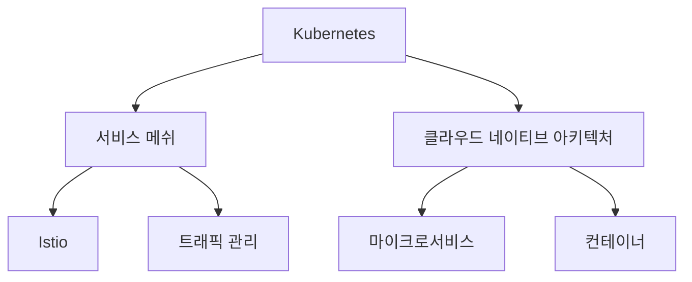
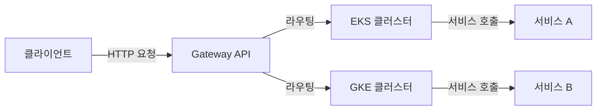

Kubernetes Gateway API는 Kubernetes Network SIG에서 제안한 **Ingress의 진화형**으로, 클러스터 외부 트래픽을 표준화하고 멀티클러스터·멀티클라우드 환경에서의 라우팅을 단일 API로 다룰 수 있게 한다. 이 글에서는 Gateway API 사양을 활용해 EKS(주 클러스터)와 GKE(원격 클러스터)에서 Istio를 사용한 멀티클러스터 게이트웨이 구성을 단계별로 소개하고, 보안·트래픽 관리·실무 예제까지 다룬다.

---

## 개요

### Kubernetes Gateway API란

Kubernetes Gateway API는 **클라우드 네이티브 애플리케이션의 트래픽 관리**를 위한 표준 API로, 기존 Ingress보다 유연한 라우팅·역할 분리·다중 프로토콜 지원을 제공한다. HTTPRoute, TCPRoute, TLSRoute 등을 통해 세밀한 트래픽 제어가 가능하며, 여러 클러스터와 클라우드에 걸친 서비스 통합을 단순화한다.

### 멀티클러스터·멀티클라우드가 필요한 이유

- **고가용성(HA)**: 한 리전·클라우드 장애 시 다른 클러스터로 트래픽 전환
- **지연 최소화**: 사용자와 가까운 리전으로 라우팅
- **비용·정책**: 벤더별 장점 활용, 규정 준수·데이터 거주지 요구 반영

### 이 글의 목적과 구성

- **목적**: Gateway API로 멀티클러스터 게이트웨이를 구성하고 검증하는 방법을 실습 수준에서 소개
- **구성**: 데모 환경 소개 → 애플리케이션·서비스 배포 → Gateway·HTTPRoute 배포 및 통신 검증 → 멀티클러스터 게이트웨이 설정 → 보안·트래픽 관리 → 예제·FAQ·참고 자료


```mermaid
graph TD
  App["애플리케이션"] -->|"배포"| ClusterA["클러스터 A"]
  App -->|"배포"| ClusterB["클러스터 B"]
  ClusterA -->|"통신"| SvcA["서비스 A"]
  ClusterB -->|"통신"| SvcB["서비스 B"]
  SvcA -->|"트래픽 관리"| GatewayApi["Gateway API"]
  SvcB -->|"트래픽 관리"| GatewayApi
```

---

## 멀티클러스터 Kubernetes Gateway 데모 개요

### 데모 환경

- **주 클러스터**: Amazon EKS (Elastic Kubernetes Service)
- **원격 클러스터**: Google GKE (Google Kubernetes Engine)
- **서비스 메쉬**: Istio (primary-remote 구성), Gateway API 컨트롤러로 사용

EKS와 GKE 간 통신을 Istio로 묶고, Gateway API 리소스로 진입점과 라우팅을 정의한다.


```mermaid
graph LR
  EksCluster["EKS 클러스터"] -->|"HTTP 요청"| GatewayApi["Gateway API"]
  GatewayApi -->|"서비스 호출"| GkeCluster["GKE 클러스터"]
  GkeCluster -->|"응답"| GatewayApi
  GatewayApi -->|"응답"| EksCluster
```

### 데모 진행 순서

1. **서비스·배포 구성**: 양쪽 클러스터에 `helloworld`·`echoserver`용 Service·Deployment 배포
2. **Gateway API 리소스 배포**: 주 클러스터(EKS)에 Gateway·HTTPRoute 적용 후, 원격 클러스터(GKE) 서비스까지 도달하는지 검증

---

## 클러스터에서 애플리케이션 및 서비스 배포

### 사용하는 리소스 요약

| 리소스 | 주 클러스터 EKS | 원격 클러스터 GKE |
|--------|-----------------|-------------------|
| helloworld Service | ✓ | ✓ |
| helloworld Deployment v1 | ✓ | — |
| helloworld Deployment v2 | — | ✓ |
| echoserver Service | ✓ | ✓ |
| echoserver Deployment | — | ✓ |

원격에만 배포가 있어도, **서비스 리소스는 양쪽에 두어** Gateway가 백엔드를 찾을 수 있게 한다.

### helloworld-service.yaml

```yaml
apiVersion: v1
kind: Service
metadata:
  name: helloworld
spec:
  selector:
    app: helloworld
  ports:
    - protocol: TCP
      port: 80
      targetPort: 8080
```

### helloworld-deployment v1 / v2

v1은 EKS, v2는 GKE에 배포한다. `version: v1` / `version: v2` 라벨과 이미지만 다르게 두면 된다.

```yaml
# helloworld-deployment-v1 (EKS)
apiVersion: apps/v1
kind: Deployment
metadata:
  name: helloworld-v1
spec:
  replicas: 2
  selector:
    matchLabels:
      app: helloworld
      version: v1
  template:
    metadata:
      labels:
        app: helloworld
        version: v1
    spec:
      containers:
        - name: helloworld
          image: myrepo/helloworld:v1
          ports:
            - containerPort: 8080
```

### echoserver Service·Deployment

echoserver는 원격 클러스터에만 Deployment를 두고, Service는 두 클러스터 모두에 만든다.

```bash
kubectl apply -f helloworld-service.yaml --context=eks-cluster
kubectl apply -f helloworld-service.yaml --context=gke-cluster
kubectl apply -f helloworld-deployment-v1.yaml --context=eks-cluster
kubectl apply -f helloworld-deployment-v2.yaml --context=gke-cluster
kubectl apply -f echoserver-service.yaml --context=eks-cluster
kubectl apply -f echoserver-service.yaml --context=gke-cluster
kubectl apply -f echoserver-deployment.yaml --context=gke-cluster
```

### 배포 확인

```bash
kubectl get svc -n demo --context=eks-cluster
kubectl get pods -n demo --context=eks-cluster
kubectl get svc -n demo --context=gke-cluster
kubectl get pods -n demo --context=gke-cluster
```


```mermaid
graph TD
  Cluster["클러스터"] -->|"배포"| HwSvc["helloworld 서비스"]
  Cluster -->|"배포"| HwV1["helloworld v1 배포"]
  Cluster -->|"배포"| HwV2["helloworld v2 배포"]
  Cluster -->|"배포"| EchoSvc["echoserver 서비스"]
  Cluster -->|"배포"| EchoDep["echoserver 배포"]
```

---

## K8s Gateway API 리소스 배포 및 멀티클러스터 통신 검증

### Gateway 리소스 (Istio 컨트롤러)

Gateway는 클러스터 진입점을 정의한다. `gatewayClassName: istio`로 Istio가 이 Gateway를 구현하게 한다.

```yaml
apiVersion: gateway.networking.k8s.io/v1beta1
kind: Gateway
metadata:
  name: my-gateway
  namespace: istio-ingress
spec:
  gatewayClassName: istio
  listeners:
    - name: http
      port: 80
      protocol: HTTP
      allowedRoutes:
        namespaces:
          from: All
```

### HTTPRoute 리소스

HTTPRoute는 Gateway에 붙어 경로별 백엔드와 가중치를 지정한다.

```yaml
apiVersion: gateway.networking.k8s.io/v1beta1
kind: HTTPRoute
metadata:
  name: my-http-route
spec:
  parentRefs:
    - name: my-gateway
      namespace: istio-ingress
  rules:
    - matches:
        - path:
            type: PathPrefix
            value: /api
      backendRefs:
        - name: my-service
          port: 80
```

### 통신 검증

Gateway에 할당된 주소로 요청을 보내 멀티클러스터 동작을 확인한다.

```bash
kubectl get gateway my-gateway -n istio-ingress -o jsonpath='{.status.addresses[0].value}'
curl http://<Gateway_IP>/hello
curl http://<Gateway_IP>/
```


```mermaid
graph LR
  Client["Client"] -->|"HTTP Request"| Gateway["Gateway"]
  Gateway -->|"Route to Service"| Service["Service"]
  Service -->|"Response"| Gateway
  Gateway -->|"Response"| Client
```

---

## 멀티클러스터 게이트웨이 설정

### 개념

멀티클러스터 게이트웨이는 **여러 클러스터를 하나의 논리적 진입점**으로 노출한다. 트래픽은 경로·호스트·가중치에 따라 서로 다른 클러스터의 백엔드로 전달된다.

### GKE Gateway Controller

GKE는 Gateway API를 구현하는 **GKE Gateway Controller**를 제공한다. Fleet에 등록된 클러스터 간 ServiceExport/ServiceImport와 조합해 멀티클러스터 게이트웨이를 구성할 수 있다. 자세한 절차는 [GKE 멀티클러스터 게이트웨이 문서](https://cloud.google.com/kubernetes-engine/docs/how-to/deploying-multi-cluster-gateways?hl=ko)를 참고한다.

### 설정 요약

- **구성 클러스터**: Gateway·HTTPRoute가 배포되는 클러스터
- **대상 클러스터**: ServiceExport로 서비스를 내보내는 클러스터
- HTTPRoute의 `backendRefs`에서 `ServiceImport`를 참조하면 여러 클러스터의 백엔드로 라우팅된다.


```mermaid
graph TD
  ExtTraffic["External Traffic"] -->|"Routes to"| Gateway["Gateway"]
  Gateway -->|"Forwards to"| ClusterA["Cluster A"]
  Gateway -->|"Forwards to"| ClusterB["Cluster B"]
  ClusterA -->|"Service A"| AppA["App A"]
  ClusterB -->|"Service B"| AppB["App B"]
```

---

## 보안 및 트래픽 관리

### TLS 설정

1. TLS Secret 생성 후 Gateway 리스너에 참조한다.

```bash
kubectl create secret tls my-tls-secret --cert=path/to/tls.crt --key=path/to/tls.key -n my-namespace
```

2. Gateway에서 HTTPS 리스너와 `certificateRefs` 지정:

```yaml
listeners:
  - name: https
    port: 443
    protocol: HTTPS
    tls:
      mode: Terminate
      certificateRefs:
        - kind: Secret
          name: my-tls-secret
```

### 트래픽 분할 (가중치)

HTTPRoute의 `backendRefs`에 `weight`를 주면 비율대로 트래픽이 나뉜다.

```yaml
rules:
  - matches:
      - path:
          type: PathPrefix
          value: /
    backendRefs:
      - name: service-v1
        port: 80
        weight: 80
      - name: service-v2
        port: 80
        weight: 20
```

### 블루-그린·트래픽 미러링

- **블루-그린**: 동일 경로에 대해 weight 100으로 한 백엔드만 사용하다가, 배포 후 라우트만 전환
- **미러링**: 일부 구현체는 미러 백엔드로 트래픽 복제를 지원하며, HTTPRoute 확장 또는 구현체별 어노테이션으로 설정한다.

---

## 예제

### HTTPRoute로 경로·버전별 라우팅

`/v1`은 v1 80%·v2 20%, `/v2`는 전부 v2로 보내는 예시다.

```yaml
apiVersion: gateway.networking.k8s.io/v1beta1
kind: HTTPRoute
metadata:
  name: example-route
spec:
  parentRefs:
    - name: my-gateway
  rules:
    - matches:
        - path:
            type: PathPrefix
            value: /v1
      backendRefs:
        - name: v1-service
          port: 80
          weight: 80
        - name: v2-service
          port: 80
          weight: 20
    - matches:
        - path:
            type: PathPrefix
            value: /v2
      backendRefs:
        - name: v2-service
          port: 80
```

### 카나리 배포 (개발·테스트)

안정 버전 90%, 카나리 10%로 나누는 예:

```yaml
backendRefs:
  - name: stable-service
    port: 80
    weight: 90
  - name: canary-service
    port: 80
    weight: 10
```


```mermaid
graph TD
  Client["Client"] -->|"Request /v1"| V1Svc["v1-service"]
  Client -->|"Request /v2"| V2Svc["v2-service"]
  Client -->|"Request /app"| StableSvc["stable-service"]
  Client -->|"Request /app"| CanarySvc["canary-service"]
```

---

## FAQ

**Q. Gateway API와 기존 Ingress의 차이는?**

- Ingress는 주로 HTTP(S) 단일 리소스에 제한적이다. Gateway API는 Gateway·Route·역할(클래스·게이트웨이·라우트 소유자) 분리, TCP/UDP/TLS 등 다중 프로토콜, 크로스 네임스페이스 바인딩을 지원해 확장성과 정책 적용이 쉽다.

**Q. 멀티클러스터 장애 조치는?**

- 구현체에 따라 다르다. GKE의 경우 글로벌 부하 분산과 상태 점검으로 비정상 백엔드를 제외하고, 정상 클러스터로만 트래픽을 보낸다. Istio 기반이면 서비스 메쉬 수준의 헬스 체크·폴아웃과 조합할 수 있다.

**Q. Istio와 Gateway API를 같이 쓰는 이점은?**

- Gateway API가 표준 라우팅·게이트웨이 모델을 제공하고, Istio가 mTLS·재시도·타임아웃·메트릭 등 고급 기능을 담당한다. 한 번 Gateway API로 정의해 두면 다른 구현체로 바꾸기 쉬워진다.


```mermaid
graph TD
  ClusterA["클러스터 A"] -->|"트래픽"| ClusterB["클러스터 B"]
  ClusterA -->|"모니터링"| FailDetect["장애 감지"]
  FailDetect -->|"트래픽 전환"| ClusterB
  FailDetect -->|"알림"| OpsTeam["운영팀"]
```

---

## 관련 기술

- **Kubernetes**: 컨테이너 오케스트레이션, Service·Deployment·Gateway API 리소스의 기반
- **Istio**: 서비스 메쉬, 트래픽 제어·보안·관찰성, Gateway API 구현체 중 하나
- **서비스 메쉬**: 마이크로서비스 간 통신·정책·모니터링을 인프라 계층에서 처리
- **클라우드 네이티브**: 컨테이너·오케스트레이션·선언적 API를 전제로 한 설계


```mermaid
graph TD
  K8s["Kubernetes"] --> ServiceMesh["서비스 메쉬"]
  K8s --> CloudNative["클라우드 네이티브 아키텍처"]
  ServiceMesh --> Istio["Istio"]
  ServiceMesh --> TrafficMgmt["트래픽 관리"]
  CloudNative --> MicroSvc["마이크로서비스"]
  CloudNative --> Container["컨테이너"]
```

---

## 결론

- **멀티클러스터·멀티클라우드** 환경에서 Gateway API는 진입점과 라우팅을 **표준 리소스**로 통일해, 벤더·구현체에 덜 종속된 구성이 가능하게 한다.
- **역할 분리**(GatewayClass·Gateway·HTTPRoute 소유자)로 인프라팀과 앱팀이 협업하기 좋고, **TLS·트래픽 분할·블루그린·카나리**를 같은 API 패턴으로 다룰 수 있다.
- 커뮤니티와 구현체(Istio, GKE, Envoy Gateway 등)가 계속 확장 중이므로, [공식 사양](https://gateway-api.sigs.k8s.io/)과 사용 사례 문서를 함께 참고하는 것을 권한다.


```mermaid
graph LR
  Client["클라이언트"] -->|"HTTP 요청"| GatewayApi["Gateway API"]
  GatewayApi -->|"라우팅"| Eks["EKS 클러스터"]
  GatewayApi -->|"라우팅"| Gke["GKE 클러스터"]
  Eks -->|"서비스 호출"| SvcA["서비스 A"]
  Gke -->|"서비스 호출"| SvcB["서비스 B"]
```

---

## 참고 자료

- [Kubernetes Gateway API 공식 문서 (Use Cases)](https://gateway-api.sigs.k8s.io/concepts/use-cases/) — 사양과 사용 사례
- [Istio 공식 문서](https://istio.io/latest/docs/) — Istio 설치·구성·Gateway API 연동
- [GKE: 외부 멀티클러스터 게이트웨이 배포](https://cloud.google.com/kubernetes-engine/docs/how-to/deploying-multi-cluster-gateways?hl=ko) — GKE Gateway Controller 기반 실습
- [GKE: 멀티클러스터 게이트웨이 환경 준비](https://cloud.google.com/kubernetes-engine/docs/how-to/enabling-multi-cluster-gateways?hl=ko) — Fleet·MCS·게이트웨이 활성화
- [DZone: Multicluster Gateways with Kubernetes Gateway API](https://dzone.com/articles/multicluster-gateways-with-kubernetes-gateway-api) — EKS·GKE·Istio 데모 요약
- [Medium: How the K8s Gateway API enables multi-cluster backend development](https://medium.com/thermokline/how-the-k8s-gateway-api-enables-multi-cluster-backend-development-98d205968065) — 헤더 기반 트래픽 분할 예시
