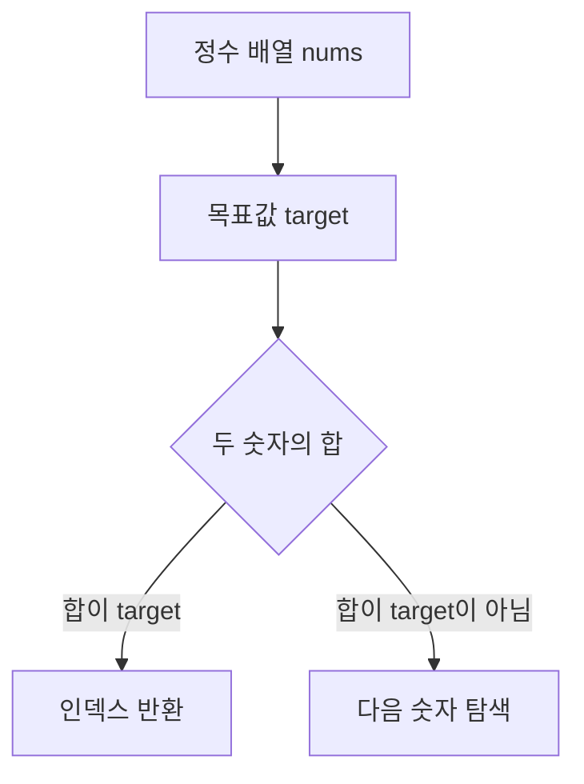
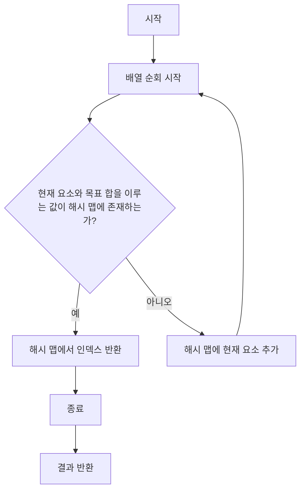
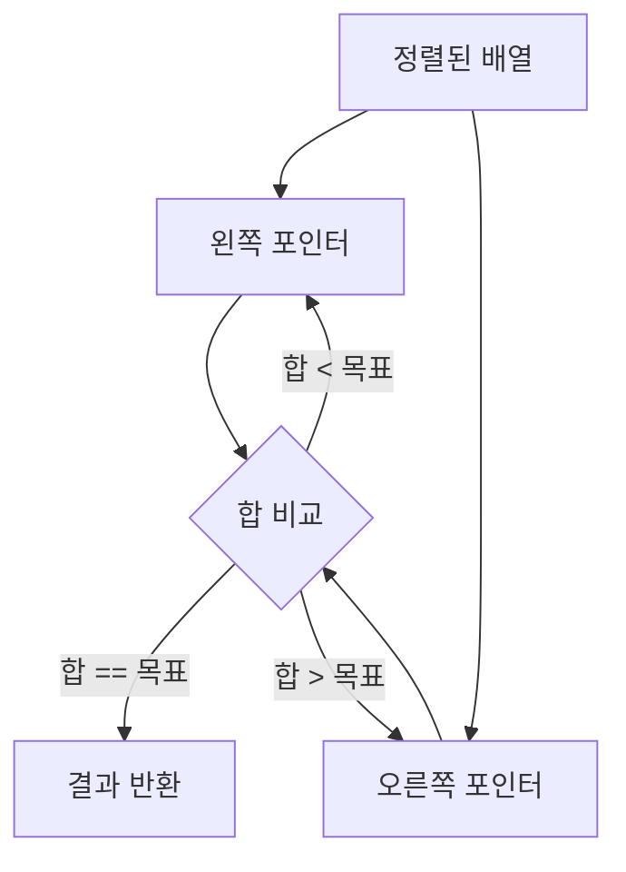
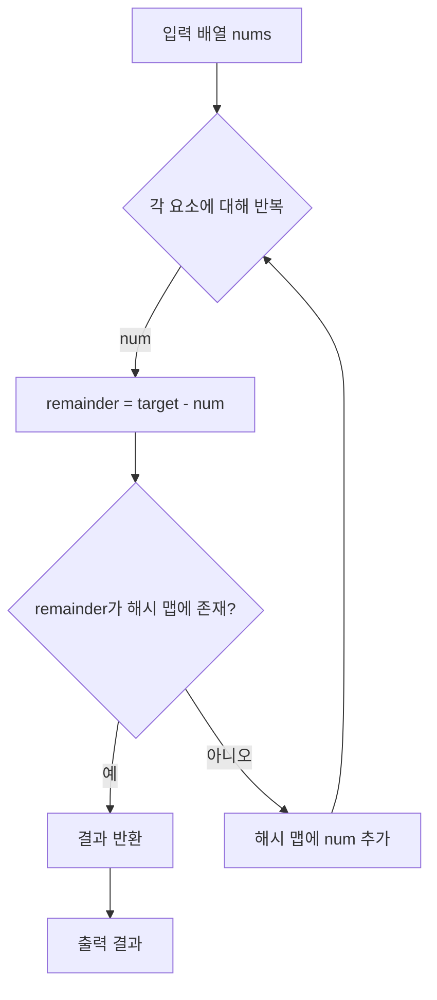
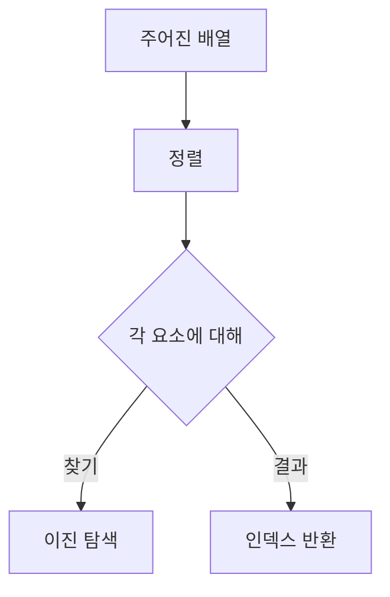
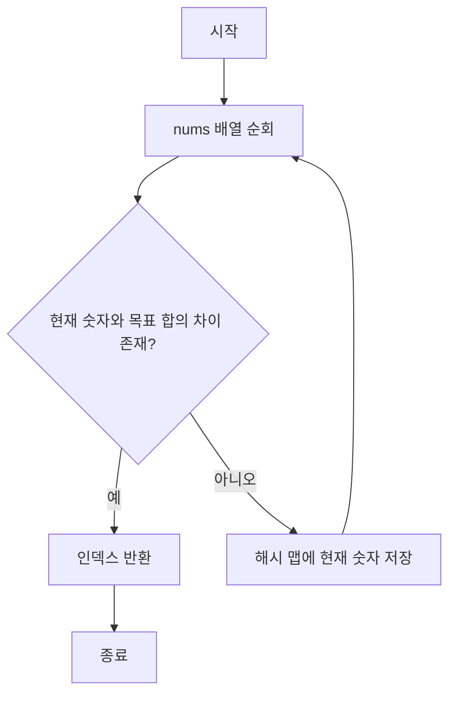
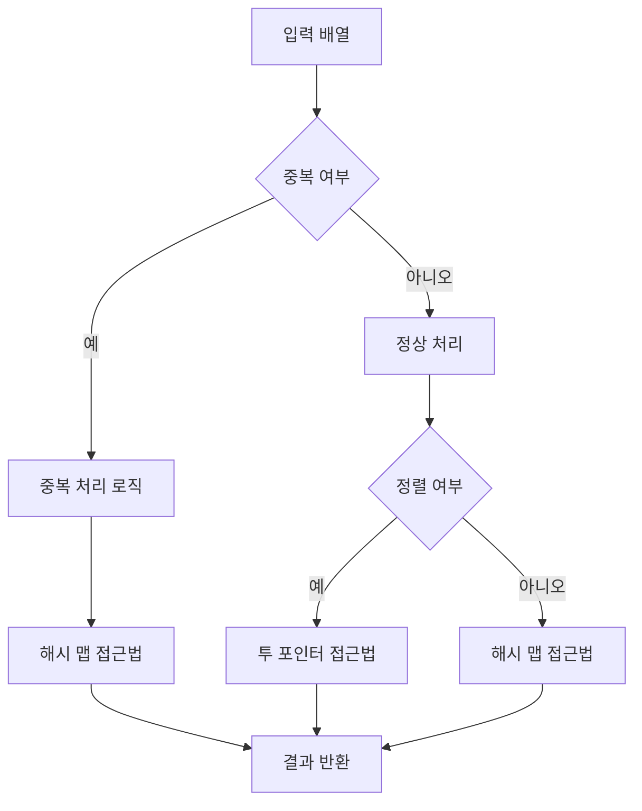
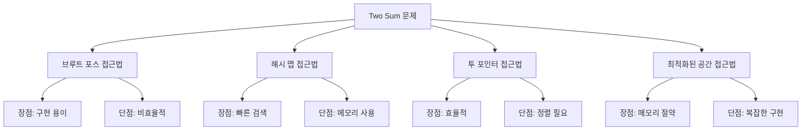

"Two Sum" 문제는 특정 목표값에 도달하는 두 수의 인덱스를 찾는 인기 있는 코딩 도전 과제이다. 이 문제는 배열 내에서 두 수의 합이 주어진 목표값과 일치하는 쌍을 찾는 능력을 테스트한다. 이 문제를 해결하기 위해 여러 가지 방법을 살펴보자. 첫 번째로, 가장 간단한 방법인 브루트 포스 접근법이 있다. 이 방법은 배열의 모든 쌍을 확인하여 합이 목표값과 일치하는지 확인하는 방식이다. 그러나 이 방법은 시간 복잡도가 O(n²)로 비효율적이다. 두 번째로, 해시 맵을 사용하는 방법이 있다. 이 방법은 각 숫자의 인덱스를 해시 맵에 저장하고, 현재 숫자와 목표값의 차이를 계산하여 해시 맵에서 해당 값이 존재하는지 확인하는 방식이다. 이 방법은 시간 복잡도가 O(n)으로 더 효율적이다. 세 번째로, 정렬된 배열을 사용하는 투 포인터 접근법이 있다. 이 방법은 배열을 정렬한 후 두 개의 포인터를 사용하여 합이 목표값과 일치하는 쌍을 찾는 방식이다. 마지막으로, 공간 최적화를 고려한 방법도 있다. 이 방법은 해시 맵을 사용하되, 메모리 사용량을 줄이기 위해 필요한 값만 저장하는 방식이다. 이러한 다양한 방법을 통해 "Two Sum" 문제를 해결하는 능력을 향상시킬 수 있다. 각 방법의 장단점을 이해하고, 상황에 맞는 최적의 방법을 선택하는 것이 중요하다.


||
|:---:|
||


<!--
##### Outline #####
-->

<!--
# 목차

## 1. 개요
   - "Two Sum" 문제 소개
   - 문제의 중요성 및 활용 사례

## 2. 문제 설명
   - 문제 정의
   - 입력 및 출력 형식
   - 예제 및 설명

## 3. 다양한 해결 방법
   ### 3.1. 브루트 포스 접근법
   - 알고리즘 설명
   - Python 및 Java 코드 예제
   - 시간 복잡도 및 공간 복잡도 분석

   ### 3.2. 해시 맵 접근법
   - 알고리즘 설명
   - Python 및 Java 코드 예제
   - 시간 복잡도 및 공간 복잡도 분석

   ### 3.3. 투 포인터 접근법
   - 알고리즘 설명
   - Python 및 Java 코드 예제
   - 시간 복잡도 및 공간 복잡도 분석

   ### 3.4. 최적화된 공간 접근법
   - 알고리즘 설명
   - Python 및 Java 코드 예제
   - 시간 복잡도 및 공간 복잡도 분석

## 4. 추가적인 해결 방법
   ### 4.1. 나머지 기반 접근법
   - 알고리즘 설명
   - Python 및 Java 코드 예제
   - 시간 복잡도 및 공간 복잡도 분석

   ### 4.2. 정렬 및 이진 탐색 접근법
   - 알고리즘 설명
   - Python 및 Java 코드 예제
   - 시간 복잡도 및 공간 복잡도 분석

## 5. 예제
   - 다양한 입력에 대한 예제 및 결과
   - 각 방법별 성능 비교

## 6. FAQ
   - 자주 묻는 질문 및 답변
   - 문제 해결 시 유의사항

## 7. 관련 기술
   - 해시 테이블
   - 정렬 알고리즘
   - 이진 탐색
   - 메모이제이션

## 8. 결론
   - 각 방법의 장단점 요약
   - 문제 해결 능력 향상을 위한 팁
   - 독자에게 전하는 메시지

## 9. 참고 자료
   - 관련 링크 및 자료
   - 추천 도서 및 온라인 강의

## 10. 코멘트 및 피드백
   - 독자 의견 수렴 및 소통 방법

이 목차는 "Two Sum" 문제를 다양한 관점에서 다루며, 독자가 문제를 이해하고 해결하는 데 필요한 모든 정보를 제공합니다. 각 섹션은 문제의 본질을 깊이 있게 탐구하고, 다양한 해결 방법을 제시하여 독자의 문제 해결 능력을 향상시키는 데 기여할 것입니다.
-->

<!--
## 1. 개요
   - "Two Sum" 문제 소개
   - 문제의 중요성 및 활용 사례
-->

## 1. 개요

**"Two Sum" 문제 소개**  

"Two Sum" 문제는 주어진 정수 배열에서 두 개의 숫자를 찾아 그 합이 특정한 목표값이 되는지를 확인하는 문제이다. 이 문제는 알고리즘 및 데이터 구조를 배우는 데 있어 기본적인 예제로 자주 사용되며, 다양한 프로그래밍 언어에서 구현할 수 있다. 문제의 정의는 다음과 같다:

- 주어진 정수 배열 `nums`와 정수 `target`이 있을 때, `nums`에서 두 개의 숫자를 찾아 그 합이 `target`과 같은 인덱스를 반환하는 것이다. 

이 문제는 간단해 보이지만, 다양한 해결 방법과 최적화 기법을 통해 문제 해결 능력을 향상시킬 수 있는 좋은 기회를 제공한다.

**문제의 중요성 및 활용 사례**  

"Two Sum" 문제는 알고리즘 문제 해결의 기초를 다지는 데 중요한 역할을 한다. 이 문제는 다음과 같은 이유로 중요하다:

1. **기본적인 알고리즘 이해**: 이 문제를 통해 배열, 해시 맵, 정렬 및 탐색 알고리즘에 대한 이해를 높일 수 있다.
2. **면접 준비**: 많은 기술 면접에서 "Two Sum" 문제와 유사한 문제가 출제되므로, 이를 통해 면접 준비에 도움이 된다.
3. **실제 응용**: 이 문제는 데이터 분석, 추천 시스템, 금융 거래 등 다양한 분야에서 활용될 수 있다. 예를 들어, 특정 금액의 거래를 찾거나, 특정 조건을 만족하는 데이터 쌍을 찾는 데 유용하다.

다음은 "Two Sum" 문제의 간단한 다이어그램이다:



이와 같은 구조를 통해 "Two Sum" 문제는 다양한 알고리즘적 접근을 통해 해결할 수 있으며, 이를 통해 독자는 문제 해결 능력을 한층 더 발전시킬 수 있다.

<!--
## 2. 문제 설명
   - 문제 정의
   - 입력 및 출력 형식
   - 예제 및 설명
-->

## 2. 문제 설명

**문제 정의**  

"Two Sum" 문제는 주어진 정수 배열과 목표 정수(target)가 주어졌을 때, 배열 내에서 두 개의 숫자를 찾아 그 합이 목표 정수와 일치하는 인덱스를 반환하는 문제이다. 이 문제는 배열의 길이가 2 이상이며, 항상 유효한 해답이 존재한다고 가정한다.

**입력 및 출력 형식**  

- **입력**: 
  - `nums`: 정수 배열 (예: [2, 7, 11, 15])
  - `target`: 목표 정수 (예: 9)
  
- **출력**: 
  - 두 숫자의 인덱스가 담긴 배열 (예: [0, 1])

**예제 및 설명**  

예를 들어, 입력 배열이 `[2, 7, 11, 15]`이고 목표 정수가 `9`일 경우, `2`와 `7`의 합이 `9`이므로 인덱스 `0`과 `1`을 반환해야 한다. 

이 문제는 다양한 알고리즘적 접근을 통해 해결할 수 있으며, 각 접근법에 따라 성능이 달라질 수 있다.

<!--
## 3. 다양한 해결 방법
   ### 3.1. 브루트 포스 접근법
   - 알고리즘 설명
   - Python 및 Java 코드 예제
   - 시간 복잡도 및 공간 복잡도 분석
-->

## 3. 다양한 해결 방법

### 3.1. 브루트 포스 접근법

브루트 포스 접근법은 문제를 해결하기 위해 가능한 모든 조합을 시도하는 가장 직관적인 방법이다. "Two Sum" 문제의 경우, 주어진 배열에서 두 수의 합이 목표 값과 일치하는 모든 쌍을 찾기 위해 이 방법을 사용할 수 있다. 이 접근법은 간단하지만, 비효율적일 수 있다.

**알고리즘 설명**

브루트 포스 접근법의 기본 아이디어는 배열의 모든 요소를 두 번 반복하여 각 쌍의 합을 계산하는 것이다. 다음과 같은 단계로 진행된다:

1. 배열의 첫 번째 요소를 선택한다.
2. 선택한 요소와 나머지 요소들을 하나씩 더하여 목표 값과 비교한다.
3. 목표 값과 일치하는 경우, 해당 쌍을 결과에 추가한다.
4. 첫 번째 요소를 다음 요소로 이동하고, 2번 과정을 반복한다.

이 방법은 모든 가능한 쌍을 검사하므로, 최악의 경우 O(n^2)의 시간 복잡도를 가진다.

**Python 코드 예제**

```python
def two_sum_brute_force(nums, target):
    result = []
    n = len(nums)
    for i in range(n):
        for j in range(i + 1, n):
            if nums[i] + nums[j] == target:
                result.append((nums[i], nums[j]))
    return result

# 예제 사용
nums = [2, 7, 11, 15]
target = 9
print(two_sum_brute_force(nums, target))  # 출력: [(2, 7)]
```

**Java 코드 예제**

```java
import java.util.ArrayList;
import java.util.List;

public class TwoSumBruteForce {
    public static List<int[]> twoSum(int[] nums, int target) {
        List<int[]> result = new ArrayList<>();
        int n = nums.length;
        for (int i = 0; i < n; i++) {
            for (int j = i + 1; j < n; j++) {
                if (nums[i] + nums[j] == target) {
                    result.add(new int[]{nums[i], nums[j]});
                }
            }
        }
        return result;
    }

    public static void main(String[] args) {
        int[] nums = {2, 7, 11, 15};
        int target = 9;
        List<int[]> result = twoSum(nums, target);
        for (int[] pair : result) {
            System.out.println("[" + pair[0] + ", " + pair[1] + "]");
        }
    }
}
```

**시간 복잡도 및 공간 복잡도 분석**

- **시간 복잡도**: O(n^2) - 두 개의 중첩 루프를 사용하여 모든 쌍을 검사하므로, 입력 배열의 크기 n에 대해 제곱의 시간 복잡도를 가진다.
- **공간 복잡도**: O(1) - 추가적인 데이터 구조를 사용하지 않으므로, 공간 복잡도는 상수이다.

이와 같은 브루트 포스 접근법은 간단하고 이해하기 쉬운 장점이 있지만, 입력 배열의 크기가 커질수록 비효율적이므로, 더 나은 방법을 고려해야 한다.

<!--
   ### 3.2. 해시 맵 접근법
   - 알고리즘 설명
   - Python 및 Java 코드 예제
   - 시간 복잡도 및 공간 복잡도 분석
-->

### 3.2. 해시 맵 접근법

**알고리즘 설명**  
해시 맵 접근법은 "Two Sum" 문제를 해결하기 위한 효율적인 방법 중 하나이다. 이 방법은 주어진 배열을 한 번만 순회하면서 각 요소의 값을 해시 맵에 저장하고, 현재 요소와 목표 합을 이루기 위해 필요한 값을 해시 맵에서 검색하는 방식으로 작동한다. 이 접근법은 평균적으로 O(1)의 시간 복잡도를 가지는 해시 맵의 특성을 활용하여, 전체 시간 복잡도를 O(n)으로 줄일 수 있다.

**Python 코드 예제**  
다음은 해시 맵 접근법을 사용한 Python 코드 예제이다.

```python
def two_sum(nums, target):
    num_map = {}
    for i, num in enumerate(nums):
        complement = target - num
        if complement in num_map:
            return [num_map[complement], i]
        num_map[num] = i
    return []
```

**Java 코드 예제**  
다음은 해시 맵 접근법을 사용한 Java 코드 예제이다.

```java
import java.util.HashMap;

public class TwoSum {
    public int[] twoSum(int[] nums, int target) {
        HashMap<Integer, Integer> numMap = new HashMap<>();
        for (int i = 0; i < nums.length; i++) {
            int complement = target - nums[i];
            if (numMap.containsKey(complement)) {
                return new int[] { numMap.get(complement), i };
            }
            numMap.put(nums[i], i);
        }
        return new int[] {};
    }
}
```

**시간 복잡도 및 공간 복잡도 분석**  

해시 맵 접근법의 시간 복잡도는 O(n)이다. 이는 배열을 한 번 순회하면서 각 요소를 해시 맵에 추가하고, 필요한 값을 검색하는 데 걸리는 시간 때문이다. 공간 복잡도 또한 O(n)으로, 해시 맵에 최대 n개의 요소를 저장할 수 있기 때문이다.



해시 맵 접근법은 "Two Sum" 문제를 해결하는 데 있어 매우 효율적인 방법으로, 특히 대규모 데이터셋을 다룰 때 유용하다. 이 방법을 통해 문제를 빠르게 해결할 수 있으며, 해시 맵의 활용을 통해 다른 문제에서도 유사한 접근법을 적용할 수 있다.

<!--
   ### 3.3. 투 포인터 접근법
   - 알고리즘 설명
   - Python 및 Java 코드 예제
   - 시간 복잡도 및 공간 복잡도 분석
-->

### 3.3. 투 포인터 접근법

**알고리즘 설명**  

투 포인터 접근법은 정렬된 배열에서 두 개의 포인터를 사용하여 문제를 해결하는 효율적인 방법이다. 이 방법은 배열의 양 끝에서 시작하여 두 포인터를 이동시키면서 합을 계산하고, 목표 값과 비교하는 방식으로 진행된다. 이 접근법은 배열이 정렬되어 있다는 전제 하에 작동하며, 각 포인터는 배열의 요소를 한 번씩만 방문하므로 시간 복잡도가 O(n)으로 매우 효율적이다.

**Python 코드 예제**  

다음은 투 포인터 접근법을 사용하여 "Two Sum" 문제를 해결하는 Python 코드 예제이다.

```python
def two_sum(nums, target):
    nums.sort()  # 배열을 정렬
    left, right = 0, len(nums) - 1  # 두 포인터 초기화

    while left < right:
        current_sum = nums[left] + nums[right]
        if current_sum == target:
            return [nums[left], nums[right]]  # 목표 값과 일치하는 경우
        elif current_sum < target:
            left += 1  # 합이 작으면 왼쪽 포인터 이동
        else:
            right -= 1  # 합이 크면 오른쪽 포인터 이동

    return []  # 일치하는 쌍이 없는 경우
```

**Java 코드 예제**  

다음은 동일한 문제를 해결하는 Java 코드 예제이다.

```java
import java.util.Arrays;

public class TwoSum {
    public static int[] twoSum(int[] nums, int target) {
        Arrays.sort(nums);  // 배열을 정렬
        int left = 0, right = nums.length - 1;  // 두 포인터 초기화

        while (left < right) {
            int currentSum = nums[left] + nums[right];
            if (currentSum == target) {
                return new int[]{nums[left], nums[right]};  // 목표 값과 일치하는 경우
            } else if (currentSum < target) {
                left++;  // 합이 작으면 왼쪽 포인터 이동
            } else {
                right--;  // 합이 크면 오른쪽 포인터 이동
            }
        }

        return new int[]{};  // 일치하는 쌍이 없는 경우
    }
}
```

**시간 복잡도 및 공간 복잡도 분석**  

투 포인터 접근법의 시간 복잡도는 O(n log n)이다. 이는 배열을 정렬하는 데 필요한 시간 복잡도이다. 이후 포인터를 이동하며 합을 계산하는 과정은 O(n)으로, 전체적으로 O(n log n)으로 평가된다. 공간 복잡도는 O(1)로, 추가적인 데이터 구조를 사용하지 않기 때문에 매우 효율적이다.

**다이어그램**  

다음은 투 포인터 접근법의 작동 방식을 나타내는 다이어그램이다.



이와 같이 투 포인터 접근법은 정렬된 배열에서 효율적으로 "Two Sum" 문제를 해결할 수 있는 방법이다.

<!--
   ### 3.4. 최적화된 공간 접근법
   - 알고리즘 설명
   - Python 및 Java 코드 예제
   - 시간 복잡도 및 공간 복잡도 분석
-->

### 3.4. 최적화된 공간 접근법

**알고리즘 설명**  

최적화된 공간 접근법은 기존의 해시 맵 접근법을 개선하여 메모리 사용을 줄이는 방법이다. 이 접근법은 입력 배열을 정렬한 후, 두 개의 포인터를 사용하여 목표 합을 찾는 방식으로 작동한다. 정렬된 배열에서 두 포인터를 사용하면, 각 요소를 한 번만 방문하게 되어 공간 복잡도를 O(1)로 줄일 수 있다. 이 방법은 배열의 정렬이 필요하므로, 정렬 과정에서 O(n log n)의 시간 복잡도가 발생한다.

**Python 코드 예제**  

아래는 최적화된 공간 접근법을 사용한 Python 코드 예제이다.

```python
def two_sum_optimized(nums, target):
    nums = sorted((num, index) for index, num in enumerate(nums))
    left, right = 0, len(nums) - 1

    while left < right:
        current_sum = nums[left][0] + nums[right][0]
        if current_sum == target:
            return [nums[left][1], nums[right][1]]
        elif current_sum < target:
            left += 1
        else:
            right -= 1

    return None
```

**Java 코드 예제**  

아래는 최적화된 공간 접근법을 사용한 Java 코드 예제이다.

```java
import java.util.Arrays;
import java.util.Comparator;

public class TwoSumOptimized {
    public static int[] twoSum(int[] nums, int target) {
        int[][] indexedNums = new int[nums.length][2];
        for (int i = 0; i < nums.length; i++) {
            indexedNums[i][0] = nums[i];
            indexedNums[i][1] = i;
        }

        Arrays.sort(indexedNums, Comparator.comparingInt(a -> a[0]));
        int left = 0, right = nums.length - 1;

        while (left < right) {
            int currentSum = indexedNums[left][0] + indexedNums[right][0];
            if (currentSum == target) {
                return new int[]{indexedNums[left][1], indexedNums[right][1]};
            } else if (currentSum < target) {
                left++;
            } else {
                right--;
            }
        }

        return null;
    }
}
```

**시간 복잡도 및 공간 복잡도 분석**  

- **시간 복잡도**: O(n log n) - 배열을 정렬하는 데 필요한 시간과 두 포인터를 사용하는 데 필요한 시간 O(n)을 합산한 결과이다.
- **공간 복잡도**: O(1) - 추가적인 공간을 거의 사용하지 않으며, 정렬된 배열을 사용하여 인덱스를 추적하는 데 필요한 공간만 사용한다.

이 최적화된 공간 접근법은 메모리 사용을 최소화하면서도 효율적으로 문제를 해결할 수 있는 방법이다.

<!--
## 4. 추가적인 해결 방법
   ### 4.1. 나머지 기반 접근법
   - 알고리즘 설명
   - Python 및 Java 코드 예제
   - 시간 복잡도 및 공간 복잡도 분석
-->

## 4. 추가적인 해결 방법

### 4.1 나머지 기반 접근법

나머지 기반 접근법은 "Two Sum" 문제를 해결하기 위한 효율적인 방법 중 하나이다. 이 접근법은 주어진 배열의 각 요소를 특정 값으로 나눈 나머지를 활용하여, 두 수의 합이 목표 값이 되는 경우를 찾는 방식이다. 이 방법은 해시 맵을 사용하여 나머지를 저장하고, 이를 통해 빠르게 쌍을 찾을 수 있다.

**알고리즘 설명**

1. 목표 합을 `target`이라고 하고, 배열 `nums`의 각 요소를 `num`이라고 하자.
2. 각 `num`에 대해 `remainder = target - num`을 계산한다.
3. 현재 `num`의 나머지를 `num % target`으로 계산하고, 이 나머지를 해시 맵에 저장한다.
4. 해시 맵에 `remainder`가 존재하는지 확인한다. 존재한다면, 두 수의 합이 `target`이 되는 쌍을 찾은 것이다.
5. 모든 요소를 반복하여 쌍을 찾는다.

이 알고리즘은 각 요소를 한 번만 순회하므로 시간 복잡도는 O(n)이다.

**Python 코드 예제:**

```python
def two_sum(nums, target):
    remainder_map = {}
    for num in nums:
        remainder = target - num
        if remainder in remainder_map:
            return [remainder_map[remainder], nums.index(num)]
        remainder_map[num] = nums.index(num)
    return []

# 예제 사용
nums = [2, 7, 11, 15]
target = 9
print(two_sum(nums, target))  # 출력: [0, 1]
```

**Java 코드 예제:**

```java
import java.util.HashMap;

public class TwoSum {
    public static int[] twoSum(int[] nums, int target) {
        HashMap<Integer, Integer> remainderMap = new HashMap<>();
        for (int i = 0; i < nums.length; i++) {
            int remainder = target - nums[i];
            if (remainderMap.containsKey(remainder)) {
                return new int[] { remainderMap.get(remainder), i };
            }
            remainderMap.put(nums[i], i);
        }
        return new int[] {};
    }

    public static void main(String[] args) {
        int[] nums = {2, 7, 11, 15};
        int target = 9;
        int[] result = twoSum(nums, target);
        System.out.println("[" + result[0] + ", " + result[1] + "]");  // 출력: [0, 1]
    }
}
```

**시간 복잡도 및 공간 복잡도 분석**

- **시간 복잡도**: O(n) - 배열을 한 번 순회하며 해시 맵에 접근하기 때문에 선형 시간 복잡도를 가진다.
- **공간 복잡도**: O(n) - 해시 맵에 최대 n개의 요소를 저장할 수 있으므로 공간 복잡도는 선형이다.

이와 같은 나머지 기반 접근법은 "Two Sum" 문제를 해결하는 데 있어 효율적이며, 특히 큰 데이터셋을 다룰 때 유용하다. 



위의 다이어그램은 나머지 기반 접근법의 흐름을 시각적으로 나타낸 것이다. 이 과정을 통해 문제를 해결하는 방법을 쉽게 이해할 수 있다.

<!--
   ### 4.2. 정렬 및 이진 탐색 접근법
   - 알고리즘 설명
   - Python 및 Java 코드 예제
   - 시간 복잡도 및 공간 복잡도 분석
-->

### 4.2. 정렬 및 이진 탐색 접근법

**알고리즘 설명**  

정렬 및 이진 탐색 접근법은 "Two Sum" 문제를 해결하기 위한 효율적인 방법 중 하나이다. 이 방법은 먼저 주어진 배열을 정렬한 후, 각 요소에 대해 목표 합을 만들기 위해 필요한 다른 요소를 이진 탐색을 통해 찾는 방식이다. 이진 탐색은 정렬된 배열에서 특정 값을 찾는 데 매우 효율적이므로, 이 방법은 전체적인 시간 복잡도를 줄이는 데 기여한다.

1. 주어진 배열을 정렬한다.
2. 각 요소에 대해, 목표 합에서 해당 요소를 뺀 값을 이진 탐색을 통해 찾는다.
3. 찾은 값이 배열에 존재하면, 두 요소의 인덱스를 반환한다.

**Python 코드 예제**  

```python
def two_sum_sorted(nums, target):
    nums_sorted = sorted((num, i) for i, num in enumerate(nums))
    left, right = 0, len(nums_sorted) - 1

    while left < right:
        current_sum = nums_sorted[left][0] + nums_sorted[right][0]
        if current_sum == target:
            return [nums_sorted[left][1], nums_sorted[right][1]]
        elif current_sum < target:
            left += 1
        else:
            right -= 1

    return None
```

**Java 코드 예제** 

```java
import java.util.Arrays;
import java.util.Comparator;

public class TwoSumSorted {
    public static int[] twoSum(int[] nums, int target) {
        int[][] indexedNums = new int[nums.length][2];
        for (int i = 0; i < nums.length; i++) {
            indexedNums[i][0] = nums[i];
            indexedNums[i][1] = i;
        }

        Arrays.sort(indexedNums, Comparator.comparingInt(a -> a[0]));

        int left = 0, right = indexedNums.length - 1;
        while (left < right) {
            int currentSum = indexedNums[left][0] + indexedNums[right][0];
            if (currentSum == target) {
                return new int[]{indexedNums[left][1], indexedNums[right][1]};
            } else if (currentSum < target) {
                left++;
            } else {
                right--;
            }
        }

        return null;
    }
}
```

**시간 복잡도 및 공간 복잡도 분석** 

- **시간 복잡도**: 이 접근법의 시간 복잡도는 O(n log n)이다. 이는 배열을 정렬하는 데 필요한 시간 복잡도이다. 이후 이진 탐색을 통해 각 요소를 검사하는 데 O(n)의 시간이 추가되지만, 정렬 단계가 가장 큰 영향을 미친다.
- **공간 복잡도**: 공간 복잡도는 O(n)이다. 정렬된 배열을 저장하기 위해 추가적인 공간이 필요하기 때문이다.



이와 같이 정렬 및 이진 탐색 접근법은 "Two Sum" 문제를 해결하는 데 있어 효율적이고 직관적인 방법이다. 이 방법을 통해 문제를 해결하는 과정에서 정렬과 탐색의 원리를 이해할 수 있다.

<!--
## 5. 예제
   - 다양한 입력에 대한 예제 및 결과
   - 각 방법별 성능 비교
-->

## 5. 예제

"Two Sum" 문제를 해결하기 위해 다양한 입력에 대한 예제를 살펴보겠다. 각 방법별로 성능을 비교하여 어떤 접근법이 가장 효율적인지 분석할 것이다.

**다양한 입력에 대한 예제 및 결과**

다음은 "Two Sum" 문제의 입력 배열과 목표 합계에 대한 예제이다.

1. **예제 1**
   - 입력: `nums = [2, 7, 11, 15]`, `target = 9`
   - 출력: `[0, 1]` (2 + 7 = 9)

2. **예제 2**
   - 입력: `nums = [3, 2, 4]`, `target = 6`
   - 출력: `[1, 2]` (2 + 4 = 6)

3. **예제 3**
   - 입력: `nums = [3, 3]`, `target = 6`
   - 출력: `[0, 1]` (3 + 3 = 6)

이러한 예제를 통해 다양한 입력에 대한 결과를 확인할 수 있다.

**각 방법별 성능 비교**

다음은 각 접근법의 성능을 비교한 표이다.

| 접근법               | 시간 복잡도 | 공간 복잡도 | 비고                       |
|---------------------|--------------|--------------|----------------------------|
| 브루트 포스 접근법  | O(n^2)      | O(1)         | 모든 쌍을 비교하는 방식이다. |
| 해시 맵 접근법     | O(n)        | O(n)        | 해시 맵을 사용하여 빠르게 찾는다. |
| 투 포인터 접근법    | O(n log n)  | O(1)         | 정렬 후 양쪽에서 탐색한다. |
| 최적화된 공간 접근법 | O(n)        | O(1)         | 추가 공간 없이 해결한다. |

**샘플 코드**

다음은 해시 맵 접근법을 사용한 Python 코드 예제이다.

```python
def two_sum(nums, target):
    num_map = {}
    for i, num in enumerate(nums):
        complement = target - num
        if complement in num_map:
            return [num_map[complement], i]
        num_map[num] = i
    return []
```

**다이어그램**

다음은 해시 맵 접근법의 흐름을 나타낸 다이어그램이다.



이와 같이 다양한 입력에 대한 예제와 각 방법별 성능 비교를 통해 "Two Sum" 문제를 해결하는 데 필요한 정보를 제공하였다. 각 접근법의 장단점을 이해하고, 상황에 맞는 방법을 선택하는 것이 중요하다.

<!--
## 6. FAQ
   - 자주 묻는 질문 및 답변
   - 문제 해결 시 유의사항
-->

## 6. FAQ

**자주 묻는 질문 및 답변**

1. **"Two Sum" 문제는 어떤 상황에서 주로 사용되나요?**
   - "Two Sum" 문제는 데이터 분석, 추천 시스템, 금융 거래 분석 등 다양한 분야에서 사용된다. 특히, 두 개의 숫자를 조합하여 특정 값을 찾는 경우가 많아, 실시간 데이터 처리 및 알고리즘 문제 해결에 유용하다.

2. **입력 배열에 중복된 숫자가 있을 경우 어떻게 처리하나요?**
   - 입력 배열에 중복된 숫자가 있을 경우, 동일한 숫자를 두 번 사용할 수 없다. 예를 들어, 배열이 [3, 3, 4]이고 목표 합이 6이라면, 첫 번째 3과 두 번째 3을 사용할 수 없으므로, 4와 3을 조합해야 한다.

3. **해시 맵 접근법의 장점은 무엇인가요?**
   - 해시 맵 접근법은 O(n)의 시간 복잡도로 문제를 해결할 수 있어, 매우 효율적이다. 또한, 해시 맵을 사용하면 각 숫자의 인덱스를 쉽게 추적할 수 있어, 코드 구현이 간단하다.

4. **브루트 포스 접근법은 언제 사용하나요?**
   - 브루트 포스 접근법은 문제의 크기가 작을 때 유용하다. 입력 배열의 크기가 작고, 성능이 크게 중요하지 않은 경우에는 간단하게 구현할 수 있는 장점이 있다.

5. **"Two Sum" 문제를 해결하는 데 가장 적합한 방법은 무엇인가요?**
   - 문제의 특성과 입력 데이터에 따라 다르지만, 일반적으로 해시 맵 접근법이 가장 효율적이다. 그러나 입력 배열이 정렬되어 있다면 투 포인터 접근법도 좋은 선택이 될 수 있다.

**문제 해결 시 유의사항**

- **입력 배열의 크기**: 입력 배열의 크기가 클 경우, 시간 복잡도를 고려하여 효율적인 알고리즘을 선택해야 한다.
- **정렬 여부**: 입력 배열이 정렬되어 있는지 여부에 따라 적합한 접근법이 달라질 수 있다. 정렬된 배열에서는 투 포인터 접근법이 유리하다.
- **중복 처리**: 중복된 숫자가 있는 경우, 이를 어떻게 처리할 것인지 명확히 해야 한다. 중복을 허용할지 여부에 따라 알고리즘이 달라질 수 있다.
- **예외 처리**: 입력이 유효하지 않거나 목표 합을 찾을 수 없는 경우에 대한 예외 처리를 고려해야 한다.



위의 다이어그램은 "Two Sum" 문제를 해결하는 과정에서 고려해야 할 요소들을 시각적으로 나타낸 것이다. 각 단계에서의 결정 사항이 최종 결과에 어떻게 영향을 미치는지를 보여준다.

<!--
## 7. 관련 기술
   - 해시 테이블
   - 정렬 알고리즘
   - 이진 탐색
   - 메모이제이션
-->

## 7. 관련 기술

"Two Sum" 문제를 해결하기 위해서는 여러 가지 알고리즘과 데이터 구조에 대한 이해가 필요하다. 이 섹션에서는 문제 해결에 유용한 몇 가지 관련 기술을 살펴보겠다.

**해시 테이블**  

해시 테이블은 키-값 쌍을 저장하는 데이터 구조로, 평균적으로 O(1)의 시간 복잡도로 데이터를 검색할 수 있다. "Two Sum" 문제에서 해시 테이블을 사용하면, 각 숫자를 키로 저장하고 그 숫자가 목표 합에서 얼마나 차이나는지를 계산하여 빠르게 쌍을 찾을 수 있다. 해시 테이블을 활용한 접근법은 효율적이며, 많은 문제에서 유용하게 사용된다.

```python
def two_sum(nums, target):
    hash_map = {}
    for i, num in enumerate(nums):
        complement = target - num
        if complement in hash_map:
            return [hash_map[complement], i]
        hash_map[num] = i
    return []
```

**정렬 알고리즘**  

정렬 알고리즘은 데이터를 특정 기준에 따라 정렬하는 방법이다. "Two Sum" 문제에서 정렬을 활용하면, 정렬된 배열에서 두 포인터를 사용하여 합을 찾는 방식으로 문제를 해결할 수 있다. 이 방법은 O(n log n)의 시간 복잡도를 가지며, 정렬 후 이진 탐색을 통해 더 빠르게 쌍을 찾을 수 있다.

```python
def two_sum_sorted(nums, target):
    nums = sorted((num, i) for i, num in enumerate(nums))
    left, right = 0, len(nums) - 1
    while left < right:
        current_sum = nums[left][0] + nums[right][0]
        if current_sum == target:
            return [nums[left][1], nums[right][1]]
        elif current_sum < target:
            left += 1
        else:
            right -= 1
    return []
```

**이진 탐색**  

이진 탐색은 정렬된 배열에서 특정 값을 찾는 효율적인 방법이다. "Two Sum" 문제에서 정렬된 배열을 활용하면, 한 숫자를 고른 후 나머지 숫자를 이진 탐색으로 찾는 방식으로 문제를 해결할 수 있다. 이 방법은 O(n log n)의 시간 복잡도를 가지며, 정렬된 배열에서의 탐색을 통해 성능을 향상시킬 수 있다.

```python
def binary_search(nums, target):
    left, right = 0, len(nums) - 1
    while left <= right:
        mid = (left + right) // 2
        if nums[mid] == target:
            return mid
        elif nums[mid] < target:
            left = mid + 1
        else:
            right = mid - 1
    return -1
```

**메모이제이션**  

메모이제이션은 재귀적 알고리즘에서 중복 계산을 피하기 위해 결과를 저장하는 기법이다. "Two Sum" 문제에서는 메모이제이션을 사용하여 이미 계산한 값을 저장하고, 필요할 때 재사용함으로써 성능을 향상시킬 수 있다. 이 기법은 특히 동적 프로그래밍 문제에서 유용하게 사용된다.

```python
def two_sum_memoization(nums, target, memo=None):
    if memo is None:
        memo = {}
    if target in memo:
        return memo[target]
    
    for i, num in enumerate(nums):
        complement = target - num
        if complement in nums[i+1:]:
            memo[target] = [i, nums.index(complement, i+1)]
            return memo[target]
    memo[target] = []
    return []
```

이와 같이 다양한 관련 기술들은 "Two Sum" 문제를 해결하는 데 있어 중요한 역할을 한다. 각 기술의 특성을 이해하고 적절히 활용하는 것이 문제 해결 능력을 향상시키는 데 기여할 것이다.

<!--
## 8. 결론
   - 각 방법의 장단점 요약
   - 문제 해결 능력 향상을 위한 팁
   - 독자에게 전하는 메시지
-->

## 8. 결론

**각 방법의 장단점 요약**  

"Two Sum" 문제를 해결하기 위한 다양한 접근 방법은 각기 다른 장단점을 가지고 있다. 

1. **브루트 포스 접근법**은 구현이 간단하지만, 시간 복잡도가 O(n^2)로 비효율적이다. 작은 입력에 대해서는 적합할 수 있으나, 큰 입력에 대해서는 성능이 저하된다.
   
2. **해시 맵 접근법**은 평균적으로 O(n)의 시간 복잡도를 가지며, 공간 복잡도 또한 O(n)이다. 이 방법은 빠른 검색 속도를 제공하지만, 추가적인 메모리 사용이 필요하다.

3. **투 포인터 접근법**은 정렬된 배열에서만 사용할 수 있으며, O(n) 시간 복잡도를 가진다. 그러나 입력 배열을 정렬해야 하므로, 추가적인 O(n log n) 시간이 소요된다.

4. **최적화된 공간 접근법**은 해시 맵을 사용하지 않고도 문제를 해결할 수 있는 방법으로, 공간 복잡도를 줄일 수 있다. 하지만 이 방법은 구현이 복잡할 수 있다.

**문제 해결 능력 향상을 위한 팁**  

문제를 해결하는 능력을 향상시키기 위해서는 다음과 같은 팁을 고려할 수 있다.

- **다양한 접근 방법 시도**: 문제를 해결하기 위해 여러 가지 방법을 시도해보는 것이 중요하다. 각 방법의 장단점을 이해하고, 상황에 맞는 최적의 방법을 선택할 수 있어야 한다.
  
- **시간 복잡도와 공간 복잡도 분석**: 알고리즘을 구현한 후, 그 성능을 분석하는 습관을 기르는 것이 좋다. 이를 통해 더 나은 알고리즘을 설계할 수 있는 기초를 다질 수 있다.

- **문제 해결 연습**: LeetCode, HackerRank와 같은 플랫폼에서 다양한 문제를 풀어보는 것이 도움이 된다. 문제를 풀면서 다양한 알고리즘과 자료구조를 익힐 수 있다.

"Two Sum" 문제는 단순해 보이지만, 다양한 해결 방법을 통해 알고리즘적 사고를 기를 수 있는 좋은 기회이다. 각 방법의 특성을 이해하고, 문제를 해결하는 과정에서 얻는 경험은 향후 더 복잡한 문제를 해결하는 데 큰 도움이 될 것이다. 독자 여러분이 이 문제를 통해 알고리즘에 대한 이해를 깊이 있게 쌓아가기를 바란다.



이 다이어그램은 각 접근 방법의 장단점을 시각적으로 정리하여 독자가 이해하는 데 도움을 줄 것이다.

<!--
## 9. 참고 자료
   - 관련 링크 및 자료
   - 추천 도서 및 온라인 강의
-->

## 9. 참고 자료

**관련 링크 및 자료**  

"Two Sum" 문제를 더 깊이 이해하고 다양한 해결 방법을 학습하기 위해 다음의 자료를 참고할 수 있다.

1. **LeetCode**: [Two Sum 문제 페이지](https://leetcode.com/problems/two-sum/)  
   LeetCode에서 제공하는 "Two Sum" 문제의 공식 페이지로, 문제 설명과 다양한 사용자 제출 코드를 확인할 수 있다.

2. **GeeksforGeeks**: [Two Sum Problem](https://www.geeksforgeeks.org/two-sum-problem/)  
   GeeksforGeeks에서는 "Two Sum" 문제에 대한 자세한 설명과 여러 가지 해결 방법을 다루고 있다.

3. **YouTube 강의**: "Two Sum Problem Explained"  
   YouTube에서 "Two Sum" 문제를 설명하는 다양한 강의를 찾아볼 수 있다. 시각적으로 문제를 이해하는 데 도움이 된다.

**추천 도서 및 온라인 강의** 

문제 해결 능력을 향상시키기 위해 다음의 도서와 강의를 추천한다.

1. **"Cracking the Coding Interview" by Gayle Laakmann McDowell**  
   이 책은 다양한 알고리즘 문제를 다루고 있으며, "Two Sum"과 같은 문제를 해결하는 데 필요한 사고 방식을 기를 수 있다.

2. **"Introduction to Algorithms" by Thomas H. Cormen et al.**  
   알고리즘의 기초부터 심화까지 다루는 이 책은 문제 해결에 필요한 이론적 배경을 제공한다.

3. **Coursera**: "Data Structures and Algorithms Specialization"  
   Coursera에서 제공하는 이 강의는 데이터 구조와 알고리즘에 대한 포괄적인 내용을 다루며, 실습 문제를 통해 학습할 수 있다.

4. **Udacity**: "Data Structures and Algorithms Nanodegree"  
   Udacity의 이 프로그램은 실무 중심의 교육을 제공하며, 다양한 알고리즘 문제를 해결하는 데 필요한 기술을 배울 수 있다.

이 자료들은 "Two Sum" 문제를 이해하고 해결하는 데 큰 도움이 될 것이다.

<!--
##### Reference #####
-->

## Reference


* [https://dev.to/nullvoidkage/solving-the-two-sum-problem-multiple-approaches-using-javapython-9kk](https://dev.to/nullvoidkage/solving-the-two-sum-problem-multiple-approaches-using-javapython-9kk)
* [https://velog.io/@yejinh/Two-Sum](https://velog.io/@yejinh/Two-Sum)
* [https://www.geeksforgeeks.org/check-if-pair-with-given-sum-exists-in-array/](https://www.geeksforgeeks.org/check-if-pair-with-given-sum-exists-in-array/)
* [https://ifuwanna.tistory.com/340](https://ifuwanna.tistory.com/340)
* [https://coderbyte.com/algorithm/two-sum-problem](https://coderbyte.com/algorithm/two-sum-problem)
* [https://medium.com/@eurobin4321/leetcode-1%EB%B2%88-%EB%AC%B8%EC%A0%9C-two-sum-b9a88e0a6e82](https://medium.com/@eurobin4321/leetcode-1%EB%B2%88-%EB%AC%B8%EC%A0%9C-two-sum-b9a88e0a6e82)

