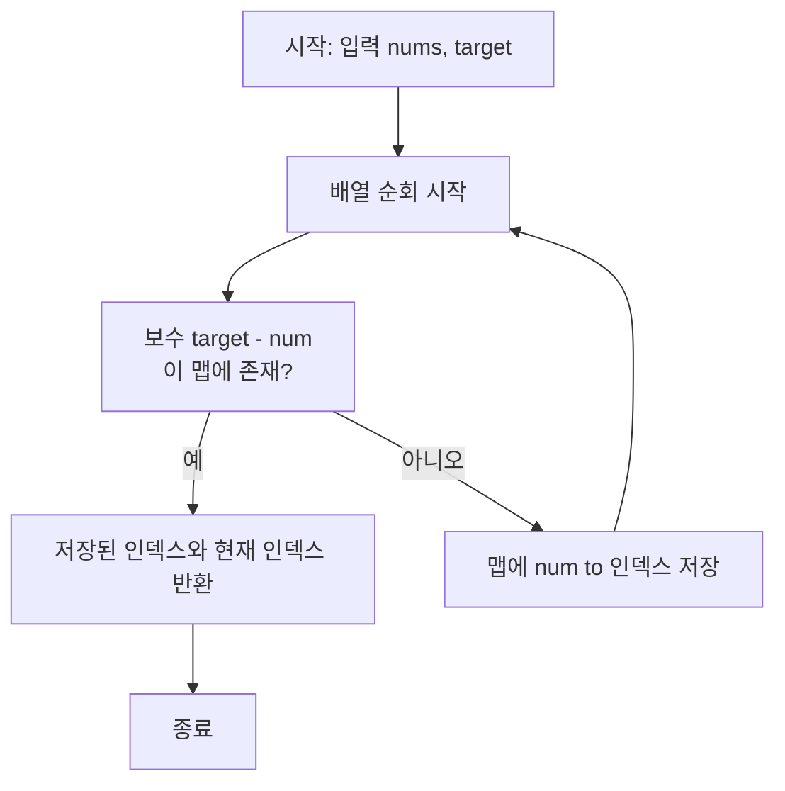
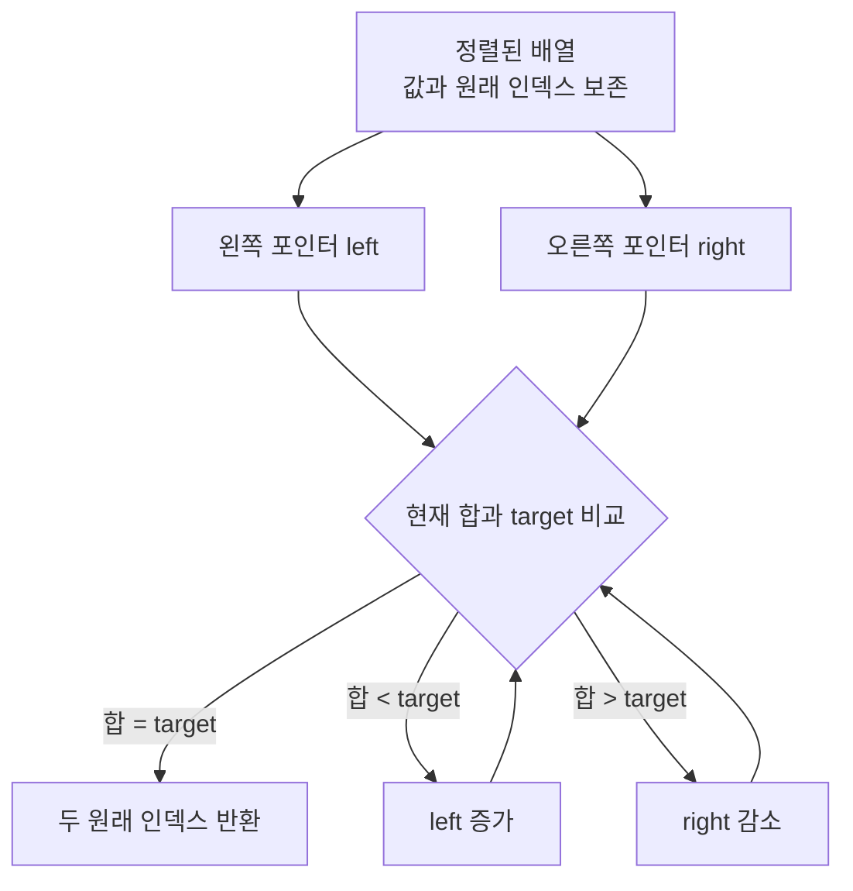

정수 배열에서 합이 목표값이 되는 두 수의 **인덱스**를 찾는 대표적인 코딩 테스트 문제인 **Two Sum**을, 브루트 포스·해시맵·투 포인터·정렬·이진 탐색 등 여러 방법으로 풀고 복잡도와 코너 케이스를 정리한다. 실전에서 O(n) 해시맵 풀이를 선택하는 이유와 인덱스 유지가 필요한 경우의 처리 방법을 익힐 수 있다.

## 문제 정보

**문제 링크**: [LeetCode 1. Two Sum](https://leetcode.com/problems/two-sum/)

**문제 요약**  
정수 배열 `nums`와 정수 `target`이 주어질 때, `nums[i] + nums[j] == target`을 만족하는 **서로 다른** 두 인덱스 `i`, `j`를 반환한다. 정답은 정확히 한 쌍만 존재한다고 가정하며, 같은 원소를 두 번 사용할 수 없다.

**제한 조건**  
- $2 \le \texttt{nums.length} \le 10^4$  
- $-10^9 \le \texttt{nums[i]} \le 10^9$  
- $-10^9 \le \texttt{target} \le 10^9$  
- 유효한 답이 반드시 하나 존재

## 입출력 예제

**입력 1**  
`nums = [2, 7, 11, 15]`, `target = 9`

**출력 1**  
`[0, 1]` (2 + 7 = 9)

**입력 2**  
`nums = [3, 2, 4]`, `target = 6`

**출력 2**  
`[1, 2]` (2 + 4 = 6)

**입력 3**  
`nums = [3, 3]`, `target = 6`

**출력 3**  
`[0, 1]` (동일 값이어도 서로 다른 인덱스이면 허용)

## 접근 방식

### 핵심 관찰

- **보수(complement)**: 현재 값 `num`에 대해 `target - num`이 이미 등장했는지 확인하면, 한 번의 순회로 쌍을 찾을 수 있다.
- **해시맵**: 값 → 인덱스 매핑을 저장하면 보수 존재 여부를 평균 O(1)에 확인할 수 있어 전체 **O(n)** 이 가능하다.
- **정렬·투 포인터**: 정렬 후 양끝 포인터로 합을 조절할 수 있으나, 정렬 시 **원래 인덱스**를 함께 보존해야 한다.

### 알고리즘 설계 (해시맵 풀이)


```mermaid
flowchart TD
    Start["시작: 입력 nums, target"]
    Start --> Iter["배열 순회 시작"]
    Iter --> Check["보수 target - num</br>이 맵에 존재?"]
    Check -->|"예"| ReturnIdx["저장된 인덱스와 현재 인덱스 반환"]
    Check -->|"아니오"| AddMap["맵에 num to 인덱스 저장"]
    AddMap --> Iter
    ReturnIdx --> End["종료"]
```

### 단계별 로직 (해시맵)

1. **전처리**: 빈 해시맵(값 → 인덱스) 준비  
2. **메인 로직**: 인덱스 `i`로 `nums`를 한 번 순회하며, `complement = target - nums[i]`가 맵에 있으면 `[맵[complement], i]` 반환; 없으면 `nums[i] → i` 저장  
3. **후처리**: (가정상 반드시 답이 있으므로) 반복 종료 전에 반환됨

## 복잡도 분석

| 항목 | 브루트 포스 | 해시맵 | 투 포인터(정렬 포함) |
|------|-------------|--------|----------------------|
| **시간 복잡도** | $O(N^2)$ | $O(N)$ | $O(N \log N)$ |
| **공간 복잡도** | $O(1)$ | $O(N)$ | $O(N)$ (인덱스 보존 시) |
| **비고** | 모든 쌍 검사 | 한 번 순회 + 맵 조회 | 정렬 후 양끝 포인터 |

## 구현 코드

### Python (해시맵)

```python
# 42jerrykim.github.io에서 더 많은 정보를 확인할 수 있다
def two_sum(nums, target):
    num_map = {}
    for i, num in enumerate(nums):
        complement = target - num
        if complement in num_map:
            return [num_map[complement], i]
        num_map[num] = i
    return []
```

### Java (해시맵)

```java
// 42jerrykim.github.io에서 더 많은 정보를 확인할 수 있다
import java.util.HashMap;

public class TwoSum {
    public int[] twoSum(int[] nums, int target) {
        HashMap<Integer, Integer> numMap = new HashMap<>();
        for (int i = 0; i < nums.length; i++) {
            int complement = target - nums[i];
            if (numMap.containsKey(complement)) {
                return new int[] { numMap.get(complement), i };
            }
            numMap.put(nums[i], i);
        }
        return new int[] {};
    }
}
```

### C++ (해시맵)

```cpp
// 42jerrykim.github.io에서 더 많은 정보를 확인할 수 있다
#include <vector>
#include <unordered_map>

class Solution {
public:
    std::vector<int> twoSum(std::vector<int>& nums, int target) {
        std::unordered_map<int, int> numMap;
        for (int i = 0; i < (int)nums.size(); i++) {
            int complement = target - nums[i];
            if (numMap.count(complement))
                return { numMap[complement], i };
            numMap[nums[i]] = i;
        }
        return {};
    }
};
```

## 코너 케이스 및 실수 포인트

| 케이스 | 설명 | 처리 방법 |
|--------|------|-----------|
| **길이 2** | 최소 입력 | 별도 분기 없이 해시맵 로직으로 처리 가능 |
| **같은 값 두 번** (예: [3,3], target=6) | 동일 수가 서로 다른 인덱스로 사용됨 | 같은 키를 덮어쓰기 전에 보수 조회 → 먼저 나온 인덱스와 현재 인덱스 반환 |
| **음수·0 포함** | target과 원소가 음수여도 보수 관계 동일 | 추가 처리 불필요 |
| **오버플로우** | 일부 언어에서 target ± num 연산 | Python/Java는 정수 범위 넓음; C++는 문제 제한 내에서 long 사용 고려 |

## 다양한 해결 방법 상세

### 브루트 포스 접근법

가능한 모든 (i, j) 쌍을 검사한다. 구현이 단순하지만 $O(N^2)$으로 대규모 입력에는 비효율적이다.

```python
# 42jerrykim.github.io에서 더 많은 정보를 확인할 수 있다
def two_sum_brute_force(nums, target):
    n = len(nums)
    for i in range(n):
        for j in range(i + 1, n):
            if nums[i] + nums[j] == target:
                return [i, j]
    return []
```

### 투 포인터 접근법 (인덱스 보존)

정렬하면 원래 인덱스가 바뀌므로, (값, 인덱스) 쌍으로 정렬한 뒤 투 포인터로 합을 맞추고, 반환할 때는 **인덱스**를 반환한다.


```mermaid
flowchart TD
    SortedArr["정렬된 배열</br>값과 원래 인덱스 보존"]
    LeftPtr["왼쪽 포인터 left"]
    RightPtr["오른쪽 포인터 right"]
    SortedArr --> LeftPtr
    SortedArr --> RightPtr
    Compare{"현재 합과 target 비교"}
    LeftPtr --> Compare
    RightPtr --> Compare
    Compare -->|"합 = target"| ReturnPair["두 원래 인덱스 반환"]
    Compare -->|"합 < target"| MoveLeft["left 증가"]
    Compare -->|"합 > target"| MoveRight["right 감소"]
    MoveLeft --> Compare
    MoveRight --> Compare
```

- **시간**: $O(N \log N)$ (정렬), **공간**: $O(N)$ (인덱스 보존용)

### 나머지·보수 기반 접근 (해시맵과 동일 개념)

"나머지"라는 표현 대신 **보수(complement) = target - num**을 사용하는 것이 일반적이다. 로직은 위 해시맵 풀이와 동일하다.

### 정렬 후 이진 탐색

각 `nums[i]`에 대해 보수 `target - nums[i]`를 **정렬된** 구간에서 이진 탐색할 수 있다. 인덱스를 되살리려면 (값, 인덱스) 정렬이 필요하며, 전체 $O(N \log N)$.

## 예제 및 방법별 비교

| 접근법 | 시간 | 공간 | 비고 |
|--------|------|------|------|
| 브루트 포스 | $O(N^2)$ | $O(1)$ | 모든 쌍 비교 |
| 해시맵 | $O(N)$ | $O(N)$ | 권장: 한 번 순회로 해결 |
| 투 포인터 | $O(N \log N)$ | $O(N)$ | 정렬 후 양끝 탐색 |

## FAQ

- **같은 원소를 두 번 쓸 수 있나요?**  
  아니요. 서로 다른 인덱스 두 개를 골라야 하며, 값이 같아도 인덱스만 다르면 된다 (예: [3,3], target=6 → [0,1]).

- **해시맵이 최선인 이유는?**  
  제한이 $N \le 10^4$ 정도일 때도 $O(N)$이 $O(N^2)$보다 훨씬 유리하고, 구현이 짧고 실수 가능성이 적다.

- **정렬해도 되나요?**  
  정렬 시 원래 인덱스를 함께 저장하면 투 포인터로 풀 수 있으나, 시간은 $O(N \log N)$이고 인덱스 보존이 필요해 코드가 길어진다.

## 관련 기술

- **해시 테이블**: 값→인덱스 매핑으로 보수 조회 O(1)  
- **정렬**: 투 포인터·이진 탐색 전제  
- **이진 탐색**: 정렬된 배열에서 보수 위치 찾기

## 마무리

Two Sum은 해시맵을 이용한 **한 번 순회 + 보수 조회**로 $O(N)$에 푸는 것이 실전에서 가장 많이 쓰인다. 브루트 포스·투 포인터·이진 탐색 등 다른 방법도 복잡도와 trade-off를 이해해 두면, 3Sum·4Sum 등 변형 문제로 확장할 때 도움이 된다.

## 참고 문헌 및 출처

- [LeetCode 1. Two Sum](https://leetcode.com/problems/two-sum/) — 공식 문제
- [GeeksforGeeks – Two Sum (Pair with given sum)](https://www.geeksforgeeks.org/check-if-pair-with-given-sum-exists-in-array/) — 해시·정렬·투 포인터 설명
- [GeeksforGeeks – 2Sum Complete Tutorial](https://www.geeksforgeeks.org/dsa/2sum/) — 2Sum 변형·정리
- [DEV Community – Solving the Two Sum Problem (Java/Python)](https://dev.to/nullvoidkage/solving-the-two-sum-problem-multiple-approaches-using-javapython-9kk)
- [Velog – Two Sum (LeetCode)](https://velog.io/@yejinh/Two-Sum)
