컨테이너 기술은 소프트웨어 산업에 혁신을 가져왔다. 과거에는 개발(Dev)과 운영(Ops) 간의 경계가 뚜렷하여, 개발자는 애플리케이션을 개발한 후 이를 운영팀에 넘겨야 했다. 이 과정에서 발생하는 환경 불일치와 배포의 복잡성은 많은 문제를 야기했다. 그러나 컨테이너는 이러한 문제를 해결하는 데 큰 역할을 했다. 컨테이너는 애플리케이션과 그 의존성을 패키징하여 다양한 환경에서 일관되게 실행될 수 있도록 해준다. 이는 개발자와 운영팀 간의 협업을 원활하게 하고, 배포 과정을 단순화한다. 또한, 컨테이너는 경량화되어 서버 자원을 효율적으로 사용할 수 있게 해주며, 보안 측면에서도 강력한 격리 기능을 제공한다. 그러나 이러한 장점에도 불구하고, 컨테이너를 맹목적으로 사용하는 것은 오히려 부작용을 초래할 수 있다. 따라서 컨테이너의 장점과 단점을 모두 고려하여 적절한 상황에서 활용하는 것이 중요하다. 컨테이너 기술의 발전은 계속되고 있으며, 이를 통해 소프트웨어 개발과 운영의 미래가 더욱 밝아질 것으로 기대된다.


||
|:---:|
||


<!--
##### Outline #####
-->

<!--
# 목차

## 1. 개요
   - 컨테이너 기술의 정의
   - 컨테이너화의 중요성 및 필요성
   - 컨테이너 기술의 발전 배경

## 2. 컨테이너 사용의 장점
   - 일관된 개발 및 운영 환경
   - 배포의 간소화 및 자동화
   - 경량화 및 자원 효율성
   - 보안성 강화

## 3. 컨테이너 기술의 역사
   - 초기 OS 가상화 기술 (FreeBSD Jail, Linux-Vserver 등)
   - LXC와 Docker의 출현
   - Kubernetes의 발전과 클라우드 네이티브 시대의 시작
   - OCI(Open Container Initiative)와 CNCF(Cloud Native Computing Foundation)의 역할

## 4. 컨테이너의 구조와 작동 원리
   - 컨테이너 이미지와 실행
   - Docker Engine의 역할
   - 표준화된 패키징 및 배포 방식

## 5. 컨테이너 오케스트레이션
   - Kubernetes의 개요 및 기능
   - 다른 오케스트레이션 도구 (OpenShift, Mesos 등)
   - 컨테이너 관리 및 배포 전략

## 6. 컨테이너의 단점 및 고려사항
   - 성능 문제 및 오버헤드
   - 보안 취약점 및 격리 문제
   - 복잡한 네트워크 구성
   - 적절한 사용 사례와 대안 기술

## 7. 예제
   - Docker를 이용한 간단한 컨테이너 생성 및 배포 예제
   - Kubernetes를 이용한 컨테이너 오케스트레이션 예제
   - Podman을 이용한 컨테이너 관리 예제

## 8. FAQ
   - 컨테이너와 가상 머신의 차이점은 무엇인가요?
   - 컨테이너 보안을 강화하는 방법은?
   - 어떤 상황에서 컨테이너를 사용해야 하나요?
   - 컨테이너화된 애플리케이션의 모니터링 방법은?

## 9. 관련 기술
   - CI/CD와 컨테이너의 통합
   - 마이크로서비스 아키텍처와 컨테이너
   - 클라우드 서비스와 컨테이너화
   - 서버리스 컴퓨팅과의 관계

## 10. 결론
   - 컨테이너 기술의 미래 전망
   - 컨테이너 사용의 최적화 및 지속적인 발전 방향
   - 기술 선택 시 고려해야 할 요소들

## 11. 참고 자료
   - 관련 블로그 및 문서 링크
   - 컨테이너 관련 오픈소스 프로젝트
   - 커뮤니티 및 포럼 정보

이 목차는 컨테이너 기술에 대한 포괄적인 이해를 돕고, 독자가 다양한 측면에서 정보를 얻을 수 있도록 구성되었습니다.
-->

<!--
## 1. 개요
   - 컨테이너 기술의 정의
   - 컨테이너화의 중요성 및 필요성
   - 컨테이너 기술의 발전 배경
-->

## 1. 개요

**컨테이너 기술의 정의**  

컨테이너 기술은 애플리케이션과 그 실행 환경을 패키징하여 독립적으로 실행할 수 있도록 하는 기술이다. 이는 운영 체제의 커널을 공유하면서도 각 컨테이너가 독립적인 실행 환경을 제공하여, 애플리케이션의 이식성과 확장성을 높인다. 컨테이너는 가상 머신과는 달리, 전체 운영 체제를 포함하지 않고 필요한 라이브러리와 종속성만을 포함하여 경량화된 형태로 제공된다.

**컨테이너화의 중요성 및 필요성**  

컨테이너화는 현대 소프트웨어 개발 및 배포에서 필수적인 요소로 자리 잡았다. 이는 다음과 같은 이유로 중요하다:

1. **일관성**: 개발 환경과 운영 환경 간의 차이를 줄여, "내 컴퓨터에서는 잘 되는데"라는 문제를 해결한다.
2. **신속한 배포**: 컨테이너는 빠르게 생성하고 배포할 수 있어, CI/CD 파이프라인에서의 자동화가 용이하다.
3. **자원 효율성**: 경량화된 구조 덕분에 서버 자원을 효율적으로 사용할 수 있다.
4. **확장성**: 필요에 따라 컨테이너를 쉽게 추가하거나 제거할 수 있어, 수요 변화에 유연하게 대응할 수 있다.

**컨테이너 기술의 발전 배경**  

컨테이너 기술은 초기 OS 가상화 기술에서 발전해왔다. FreeBSD Jail과 Linux-Vserver와 같은 초기 기술들은 프로세스 격리를 제공했지만, 사용성과 관리의 복잡성으로 인해 널리 사용되지 않았다. 이후 LXC(Linux Containers)와 Docker의 출현으로 컨테이너 기술은 대중화되었고, 사용자가 쉽게 컨테이너를 생성하고 관리할 수 있는 환경이 조성되었다. Kubernetes와 같은 오케스트레이션 도구의 발전은 컨테이너 기술의 확산을 가속화하였으며, 클라우드 네이티브 시대의 시작을 알렸다.

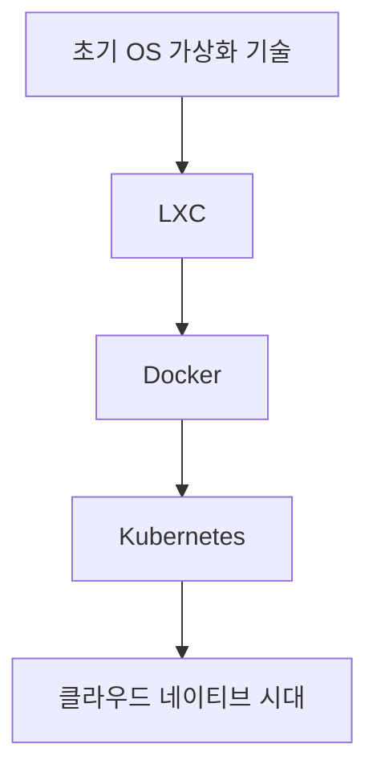

이와 같은 발전 배경은 컨테이너 기술이 현재의 소프트웨어 개발 및 운영 환경에서 필수적인 요소로 자리 잡게 만든 원동력이 되었다.

<!--
## 2. 컨테이너 사용의 장점
   - 일관된 개발 및 운영 환경
   - 배포의 간소화 및 자동화
   - 경량화 및 자원 효율성
   - 보안성 강화
-->

## 2. 컨테이너 사용의 장점

컨테이너 기술은 현대 소프트웨어 개발 및 운영 환경에서 많은 장점을 제공한다. 이 장에서는 컨테이너 사용의 주요 장점에 대해 살펴보겠다.

**일관된 개발 및 운영 환경**

컨테이너는 애플리케이션과 그 의존성을 패키징하여 일관된 환경에서 실행할 수 있도록 한다. 개발자는 로컬 환경에서 컨테이너를 사용하여 애플리케이션을 개발하고, 운영팀은 동일한 컨테이너 이미지를 프로덕션 환경에 배포할 수 있다. 이로 인해 "내 컴퓨터에서는 잘 되는데"라는 문제를 최소화할 수 있다.

**배포의 간소화 및 자동화** 

컨테이너는 애플리케이션의 배포 과정을 간소화하고 자동화할 수 있는 도구를 제공한다. CI/CD 파이프라인을 통해 컨테이너 이미지를 자동으로 빌드하고 배포할 수 있으며, 이는 개발 주기를 단축시키고 인적 오류를 줄이는 데 기여한다.

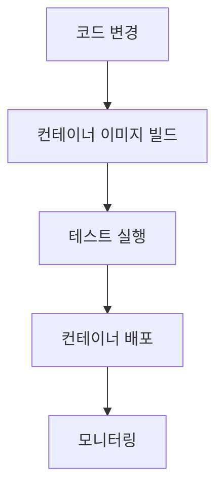

**경량화 및 자원 효율성** 

컨테이너는 가상 머신에 비해 경량화된 환경을 제공한다. 여러 개의 컨테이너가 동일한 호스트 OS에서 실행될 수 있으며, 이는 자원 사용의 효율성을 높인다. 또한, 컨테이너는 필요할 때만 자원을 소비하므로, 서버 비용을 절감할 수 있다.

**보안성 강화**  

컨테이너는 애플리케이션을 격리된 환경에서 실행하므로, 보안성을 강화할 수 있다. 각 컨테이너는 독립적으로 실행되며, 다른 컨테이너와의 상호작용을 최소화할 수 있다. 또한, 컨테이너 이미지를 정기적으로 업데이트하고 취약점을 관리함으로써 보안성을 더욱 높일 수 있다.

이와 같은 장점들은 컨테이너 기술이 현대 소프트웨어 개발 및 운영에서 널리 사용되는 이유를 잘 설명해준다. 컨테이너를 활용함으로써 개발자와 운영팀은 더 나은 협업과 효율성을 경험할 수 있다.

<!--
## 3. 컨테이너 기술의 역사
   - 초기 OS 가상화 기술 (FreeBSD Jail, Linux-Vserver 등)
   - LXC와 Docker의 출현
   - Kubernetes의 발전과 클라우드 네이티브 시대의 시작
   - OCI(Open Container Initiative)와 CNCF(Cloud Native Computing Foundation)의 역할
-->

## 3. 컨테이너 기술의 역사

컨테이너 기술은 현대 소프트웨어 개발 및 배포의 중요한 요소로 자리 잡았다. 이 기술의 발전은 여러 단계로 나눌 수 있으며, 각 단계는 기술적 혁신과 함께 진화해왔다. 아래에서는 컨테이너 기술의 역사적 배경을 살펴보겠다.

**초기 OS 가상화 기술 (FreeBSD Jail, Linux-Vserver 등)**

컨테이너 기술의 기원은 초기 OS 가상화 기술에서 시작된다. FreeBSD Jail은 2000년대 초반에 등장하여, 운영 체제의 격리된 환경을 제공하는 기능을 갖추고 있었다. 이 기술은 여러 사용자와 프로세스가 동일한 커널을 공유하면서도 서로 격리된 환경에서 실행될 수 있도록 하였다. Linux-Vserver는 이러한 개념을 Linux 환경으로 확장한 것으로, 여러 가상 서버를 하나의 물리적 서버에서 운영할 수 있게 해주었다. 이러한 초기 기술들은 컨테이너의 기본 개념을 형성하는 데 중요한 역할을 하였다.

**LXC와 Docker의 출현**

2008년, LXC(Linux Containers)가 등장하면서 리눅스 커널의 기능을 활용하여 컨테이너를 보다 쉽게 사용할 수 있게 되었다. LXC는 프로세스 격리와 자원 관리를 위한 기능을 제공하며, 개발자들이 컨테이너를 활용할 수 있는 기반을 마련하였다. 그러나 2013년 Docker의 출현은 컨테이너 기술의 혁신적인 변화를 가져왔다. Docker는 사용자가 컨테이너를 쉽게 생성하고 배포할 수 있도록 도와주는 도구로, 컨테이너 이미지의 관리와 배포를 간소화하였다. Docker의 인기로 인해 컨테이너 기술은 빠르게 확산되었고, 많은 개발자들이 이를 채택하게 되었다.

**Kubernetes의 발전과 클라우드 네이티브 시대의 시작**

컨테이너의 사용이 증가함에 따라, 이를 관리하고 오케스트레이션할 필요성이 대두되었다. 2014년, Google에서 개발한 Kubernetes가 등장하면서 컨테이너 오케스트레이션의 표준으로 자리 잡았다. Kubernetes는 자동화된 배포, 스케일링, 로드 밸런싱 등의 기능을 제공하여, 대규모 컨테이너 환경을 효율적으로 관리할 수 있게 해주었다. 이로 인해 클라우드 네이티브 시대가 시작되었으며, 많은 기업들이 클라우드 환경에서 컨테이너를 활용하게 되었다.

**OCI(Open Container Initiative)와 CNCF(Cloud Native Computing Foundation)의 역할**

컨테이너 기술의 발전과 확산에 따라, 표준화의 필요성이 대두되었다. 2015년, OCI(Open Container Initiative)가 설립되어 컨테이너 이미지와 런타임의 표준화를 추진하였다. OCI는 다양한 벤더와 커뮤니티가 참여하여, 컨테이너 기술의 상호 운용성을 높이는 데 기여하고 있다. 또한, CNCF(Cloud Native Computing Foundation)는 클라우드 네이티브 기술의 발전을 지원하는 조직으로, Kubernetes와 같은 프로젝트를 관리하고 있다. 이 두 조직은 컨테이너 기술의 발전과 생태계의 성장을 이끄는 중요한 역할을 하고 있다.

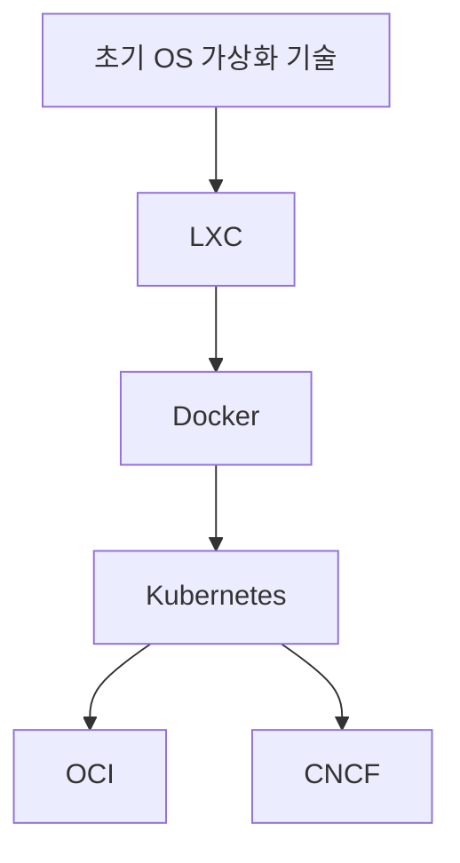

위의 다이어그램은 컨테이너 기술의 발전 과정을 시각적으로 나타낸 것이다. 각 단계는 서로 연결되어 있으며, 현대의 컨테이너 생태계를 형성하는 데 기여하고 있다. 이러한 역사적 배경을 이해하는 것은 컨테이너 기술의 현재와 미래를 예측하는 데 중요한 기초가 된다.

<!--
## 4. 컨테이너의 구조와 작동 원리
   - 컨테이너 이미지와 실행
   - Docker Engine의 역할
   - 표준화된 패키징 및 배포 방식
-->

## 4. 컨테이너의 구조와 작동 원리

컨테이너 기술은 현대 소프트웨어 개발 및 배포에서 중요한 역할을 하고 있다. 이 장에서는 컨테이너의 구조와 작동 원리에 대해 살펴보겠다.

**컨테이너 이미지와 실행**  

컨테이너는 애플리케이션과 그 실행에 필요한 모든 종속성을 포함하는 패키지인 컨테이너 이미지로부터 생성된다. 컨테이너 이미지는 파일 시스템의 스냅샷으로, 애플리케이션 코드, 라이브러리, 환경 변수 및 설정 파일을 포함하고 있다. 이러한 이미지는 불변성을 가지며, 여러 환경에서 동일하게 실행될 수 있다.

컨테이너 이미지를 실행하면, 해당 이미지의 파일 시스템이 컨테이너 런타임에 의해 읽혀지고, 격리된 환경에서 애플리케이션이 실행된다. 이 과정에서 컨테이너는 호스트 운영 체제의 커널을 공유하지만, 각 컨테이너는 독립적인 프로세스 공간을 가지게 된다.

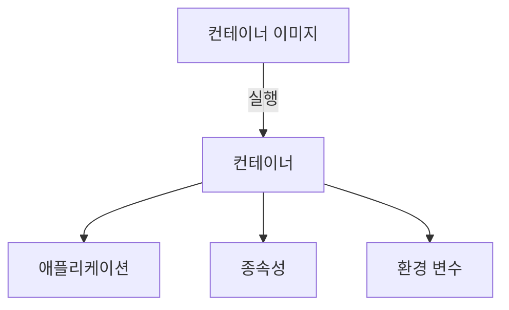

**Docker Engine의 역할** 

Docker Engine은 컨테이너를 생성하고 관리하는 핵심 구성 요소이다. Docker Engine은 클라이언트-서버 구조로 되어 있으며, 클라이언트는 Docker 명령어를 통해 서버와 통신하여 컨테이너를 관리한다. 서버는 컨테이너를 실행하고, 이미지와 네트워크, 볼륨 등을 관리하는 역할을 한다.

Docker Engine은 다음과 같은 주요 기능을 제공한다:
- **이미지 빌드**: Dockerfile을 기반으로 컨테이너 이미지를 생성할 수 있다.
- **컨테이너 실행**: 생성된 이미지를 기반으로 컨테이너를 실행할 수 있다.
- **네트워크 관리**: 컨테이너 간의 통신을 위한 네트워크를 설정할 수 있다.
- **데이터 관리**: 컨테이너의 데이터를 영구적으로 저장하기 위한 볼륨을 관리할 수 있다.

**표준화된 패키징 및 배포 방식**

컨테이너 기술의 큰 장점 중 하나는 표준화된 패키징 및 배포 방식이다. Docker와 같은 컨테이너 플랫폼은 컨테이너 이미지를 표준화된 형식으로 패키징하여, 다양한 환경에서 일관되게 실행될 수 있도록 한다. 이러한 표준화는 개발자와 운영팀 간의 협업을 용이하게 하며, CI/CD 파이프라인에서의 자동화된 배포를 가능하게 한다.

컨테이너 이미지는 Docker Hub와 같은 레지스트리에 저장되고, 필요할 때마다 다운로드하여 사용할 수 있다. 이를 통해 애플리케이션의 배포가 간소화되고, 버전 관리가 용이해진다.

이와 같은 구조와 원리를 통해 컨테이너 기술은 현대 소프트웨어 개발의 효율성을 높이고, 다양한 환경에서의 일관성을 제공하고 있다.

<!--
## 5. 컨테이너 오케스트레이션
   - Kubernetes의 개요 및 기능
   - 다른 오케스트레이션 도구 (OpenShift, Mesos 등)
   - 컨테이너 관리 및 배포 전략
-->

## 5. 컨테이너 오케스트레이션

컨테이너 오케스트레이션은 여러 개의 컨테이너를 관리하고 조정하는 과정을 의미한다. 이는 특히 대규모 애플리케이션을 운영할 때 필수적인 요소로, 자동화된 배포, 확장, 로드 밸런싱, 모니터링 등을 포함한다. 이 장에서는 Kubernetes의 개요와 기능, 다른 오케스트레이션 도구, 그리고 컨테이너 관리 및 배포 전략에 대해 살펴보겠다.

**Kubernetes의 개요 및 기능**

Kubernetes는 구글에서 개발한 오픈소스 컨테이너 오케스트레이션 플랫폼이다. 이는 컨테이너화된 애플리케이션의 배포, 관리, 확장을 자동화하는 데 중점을 두고 있다. Kubernetes의 주요 기능은 다음과 같다.

- **자동화된 배포**: 애플리케이션의 배포를 자동으로 수행하여, 수동으로 배포할 필요가 없다.
- **스케일링**: 필요에 따라 컨테이너의 수를 자동으로 조정할 수 있다.
- **로드 밸런싱**: 여러 컨테이너에 트래픽을 분산시켜, 안정적인 서비스를 제공한다.
- **자체 복구**: 실패한 컨테이너를 자동으로 재시작하거나 교체하여, 서비스의 가용성을 높인다.

다음은 Kubernetes의 기본 아키텍처를 나타내는 다이어그램이다.

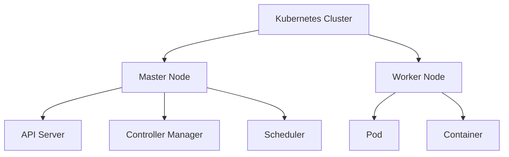

**다른 오케스트레이션 도구 (OpenShift, Mesos 등)**

Kubernetes 외에도 여러 오케스트레이션 도구가 존재한다. 그 중 일부는 다음과 같다.

- **OpenShift**: Red Hat에서 개발한 Kubernetes 기반의 플랫폼으로, 개발자와 운영팀 간의 협업을 지원하는 기능이 강화되어 있다.
- **Apache Mesos**: 대규모 클러스터 관리를 위한 오픈소스 프로젝트로, 다양한 작업을 동시에 실행할 수 있는 기능을 제공한다.
- **Docker Swarm**: Docker에서 제공하는 오케스트레이션 도구로, Docker 환경에서의 간편한 클러스터 관리를 지원한다.

각 도구는 특정한 요구 사항과 환경에 따라 장단점이 있으므로, 사용자는 자신의 필요에 맞는 도구를 선택해야 한다.

**컨테이너 관리 및 배포 전략**

컨테이너를 효과적으로 관리하고 배포하기 위해서는 몇 가지 전략을 고려해야 한다.

1. **CI/CD 통합**: 지속적인 통합 및 배포(CI/CD) 파이프라인을 구축하여, 코드 변경 사항이 자동으로 배포되도록 한다.
2. **모니터링 및 로깅**: 컨테이너의 상태를 모니터링하고, 로그를 수집하여 문제를 조기에 발견하고 해결할 수 있도록 한다.
3. **버전 관리**: 컨테이너 이미지를 버전 관리하여, 이전 버전으로 쉽게 롤백할 수 있는 체계를 마련한다.
4. **리소스 관리**: 각 컨테이너에 필요한 리소스를 적절히 할당하여, 성능 저하를 방지한다.

이러한 전략을 통해 컨테이너의 관리와 배포를 효율적으로 수행할 수 있으며, 안정적인 서비스 운영이 가능해진다.

<!--
## 6. 컨테이너의 단점 및 고려사항
   - 성능 문제 및 오버헤드
   - 보안 취약점 및 격리 문제
   - 복잡한 네트워크 구성
   - 적절한 사용 사례와 대안 기술
-->

## 6. 컨테이너의 단점 및 고려사항

컨테이너 기술은 많은 장점을 제공하지만, 그와 동시에 몇 가지 단점과 고려해야 할 사항도 존재한다. 이 섹션에서는 성능 문제, 보안 취약점, 복잡한 네트워크 구성, 그리고 적절한 사용 사례와 대안 기술에 대해 살펴보겠다.

**성능 문제 및 오버헤드**

컨테이너는 가상 머신보다 경량화된 환경을 제공하지만, 여전히 성능 오버헤드가 발생할 수 있다. 특히, I/O 집약적인 작업이나 CPU 집약적인 작업에서는 성능 저하가 나타날 수 있다. 이는 컨테이너가 호스트 OS의 커널을 공유하기 때문에 발생하는 문제로, 리소스 경합이 발생할 수 있다. 

예를 들어, 여러 개의 컨테이너가 동일한 디스크 I/O를 사용할 경우, 성능 저하가 발생할 수 있다. 이를 해결하기 위해서는 리소스 할당을 적절히 조정하고, 필요에 따라 컨테이너를 분리하여 실행하는 것이 필요하다.

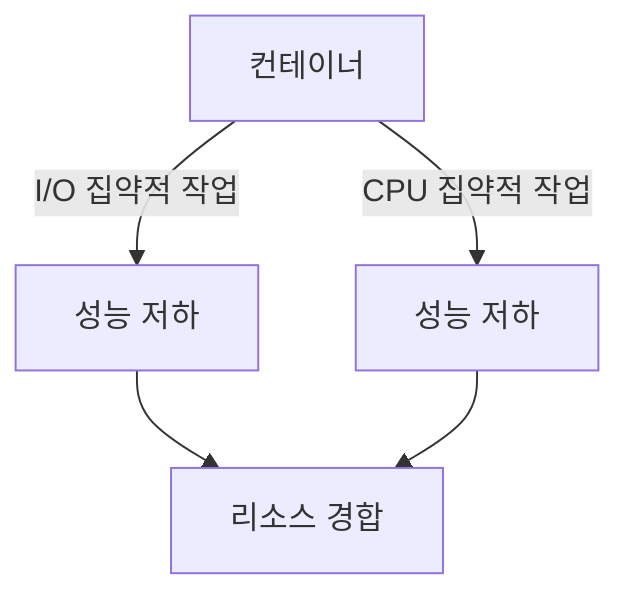

**보안 취약점 및 격리 문제**

컨테이너는 프로세스 격리를 제공하지만, 완전한 보안성을 보장하지는 않는다. 컨테이너가 호스트 OS의 커널을 공유하기 때문에, 하나의 컨테이너에서 발생한 보안 취약점이 다른 컨테이너나 호스트 시스템에 영향을 미칠 수 있다. 

따라서, 컨테이너를 사용할 때는 보안 모범 사례를 준수하고, 필요한 경우 보안 도구를 활용하여 취약점을 사전에 방지해야 한다. 예를 들어, 컨테이너 이미지의 취약점을 스캔하고, 최소 권한 원칙을 적용하는 것이 중요하다.

**복잡한 네트워크 구성**

컨테이너 환경에서는 네트워크 구성이 복잡해질 수 있다. 여러 개의 컨테이너가 서로 통신해야 할 경우, 네트워크 설정이 복잡해지고, 이로 인해 문제 해결이 어려워질 수 있다. 

특히, 컨테이너 오케스트레이션 도구를 사용할 경우, 네트워크 정책과 서비스 디스커버리 설정이 추가로 필요하다. 이러한 복잡성을 줄이기 위해서는 네트워크 관리 도구를 활용하거나, 표준화된 네트워크 아키텍처를 적용하는 것이 좋다.

**적절한 사용 사례와 대안 기술**

컨테이너는 모든 상황에서 최적의 선택이 아닐 수 있다. 특정 애플리케이션이나 워크로드는 전통적인 가상 머신이나 물리 서버에서 더 나은 성능을 발휘할 수 있다. 따라서, 컨테이너를 도입하기 전에 적절한 사용 사례를 분석하고, 필요에 따라 대안 기술을 고려해야 한다.

예를 들어, 상태가 있는 애플리케이션이나 높은 성능을 요구하는 애플리케이션은 가상 머신이나 물리 서버에서 운영하는 것이 더 적합할 수 있다. 이러한 경우, 컨테이너와 가상 머신의 조합을 통해 최적의 환경을 구축하는 것도 하나의 방법이다.

결론적으로, 컨테이너 기술은 많은 장점을 제공하지만, 그에 따른 단점과 고려사항도 존재한다. 따라서, 컨테이너를 도입하기 전에는 이러한 요소들을 충분히 검토하고, 적절한 전략을 수립하는 것이 중요하다.

<!--
## 7. 예제
   - Docker를 이용한 간단한 컨테이너 생성 및 배포 예제
   - Kubernetes를 이용한 컨테이너 오케스트레이션 예제
   - Podman을 이용한 컨테이너 관리 예제
-->

## 7. 예제

**Docker를 이용한 간단한 컨테이너 생성 및 배포 예제**

Docker는 컨테이너 기술의 대표적인 플랫폼으로, 간단한 명령어로 컨테이너를 생성하고 배포할 수 있다. 아래는 Docker를 이용하여 간단한 웹 서버를 실행하는 예제이다.

1. **Docker 설치**: 먼저 Docker를 설치해야 한다. 각 운영체제에 맞는 설치 방법을 따라 설치하면 된다.
   
2. **Docker 이미지 다운로드**: 아래 명령어를 통해 Nginx 웹 서버 이미지를 다운로드한다.
   ```bash
   docker pull nginx
   ```

3. **컨테이너 실행**: 다운로드한 이미지를 기반으로 컨테이너를 실행한다.
   ```bash
   docker run -d -p 80:80 nginx
   ```

4. **웹 서버 확인**: 웹 브라우저에서 `http://localhost`에 접속하여 Nginx 환영 페이지를 확인할 수 있다.

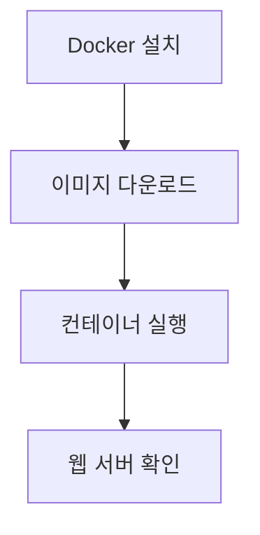

**Kubernetes를 이용한 컨테이너 오케스트레이션 예제**

Kubernetes는 컨테이너 오케스트레이션을 위한 강력한 도구로, 여러 개의 컨테이너를 관리하고 배포하는 데 유용하다. 아래는 Kubernetes를 이용하여 Nginx 웹 서버를 배포하는 예제이다.

1. **Kubernetes 클러스터 설정**: Minikube 또는 클라우드 제공업체의 Kubernetes 서비스를 이용하여 클러스터를 설정한다.

2. **Deployment YAML 파일 작성**: 아래와 같은 `nginx-deployment.yaml` 파일을 작성한다.
   ```yaml
   apiVersion: apps/v1
   kind: Deployment
   metadata:
     name: nginx-deployment
   spec:
     replicas: 2
     selector:
       matchLabels:
         app: nginx
     template:
       metadata:
         labels:
           app: nginx
       spec:
         containers:
         - name: nginx
           image: nginx
           ports:
           - containerPort: 80
   ```

3. **Deployment 생성**: 아래 명령어를 통해 Deployment를 생성한다.
   ```bash
   kubectl apply -f nginx-deployment.yaml
   ```

4. **서비스 생성**: 외부에서 접근할 수 있도록 서비스를 생성한다.
   ```yaml
   apiVersion: v1
   kind: Service
   metadata:
     name: nginx-service
   spec:
     type: NodePort
     ports:
       - port: 80
         targetPort: 80
     selector:
       app: nginx
   ```

5. **서비스 생성 명령어**: 아래 명령어를 통해 서비스를 생성한다.
   ```bash
   kubectl apply -f nginx-service.yaml
   ```

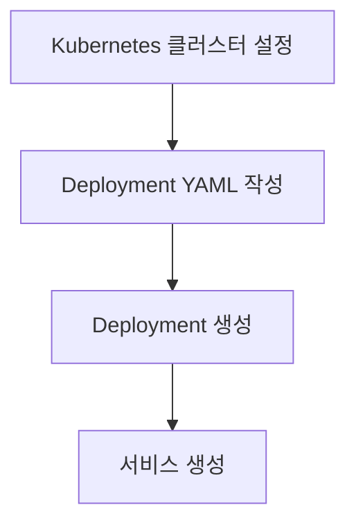

**Podman을 이용한 컨테이너 관리 예제**

Podman은 Docker와 유사한 CLI를 제공하는 컨테이너 관리 도구로, 데몬 없이 작동할 수 있는 장점이 있다. 아래는 Podman을 이용하여 간단한 컨테이너를 생성하고 실행하는 예제이다.

1. **Podman 설치**: 각 운영체제에 맞는 방법으로 Podman을 설치한다.

2. **컨테이너 실행**: 아래 명령어를 통해 Nginx 웹 서버를 실행한다.
   ```bash
   podman run -d -p 80:80 nginx
   ```

3. **컨테이너 목록 확인**: 실행 중인 컨테이너 목록을 확인할 수 있다.
   ```bash
   podman ps
   ```

4. **웹 서버 확인**: 웹 브라우저에서 `http://localhost`에 접속하여 Nginx 환영 페이지를 확인할 수 있다.

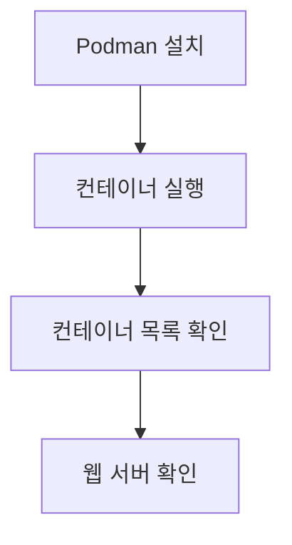

위의 예제들은 각각 Docker, Kubernetes, Podman을 이용하여 컨테이너를 생성하고 관리하는 방법을 보여준다. 각 도구의 특성과 사용 방법을 이해하는 데 도움이 될 것이다.

<!--
## 8. FAQ
   - 컨테이너와 가상 머신의 차이점은 무엇인가요?
   - 컨테이너 보안을 강화하는 방법은?
   - 어떤 상황에서 컨테이너를 사용해야 하나요?
   - 컨테이너화된 애플리케이션의 모니터링 방법은?
-->

## 8. FAQ

**컨테이너와 가상 머신의 차이점은 무엇인가요?**

컨테이너와 가상 머신(VM)은 모두 애플리케이션을 격리하여 실행하는 기술이지만, 그 작동 방식에는 큰 차이가 있다. 가상 머신은 하드웨어 가상화를 통해 운영 체제(OS)를 포함한 전체 시스템을 가상화하는 반면, 컨테이너는 호스트 OS의 커널을 공유하고 애플리케이션과 그 의존성만을 패키징하여 실행한다. 이로 인해 컨테이너는 더 경량화되고 빠른 시작 시간을 가지며, 자원 효율성이 높다. 아래는 두 기술의 주요 차이점을 정리한 표이다.

| 특성               | 컨테이너                     | 가상 머신                   |
|------------------|---------------------------|---------------------------|
| 격리 수준          | 프로세스 수준 격리             | 하드웨어 수준 격리            |
| 시작 시간          | 초 단위                      | 분 단위                     |
| 자원 사용          | 경량화 (수 MB)               | 무겁고 많은 자원 소모 (GB 단위) |
| OS 요구 사항      | 호스트 OS와 동일한 커널 사용   | 각 VM마다 별도의 OS 필요       |

**컨테이너 보안을 강화하는 방법은?**

컨테이너 보안을 강화하기 위해서는 여러 가지 방법을 고려할 수 있다. 첫째, 최소 권한 원칙을 적용하여 컨테이너가 필요한 권한만을 가지도록 설정해야 한다. 둘째, 이미지 스캐닝 도구를 사용하여 취약점을 사전에 점검하고, 신뢰할 수 있는 이미지 레지스트리에서 이미지를 가져오는 것이 중요하다. 셋째, 네트워크 정책을 설정하여 컨테이너 간의 통신을 제한하고, 마지막으로, 컨테이너 런타임에서 보안 모드를 활성화하여 비정상적인 행동을 감지할 수 있도록 해야 한다.

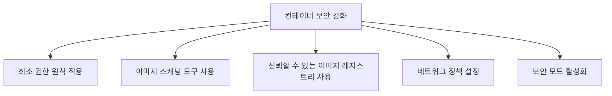

**어떤 상황에서 컨테이너를 사용해야 하나요?**

컨테이너는 다음과 같은 상황에서 특히 유용하다. 첫째, 마이크로서비스 아키텍처를 채택하여 여러 개의 독립적인 서비스로 구성된 애플리케이션을 운영할 때, 각 서비스의 배포와 관리를 용이하게 해준다. 둘째, 개발 및 테스트 환경을 일관되게 유지하고 싶을 때, 컨테이너를 사용하여 동일한 환경을 재현할 수 있다. 셋째, 클라우드 환경에서 애플리케이션을 배포할 때, 컨테이너는 이식성과 확장성을 제공하여 유연한 운영이 가능하다.

**컨테이너화된 애플리케이션의 모니터링 방법은?**

컨테이너화된 애플리케이션을 모니터링하기 위해서는 여러 도구와 기법을 사용할 수 있다. Prometheus와 Grafana를 조합하여 메트릭 수집 및 시각화를 할 수 있으며, ELK 스택(Elasticsearch, Logstash, Kibana)을 통해 로그를 수집하고 분석할 수 있다. 또한, Kubernetes 환경에서는 Kube-state-metrics와 같은 도구를 사용하여 클러스터 상태를 모니터링할 수 있다. 이러한 도구들은 컨테이너의 성능과 상태를 실시간으로 파악하는 데 도움을 준다.

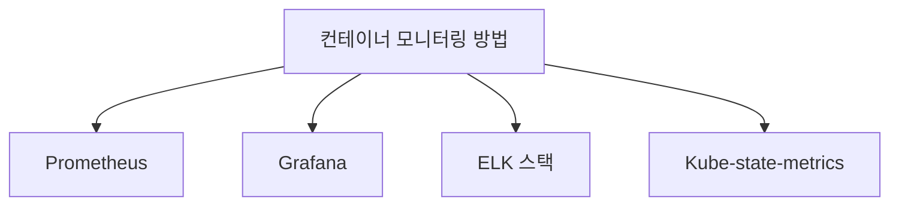

이와 같은 방법들을 통해 컨테이너화된 애플리케이션의 성능을 효과적으로 모니터링하고, 문제를 조기에 발견하여 대응할 수 있다.

<!--
## 9. 관련 기술
   - CI/CD와 컨테이너의 통합
   - 마이크로서비스 아키텍처와 컨테이너
   - 클라우드 서비스와 컨테이너화
   - 서버리스 컴퓨팅과의 관계
-->

## 9. 관련 기술

컨테이너 기술은 다양한 현대 소프트웨어 개발 및 운영 방식과 밀접하게 연관되어 있다. 이 섹션에서는 CI/CD, 마이크로서비스 아키텍처, 클라우드 서비스, 그리고 서버리스 컴퓨팅과의 관계를 살펴보겠다.

**CI/CD와 컨테이너의 통합**

CI/CD(지속적 통합 및 지속적 배포)는 소프트웨어 개발 프로세스를 자동화하여 코드 변경 사항을 신속하게 배포할 수 있도록 돕는 방법론이다. 컨테이너는 이러한 CI/CD 파이프라인에서 중요한 역할을 한다. 컨테이너를 사용하면 개발자는 일관된 환경에서 애플리케이션을 빌드하고 테스트할 수 있으며, 이를 통해 배포 과정에서 발생할 수 있는 문제를 최소화할 수 있다.

예를 들어, Jenkins와 Docker를 통합하여 CI/CD 파이프라인을 구축할 수 있다. 아래는 Jenkins에서 Docker를 사용하여 컨테이너를 빌드하고 배포하는 간단한 예제이다.

```groovy
pipeline {
    agent any
    stages {
        stage('Build') {
            steps {
                script {
                    docker.build('my-app')
                }
            }
        }
        stage('Deploy') {
            steps {
                script {
                    docker.image('my-app').run()
                }
            }
        }
    }
}
```

**마이크로서비스 아키텍처와 컨테이너**

마이크로서비스 아키텍처는 애플리케이션을 독립적인 서비스로 나누어 개발하는 접근 방식이다. 각 서비스는 독립적으로 배포 및 확장 가능하며, 컨테이너는 이러한 마이크로서비스를 관리하는 데 매우 유용하다. 컨테이너를 사용하면 각 서비스가 필요한 라이브러리와 종속성을 포함하여 격리된 환경에서 실행될 수 있다.

아래는 마이크로서비스 아키텍처의 다이어그램이다.

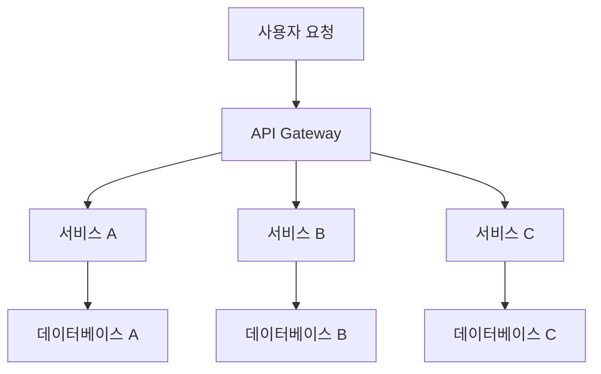

**클라우드 서비스와 컨테이너화**

클라우드 서비스는 컨테이너화된 애플리케이션을 배포하고 관리하는 데 최적의 환경을 제공한다. AWS, Google Cloud, Azure와 같은 클라우드 플랫폼은 컨테이너 오케스트레이션 도구인 Kubernetes를 지원하여 대규모 애플리케이션을 쉽게 관리할 수 있도록 돕는다. 클라우드 환경에서 컨테이너를 사용하면 자원 효율성을 극대화하고, 필요에 따라 자동으로 확장할 수 있는 장점이 있다.

**서버리스 컴퓨팅과의 관계**

서버리스 컴퓨팅은 개발자가 서버 관리에 대한 걱정 없이 애플리케이션을 개발할 수 있도록 해주는 모델이다. 컨테이너는 서버리스 아키텍처에서도 사용될 수 있으며, AWS Lambda와 같은 서비스는 컨테이너 기반의 실행 환경을 제공한다. 이를 통해 개발자는 코드에 집중할 수 있으며, 필요할 때만 자원을 소비하는 효율적인 운영이 가능하다.

결론적으로, 컨테이너 기술은 CI/CD, 마이크로서비스 아키텍처, 클라우드 서비스, 서버리스 컴퓨팅 등 다양한 관련 기술과의 통합을 통해 현대 소프트웨어 개발의 효율성을 높이고 있다. 이러한 통합은 개발자와 운영팀이 더 나은 성과를 달성할 수 있도록 돕는다.

<!--
## 10. 결론
   - 컨테이너 기술의 미래 전망
   - 컨테이너 사용의 최적화 및 지속적인 발전 방향
   - 기술 선택 시 고려해야 할 요소들
-->

## 10. 결론

**컨테이너 기술의 미래 전망** 

컨테이너 기술은 클라우드 컴퓨팅과 마이크로서비스 아키텍처의 발전과 함께 지속적으로 성장할 것으로 예상된다. 특히, 서버리스 컴퓨팅과의 통합이 더욱 활발해질 것이며, 이는 개발자들이 애플리케이션을 더욱 빠르고 효율적으로 배포할 수 있도록 도와줄 것이다. 또한, AI와 머신러닝 기술의 발전으로 인해 컨테이너 관리 및 오케스트레이션의 자동화가 더욱 강화될 것으로 보인다. 이러한 변화는 기업들이 더 나은 성능과 확장성을 갖춘 애플리케이션을 제공할 수 있는 기반이 될 것이다.

**컨테이너 사용의 최적화 및 지속적인 발전 방향** 

컨테이너 사용의 최적화를 위해서는 지속적인 모니터링과 성능 분석이 필요하다. 이를 통해 자원 사용을 최적화하고, 불필요한 오버헤드를 줄일 수 있다. 또한, 컨테이너 보안 강화와 관련된 기술들이 발전함에 따라, 보안성을 높이는 방향으로의 발전이 이루어질 것이다. 예를 들어, 보안 스캐닝 도구와 정책 기반의 접근 제어가 통합되어 컨테이너 환경의 보안을 더욱 강화할 수 있다.

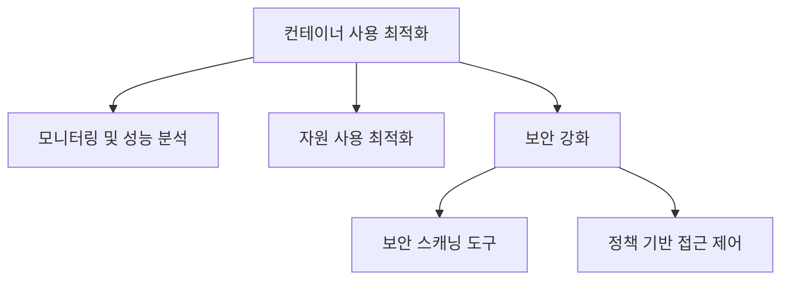

**기술 선택 시 고려해야 할 요소들**  

컨테이너 기술을 선택할 때는 여러 요소를 고려해야 한다. 첫째, 팀의 기술 스택과 경험을 고려하여 적합한 도구를 선택해야 한다. 둘째, 애플리케이션의 요구 사항에 따라 적절한 오케스트레이션 도구를 선택하는 것이 중요하다. 셋째, 보안 및 규정 준수 요구 사항을 충족할 수 있는지 확인해야 한다. 마지막으로, 커뮤니티 지원과 문서화 수준도 중요한 요소로 작용할 수 있다. 이러한 요소들을 종합적으로 고려하여 최적의 기술 선택을 할 수 있어야 한다.

<!--
## 11. 참고 자료
   - 관련 블로그 및 문서 링크
   - 컨테이너 관련 오픈소스 프로젝트
   - 커뮤니티 및 포럼 정보
-->

## 11. 참고 자료

**관련 블로그 및 문서 링크**  

컨테이너 기술에 대한 깊이 있는 이해를 위해 다음의 블로그 및 문서 링크를 참고할 수 있다. 

- [Docker 공식 문서](https://docs.docker.com/)  
  Docker의 설치, 사용법 및 다양한 기능에 대한 공식 문서이다.

- [Kubernetes 공식 문서](https://kubernetes.io/docs/)  
  Kubernetes의 설치 및 운영에 대한 공식 가이드이다.

- [Containerization: A Comprehensive Guide](https://www.example.com/containerization-guide)  
  컨테이너화의 개념과 이점에 대해 설명하는 포괄적인 가이드이다.

**컨테이너 관련 오픈소스 프로젝트**  
컨테이너 기술을 활용한 다양한 오픈소스 프로젝트가 존재한다. 이들 프로젝트는 실제로 컨테이너를 사용하여 개발 및 운영 환경을 개선하는 데 기여하고 있다.

- **Docker**  
  컨테이너를 쉽게 만들고 관리할 수 있는 플랫폼이다. GitHub에서 [Docker Repository](https://github.com/docker/docker)에서 소스 코드를 확인할 수 있다.

- **Kubernetes**  
  컨테이너 오케스트레이션을 위한 오픈소스 플랫폼으로, GitHub에서 [Kubernetes Repository](https://github.com/kubernetes/kubernetes)에서 소스 코드를 확인할 수 있다.

- **Podman**  
  Docker와 유사하지만, 데몬 없이 컨테이너를 관리할 수 있는 도구이다. GitHub에서 [Podman Repository](https://github.com/containers/podman)에서 소스 코드를 확인할 수 있다.

**커뮤니티 및 포럼 정보**  
컨테이너 기술에 대한 질문이나 정보를 얻기 위해 참여할 수 있는 커뮤니티와 포럼이 있다.

- **Docker Community Forums**  
  Docker 사용자들이 모여 정보를 공유하고 질문을 할 수 있는 포럼이다. [Docker Community Forums](https://forums.docker.com/)에서 참여할 수 있다.

- **Kubernetes Slack**  
  Kubernetes 관련 질문이나 논의를 위한 Slack 채널이다. [Kubernetes Slack](http://slack.k8s.io/)에서 가입할 수 있다.

- **Stack Overflow**  
  다양한 기술 관련 질문과 답변을 찾을 수 있는 플랫폼으로, 컨테이너 관련 태그를 통해 정보를 검색할 수 있다. [Stack Overflow](https://stackoverflow.com/questions/tagged/docker)에서 관련 질문을 찾아볼 수 있다.

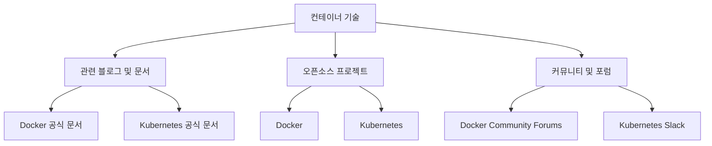

위의 자료들은 컨테이너 기술에 대한 이해를 돕고, 실무에서 활용할 수 있는 유용한 정보들을 제공한다. 각 링크와 프로젝트를 통해 더 많은 지식을 쌓을 수 있을 것이다.

<!--
##### Reference #####
-->

## Reference


* [https://itnext.io/containers-has-the-pendulum-swung-too-far-208ad02a6b42](https://itnext.io/containers-has-the-pendulum-swung-too-far-208ad02a6b42)
* [https://www.openmaru.io/%EC%BB%A8%ED%85%8C%EC%9D%B4%EB%84%88-%EA%B8%B0%EC%88%A0-%EC%86%8C%EA%B0%9C/](https://www.openmaru.io/%EC%BB%A8%ED%85%8C%EC%9D%B4%EB%84%88-%EA%B8%B0%EC%88%A0-%EC%86%8C%EA%B0%9C/)
* [https://www.openmaru.io/%ec%bb%a8%ed%85%8c%ec%9d%b4%eb%84%88-%ea%b8%b0%ec%88%a0%ec%9d%98-%ec%97%ad%ec%82%ac%ec%99%80-%eb%b0%9c%ec%a0%84/](https://www.openmaru.io/%ec%bb%a8%ed%85%8c%ec%9d%b4%eb%84%88-%ea%b8%b0%ec%88%a0%ec%9d%98-%ec%97%ad%ec%82%ac%ec%99%80-%eb%b0%9c%ec%a0%84/)
* [https://www.openmaru.io/%EC%BB%A8%ED%85%8C%EC%9D%B4%EB%84%88-%EC%97%AD%EC%82%AC/](https://www.openmaru.io/%EC%BB%A8%ED%85%8C%EC%9D%B4%EB%84%88-%EC%97%AD%EC%82%AC/)
* [https://www.docker.com/resources/what-container/](https://www.docker.com/resources/what-container/)
* [https://naleejang.tistory.com/228](https://naleejang.tistory.com/228)

