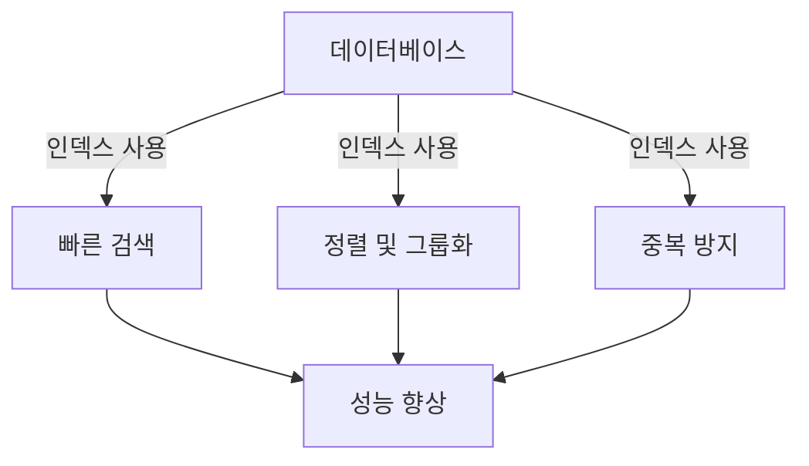
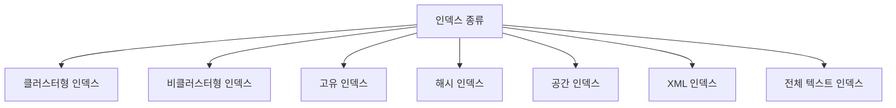
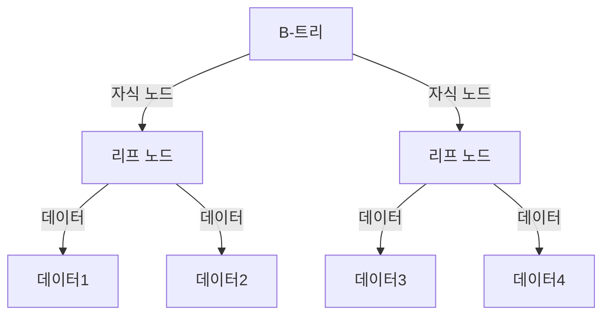
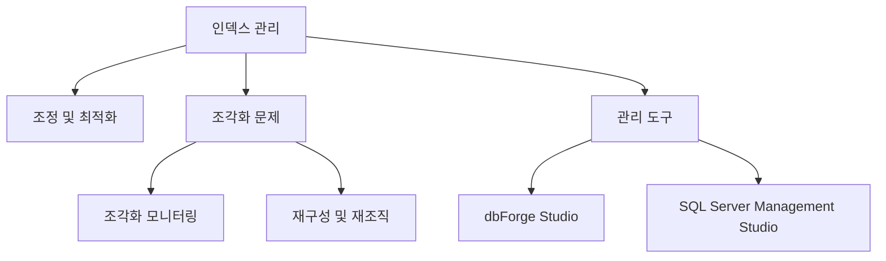
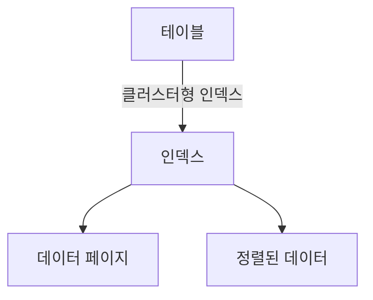
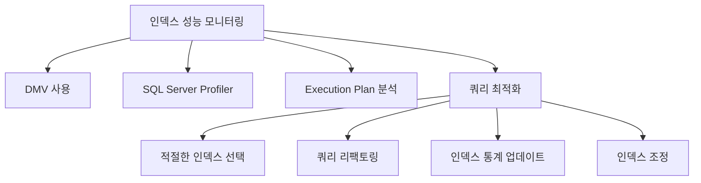
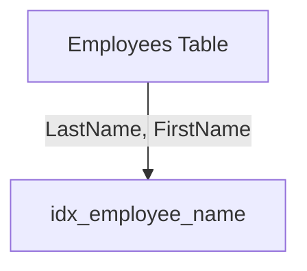
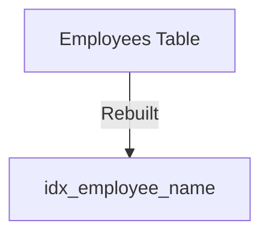
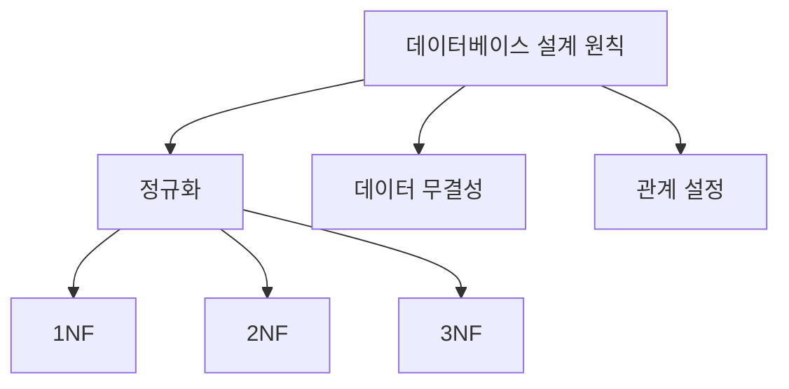
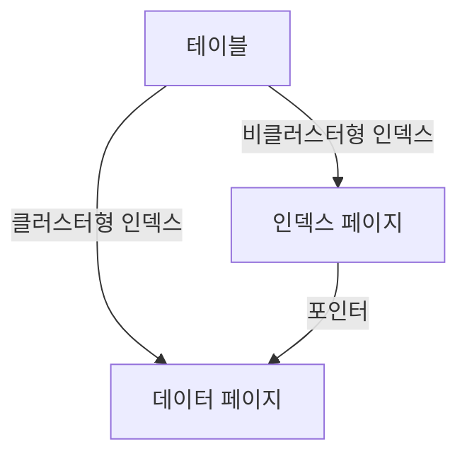

데이터베이스는 데이터를 저장하고 특정 정보에 대한 사용자 접근을 제공하는 데 필수적이다. 이러한 기본 작업은 데이터베이스가 확장되고 데이터 양이 증가하며 데이터 처리 시간이 길어짐에 따라 점점 더 복잡해진다. 대규모 데이터베이스에서 빠르고 효율적인 데이터 검색을 위해 인덱스를 사용한다. SQL 인덱스는 책이나 저널의 색인과 유사하게 작동하며, 테이블 내의 데이터를 참조하는 역할을 한다. 이 글에서는 SQL 인덱스에 대해 탐구하고, 데이터베이스 관리에 대한 이해를 높이는 데 도움을 줄 것이다. SQL 인덱스는 특정 테이블이나 뷰에서 데이터 검색 속도를 높이는 데이터베이스 구성 요소로, 최적화된 조회 테이블로 설계되어 필요한 레코드를 신속하게 찾을 수 있도록 돕는다. 인덱스는 B-트리 구조로 구성되어 있으며, 클러스터형 인덱스와 비클러스터형 인덱스 두 가지 일반적인 유형이 있다. 클러스터형 인덱스는 데이터 행을 특정 물리적 순서로 정렬하고 저장하는 반면, 비클러스터형 인덱스는 선택된 열을 재정렬하여 데이터 행에 대한 포인터를 포함한다. 이러한 인덱스는 데이터베이스의 성능을 향상시키는 데 중요한 역할을 하며, 적절한 인덱스 관리와 유지보수가 필요하다.


||
|:---:|
||


<!--
##### Outline #####
-->

<!--
# SQL 인덱스에 대한 포괄적인 가이드

## 개요
- SQL 인덱스의 중요성
- 데이터베이스 성능 향상

## SQL 인덱스의 종류 이해하기
- 인덱스의 정의
- 클러스터형 인덱스
  - 특징 및 사용 사례
- 비클러스터형 인덱스
  - 특징 및 사용 사례
- 고유 인덱스
- 기타 인덱스 유형
  - 해시 인덱스
  - 공간 인덱스
  - XML 인덱스
  - 전체 텍스트 인덱스

## SQL 인덱스의 작동 원리
- 인덱스의 구조 (B-트리 및 B+트리)
- 인덱스가 쿼리 성능에 미치는 영향
- 인덱스의 생성 및 삭제
  - `CREATE INDEX` 명령어
  - `DROP INDEX` 명령어

## 인덱스 관리 및 유지보수
- 인덱스 조정 및 최적화
- 인덱스 조각화 문제
  - 조각화 모니터링
  - 인덱스 재구성 및 재조직
- 인덱스 관리 도구 소개
  - dbForge Studio for SQL Server
  - SQL Server Management Studio (SSMS)와의 통합

## 인덱스 전략적 고려사항
- 인덱스 사용 시기
  - 인덱스를 구현해야 할 경우
  - 인덱스를 피해야 할 경우
- 클러스터형 인덱스의 특별 고려사항

## 인덱스 성능 모니터링
- SQL Server에서 인덱스 성능 모니터링 방법
- 인덱스 성능 개선을 위한 쿼리 최적화

## 예제
- 인덱스 생성 예제
- 인덱스 삭제 예제
- 인덱스 조정 예제

## FAQ
- 인덱스가 데이터베이스 성능에 미치는 영향은?
- 인덱스가 필요한 이유는 무엇인가요?
- 인덱스가 쿼리 성능을 저하시킬 수 있는 경우는?
- 인덱스의 크기는 어떻게 관리하나요?

## 관련 기술
- 데이터베이스 관리 시스템(DBMS)
- SQL 쿼리 최적화
- 데이터베이스 설계 원칙

## 결론
- SQL 인덱스의 중요성 요약
- 인덱스 관리의 필요성
- 최적의 데이터베이스 성능을 위한 인덱스 전략

## 참고 자료
- SQL 인덱스 관련 문서 및 링크
- 데이터베이스 성능 최적화 관련 자료

이 목차는 SQL 인덱스에 대한 포괄적인 이해를 돕고, 관련된 기술과 전략을 포함하여 독자가 필요한 정보를 쉽게 찾을 수 있도록 구성되었습니다.
-->

<!--
## 개요
- SQL 인덱스의 중요성
- 데이터베이스 성능 향상
-->

## 개요

SQL 인덱스는 데이터베이스에서 데이터를 효율적으로 검색하고 관리하기 위한 중요한 도구이다. 인덱스는 특정 열에 대한 포인터를 제공하여 데이터 검색 속도를 크게 향상시킨다. 이로 인해 대량의 데이터가 있는 테이블에서도 빠른 쿼리 성능을 유지할 수 있다.

**SQL 인덱스의 중요성**

SQL 인덱스는 데이터베이스 성능을 최적화하는 데 필수적이다. 인덱스가 없으면 데이터베이스는 테이블의 모든 행을 순차적으로 검색해야 하므로, 쿼리 성능이 저하된다. 반면, 인덱스를 사용하면 특정 열에 대한 검색이 훨씬 빨라지며, 이는 전체 애플리케이션의 응답 속도에 긍정적인 영향을 미친다. 

예를 들어, 고객 정보를 저장하는 테이블에서 고객 ID를 기준으로 검색할 경우, 인덱스가 없다면 데이터베이스는 모든 고객 정보를 확인해야 하지만, 인덱스가 있다면 해당 고객 ID에 대한 위치를 빠르게 찾을 수 있다.

```sql
CREATE INDEX idx_customer_id ON customers(customer_id);
```

위의 SQL 코드는 `customers` 테이블의 `customer_id` 열에 인덱스를 생성하는 예시이다. 이 인덱스는 고객 ID를 기준으로 한 검색을 빠르게 수행할 수 있도록 도와준다.

**데이터베이스 성능 향상**

인덱스는 데이터베이스의 성능을 향상시키는 여러 방법 중 하나이다. 인덱스를 사용하면 다음과 같은 이점을 얻을 수 있다:

1. **빠른 데이터 검색**: 인덱스는 특정 열에 대한 검색을 최적화하여 쿼리 성능을 향상시킨다.
2. **정렬 및 그룹화 성능 향상**: 인덱스는 데이터 정렬 및 그룹화 작업을 더 효율적으로 수행할 수 있도록 돕는다.
3. **중복 데이터 방지**: 고유 인덱스를 사용하면 중복된 데이터를 방지할 수 있어 데이터 무결성을 유지하는 데 기여한다.

다음은 인덱스가 데이터베이스 성능에 미치는 영향을 시각적으로 나타낸 다이어그램이다.



이와 같이 SQL 인덱스는 데이터베이스의 성능을 향상시키는 데 중요한 역할을 하며, 적절한 인덱스 설계와 관리는 데이터베이스의 효율성을 극대화하는 데 필수적이다.

<!--
## SQL 인덱스의 종류 이해하기
- 인덱스의 정의
- 클러스터형 인덱스
  - 특징 및 사용 사례
- 비클러스터형 인덱스
  - 특징 및 사용 사례
- 고유 인덱스
- 기타 인덱스 유형
  - 해시 인덱스
  - 공간 인덱스
  - XML 인덱스
  - 전체 텍스트 인덱스
-->

## SQL 인덱스의 종류 이해하기

SQL 인덱스는 데이터베이스에서 데이터를 효율적으로 검색하기 위해 사용되는 데이터 구조이다. 인덱스는 특정 열에 대한 검색 성능을 향상시키며, 데이터베이스의 성능을 최적화하는 데 중요한 역할을 한다. 이번 섹션에서는 다양한 종류의 SQL 인덱스에 대해 알아보겠다.

**인덱스의 정의**  

인덱스는 데이터베이스 테이블의 특정 열에 대한 포인터 역할을 하여, 데이터 검색을 빠르게 수행할 수 있도록 돕는 구조이다. 인덱스는 일반적으로 B-트리 또는 해시 테이블과 같은 자료 구조를 사용하여 구현된다.

**클러스터형 인덱스**

클러스터형 인덱스는 테이블의 데이터가 인덱스의 순서에 따라 물리적으로 정렬되어 저장되는 인덱스이다. 즉, 클러스터형 인덱스는 테이블의 기본 키에 해당하는 열에 대해 자동으로 생성된다. 클러스터형 인덱스는 데이터 검색 속도를 크게 향상시킬 수 있지만, 데이터 삽입 및 삭제 시 성능 저하가 발생할 수 있다.

**특징 및 사용 사례** 

- 데이터가 정렬되어 저장되므로 범위 검색에 유리하다.
- 기본 키에 대해 자동으로 생성되며, 하나의 테이블에 하나만 존재할 수 있다.
- 대량의 데이터를 자주 검색하는 경우 유용하다.

```sql
CREATE CLUSTERED INDEX idx_clustered ON Employees (EmployeeID);
```

**비클러스터형 인덱스** 

비클러스터형 인덱스는 테이블의 데이터와는 별도로 저장되는 인덱스이다. 이 인덱스는 데이터의 물리적 순서와는 관계없이, 특정 열에 대한 검색 성능을 향상시키기 위해 사용된다. 비클러스터형 인덱스는 여러 개를 생성할 수 있으며, 각 인덱스는 포인터를 통해 실제 데이터에 접근한다.

**특징 및 사용 사례** 

- 여러 개의 비클러스터형 인덱스를 생성할 수 있다.
- 특정 열에 대한 검색 성능을 향상시키는 데 유리하다.
- 데이터 삽입 및 삭제 시 성능 저하가 적다.

```sql
CREATE NONCLUSTERED INDEX idx_nonclustered ON Employees (LastName);
```

**고유 인덱스**  

고유 인덱스는 인덱스가 적용된 열의 값이 중복되지 않도록 보장하는 인덱스이다. 이 인덱스는 데이터 무결성을 유지하는 데 중요한 역할을 하며, 기본 키와 함께 사용된다.

**기타 인덱스 유형**

- **해시 인덱스**: 해시 함수를 사용하여 데이터를 검색하는 인덱스이다. 주로 키-값 쌍을 빠르게 검색할 때 사용된다.
  
- **공간 인덱스**: 공간 데이터를 효율적으로 검색하기 위해 사용되는 인덱스이다. GIS(지리 정보 시스템) 데이터와 같은 공간 데이터를 처리할 때 유용하다.

- **XML 인덱스**: XML 데이터 타입에 대한 인덱스이다. XML 데이터를 효율적으로 검색하고 쿼리 성능을 향상시키기 위해 사용된다.

- **전체 텍스트 인덱스**: 텍스트 데이터에 대한 검색 성능을 향상시키기 위해 사용되는 인덱스이다. 대량의 텍스트 데이터를 검색할 때 유용하다.



이와 같이 다양한 종류의 SQL 인덱스는 데이터베이스의 성능을 최적화하는 데 중요한 역할을 한다. 각 인덱스의 특징과 사용 사례를 이해하고 적절히 활용하는 것이 데이터베이스 관리의 핵심이다.

<!--
## SQL 인덱스의 작동 원리
- 인덱스의 구조 (B-트리 및 B+트리)
- 인덱스가 쿼리 성능에 미치는 영향
- 인덱스의 생성 및 삭제
  - `CREATE INDEX` 명령어
  - `DROP INDEX` 명령어
-->

## SQL 인덱스의 작동 원리

SQL 인덱스는 데이터베이스에서 데이터를 효율적으로 검색하기 위해 사용되는 구조이다. 인덱스는 데이터베이스 테이블의 특정 열에 대한 포인터를 제공하여, 쿼리 성능을 크게 향상시킬 수 있다. 이번 섹션에서는 인덱스의 구조, 쿼리 성능에 미치는 영향, 그리고 인덱스의 생성 및 삭제 방법에 대해 살펴보겠다.

**인덱스의 구조 (B-트리 및 B+트리)**

인덱스는 일반적으로 B-트리 또는 B+트리 구조로 구현된다. B-트리는 균형 잡힌 트리 구조로, 각 노드가 여러 자식을 가질 수 있으며, 모든 리프 노드가 동일한 깊이에 위치한다. B+트리는 B-트리의 변형으로, 모든 데이터가 리프 노드에만 저장되고, 내부 노드는 검색을 위한 포인터 역할을 한다. 이러한 구조는 데이터 검색 시 빠른 탐색을 가능하게 한다.



**인덱스가 쿼리 성능에 미치는 영향**

인덱스는 쿼리 성능에 긍정적인 영향을 미친다. 인덱스를 사용하면 데이터베이스는 전체 테이블을 스캔하는 대신 인덱스를 통해 필요한 데이터에 빠르게 접근할 수 있다. 예를 들어, WHERE 절에 인덱스가 설정된 열이 포함된 쿼리는 인덱스를 통해 더 빠르게 결과를 반환할 수 있다. 그러나 인덱스가 너무 많거나 비효율적으로 설정되면 오히려 성능 저하를 초래할 수 있으므로 주의가 필요하다.

**인덱스의 생성 및 삭제**

인덱스는 SQL 명령어를 사용하여 생성하고 삭제할 수 있다. 인덱스를 생성할 때는 `CREATE INDEX` 명령어를 사용하며, 특정 테이블의 특정 열에 인덱스를 추가할 수 있다. 예를 들어, 다음과 같은 SQL 문을 통해 인덱스를 생성할 수 있다.

```sql
CREATE INDEX idx_employee_name ON employees(name);
```

위의 SQL 문은 `employees` 테이블의 `name` 열에 인덱스를 생성하는 예시이다.

인덱스를 삭제할 때는 `DROP INDEX` 명령어를 사용한다. 다음은 인덱스를 삭제하는 SQL 문이다.

```sql
DROP INDEX idx_employee_name ON employees;
```

이 명령어는 `employees` 테이블에서 `idx_employee_name` 인덱스를 삭제하는 예시이다. 인덱스를 삭제하면 해당 인덱스에 대한 검색 성능이 저하될 수 있으므로 신중하게 결정해야 한다. 

이와 같이 SQL 인덱스의 작동 원리를 이해하면 데이터베이스 성능을 최적화하는 데 큰 도움이 된다. 인덱스의 구조와 쿼리 성능에 미치는 영향을 잘 이해하고, 적절한 인덱스를 생성 및 관리하는 것이 중요하다.

<!--
## 인덱스 관리 및 유지보수
- 인덱스 조정 및 최적화
- 인덱스 조각화 문제
  - 조각화 모니터링
  - 인덱스 재구성 및 재조직
- 인덱스 관리 도구 소개
  - dbForge Studio for SQL Server
  - SQL Server Management Studio (SSMS)와의 통합
-->

## 인덱스 관리 및 유지보수

인덱스는 데이터베이스 성능을 향상시키는 중요한 요소이다. 그러나 인덱스가 시간이 지남에 따라 조각화되거나 비효율적으로 관리될 경우, 오히려 성능 저하를 초래할 수 있다. 따라서 인덱스의 조정 및 최적화, 조각화 문제 해결, 그리고 적절한 관리 도구의 사용이 필수적이다.

**인덱스 조정 및 최적화**

인덱스 조정은 데이터베이스의 성능을 극대화하기 위해 인덱스를 최적화하는 과정이다. 이를 통해 쿼리 성능을 향상시키고, 불필요한 인덱스를 제거하여 저장 공간을 절약할 수 있다. 인덱스 조정은 주기적으로 수행하는 것이 좋으며, 다음과 같은 방법을 통해 이루어진다.

1. **사용되지 않는 인덱스 식별**: 쿼리 성능을 분석하여 사용되지 않는 인덱스를 찾아 삭제한다.
2. **인덱스 통계 업데이트**: 인덱스 통계를 주기적으로 업데이트하여 쿼리 최적화기가 최신 정보를 바탕으로 최적의 실행 계획을 수립할 수 있도록 한다.

```sql
-- 인덱스 통계 업데이트 예제
UPDATE STATISTICS 테이블명 인덱스명;
```

**인덱스 조각화 문제**

인덱스 조각화는 인덱스 페이지가 비효율적으로 저장되어 쿼리 성능을 저하시킬 수 있는 문제이다. 조각화는 주로 데이터의 삽입, 삭제, 업데이트로 인해 발생한다. 이를 해결하기 위해서는 조각화 모니터링과 인덱스 재구성 및 재조직이 필요하다.

**조각화 모니터링**

조각화 수준을 모니터링하여 인덱스의 성능을 평가할 수 있다. 일반적으로 조각화가 30% 이상인 경우 인덱스 재구성이 필요하다. SQL Server에서는 다음과 같은 쿼리를 통해 조각화 상태를 확인할 수 있다.

```sql
-- 인덱스 조각화 상태 확인 예제
SELECT 
    OBJECT_NAME(object_id) AS TableName,
    name AS IndexName,
    index_id,
    avg_fragmentation_in_percent
FROM sys.dm_db_index_physical_stats(DB_ID(), NULL, NULL, NULL, NULL)
WHERE avg_fragmentation_in_percent > 30;
```

**인덱스 재구성 및 재조직**

인덱스 조각화가 심각한 경우, 인덱스를 재구성하거나 재조직해야 한다. 재구성은 인덱스를 완전히 새로 만드는 과정이며, 재조직은 인덱스를 부분적으로 정리하는 과정이다. 다음은 두 가지 방법의 예시이다.

```sql
-- 인덱스 재구성 예제
ALTER INDEX 인덱스명 ON 테이블명 REBUILD;

-- 인덱스 재조직 예제
ALTER INDEX 인덱스명 ON 테이블명 REORGANIZE;
```

**인덱스 관리 도구 소개**

인덱스 관리를 보다 효율적으로 수행하기 위해 다양한 도구를 사용할 수 있다. 여기서는 두 가지 주요 도구를 소개한다.

**dbForge Studio for SQL Server**

dbForge Studio는 SQL Server 데이터베이스 관리 및 개발을 위한 통합 도구이다. 이 도구는 인덱스 관리 기능을 제공하여 인덱스 조정, 성능 모니터링, 조각화 분석 등을 쉽게 수행할 수 있다.

**SQL Server Management Studio (SSMS)와의 통합**

SQL Server Management Studio(SSMS)는 SQL Server의 기본 관리 도구로, 인덱스 관리 기능을 포함하고 있다. SSMS를 사용하면 인덱스의 생성, 삭제, 조정 및 성능 모니터링을 직관적으로 수행할 수 있다.



인덱스 관리 및 유지보수는 데이터베이스 성능을 최적화하는 데 필수적인 과정이다. 주기적인 조정과 모니터링을 통해 인덱스의 효율성을 유지하고, 적절한 도구를 활용하여 관리하는 것이 중요하다.

<!--
## 인덱스 전략적 고려사항
- 인덱스 사용 시기
  - 인덱스를 구현해야 할 경우
  - 인덱스를 피해야 할 경우
- 클러스터형 인덱스의 특별 고려사항
-->

## 인덱스 전략적 고려사항

인덱스는 데이터베이스 성능을 향상시키는 중요한 요소이다. 그러나 인덱스를 사용할 때는 몇 가지 전략적 고려사항이 필요하다. 이 섹션에서는 인덱스를 사용해야 할 경우와 피해야 할 경우, 그리고 클러스터형 인덱스에 대한 특별 고려사항을 다룬다.

**인덱스 사용 시기**

인덱스를 구현해야 할 경우는 다음과 같다.

1. **빈번한 검색 쿼리**: 데이터베이스에서 특정 열에 대한 검색이 자주 발생하는 경우, 해당 열에 인덱스를 추가하는 것이 좋다. 인덱스는 검색 속도를 크게 향상시킬 수 있다.
   
2. **정렬 및 그룹화**: ORDER BY 또는 GROUP BY 절을 사용하는 쿼리에서 성능을 개선하기 위해 인덱스를 사용할 수 있다. 인덱스는 정렬된 데이터를 제공하므로 이러한 쿼리의 성능을 높일 수 있다.

3. **조인 연산**: 여러 테이블 간의 조인 연산이 빈번하게 발생하는 경우, 조인에 사용되는 열에 인덱스를 추가하면 성능을 개선할 수 있다.

반면, 인덱스를 피해야 할 경우는 다음과 같다.

1. **빈번한 데이터 수정**: INSERT, UPDATE, DELETE 작업이 자주 발생하는 테이블에서는 인덱스가 오히려 성능 저하를 초래할 수 있다. 인덱스는 데이터 수정 시 추가적인 작업을 요구하기 때문이다.

2. **소규모 테이블**: 데이터가 적은 테이블에서는 인덱스의 이점이 크지 않다. 오히려 인덱스를 관리하는 데 드는 비용이 더 클 수 있다.

3. **다양한 쿼리 패턴**: 쿼리 패턴이 다양하고 예측할 수 없는 경우, 인덱스가 효과적이지 않을 수 있다. 이 경우 인덱스의 유지보수 비용이 증가할 수 있다.

** 클러스터형 인덱스의 특별 고려사항 **

클러스터형 인덱스는 데이터가 실제로 저장되는 순서를 결정하므로, 몇 가지 특별한 고려사항이 있다.

1. **기본 키 설정**: 클러스터형 인덱스는 일반적으로 기본 키에 설정된다. 기본 키는 유일성을 보장하므로, 클러스터형 인덱스와 잘 어울린다.

2. **데이터 정렬**: 클러스터형 인덱스는 데이터의 물리적 순서를 결정하므로, 자주 사용되는 쿼리의 정렬 기준에 맞춰 인덱스를 설정하는 것이 중요하다.

3. **인덱스 크기**: 클러스터형 인덱스는 데이터 페이지와 함께 저장되므로, 인덱스의 크기가 데이터베이스의 성능에 영향을 미칠 수 있다. 따라서 인덱스의 크기를 관리하는 것이 중요하다.

다음은 클러스터형 인덱스의 구조를 나타내는 다이어그램이다.



이와 같은 전략적 고려사항을 바탕으로 인덱스를 적절히 활용하면 데이터베이스 성능을 극대화할 수 있다. 인덱스의 사용 여부와 종류를 신중하게 결정하는 것이 중요하다.

<!--
## 인덱스 성능 모니터링
- SQL Server에서 인덱스 성능 모니터링 방법
- 인덱스 성능 개선을 위한 쿼리 최적화
-->

## 인덱스 성능 모니터링

인덱스 성능 모니터링은 데이터베이스의 효율성을 유지하고 최적화하는 데 중요한 역할을 한다. 인덱스가 잘 관리되지 않으면 쿼리 성능이 저하될 수 있으며, 이는 전체 시스템의 성능에 부정적인 영향을 미칠 수 있다. 따라서 SQL Server에서 인덱스 성능을 모니터링하는 방법과 인덱스 성능 개선을 위한 쿼리 최적화 방법을 이해하는 것이 필요하다.

**SQL Server에서 인덱스 성능 모니터링 방법**

SQL Server에서는 다양한 도구와 방법을 통해 인덱스 성능을 모니터링할 수 있다. 그 중 몇 가지 주요 방법은 다음과 같다.

1. **DMV (Dynamic Management Views) 사용하기**  
   SQL Server의 DMV를 사용하여 인덱스의 성능 통계를 조회할 수 있다. 예를 들어, `sys.dm_db_index_usage_stats` 뷰를 사용하면 인덱스의 사용 빈도와 관련된 정보를 확인할 수 있다.

   ```sql
   SELECT 
       OBJECT_NAME(i.object_id) AS TableName,
       i.name AS IndexName,
       s.user_seeks,
       s.user_scans,
       s.user_lookups,
       s.user_updates
   FROM 
       sys.indexes AS i
   JOIN 
       sys.dm_db_index_usage_stats AS s 
   ON 
       i.object_id = s.object_id AND i.index_id = s.index_id
   WHERE 
       OBJECTPROPERTY(i.object_id, 'IsUserTable') = 1;
   ```

2. **SQL Server Profiler 사용하기**  
   SQL Server Profiler를 사용하여 쿼리 실행 시 인덱스의 성능을 실시간으로 모니터링할 수 있다. 이를 통해 쿼리의 실행 계획을 분석하고, 인덱스가 어떻게 사용되고 있는지를 파악할 수 있다.

3. **Execution Plan 분석하기**  
   쿼리의 실행 계획을 분석하여 인덱스의 사용 여부와 성능을 평가할 수 있다. SQL Server Management Studio(SSMS)에서 쿼리를 실행할 때 "실행 계획 포함" 옵션을 선택하면, 쿼리의 실행 계획을 시각적으로 확인할 수 있다.

**인덱스 성능 개선을 위한 쿼리 최적화**

인덱스 성능을 개선하기 위해서는 쿼리 최적화가 필수적이다. 다음은 인덱스 성능을 개선하기 위한 몇 가지 방법이다.

1. **적절한 인덱스 선택하기**  
   쿼리에서 자주 사용되는 열에 대해 적절한 인덱스를 생성하는 것이 중요하다. 인덱스가 없는 경우, SQL Server는 전체 테이블 스캔을 수행하게 되어 성능이 저하될 수 있다.

2. **쿼리 리팩토링하기**  
   비효율적인 쿼리를 리팩토링하여 인덱스의 효율성을 높일 수 있다. 예를 들어, 서브쿼리 대신 조인을 사용하거나, 불필요한 열을 선택하지 않도록 쿼리를 수정하는 것이 좋다.

3. **인덱스 통계 업데이트하기**  
   인덱스 통계는 SQL Server가 쿼리 최적화 시 사용하는 정보이다. 통계가 오래된 경우, SQL Server는 비효율적인 실행 계획을 선택할 수 있다. 따라서 정기적으로 통계를 업데이트하는 것이 필요하다.

   ```sql
   UPDATE STATISTICS TableName WITH FULLSCAN;
   ```

4. **인덱스 조정하기**  
   인덱스의 조각화가 심한 경우, 인덱스를 재구성하거나 재조직하여 성능을 개선할 수 있다. 조각화가 30% 이상인 경우 재구성을 고려하고, 5%에서 30% 사이인 경우 재조직을 고려하는 것이 좋다.



이와 같은 방법들을 통해 SQL Server에서 인덱스 성능을 효과적으로 모니터링하고 개선할 수 있다. 인덱스 성능을 지속적으로 관리하는 것은 데이터베이스의 전반적인 성능을 향상시키는 데 필수적이다.

<!--
## 예제
- 인덱스 생성 예제
- 인덱스 삭제 예제
- 인덱스 조정 예제
-->

## 예제

**인덱스 생성 예제**

인덱스를 생성하는 것은 데이터베이스 성능을 향상시키는 중요한 작업이다. 다음은 SQL Server에서 인덱스를 생성하는 기본적인 예제이다.

```sql
CREATE INDEX idx_employee_name
ON Employees (LastName, FirstName);
```

위의 SQL 문은 `Employees` 테이블의 `LastName`과 `FirstName` 열에 대해 비클러스터형 인덱스를 생성하는 예제이다. 이 인덱스는 해당 열을 기준으로 검색 성능을 향상시킬 수 있다.

다음은 인덱스 생성 후의 데이터 구조를 나타내는 다이어그램이다.



**인덱스 삭제 예제**

인덱스가 더 이상 필요하지 않거나 성능에 부정적인 영향을 미칠 경우, 인덱스를 삭제할 수 있다. 다음은 인덱스를 삭제하는 SQL 문이다.

```sql
DROP INDEX idx_employee_name
ON Employees;
```

위의 SQL 문은 `Employees` 테이블에서 `idx_employee_name` 인덱스를 삭제하는 예제이다. 인덱스를 삭제하면 데이터베이스의 쓰기 성능이 향상될 수 있지만, 검색 성능은 저하될 수 있다.

**인덱스 조정 예제**

인덱스 조정은 데이터베이스 성능을 최적화하는 데 중요한 역할을 한다. 인덱스 조정은 인덱스의 구조를 변경하거나, 불필요한 인덱스를 제거하는 작업을 포함한다. 다음은 인덱스를 재구성하는 SQL 문이다.

```sql
ALTER INDEX idx_employee_name
ON Employees REBUILD;
```

위의 SQL 문은 `Employees` 테이블의 `idx_employee_name` 인덱스를 재구성하는 예제이다. 인덱스 재구성은 조각화를 줄이고, 쿼리 성능을 향상시킬 수 있다.

다음은 인덱스 조정 후의 데이터 구조를 나타내는 다이어그램이다.



이와 같은 예제들은 SQL 인덱스를 효과적으로 관리하고 최적화하는 데 도움이 된다. 인덱스 생성, 삭제 및 조정은 데이터베이스 성능을 극대화하는 데 필수적인 작업이다.

<!--
## FAQ
- 인덱스가 데이터베이스 성능에 미치는 영향은?
- 인덱스가 필요한 이유는 무엇인가요?
- 인덱스가 쿼리 성능을 저하시킬 수 있는 경우는?
- 인덱스의 크기는 어떻게 관리하나요?
-->

## FAQ

**인덱스가 데이터베이스 성능에 미치는 영향은?**

인덱스는 데이터베이스 성능에 매우 중요한 역할을 한다. 인덱스는 데이터 검색 속도를 향상시키며, 쿼리 성능을 개선하는 데 기여한다. 인덱스가 없으면 데이터베이스는 전체 테이블을 스캔해야 하므로, 대량의 데이터가 있는 경우 성능 저하가 발생할 수 있다. 반면, 인덱스를 사용하면 특정 열에 대한 검색이 훨씬 빨라지며, 이는 데이터베이스의 응답 시간을 단축시킨다.

```sql
CREATE INDEX idx_customer_name ON Customers (Name);
```

위의 SQL 명령어는 `Customers` 테이블의 `Name` 열에 인덱스를 생성하는 예시이다. 이 인덱스는 고객 이름으로 검색할 때 성능을 향상시킨다.

**인덱스가 필요한 이유는 무엇인가요?**

인덱스는 데이터베이스에서 효율적인 데이터 검색을 가능하게 한다. 대량의 데이터가 있는 경우, 인덱스는 특정 조건에 맞는 데이터를 빠르게 찾을 수 있도록 도와준다. 또한, 인덱스는 정렬 및 집계 작업을 최적화하여 쿼리 성능을 더욱 향상시킨다. 인덱스가 없으면 데이터베이스는 모든 레코드를 검색해야 하므로, 이는 비효율적이고 시간이 많이 소요된다.

**인덱스가 쿼리 성능을 저하시킬 수 있는 경우는?**

인덱스는 쿼리 성능을 향상시키는 데 도움을 주지만, 잘못된 인덱스 설계나 과도한 인덱스 생성은 오히려 성능을 저하시킬 수 있다. 예를 들어, 너무 많은 인덱스가 생성되면 데이터 삽입, 수정, 삭제 작업 시 인덱스를 업데이트해야 하므로 성능이 저하될 수 있다. 또한, 인덱스가 자주 사용되지 않는 경우, 인덱스 유지 관리에 소모되는 리소스가 낭비될 수 있다.

```sql
DROP INDEX idx_customer_name ON Customers;
```

위의 SQL 명령어는 `Customers` 테이블에서 `idx_customer_name` 인덱스를 삭제하는 예시이다. 필요하지 않은 인덱스는 삭제하여 성능을 개선할 수 있다.

**인덱스의 크기는 어떻게 관리하나요?**

인덱스의 크기는 데이터베이스의 성능에 영향을 미칠 수 있으므로, 적절한 관리가 필요하다. 인덱스의 크기를 관리하기 위해서는 다음과 같은 방법을 고려할 수 있다.

1. **인덱스 조정**: 사용되지 않는 인덱스를 삭제하고, 자주 사용되는 쿼리에 맞춰 인덱스를 최적화한다.
2. **조각화 모니터링**: 인덱스 조각화가 발생하면 성능이 저하될 수 있으므로, 정기적으로 조각화를 모니터링하고 필요 시 재구성하거나 재조직한다.
3. **인덱스 통계 업데이트**: 인덱스 통계를 주기적으로 업데이트하여 쿼리 최적화기가 최신 정보를 바탕으로 최적의 실행 계획을 수립할 수 있도록 한다.

```sql
UPDATE STATISTICS Customers;
```

위의 SQL 명령어는 `Customers` 테이블의 통계를 업데이트하는 예시이다. 이를 통해 인덱스의 성능을 유지할 수 있다. 

이와 같은 방법으로 인덱스의 크기를 관리하면 데이터베이스 성능을 최적화할 수 있다.

<!--
## 관련 기술
- 데이터베이스 관리 시스템(DBMS)
- SQL 쿼리 최적화
- 데이터베이스 설계 원칙
-->

## 관련 기술

**데이터베이스 관리 시스템(DBMS)** 

데이터베이스 관리 시스템(DBMS)은 데이터베이스를 생성, 관리 및 조작하는 소프트웨어이다. DBMS는 데이터의 저장, 검색, 수정 및 삭제를 효율적으로 수행할 수 있도록 도와준다. 다양한 DBMS가 존재하며, 각기 다른 기능과 성능을 제공한다. 예를 들어, MySQL, PostgreSQL, Oracle Database, Microsoft SQL Server 등이 있다. 이들 DBMS는 SQL(Structured Query Language)을 사용하여 데이터베이스와 상호작용하며, 인덱스와 같은 데이터 구조를 통해 성능을 최적화할 수 있다.

**SQL 쿼리 최적화** 

SQL 쿼리 최적화는 데이터베이스에서 쿼리의 성능을 향상시키기 위한 과정이다. 쿼리 최적화는 인덱스를 적절히 활용하고, 쿼리 구조를 개선하여 데이터 검색 속도를 높이는 데 중점을 둔다. 예를 들어, WHERE 절에 인덱스가 적용된 열을 사용하면 쿼리 성능이 크게 향상될 수 있다. 다음은 간단한 SQL 쿼리 최적화 예제이다.

```sql
-- 비효율적인 쿼리
SELECT * FROM employees WHERE last_name LIKE 'S%';

-- 최적화된 쿼리 (인덱스가 적용된 경우)
SELECT * FROM employees WHERE last_name = 'Smith';
```

**데이터베이스 설계 원칙**  

효과적인 데이터베이스 설계는 데이터베이스의 성능과 유지보수에 큰 영향을 미친다. 데이터베이스 설계 원칙에는 정규화, 데이터 무결성, 관계 설정 등이 포함된다. 정규화는 데이터 중복을 최소화하고, 데이터 무결성은 데이터의 정확성과 일관성을 보장하는 데 중점을 둔다. 다음은 데이터베이스 설계의 기본 원칙을 나타내는 다이어그램이다.



이와 같은 원칙을 준수하면 데이터베이스의 성능을 극대화하고, 유지보수의 용이성을 높일 수 있다. 데이터베이스 관리 시스템, SQL 쿼리 최적화, 데이터베이스 설계 원칙은 모두 상호 연관되어 있으며, 최적의 데이터베이스 성능을 위해 함께 고려해야 할 중요한 요소들이다.

<!--
## 결론
- SQL 인덱스의 중요성 요약
- 인덱스 관리의 필요성
- 최적의 데이터베이스 성능을 위한 인덱스 전략
-->

## 결론

**SQL 인덱스의 중요성 요약**

SQL 인덱스는 데이터베이스의 성능을 향상시키는 중요한 요소이다. 인덱스는 데이터 검색 속도를 높이고, 쿼리 성능을 개선하는 데 기여한다. 적절한 인덱스를 사용하면 대량의 데이터에서도 빠른 검색이 가능해지며, 이는 사용자 경험을 향상시키는 데 필수적이다. 인덱스는 데이터베이스의 구조를 최적화하고, 데이터 접근을 효율적으로 만들어준다.

**인덱스 관리의 필요성**  

인덱스는 단순히 생성하는 것만으로 끝나는 것이 아니다. 지속적인 관리와 유지보수가 필요하다. 인덱스는 시간이 지남에 따라 조각화되거나 비효율적으로 변할 수 있으며, 이는 성능 저하로 이어질 수 있다. 따라서 정기적인 인덱스 점검과 조정이 필요하며, 이를 통해 데이터베이스의 성능을 최적화할 수 있다. 인덱스 관리 도구를 활용하면 이러한 작업을 보다 효율적으로 수행할 수 있다.

**최적의 데이터베이스 성능을 위한 인덱스 전략** 

효과적인 인덱스 전략은 데이터베이스 성능을 극대화하는 데 필수적이다. 인덱스를 구현할 때는 쿼리 패턴을 분석하고, 자주 사용되는 열에 인덱스를 추가하는 것이 좋다. 또한, 클러스터형 인덱스와 비클러스터형 인덱스를 적절히 조합하여 사용하면 성능을 더욱 향상시킬 수 있다. 인덱스의 수를 최소화하고, 필요한 인덱스만 유지하는 것이 중요하다. 

다음은 인덱스의 구조를 나타내는 다이어그램이다.



이 다이어그램은 클러스터형 인덱스와 비클러스터형 인덱스의 관계를 보여준다. 클러스터형 인덱스는 데이터 페이지에 직접 연결되며, 비클러스터형 인덱스는 인덱스 페이지를 통해 데이터 페이지에 접근하는 구조이다. 이러한 구조를 이해하면 인덱스의 작동 원리를 보다 명확히 알 수 있다. 

결론적으로, SQL 인덱스는 데이터베이스 성능을 향상시키는 데 필수적이며, 지속적인 관리와 전략적 접근이 필요하다. 이를 통해 최적의 데이터베이스 성능을 유지할 수 있다.

<!--
## 참고 자료
- SQL 인덱스 관련 문서 및 링크
- 데이터베이스 성능 최적화 관련 자료
-->

## 참고 자료

**SQL 인덱스 관련 문서 및 링크**

SQL 인덱스에 대한 깊이 있는 이해를 위해 다음의 자료를 참고할 수 있다. 

1. **Microsoft Docs - SQL Server 인덱스**  
   Microsoft의 공식 문서에서는 SQL Server에서 인덱스를 사용하는 방법과 그 중요성에 대해 상세히 설명하고 있다. [Microsoft Docs - SQL Server 인덱스](https://docs.microsoft.com/en-us/sql/relational-databases/sql-server-index-design-guide)

2. **PostgreSQL Documentation - Indexes**  
   PostgreSQL의 공식 문서에서는 다양한 인덱스 유형과 그 사용법에 대해 설명하고 있다. [PostgreSQL Documentation - Indexes](https://www.postgresql.org/docs/current/indexes.html)

3. **MySQL Documentation - InnoDB Indexing**  
   MySQL의 InnoDB 스토리지 엔진에서 인덱스의 작동 방식에 대한 정보를 제공한다. [MySQL Documentation - InnoDB Indexing](https://dev.mysql.com/doc/refman/8.0/en/innodb-index-types.html)

**데이터베이스 성능 최적화 관련 자료**  
데이터베이스 성능을 최적화하기 위한 다양한 자료를 아래에 소개한다.

1. **"SQL Performance Explained" by Markus Winand**  
   SQL 성능 최적화에 대한 포괄적인 가이드를 제공하는 책으로, 인덱스의 중요성과 쿼리 최적화에 대한 유용한 정보를 포함하고 있다.

2. **"Database Tuning: Principles, Experiments, and Troubleshooting Techniques" by Dennis Shasha and Philippe Bonnet**  
   데이터베이스 성능 조정에 대한 이론과 실험을 다룬 책으로, 인덱스 관리와 관련된 다양한 기법을 설명하고 있다.

3. **Online Courses**  
   Coursera, Udemy와 같은 플랫폼에서 제공하는 데이터베이스 성능 최적화 관련 강좌를 통해 실습을 통해 배울 수 있다.

이 자료들은 SQL 인덱스와 데이터베이스 성능 최적화에 대한 이해를 돕는 데 유용할 것이다.

<!--
##### Reference #####
-->

## Reference


* [https://blog.devart.com/sql-index-and-management-guide.html](https://blog.devart.com/sql-index-and-management-guide.html)
* [https://velog.io/@gillog/SQL-Index%EC%9D%B8%EB%8D%B1%EC%8A%A4](https://velog.io/@gillog/SQL-Index%EC%9D%B8%EB%8D%B1%EC%8A%A4)
* [https://m.blog.naver.com/dnjswls23/222026710074](https://m.blog.naver.com/dnjswls23/222026710074)
* [https://learn.microsoft.com/ko-kr/sql/relational-databases/indexes/clustered-and-nonclustered-indexes-described?view=sql-server-ver16](https://learn.microsoft.com/ko-kr/sql/relational-databases/indexes/clustered-and-nonclustered-indexes-described?view=sql-server-ver16)
* [https://learn.microsoft.com/ko-kr/sql/relational-databases/indexes/indexes?view=sql-server-ver16](https://learn.microsoft.com/ko-kr/sql/relational-databases/indexes/indexes?view=sql-server-ver16)
* [https://mangkyu.tistory.com/96](https://mangkyu.tistory.com/96)
* [https://www.w3schools.com/sql/sql_create_index.asp](https://www.w3schools.com/sql/sql_create_index.asp)
* [https://www.geeksforgeeks.org/sql-indexes/](https://www.geeksforgeeks.org/sql-indexes/)
