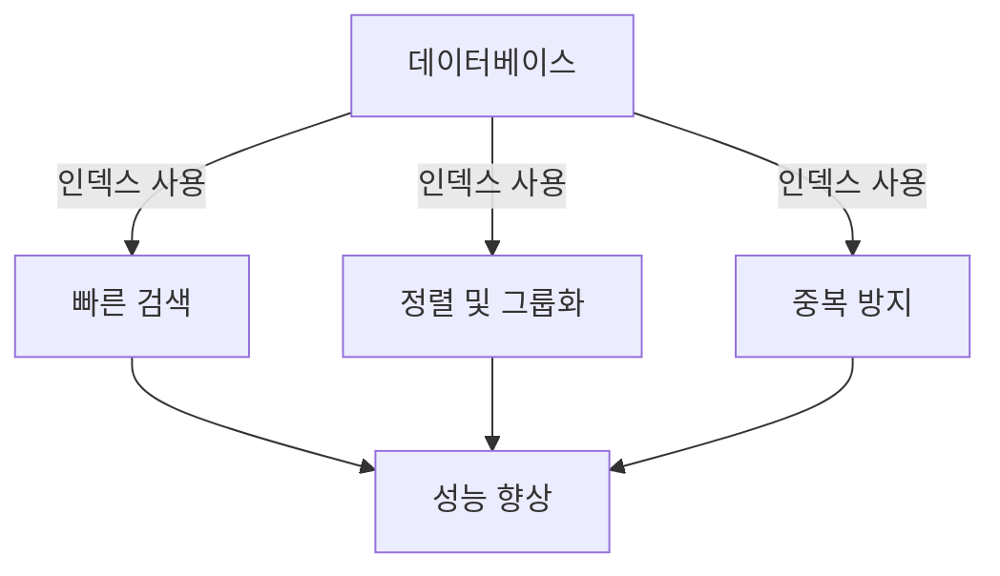
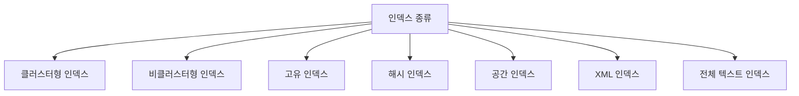
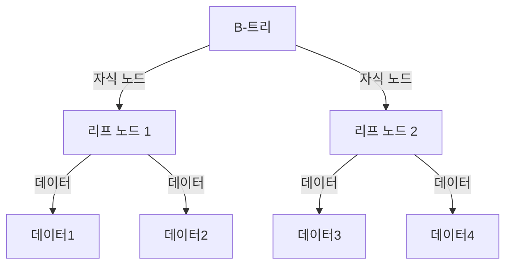
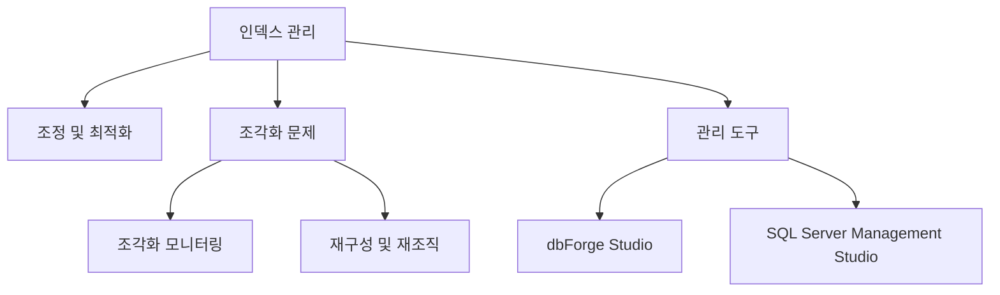
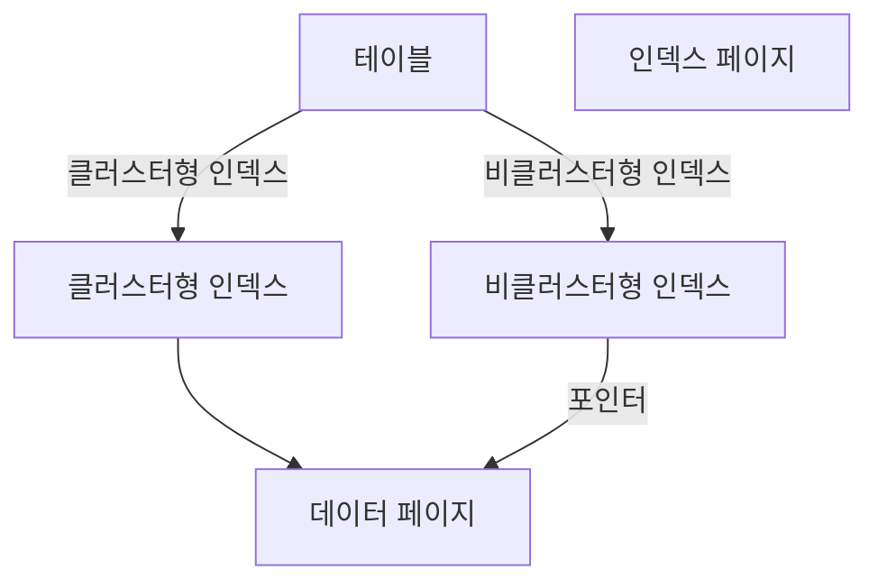
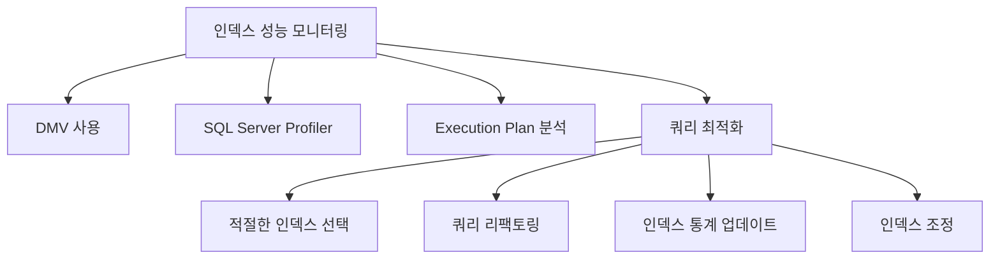
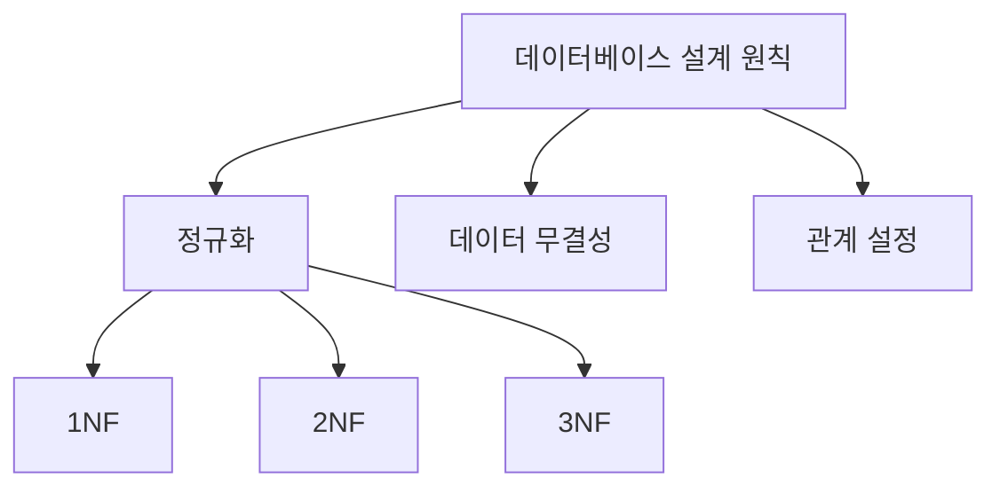
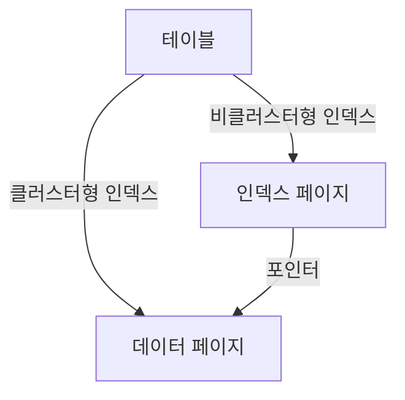

데이터베이스는 데이터를 저장하고 사용자가 원하는 정보에 빠르게 접근하게 해 준다. 데이터 양이 늘고 테이블이 커질수록 검색만으로도 시간이 많이 걸리기 때문에, **인덱스**를 두어 특정 열 기준으로 빠르게 찾을 수 있게 한다. SQL 인덱스는 책의 색인처럼 테이블의 데이터 위치를 가리키는 구조이며, B-트리(또는 B+트리)로 구현되는 경우가 많다. 이 글에서는 인덱스의 종류, 작동 방식, 관리·전략, 성능 모니터링까지 실무에 필요한 내용을 정리한다.


## 개요

SQL 인덱스는 특정 열(또는 열 조합)에 대한 “검색용 포인터”를 만들어, 전체 테이블을 다 읽지 않고도 원하는 행을 빨리 찾게 한다. 인덱스가 없으면 대량 데이터에서도 풀 스캔이 발생해 쿼리가 느려지고, 인덱스를 잘 설계하면 검색·정렬·조인 성능이 크게 좋아진다.

**SQL 인덱스의 중요성**

- 인덱스가 없으면: 조건에 맞는 행을 찾기 위해 테이블의 **모든 행**을 순차 검색(Full Table Scan)해야 한다.
- 인덱스가 있으면: 인덱스 키를 이용해 **해당 위치만** 찾아가므로 검색 비용이 줄어든다.

예: `customer_id`로 고객을 찾을 때, 인덱스가 없으면 전체 고객 행을 훑지만, `customer_id`에 인덱스가 있으면 인덱스에서 위치를 찾고 곧바로 해당 행에 접근한다.

```sql
CREATE INDEX idx_customer_id ON customers(customer_id);
```

**데이터베이스 성능에 미치는 효과**

1. **검색 속도 향상**: WHERE 절에 사용되는 열에 인덱스를 두면 선택적 검색이 빨라진다.
2. **정렬·그룹화 효율**: ORDER BY, GROUP BY에 쓰이는 열이 인덱스에 포함되면 정렬 비용이 줄어든다.
3. **중복 방지**: UNIQUE 인덱스를 사용하면 키 값의 중복을 막아 데이터 무결성을 지킬 수 있다.

아래 다이어그램은 인덱스가 성능에 기여하는 방식을 요약한 것이다.


```mermaid
graph TD
    dbNode["데이터베이스"]
    fastSearch["빠른 검색"]
    sortGroup["정렬 및 그룹화"]
    noDup["중복 방지"]
    perfUp["성능 향상"]
    dbNode -->|"인덱스 사용"| fastSearch
    dbNode -->|"인덱스 사용"| sortGroup
    dbNode -->|"인덱스 사용"| noDup
    fastSearch --> perfUp
    sortGroup --> perfUp
    noDup --> perfUp
```

## SQL 인덱스의 종류 이해하기

인덱스는 “어떤 열을 기준으로, 어떤 구조로 검색할지”를 결정하는 데이터 구조다. 종류별로 저장 방식과 용도가 다르다.

**인덱스의 정의**

인덱스는 테이블의 특정 열(또는 열 조합) 값을 키로 하고, 그 키에 대응하는 **행의 위치(포인터)**를 담은 구조다. 일반적으로 B-트리·B+트리나 해시 등으로 구현된다.

**클러스터형 인덱스(Clustered Index)**

- 테이블의 **물리적 저장 순서**가 인덱스 키 순서와 같다. 즉, 데이터 행 자체가 인덱스 기준으로 정렬되어 저장된다.
- 한 테이블에 **클러스터형 인덱스는 하나만** 둘 수 있다(데이터가 한 가지 순서로만 저장되기 때문).
- 기본 키(Primary Key)에 자동으로 클러스터형 인덱스가 만들어지는 DBMS가 많다(SQL Server 등).
- 범위 검색·순차 읽기에 유리하지만, INSERT/UPDATE/DELETE 시 재정렬 비용이 발생할 수 있다.

```sql
CREATE CLUSTERED INDEX idx_clustered ON Employees (EmployeeID);
```

**비클러스터형 인덱스(Nonclustered Index)**

- 데이터 행과 **별도 구조**로 존재하며, 인덱스 키와 “실제 데이터 행을 가리키는 포인터(행 로케이터)”만 가진다.
- 한 테이블에 **비클러스터형 인덱스는 여러 개** 만들 수 있다.
- 특정 열 조합으로 자주 검색·조인할 때 그 열에 비클러스터형 인덱스를 추가한다.
- 데이터 삽입·수정·삭제 시 인덱스만 갱신하면 되므로, 클러스터형만큼 물리적 재배치 부담이 크지 않다.

```sql
CREATE NONCLUSTERED INDEX idx_nonclustered ON Employees (LastName);
```

**고유 인덱스(Unique Index)**

- 인덱스 키 값이 **중복되지 않도록** 보장한다. PRIMARY KEY, UNIQUE 제약을 구현할 때 사용된다.
- 데이터 무결성과 “한 건만 찾기” 쿼리 최적화에 유용하다.

**기타 인덱스 유형**

- **해시 인덱스**: 키-값 동등 비교(=)에 특화되어, 등호 검색이 매우 빠른 대신 범위 검색·정렬에는 부적합하다.
- **공간 인덱스**: 좌표, 영역 등 공간 데이터(GIS) 검색용이다.
- **전체 텍스트 인덱스(Full-Text)**: 텍스트 열에서 단어·구문 검색에 사용된다.
- **XML 인덱스**: XML 타입 열의 경로·속성 검색을 위한 인덱스다.


```mermaid
graph TD
    indexTypes["인덱스 종류"]
    clusteredIdx["클러스터형 인덱스"]
    nonClusteredIdx["비클러스터형 인덱스"]
    uniqueIdx["고유 인덱스"]
    hashIdx["해시 인덱스"]
    spatialIdx["공간 인덱스"]
    xmlIdx["XML 인덱스"]
    fullTextIdx["전체 텍스트 인덱스"]
    indexTypes --> clusteredIdx
    indexTypes --> nonClusteredIdx
    indexTypes --> uniqueIdx
    indexTypes --> hashIdx
    indexTypes --> spatialIdx
    indexTypes --> xmlIdx
    indexTypes --> fullTextIdx
```

## SQL 인덱스의 작동 원리

**인덱스 구조: B-트리와 B+트리**

많은 RDBMS의 rowstore 인덱스는 **B-트리 또는 B+트리**로 구현된다. 모든 리프 노드가 같은 깊이에 있어 균형이 잡혀 있고, 한 노드에 여러 키를 두어 디스크 I/O를 줄인다. B+트리에서는 실제 데이터(또는 데이터 포인터)가 리프 노드에만 있고, 내부 노드는 검색 경로만 제공한다.


```mermaid
graph TD
    btree["B-트리"]
    leaf1["리프 노드 1"]
    leaf2["리프 노드 2"]
    data1["데이터1"]
    data2["데이터2"]
    data3["데이터3"]
    data4["데이터4"]
    btree -->|"자식 노드"| leaf1
    btree -->|"자식 노드"| leaf2
    leaf1 -->|"데이터"| data1
    leaf1 -->|"데이터"| data2
    leaf2 -->|"데이터"| data3
    leaf2 -->|"데이터"| data4
```

**쿼리 성능에 미치는 영향**

- WHERE, JOIN, ORDER BY, GROUP BY에 사용되는 열이 인덱스에 있으면, 옵티마이저가 인덱스 스캔을 선택해 **일부 페이지만 읽고** 결과를 만든다.
- 인덱스가 과하거나 잘못 설계되면 INSERT/UPDATE/DELETE 시 인덱스 갱신 비용과 저장 공간만 늘어나 **성능이 나빠질 수 있다**.

**인덱스 생성 및 삭제**

- 생성: `CREATE INDEX` (비클러스터형), `CREATE CLUSTERED INDEX` (클러스터형, SQL Server 등).
- 삭제: `DROP INDEX 인덱스명 ON 테이블명;`
- 인덱스를 지우면 해당 열 기준 검색 성능이 떨어질 수 있으므로, 사용 패턴을 확인한 뒤 제거한다.

```sql
CREATE INDEX idx_employee_name ON employees(name);
```

```sql
DROP INDEX idx_employee_name ON employees;
```

## 인덱스 관리 및 유지보수

인덱스는 한 번 만들고 끝이 아니라, **조각화(fragmentation)**와 사용 패턴 변화에 맞춰 주기적으로 점검·정리하는 것이 좋다.

**인덱스 조정 및 최적화**

- 사용되지 않는 인덱스 식별 후 제거해 쓰기 부담과 공간을 줄인다.
- 쿼리 패턴에 맞게 복합 인덱스 열 순서를 조정하거나, 커버링 인덱스(포함 열)를 검토한다.
- **인덱스 통계**를 주기적으로 갱신해 옵티마이저가 좋은 실행 계획을 선택하도록 한다.

```sql
UPDATE STATISTICS 테이블명 인덱스명;
```

**인덱스 조각화**

- INSERT/UPDATE/DELETE가 반복되면 인덱스 페이지의 논리적 순서와 물리적 배치가 어긋나 **조각화**가 생긴다.
- 조각화가 심하면 같은 인덱스를 읽을 때 더 많은 페이지를 접근하게 되어 I/O가 늘어난다.

**조각화 모니터링**

- SQL Server: `sys.dm_db_index_physical_stats` 등으로 `avg_fragmentation_in_percent`를 확인한다.
- 보통 조각화가 **30% 이상**이면 재구성(REBUILD), **5~30%** 구간이면 재조직(REORGANIZE)을 고려한다.

```sql
SELECT
    OBJECT_NAME(object_id) AS TableName,
    name AS IndexName,
    index_id,
    avg_fragmentation_in_percent
FROM sys.dm_db_index_physical_stats(DB_ID(), NULL, NULL, NULL, NULL)
WHERE avg_fragmentation_in_percent > 30;
```

**재구성 및 재조직**

- **REBUILD**: 인덱스를 다시 만들어 조각화를 크게 줄인다. 리소스를 많이 쓰므로 부하가 적은 시간에 실행하는 것이 좋다.
- **REORGANIZE**: 리프 노드 수준에서 순서를 맞추고 공간을 정리한다. REBUILD보다 가벼운 작업이다.

```sql
ALTER INDEX 인덱스명 ON 테이블명 REBUILD;
ALTER INDEX 인덱스명 ON 테이블명 REORGANIZE;
```

**관리 도구**

- **SQL Server Management Studio(SSMS)**: 인덱스 목록, 속성, 재구성/재조직 스크립트 실행 등.
- **dbForge Studio for SQL Server**: 인덱스 설계, 조각화 모니터링, 일괄 재구성 등 GUI로 처리 가능.


```mermaid
graph TD
    mgmt["인덱스 관리"]
    adjust["조정 및 최적화"]
    frag["조각화 문제"]
    monitor["조각화 모니터링"]
    reorg["재구성 및 재조직"]
    tools["관리 도구"]
    dbForge["dbForge Studio"]
    ssms["SQL Server Management Studio"]
    mgmt --> adjust
    mgmt --> frag
    mgmt --> tools
    frag --> monitor
    frag --> reorg
    tools --> dbForge
    tools --> ssms
```

## 인덱스 전략적 고려사항

**인덱스를 두는 것이 유리한 경우**

1. **WHERE, JOIN에 자주 쓰이는 열**: 선택도가 좋은 열(값이 다양하고 NULL이 적은 열)에 인덱스를 두면 효과가 크다.
2. **ORDER BY, GROUP BY에 쓰이는 열**: 정렬·그룹 연산을 인덱스 순서를 활용해 줄일 수 있다.
3. **외래 키 열**: 조인 조건으로 자주 사용되면 인덱스가 있으면 유리하다.

**인덱스를 피하거나 최소화하는 경우**

1. **INSERT/UPDATE/DELETE가 매우 빈번한 테이블**: 인덱스가 많을수록 쓰기 비용이 커진다.
2. **행 수가 매우 적은 테이블**: 풀 스캔이 더 나을 수 있어, 불필요한 인덱스는 제거한다.
3. **카디널리티가 매우 낮은 열**(예: 성별, 플래그 한두 개): 인덱스 효율이 낮고 통계만 복잡해질 수 있다.

**클러스터형 인덱스의 특별 고려사항**

- 테이블당 하나만 있으므로, **가장 자주 범위 검색·정렬에 쓰이는 열**(또는 기본 키)에 두는 것이 일반적이다.
- 키 크기가 크면 비클러스터형 인덱스의 “행 로케이터”도 커져서, 클러스터형 인덱스 키는 **짧고 안정적인 열**이 좋다.
- 순차 INSERT가 많은 테이블에서는 클러스터형 인덱스 키를 **단조 증가**하게 두면 페이지 분할을 줄일 수 있다.


```mermaid
graph TD
    tableNode["테이블"]
    clustIdx["클러스터형 인덱스"]
    dataPages["데이터 페이지"]
    nonClustIdx["비클러스터형 인덱스"]
    indexPages["인덱스 페이지"]
    tableNode -->|"클러스터형 인덱스"| clustIdx
    clustIdx --> dataPages
    tableNode -->|"비클러스터형 인덱스"| nonClustIdx
    nonClustIdx -->|"포인터"| dataPages
```

## 인덱스 성능 모니터링

**SQL Server에서 인덱스 성능 모니터링**

- **DMV**: `sys.dm_db_index_usage_stats`로 인덱스별 seek/scan/lookup/update 횟수를 확인해, 사용되지 않는 인덱스를 찾을 수 있다.
- **실행 계획**: 쿼리 실행 계획에서 Index Seek/Scan, Key Lookup 등이 어떻게 쓰이는지 확인한다.
- **SQL Server Profiler / 확장 이벤트**: 느린 쿼리와 인덱스 사용 패턴을 수집해 분석한다.

```sql
SELECT
    OBJECT_NAME(i.object_id) AS TableName,
    i.name AS IndexName,
    s.user_seeks,
    s.user_scans,
    s.user_lookups,
    s.user_updates
FROM sys.indexes AS i
JOIN sys.dm_db_index_usage_stats AS s
  ON i.object_id = s.object_id AND i.index_id = s.index_id
WHERE OBJECTPROPERTY(i.object_id, 'IsUserTable') = 1;
```

**쿼리 최적화를 통한 인덱스 활용**

- 자주 실행되는 쿼리의 WHERE, JOIN, ORDER BY 열을 반영해 복합 인덱스를 설계한다.
- 필요한 열만 인덱스에 포함(포함 열)해 **커버링 인덱스**로 만들면 키 조회만으로 결과를 만들 수 있어 더 빠를 수 있다.
- 통계가 오래되었으면 실행 계획이 비효율적으로 수립될 수 있으므로, `UPDATE STATISTICS`를 주기적으로 실행한다.

```sql
UPDATE STATISTICS TableName WITH FULLSCAN;
```


```mermaid
graph TD
    mon["인덱스 성능 모니터링"]
    dmv["DMV 사용"]
    profiler["SQL Server Profiler"]
    execPlan["Execution Plan 분석"]
    queryOpt["쿼리 최적화"]
    selIdx["적절한 인덱스 선택"]
    refactor["쿼리 리팩토링"]
    updStat["인덱스 통계 업데이트"]
    adjustIdx["인덱스 조정"]
    mon --> dmv
    mon --> profiler
    mon --> execPlan
    mon --> queryOpt
    queryOpt --> selIdx
    queryOpt --> refactor
    queryOpt --> updStat
    queryOpt --> adjustIdx
```

## 예제

**인덱스 생성**

```sql
CREATE INDEX idx_employee_name ON Employees (LastName, FirstName);
```

`Employees` 테이블의 `LastName`, `FirstName` 열에 비클러스터형 인덱스를 만든 예이다. 이름으로 검색·정렬할 때 이 인덱스를 사용할 수 있다.


```mermaid
graph LR
    empTable["Employees Table"]
    idxName["idx_employee_name"]
    empTable -->|"LastName, FirstName"| idxName
```

**인덱스 삭제**

```sql
DROP INDEX idx_employee_name ON Employees;
```

**인덱스 재구성**

```sql
ALTER INDEX idx_employee_name ON Employees REBUILD;
```

조각화가 심한 인덱스를 재구성해 I/O와 검색 성능을 개선하는 예이다.


```mermaid
graph LR
    empTable2["Employees Table"]
    idxRebuilt["idx_employee_name"]
    empTable2 -->|"Rebuilt"| idxRebuilt
```

## FAQ

**인덱스가 데이터베이스 성능에 미치는 영향은?**

인덱스는 **읽기(검색, 조인, 정렬)**를 빠르게 하는 대신, **쓰기(INSERT/UPDATE/DELETE)** 시 해당 인덱스도 함께 갱신해야 해서 쓰기 비용이 늘어난다. 읽기가 많고 쓰기가 적은 열에 인덱스를 두는 것이 보통 유리하다.

**인덱스가 꼭 필요한 이유는?**

테이블이 커질수록 “조건에 맞는 행만 골라 내는” 작업 비용이 커진다. 인덱스는 “어디에 그 행이 있는지”를 빠르게 알려 주어, 전체 테이블을 읽지 않고도 원하는 행에 접근할 수 있게 한다.

**인덱스가 오히려 쿼리 성능을 나쁘게 하는 경우는?**

- 사용되지 않는 인덱스가 많을 때: 유지보수 비용만 증가.
- 쓰기(INSERT/UPDATE/DELETE)가 매우 많을 때: 인덱스 갱신 비용이 커져 지연이 발생할 수 있음.
- 카디널리티가 매우 낮은 열에 단독 인덱스를 둘 때: 옵티마이저가 잘못된 계획을 택할 수 있음.

**인덱스 크기와 관리는 어떻게 하나요?**

- 사용 빈도가 낮은 인덱스는 제거해 공간과 쓰기 비용을 줄인다.
- 조각화를 주기적으로 확인하고, 필요 시 REORGANIZE 또는 REBUILD를 실행한다.
- 인덱스 통계를 갱신해 실행 계획이 최신 데이터 분포를 반영하도록 한다.

```sql
UPDATE STATISTICS Customers;
```

## 관련 기술

**데이터베이스 관리 시스템(DBMS)**  
MySQL, PostgreSQL, Oracle, SQL Server 등은 모두 인덱스를 지원하며, 각각 문법·제한·권장 사항이 조금씩 다르다. 사용 중인 DBMS의 인덱스 가이드를 참고하는 것이 좋다.

**SQL 쿼리 최적화**  
인덱스는 “어떤 열을 어떻게 찾는가”를 결정하는 핵심 요소다. 실행 계획을 보면서 인덱스가 실제로 사용되는지, 풀 스캔이 발생하는지 확인하고, WHERE·JOIN·ORDER BY에 맞는 인덱스를 설계한다.

**데이터베이스 설계 원칙**  
정규화, 제약 조건, 관계 설정과 함께 “어떤 열에 어떤 인덱스를 둘지”를 설계 단계에서 고려하면, 나중에 성능 문제를 줄일 수 있다.


```mermaid
graph TD
    designPrinc["데이터베이스 설계 원칙"]
    norm["정규화"]
    integrity["데이터 무결성"]
    relation["관계 설정"]
    e1nf["1NF"]
    e2nf["2NF"]
    e3nf["3NF"]
    designPrinc --> norm
    designPrinc --> integrity
    designPrinc --> relation
    norm --> e1nf
    norm --> e2nf
    norm --> e3nf
```

## 결론

- **SQL 인덱스**는 검색·정렬·조인 성능을 높이는 핵심 수단이다. 클러스터형·비클러스터형·고유 인덱스 등 종류와 특성을 이해하고, 쿼리 패턴에 맞게 설계하는 것이 중요하다.
- 인덱스는 **한 번 만들고 끝**이 아니라, 조각화 모니터링, 통계 갱신, 사용되지 않는 인덱스 정리 등 **지속적인 관리**가 필요하다.
- “어디에 인덱스를 둘지”, “언제 피할지”를 전략적으로 결정하고, 실행 계획과 DMV를 활용해 효과를 측정하는 것이 좋다.


```mermaid
graph TD
    tableNode2["테이블"]
    dataPages2["데이터 페이지"]
    indexPages2["인덱스 페이지"]
    tableNode2 -->|"클러스터형 인덱스"| dataPages2
    tableNode2 -->|"비클러스터형 인덱스"| indexPages2
    indexPages2 -->|"포인터"| dataPages2
```

## 참고 자료

1. [Microsoft Learn - 클러스터형 및 비클러스터형 인덱스](https://learn.microsoft.com/ko-kr/sql/relational-databases/indexes/clustered-and-nonclustered-indexes-described?view=sql-server-ver16)  
   SQL Server에서 클러스터형·비클러스터형 인덱스의 개념과 동작을 설명한 공식 문서.

2. [PostgreSQL 공식 문서 - Indexes](https://www.postgresql.org/docs/current/indexes.html)  
   PostgreSQL의 인덱스 종류와 생성·관리 방법.

3. [MySQL 8.0 Reference - InnoDB 클러스터 및 보조 인덱스](https://dev.mysql.com/doc/refman/8.0/en/innodb-index-types.html)  
   InnoDB 스토리지 엔진의 클러스터 인덱스와 보조 인덱스 동작.

4. [Devart Blog - Ultimate Guide to SQL Indexes](https://blog.devart.com/sql-index-and-management-guide.html)  
   SQL 인덱스 개념, 생성·관리, 조각화 처리 등 실무 가이드.

5. [W3Schools - SQL CREATE INDEX](https://www.w3schools.com/sql/sql_create_index.asp)  
   CREATE INDEX 문법과 기본 사용법.

## Reference

- [Microsoft Learn - 클러스터형 및 비클러스터형 인덱스](https://learn.microsoft.com/ko-kr/sql/relational-databases/indexes/clustered-and-nonclustered-indexes-described?view=sql-server-ver16)
- [Microsoft Learn - 인덱스](https://learn.microsoft.com/ko-kr/sql/relational-databases/indexes/indexes?view=sql-server-ver16)
- [PostgreSQL Documentation - Indexes](https://www.postgresql.org/docs/current/indexes.html)
- [MySQL Documentation - InnoDB Index Types](https://dev.mysql.com/doc/refman/8.0/en/innodb-index-types.html)
- [Devart - SQL Index and Management Guide](https://blog.devart.com/sql-index-and-management-guide.html)
- [W3Schools - SQL CREATE INDEX](https://www.w3schools.com/sql/sql_create_index.asp)
