CRDT(Conflict-Free Replicated Data Types)와 OT(Operational Transformation)는 분산 시스템에서 데이터의 일관성을 유지하며 여러 사용자가 동시에 데이터를 수정할 수 있도록 돕는 기술이다. CRDT는 여러 컴퓨터에 걸쳐 복제된 데이터 구조로, 각 복제본이 독립적으로 업데이트될 수 있으며, 이러한 업데이트는 나중에 자동으로 병합되어 일관된 상태로 돌아온다. 반면, OT는 서버가 모든 변경 사항을 병합하는 방식으로, 클라이언트는 자신의 변경 사항을 서버에 전송하고 서버는 이를 순차적으로 처리하여 최종 결과를 각 클라이언트에 반환한다. CRDT는 P2P(peer-to-peer) 방식으로 작동하여 중앙 서버 없이도 동작할 수 있는 반면, OT는 중앙 집중식 서버에 의존한다. 이러한 차이로 인해 CRDT는 더 나은 확장성과 유연성을 제공하며, 특히 실시간 협업 애플리케이션에서 유용하게 사용된다. CRDT는 또한 교환법칙, 결합법칙, 항등법칙을 만족하는 병합 함수를 통해 데이터의 일관성을 보장한다. 이와 같은 특성 덕분에 CRDT는 Google Docs, Figma와 같은 다양한 협업 도구에서 널리 사용되고 있다. CRDT와 OT의 차이점을 이해하는 것은 분산 시스템에서의 데이터 처리 및 협업 기술을 발전시키는 데 중요한 기초가 된다.


||
|:---:|
||


<!--
##### Outline #####
-->

<!--
# CRDT (Conflict-Free Replicated Data Types) 기술 블로그 목차

## 1. 개요
   - CRDT의 정의
   - CRDT의 필요성 및 장점
   - CRDT와 OT(Operational Transformation)의 차이점

## 2. CRDT의 기본 개념
   - CRDT의 구성 요소
     - 값(value)
     - 상태(state)
     - 병합(merge) 함수
   - CRDT의 수학적 속성
     - 교환법칙(Commutativity)
     - 결합법칙(Associativity)
     - 항등법칙(Idempotence)

## 3. CRDT의 종류
   - 상태 기반 CRDT(State-based CRDT)
   - 연산 기반 CRDT(Operation-based CRDT)
   - CRDT의 예시
     - LWW(Last Write Wins) 레지스터
     - LWW 맵
     - G-Counter, PN-Counter, G-Set, 2P-Set, LWW-Element-Set, OR-Set 등

## 4. CRDT의 구현
   - CRDT의 기본 구현 방법
   - LWW 레지스터 구현 예제
   - LWW 맵 구현 예제
   - CRDT의 병합 및 상태 관리

## 5. CRDT의 응용
   - CRDT를 활용한 협업 애플리케이션
     - Google Docs, Figma와 같은 사례
   - CRDT를 이용한 실시간 데이터 동기화
   - CRDT의 사용 사례
     - Redis, Riak, SoundCloud, League of Legends 등

## 6. CRDT의 성능 최적화
   - CRDT의 성능 문제
   - 성능 최적화를 위한 접근 방법
   - Rust 및 WebAssembly를 활용한 CRDT 성능 개선 사례

## 7. FAQ
   - CRDT와 OT 중 어떤 것을 선택해야 할까?
   - CRDT의 데이터 구조는 어떻게 설계해야 할까?
   - CRDT의 한계는 무엇인가?
   - CRDT를 사용한 프로젝트에서의 주의사항

## 8. 관련 기술
   - P2P 네트워크와 CRDT
   - 분산 시스템에서의 데이터 일관성
   - 실시간 협업 기술의 발전

## 9. 결론
   - CRDT의 미래와 발전 가능성
   - CRDT를 통한 협업 기술의 혁신
   - CRDT를 활용한 새로운 애플리케이션 아이디어

## 10. 참고 자료
   - CRDT 관련 논문 및 자료
   - CRDT 구현 라이브러리 및 프레임워크
   - 추가 학습 자료 및 튜토리얼 링크

이 목차는 CRDT에 대한 포괄적인 이해를 돕고, 관련된 기술과 응용 사례를 통해 독자가 CRDT의 중요성과 활용 가능성을 인식할 수 있도록 구성되었습니다.
-->

<!--
## 1. 개요
   - CRDT의 정의
   - CRDT의 필요성 및 장점
   - CRDT와 OT(Operational Transformation)의 차이점
-->

## 1. 개요

**CRDT의 정의** 

CRDT(Conflict-Free Replicated Data Types)는 분산 시스템에서 데이터의 일관성을 유지하면서도 충돌 없이 데이터를 병합할 수 있는 데이터 구조이다. CRDT는 여러 노드에서 동시에 데이터의 변경이 이루어질 수 있는 환경에서, 각 노드의 변경 사항을 안전하게 통합할 수 있도록 설계되었다. 이를 통해 사용자들은 실시간으로 협업할 수 있으며, 데이터의 일관성을 보장받을 수 있다.

**CRDT의 필요성 및 장점**  

CRDT는 다음과 같은 필요성과 장점을 가진다.

1. **충돌 없는 데이터 병합**: 여러 사용자가 동시에 데이터를 수정하더라도, CRDT는 각 변경 사항을 안전하게 병합할 수 있다.
2. **실시간 협업 지원**: CRDT는 분산 환경에서 실시간으로 데이터를 동기화할 수 있어, 협업 애플리케이션에서 유용하다.
3. **복잡한 동기화 로직 불필요**: CRDT는 복잡한 동기화 알고리즘 없이도 데이터의 일관성을 유지할 수 있다.
4. **유연한 데이터 구조**: 다양한 데이터 구조를 지원하여, 개발자가 필요에 따라 적절한 CRDT를 선택할 수 있다.

**CRDT와 OT(Operational Transformation)의 차이점**

CRDT와 OT는 모두 분산 시스템에서 데이터의 일관성을 유지하기 위한 기술이지만, 그 접근 방식에는 차이가 있다. 

- **CRDT**는 데이터의 상태를 기반으로 하여, 각 노드에서 발생한 변경 사항을 병합하는 방식이다. 이 과정에서 수학적 속성을 활용하여 충돌을 방지한다.
- **OT**는 사용자의 작업(연산)을 기반으로 하여, 각 노드에서 발생한 연산을 변환하여 일관성을 유지하는 방식이다. OT는 연산의 순서를 고려하여 충돌을 해결한다.

아래의 다이어그램은 CRDT와 OT의 차이를 시각적으로 나타낸 것이다.

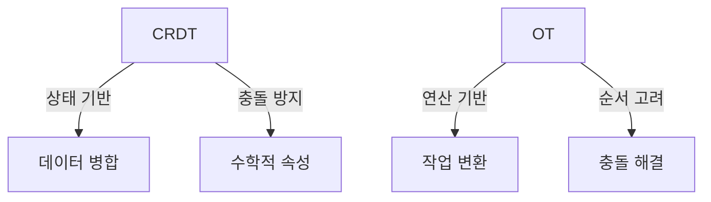

이와 같이 CRDT와 OT는 서로 다른 접근 방식을 가지고 있으며, 각각의 장단점이 존재한다. CRDT는 특히 실시간 협업 환경에서 유용하게 사용될 수 있는 기술이다.

<!--
## 2. CRDT의 기본 개념
   - CRDT의 구성 요소
     - 값(value)
     - 상태(state)
     - 병합(merge) 함수
   - CRDT의 수학적 속성
     - 교환법칙(Commutativity)
     - 결합법칙(Associativity)
     - 항등법칙(Idempotence)
-->

## 2. CRDT의 기본 개념

CRDT(Conflict-Free Replicated Data Types)는 분산 시스템에서 데이터의 일관성을 유지하기 위해 설계된 데이터 구조이다. CRDT의 기본 개념을 이해하기 위해서는 구성 요소와 수학적 속성을 살펴보아야 한다.

**CRDT의 구성 요소**

CRDT는 다음과 같은 세 가지 주요 구성 요소로 이루어져 있다.

1. **값(value)**: CRDT의 가장 기본적인 데이터 단위로, 사용자가 저장하고자 하는 정보를 나타낸다. 값은 다양한 형태를 가질 수 있으며, 숫자, 문자열, 객체 등으로 표현될 수 있다.

2. **상태(state)**: CRDT의 현재 상태를 나타내며, 값의 집합으로 구성된다. 상태는 CRDT의 동작을 정의하는 데 중요한 역할을 하며, 병합 과정에서 다른 노드와의 상태를 통합하는 데 사용된다.

3. **병합(merge) 함수**: CRDT의 핵심 기능 중 하나로, 서로 다른 상태를 통합하여 하나의 일관된 상태로 만드는 함수이다. 병합 함수는 CRDT의 일관성을 보장하는 데 필수적이며, 각 노드에서 발생한 변경 사항을 안전하게 통합할 수 있도록 설계되어야 한다.

다음은 CRDT의 구성 요소를 나타내는 간단한 다이어그램이다.

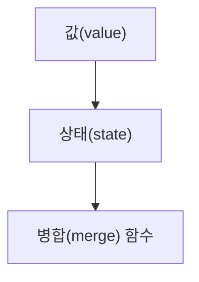

**CRDT의 수학적 속성**

CRDT는 다음과 같은 세 가지 수학적 속성을 가진다.

1. **교환법칙(Commutativity)**: CRDT의 연산은 순서에 관계없이 동일한 결과를 생성해야 한다. 즉, 두 개의 연산이 서로 다른 순서로 적용되더라도 최종 결과는 동일해야 한다. 이 속성 덕분에 CRDT는 분산 환경에서 발생하는 동시성 문제를 해결할 수 있다.

2. **결합법칙(Associativity)**: CRDT의 연산은 그룹화에 관계없이 동일한 결과를 생성해야 한다. 즉, 여러 개의 연산을 그룹으로 묶어 적용하더라도 최종 결과는 동일해야 한다. 이 속성은 CRDT의 병합 과정에서 여러 노드의 상태를 통합할 때 유용하다.

3. **항등법칙(Idempotence)**: CRDT의 연산은 동일한 연산을 여러 번 적용하더라도 결과가 변하지 않아야 한다. 즉, 한 번 적용한 연산을 다시 적용하더라도 상태는 동일하게 유지되어야 한다. 이 속성은 CRDT의 안정성을 보장하는 데 중요한 역할을 한다.

이러한 수학적 속성들은 CRDT가 분산 시스템에서 데이터의 일관성을 유지하고, 동시성 문제를 해결하는 데 필수적이다. CRDT의 기본 개념을 이해함으로써, 분산 환경에서의 데이터 처리 방식에 대한 깊은 통찰을 얻을 수 있다.

<!--
## 3. CRDT의 종류
   - 상태 기반 CRDT(State-based CRDT)
   - 연산 기반 CRDT(Operation-based CRDT)
   - CRDT의 예시
     - LWW(Last Write Wins) 레지스터
     - LWW 맵
     - G-Counter, PN-Counter, G-Set, 2P-Set, LWW-Element-Set, OR-Set 등
-->

## 3. CRDT의 종류

CRDT는 크게 두 가지 종류로 나눌 수 있다. 상태 기반 CRDT와 연산 기반 CRDT가 그것이다. 이 두 가지는 데이터의 복제 및 병합 방식에서 차이를 보인다.

**상태 기반 CRDT(State-based CRDT)**

상태 기반 CRDT는 각 노드가 자신의 상태를 유지하고, 다른 노드와 상태를 주기적으로 병합하는 방식이다. 이 방식에서는 각 노드가 자신의 상태를 완전하게 보존하고, 병합 시에는 모든 상태를 고려하여 최종 상태를 결정한다. 상태 기반 CRDT의 대표적인 예로는 G-Counter와 PN-Counter가 있다.

상태 기반 CRDT의 병합 과정은 다음과 같은 다이어그램으로 표현할 수 있다.

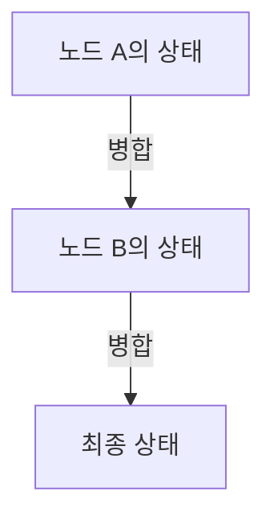

**연산 기반 CRDT(Operation-based CRDT)**

연산 기반 CRDT는 각 노드가 발생한 연산을 다른 노드에 전파하여 상태를 동기화하는 방식이다. 이 방식에서는 연산이 독립적으로 수행되며, 연산의 순서가 중요하지 않다. 연산 기반 CRDT의 대표적인 예로는 LWW(Last Write Wins) 레지스터와 LWW 맵이 있다.

연산 기반 CRDT의 동작 방식은 다음과 같은 다이어그램으로 표현할 수 있다.

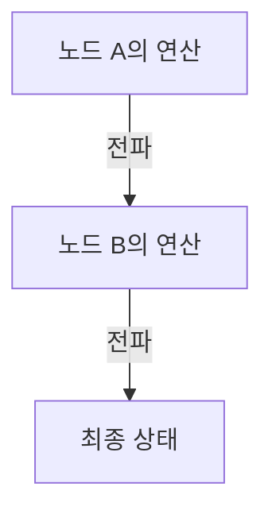

**CRDT의 예시**

CRDT의 종류를 이해하기 위해 몇 가지 예시를 살펴보겠다.

- **LWW(Last Write Wins) 레지스터**: 이 레지스터는 마지막으로 작성된 값을 유지하는 CRDT이다. 각 값은 타임스탬프와 함께 저장되며, 병합 시 가장 최신의 값을 선택한다.

- **LWW 맵**: LWW 레지스터의 확장으로, 키-값 쌍을 저장하는 구조이다. 각 키에 대해 LWW 규칙을 적용하여 병합한다.

- **G-Counter**: 증가만 가능한 카운터로, 각 노드가 자신의 카운터 값을 유지하고, 병합 시 모든 노드의 값을 합산하여 최종 값을 결정한다.

- **PN-Counter**: G-Counter의 확장으로, 증가와 감소가 모두 가능한 카운터이다. 각 노드가 증가와 감소를 별도로 관리하며, 병합 시 두 값을 합산하여 최종 값을 결정한다.

- **G-Set**: 추가만 가능한 집합으로, 각 노드가 추가된 요소를 유지하고, 병합 시 모든 요소를 합쳐 최종 집합을 만든다.

- **2P-Set**: 추가와 삭제가 가능한 집합으로, 각 요소에 대해 추가와 삭제를 관리한다. 병합 시 추가된 요소와 삭제된 요소를 고려하여 최종 집합을 결정한다.

- **LWW-Element-Set**: LWW 규칙을 적용한 집합으로, 각 요소에 대해 마지막으로 추가된 값을 유지한다.

- **OR-Set**: 추가와 삭제가 모두 가능한 집합으로, 각 요소에 대해 추가된 타임스탬프를 관리하여 병합 시 최종 상태를 결정한다.

이와 같이 CRDT는 다양한 종류와 예시를 통해 데이터의 일관성을 유지하면서도 분산 환경에서의 협업을 가능하게 한다.

<!--
## 4. CRDT의 구현
   - CRDT의 기본 구현 방법
   - LWW 레지스터 구현 예제
   - LWW 맵 구현 예제
   - CRDT의 병합 및 상태 관리
-->

## 4. CRDT의 구현

CRDT(Conflict-Free Replicated Data Types)의 구현은 분산 시스템에서 데이터의 일관성을 유지하면서도 충돌을 방지하는 데 중요한 역할을 한다. 이 섹션에서는 CRDT의 기본 구현 방법과 LWW(Last Write Wins) 레지스터 및 LWW 맵의 구현 예제를 살펴보겠다.

**CRDT의 기본 구현 방법**

CRDT를 구현하기 위해서는 먼저 데이터의 상태를 정의하고, 이를 병합할 수 있는 방법을 마련해야 한다. 일반적으로 CRDT는 두 가지 주요 구성 요소로 이루어진다. 첫째, 데이터의 현재 상태를 나타내는 값(value)이며, 둘째, 이 값을 병합하는 함수(merge function)이다. 병합 함수는 두 개의 상태를 입력으로 받아, 이들 중 하나를 선택하거나 두 상태를 결합하여 새로운 상태를 반환한다.

다음은 CRDT의 기본 구조를 나타내는 다이어그램이다.

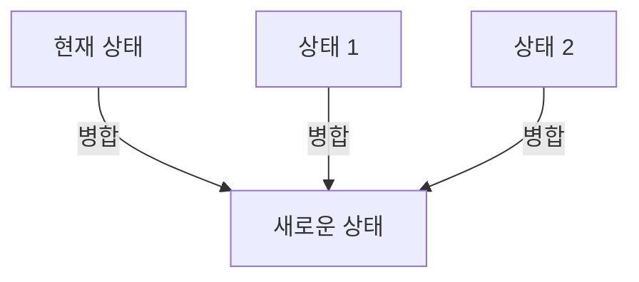

**LWW 레지스터 구현 예제**

LWW 레지스터는 가장 최근에 작성된 값을 유지하는 CRDT의 한 종류이다. 이 레지스터는 각 값과 함께 타임스탬프를 저장하여, 병합 시 가장 최신의 값을 선택할 수 있도록 한다. 아래는 LWW 레지스터의 간단한 구현 예제이다.

```python
class LWWRegister:
    def __init__(self):
        self.value = None
        self.timestamp = 0

    def write(self, value, timestamp):
        if timestamp > self.timestamp:
            self.value = value
            self.timestamp = timestamp

    def read(self):
        return self.value
```

위의 코드에서 `write` 메서드는 새로운 값을 타임스탬프와 함께 저장하며, 이전 값보다 더 최신의 타임스탬프를 가진 경우에만 값을 업데이트한다. `read` 메서드는 현재 저장된 값을 반환한다.

**LWW 맵 구현 예제**

LWW 맵은 여러 개의 LWW 레지스터를 포함하는 데이터 구조로, 각 키에 대해 LWW 레지스터를 사용하여 값을 관리한다. 아래는 LWW 맵의 간단한 구현 예제이다.

```python
class LWWMap:
    def __init__(self):
        self.map = {}

    def write(self, key, value, timestamp):
        if key not in self.map:
            self.map[key] = LWWRegister()
        self.map[key].write(value, timestamp)

    def read(self, key):
        if key in self.map:
            return self.map[key].read()
        return None
```

이 코드에서 `LWWMap` 클래스는 여러 개의 LWW 레지스터를 관리하며, 각 키에 대해 값을 쓰고 읽는 기능을 제공한다.

**CRDT의 병합 및 상태 관리**

CRDT의 병합 과정은 여러 노드에서 발생한 상태를 통합하는 데 필수적이다. 병합 함수는 두 개의 상태를 비교하여, 더 최신의 상태를 선택하거나 두 상태를 결합하는 방식으로 동작한다. 이 과정에서 CRDT의 수학적 속성인 교환법칙, 결합법칙, 항등법칙이 보장되어야 한다.

병합 과정은 다음과 같은 다이어그램으로 표현할 수 있다.

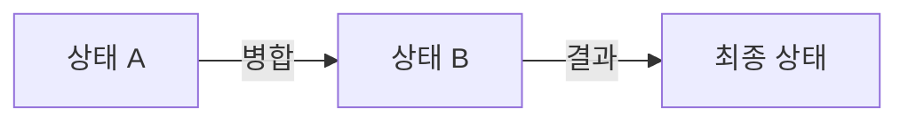

이와 같이 CRDT의 구현은 데이터의 일관성을 유지하면서도 충돌을 방지하는 데 중요한 역할을 하며, 다양한 응용 프로그램에서 활용될 수 있다. CRDT의 기본 개념과 구현 방법을 이해함으로써, 분산 시스템에서의 데이터 관리에 대한 통찰을 얻을 수 있다.

<!--
## 5. CRDT의 응용
   - CRDT를 활용한 협업 애플리케이션
     - Google Docs, Figma와 같은 사례
   - CRDT를 이용한 실시간 데이터 동기화
   - CRDT의 사용 사례
     - Redis, Riak, SoundCloud, League of Legends 등
-->

## 5. CRDT의 응용

**CRDT를 활용한 협업 애플리케이션**

CRDT는 실시간 협업 애플리케이션에서 매우 유용하게 사용된다. Google Docs와 Figma와 같은 애플리케이션은 여러 사용자가 동시에 문서나 디자인을 수정할 수 있도록 지원하며, 이 과정에서 CRDT를 활용하여 데이터의 일관성을 유지한다. 사용자가 동시에 같은 문서에 접근하여 수정할 때, CRDT는 각 사용자의 변경 사항을 자동으로 병합하여 충돌을 방지한다. 이로 인해 사용자는 실시간으로 서로의 작업을 확인하고, 원활한 협업이 가능해진다.

**CRDT를 이용한 실시간 데이터 동기화**

CRDT는 분산 시스템에서 실시간 데이터 동기화에 효과적이다. 예를 들어, 여러 클라이언트가 동일한 데이터를 수정할 때, CRDT는 각 클라이언트의 변경 사항을 수집하고 병합하여 최종 상태를 유지한다. 이 과정에서 CRDT의 수학적 속성인 교환법칙, 결합법칙, 항등법칙이 중요한 역할을 한다. 이러한 속성 덕분에 데이터의 일관성을 보장하면서도, 네트워크 지연이나 분산 환경에서도 안정적으로 동작할 수 있다.

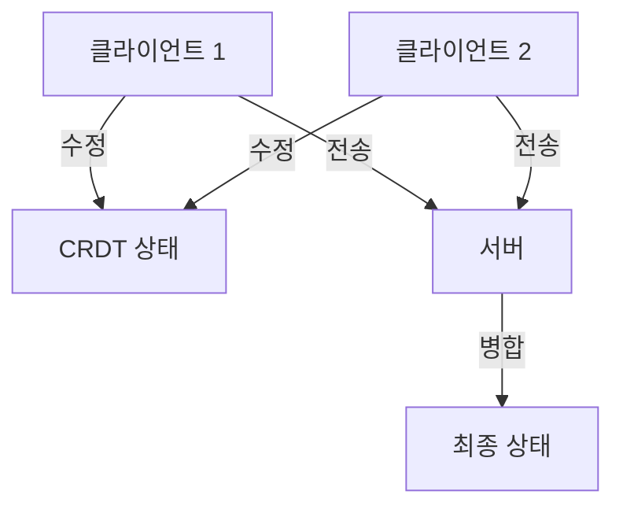

**CRDT의 사용 사례**

CRDT는 다양한 분야에서 활용되고 있다. 예를 들어, Redis와 Riak와 같은 데이터베이스 시스템은 CRDT를 사용하여 분산 환경에서 데이터의 일관성을 유지한다. SoundCloud와 League of Legends와 같은 애플리케이션에서도 CRDT를 활용하여 실시간으로 사용자 간의 상호작용을 처리하고 있다. 이러한 사용 사례들은 CRDT의 유용성을 잘 보여준다.

CRDT는 협업 애플리케이션, 실시간 데이터 동기화, 그리고 다양한 시스템에서의 데이터 일관성을 유지하는 데 있어 중요한 역할을 하고 있다. 앞으로도 CRDT의 응용 가능성은 더욱 확대될 것으로 기대된다.

<!--
## 6. CRDT의 성능 최적화
   - CRDT의 성능 문제
   - 성능 최적화를 위한 접근 방법
   - Rust 및 WebAssembly를 활용한 CRDT 성능 개선 사례
-->

## 6. CRDT의 성능 최적화

CRDT(Conflict-Free Replicated Data Types)는 분산 시스템에서 데이터의 일관성을 유지하면서도 동시성을 지원하는 강력한 도구이다. 그러나 CRDT의 성능은 다양한 요인에 의해 영향을 받을 수 있으며, 이를 최적화하는 방법에 대해 알아보도록 하겠다.

**CRDT의 성능 문제**

CRDT의 성능 문제는 주로 데이터의 크기, 병합 과정의 복잡성, 그리고 네트워크 지연 시간에 기인한다. 특히, 상태 기반 CRDT의 경우, 전체 상태를 전송해야 하므로 데이터의 크기가 커질수록 성능 저하가 발생할 수 있다. 또한, 연산 기반 CRDT는 각 연산을 전송하고 병합하는 과정에서 지연이 발생할 수 있다. 이러한 문제들은 대규모 시스템에서 CRDT의 효율성을 저하시킬 수 있다.

**성능 최적화를 위한 접근 방법**

CRDT의 성능을 최적화하기 위한 몇 가지 접근 방법은 다음과 같다.

1. **데이터 구조 최적화**: CRDT의 데이터 구조를 효율적으로 설계하여 메모리 사용량을 줄이고, 병합 과정에서의 연산을 최소화할 수 있다. 예를 들어, G-Counter와 같은 카운터 구조는 단순한 배열 대신 해시맵을 사용하여 메모리 사용을 줄일 수 있다.

2. **병합 알고리즘 개선**: 병합 알고리즘을 최적화하여 불필요한 연산을 줄이고, 병합 속도를 높일 수 있다. 예를 들어, LWW(Last Write Wins) 레지스터의 경우, 최신 값을 기준으로 병합하는 방식으로 성능을 개선할 수 있다.

3. **네트워크 최적화**: 데이터 전송 시 압축 알고리즘을 사용하거나, 필요한 데이터만 전송하여 네트워크 대역폭을 절약할 수 있다. 또한, P2P 네트워크를 활용하여 데이터 전송 경로를 최적화할 수 있다.

**Rust 및 WebAssembly를 활용한 CRDT 성능 개선 사례**

Rust는 메모리 안전성과 성능을 동시에 제공하는 프로그래밍 언어로, CRDT의 구현에 적합하다. WebAssembly는 웹 환경에서 고성능 코드를 실행할 수 있게 해주는 기술로, CRDT의 성능을 더욱 향상시킬 수 있다.

다음은 Rust와 WebAssembly를 활용한 CRDT의 성능 개선 사례를 보여주는 간단한 코드 예제이다.

```rust
// Rust로 작성한 간단한 G-Counter 구현 예제
struct GCounter {
    counts: HashMap<String, u32>,
}

impl GCounter {
    fn new() -> Self {
        GCounter {
            counts: HashMap::new(),
        }
    }

    fn increment(&mut self, node_id: String) {
        let count = self.counts.entry(node_id).or_insert(0);
        *count += 1;
    }

    fn merge(&mut self, other: GCounter) {
        for (node_id, count) in other.counts {
            let entry = self.counts.entry(node_id).or_insert(0);
            *entry = (*entry).max(count);
        }
    }

    fn value(&self) -> u32 {
        self.counts.values().sum()
    }
}
```

위의 코드에서는 G-Counter를 Rust로 구현하였으며, 각 노드의 카운트를 관리하고 병합하는 기능을 제공한다. 이와 같은 방식으로 Rust의 성능을 활용하여 CRDT의 효율성을 높일 수 있다.

다음은 CRDT의 성능 최적화를 위한 다이어그램이다.

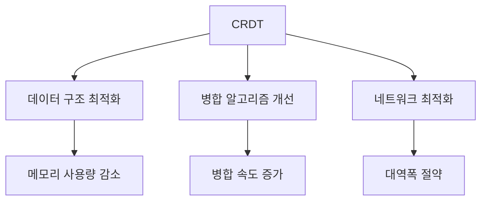

이와 같이 CRDT의 성능 최적화는 다양한 접근 방법을 통해 이루어질 수 있으며, Rust와 WebAssembly와 같은 최신 기술을 활용하여 성능을 더욱 개선할 수 있다. CRDT의 성능을 최적화함으로써, 대규모 분산 시스템에서도 효율적으로 동작할 수 있는 가능성을 열어준다.

<!--
## 7. FAQ
   - CRDT와 OT 중 어떤 것을 선택해야 할까?
   - CRDT의 데이터 구조는 어떻게 설계해야 할까?
   - CRDT의 한계는 무엇인가?
   - CRDT를 사용한 프로젝트에서의 주의사항
-->

## 7. FAQ

**CRDT와 OT 중 어떤 것을 선택해야 할까?**  

CRDT(Conflict-Free Replicated Data Types)와 OT(Operational Transformation)는 모두 분산 시스템에서 데이터의 일관성을 유지하기 위한 기술이다. CRDT는 데이터의 상태를 기반으로 하여 충돌을 방지하는 반면, OT는 연산을 기반으로 하여 충돌을 해결한다. 선택은 주로 애플리케이션의 요구 사항에 따라 달라진다. CRDT는 간단한 구현과 높은 가용성을 제공하지만, OT는 더 복잡한 연산을 지원할 수 있다. 따라서, 실시간 협업이 필요한 경우 OT가 더 적합할 수 있으며, 데이터의 일관성이 중요한 경우 CRDT를 선택하는 것이 좋다.

**CRDT의 데이터 구조는 어떻게 설계해야 할까?** 

CRDT의 데이터 구조는 주로 상태 기반 또는 연산 기반으로 설계된다. 상태 기반 CRDT는 데이터의 전체 상태를 유지하며, 병합 함수에 의해 상태를 통합한다. 반면, 연산 기반 CRDT는 각 연산을 기록하고 이를 통해 상태를 업데이트한다. 데이터 구조 설계 시, 다음과 같은 요소를 고려해야 한다.

1. **값(value)**: 데이터의 실제 내용을 정의한다.
2. **상태(state)**: 데이터의 현재 상태를 나타낸다.
3. **병합(merge) 함수**: 두 개의 상태를 통합하는 방법을 정의한다.

예를 들어, G-Counter의 경우 각 노드가 카운터 값을 유지하고, 병합 시 최대값을 선택하는 방식으로 설계할 수 있다.

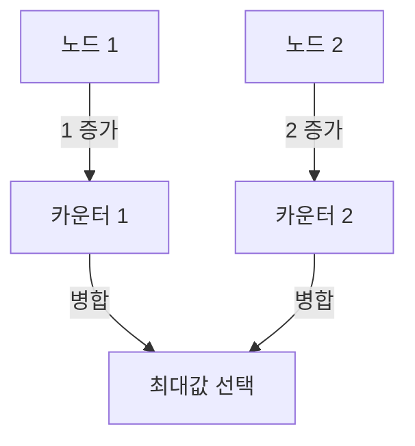

**CRDT의 한계는 무엇인가?**  

CRDT는 여러 장점을 가지고 있지만, 몇 가지 한계도 존재한다. 첫째, CRDT는 메모리 사용량이 많을 수 있다. 상태 기반 CRDT는 모든 상태를 저장해야 하므로, 데이터가 커질수록 메모리 소모가 증가한다. 둘째, CRDT는 복잡한 연산을 지원하지 않기 때문에, 특정 애플리케이션에서는 적합하지 않을 수 있다. 마지막으로, CRDT의 병합 함수가 잘못 설계되면 데이터의 일관성을 보장할 수 없다.

**CRDT를 사용한 프로젝트에서의 주의사항**  

CRDT를 사용하여 프로젝트를 진행할 때는 몇 가지 주의사항이 있다. 첫째, 데이터 구조와 병합 함수를 신중하게 설계해야 한다. 잘못된 설계는 데이터의 일관성을 해칠 수 있다. 둘째, CRDT의 성능을 고려해야 한다. 대규모 데이터에 대한 성능 테스트를 통해 병목 현상을 미리 파악하고 최적화해야 한다. 셋째, CRDT의 특성을 이해하고, 적절한 사용 사례를 선택해야 한다. CRDT는 모든 상황에 적합하지 않으므로, 사용 목적에 맞는 기술을 선택하는 것이 중요하다.

<!--
## 8. 관련 기술
   - P2P 네트워크와 CRDT
   - 분산 시스템에서의 데이터 일관성
   - 실시간 협업 기술의 발전
-->

## 8. 관련 기술

**P2P 네트워크와 CRDT**  

CRDT는 P2P(피어 투 피어) 네트워크에서 매우 유용하게 활용될 수 있다. P2P 네트워크는 중앙 서버 없이 여러 노드가 직접 연결되어 데이터를 공유하는 구조로, CRDT의 특성과 잘 맞아떨어진다. CRDT는 각 노드에서 독립적으로 데이터를 수정할 수 있으며, 이러한 수정 사항은 서로 다른 노드 간에 자동으로 병합될 수 있다. 이로 인해 P2P 환경에서도 데이터의 일관성을 유지할 수 있다.

예를 들어, 두 개의 노드 A와 B가 각각 CRDT를 사용하여 데이터를 수정한다고 가정해보자. 노드 A에서 데이터가 수정된 후, 노드 B가 이를 병합할 때 CRDT의 병합 함수가 작동하여 두 노드의 상태를 일관되게 유지할 수 있다.

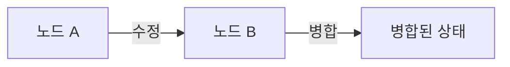

**분산 시스템에서의 데이터 일관성**  

CRDT는 분산 시스템에서 데이터 일관성을 유지하는 데 중요한 역할을 한다. 전통적인 분산 시스템에서는 데이터의 일관성을 보장하기 위해 복잡한 동기화 메커니즘이 필요하다. 그러나 CRDT는 이러한 문제를 해결하기 위해 설계된 데이터 구조로, 각 노드가 독립적으로 작업을 수행할 수 있도록 한다. 

CRDT의 수학적 속성인 교환법칙, 결합법칙, 항등법칙 덕분에 데이터의 병합이 가능하며, 이는 분산 시스템에서의 데이터 일관성을 자연스럽게 보장한다. 예를 들어, 여러 사용자가 동시에 문서를 수정하는 경우, CRDT를 사용하면 각 사용자의 변경 사항이 충돌 없이 병합되어 최종 결과를 생성할 수 있다.

**실시간 협업 기술의 발전**  

CRDT는 실시간 협업 애플리케이션의 발전에 기여하고 있다. Google Docs, Figma와 같은 협업 도구는 CRDT를 활용하여 여러 사용자가 동시에 작업할 수 있도록 지원한다. 이러한 도구들은 사용자가 입력한 내용을 실시간으로 반영하며, 각 사용자의 변경 사항이 자동으로 병합되어 일관된 상태를 유지한다.

실시간 협업에서 CRDT의 장점은 다음과 같다:
1. **충돌 없는 병합**: 여러 사용자가 동시에 작업하더라도 데이터 충돌이 발생하지 않는다.
2. **지연 없는 반영**: 사용자의 입력이 즉시 다른 사용자에게 반영된다.
3. **오프라인 지원**: 네트워크 연결이 끊겨도 로컬에서 작업한 내용이 나중에 자동으로 동기화된다.

이러한 특성 덕분에 CRDT는 실시간 협업 기술의 핵심 요소로 자리 잡고 있으며, 앞으로도 다양한 분야에서 그 활용 가능성이 더욱 확대될 것으로 기대된다.

<!--
## 9. 결론
   - CRDT의 미래와 발전 가능성
   - CRDT를 통한 협업 기술의 혁신
   - CRDT를 활용한 새로운 애플리케이션 아이디어
-->

## 9. 결론

**CRDT의 미래와 발전 가능성**  

CRDT(Conflict-Free Replicated Data Types)는 분산 시스템에서 데이터 일관성을 유지하면서도 높은 성능을 제공하는 기술로, 앞으로의 발전 가능성이 매우 크다. 특히, 클라우드 기반 서비스와 실시간 협업 도구의 수요가 증가함에 따라 CRDT의 중요성이 더욱 부각되고 있다. 향후 CRDT는 더 많은 데이터 구조와 알고리즘에 통합되어 다양한 분야에서 활용될 것으로 예상된다. 예를 들어, IoT(Internet of Things) 환경에서도 CRDT를 활용하여 여러 장치 간의 데이터 동기화를 효율적으로 처리할 수 있을 것이다.

**CRDT를 통한 협업 기술의 혁신**  

CRDT는 실시간 협업 애플리케이션에서 혁신적인 변화를 가져올 수 있다. Google Docs와 Figma와 같은 플랫폼은 CRDT를 통해 여러 사용자가 동시에 작업할 수 있는 환경을 제공하고 있다. 이러한 기술은 사용자 경험을 향상시키고, 팀워크를 강화하는 데 기여하고 있다. 앞으로도 CRDT를 활용한 협업 도구는 더욱 발전하여, 사용자 간의 상호작용을 더욱 원활하게 만들어 줄 것이다.

**CRDT를 활용한 새로운 애플리케이션 아이디어**  

CRDT의 특성을 활용하여 다양한 새로운 애플리케이션을 개발할 수 있다. 예를 들어, 분산형 소셜 미디어 플랫폼이나 실시간 게임에서의 상태 동기화, 그리고 여러 사용자가 동시에 참여하는 온라인 교육 플랫폼 등에서 CRDT를 적용할 수 있다. 이러한 애플리케이션은 사용자 간의 데이터 충돌을 최소화하고, 실시간으로 데이터를 동기화하여 사용자 경험을 극대화할 수 있다.

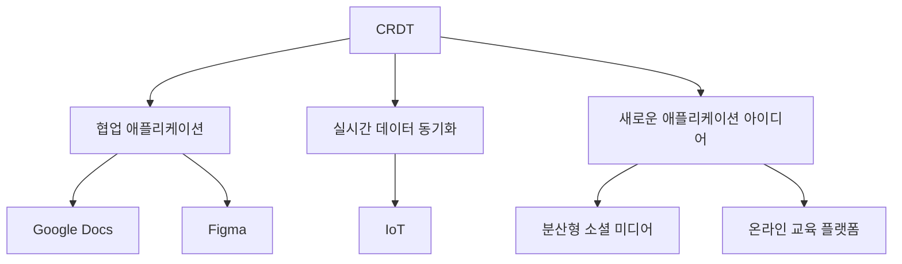

이와 같이 CRDT는 앞으로도 다양한 분야에서 활용될 수 있는 가능성을 지니고 있으며, 협업 기술의 혁신과 새로운 애플리케이션 개발에 기여할 것이다. CRDT의 발전은 분산 시스템의 데이터 처리 방식에 큰 변화를 가져올 것으로 기대된다.

<!--
## 10. 참고 자료
   - CRDT 관련 논문 및 자료
   - CRDT 구현 라이브러리 및 프레임워크
   - 추가 학습 자료 및 튜토리얼 링크
-->

## 10. 참고 자료

CRDT(Conflict-Free Replicated Data Types)에 대한 깊이 있는 이해를 위해 다음과 같은 자료들을 참고할 수 있다. 이 자료들은 CRDT의 이론적 배경, 구현 방법, 그리고 실제 사용 사례를 포함하고 있어 독자가 CRDT를 보다 잘 이해하는 데 도움을 줄 것이다.

**CRDT 관련 논문 및 자료**  
CRDT에 대한 여러 연구 논문과 자료들이 존재한다. 그 중 몇 가지 주요 자료는 다음과 같다.

- **"A Comprehensive Study of CRDTs"**: CRDT의 기본 개념과 다양한 종류에 대한 포괄적인 연구를 다룬 논문이다.
- **"Conflict-Free Replicated Data Types"**: CRDT의 기초 이론과 수학적 속성을 설명하는 논문으로, CRDT의 필요성과 장점을 잘 설명하고 있다.
- **"The Many Faces of CRDTs"**: CRDT의 다양한 응용 사례와 실제 사용 사례를 다룬 자료로, CRDT의 실용성을 강조하고 있다.

**CRDT 구현 라이브러리 및 프레임워크**  
CRDT를 구현하기 위한 여러 라이브러리와 프레임워크가 존재한다. 이들 중 일부는 다음과 같다.

- **Yjs**: JavaScript로 작성된 CRDT 라이브러리로, 실시간 협업 애플리케이션에 적합하다. Yjs는 다양한 데이터 구조를 지원하며, P2P 네트워크와의 통합이 용이하다.
- **Automerge**: JavaScript 기반의 CRDT 라이브러리로, 간단한 API를 제공하여 개발자가 쉽게 사용할 수 있도록 돕는다. Automerge는 JSON 객체를 CRDT로 변환하여 실시간 동기화를 지원한다.
- **Riak DT**: Erlang으로 작성된 분산 데이터베이스 Riak의 CRDT 구현으로, 다양한 데이터 타입을 지원하며, 높은 가용성과 확장성을 제공한다.

**추가 학습 자료 및 튜토리얼 링크**  
CRDT에 대한 추가 학습을 원한다면 다음의 자료들을 참고할 수 있다.

- **"CRDTs Explained"**: CRDT의 기본 개념과 구현 방법을 설명하는 블로그 포스트로, 초보자에게 적합하다.
- **"Building Real-Time Applications with CRDTs"**: CRDT를 활용한 실시간 애플리케이션 개발에 대한 튜토리얼로, 실제 코드 예제를 통해 이해를 돕는다.
- **YouTube 강의**: CRDT에 대한 다양한 강의가 YouTube에 업로드되어 있으며, 시청을 통해 시각적으로 이해할 수 있다.

다음은 CRDT의 기본 개념을 설명하는 다이어그램이다.

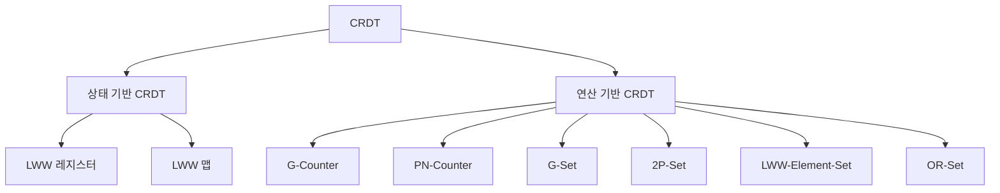

이 자료들을 통해 CRDT에 대한 이해를 더욱 깊이 있게 할 수 있을 것이다. CRDT는 분산 시스템과 실시간 협업 애플리케이션에서 중요한 역할을 하므로, 관련 자료를 통해 지속적으로 학습하는 것이 필요하다.

<!--
##### Reference #####
-->

## Reference


* [https://en.wikipedia.org/wiki/Conflict-free_replicated_data_type](https://en.wikipedia.org/wiki/Conflict-free_replicated_data_type)
* [https://velog.io/@hbsps/CRDT-%EA%B5%AC%ED%98%84%ED%95%98%EA%B8%B0-CRDT%EB%9E%80](https://velog.io/@hbsps/CRDT-%EA%B5%AC%ED%98%84%ED%95%98%EA%B8%B0-CRDT%EB%9E%80)
* [https://velog.io/@heelieben/%EC%8B%A4%EC%8B%9C%EA%B0%84-%EB%8F%99%EC%8B%9C-%ED%8E%B8%EC%A7%91-OT-%EC%99%80-CRDT](https://velog.io/@heelieben/%EC%8B%A4%EC%8B%9C%EA%B0%84-%EB%8F%99%EC%8B%9C-%ED%8E%B8%EC%A7%91-OT-%EC%99%80-CRDT)
* [https://josephg.com/blog/crdts-go-brrr/](https://josephg.com/blog/crdts-go-brrr/)
* [https://channel.io/ko/blog/crdt_vs_ot](https://channel.io/ko/blog/crdt_vs_ot)
* [https://jakelazaroff.com/words/an-interactive-intro-to-crdts/](https://jakelazaroff.com/words/an-interactive-intro-to-crdts/)

