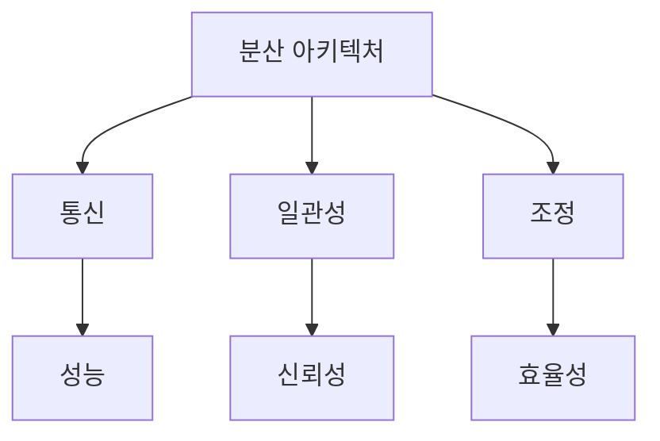
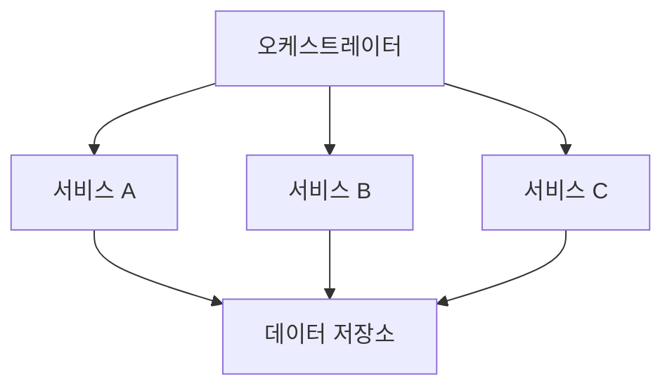
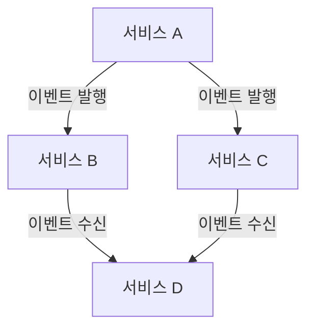
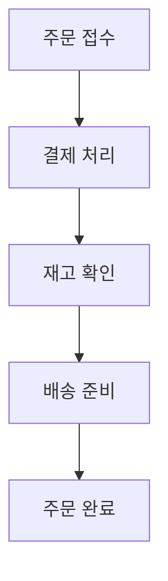
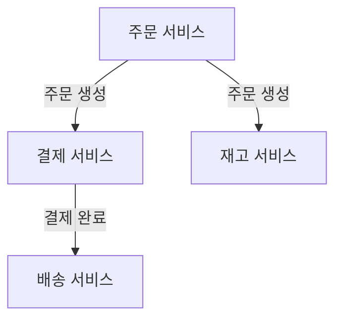
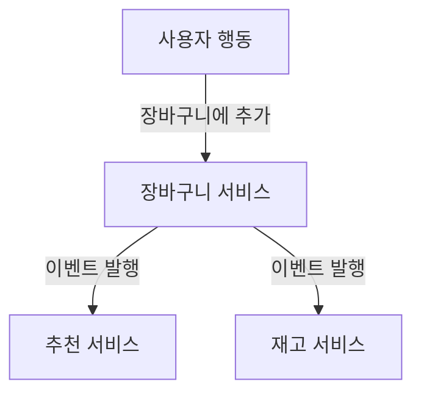
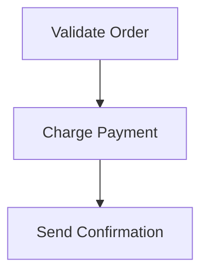
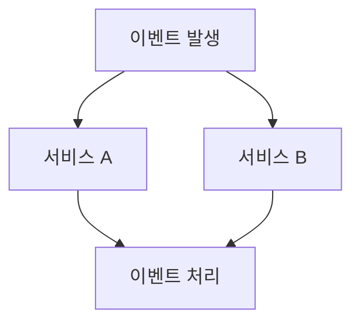
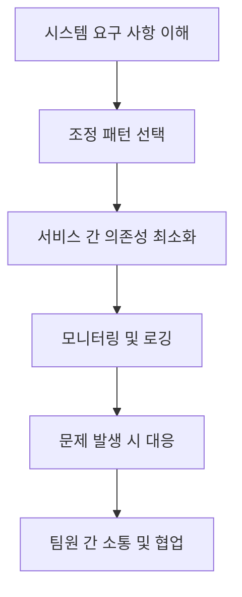
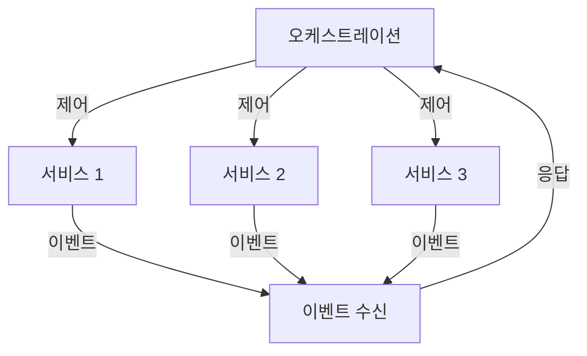

현대의 분산 아키텍처는 다양한 요구 사항을 충족하기 위한 기술적 결정의 결과물이다. 아키텍트는 이러한 요구 사항을 기술적 결정으로 변환하고, 가장 객관적인 트레이드오프 분석을 수행해야 한다. 분산 아키텍처에서 상호작용 모델을 고려할 때 일반적으로 언급되는 세 가지 결합력은 **통신, 일관성, 조정**이다. 이 글에서는 조정에 대해 다룰 것이다. 분산 아키텍처에서 존재하는 두 가지 기본 조정 패턴은 **오케스트레이션**과 **코레오그래피**이다. 이 두 스타일 간의 근본적인 위상적 차이는 아키텍처의 복잡성과 서비스 간의 상호작용 방식에 따라 다르게 나타난다. 오케스트레이션은 중앙 집중식 접근 방식을 사용하여 서비스 간의 상호작용을 조정하고, 복잡한 워크플로우를 관리하는 데 유용하다. 반면, 코레오그래피는 서비스가 독립적으로 이벤트에 반응하여 상호작용하는 분산된 접근 방식을 제공한다. 이러한 두 가지 패턴은 각각의 장단점이 있으며, 특정 시스템의 요구 사항에 따라 적절한 선택이 필요하다.


||
|:---:|
||


<!--
##### Outline #####
-->

<!--
# 목차: 분산 아키텍처에서의 조정 패턴

## 개요
   - 분산 아키텍처의 정의
   - 조정 패턴의 중요성
   - 통신, 일관성 및 조정의 세 가지 결합력

## 조정 패턴의 종류
   - 2.1 오케스트레이션 (Orchestration)
     - 오케스트레이션의 정의
     - 오케스트레이터의 역할
     - 오케스트레이션의 장점
     - 오케스트레이션의 단점
   - 2.2 코레오그래피 (Choreography)
     - 코레오그래피의 정의
     - 분산 통신의 특징
     - 코레오그래피의 장점
     - 코레오그래피의 단점

## 오케스트레이션과 코레오그래피의 비교
   - 3.1 통신 스타일의 차이
   - 3.2 복잡성 및 유지 관리
   - 3.3 중앙 집중식 vs 분산 제어
   - 3.4 오류 처리 및 복구

## 사용 사례 및 시나리오
   - 4.1 오케스트레이션 사용 사례
     - 복잡한 워크플로우 관리
     - 특정 실행 순서 보장
   - 4.2 코레오그래피 사용 사례
     - 독립적인 서비스 운영
     - 이벤트 기반 통신의 장점

## 예제
   - 5.1 오케스트레이션 예제
     - JSON 파일로 표현된 워크플로우
   - 5.2 코레오그래피 예제
     - 이벤트 기반 통신의 코드 예시

## FAQ
   - 오케스트레이션과 코레오그래피의 주요 차이점은 무엇인가요?
   - 어떤 경우에 오케스트레이션을 선택해야 하나요?
   - 코레오그래피의 단점은 무엇인가요?
   - 두 패턴을 혼합하여 사용할 수 있나요?

## 관련 기술
   - 마이크로서비스 아키텍처 (Microservices Architecture)
   - 이벤트 기반 아키텍처 (Event-Driven Architecture)
   - 서비스 메시 (Service Mesh)
   - 비즈니스 프로세스 관리 (Business Process Management)

## 결론
   - 오케스트레이션과 코레오그래피의 선택 기준
   - 분산 아키텍처에서의 조정 패턴의 미래
   - 최적의 아키텍처 설계를 위한 조언

## 참고 문헌
   - 관련 서적 및 자료
   - 추가 학습 리소스

이 목차는 분산 아키텍처에서의 조정 패턴에 대한 포괄적인 이해를 제공하며, 독자가 각 패턴의 장단점과 사용 사례를 명확히 이해할 수 있도록 돕습니다.
-->

<!--
## 개요
   - 분산 아키텍처의 정의
   - 조정 패턴의 중요성
   - 통신, 일관성 및 조정의 세 가지 결합력
-->

## 개요

**분산 아키텍처의 정의**  

분산 아키텍처(Distributed Architecture)는 여러 개의 독립적인 컴포넌트가 네트워크를 통해 상호작용하며, 특정 기능을 수행하는 시스템 구조를 의미한다. 이러한 아키텍처는 각 컴포넌트가 독립적으로 배포되고 운영될 수 있어, 시스템의 확장성과 유연성을 높이는 데 기여한다. 예를 들어, 마이크로서비스 아키텍처는 분산 아키텍처의 한 형태로, 각 서비스가 독립적으로 개발, 배포 및 확장될 수 있도록 설계된다.

**조정 패턴의 중요성**  

조정 패턴은 분산 시스템에서 컴포넌트 간의 상호작용을 관리하는 방법론이다. 이러한 패턴은 시스템의 복잡성을 줄이고, 각 컴포넌트가 원활하게 통신할 수 있도록 돕는다. 조정 패턴을 통해 시스템의 일관성을 유지하고, 오류 발생 시 복구를 용이하게 할 수 있다. 따라서, 조정 패턴은 분산 아키텍처의 성공적인 구현에 필수적인 요소로 작용한다.

**통신, 일관성 및 조정의 세 가지 결합력**  

분산 아키텍처에서 통신(Communication), 일관성(Consistency), 조정(Coordination)은 서로 밀접하게 연결되어 있다. 

- **통신**: 컴포넌트 간의 데이터 전송 및 메시지 교환을 포함하며, 이는 시스템의 성능과 반응 속도에 큰 영향을 미친다.
- **일관성**: 데이터의 정확성과 신뢰성을 보장하는 것으로, 분산 시스템에서는 여러 컴포넌트가 동일한 데이터를 참조할 때 발생할 수 있는 문제를 해결해야 한다.
- **조정**: 시스템 내의 다양한 컴포넌트가 협력하여 작업을 수행하도록 관리하는 과정이다. 조정이 잘 이루어지면 시스템의 효율성과 안정성이 향상된다.

이 세 가지 요소는 분산 아키텍처의 설계 및 운영에서 균형을 이루어야 하며, 이를 통해 최적의 성능과 신뢰성을 확보할 수 있다.



위의 다이어그램은 분산 아키텍처의 세 가지 결합력인 통신, 일관성, 조정이 어떻게 상호작용하는지를 시각적으로 나타낸 것이다. 각 요소는 시스템의 전반적인 성능과 신뢰성에 기여하며, 이들 간의 균형이 중요하다.

<!--
## 조정 패턴의 종류
   - 2.1 오케스트레이션 (Orchestration)
     - 오케스트레이션의 정의
     - 오케스트레이터의 역할
     - 오케스트레이션의 장점
     - 오케스트레이션의 단점
   - 2.2 코레오그래피 (Choreography)
     - 코레오그래피의 정의
     - 분산 통신의 특징
     - 코레오그래피의 장점
     - 코레오그래피의 단점
-->

## 조정 패턴의 종류

### 오케스트레이션 (Orchestration)

**오케스트레이션의 정의** 
 
오케스트레이션은 여러 서비스나 컴포넌트를 조정하여 특정 작업을 수행하는 프로세스를 의미한다. 이 과정에서 중앙 집중식 제어가 이루어지며, 오케스트레이터가 각 서비스의 호출 순서와 데이터 흐름을 관리한다.

**오케스트레이터의 역할**  

오케스트레이터는 전체 워크플로우를 관리하는 주체로, 각 서비스 간의 상호작용을 조정하고, 서비스 호출의 순서를 결정한다. 또한, 오류 발생 시 복구 절차를 수행하고, 각 서비스의 상태를 모니터링하여 전체 시스템의 안정성을 유지하는 역할을 한다.

**오케스트레이션의 장점** 

- **중앙 집중식 관리**: 모든 서비스의 호출과 데이터 흐름을 중앙에서 관리하므로, 복잡한 워크플로우를 쉽게 이해하고 조정할 수 있다.
- **일관성 유지**: 서비스 간의 호출 순서를 명확히 정의하므로, 데이터 일관성을 유지하기 용이하다.
- **오류 처리 용이**: 오류 발생 시 오케스트레이터가 이를 감지하고 적절한 복구 절차를 수행할 수 있다.

**오케스트레이션의 단점**  

- **단일 실패 지점**: 오케스트레이터가 중앙 집중식으로 모든 것을 관리하므로, 오케스트레이터에 문제가 발생하면 전체 시스템이 영향을 받을 수 있다.
- **확장성 문제**: 서비스가 증가함에 따라 오케스트레이터의 관리 부담이 커져, 성능 저하가 발생할 수 있다.



### 코레오그래피 (Choreography)

**코레오그래피의 정의** 

코레오그래피는 각 서비스가 독립적으로 상호작용하며, 서로의 동작을 인식하고 조정하는 방식이다. 이 방식에서는 중앙 집중식 제어가 없으며, 각 서비스가 자신의 역할을 수행하면서 필요한 정보를 주고받는다.

**분산 통신의 특징**  

코레오그래피에서는 서비스 간의 통신이 분산되어 이루어진다. 각 서비스는 이벤트를 발행하거나 구독하여 다른 서비스와 상호작용하며, 이를 통해 전체 시스템이 조화롭게 작동한다. 이러한 방식은 서비스 간의 결합도를 낮추고, 독립적인 배포가 가능하게 한다.

**코레오그래피의 장점**

- **유연성**: 각 서비스가 독립적으로 동작하므로, 새로운 서비스 추가나 변경이 용이하다.
- **확장성**: 서비스가 독립적으로 운영되기 때문에, 시스템의 확장이 용이하다.
- **장애 내성**: 특정 서비스에 문제가 발생하더라도, 다른 서비스는 영향을 받지 않고 계속 운영될 수 있다.

**코레오그래피의 단점**  

- **복잡한 오류 처리**: 각 서비스가 독립적으로 동작하므로, 오류 발생 시 전체 시스템의 상태를 파악하기 어려울 수 있다.
- **상태 관리의 어려움**: 서비스 간의 상태를 일관되게 유지하기 어려워, 데이터 일관성 문제가 발생할 수 있다.



이와 같이 오케스트레이션과 코레오그래피는 각각의 특성과 장단점을 가지고 있으며, 특정 상황에 따라 적절한 패턴을 선택하는 것이 중요하다.

<!--
## 오케스트레이션과 코레오그래피의 비교
   - 3.1 통신 스타일의 차이
   - 3.2 복잡성 및 유지 관리
   - 3.3 중앙 집중식 vs 분산 제어
   - 3.4 오류 처리 및 복구
-->

## 오케스트레이션과 코레오그래피의 비교

분산 아키텍처에서 오케스트레이션(Orchestration)과 코레오그래피(Choreography)는 서로 다른 접근 방식을 통해 시스템의 조정을 수행한다. 이 두 패턴은 통신 스타일, 복잡성, 제어 방식, 오류 처리 및 복구 측면에서 뚜렷한 차이를 보인다.

**3.1 통신 스타일의 차이**  

오케스트레이션은 중앙 집중식 통신 스타일을 채택하여, 오케스트레이터가 모든 서비스 간의 상호작용을 관리한다. 반면, 코레오그래피는 분산 통신 스타일을 사용하여 각 서비스가 독립적으로 상호작용하며, 이벤트를 통해 서로의 상태를 알린다. 이러한 차이는 시스템의 유연성과 확장성에 큰 영향을 미친다.

**3.2 복잡성 및 유지 관리**  

오케스트레이션은 중앙 집중식 제어로 인해 복잡성이 증가할 수 있으며, 오케스트레이터의 변경이 전체 시스템에 영향을 미칠 수 있다. 반면, 코레오그래피는 각 서비스가 독립적으로 동작하므로 복잡성이 분산되지만, 서비스 간의 상호작용을 이해하기 어려울 수 있다. 유지 관리 측면에서도 오케스트레이션은 중앙 집중식 관리로 인해 상대적으로 간단할 수 있지만, 코레오그래피는 각 서비스의 변경 사항을 지속적으로 모니터링해야 한다.

**3.3 중앙 집중식 vs 분산 제어**  

오케스트레이션은 중앙 집중식 제어를 통해 모든 서비스의 흐름을 관리한다. 이는 특정한 실행 순서를 보장할 수 있지만, 단일 실패 지점(Single Point of Failure) 문제를 야기할 수 있다. 반면, 코레오그래피는 분산 제어를 통해 각 서비스가 자율적으로 동작하므로, 시스템의 내결함성을 높일 수 있다.

**3.4 오류 처리 및 복구**  

오케스트레이션에서는 오케스트레이터가 오류를 감지하고 복구하는 역할을 수행한다. 이는 오류 처리 로직이 중앙 집중화되어 있어 관리가 용이하지만, 오케스트레이터가 실패할 경우 전체 시스템이 영향을 받을 수 있다. 코레오그래피에서는 각 서비스가 독립적으로 오류를 처리해야 하므로, 복구가 더 복잡할 수 있지만, 시스템의 유연성을 높이는 데 기여한다.


오케스트레이션은 중앙 집중식으로 모든 서비스가 오케스트레이터를 통해 연결되는 반면, 코레오그래피는 각 서비스가 독립적으로 이벤트를 통해 상호작용하는 모습을 나타낸다. 이러한 비교를 통해 각 패턴의 장단점을 명확히 이해할 수 있다.

<!--
## 사용 사례 및 시나리오
   - 4.1 오케스트레이션 사용 사례
     - 복잡한 워크플로우 관리
     - 특정 실행 순서 보장
   - 4.2 코레오그래피 사용 사례
     - 독립적인 서비스 운영
     - 이벤트 기반 통신의 장점
-->

## 사용 사례 및 시나리오

### 오케스트레이션 사용 사례

**복잡한 워크플로우 관리**  

오케스트레이션은 복잡한 비즈니스 프로세스를 관리하는 데 매우 유용하다. 예를 들어, 전자상거래 플랫폼에서 주문 처리 과정은 여러 단계로 이루어져 있다. 주문이 접수되면 결제 처리, 재고 확인, 배송 준비 등의 단계가 순차적으로 진행된다. 이때 오케스트레이터는 각 단계의 실행 순서를 조정하고, 각 서비스 간의 통신을 관리하여 전체 프로세스가 원활하게 진행되도록 한다.



**특정 실행 순서 보장**  

오케스트레이션은 특정 실행 순서를 보장해야 하는 경우에 적합하다. 예를 들어, 금융 거래 시스템에서는 거래의 승인, 처리, 기록 등의 단계가 반드시 순차적으로 이루어져야 한다. 이때 오케스트레이터는 각 단계가 완료된 후 다음 단계로 진행하도록 보장하여 데이터의 일관성을 유지한다.

### 코레오그래피 사용 사례

**독립적인 서비스 운영** 

코레오그래피는 각 서비스가 독립적으로 운영될 수 있도록 하는 데 유리하다. 예를 들어, 마이크로서비스 아키텍처에서는 각 서비스가 서로의 존재를 알 필요 없이 이벤트를 통해 통신할 수 있다. 이로 인해 서비스 간의 결합도가 낮아지고, 각 서비스는 독립적으로 배포 및 확장이 가능하다.



**이벤트 기반 통신의 장점**  

코레오그래피는 이벤트 기반 통신을 통해 시스템의 반응성을 높일 수 있다. 예를 들어, 사용자가 웹사이트에서 상품을 장바구니에 추가할 때, 해당 이벤트가 발생하면 여러 서비스가 이를 감지하고 각자의 작업을 수행할 수 있다. 이 방식은 시스템의 확장성과 유연성을 높이며, 서비스 간의 의존성을 줄인다.



이와 같이 오케스트레이션과 코레오그래피는 각각의 사용 사례에 따라 적합한 패턴을 선택하여 시스템을 설계하는 데 중요한 역할을 한다. 각 패턴의 장점을 활용하여 효율적이고 유연한 분산 아키텍처를 구축할 수 있다.

<!--
## 예제
   - 5.1 오케스트레이션 예제
     - JSON 파일로 표현된 워크플로우
   - 5.2 코레오그래피 예제
     - 이벤트 기반 통신의 코드 예시
-->

## 예제

**5.1 오케스트레이션 예제**

오케스트레이션은 여러 서비스 간의 상호작용을 중앙에서 관리하는 방식이다. 이를 통해 복잡한 워크플로우를 정의하고, 각 서비스의 실행 순서를 보장할 수 있다. 아래는 JSON 파일로 표현된 간단한 오케스트레이션 워크플로우의 예시이다.

```json
{
  "workflow": {
    "name": "OrderProcessing",
    "steps": [
      {
        "name": "ValidateOrder",
        "service": "OrderService",
        "action": "validate"
      },
      {
        "name": "ChargePayment",
        "service": "PaymentService",
        "action": "charge"
      },
      {
        "name": "SendConfirmation",
        "service": "NotificationService",
        "action": "send"
      }
    ]
  }
}
```

위의 JSON 예제는 주문 처리 워크플로우를 정의하고 있다. 각 단계는 특정 서비스와 그 서비스에서 수행할 액션을 명시하고 있다. 이러한 구조는 오케스트레이터가 각 단계를 순차적으로 실행할 수 있도록 돕는다.

다음은 이 워크플로우를 시각적으로 표현한 다이어그램이다.



**5.2 코레오그래피 예제**

코레오그래피는 각 서비스가 독립적으로 상호작용하는 방식으로, 이벤트 기반 통신을 통해 이루어진다. 아래는 이벤트 기반 통신의 코드 예시로, Node.js를 사용하여 구현한 간단한 서비스 간의 통신을 보여준다.

```javascript
// OrderService.js
const EventEmitter = require('events');
const eventEmitter = new EventEmitter();

eventEmitter.on('orderValidated', (order) => {
    console.log(`Order ${order.id} validated.`);
    eventEmitter.emit('paymentCharged', order);
});

// PaymentService.js
eventEmitter.on('paymentCharged', (order) => {
    console.log(`Payment charged for order ${order.id}.`);
    eventEmitter.emit('confirmationSent', order);
});

// NotificationService.js
eventEmitter.on('confirmationSent', (order) => {
    console.log(`Confirmation sent for order ${order.id}.`);
});

// 주문 처리 시작
const order = { id: 1 };
eventEmitter.emit('orderValidated', order);
```

위의 코드 예시는 주문 서비스가 주문을 검증한 후, 결제 서비스에 결제 요청을 보내고, 결제가 완료되면 알림 서비스에 확인 메시지를 전송하는 과정을 보여준다. 각 서비스는 독립적으로 동작하며, 이벤트를 통해 서로의 상태를 알린다. 이러한 방식은 서비스 간의 결합도를 낮추고, 유연한 아키텍처를 제공한다.

<!--
## FAQ
   - 오케스트레이션과 코레오그래피의 주요 차이점은 무엇인가요?
   - 어떤 경우에 오케스트레이션을 선택해야 하나요?
   - 코레오그래피의 단점은 무엇인가요?
   - 두 패턴을 혼합하여 사용할 수 있나요?
-->

## FAQ

**오케스트레이션과 코레오그래피의 주요 차이점은 무엇인가요?** 

오케스트레이션(Orchestration)과 코레오그래피(Choreography)는 분산 시스템에서의 조정 방식에 있어 근본적인 차이를 보인다. 오케스트레이션은 중앙 집중식 제어를 통해 모든 서비스의 상호작용을 관리하는 반면, 코레오그래피는 각 서비스가 자율적으로 상호작용하도록 하는 분산 방식이다. 오케스트레이션에서는 오케스트레이터가 모든 작업의 흐름을 정의하고 조정하는 역할을 하며, 코레오그래피에서는 서비스 간의 상호작용이 이벤트 기반으로 이루어져 각 서비스가 독립적으로 동작한다.

**어떤 경우에 오케스트레이션을 선택해야 하나요?**  

오케스트레이션은 복잡한 워크플로우를 관리해야 하거나, 특정 실행 순서가 중요한 경우에 적합하다. 예를 들어, 금융 거래 처리와 같이 순서가 중요한 작업에서는 오케스트레이션이 유리하다. 또한, 서비스 간의 의존성이 강한 경우에도 오케스트레이션을 통해 명확한 흐름을 유지할 수 있다. 

**코레오그래피의 단점은 무엇인가요?** 

코레오그래피는 각 서비스가 자율적으로 동작하기 때문에, 서비스 간의 상호작용을 추적하고 관리하는 것이 어려울 수 있다. 또한, 서비스 간의 의존성이 명확하지 않으면, 전체 시스템의 복잡성이 증가할 수 있다. 이로 인해 오류 발생 시 문제를 진단하고 해결하는 데 시간이 더 걸릴 수 있다.

**두 패턴을 혼합하여 사용할 수 있나요?**  

네, 오케스트레이션과 코레오그래피는 혼합하여 사용할 수 있다. 예를 들어, 특정 부분에서는 오케스트레이션을 통해 복잡한 워크플로우를 관리하고, 다른 부분에서는 코레오그래피를 통해 서비스 간의 독립성을 유지하는 방식이다. 이러한 혼합 접근 방식은 시스템의 유연성과 확장성을 높이는 데 기여할 수 있다.

<!--
## 관련 기술
   - 마이크로서비스 아키텍처 (Microservices Architecture)
   - 이벤트 기반 아키텍처 (Event-Driven Architecture)
   - 서비스 메시 (Service Mesh)
   - 비즈니스 프로세스 관리 (Business Process Management)
-->

## 관련 기술

분산 아키텍처에서 조정 패턴을 이해하기 위해서는 여러 관련 기술을 살펴보는 것이 중요하다. 이 섹션에서는 마이크로서비스 아키텍처, 이벤트 기반 아키텍처, 서비스 메시, 비즈니스 프로세스 관리에 대해 설명하겠다.

**마이크로서비스 아키텍처 (Microservices Architecture)**  

마이크로서비스 아키텍처는 애플리케이션을 독립적인 서비스로 나누어 개발하는 접근 방식이다. 각 서비스는 특정 비즈니스 기능을 수행하며, 서로 독립적으로 배포 및 확장할 수 있다. 이 아키텍처는 조정 패턴을 구현하는 데 유용하며, 오케스트레이션과 코레오그래피 모두에 적합하다. 

**이벤트 기반 아키텍처 (Event-Driven Architecture)**  

이벤트 기반 아키텍처는 시스템의 구성 요소가 이벤트를 통해 상호작용하는 방식이다. 이 아키텍처는 비동기 통신을 지원하며, 서비스 간의 결합도를 낮추는 데 기여한다. 코레오그래피 패턴을 활용하여 서비스가 독립적으로 동작할 수 있도록 한다.



**서비스 메시 (Service Mesh)**  

서비스 메시란 마이크로서비스 간의 통신을 관리하는 인프라 계층이다. 서비스 간의 트래픽 관리, 보안, 모니터링 등을 제공하여 개발자가 비즈니스 로직에 집중할 수 있도록 돕는다. 오케스트레이션 패턴을 사용할 때 서비스 메시를 통해 복잡한 통신을 간소화할 수 있다.

**비즈니스 프로세스 관리 (Business Process Management)**  

비즈니스 프로세스 관리는 비즈니스 프로세스를 모델링, 실행, 모니터링하는 방법론이다. 이는 오케스트레이션 패턴과 밀접한 관련이 있으며, 복잡한 워크플로우를 관리하는 데 유용하다. BPM 도구를 사용하면 비즈니스 프로세스를 시각적으로 표현하고, 이를 통해 조정 패턴을 효과적으로 구현할 수 있다.

이와 같은 관련 기술들은 분산 아키텍처에서 조정 패턴을 효과적으로 활용하는 데 필수적이다. 각 기술의 특성을 이해하고 적절히 활용함으로써, 보다 효율적이고 유연한 시스템을 구축할 수 있다.

<!--
## 결론
   - 오케스트레이션과 코레오그래피의 선택 기준
   - 분산 아키텍처에서의 조정 패턴의 미래
   - 최적의 아키텍처 설계를 위한 조언
-->

## 결론

**오케스트레이션과 코레오그래피의 선택 기준**  

오케스트레이션과 코레오그래피는 각각의 장단점이 있으며, 선택 기준은 주로 시스템의 요구 사항에 따라 달라진다. 오케스트레이션은 복잡한 워크플로우를 관리하고 특정 실행 순서를 보장해야 할 때 유리하다. 반면, 코레오그래피는 서비스 간의 독립성을 유지하고 이벤트 기반 통신을 활용할 수 있는 경우에 적합하다. 따라서, 시스템의 복잡성, 서비스 간의 의존성, 그리고 유지 관리의 용이성을 고려하여 적절한 패턴을 선택해야 한다.

**분산 아키텍처에서의 조정 패턴의 미래** 

분산 아키텍처는 계속해서 발전하고 있으며, 조정 패턴 또한 그에 따라 진화하고 있다. 특히, 마이크로서비스 아키텍처의 확산과 함께 오케스트레이션과 코레오그래피의 중요성이 더욱 부각되고 있다. 앞으로는 AI와 머신러닝 기술이 결합되어 자동화된 조정 패턴이 등장할 가능성이 높다. 이러한 변화는 시스템의 효율성을 높이고, 개발자들이 보다 쉽게 복잡한 아키텍처를 관리할 수 있도록 도와줄 것이다.

**최적의 아키텍처 설계를 위한 조언**  

최적의 아키텍처 설계를 위해서는 다음과 같은 몇 가지 원칙을 고려해야 한다. 첫째, 시스템의 요구 사항을 명확히 이해하고, 그에 맞는 조정 패턴을 선택해야 한다. 둘째, 서비스 간의 의존성을 최소화하여 유연성을 높이는 것이 중요하다. 셋째, 모니터링과 로깅을 통해 시스템의 상태를 지속적으로 파악하고, 문제 발생 시 신속하게 대응할 수 있는 체계를 마련해야 한다. 마지막으로, 팀원 간의 원활한 소통과 협업이 이루어질 수 있도록 환경을 조성하는 것이 필요하다.



이러한 원칙을 바탕으로 분산 아키텍처에서의 조정 패턴을 효과적으로 활용할 수 있으며, 이는 시스템의 안정성과 성능을 극대화하는 데 기여할 것이다.

<!--
## 참고 문헌
   - 관련 서적 및 자료
   - 추가 학습 리소스
-->

## 참고 문헌

**관련 서적 및 자료**

1. **"Designing Data-Intensive Applications" by Martin Kleppmann**  
   이 책은 분산 시스템의 설계와 데이터 처리에 대한 깊이 있는 통찰을 제공한다. 특히, 데이터 일관성, 분산 아키텍처의 패턴 및 조정 메커니즘에 대한 내용을 다룬다.

2. **"Microservices Patterns" by Chris Richardson**  
   마이크로서비스 아키텍처에서의 다양한 패턴과 실용적인 접근 방식을 설명하는 책이다. 오케스트레이션과 코레오그래피의 사용 사례를 포함하여, 분산 시스템에서의 조정 패턴에 대한 이해를 돕는다.

3. **"Building Microservices" by Sam Newman**  
   마이크로서비스 아키텍처의 기본 개념과 설계 원칙을 설명하며, 오케스트레이션과 코레오그래피의 차이점에 대한 논의도 포함되어 있다.

4. **"Event-Driven Microservices" by Hugh McKee**  
   이벤트 기반 아키텍처의 원리와 구현 방법을 다룬 책으로, 코레오그래피 패턴의 장점을 이해하는 데 유용하다.

**추가 학습 리소스**

- **Coursera: Microservices Specialization**  
  이 과정은 마이크로서비스 아키텍처의 기본 개념과 실습을 제공하며, 오케스트레이션과 코레오그래피의 실제 적용 사례를 다룬다.

- **YouTube: "Microservices Architecture - Orchestration vs Choreography"**  
  이 영상에서는 오케스트레이션과 코레오그래피의 차이점과 각 패턴의 장단점을 시각적으로 설명한다.

- **Medium: "Understanding Orchestration and Choreography in Microservices"**  
  이 블로그 포스트는 오케스트레이션과 코레오그래피의 개념을 쉽게 설명하며, 실제 사례를 통해 이해를 돕는다.

- **GitHub: Open Source Projects**  
  다양한 오픈 소스 프로젝트에서 오케스트레이션과 코레오그래피 패턴을 구현한 예제를 찾아볼 수 있다. 예를 들어, Kubernetes와 같은 도구는 오케스트레이션을 위한 훌륭한 사례이다.



위의 다이어그램은 오케스트레이션 패턴을 사용하여 여러 서비스를 제어하는 구조를 나타낸다. 각 서비스는 오케스트레이터에 의해 관리되며, 이벤트를 통해 상호작용한다. 이러한 구조는 복잡한 워크플로우를 효과적으로 관리하는 데 유용하다.

<!--
##### Reference #####
-->

## Reference


* [https://medium.com/@dmosyan/2-coordination-patterns-in-distributed-architectures-33f40c906a7a](https://medium.com/@dmosyan/2-coordination-patterns-in-distributed-architectures-33f40c906a7a)
* [https://www.linkedin.com/pulse/microservices-orchestration-vs-choreography-choosing-kedar-kamthe](https://www.linkedin.com/pulse/microservices-orchestration-vs-choreography-choosing-kedar-kamthe)
* [https://medium.com/israeli-tech-radar/choreography-vs-orchestration-2a68ce45d8e6](https://medium.com/israeli-tech-radar/choreography-vs-orchestration-2a68ce45d8e6)
* [https://camunda.com/blog/2023/02/orchestration-vs-choreography/](https://camunda.com/blog/2023/02/orchestration-vs-choreography/)
* [https://www.milanjovanovic.tech/blog/orchestration-vs-choreography](https://www.milanjovanovic.tech/blog/orchestration-vs-choreography)
* [https://bugrasitemkar.medium.com/microservice-communication-orchestration-vs-choreography-dfbe9d767b2d](https://bugrasitemkar.medium.com/microservice-communication-orchestration-vs-choreography-dfbe9d767b2d)

