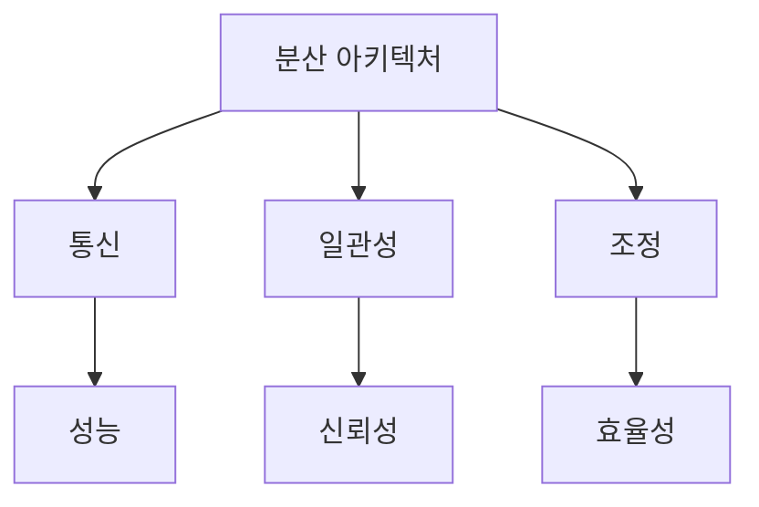
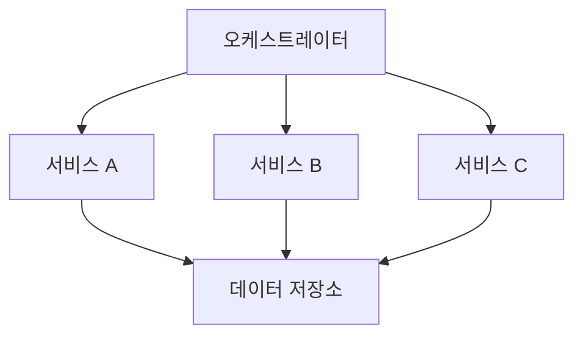
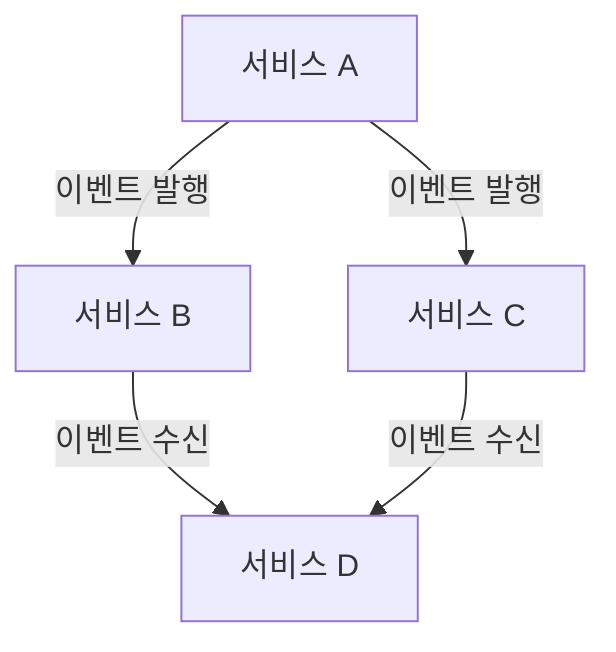
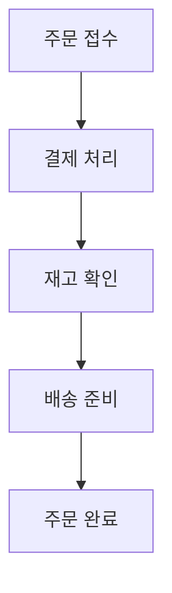
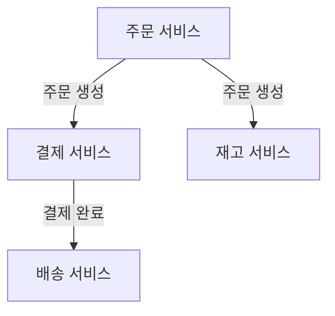
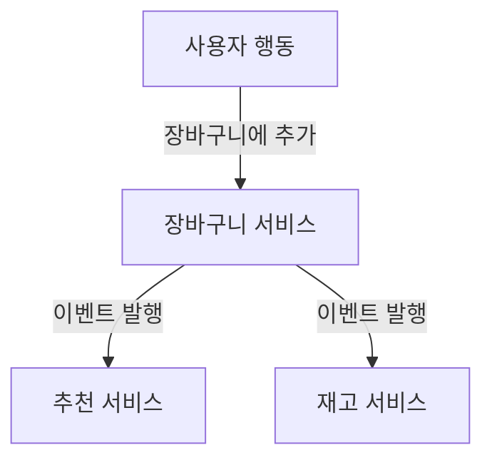
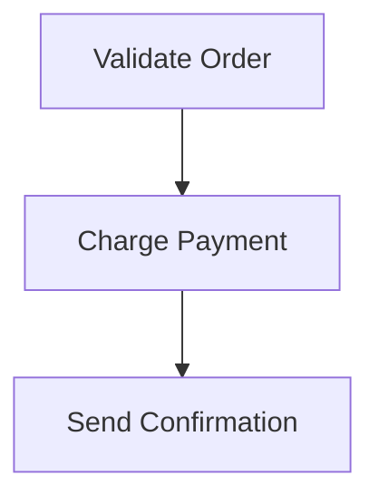
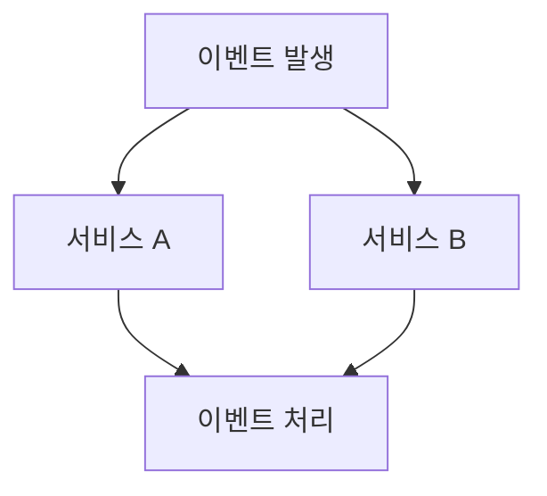
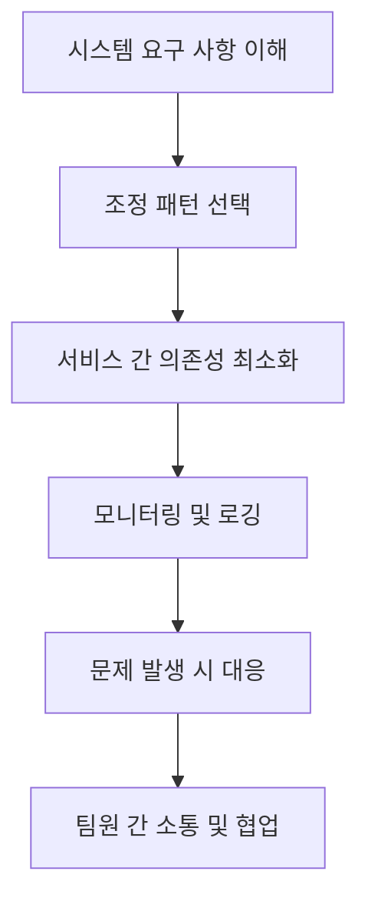

현대의 분산 아키텍처는 다양한 요구 사항을 충족하기 위한 기술적 결정의 결과물이다. 아키텍트는 이러한 요구 사항을 기술적 결정으로 변환하고, 가장 객관적인 트레이드오프 분석을 수행해야 한다. 분산 아키텍처에서 상호작용 모델을 고려할 때 일반적으로 언급되는 세 가지 결합력은 **통신(Communication), 일관성(Consistency), 조정(Coordination)**이다. 이 글에서는 **조정**에 초점을 맞추고, 분산 시스템에서 널리 쓰이는 두 가지 기본 조정 패턴인 **오케스트레이션(Orchestration)**과 **코레오그래피(Choreography)**의 정의, 비교, 사용 시나리오, 판단 기준까지 다룬다. 오케스트레이션은 중앙 집중식 접근으로 서비스 간 상호작용을 조정하고 복잡한 워크플로우를 관리하는 데 유용하다. 반면 코레오그래피는 서비스가 독립적으로 이벤트에 반응하여 상호작용하는 분산 접근을 제공한다. 두 패턴은 각각 장단점이 있으므로, 시스템 요구 사항에 맞는 선택이 필요하다.

||
|:---:|
|분산 아키텍처에서의 오케스트레이션 vs 코레오그래피|

## 개요

### 분산 아키텍처의 정의

**분산 아키텍처(Distributed Architecture)**는 여러 개의 독립적인 컴포넌트가 네트워크를 통해 상호작용하며 특정 기능을 수행하는 시스템 구조를 의미한다. 각 컴포넌트는 독립적으로 배포·운영될 수 있어 확장성과 유연성을 높인다. **마이크로서비스 아키텍처**는 분산 아키텍처의 한 형태로, 각 서비스가 독립적으로 개발·배포·확장되도록 설계된다.

### 조정 패턴의 중요성

**조정 패턴**은 분산 시스템에서 컴포넌트 간 상호작용을 관리하는 방법론이다. 시스템 복잡성을 줄이고, 컴포넌트가 원활하게 통신하도록 하며, 일관성을 유지하고 오류 시 복구를 용이하게 한다. 따라서 조정 패턴은 분산 아키텍처의 성공적인 구현에 필수적이다.

### 통신, 일관성, 조정의 세 가지 결합력

분산 아키텍처에서 **통신**, **일관성**, **조정**은 밀접하게 연결되어 있다.

- **통신**: 컴포넌트 간 데이터 전송·메시지 교환을 포함하며, 성능과 반응 속도에 영향을 미친다.
- **일관성**: 데이터의 정확성과 신뢰성을 보장하며, 여러 컴포넌트가 동일한 데이터를 참조할 때 발생할 수 있는 문제를 해결한다.
- **조정**: 다양한 컴포넌트가 협력하여 작업을 수행하도록 관리하는 과정으로, 효율성과 안정성을 높인다.

이 세 가지는 설계·운영에서 균형을 이루어야 최적의 성능과 신뢰성을 얻을 수 있다.


```mermaid
graph TD
    DistArch["분산 아키텍처"]
    Comm["통신"]
    Consistency["일관성"]
    Coord["조정"]
    Perf["성능"]
    Rel["신뢰성"]
    Eff["효율성"]
    DistArch --> Comm
    DistArch --> Consistency
    DistArch --> Coord
    Comm --> Perf
    Consistency --> Rel
    Coord --> Eff
```

위 다이어그램은 분산 아키텍처의 세 가지 결합력이 어떻게 상호작용하는지 보여준다. 각 요소는 시스템의 성능·신뢰성에 기여하며, 이들 간 균형이 중요하다.

## 조정 패턴의 종류

### 오케스트레이션 (Orchestration)

**오케스트레이션**은 여러 서비스·컴포넌트를 조정하여 특정 작업을 수행하는 프로세스이다. 중앙 집중식 제어가 이루어지며, **오케스트레이터**가 각 서비스의 호출 순서와 데이터 흐름을 관리한다. 오케스트레이터는 전체 워크플로우를 관리하는 주체로, 서비스 간 상호작용을 조정하고 호출 순서를 결정하며, 오류 발생 시 복구 절차를 수행하고 각 서비스의 상태를 모니터링한다.

**장점**: 중앙 집중식 관리로 복잡한 워크플로우를 이해·조정하기 쉽고, 호출 순서가 명확해 데이터 일관성 유지가 용이하며, 오류 시 오케스트레이터가 감지·복구를 수행할 수 있다.  
**단점**: 오케스트레이터가 단일 실패 지점(SPOF)이 될 수 있고, 서비스 증가 시 오케스트레이터 부담이 커져 성능 저하가 발생할 수 있다.


```mermaid
graph TD
    Orch["오케스트레이터"]
    SvcA["서비스 A"]
    SvcB["서비스 B"]
    SvcC["서비스 C"]
    DataStore["데이터 저장소"]
    Orch --> SvcA
    Orch --> SvcB
    Orch --> SvcC
    SvcA --> DataStore
    SvcB --> DataStore
    SvcC --> DataStore
```

### 코레오그래피 (Choreography)

**코레오그래피**는 각 서비스가 독립적으로 상호작용하며, 서로의 동작을 인식하고 조정하는 방식이다. 중앙 제어자가 없고, 각 서비스가 자신의 역할을 수행하면서 필요한 정보를 주고받는다. 서비스 간 통신은 분산되어 이루어지며, 이벤트를 발행·구독하여 상호작용한다. 이로 인해 결합도가 낮아지고 독립적인 배포가 가능해진다.

**장점**: 서비스가 독립적으로 동작해 새 서비스 추가·변경이 용이하고, 확장성이 좋으며, 특정 서비스 장애가 다른 서비스에 직접 영향을 주지 않을 수 있다.  
**단점**: 오류 발생 시 전체 시스템 상태 파악이 어렵고, 서비스 간 상태를 일관되게 유지하기 어려워 데이터 일관성 문제가 생길 수 있다.


```mermaid
graph TD
    SvcA["서비스 A"]
    SvcB["서비스 B"]
    SvcC["서비스 C"]
    SvcD["서비스 D"]
    SvcA -->|"이벤트 발행"| SvcB
    SvcA -->|"이벤트 발행"| SvcC
    SvcB -->|"이벤트 수신"| SvcD
    SvcC -->|"이벤트 수신"| SvcD
```

## 오케스트레이션과 코레오그래피의 비교

두 패턴은 통신 스타일, 복잡성, 제어 방식, 오류 처리 측면에서 뚜렷한 차이를 보인다.

| 구분 | 오케스트레이션 | 코레오그래피 |
|------|----------------|--------------|
| **통신 스타일** | 중앙 집중식, 오케스트레이터가 모든 상호작용 관리 | 분산, 각 서비스가 이벤트로 상호작용 |
| **복잡성·유지보수** | 중앙 제어로 복잡성 집중, 오케스트레이터 변경이 전체에 영향 | 복잡성이 분산되나 상호작용 추적이 어려울 수 있음 |
| **제어** | 중앙 집중식, 실행 순서 보장, 단일 실패 지점 위험 | 분산 제어, 자율 동작, 내결함성 향상 |
| **오류 처리** | 오케스트레이터가 감지·복구, 관리 용이, 오케스트레이터 장애 시 전체 영향 | 서비스별 독립 처리, 복구 복잡, 시스템 유연성 증가 |

오케스트레이션은 모든 서비스가 오케스트레이터를 통해 연결되고, 코레오그래피는 각 서비스가 이벤트를 통해 독립적으로 상호작용한다.

## 사용 사례 및 시나리오

### 오케스트레이션 사용 사례

**복잡한 워크플로우 관리**: 전자상거래의 주문 처리처럼 결제·재고 확인·배송 준비 등 여러 단계가 순차적으로 진행되는 경우, 오케스트레이터가 실행 순서와 서비스 간 통신을 조정한다.


```mermaid
graph TD
    OrderReceived["주문 접수"]
    PaymentProcess["결제 처리"]
    InventoryCheck["재고 확인"]
    ShipPrepare["배송 준비"]
    OrderComplete["주문 완료"]
    OrderReceived --> PaymentProcess
    PaymentProcess --> InventoryCheck
    InventoryCheck --> ShipPrepare
    ShipPrepare --> OrderComplete
```

**특정 실행 순서 보장**: 금융 거래처럼 승인·처리·기록이 반드시 순차적으로 이루어져야 하는 경우, 오케스트레이터가 단계 완료 후 다음 단계로의 진행을 보장하여 데이터 일관성을 유지한다.

### 코레오그래피 사용 사례

**독립적인 서비스 운영**: 각 서비스가 서로의 존재를 알 필요 없이 이벤트로 통신할 수 있어 결합도가 낮고, 독립적으로 배포·확장이 가능하다.


```mermaid
graph TD
    OrderSvc["주문 서비스"]
    PaymentSvc["결제 서비스"]
    InventorySvc["재고 서비스"]
    ShipSvc["배송 서비스"]
    OrderSvc -->|"주문 생성"| PaymentSvc
    OrderSvc -->|"주문 생성"| InventorySvc
    PaymentSvc -->|"결제 완료"| ShipSvc
```

**이벤트 기반 통신**: 사용자가 장바구니에 상품을 추가할 때 해당 이벤트에 여러 서비스가 반응해 각자 작업을 수행할 수 있어, 확장성과 유연성이 높고 의존성이 줄어든다.


```mermaid
graph TD
    UserAction["사용자 행동"]
    CartSvc["장바구니 서비스"]
    RecSvc["추천 서비스"]
    StockSvc["재고 서비스"]
    UserAction -->|"장바구니에 추가"| CartSvc
    CartSvc -->|"이벤트 발행"| RecSvc
    CartSvc -->|"이벤트 발행"| StockSvc
```

## 예제

### 오케스트레이션 예제

오케스트레이션은 여러 서비스 간 상호작용을 중앙에서 관리한다. 아래는 JSON으로 표현한 간단한 주문 처리 워크플로우이다. 각 단계는 서비스와 액션을 명시하여 오케스트레이터가 순차 실행할 수 있게 한다.

```json
{
  "workflow": {
    "name": "OrderProcessing",
    "steps": [
      { "name": "ValidateOrder", "service": "OrderService", "action": "validate" },
      { "name": "ChargePayment", "service": "PaymentService", "action": "charge" },
      { "name": "SendConfirmation", "service": "NotificationService", "action": "send" }
    ]
  }
}
```


```mermaid
graph TD
    ValidateOrder["Validate Order"]
    ChargePayment["Charge Payment"]
    SendConfirmation["Send Confirmation"]
    ValidateOrder --> ChargePayment
    ChargePayment --> SendConfirmation
```

### 코레오그래피 예제

코레오그래피는 이벤트 기반 통신으로 서비스가 독립적으로 상호작용한다. 아래는 Node.js `EventEmitter`를 이용한 간단한 예시로, 주문 검증 후 결제·알림이 이벤트로 이어지는 흐름을 보여준다. 각 서비스는 이벤트를 통해 상태를 알리며 결합도를 낮춘다.

```javascript
// OrderService.js
const EventEmitter = require('events');
const eventEmitter = new EventEmitter();

eventEmitter.on('orderValidated', (order) => {
  console.log(`Order ${order.id} validated.`);
  eventEmitter.emit('paymentCharged', order);
});

// PaymentService.js
eventEmitter.on('paymentCharged', (order) => {
  console.log(`Payment charged for order ${order.id}.`);
  eventEmitter.emit('confirmationSent', order);
});

// NotificationService.js
eventEmitter.on('confirmationSent', (order) => {
  console.log(`Confirmation sent for order ${order.id}.`);
});

const order = { id: 1 };
eventEmitter.emit('orderValidated', order);
```

## 판단 기준: 언제 어떤 패턴을 선택할까

상황에 따라 오케스트레이션과 코레오그래피를 선택하는 기준을 정리하면 다음과 같다. “항상 이 패턴만 쓴다”가 아니라, 워크플로우 복잡도·순서 요구·장애 복구·가시성 요구에 따라 선택한다.

| 선택 | 오케스트레이션을 우선 고려 | 코레오그래피를 우선 고려 |
|------|---------------------------|---------------------------|
| **워크플로우** | 복잡한 다단계·분기·예외 경로가 많음 | 단순·일직선·진행 방향이 명확함 |
| **실행 순서** | 특정 순서 보장이 필수(예: 금융·결제) | 순서가 유연하거나 비동기로 충분함 |
| **가시성·디버깅** | 전체 흐름·상태를 한 곳에서 보고 싶음 | 서비스별 독립성·분산 추적로 충분함 |
| **장애 복구** | 중앙에서 재시도·보상 트랜잭션 관리 필요 | 서비스별 보상·이벤트 재발행으로 처리 가능 |
| **도메인 결합** | 여러 서비스가 강하게 엮인 비즈니스 프로세스 | 메시지가 도메인 경계를 넘어가는 알림·부가 기능 |

복잡한 주문·결제·정산처럼 “한 흐름”이 중요한 구간은 오케스트레이션, 뉴스레터 가입·알림·로깅처럼 맥락을 벗어나는 부가 동작은 코레오그래피가 잘 맞는 경우가 많다. 두 패턴을 혼합해, 핵심 플로우는 오케스트레이션으로 관리하고 주변 이벤트는 코레오그래피로 처리하는 하이브리드도 실무에서 자주 사용된다.

## 관련 기술

- **마이크로서비스 아키텍처**: 애플리케이션을 독립 서비스로 나누어 개발·배포·확장하는 방식으로, 오케스트레이션·코레오그래피 모두에 적용된다.
- **이벤트 기반 아키텍처(EDA)**: 구성 요소가 이벤트로 상호작용하며 비동기 통신과 낮은 결합도를 지원하며, 코레오그래피 구현에 적합하다.
- **서비스 메시(Service Mesh)**: 마이크로서비스 간 통신·트래픽·보안·모니터링을 인프라 계층에서 처리하여, 오케스트레이션 시 통신을 간소화한다.
- **비즈니스 프로세스 관리(BPM)**: 비즈니스 프로세스를 모델링·실행·모니터링하는 방법론으로, 오케스트레이션과 잘 맞으며 BPMN 등으로 워크플로우를 시각화할 수 있다.


```mermaid
graph TD
    EventOccur["이벤트 발생"]
    SvcA["서비스 A"]
    SvcB["서비스 B"]
    EventProcess["이벤트 처리"]
    EventOccur --> SvcA
    EventOccur --> SvcB
    SvcA --> EventProcess
    SvcB --> EventProcess
```

## FAQ

**Q. 오케스트레이션과 코레오그래피의 주요 차이점은?**  
오케스트레이션은 중앙 오케스트레이터가 모든 상호작용을 정의·조정하는 반면, 코레오그래피는 서비스가 이벤트에 반응해 자율적으로 동작한다. 전자는 명령 기반, 후자는 이벤트 기반 통신에 가깝다.

**Q. 어떤 경우에 오케스트레이션을 선택해야 하나요?**  
복잡한 워크플로우, 엄격한 실행 순서, 중앙에서의 오류 복구·가시성이 중요할 때 오케스트레이션이 유리하다.

**Q. 코레오그래피의 단점은?**  
상호작용 추적·디버깅이 어렵고, 분산 상태 일관성과 보상 트랜잭션 설계가 복잡해질 수 있다.

**Q. 두 패턴을 혼합할 수 있나요?**  
가능하다. 핵심 비즈니스 플로우는 오케스트레이션으로, 부가·알림·로깅 등은 코레오그래피로 두는 하이브리드가 많이 쓰인다.

## 학습 성과 목표 (평가 기준)

이 글을 읽은 후 다음을 할 수 있으면 목표를 달한 것이다.

- **설명**: 오케스트레이션과 코레오그래피를 구분하고, 통신·일관성·조정의 결합력을 문맥에 맞게 설명할 수 있다.
- **구분**: 주어진 워크플로우 설명을 보고 오케스트레이션/코레오그래피 중 어떤 스타일에 가까운지 판단할 수 있다.
- **선택**: “복잡한 순차 플로우·중앙 복구” vs “단순·비동기·독립성” 요구에 따라 어느 패턴(또는 혼합)을 추천할지 이유와 함께 제시할 수 있다.
- **비판**: 각 패턴의 한계(SPOF, 분산 추적 난이도 등)와 트레이드오프를 설명하고, “무조건 하나만 쓴다”가 아니라 상황에 따른 선택임을 이해한다.

## 결론 및 핵심 요약

- **선택 기준**: 복잡한 워크플로우·순서 보장·중앙 복구가 중요하면 오케스트레이션, 서비스 독립성·확장성·이벤트 기반이 중요하면 코레오그래피를 고려한다. 필요 시 하이브리드로 조합한다.
- **트레이드오프**: 오케스트레이션은 가시성·복구 용이 대신 SPOF·확장 제약이 있고, 코레오그래피는 유연성·확장성 대신 추적·일관성 설계가 어렵다.
- **실무 조언**: 요구 사항을 명확히 하고, 도메인 결합이 큰 구간과 도메인 밖 부가 동작을 구분한 뒤, 각 구간에 맞는 조정 패턴을 선택하고 모니터링·로깅을 갖추는 것이 중요하다.


```mermaid
graph TD
    ReqUnderstand["시스템 요구 사항 이해"]
    PatternSelect["조정 패턴 선택"]
    DepMin["서비스 간 의존성 최소화"]
    MonitorLog["모니터링 및 로깅"]
    Response["문제 발생 시 대응"]
    TeamComm["팀원 간 소통 및 협업"]
    ReqUnderstand --> PatternSelect
    PatternSelect --> DepMin
    DepMin --> MonitorLog
    MonitorLog --> Response
    Response --> TeamComm
```

## 참고 문헌

1. **Designing Data-Intensive Applications** (Martin Kleppmann) — 분산 시스템 설계, 데이터 일관성, 조정 메커니즘.
2. **Microservices Patterns** (Chris Richardson) — 마이크로서비스 패턴과 오케스트레이션·코레오그래피 사용 사례.
3. **Building Microservices** (Sam Newman) — 마이크로서비스 기본 개념과 설계 원칙, 조정 패턴 논의.

## Reference

- [2 Coordination Patterns in Distributed Architectures — David Mosyan (Medium)](https://medium.com/@dmosyan/2-coordination-patterns-in-distributed-architectures-33f40c906a7a)
- [Microservices: Orchestration vs. Choreography — Kedar Kamthe (LinkedIn)](https://www.linkedin.com/pulse/microservices-orchestration-vs-choreography-choosing-kedar-kamthe)
- [Orchestration vs Choreography — Camunda Blog](https://camunda.com/blog/2023/02/orchestration-vs-choreography/)
- [Choreography and Orchestration in microservices — Israeli Tech Radar (Medium)](https://medium.com/israeli-tech-radar/choreography-vs-orchestration-2a68ce45d8e6)
- [Orchestration vs Choreography — Milan Jovanović](https://www.milanjovanovic.tech/blog/orchestration-vs-choreography)
