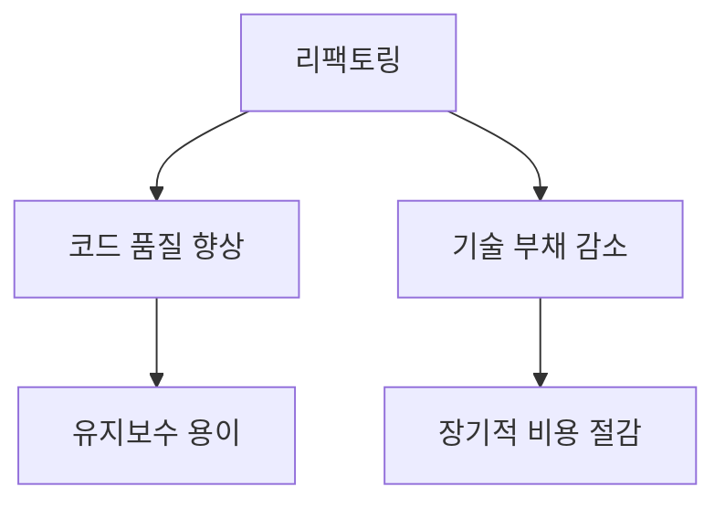
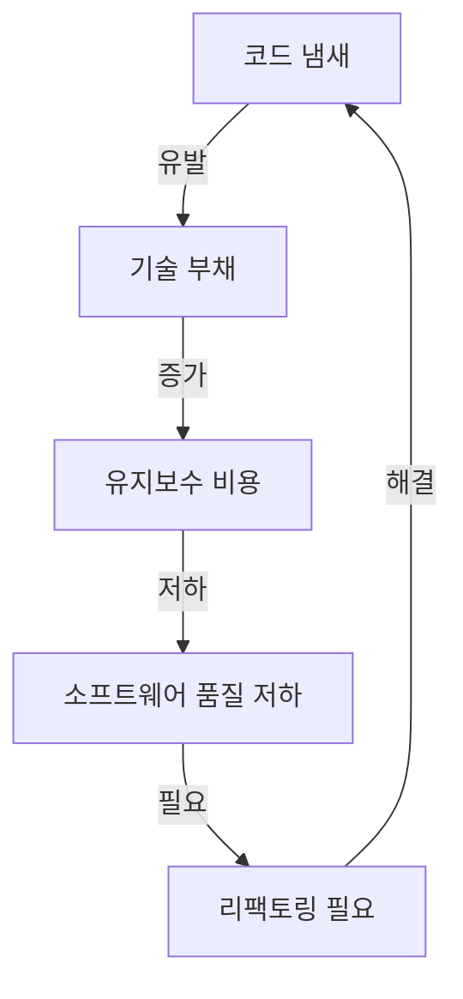
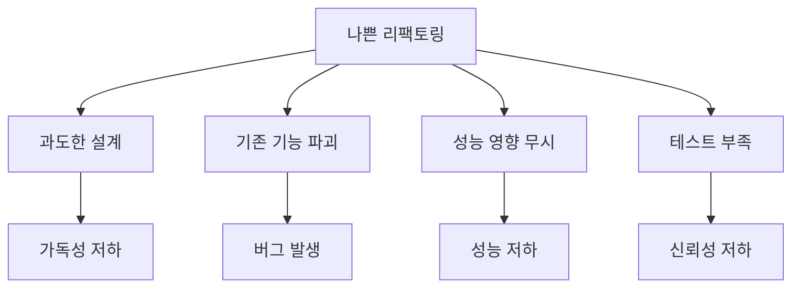
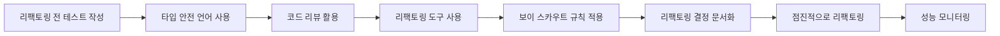
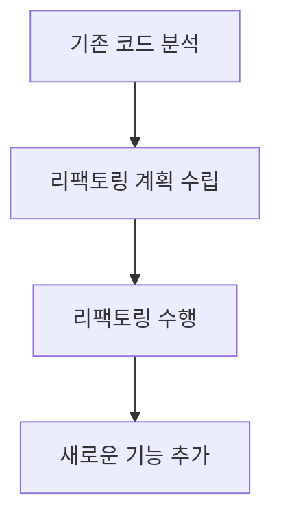
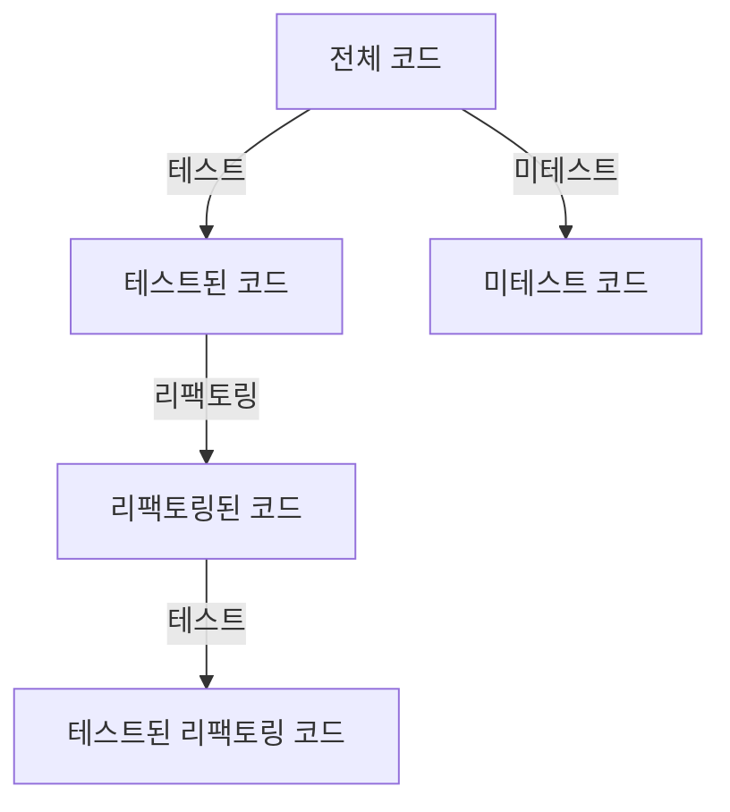
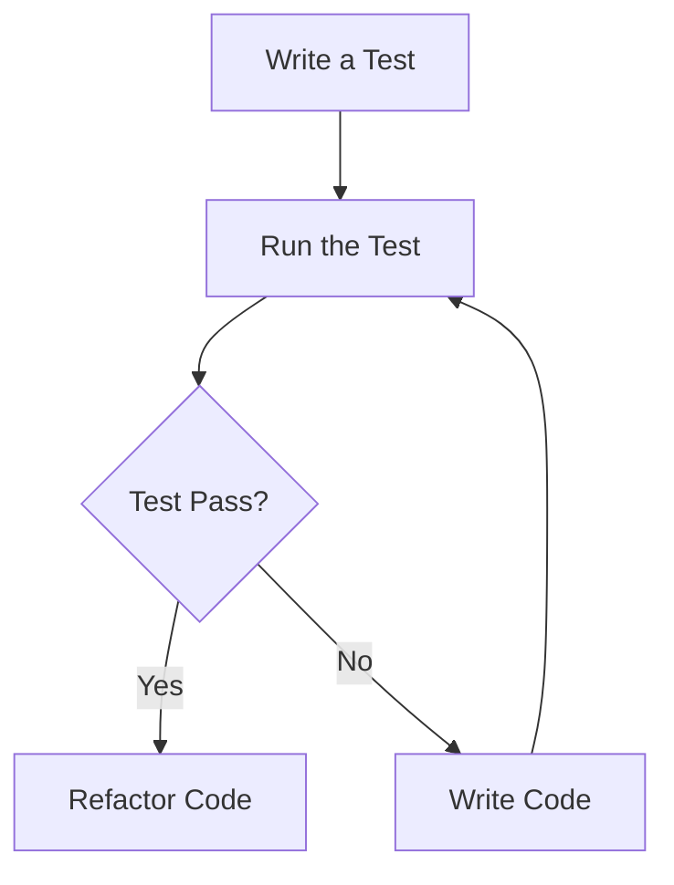
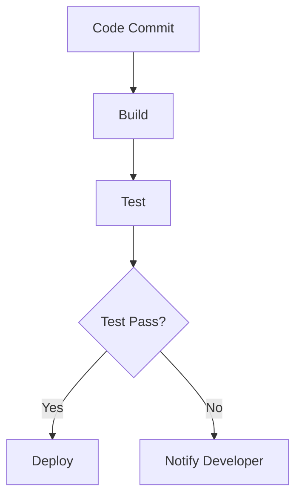
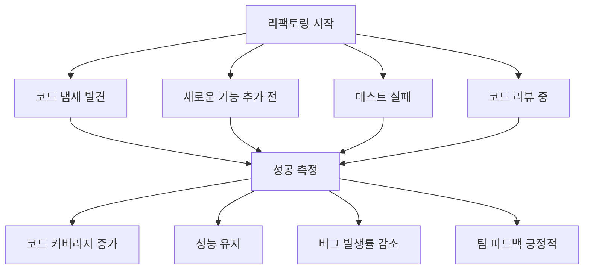

소프트웨어 개발에서 리팩토링(refactoring)은 코드의 내부 구조를 개선하는 중요한 과정이다. 리팩토링의 목표는 기존 코드의 **외부 동작을 변경하지 않으면서** 코드의 가독성, 유지보수성 및 성능을 향상시키는 것이다. 이는 소프트웨어의 품질을 높이고 기술 부채(technical debt)를 줄이는 데 기여한다. 리팩토링은 단순히 코드를 정리하는 것이 아니라, 복잡성을 줄이고, 중복을 제거하며, 모듈화를 촉진하는 다양한 이점을 제공한다. 다만 신중하게 접근해야 하며, 잘못된 리팩토링은 버그나 성능 저하를 유발할 수 있다. 이 글에서는 리팩토링의 중요성과 모범 사례, 전략과 도구를 다룬다.

## 목차

- [개요](#개요)
- [리팩토링 이해하기](#리팩토링-이해하기)
- [좋은 리팩토링 관행](#좋은-리팩토링-관행)
- [나쁜 리팩토링 관행](#나쁜-리팩토링-관행)
- [리팩토링을 위한 팁과 도구](#리팩토링을-위한-팁과-도구)
- [리팩토링의 시기와 필요성](#리팩토링의-시기와-필요성)
- [리팩토링의 효과 측정](#리팩토링의-효과-측정)
- [개인적인 리팩토링 경험](#개인적인-리팩토링-경험)
- [결론](#결론)
- [관련 기술](#관련-기술)
- [FAQ](#faq)
- [Reference](#reference)

---

## 개요

리팩토링은 소프트웨어 개발에서 코드의 구조를 개선하는 과정을 의미한다. 이 과정은 **기존 기능을 변경하지 않으면서** 코드의 가독성, 유지보수성, 성능 등을 향상시키는 데 중점을 둔다. 단순한 수정이 아니라, 코드 품질을 높이고 향후 개발을 용이하게 만드는 핵심 작업이다.

**리팩토링의 정의**  
마틴 파울러(Martin Fowler)에 따르면, 리팩토링은 **명사**로는 «관찰 가능한 동작을 바꾸지 않으면서 내부 구조를 더 이해하기 쉽고 수정 비용을 낮추기 위해 이루어지는 변경»이고, **동사**로는 «일련의 리팩토링을 적용해 관찰 가능한 동작을 바꾸지 않고 소프트웨어를 재구조화하는 것»이다. 즉, 기능은 그대로 두고 구조만 개선하며, 중복 제거와 불필요한 복잡성 축소를 포함한다.

예를 들어 다음과 같은 코드가 있다고 하자.

```python
def calculate_area(radius):
    return 3.14 * radius * radius
```

리팩토링으로 상수를 분리하고 의도를 드러내면 다음과 같다.

```python
def calculate_area(radius):
    PI = 3.14
    return PI * radius * radius
```

**리팩토링의 중요성**  
코드는 시간이 지남에 따라 복잡해지고, 기능이 누적되면서 품질이 떨어질 수 있다. 리팩토링은 품질 유지와 기술 부채 감소에 기여하며, 개발자가 더 나은 구조를 갖게 해 유지보수와 기능 추가를 쉽게 한다.

**리팩토링과 기술 부채(Technical Debt)**  
기술 부채는 단기 이익을 위해 내려진 비효율적인 코드·설계 결정을 말한다. 장기적으로 유지보수 비용을 늘린다. 리팩토링은 이러한 부채를 상환하는 핵심 수단이다.



---

## 리팩토링 이해하기

리팩토링은 코드의 기능을 바꾸지 않으면서 구조를 개선하는 작업이다.

**리팩토링의 목표**

1. **가독성 향상**: 코드가 명확해져 다른 개발자가 이해·수정하기 쉬워진다.
2. **유지보수성 향상**: 구조 개선으로 기능 추가·수정이 수월해진다.
3. **버그 감소**: 복잡성 감소로 잠재적 버그를 줄인다.
4. **성능 최적화**: 필요 시 성능 개선 여지를 마련한다.

**코드 냄새(Code Smells)와 기술 부채의 관계**

코드 냄새는 리팩토링이 필요한 징후다. 예를 들면 다음과 같다.

- **중복 코드**: 같은 로직이 여러 곳에 반복되는 경우
- **긴 메서드**: 한 메서드가 너무 많은 책임을 갖는 경우
- **불명확한 변수명**: 역할을 설명하지 못하는 이름

코드 냄새가 쌓일수록 기술 부채가 늘고, 결국 품질 저하로 이어진다. 리팩토링으로 코드 냄새를 제거하면 기술 부채를 줄일 수 있다.



---

## 좋은 리팩토링 관행

**3.1 점진적 변화(Incremental Changes)**  
한 번에 대규모로 하기보다 작은 단위로 변경하면 검증과 원인 파악이 쉽다.

```python
# 리팩토링 전
def calculate_area(radius):
    return 3.14 * radius * radius

# 리팩토링 후
def calculate_area(radius):
    pi = 3.14
    return pi * radius * radius
```

**3.2 동작 보존(Preserving Behavior)**  
기존 기능이 바뀌지 않도록 하는 것이 리팩토링의 핵심이다. 리팩토링 전후 테스트로 동작을 검증해야 한다.

```python
def test_calculate_area():
    assert calculate_area(1) == 3.14
    assert calculate_area(2) == 12.56
```

**3.3 코드 품질 향상(Improving Code Quality)**  
가독성 개선, 중복 제거, 명확한 이름 사용이 목표다.

```python
# 리팩토링 전
def f(x):
    return x * 2

# 리팩토링 후
def double_value(value):
    return value * 2
```

**3.4 성능 유지(Maintaining Performance)**  
구조를 바꿀 때 성능이 떨어지지 않도록 주의한다. 불필요한 루프나 자료 구조 변경은 피한다.

---

## 나쁜 리팩토링 관행

**4.1 과도한 설계(Overengineering)**  
단순 기능에 과한 추상화·패턴을 적용하면 가독성과 유지보수성이 오히려 나빠진다.

**4.2 기존 기능 파괴(Breaking Existing Functionality)**  
리팩토링의 목적은 동작을 유지하는 것이다. 테스트 부족이나 검토 미흡 시 의도치 않게 동작이 깨질 수 있다.

**4.3 성능 영향 무시(Ignoring Performance Impact)**  
구조 변경으로 불필요한 반복이나 비효율이 생기면 실행 속도가 느려질 수 있다.

**4.4 테스트 부족(Lack of Testing)**  
리팩토링 후 테스트가 없으면 숨은 버그를 찾기 어렵고 신뢰성이 떨어진다.



---

## 리팩토링을 위한 팁과 도구

**5.1 리팩토링 전 테스트 작성**  
기존 동작을 보장하는 테스트가 있으면 리팩토링 후 회귀를 바로 확인할 수 있다.

**5.2 타입 안전 언어 또는 타입 힌트 사용**  
타입을 명시하면 의도가 분명해지고 리팩토링 시 오류를 줄일 수 있다.

```python
def multiply(a: int, b: int) -> int:
    return a * b
```

**5.3 코드 리뷰 활용**  
동료의 피드백으로 품질을 높이고 놓친 부분을 보완할 수 있다.

**5.4 리팩토링 도구 사용**  
IntelliJ, Eclipse, VSCode 등 IDE의 리팩토링 기능을 활용하면 일관되고 안전한 변경이 가능하다.

**5.5 보이 스카우트 규칙(Boy Scout Rule)**  
«발견한 것보다 더 나은 상태로 코드를 남긴다»는 원칙으로, 작은 개선을 지속하면 품질이 누적된다.

**5.6 리팩토링 결정 문서화**  
왜 리팩토링했는지, 무엇을 바꿨는지 기록하면 팀 소통과 이후 판단에 도움이 된다.

**5.7 점진적으로 리팩토링**  
한 번에 크게 바꾸기보다 작은 단위로 나누어 리스크를 줄인다.

**5.8 성능 모니터링**  
리팩토링 후 성능이 유지·개선되었는지 측정하고, 저하 시 원인 분석 후 보정한다.



---

## 리팩토링의 시기와 필요성

**리팩토링이 필요한 상황**

1. **코드가 과도하게 복잡할 때**: 유지보수가 어려우면 구조를 정리할 시점이다.
2. **기능 추가가 어렵을 때**: 기존 코드가 확장을 막으면 리팩토링으로 구조를 개선한다.
3. **버그가 반복될 때**: 품질이 낮아 오류가 자주 나면 안정성을 높이기 위해 리팩토링을 고려한다.

**새로운 기능 추가 전 리팩토링**  
기존 코드가 정리되어 있으면 새 기능을 더 안전하고 빠르게 넣을 수 있다. 기존 코드 분석 → 리팩토링 계획 수립 → 리팩토링 수행 → 기능 추가 순서를 권장한다.



**코드 리뷰 중 리팩토링 기회**  
리뷰에서 지적된 코드 냄새를 바탕으로 리팩토링하고, 팀의 코드 스타일·패턴을 맞추며 지식을 공유할 수 있다.

---

## 리팩토링의 효과 측정

**코드 커버리지(Code Coverage) 모니터링**  
리팩토링 후 테스트가 어느 부분을 커버하는지 확인하면, 동작 보존 여부와 안정성을 파악할 수 있다.



**성능 모니터링 및 오류 추적**  
응답 시간, 메모리, CPU 사용량 등을 측정해 리팩토링이 성능에 미친 영향을 평가하고, 오류 추적 도구로 회귀를 빠르게 잡는다.

**팀 피드백 수집**  
가독성, 유지보수성, 기능 변화에 대한 팀원 의견을 모으면 리팩토링 성공 여부와 다음 방향을 정하는 데 도움이 된다.

---

## 개인적인 리팩토링 경험

**장점**  
가독성·유지보수성 향상, 버그 가능성 감소, 협업과 기능 추가가 수월해진다.

**단점**  
시간과 자원이 들고, 잘못하면 기존 기능이 깨져 추가 디버깅이 필요할 수 있다. 신중한 접근이 필요하다.

**실제 사례**  
복잡한 조건문이 반복되던 코드를, 조건별로 함수를 나누고 역할이 드러나는 이름을 부여해 리팩토링했다. 가독성과 유지보수가 크게 나아졌다.

```python
# 리팩토링 전
def process_order(order):
    if order.status == 'pending':
        pass  # 처리 로직
    elif order.status == 'shipped':
        pass  # 처리 로직
    elif order.status == 'delivered':
        pass  # 처리 로직

# 리팩토링 후
def process_pending_order(order):
    pass  # 처리 로직

def process_shipped_order(order):
    pass  # 처리 로직

def process_delivered_order(order):
    pass  # 처리 로직

def process_order(order):
    if order.status == 'pending':
        process_pending_order(order)
    elif order.status == 'shipped':
        process_shipped_order(order)
    elif order.status == 'delivered':
        process_delivered_order(order)
```

---

## 결론

리팩토링은 소프트웨어 개발에서 **지속적으로 필요한 활동**이다. 요구사항과 기술이 변하는 만큼 코드 복잡성도 커지므로, 정기적인 리팩토링으로 가독성과 안정성을 유지하고 기술 부채를 줄여야 한다.

**비즈니스 가치와의 균형**  
코드 품질이 올라가면 기능 추가와 수정이 빨라져 비즈니스 대응력이 좋아진다. 다만 리팩토링에 드는 시간과 비용을 고려해, 비즈니스 목표와 기술적 필요성의 균형을 맞추는 것이 중요하다.

**코드 품질 향상**  
가독성 개선, 중복 제거, 모듈화를 통해 더 나은 품질의 소프트웨어를 만들 수 있다. 리팩토링은 단순 수정이 아니라 코드의 가치를 높이는 과정임을 기억하자.

---

## 관련 기술

**테스트 주도 개발(Test-Driven Development, TDD)**  
테스트를 먼저 쓰고 구현하는 방식이다. 리팩토링 후에도 동작이 유지되는지 검증하는 기준이 되어 리팩토링의 안전망이 된다.



**지속적 통합(Continuous Integration, CI)**  
코드를 자주 통합하고 자동화된 테스트로 품질을 유지한다. 리팩토링으로 인한 문제를 빨리 발견할 수 있다.



**코드 품질 도구**  
SonarQube, ESLint, PMD 등은 복잡도, 코드 냄새, 중복을 찾아 주어 리팩토링 대상과 우선순위를 정하는 데 활용할 수 있다.

---

## FAQ

**리팩토링과 버그 수정의 차이점은 무엇인가요?**  
리팩토링은 **동작을 바꾸지 않고** 구조만 개선하는 것이다. 버그 수정은 **동작을 바꾸어** 결함을 고치는 것이다. 리팩토링은 «정리», 버그 수정은 «기능 수정»에 가깝다.

**리팩토링을 언제 시작해야 하나요?**  
코드 냄새가 보일 때, 새 기능을 넣기 전에, 테스트가 깨졌을 때, 코드 리뷰에서 개선점이 나왔을 때 등을 시점으로 삼을 수 있다.

**리팩토링의 성공을 어떻게 측정하나요?**  
코드 커버리지 유지·상승, 성능 유지·개선, 버그 발생률 감소, 팀의 긍정적 피드백 등을 함께 보면 된다.



---

## Reference

- [Refactoring – Martin Fowler](https://refactoring.com/) – 리팩토링의 정의, 카탈로그, 일상적 프로그래밍의 일부로서의 리팩토링
- [Good Refactoring vs Bad Refactoring – Builder.io](https://www.builder.io/blog/good-vs-bad-refactoring) – 좋은 리팩토링과 나쁜 리팩토링 사례, 스타일 일관성·추상화·비즈니스 맥락
- [Refactoring Code to Load a Document – Martin Fowler](https://martinfowler.com/articles/refactoring-document-load.html) – 문서 로딩 코드 리팩토링, 캡슐화와 단계적 개선
