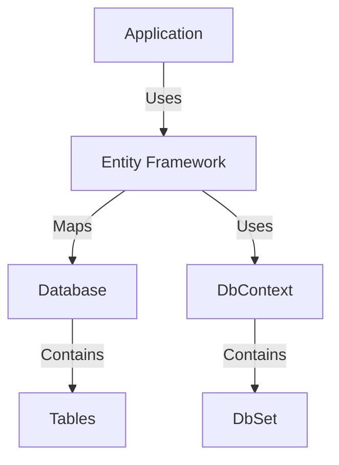
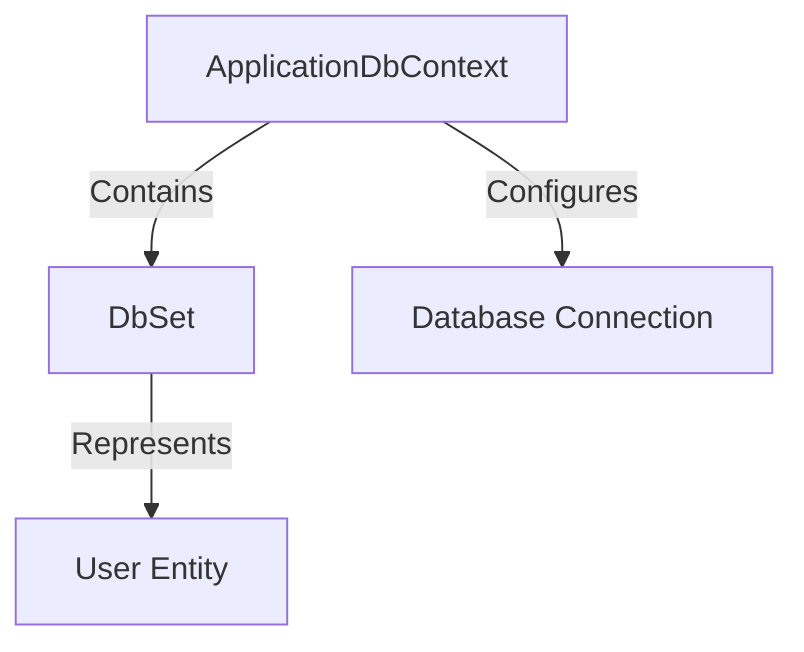
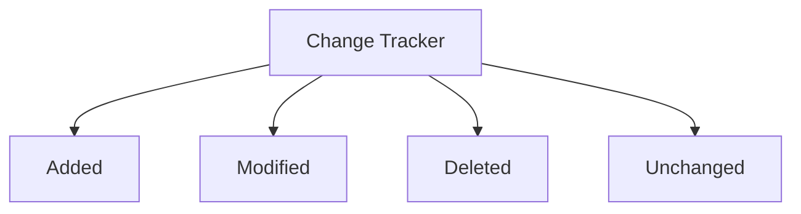
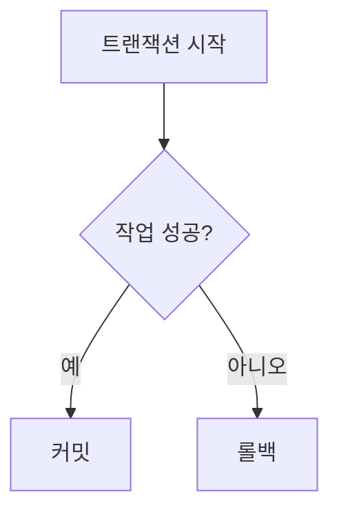
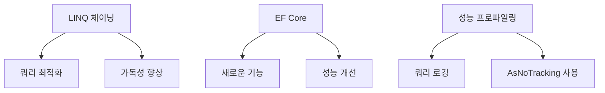
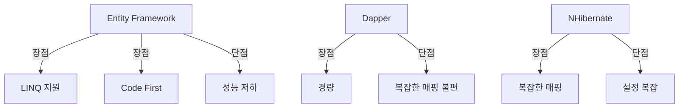
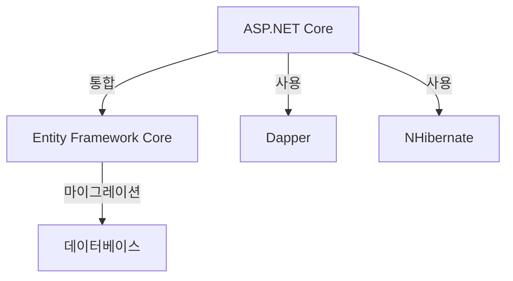
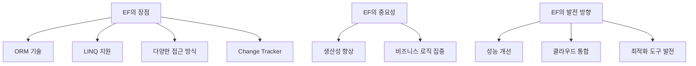
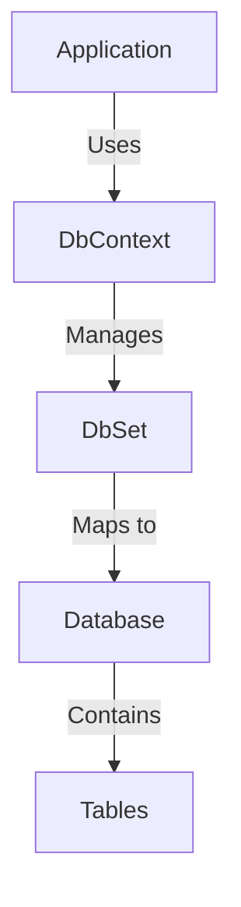

Entity Framework (EF)는 C#과 같은 객체 지향 프로그래밍 언어에서 데이터베이스와의 상호작용을 간소화하는 강력한 ORM(Object-Relational Mapping) 도구이다. EF는 개발자가 데이터베이스 객체를 일반 C# 객체처럼 다룰 수 있게 해주며, 이를 통해 복잡한 SQL 쿼리를 작성하지 않고도 데이터에 접근할 수 있도록 한다. EF의 주요 장점 중 하나는 코드의 가독성을 높이고, 데이터 일관성을 유지하며, 성능을 최적화할 수 있는 다양한 기능을 제공한다는 점이다. 예를 들어, EF는 Change Tracker를 통해 엔티티의 상태를 관리하고, 트랜잭션을 통해 데이터의 일관성을 보장한다. 또한, LINQ를 사용하여 데이터 쿼리를 작성할 수 있어, 개발자는 SQL 문법에 대한 깊은 이해 없이도 데이터베이스와 상호작용할 수 있다. EF는 Code First, Model First, Database First와 같은 다양한 접근 방식을 지원하여, 개발자가 자신의 필요에 맞는 방법으로 데이터 모델을 정의하고 관리할 수 있도록 한다. 이러한 기능들은 EF가 단순한 데이터 접근 기술을 넘어, 현대 소프트웨어 개발에서 필수적인 도구로 자리 잡게 만든다. EF의 다양한 기능을 활용하면 복잡한 비즈니스 로직을 간소화하고, 데이터베이스와의 상호작용을 더욱 효율적으로 수행할 수 있다. 따라서 EF는 개발자에게 더 나은 생산성과 코드 품질을 제공하는 스마트한 선택이 될 수 있다.


||
|:---:|
||


<!--
##### Outline #####
-->

<!--
# 목차

## 개요
   - Entity Framework (EF) 소개
   - EF의 중요성과 필요성
   - 이 글의 목적 및 구성

## Entity Framework의 기본 개념
   - ORM (Object-Relational Mapping) 설명
   - EF의 아키텍처 및 구성 요소
   - EF의 버전 역사 및 발전

## EF 사용을 위한 준비
   - EF 설치 및 설정
   - DbContext 및 DbSet의 이해
   - 데이터베이스 연결 설정

## EF의 주요 기능
   - Code First, Database First, Model First 접근 방식
   - LINQ를 통한 데이터 쿼리
   - 데이터 저장 및 업데이트 방법
   - Change Tracker의 역할

## 코드 최적화 및 개선 방법
   - DbSet 없이 DbContext 사용하기
   - 자식 엔티티의 업데이트 최적화
   - Find()와 First()의 차이점
   - 트랜잭션을 통한 데이터 일관성 유지

## 고급 기능 및 팁
   - LINQ 체이닝을 통한 쿼리 최적화
   - EF Core의 새로운 기능
   - 성능 프로파일링 및 최적화 방법

## 예제
   - 간단한 사용자 관리 애플리케이션 구현
   - CRUD(Create, Read, Update, Delete) 예제
   - 복잡한 쿼리 작성 예제

## FAQ
   - EF에서 발생할 수 있는 일반적인 문제와 해결 방법
   - EF와 다른 ORM 도구 비교
   - EF의 성능 문제 해결 방법

## 관련 기술
   - ASP.NET Core와 EF의 통합
   - Dapper, NHibernate 등 다른 ORM 도구
   - 데이터베이스 마이그레이션 및 관리 도구

## 결론
   - EF의 장점 요약
   - 개발자에게 EF의 중요성 강조
   - 향후 EF의 발전 방향 및 기대

## 참고 자료
   - 공식 문서 및 튜토리얼 링크
   - 추천 도서 및 온라인 강의
   - 커뮤니티 및 포럼 정보

이 목차는 Entity Framework에 대한 포괄적인 이해를 돕고, 개발자들이 EF를 효과적으로 활용할 수 있도록 다양한 정보를 제공합니다.
-->

<!--
## 개요
   - Entity Framework (EF) 소개
   - EF의 중요성과 필요성
   - 이 글의 목적 및 구성
-->

## 개요

**Entity Framework (EF) 소개**  

Entity Framework (EF)는 .NET 플랫폼에서 데이터베이스와 상호작용하기 위한 ORM(Object-Relational Mapping) 프레임워크이다. EF는 개발자가 데이터베이스와의 상호작용을 객체 지향적으로 처리할 수 있도록 도와주며, SQL 쿼리를 직접 작성하지 않고도 데이터베이스 작업을 수행할 수 있게 해준다. EF는 데이터 모델을 클래스 형태로 정의하고, 이를 통해 데이터베이스의 테이블과 매핑하여 CRUD(Create, Read, Update, Delete) 작업을 간편하게 수행할 수 있도록 설계되었다.

**EF의 중요성과 필요성**

EF는 데이터베이스와의 상호작용을 단순화하고, 개발자의 생산성을 높이는 데 기여한다. 전통적인 ADO.NET을 사용하여 SQL 쿼리를 작성하는 것보다, EF를 사용하면 코드의 가독성이 높아지고 유지보수가 용이해진다. 또한, EF는 데이터베이스의 변경 사항을 코드에 반영할 수 있는 마이그레이션 기능을 제공하여, 데이터베이스 스키마의 변경을 쉽게 관리할 수 있도록 돕는다. 이러한 이유로 EF는 많은 .NET 개발자들 사이에서 널리 사용되고 있다.

**이 글의 목적 및 구성**  

이 글의 목적은 Entity Framework에 대한 포괄적인 이해를 제공하고, 개발자들이 EF를 효과적으로 활용할 수 있도록 다양한 정보를 전달하는 것이다. 글은 다음과 같은 구성으로 진행된다. 

1. **Entity Framework의 기본 개념**: EF의 아키텍처와 ORM의 개념을 설명한다.
2. **EF 사용을 위한 준비**: EF 설치 및 설정 방법을 안내한다.
3. **EF의 주요 기능**: EF의 다양한 기능과 사용법을 소개한다.
4. **코드 최적화 및 개선 방법**: 성능을 향상시키기 위한 팁을 제공한다.
5. **고급 기능 및 팁**: EF Core의 새로운 기능과 쿼리 최적화 방법을 다룬다.
6. **예제**: 실제 애플리케이션 구현을 통해 EF의 사용법을 보여준다.
7. **FAQ**: 일반적인 문제와 해결 방법을 정리한다.
8. **관련 기술**: EF와 관련된 다른 기술들을 소개한다.
9. **결론**: EF의 장점과 향후 발전 방향을 정리한다.

다음은 EF의 기본 아키텍처를 나타내는 다이어그램이다.



이 다이어그램은 EF가 애플리케이션과 데이터베이스 간의 중재 역할을 수행하는 구조를 보여준다. EF는 DbContext를 통해 데이터베이스와 상호작용하며, DbSet을 통해 특정 엔티티에 대한 작업을 수행한다.

<!--
## Entity Framework의 기본 개념
   - ORM (Object-Relational Mapping) 설명
   - EF의 아키텍처 및 구성 요소
   - EF의 버전 역사 및 발전
-->

## Entity Framework의 기본 개념

**ORM (Object-Relational Mapping) 설명** 

ORM은 객체 지향 프로그래밍 언어와 관계형 데이터베이스 간의 데이터를 변환하는 기술이다. ORM을 사용하면 데이터베이스의 테이블과 프로그래밍 언어의 객체 간의 매핑을 자동으로 처리할 수 있어, 개발자는 SQL 쿼리를 직접 작성하지 않고도 데이터베이스와 상호작용할 수 있다. Entity Framework는 이러한 ORM 기술을 활용하여 .NET 개발자들이 데이터베이스 작업을 보다 쉽게 수행할 수 있도록 돕는다.

다음은 ORM의 기본 개념을 설명하는 다이어그램이다.


**EF의 아키텍처 및 구성 요소** 

Entity Framework는 여러 구성 요소로 이루어져 있으며, 이들은 함께 작동하여 데이터베이스와의 상호작용을 관리한다. 주요 구성 요소는 다음과 같다.

1. **DbContext**: 데이터베이스와의 연결을 관리하고, 데이터베이스 작업을 수행하는 핵심 클래스이다.
2. **DbSet**: 특정 엔티티 타입에 대한 쿼리 및 CRUD 작업을 수행하는 컬렉션이다.
3. **Entity**: 데이터베이스의 테이블에 매핑되는 클래스이다.
4. **Migration**: 데이터베이스 스키마의 변경을 관리하는 기능으로, 코드 변경에 따라 데이터베이스를 자동으로 업데이트할 수 있다.

이러한 구성 요소들은 EF의 아키텍처를 형성하며, 개발자가 데이터베이스와 상호작용할 때 필요한 모든 기능을 제공한다.

**EF의 버전 역사 및 발전**

Entity Framework는 처음 2008년에 출시되었으며, 이후 여러 버전이 출시되면서 많은 기능이 추가되고 개선되었다. 주요 버전의 발전 과정은 다음과 같다.

- **EF 1.0**: 기본적인 ORM 기능 제공
- **EF 4.0**: Code First 접근 방식 도입, Lazy Loading 지원
- **EF 6.0**: 성능 개선 및 비동기 쿼리 지원
- **EF Core**: 경량화된 아키텍처로 크로스 플랫폼 지원, 새로운 기능 추가

이러한 발전을 통해 Entity Framework는 더욱 강력하고 유연한 ORM 도구로 자리 잡았다. 개발자들은 EF를 통해 데이터베이스 작업을 보다 효율적으로 수행할 수 있게 되었다.

<!--
## EF 사용을 위한 준비
   - EF 설치 및 설정
   - DbContext 및 DbSet의 이해
   - 데이터베이스 연결 설정
-->

## EF 사용을 위한 준비

Entity Framework (EF)를 효과적으로 사용하기 위해서는 몇 가지 준비 작업이 필요하다. 이 과정에서는 EF의 설치 및 설정, DbContext와 DbSet의 이해, 그리고 데이터베이스 연결 설정에 대해 다룰 것이다.

** EF 설치 및 설정 **

Entity Framework는 NuGet 패키지를 통해 설치할 수 있다. Visual Studio를 사용하고 있다면, NuGet 패키지 관리자를 통해 간편하게 설치할 수 있다. 다음은 EF Core를 설치하는 방법이다.

1. Visual Studio에서 프로젝트를 열고, **Tools** 메뉴에서 **NuGet Package Manager**를 선택한 후 **Manage NuGet Packages for Solution**을 클릭한다.
2. **Browse** 탭에서 "Microsoft.EntityFrameworkCore"를 검색하고, 원하는 프로젝트에 설치한다.
3. 필요에 따라 데이터베이스 제공자 패키지(예: Microsoft.EntityFrameworkCore.SqlServer)를 추가로 설치한다.

설치가 완료되면, EF를 사용할 준비가 완료된다.

**DbContext 및 DbSet의 이해**

DbContext는 EF의 핵심 클래스 중 하나로, 데이터베이스와의 상호작용을 관리한다. DbContext는 데이터베이스 연결, 쿼리 실행, 데이터 변경 추적 등을 담당한다. DbSet은 특정 엔티티 타입에 대한 쿼리 및 CRUD 작업을 수행할 수 있는 컬렉션을 나타낸다.

다음은 DbContext와 DbSet을 사용하는 간단한 예제 코드이다.

```csharp
public class ApplicationDbContext : DbContext
{
    public DbSet<User> Users { get; set; }
    
    protected override void OnConfiguring(DbContextOptionsBuilder optionsBuilder)
    {
        optionsBuilder.UseSqlServer("YourConnectionStringHere");
    }
}

public class User
{
    public int Id { get; set; }
    public string Name { get; set; }
}
```

위 코드에서 `ApplicationDbContext`는 `DbContext`를 상속받아 데이터베이스와의 연결을 설정하고, `Users`라는 DbSet을 정의하고 있다. 이 DbSet은 `User` 엔티티에 대한 CRUD 작업을 수행할 수 있게 해준다.

** 데이터베이스 연결 설정 **

데이터베이스 연결 설정은 DbContext의 `OnConfiguring` 메서드에서 수행할 수 있다. 이 메서드에서 데이터베이스 제공자와 연결 문자열을 설정하여 EF가 데이터베이스와 통신할 수 있도록 한다. 

다음은 데이터베이스 연결 설정을 위한 예제 코드이다.

```csharp
protected override void OnConfiguring(DbContextOptionsBuilder optionsBuilder)
{
    optionsBuilder.UseSqlServer("Server=your_server;Database=your_database;User Id=your_user;Password=your_password;");
}
```

위 코드에서 `UseSqlServer` 메서드를 사용하여 SQL Server 데이터베이스에 연결하는 방법을 보여준다. 연결 문자열은 데이터베이스 서버의 주소, 데이터베이스 이름, 사용자 ID 및 비밀번호를 포함해야 한다.

이제 EF를 사용하기 위한 기본적인 준비가 완료되었다. 다음 단계에서는 EF의 주요 기능을 살펴보도록 하겠다. 



위 다이어그램은 `ApplicationDbContext`가 `DbSet<User>`를 포함하고 있으며, 데이터베이스 연결을 설정하는 구조를 나타낸다. 이와 같은 구조를 통해 EF는 데이터베이스와의 상호작용을 효율적으로 관리할 수 있다.

<!--
## EF의 주요 기능
   - Code First, Database First, Model First 접근 방식
   - LINQ를 통한 데이터 쿼리
   - 데이터 저장 및 업데이트 방법
   - Change Tracker의 역할
-->

## EF의 주요 기능

Entity Framework (EF)는 다양한 기능을 제공하여 개발자들이 데이터베이스와의 상호작용을 보다 쉽게 할 수 있도록 돕는다. 이 섹션에서는 EF의 주요 기능에 대해 살펴보겠다.

**Code First, Database First, Model First 접근 방식**

EF는 데이터 모델을 정의하는 세 가지 접근 방식을 지원한다. 

1. **Code First**: 개발자가 코드로 데이터 모델을 정의하고, EF가 이를 기반으로 데이터베이스를 생성하는 방식이다. 이 접근 방식은 개발자가 도메인 모델에 집중할 수 있도록 해준다.
   
   ```csharp
   public class User
   {
       public int Id { get; set; }
       public string Name { get; set; }
       public string Email { get; set; }
   }

   public class AppDbContext : DbContext
   {
       public DbSet<User> Users { get; set; }
   }
   ```

2. **Database First**: 기존의 데이터베이스에서 모델을 생성하는 방식이다. 데이터베이스의 구조를 기반으로 EF가 자동으로 모델 클래스를 생성한다.

3. **Model First**: 개발자가 시각적으로 모델을 디자인한 후, EF가 이를 기반으로 데이터베이스와 모델 클래스를 생성하는 방식이다. 이 접근 방식은 시각적 설계를 선호하는 개발자에게 유용하다.

**LINQ를 통한 데이터 쿼리**

LINQ (Language Integrated Query)는 EF에서 데이터 쿼리를 작성하는 데 사용되는 강력한 도구이다. LINQ를 사용하면 SQL과 유사한 구문으로 데이터베이스에 쿼리를 수행할 수 있다. 예를 들어, 사용자의 목록을 가져오는 쿼리는 다음과 같다.

```csharp
using (var context = new AppDbContext())
{
    var users = context.Users
                       .Where(u => u.Name.StartsWith("A"))
                       .ToList();
}
```

**데이터 저장 및 업데이트 방법**

EF를 사용하여 데이터를 저장하고 업데이트하는 것은 매우 간단하다. `DbContext`의 `Add` 메서드를 사용하여 새 데이터를 추가하고, `SaveChanges` 메서드를 호출하여 변경 사항을 데이터베이스에 반영할 수 있다.

```csharp
using (var context = new AppDbContext())
{
    var newUser = new User { Name = "Alice", Email = "alice@example.com" };
    context.Users.Add(newUser);
    context.SaveChanges();
}
```

업데이트는 다음과 같이 수행할 수 있다.

```csharp
using (var context = new AppDbContext())
{
    var user = context.Users.Find(1);
    if (user != null)
    {
        user.Email = "newemail@example.com";
        context.SaveChanges();
    }
}
```

**Change Tracker의 역할**

Change Tracker는 EF의 중요한 구성 요소로, 엔티티의 상태를 추적하는 역할을 한다. 이를 통해 EF는 어떤 엔티티가 추가, 수정, 삭제되었는지를 인식하고, `SaveChanges` 메서드 호출 시 적절한 SQL 명령을 생성할 수 있다. Change Tracker는 엔티티의 상태를 `Added`, `Modified`, `Deleted`, `Unchanged` 등으로 구분하여 관리한다.



이와 같이 EF의 주요 기능들은 개발자가 데이터베이스와의 상호작용을 보다 효율적으로 수행할 수 있도록 돕는다. 각 기능을 적절히 활용하면 개발 생산성을 높일 수 있다.

<!--
## 코드 최적화 및 개선 방법
   - DbSet 없이 DbContext 사용하기
   - 자식 엔티티의 업데이트 최적화
   - Find()와 First()의 차이점
   - 트랜잭션을 통한 데이터 일관성 유지
-->

## 코드 최적화 및 개선 방법

Entity Framework를 사용할 때 성능을 최적화하고 코드의 효율성을 높이는 것은 매우 중요하다. 이 섹션에서는 DbSet 없이 DbContext를 사용하는 방법, 자식 엔티티의 업데이트 최적화, Find()와 First()의 차이점, 그리고 트랜잭션을 통한 데이터 일관성 유지에 대해 다룬다.

**DbSet 없이 DbContext 사용하기**

DbSet은 Entity Framework에서 데이터베이스의 테이블을 나타내는 클래스이다. 그러나 DbSet을 사용하지 않고 DbContext를 직접 활용하여 성능을 개선할 수 있는 경우가 있다. DbContext는 데이터베이스와의 연결을 관리하며, 직접 SQL 쿼리를 실행할 수 있는 기능을 제공한다. 이를 통해 불필요한 DbSet의 오버헤드를 줄일 수 있다.

예를 들어, 다음과 같이 DbContext를 사용하여 직접 쿼리를 실행할 수 있다.

```csharp
using (var context = new MyDbContext())
{
    var users = context.Database.SqlQuery<User>("SELECT * FROM Users").ToList();
}
```

**자식 엔티티의 업데이트 최적화**

자식 엔티티를 업데이트할 때, 부모 엔티티를 로드하고 자식 엔티티를 수정하는 방식은 성능에 영향을 미칠 수 있다. 이 경우, 자식 엔티티를 직접 수정하는 것이 더 효율적이다. 예를 들어, 다음과 같이 자식 엔티티를 직접 수정할 수 있다.

```csharp
using (var context = new MyDbContext())
{
    var childEntity = new ChildEntity { Id = 1, Name = "Updated Name" };
    context.Entry(childEntity).State = EntityState.Modified;
    context.SaveChanges();
}
```

**Find()와 First()의 차이점**

Find()와 First()는 모두 데이터를 검색하는 메서드이지만, 그 동작 방식에는 차이가 있다. Find()는 기본 키를 사용하여 엔티티를 검색하며, 이미 로드된 엔티티가 있을 경우 캐시에서 반환한다. 반면, First()는 LINQ 쿼리를 사용하여 조건에 맞는 첫 번째 엔티티를 반환한다. 이로 인해 Find()는 성능이 더 우수할 수 있다.

```csharp
// Find() 사용 예
var user = context.Users.Find(1);

// First() 사용 예
var user = context.Users.First(u => u.Id == 1);
```

**트랜잭션을 통한 데이터 일관성 유지**

트랜잭션은 데이터베이스의 일관성을 유지하는 데 중요한 역할을 한다. Entity Framework에서는 DbContext의 SaveChanges() 메서드를 호출할 때 자동으로 트랜잭션을 생성한다. 그러나 여러 작업을 수행할 때는 명시적으로 트랜잭션을 관리하는 것이 좋다. 다음은 트랜잭션을 사용하는 예시이다.

```csharp
using (var context = new MyDbContext())
{
    using (var transaction = context.Database.BeginTransaction())
    {
        try
        {
            // 여러 데이터 수정 작업
            context.Users.Add(new User { Name = "New User" });
            context.SaveChanges();

            // 트랜잭션 커밋
            transaction.Commit();
        }
        catch (Exception)
        {
            // 트랜잭션 롤백
            transaction.Rollback();
        }
    }
}
```



위의 다이어그램은 트랜잭션의 흐름을 나타낸다. 트랜잭션이 시작되면 여러 작업을 수행하고, 성공 여부에 따라 커밋 또는 롤백을 결정한다. 이러한 방식으로 데이터의 일관성을 유지할 수 있다.

이와 같은 최적화 방법을 통해 Entity Framework의 성능을 개선하고, 더 나은 사용자 경험을 제공할 수 있다.

<!--
## 고급 기능 및 팁
   - LINQ 체이닝을 통한 쿼리 최적화
   - EF Core의 새로운 기능
   - 성능 프로파일링 및 최적화 방법
-->

## 고급 기능 및 팁

**LINQ 체이닝을 통한 쿼리 최적화**  

LINQ (Language Integrated Query)는 C#에서 데이터 쿼리를 작성하는 데 사용되는 강력한 도구이다. LINQ 체이닝을 활용하면 여러 쿼리 연산을 연결하여 보다 효율적으로 데이터를 필터링하고 변환할 수 있다. 체이닝을 통해 쿼리의 가독성을 높이고, 불필요한 데이터 로드를 줄일 수 있다.

예를 들어, 다음과 같은 LINQ 체이닝을 사용하여 특정 조건을 만족하는 사용자 목록을 가져올 수 있다.

```csharp
using (var context = new MyDbContext())
{
    var users = context.Users
        .Where(u => u.IsActive)
        .OrderBy(u => u.LastName)
        .Select(u => new { u.FirstName, u.LastName })
        .ToList();
}
```

위의 코드에서는 `Where`, `OrderBy`, `Select` 메서드를 체이닝하여 활성 사용자 목록을 정렬된 형태로 가져온다. 이러한 방식은 쿼리의 성능을 최적화하는 데 도움을 준다.

**EF Core의 새로운 기능**  

Entity Framework Core는 EF의 경량화된 버전으로, 다양한 새로운 기능을 제공한다. EF Core는 성능 개선, 플랫폼 독립성, 비동기 쿼리 지원 등 여러 가지 장점을 가지고 있다. 특히, EF Core 5.0부터는 `Global Query Filters`, `Table Splitting`, `Many-to-Many Relationships`와 같은 기능이 추가되어 더욱 유연한 데이터 모델링이 가능해졌다.

예를 들어, Global Query Filters를 사용하면 특정 조건을 모든 쿼리에 자동으로 적용할 수 있다. 다음은 Global Query Filter를 설정하는 방법이다.

```csharp
protected override void OnModelCreating(ModelBuilder modelBuilder)
{
    modelBuilder.Entity<User>()
        .HasQueryFilter(u => u.IsActive);
}
```

이렇게 설정하면 `User` 엔티티에 대한 모든 쿼리는 자동으로 `IsActive`가 true인 사용자만 반환하게 된다.

**성능 프로파일링 및 최적화 방법**  
EF를 사용할 때 성능 문제를 해결하기 위해서는 성능 프로파일링이 필수적이다. EF Core는 `Logging` 기능을 제공하여 쿼리 실행 시간을 모니터링할 수 있다. 이를 통해 느린 쿼리를 식별하고 최적화할 수 있다.

다음은 EF Core에서 SQL 쿼리를 로깅하는 방법이다.

```csharp
protected override void OnConfiguring(DbContextOptionsBuilder optionsBuilder)
{
    optionsBuilder
        .UseSqlServer("YourConnectionString")
        .LogTo(Console.WriteLine, LogLevel.Information);
}
```

이렇게 설정하면 실행되는 SQL 쿼리가 콘솔에 출력되어 성능 분석에 도움을 준다. 또한, 쿼리 최적화를 위해 `AsNoTracking()` 메서드를 사용하여 읽기 전용 쿼리를 수행할 수 있다. 이는 성능을 개선하고 메모리 사용량을 줄이는 데 유리하다.

```csharp
var users = context.Users
    .AsNoTracking()
    .Where(u => u.IsActive)
    .ToList();
```

이와 같은 방법들을 통해 EF의 성능을 최적화하고, 보다 효율적인 데이터 처리를 할 수 있다. 



이러한 고급 기능과 팁을 활용하면 Entity Framework를 더욱 효과적으로 사용할 수 있으며, 성능을 극대화할 수 있다.

<!--
## 예제
   - 간단한 사용자 관리 애플리케이션 구현
   - CRUD(Create, Read, Update, Delete) 예제
   - 복잡한 쿼리 작성 예제
-->

## 예제

**간단한 사용자 관리 애플리케이션 구현**  

이번 섹션에서는 Entity Framework를 활용하여 간단한 사용자 관리 애플리케이션을 구현하는 방법을 살펴보겠다. 이 애플리케이션은 사용자 정보를 저장하고 관리하는 기능을 제공한다. 

먼저, 사용자(User) 엔티티를 정의하겠다. 아래는 User 클래스의 예시 코드이다.

```csharp
public class User
{
    public int Id { get; set; }
    public string Name { get; set; }
    public string Email { get; set; }
}
```

이제 DbContext를 정의하여 데이터베이스와의 연결을 설정하겠다.

```csharp
public class AppDbContext : DbContext
{
    public DbSet<User> Users { get; set; }

    protected override void OnConfiguring(DbContextOptionsBuilder optionsBuilder)
    {
        optionsBuilder.UseSqlServer("YourConnectionStringHere");
    }
}
```

이제 사용자를 추가하고 조회하는 간단한 메서드를 작성하겠다.

```csharp
public void AddUser(User user)
{
    using (var context = new AppDbContext())
    {
        context.Users.Add(user);
        context.SaveChanges();
    }
}

public List<User> GetAllUsers()
{
    using (var context = new AppDbContext())
    {
        return context.Users.ToList();
    }
}
```

**CRUD(Create, Read, Update, Delete) 예제**  

CRUD 작업은 데이터베이스에서 데이터를 생성(Create), 읽기(Read), 수정(Update), 삭제(Delete)하는 기본적인 작업이다. 아래는 Entity Framework를 사용하여 CRUD 작업을 수행하는 방법을 설명하겠다.

1. **Create**: 사용자를 추가하는 메서드
   ```csharp
   public void CreateUser(string name, string email)
   {
       var user = new User { Name = name, Email = email };
       AddUser(user);
   }
   ```

2. **Read**: 모든 사용자를 조회하는 메서드
   ```csharp
   public List<User> ReadUsers()
   {
       return GetAllUsers();
   }
   ```

3. **Update**: 사용자의 정보를 수정하는 메서드
   ```csharp
   public void UpdateUser(int id, string name, string email)
   {
       using (var context = new AppDbContext())
       {
           var user = context.Users.Find(id);
           if (user != null)
           {
               user.Name = name;
               user.Email = email;
               context.SaveChanges();
           }
       }
   }
   ```

4. **Delete**: 사용자를 삭제하는 메서드
   ```csharp
   public void DeleteUser(int id)
   {
       using (var context = new AppDbContext())
       {
           var user = context.Users.Find(id);
           if (user != null)
           {
               context.Users.Remove(user);
               context.SaveChanges();
           }
       }
   }
   ```

**복잡한 쿼리 작성 예제**  

Entity Framework에서는 LINQ를 사용하여 복잡한 쿼리를 작성할 수 있다. 예를 들어, 특정 이메일 도메인을 가진 사용자 목록을 조회하는 쿼리를 작성해보겠다.

```csharp
public List<User> GetUsersByEmailDomain(string domain)
{
    using (var context = new AppDbContext())
    {
        return context.Users
                      .Where(u => u.Email.EndsWith($"@{domain}"))
                      .ToList();
    }
}
```

위의 예제에서는 `Where` 메서드를 사용하여 조건에 맞는 사용자만 필터링하고, `ToList` 메서드를 통해 결과를 리스트로 반환한다.

이와 같이 Entity Framework를 활용하여 간단한 사용자 관리 애플리케이션을 구현하고, CRUD 작업 및 복잡한 쿼리를 작성하는 방법을 살펴보았다. 이러한 예제들은 개발자가 EF를 효과적으로 활용하는 데 큰 도움이 될 것이다.

<!--
## FAQ
   - EF에서 발생할 수 있는 일반적인 문제와 해결 방법
   - EF와 다른 ORM 도구 비교
   - EF의 성능 문제 해결 방법
-->

## FAQ

**EF에서 발생할 수 있는 일반적인 문제와 해결 방법**  

Entity Framework를 사용할 때 발생할 수 있는 일반적인 문제는 여러 가지가 있다. 예를 들어, 데이터베이스 연결 오류, Lazy Loading 관련 문제, 또는 Entity Tracking 문제 등이 있다. 이러한 문제를 해결하기 위해서는 다음과 같은 방법을 고려할 수 있다.

1. **데이터베이스 연결 오류**: 데이터베이스 연결 문자열이 올바른지 확인하고, 데이터베이스 서버가 실행 중인지 점검해야 한다.
2. **Lazy Loading 문제**: Lazy Loading이 활성화되어 있지 않거나, 관련된 엔티티가 로드되지 않는 경우가 있다. 이럴 때는 Eager Loading을 사용하여 필요한 데이터를 미리 로드하는 것이 좋다.
3. **Entity Tracking 문제**: Entity가 변경되었음에도 불구하고 변경 사항이 데이터베이스에 반영되지 않는 경우, SaveChanges() 메서드를 호출하는 것을 잊지 말아야 한다.

```csharp
using (var context = new MyDbContext())
{
    var user = context.Users.Find(1);
    user.Name = "Updated Name";
    context.SaveChanges(); // 변경 사항을 데이터베이스에 반영
}
```

**EF와 다른 ORM 도구 비교**  

Entity Framework는 다양한 ORM 도구 중 하나로, Dapper, NHibernate 등과 비교할 때 몇 가지 장단점이 있다. 

- **Entity Framework**: 강력한 LINQ 지원과 Code First 접근 방식을 제공하며, 데이터베이스 스키마를 코드로 정의할 수 있다. 그러나 성능이 다른 ORM 도구에 비해 떨어질 수 있다.
- **Dapper**: 경량 ORM으로, 성능이 뛰어나고 SQL 쿼리를 직접 작성할 수 있어 유연성이 높다. 그러나 복잡한 관계형 데이터 모델을 다루기에는 불편할 수 있다.
- **NHibernate**: 복잡한 매핑과 캐싱 기능을 제공하지만, 설정이 복잡하고 학습 곡선이 가파를 수 있다.



**EF의 성능 문제 해결 방법**  

Entity Framework의 성능 문제를 해결하기 위해서는 몇 가지 최적화 기법을 사용할 수 있다.

1. **쿼리 최적화**: 불필요한 데이터를 로드하지 않도록 Select 문을 사용하여 필요한 필드만 가져오는 것이 좋다.
2. **Batching**: 여러 개의 Insert 또는 Update 작업을 한 번의 트랜잭션으로 묶어 처리하여 성능을 향상시킬 수 있다.
3. **AsNoTracking() 사용**: 읽기 전용 쿼리에서는 AsNoTracking() 메서드를 사용하여 Entity Tracking을 비활성화하면 성능이 개선된다.

```csharp
var users = context.Users.AsNoTracking().ToList(); // Entity Tracking 비활성화
```

이와 같은 방법들을 통해 Entity Framework의 성능을 개선하고, 발생할 수 있는 문제를 사전에 예방할 수 있다.

<!--
## 관련 기술
   - ASP.NET Core와 EF의 통합
   - Dapper, NHibernate 등 다른 ORM 도구
   - 데이터베이스 마이그레이션 및 관리 도구
-->

## 관련 기술

**ASP.NET Core와 EF의 통합**  

ASP.NET Core는 현대적인 웹 애플리케이션을 개발하기 위한 프레임워크로, Entity Framework (EF)와의 통합이 매우 원활하다. ASP.NET Core에서는 EF Core를 사용하여 데이터베이스와의 상호작용을 쉽게 처리할 수 있다. EF Core는 ASP.NET Core의 의존성 주입(Dependency Injection) 기능을 활용하여 DbContext를 관리할 수 있으며, 이를 통해 애플리케이션의 구조를 더욱 깔끔하게 유지할 수 있다.

다음은 ASP.NET Core에서 EF Core를 설정하는 간단한 예제 코드이다.

```csharp
public class Startup
{
    public void ConfigureServices(IServiceCollection services)
    {
        services.AddDbContext<MyDbContext>(options =>
            options.UseSqlServer(Configuration.GetConnectionString("DefaultConnection")));
        
        services.AddControllersWithViews();
    }
}
```

위의 코드에서 `MyDbContext`는 EF Core의 DbContext 클래스이며, SQL Server 데이터베이스에 연결하기 위해 `UseSqlServer` 메서드를 사용하고 있다. 이와 같은 설정을 통해 ASP.NET Core 애플리케이션에서 EF Core를 쉽게 사용할 수 있다.

**Dapper, NHibernate 등 다른 ORM 도구**  

Entity Framework 외에도 다양한 ORM(Object-Relational Mapping) 도구가 존재한다. Dapper는 경량 ORM으로, 성능이 뛰어나고 간단한 쿼리 작성이 가능하다. NHibernate는 Java의 Hibernate에서 영감을 받아 만들어진 ORM으로, 복잡한 데이터 모델을 지원하며 유연한 매핑 기능을 제공한다.

각 ORM 도구는 특정한 장점과 단점을 가지고 있으며, 개발자는 프로젝트의 요구사항에 따라 적절한 도구를 선택해야 한다. 예를 들어, Dapper는 성능이 중요한 경우에 적합하고, NHibernate는 복잡한 비즈니스 로직을 처리할 때 유리하다.

**데이터베이스 마이그레이션 및 관리 도구**  

EF Core는 데이터베이스 마이그레이션을 지원하여 데이터베이스 스키마의 변경을 쉽게 관리할 수 있다. 마이그레이션을 통해 개발자는 코드 변경 사항을 데이터베이스에 반영할 수 있으며, 이를 통해 데이터베이스와 애플리케이션 간의 일관성을 유지할 수 있다.

다음은 EF Core에서 마이그레이션을 생성하고 적용하는 방법의 예시이다.

```bash
# 마이그레이션 생성
dotnet ef migrations add InitialCreate

# 데이터베이스 업데이트
dotnet ef database update
```

위의 명령어를 사용하여 새로운 마이그레이션을 생성하고, 이를 데이터베이스에 적용할 수 있다. 이러한 마이그레이션 기능은 데이터베이스 관리 도구와 함께 사용하여 데이터베이스의 버전을 관리하는 데 유용하다.



위의 다이어그램은 ASP.NET Core와 다양한 ORM 도구 간의 관계를 나타낸 것이다. 이러한 통합을 통해 개발자는 데이터베이스와의 상호작용을 효율적으로 관리할 수 있다.

<!--
## 결론
   - EF의 장점 요약
   - 개발자에게 EF의 중요성 강조
   - 향후 EF의 발전 방향 및 기대
-->

## 결론

**EF의 장점 요약** 

Entity Framework (EF)는 개발자에게 여러 가지 장점을 제공한다. 첫째, EF는 ORM (Object-Relational Mapping) 기술을 통해 데이터베이스와 객체 간의 매핑을 자동으로 처리하여 개발자의 생산성을 높인다. 둘째, LINQ (Language Integrated Query)를 사용하여 데이터 쿼리를 작성할 수 있어, SQL 문법에 대한 깊은 이해 없이도 복잡한 쿼리를 쉽게 작성할 수 있다. 셋째, EF는 Code First, Database First, Model First와 같은 다양한 접근 방식을 지원하여 개발자의 요구에 맞는 유연한 개발 환경을 제공한다. 마지막으로, EF는 Change Tracker를 통해 데이터 변경 사항을 추적하고, 이를 통해 데이터 일관성을 유지할 수 있도록 돕는다.

**개발자에게 EF의 중요성 강조**  

현대의 소프트웨어 개발 환경에서 데이터베이스와의 상호작용은 필수적이다. EF는 이러한 상호작용을 간소화하고, 개발자가 비즈니스 로직에 집중할 수 있도록 해준다. 특히, ASP.NET Core와의 통합을 통해 웹 애플리케이션 개발 시 더욱 강력한 도구로 자리 잡고 있다. EF를 활용하면 데이터베이스 작업을 보다 효율적으로 수행할 수 있으며, 이는 개발자의 생산성을 크게 향상시킨다.

**향후 EF의 발전 방향 및 기대**  

EF는 지속적으로 발전하고 있으며, 특히 EF Core는 성능 개선과 새로운 기능 추가에 중점을 두고 있다. 향후 EF는 더 많은 플랫폼과의 호환성을 제공하고, 클라우드 기반 데이터베이스와의 통합을 강화할 것으로 기대된다. 또한, 성능 프로파일링 및 최적화 도구의 발전으로 개발자들이 더욱 효율적으로 EF를 활용할 수 있는 환경이 조성될 것이다.



이와 같이 EF는 개발자에게 많은 이점을 제공하며, 앞으로도 지속적인 발전이 기대되는 기술이다. EF를 통해 데이터베이스와의 상호작용을 보다 효율적으로 관리할 수 있으며, 이는 소프트웨어 개발의 품질과 생산성을 높이는 데 기여할 것이다.

<!--
## 참고 자료
   - 공식 문서 및 튜토리얼 링크
   - 추천 도서 및 온라인 강의
   - 커뮤니티 및 포럼 정보
-->

## 참고 자료

**공식 문서 및 튜토리얼 링크**  
Entity Framework에 대한 가장 신뢰할 수 있는 정보는 공식 문서에서 찾을 수 있다. Microsoft의 공식 웹사이트에서는 EF의 설치, 설정, 사용법에 대한 자세한 가이드를 제공하고 있다. 다음은 유용한 링크이다:

- [Entity Framework Core Documentation](https://docs.microsoft.com/en-us/ef/core/)
- [Entity Framework 6 Documentation](https://docs.microsoft.com/en-us/ef/ef6/)

이 외에도 다양한 튜토리얼 사이트에서 EF에 대한 실습 예제와 설명을 제공하고 있으니 참고하면 좋다.

**추천 도서 및 온라인 강의**  

Entity Framework에 대한 깊이 있는 이해를 원한다면 다음과 같은 도서와 온라인 강의를 추천한다:

- **도서**:
  - "Programming Entity Framework" by Julia Lerman
  - "Entity Framework Core in Action" by Jon P Smith

- **온라인 강의**:
  - [Pluralsight: Entity Framework Core](https://www.pluralsight.com/courses/entity-framework-core)
  - [Udemy: Entity Framework Core - The Complete Guide](https://www.udemy.com/course/entity-framework-core-the-complete-guide/)

이러한 자료들은 EF의 다양한 기능과 사용법을 체계적으로 배울 수 있는 좋은 기회를 제공한다.

**커뮤니티 및 포럼 정보** 

Entity Framework에 대한 질문이나 문제 해결을 위해 커뮤니티와 포럼을 활용하는 것도 좋은 방법이다. 다음은 유용한 커뮤니티와 포럼 링크이다:

- [Stack Overflow - Entity Framework](https://stackoverflow.com/questions/tagged/entity-framework)
- [Microsoft Q&A - Entity Framework](https://learn.microsoft.com/en-us/answers/topics/entity-framework.html)

이러한 플랫폼에서는 다른 개발자들과의 소통을 통해 문제를 해결하고, 새로운 정보를 얻을 수 있다.

**샘플 코드**  
아래는 Entity Framework를 사용하여 간단한 데이터베이스 연결을 설정하는 샘플 코드이다.

```csharp
using Microsoft.EntityFrameworkCore;

public class MyDbContext : DbContext
{
    public DbSet<User> Users { get; set; }

    protected override void OnConfiguring(DbContextOptionsBuilder optionsBuilder)
    {
        optionsBuilder.UseSqlServer("YourConnectionStringHere");
    }
}

public class User
{
    public int Id { get; set; }
    public string Name { get; set; }
}
```

**다이어그램**  

아래는 Entity Framework의 기본 아키텍처를 나타내는 다이어그램이다.



이 자료들은 Entity Framework를 배우고 활용하는 데 큰 도움이 될 것이다.

<!--
##### Reference #####
-->

## Reference


* [https://medium.com/@iamprovidence/ef-is-smarter-than-you-think-10df76679c0c](https://medium.com/@iamprovidence/ef-is-smarter-than-you-think-10df76679c0c)
* [http://www.csharpstudy.com/web/article/8-Entity-Framework](http://www.csharpstudy.com/web/article/8-Entity-Framework)
* [https://learn.microsoft.com/ko-kr/ef/core/](https://learn.microsoft.com/ko-kr/ef/core/)
* [https://medium.com/@lucas.and227/step-by-step-guide-to-entity-framework-in-net-c629faf9f322](https://medium.com/@lucas.and227/step-by-step-guide-to-entity-framework-in-net-c629faf9f322)
* [https://en.wikipedia.org/wiki/Entity_Framework](https://en.wikipedia.org/wiki/Entity_Framework)

