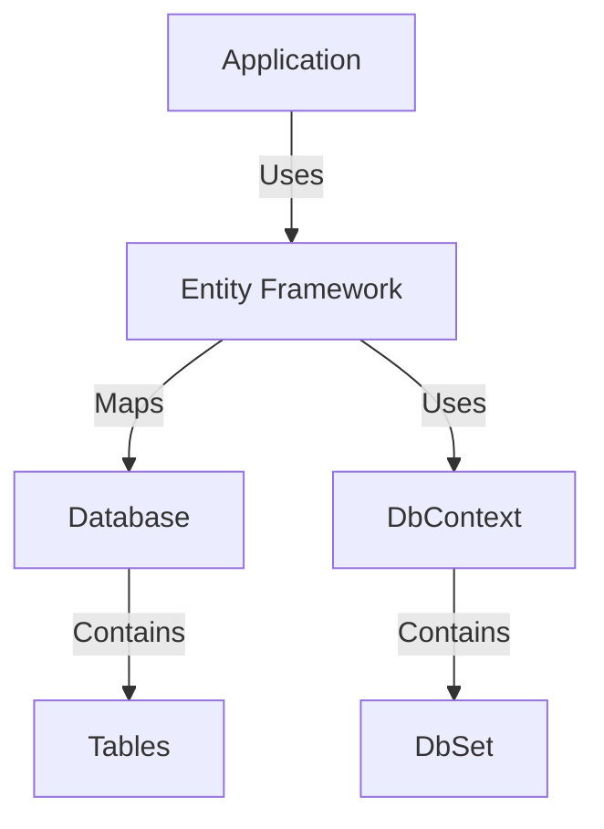
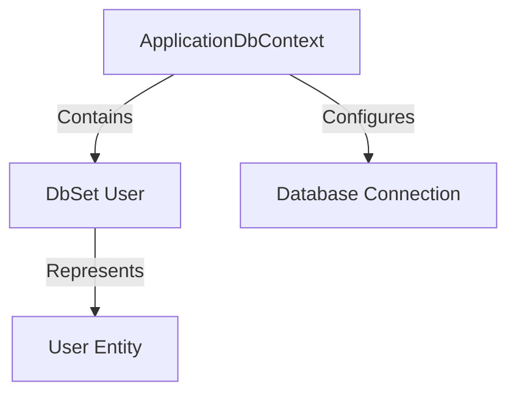
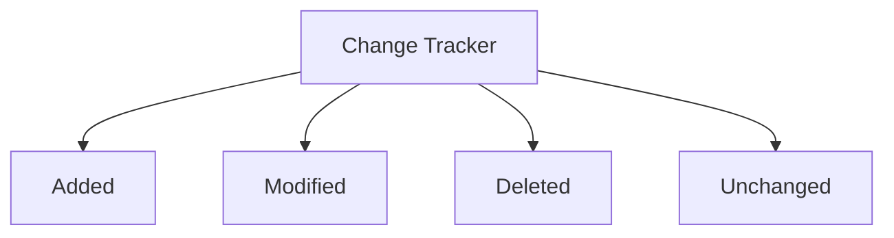
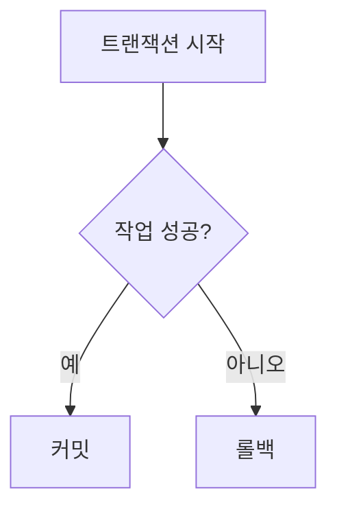
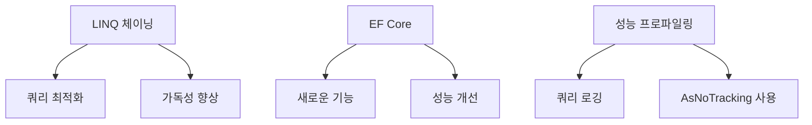
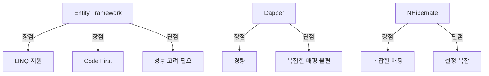
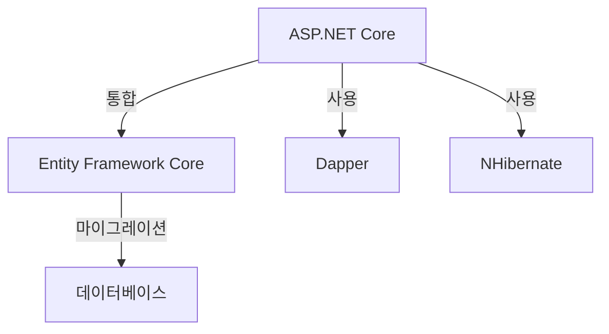
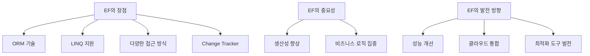

Entity Framework(EF)는 .NET에서 데이터베이스와 상호작용을 단순화하는 ORM(Object-Relational Mapping) 프레임워크다. 개발자는 SQL을 직접 쓰지 않고 C# 객체로 CRUD를 수행할 수 있으며, Change Tracker·LINQ·마이그레이션으로 일관성과 생산성을 높인다. 이 글에서는 EF의 구조, DbContext·DbSet 활용, Code First·Database First·Model First, 성능·트랜잭션·실무 팁까지 한 번에 다룬다.

||
|:---:|
|Entity Framework 개요|

## 개요

**Entity Framework 소개**

Entity Framework(EF)는 .NET 플랫폼용 ORM으로, 애플리케이션과 관계형 DB 사이에서 객체와 테이블을 매핑한다. 개발자는 도메인 모델을 C# 클래스로 정의하고 DbContext·DbSet을 통해 쿼리·저장·변경 추적을 일관되게 처리할 수 있다. EF 6와 EF Core가 있으며, 신규 프로젝트는 크로스 플랫폼·경량화된 **EF Core** 사용이 권장된다.

**EF의 중요성과 필요성**

ADO.NET으로 직접 SQL을 작성하는 방식에 비해 EF는 가독성·유지보수성·스키마 변경(마이그레이션) 관리가 수월하다. Change Tracker로 엔티티 상태를 관리하고, 트랜잭션과 함께 사용하면 데이터 일관성을 보장하기 쉽다. ASP.NET Core와의 DI 통합, LINQ 기반 쿼리로 비즈니스 로직에 집중할 수 있어 많은 .NET 프로젝트에서 표준으로 쓰인다.

**이 글의 목적 및 구성**

이 글은 EF에 대한 **통합 가이드**로, 다음 순서로 진행한다.

1. **기본 개념**: ORM·아키텍처·버전 역사  
2. **준비**: 설치·DbContext·DbSet·연결 설정  
3. **주요 기능**: Code First·Database First·Model First, LINQ 쿼리, 저장·업데이트, Change Tracker  
4. **코드 최적화**: DbSet 없이 DbContext 사용, 자식 엔티티 업데이트, Find vs First, 트랜잭션  
5. **고급 기능**: LINQ 체이닝, EF Core 전용 기능, 성능 프로파일링  
6. **예제**: 사용자 관리 앱·CRUD·복잡 쿼리  
7. **FAQ**: 자주 겪는 문제·다른 ORM과 비교·성능 대응  
8. **관련 기술**: ASP.NET Core·다른 ORM·마이그레이션 도구  
9. **결론 및 참고 자료**

아래는 EF가 애플리케이션과 DB 사이에서 어떻게 동작하는지 보여주는 구조다.


```mermaid
graph TD
    App["Application"]
    EntityFw["Entity Framework"]
    Database["Database"]
    DbCtx["DbContext"]
    DbSet["DbSet"]
    Tables["Tables"]
    App -->|"Uses"| EntityFw
    EntityFw -->|"Maps"| Database
    EntityFw -->|"Uses"| DbCtx
    DbCtx -->|"Contains"| DbSet
    Database -->|"Contains"| Tables
```

EF는 DbContext를 통해 DB와 대화하고, DbSet으로 특정 엔티티 타입에 대한 쿼리·추가·수정·삭제를 수행한다.

## Entity Framework의 기본 개념

**ORM (Object-Relational Mapping)**

ORM은 객체 지향 언어의 객체와 관계형 DB의 테이블·컬럼을 매핑하는 기술이다. 개발자는 SQL 문자열 대신 타입 안전한 LINQ나 API로 조회·저장할 수 있고, EF는 그걸 SQL로 변환해 실행한다. 객체-관계 불일치(object-relational impedance mismatch)를 줄여 생산성과 유지보수성을 높인다.


```mermaid
graph LR
    Obj["객체"]
    Orm["ORM"]
    RelDb["관계형 데이터베이스"]
    Obj2["객체"]
    Obj -->|"매핑"| Orm
    Orm -->|"SQL 변환"| RelDb
    RelDb -->|"데이터"| Obj2
```

**EF의 아키텍처 및 구성 요소**

- **DbContext**: DB 연결·세션·쿼리·저장·변경 추적의 중심. 프로젝트별로 하나 이상의 DbContext를 정의한다.  
- **DbSet&lt;TEntity&gt;**: 특정 엔티티 타입에 대한 컬렉션처럼 동작하며, LINQ 쿼리·Add·Remove·Find 등으로 CRUD를 수행한다.  
- **Entity**: DB 테이블에 매핑되는 POCO 클래스.  
- **Migration**: 모델(코드) 변경을 DB 스키마에 반영하는 버전 관리. `dotnet ef migrations add`, `dotnet ef database update` 등으로 사용한다.

**EF의 버전 역사**

- **EF 1.0** (2008): 기본 ORM 기능.  
- **EF 4.0** (2010): Code First 도입, Lazy Loading.  
- **EF 6.x**: 오픈 소스, 비동기 API·성능 개선.  
- **EF Core 1.0** (2016): 경량·크로스 플랫폼, 새 코드베이스.  
- **EF Core 8/9**: JSON 컬럼, 벌크 업데이트, 복합 타입 등 계속 확장.

## EF 사용을 위한 준비

**설치 및 설정**

EF Core는 NuGet으로 설치한다. 패키지 관리자 콘솔 또는 CLI 예시는 아래와 같다.

```bash
dotnet add package Microsoft.EntityFrameworkCore
dotnet add package Microsoft.EntityFrameworkCore.SqlServer
```

Visual Studio에서는 **도구 → NuGet 패키지 관리자 → 패키지 관리자 콘솔**에서 `Install-Package Microsoft.EntityFrameworkCore.SqlServer`로 설치할 수 있다. DB 엔진에 맞는 프로바이더(SqlServer, PostgreSQL, SQLite 등)를 추가로 선택한다.

**DbContext 및 DbSet 이해**

DbContext는 DB와의 세션을 나타내며, OnConfiguring 또는 DI로 연결 문자열·프로바이더를 설정한다. DbSet은 해당 엔티티 타입의 “테이블”에 대한 진입점이다.

```csharp
public class ApplicationDbContext : DbContext
{
    public DbSet<User> Users { get; set; }

    protected override void OnConfiguring(DbContextOptionsBuilder optionsBuilder)
    {
        optionsBuilder.UseSqlServer("YourConnectionStringHere");
    }
}

public class User
{
    public int Id { get; set; }
    public string Name { get; set; }
}
```

**데이터베이스 연결 설정**

연결 문자열은 보안상 설정 파일(appsettings.json)이나 환경 변수로 두고, OnConfiguring 또는 `AddDbContext` 시 주입하는 방식을 권장한다.

```csharp
protected override void OnConfiguring(DbContextOptionsBuilder optionsBuilder)
{
    optionsBuilder.UseSqlServer(
        "Server=your_server;Database=your_db;User Id=user;Password=pwd;");
}
```

아래 다이어그램은 ApplicationDbContext가 DbSet과 연결 설정을 어떻게 갖는지 보여준다.


```mermaid
graph TD
    AppDbCtx["ApplicationDbContext"]
    DbSetUser["DbSet User"]
    DbConn["Database Connection"]
    UserEntity["User Entity"]
    AppDbCtx -->|"Contains"| DbSetUser
    AppDbCtx -->|"Configures"| DbConn
    DbSetUser -->|"Represents"| UserEntity
```

## EF의 주요 기능

**Code First, Database First, Model First**

1. **Code First**: C# 클래스로 모델을 정의하고, 마이그레이션으로 DB를 생성·갱신. 도메인 중심 개발에 적합.  
2. **Database First**: 기존 DB에서 스키마를 읽어 엔티티·DbContext를 스캐폴딩. 레거시 DB 연동 시 사용.  
3. **Model First**: EDMX 디자이너로 모델을 그린 뒤 DB·코드 생성. EF Core에서는 지원하지 않으며, EF 6 전용.

**LINQ를 통한 데이터 쿼리**

LINQ로 타입 안전한 쿼리를 작성하면 EF가 SQL로 변환한다.

```csharp
using (var context = new AppDbContext())
{
    var users = context.Users
        .Where(u => u.Name.StartsWith("A"))
        .ToList();
}
```

**데이터 저장 및 업데이트**

`Add` 후 `SaveChanges`로 삽입하고, 추적 중인 엔티티의 속성을 바꾼 뒤 `SaveChanges`로 업데이트한다.

```csharp
context.Users.Add(new User { Name = "Alice", Email = "alice@example.com" });
context.SaveChanges();

var user = context.Users.Find(1);
if (user != null) { user.Email = "newemail@example.com"; context.SaveChanges(); }
```

**Change Tracker의 역할**

Change Tracker는 컨텍스트에 붙은 엔티티의 상태(Added, Modified, Deleted, Unchanged)를 관리한다. `SaveChanges` 호출 시 이 상태에 따라 INSERT/UPDATE/DELETE가 생성된다. 같은 DbContext 인스턴스 안에서는 동일 PK 엔티티가 하나만 추적되므로, 서로 다른 메서드에서 같은 엔티티를 수정해도 한 인스턴스에 반영된다.


```mermaid
graph TD
    ChangeTracker["Change Tracker"]
    AddedState["Added"]
    ModifiedState["Modified"]
    DeletedState["Deleted"]
    UnchangedState["Unchanged"]
    ChangeTracker --> AddedState
    ChangeTracker --> ModifiedState
    ChangeTracker --> DeletedState
    ChangeTracker --> UnchangedState
```

## 코드 최적화 및 개선 방법

**DbSet 없이 DbContext 사용하기**

DbSet 프로퍼티를 노출하지 않고 `DbContext.Set&lt;TEntity&gt;()`만으로 접근하면, DDD에서 애그리거트 외부로 테이블을 직접 노출하지 않을 때 유용하다. OnModelCreating에서 `modelBuilder.Entity&lt;User&gt;()` 등으로 엔티티만 등록하면 된다.

```csharp
var users = context.Set<User>().Where(u => u.IsActive).ToList();
```

**자식 엔티티의 업데이트 최적화**

부모를 Include로 로드한 뒤 컬렉션을 Clear하고 새 자식을 Add하면, Change Tracker가 기존 항목 삭제·수정·추가를 구분해 적절한 SQL(DELETE/UPDATE/INSERT)을 생성한다. 수동으로 diff 로직을 짤 필요가 없다.

**Find()와 First()의 차이**

- **Find(pk)**: DbSet의 메서드로, PK로 조회한다. 이미 추적 중이면 DB 조회 없이 캐시에서 반환하므로, 같은 컨텍스트 안에서 여러 번 조회할 때 유리하다.  
- **First(predicate)**: IQueryable 확장 메서드로, 매번 쿼리를 실행한다. PK가 아닌 조건이나 복합 조건에 사용한다.

```csharp
var user = context.Users.Find(1);           // 캐시 활용 가능
var user2 = context.Users.First(u => u.Id == 1);  // 항상 쿼리 실행
```

**트랜잭션을 통한 데이터 일관성 유지**

여러 SaveChanges를 하나의 트랜잭션으로 묶으려면 `Database.BeginTransaction()`을 사용한다. Commit 전에 예외가 나면 Rollback으로 모두 되돌릴 수 있다.

```csharp
using (var transaction = context.Database.BeginTransaction())
{
    try
    {
        context.Users.Add(new User { Name = "New User" });
        context.SaveChanges();
        transaction.Commit();
    }
    catch
    {
        transaction.Rollback();
    }
}
```


```mermaid
graph TD
    TxStart["트랜잭션 시작"]
    WorkSuccess{"작업 성공?"}
    Commit["커밋"]
    Rollback["롤백"]
    TxStart --> WorkSuccess
    WorkSuccess -->|"예"| Commit
    WorkSuccess -->|"아니오"| Rollback
```

## 고급 기능 및 팁

**LINQ 체이닝을 통한 쿼리 최적화**

Where·OrderBy·Select를 체이닝하면 가독성이 좋아지고, EF는 이를 하나의 SQL로 번역한다. 여러 개의 Where를 써도 성능 차이는 없으며, 조건별로 나누면 리뷰·유지보수에 유리하다.

```csharp
var query = context.Users
    .Where(u => u.IsActive)
    .OrderBy(u => u.LastName)
    .Select(u => new { u.FirstName, u.LastName });
var result = query.ToList();
```

**EF Core 전용 기능**

- **Global Query Filters**: OnModelCreating에서 `HasQueryFilter`로 특정 조건(예: IsDeleted == false)을 모든 쿼리에 자동 적용.  
- **Table Splitting, Many-to-Many**: EF Core 5+에서 매핑 옵션이 확장되었다.  
- **JSON 컬럼·벌크 업데이트**: EF Core 7+에서 JSON 타입·ExecuteUpdate/ExecuteDelete 지원.

**성능 프로파일링 및 최적화**

- **로깅**: `LogTo(Console.WriteLine, LogLevel.Information)`으로 생성되는 SQL을 확인해 N+1·불필요한 컬럼 로드를 찾는다.  
- **AsNoTracking()**: 읽기 전용 쿼리에서는 추적을 끄면 메모리와 성능에 유리하다.

```csharp
var users = context.Users.AsNoTracking().Where(u => u.IsActive).ToList();
```


```mermaid
graph TD
    LinqChaining["LINQ 체이닝"]
    QueryOpt["쿼리 최적화"]
    ReadabilityImprove["가독성 향상"]
    EfCore["EF Core"]
    NewFeatures["새로운 기능"]
    PerfImprove["성능 개선"]
    Profiling["성능 프로파일링"]
    QueryLogging["쿼리 로깅"]
    AsNoTracking["AsNoTracking 사용"]
    LinqChaining --> QueryOpt
    LinqChaining --> ReadabilityImprove
    EfCore --> NewFeatures
    EfCore --> PerfImprove
    Profiling --> QueryLogging
    Profiling --> AsNoTracking
```

## 예제

**간단한 사용자 관리 애플리케이션**

User 엔티티와 AppDbContext를 정의한 뒤, 추가·전체 조회 메서드를 만든다.

```csharp
public class User
{
    public int Id { get; set; }
    public string Name { get; set; }
    public string Email { get; set; }
}

public class AppDbContext : DbContext
{
    public DbSet<User> Users { get; set; }
    protected override void OnConfiguring(DbContextOptionsBuilder optionsBuilder)
    {
        optionsBuilder.UseSqlServer("YourConnectionStringHere");
    }
}

public void AddUser(User user)
{
    using (var context = new AppDbContext())
    {
        context.Users.Add(user);
        context.SaveChanges();
    }
}

public List<User> GetAllUsers()
{
    using (var context = new AppDbContext())
    {
        return context.Users.ToList();
    }
}
```

**CRUD 예제**

Create는 Add + SaveChanges, Read는 Find·Where·ToList, Update는 추적된 엔티티 수정 후 SaveChanges, Delete는 Remove + SaveChanges로 처리할 수 있다.

**복잡한 쿼리 예제**

LINQ로 조건·정렬·프로젝션을 조합한다.

```csharp
return context.Users
    .Where(u => u.Email.EndsWith($"@{domain}"))
    .OrderBy(u => u.Name)
    .ToList();
```

## FAQ

**자주 겪는 문제와 해결**

- **연결 오류**: 연결 문자열·방화벽·DB 서버 실행 여부 확인.  
- **Lazy Loading 이슈**: 프록시 설정 또는 Eager Loading(Include)으로 필요한 데이터를 미리 로드.  
- **변경이 저장되지 않음**: SaveChanges() 호출 여부, 동일 DbContext 인스턴스 사용 여부 확인.

**EF와 다른 ORM 비교**

- **EF**: LINQ·Code First·마이그레이션·Change Tracker 지원이 좋음. 대량·초고성능 시나리오에서는 Dapper 등과 혼용하는 경우도 있다.  
- **Dapper**: 경량·원시 SQL 위주. 단순 조회·성능이 중요한 구간에 적합.  
- **NHibernate**: 복잡한 매핑·캐시 기능이 강하나 설정·학습 부담이 있다.


```mermaid
graph TD
    Ef["Entity Framework"]
    EfPros1["LINQ 지원"]
    EfPros2["Code First"]
    EfCons["성능 고려 필요"]
    Dapper["Dapper"]
    DapperPros["경량"]
    DapperCons["복잡한 매핑 불편"]
    Nhibernate["NHibernate"]
    NhPros["복잡한 매핑"]
    NhCons["설정 복잡"]
    Ef -->|"장점"| EfPros1
    Ef -->|"장점"| EfPros2
    Ef -->|"단점"| EfCons
    Dapper -->|"장점"| DapperPros
    Dapper -->|"단점"| DapperCons
    Nhibernate -->|"장점"| NhPros
    Nhibernate -->|"단점"| NhCons
```

**성능 문제 대응**

Select로 필요한 컬럼만 조회, AsNoTracking() 활용, N+1 방지를 위한 Include, 벌크 연산은 ExecuteUpdate/ExecuteDelete(EF Core 7+) 또는 별도 라이브러리 검토.

## 관련 기술

**ASP.NET Core와 EF 통합**

Program.cs 또는 Startup.ConfigureServices에서 DbContext를 DI에 등록한다.

```csharp
builder.Services.AddDbContext<MyDbContext>(options =>
    options.UseSqlServer(builder.Configuration.GetConnectionString("DefaultConnection")));
```

**다른 ORM 및 마이그레이션 도구**

Dapper·NHibernate와 함께 사용할 수 있으며, EF Core는 `dotnet ef` CLI로 마이그레이션 생성·적용을 관리한다.

```bash
dotnet ef migrations add InitialCreate
dotnet ef database update
```


```mermaid
graph TD
    AspNetCore["ASP.NET Core"]
    EfCoreNode["Entity Framework Core"]
    DapperNode["Dapper"]
    NhibernateNode["NHibernate"]
    Db["데이터베이스"]
    AspNetCore -->|"통합"| EfCoreNode
    AspNetCore -->|"사용"| DapperNode
    AspNetCore -->|"사용"| NhibernateNode
    EfCoreNode -->|"마이그레이션"| Db
```

## 결론

**EF의 장점 요약**

ORM을 통해 객체-테이블 매핑을 자동화하고, LINQ로 타입 안전한 쿼리를 작성할 수 있다. Code First·Database First·Model First 중 프로젝트에 맞는 방식을 선택할 수 있으며, Change Tracker로 변경 사항을 일관되게 DB에 반영할 수 있다.

**개발자에게 EF의 중요성**

데이터 접근 코드를 줄이고 비즈니스 로직에 집중할 수 있으며, ASP.NET Core와의 통합으로 현대적인 웹·API 개발에 널리 쓰인다.

**향후 전망**

EF Core는 성능·플랫폼 지원·JSON·벌크 연산 등 지속적으로 개선되고 있으며, 클라우드·다양한 DB 프로바이더와의 연동이 계속 강화될 것으로 기대된다.


```mermaid
graph TD
    EfPros["EF의 장점"]
    OrmTech["ORM 기술"]
    LinqSupport["LINQ 지원"]
    Approaches["다양한 접근 방식"]
    ChangeTrackerRole["Change Tracker"]
    EfImportance["EF의 중요성"]
    Productivity["생산성 향상"]
    BusinessLogic["비즈니스 로직 집중"]
    EfFuture["EF의 발전 방향"]
    PerfImprove2["성능 개선"]
    CloudInteg["클라우드 통합"]
    ToolEvolve["최적화 도구 발전"]
    EfPros --> OrmTech
    EfPros --> LinqSupport
    EfPros --> Approaches
    EfPros --> ChangeTrackerRole
    EfImportance --> Productivity
    EfImportance --> BusinessLogic
    EfFuture --> PerfImprove2
    EfFuture --> CloudInteg
    EfFuture --> ToolEvolve
```

## 참고 자료

- [Entity Framework Core 문서 (Microsoft Learn)](https://learn.microsoft.com/ko-kr/ef/core/)  
- [Entity Framework 6 문서 (Microsoft Learn)](https://learn.microsoft.com/en-us/ef/ef6/)  
- [EF is smarter than you think (Medium)](https://medium.com/@iamprovidence/ef-is-smarter-than-you-think-10df76679c0c)  
- [C# Entity Framework (csharpstudy.com)](http://www.csharpstudy.com/web/article/8-Entity-Framework)  
- [Entity Framework (Wikipedia)](https://en.wikipedia.org/wiki/Entity_Framework)  
- [Step-by-Step Guide to Entity Framework in .NET (Medium)](https://medium.com/@lucas.and227/step-by-step-guide-to-entity-framework-in-net-c629faf9f322)
