리눅스 파일 시스템은 리눅스 기반 운영 체제의 기초로, 파일이 저장되고 조직되며 접근되는 방식을 규정한다. 이 시스템을 이해하는 것은 DevOps 엔지니어에게 매우 중요하다. 왜냐하면 파일 시스템은 시스템 성능, 보안 및 배포 프로세스에 영향을 미치기 때문이다. 이 글에서는 리눅스 파일 시스템의 구조, 주요 개념 및 실용적인 응용 프로그램을 포괄적으로 안내하고자 한다. 리눅스 파일 시스템은 단일 트리 구조를 가지며, 모든 것이 파일로 취급된다. 즉, 하드웨어 장치, 프로세스, 데이터 파일 등 모든 것이 파일 형태로 존재한다. 이러한 통합된 접근 방식은 시스템과의 상호작용을 단순화하고 유연성을 높인다. 리눅스 파일 시스템은 루트 디렉토리(`/`)를 중심으로 하여 모든 다른 파일과 디렉토리가 분기되는 계층적 구조를 가지고 있다. 이 구조는 모든 리눅스 배포판에서 일관되며, 여러 시스템을 관리하고 탐색하는 데 용이하다. 파일 시스템 계층 표준(FHS)은 리눅스 시스템의 디렉토리 구조와 내용을 정의하며, 이를 준수함으로써 소프트웨어가 다양한 리눅스 배포판에서 예측 가능하게 동작하도록 보장한다. 이 글에서는 ext4, ext3, ext2, XFS, Btrfs, ZFS와 같은 다양한 파일 시스템의 특징과 장단점을 살펴보며, 각 파일 시스템이 어떤 상황에서 적합한지를 논의할 것이다.


||
|:---:|
||


<!--
##### Outline #####
-->

<!--
# 목차

1. **개요**
   - 리눅스 파일 시스템의 중요성
   - 리눅스 파일 시스템의 기본 개념

2. **리눅스 파일 시스템 구조**
   - 파일 시스템 계층 구조
   - Filesystem Hierarchy Standard (FHS)

3. **주요 파일 시스템 종류**
   - Ext2, Ext3, Ext4
   - XFS
   - Btrfs
   - ZFS
   - 각 파일 시스템의 특징 및 장단점 비교

4. **파일 시스템의 핵심 개념**
   - Inodes
   - 블록 그룹 및 슈퍼블록
   - 데이터 블록과 메타데이터

5. **파일 시스템 관리**
   - 파일 시스템 마운트 및 언마운트
   - 파일 경로(Absolute Path vs Relative Path)
   - 링크(Soft Link vs Hard Link)

6. **파일 권한 및 소유권**
   - 리눅스 파일 권한 시스템
   - 사용자, 그룹, 기타 사용자에 대한 권한 설정

7. **파일 시스템 모니터링 및 문제 해결**
   - 디스크 사용량 확인 (df, du 명령어)
   - 블록 장치 정보 확인 (lsblk, blkid 명령어)
   - 마운트된 파일 시스템 정보 확인 (findmnt, mount 명령어)
   - 파일 시스템 오류 검사 및 복구 (fsck, badblocks 명령어)

8. **실용적인 팁과 모범 사례**
   - 정기적인 파일 시스템 점검의 중요성
   - 데이터 백업 및 복구 전략
   - 파일 시스템 최적화 및 성능 향상 방법

9. **FAQ**
   - 리눅스 파일 시스템에서 가장 많이 사용되는 파일 시스템은 무엇인가요?
   - 파일 시스템을 변경하려면 어떻게 해야 하나요?
   - 리눅스에서 파일 시스템의 크기를 줄일 수 있나요?

10. **관련 기술**
    - POSIX(Portable Operating System Interface)
    - LVM(Logical Volume Manager)
    - RAID(중복 배열 독립 디스크)

11. **결론**
    - 리눅스 파일 시스템의 이해와 관리의 중요성
    - DevOps 엔지니어로서의 파일 시스템 관리 능력 향상

12. **참고 자료**
    - 관련 문서 및 링크
    - 추천 도서 및 온라인 강좌

이 목차는 리눅스 파일 시스템에 대한 포괄적인 이해를 돕기 위해 구성되었습니다. 각 섹션은 관련된 주제를 다루며, 실용적인 팁과 모범 사례를 통해 독자가 실제 환경에서 파일 시스템을 효과적으로 관리할 수 있도록 안내합니다.
-->

<!--
1. **개요**
   - 리눅스 파일 시스템의 중요성
   - 리눅스 파일 시스템의 기본 개념
-->

## 개요

리눅스 파일 시스템은 운영 체제의 핵심 구성 요소 중 하나로, 데이터 저장 및 관리의 효율성을 결정짓는 중요한 역할을 한다. 리눅스는 다양한 파일 시스템을 지원하며, 각 파일 시스템은 특정한 요구 사항과 환경에 맞춰 최적화되어 있다. 따라서 리눅스 파일 시스템의 이해는 시스템 관리 및 성능 최적화에 필수적이다.

**리눅스 파일 시스템의 중요성**

리눅스 파일 시스템은 데이터의 저장, 검색, 수정 및 삭제를 가능하게 하며, 사용자와 애플리케이션이 데이터를 효율적으로 관리할 수 있도록 돕는다. 파일 시스템은 데이터의 구조를 정의하고, 데이터의 무결성을 보장하며, 보안 및 접근 제어를 제공한다. 이러한 이유로, 파일 시스템의 설계와 선택은 시스템의 성능과 안정성에 큰 영향을 미친다.

**리눅스 파일 시스템의 기본 개념**

리눅스 파일 시스템은 계층적 구조를 가지고 있으며, 모든 파일과 디렉토리는 루트 디렉토리(`/`)를 기준으로 구성된다. 이 구조는 사용자가 파일을 쉽게 찾고 관리할 수 있도록 돕는다. 리눅스 파일 시스템의 기본 개념에는 다음과 같은 요소가 포함된다:

- **Inodes**: 파일의 메타데이터를 저장하는 데이터 구조로, 파일의 위치, 크기, 소유자 및 권한 정보를 포함한다.
- **블록**: 파일 시스템에서 데이터를 저장하는 기본 단위로, 파일의 내용이 실제로 저장되는 공간이다.
- **디렉토리**: 파일을 그룹화하여 관리할 수 있도록 돕는 구조로, 다른 파일이나 디렉토리를 포함할 수 있다.

다음은 리눅스 파일 시스템의 기본 구조를 나타내는 다이어그램이다:

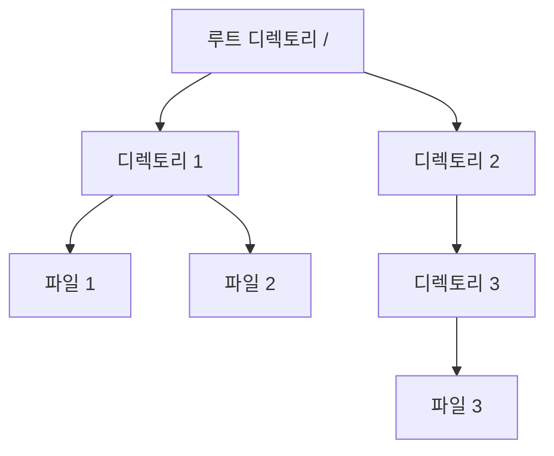

이와 같은 구조는 리눅스 파일 시스템의 유연성과 확장성을 제공하며, 다양한 파일 시스템의 특성을 활용하여 최적의 성능을 발휘할 수 있도록 한다. 리눅스 파일 시스템에 대한 이해는 시스템 관리 및 운영에 있어 매우 중요하다.

<!--
2. **리눅스 파일 시스템 구조**
   - 파일 시스템 계층 구조
   - Filesystem Hierarchy Standard (FHS)
-->

## 리눅스 파일 시스템 구조

리눅스 파일 시스템 구조는 데이터의 저장 및 관리 방식을 정의하는 중요한 요소이다. 이 구조는 파일과 디렉토리의 계층적 조직을 통해 사용자와 시스템이 데이터를 효율적으로 접근하고 관리할 수 있도록 돕는다.

**파일 시스템 계층 구조**

리눅스의 파일 시스템은 계층 구조를 가지고 있으며, 루트 디렉토리(`/`)를 최상위로 두고 그 아래에 다양한 디렉토리와 파일들이 위치한다. 이 구조는 각 디렉토리가 특정한 목적을 가지고 있으며, 시스템의 일관성을 유지하는 데 기여한다. 

아래는 리눅스 파일 시스템의 기본적인 계층 구조를 나타낸 다이어그램이다.

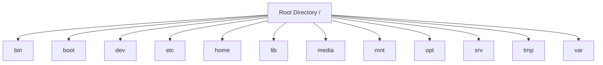

각 디렉토리는 다음과 같은 역할을 한다:

- **/bin**: 필수적인 사용자 명령어가 저장되는 디렉토리이다.
- **/boot**: 부팅에 필요한 파일들이 위치한다.
- **/dev**: 장치 파일들이 저장되는 곳이다.
- **/etc**: 시스템 설정 파일들이 위치한다.
- **/home**: 사용자 개인 파일들이 저장되는 디렉토리이다.
- **/lib**: 시스템 라이브러리 파일들이 위치한다.
- **/media**: 이동식 미디어 장치가 마운트되는 지점이다.
- **/mnt**: 임시로 파일 시스템을 마운트하는 데 사용된다.
- **/opt**: 추가 소프트웨어 패키지가 설치되는 디렉토리이다.
- **/srv**: 서비스 데이터가 저장되는 곳이다.
- **/tmp**: 임시 파일들이 저장되는 디렉토리이다.
- **/var**: 가변 데이터 파일들이 위치한다.

**Filesystem Hierarchy Standard (FHS)**

Filesystem Hierarchy Standard (FHS)는 리눅스 및 유닉스 계열 운영 체제에서 파일 시스템의 구조와 내용을 정의하는 표준이다. FHS는 파일과 디렉토리의 위치, 이름, 용도 등을 규정하여 시스템의 일관성을 높이고, 사용자와 개발자가 파일 시스템을 이해하고 사용할 수 있도록 돕는다.

FHS의 주요 목표는 다음과 같다:

1. **일관성**: 다양한 리눅스 배포판 간의 파일 시스템 구조를 일관되게 유지한다.
2. **호환성**: 소프트웨어가 다양한 리눅스 배포판에서 동일하게 작동할 수 있도록 한다.
3. **유지보수 용이성**: 시스템 관리자가 파일 시스템을 쉽게 이해하고 관리할 수 있도록 돕는다.

FHS는 각 디렉토리의 목적과 내용을 명확히 정의하고 있으며, 이를 통해 사용자와 개발자는 파일 시스템을 보다 효율적으로 활용할 수 있다. FHS를 준수하는 것은 리눅스 시스템의 안정성과 신뢰성을 높이는 데 기여한다.

<!--
3. **주요 파일 시스템 종류**
   - Ext2, Ext3, Ext4
   - XFS
   - Btrfs
   - ZFS
   - 각 파일 시스템의 특징 및 장단점 비교
-->

## 주요 파일 시스템 종류

리눅스에서 사용되는 다양한 파일 시스템은 각기 다른 특징과 장단점을 가지고 있다. 이 섹션에서는 주요 파일 시스템인 Ext2, Ext3, Ext4, XFS, Btrfs, ZFS에 대해 살펴보겠다.

**Ext2, Ext3, Ext4**

Ext2는 리눅스에서 가장 널리 사용되는 파일 시스템 중 하나로, 저널링 기능이 없는 파일 시스템이다. Ext3는 Ext2에 저널링 기능을 추가한 버전으로, 데이터 무결성을 보장하는 데 유리하다. Ext4는 Ext3의 발전된 형태로, 더 큰 파일과 파일 시스템을 지원하며 성능이 향상되었다.

- **Ext2**
  - 장점: 단순하고 안정적이며, 저널링이 필요 없는 환경에서 유용하다.
  - 단점: 데이터 손실 위험이 있으며, 복구가 어려울 수 있다.

- **Ext3**
  - 장점: 저널링 기능으로 데이터 무결성을 보장한다.
  - 단점: 성능이 Ext2보다 약간 떨어질 수 있다.

- **Ext4**
  - 장점: 대용량 파일과 파일 시스템을 지원하며, 성능이 우수하다.
  - 단점: 복잡성이 증가할 수 있다.

**XFS**

XFS는 고성능 파일 시스템으로, 대용량 데이터 처리에 최적화되어 있다. 특히, 대용량 파일과 높은 I/O 성능을 요구하는 환경에서 유리하다.

- **장점**: 뛰어난 성능과 확장성, 동적 할당 기능을 제공한다.
- **단점**: 복구 도구가 상대적으로 부족할 수 있다.

**Btrfs**

Btrfs는 최신 파일 시스템으로, 스냅샷, RAID 기능, 데이터 무결성 검사 등의 고급 기능을 제공한다. 데이터 관리와 복구에 유리한 특성을 가지고 있다.

- **장점**: 스냅샷과 복제 기능으로 데이터 보호가 용이하다.
- **단점**: 상대적으로 성숙도가 낮아 일부 기능이 불안정할 수 있다.

**ZFS**

ZFS는 Sun Microsystems에서 개발한 파일 시스템으로, 데이터 무결성과 스냅샷 기능이 뛰어나다. 대규모 스토리지 환경에서 많이 사용된다.

- **장점**: 데이터 무결성 검사, 스냅샷, 복제 기능이 강력하다.
- **단점**: 메모리 사용량이 많고, 설정이 복잡할 수 있다.

**각 파일 시스템의 특징 및 장단점 비교**

아래는 주요 파일 시스템의 특징과 장단점을 비교한 표이다.

| 파일 시스템 | 장점 | 단점 |
|--------------|------|------|
| Ext2         | 단순하고 안정적 | 데이터 손실 위험 |
| Ext3         | 저널링으로 데이터 무결성 보장 | 성능 저하 가능성 |
| Ext4         | 대용량 지원, 우수한 성능 | 복잡성 증가 |
| XFS          | 뛰어난 성능과 확장성 | 복구 도구 부족 |
| Btrfs        | 스냅샷과 복제 기능 | 성숙도 낮음 |
| ZFS          | 데이터 무결성, 스냅샷 기능 | 메모리 사용량 많음 |

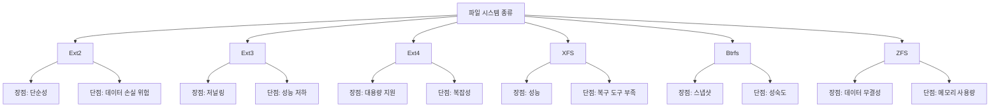

이와 같이 각 파일 시스템은 특정 용도와 환경에 따라 선택할 수 있으며, 사용자의 요구에 맞는 파일 시스템을 선택하는 것이 중요하다.

<!--
4. **파일 시스템의 핵심 개념**
   - Inodes
   - 블록 그룹 및 슈퍼블록
   - 데이터 블록과 메타데이터
-->

## 파일 시스템의 핵심 개념

리눅스 파일 시스템의 핵심 개념은 파일과 디렉토리를 효율적으로 관리하고 접근하기 위한 기본 구조를 제공한다. 이 섹션에서는 Inodes, 블록 그룹 및 슈퍼블록, 데이터 블록과 메타데이터에 대해 설명하겠다.

**Inodes**

Inode는 파일 시스템에서 파일이나 디렉토리에 대한 메타데이터를 저장하는 데이터 구조이다. 각 파일이나 디렉토리는 고유한 Inode 번호를 가지며, 이 번호를 통해 파일의 위치와 속성을 관리한다. Inode에는 파일의 소유자, 권한, 크기, 마지막 수정 시간 등의 정보가 포함된다. 

Inode의 구조는 다음과 같다:

```plaintext
+---------------------+
| Inode 번호          |
+---------------------+
| 파일 유형           |
+---------------------+
| 소유자 ID           |
+---------------------+
| 그룹 ID             |
+---------------------+
| 파일 크기           |
+---------------------+
| 마지막 접근 시간    |
+---------------------+
| 마지막 수정 시간    |
+---------------------+
| 데이터 블록 포인터  |
+---------------------+
```

**블록 그룹 및 슈퍼블록**

리눅스 파일 시스템은 데이터를 블록 단위로 저장하며, 이러한 블록들은 블록 그룹으로 묶여 있다. 블록 그룹은 Inode와 데이터 블록을 포함하며, 파일 시스템의 성능을 향상시키기 위해 데이터를 물리적으로 가까운 위치에 저장한다. 

슈퍼블록은 파일 시스템의 메타데이터를 포함하고 있으며, 파일 시스템의 크기, 블록 크기, 블록 그룹 수 등의 정보를 담고 있다. 슈퍼블록은 파일 시스템이 마운트될 때 읽혀지며, 파일 시스템의 상태를 확인하는 데 중요한 역할을 한다.

다음은 블록 그룹과 슈퍼블록의 관계를 나타낸 다이어그램이다:

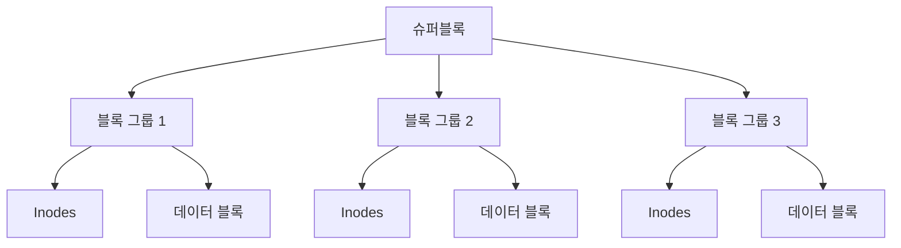

**데이터 블록과 메타데이터**

데이터 블록은 실제 파일의 내용을 저장하는 공간이다. 파일의 크기에 따라 여러 개의 데이터 블록이 필요할 수 있으며, 이 블록들은 Inode에 저장된 포인터를 통해 연결된다. 

메타데이터는 파일에 대한 정보를 담고 있는 데이터로, Inode와 함께 파일 시스템의 구조를 형성한다. 메타데이터는 파일의 속성, 위치, 권한 등을 포함하며, 파일 시스템의 효율적인 관리와 접근을 가능하게 한다.

이러한 핵심 개념들은 리눅스 파일 시스템의 기본적인 작동 원리를 이해하는 데 필수적이다. Inodes, 블록 그룹 및 슈퍼블록, 데이터 블록과 메타데이터의 구조와 역할을 이해함으로써 파일 시스템을 보다 효과적으로 관리할 수 있다.

<!--
5. **파일 시스템 관리**
   - 파일 시스템 마운트 및 언마운트
   - 파일 경로(Absolute Path vs Relative Path)
   - 링크(Soft Link vs Hard Link)
-->

## 파일 시스템 관리

리눅스에서 파일 시스템 관리는 시스템의 안정성과 성능을 유지하는 데 필수적이다. 이 섹션에서는 파일 시스템의 마운트 및 언마운트, 파일 경로의 개념, 그리고 링크의 종류에 대해 다룰 것이다.

**파일 시스템 마운트 및 언마운트**

파일 시스템을 사용하기 위해서는 먼저 해당 파일 시스템을 마운트해야 한다. 마운트는 특정 디렉토리에 파일 시스템을 연결하는 과정으로, 이를 통해 사용자는 해당 파일 시스템의 파일에 접근할 수 있다. 반대로, 언마운트는 마운트된 파일 시스템을 분리하는 과정이다.

마운트 명령어는 다음과 같이 사용할 수 있다:

```bash
sudo mount /dev/sdX1 /mnt/my_mount_point
```

여기서 `/dev/sdX1`은 마운트할 장치의 경로이며, `/mnt/my_mount_point`는 마운트할 디렉토리이다. 언마운트는 다음과 같이 수행할 수 있다:

```bash
sudo umount /mnt/my_mount_point
```

다이어그램으로 마운트와 언마운트 과정을 나타내면 다음과 같다:


**파일 경로(Absolute Path vs Relative Path)**

파일 경로는 파일 시스템 내에서 파일이나 디렉토리의 위치를 나타내는 방법이다. 절대 경로(Absolute Path)는 루트 디렉토리(`/`)에서 시작하여 파일이나 디렉토리까지의 전체 경로를 나타낸다. 예를 들어, `/home/user/document.txt`는 절대 경로이다.

반면, 상대 경로(Relative Path)는 현재 작업 중인 디렉토리를 기준으로 파일이나 디렉토리의 위치를 나타낸다. 예를 들어, 현재 디렉토리가 `/home/user`일 때, `document.txt`는 상대 경로로 표현할 수 있다.

**링크(Soft Link vs Hard Link)**

링크는 파일 시스템에서 파일에 대한 참조를 제공하는 방법이다. 두 가지 주요 링크 유형이 있다: 소프트 링크(Soft Link)와 하드 링크(Hard Link)이다.

- **소프트 링크(Soft Link)**: 원본 파일에 대한 경로를 저장하는 링크로, 원본 파일이 삭제되면 소프트 링크는 더 이상 유효하지 않다. 소프트 링크는 다음과 같이 생성할 수 있다:

```bash
ln -s /path/to/original/file /path/to/soft/link
```

- **하드 링크(Hard Link)**: 원본 파일과 동일한 inode를 공유하는 링크로, 원본 파일이 삭제되더라도 하드 링크는 여전히 유효하다. 하드 링크는 다음과 같이 생성할 수 있다:

```bash
ln /path/to/original/file /path/to/hard/link
```

다이어그램으로 소프트 링크와 하드 링크의 차이를 나타내면 다음과 같다:

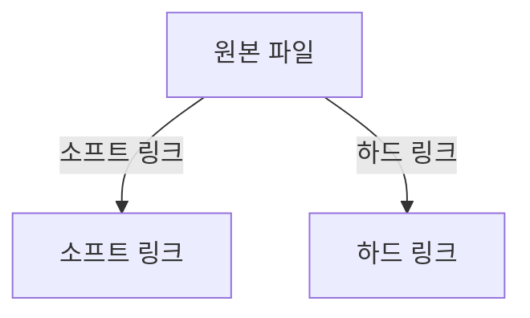

이와 같이 파일 시스템 관리의 기본 개념을 이해하고 활용하는 것은 리눅스 시스템을 효과적으로 운영하는 데 매우 중요하다.

<!--
6. **파일 권한 및 소유권**
   - 리눅스 파일 권한 시스템
   - 사용자, 그룹, 기타 사용자에 대한 권한 설정
-->

## 파일 권한 및 소유권

리눅스는 다중 사용자 환경을 지원하는 운영 체제이다. 따라서 파일과 디렉토리에 대한 접근 권한을 관리하는 것이 매우 중요하다. 리눅스 파일 권한 시스템은 사용자, 그룹, 기타 사용자에 대한 권한을 설정하여 보안을 강화하고 데이터 무결성을 유지하는 데 기여한다.

**리눅스 파일 권한 시스템**

리눅스 파일 권한 시스템은 각 파일과 디렉토리에 대해 읽기(read), 쓰기(write), 실행(execute) 권한을 설정할 수 있다. 이러한 권한은 다음과 같은 세 가지 범주로 나뉜다:

1. **소유자(Owner)**: 파일을 생성한 사용자로, 해당 파일에 대한 모든 권한을 가질 수 있다.
2. **그룹(Group)**: 파일 소유자가 속한 그룹으로, 그룹에 속한 사용자들이 해당 파일에 대한 권한을 가질 수 있다.
3. **기타 사용자(Others)**: 소유자와 그룹에 속하지 않는 모든 사용자로, 이들에게도 권한을 설정할 수 있다.

각 권한은 다음과 같이 표시된다:

- `r`: 읽기 권한
- `w`: 쓰기 권한
- `x`: 실행 권한

파일 권한은 `ls -l` 명령어를 통해 확인할 수 있으며, 출력 결과는 다음과 같은 형식을 가진다:

```bash
-rwxr-xr-- 1 user group 1234 Oct 10 12:34 filename
```

위의 예에서, 첫 번째 문자는 파일의 유형을 나타내며, 그 뒤의 9자는 소유자, 그룹, 기타 사용자에 대한 권한을 나타낸다. 각 3자리씩 나누어져 있으며, 각각 읽기, 쓰기, 실행 권한을 나타낸다.

**사용자, 그룹, 기타 사용자에 대한 권한 설정**

파일 권한을 설정하기 위해 `chmod` 명령어를 사용한다. 이 명령어는 권한을 숫자 또는 기호로 설정할 수 있다. 숫자 방식은 다음과 같은 규칙을 따른다:

- 읽기 권한: 4
- 쓰기 권한: 2
- 실행 권한: 1

따라서, 권한을 설정할 때는 각 권한의 값을 더하여 3자리 숫자로 표현한다. 예를 들어, 소유자에게 읽기, 쓰기, 실행 권한을 주고, 그룹에게 읽기와 실행 권한을 주며, 기타 사용자에게 읽기 권한만 주고 싶다면 다음과 같이 설정할 수 있다:

```bash
chmod 751 filename
```

여기서 `7`은 소유자에게 읽기(4) + 쓰기(2) + 실행(1) 권한을 주는 것이고, `5`는 그룹에게 읽기(4) + 실행(1) 권한을 주는 것이며, `1`은 기타 사용자에게 실행 권한만 주는 것이다.

또한, 기호를 사용하여 권한을 설정할 수도 있다. 예를 들어, 소유자에게 실행 권한을 추가하고 싶다면 다음과 같이 입력할 수 있다:

```bash
chmod u+x filename
```

여기서 `u`는 사용자(소유자)를 의미하며, `+`는 권한을 추가하는 것을 나타낸다.

**다이어그램**

다음은 리눅스 파일 권한 시스템의 구조를 나타내는 다이어그램이다:

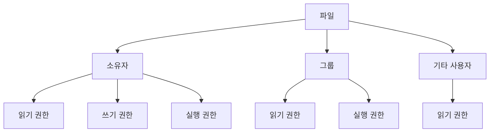

이와 같이 리눅스 파일 권한 시스템은 파일과 디렉토리에 대한 접근을 세밀하게 제어할 수 있도록 설계되어 있다. 이를 통해 시스템의 보안을 강화하고, 사용자 간의 데이터 접근을 효율적으로 관리할 수 있다.

<!--
7. **파일 시스템 모니터링 및 문제 해결**
   - 디스크 사용량 확인 (df, du 명령어)
   - 블록 장치 정보 확인 (lsblk, blkid 명령어)
   - 마운트된 파일 시스템 정보 확인 (findmnt, mount 명령어)
   - 파일 시스템 오류 검사 및 복구 (fsck, badblocks 명령어)
-->

## 파일 시스템 모니터링 및 문제 해결

리눅스에서 파일 시스템을 효과적으로 관리하기 위해서는 모니터링과 문제 해결이 필수적이다. 이 섹션에서는 디스크 사용량 확인, 블록 장치 정보 확인, 마운트된 파일 시스템 정보 확인, 그리고 파일 시스템 오류 검사 및 복구 방법에 대해 다룬다.

**디스크 사용량 확인 (df, du 명령어)**

디스크 사용량을 확인하기 위해 주로 사용하는 명령어는 `df`와 `du`이다. `df`는 파일 시스템의 전체 디스크 사용량과 남은 용량을 보여주며, `du`는 특정 디렉토리의 디스크 사용량을 확인하는 데 유용하다.

```bash
# 전체 파일 시스템의 디스크 사용량 확인
df -h

# 특정 디렉토리의 디스크 사용량 확인
du -sh /path/to/directory
```

**블록 장치 정보 확인 (lsblk, blkid 명령어)**

블록 장치의 정보를 확인하기 위해 `lsblk`와 `blkid` 명령어를 사용할 수 있다. `lsblk`는 시스템의 블록 장치 목록을 트리 형태로 보여주며, `blkid`는 각 블록 장치의 UUID와 파일 시스템 타입을 확인할 수 있다.

```bash
# 블록 장치 목록 확인
lsblk

# 블록 장치의 UUID 및 파일 시스템 타입 확인
blkid
```

**마운트된 파일 시스템 정보 확인 (findmnt, mount 명령어)**

현재 마운트된 파일 시스템의 정보를 확인하기 위해 `findmnt`와 `mount` 명령어를 사용할 수 있다. `findmnt`는 마운트된 파일 시스템의 계층 구조를 보여주며, `mount`는 현재 마운트된 모든 파일 시스템의 정보를 나열한다.

```bash
# 마운트된 파일 시스템의 계층 구조 확인
findmnt

# 현재 마운트된 파일 시스템 정보 확인
mount
```

**파일 시스템 오류 검사 및 복구 (fsck, badblocks 명령어)**

파일 시스템의 오류를 검사하고 복구하기 위해 `fsck`와 `badblocks` 명령어를 사용할 수 있다. `fsck`는 파일 시스템의 무결성을 검사하고, 필요시 복구 작업을 수행한다. `badblocks`는 디스크의 불량 블록을 검사하는 데 사용된다.

```bash
# 파일 시스템 오류 검사 및 복구
fsck /dev/sdX

# 디스크의 불량 블록 검사
badblocks -v /dev/sdX
```

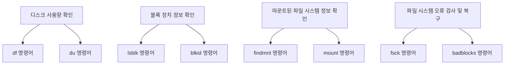

이와 같은 명령어들을 활용하여 리눅스 파일 시스템을 모니터링하고 문제를 해결하는 것은 시스템 관리에 있어 매우 중요한 작업이다. 이를 통해 시스템의 안정성을 높이고, 데이터 손실을 예방할 수 있다.

<!--
8. **실용적인 팁과 모범 사례**
   - 정기적인 파일 시스템 점검의 중요성
   - 데이터 백업 및 복구 전략
   - 파일 시스템 최적화 및 성능 향상 방법
-->

## 실용적인 팁과 모범 사례

리눅스 파일 시스템을 효과적으로 관리하기 위해서는 몇 가지 실용적인 팁과 모범 사례를 따르는 것이 중요하다. 이 섹션에서는 정기적인 파일 시스템 점검, 데이터 백업 및 복구 전략, 그리고 파일 시스템 최적화 및 성능 향상 방법에 대해 다룰 것이다.

**정기적인 파일 시스템 점검의 중요성**

정기적인 파일 시스템 점검은 시스템의 안정성과 데이터 무결성을 유지하는 데 필수적이다. 파일 시스템의 오류나 손상은 데이터 손실로 이어질 수 있으며, 이를 예방하기 위해 `fsck` 명령어를 사용하여 파일 시스템을 점검할 수 있다. 

다음은 `fsck` 명령어의 사용 예시이다:

```bash
sudo fsck /dev/sda1
```

이 명령어는 `/dev/sda1`에 있는 파일 시스템을 점검하고, 발견된 오류를 수정할 수 있는 옵션을 제공한다. 정기적인 점검을 통해 문제를 조기에 발견하고 해결할 수 있다.

**데이터 백업 및 복구 전략**

데이터 백업은 파일 시스템 관리에서 가장 중요한 부분 중 하나이다. 정기적으로 데이터를 백업하면 시스템 장애나 데이터 손실 시 신속하게 복구할 수 있다. 다양한 백업 방법이 있으며, 그 중 몇 가지는 다음과 같다:

1. **전체 백업**: 모든 데이터를 백업하는 방법으로, 복구 시 가장 간편하다.
2. **증분 백업**: 마지막 백업 이후 변경된 데이터만 백업하는 방법으로, 저장 공간을 절약할 수 있다.
3. **차등 백업**: 마지막 전체 백업 이후 변경된 모든 데이터를 백업하는 방법이다.

백업을 자동화하기 위해 `rsync` 명령어를 사용할 수 있다. 예를 들어, 다음과 같이 사용할 수 있다:

```bash
rsync -av --delete /source/directory/ /backup/directory/
```

이 명령어는 `/source/directory/`의 내용을 `/backup/directory/`로 동기화하며, 삭제된 파일도 백업에서 제거한다.

**파일 시스템 최적화 및 성능 향상 방법**

파일 시스템의 성능을 최적화하기 위해서는 몇 가지 방법을 고려할 수 있다. 다음은 일반적인 최적화 방법이다:

1. **파일 시스템 유형 선택**: 사용 목적에 맞는 파일 시스템을 선택하는 것이 중요하다. 예를 들어, 데이터베이스 서버에는 `XFS`나 `Btrfs`가 적합할 수 있다.
2. **디스크 조각 모음**: 파일 시스템의 조각화를 줄이기 위해 정기적으로 조각 모음을 수행하는 것이 좋다. `e4defrag` 명령어를 사용하여 Ext4 파일 시스템의 조각 모음을 수행할 수 있다.
3. **캐시 설정**: 파일 시스템의 캐시 설정을 조정하여 성능을 향상시킬 수 있다. 예를 들어, `noatime` 옵션을 사용하여 파일 접근 시간을 기록하지 않도록 설정할 수 있다.

다음은 파일 시스템 마운트 시 `noatime` 옵션을 사용하는 예시이다:

```bash
/dev/sda1 /mnt/data ext4 defaults,noatime 0 2
```

이와 같은 방법들을 통해 리눅스 파일 시스템의 성능을 최적화하고, 안정성을 높일 수 있다. 

이러한 실용적인 팁과 모범 사례를 통해 리눅스 파일 시스템을 효과적으로 관리하고, 데이터의 안전성을 확보할 수 있다.

<!--
9. **FAQ**
   - 리눅스 파일 시스템에서 가장 많이 사용되는 파일 시스템은 무엇인가요?
   - 파일 시스템을 변경하려면 어떻게 해야 하나요?
   - 리눅스에서 파일 시스템의 크기를 줄일 수 있나요?
-->

## FAQ

**리눅스 파일 시스템에서 가장 많이 사용되는 파일 시스템은 무엇인가요?**

리눅스 환경에서 가장 많이 사용되는 파일 시스템은 Ext4이다. Ext4는 Ext3의 후속 버전으로, 성능과 안정성 면에서 많은 개선이 이루어졌다. 또한, 대용량 파일과 대용량 파일 시스템을 지원하며, 저널링 기능을 통해 데이터 손실을 방지하는 데 도움을 준다. 그 외에도 XFS와 Btrfs도 많이 사용되며, 각각의 특성과 장점이 있다.

**파일 시스템을 변경하려면 어떻게 해야 하나요?**

파일 시스템을 변경하기 위해서는 다음과 같은 절차를 따르는 것이 일반적이다. 먼저, 현재 사용 중인 파일 시스템을 백업한 후, 해당 파일 시스템을 언마운트해야 한다. 그 다음, `mkfs` 명령어를 사용하여 새로운 파일 시스템을 생성할 수 있다. 아래는 파일 시스템을 Ext4로 변경하는 예시 코드이다.

```bash
# 현재 파일 시스템 언마운트
sudo umount /dev/sdX1

# 새로운 파일 시스템 생성
sudo mkfs.ext4 /dev/sdX1
```

이후, 새로운 파일 시스템을 마운트하여 사용할 수 있다.

**리눅스에서 파일 시스템의 크기를 줄일 수 있나요?**

리눅스에서 파일 시스템의 크기를 줄이는 것은 가능하지만, 주의가 필요하다. 일반적으로 파일 시스템의 크기를 줄이기 위해서는 먼저 해당 파일 시스템을 언마운트해야 하며, `resize2fs` 명령어를 사용하여 크기를 조정할 수 있다. 아래는 Ext4 파일 시스템의 크기를 줄이는 예시 코드이다.

```bash
# 파일 시스템 언마운트
sudo umount /dev/sdX1

# 파일 시스템 크기 줄이기
sudo resize2fs /dev/sdX1 10G
```

위의 예시에서는 파일 시스템의 크기를 10GB로 줄이는 과정을 보여준다. 파일 시스템의 크기를 줄이기 전에 반드시 데이터 백업을 수행하는 것이 중요하다.

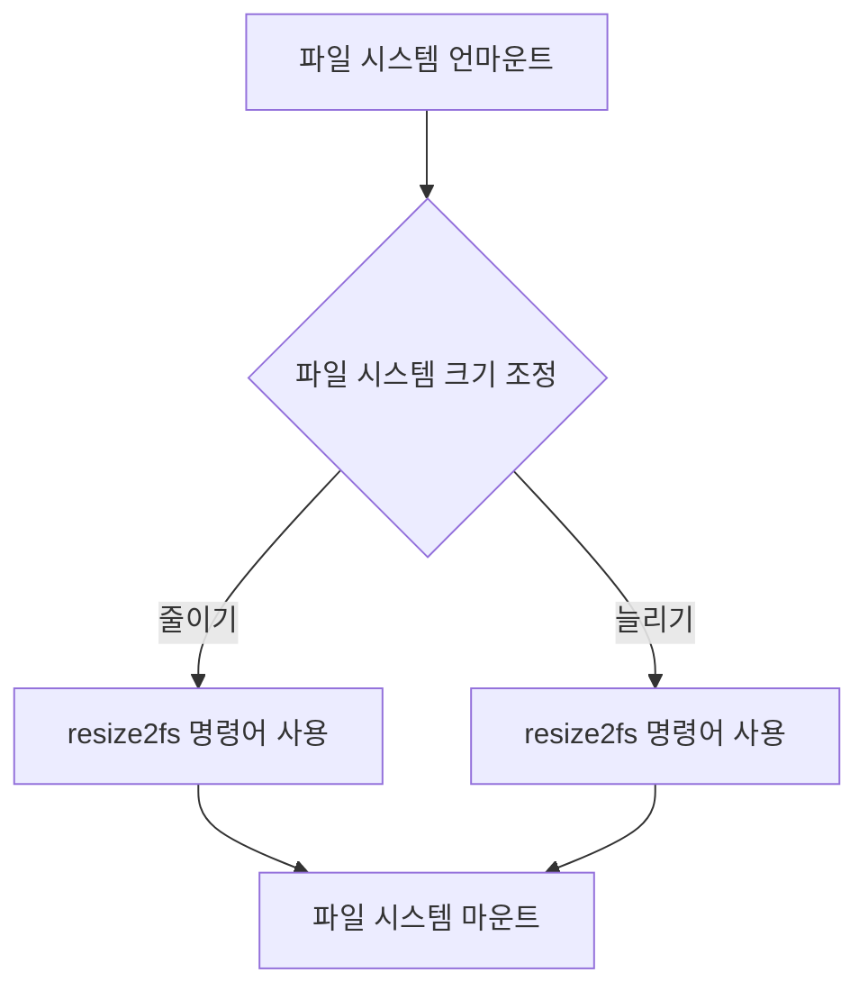

위의 다이어그램은 파일 시스템의 크기를 조정하는 과정을 시각적으로 나타낸 것이다. 이와 같은 절차를 통해 리눅스에서 파일 시스템의 크기를 안전하게 조정할 수 있다.

<!--
10. **관련 기술**
    - POSIX(Portable Operating System Interface)
    - LVM(Logical Volume Manager)
    - RAID(중복 배열 독립 디스크)
-->

## 관련 기술

리눅스 파일 시스템을 효과적으로 관리하기 위해서는 여러 관련 기술에 대한 이해가 필요하다. 이 섹션에서는 POSIX, LVM, RAID에 대해 설명하겠다.

**POSIX (Portable Operating System Interface)**

POSIX는 다양한 운영 체제에서 호환성을 보장하기 위한 표준이다. 리눅스는 POSIX를 준수하여 다양한 응용 프로그램이 서로 다른 시스템에서 원활하게 작동할 수 있도록 한다. POSIX는 파일 시스템, 프로세스 관리, 스레드, 신호 처리 등 여러 가지 기능을 정의하고 있다. 이를 통해 개발자는 특정 운영 체제에 종속되지 않고도 소프트웨어를 개발할 수 있다.

**LVM (Logical Volume Manager)**

LVM은 리눅스에서 물리적 저장 장치를 논리적으로 관리할 수 있는 시스템이다. LVM을 사용하면 여러 개의 물리적 디스크를 하나의 논리적 볼륨으로 묶거나, 기존 볼륨의 크기를 동적으로 조정할 수 있다. 이는 데이터의 유연한 관리와 효율적인 공간 활용을 가능하게 한다.

다음은 LVM의 기본 구조를 나타내는 다이어그램이다.

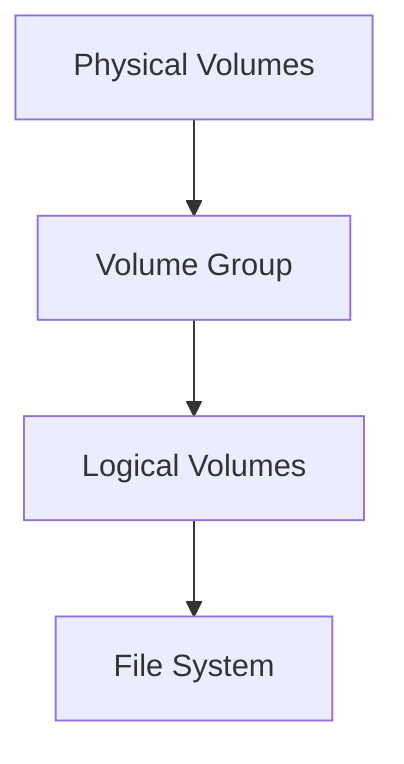

위의 다이어그램에서 Physical Volumes는 실제 하드 드라이브를 나타내며, Volume Group은 이러한 물리적 볼륨을 묶은 논리적 그룹이다. Logical Volumes는 이 그룹 내에서 생성된 논리적 저장 공간으로, 파일 시스템이 이 위에 구축된다.

**RAID (Redundant Array of Independent Disks)**

RAID는 여러 개의 하드 드라이브를 결합하여 데이터의 중복성과 성능을 향상시키는 기술이다. RAID는 여러 가지 레벨로 구성될 수 있으며, 각 레벨은 데이터 보호 및 성능에 대한 서로 다른 접근 방식을 제공한다. 예를 들어, RAID 0은 성능을 극대화하지만 데이터 중복성이 없고, RAID 1은 데이터의 미러링을 통해 중복성을 제공한다.

RAID의 기본 개념을 나타내는 다이어그램은 다음과 같다.

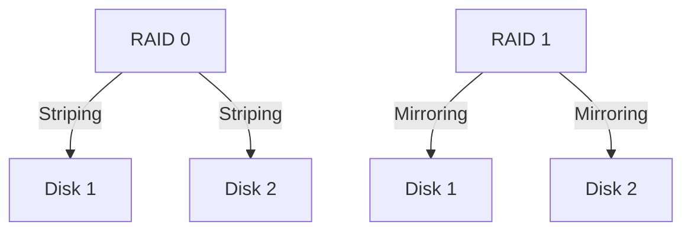

위의 다이어그램에서 RAID 0은 두 개의 디스크에 데이터를 스트라이핑하여 성능을 높이는 반면, RAID 1은 두 개의 디스크에 동일한 데이터를 저장하여 데이터의 안전성을 높인다.

이와 같이 POSIX, LVM, RAID는 리눅스 파일 시스템을 보다 효과적으로 관리하고 활용하는 데 중요한 역할을 한다. 각 기술의 특성을 이해하고 적절히 활용하는 것이 리눅스 환경에서의 파일 시스템 관리 능력을 향상시키는 데 기여할 것이다.

<!--
11. **결론**
    - 리눅스 파일 시스템의 이해와 관리의 중요성
    - DevOps 엔지니어로서의 파일 시스템 관리 능력 향상
-->

## 결론

리눅스 파일 시스템은 현대의 IT 인프라에서 필수적인 요소이다. 파일 시스템의 구조와 기능을 이해하는 것은 시스템 관리 및 운영에 있어 매우 중요하다. 리눅스 파일 시스템은 데이터 저장 및 접근을 효율적으로 관리할 수 있도록 설계되어 있으며, 다양한 파일 시스템 종류와 그 특징을 이해함으로써 적절한 선택을 할 수 있다. 

**리눅스 파일 시스템의 이해와 관리의 중요성**

리눅스 파일 시스템을 이해하는 것은 단순히 파일을 저장하고 관리하는 것을 넘어, 시스템의 성능과 안정성을 높이는 데 기여한다. 파일 시스템의 구조와 동작 원리를 이해하면, 문제 발생 시 신속하게 대응할 수 있으며, 데이터 손실을 예방할 수 있다. 또한, 파일 시스템의 최적화 및 성능 향상 방법을 알고 있다면, 시스템 자원을 보다 효율적으로 사용할 수 있다.

**DevOps 엔지니어로서의 파일 시스템 관리 능력 향상**

DevOps 엔지니어는 지속적인 통합 및 배포(CI/CD) 환경에서 파일 시스템을 효과적으로 관리해야 한다. 이를 위해서는 파일 시스템의 마운트 및 언마운트, 권한 설정, 모니터링 및 문제 해결 능력이 필수적이다. DevOps 환경에서는 자동화 도구를 활용하여 파일 시스템 관리 작업을 효율적으로 수행할 수 있으며, 이를 통해 운영 비용을 절감하고 시스템의 가용성을 높일 수 있다.

다음은 파일 시스템 관리의 중요성을 강조하는 다이어그램이다.

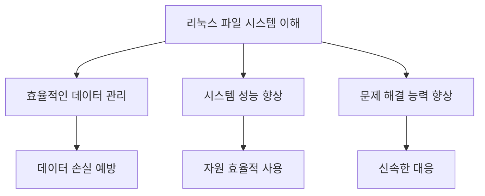

결론적으로, 리눅스 파일 시스템에 대한 깊은 이해는 DevOps 엔지니어로서의 역량을 강화하고, 안정적이고 효율적인 시스템 운영을 가능하게 한다. 따라서, 지속적인 학습과 실습을 통해 파일 시스템 관리 능력을 향상시키는 것이 중요하다.

<!--
12. **참고 자료**
    - 관련 문서 및 링크
    - 추천 도서 및 온라인 강좌
-->

## 참고 자료

리눅스 파일 시스템에 대한 깊이 있는 이해를 위해 다양한 자료를 참고하는 것이 중요하다. 이 섹션에서는 관련 문서, 링크, 추천 도서 및 온라인 강좌를 소개한다.

**관련 문서 및 링크**

1. **Filesystem Hierarchy Standard (FHS)**
   - FHS는 리눅스 파일 시스템의 구조와 규칙을 정의하는 문서이다. [FHS 공식 웹사이트](https://refspecs.linuxfoundation.org/FHS_3.0/fhs/index.html)에서 확인할 수 있다.

2. **Linux Documentation Project**
   - 리눅스 관련 다양한 문서와 가이드를 제공하는 사이트로, 파일 시스템에 대한 정보도 포함되어 있다. [Linux Documentation Project](https://www.tldp.org/)를 방문해보자.

3. **Kernel Newbies**
   - 리눅스 커널의 새로운 기능과 변경 사항에 대한 정보를 제공하는 사이트로, 파일 시스템 관련 업데이트도 다룬다. [Kernel Newbies](https://kernelnewbies.org/)에서 확인할 수 있다.

**추천 도서 및 온라인 강좌**

1. **"Understanding the Linux Kernel" by Daniel P. Bovet and Marco Cesati**
   - 이 책은 리눅스 커널의 구조와 동작 원리를 깊이 있게 설명하며, 파일 시스템에 대한 내용도 포함되어 있다.

2. **"Linux Filesystem Hierarchy" by Michael Kerrisk**
   - 리눅스 파일 시스템의 계층 구조와 각 구성 요소의 역할을 설명하는 책으로, 실무에 유용한 정보를 제공한다.

3. **Coursera - "Linux Server Management and Security"**
   - 이 온라인 강좌는 리눅스 서버 관리와 보안에 대한 내용을 다루며, 파일 시스템 관리에 대한 실용적인 팁을 제공한다. [Coursera 링크](https://www.coursera.org/learn/linux-server-management-security)에서 확인할 수 있다.

4. **edX - "Introduction to Linux"**
   - 리눅스의 기본 개념과 파일 시스템에 대한 내용을 포함한 무료 온라인 강좌이다. [edX 링크](https://www.edx.org/course/introduction-to-linux)에서 수강할 수 있다.

**샘플 코드**

리눅스에서 파일 시스템 정보를 확인하는 간단한 명령어 예시는 다음과 같다.

```bash
# 현재 마운트된 파일 시스템 정보 확인
df -h

# 특정 디렉토리의 파일 시스템 정보 확인
df -h /home
```

**다이어그램**

다음은 리눅스 파일 시스템의 기본 구조를 나타내는 다이어그램이다.

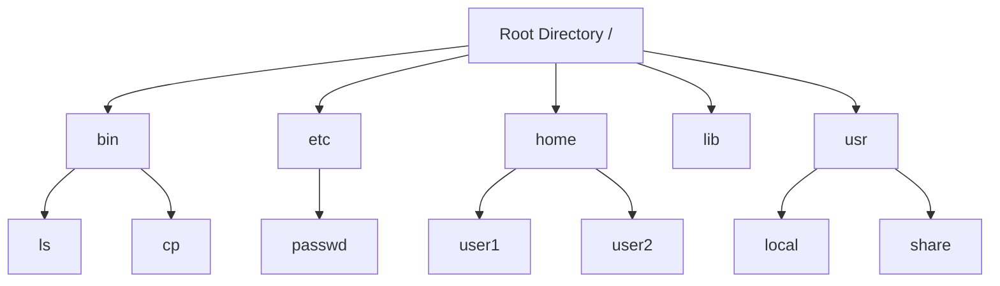

이 자료들을 통해 리눅스 파일 시스템에 대한 이해를 더욱 깊이 있게 할 수 있을 것이다. 각 자료를 참고하여 실무에 적용해보는 것이 중요하다.

<!--
##### Reference #####
-->

## Reference


* [https://dev.to/prodevopsguytech/understanding-the-linux-filesystem-an-in-depth-guide-for-devops-engineers-ona](https://dev.to/prodevopsguytech/understanding-the-linux-filesystem-an-in-depth-guide-for-devops-engineers-ona)
* [https://medium.com/naver-cloud-platform/posix-%EC%95%8C%EC%95%84%EB%B3%B4%EA%B8%B0-1-linux-%EB%A6%AC%EB%88%85%EC%8A%A4-%ED%8C%8C%EC%9D%BC-%EC%8B%9C%EC%8A%A4%ED%85%9C%EC%9D%98-%EC%A2%85%EB%A5%98%EC%99%80-%ED%8A%B9%EC%A7%95-96a2e93e33b3](https://medium.com/naver-cloud-platform/posix-%EC%95%8C%EC%95%84%EB%B3%B4%EA%B8%B0-1-linux-%EB%A6%AC%EB%88%85%EC%8A%A4-%ED%8C%8C%EC%9D%BC-%EC%8B%9C%EC%8A%A4%ED%85%9C%EC%9D%98-%EC%A2%85%EB%A5%98%EC%99%80-%ED%8A%B9%EC%A7%95-96a2e93e33b3)
* [https://www.infracody.com/2023/09/understanding-linux-file-systems-guide-to-checking-file-systems.html](https://www.infracody.com/2023/09/understanding-linux-file-systems-guide-to-checking-file-systems.html)
* [https://velog.io/@ujeongoh/Linux-%ED%8C%8C%EC%9D%BC%EC%8B%9C%EC%8A%A4%ED%85%9C-%EA%B5%AC%EC%A1%B0](https://velog.io/@ujeongoh/Linux-%ED%8C%8C%EC%9D%BC%EC%8B%9C%EC%8A%A4%ED%85%9C-%EA%B5%AC%EC%A1%B0)
* [https://lilo.tistory.com/17](https://lilo.tistory.com/17)
* [https://isc9511.tistory.com/180](https://isc9511.tistory.com/180)
* [https://heeya-stupidbutstudying.tistory.com/entry/Linux-ext-%ED%8C%8C%EC%9D%BC-%EC%8B%9C%EC%8A%A4%ED%85%9C%EA%B3%BC-inode-Linux-File-System-Hierarchy](https://heeya-stupidbutstudying.tistory.com/entry/Linux-ext-%ED%8C%8C%EC%9D%BC-%EC%8B%9C%EC%8A%A4%ED%85%9C%EA%B3%BC-inode-Linux-File-System-Hierarchy)

