지연 시간 메트릭은 서비스나 애플리케이션의 성능을 평가하는 데 중요한 역할을 한다. P90, P95, P99 지연 시간을 관찰함으로써 우리는 잠재적인 병목 현상을 식별하고 사용자 경험을 최적화할 수 있다. 서비스와 애플리케이션이 특정 지연 시간 내에 작동하는 것이 얼마나 중요한지, 그리고 SLA(서비스 수준 계약)를 갖는 것이 얼마나 중요한지를 이해해야 한다. 예를 들어, 강력한 백엔드 시스템을 구축하고 모든 기능적 요구 사항을 충족한 후 배포를 준비하고 있다고 가정해 보자. 그러나 배포 직전에 시스템의 성능 메트릭에 대한 세부 정보를 요청받게 된다. 평균(Mean), 중간(Median), 최대(Max) 지연 시간은 얼마인지, 90번째(P90), 95번째(P95), 99번째(P99) 백분위수에서의 지연 시간은 어떻게 되는지를 알아야 한다. 또한 시스템이 어떤 수준의 부하에서 테스트되었는지도 알고 싶어 한다. 이러한 지연 시간 메트릭을 통해 우리는 API의 응답 속도를 이해하고, 사용자 경험을 개선하기 위한 최적화 작업을 수행할 수 있다. P90, P95, P99는 각각 90%, 95%, 99%의 요청이 특정 지연 시간 내에 완료된다는 것을 의미하며, 이를 통해 우리는 시스템의 성능을 보다 명확하게 파악할 수 있다.


||
|:---:|
||


<!--
##### Outline #####
-->

<!--
# 목차

## 1. 개요
   - Latency Metrics의 중요성
   - P90, P95, P99의 정의와 역할

## 2. Latency Metrics 이해하기
   - 2.1 Latency란 무엇인가?
   - 2.2 Latency 측정 단위 (Milliseconds, Seconds)
   - 2.3 Latency와 사용자 경험의 관계

## 3. SLA (Service Level Agreement)
   - 3.1 SLA의 정의
   - 3.2 SLA의 중요성
   - 3.3 SLA 샘플 보고서

## 4. P90, P95, P99의 이해
   - 4.1 P90 (90th Percentile)
   - 4.2 P95 (95th Percentile)
   - 4.3 P99 (99th Percentile)
   - 4.4 PXX Latency의 의미와 활용

## 5. Latency Metrics 계산 방법
   - 5.1 Mean Latency
   - 5.2 Median Latency
   - 5.3 Max Latency
   - 5.4 P99 Latency vs Median Latency

## 6. Latency Metrics 모니터링
   - 6.1 모니터링 도구 및 기술
   - 6.2 Prometheus와 PromQL을 이용한 모니터링
   - 6.3 AWS에서의 Latency Metrics 활용

## 7. 예제
   - 7.1 Latency Metrics 계산 예제
   - 7.2 SLA 예제
   - 7.3 P90, P95, P99 예제

## 8. FAQ
   - 8.1 Latency가 높은 경우의 대처 방법은?
   - 8.2 SLA를 설정할 때 고려해야 할 사항은?
   - 8.3 P90, P95, P99의 차이는 무엇인가요?

## 9. 관련 기술
   - 9.1 API 성능 최적화 기술
   - 9.2 모니터링 및 로깅 도구
   - 9.3 클라우드 서비스와 Latency Metrics

## 10. 결론
   - Latency Metrics의 중요성 요약
   - 성능 최적화를 위한 지속적인 모니터링 필요성

## 11. 참고 자료
   - 11.1 관련 블로그 및 문서
   - 11.2 추가 학습 자료 및 링크
-->

<!--
## 1. 개요
   - Latency Metrics의 중요성
   - P90, P95, P99의 정의와 역할
-->

## 1. 개요

**Latency Metrics의 중요성**

Latency Metrics는 시스템의 성능을 평가하는 데 있어 매우 중요한 지표이다. Latency는 요청이 발생한 시점부터 응답이 돌아오기까지의 시간을 측정하며, 이는 사용자 경험에 직접적인 영향을 미친다. 사용자가 웹 애플리케이션이나 API를 사용할 때, 응답 시간이 길어질수록 사용자의 만족도는 감소하고 이탈률은 증가하는 경향이 있다. 따라서 Latency Metrics를 통해 시스템의 성능을 지속적으로 모니터링하고 최적화하는 것이 필수적이다.

Latency Metrics는 다음과 같은 이유로 중요하다:

1. **사용자 경험 개선**: Latency를 줄이면 사용자 경험이 향상된다.
2. **성능 최적화**: Latency Metrics를 분석하여 성능 병목 현상을 찾아내고 개선할 수 있다.
3. **비즈니스 성과**: Latency가 낮은 시스템은 고객의 신뢰를 얻고, 비즈니스 성과에 긍정적인 영향을 미친다.

**P90, P95, P99의 정의와 역할**

P90, P95, P99는 Latency Metrics에서 중요한 퍼센타일 지표로, 각각 90%, 95%, 99%의 요청이 특정 시간 이하로 처리되는지를 나타낸다. 이 지표들은 시스템의 성능을 평가하는 데 있어 매우 유용하다.

- **P90 (90th Percentile)**: 전체 요청 중 90%가 이 시간 이하로 처리됨을 의미한다. 이는 일반적인 사용자 경험을 나타내는 데 유용하다.
- **P95 (95th Percentile)**: 전체 요청 중 95%가 이 시간 이하로 처리됨을 의미한다. 이는 더 극단적인 사용자 경험을 반영하며, 성능 개선의 필요성을 강조하는 데 도움이 된다.
- **P99 (99th Percentile)**: 전체 요청 중 99%가 이 시간 이하로 처리됨을 의미한다. 이는 시스템의 최악의 성능을 나타내며, 특히 중요한 비즈니스 트랜잭션에 대한 신뢰성을 평가하는 데 필수적이다.

이러한 퍼센타일 지표들은 Latency Metrics를 통해 시스템의 성능을 정량적으로 평가하고, 성능 개선을 위한 목표를 설정하는 데 중요한 역할을 한다.

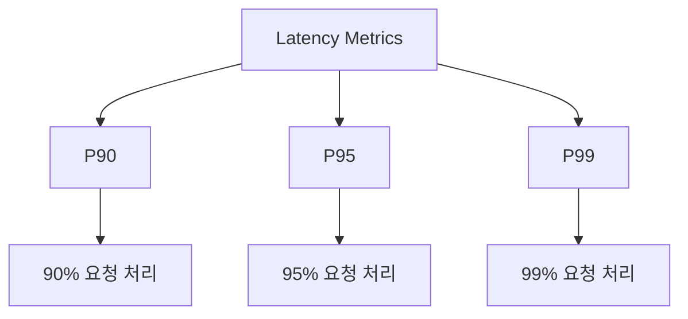

위의 다이어그램은 Latency Metrics와 P90, P95, P99 간의 관계를 시각적으로 나타낸 것이다. 이러한 지표들은 시스템의 성능을 평가하고, 사용자 경험을 개선하기 위한 중요한 도구로 활용된다.

<!--
## 2. Latency Metrics 이해하기
   - 2.1 Latency란 무엇인가?
   - 2.2 Latency 측정 단위 (Milliseconds, Seconds)
   - 2.3 Latency와 사용자 경험의 관계
-->

## 2. Latency Metrics 이해하기

**Latency란 무엇인가?**  

Latency는 시스템이 요청을 받고 응답을 반환하기까지 걸리는 시간을 의미한다. 이는 네트워크 통신, 데이터베이스 쿼리, API 호출 등 다양한 요소에 의해 영향을 받을 수 있다. Latency는 일반적으로 밀리초(milliseconds) 단위로 측정되며, 낮은 Latency는 사용자에게 더 나은 경험을 제공하는 데 중요한 역할을 한다.

**Latency 측정 단위 (Milliseconds, Seconds)**  

Latency는 주로 밀리초(ms)와 초(s) 단위로 측정된다. 밀리초는 1초의 1/1000로, 짧은 시간 간격을 측정하는 데 유용하다. 예를 들어, 웹 페이지가 로드되는 데 200ms가 걸린다면 이는 사용자가 느끼기에 빠른 응답으로 인식될 수 있다. 반면, Latency가 1초를 초과하면 사용자는 지연을 느끼게 되고, 이는 사용자 경험에 부정적인 영향을 미칠 수 있다.

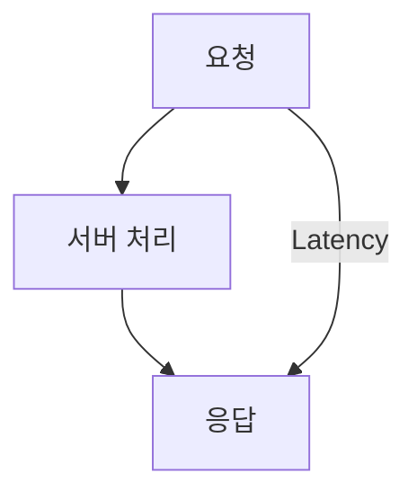

**Latency와 사용자 경험의 관계**  

Latency는 사용자 경험에 직접적인 영향을 미친다. Latency가 낮을수록 사용자는 시스템의 반응이 빠르다고 느끼며, 이는 긍정적인 경험으로 이어진다. 반대로, Latency가 높으면 사용자는 불만을 느끼고, 이는 서비스 이탈로 이어질 수 있다. 따라서, Latency를 최소화하는 것은 사용자 만족도를 높이는 데 필수적이다. 

예를 들어, 전자상거래 웹사이트에서 제품을 검색할 때 Latency가 100ms라면 사용자는 빠르게 결과를 확인할 수 있다. 그러나 Latency가 2초로 증가하면 사용자는 기다리는 동안 불편함을 느끼고, 다른 사이트로 이동할 가능성이 높아진다. 

이와 같이 Latency는 단순한 기술적 지표가 아니라, 사용자 경험을 좌우하는 중요한 요소임을 인식해야 한다.

<!--
## 3. SLA (Service Level Agreement)
   - 3.1 SLA의 정의
   - 3.2 SLA의 중요성
   - 3.3 SLA 샘플 보고서
-->

## 3. SLA (Service Level Agreement)

**SLA의 정의**  

SLA는 Service Level Agreement의 약자로, 서비스 제공자와 고객 간의 서비스 수준에 대한 합의를 문서화한 것이다. SLA는 서비스의 품질, 가용성, 책임 및 성과 기준을 명확히 정의하여 양측의 기대치를 조율하는 역할을 한다. 일반적으로 SLA는 서비스의 가용성, 응답 시간, 처리 시간, 지원 시간 등을 포함하며, 이러한 요소들은 서비스의 성능을 측정하는 데 중요한 기준이 된다.

**SLA의 중요성**  

SLA는 서비스 제공자와 고객 간의 신뢰를 구축하는 데 중요한 역할을 한다. 명확한 SLA가 존재할 경우, 고객은 서비스의 품질에 대한 기대를 가질 수 있으며, 서비스 제공자는 이를 충족하기 위해 노력하게 된다. 또한 SLA는 서비스 성과를 측정하고, 문제가 발생했을 때의 책임 소재를 명확히 하여 분쟁을 예방하는 데 기여한다. SLA는 비즈니스의 성공에 필수적인 요소로, 고객 만족도를 높이고, 서비스 개선을 위한 피드백을 제공하는 데 중요한 역할을 한다.

**SLA 샘플 보고서**  

아래는 SLA의 샘플 보고서 형식이다. 이 보고서는 서비스의 주요 성과 지표(KPI)와 목표를 명시하고 있다.

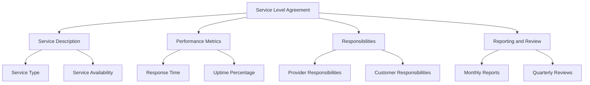

위의 다이어그램은 SLA의 주요 구성 요소를 시각적으로 나타낸 것이다. 각 요소는 서비스의 품질을 보장하기 위해 서로 연결되어 있으며, 이를 통해 서비스 제공자는 고객의 기대를 충족하기 위해 필요한 조치를 취할 수 있다. SLA는 단순한 문서가 아니라, 서비스의 품질을 지속적으로 개선하기 위한 중요한 도구임을 명심해야 한다.

<!--
## 4. P90, P95, P99의 이해
   - 4.1 P90 (90th Percentile)
   - 4.2 P95 (95th Percentile)
   - 4.3 P99 (99th Percentile)
   - 4.4 PXX Latency의 의미와 활용
-->

## 4. P90, P95, P99의 이해

P90, P95, P99는 Latency Metrics에서 중요한 역할을 하는 지표로, 시스템의 성능을 평가하는 데 유용하다. 이 지표들은 특정 백분위수에서의 응답 시간을 나타내며, 사용자 경험을 개선하기 위한 중요한 데이터로 활용된다.

**4.1 P90 (90th Percentile)**  

P90은 90번째 백분위수로, 전체 요청 중 90%의 응답 시간이 이 값 이하임을 의미한다. 즉, P90 값이 200ms라면, 90%의 요청이 200ms 이내에 처리되었다는 것을 나타낸다. 이는 시스템의 성능을 평가할 때 중요한 기준이 된다.

**4.2 P95 (95th Percentile)**  

P95는 95번째 백분위수로, 전체 요청 중 95%의 응답 시간이 이 값 이하임을 의미한다. P95 값이 300ms라면, 95%의 요청이 300ms 이내에 처리되었다는 것을 나타낸다. P95는 특히 성능이 저하되는 경우를 파악하는 데 유용하다.

**4.3 P99 (99th Percentile)**  

P99는 99번째 백분위수로, 전체 요청 중 99%의 응답 시간이 이 값 이하임을 의미한다. P99 값이 500ms라면, 99%의 요청이 500ms 이내에 처리되었다는 것을 나타낸다. P99는 극단적인 성능 저하를 감지하는 데 중요한 지표로 사용된다.

**4.4 PXX Latency의 의미와 활용**  

PXX는 특정 백분위수를 나타내는 일반적인 표현으로, P90, P95, P99 외에도 다양한 백분위수를 사용할 수 있다. 이러한 지표들은 시스템의 성능을 모니터링하고, 사용자 경험을 개선하기 위한 전략을 수립하는 데 중요한 역할을 한다. 예를 들어, P90과 P99의 차이를 분석함으로써 성능 저하의 원인을 파악할 수 있다.

다음은 P90, P95, P99의 개념을 시각적으로 나타낸 다이어그램이다.

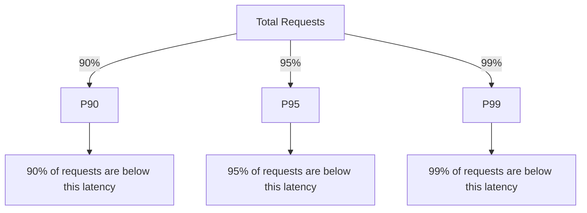

이러한 지표들은 Latency Metrics를 이해하고, 시스템 성능을 최적화하는 데 필수적인 요소이다. P90, P95, P99를 통해 성능을 지속적으로 모니터링하고, 사용자 경험을 개선하기 위한 전략을 수립할 수 있다.

<!--
## 5. Latency Metrics 계산 방법
   - 5.1 Mean Latency
   - 5.2 Median Latency
   - 5.3 Max Latency
   - 5.4 P99 Latency vs Median Latency
-->

## 5. Latency Metrics 계산 방법

Latency Metrics는 시스템의 성능을 평가하는 데 중요한 역할을 한다. 이 섹션에서는 Latency Metrics의 다양한 계산 방법에 대해 설명하겠다.

**Mean Latency**

Mean Latency는 모든 Latency 값을 합산한 후, 그 값을 데이터의 개수로 나눈 값이다. 이는 전체 Latency의 평균을 나타내며, 시스템의 전반적인 성능을 이해하는 데 유용하다. 그러나 극단적인 값에 민감하기 때문에, 다른 지표와 함께 사용하는 것이 좋다.

```python
def mean_latency(latencies):
    return sum(latencies) / len(latencies)

latencies = [100, 200, 300, 400, 500]
print(mean_latency(latencies))  # Output: 300.0
```

**Median Latency**

Median Latency는 Latency 값을 정렬한 후, 중앙에 위치한 값을 의미한다. 데이터의 개수가 홀수일 경우 중앙값이 직접적으로 Median이 되며, 짝수일 경우 두 중앙값의 평균을 취한다. Median은 극단적인 값의 영향을 덜 받기 때문에, Latency의 일반적인 경향을 파악하는 데 유용하다.

```python
def median_latency(latencies):
    sorted_latencies = sorted(latencies)
    n = len(sorted_latencies)
    mid = n // 2
    if n % 2 == 0:
        return (sorted_latencies[mid - 1] + sorted_latencies[mid]) / 2
    else:
        return sorted_latencies[mid]

latencies = [100, 200, 300, 400, 500]
print(median_latency(latencies))  # Output: 300
```

**Max Latency**

Max Latency는 주어진 Latency 값 중에서 가장 큰 값을 의미한다. 이는 시스템의 성능 저하를 나타내는 중요한 지표로, 특정 요청이 얼마나 오랜 시간 동안 처리되었는지를 보여준다. Max Latency가 높을 경우, 시스템의 성능에 문제가 있을 수 있음을 시사한다.

```python
def max_latency(latencies):
    return max(latencies)

latencies = [100, 200, 300, 400, 500]
print(max_latency(latencies))  # Output: 500
```

**P99 Latency vs Median Latency**

P99 Latency는 99번째 백분위수로, 전체 Latency 값 중에서 99%가 이 값 이하임을 의미한다. 이는 극단적인 Latency 값을 고려하여 시스템의 성능을 평가하는 데 유용하다. 반면, Median Latency는 중앙값으로, Latency의 일반적인 경향을 나타낸다. 두 지표는 서로 보완적인 관계에 있으며, 함께 분석함으로써 시스템의 성능을 보다 정확하게 이해할 수 있다.

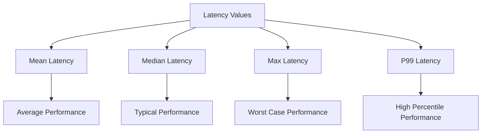

이와 같이 Latency Metrics의 다양한 계산 방법을 이해하고 활용함으로써, 시스템의 성능을 보다 효과적으로 모니터링하고 최적화할 수 있다.

<!--
## 6. Latency Metrics 모니터링
   - 6.1 모니터링 도구 및 기술
   - 6.2 Prometheus와 PromQL을 이용한 모니터링
   - 6.3 AWS에서의 Latency Metrics 활용
-->

## 6. Latency Metrics 모니터링

**모니터링 도구 및 기술**  

Latency Metrics를 효과적으로 모니터링하기 위해서는 다양한 도구와 기술을 활용할 수 있다. 대표적인 모니터링 도구로는 Grafana, Prometheus, Datadog, New Relic 등이 있다. 이들 도구는 실시간으로 Latency를 측정하고 시각화할 수 있는 기능을 제공하여, 시스템의 성능을 지속적으로 모니터링할 수 있도록 돕는다.

모니터링 기술로는 다음과 같은 방법들이 있다:

1. **Agent-based Monitoring**: 각 서버에 에이전트를 설치하여 시스템의 성능 데이터를 수집하는 방법이다. 이 방식은 세부적인 데이터를 수집할 수 있지만, 에이전트 설치 및 관리가 필요하다.
  
2. **Agentless Monitoring**: 에이전트를 설치하지 않고, 네트워크를 통해 데이터를 수집하는 방법이다. 이 방식은 설치가 간편하지만, 수집할 수 있는 데이터의 범위가 제한적일 수 있다.

3. **Log-based Monitoring**: 애플리케이션 로그를 분석하여 Latency Metrics를 추출하는 방법이다. 이 방식은 기존의 로그 시스템을 활용할 수 있어 추가적인 설치가 필요 없다.

**Prometheus와 PromQL을 이용한 모니터링**  

Prometheus는 오픈 소스 모니터링 시스템으로, 시계열 데이터를 수집하고 쿼리할 수 있는 강력한 기능을 제공한다. PromQL(Prometheus Query Language)을 사용하여 Latency Metrics를 쿼리하고 시각화할 수 있다.

다음은 Prometheus에서 Latency Metrics를 쿼리하는 예제이다:

```promql
histogram_quantile(0.95, sum(rate(http_request_duration_seconds_bucket[5m])) by (le))
```

위의 쿼리는 HTTP 요청의 95th Percentile Latency를 계산하는 방법을 보여준다. `http_request_duration_seconds_bucket`은 Latency를 측정하기 위한 히스토그램 데이터이다.

**AWS에서의 Latency Metrics 활용**  

AWS에서는 CloudWatch를 통해 Latency Metrics를 모니터링할 수 있다. CloudWatch는 AWS 리소스의 성능을 모니터링하고, 알림을 설정할 수 있는 서비스이다. Latency Metrics를 수집하기 위해서는 다음과 같은 단계를 따르면 된다:

1. **CloudWatch Metrics 설정**: AWS 리소스에서 Latency Metrics를 수집하도록 설정한다. 예를 들어, ELB(Elastic Load Balancer)에서는 요청의 Latency를 자동으로 수집한다.

2. **대시보드 생성**: CloudWatch 대시보드를 생성하여 Latency Metrics를 시각화한다. 이를 통해 실시간으로 Latency를 모니터링할 수 있다.

3. **알림 설정**: Latency가 특정 임계값을 초과할 경우 알림을 받을 수 있도록 설정한다. 이를 통해 문제 발생 시 즉각적으로 대응할 수 있다.

다음은 AWS CloudWatch 대시보드의 예시를 나타내는 다이어그램이다:

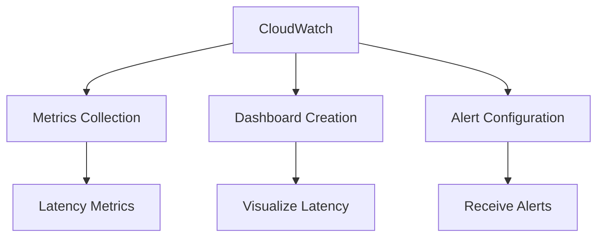

이와 같이 Latency Metrics를 모니터링하는 것은 시스템의 성능을 유지하고, 사용자 경험을 향상시키기 위해 필수적이다.

<!--
## 7. 예제
   - 7.1 Latency Metrics 계산 예제
   - 7.2 SLA 예제
   - 7.3 P90, P95, P99 예제
-->

## 7. 예제

**7.1 Latency Metrics 계산 예제**

Latency Metrics를 계산하는 것은 시스템의 성능을 평가하는 데 필수적이다. 여기서는 간단한 예제를 통해 Mean Latency, Median Latency, Max Latency를 계산해보겠다.

가상의 API 호출 응답 시간 데이터는 다음과 같다 (단위: milliseconds):

```
[100, 200, 150, 300, 250, 400, 350]
```

1. **Mean Latency**: 모든 응답 시간을 더한 후, 데이터의 개수로 나눈 값이다.
   \[
   \text{Mean Latency} = \frac{100 + 200 + 150 + 300 + 250 + 400 + 350}{7} = \frac{1750}{7} \approx 250 \text{ ms}
   \]

2. **Median Latency**: 데이터를 정렬한 후 중간값을 찾는다. 정렬된 데이터는 다음과 같다:
   ```
   [100, 150, 200, 250, 300, 350, 400]
   ```
   중간값은 250 ms이다.

3. **Max Latency**: 데이터 중 가장 큰 값을 찾는다. 여기서는 400 ms이다.

이러한 계산을 통해 Latency Metrics를 이해하고, 시스템의 성능을 평가할 수 있다.

**7.2 SLA 예제**

Service Level Agreement (SLA)는 서비스 제공자가 고객에게 약속하는 성능 기준을 정의하는 문서이다. 다음은 간단한 SLA 예제이다.

```
SLA 문서 예시:

1. 서비스 이름: API 서비스
2. 서비스 제공자: ABC Corp
3. SLA 기간: 2023년 1월 1일 ~ 2023년 12월 31일
4. 성능 기준:
   - 99%의 요청은 200ms 이내에 응답해야 한다.
   - 95%의 요청은 150ms 이내에 응답해야 한다.
5. 보상 정책:
   - SLA 미달 시, 고객에게 10%의 서비스 요금 환불
```

이와 같은 SLA 문서는 고객과 서비스 제공자 간의 신뢰를 구축하는 데 중요한 역할을 한다.

**7.3 P90, P95, P99 예제**

P90, P95, P99는 각각 90th, 95th, 99th Percentile을 의미하며, Latency Metrics에서 중요한 역할을 한다. 다음은 Latency 데이터와 함께 P90, P95, P99를 계산하는 예제이다.

가상의 API 호출 응답 시간 데이터는 다음과 같다 (단위: milliseconds):

```
[100, 150, 200, 250, 300, 350, 400, 450, 500, 550]
```

1. **P90**: 90%의 요청이 이 값 이하로 응답해야 한다. 정렬된 데이터에서 90% 위치는 9번째 값이다.
   - P90 = 500 ms

2. **P95**: 95%의 요청이 이 값 이하로 응답해야 한다. 정렬된 데이터에서 95% 위치는 10번째 값이다.
   - P95 = 550 ms

3. **P99**: 99%의 요청이 이 값 이하로 응답해야 한다. 데이터의 개수가 10개이므로, P99는 550 ms로 간주할 수 있다.

이러한 Percentile 값들은 시스템의 성능을 평가하고, 사용자 경험을 개선하는 데 중요한 지표가 된다.

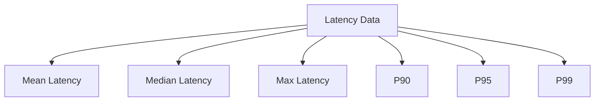

위의 다이어그램은 Latency 데이터가 다양한 Latency Metrics로 변환되는 과정을 나타낸다. 이러한 예제와 계산을 통해 Latency Metrics의 중요성을 이해하고, 실제 시스템에 적용할 수 있다.

<!--
## 8. FAQ
   - 8.1 Latency가 높은 경우의 대처 방법은?
   - 8.2 SLA를 설정할 때 고려해야 할 사항은?
   - 8.3 P90, P95, P99의 차이는 무엇인가요?
-->

## 8. FAQ

**8.1 Latency가 높은 경우의 대처 방법은?**

Latency가 높은 경우에는 여러 가지 대처 방법이 있다. 우선, 시스템의 병목 현상을 파악하는 것이 중요하다. 이를 위해 성능 모니터링 도구를 사용하여 Latency의 원인을 분석해야 한다. 예를 들어, 데이터베이스 쿼리의 성능을 개선하거나, 캐싱을 도입하여 자주 요청되는 데이터를 미리 저장해두는 방법이 있다. 또한, 서버의 리소스를 확장하거나, 로드 밸런싱을 통해 트래픽을 분산시키는 것도 효과적이다.

다음은 Latency를 줄이기 위한 간단한 샘플 코드이다.

```python
# 캐싱을 이용한 Latency 감소 예제
cache = {}

def get_data(key):
    if key in cache:
        return cache[key]  # 캐시에서 데이터 반환
    else:
        data = fetch_from_database(key)  # 데이터베이스에서 데이터 가져오기
        cache[key] = data  # 캐시에 데이터 저장
        return data
```

**8.2 SLA를 설정할 때 고려해야 할 사항은?**

SLA(Service Level Agreement)를 설정할 때는 여러 가지 요소를 고려해야 한다. 첫째, 서비스의 가용성과 성능 목표를 명확히 정의해야 한다. 예를 들어, Latency 목표를 P90, P95, P99와 같은 Percentile로 설정할 수 있다. 둘째, SLA의 범위를 명확히 해야 하며, 어떤 서비스가 포함되는지, 어떤 조건에서 SLA가 적용되는지를 명시해야 한다. 마지막으로, SLA 위반 시의 보상 조항도 포함해야 하며, 이를 통해 고객과의 신뢰를 구축할 수 있다.

**8.3 P90, P95, P99의 차이는 무엇인가요?**

P90, P95, P99는 Latency를 측정하는 Percentile 값으로, 각각 90%, 95%, 99%의 요청이 해당 Latency 이하로 처리된다는 것을 의미한다. 

- **P90**: 전체 요청 중 90%가 이 Latency 이하로 처리됨을 나타낸다. 이는 일반적인 사용자 경험을 반영하는 데 유용하다.
- **P95**: 95%의 요청이 이 Latency 이하로 처리되며, 더 엄격한 기준을 제공한다. 이는 성능 개선의 필요성을 강조하는 데 도움이 된다.
- **P99**: 99%의 요청이 이 Latency 이하로 처리되며, 극단적인 경우를 고려한 지표이다. 이는 시스템의 최악의 성능을 이해하는 데 중요하다.

다음은 P90, P95, P99의 차이를 시각적으로 나타낸 다이어그램이다.

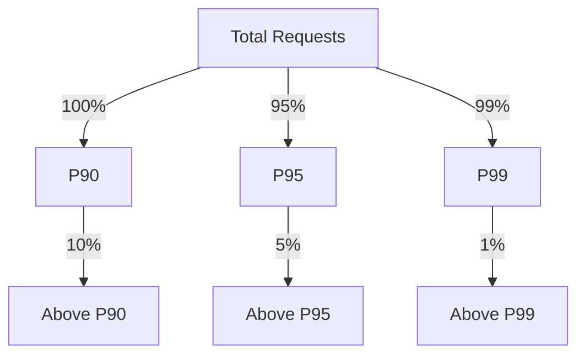

이와 같이 P90, P95, P99는 Latency를 이해하고 관리하는 데 중요한 역할을 하며, 각 Percentile의 차이를 이해하는 것은 성능 최적화에 필수적이다.

<!--
## 9. 관련 기술
   - 9.1 API 성능 최적화 기술
   - 9.2 모니터링 및 로깅 도구
   - 9.3 클라우드 서비스와 Latency Metrics
-->

## 9. 관련 기술

**API 성능 최적화 기술**  

API의 성능을 최적화하는 것은 Latency Metrics를 개선하는 데 중요한 역할을 한다. 성능 최적화를 위해 다음과 같은 기술을 사용할 수 있다.

1. **Caching**: 데이터베이스 쿼리 결과나 API 응답을 캐싱하여 반복적인 요청에 대한 Latency를 줄일 수 있다. Redis와 같은 인메모리 데이터 저장소를 활용하면 빠른 응답 속도를 제공할 수 있다.

2. **Load Balancing**: 여러 서버에 요청을 분산시켜 서버의 부하를 줄이고, Latency를 최소화할 수 있다. Nginx나 HAProxy와 같은 로드 밸런서를 사용하여 트래픽을 효율적으로 관리할 수 있다.

3. **Asynchronous Processing**: 비동기 처리를 통해 요청을 빠르게 처리하고, Latency를 줄일 수 있다. 예를 들어, RabbitMQ와 같은 메시지 큐를 사용하여 백그라운드에서 작업을 처리할 수 있다.

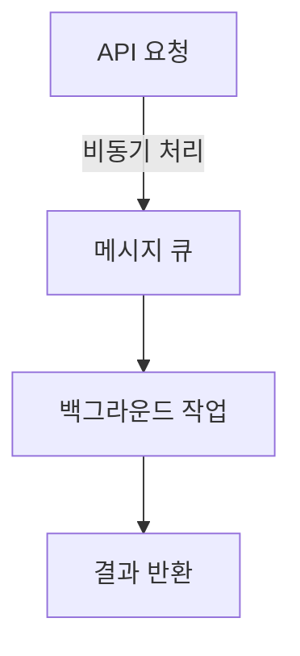

**모니터링 및 로깅 도구**  

효과적인 Latency Metrics 모니터링을 위해 다양한 도구를 사용할 수 있다. 다음은 대표적인 도구들이다.

1. **Prometheus**: 시계열 데이터베이스로, Latency Metrics를 수집하고 쿼리할 수 있는 강력한 도구이다. PromQL을 사용하여 다양한 지표를 분석할 수 있다.

2. **Grafana**: Prometheus와 함께 사용하여 시각화 대시보드를 생성할 수 있다. Latency Metrics를 실시간으로 모니터링하고, 알림을 설정할 수 있다.

3. **ELK Stack (Elasticsearch, Logstash, Kibana)**: 로그 데이터를 수집하고 분석하여 Latency 문제를 진단할 수 있다. Kibana를 통해 시각화된 데이터를 제공받을 수 있다.

**클라우드 서비스와 Latency Metrics**  

클라우드 서비스는 Latency Metrics를 관리하는 데 유용한 기능을 제공한다. 주요 클라우드 서비스 제공업체에서 제공하는 Latency 관련 기능은 다음과 같다.

1. **AWS CloudWatch**: AWS에서 제공하는 모니터링 서비스로, EC2 인스턴스나 RDS 데이터베이스의 Latency Metrics를 수집하고 시각화할 수 있다.

2. **Google Cloud Monitoring**: Google Cloud Platform에서 제공하는 모니터링 도구로, 다양한 서비스의 Latency Metrics를 수집하고 분석할 수 있다.

3. **Azure Monitor**: Microsoft Azure에서 제공하는 모니터링 서비스로, Azure 리소스의 Latency Metrics를 실시간으로 모니터링할 수 있다.

이러한 도구와 기술을 활용하여 Latency Metrics를 효과적으로 관리하고, 성능을 최적화할 수 있다.

<!--
## 10. 결론
   - Latency Metrics의 중요성 요약
   - 성능 최적화를 위한 지속적인 모니터링 필요성
-->

## 10. 결론

**Latency Metrics의 중요성 요약**  

Latency Metrics는 시스템의 성능을 평가하는 데 있어 필수적인 요소이다. 사용자 경험에 직접적인 영향을 미치기 때문에, Latency를 측정하고 분석하는 것은 서비스의 품질을 보장하는 데 중요한 역할을 한다. 특히, P90, P95, P99와 같은 Percentile Latency는 시스템의 성능을 보다 세밀하게 이해할 수 있도록 도와준다. 이러한 지표들은 서비스의 응답 속도를 평가하고, 사용자에게 제공되는 경험을 개선하는 데 기여한다.

**성능 최적화를 위한 지속적인 모니터링 필요성**  

성능 최적화를 위해서는 Latency Metrics를 지속적으로 모니터링하는 것이 필수적이다. 시스템의 변화나 트래픽 패턴에 따라 Latency가 변동할 수 있기 때문에, 이를 실시간으로 감지하고 대응하는 것이 중요하다. 모니터링 도구를 활용하여 Latency를 추적하고, 이상 징후를 조기에 발견함으로써 서비스의 안정성을 높일 수 있다.

다음은 Latency Metrics 모니터링을 위한 간단한 다이어그램이다.

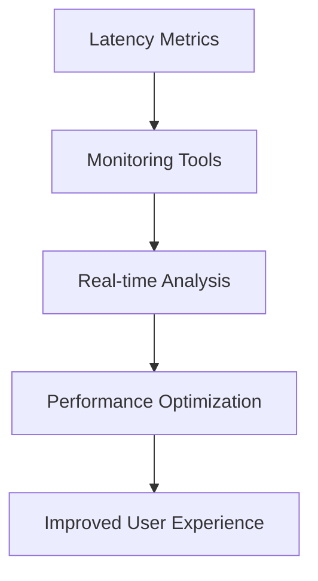

이와 같은 지속적인 모니터링과 분석을 통해, Latency Metrics는 서비스의 품질을 높이고, 사용자 만족도를 극대화하는 데 기여할 수 있다. 따라서, Latency Metrics의 중요성을 인식하고 이를 적극적으로 활용하는 것이 필요하다.

<!--
## 11. 참고 자료
   - 11.1 관련 블로그 및 문서
   - 11.2 추가 학습 자료 및 링크
-->

## 11. 참고 자료

**11.1 관련 블로그 및 문서**  

Latency Metrics와 관련된 다양한 블로그와 문서를 통해 더 깊이 있는 이해를 도울 수 있다. 다음은 추천하는 자료들이다.

- **"Understanding Latency Metrics"**: 이 블로그 포스트에서는 Latency Metrics의 기본 개념과 중요성에 대해 설명하고 있다. 특히 P90, P95, P99의 차이를 명확히 이해할 수 있도록 돕는다.
- **"Service Level Agreements in Cloud Computing"**: SLA의 정의와 중요성을 다룬 문서로, Latency Metrics와의 관계를 설명하고 있다. 클라우드 환경에서 SLA를 설정하는 방법에 대한 유용한 팁도 포함되어 있다.
- **"Monitoring Latency with Prometheus"**: Prometheus를 사용하여 Latency Metrics를 모니터링하는 방법에 대한 실용적인 가이드를 제공한다. PromQL을 활용한 쿼리 예제도 포함되어 있어 실무에 바로 적용할 수 있다.

**11.2 추가 학습 자료 및 링크** 

Latency Metrics에 대한 이해를 더욱 심화시키기 위해 다음의 자료를 참고할 수 있다.

- **Coursera의 "Performance Optimization in Cloud Applications"**: 이 온라인 강의는 클라우드 애플리케이션의 성능 최적화에 대한 포괄적인 내용을 다룬다. Latency Metrics와 관련된 다양한 기법을 배울 수 있다.
- **YouTube 채널 "Tech Talks"**: 이 채널에서는 Latency Metrics와 관련된 다양한 주제를 다루는 강연과 세미나를 제공한다. 실무에서의 적용 사례를 통해 이해도를 높일 수 있다.
- **GitHub Repository "Latency-Metrics-Examples"**: Latency Metrics 계산 및 모니터링을 위한 샘플 코드와 예제를 제공하는 GitHub 리포지토리이다. 다양한 프로그래밍 언어로 작성된 코드가 포함되어 있어 실습에 유용하다.

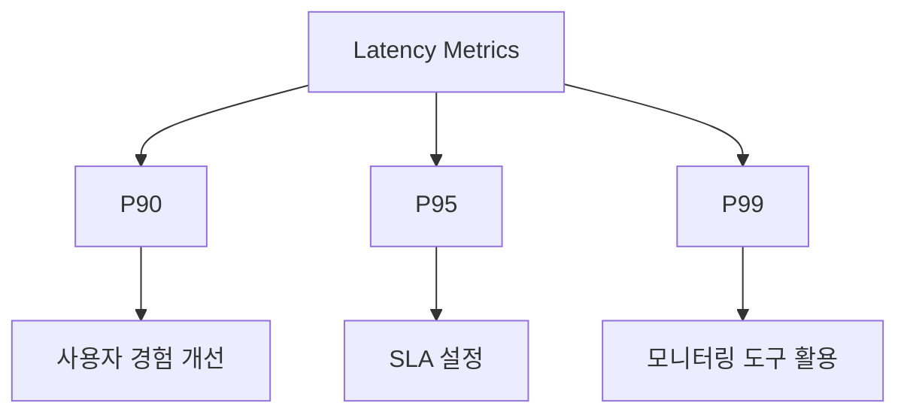

위의 다이어그램은 Latency Metrics의 주요 요소들과 그들이 사용자 경험 및 SLA 설정에 미치는 영향을 시각적으로 나타낸 것이다. 이러한 자료들을 통해 Latency Metrics에 대한 이해를 더욱 깊이 있게 할 수 있다.

<!--
##### Reference #####
-->

## Reference


* [https://medium.com/javarevisited/mastering-latency-metrics-p90-p95-p99-d5427faea879](https://medium.com/javarevisited/mastering-latency-metrics-p90-p95-p99-d5427faea879)
* [https://yonghyuc.wordpress.com/2020/10/09/p90-p95-p99-%EB%B0%B1%EB%B6%84%EC%9C%84%EC%88%98/](https://yonghyuc.wordpress.com/2020/10/09/p90-p95-p99-%EB%B0%B1%EB%B6%84%EC%9C%84%EC%88%98/)
* [https://docs.aws.amazon.com/ko_kr/elasticbeanstalk/latest/dg/health-enhanced-metrics.html](https://docs.aws.amazon.com/ko_kr/elasticbeanstalk/latest/dg/health-enhanced-metrics.html)
* [https://medium.com/@yohoso/understanding-p90-p95-and-p99-dd4d7424ec0d](https://medium.com/@yohoso/understanding-p90-p95-and-p99-dd4d7424ec0d)
* [https://gipyeonglee.tistory.com/307](https://gipyeonglee.tistory.com/307)

