REST API와 GraphQL은 현대 애플리케이션에서 데이터를 교환하기 위해 널리 사용되는 두 가지 주요 기술이다. REST는 HTTP 메서드(GET, POST 등)를 사용하여 클라이언트와 서버 간의 데이터 교환을 가능하게 하는 아키텍처 스타일이다. 반면, GraphQL은 클라이언트가 필요한 데이터를 정확히 요청할 수 있도록 설계된 API 쿼리 언어이다. REST는 각 리소스에 대해 고정된 데이터 세트를 반환하는 반면, GraphQL은 클라이언트가 원하는 데이터만 요청할 수 있어 오버패칭(over-fetching) 문제를 해결한다. REST API는 여러 엔드포인트를 통해 데이터를 가져오는 반면, GraphQL은 단일 엔드포인트를 통해 모든 요청을 처리할 수 있다. 이러한 차이점은 개발자에게 더 많은 유연성과 효율성을 제공하며, 특히 복잡한 데이터 요구 사항이 있는 애플리케이션에서 유리하다. REST는 간단한 데이터 구조와 유사한 클라이언트 요구 사항이 있는 경우에 적합하며, GraphQL은 다양한 데이터 소스를 통합하거나 클라이언트 요청이 크게 변동하는 경우에 더 나은 선택이 될 수 있다. 이처럼 두 기술은 각각의 장단점이 있으며, 특정 상황에 따라 적절히 선택하여 사용할 수 있다.


||
|:---:|
||


<!--
##### Outline #####
-->

<!--
# 목차

## 개요
   - REST와 GraphQL의 정의
   - REST와 GraphQL의 역사적 배경
   - API의 중요성

## REST API
   - 2.1 REST의 개념
   - 2.2 REST의 작동 방식
   - 2.3 REST의 장점
       - 사용 용이성
       - 언어 독립성
       - 강력한 커뮤니티와 도구
       - 일관된 인터페이스
   - 2.4 REST의 단점
       - 과다 수집(over-fetching) 및 부족 수집(under-fetching)
       - 버전 관리의 복잡성
       - 실시간 데이터 업데이트의 어려움

## GraphQL
   - 3.1 GraphQL의 개념
   - 3.2 GraphQL의 작동 방식
   - 3.3 GraphQL의 장점
       - 단일 엔드포인트
       - 유연한 데이터 검색
       - 강력한 타입 시스템
       - 실시간 업데이트 지원
   - 3.4 GraphQL의 단점
       - 학습 곡선
       - 캐싱의 복잡성

## REST와 GraphQL의 유사점
   - 4.1 공통 아키텍처 원칙
   - 4.2 HTTP를 통한 데이터 전송
   - 4.3 데이터 형식의 표준화
   - 4.4 미들웨어 및 확장성

## REST와 GraphQL의 차이점
   - 5.1 데이터 검색 방식
   - 5.2 버전 관리
   - 5.3 오류 처리
   - 5.4 실시간 데이터 처리
   - 5.5 도구 및 환경
   - 5.6 캐싱 메커니즘

## 언제 REST를 사용하고 언제 GraphQL을 사용해야 할까?
   - 6.1 REST 사용 사례
       - 간단한 데이터 요구 사항
       - 작은 애플리케이션
   - 6.2 GraphQL 사용 사례
       - 복잡한 데이터 요구 사항
       - 다양한 클라이언트 요청
   - 6.3 REST와 GraphQL의 혼합 사용

## 예제
   - 7.1 REST API 예제
   - 7.2 GraphQL API 예제
   - 7.3 REST와 GraphQL의 비교 예제

## FAQ
   - 8.1 REST와 GraphQL의 선택 기준은 무엇인가요?
   - 8.2 GraphQL의 성능은 REST보다 항상 우수한가요?
   - 8.3 REST API의 버전 관리는 어떻게 해야 하나요?
   - 8.4 GraphQL의 실시간 데이터 업데이트는 어떻게 구현하나요?

## 관련 기술
   - 9.1 OpenAPI
   - 9.2 gRPC
   - 9.3 WebSocket
   - 9.4 Microservices Architecture

## 결론
   - REST와 GraphQL의 요약
   - 각 기술의 미래 전망
   - 최적의 API 설계를 위한 권장 사항
-->

<!--
## 개요
   - REST와 GraphQL의 정의
   - REST와 GraphQL의 역사적 배경
   - API의 중요성
-->

## 개요

**REST와 GraphQL의 정의**  

REST(Representational State Transfer)는 웹 아키텍처 스타일 중 하나로, 클라이언트와 서버 간의 상호작용을 정의하는 원칙과 제약 조건을 포함한다. REST는 HTTP 프로토콜을 기반으로 하며, 자원(Resource)을 URI(Uniform Resource Identifier)로 식별하고, HTTP 메서드(GET, POST, PUT, DELETE 등)를 사용하여 자원에 대한 작업을 수행한다.

GraphQL은 페이스북에서 개발한 쿼리 언어로, API를 위한 런타임을 제공한다. GraphQL은 클라이언트가 필요한 데이터의 구조를 명시적으로 요청할 수 있도록 하여, 서버가 클라이언트의 요구에 맞는 데이터를 반환할 수 있게 한다. 이를 통해 클라이언트는 필요한 데이터만을 요청할 수 있으며, 과다 수집(over-fetching) 및 부족 수집(under-fetching) 문제를 해결할 수 있다.

**REST와 GraphQL의 역사적 배경** 

REST는 2000년대 초반 로이 필딩(Roy Fielding)의 박사 논문에서 처음 소개되었다. 이후 REST는 웹 서비스 설계의 표준으로 자리 잡았으며, 많은 기업과 개발자들이 RESTful API를 채택하게 되었다. REST는 단순하고 직관적인 설계 덕분에 빠르게 확산되었다.

GraphQL은 2012년 페이스북에서 내부적으로 사용하기 위해 개발되었으며, 2015년 오픈 소스로 공개되었다. GraphQL은 REST의 한계를 극복하기 위해 설계되었으며, 특히 모바일 애플리케이션과 같은 다양한 클라이언트 환경에서의 데이터 요구 사항을 충족하기 위해 발전하였다.

**API의 중요성**

API(Application Programming Interface)는 소프트웨어 간의 상호작용을 가능하게 하는 인터페이스이다. API는 서로 다른 시스템이 데이터를 주고받고, 기능을 호출할 수 있도록 하여, 소프트웨어의 모듈화와 재사용성을 높인다. 현대의 애플리케이션은 다양한 API를 통해 서로 연결되어 있으며, 이는 클라우드 서비스, 모바일 애플리케이션, IoT(Internet of Things) 등 다양한 분야에서 필수적이다.

API는 개발자에게는 효율적인 개발 환경을 제공하고, 사용자에게는 다양한 서비스와 기능을 통합하여 더 나은 경험을 제공한다. 따라서 API의 설계와 구현은 소프트웨어 개발에서 매우 중요한 요소로 자리 잡고 있다.

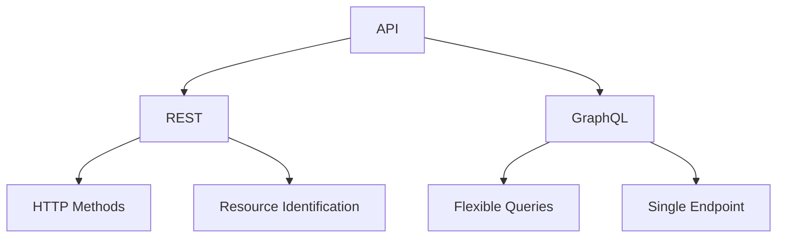

위의 다이어그램은 API의 두 가지 주요 유형인 REST와 GraphQL을 보여준다. REST는 HTTP 메서드와 자원 식별을 통해 작동하며, GraphQL은 유연한 쿼리와 단일 엔드포인트를 통해 클라이언트의 요구를 충족한다.

<!--
## REST API
   - 2.1 REST의 개념
   - 2.2 REST의 작동 방식
   - 2.3 REST의 장점
       - 사용 용이성
       - 언어 독립성
       - 강력한 커뮤니티와 도구
       - 일관된 인터페이스
   - 2.4 REST의 단점
       - 과다 수집(over-fetching) 및 부족 수집(under-fetching)
       - 버전 관리의 복잡성
       - 실시간 데이터 업데이트의 어려움
-->

## REST API

**REST의 개념**  

REST(Representational State Transfer)는 웹 기반의 아키텍처 스타일로, 클라이언트와 서버 간의 상호작용을 정의하는 원칙이다. REST는 HTTP 프로토콜을 기반으로 하며, 자원(Resource)을 URI(Uniform Resource Identifier)로 식별하고, HTTP 메서드(GET, POST, PUT, DELETE 등)를 사용하여 자원에 대한 CRUD(Create, Read, Update, Delete) 작업을 수행한다. REST는 상태 비저장(stateless) 방식으로, 각 요청은 독립적이며 서버는 클라이언트의 상태를 저장하지 않는다.

**REST의 작동 방식**  

REST API는 클라이언트가 서버에 요청을 보내고, 서버가 클라이언트에게 응답을 반환하는 방식으로 작동한다. 클라이언트는 특정 URI에 HTTP 요청을 보내고, 서버는 해당 요청에 대한 자원의 상태를 반환한다. 이 과정에서 클라이언트와 서버 간의 데이터 전송은 JSON(JavaScript Object Notation) 또는 XML(eXtensible Markup Language) 형식으로 이루어진다.

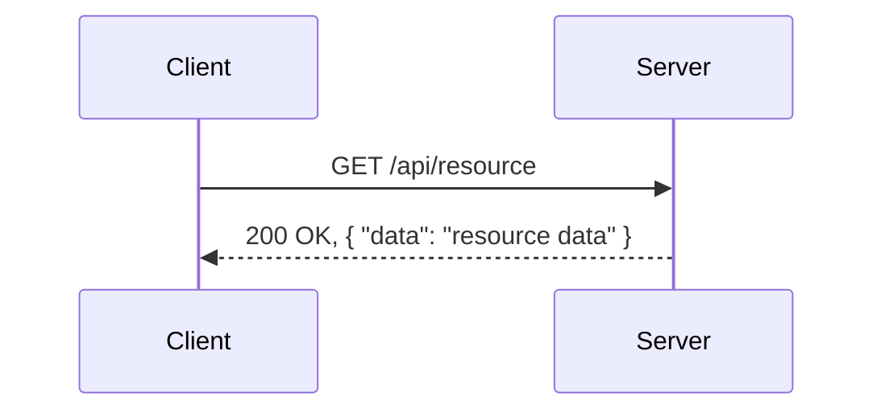

**REST의 장점** 

- **사용 용이성**: REST API는 HTTP 프로토콜을 기반으로 하므로, 웹 개발자들이 쉽게 이해하고 사용할 수 있다.
- **언어 독립성**: REST는 다양한 프로그래밍 언어에서 구현할 수 있으며, 클라이언트와 서버 간의 통신은 표준화된 HTTP를 사용하므로 언어에 구애받지 않는다.
- **강력한 커뮤니티와 도구**: REST는 널리 사용되는 아키텍처 스타일로, 다양한 라이브러리와 도구가 존재하여 개발자들이 쉽게 사용할 수 있다.
- **일관된 인터페이스**: REST는 자원에 대한 일관된 접근 방식을 제공하여, API 사용자가 쉽게 이해하고 사용할 수 있도록 돕는다.

**REST의 단점**  

- **과다 수집(over-fetching) 및 부족 수집(under-fetching)**: REST API는 클라이언트가 필요한 데이터보다 더 많은 데이터를 반환하거나, 필요한 데이터를 모두 반환하지 못하는 경우가 발생할 수 있다. 이는 클라이언트의 데이터 요구 사항에 맞지 않는 응답을 초래할 수 있다.
- **버전 관리의 복잡성**: REST API의 버전 관리는 복잡할 수 있으며, 새로운 기능이나 변경 사항을 도입할 때 기존 API와의 호환성을 유지하는 것이 어려울 수 있다.
- **실시간 데이터 업데이트의 어려움**: REST는 상태 비저장 방식이기 때문에, 클라이언트가 실시간으로 데이터를 업데이트하거나 변경 사항을 수신하는 데 어려움이 있다. 이를 해결하기 위해서는 추가적인 기술이 필요하다.

<!--
## GraphQL
   - 3.1 GraphQL의 개념
   - 3.2 GraphQL의 작동 방식
   - 3.3 GraphQL의 장점
       - 단일 엔드포인트
       - 유연한 데이터 검색
       - 강력한 타입 시스템
       - 실시간 업데이트 지원
   - 3.4 GraphQL의 단점
       - 학습 곡선
       - 캐싱의 복잡성
-->

## GraphQL

**GraphQL의 개념** 

GraphQL은 Facebook에서 개발한 쿼리 언어로, API를 위한 런타임이다. 클라이언트가 필요한 데이터를 명시적으로 요청할 수 있도록 설계되어 있으며, REST API와는 달리 여러 리소스를 단일 요청으로 가져올 수 있는 장점이 있다. GraphQL은 클라이언트가 원하는 데이터 구조를 정의할 수 있게 해주어, 과다 수집(over-fetching) 및 부족 수집(under-fetching) 문제를 해결하는 데 도움을 준다.

**GraphQL의 작동 방식** 

GraphQL은 클라이언트가 쿼리를 통해 서버에 요청을 보내고, 서버는 요청된 데이터만을 반환하는 방식으로 작동한다. 클라이언트는 GraphQL 스키마를 기반으로 쿼리를 작성하며, 이 스키마는 데이터의 구조와 타입을 정의한다. 다음은 GraphQL 쿼리의 예시이다.

```graphql
{
  user(id: "1") {
    name
    email
    posts {
      title
      content
    }
  }
}
```

위의 쿼리는 특정 사용자에 대한 이름, 이메일, 그리고 해당 사용자가 작성한 게시물의 제목과 내용을 요청하는 구조이다. 서버는 이 요청에 대한 응답으로 다음과 같은 JSON 형식의 데이터를 반환한다.

```json
{
  "data": {
    "user": {
      "name": "John Doe",
      "email": "john@example.com",
      "posts": [
        {
          "title": "First Post",
          "content": "This is my first post."
        }
      ]
    }
  }
}
```

**GraphQL의 장점**  

- **단일 엔드포인트**: GraphQL은 모든 요청을 단일 엔드포인트로 처리할 수 있어, REST API에서 발생할 수 있는 여러 엔드포인트 관리의 복잡성을 줄여준다.
- **유연한 데이터 검색**: 클라이언트는 필요한 데이터만 요청할 수 있어, 불필요한 데이터 전송을 줄일 수 있다.
- **강력한 타입 시스템**: GraphQL은 스키마를 통해 데이터의 타입을 명확히 정의하므로, 클라이언트와 서버 간의 계약을 강화한다.
- **실시간 업데이트 지원**: GraphQL은 Subscription을 통해 실시간 데이터 업데이트를 지원하여, 클라이언트가 데이터 변경 사항을 즉시 반영할 수 있도록 한다.

**GraphQL의 단점**  
- **학습 곡선**: GraphQL은 REST API에 비해 상대적으로 복잡한 개념이 많아, 새로운 사용자에게는 학습 곡선이 존재한다.
- **캐싱의 복잡성**: REST API는 HTTP 캐싱을 쉽게 활용할 수 있지만, GraphQL은 쿼리의 유연성 때문에 캐싱 전략이 복잡해질 수 있다. 각 쿼리가 다르게 구성될 수 있어, 동일한 요청에 대한 캐시를 관리하기 어려운 경우가 많다.

다음은 GraphQL의 작동 방식을 시각적으로 나타낸 다이어그램이다.

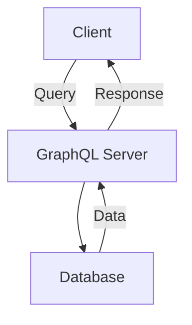

위의 다이어그램은 클라이언트가 GraphQL 서버에 쿼리를 보내고, 서버가 데이터베이스에서 필요한 데이터를 조회하여 클라이언트에 응답하는 과정을 보여준다. GraphQL은 이러한 방식으로 클라이언트와 서버 간의 효율적인 데이터 통신을 가능하게 한다.

<!--
## REST와 GraphQL의 유사점
   - 4.1 공통 아키텍처 원칙
   - 4.2 HTTP를 통한 데이터 전송
   - 4.3 데이터 형식의 표준화
   - 4.4 미들웨어 및 확장성
-->

## REST와 GraphQL의 유사점

REST와 GraphQL은 현대 웹 애플리케이션에서 데이터 전송 및 상호작용을 위한 두 가지 주요 기술이다. 이 두 기술은 여러 면에서 유사점을 가지고 있으며, 이를 통해 개발자들은 다양한 요구 사항에 맞춰 적절한 선택을 할 수 있다.

**4.1 공통 아키텍처 원칙** 

REST와 GraphQL 모두 클라이언트-서버 아키텍처를 기반으로 하고 있다. 이 아키텍처는 클라이언트와 서버 간의 명확한 분리를 통해 독립적인 개발과 배포를 가능하게 한다. 또한, 두 기술 모두 상태 비저장(stateless) 원칙을 따르며, 각 요청은 독립적으로 처리된다. 이러한 원칙은 시스템의 확장성과 유지보수성을 높이는 데 기여한다.

**4.2 HTTP를 통한 데이터 전송** 

REST와 GraphQL 모두 HTTP 프로토콜을 사용하여 데이터를 전송한다. REST는 HTTP 메서드(GET, POST, PUT, DELETE 등)를 활용하여 리소스에 대한 CRUD(Create, Read, Update, Delete) 작업을 수행한다. 반면, GraphQL은 단일 엔드포인트를 통해 다양한 쿼리와 변형(mutation)을 처리한다. 이로 인해 두 기술 모두 웹 기반 애플리케이션에서 데이터 전송을 위한 표준화된 방법을 제공한다.

**4.3 데이터 형식의 표준화**

REST와 GraphQL은 JSON(JavaScript Object Notation) 형식을 데이터 전송의 기본으로 사용한다. JSON은 가볍고 읽기 쉬운 데이터 형식으로, 클라이언트와 서버 간의 데이터 교환을 용이하게 한다. 이러한 표준화는 개발자들이 API를 이해하고 사용할 때 일관성을 제공하며, 다양한 플랫폼 간의 호환성을 높인다.

**4.4 미들웨어 및 확장성**  

REST와 GraphQL 모두 미들웨어를 통해 기능을 확장할 수 있다. 미들웨어는 요청과 응답 사이에서 추가적인 처리를 수행할 수 있는 구성 요소로, 인증, 로깅, 데이터 변환 등의 기능을 수행할 수 있다. 이러한 확장성은 두 기술 모두에서 중요한 요소로, 개발자들이 필요에 따라 시스템을 유연하게 조정할 수 있도록 돕는다.

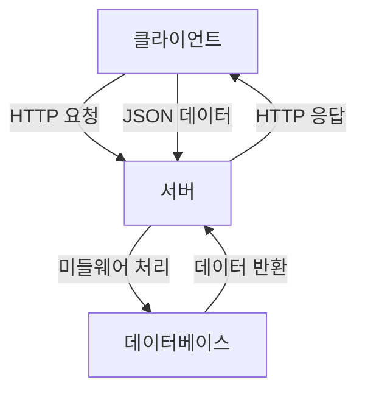

위의 다이어그램은 클라이언트와 서버 간의 데이터 전송 흐름을 나타낸다. 클라이언트는 HTTP 요청을 통해 서버에 접근하고, 서버는 미들웨어를 통해 요청을 처리한 후 JSON 형식으로 응답을 반환한다. 이러한 구조는 REST와 GraphQL 모두에서 유사하게 나타난다.

<!--
## REST와 GraphQL의 차이점
   - 5.1 데이터 검색 방식
   - 5.2 버전 관리
   - 5.3 오류 처리
   - 5.4 실시간 데이터 처리
   - 5.5 도구 및 환경
   - 5.6 캐싱 메커니즘
-->

## REST와 GraphQL의 차이점

REST와 GraphQL은 API 설계에서 널리 사용되는 두 가지 접근 방식이다. 이 두 기술은 여러 면에서 다르며, 각기 다른 장단점을 가지고 있다. 이번 섹션에서는 REST와 GraphQL의 주요 차이점을 살펴보겠다.

**5.1 데이터 검색 방식** 

REST는 리소스 기반의 아키텍처로, 각 리소스는 고유한 URL을 통해 접근된다. 클라이언트는 필요한 데이터를 얻기 위해 여러 개의 엔드포인트에 요청을 보내야 한다. 반면, GraphQL은 단일 엔드포인트를 통해 클라이언트가 원하는 데이터를 명시적으로 요청할 수 있다. 클라이언트는 필요한 필드만 선택하여 요청할 수 있으므로, 과다 수집(over-fetching)과 부족 수집(under-fetching) 문제를 해결할 수 있다.

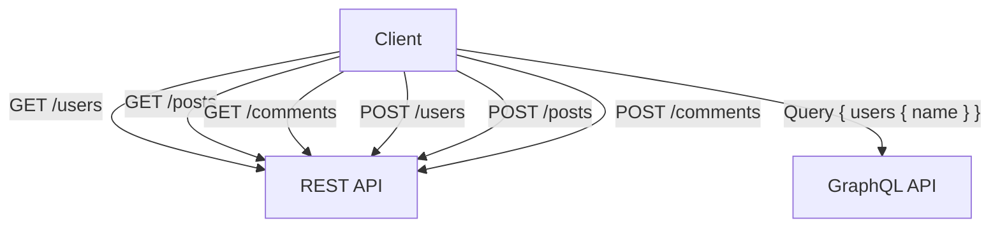

**5.2 버전 관리**  

REST API는 버전 관리를 위해 URL에 버전 번호를 포함하는 방식이 일반적이다. 예를 들어, `/api/v1/users`와 같은 형태로 버전을 명시할 수 있다. 그러나 GraphQL은 스키마를 통해 버전 관리를 수행하며, 클라이언트는 필요한 필드를 요청하여 스키마의 변경에 유연하게 대응할 수 있다. 이로 인해 GraphQL은 버전 관리가 상대적으로 간편하다.

**5.3 오류 처리**  

REST API는 HTTP 상태 코드를 통해 오류를 처리한다. 예를 들어, 404 Not Found, 500 Internal Server Error와 같은 상태 코드를 사용하여 클라이언트에게 오류 정보를 전달한다. 반면, GraphQL은 응답 본문에 오류 정보를 포함하여 클라이언트에게 전달한다. 이로 인해 클라이언트는 오류와 함께 유효한 데이터를 받을 수 있는 장점이 있다.

**5.4 실시간 데이터 처리**
 
REST는 일반적으로 요청-응답 모델을 따르기 때문에 실시간 데이터 업데이트를 처리하기 어렵다. 반면, GraphQL은 Subscription 기능을 통해 실시간 데이터 업데이트를 지원한다. 클라이언트는 특정 이벤트에 대한 구독을 설정하고, 해당 이벤트가 발생할 때마다 서버로부터 실시간으로 데이터를 받을 수 있다.

**5.5 도구 및 환경**  

REST API는 다양한 도구와 라이브러리가 존재하여, API 문서화 및 테스트가 용이하다. Swagger와 Postman이 그 예이다. GraphQL도 Apollo Client와 GraphiQL과 같은 도구를 제공하여, API 문서화 및 쿼리 테스트를 지원한다. 그러나 GraphQL은 상대적으로 새로운 기술이기 때문에, REST에 비해 도구의 생태계가 덜 발달되어 있을 수 있다.

**5.6 캐싱 메커니즘** 

REST API는 HTTP 캐싱 메커니즘을 활용하여 클라이언트의 요청을 최적화할 수 있다. HTTP 헤더를 통해 캐시 제어를 설정할 수 있으며, 이를 통해 서버의 부하를 줄일 수 있다. 반면, GraphQL은 쿼리의 유연성 때문에 캐싱이 복잡할 수 있다. 클라이언트가 요청하는 데이터의 형태가 다양하기 때문에, 캐시를 효율적으로 관리하기 위해 추가적인 전략이 필요하다.

이와 같이 REST와 GraphQL은 데이터 검색 방식, 버전 관리, 오류 처리, 실시간 데이터 처리, 도구 및 환경, 캐싱 메커니즘 등 여러 면에서 차이를 보인다. 각 기술의 특성을 이해하고, 상황에 맞는 적절한 선택을 하는 것이 중요하다.

<!--
## 언제 REST를 사용하고 언제 GraphQL을 사용해야 할까?
   - 6.1 REST 사용 사례
       - 간단한 데이터 요구 사항
       - 작은 애플리케이션
   - 6.2 GraphQL 사용 사례
       - 복잡한 데이터 요구 사항
       - 다양한 클라이언트 요청
   - 6.3 REST와 GraphQL의 혼합 사용
-->

## 언제 REST를 사용하고 언제 GraphQL을 사용해야 할까?

API를 설계할 때 REST와 GraphQL 중 어떤 기술을 선택할지는 애플리케이션의 요구 사항에 따라 달라진다. 이 섹션에서는 REST와 GraphQL의 사용 사례를 살펴보고, 각각의 장점과 적합한 상황을 설명하겠다.

**6.1 REST 사용 사례**

REST는 간단한 데이터 요구 사항을 가진 애플리케이션에 적합하다. 다음은 REST를 사용하는 몇 가지 사례이다.

- **간단한 데이터 요구 사항**: REST는 CRUD(Create, Read, Update, Delete) 작업을 수행하는 데 매우 효율적이다. 예를 들어, 블로그 애플리케이션에서 게시글을 생성하고, 조회하고, 수정하고, 삭제하는 기능을 구현할 때 REST API를 사용하는 것이 적합하다.

- **작은 애플리케이션**: 작은 규모의 애플리케이션에서는 REST API가 간단하고 직관적이기 때문에 개발과 유지보수가 용이하다. 예를 들어, 개인 프로젝트나 프로토타입을 만들 때 REST를 선택하는 것이 좋다.

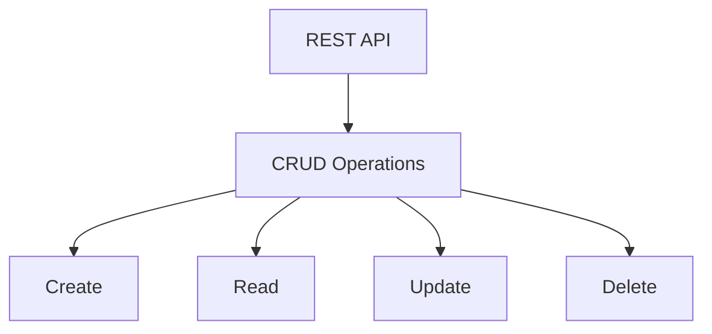

**6.2 GraphQL 사용 사례**

GraphQL은 복잡한 데이터 요구 사항을 가진 애플리케이션에 적합하다. 다음은 GraphQL을 사용하는 몇 가지 사례이다.

- **복잡한 데이터 요구 사항**: 여러 개의 관련된 데이터 엔티티를 동시에 요청해야 하는 경우 GraphQL이 유리하다. 예를 들어, 소셜 미디어 애플리케이션에서 사용자 프로필, 친구 목록, 게시물 등을 한 번의 요청으로 가져올 수 있다.

- **다양한 클라이언트 요청**: 다양한 클라이언트(웹, 모바일 등)에서 서로 다른 데이터 요구 사항을 가질 때 GraphQL을 사용하면 각 클라이언트가 필요한 데이터만 요청할 수 있다. 이는 네트워크 트래픽을 줄이고 성능을 향상시킨다.

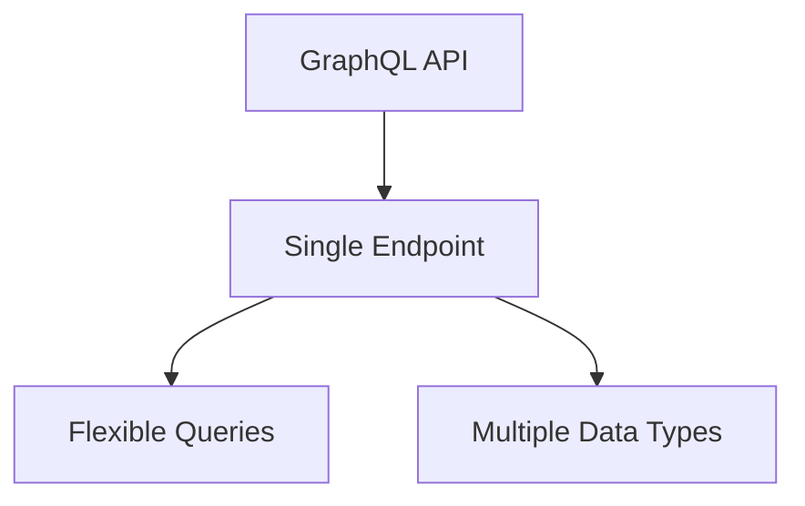

**6.3 REST와 GraphQL의 혼합 사용**

REST와 GraphQL은 서로 보완적인 기술이므로, 특정 상황에서는 두 가지를 혼합하여 사용할 수 있다. 예를 들어, 애플리케이션의 일부 기능은 REST API로 구현하고, 데이터 요구 사항이 복잡한 부분은 GraphQL로 처리하는 방식이다. 이렇게 하면 각 기술의 장점을 최대한 활용할 수 있다.

혼합 사용의 예로는, 사용자 인증 및 권한 부여는 REST API를 통해 처리하고, 사용자 데이터 및 관련 정보를 GraphQL로 요청하는 구조를 생각할 수 있다. 이러한 접근 방식은 애플리케이션의 유연성과 확장성을 높이는 데 기여한다. 

결론적으로, REST와 GraphQL의 선택은 애플리케이션의 요구 사항에 따라 달라지며, 상황에 맞는 적절한 기술을 선택하는 것이 중요하다.

<!--
## 예제
   - 7.1 REST API 예제
   - 7.2 GraphQL API 예제
   - 7.3 REST와 GraphQL의 비교 예제
-->

## 예제

**7.1 REST API 예제**

REST API는 HTTP 프로토콜을 기반으로 하여 클라이언트와 서버 간의 데이터 전송을 수행하는 방식이다. 아래는 간단한 REST API의 예제이다. 이 예제에서는 사용자의 정보를 가져오는 API를 구현한다.

**HTTP 요청 예제**
```http
GET /api/users/1 HTTP/1.1
Host: example.com
Accept: application/json
```

**HTTP 응답 예제**
```http
HTTP/1.1 200 OK
Content-Type: application/json

{
  "id": 1,
  "name": "John Doe",
  "email": "john.doe@example.com"
}
```

위의 예제에서 클라이언트는 특정 사용자의 정보를 요청하고, 서버는 해당 사용자의 정보를 JSON 형식으로 응답한다.

**7.2 GraphQL API 예제**

GraphQL은 클라이언트가 필요한 데이터만 요청할 수 있도록 설계된 쿼리 언어이다. 아래는 사용자의 정보를 가져오는 GraphQL API의 예제이다.

**GraphQL 쿼리 예제**
```graphql
query {
  user(id: 1) {
    id
    name
    email
  }
}
```

**GraphQL 응답 예제**
```json
{
  "data": {
    "user": {
      "id": 1,
      "name": "John Doe",
      "email": "john.doe@example.com"
    }
  }
}
```

위의 예제에서 클라이언트는 필요한 필드만 요청하며, 서버는 요청된 데이터만 포함된 응답을 반환한다.

**7.3 REST와 GraphQL의 비교 예제**

REST와 GraphQL의 차이를 이해하기 위해 동일한 데이터 요청을 두 방식으로 비교해보자. 아래는 사용자의 정보를 요청하는 REST와 GraphQL의 예제이다.

**REST API 요청**
```http
GET /api/users/1 HTTP/1.1
Host: example.com
Accept: application/json
```

**GraphQL 요청**
```graphql
query {
  user(id: 1) {
    id
    name
    email
  }
}
```

**다이어그램**
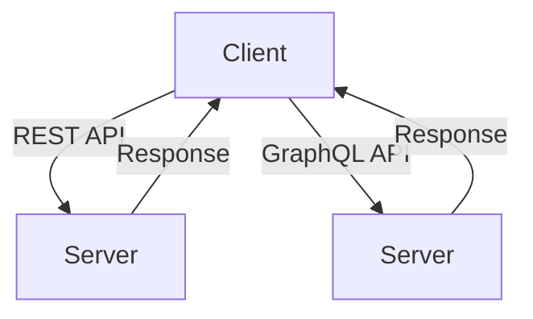

위의 다이어그램은 클라이언트가 REST API와 GraphQL API를 통해 서버와 상호작용하는 모습을 보여준다. REST API는 특정 엔드포인트에 요청을 보내고, GraphQL API는 단일 엔드포인트에 쿼리를 보내는 방식이다. 이러한 차이는 데이터 요청의 유연성과 효율성에 큰 영향을 미친다.

<!--
## FAQ
   - 8.1 REST와 GraphQL의 선택 기준은 무엇인가요?
   - 8.2 GraphQL의 성능은 REST보다 항상 우수한가요?
   - 8.3 REST API의 버전 관리는 어떻게 해야 하나요?
   - 8.4 GraphQL의 실시간 데이터 업데이트는 어떻게 구현하나요?
-->

## FAQ

**8.1 REST와 GraphQL의 선택 기준은 무엇인가요?**

REST와 GraphQL을 선택하는 기준은 여러 가지가 있다. 첫째, 데이터 요구 사항의 복잡성이다. 간단한 CRUD(Create, Read, Update, Delete) 작업이 필요한 경우 REST가 적합할 수 있다. 반면, 복잡한 데이터 구조와 다양한 클라이언트 요청이 필요한 경우 GraphQL이 더 유리하다. 둘째, 팀의 기술 스택과 경험도 고려해야 한다. REST는 오랜 역사를 가지고 있어 많은 개발자들이 익숙하지만, GraphQL은 상대적으로 새로운 기술로 학습 곡선이 존재한다. 마지막으로, 실시간 데이터 업데이트의 필요성도 중요한 요소이다. GraphQL은 실시간 업데이트를 지원하는 기능이 있어, 이와 같은 요구 사항이 있을 경우 GraphQL을 선택하는 것이 좋다.

**8.2 GraphQL의 성능은 REST보다 항상 우수한가요?**

GraphQL의 성능이 항상 REST보다 우수하다고 단정할 수는 없다. GraphQL은 클라이언트가 필요한 데이터만 요청할 수 있어 과다 수집(over-fetching) 문제를 해결할 수 있지만, 복잡한 쿼리로 인해 서버에 부하를 줄 수 있다. 반면, REST는 정해진 엔드포인트에서 데이터를 제공하므로 성능이 예측 가능하지만, 필요한 데이터가 여러 엔드포인트에 분산되어 있을 경우 과다 수집 문제가 발생할 수 있다. 따라서 성능은 사용 사례와 데이터 구조에 따라 달라질 수 있다.

**8.3 REST API의 버전 관리는 어떻게 해야 하나요?**

REST API의 버전 관리는 여러 가지 방법으로 수행할 수 있다. 가장 일반적인 방법은 URL에 버전 번호를 포함하는 것이다. 예를 들어, `/api/v1/resource`와 같이 버전 정보를 명시할 수 있다. 또 다른 방법은 HTTP 헤더를 사용하는 것이다. 클라이언트가 요청 시 특정 헤더를 통해 원하는 API 버전을 지정할 수 있다. 마지막으로, 쿼리 파라미터를 통해 버전을 관리하는 방법도 있다. 이러한 방법들은 각각 장단점이 있으므로, 팀의 요구 사항과 API의 특성에 맞춰 적절한 방법을 선택해야 한다.

**8.4 GraphQL의 실시간 데이터 업데이트는 어떻게 구현하나요?**

GraphQL에서 실시간 데이터 업데이트는 주로 Subscription을 통해 구현된다. Subscription은 클라이언트가 특정 이벤트에 대한 업데이트를 받을 수 있도록 하는 기능이다. 클라이언트는 서버에 Subscription 요청을 보내고, 서버는 해당 이벤트가 발생할 때마다 클라이언트에 데이터를 푸시한다. 아래는 간단한 Subscription 예제이다.

```graphql
subscription {
  messageAdded {
    id
    content
    user {
      id
      name
    }
  }
}
```

이 예제에서 `messageAdded`는 새로운 메시지가 추가될 때마다 클라이언트에 업데이트를 보내는 Subscription이다. 이를 통해 클라이언트는 실시간으로 데이터 변화를 감지할 수 있다.

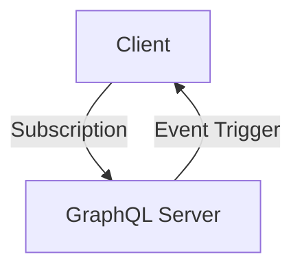

위 다이어그램은 클라이언트가 GraphQL 서버에 Subscription 요청을 보내고, 서버가 이벤트 발생 시 클라이언트에 데이터를 푸시하는 과정을 나타낸다. 이를 통해 GraphQL은 실시간 데이터 업데이트를 효과적으로 지원할 수 있다.

<!--
## 관련 기술
   - 9.1 OpenAPI
   - 9.2 gRPC
   - 9.3 WebSocket
   - 9.4 Microservices Architecture
-->

## 관련 기술

API 설계 및 구현에 있어 REST와 GraphQL 외에도 여러 관련 기술들이 존재한다. 이들 기술은 각각의 특성과 장점을 가지고 있으며, 특정 상황에서 유용하게 사용될 수 있다. 이번 섹션에서는 OpenAPI, gRPC, WebSocket, Microservices Architecture에 대해 살펴보겠다.

**OpenAPI**

OpenAPI는 RESTful API를 정의하기 위한 표준화된 사양이다. OpenAPI Specification(OAS)을 사용하면 API의 구조와 동작을 명확하게 문서화할 수 있으며, 이를 통해 개발자 간의 소통을 원활하게 할 수 있다. OpenAPI는 Swagger와 같은 도구와 함께 사용되어 API 문서화 및 테스트를 자동화할 수 있는 장점을 제공한다.

```yaml
openapi: 3.0.0
info:
  title: Sample API
  version: 1.0.0
paths:
  /users:
    get:
      summary: Retrieve a list of users
      responses:
        '200':
          description: A list of users
```

**gRPC**

gRPC는 Google에서 개발한 고성능 원격 프로시저 호출(Remote Procedure Call) 프레임워크이다. gRPC는 Protocol Buffers를 사용하여 데이터 직렬화를 수행하며, HTTP/2를 기반으로 하여 빠른 통신을 지원한다. gRPC는 다양한 언어를 지원하며, 양방향 스트리밍과 실시간 통신을 쉽게 구현할 수 있는 장점이 있다.

```protobuf
syntax = "proto3";

service UserService {
  rpc GetUser (UserRequest) returns (UserResponse);
}

message UserRequest {
  int32 id = 1;
}

message UserResponse {
  string name = 1;
  string email = 2;
}
```

**WebSocket**

WebSocket은 클라이언트와 서버 간의 양방향 통신을 가능하게 하는 프로토콜이다. HTTP 프로토콜을 통해 연결을 설정한 후, 지속적인 연결을 유지하여 실시간 데이터 전송이 가능하다. WebSocket은 채팅 애플리케이션, 실시간 알림 시스템 등에서 유용하게 사용된다.

```javascript
const socket = new WebSocket('ws://example.com/socket');

socket.onopen = function(event) {
  socket.send('Hello Server!');
};

socket.onmessage = function(event) {
  console.log('Message from server: ', event.data);
};
```

**Microservices Architecture**

Microservices Architecture는 애플리케이션을 여러 개의 독립적인 서비스로 나누어 개발하는 아키텍처 스타일이다. 각 서비스는 특정 비즈니스 기능을 수행하며, REST API 또는 gRPC와 같은 프로토콜을 통해 서로 통신한다. 이 아키텍처는 확장성과 유지보수성을 높이는 데 기여하며, 각 서비스의 독립적인 배포가 가능하다.

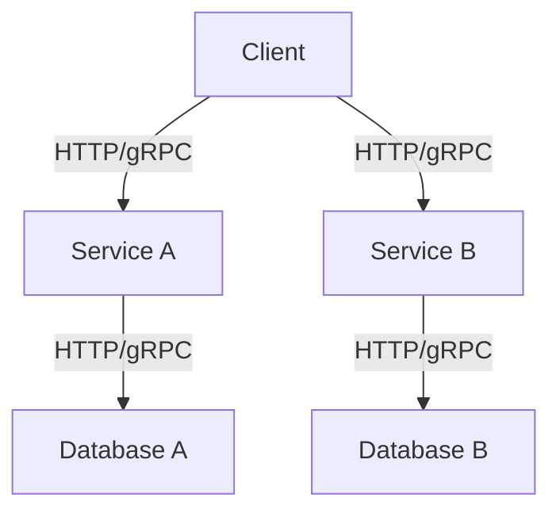

이와 같이 OpenAPI, gRPC, WebSocket, Microservices Architecture는 각각의 특성과 장점을 가지고 있으며, REST와 GraphQL과 함께 현대 소프트웨어 개발에서 중요한 역할을 하고 있다. 각 기술의 특성을 이해하고 적절히 활용하는 것이 최적의 API 설계를 위한 중요한 요소이다.

<!--
## 결론
   - REST와 GraphQL의 요약
   - 각 기술의 미래 전망
   - 최적의 API 설계를 위한 권장 사항
-->

## 결론

**REST와 GraphQL의 요약**  

REST(Representational State Transfer)와 GraphQL은 웹 API를 설계하고 구현하는 데 널리 사용되는 두 가지 접근 방식이다. REST는 리소스 기반의 아키텍처로, HTTP 메서드를 사용하여 클라이언트와 서버 간의 상호작용을 정의한다. 반면, GraphQL은 클라이언트가 필요한 데이터를 명시적으로 요청할 수 있는 쿼리 언어로, 단일 엔드포인트를 통해 다양한 데이터 요구를 처리할 수 있다. 두 기술 모두 장단점이 있으며, 특정 상황에 따라 적합한 선택이 필요하다.

**각 기술의 미래 전망**  

REST는 여전히 많은 시스템에서 널리 사용되고 있으며, 그 안정성과 단순성 덕분에 앞으로도 계속해서 사용될 것이다. 그러나 GraphQL은 데이터 요구가 복잡해짐에 따라 점점 더 많은 개발자와 기업들이 채택하고 있는 추세이다. 특히, 다양한 클라이언트 환경에서의 유연한 데이터 요청과 실시간 업데이트 기능은 GraphQL의 강력한 장점으로 작용할 것이다. 따라서 두 기술 모두 각자의 영역에서 지속적으로 발전할 것으로 예상된다.

**최적의 API 설계를 위한 권장 사항**  

API 설계 시 REST와 GraphQL의 특성을 고려하여 적절한 접근 방식을 선택하는 것이 중요하다. 간단한 데이터 요구 사항이나 작은 애플리케이션의 경우 REST를 사용하는 것이 효율적일 수 있다. 반면, 복잡한 데이터 요구 사항이나 다양한 클라이언트 요청이 있는 경우 GraphQL을 고려하는 것이 좋다. 또한, 두 기술을 혼합하여 사용하는 것도 하나의 방법이 될 수 있다. 

다음은 REST와 GraphQL의 비교를 나타내는 다이어그램이다.

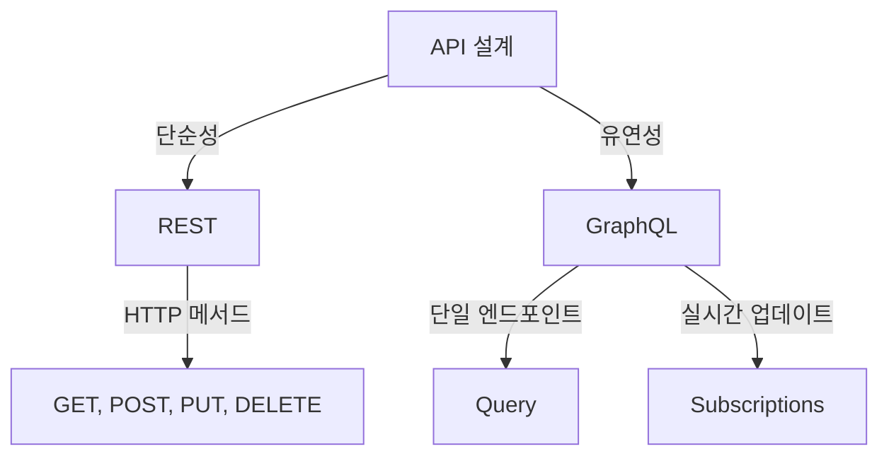

이와 같은 다이어그램을 통해 REST와 GraphQL의 차이점을 시각적으로 이해할 수 있다. 최적의 API 설계를 위해서는 각 기술의 특성을 잘 이해하고, 프로젝트의 요구 사항에 맞는 선택을 하는 것이 중요하다.

<!--
##### Reference #####
-->

## Reference


* [https://medium.com/@dmosyan/graphql-vs-rest-api-similarities-differences-857f9fc637a8](https://medium.com/@dmosyan/graphql-vs-rest-api-similarities-differences-857f9fc637a8)
* [https://aws.amazon.com/ko/compare/the-difference-between-graphql-and-rest/](https://aws.amazon.com/ko/compare/the-difference-between-graphql-and-rest/)
* [https://blog.toktokhan.dev/rest-api-vs-graphql-7348f54a220b](https://blog.toktokhan.dev/rest-api-vs-graphql-7348f54a220b)
* [https://velog.io/@djaxornwkd12/REST-API-vs-GraphQL-%EC%B0%A8%EC%9D%B4%EC%A0%90-%EC%95%8C%EC%95%84%EB%B3%B4%EA%B8%B0](https://velog.io/@djaxornwkd12/REST-API-vs-GraphQL-%EC%B0%A8%EC%9D%B4%EC%A0%90-%EC%95%8C%EC%95%84%EB%B3%B4%EA%B8%B0)
* [https://blog.postman.com/graphql-vs-rest/](https://blog.postman.com/graphql-vs-rest/)
* [https://www.ibm.com/blog/graphql-vs-rest-api/](https://www.ibm.com/blog/graphql-vs-rest-api/)
* [https://hygraph.com/blog/graphql-vs-rest-apis](https://hygraph.com/blog/graphql-vs-rest-apis)

