REST API와 GraphQL은 현대 애플리케이션에서 데이터를 교환하기 위해 널리 사용되는 두 가지 주요 기술이다. **REST**는 HTTP 메서드(GET, POST 등)를 사용하여 클라이언트와 서버 간의 데이터 교환을 가능하게 하는 아키텍처 스타일이고, **GraphQL**은 클라이언트가 필요한 데이터를 정확히 요청할 수 있도록 설계된 API 쿼리 언어이다. 이 글에서는 두 기술의 정의·역사, 작동 방식, 장단점, 차이점, 사용 사례를 다루고, 선택 기준과 참고 자료를 제시한다.

## 목차

1. [개요](#개요)
2. [REST API](#rest-api)
3. [GraphQL](#graphql)
4. [REST와 GraphQL의 유사점](#rest와-graphql의-유사점)
5. [REST와 GraphQL의 차이점](#rest와-graphql의-차이점)
6. [언제 REST를 사용하고 언제 GraphQL을 사용할까?](#언제-rest를-사용하고-언제-graphql을-사용할까)
7. [예제](#예제)
8. [한눈에 보기: 비교 요약](#한눈에-보기-비교-요약)
9. [평가 기준 및 선택 체크리스트](#평가-기준-및-선택-체크리스트)
10. [FAQ](#faq)
11. [관련 기술](#관련-기술)
12. [결론](#결론)
13. [Reference](#reference)

---

## 개요

**REST와 GraphQL의 정의**

**REST**(Representational State Transfer)는 웹 아키텍처 스타일 중 하나로, 클라이언트와 서버 간의 상호작용을 정의하는 원칙과 제약 조건을 포함한다. REST는 HTTP 프로토콜을 기반으로 하며, 자원(Resource)을 URI(Uniform Resource Identifier)로 식별하고, HTTP 메서드(GET, POST, PUT, DELETE 등)를 사용하여 자원에 대한 작업을 수행한다.

**GraphQL**은 페이스북에서 개발한 쿼리 언어로, API를 위한 런타임을 제공한다. GraphQL은 클라이언트가 필요한 데이터의 구조를 명시적으로 요청할 수 있도록 하여, 서버가 클라이언트의 요구에 맞는 데이터를 반환할 수 있게 한다. 이를 통해 클라이언트는 필요한 데이터만 요청할 수 있으며, **과다 수집(over-fetching)** 및 **부족 수집(under-fetching)** 문제를 완화할 수 있다.

**REST와 GraphQL의 역사적 배경**

REST는 2000년대 초반 로이 필딩(Roy Fielding)의 박사 논문에서 처음 소개되었다. 이후 REST는 웹 서비스 설계의 사실상 표준으로 자리 잡았으며, 많은 기업과 개발자들이 RESTful API를 채택하였다. REST는 단순하고 직관적인 설계 덕분에 빠르게 확산되었다.

GraphQL은 2012년 페이스북에서 내부적으로 사용하기 위해 개발되었으며, 2015년 오픈 소스로 공개되었다. GraphQL은 REST의 한계(특히 모바일·다양한 클라이언트 환경에서의 데이터 요구)를 극복하기 위해 설계되었다.

**API의 중요성**

**API**(Application Programming Interface)는 소프트웨어 간의 상호작용을 가능하게 하는 인터페이스이다. API는 서로 다른 시스템이 데이터를 주고받고 기능을 호출할 수 있도록 하여, 모듈화와 재사용성을 높인다. 현대 애플리케이션은 클라우드, 모바일, IoT 등 다양한 영역에서 API에 의존하며, API 설계와 구현은 소프트웨어 개발의 핵심 요소이다.

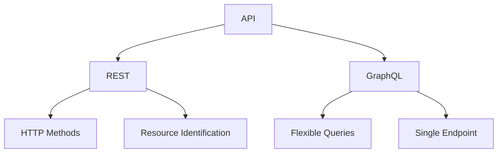
```mermaid
graph TD
    apiNode["API"]
    restNode["REST"]
    graphqlNode["GraphQL"]
    httpMethods["HTTP Methods"]
    resourceId["Resource Identification"]
    flexibleQueries["Flexible Queries"]
    singleEndpoint["Single Endpoint"]
    apiNode --> restNode
    apiNode --> graphqlNode
    restNode --> httpMethods
    restNode --> resourceId
    graphqlNode --> flexibleQueries
    graphqlNode --> singleEndpoint
```

위 다이어그램은 API의 두 가지 주요 유형인 REST와 GraphQL을 보여준다. REST는 HTTP 메서드와 자원 식별을 통해 작동하며, GraphQL은 유연한 쿼리와 단일 엔드포인트를 통해 클라이언트 요구를 충족한다.

---

## REST API

**REST의 개념**

REST는 웹 기반의 아키텍처 스타일로, 클라이언트와 서버 간의 상호작용을 정의하는 원칙이다. REST는 HTTP 프로토콜을 기반으로 하며, 자원을 URI로 식별하고, HTTP 메서드(GET, POST, PUT, DELETE 등)를 사용하여 자원에 대한 **CRUD**(Create, Read, Update, Delete) 작업을 수행한다. REST는 **상태 비저장(stateless)** 방식으로, 각 요청은 독립적이며 서버는 클라이언트의 상태를 저장하지 않는다.

**REST의 작동 방식**

REST API는 클라이언트가 서버에 요청을 보내고, 서버가 해당 요청에 대한 자원의 상태를 반환하는 방식으로 작동한다. 클라이언트는 특정 URI에 HTTP 요청을 보내고, 서버는 JSON 또는 XML 형식으로 응답한다.

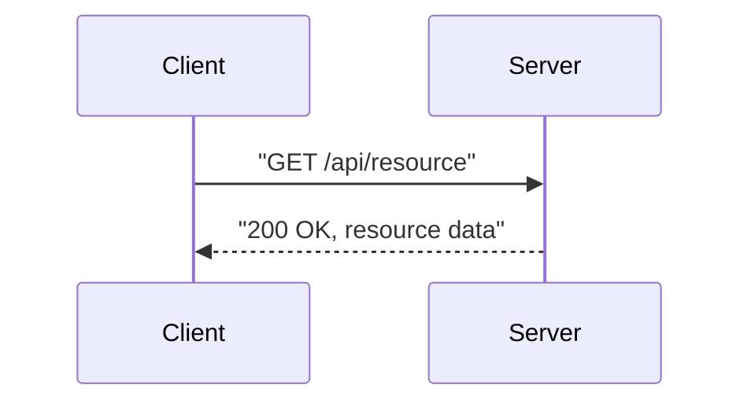
```mermaid
sequenceDiagram
    participant Client
    participant Server
    Client->>Server: "GET /api/resource"
    Server-->>Client: "200 OK, resource data"
```

**REST의 장점**

- **사용 용이성**: HTTP 프로토콜 기반이라 웹 개발자들이 쉽게 이해하고 사용할 수 있다.
- **언어 독립성**: 다양한 프로그래밍 언어에서 구현 가능하며, 표준화된 HTTP로 언어에 구애받지 않는다.
- **강력한 커뮤니티와 도구**: 널리 사용되는 아키텍처로, 다양한 라이브러리와 도구가 존재한다.
- **일관된 인터페이스**: 자원에 대한 일관된 접근 방식을 제공하여 API 사용이 예측 가능하다.

**REST의 단점**

- **과다 수집(over-fetching) 및 부족 수집(under-fetching)**: 클라이언트가 필요한 데이터보다 더 많거나 적은 데이터를 받는 경우가 발생할 수 있다.
- **버전 관리의 복잡성**: 새 기능·변경 도입 시 기존 API와의 호환성 유지가 어려울 수 있다.
- **실시간 데이터 업데이트의 어려움**: 상태 비저장 방식이라 실시간 푸시를 위해 long-polling, Server-Sent Events 등 추가 기술이 필요하다.

---

## GraphQL

**GraphQL의 개념**

GraphQL은 Facebook에서 개발한 쿼리 언어이자 API 런타임이다. 클라이언트가 필요한 데이터를 명시적으로 요청할 수 있도록 설계되어 있으며, 여러 리소스를 단일 요청으로 가져올 수 있다. 클라이언트가 원하는 데이터 구조를 정의할 수 있어, over-fetching·under-fetching 문제 완화에 도움이 된다.

**GraphQL의 작동 방식**

GraphQL은 클라이언트가 쿼리를 통해 서버에 요청을 보내고, 서버는 요청된 데이터만 반환한다. 클라이언트는 GraphQL 스키마를 기반으로 쿼리를 작성하며, 스키마는 데이터의 구조와 타입을 정의한다.

**GraphQL 쿼리 예시**

```graphql
{
  user(id: "1") {
    name
    email
    posts {
      title
      content
    }
  }
}
```

위 쿼리는 특정 사용자의 이름, 이메일, 해당 사용자가 작성한 게시물의 제목과 내용만 요청한다. 서버는 요청된 필드만 포함한 JSON으로 응답한다.

```json
{
  "data": {
    "user": {
      "name": "John Doe",
      "email": "john@example.com",
      "posts": [
        { "title": "First Post", "content": "This is my first post." }
      ]
    }
  }
}
```

**GraphQL의 장점**

- **단일 엔드포인트**: 모든 요청을 단일 엔드포인트로 처리하여 엔드포인트 관리 복잡성을 줄인다.
- **유연한 데이터 검색**: 필요한 필드만 요청하여 불필요한 데이터 전송을 줄인다.
- **강력한 타입 시스템**: 스키마로 데이터 타입을 명확히 정의하여 클라이언트·서버 계약을 강화한다.
- **실시간 업데이트 지원**: **Subscription**을 통해 실시간 데이터 업데이트를 지원한다.

**GraphQL의 단점**

- **학습 곡선**: REST에 비해 상대적으로 복잡한 개념이 많아 초기 학습 비용이 있다.
- **캐싱의 복잡성**: 쿼리 형태가 다양해 HTTP 캐싱만으로는 부족하고, Persisted Queries·응답 캐시 등 전략이 필요하다.

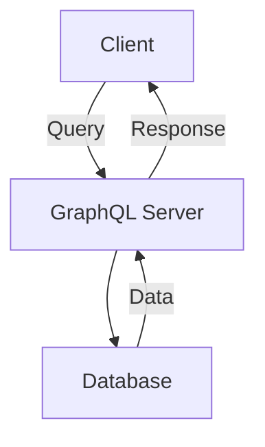
```mermaid
graph TD
    clientNode["Client"]
    serverNode["GraphQL Server"]
    dbNode["Database"]
    clientNode -->|"Query"| serverNode
    serverNode -->|"Response"| clientNode
    serverNode --> dbNode
    dbNode -->|"Data"| serverNode
```

위 다이어그램은 클라이언트가 GraphQL 서버에 쿼리를 보내고, 서버가 데이터베이스에서 데이터를 조회한 뒤 클라이언트에 응답하는 흐름을 보여준다.

---

## REST와 GraphQL의 유사점

REST와 GraphQL은 현대 웹 애플리케이션에서 데이터 전송 및 상호작용을 위한 두 가지 주요 접근 방식이다. 다음 공통점을 가진다.

**공통 아키텍처 원칙**

둘 다 **클라이언트-서버** 아키텍처와 **상태 비저장(stateless)** 원칙을 따른다. 각 요청은 독립적으로 처리되며, 이는 확장성과 유지보수성에 기여한다.

**HTTP를 통한 데이터 전송**

REST는 HTTP 메서드로 CRUD를 수행하고, GraphQL은 단일 엔드포인트로 쿼리·변형·구독을 처리한다. 둘 다 HTTP 위에서 동작하며 웹 기반 데이터 전송의 표준화된 방법을 제공한다.

**데이터 형식의 표준화**

REST와 GraphQL 모두 **JSON**을 데이터 교환의 기본으로 사용한다. JSON은 가볍고 읽기 쉬우며, 다양한 플랫폼 간 호환성을 높인다.

**미들웨어 및 확장성**

둘 다 미들웨어를 통해 인증, 로깅, 데이터 변환 등의 기능을 확장할 수 있다.

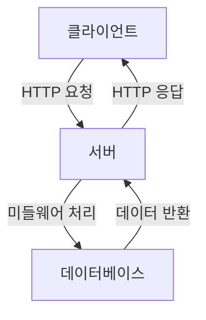
```mermaid
graph TD
    clientNode["클라이언트"]
    serverNode["서버"]
    dbNode["데이터베이스"]
    clientNode -->|"HTTP 요청"| serverNode
    serverNode -->|"HTTP 응답"| clientNode
    serverNode -->|"미들웨어 처리"| dbNode
    dbNode -->|"데이터 반환"| serverNode
```

---

## REST와 GraphQL의 차이점

**5.1 데이터 검색 방식**

REST는 리소스별 고유 URL과 여러 엔드포인트를 사용한다. 클라이언트는 필요한 데이터를 얻기 위해 여러 엔드포인트에 요청을 보낼 수 있다. GraphQL은 단일 엔드포인트에서 클라이언트가 원하는 필드만 명시하여 요청할 수 있어, over-fetching·under-fetching을 줄일 수 있다.

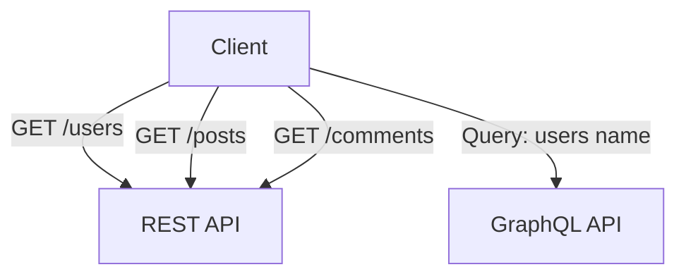
```mermaid
graph TD
    clientNode["Client"]
    restApi["REST API"]
    graphqlApi["GraphQL API"]
    clientNode -->|"GET /users"| restApi
    clientNode -->|"GET /posts"| restApi
    clientNode -->|"GET /comments"| restApi
    clientNode -->|"Query: users name"| graphqlApi
```

**5.2 버전 관리**

REST는 URL에 버전을 포함하는 방식(예: `/api/v1/users`)이 흔하다. GraphQL은 스키마 진화로 대응하며, 필드 추가·deprecated 처리로 하위 호환을 유지할 수 있다.

**5.3 오류 처리**

REST는 HTTP 상태 코드(404, 500 등)로 오류를 전달한다. GraphQL은 응답 본문에 `errors` 배열을 포함하여 전달하며, HTTP 상태는 보통 200으로 유지된다. GraphQL은 오류 형식이 명세화되어 있어 클라이언트 파싱이 일관된다.

**5.4 실시간 데이터 처리**

REST는 기본적으로 요청-응답 모델이라 실시간 푸시를 위해 부가 기술이 필요하다. GraphQL은 **Subscription**으로 실시간 이벤트 기반 업데이트를 지원한다.

**5.5 도구 및 환경**

REST는 Swagger, Postman 등 성숙한 도구 생태계가 있다. GraphQL은 GraphiQL, Apollo Client 등으로 문서화·쿼리 테스트를 지원하며, 상대적으로 생태계가 성장 중이다.

**5.6 캐싱 메커니즘**

REST는 HTTP 캐시 헤더(ETag, Cache-Control 등)를 활용하기 쉽다. GraphQL은 쿼리 형태가 다양해 URL 기반 캐싱이 어렵고, Persisted Queries·응답 캐시 등 별도 전략이 필요하다.

---

## 언제 REST를 사용하고 언제 GraphQL을 사용할까?

**REST 사용 사례**

- **간단한 데이터 요구 사항**: CRUD 위주의 블로그, 관리자 화면 등에서는 REST가 직관적이고 구현·운영이 단순하다.
- **작은 애플리케이션·프로토타입**: 엔드포인트 수가 많지 않고 고정된 응답 구조면 REST로 빠르게 개발할 수 있다.
- **캐싱이 중요한 경우**: URL·메서드 기반 HTTP 캐싱을 그대로 활용할 수 있다.

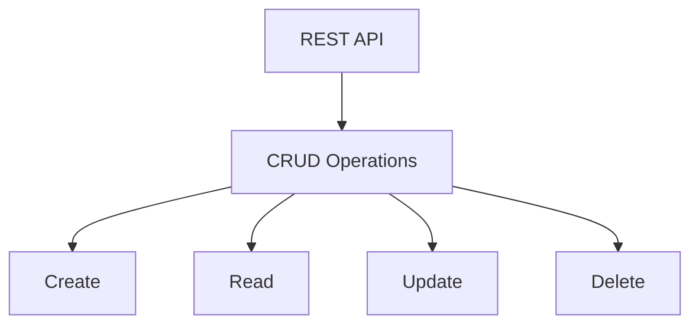
```mermaid
graph TD
    restApi["REST API"]
    crudOps["CRUD Operations"]
    createOp["Create"]
    readOp["Read"]
    updateOp["Update"]
    deleteOp["Delete"]
    restApi --> crudOps
    crudOps --> createOp
    crudOps --> readOp
    crudOps --> updateOp
    crudOps --> deleteOp
```

**GraphQL 사용 사례**

- **복잡한·다양한 데이터 요구**: 여러 엔티티를 한 번에, 필요한 필드만 요청해야 하는 소셜·대시보드형 UI에 유리하다.
- **다양한 클라이언트**: 웹·모바일·IoT 등 클라이언트별로 필요한 데이터가 다를 때, 각 클라이언트가 필요한 필드만 요청할 수 있다.
- **실시간 구독이 필요한 경우**: 채팅, 알림, 대시보드 업데이트 등 Subscription을 활용할 수 있다.

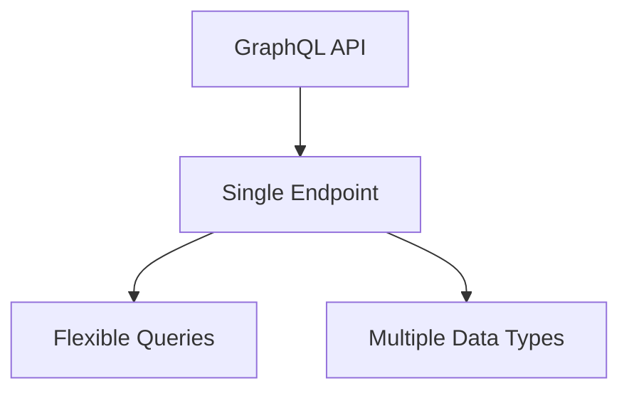
```mermaid
graph TD
    graphqlApi["GraphQL API"]
    singleEp["Single Endpoint"]
    flexibleQ["Flexible Queries"]
    multiType["Multiple Data Types"]
    graphqlApi --> singleEp
    singleEp --> flexibleQ
    singleEp --> multiType
```

**REST와 GraphQL의 혼합 사용**

인증·파일 업로드 등은 REST로 처리하고, 복잡한 조회·실시간 구독은 GraphQL로 처리하는 하이브리드 구성이 많이 사용된다. GraphQL 레이어를 REST 백엔드 앞에 두어 통합 엔드포인트로 제공하는 패턴도 가능하다.

---

## 예제

**REST API 예제**

클라이언트가 사용자 정보를 요청하는 경우이다.

**HTTP 요청**

```http
GET /api/users/1 HTTP/1.1
Host: example.com
Accept: application/json
```

**HTTP 응답**

```http
HTTP/1.1 200 OK
Content-Type: application/json

{
  "id": 1,
  "name": "John Doe",
  "email": "john.doe@example.com"
}
```

**GraphQL API 예제**

동일한 사용자 정보를 필요한 필드만 요청하는 경우이다.

**GraphQL 쿼리**

```graphql
query {
  user(id: 1) {
    id
    name
    email
  }
}
```

**GraphQL 응답**

```json
{
  "data": {
    "user": {
      "id": 1,
      "name": "John Doe",
      "email": "john.doe@example.com"
    }
  }
}
```

**비교 다이어그램**

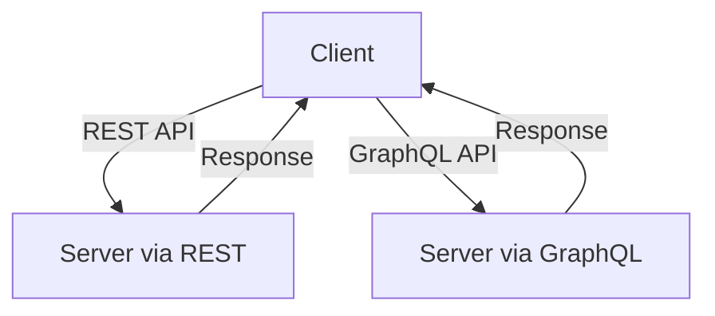
```mermaid
graph TD
    clientNode["Client"]
    restServer["Server via REST"]
    graphqlServer["Server via GraphQL"]
    clientNode -->|"REST API"| restServer
    clientNode -->|"GraphQL API"| graphqlServer
    restServer -->|"Response"| clientNode
    graphqlServer -->|"Response"| clientNode
```

---

## 한눈에 보기: 비교 요약

| 구분 | REST | GraphQL |
|------|------|---------|
| **성격** | 아키텍처 스타일 | 쿼리 언어·사양·런타임 |
| **엔드포인트** | 리소스별 여러 URL | 단일 엔드포인트 |
| **데이터 반환** | 서버가 정한 고정 구조 | 클라이언트가 요청한 필드만 |
| **버전 관리** | URL·헤더 등으로 명시적 버전 관리 | 스키마 진화·deprecated 필드 |
| **오류 전달** | HTTP 상태 코드 | 본문 내 errors (보통 200) |
| **캐싱** | HTTP 캐시 활용 용이 | 쿼리별 전략 필요 |
| **실시간** | 별도 설계 필요 | Subscription 지원 |
| **학습 곡선** | 상대적으로 낮음 | 스키마·쿼리 문법 학습 필요 |

---

## 평가 기준 및 선택 체크리스트

이 글을 읽은 후 다음을 수행할 수 있으면 목표가 달성된 것이다.

- REST와 GraphQL의 **정의·역사·작동 방식**을 설명할 수 있다.
- **over-fetching·under-fetching**이 무엇인지 설명하고, 각 접근 방식에서 어떻게 다루는지 비교할 수 있다.
- **버전 관리·오류 처리·캐싱·실시간** 측면에서 REST와 GraphQL의 차이를 설명할 수 있다.
- 주어진 요구 사항(단순 CRUD, 복잡한 조회, 다중 클라이언트, 실시간 등)에 따라 **REST·GraphQL·혼합** 중 선택 근거를 제시할 수 있다.

**선택 시 체크리스트**

- [ ] 데이터 요구가 단순하고 CRUD 위주인가? → REST 우선 고려
- [ ] 여러 리소스·필드를 한 번에, 필요한 것만 요청해야 하는가? → GraphQL 우선 고려
- [ ] 실시간 구독(채팅, 알림 등)이 필요한가? → GraphQL Subscription 또는 REST+SSE 등 검토
- [ ] HTTP 캐싱을 최대한 활용해야 하는가? → REST가 유리할 수 있음
- [ ] 팀 경험·기존 인프라가 REST인가 GraphQL인가? → 마이그레이션 비용 고려

---

## FAQ

**REST와 GraphQL의 선택 기준은 무엇인가요?**

데이터 요구의 복잡성, 클라이언트 다양성, 실시간 요구, 캐싱 전략, 팀 경험을 함께 고려한다. 단순 CRUD·캐싱 중시면 REST, 복잡한 조회·다중 클라이언트·실시간이 중요하면 GraphQL을 검토한다.

**GraphQL의 성능이 REST보다 항상 우수한가요?**

아니다. GraphQL은 over-fetching을 줄일 수 있지만, 복잡한 쿼리는 서버 부하(N+1 등)를 유발할 수 있다. REST는 엔드포인트가 고정되어 성능이 예측하기 쉽다. 성능은 설계·사용 패턴에 따라 달라진다.

**REST API의 버전 관리는 어떻게 하나요?**

URL 경로(`/api/v1/...`), HTTP 헤더, 쿼리 파라미터 등으로 버전을 명시한다. 팀 정책과 클라이언트 호환성 요구에 맞는 방식을 선택한다.

**GraphQL의 실시간 데이터 업데이트는 어떻게 구현하나요?**

**Subscription**을 사용한다. 클라이언트가 구독을 등록하면, 해당 이벤트 발생 시 서버가 연결을 통해 데이터를 푸시한다. 전송 계층으로 WebSocket 등이 사용된다.

```graphql
subscription {
  messageAdded {
    id
    content
    user {
      id
      name
    }
  }
}
```

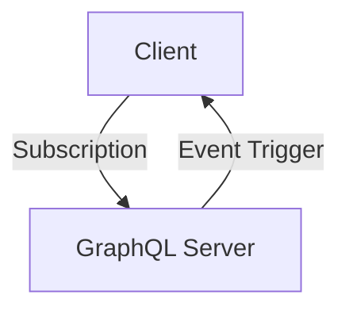
```mermaid
graph TD
    clientNode["Client"]
    serverNode["GraphQL Server"]
    clientNode -->|"Subscription"| serverNode
    serverNode -->|"Event Trigger"| clientNode
```

---

## 관련 기술

**OpenAPI**

RESTful API를 정의하는 표준 사양이다. OpenAPI Specification(OAS)으로 API 구조와 동작을 문서화하고, Swagger 등과 함께 문서·테스트 자동화에 활용된다.

**gRPC**

Google에서 개발한 고성능 RPC 프레임워크이다. Protocol Buffers와 HTTP/2를 사용하며, 양방향 스트리밍·다국어 지원이 특징이다.

**WebSocket**

클라이언트와 서버 간 양방향 통신을 위한 프로토콜이다. 채팅, 실시간 알림 등에 사용되며, GraphQL Subscription의 전송 계층으로도 쓰인다.

**Microservices Architecture**

애플리케이션을 독립 서비스로 나누는 아키텍처이다. 서비스 간 통신에 REST·gRPC·GraphQL 등이 조합되어 사용된다.

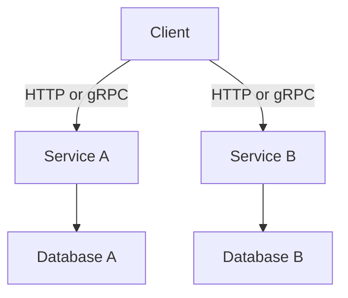
```mermaid
graph TD
    clientNode["Client"]
    serviceA["Service A"]
    serviceB["Service B"]
    dbA["Database A"]
    dbB["Database B"]
    clientNode -->|"HTTP or gRPC"| serviceA
    clientNode -->|"HTTP or gRPC"| serviceB
    serviceA --> dbA
    serviceB --> dbB
```

---

## 결론

**요약**

REST는 리소스 기반 아키텍처로 HTTP 메서드와 URI로 상호작용을 정의한다. GraphQL은 쿼리 언어로, 단일 엔드포인트에서 클라이언트가 필요한 데이터를 명시해 요청한다. 둘 다 장단점이 있으며, 프로젝트 요구 사항에 맞는 선택이 중요하다.

**미래 전망**

REST는 안정성과 단순성으로 계속 널리 사용될 것이다. GraphQL은 복잡한 데이터 요구와 다중 클라이언트·실시간 요구가 늘어남에 따라 채택이 늘어나는 추세이다. 두 기술은 각자의 영역에서 공존·발전할 가능성이 크다.

**권장 사항**

- 간단한 데이터·CRUD·캐싱 중시 → REST 우선 검토
- 복잡한 조회·다중 클라이언트·실시간·스키마 계약 중시 → GraphQL 검토
- 필요 시 인증·파일은 REST, 조회·구독은 GraphQL처럼 **혼합** 구성을 고려한다.

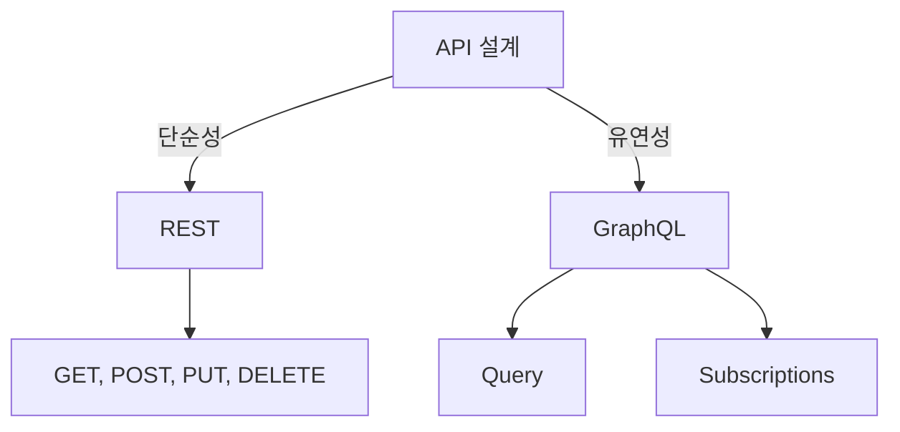
```mermaid
graph TD
    designNode["API 설계"]
    restChoice["REST"]
    graphqlChoice["GraphQL"]
    httpMethods["GET, POST, PUT, DELETE"]
    queryOp["Query"]
    subOp["Subscriptions"]
    designNode -->|"단순성"| restChoice
    designNode -->|"유연성"| graphqlChoice
    restChoice --> httpMethods
    graphqlChoice --> queryOp
    graphqlChoice --> subOp
```

---

## Reference

- [GraphQL vs REST API — Similarities & Differences (Medium, David Mosyan)](https://medium.com/@dmosyan/graphql-vs-rest-api-similarities-differences-857f9fc637a8)
- [GraphQL과 REST의 차이점 (AWS)](https://aws.amazon.com/ko/compare/the-difference-between-graphql-and-rest/)
- [Rest API vs GraphQL (똑똑한개발자 블로그)](https://blog.toktokhan.dev/rest-api-vs-graphql-7348f54a220b)
- [REST API vs GraphQL 차이점 알아보기 (Velog)](https://velog.io/@djaxornwkd12/REST-API-vs-GraphQL-%EC%B0%A8%EC%9D%B4%EC%A0%90-%EC%95%8C%EC%95%84%EB%B3%B4%EA%B8%B0)
- [GraphQL vs REST (Postman Blog)](https://blog.postman.com/graphql-vs-rest/)
- [GraphQL vs. REST API (IBM Blog)](https://www.ibm.com/blog/graphql-vs-rest-api/)
- [GraphQL Vs. REST APIs (Hygraph)](https://hygraph.com/blog/graphql-vs-rest-apis)
