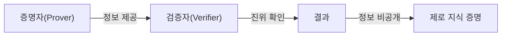
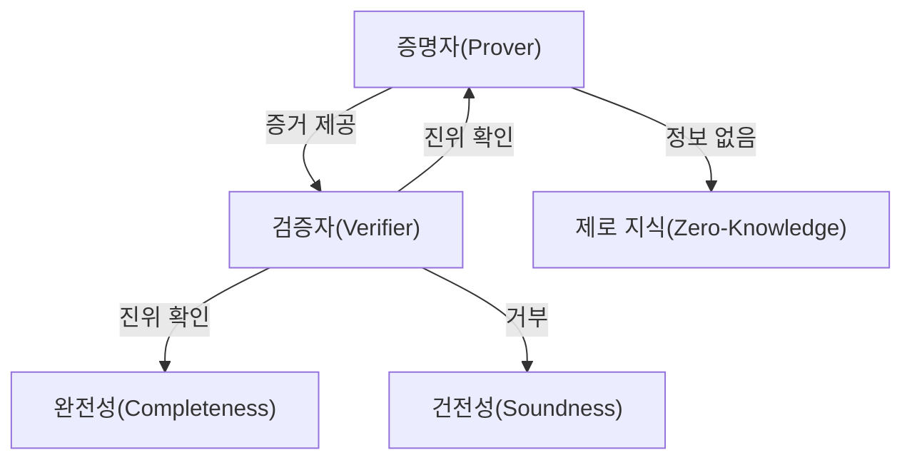
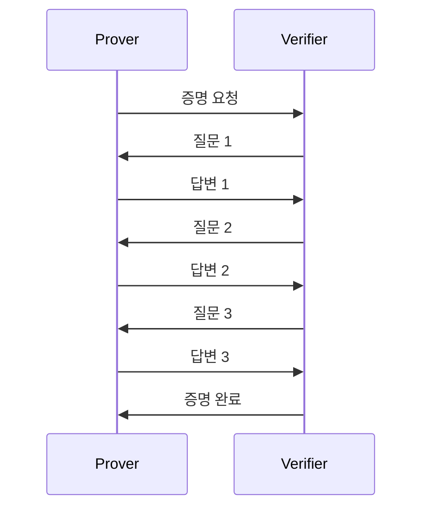
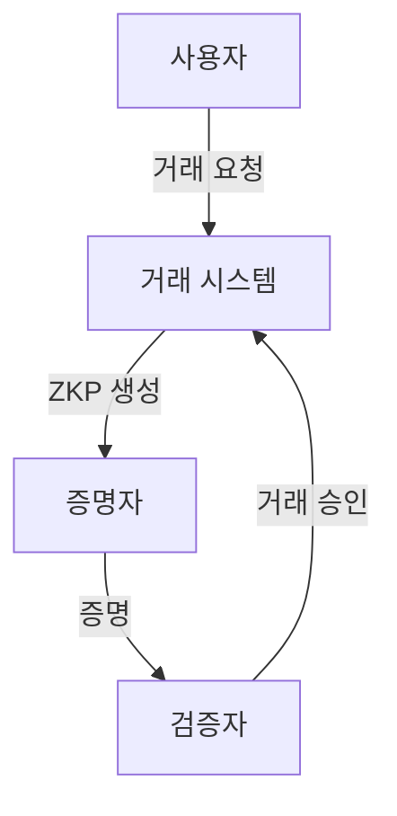
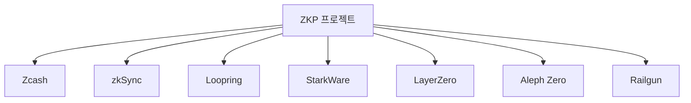
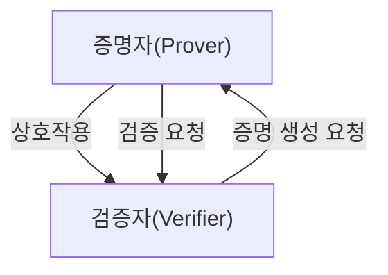
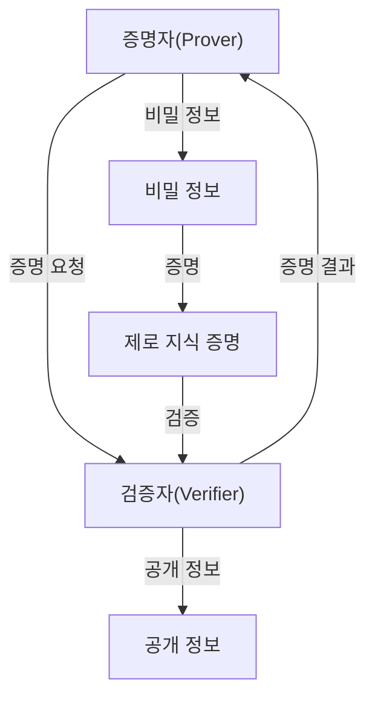
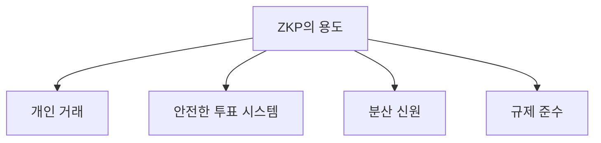
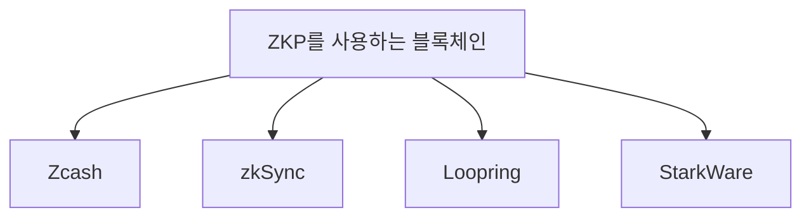
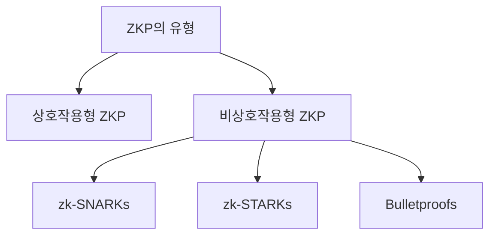

제로 지식 증명(Zero Knowledge Proof, ZKP)은 한 당사자(증명자)가 다른 당사자(검증자)에게 **특정 진술이 참임을 증명**하되, 그 과정에서 **해당 진술의 비밀 정보는 전혀 공개하지 않는** 암호학적 방법이다. 1985년 Goldwasser, Micali, Rackoff의 논문으로 개념이 정립되었고, Gödel Prize를 수상했다. 블록체인에서는 개인 거래, 확장성(zk-Rollup), 분산 신원·데이터 소유권, 안전한 투표, 규제 준수 등에 쓰인다. 이 글에서는 ZKP의 기본 개념, 참여자, 세 가지 핵심 속성, 유형(상호작용형·비상호작용형), 작동 원리, 응용 사례, 주요 프로젝트, 도전 과제를 정리한다.

||
|:---:|
|제로 지식 증명(ZKP) 개요|

## 목차

1. [개요](#개요)
2. [제로 지식 증명의 기본 개념](#제로-지식-증명의-기본-개념)
3. [제로 지식 증명의 유형](#제로-지식-증명의-유형)
4. [제로 지식 증명의 작동 원리](#제로-지식-증명의-작동-원리)
5. [제로 지식 증명의 응용 사례](#제로-지식-증명의-응용-사례)
6. [주요 제로 지식 증명 프로젝트](#주요-제로-지식-증명-프로젝트)
7. [제로 지식 증명의 도전 과제](#제로-지식-증명의-도전-과제)
8. [결론](#결론)
9. [자주 묻는 질문(FAQ)](#자주-묻는-질문faq)
10. [참고 자료](#참고-자료)

---

## 개요

### 제로 지식 증명(Zero-Knowledge Proofs, ZKPs)이란?

제로 지식 증명은 **한 당사자가 다른 당사자에게 어떤 정보에 대한 진술이 참임을 증명**하되, **그 정보 자체는 일체 공개하지 않는** 프로토콜이다. 검증자는 증명자가 주장하는 내용을 신뢰할 수 있지만, 증명자가 가진 비밀(예: 비밀번호, 거래 금액)은 알 수 없다. 이 특성 때문에 ZKP는 개인정보 보호와 보안이 중요한 금융·투표·인증·블록체인 등에 널리 쓰인다.

ZKP의 기본 흐름은 다음과 같다. 증명자는 비밀 정보를 갖고 있고, 그 정보를 바탕으로 검증자에게 “진술이 참이다”를 보여 주어야 한다. 이때 증명자는 검증자가 이해할 수 있는 형태로만 증거를 제시하고, **비밀의 구체적 내용은 숨긴다**. 블록체인 같은 분산 시스템에서 개인 프라이버시를 지키는 데 특히 유용하다.

### ZKP의 중요성 및 필요성

제로 지식 증명은 디지털 사회에서 점점 더 필수 기술이 되고 있다. 개인정보 보호와 데이터 보안 이슈가 커지면서, ZKP는 다음을 가능하게 한다.

1. **프라이버시 보호**: 민감 정보를 공개하지 않고도 거래·자격의 유효성을 증명할 수 있다.
2. **보안 강화**: 데이터 무결성을 보장하고, 유출·위변조 위험을 줄인다.
3. **신뢰 구축**: “진술이 참이다”만 검증 가능하게 해 분산 환경에서도 신뢰를 만들 수 있다.

---

## 제로 지식 증명의 기본 개념

ZKP는 **정보의 진위만 증명하고, 그 정보 자체는 비공개**로 유지하는 암호학적 방법이다. 여기서는 참여자와 세 가지 핵심 속성을 정리한다.

### 2.1. 참여자

- **증명자(Prover)**: 특정 정보를 알고 있고, 그 정보를 바탕으로 검증자에게 “진술이 참이다”를 증명하는 쪽이다. 예: 비밀번호를 아는 사용자.
- **검증자(Verifier)**: 증명자의 주장이 참인지 검증하는 쪽이다. 증명자가 제시한 증거만으로 진위를 판단하며, 비밀 자체는 알 수 없다.

두 참여자는 프로토콜에 따라 여러 번 메시지를 주고받으며, 증명자는 검증자가 요구하는 조건을 만족하는 증거를 제시해야 한다.

### 2.2. ZKP의 세 가지 주요 속성

제로 지식 증명은 다음 세 가지를 만족해야 한다.

| 속성 | 설명 |
|------|------|
| **완전성(Completeness)** | 증명자가 진짜 정보를 알고 있으면, 정직한 검증자는 항상 “참”으로 수락할 수 있다. |
| **건전성(Soundness)** | 증명자가 거짓을 주장하면, 정직한 검증자는 높은 확률로 “거짓”으로 거부할 수 있다. |
| **제로 지식(Zero-Knowledge)** | 검증자는 “진술이 참이다”라는 사실만 알 수 있고, 비밀에 대한 추가 정보는 얻지 못한다. |

---

## 제로 지식 증명의 유형

ZKP는 **상호작용형(Interactive)** 과 **비상호작용형(Non-Interactive)** 으로 나뉜다.

### 3.1. 상호작용형 ZKP(Interactive ZKP)

증명자와 검증자가 **여러 번 메시지를 주고받으며** 증명을 완성한다. 검증자가 질문을 하고, 증명자가 그에 답하는 과정을 반복해 “진술이 참이다”를 확률적으로 보장한다.

- **상호작용**: 여러 라운드의 질문·응답이 필요하다.
- **동적 프로세스**: 검증자는 증명자의 응답에 따라 추가 질문을 할 수 있다.

### 3.2. 비상호작용형 ZKP(Non-Interactive ZKP)

**한 번의 증명 메시지**만으로 검증이 가능하다. 블록체인·오프체인 검증에 적합하며, zk-SNARKs, zk-STARKs, Bulletproofs 등이 이에 해당한다.

- **단일 메시지**: 증명자가 검증에 필요한 모든 정보를 담은 하나의 증명을 생성한다.
- **효율성**: 상호작용이 없어 네트워크 지연·추가 라운드가 필요 없다.

| 유형 | 특징 | 대표 기술 |
|------|------|-----------|
| **zk-SNARKs** | 짧은 증명, 빠른 검증, 타원곡선 기반. 신뢰 설정(Trusted Setup) 필요. | Zcash, 여러 L2 |
| **zk-STARKs** | 신뢰 설정 불필요, 확장성·투명성 강조. 해시 기반. | StarkWare, StarkNet |
| **Bulletproofs** | 신뢰 설정 불필요, 범위 증명 등에 적합. | Monero 등 |

---

## 제로 지식 증명의 작동 원리

### 4.1. ZKP의 프로세스

1. **초기 설정**: 증명할 진술과 검증 방법(또는 공통 파라미터)이 정해진다. 비상호작용형에서는 신뢰 설정(해당 시)이 이 단계에 해당할 수 있다.
2. **질문 및 응답(상호작용형)** 또는 **증명 생성(비상호작용형)**: 증명자는 비밀 정보를 사용해 검증자가 요구하는 증거(또는 단일 증명)를 만든다.
3. **검증**: 검증자는 증거(또는 증명)만 보고 진술이 참인지 판단한다. 이 과정에서 비밀은 노출되지 않는다.

### 4.2. ZKP의 수학적 기초

- **NP 문제**: 많은 ZKP는 “해를 검증하는 것은 쉽고, 해를 찾는 것은 어렵다”는 NP 구조를 이용한다.
- **암호학적 해시·타원곡선 등**: 해시 함수, 타원곡선, 페어링 등이 증명 생성·검증에 쓰이며, 데이터 무결성과 비밀성을 보장한다.
- **상호작용 프로토콜(상호작용형)**: 여러 라운드의 질문·응답으로 “참이면 수락, 거짓이면 거부”가 높은 확률로 보장된다.

---

## 제로 지식 증명의 응용 사례

### 5.1. 개인 거래(Private Transactions)

거래 금액·참여 주소 등을 공개하지 않고도 “유효한 거래이다”만 증명한다. Zcash, Railgun 등이 대표 사례다.

### 5.2. 블록체인 확장성(Scalability)

zk-Rollup 등에서 **대량 거래를 하나의 ZKP로 묶어** L1에 제출한다. L1은 전체 거래를 재실행하지 않고 증명만 검증해 처리량을 늘린다. zkSync, StarkNet, Loopring 등이 이 방식을 사용한다.

### 5.3. 분산 신원 및 데이터 소유권

나이·자격·소속 등 **특정 조건만 만족함을 증명**하고, 실제 신원 정보는 공개하지 않는다. 분산 신원(DID), 선택적 공개(selective disclosure)에 활용된다.

### 5.4. 안전한 투표 시스템(Secure Voting Systems)

투표 내용을 드러내지 않으면서 **유효한 투표권·1인 1표** 등을 증명할 수 있어, 기밀투표와 무결성을 동시에 만족시킬 수 있다.

### 5.5. 규제 준수(Compliance)

기업이 “규제를 만족한다”는 사실만 증명하고, 고객 개인정보·영업비밀은 노출하지 않는 방식으로 규제 대응과 프라이버시를 양립할 수 있다.

---

## 주요 제로 지식 증명 프로젝트

| 프로젝트 | ZKP 방식 | 주요 용도 |
|----------|----------|-----------|
| **Zcash** | zk-SNARKs | 개인 거래(shielded transaction) |
| **zkSync** | zk-Rollup | 이더리움 L2 확장 |
| **Loopring** | zk-Rollup | DEX, 결제 |
| **StarkWare / StarkNet** | zk-STARKs | L2 확장, 앱 체인 |
| **LayerZero** | 다양한 | 크로스체인 메시징·상호운용 |
| **Aleph Zero** | ZKP 결합 | 프라이버시·확장성 |
| **Railgun** | ZKP | 이더리움 상 개인 거래·스마트 컨트랙트 |

---

## 제로 지식 증명의 도전 과제

### 7.1. 계산 집약성(Computational Intensity)

증명 생성에 많은 연산이 필요해, 증명자 하드웨어·전력 비용이 크다. 대규모 서비스에서는 증명 생성 전용 인프라가 필요할 수 있다.

### 7.2. 신뢰할 수 있는 설정(Trusted Setup)

zk-SNARKs 등 일부 체계는 **Trusted Setup**이 필요하다. 이 과정에서 생성된 비밀 파라미터가 유출되면 위조 증명이 가능해질 수 있어, 다자 참여 세레모니 등으로 완화한다. zk-STARKs·Bulletproofs는 신뢰 설정이 없는 대안이다.

### 7.3. 증명 크기 및 검증 복잡성

증명 크기가 크거나 검증 비용이 높으면 저장·전송·온체인 가스 비용이 늘어난다. Succinct(간결) 증명과 빠른 검증 알고리즘 개발이 계속되고 있다.

### 7.4. 사용성 및 접근성

ZKP는 수학·암호학 배경이 필요해 일반 개발자·사용자 진입 장벽이 높다. SDK·DSL(예: Circom, ZoKrates)·문서·교육 자료가 사용성 개선에 중요하다.

---

## 결론

제로 지식 증명은 **개인정보를 보호하면서 “진술이 참이다”만 검증**할 수 있게 해 주는 핵심 기술이다. 블록체인에서는 개인 거래, L2 확장(zk-Rollup), 분산 신원, 투표, 규제 준수 등에 쓰이며, 금융·의료·신원 분야로도 확장되고 있다.

**발전 방향**으로는 (1) 증명 생성·검증 비용·크기 감소, (2) Trusted Setup 제거 또는 다자 세레모니 표준화, (3) 개발자 친화적 도구·언어 보급이 중요하다. ZKP는 앞으로 더 많은 애플리케이션에서 프라이버시와 신뢰를 동시에 만족시키는 기반이 될 것이다.

---

## 자주 묻는 질문(FAQ)

### ZKP는 블록체인에서 어떤 용도로 사용되나요?

블록체인에서는 **개인 거래(금액·주소 비공개)**, **L2 확장(zk-Rollup)**, **분산 신원·선택적 공개**, **기밀 투표**, **규제 준수 증명** 등에 쓰인다. “진술이 참이다”만 온체인에 남기고 나머지 정보는 비공개로 둘 수 있다.

### 어떤 블록체인·프로젝트가 ZKP를 사용하나요?

Zcash(개인 거래), zkSync·StarkNet·Loopring(L2·DEX), Railgun(이더리움 개인 거래), Aleph Zero 등이 ZKP를 활용한다. 이더리움 생태계의 zk-Rollup이 특히 활발하다.

### ZKP의 유형은 무엇인가요?

**상호작용형**: 증명자와 검증자가 여러 번 메시지를 주고받아 증명한다. **비상호작용형**: 증명자가 한 번에 증명을 만들어 제출하면, 검증자는 그 증명만으로 검증한다. 비상호작용형의 대표 예로 zk-SNARKs, zk-STARKs, Bulletproofs가 있다.

---

## 참고 자료

- **[Programming ZKPs: From Zero to Hero](https://zkintro.com/articles/programming-zkps-from-zero-to-hero)** — ZKP를 Circom·Groth16으로 처음부터 구현하는 튜토리얼. 회로 작성, Trusted Setup, 증명 생성·검증 흐름을 다룬다.
- **[Zero-Knowledge Proof (ZKP) — Explained \| Chainlink](https://chain.link/education/zero-knowledge-proof-zkp)** — ZKP 정의, 완전성·건전성·제로지식, zk-SNARKs·zk-STARKs·Bulletproofs·PLONK 소개, 블록체인·오라클 활용(예: DECO).
- **[Zero-knowledge proof — Wikipedia](https://en.wikipedia.org/wiki/Zero-knowledge_proof)** — ZKP의 수학적 정의, 동작 예시(동굴·색맹 등), 상호작용형·비상호작용형, 응용 분야.
- **[Introduction to Zero-Knowledge Proofs — Chainalysis](https://www.chainalysis.com/blog/introduction-to-zero-knowledge-proofs-zkps/)** — ZKP 구성 요소, 블록체인 사용 사례, 도전 과제, zk-Rollup·Zcash 등 프로젝트 소개.
- **[ZoKrates](https://github.com/Zokrates/ZoKrates)** — 이더리움용 zk-SNARK 도구 상자. 회로 작성부터 증명 생성·검증·스마트 컨트랙트 연동까지 지원한다.
