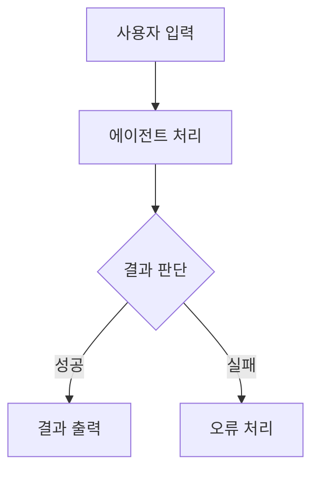
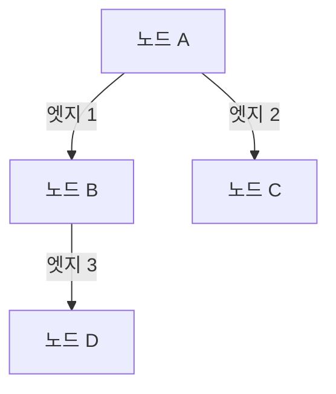
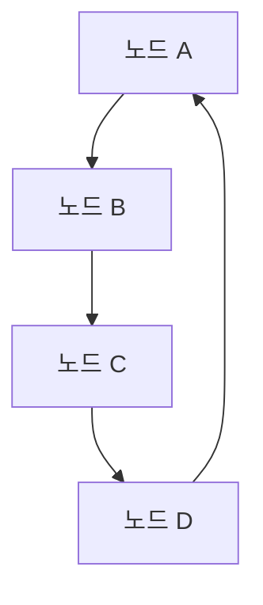
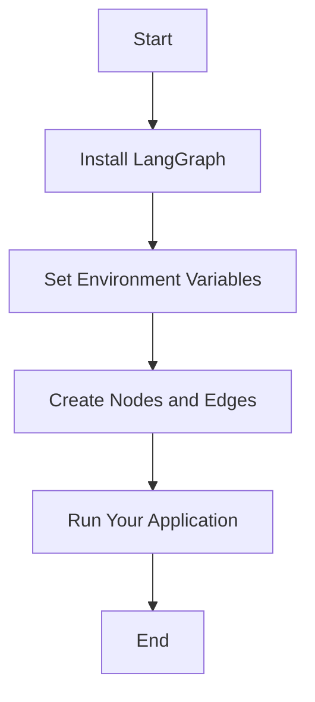
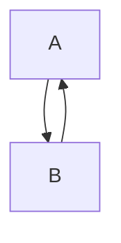
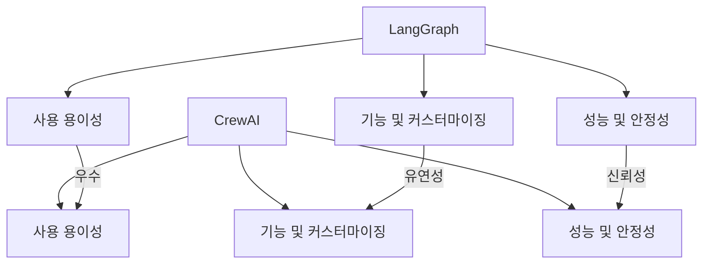
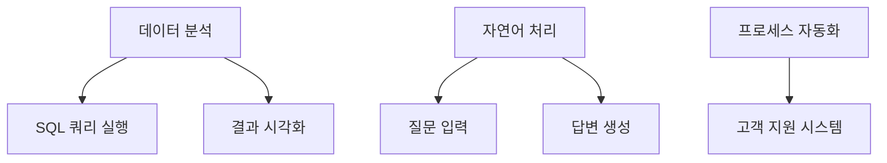
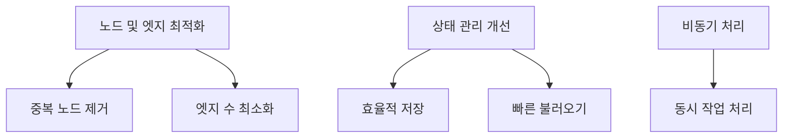
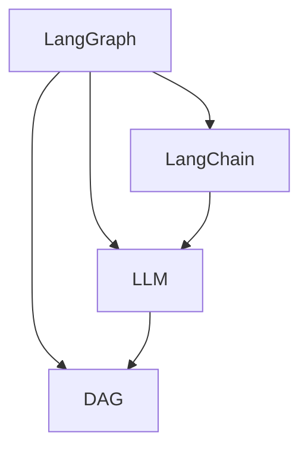
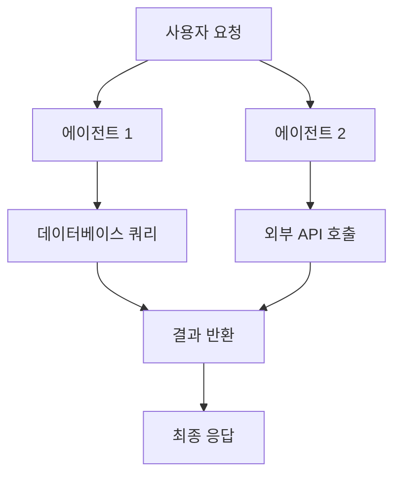

LangChain의 생태계에서 LangGraph는 대규모 언어 모델(LLM)을 활용한 애플리케이션 구축을 위한 강력한 프레임워크이다. LangGraph는 복잡한 작업 흐름을 정의하고 실행하는 데 필요한 다양한 기능을 제공하며, 특히 순환 그래프를 통해 에이전트 간의 상호작용을 효율적으로 관리할 수 있다. 이 글에서는 LangGraph의 기본 개념과 주요 기능을 살펴보고, 이를 활용하여 다양한 질문에 답변할 수 있는 시스템을 구축하는 방법을 소개할 것이다. LangGraph는 상태(state) 관리, 에이전트 조정, 그리고 인간-인-루프(human-in-the-loop) 상호작용을 지원하여, 복잡한 비즈니스 로직을 구현하는 데 유용하다. 또한, LangGraph는 기존의 LangChain 도구와 통합되어, 개발자가 필요한 도구를 쉽게 활용할 수 있도록 돕는다. 이 글을 통해 LangGraph의 활용 가능성을 탐구하고, 실제 애플리케이션을 구축하는 데 필요한 기초 지식을 제공하고자 한다.


||
|:---:|
||


<!--
##### Outline #####
-->

<!--
# 목차

## 개요
   - LangGraph 소개
   - LangChain과의 관계
   - 주요 기능 및 이점

## LangGraph의 기본 개념
   - 노드(Node)와 엣지(Edge)
   - 상태 관리(State Management)
   - 그래프 구조(Graph Structure)

## LangGraph 설치 및 설정
   - 설치 방법
   - 환경 설정

## LangGraph 활용 예제
   - 단일 에이전트 워크플로우
     - 에이전트 구축하기
     - SQL 쿼리 실행 도구 사용
   - 멀티 에이전트 시스템
     - 질문 분류 및 라우팅
     - 전문가 에이전트 구축
   - 인간-인-루프(Human-in-the-Loop) 상호작용
     - 피드백 수집 및 최종 답변 수정

## LangGraph의 고급 기능
   - 순환 그래프(Cyclic Graphs) 구현
   - 상태 지속성(Persistence) 및 오류 복구
   - 스트리밍 지원(Streaming Support)

## LangGraph와 CrewAI 비교
   - 사용 용이성
   - 기능 및 커스터마이징
   - 성능 및 안정성

## FAQ
   - LangGraph의 주요 사용 사례는 무엇인가요?
   - LangGraph를 사용하기 위한 사전 지식은 무엇인가요?
   - LangGraph의 성능을 최적화하는 방법은 무엇인가요?

## 관련 기술
   - LangChain
   - LLM(대형 언어 모델)
   - DAG(유향 비순환 그래프)

## 결론
   - LangGraph의 장점 및 단점 요약
   - 향후 발전 방향 및 기대 효과

## 참고 자료
   - 공식 문서 및 튜토리얼 링크
   - 관련 블로그 및 아티클
   - GitHub 리포지토리

이 목차는 LangGraph에 대한 포괄적인 이해를 돕고, 다양한 기능과 활용 사례를 통해 독자가 LangGraph를 효과적으로 사용할 수 있도록 구성되었습니다.
-->

<!--
## 개요
   - LangGraph 소개
   - LangChain과의 관계
   - 주요 기능 및 이점
-->

## 개요

**LangGraph 소개**  

LangGraph는 복잡한 데이터 흐름과 상호작용을 시각적으로 표현하고 관리할 수 있는 강력한 도구이다. 이 시스템은 다양한 노드(Node)와 엣지(Edge)를 통해 데이터와 프로세스를 연결하여, 사용자에게 직관적인 그래프 구조(Graph Structure)를 제공한다. LangGraph는 특히 대형 언어 모델(LLM)과의 통합을 통해 자연어 처리(NLP) 작업을 효율적으로 수행할 수 있도록 설계되었다.

**LangChain과의 관계**  

LangGraph는 LangChain과 밀접한 관계를 가지고 있다. LangChain은 다양한 언어 모델과의 상호작용을 위한 프레임워크로, LangGraph는 이러한 상호작용을 시각적으로 관리할 수 있는 기능을 제공한다. 두 시스템은 함께 사용될 때, 데이터 흐름을 최적화하고, 복잡한 작업을 간소화하는 데 큰 도움을 준다.

**주요 기능 및 이점**  

LangGraph의 주요 기능은 다음과 같다:

1. **시각적 데이터 흐름 관리**: 사용자는 그래프 형태로 데이터 흐름을 시각적으로 확인할 수 있어, 복잡한 프로세스를 쉽게 이해하고 관리할 수 있다.
2. **상태 관리**: LangGraph는 상태 관리(State Management) 기능을 통해 각 노드의 상태를 효과적으로 추적하고 관리할 수 있다.
3. **유연한 확장성**: LangGraph는 다양한 노드와 엣지를 추가하여 시스템을 확장할 수 있는 유연성을 제공한다.

다음은 LangGraph의 기본 구조를 나타내는 다이어그램이다:



위의 다이어그램은 LangGraph의 기본적인 데이터 흐름을 보여준다. 사용자의 입력이 에이전트에 의해 처리되고, 결과에 따라 성공 또는 실패로 나뉘어지는 구조를 나타낸다. 이러한 시각적 표현은 LangGraph의 강력한 기능을 잘 보여준다.

<!--
## LangGraph의 기본 개념
   - 노드(Node)와 엣지(Edge)
   - 상태 관리(State Management)
   - 그래프 구조(Graph Structure)
-->

## LangGraph의 기본 개념

LangGraph는 그래프 기반의 데이터 구조를 활용하여 복잡한 상태 관리 및 데이터 흐름을 효율적으로 처리하는 시스템이다. 이 섹션에서는 LangGraph의 기본 개념인 노드(Node), 엣지(Edge), 상태 관리(State Management), 그리고 그래프 구조(Graph Structure)에 대해 설명하겠다.

**노드(Node)와 엣지(Edge)**

노드는 그래프의 기본 구성 요소로, 데이터나 정보를 나타낸다. 각 노드는 특정한 기능이나 역할을 수행하며, 다른 노드와의 관계를 통해 복잡한 데이터 흐름을 형성한다. 엣지는 이러한 노드 간의 연결을 나타내며, 노드 간의 관계를 정의한다. 엣지는 방향성을 가질 수 있으며, 이는 데이터의 흐름 방향을 나타낸다.

다음은 노드와 엣지의 간단한 다이어그램이다:



위의 다이어그램에서 노드 A는 노드 B와 C에 연결되어 있으며, 노드 B는 노드 D에 연결되어 있다. 이러한 구조는 데이터의 흐름을 시각적으로 이해하는 데 도움을 준다.

**상태 관리(State Management)**

상태 관리는 LangGraph의 핵심 기능 중 하나로, 시스템의 현재 상태를 추적하고 관리하는 역할을 한다. 각 노드는 자신의 상태를 유지하며, 엣지를 통해 다른 노드와 상호작용할 수 있다. 상태 관리는 데이터의 일관성을 유지하고, 시스템의 동작을 예측 가능하게 만든다.

상태 관리를 위한 기본적인 샘플 코드는 다음과 같다:

```python
class Node:
    def __init__(self, name):
        self.name = name
        self.state = {}

    def update_state(self, key, value):
        self.state[key] = value

    def get_state(self):
        return self.state

# 노드 생성 및 상태 업데이트
node_a = Node("A")
node_a.update_state("status", "active")
print(node_a.get_state())  # {'status': 'active'}
```

위의 코드에서 `Node` 클래스는 노드의 상태를 관리하는 방법을 보여준다. 각 노드는 상태를 업데이트하고, 현재 상태를 반환하는 메서드를 가지고 있다.

**그래프 구조(Graph Structure)**

LangGraph의 그래프 구조는 노드와 엣지의 집합으로 구성된다. 이 구조는 데이터의 흐름을 시각적으로 표현하며, 복잡한 시스템을 단순화하는 데 도움을 준다. 그래프 구조는 다양한 알고리즘을 적용할 수 있는 유연성을 제공하며, 데이터 처리 및 분석에 효과적이다.

다음은 LangGraph의 그래프 구조를 나타내는 다이어그램이다:



위의 다이어그램은 노드 A, B, C, D 간의 관계를 보여준다. 이 구조는 순환 그래프(Cyclic Graph)로, 데이터가 노드 간에 순환적으로 흐를 수 있음을 나타낸다.

이와 같이 LangGraph의 기본 개념은 노드, 엣지, 상태 관리, 그리고 그래프 구조를 통해 데이터의 흐름과 상태를 효과적으로 관리할 수 있도록 설계되었다. 이러한 기본 개념을 이해하는 것은 LangGraph를 활용하는 데 있어 매우 중요하다.

<!--
## LangGraph 설치 및 설정
   - 설치 방법
   - 환경 설정
-->

## LangGraph 설치 및 설정

LangGraph를 사용하기 위해서는 먼저 설치와 환경 설정이 필요하다. 이 과정은 간단하며, 몇 가지 단계를 통해 완료할 수 있다.

**설치 방법**

LangGraph는 Python 패키지로 제공되며, pip를 통해 쉽게 설치할 수 있다. 아래의 명령어를 사용하여 LangGraph를 설치할 수 있다.

```bash
pip install langgraph
```

설치가 완료되면, Python 환경에서 LangGraph를 사용할 준비가 된다. 설치가 제대로 되었는지 확인하기 위해, 다음의 코드를 실행해보면 된다.

```python
import langgraph

print(langgraph.__version__)
```

위 코드를 실행했을 때, LangGraph의 버전이 출력되면 설치가 성공적으로 완료된 것이다.

**환경 설정**

LangGraph를 사용하기 위해서는 몇 가지 환경 변수를 설정해야 한다. 특히, 데이터베이스 연결 정보나 API 키와 같은 중요한 정보는 환경 변수로 관리하는 것이 좋다. 아래는 환경 변수를 설정하는 방법의 예시이다.

```bash
export LANGGRAPH_DB_URL="your_database_url"
export LANGGRAPH_API_KEY="your_api_key"
```

이와 같은 방식으로 필요한 환경 변수를 설정한 후, LangGraph를 사용할 준비가 완료된다. 

다음은 LangGraph의 기본 구조를 나타내는 다이어그램이다. 이 다이어그램은 LangGraph의 설치 및 설정 후, 어떻게 노드와 엣지를 구성할 수 있는지를 보여준다.



이와 같은 과정을 통해 LangGraph를 설치하고 설정할 수 있으며, 이후 다양한 기능을 활용하여 프로젝트를 진행할 수 있다.

<!--
## LangGraph 활용 예제
   - 단일 에이전트 워크플로우
     - 에이전트 구축하기
     - SQL 쿼리 실행 도구 사용
   - 멀티 에이전트 시스템
     - 질문 분류 및 라우팅
     - 전문가 에이전트 구축
   - 인간-인-루프(Human-in-the-Loop) 상호작용
     - 피드백 수집 및 최종 답변 수정
-->

## LangGraph 활용 예제

LangGraph는 다양한 활용 사례를 통해 그 기능을 극대화할 수 있다. 이 섹션에서는 단일 에이전트 워크플로우, 멀티 에이전트 시스템, 그리고 인간-인-루프(Human-in-the-Loop) 상호작용을 중심으로 LangGraph의 활용 예제를 살펴보겠다.

**단일 에이전트 워크플로우**

단일 에이전트 워크플로우는 LangGraph의 기본적인 사용 사례 중 하나이다. 이 워크플로우에서는 하나의 에이전트를 구축하여 특정 작업을 수행하도록 설정할 수 있다.

**에이전트 구축하기**

에이전트를 구축하기 위해서는 먼저 LangGraph의 노드와 엣지를 정의해야 한다. 아래는 간단한 에이전트를 구축하는 샘플 코드이다.

```python
from langgraph import LangGraph, Node, Edge

# 그래프 초기화
graph = LangGraph()

# 노드 정의
node1 = Node("InputNode", process_input)
node2 = Node("OutputNode", process_output)

# 엣지 정의
edge = Edge(node1, node2)

# 그래프에 노드와 엣지 추가
graph.add_node(node1)
graph.add_node(node2)
graph.add_edge(edge)

# 에이전트 실행
graph.run()
```

**SQL 쿼리 실행 도구 사용**

LangGraph를 사용하여 SQL 쿼리를 실행하는 도구를 구축할 수 있다. 이를 통해 데이터베이스와의 상호작용을 간편하게 처리할 수 있다. 아래는 SQL 쿼리를 실행하는 예제 코드이다.

```python
import sqlite3

def execute_query(query):
    connection = sqlite3.connect('example.db')
    cursor = connection.cursor()
    cursor.execute(query)
    results = cursor.fetchall()
    connection.close()
    return results

# SQL 쿼리 실행
query = "SELECT * FROM users;"
results = execute_query(query)
print(results)
```

**멀티 에이전트 시스템**

멀티 에이전트 시스템은 여러 개의 에이전트가 협력하여 복잡한 작업을 수행하는 구조이다. 이 시스템에서는 질문 분류 및 라우팅을 통해 각 에이전트가 적절한 작업을 수행하도록 할 수 있다.

**질문 분류 및 라우팅**

질문을 분류하고 적절한 에이전트로 라우팅하는 방법은 다음과 같다. 아래는 질문을 분류하는 간단한 예제 코드이다.

```python
def classify_question(question):
    if "database" in question:
        return "DatabaseAgent"
    elif "API" in question:
        return "ApiAgent"
    else:
        return "GeneralAgent"

# 질문 분류
question = "How do I connect to the database?"
agent = classify_question(question)
print(f"Route to: {agent}")
```

**전문가 에이전트 구축**

전문가 에이전트는 특정 도메인에 대한 전문 지식을 가진 에이전트이다. 이를 통해 복잡한 질문에 대한 정확한 답변을 제공할 수 있다. 전문가 에이전트를 구축하는 방법은 다음과 같다.

```python
class ExpertAgent:
    def __init__(self, expertise):
        self.expertise = expertise

    def answer_question(self, question):
        # 전문 지식에 기반한 답변 제공
        return f"Answer from {self.expertise} expert."

# 전문가 에이전트 생성
db_expert = ExpertAgent("Database")
response = db_expert.answer_question("What is normalization?")
print(response)
```

**인간-인-루프(Human-in-the-Loop) 상호작용**

인간-인-루프 상호작용은 에이전트가 제공한 답변에 대해 인간이 피드백을 주고 최종 답변을 수정하는 과정을 포함한다. 이 과정은 에이전트의 성능을 향상시키는 데 중요한 역할을 한다.

**피드백 수집 및 최종 답변 수정**

에이전트가 제공한 답변에 대해 사용자가 피드백을 주는 구조를 아래와 같이 구현할 수 있다.

```python
def collect_feedback(answer):
    feedback = input(f"Is this answer satisfactory? (yes/no): ")
    if feedback.lower() == "no":
        new_answer = input("Please provide the correct answer: ")
        return new_answer
    return answer

# 피드백 수집
initial_answer = "The answer is 42."
final_answer = collect_feedback(initial_answer)
print(f"Final answer: {final_answer}")
```

이와 같이 LangGraph는 다양한 활용 예제를 통해 그 기능을 극대화할 수 있으며, 단일 에이전트부터 멀티 에이전트 시스템, 그리고 인간-인-루프 상호작용까지 폭넓은 적용이 가능하다. 이러한 예제들은 LangGraph를 효과적으로 활용하는 데 큰 도움이 될 것이다.

<!--
## LangGraph의 고급 기능
   - 순환 그래프(Cyclic Graphs) 구현
   - 상태 지속성(Persistence) 및 오류 복구
   - 스트리밍 지원(Streaming Support)
-->

## LangGraph의 고급 기능

LangGraph는 다양한 고급 기능을 제공하여 복잡한 애플리케이션을 효과적으로 구축할 수 있도록 지원한다. 이 섹션에서는 순환 그래프 구현, 상태 지속성 및 오류 복구, 스트리밍 지원에 대해 자세히 살펴보겠다.

**순환 그래프(Cyclic Graphs) 구현**

순환 그래프는 노드 간의 경로가 서로 연결되어 있어, 특정 노드에서 시작하여 다시 그 노드로 돌아올 수 있는 구조를 의미한다. LangGraph에서는 이러한 순환 그래프를 쉽게 구현할 수 있는 기능을 제공한다. 이를 통해 복잡한 의사 결정 프로세스나 반복적인 작업을 모델링할 수 있다.

다음은 순환 그래프를 구현하는 간단한 예제 코드이다.

```python
from langgraph import Graph, Node

# 그래프 생성
graph = Graph()

# 노드 생성
node_a = Node("A")
node_b = Node("B")

# 노드 추가
graph.add_node(node_a)
graph.add_node(node_b)

# 엣지 추가 (순환 구조)
graph.add_edge(node_a, node_b)
graph.add_edge(node_b, node_a)

# 그래프 출력
print(graph)
```

위의 코드에서는 두 개의 노드 A와 B를 생성하고, 이들 간에 순환 엣지를 추가하여 순환 그래프를 구성하였다.



**상태 지속성(Persistence) 및 오류 복구**

LangGraph는 상태 지속성을 지원하여 애플리케이션의 상태를 저장하고 복구할 수 있는 기능을 제공한다. 이는 시스템이 중단되거나 오류가 발생했을 때, 이전 상태로 복구할 수 있도록 도와준다. 상태 지속성은 데이터베이스나 파일 시스템을 통해 구현할 수 있으며, 이를 통해 애플리케이션의 신뢰성을 높일 수 있다.

상태를 저장하고 복구하는 간단한 예제는 다음과 같다.

```python
import pickle

# 상태 저장
with open('state.pkl', 'wb') as f:
    pickle.dump(graph, f)

# 상태 복구
with open('state.pkl', 'rb') as f:
    restored_graph = pickle.load(f)

print(restored_graph)
```

위의 코드는 그래프의 상태를 파일에 저장하고, 필요할 때 이를 복구하는 방법을 보여준다.

**스트리밍 지원(Streaming Support)**

LangGraph는 실시간 데이터 처리 및 스트리밍을 지원하여, 대량의 데이터를 효율적으로 처리할 수 있다. 이를 통해 사용자는 데이터가 생성되는 즉시 처리하고, 결과를 실시간으로 확인할 수 있다. 스트리밍 지원은 특히 대규모 데이터 분석이나 실시간 의사 결정 시스템에서 유용하다.

스트리밍을 구현하는 간단한 예제는 다음과 같다.

```python
def stream_data(data_source):
    for data in data_source:
        process_data(data)

def process_data(data):
    # 데이터 처리 로직
    print(f"Processing: {data}")

# 데이터 소스 예시
data_source = [1, 2, 3, 4, 5]
stream_data(data_source)
```

위의 코드는 데이터 소스를 스트리밍하여 각 데이터를 실시간으로 처리하는 방법을 보여준다.

이와 같이 LangGraph의 고급 기능들은 복잡한 시스템을 구축하는 데 있어 매우 유용하며, 다양한 상황에서 활용될 수 있다.

<!--
## LangGraph와 CrewAI 비교
   - 사용 용이성
   - 기능 및 커스터마이징
   - 성능 및 안정성
-->

## LangGraph와 CrewAI 비교

LangGraph와 CrewAI는 각각의 장점과 특징을 가지고 있으며, 사용자의 요구에 따라 선택할 수 있는 다양한 옵션을 제공한다. 이 섹션에서는 사용 용이성, 기능 및 커스터마이징, 성능 및 안정성 측면에서 두 플랫폼을 비교해보겠다.

**사용 용이성**  

LangGraph는 직관적인 인터페이스와 문서화가 잘 되어 있어, 초보자도 쉽게 접근할 수 있다. 설치 및 설정 과정이 간단하며, 다양한 예제와 튜토리얼이 제공되어 사용자가 빠르게 학습할 수 있도록 돕는다. 반면, CrewAI는 더 많은 기능을 제공하지만, 그만큼 복잡성이 증가하여 초보자에게는 다소 어려울 수 있다. 따라서, 사용 용이성 측면에서는 LangGraph가 더 우수하다고 평가할 수 있다.

**기능 및 커스터마이징**  

LangGraph는 노드와 엣지를 기반으로 한 그래프 구조를 통해 유연한 워크플로우를 지원한다. 사용자는 필요에 따라 다양한 노드를 추가하고, 엣지를 통해 연결할 수 있어 커스터마이징이 용이하다. CrewAI는 더 많은 기능을 제공하지만, 특정 기능에 대한 커스터마이징이 제한적일 수 있다. 예를 들어, CrewAI는 특정 도메인에 특화된 기능을 제공하지만, 일반적인 사용 사례에 대한 유연성은 LangGraph가 더 뛰어난 편이다.

**성능 및 안정성**  

LangGraph는 상태 관리와 오류 복구 기능을 통해 안정성을 보장한다. 특히, 상태 지속성(Persistence) 기능을 통해 데이터 손실을 방지할 수 있다. CrewAI는 성능이 뛰어나지만, 복잡한 시스템에서는 예기치 않은 오류가 발생할 수 있다. 따라서, 안정성 측면에서는 LangGraph가 더 신뢰할 수 있는 선택이 될 수 있다.

다음은 LangGraph와 CrewAI의 비교를 시각적으로 나타낸 다이어그램이다.



이와 같이 LangGraph와 CrewAI는 각각의 장단점이 있으며, 사용자의 필요에 따라 적절한 선택을 할 수 있도록 돕는다.

<!--
## FAQ
   - LangGraph의 주요 사용 사례는 무엇인가요?
   - LangGraph를 사용하기 위한 사전 지식은 무엇인가요?
   - LangGraph의 성능을 최적화하는 방법은 무엇인가요?
-->

## FAQ

**LangGraph의 주요 사용 사례는 무엇인가요?**

LangGraph는 다양한 분야에서 활용될 수 있는 강력한 도구이다. 주요 사용 사례로는 다음과 같은 것들이 있다.

1. **데이터 분석**: LangGraph를 사용하여 복잡한 데이터 분석 워크플로우를 구축할 수 있다. 예를 들어, SQL 쿼리를 실행하고 결과를 시각화하는 작업을 자동화할 수 있다.
   
2. **자연어 처리(NLP)**: LangGraph는 자연어 처리 작업을 위한 에이전트를 구축하는 데 유용하다. 사용자는 질문을 입력하고, LangGraph는 적절한 답변을 생성하는 에이전트를 통해 결과를 제공할 수 있다.

3. **프로세스 자동화**: 반복적인 작업을 자동화하는 데 LangGraph를 활용할 수 있다. 예를 들어, 고객 지원 시스템에서 자주 묻는 질문에 대한 자동 응답 시스템을 구축할 수 있다.



**LangGraph를 사용하기 위한 사전 지식은 무엇인가요?**

LangGraph를 효과적으로 사용하기 위해서는 다음과 같은 사전 지식이 필요하다.

1. **프로그래밍 언어**: Python과 같은 프로그래밍 언어에 대한 기본적인 이해가 필요하다. LangGraph는 Python으로 작성된 라이브러리이기 때문에, Python 문법과 기본적인 프로그래밍 개념을 알고 있어야 한다.

2. **데이터 구조**: 노드(Node)와 엣지(Edge)와 같은 기본적인 데이터 구조에 대한 이해가 필요하다. 그래프 구조를 이해하는 것은 LangGraph의 기능을 최대한 활용하는 데 도움이 된다.

3. **API 사용법**: LangGraph의 API를 사용하여 다양한 기능을 구현할 수 있다. API 문서를 참고하여 필요한 기능을 어떻게 호출하는지 이해하는 것이 중요하다.

**LangGraph의 성능을 최적화하는 방법은 무엇인가요?**

LangGraph의 성능을 최적화하기 위해서는 다음과 같은 방법을 고려할 수 있다.

1. **노드 및 엣지 최적화**: 그래프의 노드와 엣지를 효율적으로 설계하여 불필요한 계산을 줄일 수 있다. 예를 들어, 중복된 노드를 제거하고, 엣지의 수를 최소화하는 것이 좋다.

2. **상태 관리 개선**: 상태 관리(State Management)를 최적화하여 성능을 향상시킬 수 있다. 상태를 효율적으로 저장하고 불러오는 방법을 고민해야 한다.

3. **비동기 처리**: LangGraph의 비동기 기능을 활용하여 여러 작업을 동시에 처리할 수 있다. 이를 통해 전체적인 처리 속도를 높일 수 있다.



이와 같은 방법들을 통해 LangGraph의 성능을 최적화할 수 있으며, 이를 통해 더욱 효율적인 시스템을 구축할 수 있다.

<!--
## 관련 기술
   - LangChain
   - LLM(대형 언어 모델)
   - DAG(유향 비순환 그래프)
-->

## 관련 기술

**LangChain**  

LangChain은 다양한 언어 모델을 활용하여 복잡한 애플리케이션을 구축할 수 있도록 돕는 프레임워크이다. LangChain은 데이터 소스와 언어 모델 간의 상호작용을 간소화하여, 개발자가 더 쉽게 애플리케이션을 설계하고 구현할 수 있도록 지원한다. LangGraph와의 관계에서 LangChain은 노드와 엣지를 통해 언어 모델의 기능을 확장하고, 다양한 데이터 소스를 통합하는 데 중요한 역할을 한다.

**LLM(대형 언어 모델)**  

대형 언어 모델(LLM)은 대량의 텍스트 데이터를 기반으로 학습하여 자연어 처리(NLP) 작업을 수행하는 모델이다. 이러한 모델은 텍스트 생성, 질문 응답, 번역 등 다양한 작업에서 뛰어난 성능을 발휘한다. LangGraph는 LLM을 활용하여 복잡한 질문에 대한 답변을 생성하거나, 사용자와의 상호작용을 개선하는 데 기여할 수 있다.

**DAG(유향 비순환 그래프)**  

유향 비순환 그래프(DAG)는 노드와 엣지로 구성된 그래프 구조로, 사이클이 없는 특성을 가진다. DAG는 데이터 흐름을 모델링하는 데 유용하며, LangGraph의 구조와 유사한 점이 많다. LangGraph는 DAG를 활용하여 에이전트 간의 의사소통 및 데이터 흐름을 효율적으로 관리할 수 있다.

다음은 LangGraph와 관련된 기술 간의 관계를 나타내는 다이어그램이다.



이 다이어그램은 LangGraph가 LangChain, LLM, DAG와 어떻게 연결되어 있는지를 시각적으로 나타낸다. 각 기술은 LangGraph의 기능을 확장하고, 다양한 애플리케이션을 구축하는 데 중요한 역할을 한다.

<!--
## 결론
   - LangGraph의 장점 및 단점 요약
   - 향후 발전 방향 및 기대 효과
-->

## 결론

**LangGraph의 장점 및 단점 요약**

LangGraph는 다양한 기능과 유연성을 제공하는 강력한 도구이다. 그 장점으로는 다음과 같은 점들이 있다.

1. **유연한 그래프 구조**: LangGraph는 노드(Node)와 엣지(Edge)를 기반으로 한 그래프 구조를 통해 복잡한 데이터 흐름을 쉽게 관리할 수 있다. 이를 통해 다양한 워크플로우를 설계하고 구현할 수 있다.

2. **상태 관리**: LangGraph는 상태 관리(State Management)를 통해 에이전트의 상태를 효과적으로 유지하고, 오류 발생 시에도 복구할 수 있는 기능을 제공한다. 이는 시스템의 안정성을 높이는 데 기여한다.

3. **확장성**: LangGraph는 멀티 에이전트 시스템을 지원하여, 다양한 에이전트를 구축하고 이들 간의 상호작용을 통해 복잡한 문제를 해결할 수 있다. 이는 특히 대규모 시스템에서 유용하다.

그러나 LangGraph에도 단점이 존재한다. 

1. **학습 곡선**: LangGraph의 다양한 기능과 설정은 초보자에게 다소 복잡하게 느껴질 수 있다. 따라서 사용자는 초기 학습에 시간이 소요될 수 있다.

2. **성능 이슈**: 대규모 데이터 처리 시 성능 저하가 발생할 수 있으며, 이를 해결하기 위한 최적화 작업이 필요할 수 있다.

**향후 발전 방향 및 기대 효과**

LangGraph는 앞으로 다음과 같은 방향으로 발전할 것으로 기대된다.

1. **성능 최적화**: 대규모 데이터 처리 및 멀티 에이전트 시스템의 성능을 개선하기 위한 다양한 최적화 기법이 도입될 것으로 예상된다. 이를 통해 사용자 경험이 향상될 것이다.

2. **사용자 친화적인 인터페이스**: LangGraph의 사용성을 높이기 위해 더 직관적인 사용자 인터페이스(UI)와 문서화가 이루어질 것으로 보인다. 이는 초보자도 쉽게 접근할 수 있도록 도와줄 것이다.

3. **커뮤니티와 생태계 확장**: LangGraph의 커뮤니티가 활성화되고, 다양한 플러그인 및 확장 기능이 개발됨으로써 생태계가 확장될 것으로 기대된다. 이는 사용자들이 LangGraph를 더욱 효과적으로 활용할 수 있는 기회를 제공할 것이다.

다음은 LangGraph의 기본 구조를 나타내는 다이어그램이다.



이 다이어그램은 LangGraph의 기본적인 데이터 흐름을 보여준다. 사용자의 요청이 여러 에이전트로 분산되고, 각 에이전트가 필요한 작업을 수행한 후 최종 응답을 생성하는 구조이다. 이러한 구조는 LangGraph의 유연성과 확장성을 잘 나타내고 있다. 

결론적으로, LangGraph는 강력한 기능과 유연성을 제공하는 도구로, 앞으로의 발전이 기대되는 기술이다.

<!--
## 참고 자료
   - 공식 문서 및 튜토리얼 링크
   - 관련 블로그 및 아티클
   - GitHub 리포지토리
-->

<!--
##### Reference #####
-->

## Reference


* [https://towardsdatascience.com/from-basics-to-advanced-exploring-langgraph-e8c1cf4db787](https://towardsdatascience.com/from-basics-to-advanced-exploring-langgraph-e8c1cf4db787)
* [https://langchain-ai.github.io/langgraph/](https://langchain-ai.github.io/langgraph/)
* [https://teddylee777.github.io/langgraph/langgraph-agentic-rag/](https://teddylee777.github.io/langgraph/langgraph-agentic-rag/)
* [https://data-newbie.tistory.com/997](https://data-newbie.tistory.com/997)
* [https://normalstory.tistory.com/entry/LangGraph-01](https://normalstory.tistory.com/entry/LangGraph-01)


<!--
[ LangChain ](https://www.langchain.com/) is one of the leading frameworks for
building applications powered by Lardge Language Models. With the [ LangChain
Expression Language
](https://python.langchain.com/v0.1/docs/expression_language/) (LCEL),
defining and executing step-by-step action sequences — also known as chains —
becomes much simpler. In more technical terms, LangChain allows us to create
DAGs (directed acyclic graphs).

As LLM applications, particularly LLM agents, have evolved, we’ve begun to use
LLMs not just for execution but also as reasoning engines. This shift has
introduced interactions that frequently involve repetition (cycles) and
complex conditions. In such scenarios, LCEL is not sufficient, so LangChain
implemented a new module — [ LangGraph ](https://langchain-
ai.github.io/langgraph/) .

LangGraph (as you might guess from the name) models all interactions as
cyclical graphs. These graphs enable the development of advanced workflows and
interactions with multiple loops and if-statements, making it a handy tool for
creating both agent and multi-agent workflows.

In this article, I will explore LangGraph’s key features and capabilities,
including multi-agent applications. We’ll build a system that can answer
different types of questions and dive into how to implement a human-in-the-
loop setup.

In [ the previous article ](https://medium.com/towards-data-science/multi-ai-
agent-systems-101-bac58e3bcc47) , we tried using CrewAI, another popular
framework for multi-agent systems. LangGraph, however, takes a different
approach. While CrewAI is a high-level framework with many predefined features
and ready-to-use components, LangGraph operates at a lower level, offering
extensive customization and control.

With that introduction, let’s dive into the fundamental concepts of LangGraph.

#  LangGraph basics

LangGraph is part of the LangChain ecosystem, so we will continue using well-
known concepts like prompt templates, tools, etc. However, LangGraph brings a
bunch of [ additional concepts. ](https://langchain-
ai.github.io/langgraph/concepts/low_level/#compiling-your-graph) Let’s discuss
them.

LangGraph is created to define cyclical graphs. Graphs consist of the
following elements:

  * Nodes represent actual actions and can be either LLMs, agents or functions. Also, a special END node marks the end of execution. 
  * Edges connect nodes and determine the execution flow of your graph. There are basic edges that simply link one node to another and conditional edges that incorporate if-statements and additional logic. 

Another important concept is the state of the graph. The state serves as a
foundational element for collaboration among the graph’s components. It
represents a snapshot of the graph that any part — whether nodes or edges —
can access and modify during execution to retrieve or update information.

Additionally, the state plays a crucial role in persistence. It is
automatically saved after each step, allowing you to pause and resume
execution at any point. This feature supports the development of more complex
applications, such as those requiring error correction or incorporating human-
in-the-loop interactions.

#  Single-agent workflow

##  Building agent from scratch

Let’s start simple and try using LangGraph for a basic use case — an agent
with tools.

I will try to build similar applications to those we did with CrewAI in [ the
previous article ](https://medium.com/towards-data-science/multi-ai-agent-
systems-101-bac58e3bcc47) . Then, we will be able to compare the two
frameworks. For this example, let’s create an application that can
automatically generate documentation based on the table in the database. It
can save us quite a lot of time when creating documentation for our data
sources.

As usual, we will start by defining the tools for our agent. Since I will use
the ClickHouse database in this example, I’ve defined a function to execute
any query. You can use a different database if you prefer, as we won’t rely on
any database-specific features.

    
    
    CH_HOST = 'http://localhost:8123' # default address   
    import requests  
      
    def get_clickhouse_data(query, host = CH_HOST, connection_timeout = 1500):  
      r = requests.post(host, params = {'query': query},   
        timeout = connection_timeout)  
      if r.status_code == 200:  
          return r.text  
      else:   
          return 'Database returned the following error:\n' + r.text

It’s crucial to make LLM tools reliable and error-prone. If a database returns
an error, I provide this feedback to the LLM rather than throwing an exception
and halting execution. Then, the LLM agent will have an opportunity to fix an
error and call the function again.

Let’s define one tool named ` execute_sql ` , which enables the execution of
any SQL query. We use ` pydantic ` to specify the tool’s structure, ensuring
that the LLM agent has all the needed information to use the tool effectively.

    
    
    from langchain_core.tools import tool  
    from pydantic.v1 import BaseModel, Field  
    from typing import Optional  
      
    class SQLQuery(BaseModel):  
      query: str = Field(description="SQL query to execute")  
      
    @tool(args_schema = SQLQuery)  
    def execute_sql(query: str) -> str:  
      """Returns the result of SQL query execution"""  
      return get_clickhouse_data(query)

We can print the parameters of the created tool to see what information is
passed to LLM.

    
    
    print(f'''  
    name: {execute_sql.name}  
    description: {execute_sql.description}  
    arguments: {execute_sql.args}  
    ''')  
      
    # name: execute_sql  
    # description: Returns the result of SQL query execution  
    # arguments: {'query': {'title': 'Query', 'description':   
    #   'SQL query to execute', 'type': 'string'}}

Everything looks good. We’ve set up the necessary tool and can now move on to
defining an LLM agent. As we discussed above, the cornerstone of the agent in
LangGraph is its state, which enables the sharing of information between
different parts of our graph.

Our current example is relatively straightforward. So, we will only need to
store the history of messages. Let’s define the agent state.

    
    
    # useful imports  
    from langgraph.graph import StateGraph, END  
    from typing import TypedDict, Annotated  
    import operator  
    from langchain_core.messages import AnyMessage, SystemMessage, HumanMessage, ToolMessage  
      
    # defining agent state  
    class AgentState(TypedDict):  
       messages: Annotated[list[AnyMessage], operator.add]

We’ve defined a single parameter in ` AgentState ` — ` messages ` — which is a
list of objects of the class ` AnyMessage ` . Additionally, we annotated it
with ` operator.add ` (reducer). This annotation ensures that each time a node
returns a message, it is appended to the existing list in the state. Without
this operator, each new message would replace the previous value rather than
being added to the list.

The next step is to define the agent itself. Let’s start with ` __init__ `
function. We will specify three arguments for the agent: model, list of tools
and system prompt.

    
    
    class SQLAgent:  
      # initialising the object  
      def __init__(self, model, tools, system_prompt = ""):  
        self.system_prompt = system_prompt  
          
        # initialising graph with a state   
        graph = StateGraph(AgentState)  
      
        # adding nodes   
        graph.add_node("llm", self.call_llm)  
        graph.add_node("function", self.execute_function)  
        graph.add_conditional_edges(  
            "llm",  
            self.exists_function_calling,  
            {True: "function", False: END}  
        )  
        graph.add_edge("function", "llm")  
      
        # setting starting point  
        graph.set_entry_point("llm")  
      
        self.graph = graph.compile()  
        self.tools = {t.name: t for t in tools}  
        self.model = model.bind_tools(tools)

In the initialisation function, we’ve outlined the structure of our graph,
which includes two nodes: ` llm ` and ` action ` . Nodes are actual actions,
so we have functions associated with them. We will define functions a bit
later.

Additionally, we have one conditional edge that determines whether we need to
execute the function or generate the final answer. For this edge, we need to
specify the previous node (in our case, ` llm ` ), a function that decides the
next step, and mapping of the subsequent steps based on the function’s output
(formatted as a dictionary). If ` exists_function_calling ` returns True, we
follow to the function node. Otherwise, execution will conclude at the special
` END ` node, which marks the end of the process.

We’ve added an edge between ` function ` and ` llm ` . It just links these two
steps and will be executed without any conditions.

With the main structure defined, it’s time to create all the functions
outlined above. The first one is ` call_llm ` . This function will execute LLM
and return the result.

The agent state will be passed to the function automatically so we can use the
saved system prompt and model from it.

    
    
    class SQLAgent:  
      <...>  
      
      def call_llm(self, state: AgentState):  
        messages = state['messages']  
        # adding system prompt if it's defined  
        if self.system_prompt:  
            messages = [SystemMessage(content=self.system_prompt)] + messages  
          
        # calling LLM  
        message = self.model.invoke(messages)  
      
        return {'messages': [message]}

As a result, our function returns a dictionary that will be used to update the
agent state. Since we used ` operator.add ` as a reducer for our state, the
returned message will be appended to the list of messages stored in the state.

The next function we need is ` execute_function ` which will run our tools. If
the LLM agent decides to call a tool, we will see it in the `
message.tool_calls ` parameter.

    
    
    class SQLAgent:  
      <...>    
      
      def execute_function(self, state: AgentState):  
        tool_calls = state['messages'][-1].tool_calls  
      
        results = []  
        for tool in tool_calls:  
          # checking whether tool name is correct  
          if not t['name'] in self.tools:  
          # returning error to the agent   
          result = "Error: There's no such tool, please, try again"   
          else:  
          # getting result from the tool  
          result = self.tools[t['name']].invoke(t['args'])  
            
          results.append(  
            ToolMessage(  
              tool_call_id=t['id'],   
              name=t['name'],   
              content=str(result)  
            )  
        )  
        return {'messages': results}

In this function, we iterate over the tool calls returned by LLM and either
invoke these tools or return the error message. In the end, our function
returns the dictionary with a single key ` messages ` that will be used to
update the graph state.

There’s only one function left —the function for the conditional edge that
defines whether we need to execute the tool or provide the final result. It’s
pretty straightforward. We just need to check whether the last message
contains any tool calls.

    
    
    class SQLAgent:  
      <...>    
      
      def exists_function_calling(self, state: AgentState):  
        result = state['messages'][-1]  
        return len(result.tool_calls) > 0

It’s time to create an agent and LLM model for it. I will use the new OpenAI
GPT 4o mini model ( [ doc ](https://openai.com/index/gpt-4o-mini-advancing-
cost-efficient-intelligence/) ) since it’s cheaper and better performing than
GPT 3.5.

    
    
    import os  
      
    # setting up credentioals  
    os.environ["OPENAI_MODEL_NAME"]='gpt-4o-mini'    
    os.environ["OPENAI_API_KEY"] = '<your_api_key>'  
      
    # system prompt  
    prompt = '''You are a senior expert in SQL and data analysis.   
    So, you can help the team to gather needed data to power their decisions.   
    You are very accurate and take into account all the nuances in data.  
    Your goal is to provide the detailed documentation for the table in database   
    that will help users.'''  
      
    model = ChatOpenAI(model="gpt-4o-mini")  
    doc_agent = SQLAgent(model, [execute_sql], system=prompt)

LangGraph provides us with quite a handy feature to visualise graphs. To use
it, you need to install ` pygraphviz ` .

It’s a bit tricky for Mac with M1/M2 chips, so here is the lifehack for you (
[ source ](https://github.com/pygraphviz/pygraphviz/issues/398) ):

    
    
    ! brew install graphviz  
    ! python3 -m pip install -U --no-cache-dir  \  
        --config-settings="--global-option=build_ext" \  
        --config-settings="--global-option=-I$(brew --prefix graphviz)/include/" \  
        --config-settings="--global-option=-L$(brew --prefix graphviz)/lib/" \  
        pygraphviz

After figuring out the installation, here’s our graph.

    
    
    from IPython.display import Image  
    Image(doc_agent.graph.get_graph().draw_png())

As you can see, our graph has cycles. Implementing something like this with
LCEL would be quite challenging.

Finally, it’s time to execute our agent. We need to pass the initial set of
messages with our questions as ` HumanMessage ` .

    
    
    messages = [HumanMessage(content="What info do we have in ecommerce_db.users table?")]  
    result = doc_agent.graph.invoke({"messages": messages})

In the ` result ` variable, we can observe all the messages generated during
execution. The process worked as expected:

  * The agent decided to call the function with the query ` describe ecommerce.db_users ` . 
  * LLM then processed the information from the tool and provided a user-friendly answer. 

    
    
    result['messages']  
      
    # [  
    #   HumanMessage(content='What info do we have in ecommerce_db.users table?'),   
    #   AIMessage(content='', tool_calls=[{'name': 'execute_sql', 'args': {'query': 'DESCRIBE ecommerce_db.users;'}, 'id': 'call_qZbDU9Coa2tMjUARcX36h0ax', 'type': 'tool_call'}]),   
    #   ToolMessage(content='user_id\tUInt64\t\t\t\t\t\ncountry\tString\t\t\t\t\t\nis_active\tUInt8\t\t\t\t\t\nage\tUInt64\t\t\t\t\t\n', name='execute_sql', tool_call_id='call_qZbDU9Coa2tMjUARcX36h0ax'),   
    #   AIMessage(content='The `ecommerce_db.users` table contains the following columns: <...>')  
    # ]

Here’s the final result. It looks pretty decent.

    
    
    print(result['messages'][-1].content)  
      
    # The `ecommerce_db.users` table contains the following columns:  
    # 1. **user_id**: `UInt64` - A unique identifier for each user.  
    # 2. **country**: `String` - The country where the user is located.  
    # 3. **is_active**: `UInt8` - Indicates whether the user is active (1) or inactive (0).  
    # 4. **age**: `UInt64` - The age of the user.

##  Using prebuilt agents

We’ve learned how to build an agent from scratch. However, we can leverage
LangGraph's built-in functionality for simpler tasks like this one.

We can use a [ prebuilt ReAct agent ](https://langchain-
ai.github.io/langgraph/how-tos/create-react-agent/) to get a similar result:
an agent that can work with tools.

    
    
    from langgraph.prebuilt import create_react_agent  
    prebuilt_doc_agent = create_react_agent(model, [execute_sql],  
      state_modifier = system_prompt)

It is the same agent as we built previously. We will try it out in a second,
but first, we need to understand two other important concepts: persistence and
streaming.

##  Persistence and streaming

Persistence refers to the ability to maintain context across different
interactions. It’s essential for agentic use cases when an application can get
additional input from the user.

LangGraph automatically saves the state after each step, allowing you to pause
or resume execution. This capability supports the implementation of advanced
business logic, such as error recovery or human-in-the-loop interactions.

The easiest way to add persistence is to use an in-memory SQLite database.

    
    
    from langgraph.checkpoint.sqlite import SqliteSaver  
    memory = SqliteSaver.from_conn_string(":memory:")

For the off-the-shelf agent, we can pass memory as an argument while creating
an agent.

    
    
    prebuilt_doc_agent = create_react_agent(model, [execute_sql],   
      checkpointer=memory)

If you’re working with a custom agent, you need to pass memory as a check
pointer while compiling a graph.

    
    
    class SQLAgent:  
      def __init__(self, model, tools, system_prompt = ""):  
        <...>  
        self.graph = graph.compile(checkpointer=memory)  
        <...>

Let’s execute the agent and explore another feature of LangGraph: streaming.
With streaming, we can receive results from each step of execution as a
separate event in a stream. This feature is crucial for production
applications when multiple conversations (or threads) need to be processed
simultaneously.

LangGraph supports not only event streaming but also token-level streaming.
The only use case I have in mind for token streaming is to display the answers
in real-time word by word (similar to ChatGPT implementation).

Let’s try using streaming with our new prebuilt agent. I will also use the `
pretty_print ` function for messages to make the result more readable.

    
    
      
    # defining thread  
    thread = {"configurable": {"thread_id": "1"}}  
    messages = [HumanMessage(content="What info do we have in ecommerce_db.users table?")]  
      
    for event in prebuilt_doc_agent.stream({"messages": messages}, thread):  
        for v in event.values():  
            v['messages'][-1].pretty_print()  
      
    # ================================== Ai Message ==================================  
    # Tool Calls:  
    #  execute_sql (call_YieWiChbFuOlxBg8G1jDJitR)  
    #  Call ID: call_YieWiChbFuOlxBg8G1jDJitR  
    #   Args:  
    #     query: SELECT * FROM ecommerce_db.users LIMIT 1;  
    # ================================= Tool Message =================================  
    # Name: execute_sql  
    # 1000001 United Kingdom 0 70  
    #   
    # ================================== Ai Message ==================================  
    #   
    # The `ecommerce_db.users` table contains at least the following information for users:  
    #   
    # - **User ID** (e.g., `1000001`)  
    # - **Country** (e.g., `United Kingdom`)  
    # - **Some numerical value** (e.g., `0`)  
    # - **Another numerical value** (e.g., `70`)  
    #   
    # The specific meaning of the numerical values and additional columns   
    # is not clear from the single row retrieved. Would you like more details   
    # or a broader query?

Interestingly, the agent wasn’t able to provide a good enough result. Since
the agent didn’t look up the table schema, it struggled to guess all columns’
meanings. We can improve the result by using follow-up questions in the same
thread.

    
    
      
    followup_messages = [HumanMessage(content="I would like to know the column names and types. Maybe you could look it up in database using describe.")]  
      
    for event in prebuilt_doc_agent.stream({"messages": followup_messages}, thread):  
        for v in event.values():  
            v['messages'][-1].pretty_print()  
      
    # ================================== Ai Message ==================================  
    # Tool Calls:  
    #   execute_sql (call_sQKRWtG6aEB38rtOpZszxTVs)  
    #  Call ID: call_sQKRWtG6aEB38rtOpZszxTVs  
    #   Args:  
    #     query: DESCRIBE ecommerce_db.users;  
    # ================================= Tool Message =================================  
    # Name: execute_sql  
    #   
    # user_id UInt64       
    # country String       
    # is_active UInt8       
    # age UInt64       
    #   
    # ================================== Ai Message ==================================  
    #   
    # The `ecommerce_db.users` table has the following columns along with their data types:  
    #   
    # | Column Name | Data Type |  
    # |-------------|-----------|  
    # | user_id     | UInt64    |  
    # | country     | String    |  
    # | is_active   | UInt8     |  
    # | age         | UInt64    |  
    #   
    # If you need further information or assistance, feel free to ask!

This time, we got the full answer from the agent. Since we provided the same
thread, the agent was able to get the context from the previous discussion.
That’s how persistence works.

Let’s try to change the thread and ask the same follow-up question.

    
    
    new_thread = {"configurable": {"thread_id": "42"}}  
    followup_messages = [HumanMessage(content="I would like to know the column names and types. Maybe you could look it up in database using describe.")]  
      
    for event in prebuilt_doc_agent.stream({"messages": followup_messages}, new_thread):  
        for v in event.values():  
            v['messages'][-1].pretty_print()  
      
    # ================================== Ai Message ==================================  
    # Tool Calls:  
    #   execute_sql (call_LrmsOGzzusaLEZLP9hGTBGgo)  
    #  Call ID: call_LrmsOGzzusaLEZLP9hGTBGgo  
    #   Args:  
    #     query: DESCRIBE your_table_name;  
    # ================================= Tool Message =================================  
    # Name: execute_sql  
    #   
    # Database returned the following error:  
    # Code: 60. DB::Exception: Table default.your_table_name does not exist. (UNKNOWN_TABLE) (version 23.12.1.414 (official build))  
    #   
    # ================================== Ai Message ==================================  
    #   
    # It seems that the table `your_table_name` does not exist in the database.   
    # Could you please provide the actual name of the table you want to describe?

It was not surprising that the agent lacked the context needed to answer our
question. Threads are designed to isolate different conversations, ensuring
that each thread maintains its own context.

In real-life applications, managing memory is essential. Conversations might
become pretty lengthy, and at some point, it won’t be practical to pass the
whole history to LLM every time. Therefore, it’s worth trimming or filtering
messages. We won’t go deep into the specifics here, but you can find guidance
on it in [ the LangGraph documentation ](https://langchain-
ai.github.io/langgraph/how-tos/memory/manage-conversation-history/) . Another
option to compress the conversational history is using summarization ( [
example ](https://langchain-ai.github.io/langgraph/how-tos/memory/add-summary-
conversation-history/#how-to-add-summary-of-the-conversation-history) ).

We’ve learned how to build systems with single agents using LangGraph. The
next step is to combine multiple agents in one application.

#  Multi-Agent Systems

As an example of a multi-agent workflow, I would like to build an application
that can handle questions from various domains. We will have a set of expert
agents, each specializing in different types of questions, and a router agent
that will find the best-suited expert to address each query. Such an
application has numerous potential use cases: from automating customer support
to answering questions from colleagues in internal chats.

First, we need to create the agent state — the information that will help
agents to solve the question together. I will use the following fields:

  * ` question ` — initial customer request; 
  * ` question_type ` — the category that defines which agent will be working on the request; 
  * ` answer ` — the proposed answer to the question; 
  * ` feedback ` — a field for future use that will gather some feedback. 

    
    
    class MultiAgentState(TypedDict):  
        question: str  
        question_type: str  
        answer: str  
        feedback: str

I don’t use any reducers, so our state will store only the latest version of
each field.

Then, let’s create a router node. It will be a simple LLM model that defines
the category of question (database, LangChain or general questions).

    
    
    question_category_prompt = '''You are a senior specialist of analytical support. Your task is to classify the incoming questions.   
    Depending on your answer, question will be routed to the right team, so your task is crucial for our team.   
    There are 3 possible question types:   
    - DATABASE - questions related to our database (tables or fields)  
    - LANGCHAIN- questions related to LangGraph or LangChain libraries  
    - GENERAL - general questions  
    Return in the output only one word (DATABASE, LANGCHAIN or  GENERAL).  
    '''  
      
    def router_node(state: MultiAgentState):  
      messages = [  
        SystemMessage(content=question_category_prompt),   
        HumanMessage(content=state['question'])  
      ]  
      model = ChatOpenAI(model="gpt-4o-mini")  
      response = model.invoke(messages)  
      return {"question_type": response.content}

Now that we have our first node — the router — let’s build a simple graph to
test the workflow.

    
    
    memory = SqliteSaver.from_conn_string(":memory:")  
      
    builder = StateGraph(MultiAgentState)  
    builder.add_node("router", router_node)  
      
    builder.set_entry_point("router")  
    builder.add_edge('router', END)  
      
    graph = builder.compile(checkpointer=memory)

Let’s test our workflow with different types of questions to see how it
performs in action. This will help us evaluate whether the router agent
correctly assigns questions to the appropriate expert agents.

    
    
    thread = {"configurable": {"thread_id": "1"}}  
    for s in graph.stream({  
        'question': "Does LangChain support Ollama?",  
    }, thread):  
        print(s)  
      
    # {'router': {'question_type': 'LANGCHAIN'}}  
      
    thread = {"configurable": {"thread_id": "2"}}  
    for s in graph.stream({  
        'question': "What info do we have in ecommerce_db.users table?",  
    }, thread):  
        print(s)  
    # {'router': {'question_type': 'DATABASE'}}  
      
    thread = {"configurable": {"thread_id": "3"}}  
    for s in graph.stream({  
        'question': "How are you?",  
    }, thread):  
        print(s)  
      
    # {'router': {'question_type': 'GENERAL'}}

It’s working well. I recommend you build complex graphs incrementally and test
each step independently. With such an approach, you can ensure that each
iteration works expectedly and can save you a significant amount of debugging
time.

Next, let’s create nodes for our expert agents. We will use the ReAct agent
with the SQL tool we previously built as the database agent.

    
    
    # database expert  
    sql_expert_system_prompt = '''  
    You are an expert in SQL, so you can help the team   
    to gather needed data to power their decisions.   
    You are very accurate and take into account all the nuances in data.   
    You use SQL to get the data before answering the question.  
    '''  
      
    def sql_expert_node(state: MultiAgentState):  
        model = ChatOpenAI(model="gpt-4o-mini")  
        sql_agent = create_react_agent(model, [execute_sql],  
            state_modifier = sql_expert_system_prompt)  
        messages = [HumanMessage(content=state['question'])]  
        result = sql_agent.invoke({"messages": messages})  
        return {'answer': result['messages'][-1].content}  
      
    

For LangChain-related questions, we will use the ReAct agent. To enable the
agent to answer questions about the library, we will equip it with a search
engine tool. I chose [ Tavily ](https://tavily.com/) for this purpose as it
provides the search results optimised for LLM applications.

If you don’t have an account, you can register to use Tavily for free (up to
1K requests per month). To get started, you will need to specify the Tavily
API key in an environment variable.

    
    
    # search expert   
    from langchain_community.tools.tavily_search import TavilySearchResults  
    os.environ["TAVILY_API_KEY"] = 'tvly-...'  
    tavily_tool = TavilySearchResults(max_results=5)  
      
    search_expert_system_prompt = '''  
    You are an expert in LangChain and other technologies.   
    Your goal is to answer questions based on results provided by search.  
    You don't add anything yourself and provide only information baked by other sources.   
    '''  
      
    def search_expert_node(state: MultiAgentState):  
        model = ChatOpenAI(model="gpt-4o-mini")  
        sql_agent = create_react_agent(model, [tavily_tool],  
            state_modifier = search_expert_system_prompt)  
        messages = [HumanMessage(content=state['question'])]  
        result = sql_agent.invoke({"messages": messages})  
        return {'answer': result['messages'][-1].content}

For general questions, we will leverage a simple LLM model without specific
tools.

    
    
    # general model  
    general_prompt = '''You're a friendly assistant and your goal is to answer general questions.  
    Please, don't provide any unchecked information and just tell that you don't know if you don't have enough info.  
    '''  
      
    def general_assistant_node(state: MultiAgentState):  
        messages = [  
            SystemMessage(content=general_prompt),   
            HumanMessage(content=state['question'])  
        ]  
        model = ChatOpenAI(model="gpt-4o-mini")  
        response = model.invoke(messages)  
        return {"answer": response.content}

The last missing bit is a conditional function for routing. This will be quite
straightforward—we just need to propagate the question type from the state
defined by the router node.

    
    
    def route_question(state: MultiAgentState):  
        return state['question_type']

Now, it’s time to create our graph.

    
    
    builder = StateGraph(MultiAgentState)  
    builder.add_node("router", router_node)  
    builder.add_node('database_expert', sql_expert_node)  
    builder.add_node('langchain_expert', search_expert_node)  
    builder.add_node('general_assistant', general_assistant_node)  
    builder.add_conditional_edges(  
        "router",   
        route_question,  
        {'DATABASE': 'database_expert',   
         'LANGCHAIN': 'langchain_expert',   
         'GENERAL': 'general_assistant'}  
    )  
      
      
    builder.set_entry_point("router")  
    builder.add_edge('database_expert', END)  
    builder.add_edge('langchain_expert', END)  
    builder.add_edge('general_assistant', END)  
    graph = builder.compile(checkpointer=memory)

Now, we can test the setup on a couple of questions to see how well it
performs.

    
    
    thread = {"configurable": {"thread_id": "2"}}  
    results = []  
    for s in graph.stream({  
      'question': "What info do we have in ecommerce_db.users table?",  
    }, thread):  
      print(s)  
      results.append(s)  
    print(results[-1]['database_expert']['answer'])  
      
    # The `ecommerce_db.users` table contains the following columns:  
    # 1. **User ID**: A unique identifier for each user.  
    # 2. **Country**: The country where the user is located.  
    # 3. **Is Active**: A flag indicating whether the user is active (1 for active, 0 for inactive).  
    # 4. **Age**: The age of the user.  
    # Here are some sample entries from the table:  
    #   
    # | User ID | Country        | Is Active | Age |  
    # |---------|----------------|-----------|-----|  
    # | 1000001 | United Kingdom  | 0         | 70  |  
    # | 1000002 | France         | 1         | 87  |  
    # | 1000003 | France         | 1         | 88  |  
    # | 1000004 | Germany        | 1         | 25  |  
    # | 1000005 | Germany        | 1         | 48  |  
    #   
    # This gives an overview of the user data available in the table.

Good job! It gives a relevant result for the database-related question. Let’s
try asking about LangChain.

    
    
      
    thread = {"configurable": {"thread_id": "42"}}  
    results = []  
    for s in graph.stream({  
        'question': "Does LangChain support Ollama?",  
    }, thread):  
        print(s)  
        results.append(s)  
      
    print(results[-1]['langchain_expert']['answer'])  
      
    # Yes, LangChain supports Ollama. Ollama allows you to run open-source   
    # large language models, such as Llama 2, locally, and LangChain provides   
    # a flexible framework for integrating these models into applications.   
    # You can interact with models run by Ollama using LangChain, and there are   
    # specific wrappers and tools available for this integration.  
    #   
    # For more detailed information, you can visit the following resources:  
    # - [LangChain and Ollama Integration](https://js.langchain.com/v0.1/docs/integrations/llms/ollama/)  
    # - [ChatOllama Documentation](https://js.langchain.com/v0.2/docs/integrations/chat/ollama/)  
    # - [Medium Article on Ollama and LangChain](https://medium.com/@abonia/ollama-and-langchain-run-llms-locally-900931914a46)

Fantastic! Everything is working well, and it’s clear that Tavily's search is
effective for LLM applications.

#  Adding human-in-the-loop interactions

We’ve done an excellent job creating a tool to answer questions. However, in
many cases, it’s beneficial to keep a human in the loop to approve proposed
actions or provide additional feedback. Let’s add a step where we can collect
feedback from a human before returning the final result to the user.

The simplest approach is to add two additional nodes:

  * A ` human ` node to gather feedback, 
  * An ` editor ` node to revisit the answer, taking into account the feedback. 

Let’s create these nodes:

  * **Human node:** This will be a dummy node, and it won’t perform any actions. 
  * **Editor node:** This will be an LLM model that receives all the relevant information (customer question, draft answer and provided feedback) and revises the final answer. 

    
    
    def human_feedback_node(state: MultiAgentState):  
        pass  
      
    editor_prompt = '''You're an editor and your goal is to provide the final answer to the customer, taking into account the feedback.   
    You don't add any information on your own. You use friendly and professional tone.  
    In the output please provide the final answer to the customer without additional comments.  
    Here's all the information you need.  
      
    Question from customer:   
    ----  
    {question}  
    ----  
    Draft answer:  
    ----  
    {answer}  
    ----  
    Feedback:   
    ----  
    {feedback}  
    ----  
    '''  
      
    def editor_node(state: MultiAgentState):  
      messages = [  
        SystemMessage(content=editor_prompt.format(question = state['question'], answer = state['answer'], feedback = state['feedback']))  
      ]  
      model = ChatOpenAI(model="gpt-4o-mini")  
      response = model.invoke(messages)  
      return {"answer": response.content}  
    

Let’s add these nodes to our graph. Additionally, we need to introduce an
interruption before the human node to ensure that the process pauses for human
feedback.

    
    
    builder = StateGraph(MultiAgentState)  
    builder.add_node("router", router_node)  
    builder.add_node('database_expert', sql_expert_node)  
    builder.add_node('langchain_expert', search_expert_node)  
    builder.add_node('general_assistant', general_assistant_node)  
    builder.add_node('human', human_feedback_node)  
    builder.add_node('editor', editor_node)  
      
    builder.add_conditional_edges(  
      "router",   
      route_question,  
      {'DATABASE': 'database_expert',   
      'LANGCHAIN': 'langchain_expert',   
      'GENERAL': 'general_assistant'}  
    )  
      
      
    builder.set_entry_point("router")  
      
    builder.add_edge('database_expert', 'human')  
    builder.add_edge('langchain_expert', 'human')  
    builder.add_edge('general_assistant', 'human')  
    builder.add_edge('human', 'editor')  
    builder.add_edge('editor', END)  
    graph = builder.compile(checkpointer=memory, interrupt_before = ['human'])

Now, when we run the graph, the execution will be stopped before the human
node.

    
    
    thread = {"configurable": {"thread_id": "2"}}  
      
    for event in graph.stream({  
        'question': "What are the types of fields in ecommerce_db.users table?",  
    }, thread):  
        print(event)  
      
      
    # {'question_type': 'DATABASE', 'question': 'What are the types of fields in ecommerce_db.users table?'}  
    # {'router': {'question_type': 'DATABASE'}}  
    # {'database_expert': {'answer': 'The `ecommerce_db.users` table has the following fields:\n\n1. **user_id**: UInt64\n2. **country**: String\n3. **is_active**: UInt8\n4. **age**: UInt64'}}

Let’s get the customer input and update the state with the feedback.

    
    
    user_input = input("Do I need to change anything in the answer?")  
    # Do I need to change anything in the answer?   
    # It looks wonderful. Could you only make it a bit friendlier please?  
      
    graph.update_state(thread, {"feedback": user_input}, as_node="human")

We can check the state to confirm that the feedback has been populated and
that the next node in the sequence is ` editor ` .

    
    
    print(graph.get_state(thread).values['feedback'])  
    # It looks wonderful. Could you only make it a bit friendlier please?  
      
    print(graph.get_state(thread).next)  
    # ('editor',)

We can just continue the execution. Passing ` None ` as input will resume the
process from the point where it was paused.

    
    
    for event in graph.stream(None, thread, stream_mode="values"):  
      print(event)  
      
    print(event['answer'])  
      
    # Hello! The `ecommerce_db.users` table has the following fields:  
    # 1. **user_id**: UInt64  
    # 2. **country**: String  
    # 3. **is_active**: UInt8  
    # 4. **age**: UInt64  
    # Have a nice day!

The editor took our feedback into account and added some polite words to our
final message. That’s a fantastic result!

We can implement human-in-the-loop interactions in a more agentic way by
equipping our editor with the [ Human
](https://python.langchain.com/v0.2/docs/integrations/tools/human_tools/)
tool.

Let’s adjust our editor. I’ve slightly changed the prompt and added the tool
to the agent.

    
    
    from langchain_community.tools import HumanInputRun  
    human_tool = HumanInputRun()  
      
    editor_agent_prompt = '''You're an editor and your goal is to provide the final answer to the customer, taking into the initial question.  
    If you need any clarifications or need feedback, please, use human. Always reach out to human to get the feedback before final answer.  
    You don't add any information on your own. You use friendly and professional tone.   
    In the output please provide the final answer to the customer without additional comments.  
    Here's all the information you need.  
      
    Question from customer:   
    ----  
    {question}  
    ----  
    Draft answer:  
    ----  
    {answer}  
    ----  
    '''  
      
    model = ChatOpenAI(model="gpt-4o-mini")  
    editor_agent = create_react_agent(model, [human_tool])  
    messages = [SystemMessage(content=editor_agent_prompt.format(question = state['question'], answer = state['answer']))]  
    editor_result = editor_agent.invoke({"messages": messages})  
      
    # Is the draft answer complete and accurate for the customer's question about the types of fields in the ecommerce_db.users table?  
    # Yes, but could you please make it friendlier.  
      
    print(editor_result['messages'][-1].content)  
    # The `ecommerce_db.users` table has the following fields:  
    # 1. **user_id**: UInt64  
    # 2. **country**: String  
    # 3. **is_active**: UInt8  
    # 4. **age**: UInt64  
    #   
    # If you have any more questions, feel free to ask!

So, the editor reached out to the human with the question, “Is the draft
answer complete and accurate for the customer’s question about the types of
fields in the ecommerce_db.users table?”. After receiving feedback, the editor
refined the answer to make it more user-friendly.

Let’s update our main graph to incorporate the new agent instead of using the
two separate nodes. With this approach, we don’t need interruptions any more.

    
    
    def editor_agent_node(state: MultiAgentState):  
      model = ChatOpenAI(model="gpt-4o-mini")  
      editor_agent = create_react_agent(model, [human_tool])  
      messages = [SystemMessage(content=editor_agent_prompt.format(question = state['question'], answer = state['answer']))]  
      result = editor_agent.invoke({"messages": messages})  
      return {'answer': result['messages'][-1].content}  
      
    builder = StateGraph(MultiAgentState)  
    builder.add_node("router", router_node)  
    builder.add_node('database_expert', sql_expert_node)  
    builder.add_node('langchain_expert', search_expert_node)  
    builder.add_node('general_assistant', general_assistant_node)  
    builder.add_node('editor', editor_agent_node)  
      
    builder.add_conditional_edges(  
      "router",   
      route_question,  
      {'DATABASE': 'database_expert',   
       'LANGCHAIN': 'langchain_expert',   
        'GENERAL': 'general_assistant'}  
    )  
      
    builder.set_entry_point("router")  
      
    builder.add_edge('database_expert', 'editor')  
    builder.add_edge('langchain_expert', 'editor')  
    builder.add_edge('general_assistant', 'editor')  
    builder.add_edge('editor', END)  
      
    graph = builder.compile(checkpointer=memory)  
      
    thread = {"configurable": {"thread_id": "42"}}  
    results = []  
      
    for event in graph.stream({  
      'question': "What are the types of fields in ecommerce_db.users table?",  
    }, thread):  
      print(event)  
      results.append(event)

This graph will work similarly to the previous one. I personally prefer this
approach since it leverages tools, making the solution more agile. For
example, agents can reach out to humans multiple times and refine questions as
needed.

That’s it. We’ve built a multi-agent system that can answer questions from
different domains and take into account human feedback.

> You can find the complete code on [ GitHub
> ](https://github.com/miptgirl/miptgirl_medium/blob/main/langgraph_answering_questions/langgraph.ipynb)
> .

#  Summary

In this article, we’ve explored the LangGraph library and its application for
building single and multi-agent workflows. We’ve examined a range of its
capabilities, and now it's time to summarise its strengths and weaknesses.
Also, it will be useful to compare LangGraph with CrewAI, which we discussed
in [ my previous article ](https://medium.com/towards-data-science/multi-ai-
agent-systems-101-bac58e3bcc47) .

Overall, I find LangGraph quite a powerful framework for building complex LLM
applications:

  * LangGraph is a low-level framework that offers extensive customisation options, allowing you to build precisely what you need. 
  * Since LangGraph is built on top of LangChain, it’s seamlessly integrated into its ecosystem, making it easy to leverage existing tools and components. 

However, there are areas where LangGrpah could be improved:

  * The agility of LangGraph comes with a higher entry barrier. While you can understand the concepts of CrewAI within 15–30 minutes, it takes some time to get comfortable and up to speed with LangGraph. 
  * LangGraph provides you with a higher level of control, but it misses some cool prebuilt features of CrewAI, such as [ collaboration ](https://docs.crewai.com/core-concepts/Collaboration/) or ready-to-use [ RAG ](https://docs.crewai.com/core-concepts/Tools/#available-crewai-tools) tools. 
  * LangGraph doesn’t enforce best practices like CrewAI does (for example, role-playing or guardrails). So it can lead to poorer results. 

I would say that CrewAI is a better framework for newbies and common use cases
because it helps you get good results quickly and provides guidance to prevent
mistakes.

If you want to build an advanced application and need more control, LangGraph
is the way to go. Keep in mind that you’ll need to invest time in learning
LangGraph and should be fully responsible for the final solution, as the
framework won’t provide guidance to help you avoid common mistakes.

> Thank you a lot for reading this article. I hope this article was insightful
> for you. If you have any follow-up questions or comments, please leave them
> in the comments section.

#  Reference

This article is inspired by the [ “AI Agents in LangGraph”
](https://www.deeplearning.ai/short-courses/ai-agents-in-langgraph/) short
course from DeepLearning.AI.


-->

<!--


-->

<!--
#  🦜🕸️LangGraph

 [

](https://pepy.tech/project/langgraph) [ 
](https://github.com/langchain-ai/langgraph/issues) [
 ](https://langchain-
ai.github.io/langgraph/)

‚ö° Building language agents as graphs ‚ö°

##  Overview

[ LangGraph ](https://langchain-ai.github.io/langgraph/) is a library for
building stateful, multi-actor applications with LLMs, used to create agent
and multi-agent workflows. Compared to other LLM frameworks, it offers these
core benefits: cycles, controllability, and persistence. LangGraph allows you
to define flows that involve cycles, essential for most agentic architectures,
differentiating it from DAG-based solutions. As a very low-level framework, it
provides fine-grained control over both the flow and state of your
application, crucial for creating reliable agents. Additionally, LangGraph
includes built-in persistence, enabling advanced human-in-the-loop and memory
features.

LangGraph is inspired by [ Pregel ](https://research.google/pubs/pub37252/)
and [ Apache Beam ](https://beam.apache.org/) . The public interface draws
inspiration from [ NetworkX ](https://networkx.org/documentation/latest/) .
LangGraph is built by LangChain Inc, the creators of LangChain, but can be
used without LangChain.

###  Key Features

  * **Cycles and Branching** : Implement loops and conditionals in your apps. 
  * **Persistence** : Automatically save state after each step in the graph. Pause and resume the graph execution at any point to support error recovery, human-in-the-loop workflows, time travel and more. 
  * **Human-in-the-Loop** : Interrupt graph execution to approve or edit next action planned by the agent. 
  * **Streaming Support** : Stream outputs as they are produced by each node (including token streaming). 
  * **Integration with LangChain** : LangGraph integrates seamlessly with [ LangChain ](https://github.com/langchain-ai/langchain/) and [ LangSmith ](https://docs.smith.langchain.com/) (but does not require them). 

##  Installation

##  Example

One of the central concepts of LangGraph is state. Each graph execution
creates a state that is passed between nodes in the graph as they execute, and
each node updates this internal state with its return value after it executes.
The way that the graph updates its internal state is defined by either the
type of graph chosen or a custom function.

Let's take a look at a simple example of an agent that can use a search tool.

    
    
    pip install langchain-anthropic
    
    
    
    export ANTHROPIC_API_KEY=sk-...
    

Optionally, we can set up [ LangSmith ](https://docs.smith.langchain.com/) for
best-in-class observability.

    
    
    export LANGSMITH_TRACING=true
    export LANGSMITH_API_KEY=lsv2_sk_...
    
    
    
    from typing import Annotated, Literal, TypedDict
    
    from langchain_core.messages import HumanMessage
    from langchain_anthropic import ChatAnthropic
    from langchain_core.tools import tool
    from langgraph.checkpoint.memory import MemorySaver
    from langgraph.graph import END, START, StateGraph, MessagesState
    from langgraph.prebuilt import ToolNode
    
    
    # Define the tools for the agent to use
    @tool
    def search(query: str):
        """Call to surf the web."""
        # This is a placeholder, but don't tell the LLM that...
        if "sf" in query.lower() or "san francisco" in query.lower():
            return "It's 60 degrees and foggy."
        return "It's 90 degrees and sunny."
    
    
    tools = [search]
    
    tool_node = ToolNode(tools)
    
    model = ChatAnthropic(model="claude-3-5-sonnet-20240620", temperature=0).bind_tools(tools)
    
    # Define the function that determines whether to continue or not
    def should_continue(state: MessagesState) -> Literal["tools", END]:
        messages = state['messages']
        last_message = messages[-1]
        # If the LLM makes a tool call, then we route to the "tools" node
        if last_message.tool_calls:
            return "tools"
        # Otherwise, we stop (reply to the user)
        return END
    
    
    # Define the function that calls the model
    def call_model(state: MessagesState):
        messages = state['messages']
        response = model.invoke(messages)
        # We return a list, because this will get added to the existing list
        return {"messages": [response]}
    
    
    # Define a new graph
    workflow = StateGraph(MessagesState)
    
    # Define the two nodes we will cycle between
    workflow.add_node("agent", call_model)
    workflow.add_node("tools", tool_node)
    
    # Set the entrypoint as `agent`
    # This means that this node is the first one called
    workflow.add_edge(START, "agent")
    
    # We now add a conditional edge
    workflow.add_conditional_edges(
        # First, we define the start node. We use `agent`.
        # This means these are the edges taken after the `agent` node is called.
        "agent",
        # Next, we pass in the function that will determine which node is called next.
        should_continue,
    )
    
    # We now add a normal edge from `tools` to `agent`.
    # This means that after `tools` is called, `agent` node is called next.
    workflow.add_edge("tools", 'agent')
    
    # Initialize memory to persist state between graph runs
    checkpointer = MemorySaver()
    
    # Finally, we compile it!
    # This compiles it into a LangChain Runnable,
    # meaning you can use it as you would any other runnable.
    # Note that we're (optionally) passing the memory when compiling the graph
    app = workflow.compile(checkpointer=checkpointer)
    
    # Use the Runnable
    final_state = app.invoke(
        {"messages": [HumanMessage(content="what is the weather in sf")]},
        config={"configurable": {"thread_id": 42}}
    )
    final_state["messages"][-1].content
    
    
    
    "Based on the search results, I can tell you that the current weather in San Francisco is:\n\nTemperature: 60 degrees Fahrenheit\nConditions: Foggy\n\nSan Francisco is known for its microclimates and frequent fog, especially during the summer months. The temperature of 60°F (about 15.5°C) is quite typical for the city, which tends to have mild temperatures year-round. The fog, often referred to as "Karl the Fog" by locals, is a characteristic feature of San Francisco\'s weather, particularly in the mornings and evenings.\n\nIs there anything else you\'d like to know about the weather in San Francisco or any other location?"
    

Now when we pass the same ` "thread_id" ` , the conversation context is
retained via the saved state (i.e. stored list of messages)

    
    
    final_state = app.invoke(
        {"messages": [HumanMessage(content="what about ny")]},
        config={"configurable": {"thread_id": 42}}
    )
    final_state["messages"][-1].content
    
    
    
    "Based on the search results, I can tell you that the current weather in New York City is:\n\nTemperature: 90 degrees Fahrenheit (approximately 32.2 degrees Celsius)\nConditions: Sunny\n\nThis weather is quite different from what we just saw in San Francisco. New York is experiencing much warmer temperatures right now. Here are a few points to note:\n\n1. The temperature of 90°F is quite hot, typical of summer weather in New York City.\n2. The sunny conditions suggest clear skies, which is great for outdoor activities but also means it might feel even hotter due to direct sunlight.\n3. This kind of weather in New York often comes with high humidity, which can make it feel even warmer than the actual temperature suggests.\n\nIt's interesting to see the stark contrast between San Francisco's mild, foggy weather and New York's hot, sunny conditions. This difference illustrates how varied weather can be across different parts of the United States, even on the same day.\n\nIs there anything else you'd like to know about the weather in New York or any other location?"
    

###  Step-by-step Breakdown

  1. Initialize the model and tools. 

     * we use ` ChatAnthropic ` as our LLM. **NOTE:** we need make sure the model knows that it has these tools available to call. We can do this by converting the LangChain tools into the format for OpenAI tool calling using the ` .bind_tools() ` method. 
     * we define the tools we want to use - a search tool in our case. It is really easy to create your own tools - see documentation here on how to do that [ here ](https://python.langchain.com/docs/modules/agents/tools/custom_tools) . 
  2. Initialize graph with state. 

     * we initialize graph ( ` StateGraph ` ) by passing state schema (in our case ` MessagesState ` ) 
     * ` MessagesState ` is a prebuilt state schema that has one attribute -- a list of LangChain ` Message ` objects, as well as logic for merging the updates from each node into the state 
  3. Define graph nodes. 

There are two main nodes we need:

     * The ` agent ` node: responsible for deciding what (if any) actions to take. 
     * The ` tools ` node that invokes tools: if the agent decides to take an action, this node will then execute that action. 
  4. Define entry point and graph edges. 

First, we need to set the entry point for graph execution - ` agent ` node.

Then we define one normal and one conditional edge. Conditional edge means
that the destination depends on the contents of the graph's state ( `
MessageState ` ). In our case, the destination is not known until the agent
(LLM) decides.

     * Conditional edge: after the agent is called, we should either: 
       * a. Run tools if the agent said to take an action, OR 
       * b. Finish (respond to the user) if the agent did not ask to run tools 
     * Normal edge: after the tools are invoked, the graph should always return to the agent to decide what to do next 
  5. Compile the graph. 

     * When we compile the graph, we turn it into a LangChain [ Runnable ](https://python.langchain.com/v0.2/docs/concepts/#runnable-interface) , which automatically enables calling ` .invoke() ` , ` .stream() ` and ` .batch() ` with your inputs 
     * We can also optionally pass checkpointer object for persisting state between graph runs, and enabling memory, human-in-the-loop workflows, time travel and more. In our case we use ` MemorySaver ` \- a simple in-memory checkpointer 
  6.   
Execute the graph.

    1. LangGraph adds the input message to the internal state, then passes the state to the entrypoint node, ` "agent" ` . 
    2. The ` "agent" ` node executes, invoking the chat model. 
    3. The chat model returns an ` AIMessage ` . LangGraph adds this to the state. 
    4. Graph cycles the following steps until there are no more ` tool_calls ` on ` AIMessage ` : 

       * If ` AIMessage ` has ` tool_calls ` , ` "tools" ` node executes 
       * The ` "agent" ` node executes again and returns ` AIMessage `
    5. Execution progresses to the special ` END ` value and outputs the final state. And as a result, we get a list of all our chat messages as output. 

##  Documentation

  * [ Tutorials ](https://langchain-ai.github.io/langgraph/tutorials/) : Learn to build with LangGraph through guided examples. 
  * [ How-to Guides ](https://langchain-ai.github.io/langgraph/how-tos/) : Accomplish specific things within LangGraph, from streaming, to adding memory & persistence, to common design patterns (branching, subgraphs, etc.), these are the place to go if you want to copy and run a specific code snippet. 
  * [ Conceptual Guides ](https://langchain-ai.github.io/langgraph/concepts/) : In-depth explanations of the key concepts and principles behind LangGraph, such as nodes, edges, state and more. 
  * [ API Reference ](https://langchain-ai.github.io/langgraph/reference/graphs/) : Review important classes and methods, simple examples of how to use the graph and checkpointing APIs, higher-level prebuilt components and more. 
  * [ Cloud (beta) ](https://langchain-ai.github.io/langgraph/cloud/) : With one click, deploy LangGraph applications to LangGraph Cloud. 

##  Contributing

For more information on how to contribute, see [ here
](https://github.com/langchain-ai/langgraph/blob/main/CONTRIBUTING.md) .


-->

<!--


-->

<!--
LangGraph Retrieval Agent는 언어 처리, AI 모ë�¸ 통합, ë�°ì�´í„°ë²
ì�´ìŠ¤ 관리, ê·¸ë�˜í”„ 기반 ë�°ì�´í„° 처리 등 다양한 기능ì�„ ì
œê³µí•˜ì—¬ 언어 기반 AI ì• í”Œë¦¬ì¼€ì�´ì…˜ 개발ì—� 필수ì �ì�¸
�구�니다.

본 블로그ì—�서는 LangGraph와 Retrieval Agentì�˜ 통합 ê³¼ì •, 구현
방법, ê·¸ë¦¬ê³ ì‹¤ì œ 사용 예시를 통해 ì�´ëŸ¬í•œ ë�„구들ì�˜ 효과ì
�� 활용 방법� �구합니다.

Python 코드를 중심으로 설명ì�„ 진행하며, ì‹¤ì œ 구현 예시를
통해 문서 검색 ë°� 처리ì�˜ ì „ì²´ í��름ì�„ ì�´í•´í• 수 ì�ˆë�„ë¡�
구성�어 �습니다.

**주요 내용**

  * 📚 **LangGraph와 Retrieval Agent 소개** : 언어 기반 AI ì• í”Œë¦¬ì¼€ì�´ì…˜ 개발ì—� 필수ì �ì�¸ ë�„구들ì�˜ 기능과 중요성ì�„ 설명합니다. 
  * 🛠ï¸� **구현 방법** : Pythonì�„ 활용한 LangGraph Retrieval Agentì�˜ 구현 ê³¼ì •ì�„ 단계별로 설명합니다. 
  * ğŸŒ� **ì‹¤ì œ 사용 예시** : ë�™ì � 문서 검색 ë°� 처리ì�˜ ì‹¤ì œ 사용 예시를 통해 LangGraph와 Retrieval Agentì�˜ 통합 사용 방법ì�„ íƒ�구합니다. 
  * ğŸ“� **ê³ ê¸‰ 기능과 활용** : 검색 ì—�ì�´ì „트ì�˜ ê³ ê¸‰ 기능과 다양한 활용 방안ì�„ 소개합니다. 
  * 🔄 **ìƒ�태 기반 ê·¸ë�˜í”„ ì�‘ì—… í��름** : ìƒ�태 기반 ê·¸ë�˜í”„를 사용하여 ë³µì�¡í•œ ê²°ì •ê³¼ ì�‘ì—…ì�˜ í��름ì�„ 관리하는 방법ì�„ 설명합니다. 

##  설치

다양한 언어 처리 ë°� AI ê´€ë ¨ ë�¼ì�´ë¸ŒëŸ¬ë¦¬ë¥¼ 설치하는 명ë
¹ì–´ì�…니다. ` langchain_community ` , ` tiktoken ` , ` langchain-openai ` ,
` langchainhub ` , ` chromadb ` , ` langchain ` , ` langgraph ` 등�
패키지를 �함합니다.

    
    
    !pip install -qU langchain_community tiktoken langchain-openai langchainhub chromadb langchain langgraph
    

API KEY를 로드합니다.

    
    
    # api key
    from dotenv import load_dotenv
    
    load_dotenv()
    
    
    
    True
    

##  LangGraph Retrieval Agent

[ 검색 ì—�ì�´ì „트
](https://python.langchain.com/docs/use_cases/question_answering/conversational_retrieval_agents)
는 ì�¸ë�±ìŠ¤ì—�ì„œ ê²€ìƒ‰í• ì§€ 여부ì—� 대한 ê²°ì •ì�„ ë‚´ë¦¬ê³ ì‹¶ì�„
ë•Œ ìœ ìš©í•©ë‹ˆë‹¤.

검색 ì—�ì�´ì „트를 구현하기 위해서는 LLMì—� 검색 ë�„구ì—�
대한 ì ‘ê·¼ 권한ì�„ ì œê³µí•˜ê¸°ë§Œ 하면 ë�©ë‹ˆë‹¤. ì�´ë¥¼ [ LangGraph
](https://python.langchain.com/docs/langgraph) 로 구현해 봅시다!

##  Retriever

첫 번째로, 3개� 블로그 게시물� ��싱합니다.

  * ` WebBaseLoader ` 를 사용하여 주어진 URL 목��서 문서를 로드합니다. 
  * ` RecursiveCharacterTextSplitter ` 는 문서를 íŠ¹ì • í�¬ê¸°ì�˜ ì²­í�¬ë¡œ ë¶„í• í•˜ëŠ” ë�° 사용ë�©ë‹ˆë‹¤. 
  * ë¶„í• ë�œ 문서는 ` Chroma ` 벡터 ì €ì�¥ì†Œì—� ì €ì�¥ë�˜ë©°, ` OpenAIEmbeddings ` 를 사용하여 ì�„ë² ë”©ë�©ë‹ˆë‹¤. 
  * ì�´í›„, ì €ì�¥ë�œ 문서는 검색ì�„ 위해 검색기( ` retriever ` )ë¡œ 변환ë�©ë‹ˆë‹¤. 

    
    
    from langchain.text_splitter import RecursiveCharacterTextSplitter
    from langchain_community.document_loaders import WebBaseLoader
    from langchain_community.vectorstores import Chroma
    from langchain_openai import OpenAIEmbeddings
    
    urls = [
        "https://lilianweng.github.io/posts/2023-06-23-agent/",
        "https://lilianweng.github.io/posts/2023-03-15-prompt-engineering/",
        "https://lilianweng.github.io/posts/2023-10-25-adv-attack-llm/",
    ]
    
    docs = [WebBaseLoader(url).load() for url in urls]
    docs_list = [item for sublist in docs for item in sublist]
    
    text_splitter = RecursiveCharacterTextSplitter.from_tiktoken_encoder(
        chunk_size=100, chunk_overlap=50
    )
    doc_splits = text_splitter.split_documents(docs_list)
    
    # 벡터 ��터베�스� 문서 추가
    vectorstore = Chroma.from_documents(
        documents=doc_splits,
        collection_name="rag-chroma",
        embedding=OpenAIEmbeddings(),
    )
    retriever = vectorstore.as_retriever()
    

LangChainì�˜ ` create_retriever_tool ` 함수를 사용하여 íŠ¹ì • ì£¼ì œì—�
대한 블로그 게시물ì�„ ê²€ìƒ‰í•˜ê³ ì •ë³´ë¥¼ 반환하는 ë�„구를
ìƒ�성합니다. ì�´ ì˜ˆì œì—�서는 Lilian Wengì�˜ 블로그 게시물 중
LLM ì—�ì�´ì „트, 프롬프트 엔지니어ë§�, LLMì—� 대한 ì �대ì �
공격ì—� 관한 ì •ë³´ë¥¼ 검색합니다.

�성� �구는 ` ToolExecutor ` ��스� �스턴스� 등��어
실행ë� 준비가 ë�©ë‹ˆë‹¤. ` ToolExecutor ` 는 등ë¡�ë�œ ëª¨ë“ ë�„구를
ê´€ë¦¬í•˜ê³ ì‹¤í–‰í•˜ëŠ” ì—­í• ì�„ 담당합니다.

    
    
    from langgraph.prebuilt import ToolExecutor
    from langchain.tools.retriever import create_retriever_tool
    
    # 릴리안 웡� 블로그 게시물� 대한 정보를 검색하고 반환하는 �구를 �성합니다.
    tool = create_retriever_tool(
        retriever,
        "retrieve_blog_posts",
        "Search and return information about Lilian Weng blog posts on LLM agents, prompt engineering, and adversarial attacks on LLMs.",
    )
    
    tools = [tool]
    
    
    # �구들� 실행할 ToolExecutor �체를 �성합니다.
    tool_executor = ToolExecutor(tools)
    

##  Agent state

ê·¸ë�˜í”„를 ì •ì�˜í•´ì•¼ 합니다.

  * ` AgentState ` 는 ê°� 노드ì—� ì „ë‹¬í•˜ëŠ” ` state ` ê°�ì²´ì�…니다. 
  * ` AgentState ` 는 ` messages ` � 리스트로 담�니다. 
  * 그런 다� 그�프� � 노드는 ` AgentState ` 를 추가합니다. 

    
    
    import operator
    from typing import Annotated, Sequence, TypedDict
    
    from langchain_core.messages import BaseMessage
    
    
    class AgentState(TypedDict):
        # AgentState ��스는 메시지 시퀀스를 �함하는 타� 딕셔너리�니다.
        messages: Annotated[Sequence[BaseMessage], operator.add]
    

##  노드와 엣지(Nodes and Edges)

우리는 agentic RAG ê·¸ë�˜í”„를 다ì�Œê³¼ ê°™ì�´ êµ¬ì„±í• ìˆ˜ ì�ˆìŠµë‹ˆë‹¤

  * �태는 메시지� 집합�니다 

  * � 노드는 �태를 업��트(추가)합니다 

  * 조건부 엣지는 다ì�Œì—� ë°©ë¬¸í• ë…¸ë“œë¥¼ ê²°ì •í•©ë‹ˆë‹¤ 


문서 검색, ê´€ë ¨ì„± í�‰ê°€, 질문 ì�¬êµ¬ì„±, ê·¸ë¦¬ê³ ë‹µë³€ ìƒ�성ì�„
í�¬í•¨í•˜ëŠ” ì •ë³´ 검색 ë°� 처리 프로세스를 구현합니다.

  1. 첫 단계ì—�서는 ì—�ì�´ì „트가 추가 ì •ë³´ë¥¼ 검색해야 하는지 ê²°ì •í•©ë‹ˆë‹¤( ` should_retrieve ` ). 
  2. 다ì�Œìœ¼ë¡œ, 검색ë�œ 문서가 주어진 질문과 ê´€ë ¨ì�´ ì�ˆëŠ”지 í�‰ê°€í•©ë‹ˆë‹¤( ` grade_documents ` ). 
  3. �후, 질문� �구성하여 � 나� 질문� �성합니다( ` rewrite ` ). 
  4. 마지막으로, 최종ì �으로 검색ë�œ 문서를 바탕으로 답변ì�„ ìƒ�성합니다( ` generate ` ). 

ê°� 단계는 íŠ¹ì • ì�…ë ¥ì—� ë”°ë�¼ ë�™ì�‘하며, ì�´ ê³¼ì •ì�€ 대화형
ì—�ì�´ì „트나 ì •ë³´ 검색 시스템ì—�ì„œ ìœ ìš©í•˜ê²Œ 사용ë� 수
�습니다.

    
    
    import json
    import operator
    from typing import Annotated, Sequence, TypedDict
    
    from langchain import hub
    from langchain.output_parsers import PydanticOutputParser
    from langchain.prompts import PromptTemplate
    from langchain.tools.render import format_tool_to_openai_function
    from langchain_core.utils.function_calling import convert_to_openai_tool
    from langchain_core.messages import BaseMessage, FunctionMessage
    from langchain.output_parsers.openai_tools import PydanticToolsParser
    from langchain_core.pydantic_v1 import BaseModel, Field
    from langchain_openai import ChatOpenAI
    from langgraph.prebuilt import ToolInvocation
    from langchain_core.output_parsers import StrOutputParser
    
    # Edges
    
    
    def should_retrieve(state):
        """
        ��전트가 � �� 정보를 검색해야 하는지 �는 프로세스를 종료해야 하는지 결정합니다.
    
        � 함수는 �태� 마지막 메시지�서 함수 호출� 확�합니다. 함수 호출� �으면 정보 검색 프로세스를 계�합니다. 그렇지 않으면 프로세스를 종료합니다.
    
        Args:
            state (messages): 현� �태
    
        Returns:
            str: 검색 프로세스를 "계�"하거나 "종료"하는 결정
        """
    
        print("---DECIDE TO RETRIEVE---")
        messages = state["messages"]
        last_message = messages[-1]
    
        # 함수 호출� 없으면 종료합니다.
        if "function_call" not in last_message.additional_kwargs:
            print("---DECISION: DO NOT RETRIEVE / DONE---")
            return "end"
        # 그렇지 않으면 함수 호출� �으므로 계�합니다.
        else:
            print("---DECISION: RETRIEVE---")
            return "continue"
    
    
    def grade_documents(state):
        """
        검색� 문서가 질문과 관련� �는지 여부를 결정합니다.
    
        Args:
            state (messages): 현� �태
    
        Returns:
            str: 문서가 관련� �는지 여부� 대한 결정
        """
    
        print("---CHECK RELEVANCE---")
    
        # ��터 모�
        class grade(BaseModel):
            """관련성 검사를 위한 �진 �수."""
    
            binary_score: str = Field(description="'yes' �는 'no'� 관련성 �수")
    
        # LLM
        model = ChatOpenAI(
            temperature=0, model="gpt-4-0125-preview", streaming=True)
    
        # �구
        grade_tool_oai = convert_to_openai_tool(grade)
    
        # �구와 강제 호출� 사용한 LLM
        llm_with_tool = model.bind(
            tools=[convert_to_openai_tool(grade_tool_oai)],
            tool_choice={"type": "function", "function": {"name": "grade"}},
        )
    
        # 파서
        parser_tool = PydanticToolsParser(tools=[grade])
    
        # 프롬프트
        prompt = PromptTemplate(
            template="""You are a grader assessing relevance of a retrieved document to a user question. \n 
            Here is the retrieved document: \n\n {context} \n\n
            Here is the user question: {question} \n
            If the document contains keyword(s) or semantic meaning related to the user question, grade it as relevant. \n
            Give a binary score 'yes' or 'no' score to indicate whether the document is relevant to the question.""",
            input_variables=["context", "question"],
        )
    
        # 체�
        chain = prompt | llm_with_tool | parser_tool
    
        messages = state["messages"]
        last_message = messages[-1]
    
        question = messages[0].content
        docs = last_message.content
    
        score = chain.invoke({"question": question, "context": docs})
    
        grade = score[0].binary_score
    
        if grade == "yes":
            print("---DECISION: DOCS RELEVANT---")
            return "yes"
    
        else:
            print("---DECISION: DOCS NOT RELEVANT---")
            print(grade)
            return "no"
    
    
    # Nodes
    
    
    def agent(state):
        """
        현� �태를 기반으로 ��전트 모�� 호출하여 �답� �성합니다. 질문� 따� 검색 �구를 사용하여 검색� 결정하거나 단순� 종료합니다.
    
        Args:
            state (messages): 현� �태
    
        Returns:
            dict: 메시지� ��전트 �답� 추가� 업��트� �태
        """
        print("---CALL AGENT---")
        messages = state["messages"]
        model = ChatOpenAI(temperature=0, streaming=True,
                           model="gpt-4-0125-preview")
        functions = [format_tool_to_openai_function(t) for t in tools]
        model = model.bind_functions(functions)
        response = model.invoke(messages)
        # �것� 기존 목�� 추가� 것�므로 리스트를 반환합니다.
        return {"messages": [response]}
    
    
    def retrieve(state):
        """
        �구를 사용하여 검색� 실행합니다.
    
        Args:
            state (messages): 현� �태
    
        Returns:
            dict: 검색� 문서가 추가� 업��트� �태
        """
        print("---EXECUTE RETRIEVAL---")
        messages = state["messages"]
        # 계� 조건� 기반으로 마지막 메시지가 함수 호출� �함하고 ��� 알 수 �습니다.
        last_message = messages[-1]
        # 함수 호출�서 ToolInvocation� 구성합니다.
        action = ToolInvocation(
            tool=last_message.additional_kwargs["function_call"]["name"],
            tool_input=json.loads(
                last_message.additional_kwargs["function_call"]["arguments"]
            ),
        )
        # �구 실행�를 호출하고 �답� 받습니다.
        response = tool_executor.invoke(action)
        function_message = FunctionMessage(content=str(response), name=action.tool)
    
        # �것� 기존 목�� 추가� 것�므로 리스트를 반환합니다.
        return {"messages": [function_message]}
    
    
    def rewrite(state):
        """
        질문� 변형하여 � 나� 질문� �성합니다.
    
        Args:
            state (messages): 현� �태
    
        Returns:
            dict: �구성� 질문� 추가� 업��트� �태
        """
    
        print("---TRANSFORM QUERY---")
        messages = state["messages"]
        question = messages[0].content
    
        msg = [
            HumanMessage(
                content=f""" \n 
        Look at the input and try to reason about the underlying semantic intent / meaning. \n 
        Here is the initial question:
        \n ------- \n
        {question} 
        \n ------- \n
        Formulate an improved question: """,
            )
        ]
    
        # �가�
        model = ChatOpenAI(
            temperature=0, model="gpt-4-0125-preview", streaming=True)
        response = model.invoke(msg)
        return {"messages": [response]}
    
    
    def generate(state):
        """
        답변 �성
    
        Args:
            state (messages): 현� �태
    
        Returns:
             dict: �구성� 질문� 추가� 업��트� �태
        """
        print("---GENERATE---")
        messages = state["messages"]
        question = messages[0].content
        last_message = messages[-1]
    
        question = messages[0].content
        docs = last_message.content
    
        # 프롬프트
        prompt = hub.pull("rlm/rag-prompt")
    
        # LLM
        llm = ChatOpenAI(model_name="gpt-4-turbo-preview",
                         temperature=0, streaming=True)
    
        # 후처리
        def format_docs(docs):
            return "\n\n".join(doc.page_content for doc in docs)
    
        # 체�
        rag_chain = prompt | llm | StrOutputParser()
    
        # 실행
        response = rag_chain.invoke({"context": docs, "question": question})
        return {"messages": [response]}
    

##  Graph

  * ì—�ì�´ì „트로 ì‹œì�‘하며, ` call_model `

  * ì—�ì�´ì „트는 함수를 í˜¸ì¶œí• ì§€ ê²°ì •í•©ë‹ˆë‹¤ 

  * 만약 호출한다면, �구(검색기)를 호출하는 ` action ` � 수행합니다 

  * ê·¸ 다ì�Œ 메시지( ` state ` )ì—� ë�„구ì�˜ ì¶œë ¥ì�„ 추가하여 ì—�ì�´ì „트를 호출합니다 

` StateGraph ` í�´ë�˜ìŠ¤ëŠ” ìƒ�태 기반 ê·¸ë�˜í”„를 ì •ì�˜í•˜ê³
관리하는 � 사용�니다.

    
    
    from langgraph.graph import END, StateGraph
    
    # langgraph.graph�서 StateGraph와 END를 가져옵니다.
    workflow = StateGraph(AgentState)
    
    # 순환할 노드들� 정�합니다.
    workflow.add_node("agent", agent)  # ��전트 노드를 추가합니다.
    workflow.add_node("retrieve", retrieve)  # 정보 검색 노드를 추가합니다.
    workflow.add_node("rewrite", rewrite)  # 정보 ��성 노드를 추가합니다.
    workflow.add_node("generate", generate)  # 정보 �성 노드를 추가합니다.
    

주어진 코드는 워í�¬í”Œë¡œìš°ë¥¼ ì„¤ì •í•˜ì—¬ ì—�ì�´ì „트ì�˜ ê²°ì •ì—�
ë”°ë�¼ 문서를 검색하거나 다른 ì�‘ì—…ì�„ 수행하는 ê³¼ì •ì�„ ì
•ì�˜í•©ë‹ˆë‹¤.

처ì�Œì—�는 ` agent ` 노드를 ì‹œì�‘ì �으로 ì„¤ì •í•˜ê³ , ì—�ì�´ì „트ì�˜
ê²°ì •( ` should_retrieve ` )ì—� ë”°ë�¼ ` retrieve ` 노드를 호출하거나
�업� 종료합니다.

` retrieve ` 노드 �후�는 문서� �가( ` grade_documents ` )를
통해 ` generate ` ë˜�는 ` rewrite ` ì�‘ì—…ì�„ ê²°ì •í•˜ê³ , ê°�ê°�ì�˜
경로를 ë”°ë�¼ 최종ì �으로 ì�‘ì—…ì�„ 마무리하거나 ì—�ì�´ì „트로
ë�Œì•„가는 ê³¼ì •ì�„ í�¬í•¨í•©ë‹ˆë‹¤.

ì�´ ê³¼ì •ì�€ ë³µì�¡í•œ ê²°ì •ê³¼ ì�‘ì—…ì�˜ í��름ì�„ 관리하는 ë�°
사용ë� 수 ì�ˆìœ¼ë©°, 최종ì �으로 워í�¬í”Œë¡œìš°ë¥¼ 컴파ì�¼í•˜ì—¬
실행 가능한 ì• í”Œë¦¬ì¼€ì�´ì…˜ì�„ ìƒ�성합니다.

    
    
    # ��전트 노드 호출하여 검색 여부 결정
    workflow.set_entry_point("agent")
    
    # 검색 여부 결정
    workflow.add_conditional_edges(
        "agent",
        # ��전트 결정 �가
        should_retrieve,
        {
            # �구 노드 호출
            "continue": "retrieve",
            "end": END,
        },
    )
    
    # `action` 노드 호출 후 진행� 경로
    workflow.add_conditional_edges(
        "retrieve",
        # ��전트 결정 �가
        grade_documents,
        {
            "yes": "generate",
            "no": "rewrite",
        },
    )
    workflow.add_edge("generate", END)
    workflow.add_edge("rewrite", "agent")
    
    # 컴파�
    app = workflow.compile()
    

다�� ` langchain_core.messages ` 모듈� ` HumanMessage ` ��스를
활용하여 사용ì��ì�˜ 질문ì�„ ì •ì�˜í•˜ê³ , ` app.stream ` 메소드를
통해 ì�´ 질문ì—� 대한 ì�‘답ì�„ 스트리ë°�하는 ê³¼ì •ì�„
보여�니다.

    
    
    import pprint
    from langchain_core.messages import HumanMessage
    
    # HumanMessage �체를 사용하여 질문 메시지를 정�합니다.
    inputs = {
        "messages": [
            HumanMessage(
                content="What does Lilian Weng say about the types of agent memory?"
            )
        ]
    }
    # app.stream� 통해 �력� 메시지� 대한 출력� 스트리�합니다.
    for output in app.stream(inputs):
        # 출력� 결과�서 키와 값� 순회합니다.
        for key, value in output.items():
            # 노드� �름과 해당 노드�서 나온 출력� 출력합니다.
            pprint.pprint(f"Output from node '{key}':")
            pprint.pprint("---")
            # 출력 값� 예�게 출력합니다.
            pprint.pprint(value, indent=2, width=80, depth=None)
        # � 출력 사�� 구분선� 추가합니다.
        pprint.pprint("\n---\n")
    
    
    
    ---CALL AGENT---
    "Output from node 'agent':"
    '---'
    { 'messages': [ AIMessage(content='', additional_kwargs={'function_call': {'arguments': '{"query":"types of agent memory"}', 'name': 'retrieve_blog_posts'}})]}
    '\n---\n'
    ---DECIDE TO RETRIEVE---
    ---DECISION: RETRIEVE---
    ---EXECUTE RETRIEVAL---
    "Output from node 'retrieve':"
    '---'
    { 'messages': [ FunctionMessage(content='Table of Contents\n\n\n\nAgent System Overview\n\nComponent One: Planning\n\nTask Decomposition\n\nSelf-Reflection\n\n\nComponent Two: Memory\n\nTypes of Memory\n\nMaximum Inner Product Search (MIPS)\n\n\nComponent Three: Tool Use\n\nCase Studies\n\nScientific Discovery Agent\n\nGenerative Agents Simulation\n\nProof-of-Concept Examples\n\n\nChallenges\n\nCitation\n\nReferences\n\nPlanning\n\nSubgoal and decomposition: The agent breaks down large tasks into smaller, manageable subgoals, enabling efficient handling of complex tasks.\nReflection and refinement: The agent can do self-criticism and self-reflection over past actions, learn from mistakes and refine them for future steps, thereby improving the quality of final results.\n\n\nMemory\n\nMemory\n\nShort-term memory: I would consider all the in-context learning (See Prompt Engineering) as utilizing short-term memory of the model to learn.\nLong-term memory: This provides the agent with the capability to retain and recall (infinite) information over extended periods, often by leveraging an external vector store and fast retrieval.\n\n\nTool use\n\nThe design of generative agents combines LLM with memory, planning and reflection mechanisms to enable agents to behave conditioned on past experience, as well as to interact with other agents.', name='retrieve_blog_posts')]}
    '\n---\n'
    ---CHECK RELEVANCE---
    ---DECISION: DOCS RELEVANT---
    ---GENERATE---
    "Output from node 'generate':"
    '---'
    { 'messages': [ 'Lilian Weng discusses two types of agent memory: short-term '
                    'memory, which involves in-context learning and utilizes the '
                    "model's immediate memory to learn, and long-term memory, "
                    'which allows an agent to retain and recall information over '
                    'extended periods, often through the use of an external vector '
                    'store for fast retrieval.']}
    '\n---\n'
    "Output from node '__end__':"
    '---'
    { 'messages': [ HumanMessage(content='What does Lilian Weng say about the types of agent memory?'),
                    AIMessage(content='', additional_kwargs={'function_call': {'arguments': '{"query":"types of agent memory"}', 'name': 'retrieve_blog_posts'}}),
                    FunctionMessage(content='Table of Contents\n\n\n\nAgent System Overview\n\nComponent One: Planning\n\nTask Decomposition\n\nSelf-Reflection\n\n\nComponent Two: Memory\n\nTypes of Memory\n\nMaximum Inner Product Search (MIPS)\n\n\nComponent Three: Tool Use\n\nCase Studies\n\nScientific Discovery Agent\n\nGenerative Agents Simulation\n\nProof-of-Concept Examples\n\n\nChallenges\n\nCitation\n\nReferences\n\nPlanning\n\nSubgoal and decomposition: The agent breaks down large tasks into smaller, manageable subgoals, enabling efficient handling of complex tasks.\nReflection and refinement: The agent can do self-criticism and self-reflection over past actions, learn from mistakes and refine them for future steps, thereby improving the quality of final results.\n\n\nMemory\n\nMemory\n\nShort-term memory: I would consider all the in-context learning (See Prompt Engineering) as utilizing short-term memory of the model to learn.\nLong-term memory: This provides the agent with the capability to retain and recall (infinite) information over extended periods, often by leveraging an external vector store and fast retrieval.\n\n\nTool use\n\nThe design of generative agents combines LLM with memory, planning and reflection mechanisms to enable agents to behave conditioned on past experience, as well as to interact with other agents.', name='retrieve_blog_posts'),
                    'Lilian Weng discusses two types of agent memory: short-term '
                    'memory, which involves in-context learning and utilizes the '
                    "model's immediate memory to learn, and long-term memory, "
                    'which allows an agent to retain and recall information over '
                    'extended periods, often through the use of an external vector '
                    'store for fast retrieval.']}
    '\n---\n'
    

##  Reference

본 íŠœí† ë¦¬ì–¼ì�€ langchain-ai íŠœí† ë¦¬ì–¼ 노트ë¶� 파ì�¼ì�„ 참조하여
�성하였습니다.

    
    
    본 내용� 저�권� 2024년 테디노트(https://teddylee777.github.io)� �습니다. 모든 권리는 저�권��게 �으며, teddylee777@gmail.com으로 문�할 수 �습니다.
    본 내용� 무단 전� � �배�를 금지합니다. 본 내용� 전체 혹� �부를 �용할 경우, 출처를 명확� �혀주시기 바�니다.
    본 문서는 다른 문서� 내용� 참고하여 �성�었� 수 �습니다. 참고 �료는 본 문서 하단� 출처 목��서 확�하실 수 �습니다.
    

  * 본 문서ì�˜ ì›� ì €ì�‘권ì��는 **langchain-ai** ì�´ë©°, 코드는 ` MIT License ` ì—� ë”°ë�¼ 사용ì�´ 허가ë�œ 파ì�¼ì�…니다. 
  * [ �문 ](https://github.com/langchain-ai/langgraph) 바로가기 


-->

<!--


-->

<!--
##  LangGraph 가 나온 이유

LLM을 통해서 FLOW를 만들다 보면, 이전 LLM 결과에 대해서 다음 작업으로 넘길 때, LLM이 생성되는 결과에 의해 실패하는 경험들을
다들 해보셨을 것입니다.

개인적으로 분기 처리나 후처리 로직을 담는데, Output Parser에서 제어하려 했지만, 이러면 전반적인 구조나 결과를 보기가 쉽지
않았습니다.

LangGraph는 LangChain 생태계 내에서 이러한 문제를 직접 해결하기 위해 설계된 강력한 라이브러리입니다. 이 라이브러리는 여러
LLM 에이전트(또는 체인)를 구조화된 방식으로 정의, 조정 및 실행할 수 있는 프레임워크를 제공합니다.

##  LangGraph란 무엇인가요?

LangGraph는 LLM을 사용하여 상태를 유지하고 여러 에이전트를 포함한 애플리케이션을 쉽게 만들 수 있도록 도와줍니다. 이 도구는
LangChain의 기능을 확장하여, 복잡한 에이전트 런타임 개발에 필수적인 순환 그래프를 만들고 관리할 수 있는 기능을 추가합니다.
LangGraph의 핵심 개념에는 그래프 구조, 상태 관리 및 조정이 포함됩니다.

###  Graph structure

LangGraph에서는 각 노드가 LLM 에이전트를 나타내고, edge는 이 에이전트들 간의 통신 채널입니다.

이 구조는 각 에이전트가 특정 작업을 수행하고 필요에 따라 다른 에이전트에 정보를 전달하는 명확하고 관리 가능한 워크플로를 허용합니다.

###  State management

LangGraph의 두드러진 특징 중 하나는 자동 상태 관리 기능입니다. 이 기능을 통해 여러 상호작용에 걸쳐 정보를 추적하고 유지할 수
있습니다. 에이전트가 작업을 수행함에 따라 상태가 동적으로 업데이트되어 시스템이 컨텍스트를 유지하고 새로운 입력에 적절히 반응할 수
있습니다.

이게 특히 좋은 것이 기존에 llm chain에서 하려고 하면 runnable 로 계속 감싸고 감싸는 구조를 만들었던 기억이 있는데, 이렇게
관리를 해준다는 게 너무 좋은 것 같습니다.

###  Coordination

LangGraph는 에이전트가 올바른 순서로 실행되고 필요한 정보가 원활하게 교환되도록 보장합니다. 이는 여러 에이전트가 협력하여 공동의
목표를 달성해야 하는 복잡한 애플리케이션에서 필수적입니다. 데이터 흐름과 작업 순서를 관리함으로써 LangGraph는 개발자가 에이전트
조정의 복잡한 세부 사항보다는 애플리케이션의 고수준 논리에 집중할 수 있게 합니다.

##  왜 써야 하는가?

###  Simplified development

LangGraph는 상태 관리 및 에이전트 조정과 관련된 복잡성을 추상화합니다. 따라서 개발자는 데이터 일관성과 올바른 실행 순서를 보장하는
기본 메커니즘에 대해 걱정하지 않고 워크플로와 로직을 정의할 수 있습니다. 이러한 간소화는 개발 속도를 높이고 오류 발생 가능성을
줄여줍니다. 정말 혁신적입니다!

아직 익숙하지 않지만, 익숙해지면 편리할 것 같은 구조인 것 같습니다.

###  Flexibility

LangGraph를 사용하면 개발자는 자신의 에이전트 로직과 통신 프로토콜을 정의할 수 있는 유연성을 갖게 됩니다. 이를 통해 특정 용도에
맞춘 맞춤형 애플리케이션을 쉽게 만들 수 있습니다. 다양한 유형의 사용자 요청을 처리할 수 있는 챗봇이 필요하든, 복잡한 작업을 수행하는
멀티 에이전트 시스템이 필요하든, LangGraph는 필요한 도구를 제공합니다. 창의력을 마음껏 발휘할 수 있습니다.

###  Scalability

LangGraph는 대규모 멀티 에이전트 애플리케이션의 실행을 지원하도록 설계되었습니다. 이 견고한 아키텍처는 대량의 상호작용과 복잡한
워크플로를 처리할 수 있어, 필요에 따라 확장 가능한 시스템을 개발할 수 있습니다. 이는 성능과 안정성이 중요한 엔터프라이즈 수준의
애플리케이션과 시나리오에 적합합니다.

###  Fault tolerance

LangGraph의 설계에서 신뢰성은 핵심 고려 사항입니다. 이 라이브러리는 오류를 우아하게 처리하는 메커니즘을 포함하고 있어, 개별
에이전트에 문제가 발생해도 애플리케이션이 계속 작동할 수 있습니다. 이러한 내결함성은 복잡한 멀티 에이전트 시스템의 안정성과 견고성을
유지하는 데 필수적입니다. 안심하고 사용할 수 있습니다.

아래에서는 2가지 예시로 해보고자 합니다.

langgraph라는 게 결국 workflow 간의 상태 관리를 하면서 flow를 더 쉽게 짜주는 프레임워크인 것 같습니다.

그래서 사용자가 꼭 langchain을 안써도 다른 workflow로 흐름을 제어할 것이 있다면, 해당 작업을 통해 매우 쉽게 만들 수 있을
것 같습니다.

그래서 1개는 간단하게 iris 데이터를 활용하여 분류 문제를 풀 때 특정 임계치까지 도달할 때까지 workflow가 돌게 하는 구조를 한번
만들어봤습니다.

다른 1개는 LLM 모델로 FLOW를 만드는 예시를 작성해보았습니다.

##  Building a Simple LangGraph Application (Train ML Model)


graph는 다음과 같이 구성해 봤습니다.

STEP  |  Action  |  Next Step   
---|---|---  
**Start** |  Initialize the workflow  |  retrieve_data   
**retrieve_data** |  데이터를 불러오고 전처리  |  train_model   
**train_model** |  Train the Decision Tree model    
파라미터 변경된 걸로 재학습시키기  |  evaluate_model   
**evaluate_model** |  Evaluate the model's F1 score    
(평가 score에 따라서 분기가 3개로 나감)  |  visualize_performance (if F1 score > goal_threshold)   
adjust_parameters (if F1 score ≤ goal_threshold and iterations < 20)  
handle_stop_condition (if iterations ≥ 20)  
**adjust_parameters** |  max_depth를 하나씩 증가시키  |  train_model   
**handle_stop_condition** |  Stop the workflow due to reaching the maximum iterations    
정해놓은 run id 에서 결과를 찾지 못하면 종료  |  END   
**visualize_performance** |  모델 결과가 나오면 시각화 및 저장  |  END   
**END** |  End of the workflow  |  \-   
  
한 가지 특이한 점은 recursion_limit의 1개의 실행 의미가 1개의 edge와 동일합니다

그래서 내가 만약 iteration을 20번 돌고 싶다면 해당 flow가 존재하는 edge의 개수만큼을 다 설정해야 합니다.

즉 recursion_limit을 일반적으로 생각하는 단위가 아니라 edge 단위로 계산해줘야 합니다.

한 가지 또 특이한 점은 만약 일반적으로 langgraph를 쓰고 싶다면 memorysaver를 사용해야 하는데, 그때 json 파일 형식만
가능하기 때문에 json으로 바꾸지 않는 경우 사용하지 못합니다.

    
    
    config = RunnableConfig(recursion_limit=2 + 3 * 20 + 3, configurable={"thread_id": "THREAD_ID"})


####  GraphState 정의

아래는 다음과 같이 내가 workflow를 짤 동안 다른 node에 전달할 것과 기록하고 싶은 것들을 지정하는 부분이다.

이를 통해 현재 결과와 기록을 할 수 있습니다.

어떻게 보면 사용자는 Node들을 각자 개발하고 해당 개발 flow를 디자인해 주면 매우 쉽게 설계할 수 있을 것 같다는 생각이 들었습니다.

**data** |  Optional[pd.DataFrame]  |  훈련 및 테스트 모델에 사용될 데이터셋을 저장합니다. 전처리된 특성 열을 포함한 pandas DataFrame입니다.   
---|---|---  
**target** |  Optional[pd.Series]  |  데이터셋의 타겟(레이블)을 저장합니다. pandas Series 형태입니다.   
**params** |  Optional[dict]  |  모델 훈련에 사용될 하이퍼파라미터를 저장합니다. 딕셔너리 형태로 키와 값으로 구성됩니다.   
**model** |  Optional[DecisionTreeClassifier]  |  훈련된 결정 트리 모델을 저장합니다. DecisionTreeClassifier 객체입니다.   
**f1_score** |  Optional[float]  |  모델의 평가 지표인 F1 점수를 저장합니다. float 값입니다.   
**response** |  Optional[str]  |  현재 상태에 대한 응답 메시지를 저장합니다. 주로 디버깅이나 로깅 목적으로 사용됩니다.   
**goal_threshold** |  Optional[float]  |  모델이 도달해야 하는 목표 F1 점수를 저장합니다. float 값입니다.   
**X_test** |  Optional[pd.DataFrame]  |  테스트 데이터셋의 특성 데이터를 저장합니다. pandas DataFrame 형태입니다.   
**y_test** |  Optional[pd.Series]  |  테스트 데이터셋의 타겟(레이블) 데이터를 저장합니다. pandas Series 형태입니다.   
**history** |  Optional[list]  |  각 반복마다 모델의 파라미터와 F1 점수를 저장한 이력 리스트입니다.   
**iterations** |  Optional[int]  |  모델 훈련 반복 횟수를 저장합니다. int 값입니다.   
      
    
    import pandas as pd
    from sklearn.model_selection import train_test_split
    from sklearn.tree import DecisionTreeClassifier
    from sklearn.metrics import f1_score
    from sklearn.preprocessing import LabelEncoder
    from typing import TypedDict, Optional
    import matplotlib.pyplot as plt
    from langgraph.graph import END, StateGraph
    from langgraph.checkpoint.sqlite import SqliteSaver
    
    # Define the GraphState class
    class GraphState(TypedDict):
        data: Optional[pd.DataFrame] = None
        target: Optional[pd.Series] = None
        params: Optional[dict] = None
        model: Optional[DecisionTreeClassifier] = None
        f1_score: Optional[float] = None
        response: Optional[str] = None
        goal_threshold: Optional[float] = None
        X_test: Optional[pd.DataFrame] = None
        y_test: Optional[pd.Series] = None
        history: Optional[list] = None
        iterations: Optional[int] = None
    
    # Load and preprocess the data
    def retrieve_data(state: GraphState) -> GraphState:
        url = 'https://raw.githubusercontent.com/datasciencedojo/datasets/master/titanic.csv'
        df = pd.read_csv(url)
        
        # Preprocessing steps
        df.drop(columns=['Name', 'Ticket', 'Cabin'], inplace=True)
        df['Age'].fillna(df['Age'].median(), inplace=True)
        df['Embarked'].fillna(df['Embarked'].mode()[0], inplace=True)
        
        # Encode categorical variables
        le = LabelEncoder()
        df['Sex'] = le.fit_transform(df['Sex'])
        df['Embarked'] = le.fit_transform(df['Embarked'])
        
        target = df['Survived']
        df.drop(columns=['Survived'], inplace=True)
        
        return {**state, "data": df, "target": target, "params": {"max_depth": 2}, "history": [], "iterations": 0}
    
    # Train the model
    def train_model(state: GraphState) -> GraphState:
        data = state["data"]
        target = state["target"]
        params = state["params"]
        X_train, X_test, y_train, y_test = train_test_split(data, target, test_size=0.3, random_state=42)
        model = DecisionTreeClassifier(**params)
        model.fit(X_train, y_train)
        return {**state, "model": model, "X_test": X_test, "y_test": y_test}
    
    # Evaluate the model
    def evaluate_model(state: GraphState) -> GraphState:
        model = state["model"]
        X_test = state["X_test"]
        y_test = state["y_test"]
        y_pred = model.predict(X_test)
        f1_score_value = f1_score(y_test, y_pred, average='weighted')
        history = state["history"]
        history.append({"params": state["params"].copy(), "f1_score": f1_score_value})
        return {**state, "f1_score": f1_score_value, "response": f"Model F1 score: {f1_score_value:.2f}", "history": history}
    
    # Adjust parameters
    def adjust_parameters(state: GraphState) -> GraphState:
        params = state["params"]
        params["max_depth"] += 1
        iterations = state["iterations"] + 1
        print(f"Adjusting parameters: Iteration {iterations}, Max Depth {params['max_depth']}")
        return {**state, "params": params, "iterations": iterations}
    
    # Check if the accuracy is sufficient
    def is_sufficient_accuracy(state: GraphState) -> str:
        goal_threshold = state["goal_threshold"]
        if state["f1_score"] and state["f1_score"] > goal_threshold:
            return "sufficient"
        if state["iterations"] and state["iterations"] >= 20:
            return "stop"
        return "insufficient"
    
    # Handle stop condition
    def handle_stop_condition(state: GraphState) -> GraphState:
        return {**state, "response": "Stopping the workflow due to reaching the maximum iterations."}
    
    # Visualize the performance
    def visualize_performance(state: GraphState) -> GraphState:
        history = state["history"]
        depths = [entry["params"]["max_depth"] for entry in history]
        f1_scores = [entry["f1_score"] for entry in history]
    
        plt.figure(figsize=(10, 6))
        plt.plot(depths, f1_scores, marker='o', linestyle='-', color='b')
        plt.title('Model Performance vs. Max Depth')
        plt.xlabel('Max Depth')
        plt.ylabel('F1 Score')
        plt.grid(True)
        plot_filename = 'model_performance.png'
        plt.savefig(plot_filename)
        plt.close()
        return {**state, "response": f"Model training complete. Performance plot saved as '{plot_filename}'", "plot_filename": plot_filename}
    
    # Initialize the state graph
    workflow = StateGraph(GraphState)
    
    # Add nodes to the workflow
    workflow.add_node("retrieve_data", retrieve_data)
    workflow.add_node("train_model", train_model)
    workflow.add_node("evaluate_model", evaluate_model)
    workflow.add_node("adjust_parameters", adjust_parameters)
    workflow.add_node("handle_stop_condition", handle_stop_condition)
    workflow.add_node("visualize_performance", visualize_performance)
    
    # Add edges to the workflow
    workflow.add_edge("retrieve_data", "train_model")
    workflow.add_edge("train_model", "evaluate_model")
    
    # Add conditional edges for retraining if accuracy is insufficient
    workflow.add_conditional_edges(
        "evaluate_model",
        is_sufficient_accuracy,
        {
            "sufficient": "visualize_performance",
            "insufficient": "adjust_parameters",
            "stop": "handle_stop_condition"
        }
    )
    
    workflow.add_edge("adjust_parameters", "train_model")
    workflow.add_edge("handle_stop_condition", END)
    workflow.add_edge("visualize_performance", END)
    # Set entry point
    workflow.set_entry_point("retrieve_data")
    
    from langchain_core.runnables import RunnableConfig
    
    # Increase the recursion limit
    config = RunnableConfig(recursion_limit=2 + 3 * 20 + 3, configurable={"thread_id": "THREAD_ID"})
    
    # Initialize SqliteSaver (사용 못함)
    # memory = SqliteSaver.from_conn_string(":memory:")
    
    # Compile the workflow with checkpointing
    app = workflow.compile()
    
    # Example input with goal_threshold
    inputs = {
        "goal_threshold": 0.95
    }
    result = app.invoke(inputs, config=config)
    
    # Print the final result
    print(result)

이런 식으로 결과를 저장하는 것을 할 수 있었습니다.


##  Building a Simple LangGraph Application (LLM Simple Chat)


    
    
    from typing import Annotated
    from typing_extensions import TypedDict
    from langgraph.graph import StateGraph
    from langgraph.graph.message import add_messages
    from langchain_core.runnables import RunnableLambda
    from langchain.llms.fake import FakeListLLM
    from langchain.schema import (
        AIMessage,
        # HumanMessage,
        # SystemMessage
    )
    from langchain_openai import ChatOpenAI
    
    res = ["Action: python_repl_ast\nAction Input: print(2.2 + 2.22)", "Final Answer: 4.42"]
    llm = FakeListLLM(responses=res) | RunnableLambda(lambda x: AIMessage(x)) 
    # llm = ChatOpenAI()
    
    def chatbot(state: State):
        return {"messages": [llm.invoke(state["messages"])]}
    
    class State(TypedDict):
        # messages have the type "list".
        # The add_messages function appends messages to the list, rather than overwriting them
        messages: Annotated[list, add_messages]
    graph_builder = StateGraph(State)
    graph_builder.add_node("chatbot", chatbot)
    graph_builder.set_entry_point("chatbot")
    graph_builder.set_finish_point("chatbot")
    
    graph = graph_builder.compile()
    from IPython.display import Image, display
    try:
        display(Image(graph.get_graph().draw_mermaid_png()))
    except Exception:
        pass

위의 예시는 간단하게 FakeListLLM으로 llm을 만들고 chat이라는 node를 만들고, 시작과 끝을 지정하는 식으로 해봤습니다

    
    
    # Run the chatbot
    while True:
        user_input = input("User: ")
        if user_input.lower() in ["quit", "exit", "q"]:
            print("Goodbye!")
            break
        for event in graph.stream({"messages": [("user", user_input)]}):
            for value in event.values():
                print("Assistant:", value["messages"][-1].content)

##  Building a Simple LangGraph Application (LLM Simple Chat + Tool)

chat과 tool을 같이 사용해 봤습니다.

tool을 사용하는 것에 있어서는 이게 정답은 아닌 것 같고, ToolNode를 받아서 사용하는 것 같지만, 그것은 기존에 python
tool 실행하는 거랑 하려다 보니 아직 잘 이해가 안돼서 좀 해봐야될 것 같습니다.

    
    
    from typing import Annotated
    from langgraph.graph import StateGraph , END
    from langgraph.graph import END, StateGraph, MessagesState
    from langgraph.prebuilt import ToolNode
    from typing import Annotated, Literal, TypedDict
    from langchain_experimental.tools import PythonAstREPLTool
    from langchain.llms.fake import FakeListLLM
    from langchain_core.runnables import RunnableLambda
    from langchain.schema import (
        AIMessage,
        HumanMessage,
        # SystemMessage
    )
    from langgraph.checkpoint.sqlite import SqliteSaver
    from langchain_experimental.tools import PythonAstREPLTool 
    from langchain.pydantic_v1 import BaseModel, Field
    
    class SearchInput(BaseModel):
        query: str = Field(description="should be a search query")
    
    
    @tool("search-tool", args_schema=SearchInput, return_direct=True)
    def search(query: str) -> str:
        """Look up things online."""
        return "LangChain"
    tools = [PythonAstREPLTool(), search]
    tool_dict =  {} # this is going to be required during tool execution
    
    for tool in tools:
        tool_dict[tool.name]= tool
    
    # Define the function that determines whether to continue or not
    def should_continue(state: MessagesState) -> Literal["tools", END]:
        messages = state['messages']
        last_message = messages[-1]
        # If there is no function call, then we finish
        if "function_call" not in last_message.additional_kwargs:
            return END
        # Otherwise if there is, we continue
        else:
            return "tools"
    
    # Define the function that calls the model
    class MyCustomNode:
        def __init__(self, llm):
            self.llm = llm
        def __call__(self, state):
            # Implement your custom logic here
            # Access the state and perform actions
            messages = state["messages"]
            response = self.llm.invoke(messages)
            return {"messages": [response]}
    
    
    def tool_execution(state):
        tool_name = state['messages'][-1].additional_kwargs['function_call']['name']
        args = state['messages'][-1].additional_kwargs['function_call']['arguments']
        # kwargs to args 
        result = tool_dict[tool_name](*args)
        return {'messages': [AIMessage(content=result)]}
    def responder(state):
        return state
    
    def route(state) :
        print(state['messages'][-1] , len(state['messages'][-1].content))
        if len(state['messages'][-1].content) != 0  :
            return 'respond'
        else :
            return 'agent'
    
    
    # llm = ChatAnthropic(model="claude-3-haiku-20240307")
    res = ["print(2.2 + 2.22)", "print(4.42*5)"]
    llm = FakeListLLM(responses=res) | RunnableLambda(lambda x: AIMessage(content="", additional_kwargs=dict(
        function_call=dict(
            name='python_repl_ast',
            arguments=(x,)
        )
    ))) 
    
    graph_builder = StateGraph(MessagesState)
    graph_builder.add_node("agent", MyCustomNode(llm))
    graph_builder.add_node("tools", tool_execution)
    graph_builder.add_node("respond", responder)
    graph_builder.set_entry_point("agent")
    graph_builder.add_conditional_edges(
        "agent",
        should_continue,
        {
            "tools": "tools",
            END: END  # Correctly reference END here
        }
    )
    graph_builder.add_conditional_edges("tools", route, {"respond":"respond", "agent":"agent"})
    
    graph_builder.add_edge("respond", END)
    
    # Connect to the SQLite database
    memory = SqliteSaver.from_conn_string(":memory:")
    # Compile the graph with the checkpointer
    app = graph_builder.compile(checkpointer=memory)
    app.invoke(
        {"messages": [HumanMessage(content="what is 2.2 + 2.22?")]},
        config={"configurable": {"thread_id": 1111}}
    )

a


##  Building a Simple LangGraph Application (Parallel Branch)

    
    
    import operator
    from typing import Annotated, Sequence , Any
    from typing_extensions import TypedDict
    from langchain.llms.fake import FakeListLLM
    from langgraph.graph import StateGraph
    import operator
    from typing import Annotated, Sequence
    from typing import Annotated, Any
    from typing_extensions import TypedDict
    from langgraph.graph import END, START, StateGraph
    import operator
    from langgraph.graph import StateGraph
    
    
    def reduce_fanouts(left, right):
        if left is None:
            left = []
        if not right:
            # Overwrite
            return []
        return left + right
    
    class State(TypedDict):
        # The operator.add reducer fn makes this append-only
        aggregate: Annotated[list, operator.add]
        fanout_values: Annotated[list, reduce_fanouts]
        which: str
    
    
    class ReturnNodeValue:
        def __init__(self, node_secret: str):
            self._value = node_secret
    
        def __call__(self, state: State) -> Any:
            print(f"Adding {self._value} to {state['aggregate']}")
            return {"aggregate": [self._value]}
            
    
    
    def aggregate_fanout_values(state: State) -> Any:
        # Sort by reliability
        ranked_values = sorted(
            state["fanout_values"], key=lambda x: x["reliability"], reverse=True
        )
        return {
            "aggregate": [x["value"] for x in ranked_values] + ["I'm E"],
            "fanout_values": [],
        }
    def route_bc_or_cd(state: State) -> Sequence[str]:
        return state["which"].split(",")
    
    class ParallelReturnNodeValue:
        def __init__(
            self,
            llm: FakeListLLM,
            reliability: float,
        ):
            self._llm = llm
            self._reliability = reliability
    
        def __call__(self, state: State) -> Any:
            self._value = self._llm.invoke("??")
            print(self._value)
    
            print(f"Adding {self._value} to {state['aggregate']} in parallel.")
            return {
                "fanout_values": [
                    {
                        "value": [self._value],
                        "reliability": self._reliability,
                    }
                ]
            }
    
    
        
    builder = StateGraph(State)
    builder.add_node("a", ReturnNodeValue("I'm A"))
    builder.set_entry_point("a")
    
    res = ["Action: python_repl_ast\nAction Input: print(2.2 + 2.22)", "Final Answer: 4.42"]
    llm1 = FakeListLLM(responses=res) 
    res = ['hi', 'hello', 'howdy', 'hey']
    llm2 = FakeListLLM(responses=res)
    res = ['bye', 'goodbye', 'see ya', 'later', 'peace']
    llm3 = FakeListLLM(responses=res)
    
    builder.add_node("b", ParallelReturnNodeValue(llm1, reliability=0.9))
    
    builder.add_node("c", ParallelReturnNodeValue(llm2, reliability=0.1))
    builder.add_node("d", ParallelReturnNodeValue(llm3, reliability=0.3))
    
    builder.add_node("e", aggregate_fanout_values)
    
    intermediates = ["b", "c", "d"]
    builder.add_conditional_edges("a", route_bc_or_cd, intermediates)
    
    for node in intermediates:
        builder.add_edge(node, "e")
    
    builder.set_finish_point("e")
    graph = builder.compile()
    
    from IPython.display import Image, display
    display(Image(graph.get_graph().draw_mermaid_png()))
    result = graph.invoke({"aggregate": [], "which": "b,d", "fanout_values": []})
    result


##  결론

langgraph에 대해서 알아보았고, 아직 먼가 익숙하지 않은 부분이 있지만 익숙해지면 workflow로 만들 때 매우 좋을 것 같고 특히
cycle이 있는 것을 쉽게 구현할 수 있어 좋아보입니다.

##  참고


-->

<!--


-->

<!--
_***지극í�ˆ 주관ì � 개요:** _ _  
_ _Devika, Crew AI, phidata를 사용하면서 ë˜�는 ì‚¬ìš©í• ìˆ˜ë¡�
강하게 ëŠ�껴지는 ì �ì�´ 하나 ì�ˆë‹¤ë©´ 지금 중요한 것ì�€ ’
프롬프트나 RAGê°€ 아니ë�¼ 얼마나 Agentic í•œ LLM ì•
플리케ì�´ì…˜ì�„ 얼마나 Locally 하게 êµ¬ì„±í• ìˆ˜ ì�ˆëŠ”ê°€ ‘ë�¼ê³
ìƒ�ê°�한다._ _ë¬¼ë¡ ì�´ë•Œ 구성ì�˜ 주체는 operaterê°€ 아니ë�¼ End-
User�다. 예컨대 종종 우리는 �런 �� 하곤 한다._

> _ 몸� 열개�� 모��..  
>  
>  _

_ë”± -ì�´ëŸ´ë•Œ 쓸 수 ì�ˆëŠ” ì• í”Œë¦¬ì¼€ì�´ì…˜ì�„ ë§�하는 것ì�´ë‹¤._ _  
_ _  
_ _*ë¬¼ë¡ , 프롬프트나 RAGê°€ 중요하지 않다는 것ì�´ 아니다.
다만 ì�´ë ‡ê²Œ 급ì†�í�ˆ 그것ë�„ 규모ì�˜ ê²½ì œë¡œ 바뀌는
�황�서 과연 내가 �는 우리 조�� � 시��서
살아남기 위해 집중해야 í• ë˜�는 ì§‘ì¤‘í• ìˆ˜ ì�ˆëŠ” 부분ì�´
무엇ì�¸ê°€ì—� 대한 부분ì�„ ê³ ë¯¼í–ˆì�„ ë•Œ ë‚œ 그들과 ê°™ì�€
빅브ë�¼ë�”나 넉넉한 ìº�시를 ë³´ìœ í•˜ê³ ì�ˆì§€ 못하다는
측면ì—�ì„œ ìš°ì„ ìˆœìœ„ ë˜�는 ìƒ�대ì �ì�¸ 측면ì—�ì„œ ê·¸ë ‡ë‹¤ëŠ”
것�다._ _  
_ _  
_ _ê·¸ë�˜ì„œ 기본기를 조금 ë�” ë‹¤ì§€ê³ ì��.. 다시 LangGraph부터
틈틈�- 한 올 한 올, 차근차근!_ _  
_

  
  
  
**LangGraph - 1. 개요**

> **👉** **** **intro** **  
>  ** [ _Agent Executor_
> ](https://normalstory.tistory.com/entry/LangGraph-2-%EC%9C%A0%ED%98%95%EB%B3%84-%EC%8B%A4%EC%8A%B5)  
>  [ _Chat Executor_
> ](https://normalstory.tistory.com/entry/LangGraph-3-%EC%9C%A0%ED%98%95%EB%B3%84-%EC%8B%A4%EC%8A%B5-Chat-
> Executor)  
>  [ _Agent Supervisor_
> ](https://normalstory.tistory.com/entry/LangGraph-%EC%8B%A4%EC%8A%B5-3-Agent-
> Supervisor)  
>  [ _Hierarchical Agent Teams_
> ](https://normalstory.tistory.com/entry/LangGraph-%EC%8B%A4%EC%8A%B5-4-Hierarchical-
> Agent-Teams)  
>  [ _Multi-agent Collaboration_
> ](https://normalstory.tistory.com/entry/LangGraph-%EC%8B%A4%EC%8A%B5-5-Multi-
> agent-Collaboration)

  

  
**LangGraph**

'LangChain'를 사용하여 사용ì�� ì •ì�˜ ì—�ì�´ì „트를 ë�” 쉽게
êµ¬ì¶•í•˜ê³  단순한 ì²´ì�¸ ì�´ìƒ�ì�˜ 것ì�„ êµ¬ì¶•í• ìˆ˜ ì�ˆë�„ë¡�
하�는 취지로  만들어졌다.  
LangGraph는  ì œí’ˆì—�ì„œ 다ì�´ì–´ê·¸ë�¨ í™”í• ìˆ˜ ì�ˆë‹¤ë©´
엔지니어ë§�ì—�ì„œë�„ ì •í™•í•˜ê²Œ 만들 수 ì�ˆë‹¤ëŠ” ì•„ì�´ë””어를
기반으로  간단한  Graphë¡œì�˜ ì ‘ê·¼ ë°©ì‹�ì�„ ì‚¬ìš©í•˜ê³ ì�ˆë‹¤.  
  

ë¨¼ì € 구성 요소부터 하면, LangGraph는 노드와, ìƒ�태, ì—�지,
그�프로 구성�다.

> **Node**  
>  ìˆ˜í–‰í•˜ê³ ì�� 하는 ì�‘ì—… 내용으로 ê°� 노드들ì�€ 서로 다른
> 다양한 ì�‘업들ì�„ ë³´ìœ í•œë‹¤  
>  \- Function (e.g., an external tool)  
>  \- LCEL Runnable 실행 가능(e.g., a RAG chain)  _  
>  _ _  
>  _ **Edge** **  
>  ** 노드와 노드 사ì�´ì�˜ 연결하여 ê°� 노드가 ê°€ì§€ê³ ì�ˆëŠ” ì
> •ë³´ë¥¼ 통해 커뮤니케ì�´ì…˜í•˜ëŠ” ì—­í• ìˆ˜í–‰  
>  \- paths to take 가야 í• ê¸¸(올바른 경로)  
>  \- where to pass our state object next 다ì�Œì—� ìƒ�태 개체를 ì „ë‹¬í•
> 위치  
>  \- the agent scratch Pad  : what that is really tracking is it's tracking
> the state  
>  
>  **State** **  
>  ** � 노드가 수행한 �업들� 기억(�태 기�)하는 기능  
>  _�를테면, 얼마나 �� �메�� 보냈는지?, 어떤
> �메�� 확�했는지?, 어떤 초안� �었는지?, 어떤
> �메�� �성했는지?_  
>  
>  **Graph** **  
>  ** 노드와 엣지� 모�

  
LangGraph는 Agent 런타ì�„ì—� ì��주 필요한 '  **주기ì � ê·¸ë�˜í”„**
_workflows containing_ _cycles_ '를 ë�” ì�˜ ìƒ�ì„±í• ìˆ˜ ì�ˆë�„ë¡� LangChain
위� 구축� 모듈�다. 따�서 주요 용�는 �서
언급했듯ì�´ 'LLM ì• í”Œë¦¬ì¼€ì�´ì…˜'ì—� Agent를 호출하는 '
**주기** Cycles  **'** ì�„ 추가하여 다ì�Œ ìˆ˜í–‰í• ì�‘ì—…ì�„ 지ì
•í•˜ëŠ” 것ì�´ë‹¤.  ì�´ë¥¼í…Œë©´ ì–´ë–¤ ìƒ�태ì�¼ë•Œ íŠ¹ì • 'ì²´ì�¸'ì�„
실행하거나 íŠ¹ì • 'ë�„구'ë¡œ ì�´ë�™í•˜ëŠ”지, ê·¸ë¦¬ê³ ì–´ë–»ê²Œ 다시
ë�Œì•„올 것ì�¸ì§€, ê·¸ë¦¬ê³ ê·¸ë�˜í”„나 시퀀스를 ì–¸ì œ 완성하거나
ë��내야 하는지를 ê²°ì •í•˜ê²Œ ë�œë‹¤. 요컨ë�°  **LangGraph는
�태를 셰�딩하며 �업� 수행** 하�� �어 �다.  
  
íŠ¹ì • 언어나 프로그ë�¨ì�´ 아니ë�”ë�¼ë�„ ëª¨ë“ í”„ë¡œê·¸ë�˜ë°� ê·¸
차체는 '워í�¬'와 '프로세스'를 갖는다. ê·¸ë¦¬ê³ í”„ë¡œì„¸ìŠ¤ì�˜
'ë°©í–¥'ì�€ 프로세스 ë‚´ 워í�¬ì�˜ ìƒ�태(실행 여부나 ê·¸ ìƒ�태) ì
•ë³´ë¥¼ 기반으로 ì�´ë¤„지는ë�° ì�´ëŸ¬í•œ ì�¼ë ¨ì�˜ ë‚´ìš©ì�€ 기본ì
�으로  scratch 코딩과 같�  그�프( workflows,  diagram)형태로
표현ë� 수 ì�ˆë‹¤. scratch ë¿�만 아니ë�¼  aws  workflow 나 graphql
�한 노드와 엣지 개�으로 구성�었는� LangChain�
LangGraph� �와 같� 아�디어로 만들어진게 아닌가 하는
���다.

지극í�ˆ 문과ì �ì�´ê³ ê°œì�¸ì �ì�´ê³ ë˜�í•œ 주관ì � 측면ì—�ì„œ,

> LangGraph�  
>  다양한 색  (state)  으로 표현ë�œ ì �  (node)  ì�´  
>  ë°©í–¥  (sign)  ì�„ ê°–ì�€ ì„  (  edge)  ê³¼ 만나  
>  구성�  다�어그�  (graph)  �다.  
>  @normalstory

_ ì �(node)ê³¼ ì„ (edge)으로 표현ë�˜ëŠ” 하나ì�˜ 다ì�´ì–´ê·¸ë�¨  (
graph  )ì—� 색(state)ê³¼ ë°©í–¥(sign) ì •ë³´ë¥¼ 기반으로
프로세스(flow)를 형성하는, � 그대로 '하나� 워�플로(
workflows)'  ë�¼ëŠ” ìƒ�ê°�ì�´ ë“ ë‹¤.  _  
  

그럼 ë�­ê·¸ë�˜í”„를 구성하는 요소들ì—� 대해 코드 ë² ì�´ìŠ¤ë¡œ
조금 ë�” 구체ì �으로 ì‚´í�´ë³´ì��.

**StateGraph**

ì—�ì�´ì „트ì�˜ 수명 주기 ì „ë°˜ì—� 걸ì³� ì–´ë–¤ ë°©ì‹�ìœ¼ë¡œë“ ìƒ�태가
ìœ ì§€ë�˜ë�„ë¡� 하는 ì—­í• ì�„ 한다. StateGraph는 ê·¸ë�˜í”„ Graph를
나타내는 í�´ë�˜ìŠ¤ì�´ë‹¤. StateGraph class는 ìƒ�태 ì •ì�˜ë¥¼ ì
„달하기 위해  ë¨¼ì €  ì�´ 초기화 ê³¼ì •ì�„ 거친다.  StateGraph는
central state ê°�체로서  ì�‘ì—…ì�´ 수행ë�˜ëŠ” ê³¼ì •ì—�ì„œ ê·¸ë�˜í”„ì�˜
'노드'ì—� ì�˜í•´ **ì—…ë�°ì�´íŠ¸** ë�˜ê³ ì�´ 노드는 ì�´ ìƒ�태ì�˜
�성� '키-값' 형태로 반환하게 �다.  
여기서 �성� 업��트는 � 가지 방�으로 �뤄질 수
�는�,

  1. 노드가 ì†�성ì�˜ 새 ê°’ì�„ 반환하ë�„ë¡� í•˜ë ¤ëŠ” 경우, ì†�성ì�„ 'ì™„ì „í�ˆ ì�¬ì •ì�˜'하는 ë°©ì‹�ì�´ ì�ˆë‹¤. ê·¸ë¦¬ê³ 
  2. ì†�성ì�˜ ê°’ì�„ 추가하는 ë§� 그대로 'ì—…ë�°ì�´íŠ¸'하는 ë°©ì‹�ì�´ ì�ˆëŠ”ë�° ì�´ 경우 ì†�성ì�´ 수행ë�œ ì�‘ì—…ì�˜ 목ë¡�(ë˜�는 ì�´ì™€ ìœ ì‚¬í•œ 것)ì�¸ 경우 노드가 수행한 새로운 ì�‘ì—…ì�„ ë°˜í™˜í•˜ê³ í•´ë‹¹ ì�‘ì—…ì�´ ì†�성ì—� ì��ë�™ìœ¼ë¡œ 추가ë�˜ë�„ë¡� í•˜ë ¤ëŠ” 경우 사용ë� 수 ì�ˆë‹¤. 

ì�´ ê³¼ì •ì�„ 한번 ë�” ì„œìˆ í�ˆë©´, LangGraph는 ë§� 그대로 Graphì�´ê¸´
Graphì�¸ë�°, StatefulGraphì�´ë‹¤. ë”°ë�¼ì„œ ì�´ 'ê·¸ë�˜í”„'는 ê°� 노드ì—� ì
„달ë�˜ëŠ” 'ìƒ�태 개체'ì—� ì�˜í•´ '매개 변수화'ë�œë‹¤. 그러면
�서 설명한 바와 같� � 노드는 해당 �태를
ì—…ë�°ì�´íŠ¸í•˜ëŠ” 연산으로ì�¨ '키-ê°’' 형태 ê°’ì�„ ë°˜í™˜í•˜ê³ ì�´ë•Œ
ì�´ëŸ¬í•œ ì—°ì‚°ì�€ 1)ìƒ�태ì�˜ íŠ¹ì • ì†�성ì�„ (ì�¬)ì„¤ì •í•˜ê±°ë‚˜(예:
기존 ê°’ ë�®ì–´ì“°ê¸°), 2)기존 ì†�성ì—� ì¶”ê°€í• ìˆ˜ë�„ ì�ˆë‹¤. ì�´ëŸ¬í•œ
(ì�¬)ì„¤ì • ë˜�는 추가 여부는 ê·¸ë�˜í”„를 구성하는 ìƒ�태 ê°�ì²´ì—�
주� annotating� 달아 표시하게 �다.  
  
****

**Nodes**

ê·¸ë�˜í”„를 ì�‘ì„±í• ë•Œ 추가ë�˜ëŠ” 노드는 StateGraph를 ìƒ�성한 후
graph. add _node(ì�´ë¦„, ê°’) 구문ì�„ 사용하여 ì¶”ê°€í• ìˆ˜ ì�ˆë‹¤.
'name' 매개변수는 ì—�지를 ì¶”ê°€í• ë•Œ 노드를 참조하는 ë�°
ì‚¬ìš©í• ë¬¸ì��ì—´ì�´ì–´ì•¼í•˜ê³ 'value' 매개변수는 í˜¸ì¶œí• í•¨ìˆ˜
�는 실행 가능한 LCEL�어야 한다.  
여기서 함수(�는 LCEL)는 �태 �체와 ��한 형��
dictionaryì�„ ì�…ë ¥ìœ¼ë¡œ 받아들ì�´ê³ ì—…ë�°ì�´íŠ¸í• ìƒ�태 ê°�ì²´ì�˜
키가 í�¬í•¨ë�œ dictionaryì�„ ì¶œë ¥í• ìˆ˜ ì�ˆì–´ì•¼ 한다. ì�´ë•Œ 노드는
다양한 형태(ì—­í• )ë¡œ ì •ì�˜ë� 수 ì�ˆëŠ”ë�° 하나ì�˜ ì²´ì�¸ì²˜ëŸ¼
ìƒ�ê°�í• ìˆ˜ ì�ˆê³ , ì‹¤ì œë¡œë�„ 실행 가능하기 때문ì—� 하나ì�˜
ë�„구가 ë�˜ê±°ë‚˜ ì²´ì�¸ì�˜ ì—­í• ì�„ í• ìˆ˜ë�„ ì�ˆë‹¤.  
예컨�

  1. ì—�ì�´ì „트 노드로 ì •ì�˜ë�˜ëŠ” 경우, ìˆ˜í–‰í•´ì•¼í• í• ì�‘ì—…ì�„ 수행(ë˜�는 ê²°ì •) ë�˜ê³ 
  2. ë�„구를 호출하는 함수 노드로 ì •ì�˜ë�˜ëŠ” 경우, 'ì—�ì�´ì „트 노드'ê°€ ì�‘ì—… 수행 여부를 ê²°ì •í•œ 후 'ë�„구 함수 노드'ì—�게 ì�‘ì—…ì�„ 요청ì�„ 하면 ì�´ 'ë�„구 함수 노드'ê°€ 해당 ì�‘ì—…ì�„ 실행하는 ì—­í• ì�„ 수행하게 ë�œë‹¤. 

  
****

**Edges**

엣지는 기본ì �으로 ëª¨ë“ ë…¸ë“œì™€ 노드를 ì—°ê²° wires하는 ì—­í•
ì�„ 한다. ê·¸ë¦¬ê³ ê·¸ 형태는 ë‘� 가지 ì •ë�„ë¡œ êµ¬ì„±í• ìˆ˜ ì�ˆëŠ”ë�°

  1. Normal Edge, ë�„구가 호출ë�œ 후ì—� í•­ìƒ� ìƒ�ë‹´ì›�ì—�게 ë�Œì•„ê°€ 다ì�Œì—� ìˆ˜í–‰í• ì�‘ì—…ì�„ ê²°ì •í•˜ëŠ” 엣지와 
  2. Conditional Edge, 여러 경로 중 하나가 ì„ íƒ�ë� 수 ì�ˆëŠ” 조건부 노드가 ì�ˆë‹¤. ì°¸ê³ ë¡œ '경로 ì„ íƒ�'ì�€ LLMì�´ ê²°ì •í•˜ê¸° 때문ì—� 해당 노드가 실행ë�˜ê¸° ì „ê¹Œì§€ëŠ” ì•Œ 수 없다. ê·¸ë¦¬ê³ ì¡°ê±´ë¶€ 엣지를 만들기 위해서는 세가지 구성 요소가 필요한ë�° 
     * 노드ì�˜ ì¶œë ¥ì�„ ì‚´í�´ë³´ê³ 다ì�Œì—� ìˆ˜í–‰í• ì�‘ì—…ì�„ ê²°ì •í•˜ëŠ”, The upstream node 
     * 다ì�Œì—� í˜¸ì¶œí• ë…¸ë“œë¥¼ ê²°ì •í•˜ê¸° 위한 문ì��ì—´ì�„ 반환(ì¶œë ¥)하는, 함수(Function) 
     * ì•�ì„œ 함수가 ì¶œë ¥(키-ê°’)ì�„ 다른 노드와 Mapping 하는 요소가 필요하다. ì�´ë•Œ 키는 함수가 ë°˜í™˜í• ìˆ˜ ì�ˆëŠ” 가능한 ê°’ì�´ì–´ì•¼ í•˜ê³ ê°’ì�€ 해당 ê°’ì�´ 반환ë� 경우 ì�´ë�™í• 노드ì�˜ ì�´ë¦„ì�´ì–´ì•¼ 한다. 

  
****

**Compiling the Graph**

ê·¸ë�˜í”„를 컴파ì�¼ì�„ 하기 ì „ì—� 'entry point'ì—­í• ì�„ 하는
노드를 ì§€ì •í•˜ê³ 'end point'를 세팅한 다ì�Œ, LangChain
runnable처럼 호출 invoke하거나 스트림 stream 하는 형태로
ê·¸ë�˜í”„를 ì‹¤í–‰í• ìˆ˜ ì�ˆë‹¤.  
  
****

**Agent Executor**

LangGraph� LangChain를 기반으로 만들어졌기 때문� LangChain과
ë�™ì�¼í•˜ê²Œ  input, chat_history, intermediate_steps(ê·¸ë¦¬ê³ ê°€ì�¥
최근ì�˜ ì—�ì�´ì „트 결과를 나타내는  agent_outcome) 등으로  Agent
Executor를 êµ¬ì„±í• ìˆ˜ ì�ˆë‹¤.  
  
  
  
  

* * *

다ì�Œì�€ 기본ì �ì�¸ Agent Executor, Chat Executor ì˜ˆì œì™€ Agent
Supervisor, Hierarchical Agent Teams, Multi-agent Collaboration� 대한
실습 코드를 통해 조금 ë�” 구체ì �으로 들여다 ë³¼ ì˜ˆì •ì�´ë‹¤.


-->

<!--


-->

