명령어의 입력과 출력을 다루는 방법은 리눅스 및 유닉스 환경에서 매우 중요한 기술이다. 이 기술은 사용자가 명령어의 결과를 파일로 저장하거나, 다른 명령어의 입력으로 전달할 수 있도록 해준다. 이를 통해 사용자는 효율적으로 데이터를 처리하고, 다양한 작업을 자동화할 수 있다. 입력과 출력 리디렉션은 기본적으로 표준 입력(Standard Input)과 표준 출력(Standard Output)을 다루며, 이를 통해 사용자는 명령어의 결과를 화면에 표시하는 대신 파일에 저장하거나, 다른 명령어로 전달할 수 있다. 예를 들어, `ls` 명령어의 결과를 파일로 저장하고 싶다면 `ls > file_list.txt`와 같은 형식을 사용할 수 있다. 이 경우, `file_list.txt`라는 파일에 `ls` 명령어의 결과가 저장되며, 화면에는 아무것도 출력되지 않는다. 또한, 입력 리디렉션을 통해 파일의 내용을 명령어의 입력으로 사용할 수 있으며, 이는 `<` 기호를 사용하여 수행된다. 예를 들어, `sort < file_list.txt`는 `file_list.txt`의 내용을 정렬하여 출력하는 명령어이다. 이러한 리디렉션 기능은 파이프라인을 통해 여러 명령어를 연결하여 더욱 강력한 데이터 처리 작업을 수행할 수 있게 해준다. 이처럼 입력과 출력 리디렉션은 리눅스 및 유닉스 환경에서 필수적인 도구로 자리 잡고 있으며, 이를 통해 사용자는 다양한 작업을 보다 효율적으로 수행할 수 있다.


||
|:---:|
||


<!--
##### Outline #####
-->

<!--
# 목차

## 1. 개요
   - I/O Redirection의 정의
   - Redirection의 중요성 및 활용 사례

## 2. Redirection의 기본 개념
   - Redirection의 작동 원리
   - 파일 디스크립터(File Descriptors)란?
   - Redirection 연산자 소개

## 3. Redirection의 종류
   ### 3.1 입력 리디렉션 (Redirecting Input)
   - 입력 리디렉션의 형식
   - 예제: 파일에서 입력 받기

   ### 3.2 출력 리디렉션 (Redirecting Output)
   - 출력 리디렉션의 형식
   - 예제: 파일로 출력하기

   ### 3.3 출력 추가 리디렉션 (Appending Redirected Output)
   - 출력 추가 리디렉션의 형식
   - 예제: 파일에 추가하기

   ### 3.4 표준 출력 및 표준 오류 리디렉션 (Redirecting Standard Output and Standard Error)
   - 두 가지 형식의 설명
   - 예제: 표준 오류를 파일로 리디렉션하기

   ### 3.5 표준 출력 및 표준 오류 추가 리디렉션 (Appending Standard Output and Standard Error)
   - 형식 및 예제

   ### 3.6 Here Documents
   - Here Document의 정의 및 형식
   - 예제: Here Document 사용하기

   ### 3.7 Here Strings
   - Here String의 정의 및 형식
   - 예제: Here String 사용하기

   ### 3.8 파일 디스크립터 복제 (Duplicating File Descriptors)
   - 입력 및 출력 파일 디스크립터 복제 방법
   - 예제: 파일 디스크립터 복제하기

   ### 3.9 파일 디스크립터 이동 (Moving File Descriptors)
   - 파일 디스크립터 이동의 형식
   - 예제: 파일 디스크립터 이동하기

   ### 3.10 읽기 및 쓰기를 위한 파일 디스크립터 열기 (Opening File Descriptors for Reading and Writing)
   - 형식 및 예제

## 4. 파이프라인 (Pipelines)
   - 파이프라인의 정의 및 사용법
   - 예제: 여러 명령어 연결하기

## 5. 필터 (Filters)
   - 필터의 정의 및 역할
   - 일반적인 필터 명령어 목록 및 설명

## 6. FAQ
   - I/O Redirection 관련 자주 묻는 질문
   - Redirection 사용 시 주의사항

## 7. 관련 기술
   - Bash 스크립트
   - 리눅스 명령어
   - 텍스트 처리 도구 (예: awk, sed)

## 8. 결론
   - I/O Redirection의 요약
   - 실무에서의 활용 방안
   - 추가 학습 자료 및 참고 링크
-->

<!--
## 1. 개요
   - I/O Redirection의 정의
   - Redirection의 중요성 및 활용 사례
-->

## 1. 개요

**I/O Redirection의 정의**  

I/O Redirection은 프로그램의 입력과 출력을 제어하는 기법으로, 표준 입력(Standard Input), 표준 출력(Standard Output), 그리고 표준 오류(Standard Error) 스트림을 파일이나 다른 프로세스와 연결하는 방법이다. 이를 통해 사용자는 명령어의 결과를 파일에 저장하거나, 파일의 내용을 명령어의 입력으로 사용할 수 있다. 리디렉션은 주로 쉘(Shell) 환경에서 사용되며, 다양한 작업을 자동화하고 효율적으로 처리하는 데 도움을 준다.

**Redirection의 중요성 및 활용 사례**  

I/O Redirection은 여러 가지 이유로 중요하다. 첫째, 데이터의 흐름을 제어함으로써 사용자는 프로그램의 결과를 쉽게 관리할 수 있다. 둘째, 리디렉션을 통해 여러 명령어를 연결하여 복잡한 작업을 간단하게 수행할 수 있다. 셋째, 로그 파일을 생성하여 프로그램의 실행 결과를 기록하고 분석할 수 있다.

예를 들어, 다음과 같은 리디렉션을 사용할 수 있다:

1. **입력 리디렉션**: 파일에서 데이터를 읽어오는 경우
   ```bash
   command < input.txt
   ```

2. **출력 리디렉션**: 명령어의 결과를 파일에 저장하는 경우
   ```bash
   command > output.txt
   ```

3. **표준 오류 리디렉션**: 오류 메시지를 파일에 저장하는 경우
   ```bash
   command 2> error.log
   ```

이러한 리디렉션 기법은 스크립트 작성 및 자동화 작업에서 매우 유용하게 사용된다.

다음은 I/O Redirection의 기본 개념을 시각적으로 나타낸 다이어그램이다:

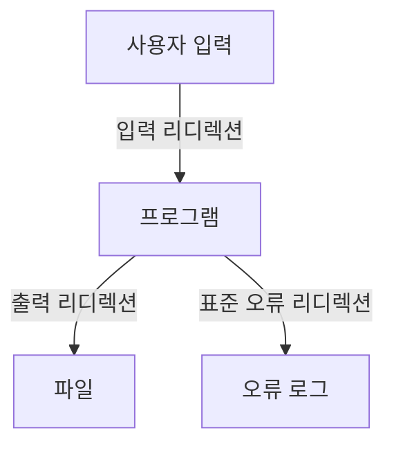

이 다이어그램은 사용자가 입력한 데이터가 프로그램으로 전달되고, 프로그램의 출력과 오류가 각각 파일로 리디렉션되는 과정을 보여준다. I/O Redirection은 이러한 방식으로 데이터 흐름을 효율적으로 관리할 수 있게 해준다.

<!--
## 2. Redirection의 기본 개념
   - Redirection의 작동 원리
   - 파일 디스크립터(File Descriptors)란?
   - Redirection 연산자 소개
-->

## 2. Redirection의 기본 개념

**Redirection의 작동 원리**  

Redirection은 프로그램의 입력과 출력을 다른 파일이나 장치로 전환하는 기능이다. 기본적으로, 프로세스는 표준 입력(Standard Input, stdin), 표준 출력(Standard Output, stdout), 표준 오류(Standard Error, stderr)라는 세 가지 스트림을 사용한다. Redirection을 통해 이러한 스트림을 파일이나 다른 프로세스로 연결할 수 있다. 예를 들어, 명령어의 출력을 파일로 저장하거나, 파일의 내용을 명령어의 입력으로 사용할 수 있다.

다음은 Redirection의 작동 원리를 나타내는 다이어그램이다.

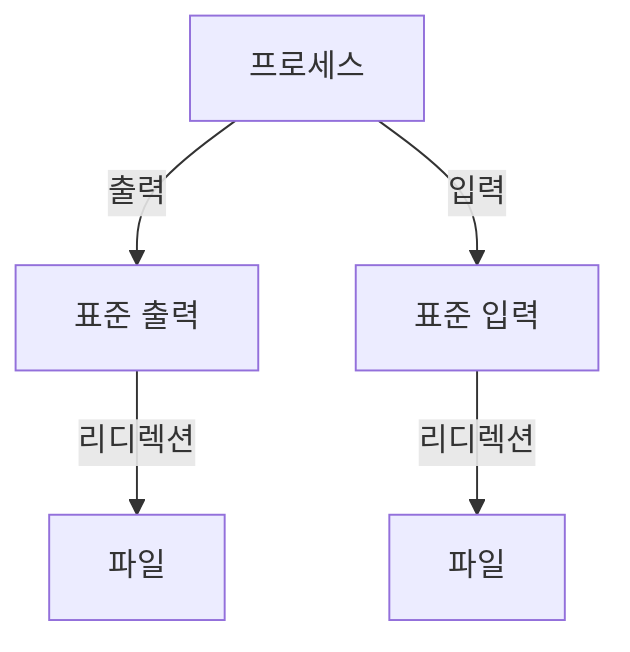

**파일 디스크립터(File Descriptors)란?**  

파일 디스크립터는 운영 체제에서 열린 파일이나 I/O 스트림을 식별하는 정수 값이다. 각 프로세스는 기본적으로 세 가지 파일 디스크립터를 가진다:  
- 0: 표준 입력 (stdin)
- 1: 표준 출력 (stdout)
- 2: 표준 오류 (stderr)

파일 디스크립터를 사용하면 프로세스가 어떤 파일이나 장치와 상호작용하는지를 명확하게 지정할 수 있다. 예를 들어, 파일 디스크립터 1을 사용하여 출력 스트림을 파일로 리디렉션할 수 있다.

**Redirection 연산자 소개** 

Redirection을 수행하기 위해 사용되는 주요 연산자는 다음과 같다:

- `>`: 표준 출력을 파일로 리디렉션한다. 기존 파일이 있을 경우 덮어쓴다.
- `>>`: 표준 출력을 파일에 추가한다. 기존 파일의 내용은 유지된다.
- `<`: 파일의 내용을 표준 입력으로 리디렉션한다.
- `2>`: 표준 오류를 파일로 리디렉션한다.
- `&>`: 표준 출력과 표준 오류를 모두 파일로 리디렉션한다.

이러한 연산자를 사용하여 다양한 방식으로 입력과 출력을 조작할 수 있다. 예를 들어, 다음과 같은 명령어를 통해 파일에 출력을 리디렉션할 수 있다.

```bash
echo "Hello, World!" > output.txt
```

위 명령어는 "Hello, World!"라는 문자열을 `output.txt` 파일에 저장한다.

<!--
## 3. Redirection의 종류
   ### 3.1 입력 리디렉션 (Redirecting Input)
   - 입력 리디렉션의 형식
   - 예제: 파일에서 입력 받기
-->

## 3. Redirection의 종류

**입력 리디렉션 (Redirecting Input)**

입력 리디렉션은 프로그램이 표준 입력(Standard Input) 대신 파일이나 다른 입력 소스를 사용하도록 하는 기능이다. 이를 통해 사용자는 명령어를 실행할 때 직접 입력하는 대신, 미리 작성된 파일의 내용을 입력으로 사용할 수 있다. 입력 리디렉션의 형식은 다음과 같다.

**형식**  

```
command < input_file
```
여기서 `command`는 실행할 명령어이며, `input_file`은 입력으로 사용할 파일의 경로이다. 이 형식을 사용하면, `command`는 `input_file`의 내용을 읽어들여 실행하게 된다.

**예제: 파일에서 입력 받기**  

다음은 `input.txt`라는 파일에서 입력을 받아 `sort` 명령어를 실행하는 예제이다.

```bash
sort < input.txt
```

위의 명령어는 `input.txt` 파일의 내용을 정렬하여 출력한다. 이와 같은 방식으로 입력 리디렉션을 활용하면, 대량의 데이터를 손쉽게 처리할 수 있다.

**다이어그램**  

아래는 입력 리디렉션의 작동 원리를 나타낸 다이어그램이다.

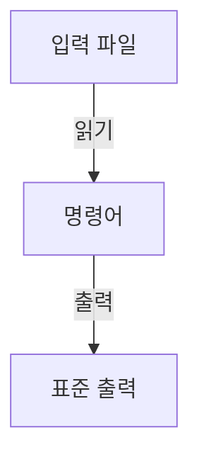

이 다이어그램은 입력 파일이 명령어로 읽혀지고, 그 결과가 표준 출력으로 나가는 과정을 보여준다. 입력 리디렉션을 통해 사용자는 파일의 내용을 직접 입력하지 않고도 명령어를 실행할 수 있는 장점을 누릴 수 있다.

<!--
   ### 3.2 출력 리디렉션 (Redirecting Output)
   - 출력 리디렉션의 형식
   - 예제: 파일로 출력하기
-->

**출력 리디렉션 (Redirecting Output)**

**출력 리디렉션의 형식** 

출력 리디렉션은 명령어의 표준 출력을 파일로 보내는 기능이다. 이를 통해 사용자는 명령어의 결과를 화면에 출력하는 대신 파일에 저장할 수 있다. 출력 리디렉션은 주로 `>` 연산자를 사용하여 수행된다. 기본적인 형식은 다음과 같다.

```
command > filename
```

위의 형식에서 `command`는 실행할 명령어이며, `filename`은 결과를 저장할 파일의 이름이다. 만약 `filename`이 이미 존재하는 경우, 해당 파일의 내용은 덮어쓰여진다. 기존 파일의 내용을 유지하면서 추가하고 싶다면 `>>` 연산자를 사용할 수 있다.

```
command >> filename
```

**예제: 파일로 출력하기**  

다음은 간단한 예제를 통해 출력 리디렉션을 설명하겠다. 아래의 명령어는 현재 디렉토리의 파일 목록을 `file_list.txt`라는 파일에 저장하는 방법이다.

```bash
ls -l > file_list.txt
```

이 명령어를 실행하면 현재 디렉토리의 파일 목록이 `file_list.txt` 파일에 저장된다. 만약 `file_list.txt`가 이미 존재한다면, 그 내용은 새로운 파일 목록으로 덮어쓰여진다.

아래는 출력 리디렉션의 과정을 나타내는 다이어그램이다.

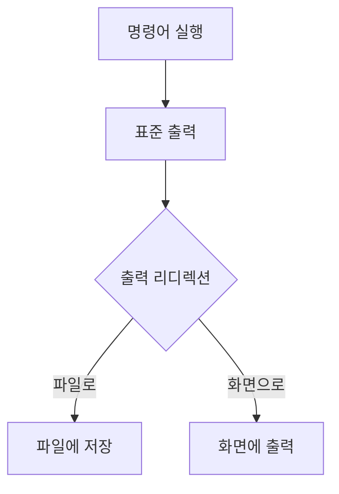

이와 같이 출력 리디렉션을 활용하면 명령어의 결과를 파일로 저장하여 나중에 참고하거나 분석할 수 있는 장점이 있다.

<!--
   ### 3.3 출력 추가 리디렉션 (Appending Redirected Output)
   - 출력 추가 리디렉션의 형식
   - 예제: 파일에 추가하기
-->

## 3.3 출력 추가 리디렉션 (Appending Redirected Output)

**출력 추가 리디렉션의 형식**  

출력 추가 리디렉션은 기존 파일의 내용을 유지하면서 새로운 출력을 파일에 추가하는 방법이다. 이때 사용하는 연산자는 `>>`이다. 기본적인 형식은 다음과 같다.

```
command >> filename
```

위의 형식에서 `command`는 실행할 명령어이며, `filename`은 출력을 추가할 대상 파일이다. 만약 `filename`이 존재하지 않는 경우, 새로운 파일이 생성된다. 

**예제: 파일에 추가하기**  

다음은 출력 추가 리디렉션을 사용하는 간단한 예제이다. 이 예제에서는 `echo` 명령어를 사용하여 문자열을 파일에 추가한다.

```bash
echo "Hello, World!" >> output.txt
echo "Appending this line." >> output.txt
```

위의 코드를 실행하면 `output.txt` 파일에 두 개의 문자열이 추가된다. 만약 파일이 존재하지 않는 경우, `output.txt` 파일이 새로 생성되고, 두 문자열이 그 안에 추가된다.

**다이어그램**  

아래는 출력 추가 리디렉션의 과정을 나타내는 다이어그램이다.

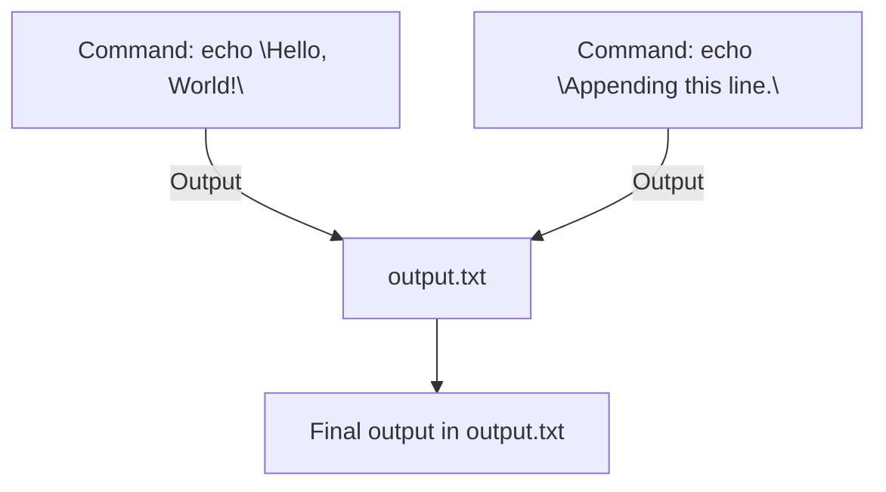

위의 다이어그램에서 `Command`는 실행된 명령어를 나타내며, `Output`은 해당 명령어의 결과가 `output.txt` 파일에 추가되는 과정을 보여준다. 최종적으로 `output.txt` 파일에는 두 개의 문자열이 포함된다. 

출력 추가 리디렉션은 로그 파일이나 데이터 파일에 지속적으로 정보를 기록할 때 유용하게 사용된다. 이를 통해 기존 데이터를 손실하지 않고 새로운 데이터를 추가할 수 있다.

<!--
   ### 3.4 표준 출력 및 표준 오류 리디렉션 (Redirecting Standard Output and Standard Error)
   - 두 가지 형식의 설명
   - 예제: 표준 오류를 파일로 리디렉션하기
-->

## 3.4 표준 출력 및 표준 오류 리디렉션 (Redirecting Standard Output and Standard Error)

**두 가지 형식의 설명**

리디렉션은 표준 출력(Standard Output, stdout)과 표준 오류(Standard Error, stderr)를 파일이나 다른 명령어로 전송하는 데 사용된다. 표준 출력은 일반적인 출력 결과를 나타내며, 표준 오류는 프로그램 실행 중 발생하는 오류 메시지를 나타낸다. 이 두 가지는 각각의 파일 디스크립터를 통해 관리된다.

- 표준 출력은 파일 디스크립터 1에 해당하며, 기본적으로 터미널에 출력된다.
- 표준 오류는 파일 디스크립터 2에 해당하며, 오류 메시지 또한 기본적으로 터미널에 출력된다.

리디렉션을 통해 이 두 가지 출력을 파일로 저장하거나 다른 명령어로 전달할 수 있다. 이를 통해 오류 메시지를 별도로 관리하거나, 출력 결과를 파일로 기록하는 등의 작업이 가능하다.

**예제: 표준 오류를 파일로 리디렉션하기**

다음은 표준 오류를 파일로 리디렉션하는 간단한 예제이다. 아래의 명령어는 존재하지 않는 파일을 열려고 시도하여 발생하는 오류 메시지를 `error.log`라는 파일에 저장한다.

```bash
cat nonexistentfile.txt 2> error.log
```

위 명령어에서 `2>`는 표준 오류를 리디렉션하는 연산자이다. 이 명령어를 실행하면, `nonexistentfile.txt` 파일이 존재하지 않기 때문에 발생하는 오류 메시지가 `error.log` 파일에 기록된다.

다이어그램을 통해 이 과정을 시각적으로 표현할 수 있다.

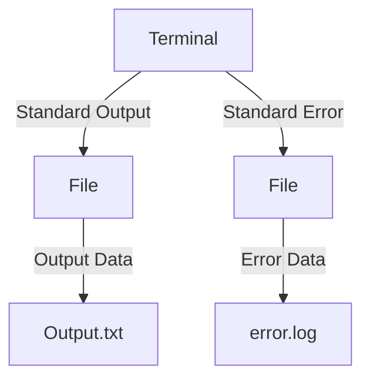

위의 다이어그램은 터미널에서 발생하는 표준 출력과 표준 오류가 각각 다른 파일로 리디렉션되는 과정을 보여준다. 이와 같은 리디렉션을 활용하면, 프로그램의 실행 결과와 오류를 효과적으로 관리할 수 있다.

<!--
   ### 3.6 Here Documents
   - Here Document의 정의 및 형식
   - 예제: Here Document 사용하기
-->

## 3.6 Here Documents

**Here Document의 정의 및 형식**  

Here Document는 스크립트 내에서 여러 줄의 텍스트를 입력할 수 있는 방법이다. 주로 Bash와 같은 셸 스크립트에서 사용되며, 명령어에 여러 줄의 입력을 제공할 때 유용하다. Here Document는 `<<` 연산자를 사용하여 시작하며, 종료 문자열을 통해 입력의 끝을 정의한다. 기본 형식은 다음과 같다.

```bash
command <<EOF
여기에 여러 줄의 텍스트를 입력합니다.
이 텍스트는 command에 전달됩니다.
EOF
```

여기서 `EOF`는 종료 문자열로, 사용자가 원하는 다른 문자열로 변경할 수 있다. 중요한 점은 종료 문자열이 입력의 마지막 줄에 위치해야 하며, 그 앞에 공백이 없어야 한다는 것이다.

**예제: Here Document 사용하기**  

다음은 Here Document를 사용하여 `cat` 명령어로 여러 줄의 텍스트를 출력하는 예제이다.

```bash
cat <<EOF
안녕하세요.
이것은 Here Document의 예제입니다.
여러 줄의 텍스트를 쉽게 입력할 수 있습니다.
EOF
```

위의 코드를 실행하면 다음과 같은 출력이 나타난다.

```
안녕하세요.
이것은 Here Document의 예제입니다.
여러 줄의 텍스트를 쉽게 입력할 수 있습니다.
```

이와 같이 Here Document를 사용하면 스크립트 내에서 복잡한 입력을 간편하게 처리할 수 있다. 

**다이어그램**  

Here Document의 작동 원리를 시각적으로 나타내기 위해 다음과 같은 다이어그램을 사용할 수 있다.

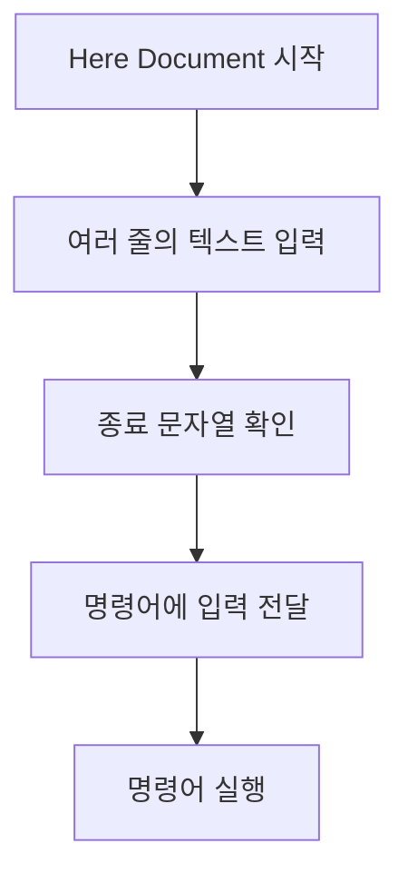

이 다이어그램은 Here Document의 흐름을 간단하게 설명하며, 입력이 어떻게 처리되는지를 보여준다. Here Document는 스크립트 작성 시 가독성을 높이고, 복잡한 입력을 간편하게 관리할 수 있는 유용한 도구이다.

<!--
   ### 3.7 Here Strings
   - Here String의 정의 및 형식
   - 예제: Here String 사용하기
-->

## 3.7 Here Strings

**Here String의 정의 및 형식**  

Here String은 Bash에서 문자열을 표준 입력으로 전달하기 위해 사용하는 구문이다. 일반적으로 Here String은 `<<<` 연산자를 사용하여 정의된다. 이 구문은 간단한 문자열을 명령어에 직접 전달할 수 있는 방법을 제공하며, 주로 짧은 텍스트를 입력으로 사용할 때 유용하다.

Here String의 기본 형식은 다음과 같다:

```
command <<< "string"
```

여기서 `command`는 실행할 명령어이며, `"string"`은 해당 명령어에 전달할 입력 문자열이다.

**예제: Here String 사용하기**  

다음은 Here String을 사용하여 `cat` 명령어로 문자열을 출력하는 예제이다.

```bash
cat <<< "Hello, World!"
```

위의 코드를 실행하면, `cat` 명령어가 Here String으로 전달된 "Hello, World!"를 출력하게 된다. 

이와 같은 방식으로 Here String을 사용하면, 간단한 문자열을 명령어에 쉽게 전달할 수 있어 스크립트 작성 시 유용하다.

**다이어그램**  

Here String의 작동 방식을 시각적으로 나타내기 위해 다음과 같은 다이어그램을 사용할 수 있다:

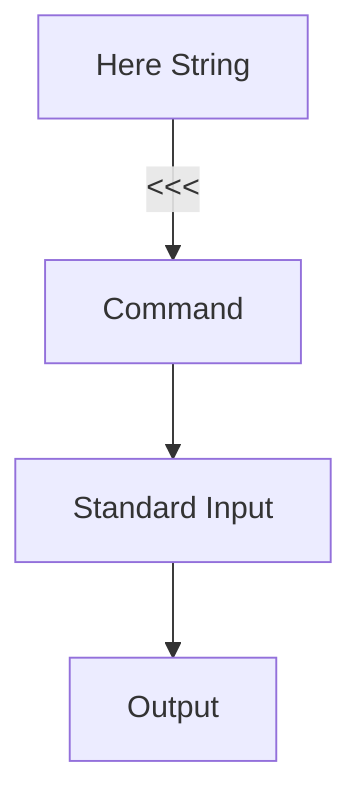

이 다이어그램은 Here String이 명령어에 어떻게 연결되는지를 보여준다. Here String은 명령어에 직접 연결되어 표준 입력으로 전달되며, 최종적으로 출력 결과를 생성하게 된다. 

이와 같이 Here String은 간단하고 직관적인 방법으로 문자열을 명령어에 전달할 수 있는 유용한 기능이다.

<!--
   ### 3.8 파일 디스크립터 복제 (Duplicating File Descriptors)
   - 입력 및 출력 파일 디스크립터 복제 방법
   - 예제: 파일 디스크립터 복제하기
-->

## 3.8 파일 디스크립터 복제 (Duplicating File Descriptors)

**입력 및 출력 파일 디스크립터 복제 방법**  

파일 디스크립터(File Descriptor)는 프로세스가 파일이나 소켓과 같은 I/O 자원에 접근하기 위해 사용하는 정수 값이다. 파일 디스크립터 복제는 기존의 파일 디스크립터를 새로운 파일 디스크립터로 복사하는 과정을 의미한다. 이 과정은 주로 `dup()` 또는 `dup2()` 시스템 호출을 통해 이루어진다.

- `dup(fd)`는 주어진 파일 디스크립터 `fd`를 복제하여 새로운 파일 디스크립터를 반환한다. 이때 반환되는 파일 디스크립터는 가장 낮은 값의 사용 가능한 파일 디스크립터가 된다.
- `dup2(oldfd, newfd)`는 `oldfd`를 `newfd`로 복제한다. 만약 `newfd`가 이미 열려 있다면, 해당 파일 디스크립터는 닫힌 후에 복제된다.

이러한 복제는 프로세스가 여러 파일 디스크립터를 통해 동일한 파일이나 소켓에 접근할 수 있도록 해준다.

**예제: 파일 디스크립터 복제하기**  

다음은 C 언어를 사용하여 파일 디스크립터를 복제하는 간단한 예제이다. 이 예제에서는 표준 출력을 파일로 리디렉션한 후, 복제된 파일 디스크립터를 사용하여 파일에 데이터를 쓴다.

```c
#include <stdio.h>
#include <unistd.h>
#include <fcntl.h>

int main() {
    int fd = open("output.txt", O_WRONLY | O_CREAT | O_TRUNC, 0644);
    if (fd == -1) {
        perror("open");
        return 1;
    }

    // 표준 출력을 파일로 리디렉션
    int saved_stdout = dup(STDOUT_FILENO);
    dup2(fd, STDOUT_FILENO);

    // 이제부터의 printf는 output.txt에 기록된다
    printf("이 내용은 output.txt 파일에 저장됩니다.\n");

    // 원래의 표준 출력을 복원
    dup2(saved_stdout, STDOUT_FILENO);
    close(saved_stdout);
    close(fd);

    // 표준 출력으로 복원된 상태에서 출력
    printf("이 내용은 터미널에 출력됩니다.\n");

    return 0;
}
```

위의 코드에서 `open()` 함수를 사용하여 `output.txt` 파일을 열고, `dup()`와 `dup2()`를 통해 표준 출력을 파일로 리디렉션한다. 이후 `printf()`를 사용하여 파일에 데이터를 기록하고, 마지막으로 원래의 표준 출력을 복원한다.

**다이어그램**  

다음은 파일 디스크립터 복제 과정을 나타내는 다이어그램이다.

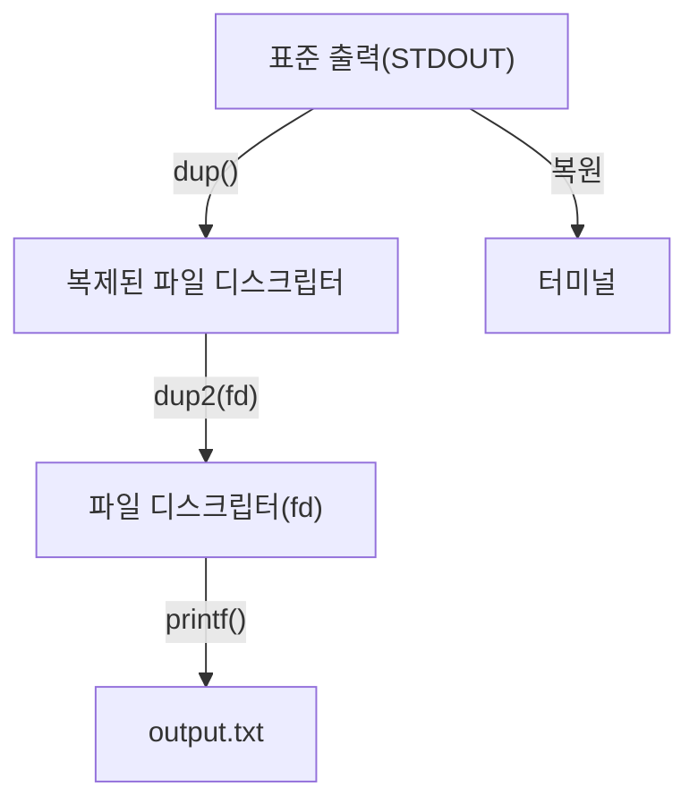

이와 같이 파일 디스크립터 복제를 통해 프로세스는 다양한 I/O 자원에 유연하게 접근할 수 있으며, 이를 통해 효율적인 데이터 처리가 가능해진다.

<!--
   ### 3.9 파일 디스크립터 이동 (Moving File Descriptors)
   - 파일 디스크립터 이동의 형식
   - 예제: 파일 디스크립터 이동하기
-->

## 3.9 파일 디스크립터 이동 (Moving File Descriptors)

**파일 디스크립터 이동의 형식** 

파일 디스크립터 이동은 기존의 파일 디스크립터를 다른 파일 디스크립터로 재지정하는 과정이다. 이를 통해 프로세스가 사용하는 파일 디스크립터를 변경할 수 있으며, 주로 `dup` 또는 `dup2` 시스템 호출을 사용하여 수행된다. 

`dup` 함수는 주어진 파일 디스크립터의 복사본을 생성하고, `dup2` 함수는 특정 파일 디스크립터를 다른 파일 디스크립터로 재지정한다. 이 두 함수의 기본 형식은 다음과 같다.

```c
int dup(int oldfd);
int dup2(int oldfd, int newfd);
```

- `oldfd`: 복사할 기존 파일 디스크립터
- `newfd`: 재지정할 파일 디스크립터 (이 값이 -1이면 자동으로 가장 낮은 사용 가능한 파일 디스크립터가 할당됨)

**예제: 파일 디스크립터 이동하기**  

다음은 `dup2`를 사용하여 표준 출력(STDOUT) 파일 디스크립터를 파일로 이동하는 간단한 예제이다. 이 예제에서는 "output.txt"라는 파일에 출력을 리디렉션한다.

```c
#include <stdio.h>
#include <unistd.h>
#include <fcntl.h>

int main() {
    int fd = open("output.txt", O_WRONLY | O_CREAT | O_TRUNC, 0644);
    if (fd == -1) {
        perror("open");
        return 1;
    }

    // 표준 출력을 파일 디스크립터로 이동
    dup2(fd, STDOUT_FILENO);
    close(fd);

    // 이제 printf는 output.txt 파일에 기록된다
    printf("이 메시지는 output.txt 파일에 기록됩니다.\n");

    return 0;
}
```

위의 코드는 "output.txt" 파일을 열고, 표준 출력을 해당 파일로 이동시킨다. 이후의 `printf` 호출은 콘솔이 아닌 파일에 기록된다.

**다이어그램**  

다음은 파일 디스크립터 이동의 과정을 나타내는 다이어그램이다.

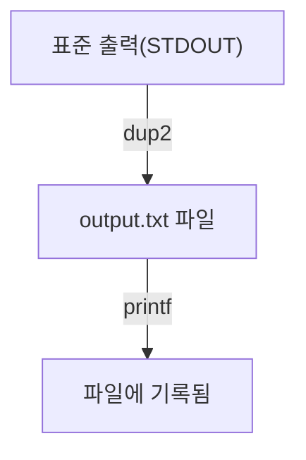

이와 같이 파일 디스크립터 이동을 통해 프로세스의 출력 방향을 변경할 수 있으며, 다양한 상황에서 유용하게 활용될 수 있다.

<!--
## 4. 파이프라인 (Pipelines)
   - 파이프라인의 정의 및 사용법
   - 예제: 여러 명령어 연결하기
-->

## 4. 파이프라인 (Pipelines)

**파이프라인의 정의 및 사용법**  

파이프라인(Pipeline)은 여러 개의 명령어를 연결하여, 한 명령어의 출력을 다음 명령어의 입력으로 사용하는 방식이다. 이를 통해 복잡한 작업을 간단하게 수행할 수 있으며, 각 명령어는 독립적으로 실행된다. 파이프라인은 주로 리눅스와 유닉스 환경에서 사용되며, 효율적인 데이터 처리를 가능하게 한다.

파이프라인을 사용할 때는 `|` 연산자를 사용하여 명령어를 연결한다. 예를 들어, `command1 | command2`와 같이 작성하면 `command1`의 출력이 `command2`의 입력으로 전달된다. 이러한 방식은 데이터 흐름을 원활하게 하여, 중간 결과를 파일에 저장하지 않고도 여러 작업을 연속적으로 수행할 수 있게 해준다.

**예제: 여러 명령어 연결하기**  

다음은 파이프라인을 사용하여 파일의 내용을 필터링하고 정렬하는 예제이다. 이 예제에서는 `cat`, `grep`, `sort` 명령어를 사용하여 특정 단어가 포함된 줄을 찾아 정렬하는 과정을 보여준다.

```bash
cat example.txt | grep "keyword" | sort
```

위의 명령어는 다음과 같은 과정을 거친다:
1. `cat example.txt`: `example.txt` 파일의 내용을 출력한다.
2. `grep "keyword"`: 출력된 내용 중에서 "keyword"가 포함된 줄만 필터링한다.
3. `sort`: 필터링된 결과를 정렬한다.

이러한 방식으로 파이프라인을 활용하면, 여러 명령어를 조합하여 복잡한 작업을 간단하게 수행할 수 있다.

**다이어그램**  

다음은 파이프라인의 작동 방식을 나타내는 다이어그램이다.

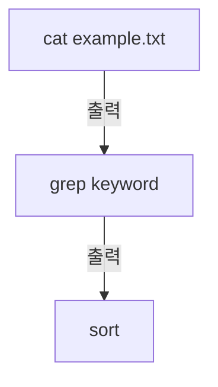

위의 다이어그램은 `cat` 명령어의 출력이 `grep` 명령어로 전달되고, 그 결과가 다시 `sort` 명령어로 전달되는 과정을 시각적으로 나타낸 것이다. 이러한 흐름을 통해 데이터가 어떻게 처리되는지를 쉽게 이해할 수 있다. 

파이프라인은 리눅스 환경에서 매우 유용한 도구이며, 다양한 명령어를 조합하여 효율적으로 작업을 수행할 수 있도록 도와준다.

<!--
## 5. 필터 (Filters)
   - 필터의 정의 및 역할
   - 일반적인 필터 명령어 목록 및 설명
-->

## 5. 필터 (Filters)

**필터의 정의 및 역할**  

필터는 입력 데이터를 처리하여 원하는 형식으로 변환하거나 특정 정보를 추출하는 프로그램이다. 일반적으로 필터는 표준 입력을 받아들이고, 처리된 결과를 표준 출력으로 내보낸다. 이러한 특성 덕분에 필터는 파이프라인에서 다른 명령어와 결합하여 복잡한 데이터 처리 작업을 수행할 수 있다. 필터는 데이터의 흐름을 제어하고, 필요한 정보를 효율적으로 추출하는 데 중요한 역할을 한다.

예를 들어, 텍스트 파일에서 특정 단어를 포함하는 줄만 추출하거나, 데이터를 정렬하는 등의 작업을 필터를 통해 쉽게 수행할 수 있다.

**일반적인 필터 명령어 목록 및 설명**  

다음은 자주 사용되는 필터 명령어와 그 설명이다:

1. **grep**: 특정 패턴을 포함하는 줄을 검색하여 출력하는 필터이다. 예를 들어, `grep "error" logfile.txt` 명령어는 `logfile.txt` 파일에서 "error"라는 단어가 포함된 모든 줄을 출력한다.

2. **awk**: 텍스트 파일을 필드 단위로 처리할 수 있는 강력한 프로그래밍 언어이다. 데이터의 특정 필드를 추출하거나, 계산을 수행하는 데 유용하다. 예를 들어, `awk '{print $1}' data.txt` 명령어는 `data.txt` 파일의 첫 번째 필드만 출력한다.

3. **sed**: 스트림 편집기(Stream Editor)로, 텍스트 데이터를 변환하거나 수정하는 데 사용된다. 예를 들어, `sed 's/foo/bar/g' file.txt` 명령어는 `file.txt` 파일에서 "foo"를 "bar"로 변경한다.

4. **sort**: 입력 데이터를 정렬하는 필터이다. 예를 들어, `sort names.txt` 명령어는 `names.txt` 파일의 내용을 알파벳 순으로 정렬하여 출력한다.

5. **uniq**: 중복된 줄을 제거하는 필터이다. 일반적으로 `sort`와 함께 사용되어 중복된 데이터를 제거한다. 예를 들어, `sort names.txt | uniq` 명령어는 `names.txt` 파일의 중복된 이름을 제거하여 출력한다.

다음은 필터의 작동 방식을 나타내는 다이어그램이다:

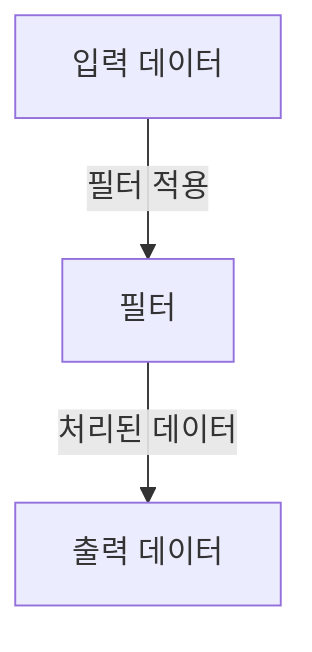

이와 같이 필터는 입력 데이터를 받아 처리한 후, 원하는 형식으로 출력하는 역할을 수행한다. 필터를 적절히 활용하면 데이터 처리 작업을 효율적으로 수행할 수 있다.

<!--
## 6. FAQ
   - I/O Redirection 관련 자주 묻는 질문
   - Redirection 사용 시 주의사항
-->

## 6. FAQ

**I/O Redirection 관련 자주 묻는 질문**

I/O Redirection에 대해 자주 묻는 질문들은 다음과 같다.

1. **I/O Redirection이란 무엇인가요?**
   I/O Redirection은 프로그램의 입력과 출력을 파일이나 다른 프로그램으로 전환하는 기능이다. 이를 통해 사용자는 명령어의 결과를 파일에 저장하거나, 파일의 내용을 명령어의 입력으로 사용할 수 있다.

2. **리디렉션을 사용할 때 주의해야 할 점은 무엇인가요?**
   리디렉션을 사용할 때는 파일의 덮어쓰기(overwrite)와 추가(append) 모드의 차이를 이해해야 한다. 기본적으로 `>` 연산자는 파일을 덮어쓰고, `>>` 연산자는 파일에 내용을 추가한다. 이로 인해 중요한 데이터가 손실될 수 있으므로 주의가 필요하다.

3. **리디렉션을 사용하여 오류 메시지를 파일로 저장할 수 있나요?**
   네, 표준 오류를 파일로 리디렉션할 수 있다. 예를 들어, `command 2> error.log`와 같이 사용하면 오류 메시지가 `error.log` 파일에 저장된다.

4. **Here Document는 무엇인가요?**
   Here Document는 스크립트 내에서 여러 줄의 입력을 제공할 수 있는 방법이다. 이를 통해 복잡한 입력을 간편하게 처리할 수 있다.

**Redirection 사용 시 주의사항**

1. **파일 권한 확인**
   리디렉션을 사용하기 전에 파일의 읽기 및 쓰기 권한을 확인해야 한다. 권한이 없으면 리디렉션이 실패할 수 있다.

2. **리디렉션 연산자의 사용**
   리디렉션 연산자를 사용할 때는 항상 올바른 형식을 지켜야 한다. 예를 들어, `command > file`과 같이 공백을 주의해야 하며, 잘못된 형식은 오류를 발생시킬 수 있다.

3. **리디렉션의 순서**
   여러 개의 리디렉션을 사용할 경우, 순서에 따라 결과가 달라질 수 있다. 예를 들어, `command > output.txt 2> error.txt`와 같이 사용하면 표준 출력과 표준 오류를 각각 다른 파일로 리디렉션할 수 있다.

4. **파일의 존재 여부**
   리디렉션을 통해 생성할 파일이 이미 존재하는 경우, 기본적으로 덮어쓰기가 발생하므로 주의해야 한다. 이를 방지하기 위해 `>>` 연산자를 사용하여 추가 모드로 파일을 열 수 있다.

다음은 리디렉션을 사용하는 간단한 예제 코드이다.

```bash
# 표준 출력을 파일로 리디렉션
echo "Hello, World!" > output.txt

# 표준 오류를 파일로 리디렉션
ls non_existing_file 2> error.log

# Here Document 사용 예
cat << EOF > here_document.txt
This is a Here Document example.
EOF
```

다이어그램을 통해 리디렉션의 흐름을 시각적으로 표현할 수 있다.

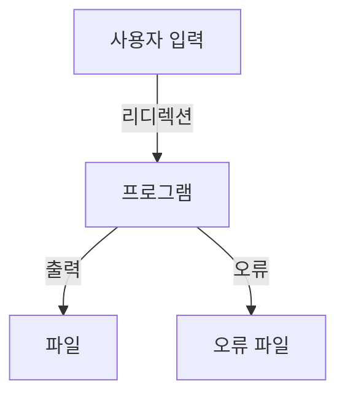

이와 같이 I/O Redirection에 대한 자주 묻는 질문과 주의사항을 정리하였다. 이를 통해 리디렉션을 보다 효과적으로 활용할 수 있을 것이다.

<!--
## 7. 관련 기술
   - Bash 스크립트
   - 리눅스 명령어
   - 텍스트 처리 도구 (예: awk, sed)
-->

## 7. 관련 기술

**Bash 스크립트**  

Bash 스크립트는 리눅스 및 유닉스 시스템에서 널리 사용되는 스크립트 언어이다. Bash는 "Bourne Again SHell"의 약자로, 명령어를 자동화하고 반복적인 작업을 수행하는 데 유용하다. I/O Redirection은 Bash 스크립트에서 매우 중요한 기능으로, 파일에서 데이터를 읽거나 파일로 출력을 저장하는 데 사용된다. 다음은 간단한 Bash 스크립트 예제이다.

```bash
#!/bin/bash

# 입력 파일에서 데이터를 읽어 출력 파일에 저장하는 스크립트
input_file="input.txt"
output_file="output.txt"

# 입력 리디렉션을 사용하여 파일에서 읽기
while read line; do
    echo "$line" >> "$output_file"  # 출력 리디렉션을 사용하여 파일에 추가
done < "$input_file"
```

**리눅스 명령어**  

리눅스 명령어는 리눅스 운영 체제에서 사용되는 기본적인 명령어들로, 시스템 관리 및 파일 조작에 필수적이다. I/O Redirection은 이러한 명령어와 함께 사용되어, 명령어의 입력 및 출력을 제어할 수 있다. 예를 들어, `cat` 명령어를 사용하여 파일 내용을 출력하고, 이를 다른 파일로 리디렉션할 수 있다.

```bash
cat input.txt > output.txt  # input.txt의 내용을 output.txt로 리디렉션
```

**텍스트 처리 도구 (예: awk, sed)**  

텍스트 처리 도구는 파일 내의 텍스트를 조작하고 변환하는 데 사용되는 강력한 도구들이다. `awk`와 `sed`는 특히 데이터 처리 및 변환에 유용하다. I/O Redirection과 함께 사용하면, 파일에서 데이터를 읽고 처리한 후 결과를 다른 파일에 저장할 수 있다.

다음은 `awk`를 사용하여 특정 열을 추출하고 결과를 파일로 저장하는 예제이다.

```bash
awk '{print $1}' input.txt > output.txt  # input.txt의 첫 번째 열을 output.txt로 리디렉션
```

다이어그램을 통해 Bash 스크립트와 리눅스 명령어의 I/O Redirection 흐름을 시각적으로 표현할 수 있다.

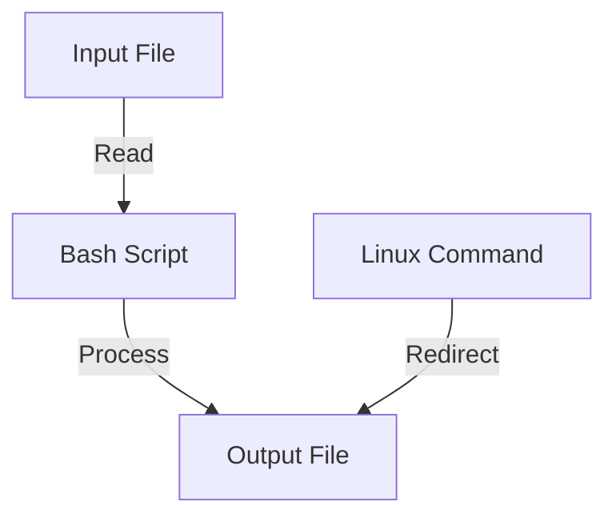

이와 같이 Bash 스크립트, 리눅스 명령어, 텍스트 처리 도구는 I/O Redirection과 함께 사용되어 효율적인 데이터 처리 및 자동화를 가능하게 한다.

<!--
## 8. 결론
   - I/O Redirection의 요약
   - 실무에서의 활용 방안
   - 추가 학습 자료 및 참고 링크
-->

## 8. 결론

**I/O Redirection의 요약**  

I/O Redirection은 프로그램의 입력과 출력을 제어하는 중요한 기능이다. 이를 통해 사용자는 명령어의 입력을 파일로부터 읽거나, 명령어의 출력을 파일로 저장할 수 있다. 이러한 기능은 스크립트 작성 및 자동화 작업에서 매우 유용하게 활용된다. Redirection은 표준 입력(Standard Input), 표준 출력(Standard Output), 표준 오류(Standard Error)와 같은 파일 디스크립터를 사용하여 작동하며, 다양한 연산자를 통해 쉽게 구현할 수 있다.

**실무에서의 활용 방안**  

I/O Redirection은 여러 실무 환경에서 다양하게 활용된다. 예를 들어, 로그 파일을 생성하여 프로그램의 실행 결과를 기록하거나, 대량의 데이터를 처리할 때 파일로부터 입력을 받아 처리하는 경우가 있다. 또한, 오류 메시지를 별도의 파일로 리디렉션하여 문제를 쉽게 추적할 수 있다. 아래는 I/O Redirection을 활용한 간단한 예제이다.

```bash
# 표준 출력을 파일로 리디렉션
echo "Hello, World!" > output.txt

# 표준 오류를 파일로 리디렉션
ls non_existent_file 2> error.log

# 입력을 파일로부터 받기
sort < input.txt
```

**추가 학습 자료 및 참고 링크**  

I/O Redirection에 대한 더 깊은 이해를 원한다면 다음 자료를 참고하는 것이 좋다.  
- [Bash Scripting Guide](https://tldp.org/LDP/Bash-Beginners-Guide/html/)
- [Linux Command Line](https://linuxcommand.org/)
- [Advanced Bash-Scripting Guide](https://tldp.org/LDP/abs/html/)

아래는 I/O Redirection의 기본 개념을 시각적으로 나타낸 다이어그램이다.


이와 같은 자료를 통해 I/O Redirection의 개념을 더욱 확고히 하고, 실무에서의 활용 방안을 모색할 수 있다.

<!--
##### Reference #####
-->

## Reference


* [https://www.gnu.org/software/bash/manual/html_node/Redirections.html](https://www.gnu.org/software/bash/manual/html_node/Redirections.html)
* [https://linuxcommand.org/lc3_lts0070.php](https://linuxcommand.org/lc3_lts0070.php)

