명령어의 입력과 출력을 다루는 **I/O 리디렉션**은 리눅스·유닉스 환경에서 로그 저장, 스크립트 자동화, 파이프 조합에 필수적이다. 이 글에서는 표준 입출력·파일 디스크립터·리디렉션 연산자·Here Document·파이프라인까지 한 번에 정리한다.

---

## 개요

**I/O Redirection의 정의**

I/O Redirection은 프로그램의 **표준 입력(Standard Input, stdin)**·**표준 출력(Standard Output, stdout)**·**표준 오류(Standard Error, stderr)** 스트림을 파일이나 다른 프로세스와 연결하는 기법이다. 셸이 명령 실행 전에 입출력 대상을 바꿔 주므로, 결과를 파일에 저장하거나 파일 내용을 명령 입력으로 쓸 수 있다.

**중요성 및 활용 사례**

- 데이터 흐름 제어: 결과를 파일·다른 명령으로 보내기
- 여러 명령 연결: 파이프와 함께 복잡한 작업을 한 줄로 처리
- 로그·오류 분리: stdout과 stderr를 각각 다른 파일로 기록

예시:

- **입력 리디렉션**: `command < input.txt`
- **출력 리디렉션**: `command > output.txt`
- **표준 오류 리디렉션**: `command 2> error.log`

아래는 I/O 리디렉션의 전체 흐름을 나타낸 다이어그램이다.

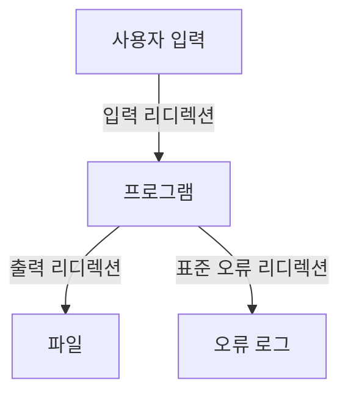
```mermaid
graph TD
    UserInput["사용자 입력"] -->|"입력 리디렉션"| Program["프로그램"]
    Program -->|"출력 리디렉션"| OutFile["파일"]
    Program -->|"표준 오류 리디렉션"| ErrorLog["오류 로그"]
```

---

## Redirection의 기본 개념

**작동 원리**

리디렉션은 프로세스의 stdin(0), stdout(1), stderr(2)를 파일·장치·다른 프로세스로 **재지정**한다. 셸이 명령 실행 전에 이 스트림들을 열고, 명령이 끝나면 정리한다. 예: `command > out.txt`는 stdout을 `out.txt`로 바꾼 뒤 `command`를 실행한다.

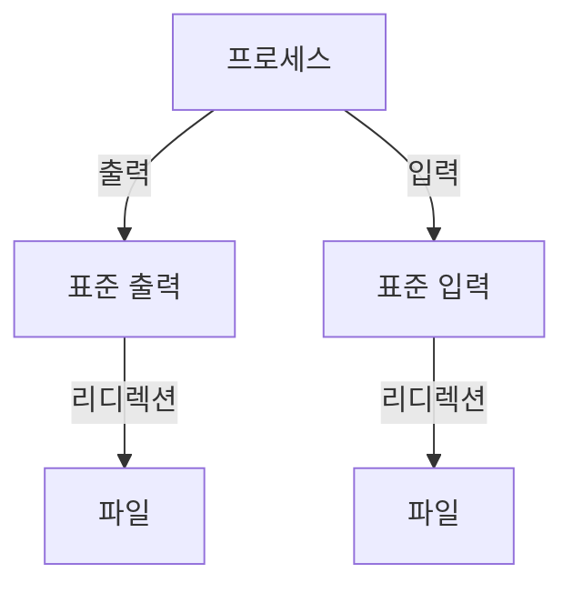
```mermaid
graph TD
    Process["프로세스"] -->|"출력"| StdOut["표준 출력"]
    Process -->|"입력"| StdIn["표준 입력"]
    StdOut -->|"리디렉션"| ToFile["파일"]
    StdIn -->|"리디렉션"| FromFile["파일"]
```

**파일 디스크립터(File Descriptors)**

운영체제가 열린 파일·I/O 스트림을 구분하는 **정수 핸들**이다. 프로세스마다 기본적으로 다음 세 개를 가진다.

| FD | 이름 | 기본 연결 |
|----|------|-----------|
| 0 | stdin | 키보드 |
| 1 | stdout | 터미널 화면 |
| 2 | stderr | 터미널 화면 |

리디렉션 시 이 번호로 대상을 지정한다(예: `2>`는 stderr만 리디렉션).

**주요 리디렉션 연산자**

| 연산자 | 의미 |
|--------|------|
| `>` | stdout을 파일로(덮어쓰기) |
| `>>` | stdout을 파일에 추가 |
| `<` | 파일을 stdin으로 |
| `2>` | stderr를 파일로 |
| `&>` | stdout과 stderr를 한 파일로 |
| `2>&1` | stderr를 stdout과 같은 곳으로 |

예:

```bash
echo "Hello, World!" > output.txt
```

---

## Redirection의 종류

### 입력 리디렉션 (Redirecting Input)

**형식**: `command < input_file`

`input_file` 내용이 해당 명령의 stdin이 된다.

**예: 파일에서 입력 받기**

```bash
sort < input.txt
```

`input.txt` 내용이 정렬되어 stdout으로 출력된다.

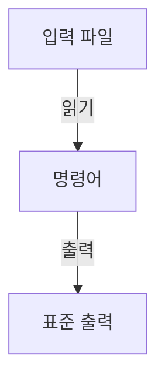
```mermaid
graph TD
    InputFile["입력 파일"] -->|"읽기"| Command["명령어"]
    Command -->|"출력"| StdOut["표준 출력"]
```

### 출력 리디렉션 (Redirecting Output)

**형식**: `command > filename` (덮어쓰기), `command >> filename` (추가)

**예: 파일로 출력하기**

```bash
ls -l > file_list.txt
```

현재 디렉터리 목록이 `file_list.txt`에 저장된다(기존 내용은 덮어쓰여진다).

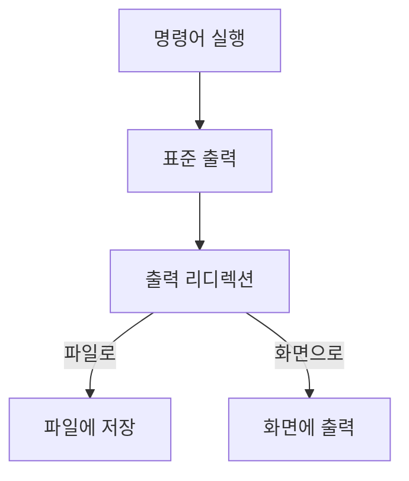
```mermaid
graph TD
    CmdRun["명령어 실행"] --> StdOut["표준 출력"]
    StdOut --> Redirect["출력 리디렉션"]
    Redirect -->|"파일로"| ToFile["파일에 저장"]
    Redirect -->|"화면으로"| ToScreen["화면에 출력"]
```

### 출력 추가 리디렉션 (Appending Redirected Output)

**형식**: `command >> filename`

**예: 파일에 추가하기**

```bash
echo "Hello, World!" >> output.txt
echo "Appending this line." >> output.txt
```

파일이 없으면 생성되고, 있으면 끝에만 추가된다.

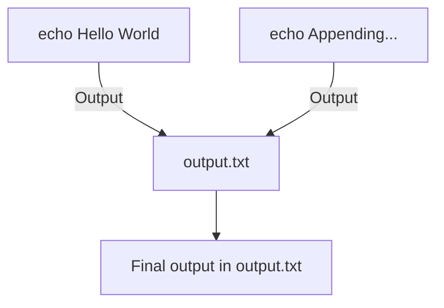
```mermaid
graph TD
    Cmd1["echo Hello World"] -->|"Output"| OutTxt["output.txt"]
    Cmd2["echo Appending..."] -->|"Output"| OutTxt
    OutTxt --> Final["Final output in output.txt"]
```

### 표준 출력 및 표준 오류 리디렉션

- stdout은 FD 1, stderr는 FD 2로 기본적으로 터미널에 출력된다.
- `2> file`: stderr만 파일로
- `&> file` 또는 `> file 2>&1`: stdout과 stderr를 한 파일로

**예: 표준 오류를 파일로**

```bash
cat nonexistentfile.txt 2> error.log
```

오류 메시지만 `error.log`에 기록된다.

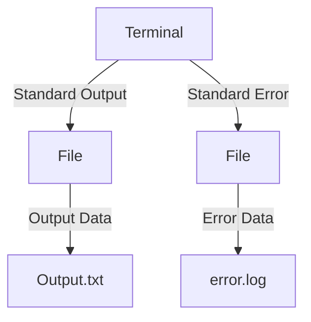
```mermaid
graph TD
    Term["Terminal"] -->|"Standard Output"| OutF["File"]
    Term -->|"Standard Error"| ErrF["File"]
    OutF -->|"Output Data"| OutTxt["Output.txt"]
    ErrF -->|"Error Data"| ErrLog["error.log"]
```

### Here Documents

스크립트 안에서 **여러 줄 텍스트**를 stdin으로 넘길 때 사용한다. `<<` 뒤에 **구분자(delimiter)**를 쓰고, 같은 구분자만 있는 줄까지가 입력이 된다.

**형식**:

```bash
command <<EOF
여러 줄의 텍스트.
EOF
```

구분자 줄 앞에 공백이 있으면 안 되며, `<<-`를 쓰면 앞쪽 탭은 제거된다.

**예**

```bash
cat <<EOF
안녕하세요.
Here Document 예제입니다.
EOF
```

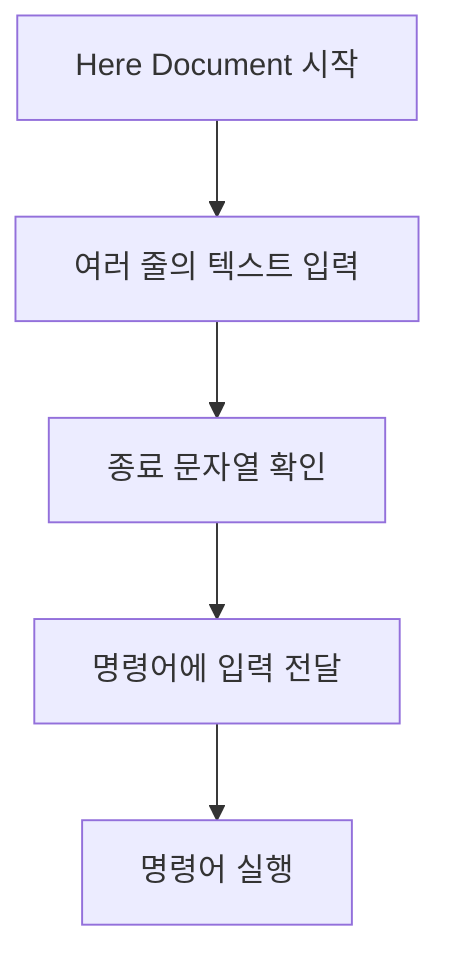
```mermaid
graph TD
    HerDocStart["Here Document 시작"] --> MultiLine["여러 줄의 텍스트 입력"]
    MultiLine --> CheckDelim["종료 문자열 확인"]
    CheckDelim --> PassToCmd["명령어에 입력 전달"]
    PassToCmd --> ExecCmd["명령어 실행"]
```

### Here Strings

한 줄 문자열을 stdin으로 넘길 때 사용한다. `<<<` 뒤에 문자열을 쓴다.

**형식**: `command <<< "string"`

**예**

```bash
cat <<< "Hello, World!"
```

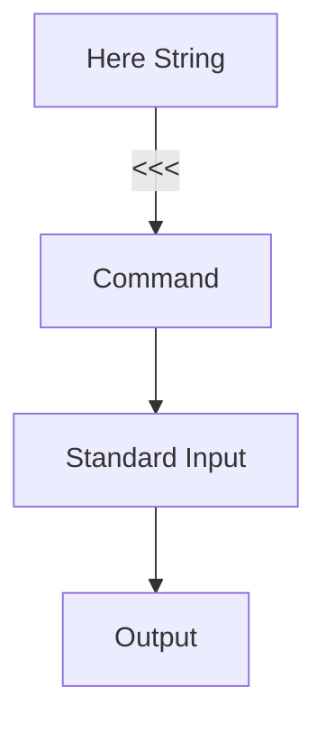
```mermaid
graph TD
    HereStr["Here String"] -->|"<<<"| Cmd["Command"]
    Cmd --> StdIn["Standard Input"]
    StdIn --> Out["Output"]
```

### 파일 디스크립터 복제 (Duplicating File Descriptors)

셸에서는 `n>&m`(출력 FD 복제), `n<&m`(입력 FD 복제)로 FD를 복사한다. C에서는 `dup()`, `dup2()`에 해당한다.

- `dup(fd)`: fd를 복제해 새 FD 반환
- `dup2(oldfd, newfd)`: oldfd를 newfd로 복제(기존 newfd는 닫힘)

**예: C에서 stdout을 파일로 잠시 리디렉션**

```c
#include <stdio.h>
#include <unistd.h>
#include <fcntl.h>

int main() {
    int fd = open("output.txt", O_WRONLY | O_CREAT | O_TRUNC, 0644);
    if (fd == -1) { perror("open"); return 1; }
    int saved_stdout = dup(STDOUT_FILENO);
    dup2(fd, STDOUT_FILENO);
    printf("이 내용은 output.txt에 저장됩니다.\n");
    dup2(saved_stdout, STDOUT_FILENO);
    close(saved_stdout); close(fd);
    printf("이 내용은 터미널에 출력됩니다.\n");
    return 0;
}
```

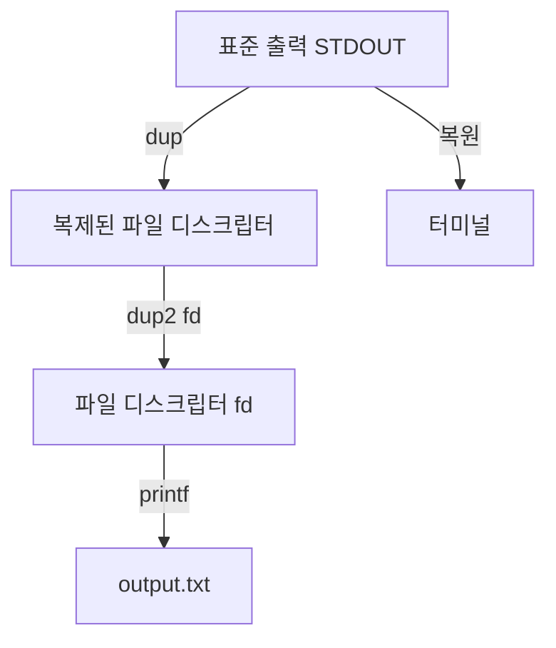
```mermaid
graph TD
    StdOut["표준 출력 STDOUT"] -->|"dup"| DupFd["복제된 파일 디스크립터"]
    DupFd -->|"dup2 fd"| Fd["파일 디스크립터 fd"]
    Fd -->|"printf"| OutTxt["output.txt"]
    StdOut -->|"복원"| Term["터미널"]
```

### 파일 디스크립터 이동 (Moving File Descriptors)

`n>&digit-` 또는 `n<&digit-`: digit FD를 n으로 복제한 뒤 digit을 닫는다. C의 `dup2` 후 `close`와 같다.

**예: C에서 stdout을 파일로 이동**

```c
dup2(fd, STDOUT_FILENO);
close(fd);
printf("이 메시지는 output.txt에 기록됩니다.\n");
```

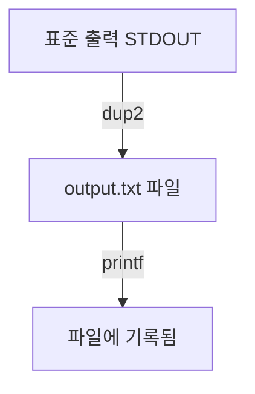
```mermaid
graph TD
    StdOut["표준 출력 STDOUT"] -->|"dup2"| OutFile["output.txt 파일"]
    OutFile -->|"printf"| Written["파일에 기록됨"]
```

---

## 파이프라인 (Pipelines)

**정의**: `|`로 여러 명령을 연결해, 앞 명령의 stdout을 뒤 명령의 stdin으로 넘긴다. 중간 결과를 파일에 쓰지 않고 연속 처리할 수 있다.

**예: 파일 내용 필터링 후 정렬**

```bash
cat example.txt | grep "keyword" | sort
```

1. `cat example.txt`: 파일 내용 출력  
2. `grep "keyword"`: "keyword" 포함 줄만 통과  
3. `sort`: 정렬 후 출력

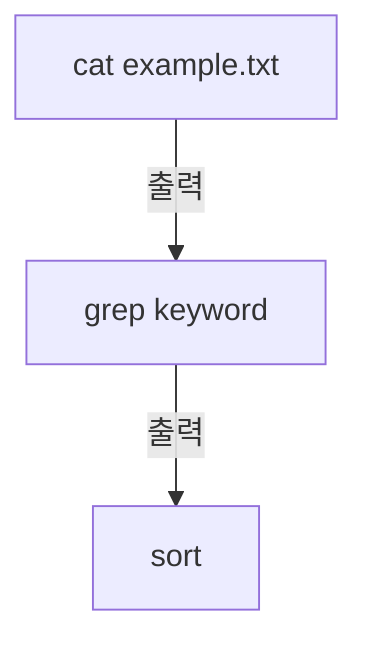
```mermaid
graph TD
    CatCmd["cat example.txt"] -->|"출력"| GrepCmd["grep keyword"]
    GrepCmd -->|"출력"| SortCmd["sort"]
```

---

## 필터 (Filters)

**정의**: stdin을 읽어 처리한 결과를 stdout으로 내보내는 프로그램. 파이프에서 연속으로 붙여 쓸 수 있다.

**자주 쓰는 필터**

| 명령 | 역할 |
|------|------|
| grep | 패턴이 있는 줄만 출력 |
| awk | 필드 단위 처리·계산 |
| sed | 스트림 편집(치환 등) |
| sort | 정렬 |
| uniq | 연속 중복 줄 제거(sort 후 사용 권장) |

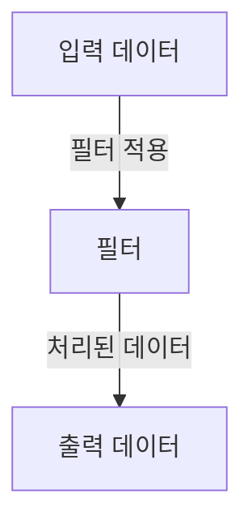
```mermaid
graph TD
    InputData["입력 데이터"] -->|"필터 적용"| Filter["필터"]
    Filter -->|"처리된 데이터"| OutputData["출력 데이터"]
```

---

## FAQ

**Q. I/O Redirection이란?**  
프로그램의 stdin·stdout·stderr를 파일이나 다른 프로세스로 바꾸는 기능이다.

**Q. 주의할 점은?**  
`>`는 덮어쓰기, `>>`는 추가다. 기존 파일이 의도치 않게 지워지지 않도록 구분해서 쓴다.

**Q. 오류만 파일로 저장하려면?**  
`command 2> error.log`처럼 stderr만 리디렉션하면 된다.

**Q. Here Document와 Here String 차이?**  
Here Document(`<<`)는 여러 줄, Here String(`<<<`)은 한 줄 문자열을 stdin으로 줄 때 쓴다.

**주의사항 요약**

1. 파일 쓰기·읽기 권한 확인  
2. 리디렉션 순서: `command > out 2>&1`과 `command 2>&1 > out`은 결과가 다르다  
3. `noclobber` 설정 시 `>` 덮어쓰기가 막힐 수 있음 → `>|`로 강제 가능  

```bash
echo "Hello, World!" > output.txt
ls non_existing_file 2> error.log
cat << EOF > here_document.txt
This is a Here Document example.
EOF
```

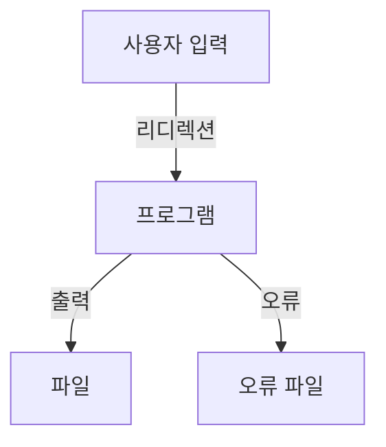
```mermaid
graph TD
    UserInput["사용자 입력"] -->|"리디렉션"| Program["프로그램"]
    Program -->|"출력"| OutFile["파일"]
    Program -->|"오류"| ErrFile["오류 파일"]
```

---

## 관련 기술

**Bash 스크립트**: 리디렉션으로 파일 읽기·쓰기·로그를 자동화한다.

```bash
#!/bin/bash
while read line; do
    echo "$line" >> "$output_file"
done < "$input_file"
```

**리눅스 명령어**: `cat`, `sort`, `grep` 등과 조합해 입출력을 제어한다.

```bash
cat input.txt > output.txt
```

**텍스트 처리(awk, sed)**: 리디렉션·파이프와 함께 사용한다.

```bash
awk '{print $1}' input.txt > output.txt
```

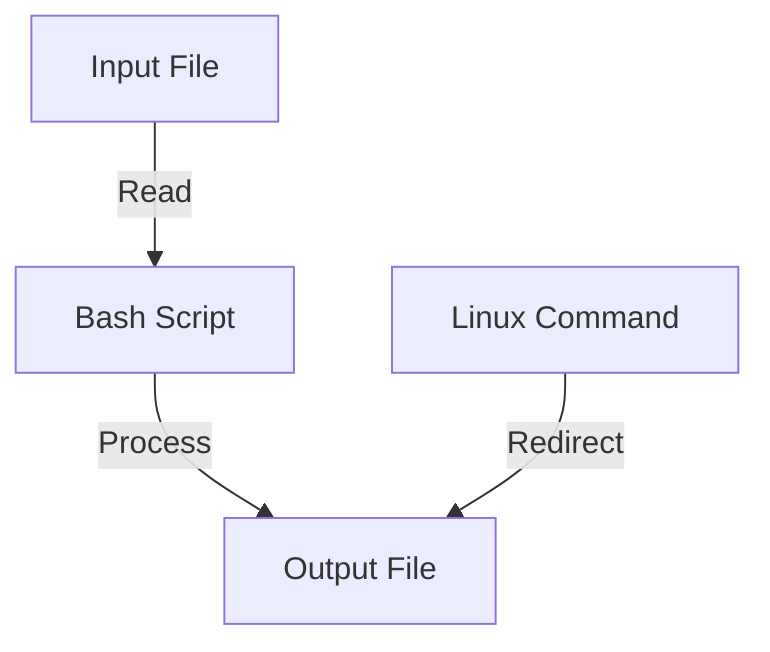
```mermaid
graph TD
    InFile["Input File"] -->|"Read"| BashScript["Bash Script"]
    BashScript -->|"Process"| OutFile["Output File"]
    LinuxCmd["Linux Command"] -->|"Redirect"| OutFile
```

---

## 결론

**요약**

- I/O 리디렉션은 stdin(0), stdout(1), stderr(2)를 파일·프로세스로 재지정하는 기능이다.
- `>`, `>>`, `<`, `2>`, `&>`, `2>&1` 등 연산자와 FD 번호를 조합해 사용한다.
- Here Document·Here String으로 스크립트 내 다중/단일 줄 입력을 넘길 수 있다.
- 파이프(`|`)와 필터(grep, awk, sed, sort, uniq)로 복잡한 텍스트 처리를 조립할 수 있다.

**실무 활용**

- 로그·오류를 각각 다른 파일로 기록  
- 대량 입력을 파일에서 읽어 배치 처리  
- 파이프로 여러 명령을 한 흐름으로 연결  

**추가 학습**

- [Bash Manual - Redirections](https://www.gnu.org/software/bash/manual/html_node/Redirections.html) (공식)
- [LinuxCommand.org - I/O Redirection](https://linuxcommand.org/lc3_lts0070.php)
- [Advanced Bash-Scripting Guide - I/O Redirection](https://tldp.org/LDP/abs/html/io-redirection.html)


```mermaid
graph TD
    UserInput["사용자 입력"] -->|"리디렉션"| Program["프로그램"]
    Program -->|"출력"| OutFile["파일"]
    Program -->|"오류"| ErrFile["오류 파일"]
```

---

## Reference

- [Bash Reference Manual – Redirections](https://www.gnu.org/software/bash/manual/html_node/Redirections.html)
- [LinuxCommand.org – I/O Redirection (Lesson 7)](https://linuxcommand.org/lc3_lts0070.php)
- [Advanced Bash-Scripting Guide – Chapter 20. I/O Redirection](https://tldp.org/LDP/abs/html/io-redirection.html)
