API(응용 프로그램 프로그래밍 인터페이스)의 발전을 되돌아보면, 2002년 제프 베조스의 유명한 지침이 떠오른다. 아마존의 CEO는 IT 조직에 데이터와 기능을 서비스 인터페이스를 통해 노출하고, 이러한 인터페이스를 외부화할 수 있도록 설계하라는 지시를 내렸다. 이는 게임 체인저였다. 오늘날 API는 현대 비즈니스의 중추가 되었으며, 심지어 가장 작은 기업들도 수백 개의 API를 보유하고 있다. 그러나 API의 중요성이 커짐에 따라 단순히 좋은 API를 갖는 것만으로는 충분하지 않다. 이제는 API에 대한 전략이 필요하다. 좋은 API는 비즈니스의 견고한 기반을 제공할 수 있지만, 포괄적인 전략이 없으면 성장, 혁신 및 효율성의 기회를 놓칠 위험이 있다. API 전략은 설계, 개발, 배포, 관리 및 유지보수에 이르는 전체 API 생애 주기를 고려해야 하며, 비즈니스 목표, 대상 고객 및 API가 이러한 목표를 달성하는 데 어떤 역할을 하는지에 대한 깊은 이해가 필요하다. 2024년에는 API 전략이 회사 수준이 아닌 서브 API 수준에서 정의되어야 한다. 이는 비즈니스가 변화에 적응하고 경쟁에서 앞서 나가기 위해 필수적이다. API 전략은 API를 효과적으로 설계, 개발 및 관리하기 위한 단계의 개요이다. 이제는 단순히 좋은 API를 갖는 것이 아니라, API가 안전하고 확장 가능하며 신뢰할 수 있도록 보장하는 것이 중요하다. 개발자의 생산성을 높이고 기계 활용도를 효율적으로 만드는 것이 핵심이다. API 전략은 비즈니스 논리에서 교차 절단 문제를 추상화하는 것과 관련이 있다. 교차 절단 문제는 API의 운영에 필수적이지만 비즈니스 논리와 직접적으로 관련이 없는 기능을 의미한다. 이러한 문제를 비즈니스 논리에서 분리함으로써 API의 핵심 기능에 영향을 주지 않고도 API를 유지 관리하고 업데이트하며 확장할 수 있다. API 전략의 중요성은 아무리 강조해도 지나치지 않다. 전략이 없으면 보안 취약점, 확장성 문제 및 신뢰성 문제에 노출될 위험이 있다. 잘 정의된 API 전략은 교차 기능 협업, 속도 제한, 회로 차단, 캐싱, 라우팅, 조합, 접근 제어, 인증, 버전 관리, 로깅, 모니터링 및 문서화와 같은 중요한 문제를 해결하는 데 도움이 된다. 전략을 수립하면 API를 문서화하는 것뿐만 아니라 효과적으로 관리하고, 보안하고, 확장하고, 모니터링하고, 신뢰성을 보장할 수 있다.


||
|:---:|
||


<!--
##### Outline #####
-->

<!--
# API 전략: 현대 비즈니스의 필수 요소

## 개요
   - API의 정의 및 중요성
   - API의 진화와 현대 비즈니스에서의 역할
   - Jeff Bezos의 API Mandate

## API 전략의 필요성
   - 디지털 전환과 API의 관계
   - API가 비즈니스에 미치는 영향
   - API 전략이 없는 경우의 위험

## API 전략의 구성 요소
   - 비즈니스 목표와의 정렬
   - API 설계 및 표준
   - 개발자 참여 및 지원
   - 보안 및 데이터 보호
   - 성능 최적화 및 분석

## API 생애 주기 관리
   - API 설계 및 개발
   - API 배포 및 관리
   - API 버전 관리 및 문서화
   - API의 유지보수 및 폐기

## API 거버넌스
   - API 거버넌스 프레임워크
   - API 표준 및 정책
   - API 생애 주기 거버넌스

## API 관리 도구 및 플랫폼
   - API 게이트웨이의 역할
   - API 관리 플랫폼의 기능
   - Swagger 및 OpenAPI와 같은 문서화 도구

## API 전략 구현
   - 비즈니스 목표 정의
   - API 사용 사례 식별
   - API 설계 및 개발
   - API 관리 플랫폼 구현
   - 개발자 참여 및 지원

## API 전략의 도전 과제
   - 기술적 복잡성
   - 다중 클라우드 보안 관리
   - 변화 관리 및 조직 문화

## 성공적인 API 전략 사례
   - 보험 산업에서의 API 전략
   - 헬스케어 산업에서의 API 전략
   - 금융 산업에서의 API 전략

## API 전략의 미래
   - API-우선 전략의 중요성
   - API 생태계의 발전
   - API 문화의 형성과 조직 내 실행

## FAQ
   - API 전략이란 무엇인가요?
   - API와 REST의 차이는 무엇인가요?
   - API 보안은 어떻게 관리하나요?

## 관련 기술
   - REST, GraphQL, gRPC 등 API 스타일
   - 클라우드 네이티브 아키텍처
   - 마이크로서비스 아키텍처

## 결론
   - API 전략의 중요성 요약
   - 비즈니스 성장과 혁신을 위한 API 전략의 필요성
   - Tailcall의 GraphQL 솔루션 소개

## 추가 자료
   - API 전략 관련 백서 및 리소스 링크
   - API 설계 모범 사례
   - API 관리 도구 비교 및 추천

이 목차는 API 전략에 대한 포괄적인 이해를 제공하며, 각 섹션은 관련된 내용을 포함하여 독자가 API 전략을 효과적으로 수립하고 실행할 수 있도록 돕습니다.
-->

<!--
## 개요
   - API의 정의 및 중요성
   - API의 진화와 현대 비즈니스에서의 역할
   - Jeff Bezos의 API Mandate
-->

## 개요

**API의 정의 및 중요성** 

API(Application Programming Interface)는 소프트웨어 애플리케이션 간의 상호작용을 가능하게 하는 인터페이스이다. API는 서로 다른 시스템이 데이터를 교환하고 기능을 호출할 수 있도록 하여, 개발자들이 복잡한 기능을 쉽게 구현할 수 있도록 돕는다. 현대 비즈니스 환경에서 API는 서비스의 통합, 데이터 공유, 그리고 새로운 비즈니스 모델의 창출을 가능하게 하여, 기업의 경쟁력을 높이는 중요한 요소로 자리 잡고 있다.

**API의 진화와 현대 비즈니스에서의 역할**  

API는 초기에는 단순한 데이터 전송 수단으로 시작되었으나, 현재는 클라우드 서비스, 모바일 애플리케이션, IoT(Internet of Things) 등 다양한 분야에서 필수적인 역할을 하고 있다. API의 발전은 REST(Representational State Transfer), GraphQL, gRPC와 같은 다양한 스타일의 API 설계를 가능하게 하였으며, 이는 개발자들이 더 효율적으로 작업할 수 있도록 지원한다. 현대 비즈니스에서 API는 고객 경험을 개선하고, 운영 효율성을 높이며, 새로운 수익 모델을 창출하는 데 기여하고 있다.

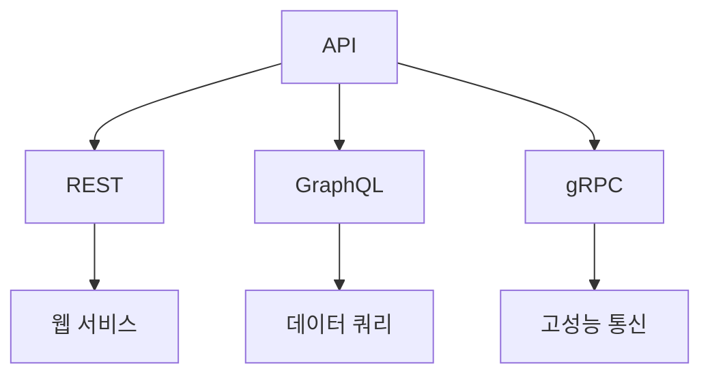

**Jeff Bezos의 API Mandate**

Jeff Bezos는 아마존의 창립자이자 CEO로서, API의 중요성을 강조하며 "모든 팀은 API를 통해 서로 소통해야 한다"는 원칙을 세웠다. 이는 각 팀이 독립적으로 작업할 수 있도록 하여, 전체 시스템의 유연성과 확장성을 높이는 데 기여한다. Bezos의 API Mandate는 기업이 기술적 장벽을 허물고, 혁신을 촉진하는 데 중요한 역할을 한다. 이러한 접근 방식은 아마존이 빠르게 성장하고 다양한 서비스를 제공할 수 있는 기반이 되었다. 

API는 단순한 기술적 요소를 넘어, 현대 비즈니스의 전략적 자산으로 자리 잡고 있으며, 기업의 성공에 필수적인 요소로 인식되고 있다.

<!--
## API 전략의 필요성
   - 디지털 전환과 API의 관계
   - API가 비즈니스에 미치는 영향
   - API 전략이 없는 경우의 위험
-->

## API 전략의 필요성

디지털 전환이 가속화됨에 따라 기업들은 경쟁력을 유지하기 위해 API 전략을 수립하는 것이 필수적이다. API(Application Programming Interface)는 시스템 간의 상호작용을 가능하게 하여 데이터와 기능을 공유할 수 있도록 돕는다. 이 섹션에서는 디지털 전환과 API의 관계, API가 비즈니스에 미치는 영향, 그리고 API 전략이 없는 경우의 위험에 대해 살펴보겠다.

**디지털 전환과 API의 관계**

디지털 전환은 기업이 기술을 활용하여 비즈니스 모델, 프로세스, 고객 경험을 혁신하는 과정을 의미한다. 이 과정에서 API는 중요한 역할을 한다. API는 다양한 시스템과 애플리케이션 간의 통합을 가능하게 하여 데이터 흐름을 원활하게 하고, 새로운 서비스와 기능을 신속하게 개발할 수 있도록 지원한다. 예를 들어, 클라우드 서비스와 온프레미스 시스템 간의 데이터 통합은 API를 통해 이루어지며, 이는 기업이 시장 변화에 빠르게 대응할 수 있도록 한다.

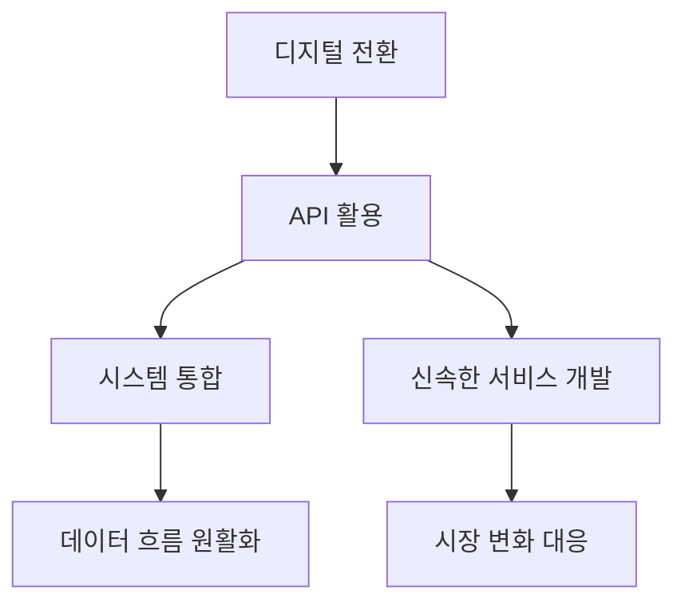

**API가 비즈니스에 미치는 영향**

API는 비즈니스 모델의 혁신을 촉진하고, 고객 경험을 향상시키며, 운영 효율성을 높이는 데 기여한다. API를 통해 기업은 파트너와의 협업을 강화하고, 새로운 수익 모델을 창출할 수 있다. 예를 들어, 금융 서비스 기업은 API를 통해 제3자 개발자에게 자사의 데이터와 기능을 제공함으로써 새로운 애플리케이션을 개발할 수 있도록 지원한다. 이는 고객에게 더 나은 서비스를 제공하고, 기업의 수익을 증가시키는 결과를 가져온다.

**API 전략이 없는 경우의 위험**

API 전략이 없는 경우, 기업은 여러 가지 위험에 직면할 수 있다. 첫째, 시스템 간의 통합이 원활하지 않아 데이터의 일관성이 떨어질 수 있다. 둘째, 새로운 기술이나 서비스에 대한 적시 대응이 어려워 경쟁에서 뒤처질 수 있다. 셋째, 보안 취약점이 발생할 가능성이 높아지며, 이는 기업의 신뢰성을 저하시킬 수 있다. 따라서 API 전략을 수립하지 않는 것은 기업의 지속 가능성과 성장에 심각한 위협이 될 수 있다.

결론적으로, API 전략은 디지털 전환의 핵심 요소로, 비즈니스의 혁신과 경쟁력을 유지하기 위해 필수적이다. API를 통해 기업은 새로운 기회를 창출하고, 고객의 요구에 신속하게 대응할 수 있는 능력을 갖추게 된다.

<!--
## API 전략의 구성 요소
   - 비즈니스 목표와의 정렬
   - API 설계 및 표준
   - 개발자 참여 및 지원
   - 보안 및 데이터 보호
   - 성능 최적화 및 분석
-->

## API 전략의 구성 요소

API 전략을 효과적으로 수립하기 위해서는 여러 구성 요소를 고려해야 한다. 이 구성 요소들은 비즈니스 목표와의 정렬, API 설계 및 표준, 개발자 참여 및 지원, 보안 및 데이터 보호, 성능 최적화 및 분석으로 나눌 수 있다.

**비즈니스 목표와의 정렬** 

API 전략은 비즈니스 목표와 일치해야 한다. 이를 통해 API가 비즈니스의 핵심 가치를 전달하고, 고객의 요구를 충족할 수 있도록 해야 한다. 비즈니스 목표를 명확히 정의하고, 이를 기반으로 API의 기능과 목적을 설정하는 것이 중요하다.

**API 설계 및 표준**  

API 설계는 API의 사용성과 유지보수성을 결정짓는 중요한 요소이다. RESTful API, GraphQL, gRPC 등 다양한 API 스타일이 존재하며, 각 스타일에 맞는 설계 원칙을 준수해야 한다. 또한, API 표준을 설정하여 일관성을 유지하고, 개발자들이 쉽게 이해하고 사용할 수 있도록 해야 한다.

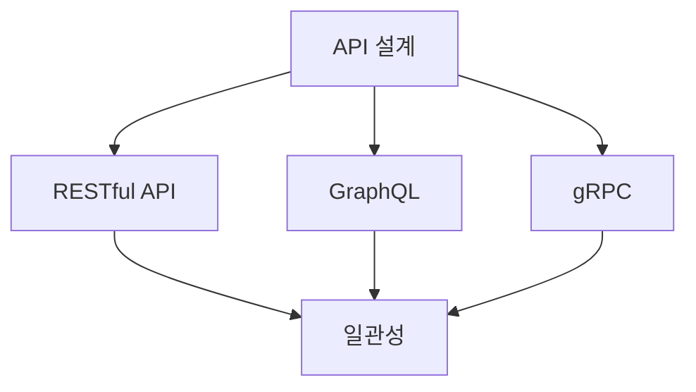

**개발자 참여 및 지원**  

API의 성공적인 구현을 위해서는 개발자들의 참여가 필수적이다. 개발자들이 API를 쉽게 사용할 수 있도록 문서화하고, 샘플 코드를 제공하는 것이 중요하다. 또한, 개발자 커뮤니티를 형성하여 피드백을 받고, 지속적으로 개선할 수 있는 환경을 조성해야 한다.

**보안 및 데이터 보호**  

API는 외부와의 연결을 통해 데이터를 주고받기 때문에 보안이 매우 중요하다. OAuth, JWT(JSON Web Token)와 같은 인증 및 인가 메커니즘을 도입하여 API 접근을 제어해야 한다. 또한, 데이터 전송 시 암호화를 통해 데이터 보호를 강화해야 한다.

**성능 최적화 및 분석**  

API의 성능은 사용자 경험에 직접적인 영향을 미친다. API 호출의 응답 시간을 최소화하고, 서버의 부하를 줄이기 위해 캐싱, 로드 밸런싱 등의 기술을 활용해야 한다. 또한, API 사용량을 분석하여 비즈니스 인사이트를 도출하고, 지속적인 성능 개선을 위한 데이터를 수집해야 한다.

이와 같은 구성 요소들은 API 전략을 성공적으로 수립하고 실행하는 데 필수적이다. 각 요소를 체계적으로 고려하여 API의 가치를 극대화할 수 있도록 해야 한다.

<!--
## API 생애 주기 관리
   - API 설계 및 개발
   - API 배포 및 관리
   - API 버전 관리 및 문서화
   - API의 유지보수 및 폐기
-->

## API 생애 주기 관리

API 생애 주기 관리(API Lifecycle Management)는 API의 설계부터 폐기까지의 모든 단계를 체계적으로 관리하는 과정을 의미한다. 이 과정은 API의 품질을 보장하고, 비즈니스 목표에 부합하도록 API를 최적화하는 데 필수적이다. 다음은 API 생애 주기의 주요 단계에 대한 설명이다.

**API 설계 및 개발**  

API 설계는 API의 성공적인 생애 주기를 위한 첫 번째 단계이다. 이 단계에서는 API의 목적, 기능, 데이터 모델 및 사용자 요구 사항을 정의해야 한다. RESTful API를 설계할 때는 리소스 기반 접근 방식을 채택하고, HTTP 메서드(GET, POST, PUT, DELETE 등)를 적절히 활용해야 한다. 

샘플 코드로는 간단한 RESTful API의 설계 예시를 들 수 있다.

```python
from flask import Flask, jsonify, request

app = Flask(__name__)

# Sample data
tasks = [
    {'id': 1, 'title': 'Task 1', 'done': False},
    {'id': 2, 'title': 'Task 2', 'done': True}
]

@app.route('/tasks', methods=['GET'])
def get_tasks():
    return jsonify(tasks)

if __name__ == '__main__':
    app.run(debug=True)
```

**API 배포 및 관리**  

API가 설계되면, 실제 환경에 배포해야 한다. 이 과정에서는 API 게이트웨이를 통해 API를 관리하고, 트래픽을 모니터링하며, 성능을 최적화하는 것이 중요하다. API 관리 플랫폼을 사용하면 API의 사용량, 오류율, 응답 시간 등을 실시간으로 모니터링할 수 있다.

다음은 API 배포 및 관리의 흐름을 나타내는 다이어그램이다.

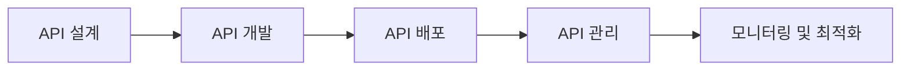

**API 버전 관리 및 문서화**  

API는 시간이 지남에 따라 변화할 수 있으며, 이를 관리하기 위해 버전 관리가 필요하다. 버전 관리는 API의 호환성을 유지하고, 사용자에게 새로운 기능을 제공하는 데 도움을 준다. 일반적으로 URL에 버전 번호를 포함시키는 방식이 많이 사용된다. 예를 들어, `/api/v1/tasks`와 같은 형식이다.

또한, API 문서화는 개발자들이 API를 이해하고 사용할 수 있도록 돕는 중요한 요소이다. Swagger와 OpenAPI와 같은 도구를 사용하여 API 문서를 자동으로 생성할 수 있다.

**API의 유지보수 및 폐기**  

API의 유지보수는 API의 성능을 지속적으로 개선하고, 보안 취약점을 해결하는 과정이다. API의 사용량이 감소하거나 더 이상 필요하지 않게 되면, 폐기하는 것이 필요하다. 이때는 사용자에게 사전 공지를 하고, 대체 API를 제공하는 것이 좋다.

API 생애 주기 관리는 API의 품질과 안정성을 보장하는 데 중요한 역할을 하며, 이를 통해 비즈니스의 성공적인 디지털 전환을 지원할 수 있다.

<!--
## API 거버넌스
   - API 거버넌스 프레임워크
   - API 표준 및 정책
   - API 생애 주기 거버넌스
-->

## API 거버넌스

API 거버넌스는 조직 내에서 API의 설계, 개발, 배포 및 관리에 대한 정책과 절차를 정의하는 중요한 요소이다. 효과적인 API 거버넌스는 API의 품질, 보안, 성능 및 일관성을 보장하며, 비즈니스 목표와의 정렬을 촉진한다.

**API 거버넌스 프레임워크**

API 거버넌스 프레임워크는 API의 생애 주기 전반에 걸쳐 관리 및 통제를 위한 구조를 제공한다. 이 프레임워크는 다음과 같은 주요 구성 요소로 이루어진다:

1. **정책 및 표준**: API 설계 및 개발에 대한 명확한 정책과 표준을 수립하여 일관성을 유지한다.
2. **모니터링 및 감사**: API 사용 및 성능을 모니터링하고 정기적으로 감사하여 문제를 조기에 발견하고 해결한다.
3. **역할 및 책임**: API 관리에 관련된 모든 이해관계자의 역할과 책임을 명확히 하여 효율적인 협업을 촉진한다.

다음은 API 거버넌스 프레임워크의 다이어그램이다:

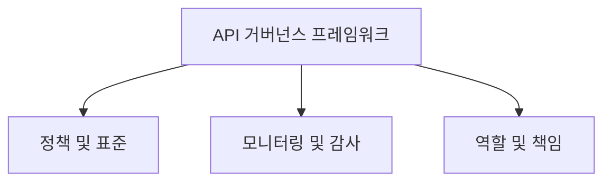

**API 표준 및 정책**

API 표준 및 정책은 API의 설계 및 구현에 대한 지침을 제공한다. 이러한 표준은 RESTful API, GraphQL, gRPC와 같은 다양한 API 스타일에 적용될 수 있으며, 다음과 같은 요소를 포함한다:

- **URI 설계**: 일관된 URI 구조를 정의하여 API의 가독성을 높인다.
- **HTTP 메서드 사용**: GET, POST, PUT, DELETE와 같은 HTTP 메서드의 사용 규칙을 명확히 한다.
- **응답 형식**: JSON, XML 등 응답 형식을 표준화하여 클라이언트와의 상호작용을 용이하게 한다.

**API 생애 주기 거버넌스**

API 생애 주기 거버넌스는 API의 설계, 개발, 배포, 유지보수 및 폐기 단계에서의 관리 절차를 포함한다. 각 단계에서의 거버넌스는 다음과 같은 요소를 포함한다:

1. **설계 단계**: API의 요구 사항을 정의하고, 설계 표준을 준수하는지 검토한다.
2. **개발 단계**: 코드 품질 및 보안 검토를 통해 API의 신뢰성을 확보한다.
3. **배포 단계**: API의 배포 전후에 성능 테스트 및 모니터링을 수행한다.
4. **유지보수 및 폐기 단계**: API의 사용 현황을 분석하고, 필요에 따라 업데이트 또는 폐기 결정을 내린다.

이러한 API 생애 주기 거버넌스는 API의 지속적인 품질 개선과 비즈니스 목표 달성을 지원한다. API 거버넌스는 조직의 API 전략을 성공적으로 실행하기 위한 필수 요소임을 잊지 말아야 한다.

<!--
## API 관리 도구 및 플랫폼
   - API 게이트웨이의 역할
   - API 관리 플랫폼의 기능
   - Swagger 및 OpenAPI와 같은 문서화 도구
-->

## API 관리 도구 및 플랫폼

API 관리 도구와 플랫폼은 현대 비즈니스에서 API를 효과적으로 관리하고 최적화하는 데 필수적인 요소이다. 이 섹션에서는 API 게이트웨이의 역할, API 관리 플랫폼의 기능, 그리고 Swagger 및 OpenAPI와 같은 문서화 도구에 대해 살펴보겠다.

**API 게이트웨이의 역할**

API 게이트웨이는 클라이언트와 서버 간의 중개 역할을 수행하는 컴포넌트이다. 주로 다음과 같은 기능을 제공한다:

1. **요청 라우팅**: 클라이언트의 요청을 적절한 서비스로 전달한다.
2. **인증 및 권한 부여**: API에 대한 접근을 제어하여 보안을 강화한다.
3. **로드 밸런싱**: 여러 서버에 요청을 분산시켜 성능을 최적화한다.
4. **모니터링 및 로깅**: API 사용량과 성능을 추적하여 분석할 수 있도록 한다.

다음은 API 게이트웨이의 기본 구조를 나타내는 다이어그램이다:

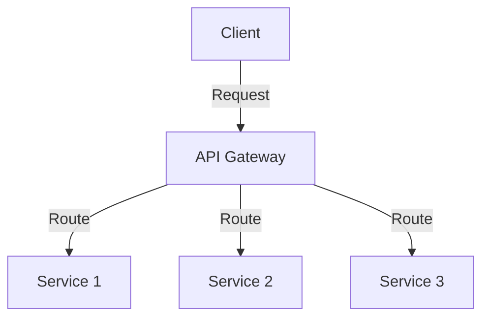

**API 관리 플랫폼의 기능**

API 관리 플랫폼은 API의 생애 주기를 관리하는 데 필요한 다양한 기능을 제공한다. 주요 기능은 다음과 같다:

1. **API 설계 및 개발**: API를 설계하고 개발하는 도구를 제공한다.
2. **API 문서화**: API 사용법을 명확히 하기 위한 문서화 기능을 지원한다.
3. **모니터링 및 분석**: API의 성능과 사용량을 모니터링하고 분석할 수 있는 기능을 제공한다.
4. **보안 관리**: API에 대한 보안 정책을 설정하고 관리할 수 있다.
5. **개발자 포털**: 개발자들이 API를 쉽게 사용할 수 있도록 지원하는 포털을 제공한다.

**Swagger 및 OpenAPI와 같은 문서화 도구**

Swagger와 OpenAPI는 API 문서화를 위한 인기 있는 도구이다. 이 도구들은 API의 구조와 사용법을 명확하게 정의하고, 자동으로 문서를 생성할 수 있는 기능을 제공한다. Swagger는 OpenAPI 사양을 기반으로 하며, API의 인터페이스를 시각적으로 표현할 수 있는 UI를 제공한다.

Swagger를 사용하여 API 문서를 작성하는 샘플 코드는 다음과 같다:

```yaml
openapi: 3.0.0
info:
  title: Sample API
  version: 1.0.0
paths:
  /users:
    get:
      summary: Retrieve a list of users
      responses:
        '200':
          description: A list of users
```

이와 같은 도구들은 API의 사용성을 높이고, 개발자들이 API를 쉽게 이해하고 활용할 수 있도록 돕는다. API 관리 도구와 플랫폼은 비즈니스의 API 전략을 성공적으로 구현하는 데 중요한 역할을 한다.

<!--
## API 전략 구현
   - 비즈니스 목표 정의
   - API 사용 사례 식별
   - API 설계 및 개발
   - API 관리 플랫폼 구현
   - 개발자 참여 및 지원
-->

## API 전략 구현

API 전략을 성공적으로 구현하기 위해서는 여러 단계가 필요하다. 이 과정은 비즈니스 목표를 정의하고, API 사용 사례를 식별하며, API를 설계하고 개발하는 것부터 시작된다. 또한, API 관리 플랫폼을 구현하고 개발자 참여를 유도하는 것이 중요하다.

**비즈니스 목표 정의**  

API 전략을 수립하기 위해서는 먼저 비즈니스 목표를 명확히 정의해야 한다. 비즈니스 목표는 API가 해결하고자 하는 문제를 명확히 하고, API의 방향성을 제시한다. 예를 들어, 고객 경험을 향상시키거나, 운영 효율성을 높이는 것이 목표일 수 있다. 이러한 목표는 API의 기능과 설계에 직접적인 영향을 미친다.

**API 사용 사례 식별**  

비즈니스 목표가 정의되면, 이를 달성하기 위한 API 사용 사례를 식별해야 한다. 사용 사례는 API가 제공해야 하는 기능과 서비스의 구체적인 예시를 포함한다. 예를 들어, 전자상거래 플랫폼에서는 결제 처리, 상품 검색, 사용자 인증 등의 API 사용 사례가 있을 수 있다. 이러한 사용 사례는 API 설계 및 개발의 기초가 된다.

**API 설계 및 개발**  

API 설계는 API의 구조와 기능을 정의하는 과정이다. RESTful API, GraphQL, gRPC 등 다양한 API 스타일 중에서 비즈니스 요구에 맞는 스타일을 선택해야 한다. API 설계 시에는 다음과 같은 요소를 고려해야 한다:

- **엔드포인트 정의**: API의 각 기능에 대한 URL 경로를 정의한다.
- **HTTP 메서드 선택**: 각 엔드포인트에 대해 GET, POST, PUT, DELETE 등의 HTTP 메서드를 선택한다.
- **데이터 포맷**: JSON, XML 등 데이터 포맷을 결정한다.

아래는 간단한 RESTful API 설계 예시이다.

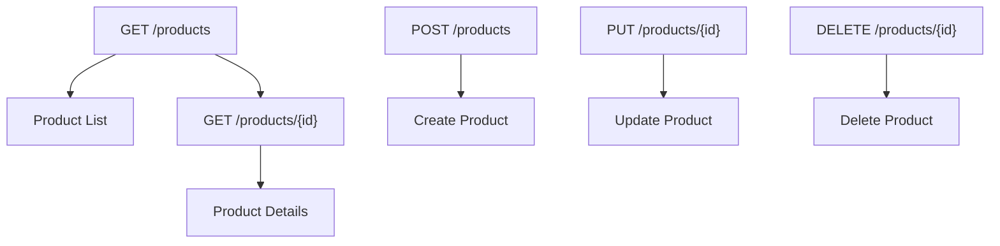

**API 관리 플랫폼 구현**  

API 관리 플랫폼은 API의 배포, 모니터링, 보안 및 분석을 지원하는 도구이다. API 관리 플랫폼을 통해 API의 성능을 모니터링하고, 사용량을 분석하며, 보안을 강화할 수 있다. 대표적인 API 관리 플랫폼으로는 Apigee, AWS API Gateway, Kong 등이 있다. 이러한 플랫폼을 통해 API의 생애 주기를 효과적으로 관리할 수 있다.

**개발자 참여 및 지원**  

마지막으로, API 전략의 성공적인 구현을 위해서는 개발자의 참여와 지원이 필수적이다. 개발자들이 API를 쉽게 이해하고 사용할 수 있도록 문서화하고, 샘플 코드를 제공해야 한다. 또한, 개발자 커뮤니티를 형성하여 피드백을 받고, 지속적으로 API를 개선하는 것이 중요하다. 

이러한 단계들을 통해 API 전략을 효과적으로 구현할 수 있으며, 비즈니스 목표를 달성하는 데 기여할 수 있다.

<!--
## API 전략의 도전 과제
   - 기술적 복잡성
   - 다중 클라우드 보안 관리
   - 변화 관리 및 조직 문화
-->

## API 전략의 도전 과제

API 전략을 수립하고 실행하는 과정에서 여러 가지 도전 과제가 존재한다. 이러한 도전 과제를 이해하고 해결하는 것은 성공적인 API 전략을 구축하는 데 필수적이다.

**기술적 복잡성**  

API의 설계와 구현은 종종 기술적 복잡성을 동반한다. 다양한 시스템과의 통합, 데이터 형식의 변환, 그리고 API의 성능 최적화는 개발자에게 많은 도전 과제를 안겨준다. 특히, 마이크로서비스 아키텍처를 채택한 경우, 각 서비스 간의 상호작용을 관리하는 것이 더욱 복잡해질 수 있다. 

예를 들어, 다음은 API 호출을 통해 여러 마이크로서비스와 상호작용하는 간단한 코드 샘플이다.

```python
import requests

def call_service_a():
    response = requests.get("http://service-a/api/data")
    return response.json()

def call_service_b(data):
    response = requests.post("http://service-b/api/process", json=data)
    return response.json()

data_from_a = call_service_a()
result_from_b = call_service_b(data_from_a)
print(result_from_b)
```

위의 코드에서는 두 개의 마이크로서비스를 호출하여 데이터를 처리하는 과정을 보여준다. 이러한 복잡한 상호작용을 관리하기 위해서는 API 게이트웨이를 활용하여 요청을 중앙 집중화하고, 로깅 및 모니터링을 통해 문제를 조기에 발견할 수 있도록 해야 한다.

**다중 클라우드 보안 관리**  

다중 클라우드 환경에서 API를 운영할 경우, 보안 관리가 더욱 복잡해진다. 각 클라우드 서비스 제공자는 고유한 보안 정책과 인증 방식을 가지고 있으며, 이를 통합하여 관리하는 것은 큰 도전 과제가 된다. API의 보안을 강화하기 위해 OAuth 2.0과 같은 인증 프로토콜을 사용하는 것이 일반적이다.

다음은 OAuth 2.0을 사용한 인증 흐름을 나타내는 다이어그램이다.

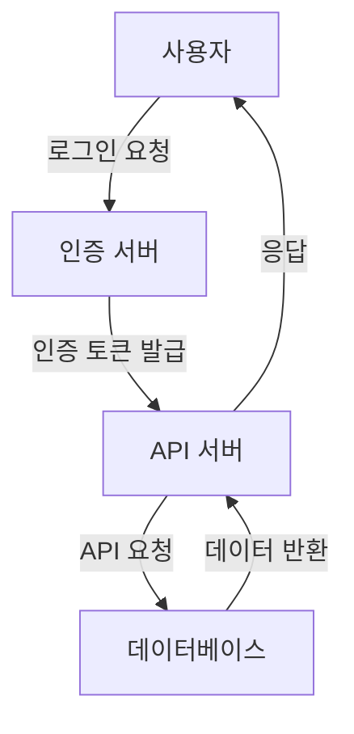

이 다이어그램은 사용자가 인증 서버에 로그인 요청을 보내고, 인증 서버가 API 서버에 대한 접근을 허용하는 토큰을 발급하는 과정을 보여준다. 이와 같은 인증 흐름을 통해 API의 보안을 강화할 수 있다.

**변화 관리 및 조직 문화**  

API 전략을 성공적으로 실행하기 위해서는 조직 내 변화 관리가 필수적이다. API 중심의 접근 방식으로 전환하는 과정에서 기존의 업무 프로세스와 조직 문화에 대한 저항이 발생할 수 있다. 이를 극복하기 위해서는 모든 이해관계자와의 소통이 중요하며, API의 이점을 명확히 전달해야 한다.

조직 내에서 API 전략을 효과적으로 실행하기 위해서는 다음과 같은 접근 방식을 고려할 수 있다.

1. **교육 및 훈련**: 개발자와 비즈니스 팀을 대상으로 API의 중요성과 사용 방법에 대한 교육을 실시한다.
2. **협업 문화 조성**: 개발자와 비즈니스 팀 간의 협업을 촉진하여 API 전략의 성공적인 실행을 지원한다.
3. **피드백 루프 구축**: API 사용에 대한 피드백을 수집하고, 이를 바탕으로 지속적으로 개선해 나간다.

이러한 도전 과제를 인식하고 해결하기 위한 노력이 API 전략의 성공에 중요한 역할을 한다.

<!--
## 성공적인 API 전략 사례
   - 보험 산업에서의 API 전략
   - 헬스케어 산업에서의 API 전략
   - 금융 산업에서의 API 전략
-->

## 성공적인 API 전략 사례

API 전략은 다양한 산업에서 비즈니스 모델을 혁신하고 효율성을 높이는 데 중요한 역할을 한다. 이번 섹션에서는 보험, 헬스케어, 금융 산업에서의 성공적인 API 전략 사례를 살펴보겠다.

**보험 산업에서의 API 전략**

보험 산업에서는 고객 경험을 개선하고 운영 효율성을 높이기 위해 API를 적극적으로 활용하고 있다. 예를 들어, 보험사들은 고객이 온라인에서 보험 상품을 비교하고 가입할 수 있도록 API를 통해 다양한 데이터를 제공한다. 이를 통해 고객은 손쉽게 정보를 얻고, 보험사들은 더 많은 고객을 유치할 수 있다.

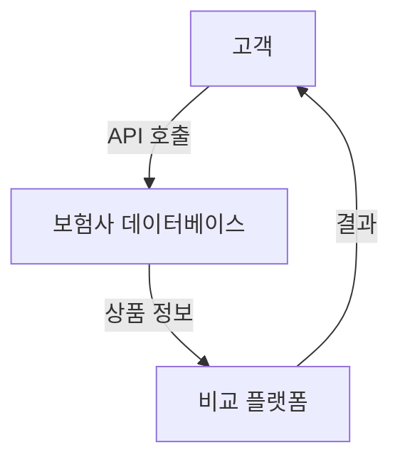

이러한 API 전략은 고객의 요구에 신속하게 대응할 수 있는 유연성을 제공하며, 보험사들은 데이터 분석을 통해 고객의 행동을 이해하고 맞춤형 서비스를 제공할 수 있다.

**헬스케어 산업에서의 API 전략**

헬스케어 산업에서는 환자 데이터의 안전한 공유와 통합을 위해 API가 필수적이다. 예를 들어, 병원과 약국 간의 데이터 연동을 통해 환자가 처방받은 약을 쉽게 확인하고, 약국에서는 환자의 의료 기록을 기반으로 적절한 약을 제공할 수 있다. 이러한 API 통합은 환자의 치료 과정을 개선하고, 의료 서비스의 품질을 높이는 데 기여한다.

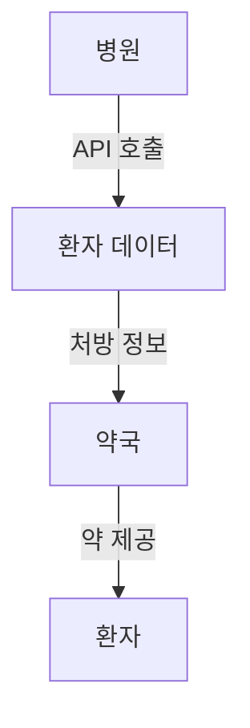

이와 같은 API 전략은 헬스케어 시스템의 상호 운용성을 높이고, 환자 안전을 강화하는 데 중요한 역할을 한다.

**금융 산업에서의 API 전략**

금융 산업에서는 API를 통해 다양한 서비스와 제품을 통합하여 고객에게 더 나은 경험을 제공하고 있다. 예를 들어, 핀테크 기업들은 은행 API를 활용하여 고객의 계좌 정보를 실시간으로 조회하고, 자동으로 자산 관리 서비스를 제공한다. 이러한 접근은 고객의 금융 관리 효율성을 높이고, 금융 서비스의 접근성을 개선한다.

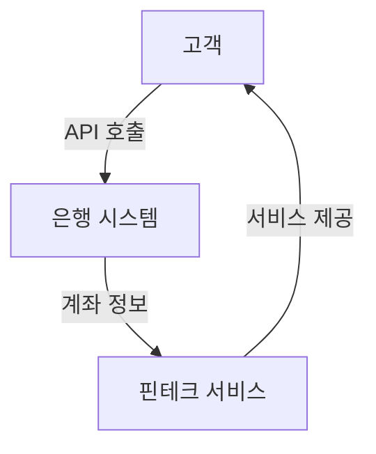

금융 산업에서의 API 전략은 고객의 요구에 맞춘 혁신적인 서비스를 제공하고, 경쟁력을 강화하는 데 중요한 요소로 작용하고 있다.

이와 같이 보험, 헬스케어, 금융 산업에서의 성공적인 API 전략 사례는 각 산업의 특성과 고객의 요구에 맞춰 API를 효과적으로 활용하는 방법을 보여준다. 이러한 사례들은 다른 산업에서도 API 전략을 수립하고 실행하는 데 유용한 참고자료가 될 것이다.

<!--
## API 전략의 미래
   - API-우선 전략의 중요성
   - API 생태계의 발전
   - API 문화의 형성과 조직 내 실행
-->

## API 전략의 미래

API 전략은 현대 비즈니스 환경에서 점점 더 중요해지고 있으며, 앞으로의 발전 방향은 여러 가지 요소에 의해 결정될 것이다. 이 섹션에서는 API-우선 전략의 중요성, API 생태계의 발전, 그리고 API 문화의 형성과 조직 내 실행에 대해 논의할 것이다.

**API-우선 전략의 중요성**

API-우선 전략은 기업이 비즈니스 모델을 설계하고 실행하는 데 있어 API를 중심에 두는 접근 방식이다. 이는 기업이 외부와의 통합을 통해 더 많은 가치를 창출하고, 고객 경험을 향상시키며, 새로운 수익 모델을 개발할 수 있도록 돕는다. API-우선 전략을 채택한 기업은 다음과 같은 이점을 누릴 수 있다.

1. **유연성**: API를 통해 다양한 서비스와 시스템을 쉽게 통합할 수 있어 비즈니스 환경 변화에 빠르게 대응할 수 있다.
2. **확장성**: API를 통해 새로운 기능이나 서비스를 추가하는 것이 용이해지며, 이는 기업의 성장 가능성을 높인다.
3. **혁신 촉진**: API를 활용한 외부 개발자와의 협업은 새로운 아이디어와 혁신을 촉진한다.

**API 생태계의 발전**

API 생태계는 다양한 서비스와 플랫폼이 상호작용하는 복잡한 네트워크로 구성된다. 이 생태계는 다음과 같은 요소들로 발전하고 있다.

- **API 마켓플레이스**: 기업은 API를 쉽게 공유하고 판매할 수 있는 플랫폼을 통해 더 많은 사용자와 개발자에게 접근할 수 있다.
- **API 표준화**: REST, GraphQL, gRPC와 같은 표준화된 API 스타일이 확산되면서, 개발자들은 더 쉽게 API를 이해하고 사용할 수 있게 된다.
- **AI와의 통합**: 인공지능(AI) 기술이 API와 결합되어, 데이터 분석 및 자동화된 의사결정 지원이 가능해진다.

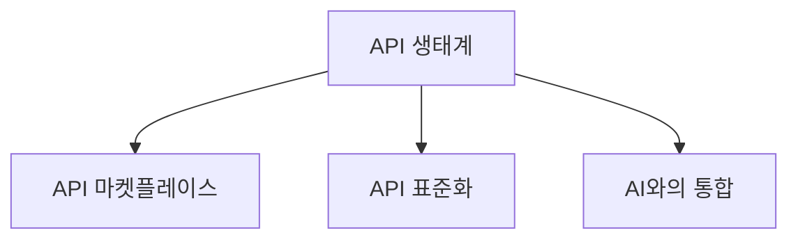

**API 문화의 형성과 조직 내 실행**

API 전략의 성공적인 실행을 위해서는 조직 내에서 API 문화를 형성하는 것이 필수적이다. 이를 위해 다음과 같은 접근 방식이 필요하다.

1. **교육 및 훈련**: 개발자와 비즈니스 팀이 API의 중요성과 활용 방법에 대해 교육받아야 한다.
2. **협업 촉진**: 개발자와 비즈니스 팀 간의 원활한 소통과 협업을 통해 API 전략을 효과적으로 실행할 수 있다.
3. **피드백 루프**: API 사용에 대한 피드백을 수집하고 이를 바탕으로 지속적으로 개선하는 프로세스를 마련해야 한다.

API 전략의 미래는 이러한 요소들이 결합되어 더욱 발전할 것이며, 기업은 이를 통해 경쟁력을 강화하고 지속 가능한 성장을 이룰 수 있을 것이다.

<!--
## FAQ
   - API 전략이란 무엇인가요?
   - API와 REST의 차이는 무엇인가요?
   - API 보안은 어떻게 관리하나요?
-->

## FAQ

**API 전략이란 무엇인가요?**  

API 전략은 기업이 API(Application Programming Interface)를 통해 비즈니스 목표를 달성하기 위한 계획과 접근 방식을 의미한다. 이는 API의 설계, 개발, 배포 및 관리에 대한 포괄적인 프레임워크를 포함하며, 비즈니스의 디지털 전환을 지원하고, 고객 경험을 향상시키며, 파트너와의 협업을 촉진하는 데 중요한 역할을 한다. API 전략은 비즈니스 목표와 기술적 요구 사항을 정렬하여, API를 통해 가치를 창출하는 것을 목표로 한다.

**API와 REST의 차이는 무엇인가요?**  

API는 애플리케이션 간의 상호작용을 가능하게 하는 인터페이스를 의미하며, REST(Representational State Transfer)는 API를 설계하는 아키텍처 스타일 중 하나이다. REST는 HTTP 프로토콜을 기반으로 하며, 리소스에 대한 CRUD(Create, Read, Update, Delete) 작업을 수행하는 데 최적화되어 있다. RESTful API는 상태 비저장(stateless)이며, 클라이언트와 서버 간의 상호작용을 단순화하고, 확장성을 높이는 데 기여한다.

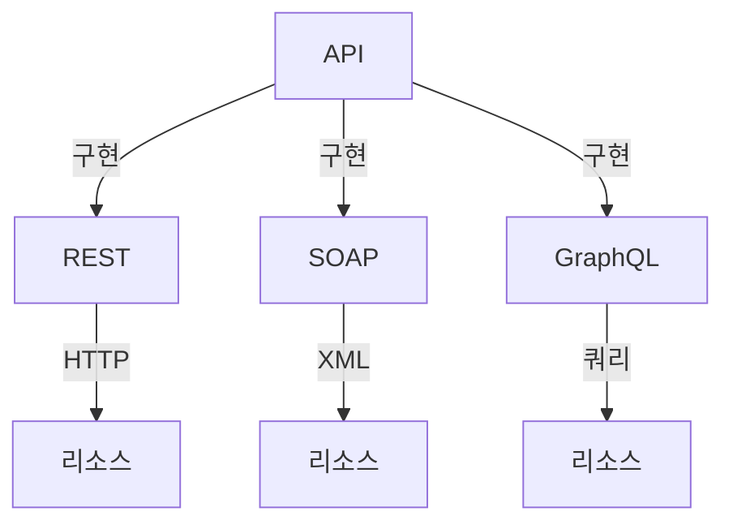

**API 보안은 어떻게 관리하나요?**  

API 보안은 데이터 보호와 사용자 인증을 포함하여 API를 안전하게 운영하기 위한 다양한 방법을 포함한다. 일반적인 API 보안 관리 방법으로는 다음과 같은 것들이 있다:

1. **인증(Authentication)**: API에 접근하는 사용자를 확인하는 과정으로, OAuth 2.0, JWT(JSON Web Token) 등을 사용하여 안전하게 인증할 수 있다.
2. **권한 부여(Authorization)**: 인증된 사용자가 어떤 리소스에 접근할 수 있는지를 결정하는 과정이다. 역할 기반 접근 제어(RBAC)와 같은 방법을 통해 관리할 수 있다.
3. **데이터 암호화**: 전송 중인 데이터와 저장된 데이터를 암호화하여, 데이터 유출을 방지한다.
4. **API 게이트웨이 사용**: API 게이트웨이를 통해 모든 API 요청을 중앙에서 관리하고, 보안 정책을 적용할 수 있다.

이러한 방법들을 통해 API의 보안을 강화하고, 데이터 유출 및 악의적인 공격으로부터 보호할 수 있다.

<!--
## 관련 기술
   - REST, GraphQL, gRPC 등 API 스타일
   - 클라우드 네이티브 아키텍처
   - 마이크로서비스 아키텍처
-->

## 관련 기술

API 전략을 효과적으로 구현하기 위해서는 다양한 기술적 요소를 이해하는 것이 중요하다. 이 섹션에서는 REST, GraphQL, gRPC와 같은 API 스타일과 클라우드 네이티브 아키텍처, 마이크로서비스 아키텍처에 대해 살펴보겠다.

**REST, GraphQL, gRPC 등 API 스타일**

REST(Representational State Transfer)는 웹 기반의 API 설계 스타일로, HTTP 프로토콜을 기반으로 하여 자원(Resource)을 URI로 표현하고, HTTP 메서드(GET, POST, PUT, DELETE 등)를 사용하여 자원에 대한 작업을 수행하는 방식이다. REST는 간단하고 직관적인 구조로 인해 널리 사용되고 있다.

GraphQL은 페이스북에서 개발한 쿼리 언어로, 클라이언트가 필요한 데이터를 명시적으로 요청할 수 있도록 해준다. 이를 통해 클라이언트는 필요한 데이터만을 요청할 수 있으며, 과다한 데이터 전송을 방지할 수 있다.

gRPC는 구글에서 개발한 원격 프로시저 호출(Remote Procedure Call) 프레임워크로, Protocol Buffers를 사용하여 데이터 직렬화를 수행한다. gRPC는 높은 성능과 다양한 언어 지원을 제공하며, 마이크로서비스 아키텍처에서의 통신에 적합하다.

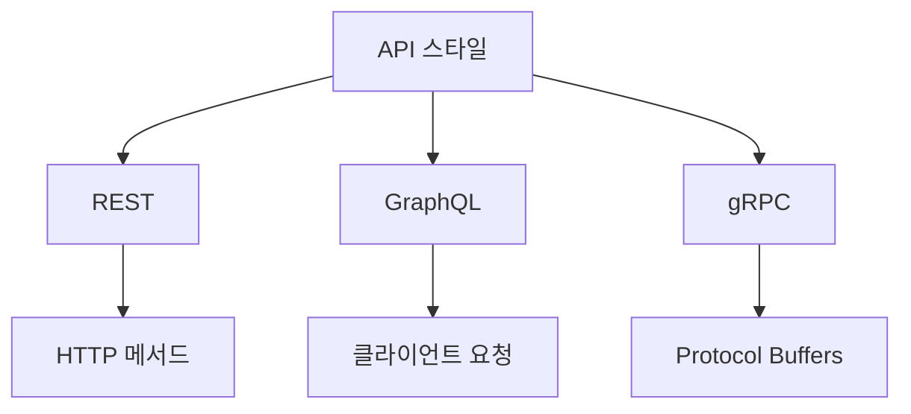

**클라우드 네이티브 아키텍처**

클라우드 네이티브 아키텍처는 클라우드 환경에서 애플리케이션을 설계하고 구축하는 접근 방식이다. 이 아키텍처는 마이크로서비스, 컨테이너, 오케스트레이션, DevOps 등의 원칙을 포함하여, 애플리케이션의 확장성과 유연성을 극대화한다. 클라우드 네이티브 아키텍처를 통해 기업은 빠르게 변화하는 비즈니스 요구에 대응할 수 있으며, 효율적인 리소스 관리를 통해 비용 절감 효과를 얻을 수 있다.

**마이크로서비스 아키텍처**

마이크로서비스 아키텍처는 애플리케이션을 독립적인 서비스로 나누어 개발하는 방식이다. 각 서비스는 특정 비즈니스 기능을 수행하며, 서로 독립적으로 배포 및 확장이 가능하다. 이 아키텍처는 개발팀이 각 서비스에 대해 독립적으로 작업할 수 있도록 하여, 개발 속도를 높이고, 시스템의 복잡성을 줄이는 데 기여한다.

마이크로서비스 아키텍처는 API를 통해 서비스 간의 통신을 수행하며, REST, GraphQL, gRPC와 같은 다양한 API 스타일을 활용할 수 있다. 이를 통해 서비스 간의 상호작용을 효율적으로 관리할 수 있다.

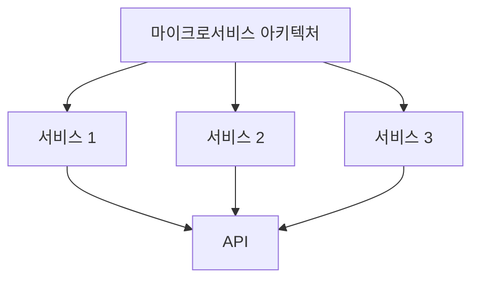

이와 같이 API 스타일과 아키텍처는 현대 비즈니스에서 API 전략을 수립하고 실행하는 데 필수적인 요소이다. 각 기술의 특성을 이해하고 적절히 활용하는 것이 성공적인 API 전략의 기초가 된다.

<!--
## 결론
   - API 전략의 중요성 요약
   - 비즈니스 성장과 혁신을 위한 API 전략의 필요성
   - Tailcall의 GraphQL 솔루션 소개
-->

## 결론

**API 전략의 중요성 요약**  

API 전략은 현대 비즈니스 환경에서 필수적인 요소로 자리 잡았다. API(Application Programming Interface)는 서로 다른 소프트웨어 시스템 간의 상호작용을 가능하게 하여, 데이터와 기능을 공유하고 통합하는 데 중요한 역할을 한다. 효과적인 API 전략은 비즈니스의 유연성을 높이고, 새로운 기회를 창출하며, 고객 경험을 개선하는 데 기여한다. 따라서 API 전략은 단순한 기술적 접근을 넘어 비즈니스의 핵심 전략으로 자리매김해야 한다.

**비즈니스 성장과 혁신을 위한 API 전략의 필요성**  

디지털 전환이 가속화됨에 따라, 기업들은 API를 통해 새로운 비즈니스 모델을 탐색하고, 기존 시스템과의 통합을 통해 효율성을 극대화해야 한다. API 전략은 비즈니스의 성장과 혁신을 위한 필수 요소로, 다음과 같은 이유로 중요하다:

1. **시장 반응 속도 향상**: API를 통해 새로운 기능이나 서비스를 신속하게 배포할 수 있어, 시장의 변화에 빠르게 대응할 수 있다.
2. **파트너십 및 생태계 구축**: API를 활용하여 외부 파트너와의 협업을 촉진하고, 새로운 생태계를 형성할 수 있다.
3. **데이터 기반 의사결정**: API를 통해 수집된 데이터를 분석하여, 비즈니스 전략을 데이터 기반으로 수립할 수 있다.

**Tailcall의 GraphQL 솔루션 소개**  

Tailcall은 GraphQL을 기반으로 한 API 솔루션을 제공하여, 기업들이 보다 효율적으로 데이터를 관리하고 활용할 수 있도록 돕는다. GraphQL은 클라이언트가 필요한 데이터만 요청할 수 있게 하여, 데이터 전송량을 줄이고 성능을 최적화하는 데 기여한다. Tailcall의 GraphQL 솔루션은 다음과 같은 특징을 가진다:

- **유연한 데이터 요청**: 클라이언트는 필요한 데이터 구조를 정의하여 요청할 수 있어, 불필요한 데이터 전송을 줄일 수 있다.
- **강력한 타입 시스템**: GraphQL의 타입 시스템을 통해 API의 안정성을 높이고, 개발자 경험을 개선할 수 있다.
- **실시간 데이터 업데이트**: Subscription 기능을 통해 실시간으로 데이터 업데이트를 받을 수 있어, 사용자 경험을 향상시킬 수 있다.

아래는 Tailcall의 GraphQL API 구조를 나타내는 다이어그램이다.

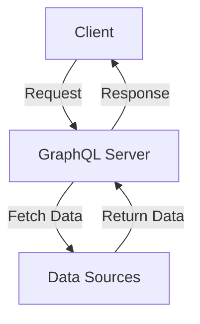

이와 같이, API 전략은 비즈니스의 성장과 혁신을 위한 중요한 요소이며, Tailcall의 GraphQL 솔루션은 이러한 전략을 효과적으로 지원하는 도구로 자리 잡고 있다. API 전략을 통해 기업들은 변화하는 시장 환경에 적응하고, 지속 가능한 성장을 이룰 수 있을 것이다.

<!--
## 추가 자료
   - API 전략 관련 백서 및 리소스 링크
   - API 설계 모범 사례
   - API 관리 도구 비교 및 추천
-->

## 추가 자료

**API 설계 모범 사례**  

API 설계는 성공적인 API 전략의 핵심 요소이다. 다음은 API 설계 시 고려해야 할 몇 가지 모범 사례이다.

- **RESTful 원칙 준수**: RESTful API는 자원 기반의 접근 방식을 따르며, HTTP 메서드를 적절히 활용해야 한다. 예를 들어, GET은 자원 조회, POST는 자원 생성, PUT은 자원 업데이트, DELETE는 자원 삭제에 사용된다.

- **명확한 엔드포인트 설계**: API의 엔드포인트는 직관적이고 명확해야 하며, 자원의 계층 구조를 반영해야 한다. 예를 들어, `/users/{userId}/orders`와 같은 형태로 설계할 수 있다.

- **버전 관리**: API의 변경 사항을 관리하기 위해 버전 관리를 도입해야 한다. URL에 버전 정보를 포함시키는 것이 일반적이다. 예를 들어, `/v1/users`와 같은 형태로 버전을 명시할 수 있다.

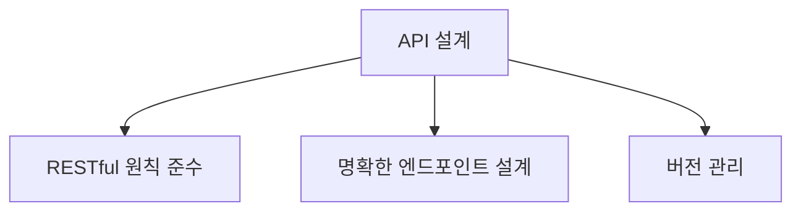

**API 관리 도구 비교 및 추천**  

API 관리 도구는 API의 설계, 배포, 모니터링 및 보안을 지원하는 중요한 역할을 한다. 다음은 몇 가지 인기 있는 API 관리 도구와 그 특징이다.

- **Apigee**: Google Cloud에서 제공하는 API 관리 플랫폼으로, API 설계, 분석, 보안 기능을 제공한다. 대규모 기업에 적합하다.

- **Kong**: 오픈 소스 API 게이트웨이로, 경량화된 성능과 플러그인 시스템을 통해 확장성이 뛰어나다. 마이크로서비스 아키텍처에 적합하다.

- **AWS API Gateway**: Amazon Web Services에서 제공하는 API 관리 서비스로, 서버리스 아키텍처와 통합이 용이하다. 비용 효율적인 솔루션을 제공한다.

이러한 도구들은 각기 다른 요구 사항에 맞춰 선택할 수 있으며, 비즈니스의 성장과 변화에 따라 적절한 도구를 활용하는 것이 중요하다.

<!--
##### Reference #####
-->

## Reference


* [https://tailcall.run/blog/api-strategy/](https://tailcall.run/blog/api-strategy/)
* [https://www.softwareag.com/en_corporate/resources/api/article/api-strategy.html](https://www.softwareag.com/en_corporate/resources/api/article/api-strategy.html)
* [https://document360.com/blog/api-strategy/](https://document360.com/blog/api-strategy/)
* [https://www.akana.com/resources/api-strategy](https://www.akana.com/resources/api-strategy)
* [https://www.astera.com/type/blog/api-strategy/](https://www.astera.com/type/blog/api-strategy/)
* [https://medium.com/api-center/api-primer-core-concepts-in-api-strategy-and-architecture-b0378a9b2b79](https://medium.com/api-center/api-primer-core-concepts-in-api-strategy-and-architecture-b0378a9b2b79)

