소프트웨어 및 시스템 아키텍처의 패턴은 수천 가지가 존재하며, 이들 각각은 특정한 문제를 해결하기 위해 고안된 것이다. 그러나 이러한 패턴들이 너무 많고, 그 이름이 서로 다르거나 심지어 혼란스러워지기까지 하면서, 개발자들은 패턴의 본질을 잊어버리기 쉽다. 예를 들어, 'N-tier' 아키텍처는 사실 'Layers' 아키텍처의 재포장일 뿐이다. 이러한 상황은 패턴이 원래 의도했던 지식 전달의 연속성을 해치고, 아키텍처의 통일된 비전을 제공하기 어렵게 만든다. 따라서 우리는 아키텍처 패턴을 메타패턴으로 분류하여, 유사한 구조와 기능을 가진 패턴들을 그룹화할 수 있는 방법을 모색해야 한다. 메타패턴은 아키텍처 패턴의 구조적 유사성을 기반으로 하여, 각 패턴이 어떻게 상호작용하고 연결되는지를 이해하는 데 도움을 줄 수 있다. 이러한 접근은 소프트웨어 아키텍처의 복잡성을 줄이고, 개발자들이 보다 쉽게 패턴을 기억하고 활용할 수 있도록 도와줄 것이다. 결국, 메타패턴을 통해 우리는 아키텍처 패턴의 본질을 재조명하고, 소프트웨어 설계의 기초를 다질 수 있는 기회를 가지게 된다.


||
|:---:|
||


## 개요

**Architectural Metapatterns의 정의**  

Architectural Metapatterns는 소프트웨어 아키텍처에서 반복적으로 나타나는 구조적 패턴을 의미한다. 이는 특정 문제를 해결하기 위해 사용되는 고수준의 패턴으로, 다양한 아키텍처 패턴을 통합하고 일반화하여 더 넓은 범위의 문제를 해결할 수 있도록 돕는다. 이러한 메타패턴은 시스템의 설계 및 구현 과정에서 일관성을 유지하고, 재사용성을 높이며, 유지보수를 용이하게 하는 데 기여한다.

**패턴의 중요성 및 필요성**  

소프트웨어 개발에서 패턴은 문제 해결의 효율성을 높이는 중요한 도구이다. 패턴을 사용함으로써 개발자는 이미 검증된 해결책을 활용할 수 있으며, 이는 개발 시간과 비용을 절감하는 데 큰 도움이 된다. 또한, 패턴은 팀 간의 의사소통을 원활하게 하고, 코드의 가독성을 높이며, 시스템의 확장성을 보장하는 데 중요한 역할을 한다. 따라서 Architectural Metapatterns는 복잡한 시스템을 설계하고 구현하는 데 필수적인 요소로 자리 잡고 있다.

**패턴의 역사와 발전**  

패턴의 개념은 1970년대에 Christopher Alexander의 건축 이론에서 시작되었다. 이후, 소프트웨어 공학 분야에서도 패턴의 중요성이 인식되면서, 1994년에는 "Design Patterns: Elements of Reusable Object-Oriented Software"라는 책이 출간되었다. 이 책은 소프트웨어 디자인 패턴의 기초를 다졌으며, 이후 다양한 아키텍처 패턴과 메타패턴이 발전하게 되었다. 최근에는 마이크로서비스 아키텍처, 이벤트 기반 아키텍처 등 새로운 패턴들이 등장하면서 Architectural Metapatterns의 필요성이 더욱 강조되고 있다.

**추천 대상**  

- 소프트웨어 아키텍처·시스템 설계를 체계적으로 정리하고 싶은 개발자·아키텍트  
- Monolith, Microservices, CQRS, Layered Architecture 등 패턴 이름은 알지만 구조적 관계를 이해하고 싶은 독자  
- 확장·분산·구현 메타패턴을 한 번에 비교·활용하고 싶은 실무자  

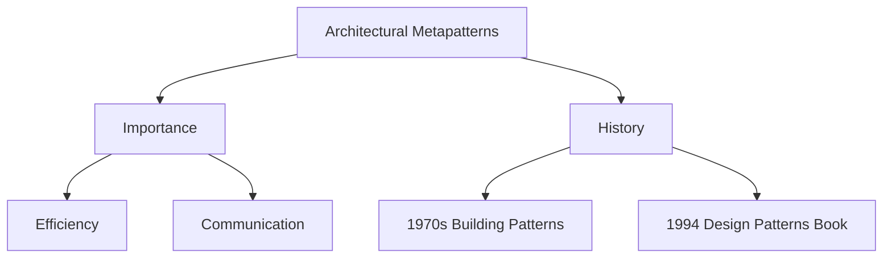
```mermaid
graph TD
    MetaPattern["Architectural Metapatterns"] --> Importance["Importance"]
    MetaPattern --> History["History"]
    Importance --> Efficiency["Efficiency"]
    Importance --> Communication["Communication"]
    History --> BuildingPatterns["1970s Building Patterns"]
    History --> DesignPatternsBook["1994 Design Patterns Book"]
```

위의 다이어그램은 Architectural Metapatterns의 정의, 중요성, 역사와 발전을 시각적으로 나타낸 것이다. 이러한 요소들은 소프트웨어 아키텍처의 발전에 기여하며, 개발자들이 보다 나은 시스템을 설계하는 데 도움을 준다.

## 메타패턴의 이해

**메타패턴의 개념**  

메타패턴은 소프트웨어 아키텍처에서 패턴을 정의하고 분류하는 고차원적인 개념이다. 이는 특정 문제를 해결하기 위한 일반적인 접근 방식을 제공하는 패턴의 집합으로, 다양한 아키텍처 패턴을 이해하고 적용하는 데 도움을 준다. 메타패턴은 시스템의 구조와 상호작용을 명확히 하고, 아키텍처 설계의 일관성을 유지하는 데 중요한 역할을 한다.

**메타패턴과 패턴의 차이**  

패턴은 특정 문제를 해결하기 위한 구체적인 솔루션을 제공하는 반면, 메타패턴은 이러한 패턴을 분류하고 조직하는 방법론이다. 즉, 메타패턴은 패턴의 패턴이라고 할 수 있으며, 여러 패턴 간의 관계를 이해하고, 패턴을 효과적으로 조합하여 더 복잡한 시스템을 설계하는 데 기여한다. 예를 들어, "Layered Architecture"는 아키텍처 패턴이지만, 이를 메타패턴으로 분류하면 "Layered"라는 메타패턴이 된다.

**메타패턴의 필요성**  

메타패턴은 소프트웨어 아키텍처 설계에서 다음과 같은 이유로 필요하다. 첫째, 메타패턴은 다양한 아키텍처 패턴을 체계적으로 이해하고 관리할 수 있는 프레임워크를 제공한다. 둘째, 메타패턴을 통해 아키텍처 설계의 일관성을 유지하고, 재사용성을 높일 수 있다. 셋째, 메타패턴은 복잡한 시스템을 설계할 때, 패턴 간의 관계를 명확히 하여 더 나은 의사결정을 가능하게 한다.

다음은 메타패턴의 개념을 시각적으로 표현한 다이어그램이다.

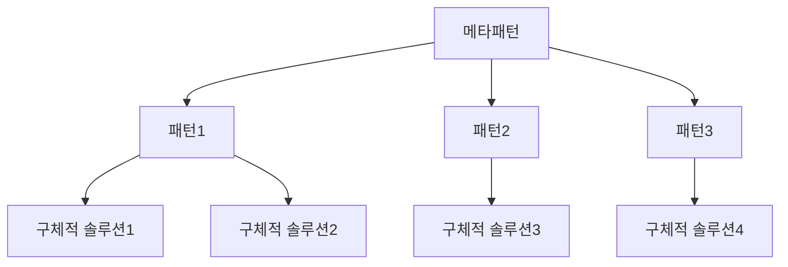
```mermaid
graph TD
    MetaP["메타패턴"] --> P1["패턴1"]
    MetaP --> P2["패턴2"]
    MetaP --> P3["패턴3"]
    P1 --> S1["구체적 솔루션1"]
    P1 --> S2["구체적 솔루션2"]
    P2 --> S3["구체적 솔루션3"]
    P3 --> S4["구체적 솔루션4"]
```

위의 다이어그램은 메타패턴이 여러 패턴을 포함하고 있으며, 각 패턴이 구체적인 솔루션으로 이어지는 구조를 보여준다. 이러한 구조는 메타패턴이 아키텍처 설계에서 어떻게 활용될 수 있는지를 잘 나타낸다.

## 아키텍처 패턴

아키텍처 패턴은 소프트웨어 시스템의 구조와 상호작용을 정의하는 일반적인 솔루션이다. 이러한 패턴은 시스템의 설계 및 구현에 있어 반복적으로 발생하는 문제를 해결하기 위한 지침을 제공한다. 아키텍처 패턴은 시스템의 전반적인 품질, 유지보수성, 확장성 및 성능에 큰 영향을 미친다.

**아키텍처 패턴의 정의**  

아키텍처 패턴은 소프트웨어 시스템의 구성 요소와 그들 간의 관계를 정의하는 고수준의 설계 패턴이다. 이는 특정 문제를 해결하기 위한 일반적인 접근 방식을 제공하며, 시스템의 구조를 명확히 하고, 개발자 간의 의사소통을 원활하게 한다.

**아키텍처 패턴의 분류**  

아키텍처 패턴은 여러 가지로 분류될 수 있으며, 그 중 주요한 분류는 다음과 같다:

- **Architectural Patterns**: 시스템의 전반적인 구조를 정의하는 패턴으로, 예를 들어 Layered Architecture, Microservices Architecture, Event-Driven Architecture 등이 있다. 이러한 패턴은 시스템의 주요 구성 요소와 그들 간의 상호작용을 정의한다.

- **Design Patterns**: 특정 문제를 해결하기 위한 소프트웨어 설계의 일반적인 솔루션이다. 예를 들어 Singleton, Factory, Observer 패턴 등이 있으며, 이는 아키텍처 패턴보다 더 세부적인 수준에서의 설계를 다룬다.

- **Idioms**: 특정 프로그래밍 언어나 기술 스택에서 자주 사용되는 코드 패턴이다. 이는 특정 언어의 문법이나 기능을 활용하여 문제를 해결하는 방법을 제시한다.

다음은 아키텍처 패턴의 예를 나타내는 다이어그램이다:

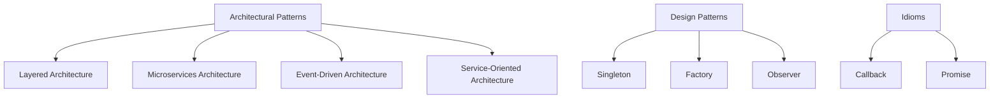
```mermaid
graph TD
    ArchP["Architectural Patterns"] --> Layered["Layered Architecture"]
    ArchP --> Micro["Microservices Architecture"]
    ArchP --> EventDriven["Event-Driven Architecture"]
    ArchP --> SOA["Service-Oriented Architecture"]
    DesignP["Design Patterns"] --> Singleton["Singleton"]
    DesignP --> Factory["Factory"]
    DesignP --> Observer["Observer"]
    Idioms["Idioms"] --> Callback["Callback"]
    Idioms --> Promise["Promise"]
```

이와 같은 아키텍처 패턴의 이해는 소프트웨어 개발 과정에서 효과적인 설계를 가능하게 하며, 시스템의 복잡성을 관리하는 데 중요한 역할을 한다. 각 패턴은 특정 상황에서의 장단점이 있으므로, 적절한 패턴을 선택하는 것이 중요하다.

## 디자인 공간

**디자인 공간의 개념**  

디자인 공간(Design Space)은 소프트웨어 아키텍처 및 디자인에서 다양한 선택지와 가능성을 탐색할 수 있는 추상적인 공간을 의미한다. 이 공간은 시스템의 요구사항, 제약 조건, 그리고 목표에 따라 다양한 아키텍처 패턴과 디자인 패턴을 조합하여 최적의 솔루션을 찾는 데 도움을 준다. 디자인 공간은 개발자와 아키텍트가 문제를 해결하기 위해 고려해야 할 다양한 요소들을 시각적으로 표현할 수 있는 유용한 도구이다.

**다차원 디자인 공간의 이해**  

다차원 디자인 공간은 여러 차원에서 시스템의 아키텍처를 분석하고 평가하는 방법론이다. 각 차원은 특정한 속성이나 특성을 나타내며, 이를 통해 다양한 아키텍처 옵션을 비교하고 선택할 수 있다. 예를 들어, 시스템의 복잡성, 성능, 확장성, 유지보수성 등의 차원을 고려하여 최적의 아키텍처를 선택할 수 있다. 이러한 다차원적 접근은 복잡한 시스템을 이해하고 설계하는 데 필수적이다.

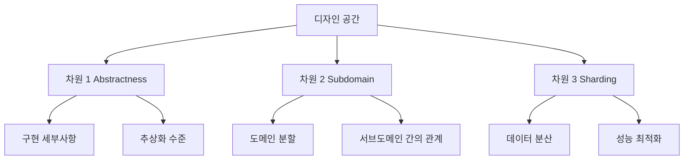
```mermaid
graph TD
    DesignSpace["디자인 공간"] --> Dim1["차원 1 Abstractness"]
    DesignSpace --> Dim2["차원 2 Subdomain"]
    DesignSpace --> Dim3["차원 3 Sharding"]
    Dim1 --> ImplDetail["구현 세부사항"]
    Dim1 --> AbstLevel["추상화 수준"]
    Dim2 --> DomainSplit["도메인 분할"]
    Dim2 --> SubdomainRel["서브도메인 간의 관계"]
    Dim3 --> DataDist["데이터 분산"]
    Dim3 --> PerfOpt["성능 최적화"]
```

**디자인 공간의 차원: Abstractness, Subdomain, Sharding**  

디자인 공간의 주요 차원으로는 Abstractness, Subdomain, Sharding이 있다.

1. **Abstractness**: 이 차원은 시스템의 추상화 수준을 나타낸다. 높은 추상화 수준은 시스템의 복잡성을 줄이고, 유지보수성을 높이는 데 기여한다. 반면, 낮은 추상화 수준은 시스템의 세부사항을 더 잘 이해할 수 있게 하지만, 복잡성을 증가시킬 수 있다.

2. **Subdomain**: 이 차원은 시스템이 다루는 도메인의 세부적인 분할을 나타낸다. 각 서브도메인은 특정한 비즈니스 기능이나 요구사항을 반영하며, 이를 통해 시스템의 모듈화와 독립성을 높일 수 있다. 서브도메인 간의 관계를 명확히 정의하는 것은 시스템의 전체적인 아키텍처를 이해하는 데 중요하다.

3. **Sharding**: 이 차원은 데이터의 분산 저장 방식을 나타낸다. Sharding은 대규모 데이터베이스에서 성능을 최적화하고, 확장성을 높이기 위해 데이터를 여러 개의 샤드로 나누어 저장하는 기법이다. 이를 통해 데이터 접근 속도를 향상시키고, 시스템의 부하를 분산시킬 수 있다.

이러한 차원들은 디자인 공간 내에서 다양한 아키텍처 선택지를 평가하고, 최적의 솔루션을 찾는 데 중요한 역할을 한다.

## 구조가 아키텍처를 정의한다

**시스템의 내부 구조**  

시스템의 내부 구조는 소프트웨어 아키텍처의 핵심 요소 중 하나이다. 내부 구조는 시스템이 어떻게 구성되어 있는지를 나타내며, 각 구성 요소 간의 관계와 상호작용을 정의한다. 이러한 구조는 시스템의 성능, 확장성, 유지보수성에 큰 영향을 미친다. 예를 들어, 모듈화된 구조는 코드의 재사용성을 높이고, 각 모듈의 독립적인 개발과 테스트를 가능하게 한다. 반면, 복잡한 의존성을 가진 구조는 시스템의 이해도를 낮추고, 변경 시 오류를 발생시킬 가능성을 높인다.

**구조적 다이어그램의 중요성**  

구조적 다이어그램은 시스템의 내부 구조를 시각적으로 표현하는 도구이다. 이러한 다이어그램은 아키텍처 설계 과정에서 중요한 역할을 하며, 이해관계자 간의 의사소통을 원활하게 한다. 구조적 다이어그램을 통해 개발자는 시스템의 구성 요소와 그들 간의 관계를 명확히 이해할 수 있으며, 이는 시스템 설계 및 구현에 있어 필수적이다. 예를 들어, UML(Unified Modeling Language) 다이어그램은 클래스, 컴포넌트, 패키지 등의 관계를 시각적으로 표현하여 아키텍처를 명확히 한다.

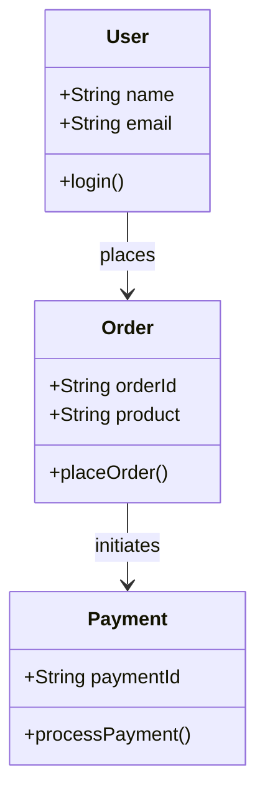
```mermaid
classDiagram
    class User {
        +String name
        +String email
        +login()
    }
    class Order {
        +String orderId
        +String product
        +placeOrder()
    }
    class Payment {
        +String paymentId
        +processPayment()
    }
    
    User --> Order : places
    Order --> Payment : initiates
```

**"Big Balls of Mud"의 개념**  

"Big Balls of Mud"는 소프트웨어 아키텍처에서 자주 언급되는 개념으로, 구조가 명확하지 않고, 코드가 복잡하게 얽혀 있는 상태를 의미한다. 이러한 상태는 시스템의 유지보수와 확장을 어렵게 만들며, 새로운 기능을 추가하는 데 많은 시간과 노력이 소요된다. "Big Balls of Mud"는 일반적으로 다음과 같은 문제를 초래한다:

1. **가독성 저하**: 코드가 복잡하게 얽혀 있어 이해하기 어려워진다.
2. **버그 발생 가능성 증가**: 코드 변경 시 예상치 못한 오류가 발생할 가능성이 높아진다.
3. **유지보수 비용 증가**: 시스템의 변경이나 수정이 어려워져 유지보수 비용이 증가한다.

이러한 문제를 해결하기 위해서는 명확한 아키텍처 설계와 구조적 접근이 필요하다. 이를 통해 시스템의 복잡성을 줄이고, 유지보수성을 높일 수 있다.

## 메타패턴의 분류

소프트웨어 아키텍처에서 메타패턴은 시스템의 구조와 상호작용을 정의하는 핵심적인 요소이다. 메타패턴은 크게 **기본 메타패턴**, **확장 메타패턴**, **분산 메타패턴**, **구현 메타패턴**으로 나뉜다. 각 패턴은 시스템의 요구사항에 따라 효율적이고 유연한 구조를 제공한다. 각 패턴의 특징을 이해하고, 상황에 맞게 선택하는 것이 소프트웨어 아키텍처 설계의 중요한 과정이다.

## **기본 메타패턴 (Core Meta-patterns)**

기본 메타패턴은 시스템의 전반적인 구조를 정의하는 패턴으로, 단일 코드베이스에서 계층화된 아키텍처까지 다양한 범위를 포괄한다.

1. **Monolith**
   모든 기능이 하나의 코드베이스에 통합된 구조이다. 초기 개발이 간단하고 빠르게 진행될 수 있지만, 규모가 커질수록 유지보수 및 확장성에 문제가 생길 수 있다.

   ```mermaid
   graph TD
       Mono["Monolith"] --> F1["Feature 1"]
       Mono --> F2["Feature 2"]
       Mono --> F3["Feature 3"]
   ```

2. **Shards**
   데이터베이스를 수평적으로 확장하여 성능을 향상시키는 방식이다. 각 샤드는 독립적으로 관리되며, 데이터의 분산 처리를 통해 확장성과 성능을 높인다.

   ```mermaid
   graph TD
       DB["Database"] --> S1["Shard 1"]
       DB --> S2["Shard 2"]
       DB --> S3["Shard 3"]
   ```

3. **Layers**
   시스템을 여러 계층으로 나누어, 각 계층이 특정한 역할을 수행하도록 설계된 패턴이다. 일반적으로 프레젠테이션, 비즈니스 로직, 데이터 접근 계층으로 나뉘며, 이를 통해 관심사 분리가 가능하다.

   ```mermaid
   graph TD
       PresLayer["Presentation Layer"] --> BizLayer["Business Logic Layer"]
       BizLayer --> DataLayer["Data Access Layer"]
   ```

4. **Services**
   시스템을 독립적으로 배포 가능한 서비스들로 구성하는 구조이다. 각 서비스는 특정 비즈니스 기능을 수행하며, 전체 시스템의 유연성을 높인다.

   ```mermaid
   graph TD
       Sv1["Service 1"] --> Sv2["Service 2"]
       Sv2 --> Sv3["Service 3"]
   ```

5. **Pipeline**
   데이터 처리를 여러 단계로 나누어 각 단계에서 특정 작업을 수행하는 구조이다. 각 단계에서 데이터가 변환되고 처리되며, 데이터의 흐름을 파이프라인으로 관리한다.

   ```mermaid
   graph TD
       DataIn["Data Input"] --> Step1["Step 1"]
       Step1 --> Step2["Step 2"]
       Step2 --> Step3["Step 3"]
       Step3 --> DataOut["Data Output"]
   ```

---

**확장 메타패턴 (Extended Meta-patterns)**

확장 메타패턴은 기본 메타패턴을 보완하거나 추가적인 기능을 제공하기 위해 설계된 패턴이다.

1. **Middleware**
   애플리케이션과 데이터베이스 또는 서비스 간의 중재 역할을 하는 소프트웨어이다. 주로 다양한 서비스 간의 통신을 관리하고, 데이터 흐름을 조정하는 역할을 한다.

   ```mermaid
   graph TD
       Client["Client"] --> Middleware["Middleware"]
       Middleware --> Database["Database"]
   ```

2. **Shared Repository**
   여러 서비스가 공통으로 사용하는 데이터 저장소이다. 이를 통해 데이터 일관성을 유지하면서도 여러 서비스가 데이터를 효율적으로 공유할 수 있다.

   ```mermaid
   graph TD
       Serv1["Service 1"] --> SharedRepo["Shared Repository"]
       Serv2["Service 2"] --> SharedRepo
       Serv3["Service 3"] --> SharedRepo
   ```

3. **Proxy**
   클라이언트와 서버 간의 중개 역할을 수행하며, 요청을 전달하고 응답을 반환하는 역할을 한다. 이를 통해 보안, 캐싱 및 부하 분산과 같은 기능을 추가할 수 있다.

   ```mermaid
   graph TD
       Cli["Client"] --> Proxy["Proxy"]
       Proxy --> Server["Server"]
   ```

4. **Orchestrator**
   여러 서비스 간의 상호작용을 조정하여 복잡한 비즈니스 로직을 구현하는 역할을 한다. 서비스 간의 호출 순서 및 데이터 흐름을 관리하여 시스템 전반의 효율성을 높인다.

   ```mermaid
   graph TD
       Orch["Orchestrator"] --> Srv1["Service 1"]
       Orch --> Srv2["Service 2"]
       Orch --> Srv3["Service 3"]
   ```

5. **Multifunctional Components**
   여러 기능을 하나의 컴포넌트에서 제공하는 구조로, 코드의 중복을 줄이고 시스템 복잡성을 낮출 수 있다.

   ```mermaid
   graph TD
       Comp["Component"] --> Feat1["Feature 1"]
       Comp --> Feat2["Feature 2"]
       Comp --> Feat3["Feature 3"]
   ```

---

**분산 메타패턴 (Distributed Meta-patterns)**

분산 메타패턴은 시스템이 여러 위치에서 동시에 실행될 때 적용되는 패턴들이다. 주로 성능, 확장성, 그리고 높은 가용성을 위해 사용된다.

1. **Layered Services**
   서비스가 여러 계층으로 나뉘어 각 계층이 독립적으로 특정 역할을 수행하는 구조이다. 이를 통해 서비스 간의 의존성을 줄이고 유지보수를 용이하게 한다.

   ```mermaid
   graph TD
       SL1["Service Layer 1"] --> SL2["Service Layer 2"]
       SL2 --> SL3["Service Layer 3"]
   ```

2. **Polyglot Persistence**
   여러 종류의 데이터 저장소를 사용하는 아키텍처로, 각 저장소는 특정한 데이터 요구사항에 맞춰 사용된다. 성능 및 확장성 향상을 목표로 한다.

   ```mermaid
   graph TD
       App["Application"] --> SqlDb["SQL DB"]
       App --> NoSqlDb["NoSQL DB"]
       App --> GraphDb["Graph DB"]
   ```

3. **Backends for Frontends**
   각 프론트엔드의 요구에 맞춰 최적화된 백엔드를 제공하는 구조이다. 이를 통해 프론트엔드에 필요한 데이터를 효율적으로 제공할 수 있다.

   ```mermaid
   graph TD
       FE1["Frontend 1"] --> BE1["Backend 1"]
       FE2["Frontend 2"] --> BE2["Backend 2"]
       FE3["Frontend 3"] --> BE3["Backend 3"]
   ```

4. **Service-Oriented Architecture (SOA)**
   각 서비스가 독립적으로 배포되어 서로 통신하는 방식으로, 비즈니스 기능을 구현하는 아키텍처이다. 이를 통해 시스템의 유연성과 재사용성을 높인다.

   ```mermaid
   graph TD
       Cl["Client"] --> Soa1["Service 1"]
       Cl --> Soa2["Service 2"]
       Cl --> Soa3["Service 3"]
   ```

5. **Hierarchy**
   시스템이 계층적으로 조직된 구조로, 상위 계층의 요청을 처리하고 하위 계층에 결과를 전달하는 방식으로 동작한다.

   ```mermaid
   graph TD
       TopLayer["Top Layer"] --> MidLayer["Middle Layer"]
       MidLayer --> BotLayer["Bottom Layer"]
   ```

---

**구현 메타패턴 (Implementation Meta-patterns)**

구현 메타패턴은 특정 시스템 구현에 필요한 구조적 패턴들이다. 이를 통해 시스템의 확장성과 유지보수성을 높일 수 있다.

1. **Plugins**
   플러그인을 통해 애플리케이션의 기능을 확장할 수 있는 구조이다. 이를 통해 새로운 기능을 쉽게 추가하거나 수정할 수 있다.

   ```mermaid
   graph TD
       Application["Application"] --> Plug1["Plugin 1"]
       Application --> Plug2["Plugin 2"]
       Application --> Plug3["Plugin 3"]
   ```

2. **Hexagonal Architecture**
   애플리케이션의 비즈니스 로직을 외부와 분리하여 독립적으로 테스트할 수 있도록 하는 구조이다. 이를 통해 높은 유연성과 유지보수성을 제공한다.

   ```mermaid
   graph TD
       BizLogic["Business Logic"] --> Api["API"]
       BizLogic --> Db["Database"]
   ```

3. **Microkernel**
   최소한의 기능만을 가진 커널 위에 다양한 플러그인을 추가하여 기능을 확장하는 구조이다. 이를 통해 시스템의 복잡성을 줄이고, 확장성을 높일 수 있다.

   ```mermaid
   graph TD
       Microkernel["Microkernel"] --> P1["Plugin 1"]
       Microkernel --> P2["Plugin 2"]
       Microkernel --> P3["Plugin 3"]
   ```

4. **Mesh**
   서비스 간의 직접적인 통신을 통해 데이터를 공유하는 구조로, 서비스 간의 의존성을 줄이고 시스템의 유연성을 높인다.

   ```mermaid
   graph TD
      M1["Service 1"] --> M2["Service 2"]
      M2 --> M3["Service 3"]
      M3 --> M1
   ```

---

위의 메타패턴들은 소프트웨어 아키텍처 설계에서 다양한 요구사항을 충족시키기 위해 설계된 구조들이다. 각 메타패턴의 장점과 단점을 이해하고 적절히 적용함으로써, 더욱 효율적이고 확장성 있는 시스템을 구축할 수 있다.

## 메타패턴의 예제

**구조적 예제 분석**  

메타패턴은 소프트웨어 아키텍처에서 구조적 요소를 정의하는 데 중요한 역할을 한다. 예를 들어, Monolith 메타패턴은 모든 기능이 하나의 코드베이스에 통합되어 있는 구조를 나타낸다. 이는 초기 개발 단계에서 빠른 프로토타입을 가능하게 하지만, 시스템이 커짐에 따라 유지보수와 확장성에 어려움을 겪을 수 있다. 반면, Shards 메타패턴은 데이터베이스를 여러 개의 샤드로 나누어 성능을 향상시키고, 대규모 트래픽을 처리할 수 있도록 한다. 이러한 구조적 예제들은 각 메타패턴이 어떻게 시스템의 요구사항을 충족시키는지를 보여준다.

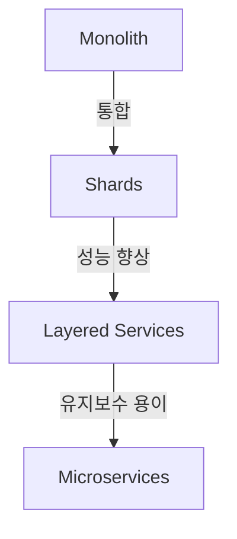
```mermaid
graph TD
    Monolith["Monolith"] -->|"통합"| Shards["Shards"]
    Shards -->|"성능 향상"| LayeredSv["Layered Services"]
    LayeredSv -->|"유지보수 용이"| Microservices["Microservices"]
```

**Middleware, Shared Database, Model-View-Controller의 비교**  

Middleware, Shared Database, Model-View-Controller(MVC)는 각각 다른 메타패턴을 나타내며, 이들 간의 비교는 아키텍처 설계에서의 선택 기준을 이해하는 데 도움이 된다. 

- **Middleware**는 애플리케이션과 데이터베이스 간의 중재 역할을 하며, 다양한 서비스 간의 통신을 관리한다. 이는 시스템의 유연성을 높이고, 다양한 프로토콜을 지원할 수 있도록 한다.
  
- **Shared Database**는 여러 애플리케이션이 동일한 데이터베이스를 공유하는 구조로, 데이터 일관성을 유지하는 데 유리하지만, 데이터베이스의 단일 실패 지점(Single Point of Failure) 문제를 초래할 수 있다.

- **Model-View-Controller**는 애플리케이션의 구조를 세 가지 주요 구성 요소로 나누어, 각 요소의 책임을 명확히 하여 유지보수성을 높인다. 이는 사용자 인터페이스와 비즈니스 로직을 분리하여 개발자와 디자이너 간의 협업을 용이하게 한다.

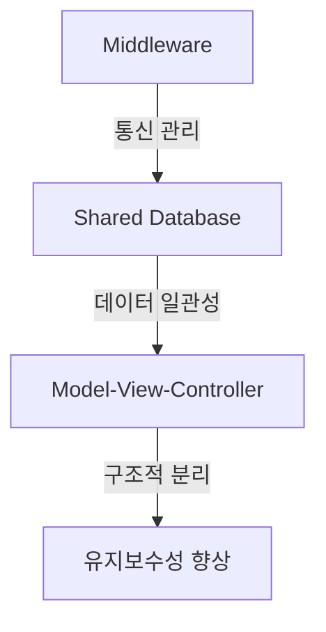
```mermaid
graph TD
    Middleware["Middleware"] -->|"통신 관리"| SharedDb["Shared Database"]
    SharedDb -->|"데이터 일관성"| MVC["Model-View-Controller"]
    MVC -->|"구조적 분리"| MaintUp["유지보수성 향상"]
```

**메타패턴 간의 관계** 

메타패턴 간의 관계는 아키텍처 설계에서 중요한 요소이다. 예를 들어, Microservices 아키텍처는 여러 개의 독립적인 서비스로 구성되며, 각 서비스는 특정 기능을 수행한다. 이때, 각 서비스는 Layered Services 메타패턴을 따를 수 있으며, 이를 통해 서비스 간의 의존성을 줄이고, 독립적인 배포가 가능해진다. 또한, Polyglot Persistence 메타패턴을 통해 각 서비스는 자신에게 가장 적합한 데이터 저장소를 선택할 수 있다.

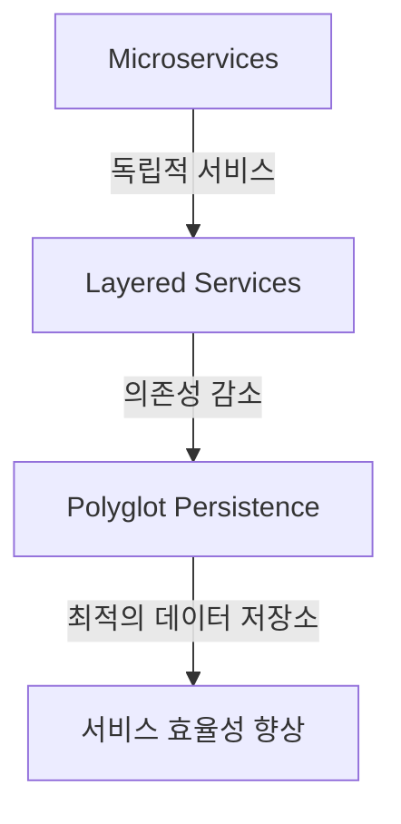
```mermaid
graph TD
    Micro["Microservices"] -->|"독립적 서비스"| Layered["Layered Services"]
    Layered -->|"의존성 감소"| Polyglot["Polyglot Persistence"]
    Polyglot -->|"최적의 데이터 저장소"| EffUp["서비스 효율성 향상"]
```

이와 같이 메타패턴 간의 관계를 이해하는 것은 아키텍처 설계에서의 선택을 보다 명확하게 하고, 시스템의 요구사항에 맞는 최적의 구조를 설계하는 데 기여한다.

## FAQ

**메타패턴과 아키텍처 패턴의 차이는 무엇인가요?**

메타패턴(Metapattern)은 아키텍처 패턴(Architecture Pattern)보다 더 높은 추상화 수준에서 시스템의 구조와 상호작용을 정의하는 개념이다. 아키텍처 패턴은 특정 문제를 해결하기 위한 구체적인 설계 솔루션을 제공하는 반면, 메타패턴은 이러한 패턴들이 어떻게 조합되고 상호작용하는지를 설명한다. 즉, 메타패턴은 여러 아키텍처 패턴을 포괄하는 틀을 제공하여, 다양한 상황에서의 패턴 사용을 지원한다.

예를 들어, "Microservices Architecture"는 아키텍처 패턴의 하나로, 서비스 간의 독립성을 강조한다. 반면, 메타패턴은 이러한 마이크로서비스가 어떻게 구성되고, 서로 어떻게 통신하는지를 설명하는 데 중점을 둔다.

**메타패턴을 어떻게 활용할 수 있나요?**

메타패턴은 소프트웨어 아키텍처 설계 시 유용한 가이드를 제공한다. 개발자는 메타패턴을 활용하여 시스템의 요구사항에 맞는 아키텍처 패턴을 선택하고, 이를 조합하여 최적의 솔루션을 설계할 수 있다. 또한, 메타패턴은 팀 간의 의사소통을 원활하게 하고, 아키텍처 설계의 일관성을 유지하는 데 도움을 준다.

다음은 메타패턴을 활용한 간단한 예제이다.

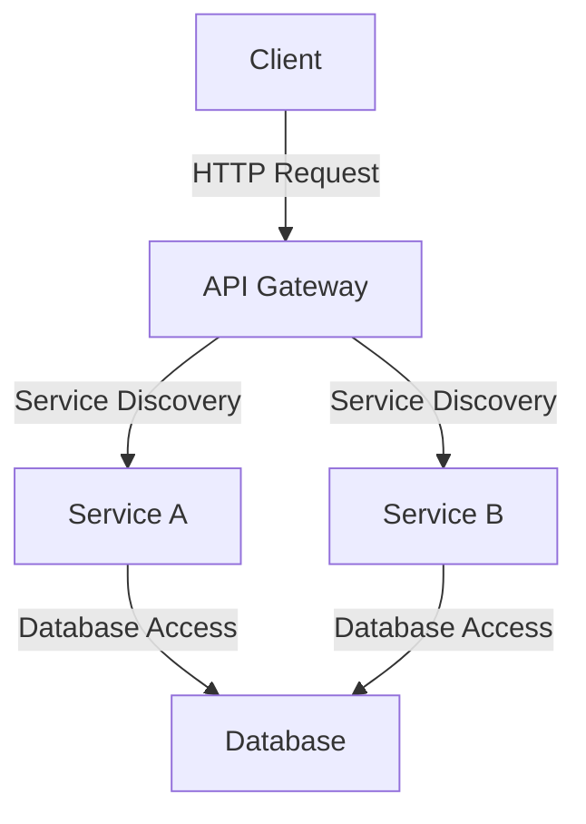
```mermaid
graph TD
    Client["Client"] -->|"HTTP Request"| ApiGw["API Gateway"]
    ApiGw -->|"Service Discovery"| SvcA["Service A"]
    ApiGw -->|"Service Discovery"| SvcB["Service B"]
    SvcA -->|"Database Access"| Db["Database"]
    SvcB -->|"Database Access"| Db
```

위 다이어그램은 API Gateway를 통해 클라이언트가 여러 서비스에 접근하는 구조를 보여준다. 이 구조는 메타패턴인 "Layered Services"를 활용하여 서비스 간의 의존성을 줄이고, 각 서비스가 독립적으로 동작할 수 있도록 한다.

**아키텍처 패턴의 선택 기준은 무엇인가요?**

아키텍처 패턴을 선택할 때는 다음과 같은 기준을 고려해야 한다.

1. **요구사항 분석**: 시스템의 기능적 및 비기능적 요구사항을 명확히 이해해야 한다. 예를 들어, 성능, 확장성, 유지보수성 등의 요구사항이 중요하다.

2. **팀의 경험**: 팀의 기술 스택과 경험에 따라 적합한 아키텍처 패턴이 달라질 수 있다. 팀이 익숙한 패턴을 선택하는 것이 효율적이다.

3. **기술적 제약**: 사용하려는 기술 스택이나 플랫폼의 제약 사항을 고려해야 한다. 특정 아키텍처 패턴은 특정 기술에 더 적합할 수 있다.

4. **장기적인 유지보수**: 선택한 아키텍처 패턴이 시스템의 장기적인 유지보수에 미치는 영향을 고려해야 한다. 복잡한 패턴은 유지보수 비용을 증가시킬 수 있다.

이러한 기준을 바탕으로 아키텍처 패턴을 선택하면, 시스템의 성공적인 설계와 구현에 기여할 수 있다.

## 관련 기술

소프트웨어 아키텍처와 메타패턴을 이해하기 위해서는 여러 관련 기술에 대한 이해가 필요하다. 이 섹션에서는 Design Patterns, Microservices Architecture, Domain-Driven Design (DDD), Event-Driven Architecture, 그리고 Service Mesh에 대해 살펴보겠다.

**Design Patterns**  

디자인 패턴은 소프트웨어 설계에서 자주 발생하는 문제를 해결하기 위한 일반적인 솔루션이다. 이 패턴들은 특정 상황에서의 재사용 가능한 설계 템플릿을 제공하여 개발자들이 효율적으로 문제를 해결할 수 있도록 돕는다. 디자인 패턴은 크게 생성 패턴, 구조 패턴, 행동 패턴으로 나눌 수 있다.

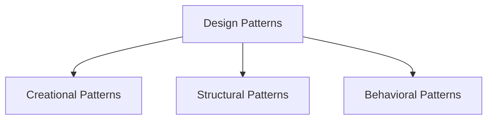
```mermaid
graph TD
    DesignPatterns["Design Patterns"] --> Creational["Creational Patterns"]
    DesignPatterns --> Structural["Structural Patterns"]
    DesignPatterns --> Behavioral["Behavioral Patterns"]
```

**Microservices Architecture**  

마이크로서비스 아키텍처는 애플리케이션을 독립적으로 배포 가능한 작은 서비스로 나누는 접근 방식이다. 각 서비스는 특정 비즈니스 기능을 수행하며, 서로 통신하기 위해 API를 사용한다. 이 아키텍처는 확장성과 유지보수성을 높이는 데 기여한다.

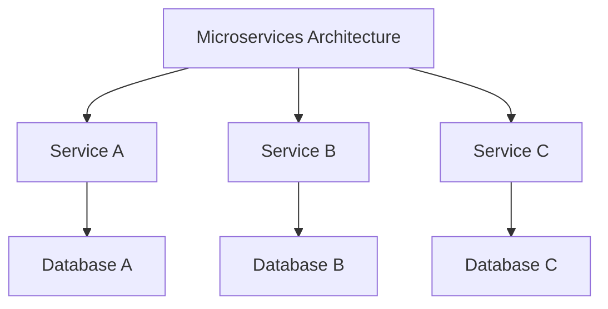
```mermaid
graph TD
    MicroArch["Microservices Architecture"] --> SvcA1["Service A"]
    MicroArch --> SvcB1["Service B"]
    MicroArch --> SvcC1["Service C"]
    SvcA1 --> Dba["Database A"]
    SvcB1 --> Dbb["Database B"]
    SvcC1 --> Dbc["Database C"]
```

**Domain-Driven Design (DDD)**  

도메인 주도 설계는 복잡한 소프트웨어 프로젝트에서 도메인 모델을 중심으로 설계를 진행하는 방법론이다. DDD는 도메인 전문가와 개발자 간의 협업을 강조하며, 도메인 모델을 통해 비즈니스 요구사항을 명확히 하고 소프트웨어 아키텍처를 정의한다.

**Event-Driven Architecture**  

이벤트 기반 아키텍처는 시스템의 구성 요소가 이벤트를 통해 서로 통신하는 방식이다. 이 아키텍처는 비동기 처리를 가능하게 하여 시스템의 확장성과 반응성을 높인다. 이벤트는 상태 변화나 특정 작업의 완료를 나타내며, 이를 통해 시스템의 흐름을 제어할 수 있다.

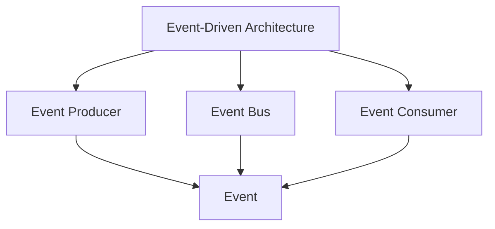
```mermaid
graph TD
    EventDriven["Event-Driven Architecture"] --> EvProd["Event Producer"]
    EventDriven --> EvBus["Event Bus"]
    EventDriven --> EvCons["Event Consumer"]
    EvProd --> Ev["Event"]
    EvBus --> Ev
    EvCons --> Ev
```

**Service Mesh**  

서비스 메시는 마이크로서비스 간의 통신을 관리하기 위한 인프라 계층이다. 서비스 메시는 서비스 간의 트래픽을 제어하고, 보안, 모니터링, 로깅 등의 기능을 제공하여 마이크로서비스 아키텍처의 복잡성을 줄인다. 이를 통해 개발자는 비즈니스 로직에 집중할 수 있다.

이와 같은 관련 기술들은 Architectural Metapatterns의 이해를 돕고, 소프트웨어 아키텍처 설계 시 고려해야 할 다양한 요소들을 제공한다. 각 기술은 서로 연결되어 있으며, 적절히 조합하여 사용할 때 더욱 효과적인 아키텍처를 구축할 수 있다.

## 결론

**메타패턴의 중요성 요약**  

메타패턴은 소프트웨어 아키텍처 설계에서 중요한 역할을 한다. 이는 다양한 아키텍처 패턴을 이해하고, 이를 효과적으로 조합하여 시스템을 설계하는 데 도움을 준다. 메타패턴은 아키텍처의 복잡성을 줄이고, 재사용성을 높이며, 시스템의 유지보수성을 향상시키는 데 기여한다. 또한, 메타패턴을 통해 개발자는 특정 문제를 해결하기 위한 최적의 접근 방식을 선택할 수 있다. 이러한 이유로 메타패턴은 현대 소프트웨어 개발에서 필수적인 요소로 자리 잡고 있다.

**향후 연구 방향**  

메타패턴에 대한 연구는 앞으로도 계속될 필요가 있다. 특히, 다음과 같은 방향으로의 연구가 필요하다:

1. **자동화된 메타패턴 인식**: 머신러닝 기법을 활용하여 코드베이스에서 메타패턴을 자동으로 인식하고 추천하는 시스템 개발.
2. **메타패턴의 진화**: 새로운 기술과 패러다임의 등장에 따라 메타패턴이 어떻게 변화하고 적응할 수 있는지에 대한 연구.
3. **실제 사례 연구**: 다양한 산업에서 메타패턴을 적용한 사례를 분석하여 그 효과와 한계를 파악하는 연구.

**소프트웨어 아키텍처의 발전 가능성**  
소프트웨어 아키텍처는 기술의 발전과 함께 지속적으로 변화하고 있다. 클라우드 컴퓨팅, 마이크로서비스 아키텍처, 이벤트 기반 아키텍처 등 새로운 패러다임이 등장하면서 아키텍처 설계의 접근 방식도 변화하고 있다. 메타패턴은 이러한 변화에 적응할 수 있는 유연성을 제공하며, 개발자들이 복잡한 시스템을 효과적으로 설계하고 관리할 수 있도록 돕는다. 앞으로의 소프트웨어 아키텍처는 메타패턴을 통해 더욱 발전할 가능성이 크다.

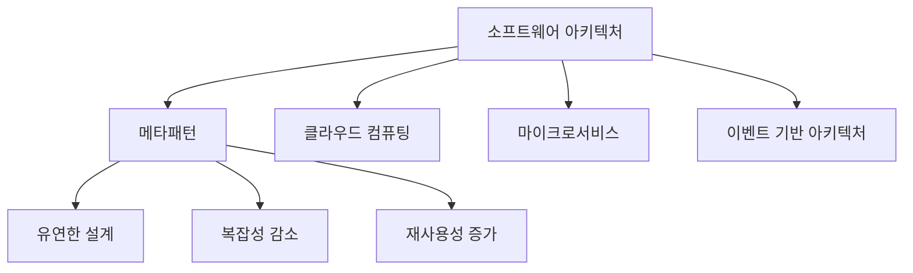
```mermaid
graph TD
    SwArch["소프트웨어 아키텍처"] --> Meta["메타패턴"]
    SwArch --> Cloud["클라우드 컴퓨팅"]
    SwArch --> MicroSv["마이크로서비스"]
    SwArch --> EventArch["이벤트 기반 아키텍처"]
    Meta --> FlexDesign["유연한 설계"]
    Meta --> ComplexRed["복잡성 감소"]
    Meta --> ReuseUp["재사용성 증가"]
```

위의 다이어그램은 소프트웨어 아키텍처의 발전 방향과 메타패턴의 역할을 시각적으로 나타낸 것이다. 메타패턴은 다양한 아키텍처 패러다임과 연결되어 있으며, 이를 통해 소프트웨어 아키텍처의 발전 가능성을 보여준다.

## 참고 문헌

**관련 서적 및 자료 목록**

1. **Design Patterns: Elements of Reusable Object-Oriented Software** - Erich Gamma, Richard Helm, Ralph Johnson, John Vlissides  
   - 소프트웨어 디자인 패턴의 기초를 다루며, 재사용 가능한 객체 지향 소프트웨어 설계를 설명한다.

2. **Domain-Driven Design: Tackling Complexity in the Heart of Software** - Eric Evans  
   - 도메인 주도 설계의 원칙과 패턴을 설명하며, 복잡한 소프트웨어 시스템 설계 방법을 제시한다.

3. **Microservices Patterns: With examples in Java** - Chris Richardson  
   - 마이크로서비스 아키텍처의 패턴과 구현 방법을 다루며, 실제 예제를 통해 이해를 돕는다.

4. **Building Microservices: Designing Fine-Grained Systems** - Sam Newman  
   - 마이크로서비스 아키텍처의 설계 원칙과 실천 방법, 시스템 구성에 대한 통찰을 제공한다.

5. **Patterns of Enterprise Application Architecture** - Martin Fowler  
   - 엔터프라이즈 애플리케이션 아키텍처에서 자주 사용되는 패턴과 사용 사례를 정리한다.

**웹 자료**

- **Martin Fowler – Software Architecture Guide**: [https://martinfowler.com/architecture/](https://martinfowler.com/architecture/)  
  - 아키텍처 정의·애플리케이션/엔터프라이즈 아키텍처, 마이크로서비스 등 정리.

- **Architectural Metapatterns (ITNEXT)**: [https://itnext.io/architectural-metapatterns-1834bdbc4221](https://itnext.io/architectural-metapatterns-1834bdbc4221)  
  - 메타패턴 이론, 디자인 공간, ASS 좌표계, 구조가 아키텍처를 정의한다는 관점 소개.

- **The list of architectural metapatterns (ITNEXT)**: [https://itnext.io/the-list-of-architectural-metapatterns-ed64d8ba125d](https://itnext.io/the-list-of-architectural-metapatterns-ed64d8ba125d)  
  - 기본·확장·분산·구현 메타패턴 목록과 설명.

- **Pattern Languages of Programs (PLoP) – Hillside**: [https://hillside.net/index.php/past-plop-conferences](https://hillside.net/index.php/past-plop-conferences)  
  - 패턴 언어 및 패턴 컨퍼런스 아카이브.

이와 같은 자료들은 Architectural Metapatterns에 대한 깊이 있는 이해를 돕고, 관련된 패턴을 효과적으로 활용하는 데 유용하다.
