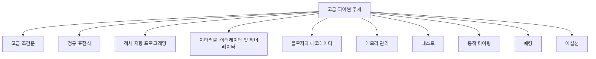
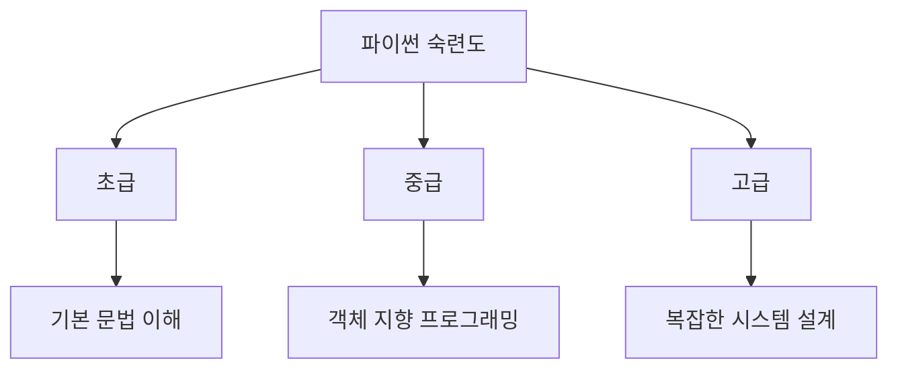
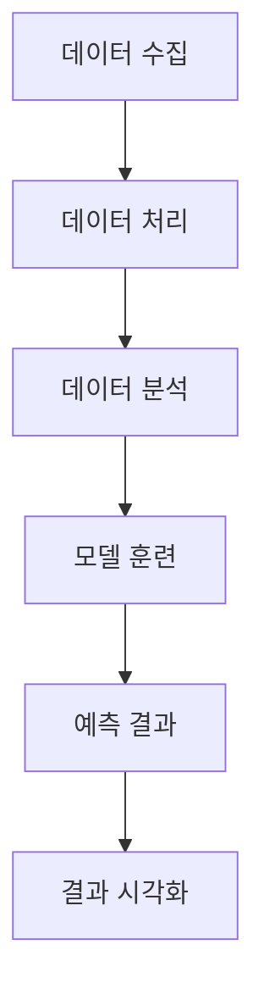
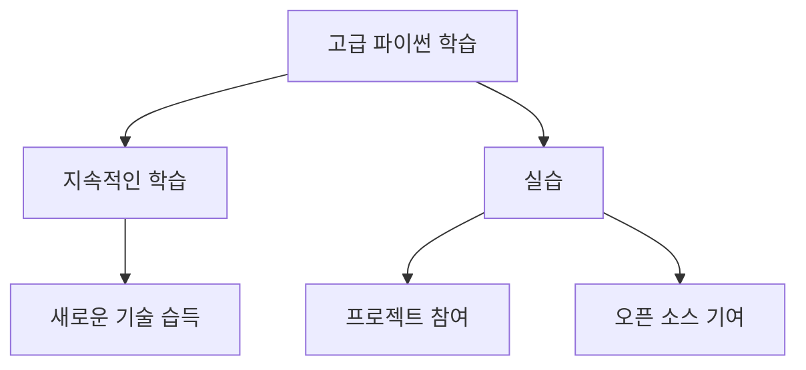
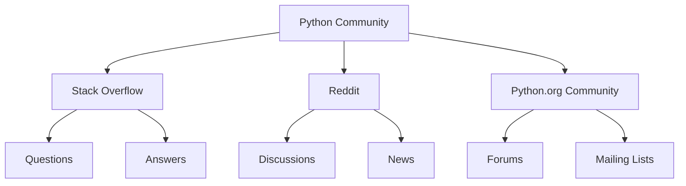

파이썬은 매우 다재다능한 프로그래밍 언어로, 다양한 기술 분야에서 사용되고 있다. 일부 분야에서는 기본적인 파이썬 지식만으로도 충분하지만, 데이터 과학, 인공지능, 로봇 공학과 같은 분야에서는 고급 파이썬 지식이 필수적이다. 이 고급 파이썬 주제 튜토리얼에서는 다양한 고급 파이썬 개념을 배우고, 추가 자료를 통해 파이썬 프로그래밍 언어를 마스터할 수 있도록 돕는다. 고급 파이썬을 배우기 위해서는 기본적인 파이썬을 학습한 후에 시작하는 것이 좋다. 고급 파이썬을 배우면 새로운 직업을 얻거나 승진할 수 있는 기회를 제공받을 수 있다. 이 튜토리얼에서는 고급 조건문, 정규 표현식, 객체 지향 프로그래밍(OOP), 이터러블, 이터레이터 및 제너레이터, 클로저 및 데코레이터, 메모리 관리, 테스트 등 다양한 주제를 다룬다. 이러한 개념을 모두 학습한 후에는 파이썬 기술이 중급에서 고급으로 도약할 것이며, IT 경력에서 큰 발전을 이룰 수 있다. 고급 파이썬을 통해 여러 분야에서 일할 수 있는 기회를 탐색하고, 이 튜토리얼을 통해 더 나은 작업을 수행할 수 있게 될 것이다.


||
|:---:|
||


<!--
##### Outline #####
-->

<!--
# 고급 파이썬 주제 튜토리얼 목차

## 1. 개요
   - 고급 파이썬의 필요성
   - 파이썬의 활용 분야
   - 튜토리얼의 목표 및 구성

## 2. 고급 파이썬 주제
   - 2.1. 고급 조건문 (Advanced Conditional Statements)
   - 2.2. 정규 표현식 (Regular Expressions)
   - 2.3. 객체 지향 프로그래밍 (OOP - Object-Oriented Programming)
   - 2.4. 이터러블, 이터레이터 및 제너레이터 (Iterables, Iterators, and Generators)
   - 2.5. 클로저와 데코레이터 (Closures and Decorators)
   - 2.6. 메모리 관리 (Memory Management)
   - 2.7. 테스트 (Testing)
   - 2.8. 동적 타이핑 (Dynamic Typing)
   - 2.9. 패킹 (Packing)
   - 2.10. 어설션 (Assertion)

## 3. 예제
   - 3.1. 고급 조건문 예제
   - 3.2. 정규 표현식 활용 예제
   - 3.3. OOP 예제
   - 3.4. 제너레이터와 이터레이터 예제
   - 3.5. 클로저와 데코레이터 예제
   - 3.6. 메모리 관리 예제
   - 3.7. 테스트 프레임워크 예제

## 4. FAQ
   - 4.1. 고급 파이썬 주제는 무엇인가요?
   - 4.2. 기본 파이썬과 고급 파이썬의 차이는 무엇인가요?
   - 4.3. 고급 파이썬을 배우기 위한 추천 도서는 무엇인가요?
   - 4.4. 파이썬 숙련도의 수준은 어떻게 나누나요?
   - 4.5. 고급 파이썬을 배우면 어떤 이점이 있나요?

## 5. 관련 기술
   - 5.1. 데이터 과학 (Data Science)
   - 5.2. 인공지능 (Artificial Intelligence)
   - 5.3. 머신러닝 (Machine Learning)
   - 5.4. 웹 개발 프레임워크 (Web Development Frameworks - Django, Flask)
   - 5.5. 데이터베이스 관리 (Database Management)

## 6. 결론
   - 고급 파이썬 학습의 중요성
   - 경력 발전을 위한 고급 파이썬의 활용
   - 지속적인 학습과 실습의 필요성

## 7. 추가 자료
   - 7.1. 추천 온라인 강좌
   - 7.2. 유용한 파이썬 라이브러리
   - 7.3. 커뮤니티 및 포럼

이 목차는 고급 파이썬 주제를 체계적으로 학습할 수 있도록 구성되어 있으며, 각 섹션은 관련된 내용을 포함하여 풍부한 정보를 제공합니다.
-->

<!--
## 1. 개요
   - 고급 파이썬의 필요성
   - 파이썬의 활용 분야
   - 튜토리얼의 목표 및 구성
-->

## 1. 개요

**고급 파이썬의 필요성**  
파이썬은 그 자체로도 강력한 프로그래밍 언어이지만, 고급 기능을 이해하고 활용하는 것은 개발자의 역량을 한층 더 높여준다. 고급 파이썬을 배우는 것은 복잡한 문제를 해결하고, 코드의 효율성을 극대화하며, 유지보수성을 향상시키는 데 필수적이다. 예를 들어, 고급 조건문이나 객체 지향 프로그래밍(OOP) 개념을 활용하면 코드의 가독성과 재사용성을 높일 수 있다.

**파이썬의 활용 분야**  
파이썬은 다양한 분야에서 활용되고 있으며, 그 중 일부는 다음과 같다:

- **데이터 과학 (Data Science)**: 데이터 분석 및 시각화에 널리 사용된다.
- **인공지능 (Artificial Intelligence)**: 머신러닝 및 딥러닝 모델 개발에 적합하다.
- **웹 개발 (Web Development)**: Django, Flask와 같은 프레임워크를 통해 웹 애플리케이션을 구축할 수 있다.
- **자동화 스크립트**: 반복적인 작업을 자동화하는 데 유용하다.

이처럼 파이썬은 다양한 분야에서 활용되며, 고급 기능을 익히는 것은 이러한 분야에서의 경쟁력을 높이는 데 기여한다.

**튜토리얼의 목표 및 구성**  
이 튜토리얼의 목표는 고급 파이썬 주제를 체계적으로 학습하고, 실제 예제를 통해 이해를 돕는 것이다. 각 섹션은 고급 주제를 다루며, 이론과 실습을 병행하여 학습할 수 있도록 구성되어 있다. 

다음은 튜토리얼의 구성 요소를 나타내는 다이어그램이다:



이 다이어그램은 고급 파이썬 주제의 다양한 구성 요소를 시각적으로 나타내며, 각 주제가 어떻게 연결되어 있는지를 보여준다. 이 튜토리얼을 통해 독자는 고급 파이썬의 다양한 기능을 이해하고, 실제 프로젝트에 적용할 수 있는 능력을 기를 수 있을 것이다.

<!--
## 2. 고급 파이썬 주제
   - 2.1. 고급 조건문 (Advanced Conditional Statements)
   - 2.2. 정규 표현식 (Regular Expressions)
   - 2.3. 객체 지향 프로그래밍 (OOP - Object-Oriented Programming)
   - 2.4. 이터러블, 이터레이터 및 제너레이터 (Iterables, Iterators, and Generators)
   - 2.5. 클로저와 데코레이터 (Closures and Decorators)
   - 2.6. 메모리 관리 (Memory Management)
   - 2.7. 테스트 (Testing)
   - 2.8. 동적 타이핑 (Dynamic Typing)
   - 2.9. 패킹 (Packing)
   - 2.10. 어설션 (Assertion)
-->

## 2. 고급 파이썬 주제

**2.1. 고급 조건문 (Advanced Conditional Statements)**  
고급 조건문은 파이썬에서 조건을 평가하는 다양한 방법을 제공한다. 기본적인 if-else 문 외에도, 여러 조건을 조합하여 복잡한 논리를 구현할 수 있다. 예를 들어, `elif`를 사용하여 여러 조건을 순차적으로 평가할 수 있다. 또한, 조건 표현식을 사용하여 한 줄로 간결하게 조건을 작성할 수 있다.

```python
# 예제: 고급 조건문
age = 20
status = "adult" if age >= 18 else "minor"
print(status)  # 출력: adult
```

**2.2. 정규 표현식 (Regular Expressions)**  
정규 표현식은 문자열에서 특정 패턴을 찾거나 대체하는 데 유용한 도구이다. 파이썬에서는 `re` 모듈을 사용하여 정규 표현식을 다룰 수 있다. 정규 표현식을 사용하면 복잡한 문자열 검색 및 조작을 간단하게 수행할 수 있다.

```python
import re

# 예제: 정규 표현식
text = "The rain in Spain"
pattern = r"\bain\b"
matches = re.findall(pattern, text)
print(matches)  # 출력: ['ain']
```

**2.3. 객체 지향 프로그래밍 (OOP - Object-Oriented Programming)**  
객체 지향 프로그래밍은 코드의 재사용성과 유지보수성을 높이는 데 중요한 개념이다. 파이썬에서는 클래스와 객체를 사용하여 OOP를 구현할 수 있다. 클래스는 객체의 속성과 메서드를 정의하며, 객체는 클래스의 인스턴스이다.

```python
# 예제: 객체 지향 프로그래밍
class Dog:
    def __init__(self, name):
        self.name = name

    def bark(self):
        return f"{self.name} says woof!"

dog = Dog("Buddy")
print(dog.bark())  # 출력: Buddy says woof!
```

**2.4. 이터러블, 이터레이터 및 제너레이터 (Iterables, Iterators, and Generators)**  
이터러블은 반복 가능한 객체를 의미하며, 이터레이터는 이터러블을 순회할 수 있는 객체이다. 제너레이터는 이터레이터를 생성하는 간편한 방법으로, `yield` 키워드를 사용하여 값을 반환한다. 제너레이터는 메모리 효율성이 뛰어나며, 큰 데이터 집합을 처리할 때 유용하다.

```python
# 예제: 제너레이터
def count_up_to(n):
    count = 1
    while count <= n:
        yield count
        count += 1

for number in count_up_to(5):
    print(number)  # 출력: 1 2 3 4 5
```

**2.5. 클로저와 데코레이터 (Closures and Decorators)**  
클로저는 함수가 정의된 환경을 기억하는 함수이다. 데코레이터는 함수를 수정하거나 확장하는 데 사용되는 고차 함수이다. 데코레이터를 사용하면 코드의 재사용성을 높이고, 기능을 추가할 수 있다.

```python
# 예제: 데코레이터
def decorator_function(original_function):
    def wrapper_function():
        print("Wrapper executed before {}".format(original_function.__name__))
        return original_function()
    return wrapper_function

@decorator_function
def display():
    return "Display function executed"

print(display())  # 출력: Wrapper executed before display
                  #         Display function executed
```

**2.6. 메모리 관리 (Memory Management)**  
파이썬은 자동 메모리 관리를 제공하지만, 메모리 누수를 방지하기 위해 개발자는 메모리 사용을 최적화해야 한다. `gc` 모듈을 사용하여 가비지 컬렉션을 수동으로 수행할 수 있으며, 객체의 참조 카운트를 관리하여 메모리 사용을 최적화할 수 있다.

```python
import gc

# 예제: 가비지 컬렉션
gc.collect()  # 가비지 컬렉션을 수동으로 수행
```

**2.7. 테스트 (Testing)**  
테스트는 소프트웨어 개발에서 중요한 단계이다. 파이썬에서는 `unittest` 모듈을 사용하여 단위 테스트를 작성할 수 있다. 테스트를 통해 코드의 품질을 보장하고, 버그를 조기에 발견할 수 있다.

```python
import unittest

# 예제: 단위 테스트
def add(a, b):
    return a + b

class TestMathOperations(unittest.TestCase):
    def test_add(self):
        self.assertEqual(add(1, 2), 3)

if __name__ == '__main__':
    unittest.main()
```

**2.8. 동적 타이핑 (Dynamic Typing)**  
파이썬은 동적 타이핑 언어로, 변수의 타입을 명시적으로 선언할 필요가 없다. 이는 코드의 유연성을 높이지만, 타입 관련 오류를 런타임에 발견할 수 있다. 타입 힌트를 사용하여 코드의 가독성을 높이고, 정적 분석 도구를 통해 타입 검사를 수행할 수 있다.

```python
# 예제: 타입 힌트
def greet(name: str) -> str:
    return f"Hello, {name}"

print(greet("Alice"))  # 출력: Hello, Alice
```

**2.9. 패킹 (Packing)**  
패킹은 여러 개의 값을 하나의 변수에 저장하는 방법이다. 파이썬에서는 튜플을 사용하여 패킹을 수행할 수 있으며, 언패킹을 통해 여러 변수에 값을 분리할 수 있다.

```python
# 예제: 패킹과 언패킹
coordinates = (10, 20)
x, y = coordinates
print(x, y)  # 출력: 10 20
```

**2.10. 어설션 (Assertion)**  
어설션은 코드의 특정 조건이 참인지 확인하는 데 사용된다. 주로 디버깅 과정에서 유용하며, 조건이 거짓일 경우 AssertionError를 발생시킨다. 이를 통해 코드의 신뢰성을 높일 수 있다.

```python
# 예제: 어설션
def divide(a, b):
    assert b != 0, "The divisor cannot be zero."
    return a / b

print(divide(10, 2))  # 출력: 5.0
# print(divide(10, 0))  # AssertionError 발생
```

이와 같은 고급 파이썬 주제들은 개발자가 더 나은 코드를 작성하고, 복잡한 문제를 해결하는 데 도움을 준다. 각 주제를 깊이 있게 이해하고 활용하는 것이 중요하다.

<!--
## 3. 예제
   - 3.1. 고급 조건문 예제
   - 3.2. 정규 표현식 활용 예제
   - 3.3. OOP 예제
   - 3.4. 제너레이터와 이터레이터 예제
   - 3.5. 클로저와 데코레이터 예제
   - 3.6. 메모리 관리 예제
   - 3.7. 테스트 프레임워크 예제
-->

## 3. 예제

**3.1. 고급 조건문 예제**  
고급 조건문은 복잡한 조건을 처리할 수 있는 강력한 도구이다. 예를 들어, 여러 조건을 조합하여 특정 상황에 맞는 로직을 구현할 수 있다. 아래는 `if`, `elif`, `else`를 활용한 예제이다.

```python
age = 25

if age < 18:
    print("미성년자입니다.")
elif age < 65:
    print("성인입니다.")
else:
    print("노인입니다.")
```

**3.2. 정규 표현식 활용 예제**  
정규 표현식은 문자열에서 특정 패턴을 찾거나 대체하는 데 유용하다. 아래는 이메일 주소의 유효성을 검사하는 예제이다.

```python
import re

email = "example@example.com"
pattern = r'^[a-zA-Z0-9._%+-]+@[a-zA-Z0-9.-]+\.[a-zA-Z]{2,}$'

if re.match(pattern, email):
    print("유효한 이메일 주소입니다.")
else:
    print("유효하지 않은 이메일 주소입니다.")
```

**3.3. OOP 예제**  
객체 지향 프로그래밍(OOP)은 코드의 재사용성과 유지보수성을 높이는 데 기여한다. 아래는 간단한 클래스와 객체를 정의하는 예제이다.

```python
class Dog:
    def __init__(self, name):
        self.name = name

    def bark(self):
        return f"{self.name}가 짖습니다."

my_dog = Dog("바둑이")
print(my_dog.bark())
```

**3.4. 제너레이터와 이터레이터 예제**  
제너레이터는 메모리를 효율적으로 사용할 수 있게 해주는 도구이다. 아래는 제너레이터를 사용하여 피보나치 수열을 생성하는 예제이다.

```python
def fibonacci(n):
    a, b = 0, 1
    for _ in range(n):
        yield a
        a, b = b, a + b

for num in fibonacci(10):
    print(num)
```

**3.5. 클로저와 데코레이터 예제**  
클로저는 함수가 정의된 환경을 기억하는 함수이다. 데코레이터는 함수를 수정하는 데 사용된다. 아래는 간단한 데코레이터 예제이다.

```python
def decorator_function(original_function):
    def wrapper_function():
        print("함수 실행 전")
        original_function()
        print("함수 실행 후")
    return wrapper_function

@decorator_function
def display():
    print("Hello, World!")

display()
```

**3.6. 메모리 관리 예제**  
파이썬은 자동 메모리 관리를 제공하지만, 메모리 누수를 방지하기 위해 주의해야 한다. 아래는 `gc` 모듈을 사용하여 가비지 컬렉션을 수동으로 실행하는 예제이다.

```python
import gc

class MyClass:
    def __init__(self):
        print("객체 생성")

obj = MyClass()
del obj  # 객체를 삭제하여 메모리 해제
gc.collect()  # 가비지 컬렉션 실행
```

**3.7. 테스트 프레임워크 예제**  
테스트는 코드의 품질을 보장하는 중요한 과정이다. 아래는 `unittest` 모듈을 사용한 간단한 테스트 예제이다.

```python
import unittest

def add(a, b):
    return a + b

class TestMathOperations(unittest.TestCase):
    def test_add(self):
        self.assertEqual(add(1, 2), 3)

if __name__ == '__main__':
    unittest.main()
```

이와 같은 예제들은 고급 파이썬의 다양한 기능을 이해하고 활용하는 데 도움을 줄 것이다. 각 예제는 실제로 사용되는 코드로, 학습자가 직접 실행해보며 실습할 수 있도록 구성되어 있다.

<!--
## 4. FAQ
   - 4.1. 고급 파이썬 주제는 무엇인가요?
   - 4.2. 기본 파이썬과 고급 파이썬의 차이는 무엇인가요?
   - 4.3. 고급 파이썬을 배우기 위한 추천 도서는 무엇인가요?
   - 4.4. 파이썬 숙련도의 수준은 어떻게 나누나요?
   - 4.5. 고급 파이썬을 배우면 어떤 이점이 있나요?
-->

## 4. FAQ

**4.1. 고급 파이썬 주제는 무엇인가요?**  
고급 파이썬 주제는 파이썬 프로그래밍 언어의 기본 개념을 넘어서는 다양한 고급 기능과 기법을 포함한다. 이러한 주제는 객체 지향 프로그래밍, 정규 표현식, 클로저와 데코레이터, 이터러블 및 제너레이터 등으로 구성되어 있으며, 개발자가 더 효율적이고 유연한 코드를 작성할 수 있도록 돕는다.

**4.2. 기본 파이썬과 고급 파이썬의 차이는 무엇인가요?**  
기본 파이썬은 변수, 데이터 타입, 조건문, 반복문 등 기초적인 프로그래밍 개념을 다룬다. 반면, 고급 파이썬은 이러한 기초 개념을 바탕으로 더 복잡한 구조와 패턴을 다루며, 코드의 재사용성과 유지보수성을 높이는 데 중점을 둔다. 예를 들어, 고급 파이썬에서는 객체 지향 프로그래밍을 통해 코드의 모듈화와 캡슐화를 실현할 수 있다.

**4.3. 고급 파이썬을 배우기 위한 추천 도서는 무엇인가요?**  
고급 파이썬을 배우기 위해 추천하는 도서는 다음과 같다:
- "Fluent Python" by Luciano Ramalho: 파이썬의 고급 기능을 깊이 있게 다룬다.
- "Effective Python" by Brett Slatkin: 파이썬에서의 모범 사례를 제시한다.
- "Python Cookbook" by David Beazley and Brian K. Jones: 다양한 문제 해결을 위한 레시피를 제공한다.

**4.4. 파이썬 숙련도의 수준은 어떻게 나누나요?**  
파이썬 숙련도는 일반적으로 다음과 같이 나눌 수 있다:
1. 초급 (Beginner): 기본 문법과 데이터 구조를 이해하고 간단한 프로그램을 작성할 수 있는 수준.
2. 중급 (Intermediate): 객체 지향 프로그래밍, 모듈화, 예외 처리 등을 이해하고 활용할 수 있는 수준.
3. 고급 (Advanced): 고급 라이브러리와 프레임워크를 사용하여 복잡한 시스템을 설계하고 구현할 수 있는 수준.

**4.5. 고급 파이썬을 배우면 어떤 이점이 있나요?**  
고급 파이썬을 배우면 다음과 같은 이점이 있다:
- 코드의 재사용성과 유지보수성을 높일 수 있다.
- 복잡한 문제를 효율적으로 해결할 수 있는 능력을 기를 수 있다.
- 다양한 라이브러리와 프레임워크를 활용하여 생산성을 높일 수 있다.
- 소프트웨어 개발 분야에서의 경쟁력을 강화할 수 있다.



위의 다이어그램은 파이썬 숙련도를 시각적으로 나타내며, 각 수준에서의 주요 특징을 보여준다. 고급 파이썬을 배우는 것은 개발자로서의 성장에 큰 도움이 된다.

<!--
## 5. 관련 기술
   - 5.1. 데이터 과학 (Data Science)
   - 5.2. 인공지능 (Artificial Intelligence)
   - 5.3. 머신러닝 (Machine Learning)
   - 5.4. 웹 개발 프레임워크 (Web Development Frameworks - Django, Flask)
   - 5.5. 데이터베이스 관리 (Database Management)
-->

## 5. 관련 기술

고급 파이썬을 배우는 과정에서 다양한 관련 기술을 이해하는 것은 매우 중요하다. 이 섹션에서는 데이터 과학, 인공지능, 머신러닝, 웹 개발 프레임워크, 데이터베이스 관리에 대해 살펴보겠다.

**5.1. 데이터 과학 (Data Science)**  
데이터 과학은 데이터를 수집, 분석, 해석하여 유의미한 정보를 도출하는 분야이다. 파이썬은 데이터 과학에서 가장 많이 사용되는 언어 중 하나로, Pandas, NumPy, Matplotlib과 같은 라이브러리를 통해 데이터 처리 및 시각화를 쉽게 할 수 있다. 

샘플 코드:
```python
import pandas as pd
import matplotlib.pyplot as plt

# 데이터프레임 생성
data = {'Year': [2018, 2019, 2020, 2021],
        'Sales': [200, 300, 400, 500]}
df = pd.DataFrame(data)

# 데이터 시각화
plt.plot(df['Year'], df['Sales'])
plt.title('Sales Over Years')
plt.xlabel('Year')
plt.ylabel('Sales')
plt.show()
```

**5.2. 인공지능 (Artificial Intelligence)**  
인공지능은 기계가 인간의 지능을 모방하여 문제를 해결하는 기술이다. 파이썬은 TensorFlow, Keras, PyTorch와 같은 강력한 라이브러리를 제공하여 인공지능 모델을 쉽게 구축하고 훈련할 수 있도록 돕는다.

**5.3. 머신러닝 (Machine Learning)**  
머신러닝은 인공지능의 한 분야로, 데이터에서 패턴을 학습하여 예측을 수행하는 기술이다. Scikit-learn은 파이썬에서 머신러닝을 구현하는 데 널리 사용되는 라이브러리이다. 

샘플 코드:
```python
from sklearn.model_selection import train_test_split
from sklearn.linear_model import LinearRegression
import numpy as np

# 데이터 생성
X = np.array([[1], [2], [3], [4], [5]])
y = np.array([1, 2, 3, 4, 5])

# 데이터 분할
X_train, X_test, y_train, y_test = train_test_split(X, y, test_size=0.2)

# 모델 훈련
model = LinearRegression()
model.fit(X_train, y_train)

# 예측
predictions = model.predict(X_test)
print(predictions)
```

**5.4. 웹 개발 프레임워크 (Web Development Frameworks - Django, Flask)**  
웹 개발 프레임워크는 웹 애플리케이션을 구축하는 데 필요한 도구와 라이브러리를 제공한다. Django는 강력한 기능을 갖춘 프레임워크이며, Flask는 경량화된 프레임워크로 빠른 개발이 가능하다. 두 프레임워크 모두 RESTful API를 쉽게 구축할 수 있도록 지원한다.

**5.5. 데이터베이스 관리 (Database Management)**  
데이터베이스 관리는 데이터를 저장하고 관리하는 기술이다. 파이썬은 SQLAlchemy와 같은 ORM(Object-Relational Mapping) 라이브러리를 통해 데이터베이스와의 상호작용을 쉽게 할 수 있다. 

다이어그램(mermaid):


이와 같이 고급 파이썬을 활용하여 다양한 관련 기술을 이해하고 적용하는 것은 개발자로서의 역량을 높이는 데 큰 도움이 된다.

<!--
## 6. 결론
   - 고급 파이썬 학습의 중요성
   - 경력 발전을 위한 고급 파이썬의 활용
   - 지속적인 학습과 실습의 필요성
-->

## 6. 결론

**고급 파이썬 학습의 중요성**  
고급 파이썬을 학습하는 것은 단순히 언어의 문법을 익히는 것을 넘어, 복잡한 문제를 해결하고 효율적인 코드를 작성하는 데 필수적이다. 고급 개념을 이해함으로써 개발자는 코드의 가독성과 유지보수성을 높일 수 있으며, 이는 팀워크와 프로젝트의 성공에 기여한다. 또한, 고급 파이썬 기술은 데이터 과학, 인공지능, 웹 개발 등 다양한 분야에서의 경쟁력을 강화하는 데 중요한 역할을 한다.

**경력 발전을 위한 고급 파이썬의 활용**  
고급 파이썬 기술은 경력 발전에 있어 큰 자산이 된다. 많은 기업들이 파이썬을 사용하여 데이터 분석, 웹 애플리케이션 개발, 자동화 스크립트 작성 등을 수행하고 있다. 따라서, 고급 파이썬 기술을 보유한 개발자는 더 많은 기회를 얻을 수 있으며, 높은 연봉과 직무 만족도를 누릴 가능성이 높다. 예를 들어, 객체 지향 프로그래밍(OOP)이나 정규 표현식(Regular Expressions)과 같은 고급 개념을 활용하여 복잡한 시스템을 설계하고 구현할 수 있다.

```python
# OOP 예제: 간단한 클래스 정의
class Animal:
    def __init__(self, name):
        self.name = name

    def speak(self):
        return f"{self.name} says hello!"

# 객체 생성 및 메서드 호출
dog = Animal("Dog")
print(dog.speak())  # 출력: Dog says hello!
```

**지속적인 학습과 실습의 필요성**  
기술은 끊임없이 발전하고 있으며, 파이썬 또한 예외는 아니다. 따라서, 고급 파이썬을 학습한 후에도 지속적인 학습과 실습이 필요하다. 새로운 라이브러리나 프레임워크가 등장함에 따라, 이를 활용할 수 있는 능력을 기르는 것이 중요하다. 또한, 실제 프로젝트에 참여하거나 오픈 소스 기여를 통해 실력을 쌓는 것이 좋다. 



결론적으로, 고급 파이썬 학습은 개발자로서의 성장과 경력 발전에 있어 매우 중요하며, 지속적인 학습과 실습을 통해 더욱 전문성을 높일 수 있다.

<!--
## 7. 추가 자료
   - 7.1. 추천 온라인 강좌
   - 7.2. 유용한 파이썬 라이브러리
   - 7.3. 커뮤니티 및 포럼
-->

## 7. 추가 자료

**7.1. 추천 온라인 강좌**  
고급 파이썬을 배우기 위한 온라인 강좌는 다양하게 존재한다. 다음은 추천할 만한 강좌들이다.

1. **Coursera - Python for Everybody Specialization**  
   이 강좌는 파이썬의 기초부터 시작하여 데이터 구조, 웹 스크래핑, 데이터베이스와 같은 고급 주제까지 다룬다. 실습 중심의 강의로, 실제 프로젝트를 통해 학습할 수 있다.

2. **edX - Introduction to Computer Science and Programming Using Python**  
   MIT에서 제공하는 이 강좌는 컴퓨터 과학의 기초와 함께 파이썬을 활용한 문제 해결 능력을 기를 수 있도록 구성되어 있다.

3. **Udacity - Data Structures and Algorithms Nanodegree**  
   이 과정은 파이썬을 사용하여 데이터 구조와 알고리즘을 깊이 있게 학습할 수 있는 기회를 제공한다. 실무에서의 적용 사례를 통해 이해도를 높일 수 있다.

**7.2. 유용한 파이썬 라이브러리**  
고급 파이썬을 활용하기 위해 알아두면 유용한 라이브러리들은 다음과 같다.

- **NumPy**: 수치 계산을 위한 라이브러리로, 다차원 배열 객체와 다양한 수학 함수들을 제공한다.
- **Pandas**: 데이터 분석을 위한 라이브러리로, 데이터 프레임을 사용하여 데이터를 쉽게 조작하고 분석할 수 있다.
- **Requests**: HTTP 요청을 간편하게 처리할 수 있는 라이브러리로, 웹 API와의 상호작용에 유용하다.
- **Flask**: 경량 웹 프레임워크로, 간단한 웹 애플리케이션을 빠르게 개발할 수 있도록 돕는다.

**샘플 코드 (Pandas 사용 예시)**  
다음은 Pandas를 사용하여 CSV 파일을 읽고 데이터 분석을 수행하는 간단한 예시이다.

```python
import pandas as pd

# CSV 파일 읽기
data = pd.read_csv('data.csv')

# 데이터의 첫 5행 출력
print(data.head())

# 특정 열의 평균 계산
average_value = data['column_name'].mean()
print(f'Average Value: {average_value}')
```

**7.3. 커뮤니티 및 포럼**  
고급 파이썬을 배우고 실습하는 데 도움이 되는 커뮤니티와 포럼은 다음과 같다.

- **Stack Overflow**: 프로그래밍 관련 질문과 답변을 주고받는 커뮤니티로, 파이썬 관련 질문도 활발히 논의된다.
- **Reddit - r/Python**: 파이썬에 대한 다양한 주제를 다루는 서브레딧으로, 최신 정보와 팁을 공유할 수 있다.
- **Python.org Community**: 공식 파이썬 웹사이트에서 제공하는 커뮤니티로, 다양한 포럼과 메일링 리스트가 있다.

**다이어그램 (Mermaid)**  
다음은 파이썬 커뮤니티의 구조를 나타내는 다이어그램이다.



이와 같은 자료들은 고급 파이썬을 학습하는 데 큰 도움이 될 것이다. 지속적인 학습과 실습을 통해 더욱 깊이 있는 지식을 쌓아 나가길 바란다.

<!--
##### Reference #####
-->

## Reference


* [https://www.geeksforgeeks.org/advanced-python-tutorials/](https://www.geeksforgeeks.org/advanced-python-tutorials/)
* [https://python-course.eu/advanced-python/](https://python-course.eu/advanced-python/)
* [https://medium.com/@alexroz/5-python-features-to-make-your-code-more-advanced-533f1153c688](https://medium.com/@alexroz/5-python-features-to-make-your-code-more-advanced-533f1153c688)


<!--
#  Advanced Python Topics Tutorial

Last Updated :  25 Jul, 2024

Python language is a very versatile language and it is used in many technical
fields. Some fields require only basic knowledge of Python but some fields
require you to know advanced Python such as Data Science, Artificial
Intelligence and Robotics. In this Advanced Python Topics Tutorial, you will
learn about various advanced Python concepts with additional resources, so
that you can master yourself in Python programming language.

****Pre-requisites:** ** Before starting Advanced Python, one should have
studied basic  [ Python  ](https://www.geeksforgeeks.org/python-programming-
language/) .


##  Why Study Advanced Python?

Python is a very popular language among developers and is used in a variety of
applications. Learning advanced Python can help you get a new job, or get a
promotion.

If you have studied basic Python, there is no harm in learning advanced Python
as it will only help you in your career. We have all major advanced Python
concepts, the list is designed in a systematic order so that you can easily
learn these concepts in a flow.

In this Advanced Python Topics tutorial, you will learn the following things:

##  Advanced Python Topics Tutorial For Beginners

In this Advanced Python Topics Tutorial we have currated advanced Python
topics and sub-topics for you which will help you to master advanced Python
with ease.

Start your journey from Intermediate to Advanced Python using these resources!

##  Advanced Conditional Statements

##  Regular Expressions

##  OOPS

##  ITERABLES, ITERATORS and Generators

##  CLOSURES and DECORATORS

##  Memory Management

##  Testing

##  Conclusion

After learning all these concepts, your skills in Python will jump from
intermediate to advanced. Learning advanced Python will result in a big
advancement in your IT career. Advanced Python enables you to work in multiple
fields, you can explore more opportunities and enhance your work after this
Advanced Python Topics tutorial.

##  Advanced Python Topics Tutorial – FAQs

###  What are some advanced Python topics?

> Some Advanced Python Topics include:
>
>   * OOPs
>   * Testing
>   * Memory Management
>   * Closures and Decorators
>   * Regular Expressions
>   * Advanced Conditional Statements
>

###  What is difference between basic Python and advanced Python?

> ****Basic Python :** ** It includes basic foundational concepts of Python
> like syntax, keywords, data types etc. You might also see some basic Python
> functions, libraries, data structures like lists or tuples etc.
>
> ****Advanced Python :** ** It includes more complex topics of Python like
> advanced data structures, decorators, advanced libraries like numpy,
> advanced frameworks like Django etc.

###  What are some books to learn advanced Python?

>   * Python Cookbook by David Beazley and Brian K. Jones
>   * Fluent Python by Luciano Ramalho
>   * Learning Python by Mark Lutz
>   * Effective Python: 90 Specific Ways to Write Better Python by Brett
> Slatkin
>   * Programming Python by Mark Lutz
>

###  What are levels of Python Proficiency?

> There are 3 levels of Python Proficiency:
>
>   * ****Beginner:** ** Python syntax, tuples, list, basic libraries,
> functions, basic file operations,Writing basic scripts etc.
>   * ****Intermediate :** ** Object-oriented programming, data structures and
> algorithms, database interaction, basic web development, etc.
>   * ****Advanced :** ** decorators, advanced libraries and frameworks,
> concurrency and parallelism, advanced database management, etc
>

###  Please _ Login  _ to comment...


-->

<!--


-->

<!--
#  Intro to Advanced Python

By **Bernd Klein** . Last modified: 16 Aug 2021.

This section of our tutorial has Python topics that are too difficult for
beginners. This is also reflected in our image. The trail requires experience
and beginners with insufficient experience could easily get dizzy. Those who
have successfully completed our beginner's tutorial or who have acquired
sufficient Python experience elsewhere should not have any problems. As
everywhere in our tutorial, we introduce the topics as gently as possible.
This part of our Python tutorial is aimed at advanced programmers.

Most people will probably ask themselves immediately whether they are at the
right place here. As in various other areas of life and science, it is not
easy to find and describe the dividing line between beginners and advanced
learners in Python. On the other hand, it is also difficult to decide what the
appropriate topics are for this part of the tutorial. Some topics are
considered by some as particularly difficult, while others rate them as easy.
Like the hiking trail in the picture on the right. For people with mountain
experience it is a walk, while people without experience or with a strong
feeling of dizziness are already dreadful at the sight of the picture.

When asked what advanced topics are, i.e. Python topics that are too difficult
for beginners, I was guided by my experiences from numerous Python trainings.

Those who have successfully completed our beginner's tutorial or have had
sufficient Python experience elsewhere should have no problems. As everywhere
in our tutorial, we introduce the topics as gently as possible.

Live Python training

Upcoming online Courses

[ Enrol here ](https://www.bodenseo.com/course_enrolment.php)

##  In this chapter


-->

<!--


-->

<!--
#  5 Python Features to Make Your Code More Advanced

##  Enhance your Pythonüêç skills

Photo by [ Kevin Ku
](https://unsplash.com/@ikukevk?utm_source=medium&utm_medium=referral) on [
Unsplash ](https://unsplash.com/?utm_source=medium&utm_medium=referral)

P  ython has been my main programming tool for the last 2 years, and I’m
sure it will stay the one for years, despite the fact that I have some basic
knowledge of C++, JS, MatLab and R. The reason for that is its user-
friendliness, intuitiveness and, of course, the quality and popularity of the
machine learning frameworks built in python. However, although the internet is
full of educational materials and tutorials to learn this language, I
comprehended some of its features by myself when feeling an urgent need to
optimize the code or to implement something new.

So in this article I want to show you 5 unique features of python, which I
wish I’d known when I was starting my journey. These features can be used by
anyone, even beginners, to make their code more professional, efficient and
good-looking.

#  1\. Lists

Of course we will start with lists, since these are one of the basic data
structures in python. You can initialize a list in two ways:

    
    
    l = list()  
    l = []

Often we need to fill a list iteratively. In the vanilla set up (like in many
other programming languages), you can use the ` for ` loop:

    
    
    for i in range(10):  
        l.append(i)

Or we can even created a nested loop:

    
    
    L = []  
    for i in range(10):  
        l = []  
        for j in range(5):  
            l.append(i)  
        L.append(l)

But this code looks clumsy. It took us 5 rows to implement quite simple
idea…

Let’s use the first python feature:

    
    
    l = [i for i in range(10)]  
    l = [[i for _ in range(5)] for i in range(10)]

As you can see it took only 2 rows for 2 loops. This is the true beauty of
python.

#  2\. Sets

Arguably, sets are one of the least known data structures. But they have one
unique feature, which I use extensively in my projects. Imagine you have a
list with duplicates. To my knowledge, by July 2024 in python there is no
built-in function to drop them. Instead of using dictionary’s keys or
something else to tackle this problem, just transform you list to a set and
then back to a list:

    
    
    l = [1,1,2,2,3,4,5,0]  
    l = list(set(l))

Super simple and efficient. Not only does it drop duplicates, but it also
sorts your list!

#  3\. Dynamic typing

If you’ve written at least one Python program, you must know that there is
no such thing as a variable type declaration. When you type ` a = 42.2 ` , you
don't specify ` float32 ` or ` float64 ` ; you just assign the value. It works
because Python is based on dynamic typing, meaning all the variable types are
defined during runtime. This is important when we start talking about memory!

There are mutable and immutable objects in python. The value of mutable
objects ( ` list ` , ` dict ` , ` set ` ) can be changed over time. For
instance:

    
    
    l = [1,2,3]  
    l[0] = 'a'

Whereas immutable objects ( ` None ` , ` bool ` , ` int ` , ` float ` , `
complex ` , ` str ` , ` tuple ` ) do not allow you to change their value.
Let’s create variable _a_ and check its ID in the memory. If we change its
value, then we’ll get a new ID:

It means that ` a ` in this case, can be considered as a pointer to an object
in the computer memory. In this example, 10 and 20 are stored as different
objects.

But why am I writing all of this? Because there is a pitfall that has caused
me severe pain several times, and I want you to be aware of it. Let’s do an
experiment by creating a list ` p ` and then assigning its value to a new
variable ` P ` :

Now let’s append the list ` P ` and print the results:

You can see now that we appended not only ` P ` , but also the first list ` p
` . Let’s check their ID as we did before:

They are identical. Both variables ` p ` and ` P ` point to the same object.
This python feature has caused me tons of confusion. So if you want to assign
the same value of list p to a new list, I recommend to use the _copy_
function.

In this case you won’t mess up your code!

P.s. If we try to do the same thing with integers, for instance, by adding 10
istead of appending, we will get a new object with a new ID:

#  4\. Assertion

Often in our code we use conditions before doing anything to check if we are
about to process the data we need. In such situations the code can become
clumsy as well:

    
    
    A = [1,0,0,16]  
    B = [23,32,2,4]  
    for a,b in zip(A,B):  
        if a==b**2:  
            print(a,b, 'Error!')

To avoid that you can use the assert keyword. It allows you to put a logical
sentence and an error string in one line of code, making it much more
appealing!

As you can see, when the assertion is failed, python shows an assertion error
with a custom message which you can compose yourself.

#  **5\. Packing**

When I was starting, those stars ( **_*_ ** and ****** ) before arguments were
really confusing. But it turned out that they might help you a lot when your
function has a lot of variables to pass.

Let’s write a function with 2 values to pass and 3 default values. This
function will perform simple math calculations:

    
    
    def F(a, b, c=3, d=1, k=1):  
        return (a*b*c/d)**k

At some point, we might want to pass only ` a ` and ` b ` :

But imagine that you want to also pass ` a ` __ and ` d ` , but you don’t
know the names of these variables (they are simply hidden from you). Then you
can use positional arguments (often ` args ` ):

In the case of args, the order always matters! If you change it, the results
will be different (since ` args ` is a list):

Now imagine a different situation. You know the names of the variables, but
you have no clue about their order. Then keyword arguments (or often ` kwargs
` ) will help you:

Since _kwargs_ is a dictionary you can use any order you want, the results
will stay the same.

===========================================

That’s it! I hope that the article has a little bit extended your
understanding of python and from now on you’ll be using these features
extensively and consciously.

Would you like to see more python features in the next article?:)

===========================================

**_All my publications on Medium are free and open-access, that’s why I’d
really appreciate if you followed me here!_ **

P.s. I’m extremely passionate about (Geo)Data Science, ML/AI and Climate
Change. So if you want to work together on some project pls contact me in [
LinkedIn ](https://www.linkedin.com/in/alexxxroz/) .

🛰️Follow for more🛰️


-->

<!--


-->

