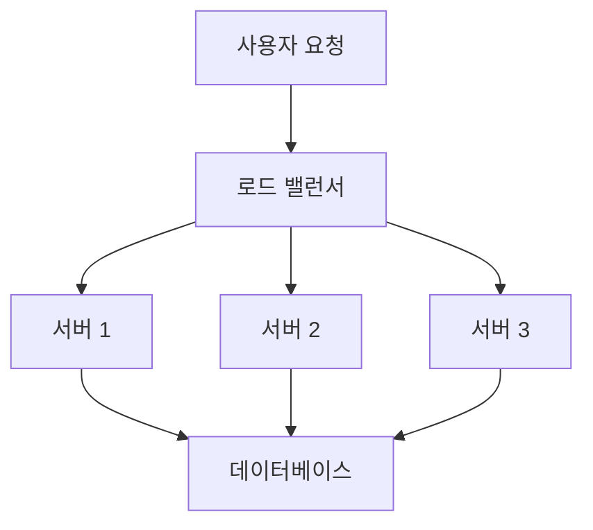
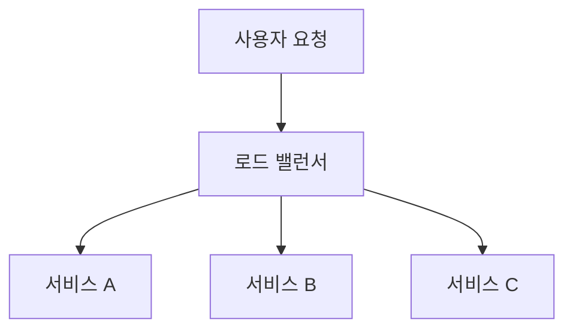
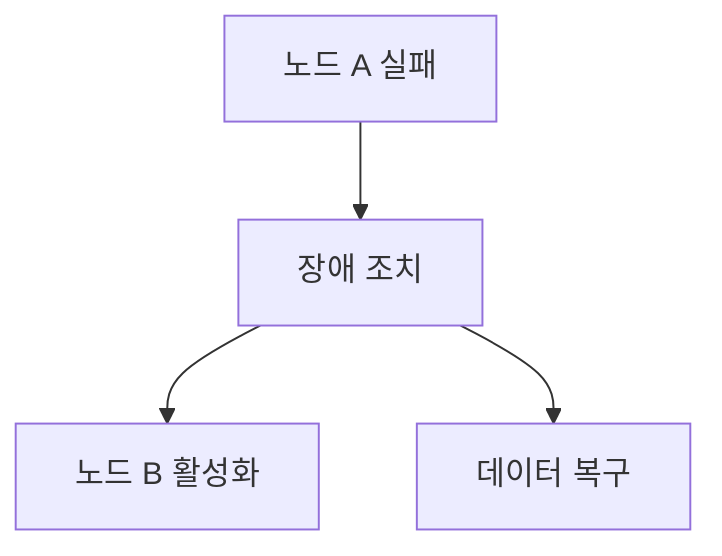
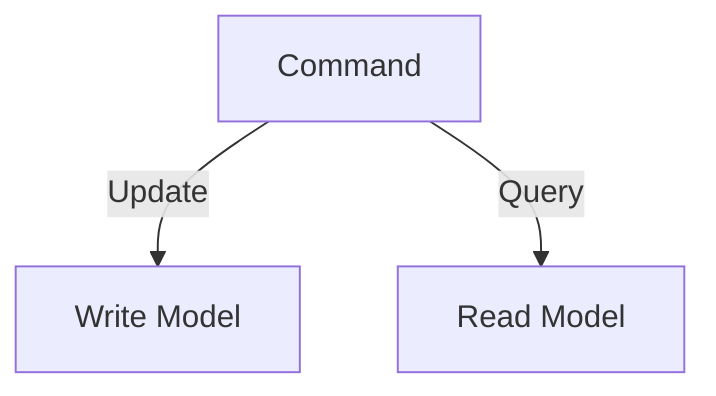
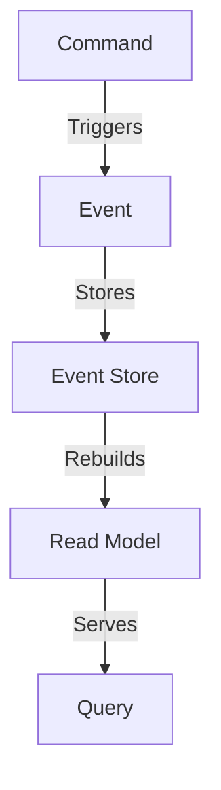
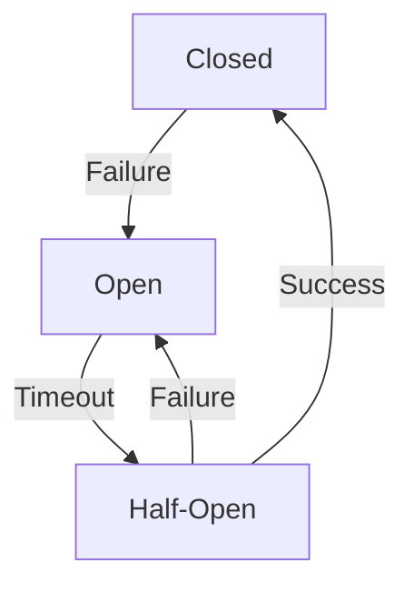
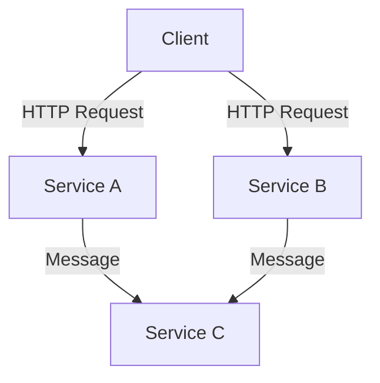
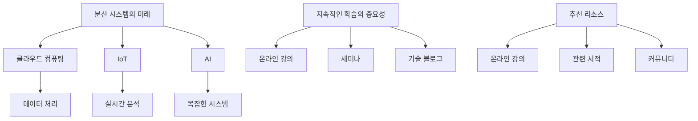
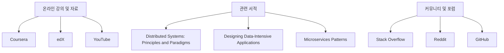

분산 시스템은 여러 컴퓨터나 장치에 걸쳐 다양한 구성 요소가 분산되어 있는 컴퓨팅 환경을 의미한다. 이러한 시스템은 데이터 저장, 메시징, 시스템 관리 및 컴퓨팅 기능을 처리하는 핵심 소프트웨어를 포함하고 있으며, 여러 복사본의 데이터를 동기화해야 하는 도전 과제를 안고 있다. 그러나 처리 노드가 신뢰할 수 없고 네트워크 지연이 발생할 수 있기 때문에 일관성을 유지하는 것이 어렵다. 이러한 문제를 해결하기 위해 다양한 패턴이 개발되었으며, 이들은 공통적인 문제를 해결하기 위해 유사한 솔루션을 제공한다. 2020년부터 이러한 패턴을 수집하여 이 사이트에 게시하였고, 2023년에는 "Patterns of Distributed Systems"라는 책으로 출판되었다. 이 책에서는 각 패턴에 대한 간략한 요약과 함께 관련 장으로의 깊은 링크를 제공하고 있다. 분산 시스템의 설계 및 구현에 있어 이러한 패턴을 이해하고 활용하는 것은 시스템의 효율성과 안정성을 높이는 데 큰 도움이 된다.


||
|:---:|
||


<!--
##### Outline #####
-->

<!--
# 목차

## 1. 개요
   - 분산 시스템의 정의
   - 분산 시스템의 중요성
   - 분산 시스템의 일반적인 사용 사례

## 2. 분산 시스템의 일반적인 도전 과제
   - 이질성 (Heterogeneity)
   - 확장성 (Scalability)
   - 투명성 (Transparency)
   - 동시성 (Concurrency)
   - 보안 (Security)
   - 실패 처리 (Failure Handling)

## 3. 분산 시스템 패턴
   - 3.1. Command and Query Responsibility Segregation (CQRS) 패턴
   - 3.2. Two-Phase Commit (2PC) 패턴
   - 3.3. Saga 패턴
   - 3.4. Replicated Load-Balanced Services (RLBS) 패턴
   - 3.5. Sharded Services 패턴
   - 3.6. Sidecar 패턴
   - 3.7. Write-Ahead Log (WAL) 기법
   - 3.8. Split-Brain 패턴
   - 3.9. Hinted Handoff 패턴
   - 3.10. Read Repair 패턴
   - 3.11. Service Registry 패턴
   - 3.12. Circuit Breaker 패턴
   - 3.13. Leader Election 패턴
   - 3.14. Bulkhead 패턴
   - 3.15. Retry 패턴
   - 3.16. Scatter Gather 패턴
   - 3.17. Bloom Filters 데이터 구조

## 4. 예제
   - 각 패턴의 실제 구현 예제
   - 분산 시스템에서의 패턴 조합 사례

## 5. FAQ
   - 분산 시스템이란 무엇인가요?
   - 분산 시스템의 장점은 무엇인가요?
   - CQRS 패턴은 언제 사용해야 하나요?
   - Circuit Breaker 패턴의 작동 원리는 무엇인가요?
   - Leader Election 패턴의 필요성은 무엇인가요?

## 6. 관련 기술
   - 마이크로서비스 아키텍처 (Microservices Architecture)
   - 클라우드 컴퓨팅 (Cloud Computing)
   - 데이터베이스 (Relational, NoSQL)
   - 메시징 시스템 (Messaging Systems)
   - 컨테이너화 기술 (Containerization)

## 7. 결론
   - 분산 시스템의 미래
   - 지속적인 학습의 중요성
   - 추천 리소스 및 자료

## 8. 추천 리소스
   - 온라인 강의 및 자료
   - 관련 서적
   - 커뮤니티 및 포럼

이 목차는 분산 시스템의 다양한 측면을 포괄적으로 다루며, 각 섹션은 독자가 분산 시스템의 패턴과 기술을 이해하는 데 도움이 될 것입니다.
-->

<!--
## 1. 개요
   - 분산 시스템의 정의
   - 분산 시스템의 중요성
   - 분산 시스템의 일반적인 사용 사례
-->

## 1. 개요

**분산 시스템의 정의**  
분산 시스템은 여러 개의 독립적인 컴퓨터가 네트워크를 통해 상호작용하며, 하나의 통합된 시스템처럼 동작하는 구조를 의미한다. 이러한 시스템은 각 컴퓨터가 독립적으로 작업을 수행하면서도, 전체 시스템의 일관성을 유지하고, 사용자에게는 단일 시스템처럼 보이도록 설계된다. 분산 시스템은 일반적으로 데이터 저장, 처리 및 통신을 분산하여 수행함으로써 성능과 신뢰성을 향상시킨다.

**분산 시스템의 중요성**  
분산 시스템은 현대의 IT 환경에서 매우 중요한 역할을 한다. 그 이유는 다음과 같다:

1. **확장성 (Scalability)**: 분산 시스템은 필요에 따라 노드를 추가하거나 제거할 수 있어, 시스템의 성능을 쉽게 확장할 수 있다.
2. **신뢰성 (Reliability)**: 여러 노드가 존재함으로써, 하나의 노드가 실패하더라도 시스템 전체가 영향을 받지 않도록 설계할 수 있다.
3. **유연성 (Flexibility)**: 다양한 기술 스택과 플랫폼을 사용할 수 있어, 특정 요구 사항에 맞게 시스템을 조정할 수 있다.
4. **비용 효율성 (Cost Efficiency)**: 클라우드 서비스와 같은 분산 시스템을 활용하면, 초기 투자 비용을 줄이고 필요에 따라 자원을 조정할 수 있다.

**분산 시스템의 일반적인 사용 사례**  
분산 시스템은 다양한 분야에서 활용되고 있으며, 그 예시는 다음과 같다:

1. **클라우드 컴퓨팅 (Cloud Computing)**: Amazon Web Services, Google Cloud Platform과 같은 클라우드 서비스는 분산 시스템의 대표적인 예이다. 이러한 서비스는 사용자에게 필요한 자원을 동적으로 제공한다.
2. **대규모 웹 애플리케이션**: Facebook, Twitter와 같은 소셜 미디어 플랫폼은 수많은 사용자 요청을 처리하기 위해 분산 시스템을 사용한다.
3. **데이터베이스**: NoSQL 데이터베이스인 Cassandra, MongoDB는 분산 데이터 저장소로, 대량의 데이터를 효율적으로 처리할 수 있다.
4. **IoT (Internet of Things)**: IoT 기기들은 분산 시스템을 통해 데이터를 수집하고 처리하여, 실시간으로 정보를 제공한다.



위의 다이어그램은 분산 시스템의 기본적인 구조를 나타낸다. 사용자 요청은 로드 밸런서를 통해 여러 서버로 분산되며, 각 서버는 데이터베이스와 상호작용하여 요청을 처리한다. 이러한 구조는 시스템의 확장성과 신뢰성을 높이는 데 기여한다.

<!--
## 2. 분산 시스템의 일반적인 도전 과제
   - 이질성 (Heterogeneity)
   - 확장성 (Scalability)
   - 투명성 (Transparency)
   - 동시성 (Concurrency)
   - 보안 (Security)
   - 실패 처리 (Failure Handling)
-->

## 2. 분산 시스템의 일반적인 도전 과제

분산 시스템은 여러 컴퓨터가 네트워크를 통해 협력하여 작업을 수행하는 시스템이다. 이러한 시스템은 여러 가지 도전 과제에 직면하게 되며, 이를 해결하기 위한 다양한 접근 방식이 필요하다. 이번 섹션에서는 분산 시스템의 일반적인 도전 과제에 대해 살펴보겠다.

**이질성 (Heterogeneity)**  
분산 시스템은 다양한 하드웨어, 운영 체제, 프로그래밍 언어 및 네트워크 프로토콜을 사용하는 여러 노드로 구성된다. 이러한 이질성은 시스템 간의 상호 운용성을 저해할 수 있으며, 이를 해결하기 위해 표준화된 인터페이스와 프로토콜을 사용하는 것이 중요하다.

**확장성 (Scalability)**  
분산 시스템은 사용자의 요구에 따라 쉽게 확장할 수 있어야 한다. 수평적 확장(horizontal scaling)과 수직적 확장(vertical scaling) 방법이 있으며, 시스템의 아키텍처에 따라 적절한 확장 방법을 선택해야 한다. 예를 들어, 마이크로서비스 아키텍처에서는 수평적 확장이 일반적이다.



**투명성 (Transparency)**  
분산 시스템의 투명성은 사용자가 시스템의 복잡성을 인식하지 못하도록 하는 것이다. 이는 위치 투명성(location transparency), 이동 투명성(mobility transparency), 복제 투명성(replication transparency) 등 여러 형태로 나타날 수 있다. 투명성을 높이기 위해서는 적절한 추상화 계층을 설계해야 한다.

**동시성 (Concurrency)**  
여러 사용자가 동시에 시스템에 접근할 때 발생하는 동시성 문제는 분산 시스템에서 중요한 도전 과제이다. 이를 해결하기 위해 동기화 메커니즘과 분산 잠금(distributed locking) 기법을 사용할 수 있다. 예를 들어, 분산 데이터베이스에서는 트랜잭션을 관리하기 위해 2PC(Two-Phase Commit) 프로토콜을 사용할 수 있다.

**보안 (Security)**  
분산 시스템은 여러 노드 간의 데이터 전송이 이루어지기 때문에 보안 문제가 발생할 수 있다. 데이터 암호화, 인증 및 권한 부여 메커니즘을 통해 보안을 강화해야 한다. 또한, 네트워크 공격에 대비하기 위해 방화벽과 침입 탐지 시스템을 구축하는 것이 중요하다.

**실패 처리 (Failure Handling)**  
분산 시스템에서는 노드의 실패가 불가피하다. 따라서 시스템은 이러한 실패를 감지하고 복구할 수 있는 메커니즘을 갖추어야 한다. 예를 들어, 장애 조치(failover) 및 데이터 복제(data replication) 기법을 통해 시스템의 가용성을 높일 수 있다.



이와 같이 분산 시스템은 여러 도전 과제에 직면하게 되며, 이를 해결하기 위한 다양한 기술과 패턴이 필요하다. 각 도전 과제에 대한 이해는 분산 시스템을 설계하고 운영하는 데 필수적이다.

<!--
## 3. 분산 시스템 패턴
   - 3.1. Command and Query Responsibility Segregation (CQRS) 패턴
   - 3.2. Two-Phase Commit (2PC) 패턴
   - 3.3. Saga 패턴
   - 3.4. Replicated Load-Balanced Services (RLBS) 패턴
   - 3.5. Sharded Services 패턴
   - 3.6. Sidecar 패턴
   - 3.7. Write-Ahead Log (WAL) 기법
   - 3.8. Split-Brain 패턴
   - 3.9. Hinted Handoff 패턴
   - 3.10. Read Repair 패턴
   - 3.11. Service Registry 패턴
   - 3.12. Circuit Breaker 패턴
   - 3.13. Leader Election 패턴
   - 3.14. Bulkhead 패턴
   - 3.15. Retry 패턴
   - 3.16. Scatter Gather 패턴
   - 3.17. Bloom Filters 데이터 구조
-->

## 3. 분산 시스템 패턴

분산 시스템 패턴은 시스템의 복잡성을 줄이고, 성능과 안정성을 향상시키기 위해 설계된 다양한 접근 방식을 포함한다. 이 섹션에서는 여러 가지 분산 시스템 패턴에 대해 설명하고, 각 패턴의 특징과 사용 사례를 살펴보겠다.

**3.1. Command and Query Responsibility Segregation (CQRS) 패턴**

CQRS 패턴은 명령(Command)과 조회(Query)를 분리하여 시스템의 복잡성을 줄이는 방법이다. 이 패턴을 사용하면 데이터의 읽기와 쓰기 작업을 독립적으로 최적화할 수 있다. 예를 들어, 데이터베이스의 읽기 성능을 높이기 위해 캐시를 사용할 수 있으며, 쓰기 작업은 별도의 데이터 저장소에 저장할 수 있다.



**3.2. Two-Phase Commit (2PC) 패턴**

2PC 패턴은 분산 트랜잭션을 관리하기 위한 프로토콜로, 모든 참여자가 트랜잭션을 커밋할 준비가 되었는지를 확인한 후에 최종적으로 커밋을 수행하는 방식이다. 이 패턴은 데이터의 일관성을 보장하지만, 성능 저하와 단일 실패 지점(Single Point of Failure) 문제를 초래할 수 있다.

**3.3. Saga 패턴**

Saga 패턴은 장기 실행 트랜잭션을 관리하기 위한 방법으로, 여러 개의 로컬 트랜잭션으로 나누어 처리한다. 각 로컬 트랜잭션이 성공하면 다음 단계로 진행하고, 실패할 경우 이전 단계의 트랜잭션을 보상하는 방식으로 동작한다. 이 패턴은 분산 시스템에서의 데이터 일관성을 유지하는 데 유용하다.

**3.4. Replicated Load-Balanced Services (RLBS) 패턴**

RLBS 패턴은 여러 개의 서비스 인스턴스를 복제하여 부하를 분산시키는 방법이다. 이 패턴을 사용하면 시스템의 가용성과 성능을 향상시킬 수 있으며, 장애 발생 시에도 서비스의 지속성을 보장할 수 있다.

**3.5. Sharded Services 패턴**

Sharded Services 패턴은 데이터를 여러 개의 샤드로 나누어 저장하는 방법이다. 각 샤드는 독립적으로 관리되며, 이를 통해 데이터베이스의 성능을 향상시킬 수 있다. 이 패턴은 대규모 데이터베이스에서 특히 유용하다.

**3.6. Sidecar 패턴**

Sidecar 패턴은 애플리케이션과 함께 배포되는 보조 서비스를 의미한다. 이 패턴을 사용하면 애플리케이션의 기능을 확장하거나, 공통 기능을 재사용할 수 있다. 예를 들어, 로깅, 모니터링, 보안 기능을 Sidecar로 구현할 수 있다.

**3.7. Write-Ahead Log (WAL) 기법**

WAL 기법은 데이터베이스의 변경 사항을 로그에 먼저 기록한 후, 실제 데이터베이스에 반영하는 방식이다. 이 방법은 데이터의 일관성을 보장하고, 시스템 장애 발생 시 복구를 용이하게 한다.

**3.8. Split-Brain 패턴**

Split-Brain 패턴은 네트워크 분할로 인해 두 개 이상의 노드가 독립적으로 동작하게 되는 상황을 의미한다. 이 패턴을 해결하기 위해서는 노드 간의 상태를 조정하고, 데이터의 일관성을 유지하는 방법이 필요하다.

**3.9. Hinted Handoff 패턴**

Hinted Handoff 패턴은 데이터가 특정 노드에 저장되지 않았을 때, 다른 노드가 해당 데이터를 임시로 저장하는 방법이다. 이 패턴은 데이터의 가용성을 높이고, 장애 발생 시 데이터 손실을 방지하는 데 유용하다.

**3.10. Read Repair 패턴**

Read Repair 패턴은 읽기 작업 중에 데이터의 불일치가 발견되면, 이를 수정하는 방법이다. 이 패턴은 데이터의 일관성을 유지하는 데 도움을 주며, 분산 시스템에서의 데이터 복제 문제를 해결할 수 있다.

**3.11. Service Registry 패턴**

Service Registry 패턴은 서비스의 위치와 상태를 관리하는 중앙 저장소를 제공한다. 이 패턴을 사용하면 서비스 간의 통신을 용이하게 하고, 서비스의 가용성을 모니터링할 수 있다.

**3.12. Circuit Breaker 패턴**

Circuit Breaker 패턴은 서비스 호출이 실패할 경우, 일정 시간 동안 해당 서비스를 차단하여 시스템의 안정성을 높이는 방법이다. 이 패턴은 장애가 발생한 서비스에 대한 호출을 줄여, 전체 시스템의 성능 저하를 방지할 수 있다.

**3.13. Leader Election 패턴**

Leader Election 패턴은 분산 시스템에서 하나의 노드를 리더로 선출하여 작업을 조정하는 방법이다. 이 패턴은 데이터의 일관성을 유지하고, 작업의 중복을 방지하는 데 유용하다.

**3.14. Bulkhead 패턴**

Bulkhead 패턴은 시스템의 일부를 격리하여 장애가 발생하더라도 전체 시스템에 영향을 미치지 않도록 하는 방법이다. 이 패턴은 시스템의 가용성을 높이고, 장애 발생 시 피해를 최소화할 수 있다.

**3.15. Retry 패턴**

Retry 패턴은 실패한 작업을 일정 횟수만큼 재시도하는 방법이다. 이 패턴은 일시적인 오류를 처리하는 데 유용하며, 시스템의 안정성을 높이는 데 기여한다.

**3.16. Scatter Gather 패턴**

Scatter Gather 패턴은 요청을 여러 개의 서비스에 분산하여 처리한 후, 결과를 모아 최종 결과를 반환하는 방법이다. 이 패턴은 성능을 향상시키고, 대규모 데이터 처리에 적합하다.

**3.17. Bloom Filters 데이터 구조**

Bloom Filters는 데이터의 존재 여부를 확인하는 데 사용되는 확률적 데이터 구조이다. 이 구조는 메모리 사용량을 줄이고, 빠른 조회 성능을 제공하지만, 거짓 긍정(False Positive) 결과가 발생할 수 있다. Bloom Filters는 대규모 데이터셋에서 유용하게 사용된다.

이와 같은 다양한 분산 시스템 패턴은 시스템의 복잡성을 줄이고, 성능과 안정성을 향상시키는 데 중요한 역할을 한다. 각 패턴의 특징과 사용 사례를 이해함으로써, 분산 시스템을 설계하고 구현하는 데 도움이 될 것이다.

<!--
## 4. 예제
   - 각 패턴의 실제 구현 예제
   - 분산 시스템에서의 패턴 조합 사례
-->

## 4. 예제

**각 패턴의 실제 구현 예제**

분산 시스템에서 다양한 패턴을 구현하는 것은 시스템의 효율성과 안정성을 높이는 데 중요한 역할을 한다. 여기서는 몇 가지 주요 패턴의 실제 구현 예제를 살펴보겠다.

1. **Command and Query Responsibility Segregation (CQRS) 패턴**
   CQRS 패턴은 명령(Command)과 조회(Query)를 분리하여 각각의 책임을 다르게 처리하는 방식이다. 이를 통해 시스템의 성능을 최적화할 수 있다. 아래는 CQRS 패턴의 간단한 구현 예제이다.

   ```python
   class CommandHandler:
       def handle(self, command):
           # 명령 처리 로직
           pass

   class QueryHandler:
       def query(self, query):
           # 조회 처리 로직
           pass
   ```

   이와 같은 구조를 통해 명령과 조회를 독립적으로 처리할 수 있다.

2. **Circuit Breaker 패턴**
   Circuit Breaker 패턴은 서비스 호출이 실패할 경우, 일정 시간 동안 호출을 차단하여 시스템의 안정성을 높이는 기법이다. 아래는 Python으로 구현한 간단한 예제이다.

   ```python
   class CircuitBreaker:
       def __init__(self):
           self.failure_count = 0
           self.state = 'CLOSED'

       def call_service(self):
           if self.state == 'OPEN':
               raise Exception("Circuit is open")
           try:
               # 서비스 호출 로직
               pass
           except Exception:
               self.failure_count += 1
               if self.failure_count > 3:
                   self.state = 'OPEN'
   ```

   이 예제에서는 실패 횟수가 3회를 초과하면 Circuit Breaker가 OPEN 상태로 전환된다.

**분산 시스템에서의 패턴 조합 사례**

분산 시스템에서는 여러 패턴을 조합하여 사용할 수 있다. 예를 들어, CQRS 패턴과 Event Sourcing 패턴을 함께 사용하여 시스템의 상태를 관리할 수 있다. 아래는 이러한 조합의 다이어그램이다.



이 다이어그램은 명령이 이벤트를 트리거하고, 이벤트가 이벤트 스토어에 저장된 후, 읽기 모델이 재구성되어 쿼리를 제공하는 과정을 보여준다. 이러한 조합을 통해 시스템의 일관성과 성능을 동시에 확보할 수 있다.

이와 같이 분산 시스템에서 패턴을 적절히 활용하고 조합함으로써, 시스템의 복잡성을 관리하고 효율성을 높일 수 있다.

<!--
## 5. FAQ
   - 분산 시스템이란 무엇인가요?
   - 분산 시스템의 장점은 무엇인가요?
   - CQRS 패턴은 언제 사용해야 하나요?
   - Circuit Breaker 패턴의 작동 원리는 무엇인가요?
   - Leader Election 패턴의 필요성은 무엇인가요?
-->

## 5. FAQ

**분산 시스템이란 무엇인가요?**  
분산 시스템은 여러 개의 독립적인 컴퓨터가 네트워크를 통해 상호작용하며 하나의 통합된 시스템처럼 동작하는 구조를 의미한다. 이러한 시스템은 데이터와 작업을 여러 노드에 분산시켜 처리함으로써 성능과 신뢰성을 향상시킨다. 분산 시스템의 예로는 클라우드 서비스, 분산 데이터베이스, 그리고 마이크로서비스 아키텍처가 있다.

**분산 시스템의 장점은 무엇인가요?**  
분산 시스템은 여러 가지 장점을 제공한다. 첫째, 확장성이 뛰어나며, 필요에 따라 노드를 추가하여 시스템의 성능을 향상시킬 수 있다. 둘째, 고가용성을 제공하여 하나의 노드가 실패하더라도 시스템 전체가 중단되지 않도록 한다. 셋째, 자원의 효율적인 사용이 가능하여 비용 절감 효과를 가져온다. 마지막으로, 지리적으로 분산된 사용자에게 더 나은 응답 속도를 제공할 수 있다.

**CQRS 패턴은 언제 사용해야 하나요?**  
CQRS(명령과 쿼리 책임 분리) 패턴은 데이터의 읽기와 쓰기 작업을 분리하여 각 작업에 최적화된 모델을 사용할 수 있도록 한다. 이 패턴은 복잡한 도메인 모델을 가진 애플리케이션에서 유용하며, 특히 읽기 작업이 쓰기 작업보다 훨씬 더 빈번한 경우에 적합하다. CQRS를 사용하면 성능을 향상시키고, 시스템의 복잡성을 줄일 수 있다.

**Circuit Breaker 패턴의 작동 원리는 무엇인가요?**  
Circuit Breaker 패턴은 서비스 호출이 실패할 경우, 일정 시간 동안 해당 호출을 차단하여 시스템의 안정성을 높이는 기법이다. 이 패턴은 서비스가 일시적으로 불안정할 때, 연속적인 실패로 인해 시스템 전체가 영향을 받는 것을 방지한다. Circuit Breaker는 세 가지 상태로 나뉜다: Closed(닫힘), Open(열림), Half-Open(반열림) 상태로, 각 상태에 따라 서비스 호출을 허용하거나 차단한다.



**Leader Election 패턴의 필요성은 무엇인가요?**  
Leader Election 패턴은 분산 시스템에서 여러 노드 중 하나를 리더로 선정하여 작업을 조정하는 기법이다. 이 패턴은 데이터 일관성을 유지하고, 작업의 중복 실행을 방지하는 데 필요하다. 리더가 실패할 경우, 다른 노드가 새로운 리더로 선출되어 시스템의 지속성을 보장한다. 이 패턴은 특히 분산 데이터베이스와 클러스터링 환경에서 중요하다.

<!--
## 6. 관련 기술
   - 마이크로서비스 아키텍처 (Microservices Architecture)
   - 클라우드 컴퓨팅 (Cloud Computing)
   - 데이터베이스 (Relational, NoSQL)
   - 메시징 시스템 (Messaging Systems)
   - 컨테이너화 기술 (Containerization)
-->

## 6. 관련 기술

분산 시스템은 다양한 기술과 밀접하게 연관되어 있으며, 이러한 기술들은 분산 시스템의 설계와 구현에 중요한 역할을 한다. 이 섹션에서는 분산 시스템과 관련된 주요 기술들을 살펴보겠다.

**마이크로서비스 아키텍처 (Microservices Architecture)**  
마이크로서비스 아키텍처는 애플리케이션을 여러 개의 독립적인 서비스로 나누어 개발하는 접근 방식이다. 각 서비스는 특정 비즈니스 기능을 수행하며, 서로 독립적으로 배포 및 확장할 수 있다. 이 아키텍처는 분산 시스템의 특성과 잘 어울리며, 서비스 간의 통신은 REST API, gRPC, 메시징 시스템 등을 통해 이루어진다.



**클라우드 컴퓨팅 (Cloud Computing)**  
클라우드 컴퓨팅은 인터넷을 통해 컴퓨팅 자원(서버, 스토리지, 데이터베이스 등)을 제공하는 서비스이다. 분산 시스템은 클라우드 환경에서 쉽게 구현할 수 있으며, 클라우드 서비스 제공업체는 자동 확장, 로드 밸런싱, 장애 조치 등의 기능을 제공하여 분산 시스템의 운영을 용이하게 한다.

**데이터베이스 (Relational, NoSQL)**  
분산 시스템에서는 데이터 저장 및 관리가 중요한 요소이다. 관계형 데이터베이스는 ACID 트랜잭션을 지원하여 데이터의 일관성을 보장하지만, 수평 확장에 한계가 있다. 반면, NoSQL 데이터베이스는 대량의 데이터를 처리할 수 있으며, 분산 환경에서의 확장성을 제공한다. 이러한 데이터베이스는 분산 시스템의 요구 사항에 따라 선택되어야 한다.

**메시징 시스템 (Messaging Systems)**  
메시징 시스템은 분산 시스템 내의 서비스 간의 비동기 통신을 지원하는 중요한 기술이다. RabbitMQ, Apache Kafka와 같은 메시징 시스템은 서비스 간의 느슨한 결합을 가능하게 하여 시스템의 확장성과 유연성을 높인다. 이러한 시스템은 이벤트 기반 아키텍처를 구현하는 데 유용하다.

**컨테이너화 기술 (Containerization)**  
컨테이너화 기술은 애플리케이션을 격리된 환경에서 실행할 수 있도록 해준다. Docker와 Kubernetes와 같은 도구는 분산 시스템의 배포 및 관리를 간소화하며, 서비스의 확장성과 이식성을 높인다. 컨테이너는 마이크로서비스 아키텍처와 잘 결합되어, 각 서비스가 독립적으로 배포되고 관리될 수 있도록 한다.

이와 같은 관련 기술들은 분산 시스템의 설계와 구현에 필수적이며, 각 기술의 특성을 이해하고 적절히 활용하는 것이 중요하다.

<!--
## 7. 결론
   - 분산 시스템의 미래
   - 지속적인 학습의 중요성
   - 추천 리소스 및 자료
-->

## 7. 결론

**분산 시스템의 미래**  
분산 시스템은 현대 소프트웨어 아키텍처의 핵심 요소로 자리 잡고 있다. 클라우드 컴퓨팅의 발전과 함께, 분산 시스템은 더욱 중요해지고 있으며, 다양한 산업에서 그 활용도가 증가하고 있다. 특히, IoT(Internet of Things)와 AI(Artificial Intelligence)와 같은 신기술의 발전은 분산 시스템의 필요성을 더욱 부각시키고 있다. 앞으로는 더욱 복잡한 데이터 처리와 실시간 분석이 요구될 것이며, 이를 지원하기 위한 분산 시스템의 발전이 기대된다. 

**지속적인 학습의 중요성**  
분산 시스템은 기술의 발전과 함께 지속적으로 변화하고 있다. 새로운 패턴, 도구, 기술이 등장함에 따라 개발자와 엔지니어는 이러한 변화에 적응해야 한다. 따라서, 지속적인 학습은 필수적이다. 온라인 강의, 세미나, 기술 블로그 등을 통해 최신 정보를 습득하고, 실제 프로젝트에 적용해보는 경험이 중요하다. 

**추천 리소스 및 자료**  
분산 시스템에 대한 깊이 있는 이해를 위해 다음과 같은 리소스를 추천한다:

1. **온라인 강의**: Coursera, Udacity, edX와 같은 플랫폼에서 제공하는 분산 시스템 관련 강의를 수강할 수 있다.
2. **관련 서적**: "Designing Data-Intensive Applications"와 "Distributed Systems: Principles and Paradigms"와 같은 서적은 이론과 실제 사례를 잘 설명하고 있다.
3. **커뮤니티 및 포럼**: Stack Overflow, Reddit의 r/distributedsystems와 같은 커뮤니티에서 다른 개발자들과 경험을 공유하고 질문할 수 있다.



이와 같은 리소스를 통해 분산 시스템에 대한 이해를 깊이 있게 할 수 있으며, 기술의 발전에 발맞춰 나갈 수 있을 것이다.

<!--
## 8. 추천 리소스
   - 온라인 강의 및 자료
   - 관련 서적
   - 커뮤니티 및 포럼
-->

## 8. 추천 리소스

**온라인 강의 및 자료**  
분산 시스템에 대한 이해를 높이기 위해 다양한 온라인 강의와 자료를 활용할 수 있다. 다음은 추천하는 플랫폼과 강의이다.

- **Coursera**: "Cloud Computing Specialization" 과정은 분산 시스템의 기초부터 고급 개념까지 포괄적으로 다룬다. 이 과정에서는 클라우드 환경에서의 분산 시스템 설계 및 구현에 대한 실습도 포함되어 있다.

**관련 서적**  

분산 시스템에 대한 깊이 있는 지식을 얻기 위해 다음의 서적을 추천한다.

- **"Distributed Systems: Principles and Paradigms"** by Andrew S. Tanenbaum: 이 책은 분산 시스템의 기본 원리와 다양한 패러다임을 설명하며, 실용적인 예제와 함께 제공된다.
- **"Designing Data-Intensive Applications"** by Martin Kleppmann: 데이터 중심의 애플리케이션 설계에 대한 통찰을 제공하며, 분산 시스템의 다양한 패턴과 기술을 다룬다.
- **"Microservices Patterns"** by Chris Richardson: 마이크로서비스 아키텍처와 관련된 분산 시스템 패턴을 설명하며, 실제 구현 사례를 통해 이해를 돕는다.

**커뮤니티 및 포럼**  
분산 시스템에 대한 질문이나 논의를 위해 참여할 수 있는 커뮤니티와 포럼이 있다.

- **Stack Overflow**: 분산 시스템 관련 질문을 올리고, 다른 개발자들과 경험을 공유할 수 있는 플랫폼이다.
- **Reddit**: r/distributedsystems 서브레딧에서는 분산 시스템에 대한 다양한 주제를 논의할 수 있다.
- **GitHub**: 오픈 소스 프로젝트를 통해 실제 분산 시스템 구현을 살펴보고, 기여할 수 있는 기회를 제공한다.

이 외에도 다양한 리소스가 존재하므로, 지속적으로 학습하고 최신 정보를 얻는 것이 중요하다. 분산 시스템의 복잡성을 이해하고, 실제로 적용하기 위해서는 이러한 자료들을 적극 활용하는 것이 필요하다. 



위의 다이어그램은 추천 리소스의 구조를 시각적으로 나타내며, 각 카테고리와 그에 해당하는 리소스를 쉽게 이해할 수 있도록 돕는다.

<!--
##### Reference #####
-->

## Reference


* [https://martinfowler.com/articles/patterns-of-distributed-systems/](https://martinfowler.com/articles/patterns-of-distributed-systems/)
* [https://medium.com/javarevisited/most-used-distributed-system-patterns-d5d90ffedf33](https://medium.com/javarevisited/most-used-distributed-system-patterns-d5d90ffedf33)
* [https://medium.com/@maheshsaini.sec/10-must-know-distributed-system-patterns-ab98c594806a](https://medium.com/@maheshsaini.sec/10-must-know-distributed-system-patterns-ab98c594806a)
* [https://www.freecodecamp.org/news/design-patterns-for-distributed-systems/](https://www.freecodecamp.org/news/design-patterns-for-distributed-systems/)


<!--
Distributed systems provide a particular challenge to program. They often
require us to have multiple copies of data, which need to keep synchronized.
Yet we cannot rely on processing nodes working reliably, and network delays
can easily lead to inconsistencies. Despite this, many organizations rely on a
range of core distributed software handling data storage, messaging, system
management, and compute capability. These systems face common problems which
they solve with similar solutions.

In 2020 I began collecting these solutions as patterns, publishing them on
this site as I developed them. In 2023 these were published in the book [
Patterns of Distributed Systems ](/books/patterns-distributed.html) . On this
site I now have short summaries of each pattern, with deep links to the
relevant chapters for the online eBook publication on oreilly.com (marked on
this page with [  ).
](https://learning.oreilly.com/library/view/patterns-of-
distributed/9780138222246)

Wait to cover the uncertainty in time across cluster nodes before reading and
writing values so that values can be correctly ordered across cluster nodes.

Maintain a smaller cluster providing stronger consistency to allow the large
data cluster to coordinate server activities without implementing quorum-based
algorithms.

Order cluster nodes based on their age within the cluster to allow nodes to
select a leader without running an explicit election.

Keep the number of partitions fixed to keep the mapping of data to partition
unchanged when the size of a cluster changes.

Serve read requests from followers to achieve better throughput and lower
latency

A monotonically increasing number indicating the generation of the server.

Use a random selection of nodes to pass on information to ensure it reaches
all the nodes in the cluster without flooding the network

Show a server is available by periodically sending a message to all the other
servers.

An index in the write-ahead log showing the last successful replication.

Use a combination of system timestamp and logical timestamp to have versions
as date and time, which can be ordered

Identify requests from clients uniquely so you can ignore duplicate requests
when client retries

Partition data in sorted key ranges to efficiently handle range queries.

Use logical timestamps as a version for a value to allow ordering of values
across servers

Have a single server to coordinate replication across a set of servers.

Use time-bound leases for cluster nodes to coordinate their activities.

An index in the write-ahead log showing which portion of the log can be
discarded.

Avoid two groups of servers making independent decisions by requiring majority
for taking every decision.

Use two consensus building phases to reach safe consensus even when nodes
disconnect

Keep the state of multiple nodes synchronized by using a write-ahead log that
is replicated to all the cluster nodes.

Combine multiple requests to optimally utilise the network

Improve latency by sending multiple requests on the connection without waiting
for the response of the previous requests.

Track client requests which require responses after the criteria to respond is
met based on responses from other cluster nodes.

Split log into multiple smaller files instead of a single large file for
easier operations.

Maintain the order of the requests sent to a server by using a single TCP
connection

Use a single thread to process requests asynchronously to maintain order
without blocking the caller.

Notify clients when specific values change on the server

Update resources on multiple nodes in one atomic operation

Maintain a list of counters, one per cluster node, to detect concurrent
updates

Store every update to a value with a new version, to allow reading historical
values.

Provide durability guarantee without the storage data structures to be flushed
to disk, by persisting every state change as a command to the append only log.


-->

<!--


-->

<!--
#  Bulkhead

Isolates components in a system so that a failure in one component does not
cause a system-wide failure.

The Bulkhead Pattern is particularly useful in the following scenarios:

  1. **Resource Isolation:** When you need to isolate resources used by consumer backend services to prevent resource contention. 
  2. **Critical Consumer Isolation:** To shield critical consumers (services) from standard consumers, ensuring the availability and responsiveness of critical services even during peak loads or failures. 
  3. **Cascading Failure Protection:** To safeguard your application from cascading failures that can occur when issues in one service affect others. 

**Related Patterns:**

Bulkhead Pattern can be effectively combined with other cloud design patterns,
including:

  1. **Circuit Breaker Pattern:** To provide fault tolerance by preventing continuous invocations of a service experiencing issues. 
  2. **Retry Pattern:** For implementing retry strategies within bulkheads to gracefully handle transient failures. 
  3. **Throttling Pattern:** To control and limit the rate of incoming requests, preventing a bulkhead from becoming overwhelmed. 

**Where we can implement bulkhead ?**

Bulkhead configuration in an API gateway allows you to specify the maximum
number of concurrent requests that the API can process.

> **Bulkhead limit for an API at the API level** . Specifies the maximum
> concurrent request limit for an API, exceeding which the requests are
> rejected.
>
> This number does not include the callbacks that an API receives. So, you can
> separately specify the maximum concurrent callbacks that an API can handle.
>
> The **503 Service unavailable error code** is sent to the client service
> when the requests are rejected.
>
> You can configure the required error code and status phrase using the
> extended settings. You can customize the required status code and message
> using the extended settings **pg.bulkhead.statusCode** and
> **pg.bulkhead.statusMessage** respectively.
>
> **Bulkhead limit for all APIs (Global policy)** . Specifies the maximum
> concurrent request limit for all APIs.
>
> Similar to the API level configuration, you can provide the maximum
> concurrent callbacks and your choice to retry the rejected requests.
>
> **When you have configured global-level bulkhead limit for APIs, and if you
> configure a different bulkhead limit at an API-level, then the limit
> configured at the global level takes precedence.**
>
> To override this, you must exclude the required APIs from the **global-
> policy using filters** . You can apply the required API filters when
> creating or editing the **bulkhead global policy** . For information about
> creating global policies and applying API filters
>
> **Benefits:** Increases resilience and fault tolerance.
>
> **Examples:** Isolating different services in a microservices architecture.

#  Cache-Aside

This pattern involves explicitly loading data into a cache from the data store
and writing data to the data store through the cache.

The cache-aside pattern, also known as lazy loading, involves the application
code directly interacting with the cache.

When data is requested, the application first checks the cache. If the data is
found, it’s returned to the user. If not, the application retrieves the data
from the primary data source, stores it in the cache, and then returns it to
the user.

This pattern is suitable for scenarios where the cache contains frequently
accessed data, improving response times and reducing load on the primary data
source.

##  Write-Through and Write-Behind Caching

Write-through caching involves writing data to both the cache and the primary
data source simultaneously.

This ensures that the cache and the primary data source remain consistent but
may introduce latency due to the dual-write operation.

Write-behind caching, on the other hand, writes data to the cache first and
then asynchronously updates the primary data source. While write-behind
caching reduces latency, it may increase the risk of data inconsistency in
case of system failures or crashes.

##  Read-Through and Read-Ahead Caching

Read-through caching involves reading data from the cache. If the data is not
found, it’s retrieved from the primary data source, stored in the cache, and
returned to the user.

This pattern is suitable for read-heavy workloads where caching frequently
accessed data can improve performance.

Read-ahead caching anticipates future data access patterns and preloads data
into the cache before it’s requested. This helps reduce latency by ensuring
that the required data is readily available when needed.

> **Benefits:** Reduces load on the database, improves read performance.
>
> **Examples:** Redis, Memcached.

Other articles you may like to read


-->

<!--


-->

<!--
#  10 Must Know Distributed System Patterns

Image from — bytebytego.com

Distributed patterns can help us design more efficient and scalable systems,
so let’s dive right in.

##  1\. Ambassador

  * Picture yourself as a busy CEO with a personal assistant who handles all your appointments and communication. 
  * That’s precisely what the Ambassador pattern does for our application. It acts as a go between for our app and the services it communicates with, offloading tasks like logging, monitoring, or handling retries. 
  * For instance, Kubernetes uses Envoy as an ambassador to simplify communication between services. 
  * The Ambassador pattern can help reduce latency, enhance security, and improve the overall architecture of your distributed systems. 

##  2\. Circuit Breaker

  * Imagine a water bite bursting in your house. The first thing you would do is shut off the main valve to prevent further damage. 
  * The circuit breaker pattern works similarly, preventing cascading failures in distributed systems. When a service becomes unavailable, the circuit breaker stops requests allowing it to recover. 
  * Netflix [ Hystrix ](https://github.com/Netflix/Hystrix) library uses this pattern. It ensures a more resilient system. 
  * Now this pattern can be particularly useful when dealing with microservices or cloud based applications where failures are more likely to occur. 

##  3\. Bulk Head

  * In software architecture, the Bulkhead pattern involves dividing the system into separate compartments, or “bulkheads,” where each compartment contains a set of resources or services. By isolating these compartments, failures or overloads in one compartment are contained within that compartment and do not propagate to other parts of the system. 
  * It is especially useful in distributed systems where failures or performance issues in one component can potentially affect other components. 

##  4\. CQRS or Command Query Responsibility Segregation

  * CQRS is having a restaurant with separate lines for ordering food and picking up orders by separating the command or write operations from the query or read operations. 
  * We can scale and optimize each independently. An e-commerce platform might have high read requests for product listings, but fewer write requests for placing orders. CQRS allows each operation to be handled efficiently. 
  * These patterns become especially valuable in systems where read and write operations have different performance characteristics with different latency or resource requirements. 

##  5\. Event Sourcing

  * Think of Event Sourcing as keeping a journal of the live events. Instead of updating a record directly, we store events representing changes. 
  * This approach provides a complete history of the system and enables better auditing and debugging. Git Version control is a great example of event sourcing where each commits represents a change now with event sourcing. 

##  6\. Leader election

  * Imagine a classroom of students electing a class representative in a distributor system. 
  * The leader election pattern ensures only one node is responsible for a specific task or resource. When the leader node fails, the remaining nodes elect a new leader. 
  * Use this pattern to manage distributed configurations. By having a designated leader, we can avoid conflicts and ensure consistent decision making across the distributed system. 

##  7\. Publisher/Subscriber

  * Publisher/Subscriber pattern is like a newspaper delivery service. Publishers emit events without knowing who will receive them, and subscribers listen for events they’re interested in. 
  * This pattern allows for better scalability and modularity. 
  * Complex applications pub/sub systems are well suited for scenarios where we need to propagate changes or updates across multiple components. For example, updating a user’s profile across various services. 

##  8\. Sharding

  * Sharding is like dividing a large pizza into smaller slices, making it easier to handle. It’s a technique for distributing data across multiple nodes in a system. 
  * It improves performance and scalability. Each Shard contains a subset of the data, reducing the load on any single node. 
  * Databases like MongoDB and Cassandra use sharding to handle large amounts of data efficiently. 
  * Sharding can also help us achieve better data locality, reducing network latency and speeding up query execution. 

##  9\. Strangler Pattern

  * This pattern is inspired by the Strangler fig tree, which grows around other trees and eventually replaces them. In software, the Strangler Pattern is a method for gradually replacing legacy systems with new implementations. 
  * Instead of performing a risky Big Bang migration, we can incrementally replace parts of this old system with new components. 
  * This approach can help us manage the risk and complexities associated with system migrations. 

##  10\. Load Balancing

  * Distributes incoming network traffic across multiple servers to improve system performance, scalability, and availability. 
  * The goal is to prevent any single server from becoming overloaded while maintaining smooth and reliable service for users. 

> Don’t forget to hit the Clap and Follow buttons to help me write more
> articles like this.

##  References


-->

<!--


-->

<!--
When I first started my career as a backend engineer, I always worked with
monolithic systems.

The work was good but I always had this thought in the back of my mind:

> "Man, I want to work on big systems such as ones for Google, Netflix,
> etc..."

I was 19 and a junior developer, so cut me some slack here.

I didn't even know the term distributed systems until one of my colleagues
started talking about it.

Then I researched it – I researched a lot. It seemed very complicated, and I
felt very stupid.

But I was excited.

I studied this concept of distributed systems for a while, but didn't fully
understand it until I saw it all in action a few years later.

Now that I have some experience, I would like to share with you what I know
about distributed systems.

##  Prerequisite Knowledge

The topics I'll be discussing here may be a bit advanced for beginner
programmers. To help you be prepared, here's what I assume you know:

  * Mid Level Programming (any language will work) 
  * Basic Computer Networking (TCP/IP, network protocols, and so on) 
  * Basic Data Structures and Algorithms (Big O notation, search, sort, and so on) 
  * Databases (Relational, NoSQL, and so on) 

If that sounds like a lot, don't feel discouraged.

Here are some resources that can help you brush up on some of these more
specific topics:

  1. Learn how computer networks work [ in this free course ](https://www.freecodecamp.org/news/free-computer-networking-course/)
  2. Learn about data structures and algorithms [ in this free course ](https://www.freecodecamp.org/news/algorithms-and-data-structures-free-treehouse-course/)
  3. Learn about [ relational databases here ](https://www.freecodecamp.org/news/learn-sql-free-relational-database-courses-for-beginners/) , and about [ NoSQL databases here ](https://www.freecodecamp.org/news/learn-nosql-in-3-hours/) . 

##  Here's What We'll Cover:

  1. What are Distributed Systems? 
  2. Common Challenges in Distributed Systems 
  3. Command and Query Responsibility Segregation (CQRS) Pattern 
  4. Two-Phase Commit (2PC) Pattern 
  5. Saga Pattern 
  6. Replicated Load-Balanced Services (RLBS) Pattern 
  7. Sharded Services Pattern 
  8. Sidecar Pattern 
  9. Write-Ahead Log Technique 
  10. Split-Brain Pattern 
  11. Hinted Handoff Pattern 
  12. [ Read Repair Pattern ](https://www.freecodecamp.org/news/p/62b41b39-6b8e-4e9b-a541-1071140ffb3a/read-repair-pattern)
  13. Service Registry Pattern 
  14. Circuit Breaker Pattern 
  15. Leader Election Pattern 
  16. Bulk Head Pattern 
  17. Retry Pattern 
  18. Scatter Gather Pattern 
  19. Bloom Filters Data Structure 

##  What are Distributed Systems?


_Netflix Architecture.[ Source ](https://www.geeksforgeeks.org/system-design-
netflix-a-complete-architecture/) _

When I started my career, I worked as a front-end developer for an agency.

We used to get requests from clients and then we'd just build their site.

Back then I didn't fully understand the architecture and infrastructure behind
the stuff I was building.

Thinking back about it now, it wasn't complicated at all.

We had one backend service written in PHP and Yii2 (PHP Framework) and a
frontend written in JavaScript and React.

All of this was deployed to one server hosted in [ ps.kz ](https://www.ps.kz/)
(Kazakhstan Hosting Provider) and exposed to the internet using NGINX as a web
server.

This architecture works for most projects. But once your application becomes
more complex and popular, the cracks begin to show.

You get problems such as:

  * **Complexity** – Codebase is too large and too complex for one person to mentally handle. It's also hard to create new features and maintain old ones. 
  * **Performance Issues** – The popularity of your app caused it to have a lot of network traffic and it has proven to be too much for your single server. Because of that, the application has started to face performance issues. 
  * **Inflexibility** – Having a single codebase means that you are stuck with the technology stack that you began with. If you want to change it, then you will either have to rewrite the whole thing in another language or break up the app. 
  * **Fragile System** – Code being highly coupled together means that if any of the functionality breaks then the whole application will break. This leads to more downtime which will lose the business more money. 

There are many ways to optimize a monolithic application, and it can go very
far. Many big tech companies such as Netflix, Google, and Facebook (Meta)
started off as monolithic applications because they're easier to launch.

But they all began facing problems with monoliths at scale and had to find a
way to fix it.

What did they do? They restructured their architectures. So instead of having
a single super service that contained all the features of their business, they
now had multiple independent services that talk to each other.

This is the basis of distributed systems.

Some people mistake distributed systems for microservices. And it's true –
microservices are a distributed system. But distributed systems do not always
follow the microservice architecture.

So with that in mind, let's come up with a proper definition for distributed
systems:

> A distributed system is a computing environment in which various components
> are spread across multiple computers (or other computing devices) on a
> network.

##  Common Challenges in Distributed Systems

Distributed systems are by far much more complex than monolithic ones.

That's why before migrating or starting a new project, you should ask the
question:

> Do I really need it?

If you decide that you do need a distributed system, then there are some
common challenges you will face:

  * **Heterogeneity** – Distributed systems allow us to use a wide range of different technologies. The problem lies in how we keep consistent communication between all the different services. Thus it is important to have common standards agreed upon and adopted to streamline the process. 
  * **Scalability** – Scaling is no easy task. There are many factors to keep in mind such as size, geography, and administration. There are many edge cases, each with their own pros and cons. 
  * **Openness** – Distributed systems are considered open if they can be extended and redeveloped. 
  * **Transparency** – Transparency refers to the distributed system's ability to conceal its complexity and give off the appearance of a single system. 
  * **Concurrency** – Distributed systems allow multiple services to use shared resources. Problems may arise when multiple services attempt to access the same resources at the same time. We use concurrency control to ensure that the system remains in a stable state. 
  * **Security** – Security is comprised of three key components: availability, integrity, and confidentiality. 
  * **Failure Handling** – There are many reasons for errors in a distributed system (for example, software, network, hardware, and so on...). The most important thing is how we handle those errors in a graceful way so that the system can self-heal. 

Yea, designing robust and scalable distributed systems is not easy.

But you are not alone. Other smart people have faced similar problems and
offer common solutions which are called design patterns.

Let's cover the most popular ones.

_PS. We won't only cover patterns, but anything that helps in distributed
systems. This may include data structures, algorithms, common scenarios,
etc..._

##  Command and Query Responsibility Segregation (CQRS) Pattern


_[ Source ](https://dev.to/karanpratapsingh/system-design-command-and-query-
responsibility-segregation-cqrs-1kl1) _

Imagine that you have an application with millions of users. You have multiple
services that handle the backend, but as a single database.

The problem arises when you do reads and writes on this same database. Writes
are a lot more expensive to compute than reads, and the system starts to
suffer.

This is what the CQRS pattern solves.

It states that writes (commands) and reads (queries) should be separated. By
separating writes and reads, we can allow developers to optimize each task
separately.

For example, you might choose a high-performance database for write operations
and a cache or search engine for read operations.

###  Pros

  * **Code Simplification** – Reduces system complexity by separating writes and reads. 
  * **Resource Optimizations** – Optimizes resource usage by having a separate database for writes and reads. 
  * **Scalability** – Improves scalability for reads as you can simply add more database replicas. 
  * **Reduce Number of Errors** – By limiting the entities that can modify shared data, we can reduce the chances of unexpected modifications of data. 

###  Cons

  * **Code Complexity** – Adds code complexity by requiring developers to manage reads and writes separately. 
  * **Increased Development Time** – This can increase development time and cost (in the beginning only). 
  * **Additional Infrastructure** – This may require additional infrastructure to support separate read and write models. 
  * **Increased Latency** – It can cause increased latency when sending high-throughput queries. 

###  Use Cases

CQRS is best used when an application's writes and reads have different
performance requirements. But it is not always the best approach, and
developers should carefully consider the pros and cons before adopting the
pattern.

Here are some use cases that utilize the CQRS pattern:

  * **E-Commerce** – Separate read models for product catalogs and recommendations, while the write side handles order processing and inventory management. 
  * **Banks** – Optimize read models for balance inquiries and reporting, while the write side handles transactions and calculations. 
  * **Healthcare** – CQRS can be used to optimize the reads for patient searches, medical record retrieval, and generating reports, while the write side manages data updates, scheduling, and treatment plans. 
  * **Social Media** –By applying CQRS, the read models can efficiently handle feed generation, personalized content recommendations, and user profile queries, while the write side handles content creation, updates, and engagement tracking. 

##  Two-Phase Commit (2PC) Pattern


_ [ Source ](https://www.researchgate.net/figure/The-basic-two-phase-commit-
protocol_fig3_2276629) _

2PC solves the problem of data consistency. When you have multiple services
talking to a relational database, it's hard to keep the data consistent as one
service can create a transaction while the other aborts it.

2PC is a protocol that ensures that all services commit or abort a transaction
before it is completed.

It works in two phases. The first phase is the Prepare phase in which the
transaction coordinator tells the service to prepare the data. Then comes the
Commit phase, which signals the service to send the prepared data, and the
transaction gets committed.

2PC systems make sure that all services are locked by default. This means that
they can't just write to the database.

While locked, the services complete the Prepare stage to get their data ready.
Then the transaction coordinator checks each service one-by-one to see if they
have any prepared data.

If they do, then the service gets unlocked and the data gets committed. If
not, then the transaction coordinator moves on to another service.

2PC ensures that only one service can operate at a time, which makes the
process more resistant and consistent than CQRS.

###  Pros

  * **Data Consistency** – Ensures data consistency in a distributed transaction environment. 
  * **Fault Tolerance** – Provides a mechanism to handle transaction failures and rollbacks. 

###  Cons

  * **Blocking** – The protocol can introduce delays or blocking in the system, as it may have to wait for unresponsive participants or resolve network issues before proceeding with the transaction. 
  * **Single point of failure** – Reliance on a single coordinator introduces a potential point of failure. If the coordinator fails, the protocol may be disrupted, leading to transaction failures or delays. 
  * **Performance overhead** – The additional communication rounds and coordination steps in the protocol introduce overhead, which can impact the overall performance, especially in scenarios with many participants or high network latency. 
  * **Lack of scalability** – As the number of participants increases, the coordination and communication overhead also increase, potentially limiting the scalability of the protocol. 
  * **Blocking during recovery** – The protocol may introduce blocking during recovery until the failed participant is back online, impacting system availability and responsiveness. 

###  Use Cases

2PC is best used for systems that deal with important transaction operations
that must be accurate.

Here are some use cases where the 2PC pattern would be beneficial:

  * **Distributed Databases** – Coordinating transaction commits or aborts across multiple databases in a distributed database system. 
  * **Financial Systems** – Ensuring atomic and consistent transaction processing across banks, payment gateways, and financial institutions. 
  * **E-commerce Platforms** – Coordinating services like inventory management, payment processing, and order fulfillment for reliable and consistent transaction processing. 
  * **Reservation Systems** – Coordinating distributed resources and participants in reservation processes for consistency and atomicity. 
  * **Distributed File Systems** – Coordinating file operations across multiple nodes or servers in distributed file systems to maintain consistency. 

##  Saga Pattern

So let's imagine that you have an e-commerce app that has three services, each
with its own database.

You have an API for your merchants which is called ` /products ` to which you
can add a product with all its information.

Whenever you create a product, you also have to create its price and meta-
data. All three are managed in different services with different databases.

So, you implement the simple approach of:

> Create product -> create price -> create meta-data

But what if you created a product but failed to create a price? How can one
service know that there was a failed transaction of another service?

The saga pattern solves this problem.

There are two ways to implement sagas: orchestration and choreography.

###  Orchestration

 _[ Source
](https://learn.microsoft.com/en-us/azure/architecture/reference-
architectures/saga/saga) _

The first method is called Orchestration.

You have a central service that calls all the different services in the right
order.

The central service makes sure that if there is a failure, it will know how to
compensate for that by reverting transactions or logging the errors.

####  Pros

  * Suitable for complex transactions that involve multiple services or new services added over time. 
  * Suitable when there is control over every participant in the process and control over the flow of activities. 
  * Doesn't introduce cyclical dependencies, because the orchestrator unilaterally depends on the saga participants. 
  * Services don't need to know about commands for other services. There is a clear separation of concerns which reduces complexity. 

####  Cons

  * Additional design complexity requires you to implement a coordination logic. 
  * If the orchestrator fails then the whole system fails. 

####  When to Use Orchestration?

You should consider using this pattern:

  * If you need a centralized service that coordinates of the workflow. 
  * If you want a clear and centralized view of the workflow which makes it easier to understand and manage the overall system behavior. 
  * If you have complex and dynamic workflows that require a high degree of coordination and centralized control. 

###  Choreography

 _[ Source
](https://learn.microsoft.com/en-us/azure/architecture/reference-
architectures/saga/saga) _

On the other hand, the Choreography method doesn't use a central service.
Instead, all communication between servers happens by events.

Services will react to events and will know what to do in case of success or
failure.

So for our example above, when the user creates a product it will:

  1. Create an event called ` product-created-successfully `
  2. Then the price service will react to the event by creating a price for the product and it will then create another event called ` price-created-successfully `
  3. The same logic applies to the meta-data service. 

####  Pros

  * Suitable for simple workflows that don't require complex coordination logic. 
  * Simple to implement because it doesn't require additional service implementation and maintenance. 
  * There is no single point of failure as responsibilities are distributed between the services. 

####  Cons

  * Difficult to debug because it's difficult to track which saga services listen to which commands. 
  * There's a risk of cyclic dependency between Saga services because they have to consume each other's commands. 
  * Integration testing is difficult because all services must be running to simulate a transaction. 

####  When to Use Choreography:

You should consider using this pattern if:

  * The application needs to maintain data consistency across multiple microservices without tight coupling. 
  * There are long-lived transactions and you don’t want other microservices to be blocked if one microservice runs for a long time. 
  * You need to be able to roll back if an operation fails in the sequence. 

##  Replicated Load-Balanced Services (RLBS) Pattern

 _[ Source
](https://vladsukhachev.wordpress.com/2019/11/02/replicated-load-balanced-
service-in-kubernetes/) _

This is essentially a load balancer – I don't know why they made it sound so
intimidating.

A load balancer is software or hardware that distributes network traffic
equally between a set of resources.

But that's not always the case – it can also route different routes to
different services.

So for example:

  * ` /frontend ` goes to the front-end service. 
  * ` /api ` goes to the backend service. 

####  Pros

  * **Performance** – Load balancing distributes the workload evenly across multiple resources, preventing any single resource from becoming overloaded. This leads to improved response times, reduced latency, and better overall performance for users or clients accessing the system. 
  * **Scalability** – Load balancing allows you to scale horizontally, meaning that instead of getting more powerful servers, you can get more servers. 
  * **High availability** – As said above, load balancing allows us to vertically scale which means we have multiple servers. If one server fails then the load balancer will detect that and traffic can be redirected to other working servers. 
  * **Better resource utilization** – Load balancing helps to optimize resource utilization by distributing traffic evenly across multiple servers or resources. This ensures that each server or resource is used efficiently, helping to reduce costs and maximize performance. 

####  Cons

  * **Complexity** – Implementing and configuring load balancing can be complicated especially for large scale systems. 
  * **Single Point of Failure** – While load balancers enhance system availability, they can also become a single point of failure. If the load balancer itself fails, it can cause a disruption in service for all resources behind it. 
  * **Increased Overhead** –Load balancers computations are not free, if they are not controlled then they can become a bottleneck to the entire system. 
  * **Session Handling Challenges** – Load balancing stateful applications is a bit tricky as you need to maintain sessions. It requires additional mechanisms such as sticky sessions or session synchronization, which adds complexity. 

####  When to use load balancing

A load balancer is mainly used when:

  * You have a high traffic website and you want to spread the load so that your servers don't fry. 
  * You have users from all over the world and want to serve them data from their closest location. You could have a server in Asia and another in Europe. The load balancer would then route all users from Asia to the Asian server and European users to the Europe server. 
  * You have a service orientated architecture with API's corresponding to different services. Load balancing can be used as a simple API gateway. 

I've written a bunch of articles on load balancing, so feel free to check them
out.

##  Sharded Services Pattern

 _[ Source
](https://medium.com/@bindubc/sharded-services-68db32e03d80) _

In the previous section, we talked about replicated services. Any request can
be processed by any of the services. This is because they are replicas of one
another.

This is good for stateless services. But what if you have a stateful service?
Then a sharded approach would be more appropriate.

Sharded service only accepts certain kinds of requests.

For example, you may have one shard service accept all caching requests while
another shard service accepts high-priority requests.

###  But, how do we implement this?

Well, if we are strictly talking about application services then you could go
with the service oriented architecture approach. You could have multiple
services developed and deployed independently.

Then you could use a load balancer to route requests by URL path to the
appropriate service.

_PS. Sharding is not only used for application services but can be used for
databases, caches, CDNs, etc..._

###  Pros:

  * **Scalability** – Sharding allows you to distribute load across multiple nodes or servers, thus enabling horizontal scaling. As your workload increases, you can just add more shards. 
  * **Performance** – A single node doesn't have to handle all requests especially if it is computationally heavy. Each node can take in a subset of requests, improving the systems performance. 
  * **Cost-effectiveness** – Sharding can be a cost-effective solution for scaling your system. Instead of investing in a single, high-capacity server, you can use commodity hardware and distribute the workload across multiple, less expensive servers. 
  * **Fault isolation** – Sharding provides a level of fault isolation. If one shard or node fails, the remaining shards can continue serving requests. 

###  Cons:

  * **Complexity** – Sharding is not easy to implement. It requires careful planning and design to handle data distribution, consistency, and query coordination. 
  * **Operational overhead** – Managing a sharded system involves additional operational tasks such as monitoring, maintenance, and backup, which can require more resources and expertise. 

###  Use Cases

The Sharded Services Pattern is typically used in the following scenarios:

  * **Performance Requirements** – If your system is dealing with large data volumes or high read/write workloads that a single server cannot handle, sharding can distribute the workload across multiple shards. This enables parallel processing and improving overall performance. 
  * **Scalability requirements** – When you anticipate the need for horizontal scalability in the future, sharding can be implemented from the beginning to provide the flexibility to add more shards and scale the system as the workload grows. 
  * **Cost considerations** – If vertical scaling (upgrading to more powerful hardware) becomes cost-prohibitive, sharding offers a cost-effective alternative by distributing the workload across multiple, less expensive servers or nodes. 
  * **Geographical distribution** – Sharding can be beneficial when you need to distribute data across different geographical locations or data centers, allowing for improved performance and reduced latency for users in different regions. 

But keep in mind that there must be careful considerations when sharding your
services as it is very complex and expensive to implement and revert.

##  Sidecar Pattern

 _[ Source
](https://medium.com/nerd-for-tech/microservice-design-pattern-sidecar-
sidekick-pattern-dbcea9bed783) _

In a service-oriented architecture, you might have a lot of common
functionalities – things such as error handling, logging, monitoring, and
configuration.

In the past, there were two ways to solve this problem:

###  Implement common functionalities within the service

The problem with this approach is that the utilities are tightly linked and
run within the same process by making efficient use of the shared resources.
This makes the components interdependent.

If one functionality fails then this can lead to another functionality failing
or the whole service failing.

###  Implement common functionalities in a separate service

This may seem a good approach because the utilities can be implemented in any
language and it does not share resources with other services.

The downsides are that it adds latency to the application when we deploy two
services on different containers, and it adds complexity in terms of hosting,
deployment, and management.

###  How can we do it better?

One method is using the side-car pattern. It states that a container should
only address a single concern and do it well.

So to do that, we have a single node (virtual or physical machine) with two
containers.

The first is the application container which contains the business logic. The
second container, usually called the sidecar, is used to extend/enhance the
functionality of the application container.

Now you might ask, "But, how is this useful?"

You should keep in mind that the sidecar service runs in the same node as the
application container. So they share the same resources (like filesystem,
memory, network, and so on...)

###  An example

Let's say you have a legacy application that generates logs and saves them in
a volume (persisted data) and you want to extract them into an external
platform such as ELK.

One way to do this is just extending the main application. But that's
difficult due to the messy code.

So you decide to go with the sidecar method and develop a utility service
that:

  * Captures the logs from the volume. 
  * Transfers the logs into Elastic. 

The architecture of the node would look something like this:

 _[ Source
](https://medium.com/nerd-for-tech/microservice-design-pattern-sidecar-
sidekick-pattern-dbcea9bed783) _

Hooray, you haven't changed any code in the application and you extended its
functionality by plugging in a sidecar.

Heck, you can even plug this log aggregator sidecar into other applications.

####  Pros:

  * **Modularity** – Sidecar allows you to develop and maintain utility functions independently. 
  * **Scalability** – If there is too much load on the sidecar, you can easily horizontally scale it by adding more containers. 
  * **Isolation** – The sidecar is isolated from the main application, providing an additional layer of security. 

####  Cons:

  * **Complexity** – It requires extra management of multiple containers and their dependencies. 
  * **Resource overhead** – Because we have an extra container, this can increase the overall resource usage of the application. 
  * **Coordination** – The sidecar must be coordinated in a way that it works correctly with the main application which increases complexity. 
  * **Debugging** – Debugging is more difficult with the sidecar pattern, as it requires tracing the interactions between the main application and the sidecar. 

###  Use Cases

The sidecar pattern is useful when you want to add additional functionality to
the application without touching the core business logic code.

By deploying the sidecar, the core logic can remain lightweight and focus on
its primary task while the sidecar can handle additional functionality.

If need be, you can reuse the sidecar for other applications too.

Now that we know when to use this pattern, let's look at some use cases where
it is beneficial:

  * **Logging and Monitoring** – The sidecar container collects logs and metrics from the main container, providing centralized storage and real-time monitoring for improved observability. 
  * **Caching** – The sidecar container caches frequently accessed data or responses, enhancing performance by reducing the need for repeated requests to external services. 
  * **Service Discovery and Load Balancing** – The sidecar container registers the main container with a service discovery system, enabling load balancing and fault tolerance across multiple instances of the main container. 
  * **Security and Authentication** – The sidecar container handles authentication tasks, offloading responsibilities like OAuth, JWT verification, or certificate management from the main container. 
  * **Data Transformation and Integration** – The sidecar container performs data transformation and integration tasks, facilitating seamless communication and synchronization between the main container and external systems. 
  * **Proxy and Gateway** – The sidecar container acts as a proxy or gateway, providing functionalities like rate limiting, SSL termination, or protocol translation for enhanced communication capabilities. 
  * **Performance Optimization** – The sidecar container handles CPU-intensive tasks or background processes, optimizing resource usage and improving the main container's performance. 

##  Write-Ahead Log Technique

Imagine this: you are working on a service that is connected to a database
with sensitive user information.

One day, the server crashes. Your database crashes. All the data is gone,
apart from the backups.

You sync the database with the backup, but the backup is not up to date. It's
1 day old. You sit and cry in the corner.

Well thankfully, that will most likely never happen.

Because most databases have something called a write-ahead log (WAL).

###  What is a write-ahead log?

A write-ahead log is a popular technique used to preserve:

  * **Atomicity** – Every transaction is treated as a single unit. Either the entire transaction is executed, or none of it is executed. This ensures that the data does not get corrupted or lost. 
  * **Durability** – Ensures that the data will not be lost, even in an event of a system failure. 

###  But how does it work?

A WAL stores every change you made onto a file on a hard disk.

So for example, let's say you created your own in-memory database called
KVStore. In case of system failure, you want:

  * Data to not be lost. 
  * Data to be recovered onto memory. 

So you decide to implement a write-ahead log.

Every time you do any transaction (SET or REMOVE), the command will be logged
into a file on the hard disk. This allows us to recover the data in case of
system failure. The memory will be flushed, but the log is still stored in the
hard drive.

The overall architecture would look something like this:

 _[ Source
](https://martinfowler.com/articles/patterns-of-distributed-systems/wal.html)
_

###  It's not all sunshine and rainbows

As useful as it is, WAL is not easy to implement. There are many nuances, but
the most common ones are:

####  Performance

If you use standard file-handling libraries in most programming languages, you
would most likely "flush" the file onto the hard disk.

Flushing every log will give you a strong guarantee of durability. But this
severely limits performance and can quickly become a bottleneck.

You might ask, "why don't we delay flushing or do it asynchronously?"

Well, this might improve performance but at the risk of losing entries from
the log if the server crashes before entries are flushed.

The best practice here is to implement techniques like Batching, to limit the
impact of the flush operation.

####  Data Corruption

The other consideration is that we have to make sure that corrupted log files
are detected.

To handle this, save log files via CRC (Cyclic Redundancy Check) records,
which validates the files when read.

####  Storage

Single Log files can be difficult to manage and can consume all the available
storage.

To handle this issue, use techniques like:

  * **Segmented Log** – Split the single log into multiple segments. 
  * **Low-Water Mark** – This technique tells us which portion of the logs can be safely discarded. 

These two techniques are used together as they both complement each other.

####  Duplicate Entries

WALs are append-only, meaning that you can only add data. Because of this
behavior, we might have duplicate entries. So when the log is applied, it
needs to make sure that the duplicates are ignored.

One way to solve this is to use a hashmap, where updates to the same key are
idempotent. If not, then there needs to be a mechanism to mark each
transaction with a unique identifier and detect duplicates.

###  Use Cases

Overall WALs are mostly used in databases but can be beneficial in other
areas:

Write-ahead logs (WALs) are widely used in various systems and databases. Here
are some common use cases for write-ahead logs:

  * **File Systems** – File systems can employ write-ahead logging to maintain data consistency. By logging changes before applying them to the file system, WALs allow for crash recovery and help prevent data corruption in case of system failures. 
  * **Message Queues and Event Sourcing** – Write-ahead logs are often used in message queues and event sourcing architectures. The logs serve as a reliable and ordered record of events, allowing for reliable message delivery, event replay, and system state restoration. 
  * **Distributed Systems** – Distributed systems that need to maintain consistency across multiple nodes can benefit from write-ahead logs. By coordinating log replication and replay, WALs help synchronize data updates and ensure consistency in distributed environments. 

##  Split-Brain Pattern


_[ Source ](https://www.alachisoft.com/resources/docs/ncache/admin-
guide/split-brain.html) _

That's definitely an interesting name, isn't it? It might make you think of
the two halves of the brain.

Well, it is actually somewhat similar.

A split brain in distributed systems happens when nodes in a distributed
system become disconnected from each other but still continue to operate.

Split brain? Nodes working independently when they should work together? Sound
similar? I hope so.

Anyways, the biggest problem with this is that it causes:

  * Data Inconsistency 
  * Competing for resources 

This will usually shut the cluster off while developers try to fix things.
This causes downtime which makes the business lose money.

###  What's the fix?

One fix is using a generational number. Every time a leader is elected, the
generation number gets incremented.

For example, if the old leader had a generational number of one, then the
second leader will have a generational number of two.

The generation number is included in every request, and now clients can just
trust the leader with the highest number.

But keep in mind that the generational number must be persisted on disk.

One way to do that is using a Write Ahead Log. See, things are connected to
each other.

This solution is categorized as a leader election but there are others:

  * **Quorum-based Consensus** – Use algorithms like Raft or Paxos to ensure that only a majority of nodes can make decisions, preventing conflicting decisions in a split brain scenario. 
  * **Network Partition Detection** – Use monitoring techniques or distributed failure detectors to identify network partitions and take appropriate actions. 
  * **Automatic Reconciliation** – Implement mechanisms to automatically resolve conflicts and ensure data consistency once a split brain is resolved, such as merging conflicting changes or using timestamps or vector clocks. 
  * **Application-level Solutions** – Design the application to tolerate split brain scenarios by employing eventual consistency models, conflict-free data structures, or CRDTs. 
  * **Manual Intervention** –In some cases, manual intervention may be required to resolve split brain scenarios, involving human decision-making or administrative actions to determine the correct system state and perform data reconciliation. 

###  Pros

  * **Data Consistency** – Implementing a fix ensures that shared data remains consistent across the distributed system. 
  * **System Stability** – Resolving split brain scenarios promotes system stability by avoiding conflicting operations and maintaining coherent behavior. 

###  Cons

  * **Increased Complexity** – Fixing split brain scenarios adds complexity to the system due to the intricate logic and mechanisms required. 
  * **Performance Overhead** – Split brain resolution mechanisms may impact system performance and latency due to additional processing and communication requirements. 
  * **Higher Resource Utilization** – Addressing split brain scenarios may require allocating more resources, potentially increasing costs. 
  * **Increased Failure Surface** – Introducing split brain resolution mechanisms may inadvertently introduce new failure modes or vulnerabilities. 
  * **Configuration and Tuning Complexity** – Implementing a fix requires careful configuration and ongoing maintenance to ensure optimal behavior in different scenarios. 

##  Hinted Handoff Pattern


_ [ Source ](https://docs.datastax.com/eol/en/dse/6.0/dse-
arch/datastax_enterprise/dbArch/archRepairNodesHintedHandoff.html) _

The Hinted Handoff technique makes sure that you have:

  * **Fault Tolerance** – The ability of the system to continue working even if one or more components fail. 
  * **Availability of Data** – Ability to access and modify the data at any given time. 

###  What problem does it solve?

Imagine you have a bank service that communicates with a node that has three
replicas. None of the nodes are leaders, so the architecture is leaderless.

You send a request to update the customer's balance to $100. You send this to
all the replicas.

The request is successful for the first two replicas but the last one is down.
After a few seconds, the replica that was down got back up again but it has
the old data.

###  How do we fix this issue?

The hinted handoff technique says that when a node for a particular data goes
offline, then the other nodes of the system will temporarily store updates or
modifications intended for the unavailable node.

Hence the name "hints".

So when the unavailable node comes back alive, it can retrieve the hints and
apply them.

So the process goes like this:

  1. **Detection** – When a node fails, other nodes detect this failure and mark that node as unavailable. 
  2. **Hint Generation** – When a node receives a request to send to the unavailable node, it will store it locally, usually to a file on the disk. 
  3. **Hint Delivery** – When the available node goes back online, it sends a message to the other nodes requesting any hints that were made while it was offline. The other nodes send the hints and the node applies them. 

By using this technique we ensure our data is consistent and available even
when nodes fail or become temporarily unavailable.

###  Pros

  * **Improved data availability** – Hinted handoff ensures data remains accessible during temporary node failures by transferring responsibilities to other nodes. 
  * **Data consistency** – Hinted handoff helps maintain data consistency by synchronizing the failed node with others when it recovers. 
  * **Reduced latency** – Hinted handoff minimizes the impact of node failures on system performance, routing requests to alternative nodes and reducing latency. 
  * **Scalability** – Hinted handoff enables dynamic redistribution of data responsibilities, allowing the system to handle increased workloads and node changes. 

###  Cons

  * **Increased complexity** – Implementing hinted handoff adds complexity to the system, making development, debugging, and maintenance more challenging. 
  * **Storage overhead** – Hinted handoff requires storing additional metadata, incurring storage overhead to track handoff status. 
  * **Potential data staleness** – After a failure, recovered nodes may have temporarily stale data until synchronization occurs, leading to potential inconsistencies. 
  * **Increased network traffic** – Hinted handoff involves transferring data responsibilities, resulting in increased network traffic and potential impact on network performance. 

###  Use Cases

Hinted handoff is typically implemented in distributed database systems or
distributed storage systems where data availability and consistency are
crucial.

Here are some scenarios where implementing hinted handoff is beneficial:

  * **Cloud storage systems** – Hinted handoff enables seamless redirection of client requests to available nodes in cloud storage systems when a node becomes temporarily unavailable. 
  * **Messaging systems** – Hinted handoff allows distributed messaging systems to route messages to other active brokers when a broker node fails, ensuring message delivery and system operability. 
  * **Distributed file systems** – Hinted handoff in distributed file systems allows the temporary transfer of data responsibilities to other nodes when a data node fails, ensuring data availability and uninterrupted read/write operations. 
  * **Content delivery networks (CDNs)** – Hinted handoff in CDNs facilitates the redirection of content delivery requests to other servers in the network when a server becomes temporarily unavailable, ensuring continuous content delivery to users. 

##  Read Repair Pattern


_[ Source ](https://martinfowler.com/articles/patterns-of-distributed-
systems/version-vector.html#ReadRepair) _

In a distributed system, you can have data partitioned into multiple nodes.

This introduces a new challenge where we have to keep the data consistent in
all nodes.

For example, if you update data on node A, the changes might not be
immediately propagated to other nodes due to all sorts of reasons.

###  So we use the "read repair" pattern

When a client reads a piece of data from a node, that node will check if the
data is the latest. If not, then it receives the latest data from another
node.

Once it receives the latest data, it will update the node with the old data
with the new data. Hence the "repair".

###  But this is done on the application side

Doing things on the application side is pretty flexible as you can have your
own custom logic per service but it increases complexity and development time.

Thankfully, there are three other methods of implementing read repair:

  * **Write-Based Read Repair** – Proactively update multiple replicas or nodes with the latest data during write operations. 
  * **Background Repair** – Schedule periodic background repair processes to scan and repair inconsistencies in the database. 
  * **Database-Specific Read Repair** – Leverage built-in read repair mechanisms or conflict resolution features provided by the database. 

###  Pros

  * **Data Consistency** – Read repair maintains data consistency by automatically detecting and correcting inconsistencies between replicas or nodes. 
  * **Improved User Experience** – Read repair provides reliable and accurate data, enhancing the user experience by reducing conflicting or outdated information. 
  * **Fault Tolerance** – Read repair increases system resilience by addressing data inconsistencies and reducing the risk of cascading failures. 
  * **Performance Optimization** – Read repair improves performance by minimizing the need for separate repair processes and distributing the repair workload. 
  * **Simplified Development** – Read repair automates consistency checks, simplifying application development. 

###  Cons

  * **Increased Complexity** – Implementing read repair adds complexity to system design, development, and maintenance efforts. 
  * **Performance Overhead** – Read repair may introduce additional latency and computational overhead, impacting overall system performance. 
  * **Risk of Amplifying Failures** – Incorrect implementation of read repair can propagate inconsistencies or amplify failures. 
  * **Scalability Challenges** – Coordinating repairs in large-scale systems can be challenging, impacting performance and scalability. 
  * **Compatibility and Portability** – Read repair mechanisms may be specific to certain databases or technologies, limiting compatibility and portability. 

###  Use Cases

Read repair can be beneficial in various scenarios where maintaining data
consistency across replicas or nodes is crucial.

Here are some situations where you should consider using read repair:

  * **Distributed Database Systems** – Use read repair in distributed database systems where data is replicated across multiple nodes or replicas to ensure data consistency. 
  * **High Data Consistency Requirements** – Implement read repair when your application requires a high level of data consistency, such as in financial systems, collaborative editing platforms, or real-time analytics. 
  * **Read-Heavy Workloads** – Consider read repair for read-heavy workloads to detect and reconcile inconsistencies during read operations, improving performance by reducing the need for separate repair processes. 
  * **Systems with Network Delays or Failures** – Use read repair in environments with network delays or occasional node failures to automatically detect and correct data inconsistencies caused by these issues. 

##  Service Registry Pattern

When you are working with a distributed system, you will have services that
have instances that can scale up or down.

One service can have ten instances at one time and two at another time.

The IP addresses of these instances get created dynamically. Problems arise
here.

Imagine that you have a client and it wants to talk to a service. How will it
know the IP address of the service if IP addresses are dynamically created?

The answer is a service registry.

###  What the heck is that?

A service registry is usually a separate service that runs that keeps
information about available instances and their locations.

But how does the service registry know all this information?

When we create an instance of any of our services, we register ourselves to
the service registry with our name, IP address, and port number.

The service registry then stores this information in its data store.

When a client needs to connect to a service, it queries the service registry
to obtain the necessary information for connecting to the service.

Now that we know what a service registry is, let's talk about the patterns of
service discovery.

###  Client Side Discovery

 _[ Source
](https://www.nginx.com/blog/service-discovery-in-a-microservices-
architecture/) _

The first and easiest way is for the client to call the service registry and
get information about all the available instances of a service.

This approach works well when you want to:

  * Have something simple and straightforward. 
  * Have the client-side make the decisions about which instances to call. 

But the significant drawback here is that it couples the client with the
service registry.

So you must implement client-side discovery logic for every programming
language and framework that your service uses.

###  Server Side Discovery

 _[ Source
](https://www.nginx.com/blog/service-discovery-in-a-microservices-
architecture/) _

On the other hand, the server-side discovery forces the client to make the
request via a load balancer.

If you don't know what a load balancer is, feel free to check out my [ other
comprehensive article on it ](https://tamerlan.dev/load-balancing-101-how-it-
works-and-why-it-matters-for-your-platform/) .

The load balancer will call the service registry and routes the request to the
specific instance.

Server-side discovery has the following benefits:

  * Abstracting the details of the service registry to the load balancer means that the client can simply make a request to the load balancer. 
  * It's built-in in most popular providers such as AWS ELB (Elastic Load Balancer). 

The only downside is that you have another component (service registry) in
your infrastructure that you have to maintain.

##  Circuit Breaker Pattern

 _[ Source
](https://martinfowler.com/bliki/CircuitBreaker.html) _

Let's say you have three services, A, B, and C. They all call each other
sequentially – A calls B, which calls C.

All goes well as long as the services work. But what if one of the services is
down Then the other services would fail. If service C is down, then B and A
would be down, too.

###  How do we fix this?

We use the circuit breaker pattern which acts as a middleware between two
services.

It monitors the state of the second service and, in case of failure or
unresponsiveness, stops the requests to the service and returns a fallback
response or error message to the component.

The middleware has three states:

  * **Closed** – The service can communicate with the second service normally. 
  * **Open** – When the middleware detects a certain number of consecutive failures then it transitions to the open state, and all requests to the service are immediately blocked. 
  * **Half Open** – After a certain period of time, the middleware transitions to a half-open state which allows a limited number of requests to be sent to the second service. If successful, then the middleware transitions to a closed state otherwise it will transition to an open state. 

Overall, the circuit breaker pattern increases resilience by providing a
fallback mechanism and reducing the load on a failed service.

It also provides insight into the status of a service which helps us identify
failures more quickly.

###  Pros

  * **Fault tolerance** – Circuit breakers enhance system stability by protecting against cascading failures and reducing the impact of unavailable or error-prone dependencies. 
  * **Fail-fast mechanism** – Circuit breakers quickly detect failures, allowing for faster recovery and reducing latency by avoiding waiting for failed requests to complete. 
  * **Graceful degradation** – Circuit breakers enable the system to gracefully degrade functionality by providing alternative responses or fallback mechanisms during failures. 
  * **Load distribution** – Circuit breakers can balance the load across available resources during high traffic or when a service is experiencing issues. 

###  Cons

  * **Increased complexity** – Implementing a circuit breaker adds complexity to the system, impacting development, testing, and maintenance efforts. 
  * **Overhead and latency** – Circuit breakers introduce processing overhead and latency as requests are intercepted and evaluated against circuit states. 
  * **False positives** – Circuit breakers can mistakenly block requests even when the dependency is available, leading to false positives and impacting system availability and performance. 
  * **Dependency on monitoring** – Circuit breakers rely on accurate monitoring and health checks, and if these are unreliable, the effectiveness of the circuit breaker may be compromised. 
  * **Limited control over remote services** – Circuit breakers provide protection but lack direct control over underlying services, requiring external intervention for resolving certain issues. 

###  Use Cases

The circuit breaker pattern is beneficial in specific scenarios where a system
relies on remote services or external dependencies.

Here are some situations where it is recommended to use the circuit breaker
pattern:

  * **Distributed systems** – When building distributed systems that communicate with multiple services or external APIs, the circuit breaker pattern helps improve fault tolerance and resilience by mitigating the impact of failures in those dependencies. 
  * **Unreliable or intermittent services** – If you are integrating with services or dependencies that are known to be unreliable or have intermittent availability, implementing a circuit breaker can protect your system from prolonged delays or failures caused by those dependencies. 
  * **Microservices architecture** – In a microservices architecture, where individual services have their own dependencies, implementing circuit breakers can prevent cascading failures across services and enable graceful degradation of functionality during failures. 
  * **High-traffic scenarios** – In situations where the system experiences high traffic or load, circuit breakers can help distribute the load efficiently by redirecting requests to alternative services or providing fallback responses, thereby maintaining system stability and performance. 
  * **Resilient and responsive systems** – The circuit breaker pattern is useful when you want to build systems that are resilient and responsive to failures. It allows the system to quickly detect and recover from issues, reducing the impact on users and ensuring a smoother user experience. 

##  Leader Election Pattern


_ [ Source
](https://www.google.com/search?q=leader+election+pattern&tbm=isch&ved=2ahUKEwir3L6n3o7_AhUMwSoKHdg3BngQ2-cCegQIABAA&oq=leader+election+pattern&gs_lcp=CgNpbWcQAzIHCAAQGBCABDIHCAAQGBCABDoECCMQJzoFCAAQgAQ6BggAEAgQHjoHCCMQ6gIQJzoHCAAQigUQQzoGCAAQBRAeOgQIABAeUNkEWIskYJAmaAFwAHgAgAFNiAGNDJIBAjI0mAEAoAEBqgELZ3dzLXdpei1pbWewAQrAAQE&sclient=img&ei=1WtuZOudM4yCqwHY75jABw&bih=837&biw=1512#imgrc=Ppb-
jyxvryxCWM) _

The leader election pattern is a pattern that gives a single thing (process,
node, thread, object) superpowers in a distributed system.

This pattern is used to ensure that a group of nodes can coordinate
effectively and efficiently.

So when you have three or five nodes performing similar tasks such as data
processing or maintaining a shared resource, you don't want them to conflict
with one another (that is, contesting for resources or interfering with each
other's work).

###  Elect one leader that coordinates everything

The leader will be responsible for critical decisions or distributing
workloads among the other processes.

Any node can be a leader, so we should be careful when we elect them. We don't
want two leaders at the same time.

So we must have a good system for selecting a leader. It must be robust, which
means it has to cope with network outages or node failures.

###  How to select a leader

One algorithm named Bully assigns every node with a unique identifier. The
node with the highest identifier initially is considered the leader.

If a low-ranked node detects that the leader has failed, it sends a signal to
all the other high-ranked nodes to take over. If none of them respond then the
node will make itself the leader.

Another popular algorithm is called the Ring algorithm. Each node is arranged
in a logical ring. The node with the highest identifier is initialized as a
ring.

If a lower-ranked node detects that the ring has failed, then it will request
all the other nodes to update their leader to the next highest node.

Both of the above algorithms assume that every node can be uniquely
identified.

###  Pros

  * **Coordination** – Leader election allows for better organization and coordination in distributed systems by establishing a centralized point of control. 
  * **Task Assignment** – The leader can efficiently allocate and distribute tasks among nodes, optimizing resource utilization and workload balancing. 
  * **Fault Tolerance** – Leader election ensures system resilience by promptly electing a new leader if the current one fails, minimizing disruptions. 
  * **Consistency and Order** – The leader maintains consistent operations and enforces the proper order of tasks in distributed systems, ensuring coherence. 

###  Cons

  * **Overhead and Complexity** – Leader election introduces additional complexity and communication overhead, increasing network traffic and computational requirements. 
  * **Single Point of Failure** – Dependency on a single leader can lead to system disruptions if the leader fails or becomes unavailable. 
  * **Election Algorithms** – Implementing and selecting appropriate leader election algorithms can be challenging due to varying trade-offs in performance, fault tolerance, and scalability. 
  * **Sensitivity to Network Conditions** – Leader election algorithms can be sensitive to network conditions, potentially impacting accuracy and efficiency in cases of latency, packet loss, or network partitions. 

###  Use Cases

  * **Distributed Computing** – In distributed computing systems, leader election is crucial for coordinating and synchronizing the activities of multiple nodes. It enables the selection of a leader responsible for distributing tasks, maintaining consistency, and ensuring efficient resource utilization. 
  * **Consensus Algorithms** – Leader election is a fundamental component of consensus algorithms such as Paxos and Raft. These algorithms rely on electing a leader to achieve agreement among distributed nodes on the state or order of operations. 
  * **High Availability Systems** – Leader election is employed in systems that require high availability and fault tolerance. By quickly electing a new leader when the current one fails, these systems can ensure uninterrupted operations and mitigate the impact of failures. 
  * **Load Balancing** – In load balancing scenarios, leader election can be used to select a leader node responsible for distributing incoming requests among multiple server nodes. This helps in optimizing resource utilization and evenly distributing the workload. 
  * **Master-Slave Database Replication** – In database replication setups, leader election is used to determine the master node responsible for accepting write operations. The elected master coordinates data synchronization with slave nodes, ensuring consistency across the replica set. 
  * **Distributed File Systems** – Leader election is often employed in distributed file systems, such as Apache Hadoop's HDFS. It helps in maintaining metadata consistency and enables efficient file access and storage management across a cluster of nodes. 

##  Bulk Head Pattern


_[ Source ](https://learn.microsoft.com/en-
us/azure/architecture/patterns/bulkhead) _

Things fail for all sorts of reasons in a distributed system. This is why we
need to make sure our systems are resilient in case of failures.

One way to improve that is to use the bulkhead pattern.

So let's say we have two services, A and B.

Some requests of A depend on B. But the issue is that service B is pretty slow
which makes A slow and blocks its threads. This makes all requests to A slow,
even the ones which don't depend on B.

The bulkhead pattern solves that by allocating a specific amount of threads
for requests to B. This prevents A from consuming all threads due to B.

###  Pros

  * **Fault isolation** – The bulkhead pattern contains failures within individual services, minimizing their impact on the overall system. 
  * **Scalability** – Services can be independently scaled, allowing allocation of resources where needed without affecting the entire system. 
  * **Performance optimization** – Specific services can receive performance optimizations independently, ensuring efficient operation. 
  * **Development agility** – Code modularity and separation of concerns facilitate parallel development efforts. 

###  Cons

  1. **Complexity** – Implementing the bulkhead pattern adds architectural complexity to the system. 
  2. **Increased resource usage** – Duplication of resources across components may increase resource consumption. 
  3. **Integration challenges** – Coordinating and integrating the services can be challenging and introduce potential points of failure. 

###  Use Cases

Here are some common scenarios where the bulkhead pattern is beneficial:

  * **Microservices architecture** – The bulkhead pattern is used to isolate individual microservices, ensuring fault tolerance and scalability in a distributed system. 
  * **Resource-intensive applications** – By partitioning the system into components, the bulkhead pattern optimizes resource allocation, enabling efficient processing of resource-intensive tasks without impacting other components. 
  * **Concurrent processing** – The bulkhead pattern helps handle concurrent processing by assigning dedicated resources to each processing unit, preventing failures from affecting other units. 
  * **High-traffic or high-demand systems** – In systems experiencing high traffic or demand, the bulkhead pattern distributes the load across components, preventing bottlenecks and enabling scalable handling of increased traffic. 
  * **Modular and extensible systems** – The bulkhead pattern facilitates modular development and maintenance, allowing independent updates and deployment of specific components in a system. 

##  Retry Pattern


_[ Source ](https://dev.to/azure/learn-about-the-retry-pattern-in-5-minutes-
fjo) _

The retry pattern is used to handle temporary failures.

Requests fail for all sorts of reasons, from faulty connections to site
reloading after a deployment.

So let's say we have a client and a service. The client sends a request to the
service and receives a response code 500 back.

There are multiple ways to handle this according to the retry pattern.

  * If the problem is rare, then retry immediately. 
  * If the problem is more common, then retry after some amount of delay (for example 50ms, 100ms, etc) 
  * If the issue is not temporary (invalid credentials, and so on) then cancel the request. 

###  But sometimes, the client thinks that the request has failed

Sometimes the operation was a success but the request failed to return
something. This happens when requests are not stateless, meaning that they
change the state of the system somehow (like CRUD operations on a database).

So what we do is we send a duplicate request which can cause problems in the
system.

For that, we need some sort of tracking system. We can use the circuit breaker
pattern to limit the impact of repeatedly retrying a failed/recovering
service.

###  Pros

  * **Resilience and Reliability** – By automatically retrying failed requests, you increase the chance of the system recovering from failure (resilience) and increase a chance of a successful requests (reliability). 
  * **Error handling** – Retrying an operation transparently hides the error from the end user, making the system appear more robust. 
  * **Simplified Implementation** – The retry pattern is simple to implement. Instead of having custom error handling logic for all your requests, you can wrap them all with a ` retry pattern class ` . 
  * **Performance optimization** – In some cases, temporary errors may be resolved quickly, and the subsequent retries can succeed without significant delays. This can help optimize performance by avoiding unnecessary failures and reducing the impact on the end user. 

###  Cons

  * **Increased latency** – When retries are attempted, there is an inherent delay introduced in the system. If the retries are frequent or the operations take a long time to complete, the overall latency of the system may increase. 
  * **Risk of infinite loops** – Without proper safeguards, retries can potentially lead to infinite loops if the underlying error condition persists. 
  * **Increased network and resource usage** – Retrying failed operations can lead to additional network traffic and resource utilization. 
  * **Potential for cascading failures** – If the underlying cause of the failure is not resolved, retrying the operation may result in cascading failures throughout the system. 
  * **Difficulty in handling idempotent operations** – Retrying stateful requests can lead to unintended consequences if the request is performed multiple times. 

###  Use Cases

The applicability of the retry pattern depends on the specific requirements
and characteristics of the system being developed.

**The pattern is most useful for handling temporary errors.** But, you must
also keep in mind for scenarios involving long delays, stateful requests, or
cases where manual intervention is required.

Now, let's look at some use cases where retrying requests help:

  * **Network communication** – When working with third party services or APIs over a network, all sorts of errors can occur. 
  * **Database operations** – Databases also face the same issues due to temporary unavailability, timeouts, or deadlock situations. 
  * **File or resource access** – When accessing files, external resources, or dependencies, failures due to locks, permissions, or temporary unavailability can occur. 
  * **Queue processing** – Systems that rely on message queues or event-driven architectures may encounter temporary issues like queue congestion, message delivery failures, or service availability fluctuations. 
  * **Distributed transactions** – In distributed systems, performing coordinated transactions across multiple services or components can face challenges like network partitions or temporary service failures. 
  * **Data synchronization** – When synchronizing data between different systems or databases, temporary errors can disrupt the synchronization process. 

##  Scatter Gather Pattern


_[ Source ](https://ssekars.wordpress.com/2015/10/16/pattern-scatter-gather/)
_

Let's say we have a process-heavy task like video compression.

We get a video and have to compress it into 5 different resolutions such as
240p, 360p, 480, 720p, and 1080p.

We have a single image compression service that takes in the video and
processes each resolution sequentially. The problem here is that it's very
slow.

The scatter-gather pattern advises us to run multiple of these processes
simultaneously and gather all the results in one place.

So for our video process examples, this is how it will look:

  1. Scatter – We will divide the task into multiple nodes, so one node will take care of compressing the video into 240p, another to 360p, and so on. 
  2. Process – Each node will compress its video individually and simultaneously. 
  3. Gather – Once all the nodes have finished compressing the videos, the videos will be stored on some server and we collect the links for all the different versions. 

Instead of waiting for each of our videos to be compressed sequentially, now
we can parallelize this whole process and increase performance significantly.

####  Pros

  * **Parallel Processing** – The scatter-gather pattern improves performance by enables parallel processing of subtasks. Tasks can execute concurrently across multiple nodes or processors. 
  * **Scalability** – The scatter gather pattern allows us to scale horizontally, the higher our workload, the more nodes we provision. 
  * **Fault Tolerance** – This pattern enhances fault tolerance by redistributing failed subtasks to other available nodes, ensuring the overall task can still be completed successfully. 
  * **Resource Utilization** – The scatter-gather pattern optimizes resource utilization by efficiently leveraging available computational resources across multiple nodes or processors. 

####  Cons

  * **Communication Overhead** – This pattern involves communication between nodes which introduce potential latency and network congestion that may impact overall performance, especially with large data volumes. 
  * **Load Balancing** – Balancing the workload evenly across nodes can be challenging, leading to potential inefficiencies and performance bottlenecks if some nodes are idle while others are overloaded. 
  * **Complexity** – This pattern is not easy to implement and adds an aditional layer of complexity to the system. It requires careful planning and synchronization mechanisms to coordinate subtasks. 
  * **Data Dependency** – Handling dependencies among subtasks, where the output of one subtask is needed as input for another, can be more complex in the scatter-gather pattern compared to other patterns. 

####  Use Cases

The scatter-gather pattern is useful in distributed systems and parallel
computing scenarios where you can divide tasks into smaller subtasks that can
be performed concurrently across multiple nodes and processors.

Here are some use cases where the scatter-gather pattern can be used:

  * **Web Crawling** – You can use the scatter gather pattern to fetch and crawl multiple web pages concurrently. 
  * **Data Analytics** – Apply scatter-gather to divide large datasets into chunks for parallel processing in data analysis tasks, combining individual results for final insights. 
  * **Image/Video Processing** – Utilize scatter-gather for distributed image/video processing, such as encoding frames in parallel and gathering results for the final output. 
  * **Distributed Search** – Implement scatter-gather in distributed search systems to distribute search queries across nodes, gather and rank results for final search output. 
  * **Machine Learning** – Apply scatter-gather in distributed machine learning for parallel model training on scattered data and combining models for final trained model. 
  * **MapReduce –** Incorporate scatter-gather in the MapReduce model for big data processing, scattering input, parallel processing of intermediate results, and gathering for final output. 

##  Bloom Filters (Data Structure)


_ [ Source ](https://en.wikipedia.org/wiki/Bloom_filters_in_bioinformatics) _

Bloom filters is a data structure that is designed to tell you efficiently
both in memory and speed whether an item is in a set.

But the cost of this efficiency is that it is probabilistic. It can tell you
that an item is either:

  * Definitely not in a set. 
  * Might be in a set. 

####  Pros

  * **Space Efficiency** – Bloom filters usually require a smaller amount of memory to store the same number of elements compared to hash tables or other similar data structures. 
  * **Fast Lookups** – Checking whether an element is in a Bloom filter has a constant-time complexity regardless of the size of the filter or the number of elements it contains. 
  * **No False Negatives** – Bloom filters provide a definitive "no" answer if an element is not in the filter. There are no false negatives, meaning if the filter claims an element is not present, it is guaranteed to be absent. 
  * **Parallelizable** – Bloom filters can be easily parallelized, allowing for efficient implementation on multi-core systems or distributed environments. 

####  Cons

  * **False Positives** – Due to their probabilistic nature, there is a small probability that the filter will incorrectly claim an element is present when it is not. The probability of false positives increases as the filter becomes more crowded or the number of elements increases. 
  * **Limited Operations** – Bloom filters only support insertion and membership tests. They do not allow deletion of elements or provide a mechanism to retrieve the original elements stored in the filter. Once an element is inserted, it cannot be removed individually. 
  * **Fixed Size** – The size of the bloom filter must be determined beforehand and cannot dynamically resize. If these parameters are not estimated accurately, the filter may become ineffective or waste memory. 
  * **Unordered Data** – Bloom filters do not maintain the order or provide any information about the stored elements. They are not suitable for scenarios that require ordering or retrieval of elements based on certain criteria. 

####  Use Cases

Bloom filters are most useful in situations where approximate membership tests
with a low false positive rate are acceptable and where memory efficiency is a
priority.

Here are some scenarios where Bloom filters are particularly beneficial:

  * **Caching Systems** – Bloom filters can be used to quickly check if an item is likely to be present in the cache or not. By checking the bloom filter, the system can avoid the costly operation of fetching the item from the cache or underlying storage if it is not likely to be there, thereby improving overall performance. 
  * **Content Delivery Systems** – CDNs use bloom filters to handle cache invalidation. Instead of checking each edge server, we use a bloom filter to identify whether the edge server potentially has a specific resource. 
  * **Anti-Spam Systems** – Anti-spam systems check emails against common spam databases. Instead of checking against the databases which is expensive, we use bloom filters which are much more efficient. 
  * **Distributed Data Processing** – In a distributed data processing framework such as Hadoop or Spark. We use bloom filters to optimize join operations by pre-filtering data and removing unnecessary shuffles. 

##  Conclusion

You don't need to be an expert in all of these things – I'm not. And even if
you don't ever directly use or work with some of these concepts, they are
still good to know.

Try to implement them in simple projects. It's a good idea to keep the
projects simple enough so you won't get sidetracked.

Below, I share with you my favorite resources that I used to learn about
distributed systems.

Thank you for reading.

###  Recommended Resources


-->

<!--


-->

