인공 일반 지능(AGI)이라는 개념은 인공지능(AI) 기술의 발전을 통해 인간의 지능을 초월하는 능력을 갖춘 시스템을 의미한다. AGI는 특정 작업에 국한되지 않고, 다양한 분야에서 인간과 동등하거나 그 이상의 능력을 발휘할 수 있는 AI를 지칭한다. 현재의 AI는 주로 특정 작업에 최적화된 약인공지능(Narrow AI)으로, 제한된 범위 내에서만 기능을 수행할 수 있다. 그러나 AGI는 학습, 추론, 문제 해결, 계획 수립 등 인간의 인지 능력을 모방하며, 새로운 상황에 유연하게 적응할 수 있는 능력을 갖추고 있다. OpenAI는 AGI 개발을 위한 5단계 로드맵을 제시하며, 현재의 AI 기술이 1단계인 대화형 AI에서 2단계인 추론 AI로 발전하고 있다고 평가하고 있다. 이러한 발전은 기업의 운영 방식, 사회의 구조, 그리고 인간의 삶에 혁신적인 변화를 가져올 것으로 예상된다. AGI의 실현은 기후 변화, 질병, 빈곤 등 글로벌 문제에 대한 혁신적인 해결책을 제시할 수 있는 기회를 제공할 것이다. 그러나 AGI의 발전에는 윤리적 사용, 일자리 변화, 기술의 안전성 확보 등 해결해야 할 과제가 산적해 있다. 이러한 변화에 대비하고 긍정적인 방향으로 이끌어가는 것이 우리 모두의 과제이다.


||
|:---:|
||


<!--
##### Outline #####
-->

<!--
# 인공 일반 지능(AGI) 기술 블로그 목차

## 개요
   - 인공 일반 지능(AGI) 정의
   - AGI의 중요성 및 필요성
   - AGI와 약인공지능(Narrow AI)의 차이점

## AGI의 발전 단계
   - 2.1. 대화형 AI (Conversational AI)
   - 2.2. 추론 AI (Reasoning AI)
   - 2.3. 자율 AI (Autonomous AI)
   - 2.4. 혁신 AI (Innovating AI)
   - 2.5. 조직 AI (Organizational AI)

## AGI의 기술적 기반
   - 3.1. 대규모 언어 모델(LLMs)과 AGI
   - 3.2. Transfer Learning의 역할
   - 3.3. AGI의 신경망 구조

## AGI의 응용 사례
   - 4.1. 비즈니스에서의 AGI 활용
   - 4.2. 의료 분야에서의 AGI
   - 4.3. 교육 및 학습에서의 AGI

## AGI의 윤리적 고려사항
   - 5.1. AI의 윤리적 사용
   - 5.2. 일자리 변화와 사회적 영향
   - 5.3. AI 안전성 및 규제

## AGI의 미래 전망
   - 6.1. AGI 개발의 도전과제
   - 6.2. AGI가 가져올 혁신적 변화
   - 6.3. AGI와 인류의 공존 가능성

## 예제
   - 7.1. AGI 모델의 실제 사례
   - 7.2. AGI를 활용한 프로젝트 예시

## FAQ
   - AGI와 AI의 차이는 무엇인가요?
   - AGI가 실현되면 어떤 변화가 있을까요?
   - AGI의 개발에 있어 가장 큰 도전은 무엇인가요?

## 관련 기술
   - 9.1. 머신러닝(Machine Learning)
   - 9.2. 딥러닝(Deep Learning)
   - 9.3. 자연어 처리(Natural Language Processing)

## 결론
   - AGI의 중요성과 미래에 대한 기대
   - AGI 연구의 지속적인 필요성

## 참고 자료
   - 관련 논문 및 연구 자료
   - AGI 관련 서적 및 웹사이트

이 목차는 인공 일반 지능(AGI)에 대한 포괄적인 이해를 돕기 위해 구성되었습니다. 각 섹션은 AGI의 정의, 발전 단계, 기술적 기반, 응용 사례, 윤리적 고려사항, 미래 전망 등을 다루어 AGI에 대한 깊이 있는 통찰을 제공합니다.
-->

<!--
## 개요
   - 인공 일반 지능(AGI) 정의
   - AGI의 중요성 및 필요성
   - AGI와 약인공지능(Narrow AI)의 차이점
-->

## 개요

**인공 일반 지능(AGI) 정의**  

인공 일반 지능(AGI)은 인간과 유사한 수준의 지능을 가진 인공지능 시스템을 의미한다. AGI는 특정 작업에 국한되지 않고, 다양한 문제를 이해하고 해결할 수 있는 능력을 갖추고 있다. 이는 인간의 사고 과정과 유사한 방식으로 정보를 처리하고, 학습하며, 적응하는 능력을 포함한다. AGI는 단순한 규칙 기반 시스템이나 약인공지능(Narrow AI)과는 달리, 복잡한 상황에서도 유연하게 대응할 수 있는 능력을 지닌다.

**AGI의 중요성 및 필요성** 

AGI의 발전은 여러 분야에서 혁신적인 변화를 가져올 것으로 기대된다. 예를 들어, AGI는 의료, 교육, 비즈니스 등 다양한 산업에서 효율성을 극대화하고, 인간의 삶의 질을 향상시킬 수 있는 잠재력을 지니고 있다. 또한, AGI는 복잡한 문제를 해결하는 데 필요한 창의성과 비판적 사고를 제공할 수 있어, 인류가 직면한 여러 도전 과제를 해결하는 데 기여할 수 있다. 이러한 이유로 AGI의 연구와 개발은 매우 중요하다.

**AGI와 약인공지능(Narrow AI)의 차이점** 

AGI와 약인공지능(Narrow AI)의 가장 큰 차이점은 그 범위와 능력에 있다. 약인공지능은 특정 작업에 최적화된 시스템으로, 예를 들어 이미지 인식, 음성 인식, 또는 특정 게임에서의 승리를 목표로 한다. 반면, AGI는 다양한 작업을 수행할 수 있는 범용적인 지능을 목표로 하며, 인간과 유사한 사고 능력을 갖추고 있다. 아래의 다이어그램은 AGI와 약인공지능의 차이를 시각적으로 나타낸 것이다.

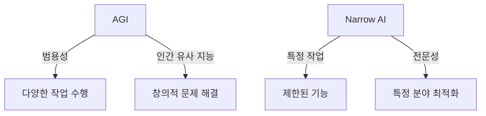

이와 같이 AGI는 약인공지능과는 다른 차별화된 특성을 지니고 있으며, 이는 인공지능의 미래에 대한 기대를 더욱 높이고 있다. AGI의 발전은 인류의 삶에 긍정적인 영향을 미칠 것으로 예상되며, 이에 대한 연구와 논의는 계속해서 이어져야 한다.

<!--
## AGI의 발전 단계
   - 2.1. 대화형 AI (Conversational AI)
   - 2.2. 추론 AI (Reasoning AI)
   - 2.3. 자율 AI (Autonomous AI)
   - 2.4. 혁신 AI (Innovating AI)
   - 2.5. 조직 AI (Organizational AI)
-->

## AGI의 발전 단계

인공 일반 지능(AGI)의 발전 단계는 다양한 형태의 AI 기술이 진화하면서 이루어지는 과정이다. 각 단계는 특정한 기능과 목적을 가지고 있으며, AGI의 궁극적인 목표인 인간과 유사한 지능을 구현하기 위한 기초를 제공한다.

**2.1. 대화형 AI (Conversational AI)**

대화형 AI는 인간과의 상호작용을 통해 자연어를 이해하고 응답하는 시스템이다. 이 기술은 고객 서비스, 개인 비서, 교육 등 다양한 분야에서 활용되고 있다. 대화형 AI는 사용자의 질문에 대한 적절한 답변을 제공하고, 대화를 이어가는 능력을 갖추고 있다.

```python
# 대화형 AI의 간단한 예제 코드
import random

responses = {
    "안녕하세요": ["안녕하세요! 어떻게 도와드릴까요?", "안녕하세요! 반갑습니다."],
    "잘 지내요": ["좋아요! 당신은요?", "잘 지내고 있습니다."],
}

def respond(user_input):
    return random.choice(responses.get(user_input, ["죄송합니다, 이해하지 못했습니다."]))

# 사용자 입력 예시
user_input = "안녕하세요"
print(respond(user_input))
```

**2.2. 추론 AI (Reasoning AI)**

추론 AI는 주어진 정보를 바탕으로 논리적 결론을 도출하는 능력을 가진 시스템이다. 이 기술은 문제 해결, 의사 결정, 예측 모델링 등에서 중요한 역할을 한다. 추론 AI는 복잡한 데이터 세트를 분석하고, 패턴을 인식하여 유의미한 결과를 도출할 수 있다.

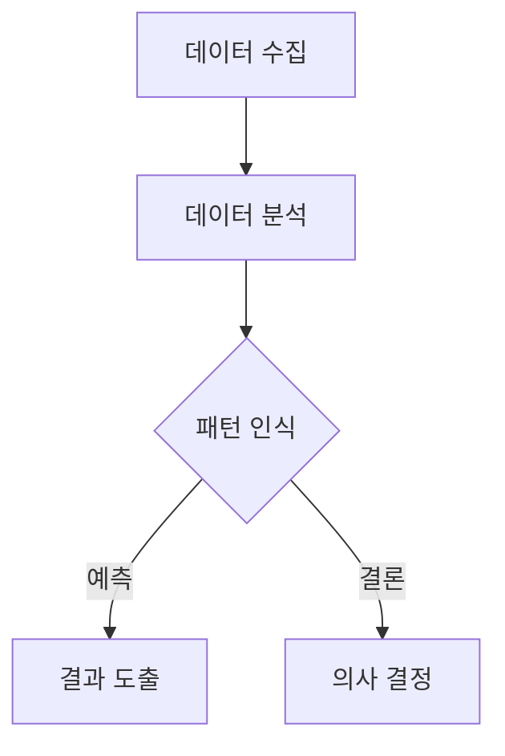

**2.3. 자율 AI (Autonomous AI)**

자율 AI는 인간의 개입 없이 스스로 결정을 내리고 행동할 수 있는 시스템이다. 이 기술은 자율주행차, 드론, 로봇 등에서 활용되며, 환경을 인식하고 상황에 맞는 행동을 선택하는 능력을 갖추고 있다. 자율 AI는 복잡한 환경에서도 안전하게 작동할 수 있도록 설계되어야 한다.

**2.4. 혁신 AI (Innovating AI)**

혁신 AI는 새로운 아이디어나 솔루션을 생성하는 능력을 가진 시스템이다. 이 기술은 창의적인 문제 해결, 디자인, 예술 등 다양한 분야에서 활용될 수 있다. 혁신 AI는 기존의 데이터를 바탕으로 새로운 개념을 창출하고, 인간의 창의성을 보완하는 역할을 한다.

**2.5. 조직 AI (Organizational AI)**

조직 AI는 기업이나 조직의 운영을 최적화하고 효율성을 높이는 데 기여하는 시스템이다. 이 기술은 데이터 분석, 프로세스 자동화, 의사 결정 지원 등 다양한 기능을 통해 조직의 성과를 향상시킬 수 있다. 조직 AI는 팀워크와 협업을 촉진하여 조직의 목표 달성을 지원한다.

AGI의 발전 단계는 각기 다른 기술적 요구와 도전 과제를 가지고 있으며, 이러한 단계들이 통합되어 궁극적으로 인공 일반 지능의 실현에 기여하게 된다.

<!--
## AGI의 기술적 기반
   - 3.1. 대규모 언어 모델(LLMs)과 AGI
   - 3.2. Transfer Learning의 역할
   - 3.3. AGI의 신경망 구조
-->

## AGI의 기술적 기반

인공 일반 지능(AGI)의 발전을 위해서는 여러 기술적 기반이 필요하다. 이 섹션에서는 대규모 언어 모델(LLMs), Transfer Learning의 역할, 그리고 AGI의 신경망 구조에 대해 살펴보겠다.

**대규모 언어 모델(LLMs)과 AGI**

대규모 언어 모델(LLMs)은 자연어 처리(Natural Language Processing) 분야에서 중요한 역할을 한다. LLMs는 방대한 양의 텍스트 데이터를 학습하여 언어의 패턴과 구조를 이해하고, 이를 바탕으로 자연스러운 언어 생성 및 이해를 가능하게 한다. AGI의 발전에 있어 LLMs는 인간과 유사한 수준의 언어 이해 및 생성 능력을 제공함으로써, 다양한 분야에서의 응용 가능성을 높인다.

예를 들어, OpenAI의 GPT-3와 같은 모델은 1750억 개의 파라미터를 가지고 있으며, 이는 AGI의 언어적 능력을 향상시키는 데 기여한다. 이러한 모델은 대화형 AI, 정보 검색, 콘텐츠 생성 등 다양한 분야에서 활용될 수 있다.

```mermaid
graph TD;
    A[대규모 언어 모델(LLMs)] --> B[자연어 이해];
    A --> C[자연어 생성];
    B --> D[AGI의 언어적 능력 향상];
    C --> D;
```

**Transfer Learning의 역할**

Transfer Learning은 한 작업에서 학습한 지식을 다른 작업에 적용하는 기법이다. AGI의 개발에 있어 Transfer Learning은 매우 중요한 역할을 한다. 이는 모델이 특정 작업에서 학습한 정보를 다른 유사한 작업에 쉽게 전이할 수 있도록 하여, 학습 효율성을 높이고 데이터 부족 문제를 해결하는 데 기여한다.

예를 들어, 이미지 인식 모델이 특정 객체를 인식하는 데 학습한 후, 이를 기반으로 다른 객체를 인식하는 데 필요한 추가 학습을 최소화할 수 있다. 이러한 방식은 AGI가 다양한 작업을 수행하는 데 필요한 유연성을 제공한다.

```python
# Transfer Learning 예제 코드
from tensorflow.keras.applications import VGG16
from tensorflow.keras.models import Model

# VGG16 모델 불러오기 (사전 학습된 가중치 사용)
base_model = VGG16(weights='imagenet', include_top=False)

# 새로운 분류기 추가
x = base_model.output
x = Flatten()(x)
x = Dense(256, activation='relu')(x)
predictions = Dense(num_classes, activation='softmax')(x)

# 새로운 모델 생성
model = Model(inputs=base_model.input, outputs=predictions)
```

**AGI의 신경망 구조**

AGI의 신경망 구조는 다양한 형태로 설계될 수 있으며, 이는 AGI의 기능과 성능에 큰 영향을 미친다. 일반적으로 AGI는 여러 층의 신경망으로 구성되며, 각 층은 입력 데이터를 처리하고, 특징을 추출하며, 최종적으로 의사 결정을 내리는 역할을 한다.

AGI의 신경망 구조는 다음과 같은 요소로 구성될 수 있다:

1. **입력층(Input Layer)**: 원시 데이터를 입력받는 층이다.
2. **은닉층(Hidden Layers)**: 입력 데이터를 처리하고 특징을 추출하는 여러 층이다.
3. **출력층(Output Layer)**: 최종 결과를 출력하는 층이다.

AGI의 신경망 구조는 복잡한 문제를 해결하기 위해 다양한 아키텍처를 사용할 수 있으며, 이는 AGI의 성능을 극대화하는 데 기여한다.

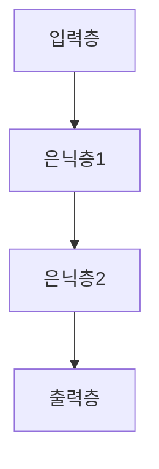

이와 같이 AGI의 기술적 기반은 대규모 언어 모델, Transfer Learning, 신경망 구조 등 다양한 요소로 구성되어 있으며, 이는 AGI의 발전과 응용 가능성을 높이는 데 중요한 역할을 한다.

<!--
## AGI의 응용 사례
   - 4.1. 비즈니스에서의 AGI 활용
   - 4.2. 의료 분야에서의 AGI
   - 4.3. 교육 및 학습에서의 AGI
-->

## AGI의 응용 사례

인공 일반 지능(AGI)은 다양한 분야에서 혁신적인 변화를 가져올 수 있는 잠재력을 지니고 있다. 이 섹션에서는 비즈니스, 의료, 교육 및 학습 분야에서 AGI의 활용 사례를 살펴보겠다.

**4.1. 비즈니스에서의 AGI 활용**

AGI는 비즈니스 환경에서 의사결정 지원, 고객 서비스, 데이터 분석 등 여러 방면에서 활용될 수 있다. 예를 들어, AGI 기반의 시스템은 고객의 요구를 이해하고, 맞춤형 솔루션을 제공함으로써 고객 만족도를 높일 수 있다. 또한, AGI는 대량의 데이터를 분석하여 시장 트렌드를 예측하고, 기업의 전략적 결정을 지원할 수 있다.

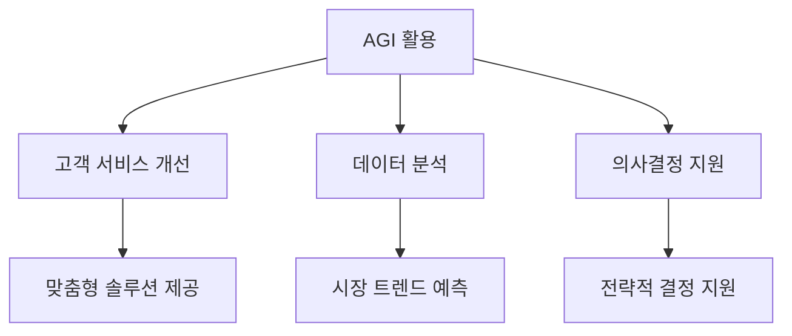

**4.2. 의료 분야에서의 AGI**

의료 분야에서도 AGI는 큰 변화를 가져올 수 있다. AGI는 환자의 데이터를 분석하여 진단을 지원하고, 치료 계획을 제안하는 데 활용될 수 있다. 예를 들어, AGI는 환자의 유전자 정보를 분석하여 개인 맞춤형 치료를 제공할 수 있으며, 이를 통해 치료의 효율성을 높일 수 있다. 또한, AGI는 의료 연구에 있어서도 새로운 발견을 이끌어낼 수 있는 가능성을 지니고 있다.

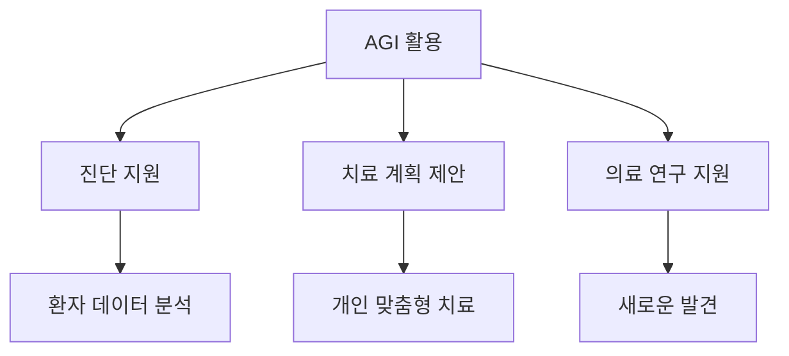

**4.3. 교육 및 학습에서의 AGI**

AGI는 교육 및 학습 분야에서도 혁신적인 변화를 가져올 수 있다. AGI 기반의 학습 시스템은 학생의 학습 스타일과 진도를 분석하여 개인 맞춤형 학습 경로를 제공할 수 있다. 또한, AGI는 교육 콘텐츠를 자동으로 생성하고, 학생의 질문에 실시간으로 답변함으로써 학습 효과를 극대화할 수 있다. 이러한 방식으로 AGI는 교육의 접근성과 효율성을 높이는 데 기여할 수 있다.

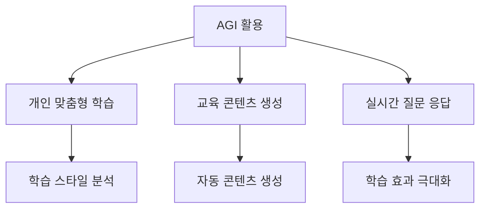

AGI는 비즈니스, 의료, 교육 등 다양한 분야에서 그 가능성을 보여주고 있으며, 앞으로의 발전이 기대된다. 이러한 응용 사례들은 AGI가 우리의 삶을 어떻게 변화시킬 수 있는지를 잘 보여준다.

<!--
## AGI의 윤리적 고려사항
   - 5.1. AI의 윤리적 사용
   - 5.2. 일자리 변화와 사회적 영향
   - 5.3. AI 안전성 및 규제
-->

## AGI의 윤리적 고려사항

인공 일반 지능(AGI)의 발전은 많은 기대를 모으고 있지만, 그에 따른 윤리적 고려사항도 무시할 수 없다. AGI의 윤리적 사용, 일자리 변화와 사회적 영향, AI 안전성 및 규제는 중요한 이슈로 부각되고 있다.

**AI의 윤리적 사용**

AGI의 윤리적 사용은 기술이 인간의 삶에 미치는 영향을 고려해야 한다. AI 시스템이 공정하고 투명하게 작동하도록 보장하는 것이 중요하다. 예를 들어, AGI가 의사결정 과정에 개입할 때, 그 과정이 어떻게 이루어지는지에 대한 명확한 기준이 필요하다. 이를 위해 AI의 결정 과정이 설명 가능해야 하며, 편향(bias)을 최소화하는 방법이 강구되어야 한다.

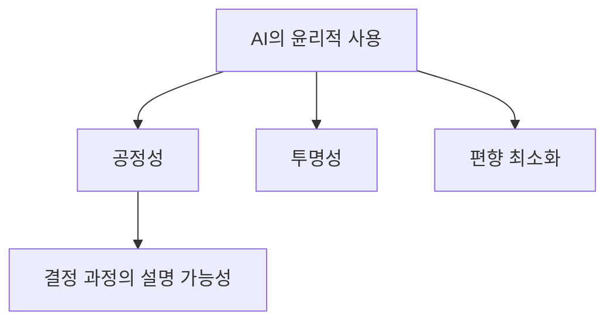

**일자리 변화와 사회적 영향**

AGI의 도입은 일자리의 변화와 사회적 영향을 초래할 것이다. 자동화가 진행됨에 따라 일부 직업은 사라질 수 있으며, 새로운 직업이 생겨날 가능성도 있다. 이러한 변화는 노동 시장에 큰 영향을 미치며, 이에 대한 사회적 준비가 필요하다. 정부와 기업은 재교육 프로그램을 통해 노동자들이 새로운 기술에 적응할 수 있도록 지원해야 한다.

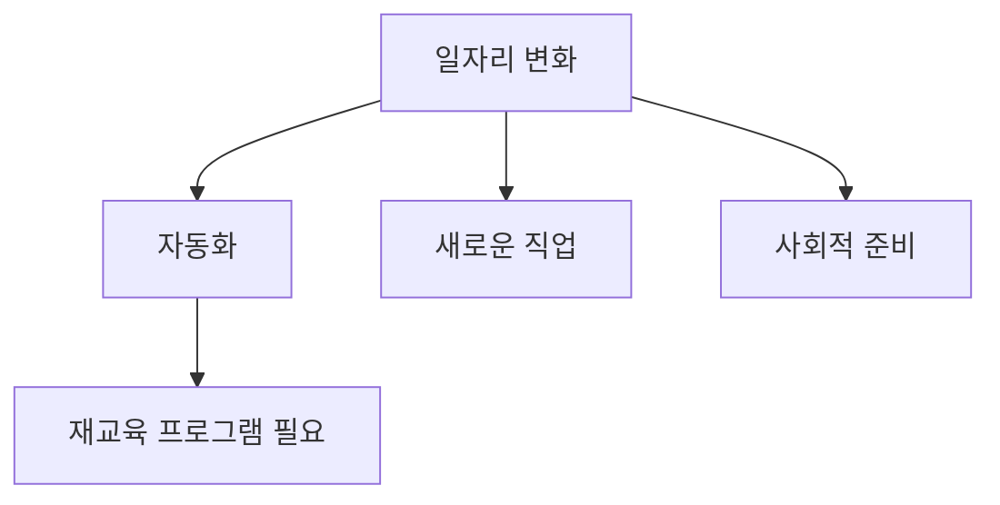

**AI 안전성 및 규제**

AGI의 안전성은 기술이 잘못 사용되거나 오작동할 경우 발생할 수 있는 위험을 최소화하는 것을 의미한다. 따라서 AGI 시스템의 개발과 운영에 있어 규제가 필요하다. 이는 기술의 발전을 저해하지 않으면서도 안전성을 보장할 수 있는 균형을 찾아야 한다. 규제 기관은 AGI의 개발과 사용에 대한 명확한 가이드라인을 제시해야 하며, 이를 통해 사회가 AGI의 혜택을 안전하게 누릴 수 있도록 해야 한다.

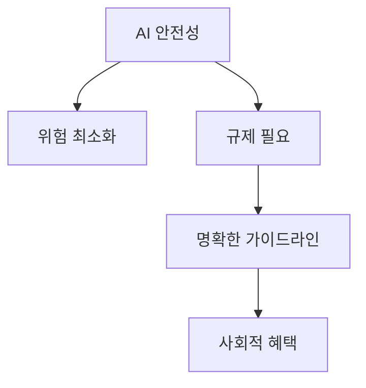

AGI의 윤리적 고려사항은 기술 발전과 함께 지속적으로 논의되어야 하며, 이를 통해 인류가 안전하고 공정한 방식으로 AGI를 활용할 수 있는 기반을 마련해야 한다.

<!--
## AGI의 미래 전망
   - 6.1. AGI 개발의 도전과제
   - 6.2. AGI가 가져올 혁신적 변화
   - 6.3. AGI와 인류의 공존 가능성
-->

## AGI의 미래 전망

인공 일반 지능(AGI)의 발전은 인류의 미래에 중대한 영향을 미칠 것으로 예상된다. 이 섹션에서는 AGI 개발의 도전과제, AGI가 가져올 혁신적 변화, 그리고 AGI와 인류의 공존 가능성에 대해 논의할 것이다.

**6.1. AGI 개발의 도전과제**

AGI 개발에는 여러 가지 도전과제가 존재한다. 첫째, 기술적 도전이 있다. AGI는 인간의 지능을 모방해야 하므로, 복잡한 문제 해결 능력, 창의성, 그리고 감정 인식 등을 포함해야 한다. 이러한 기능을 구현하기 위해서는 고도화된 알고리즘과 대규모 데이터셋이 필요하다.

둘째, 윤리적 및 사회적 도전이 있다. AGI의 발전은 일자리의 변화, 개인 정보 보호, 그리고 AI의 윤리적 사용과 같은 문제를 동반한다. 이러한 문제를 해결하기 위해서는 사회적 합의와 규제가 필요하다.

셋째, 안전성 문제도 중요한 도전과제이다. AGI가 잘못된 결정을 내리거나 예기치 않은 행동을 할 경우, 그 결과는 심각할 수 있다. 따라서 AGI의 안전성을 보장하기 위한 연구가 필수적이다.

**6.2. AGI가 가져올 혁신적 변화**

AGI는 다양한 분야에서 혁신적 변화를 가져올 것으로 기대된다. 예를 들어, 비즈니스 분야에서는 AGI가 데이터 분석과 의사결정을 자동화하여 효율성을 극대화할 수 있다. 의료 분야에서는 AGI가 진단 및 치료 계획을 수립하는 데 도움을 줄 수 있으며, 이는 환자의 생존율을 높이는 데 기여할 것이다.

교육 분야에서도 AGI는 개인 맞춤형 학습 경험을 제공하여 학습 효과를 극대화할 수 있다. AGI는 학생의 학습 스타일과 진도를 분석하여 최적의 학습 경로를 제시할 수 있다.

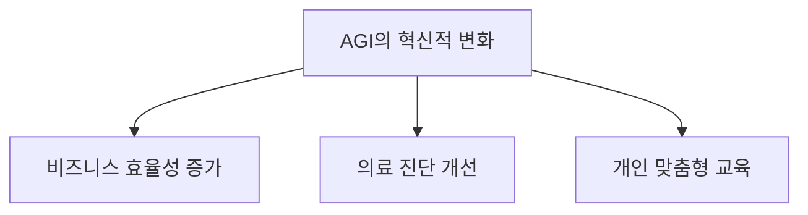

**6.3. AGI와 인류의 공존 가능성**

AGI와 인류의 공존은 중요한 주제이다. AGI가 인간의 삶을 향상시키는 도구로 작용할 수 있다면, 인류와 AGI는 상호 보완적인 관계를 형성할 수 있다. 그러나 AGI가 인간의 역할을 대체하거나, 인간의 통제를 벗어날 경우, 심각한 사회적 갈등이 발생할 수 있다.

따라서 AGI와 인류의 공존을 위해서는 AGI의 개발 과정에서 윤리적 기준과 사회적 책임을 고려해야 한다. AGI가 인간의 가치와 목표를 존중하며 발전할 수 있도록 하는 것이 중요하다. 이를 위해서는 다양한 이해관계자들이 참여하는 논의와 협력이 필요하다. 

결론적으로, AGI의 미래는 도전과 기회가 공존하는 복잡한 상황이다. AGI의 발전이 인류에게 긍정적인 영향을 미치기 위해서는 기술적, 윤리적, 사회적 측면에서의 지속적인 노력이 필요하다.

<!--
## 예제
   - 7.1. AGI 모델의 실제 사례
   - 7.2. AGI를 활용한 프로젝트 예시
-->

## 예제

**7.1. AGI 모델의 실제 사례**

인공 일반 지능(AGI) 모델은 다양한 분야에서 실제로 활용되고 있다. 그 중 하나는 대화형 AI 시스템이다. 이러한 시스템은 사용자의 질문에 대해 자연스럽고 유의미한 답변을 제공할 수 있는 능력을 갖추고 있다. 예를 들어, OpenAI의 ChatGPT는 대화형 AI의 대표적인 사례로, 사용자의 요청에 따라 다양한 주제에 대해 대화할 수 있는 능력을 보여준다.

또한, AGI 모델은 의료 분야에서도 활용되고 있다. IBM의 Watson은 환자의 데이터를 분석하고, 진단 및 치료 방법을 제안하는 데 사용된다. 이러한 시스템은 방대한 양의 의료 데이터를 처리하여 의사결정을 지원하는 데 큰 도움을 준다.

다음은 AGI 모델의 작동 방식을 간단히 나타낸 다이어그램이다.

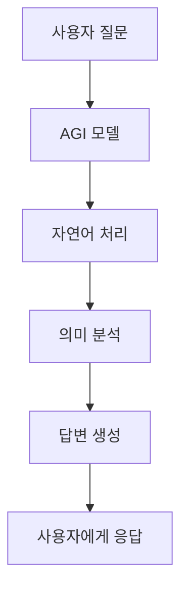

**7.2. AGI를 활용한 프로젝트 예시**

AGI를 활용한 프로젝트는 여러 가지 형태로 진행되고 있다. 예를 들어, 교육 분야에서는 개인 맞춤형 학습 시스템이 개발되고 있다. 이러한 시스템은 학생의 학습 스타일과 진도를 분석하여 최적의 학습 경로를 제시한다. 

또한, 비즈니스 환경에서는 AGI를 활용한 고객 서비스 챗봇이 도입되고 있다. 이 챗봇은 고객의 질문에 실시간으로 응답하고, 문제를 해결하는 데 도움을 준다. 이러한 시스템은 고객 만족도를 높이고, 운영 비용을 절감하는 데 기여하고 있다.

아래는 AGI를 활용한 프로젝트의 흐름을 나타낸 다이어그램이다.

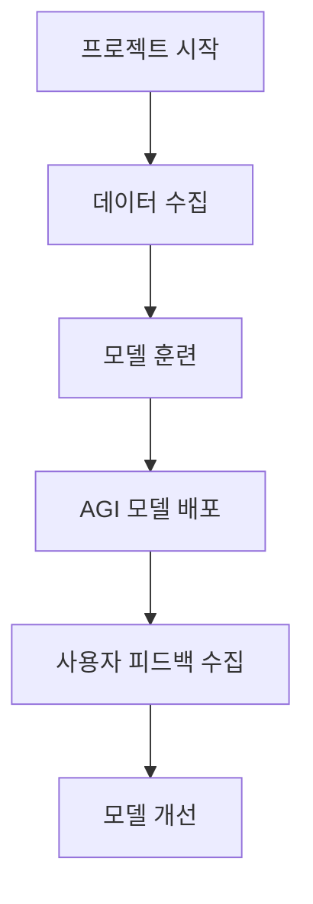

이와 같이 AGI는 다양한 분야에서 실제 사례와 프로젝트를 통해 그 가능성을 보여주고 있으며, 앞으로도 더욱 발전할 것으로 기대된다.

<!--
## FAQ
   - AGI와 AI의 차이는 무엇인가요?
   - AGI가 실현되면 어떤 변화가 있을까요?
   - AGI의 개발에 있어 가장 큰 도전은 무엇인가요?
-->

## FAQ

**AGI와 AI의 차이는 무엇인가요?**  

AGI(Artificial General Intelligence)와 AI(Artificial Intelligence)는 서로 다른 개념이다. AI는 특정 작업을 수행하는 데 최적화된 시스템으로, 약인공지능(Narrow AI)이라고도 불린다. 반면 AGI는 인간과 유사한 수준의 지능을 갖춘 시스템으로, 다양한 작업을 수행할 수 있는 능력을 지닌다. AGI는 특정 분야에 국한되지 않고, 여러 분야에서의 문제 해결 능력을 요구한다. 

예를 들어, Narrow AI는 이미지 인식, 음성 인식 등 특정 작업에 특화되어 있지만, AGI는 이러한 작업을 포함하여 새로운 문제를 스스로 학습하고 해결할 수 있는 능력을 갖추고 있다.

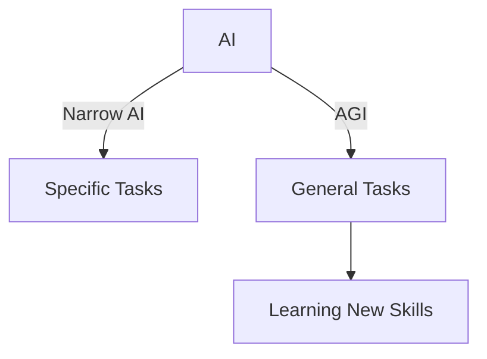

**AGI가 실현되면 어떤 변화가 있을까요?** 

AGI의 실현은 여러 분야에 걸쳐 혁신적인 변화를 가져올 것으로 예상된다. 첫째, 비즈니스 환경에서는 AGI가 데이터 분석, 의사결정 지원, 고객 서비스 등에서 효율성을 극대화할 수 있다. 둘째, 의료 분야에서는 AGI가 진단 및 치료 계획 수립에 도움을 줄 수 있으며, 개인 맞춤형 의료 서비스를 제공할 수 있다. 셋째, 교육 분야에서는 AGI가 학습자의 수준에 맞춘 맞춤형 교육을 제공하고, 학습 효율성을 높일 수 있다.

이러한 변화는 사회 전반에 걸쳐 일자리의 형태와 역할을 변화시킬 것이며, 새로운 직업군이 생겨날 가능성도 있다.

**AGI의 개발에 있어 가장 큰 도전은 무엇인가요?**  

AGI 개발의 가장 큰 도전은 기술적, 윤리적, 사회적 문제를 모두 해결해야 한다는 점이다. 기술적으로는 AGI가 인간과 유사한 수준의 지능을 갖추기 위해서는 복잡한 신경망 구조와 대규모 데이터가 필요하다. 또한, AGI의 안전성과 신뢰성을 보장하기 위한 연구가 필수적이다.

윤리적 측면에서는 AGI의 결정이 인간의 가치와 윤리에 부합해야 하며, 사회적 영향에 대한 고려가 필요하다. AGI가 일자리를 대체할 경우, 이에 대한 사회적 합의와 정책 마련이 중요하다. 이러한 도전 과제를 해결하기 위해서는 다양한 분야의 전문가들이 협력하여 연구하고 논의해야 한다.

<!--
## 관련 기술
   - 9.1. 머신러닝(Machine Learning)
   - 9.2. 딥러닝(Deep Learning)
   - 9.3. 자연어 처리(Natural Language Processing)
-->

## 관련 기술

인공 일반 지능(AGI)의 발전을 위해서는 여러 관련 기술들이 필수적이다. 이 섹션에서는 머신러닝, 딥러닝, 자연어 처리의 개념과 이들이 AGI와 어떻게 연결되는지를 살펴보겠다.

**머신러닝(Machine Learning)**

머신러닝은 데이터로부터 학습하여 예측이나 결정을 내리는 알고리즘을 개발하는 분야이다. 머신러닝은 AGI의 기초가 되는 기술로, 다양한 데이터에서 패턴을 인식하고 이를 기반으로 새로운 데이터를 처리하는 능력을 제공한다. 머신러닝의 주요 알고리즘으로는 회귀 분석(Regression), 의사결정 나무(Decision Trees), 서포트 벡터 머신(Support Vector Machines) 등이 있다.

샘플 코드로는 Python의 Scikit-learn 라이브러리를 사용한 간단한 회귀 분석 예제를 들 수 있다.

```python
import numpy as np
from sklearn.model_selection import train_test_split
from sklearn.linear_model import LinearRegression

# 데이터 생성
X = np.array([[1], [2], [3], [4], [5]])
y = np.array([2, 3, 5, 7, 11])

# 데이터 분할
X_train, X_test, y_train, y_test = train_test_split(X, y, test_size=0.2, random_state=42)

# 모델 학습
model = LinearRegression()
model.fit(X_train, y_train)

# 예측
predictions = model.predict(X_test)
print(predictions)
```

**딥러닝(Deep Learning)**

딥러닝은 인공신경망(Artificial Neural Networks)을 기반으로 한 머신러닝의 한 분야로, 복잡한 데이터의 패턴을 인식하는 데 뛰어난 성능을 보인다. AGI의 발전에 있어 딥러닝은 이미지 인식, 음성 인식, 자연어 처리 등 다양한 분야에서 중요한 역할을 한다. 특히, 대규모 데이터셋을 처리할 수 있는 능력 덕분에 AGI의 학습 효율성을 크게 향상시킬 수 있다.

다음은 간단한 딥러닝 모델을 구축하는 예제 코드이다.

```python
import tensorflow as tf
from tensorflow import keras

# 데이터셋 로드
mnist = keras.datasets.mnist
(X_train, y_train), (X_test, y_test) = mnist.load_data()

# 데이터 전처리
X_train = X_train / 255.0
X_test = X_test / 255.0

# 모델 정의
model = keras.Sequential([
    keras.layers.Flatten(input_shape=(28, 28)),
    keras.layers.Dense(128, activation='relu'),
    keras.layers.Dense(10, activation='softmax')
])

# 모델 컴파일
model.compile(optimizer='adam', loss='sparse_categorical_crossentropy', metrics=['accuracy'])

# 모델 학습
model.fit(X_train, y_train, epochs=5)

# 모델 평가
test_loss, test_acc = model.evaluate(X_test, y_test)
print('Test accuracy:', test_acc)
```

**자연어 처리(Natural Language Processing)**

자연어 처리는 컴퓨터가 인간의 언어를 이해하고 해석하는 기술이다. AGI의 발전에 있어 자연어 처리는 필수적인 요소로, 인간과의 상호작용을 가능하게 한다. 자연어 처리 기술은 텍스트 분석, 기계 번역, 감정 분석 등 다양한 분야에서 활용된다. 최근에는 Transformer 모델과 같은 혁신적인 아키텍처가 등장하여 자연어 처리의 성능을 크게 향상시켰다.

다음은 자연어 처리를 위한 간단한 텍스트 전처리 예제이다.

```python
import nltk
from nltk.tokenize import word_tokenize

# NLTK 데이터 다운로드
nltk.download('punkt')

# 텍스트 데이터
text = "AGI는 인공지능의 미래를 이끌 기술이다."

# 단어 토큰화
tokens = word_tokenize(text)
print(tokens)
```

이와 같이 머신러닝, 딥러닝, 자연어 처리는 AGI의 발전에 있어 중요한 기술적 기반을 제공하며, 이들 기술의 발전이 AGI의 실현 가능성을 높이고 있다.

<!--
## 결론
   - AGI의 중요성과 미래에 대한 기대
   - AGI 연구의 지속적인 필요성
-->

## 결론

**AGI의 중요성과 미래에 대한 기대**  

인공 일반 지능(AGI)은 인류의 미래에 중대한 영향을 미칠 기술로 자리 잡고 있다. AGI는 인간과 유사한 수준의 인지 능력을 갖춘 시스템으로, 다양한 분야에서 혁신을 이끌어낼 잠재력을 지니고 있다. 예를 들어, AGI는 복잡한 문제 해결, 창의적인 작업 수행, 그리고 인간과의 자연스러운 상호작용을 가능하게 하여, 비즈니스, 의료, 교육 등 여러 분야에서 효율성을 극대화할 수 있다. 이러한 가능성은 AGI가 단순한 도구를 넘어, 인간의 삶을 향상시키는 동반자로 자리매김할 수 있음을 시사한다.

AGI의 발전은 또한 사회적, 경제적 변화를 가져올 것으로 예상된다. AGI가 실현되면, 일자리의 형태가 변화하고 새로운 산업이 등장할 것이며, 이는 인류의 삶의 질을 높이는 데 기여할 것이다. 그러나 이러한 변화는 동시에 윤리적, 사회적 도전 과제를 동반할 수 있으므로, AGI의 개발과 활용에 있어 신중한 접근이 필요하다.

**AGI 연구의 지속적인 필요성**  

AGI의 발전은 단순히 기술적 진보에 그치지 않고, 인류의 미래를 형성하는 중요한 요소로 작용할 것이다. 따라서 AGI 연구는 지속적으로 이루어져야 하며, 이를 통해 AGI의 안전성, 윤리성, 그리고 사회적 수용성을 확보해야 한다. AGI의 연구는 다양한 분야의 전문가들이 협력하여 이루어져야 하며, 이는 기술적 진보뿐만 아니라 사회적 합의와 규제의 필요성을 반영하는 과정이기도 하다.

AGI 연구의 지속적인 필요성을 강조하기 위해, 다음과 같은 다이어그램을 통해 AGI 연구의 주요 요소를 시각적으로 표현할 수 있다.

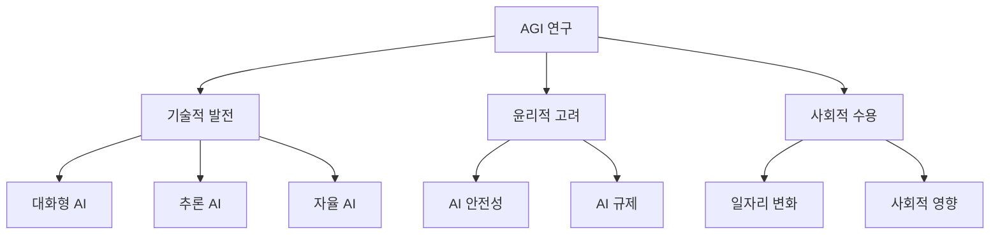

이 다이어그램은 AGI 연구가 기술적 발전, 윤리적 고려, 그리고 사회적 수용이라는 세 가지 주요 요소로 구성되어 있음을 보여준다. 이러한 요소들은 AGI의 성공적인 발전과 사회적 통합을 위해 필수적이다. AGI의 미래는 이러한 연구와 논의의 결과에 달려 있으며, 인류가 AGI와 함께 공존할 수 있는 길을 모색해야 한다.

<!--
## 참고 자료
   - 관련 논문 및 연구 자료
   - AGI 관련 서적 및 웹사이트
-->

## 참고 자료

**AGI 관련 서적 및 웹사이트**  
AGI에 대한 심층적인 이해를 위해 다음의 서적과 웹사이트를 추천한다.

1. **"Superintelligence: Paths, Dangers, Strategies" by Nick Bostrom**  
   AGI의 미래와 그에 따른 위험 요소를 다룬 책으로, AGI의 발전이 인류에 미치는 잠재적 영향을 탐구한다.

2. **"Artificial General Intelligence" by Ben Goertzel and Cassio Pennachin**  
   AGI의 이론과 실제 사례를 다룬 포괄적인 서적이다. AGI의 다양한 접근 방식과 기술적 기초를 이해하는 데 도움이 된다.

3. **AGI Society (https://www.agi-society.org)**  
   AGI 연구자와 개발자들이 모여 AGI의 발전을 논의하고 정보를 공유하는 플랫폼이다. 최신 연구 결과와 이벤트 정보를 확인할 수 있다.

4. **OpenAI (https://www.openai.com)**  
   AGI 연구에 대한 다양한 자료와 프로젝트를 제공하는 웹사이트로, AGI의 발전 방향과 기술적 기반에 대한 정보를 얻을 수 있다.

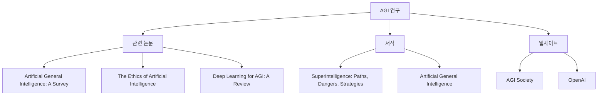

위의 자료들은 AGI에 대한 깊이 있는 이해를 돕고, 연구 및 개발에 있어 유용한 참고 자료가 될 것이다. AGI의 발전을 위해 지속적인 학습과 연구가 필요하다.

<!--
##### Reference #####
-->

## Reference


* [https://namu.wiki/w/%EC%9D%B8%EA%B3%B5%20%EC%9D%BC%EB%B0%98%20%EC%A7%80%EB%8A%A5](https://namu.wiki/w/%EC%9D%B8%EA%B3%B5%20%EC%9D%BC%EB%B0%98%20%EC%A7%80%EB%8A%A5)
* [https://blog.naver.com/drryuhk/223517376265](https://blog.naver.com/drryuhk/223517376265)
* [https://yooniverse1007.tistory.com/25](https://yooniverse1007.tistory.com/25)
* [https://brunch.co.kr/@acc9b16b9f0f430/82](https://brunch.co.kr/@acc9b16b9f0f430/82)
* [https://www.aitimes.com/news/articleView.html?idxno=161532](https://www.aitimes.com/news/articleView.html?idxno=161532)
* [https://www.yna.co.kr/view/AKR20240712054300009](https://www.yna.co.kr/view/AKR20240712054300009)


<!--
인공 일반 지능이라는 용어에서 일반성(Generality)의 의미는 '일반적이다'라는 단어가 일상언어에서 쓰이는 의미보다는

[ 특수 상대성 이론
](/w/%ED%8A%B9%EC%88%98%20%EC%83%81%EB%8C%80%EC%84%B1%20%EC%9D%B4%EB%A1%A0 "특수
상대성 이론")

을

_[ 일반화 ](/w/%EC%9D%BC%EB%B0%98%ED%99%94 "일반화") _

시킨

[ 일반 상대성 이론
](/w/%EC%9D%BC%EB%B0%98%20%EC%83%81%EB%8C%80%EC%84%B1%20%EC%9D%B4%EB%A1%A0 "일반
상대성 이론")

,

[ 유클리드 공간의 벡터
](/w/%EB%B2%A1%ED%84%B0\(%EC%9C%A0%ED%81%B4%EB%A6%AC%EB%93%9C%20%EA%B8%B0%ED%95%98%ED%95%99\)
"벡터\(유클리드 기하학\)")

를

_일반화_

한

[ 벡터 공간 ](/w/%EB%B2%A1%ED%84%B0%20%EA%B3%B5%EA%B0%84 "벡터 공간")

을 또

_일반화_

한

[ 가군 ](/w/%EA%B0%80%EA%B5%B0 "가군")

, 확률을

_일반화_

한 확률공간,

[ 함수를 _일반화_ 한 사상 ](/w/%EB%B2%94%EC%A3%BC\(%EB%B2%94%EC%A3%BC%EB%A1%A0\)
"범주\(범주론\)")

등의 표현에서 쓰이는 표현인 '일반성'에 가깝다. 즉, 일상언어로 치면 '범용', '전역', '보편'의 의미로 쓰인다 할 수 있다. 이
때문에

[ 일본 ](/w/%EC%9D%BC%EB%B3%B8 "일본")

등 일부 국가에서는 인공 일반 지능을 '범용 인공지능'이나 '인공 범용 지능' 등의 보다 직관적인 명칭으로 호칭하기도 한다.

쉽게 설명하자면, 특정한 조건하에서만 적용할 수 있는

[ 약인공지능 ](/w/%EC%95%BD%EC%9D%B8%EA%B3%B5%EC%A7%80%EB%8A%A5 "약인공지능")

과 달리

**모든 상황에 일반적으로 두루 적용할 수 있는 AI**

를 말한다. 인공 일반 지능은 약인공지능과 달리 한 번도 해 보지 않은 꽃꽂이를 남들이 하는 것을 보고 배워서 한다든가, 방범 업무를
경찰에게 인수 인계 받아서 학습하여 한다든가 하는 것도 가능하다.

약인공지능이 신경 덩어리라면 이것은 그 신경 덩어리의 집합이라 일컬을 수도 있는데 이는 단순한 집합의 의미뿐만 아니라 집합 사이에서
이루어지는 유기적인 정보 처리 반응이 핵심이 된다는 의미이며, 현실에서 인공지능 연구가들이 목표 삼는 인공지능이 바로 이 인공 일반
지능이다.

이 단계의 인공 지능부터는

[ 인공지능 특이점
](/w/%EC%9D%B8%EA%B3%B5%EC%A7%80%EB%8A%A5%20%ED%8A%B9%EC%9D%B4%EC%A0%90 "인공지능
특이점")

과 관련된 위험성이 의심된다. 때문에 일각에서는 진짜 인공 일반 지능을 연구하는 대신 수많은 분야의 약인공지능을 개별적으로 분리해 놓고,
그것을 포괄적으로 관리하는 서비스 시스템을 따로 만들어서 간접적으로 범용의 인공 지능을 구현해야 한다고 주장하기도 한다. 즉 신경 덩어리를
유기적으로 결합하지 않고 기계적으로 결합시키자는 의견인데, 이렇게 하면 시스템을 관리하는 인간이 언제나 우위에 있게 되어 인공 지능이
특이점을 돌파하지 못하므로

[ 초지능 ](/w/%EC%B4%88%EC%A7%80%EB%8A%A5 "초지능")

이 만들어질 가능성도 억제된다고 한다.

인공 일반 지능보다 더 뛰어난 것이

[ 인공 의식 ](/w/%EC%9D%B8%EA%B3%B5%20%EC%9D%98%EC%8B%9D "인공 의식")

이다. 물론 만들어진 것을 의식이라고 일컫는 것에 대한 거부감은 순전히 떨쳐낼 수 있을 것이라고 믿지 않는 사람들도 많고, 아직까지도 이런
기술을 개발하는 데 진전이 몹시 더디기 때문에 실제로 구현될 때에는 이름이 바뀔 수도 있다.

2023년 3월 마이크로소프트 리서치에 따르면

[ OpenAI ](/w/OpenAI "OpenAI")

에서 개발한 언어모델

[ GPT-4 ](/w/GPT-4 "GPT-4")

가 인공 일반 지능에서 기대 되는 능력을 현상적(phenomenological)

[2]

으로 보여준다는 주장을 논문

[3]

을 통해 제기했다. 그 대표적인 근거로는 1.이전 인공지능 모델들에서는 존재하지 않았던 추론능력이 생겨났고, 2.논리적 사고가 가능하며
3.수학, 법률, 코딩 등과 같이 범용성있는 작업들을 수행할수 있고, 4.언어데이터로만 학습된 모델인데도 불구하고 그림그리기와 같은 작업을
성공적으로 수행하며 단순히 그럴듯한 답변을 생성하는 수준을 넘어서 언어에 내포된 개념을 실제로 응용하고 있음을 보여주었기 때문이다.

그러나 논문의 마지막 10장의 "방향과 결론" 섹션을 보면, GPT-4가 인공 일반 지능에서 기대되는 추리, 창의, 연역추론과 같은 지능을
이전 문단에서 기술한 바와 같이 여러 영역에 걸친 작업을 수행해냄으로써 보여줬지만, 엄밀한 인공 일반 지능 시스템의 정의 하에서 그 지능이
평가된 것은 아니라는 점을 인정하고 있다.

다시 말해, 엄밀한 인공 범용 지능 시스템의 성능을 정의 하려는 여러 시도가 있지만 (얼마나 많은 문제를 해결할 수 있는가, 능력 취득
효율성, 등) 아직까지는 어느 것도 완전하지 않으며, 특히 ‘사람이 할 수 있는 모든 일을 할 수 있는 시스템’은 실제로는 다른 사람이 할
수 있는 일을 완벽하게 훌륭히 할 수 있는 사람은 실존하지 않는 다는 점에서 실제로 그런 단일화 된 기준으로 측정이 가능한가에 대한 의문을
표하고 있다.

그리고 이 논문의 내용은 전적으로 현상적이며, 어떻게 해서 대규모 언어 모델(LLMs)에서 여러 영역에 걸쳐 활용 가능한 일반적 지능
(추리, 창의, 연역)이 나타나게 되는지 원리를 알지 못한다고도 인정하고 있다.

[4]

요약하자면, 기존의 인공지능 시스템은 한 분야에서 훈련된 능력을 다른 영역에서 활용하지 못했는데,

[ GPT-4 ](/w/GPT-4 "GPT-4")

에서는 그것이 가능했다는 점에서 “인공 일반 지능의 불씨”라고 불리울만 하지만, 이것이 진정 모든 영역에 적용될 수 있는 인공 일반 지능임을
알아냈다거나, 혹은 그것을 가능하게 한 원리나 이유를 알아내지는 못했다는 것이다.


-->

<!--


-->

<!--


-->

<!--


-->

<!--
� 게시물� 2024년 5월 16�� Cobus Greyling가 Medium� 게�한
"Five Levels of AI Agents"� 대해 번역, 첨언한 내용��
��니다.

👉 [ �문: Five Levels of AI Agents
](https://medium.com/@cobusgreyling/five-levels-of-ai-agents-5ac39a7b07ed)

* * *

##  개요

✅  5단계 Agent를 검색해 보니 해당 개�� 구글
딥마ì�¸ë“œì—�ì„œ ì œì•ˆí•œ ê°œë…�(2023.11.04)

👉 [ [Google DeepMind] Levels of AGI for Operationalizing Progress on the
Path to AGI ](https://deepmind.google/research/publications/66938/)

[ Levels of AGI for Operationalizing Progress on the Path to AGI  We propose a
framework for classifying the capabilities and behavior of Artificial General
Intelligence (AGI) models and their precursors. This framework introduces
levels of AGI performance,...  deepmind.google
](https://deepmind.google/research/publications/66938/)

✅ AGI 모ë�¸ì�˜ 기능과 성능 분류하기 위한 í”„ë ˆì�„워í�¬

✅ AGI ì •ì�˜ì—� 필요한 6가지 ì›�ì¹™

  1. ì•Œê³ ë¦¬ì¦˜ ì��체보다는 ì‹¤ì œ 성능ì—� ì´ˆì �(Capabilites, not Processes): **무엇ì�„ í• ìˆ˜ ì�ˆëŠ”지ì—� ì�˜í•´ ì •ì�˜** ë�˜ì–´ì•¼ì§€, 어떻게 하는지ì—� ì�˜í•´ ì •ì�˜ë�˜ì–´ì„œëŠ” 안 ë�¨ 
  2. **ì�¼ë°˜ì„±ê³¼ 성능** (Generality and Performance): **다양한 ì�‘ì—…ì�„ 높ì�€ 수준ì�˜ 성능** 으로 ìˆ˜í–‰í• ìˆ˜ ì�ˆì–´ì•¼ 함 
  3. **ì�¸ì§€ ë°� 메타ì�¸ì§€** (물리ì �ì�´ ì•„ë‹Œ) ì�‘ì—…ì—� 중ì �(Cognitive and Metacognive, but not Physical, Tasks): AGI는 언어 ì�´í•´í•˜ê³ ë¬¸ì œ 해결하는 ì�¸ì§€ ì�‘ì—…ë¿�만 아니ë�¼ **새로운 ì�‘ì—… í•™ìŠµí•˜ê³ ì��ì‹ ì�˜ 성능 모니터ë§�** 하는 것과 ê°™ì�€ 메타ì�¸ì§€ ì�‘ì—…ë�„ ìˆ˜í–‰í• ìˆ˜ ì�ˆì–´ì•¼ 함 
  4. 구현보다는 **ì� ì�¬ì„±** ì—� 중ì �(Potential, not Deployment): 시스템ì�´ íŠ¹ì • 수준 성능 ìˆ˜í–‰í• ì� ì�¬ë ¥ ì�ˆë‹¤ë©´, ì‹¤ì œ 세계ì—� 구현ë�˜ì—ˆëŠ”지 여부와 관계없ì�´ **AGIë¡œ 간주**
  5. 사ë�Œë“¤ì�´ 가치 ì�ˆê²Œ 여기는 ê³¼ì œë¥¼ ìš°ì„ í•˜ëŠ” **ìƒ�태학ì � 타당성** (Ecological Validity): AGI 진보 í�‰ê°€í•˜ëŠ” ë�° 사용ë�˜ëŠ” ì�‘ì—…ì�€ ì�¸ê°„ì�´ 가치 ë‘�는 **ì‹¤ì œ 세계ì�˜ ì�‘ì—… 대표** 해야 함 
  6. AGIì—� 대한 단ì�¼ 종ì � ì•„ë‹Œ **경로** ì—� 중ì �(Path to AGI, not a single Endpoint): AGIì—�는 단ì�¼ 종ì � 없으며, ê°�기 다른 지표와 벤치마í�¬ 지닌 AGI 수준 ì •ì�˜í•˜ëŠ” 것ì�´ ë�” ìœ ìš© 

* * *

##  ì—�ì�´ì „트 ë�„ë©”ì�¸ë³„ ì �ìš© ì‹œ ê³ ë ¤ì‚¬í•­

✅ �공 �반 지능(AGI, Artificial General Intelligence) �는
ì´ˆì�¸ê³µì§€ëŠ¥(ASI, Artificial Superintelligence) ê´€ë ¨ë�œ 다양한 추측
난무

  * AGI: 세ìƒ�ì�„ ì�´í•´í•˜ê³ ì�¸ê°„ì�´ í• ìˆ˜ ì�ˆëŠ” 것처럼 ê´‘ë²”ìœ„í•˜ê³ ìœ ì—°í•˜ê²Œ ë¬¸ì œ í•´ê²°í• ì§€ëŠ¥ í•™ìŠµí•˜ê³ ì �ìš©í• ìˆ˜ ì�ˆëŠ” 차세대 AI 
  * ASI: ì�¸ê°„ì�˜ 지능 뛰어넘는 지ì � 범위 가진 ê°€ìƒ�ì�˜ 소프트웨어 기반 AI 

✅ � 조��서는 �메�� �는 AI �� 위해 LLM � �율
ì—�ì�´ì „트를 활용해야 함

> 환경 ì�¸ì§€í•˜ê³ ì�‘ì—… ì‹¤í–‰í• ìˆ˜ ì�ˆëŠ” ëª¨ë“ ì—”í‹°í‹°ëŠ” ì—�ì�´ì
> „트ë�¼ê³ í• ìˆ˜ ì�ˆë‹¤.  
>  Any entity, that is able to perceive its environment and execute actions,
> can be regarded as an agent.

* * *

##  ì—�ì�´ì „트 구현 현주소

✅ �� 범위� �메� 구현 단계로, 2단계와 3단계. 약
**2.5단계**

✅ ë�­ì²´ì�¸ì�€ ì—�ì�´ì „트 개발 위한 í”„ë ˆì�„워í�¬ 만드는ë�°
ì•�ì�¥ì„œê³ ì�ˆì�Œ

  * ì—�ì�´ì „트 RAG ì ‘ê·¼ ë°©ì‹� 사용해 LLM ë°� Llamaindex 프로그ë�˜ë°�하는 DSPy( **D** eclaratifve **S** elf-improving Language **P** rograms, p **y** thonically) 
  * DSPy? 파ì�´ì�¬ 스타ì�¼ë¡œ ì�‘성ë�œ ì„ ì–¸ì �ì�´ê³ 스스로 ê°œì„ ë�˜ëŠ” 기능 갖춘 ì��ì—°ì–´ 처리 프로그ë�¨ 

✅ ì�´ëŸ¬í•œ ì—�ì�´ì „트는 ìˆ™ë ¨ë�œ 성ì�¸ì�˜ 50 ~90% 수준ì�´ë©°, ì
„ë�µì �ì�¸ 업무 ì��ë�™í™” 기능 ê°–ì¶”ê³ ì�ˆì�Œ

✅ ì—�ì�´ì „트는 사용ì�� ì�…ë ¥ì—� 기반해 사용ì��ì�˜ ì�…ë ¥ì�„
세부 업무 단위로 ë‚˜ëˆ„ê³ , 나뉜 업무별로 ì�‘ì—…ì�„ 계íš�하ê³
순서ì—� ë”°ë�¼ ì�‘ì—…ì�„ 실행해 ê²°ë¡ ì—� ë�„달하게 설계

✅ ì�´ëŸ¬í•œ ì—�ì�´ì „트는 ê²°ì •ì �ì�¸ 답변ì—� ë�„ë‹¬í• ë•Œê¹Œì§€ 중간
하위 �업 반복


출처: Cobus Greyling(번역: yooniverse)

* * *

##  ì‹¤ì œ 사례(Practical Example)

✅ 아� 질문 주어졌� 때, 어떤 단계 거치게 �는지
��해 보기

> 아��� 아버지로 여겨지는 사�� 누구�며, 그� 출�
> ì—°ë�„ì�˜ ì œê³±ê·¼ì�€ 얼마ì�¸ê°€?  
>  
>  Who is regarded as the father of the iPhone and what is the square root of
> his year of birth?

✅ � 질문�  답� 얻기 위해서는 몇 단계를 거�야 하는
복�한 질문

  * ì •ë³´ 검색(ì•„ì�´í�°ì�˜ 아버지), 수학 계산(출ìƒ� ì—°ë�„ ì œê³±ê·¼) 

✅ ì—�ì�´ì „트는 ì�´ 질문ì—� 답하기 위해 ì•„ë�˜ ì�‘ì—… 처리함

  * LLM 수학 
  * Serp API: 검색 엔진 결과�서 ��터 추출 실행 
  * GPT-4(gpt-4-0314) 

✅ ë�­ì²´ì�¸ 기반 ì—�ì�´ì „트ì�˜ 답변 ë‚´ìš©(Finished chain ì�´í›„)

> 스티브 �스는 아��� 아버지로 여겨지며, 그�
> 출ìƒ�ì—°ë�„(1955)ì�˜ ì œê³±ê·¼ì�€ 대ë�µ 44.22ì�´ë‹¤  
>  
>  Steve Jobs is regarded as the father of the iPhone, and the square root of
> his year of birth(1955) is approximately 44.22


ì—�ì�´ì „트 ì�‘ë�™ ê³¼ì •

✅ ì—�ì�´ì „트가 최종 답변ì—� ë�„ë‹¬í•˜ê³ ì²´ì�¸ì�´ ë��ë‚ ë•Œê¹Œì§€
순차ì �으로 진행ë�˜ê³ ì�ˆì�Œ

  * ��(Thought) -> 행�(Action) -> 관찰(Observation) 


출처:Cobus Greyling(번역: yooniverse)

    
    
    # Thought1
    아��� 아버지로 여겨지는 사�과, 그� 출�연�를 알아내야해.
    그런 다�, 그� 출�연�� 제곱근� 계산할거야.
    
    I need to find out who is regarded as the father of the iPhone and his year of birth.
    Then, I will calculate the square root of his year of birth.
    
    # Action1
    검색(Search)
    
    # Action_input1
    아��� 아버지� 출�연�
    father of the iPhone year of birth
    
    # Observation1
    가족. 스티브 � �스는 1955년 2월 24� 캘리�니아주 샌프�시스코�서 태어났다.
    조앤 �롤 쉬블과 압둘파타 "존" �달리 사��서 태어났다.
    
    Family. Steven Paul Jobs was born in San Francisco, California, on February 24, 1955, 
    to Joanne Carole Schieble and Abdulfattah "John" Jandali
    
    
    # Thought2
    스티브 �스는 아��� 아버지�고 여겨지고, 1955년� 태어났어.
    �제 1955� 제곱근� 계산해야지.
    
    Steve Jobs is regarded as the father of the iPhone, and he was born in 1955.
    Now I will calculate the square root of 1955.
    
    # Action2
    계산기(Calculator)
    
    # Action_input2
    sqrt(1955)
    
    # Observation2
    Answer: 44.21538193886829
    
    
    # Thought3
    나는 �제 최종 답변� 알아.
    최종 답번: 스티브 �스는 아��� 아버지�고 여겨지며, 그� 출�연�(1955)� 제곱근� 대� 44.22야.
    
    I now know the final answer.
    Final Answer: Steve Jobs is regarded as the father of the iPhone,
    and the square root of his year of birth(1955) is approximately 44.22.
    
    # Finished Chain(체� 종료)

* * *

✅ 5단계 ì—�ì�´ì „트를 ì •ë¦¬í•œ í‘œì—�ì„œ, ë ˆë²¨ 1 ì—�ì�´ì „트는
규칙 기반

✅ 규칙 기반 ì—�ì�´ì „트는 ì–´ëŠ� ì •ë�„ ì��율성 가질 수
ì�ˆì§€ë§Œ, ì‹¤ì œë¡œëŠ” 미리 ì •ì�˜ë�œ 단계ì—� ë”°ë�¼ 실행ë�˜ëŠ” 형태

✅ ì™„ì „ ì��율성 갖춘 ì—�ì�´ì „트보다 **규칙 기반 ì��ë�™í™”** ê°€
기업ì—�ì„œ ë�„ì�…í• ë•Œ 보다 현명한 ì ‘ê·¼ë²•

* * *

##  ì¢�ì�€ ë�„ë©”ì�¸ ì—�ì�´ì „트ì�˜ 기본 구조(Basic Structure of Narrow
Domain Agents)

✅  ì—�ì�´ì „트ì�˜ 근간ì—�는 LLM(Large Language Models)ì�´ ì�ˆì�Œ

✅ ë˜�í•œ, ì—�ì�´ì „트는 여러 툴ì—� ì ‘ê·¼í• ìˆ˜ ì�ˆì�Œ

  * 툴ì—�는 웹 검색, API, RAG, 수학 등과 ê°™ì�€ íŠ¹ì • 기능들ì�´ ì�ˆì�Œ 

✅ ì—�ì�´ì „트가 프로세스ì�˜ íŠ¹ì • 단계ì—�ì„œ ì–´ë–¤ ë�„구를
사용해야 하는지 알 수 ��� tool� �연어로 설명�어
��

✅ 툴ì�˜ 수와 기능ì—� ë”°ë�¼ ì—�ì�´ì „트 성능 ê²°ì •ë�¨

* * *

##  ì‹¤ì œ ì �ìš©í• ë•Œ ê³ ë ¤ 사항(Practical Considerations)

✅ ì—�ì�´ì „트를 ì¢�ì�€ ë�„ë©”ì�¸ì—� ë�„ì�…í• ë•Œ, ê³ ë ¤í• ì‚¬í•­ë“¤

###  ��(Sensory)

✅ 현ì�¬ 대부분ì�˜ ì—�ì�´ì „트는 ê°€ìƒ�ì�´ë©°, ì�Œì„± ë˜�는 í…�스트
ì�…ë ¥ 통해 ì ‘ê·¼

✅ ì—�ì�´ì „트들ì�€ ì¶”ë¡ í•´ 결혼ì—� ë�„달한 다ì�Œ, ì�Œì„±ì�´ë‚˜
í…�스트로 ì�‘ë‹µí• ìˆ˜ ì�ˆì�Œ

✅ 멀티모달 요소를 ì¶”ê°€í• ìˆ˜ë�„ ì�ˆì�Œ(ì�…ë ¥/ì¶œë ¥ì�„ ì�´ë¯¸ì§€
or ���으로)

✅ 그러나, ì—�ì�´ì „트는 ì�¼ë°˜ì �으로 ì‹œê°�, ì´‰ê°�, 움ì§�ì�„
등과 같� 다른 �� 기능� 없�

✅ 로봇공학 ë°œì „ê³¼ 함께 ì—�ì�´ì „트ì—� ê°�ê°�/ì‹ ì²´ ëŠ¥ë ¥
ê²°í•©í• ìˆ˜ ì�ˆì�„ 것으로 기대

* * *

###  LLM� 근간(LLM Backbone)

✅ ì—�ì�´ì „트ì�˜ 근간ì�€ LLM으로, 호출ë�˜ëŠ” LLM API ê°€ì§€ê³ ì�ˆì�Œ

✅ ì—�ì�´ì „트는 여러 번ì�˜ 반복과 API 호출 거침

✅ **단ì�¼ 종ì†�** ì�„ 충족해야 하므로 ëª¨ë“ ì¤‘ë³µë�˜ëŠ” production
agent 구현� agent backbone� 구축�어야 함

✅ ì��ì²´ 호스팅 LLM 혹ì�€ 로컬 ì¶”ë¡ ì„œë²„ëŠ” ê°€ë�™ 시간
ë³´ì�¥í•˜ëŠ” 최ì �ì�˜ 방법

* * *

###  비용(Cost)

✅ ì—�ì�´ì „트  ì—�게 ì „ë‹¬ë�˜ëŠ” ê°� 질문ì—� 대해 LLMì�„ 여러 번
쿼리 한다는 ì � ê³ ë ¤í•˜ë©´, ìƒ�ìš© LLM API 사용하는 것ì�€ 매우
비용� �� 들 것

✅ 수천 명ì�˜ 사용ì��ê°€ ì�´ìš©í•˜ë©° 비용 가중ë� 것

* * *

###  지연 시간(Latency)

✅ 대화형 시스템� 1초 미만 ��� �답 요구하는 �

✅ 대화 진행ë� 때마다 내부ì �으로 여러 단계 수행해야
하는 ì—�ì�´ì „트와 ê°™ì�€ ë³µì�¡í•œ 시스템ì�€ 사용ì��ê°€ 경험하는
**� 지연 시간 �가** 시킴

✅ 지연 시간ì�€ 극복해야 í• ë¬¸ì œ

* * *

###  ê²°ë¡ ë�„달하지 못함(Not Reaching Conclusion)

✅  ì—�ì�´ì „트가 ê²°ë¡ ì—� ë�„달하지 못하거나 성급하게 ê²°ë¡
ì—� ë�„달하는 경우ì—� ìœ ì�˜í•´ì•¼ 함

✅ 사용ì��ê°€ ì—�ì�´ì „트ì�˜ ì¶”ë¡ ë‹¨ê³„ì—� ì ‘ê·¼í•´ ë³¼ 수 ì�ˆëŠ”
경우, ì—�ì�´ì „트가 ì¶”ë¡ í•˜ëŠ” 중간 단계ì—�ì„œ ì�´ë¯¸ 사용ì��ì�˜
쿼리 충족ë� 수 ì�ˆì�Œ

✅ ì�´ëŸ´ 경우,  사용ì��ê°€ ì—�ì�´ì „트 ì¤‘ì§€í•˜ê³ ì¶©ë¶„í•œ ì •ë³´ê°€
ì œê³µë�˜ì—ˆì�Œì�„ 알릴 수 ì�ˆì�Œ

* * *

###  �구 & 비용(Tools & Cost)

✅ ì—�ì�´ì „트는 ì�‘ì—… 수행하기 위해 툴ì—� ì ‘ê·¼í• ìˆ˜ ì�ˆì–´ì•¼
함

✅  메�커가 처�부터 툴 만들 필요 없�, marketplace�서
기존 ë�„구 ì‚¬ìš©í• ìˆ˜ë�„ ì�ˆì�Œ

✅ 툴ì�€ 무료ì�´ê±°ë‚˜ ìœ ë£Œì�¼ 수 ì�ˆìœ¼ë©°, ìœ ë£Œì�¸ API를 ì�´ìš©í•
수� ��

* * *

##  Agent ìš©ì–´

✅ AIê°€ ë°œì „í•¨ì—� ë”°ë�¼ **ì—�ì�´ì „트** ë�¼ëŠ” 용어는 지능ì �ì�¸
í–‰ë�™ì�„ ë³´ì�´ê³ 다ì�Œê³¼ ê°™ì�€ ëŠ¥ë ¥ì�„ 가진 개체를 설명하는
� 사용�

  * �율성(autonomy) 
  * 반�성(reactivity) 
  * 능�성(pro-activeness) 
  * 사회ì � ìƒ�호 ì�‘ìš©(social interaction) 

✅  1950년대ì—� 앨런 튜ë§�(Alan Turing)ì�´ ìƒ�징ì �ì�¸ '튜ë§�
테스트' 소개

  * 기계가 ì�¸ê°„ê³¼ ìœ ì‚¬í•œ 지능ì � í–‰ë�™ì�„ ë³´ì�¼ 수 ì�ˆëŠ”지 여부 조사하는 시험 

✅ ì�´ëŸ¬í•œ AI 개체(entity)는 ì�¼ë°˜ì �으로 **ì—�ì�´ì „트** ë�¼ê³
불리며, AI 시스템� 기본 구성 요소�기� 함

* * *

##  ì „ì�´ 학습(Transfer Learning)

✅ ì „ì�´ 학습ì�€ í•œ ì�‘ì—…ì—�ì„œ 습ë“�í•œ 지ì‹�ì�„ 다른 ì�‘ì—…ì—� ì
�용하는 것 �미

✅ FM(Foundation Model, 기본 모ë�¸)ì�€ ì�¼ë°˜ì �으로 ì „ì�´í•™ìŠµ
진행함

  * ë¨¼ì €, ê´€ë ¨ ì�‘ì—…ì—�ì„œ 초기 학습 í•œ 후 
  * íŠ¹ì • 하위 ì�‘ì—…ì—� ë§�게 모ë�¸ 미세 ì¡°ì •í•¨ 

✅ 과거 학습 ë‚´ìš©ì�„ 기반으로 ì�´ì „ì—� 본 ì � 없는 ì�‘ì—…ì�„
가능하게 해, 모�� 다양성� �해줌


출처:Cobus Greyling(번역: yooniverse)

* * *

##  ê²°ë¡

✅ **Autonomous AI Agent** 는 ê¸°ìˆ ì—�ì„œ 중요한 ë°œì „ 나타냄

✅ ì�¸ê³µì§€ëŠ¥ 갖춘 ì—�ì�´ì „트는 다ì�Œì�˜ ëŠ¥ë ¥ ê°–ì¶”ê³ ì�ˆì�Œ

  * ë�…립ì �으로 ì�‘ë�™ 
  * ì�˜ì‚¬ ê²°ì • 내림 
  * 사ë�Œì�˜ 지ì†�ì � ê°œì�… ì—†ì�´ í–‰ë�™í• 수 ì�ˆì�Œ 

✅ 미ë�˜ì—�, autonomous AI Agent는 ì�˜ë£Œ, 금융, ì œì¡°, 운송 등
다양한 ì‚°ì—…ì—� í˜�ì‹ ê°€ì ¸ì˜¬ 것

✅ 그러나, ì±…ì�„ê°�(accountability), 투명성, 윤리, ì�˜ì‚¬ ê²°ì •
í�¸í–¥ì„± ë¬¸ì œ ê³ ë ¤í•´ì•¼ 함

✅  ì�´ëŸ¬í•œ ë¬¸ì œë“¤ ì•ˆê³ ì�ˆì§€ë§Œ, ê¸°ìˆ ì�´ ì �ì°¨ 진화함ì—� ë”°ë�¼
autonomous ai agent는 ì—„ì²­ë‚œ 가능성 ë‚´í�¬í•˜ê³ ì�ˆì�Œ

* * *

##  ì°¸ê³

[ [AI 논문 분ì„�] 범용ì�¸ê³µì§€ëŠ¥(AGI)ì�˜ ì •ì�˜ì™€ 수준, 그리ê³
미�
](https://fornewchallenge.tistory.com/entry/AI-%EB%85%BC%EB%AC%B8-%EB%B6%84%EC%84%9D-%EB%B2%94%EC%9A%A9%EC%9D%B8%EA%B3%B5%EC%A7%80%EB%8A%A5AGI%EC%9D%98-%EC%A0%95%EC%9D%98%EC%99%80-%EC%88%98%EC%A4%80-%EA%B7%B8%EB%A6%AC%EA%B3%A0-%EB%AF%B8%EB%9E%98)

[ AI 논문 분ì„� : 범용ì�¸ê³µì§€ëŠ¥(AGI)ì�˜ ì •ì�˜ì™€ 수준, 그리ê³
미ë�˜  안녕하세요. 오늘ì�€ AIê´€ë ¨ 논문ì�„ 분ì„�í•´ 보는 다섯
번째 시간으로, 구글 딥마�드�서 최근 발표한 AGI(Artificial
General Intelligence, 범용ì�¸ê³µì§€ëŠ¥)ì�˜ ì •ì�˜ë¥¼ ê³ ì°°í•˜ê³ ë‹¬ì„±
수준ì�˜ 구분단계를 ì œì‹œ  fornewchallenge.tistory.com
](https://fornewchallenge.tistory.com/entry/AI-%EB%85%BC%EB%AC%B8-%EB%B6%84%EC%84%9D-%EB%B2%94%EC%9A%A9%EC%9D%B8%EA%B3%B5%EC%A7%80%EB%8A%A5AGI%EC%9D%98-%EC%A0%95%EC%9D%98%EC%99%80-%EC%88%98%EC%A4%80-%EA%B7%B8%EB%A6%AC%EA%B3%A0-%EB%AF%B8%EB%9E%98)

[ [TECH WORLD] AGI 성능 구분 5단계, 'ASI' ì •ì¡°ì¤€(2023.12.05)
](https://www.epnc.co.kr/news/articleView.html?idxno=239045)

[ [í•œì�¥TECH] AGI 성능 구분 5단계, ‘ASI’ ì •ì¡°ì¤€
[테�월드뉴스=양승갑 기�] 범용�공지능(AGI: Artificial
General Intelligence)� 단계별로 구분하는 밑그림�
나왔다.최근 구글 딥마�드 연구진� AGI를 5단계로
구분하며 íŠ¹ì • 범위ì�˜ ì�‘ì—…ì—�서만 ë›°  www.epnc.co.kr
](https://www.epnc.co.kr/news/articleView.html?idxno=239045)

[ [IBM] 초�공지능�� 무엇�가요? ](https://www.ibm.com/kr-
ko/topics/artificial-superintelligence)

[ 초�공지능�� 무엇�가요? | IBM  초�공지능� �간� 지능� 뛰어넘는 지능� 가진 가�� 소프트웨어 기반 AI 시스템�니다.  www.ibm.com  ](https://www.ibm.com/kr-ko/topics/artificial-superintelligence)

[ [DEVOCEAN] 수�업 프롬프트 엔지니어�� 넘어서: DSPy�?
](https://devocean.sk.com/blog/techBoardDetail.do?ID=166043&boardType=techBlog)

[ 수�업 프롬프트 엔지니어�� 넘어서: DSPy�?
devocean.sk.com
](https://devocean.sk.com/blog/techBoardDetail.do?ID=166043&boardType=techBlog)


-->

<!--


-->

<!--
인공지능(AI) 기술이 빠르게 발전하면서, 우리는 이제 인공일반지능(AGI)의 시대를 향해 나아가고 있습니다. AGI는 인간의 지능을
뛰어넘어 대부분의 작업에서 인간을 능가할 수 있는 AI를 의미합니다. 2024년 7월 11일(현지시간) OpenAI는 이러한 AGI를
달성하기 위한 5단계 로드맵을 공개했으며, 이는 AI 기술의 발전 방향을 명확히 제시하는 중요한 지표입니다. 이번 글에서는 OpenAI의
AGI 로드맵에 대해 알아보고, 이것이 우리 삶과 비즈니스에 어떤 영향을 미칠지 살펴보겠습니다.

  

> AGI의 5단계

  

우선 AGI가 무엇인지 간단하게 설명드리겠습니다. AGI(Artificial General Intelligence)는 인간 수준의 지능을
가진 인공지능을 의미합니다. 현재의 AI와 달리, AGI는 다양한 분야에서 인간과 동등하거나 그 이상의 능력을 발휘할 수 있습니다. 학습,
추론, 문제 해결, 계획 수립 등 인간의 인지 능력을 모방하며, 새로운 상황에 유연하게 적응할 수 있습니다. AGI는 특정 작업에 국한되지
않고 광범위한 지적 활동을 수행할 수 있어, 인류의 삶과 사회에 혁명적인 변화를 가져올 것으로 예상됩니다.

  

###  _** 1단계: 대화형 AI (Conversational AI)  ** _

현재 수준의 AI: 대화형 AI는 우리가 현재 가장 익숙한 형태의 AI입니다. 이 단계에서는 AI가 사람과 자연스러운 언어로 대화할 수
있습니다. 고객 서비스 지원, AI 코치, 그리고 소셜 미디어 콘텐츠 작성 지원 등에서 활용되고 있는 ChatGPT와 같은 모델이 여기에
해당됩니다. 현재 많은 기업들이 이 수준의 AI를 활용하여 고객과의 상호작용을 개선하고, 내부 프로세스를 효율화하고 있습니다.

  

일상 속 대화형 AI

고객 서비스: 챗봇을 통해 24/7 고객 지원 제공.

콘텐츠 작성: 소셜 미디어 포스트, 블로그 글 작성 지원.

교육: 학생들의 질문에 답변하고 학습 자료 제공.

  

###  _** 2단계: 추론 AI (Reasoning AI)  ** _

가까운 미래의 AI: 추론 AI는 기본적인 문제 해결 능력을 갖춘 AI를 의미합니다. 이 단계에서는 박사 수준의 교육을 받은 인간과 비슷한
수준으로 문제를 해결할 수 있습니다. 이 단계로의 도약은 AI가 단순한 대화 이상의 복잡한 문제를 해결할 수 있게 됨을 의미합니다.

  

비즈니스에서의 활용 가능성

데이터 분석: 복잡한 데이터 세트에서 인사이트 도출.

전문 지식: 법률, 의학 등 전문 분야에서 문제 해결.

결정 지원: 경영진의 의사결정을 돕는 AI 컨설턴트.

  

###  _** 3단계: 자율 AI (Autonomous AI)  ** _

미래의 AI: 자율 AI는 사용자의 개입 없이 며칠 동안 독립적으로 작업을 수행할 수 있는 AI를 의미합니다. 이 단계에서는 현재의 자동화
시스템보다 훨씬 더 안정적이며, 문제가 발생해도 스스로 해결할 수 있습니다. 이는 비즈니스의 많은 부분을 자동화하고, 인적 자원을 더
전략적인 업무에 투입할 수 있게 합니다.

  

자율 AI의 예시

프로젝트 관리: 팀의 일정을 자동으로 조정하고, 진행 상황을 모니터링.

자동화된 생산: 공장 자동화 시스템에서의 자율적 문제 해결.

고객 지원: 고객의 문의를 처리하고 해결책을 제시하는 완전 자율 챗봇.

  

###  _** 4단계: 혁신 AI (Innovating AI)  ** _

혁신적인 AI: 혁신 AI는 단순히 주어진 작업을 수행하는 것을 넘어, 스스로 새로운 방법을 개발하고 개선할 수 있는 AI를 의미합니다. 이
단계에서는 AI가 기존의 프로세스를 혁신하고, 더 효율적이고 효과적인 방법을 찾아냅니다. 이는 기업이 지속적으로 혁신하고 경쟁력을 유지하는
데 큰 도움이 될 것입니다.

  

혁신 AI의 잠재력

제품 개발: 새로운 제품 아이디어 제안 및 프로토타입 제작.

프로세스 개선: 기존 비즈니스 프로세스의 효율성을 극대화.

R&D: 새로운 연구 방법론 제안 및 실험 설계.

  

###  _** 5단계: 조직 AI (Organizational AI)  ** _

궁극적인 AI: 조직형 AI는 전체 조직의 작업을 수행할 수 있는 AI를 의미합니다. 이 단계에서는 AI가 모든 직원의 역할을 대체하고,
조직의 모든 기능을 수행할 수 있습니다. 이는 인간의 개입 없이도 조직이 운영될 수 있음을 의미하며, 완전한 AGI의 도달을 의미합니다.

  

조직형 AI의 영향

완전 자동화된 기업: 경영, 운영, 생산, 판매 등 모든 기능을 AI가 수행.

전략적 의사결정: AI가 시장 분석, 전략 수립, 실행까지 담당.

글로벌 운영: 시간과 장소에 구애받지 않고 글로벌 시장에서 활동.

  

  

  

OpenAI의 CEO인 Sam Altman은 10년 내에 5단계에 도달할 수 있을 것으로 예측하고 있습니다. 반면 일부 전문가들은
50년까지도 걸릴 수 있다고 보고 있죠. 정확한 시기를 예측하기는 어렵지만, AI 기술의 발전 속도가 매우 빠르다는 점은 부인할 수 없는
사실입니다.

  

OpenAI의 5단계 로드맵은 AGI 개발의 청사진을 제시하고 있습니다. 이는 단순한 기술 발전 계획이 아닌, 인류의 미래를 그리는 거대한
프로젝트라고 할 수 있습니다. 물론 이 과정에는 많은 도전과 우려가 따릅니다. AI의 윤리적 사용, 일자리 변화에 대한 대응, 그리고 AI
기술의 안전성 확보 등 해결해야 할 과제들이 산적해 있습니다.

  

그러나 동시에 이는 인류에게 전례 없는 기회이기도 합니다. AGI의 실현은 우리가 직면한 많은 글로벌 문제들 예를 들면 기후 변화, 질병,
빈곤 등에 대한 혁신적인 해결책을 제시할 수 있을 것입니다. OpenAI의 로드맵이 정확히 언제, 어떻게 실현될지는 아직 불확실합니다.
하지만 분명한 것은 우리가 AI와 함께하는 미래로 빠르게 나아가고 있다는 점입니다. 이러한 변화에 대비하고, 이를 긍정적인 방향으로
이끌어가는 것이 우리 모두의 과제일 것입니다.

  

이 글이 유익하셨다면,  ** 좋아요 ❤  ** ** ** 눌러주세요.

  

#AGI #오픈AI


-->

<!--


-->

<!--

(사진=셔터스톡)

오픈AI가 인공일반지능(AGI)으로 가는 AI 능력 수준을 5단계로 나눠 제시했다. 자신들의 기술은 2단계에 도달하기 직전 수준이라고
평가했다.

블룸버그는 11일(현지시간) 오픈AI가 전체 회의를 통해 새로운 AI 분류 시스템을 직원들과 공유했다고 보도했다. 자율주행차 개발 단계와
유사하게, AI 수준을 5단계로 나눈 방식이다.

이에 따르면 1단계는 '챗봇(Chatbots)'으로 현재 챗GPT와 같이 인간과 대화형 언어로 상호작용하는 수준이다. 2단계는
'추론자(Reasoners)'로 박사 수준 교육을 받은 사람처럼 고도의 추론이 가능한 AI를 뜻한다.

3단계 '에이전트(Agents)'는 인간을 대신해 며칠간 복잡한 작업을 수행할 수 있는 수준이고, 4단계 '혁신자(Innovators)'는
새로운 아이디어로 혁신을 도울 수 있는 수준이다.

마지막 5단계는 '조직(Organizations)'이다. 홀로 조직 단위 업무를 총괄 수행할 수 있는 광범위한 능력의 AI를 뜻한다.


오픈AI의 AI 능력 수준을 5단계 (사진=오픈AI)

오픈AI 경영진은 자사의 기술이 1단계에 머물고 있지만, 2단계에 도달하기 직전이라고 밝혔다.

회의에서는 최신 GPT-4 모델이 인간과 유사한 추론 능력을 보여주는 모습을 시연한 것으로 알려졌다. 구체적으로 어떤 내용인지는 알려지지
않았으나, 샘 알트먼 CEO는 지난해 말 수학적 추론이 가능한 AGI의 실마리를 잡았다고 밝힌 바 있다.

오픈AI는 인간을 능가하는 능력을 가진 AGI를 만드는 것을 목표로 하고 있다. 알트먼 CEO는 향후 10년 안에 AGI에 도달할 수 있을
것으로 기대한다고 말하고 있다.

하지만 어떤 능력을 갖춘 AI를 AGI라고 부를지에 대해서는 명확한 정의가 없다.

구글 딥마인드도 지난해 11월 ‘일반 분야 AI와 ‘특정 분야 AI’를 구분, '전문가'나 '슈퍼휴먼' 등을 포함하는 5단계 분류를 제안한
바 있다.

구글은 특정 분야에서는 이미 AI가 인간을 능가했지만, 일반 분야에서는 아직 걸음마 단계라고 설명했다. 당시 구글도 챗GPT를 1단계로
구분했다.

오픈AI가 제시한 분류법도 아직 확정된 것은 아니다. 블룸버그는 “이 분류 체계는 오픈AI 경영진과 고위급 직원들이 공동으로 마련한
것”이라며 “직원과 투자자, 이사회 피드백을 받아 조정될 수 있다”라고 전했다.

박찬 기자 cpark@aitimes.com


-->

<!--


-->

<!--
##  2단계는 인간 수준 문제해결 능력 보유

**오픈AI 로고**

[로이터 연합뉴스 자료사진. 재판매 및 DB 금지]

[ ]( "새창")

(서울=연합뉴스) 임상수 기자 = 챗GPT 개발사 오픈AI는 인공지능(AI) 능력 수준을 5단계로 나눠 제시하고, 현재 자신들의 기술은
문제해결 능력을 보유하는 2단계에 도달하기 직전 수준으로 평가했다.

블룸버그통신에 따르면 오픈AI는 11일(현지시간) 전 직원회의에서 AI 능력에 대한 새로운 분류체계를 직원들과 공유했다.

이들이 제시한 분류체계 1단계(챗봇, Chatbots)는 인간과 대화를 통해 상호작용하는 수준을 말하며, 2단계(추론가,
Reasoners)는 인간 수준의 문제해결 능력을 보유한 경우다.

3단계(대리인, Agents)는 이용자를 대신해 며칠간 작업을 수행할 수 있어야 하고, 4단계(혁신자,Innovators)는 새 혁신을
제시할 수 있는 능력을 보유한 수준을 말한다.

가장 진보한 최종 단계인 5단계(조직, Organizations)는 조직업무를 수행할 수 있는 수준을 의미한다.

오픈AI 경영진은 이날 직원들에게 자신들은 현재 1단계에 있다고 생각하지만 2단계에 도달하기 직전이라고 말했다고 이 회사 대변인이 전했다.

이 대변인은 2단계에 대해 박사 수준의 교육을 받았지만 이같이 문제 해결에 사용하는 각종 도구에 접근할 권한이 없는 사람처럼 기본적인
문제해결 능력을 수행할 수 있는 수준을 말한다고 부연했다.

익명의 소식통은 이날 회의에서 인간과 같은 추론을 할 수 있는 2단계 기술을 보유한 것으로 평가받는 GPT-4 모델과 관련된 연구 프로젝트도
시연됐다고 전했다.

오픈AI는 그동안 대부분의 작업을 인간보다 잘 수행할 수 있는 범용인공지능(AGI) 개발을 위해 노력하고 있다고 말해 왔으며
최고경영자(CEO) 샘 올트먼은 10년 안에 AGI에 도달할 수 있다고 언급한 바 있다.

이 분류체계는 오픈AI 경영진과 고위급 직원들이 공동으로 마련한 것으로, 여전히 진행 중인 작업이며, 직원과 투자자와 이사회 등의 피드백을
받아 조정될 수 있다.

AI 연구자들은 오랫동안 AGI 기준을 결정하는 방안을 놓고 토론해왔으며, 지난해 11월 구글 딥마인드 연구자들도 '전문가'와 '초인간' 등
단계를 포함하는 5단계 분류를 제안한 바 있다.

이러한 분류체계는 자율주행 차량의 자동화 정도를 평가하는 시스템과도 유사하다고 블룸버그는 덧붙였다.

nadoo1@yna.co.kr  

[ 제보는 카카오톡 okjebo ](https://www.yna.co.kr/board/jebo/index) _ <저작권자(c) 연합뉴스, _
_무단 전재-재배포, AI 학습 및 활용 금지 > _ 2024/07/12 10:20 송고


-->

<!--


-->

