인공 일반 지능(AGI)이라는 개념은 인공지능(AI) 기술의 발전을 통해 인간의 지능을 초월하는 능력을 갖춘 시스템을 의미한다. AGI는 특정 작업에 국한되지 않고, 다양한 분야에서 인간과 동등하거나 그 이상의 능력을 발휘할 수 있는 AI를 지칭한다. 현재의 AI는 주로 특정 작업에 최적화된 약인공지능(Narrow AI)으로, 제한된 범위 내에서만 기능을 수행할 수 있다. 그러나 AGI는 학습, 추론, 문제 해결, 계획 수립 등 인간의 인지 능력을 모방하며, 새로운 상황에 유연하게 적응할 수 있는 능력을 갖추고 있다. OpenAI는 AGI 개발을 위한 5단계 로드맵을 제시하며, 현재의 AI 기술이 1단계인 대화형 AI에서 2단계인 추론 AI로 발전하고 있다고 평가하고 있다. 이러한 발전은 기업의 운영 방식, 사회의 구조, 그리고 인간의 삶에 혁신적인 변화를 가져올 것으로 예상된다. AGI의 실현은 기후 변화, 질병, 빈곤 등 글로벌 문제에 대한 혁신적인 해결책을 제시할 수 있는 기회를 제공할 것이다. 그러나 AGI의 발전에는 윤리적 사용, 일자리 변화, 기술의 안전성 확보 등 해결해야 할 과제가 산적해 있다. 이러한 변화에 대비하고 긍정적인 방향으로 이끌어가는 것이 우리 모두의 과제이다.


||
|:---:|
||


<!--
##### Outline #####
-->

<!--
# 인공 일반 지능(AGI) 기술 블로그 목차

## 개요
   - 인공 일반 지능(AGI) 정의
   - AGI의 중요성 및 필요성
   - AGI와 약인공지능(Narrow AI)의 차이점

## AGI의 발전 단계
   - 2.1. 대화형 AI (Conversational AI)
   - 2.2. 추론 AI (Reasoning AI)
   - 2.3. 자율 AI (Autonomous AI)
   - 2.4. 혁신 AI (Innovating AI)
   - 2.5. 조직 AI (Organizational AI)

## AGI의 기술적 기반
   - 3.1. 대규모 언어 모델(LLMs)과 AGI
   - 3.2. Transfer Learning의 역할
   - 3.3. AGI의 신경망 구조

## AGI의 응용 사례
   - 4.1. 비즈니스에서의 AGI 활용
   - 4.2. 의료 분야에서의 AGI
   - 4.3. 교육 및 학습에서의 AGI

## AGI의 윤리적 고려사항
   - 5.1. AI의 윤리적 사용
   - 5.2. 일자리 변화와 사회적 영향
   - 5.3. AI 안전성 및 규제

## AGI의 미래 전망
   - 6.1. AGI 개발의 도전과제
   - 6.2. AGI가 가져올 혁신적 변화
   - 6.3. AGI와 인류의 공존 가능성

## 예제
   - 7.1. AGI 모델의 실제 사례
   - 7.2. AGI를 활용한 프로젝트 예시

## FAQ
   - AGI와 AI의 차이는 무엇인가요?
   - AGI가 실현되면 어떤 변화가 있을까요?
   - AGI의 개발에 있어 가장 큰 도전은 무엇인가요?

## 관련 기술
   - 9.1. 머신러닝(Machine Learning)
   - 9.2. 딥러닝(Deep Learning)
   - 9.3. 자연어 처리(Natural Language Processing)

## 결론
   - AGI의 중요성과 미래에 대한 기대
   - AGI 연구의 지속적인 필요성

## 참고 자료
   - 관련 논문 및 연구 자료
   - AGI 관련 서적 및 웹사이트

이 목차는 인공 일반 지능(AGI)에 대한 포괄적인 이해를 돕기 위해 구성되었습니다. 각 섹션은 AGI의 정의, 발전 단계, 기술적 기반, 응용 사례, 윤리적 고려사항, 미래 전망 등을 다루어 AGI에 대한 깊이 있는 통찰을 제공합니다.
-->

<!--
## 개요
   - 인공 일반 지능(AGI) 정의
   - AGI의 중요성 및 필요성
   - AGI와 약인공지능(Narrow AI)의 차이점
-->

## 개요

**인공 일반 지능(AGI) 정의**  

인공 일반 지능(AGI)은 인간과 유사한 수준의 지능을 가진 인공지능 시스템을 의미한다. AGI는 특정 작업에 국한되지 않고, 다양한 문제를 이해하고 해결할 수 있는 능력을 갖추고 있다. 이는 인간의 사고 과정과 유사한 방식으로 정보를 처리하고, 학습하며, 적응하는 능력을 포함한다. AGI는 단순한 규칙 기반 시스템이나 약인공지능(Narrow AI)과는 달리, 복잡한 상황에서도 유연하게 대응할 수 있는 능력을 지닌다.

**AGI의 중요성 및 필요성** 

AGI의 발전은 여러 분야에서 혁신적인 변화를 가져올 것으로 기대된다. 예를 들어, AGI는 의료, 교육, 비즈니스 등 다양한 산업에서 효율성을 극대화하고, 인간의 삶의 질을 향상시킬 수 있는 잠재력을 지니고 있다. 또한, AGI는 복잡한 문제를 해결하는 데 필요한 창의성과 비판적 사고를 제공할 수 있어, 인류가 직면한 여러 도전 과제를 해결하는 데 기여할 수 있다. 이러한 이유로 AGI의 연구와 개발은 매우 중요하다.

**AGI와 약인공지능(Narrow AI)의 차이점** 

AGI와 약인공지능(Narrow AI)의 가장 큰 차이점은 그 범위와 능력에 있다. 약인공지능은 특정 작업에 최적화된 시스템으로, 예를 들어 이미지 인식, 음성 인식, 또는 특정 게임에서의 승리를 목표로 한다. 반면, AGI는 다양한 작업을 수행할 수 있는 범용적인 지능을 목표로 하며, 인간과 유사한 사고 능력을 갖추고 있다. 아래의 다이어그램은 AGI와 약인공지능의 차이를 시각적으로 나타낸 것이다.

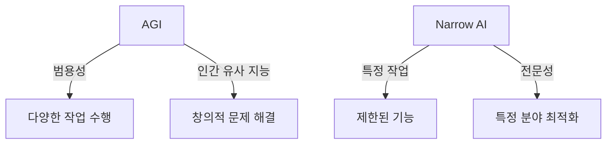
```mermaid
graph TD
    AgiNode["AGI"]
    VariousTasks["다양한 작업 수행"]
    CreativeSolve["창의적 문제 해결"]
    NarrowAi["Narrow AI"]
    LimitedFunc["제한된 기능"]
    DomainOpt["특정 분야 최적화"]
    AgiNode -->|"범용성"| VariousTasks
    AgiNode -->|"인간 유사 지능"| CreativeSolve
    NarrowAi -->|"특정 작업"| LimitedFunc
    NarrowAi -->|"전문성"| DomainOpt
```

이와 같이 AGI는 약인공지능과는 다른 차별화된 특성을 지니고 있으며, 이는 인공지능의 미래에 대한 기대를 더욱 높이고 있다. AGI의 발전은 인류의 삶에 긍정적인 영향을 미칠 것으로 예상되며, 이에 대한 연구와 논의는 계속해서 이어져야 한다.

<!--
## AGI의 발전 단계
   - 2.1. 대화형 AI (Conversational AI)
   - 2.2. 추론 AI (Reasoning AI)
   - 2.3. 자율 AI (Autonomous AI)
   - 2.4. 혁신 AI (Innovating AI)
   - 2.5. 조직 AI (Organizational AI)
-->

## AGI의 발전 단계

인공 일반 지능(AGI)의 발전 단계는 다양한 형태의 AI 기술이 진화하면서 이루어지는 과정이다. 각 단계는 특정한 기능과 목적을 가지고 있으며, AGI의 궁극적인 목표인 인간과 유사한 지능을 구현하기 위한 기초를 제공한다.

**2.1. 대화형 AI (Conversational AI)**

대화형 AI는 인간과의 상호작용을 통해 자연어를 이해하고 응답하는 시스템이다. 이 기술은 고객 서비스, 개인 비서, 교육 등 다양한 분야에서 활용되고 있다. 대화형 AI는 사용자의 질문에 대한 적절한 답변을 제공하고, 대화를 이어가는 능력을 갖추고 있다.

```python
# 대화형 AI의 간단한 예제 코드
import random

responses = {
    "안녕하세요": ["안녕하세요! 어떻게 도와드릴까요?", "안녕하세요! 반갑습니다."],
    "잘 지내요": ["좋아요! 당신은요?", "잘 지내고 있습니다."],
}

def respond(user_input):
    return random.choice(responses.get(user_input, ["죄송합니다, 이해하지 못했습니다."]))

# 사용자 입력 예시
user_input = "안녕하세요"
print(respond(user_input))
```

**2.2. 추론 AI (Reasoning AI)**

추론 AI는 주어진 정보를 바탕으로 논리적 결론을 도출하는 능력을 가진 시스템이다. 이 기술은 문제 해결, 의사 결정, 예측 모델링 등에서 중요한 역할을 한다. 추론 AI는 복잡한 데이터 세트를 분석하고, 패턴을 인식하여 유의미한 결과를 도출할 수 있다.

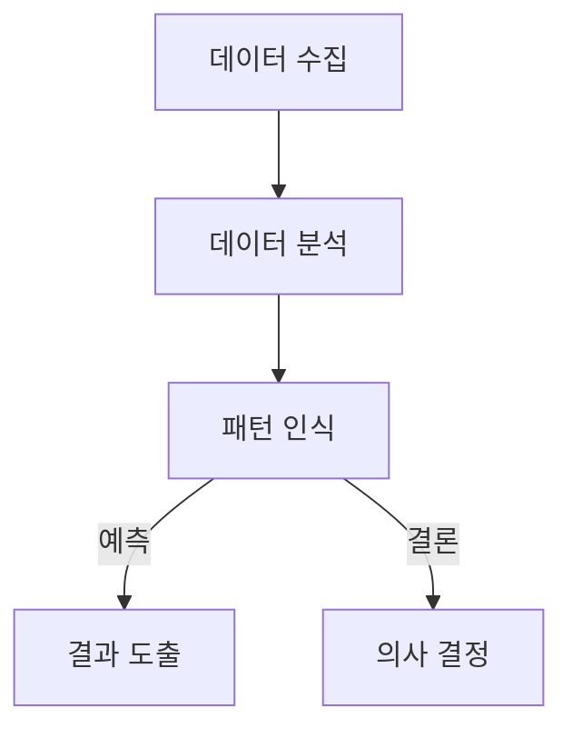
```mermaid
graph TD
    DataCollect["데이터 수집"]
    DataAnalyze["데이터 분석"]
    PatternRec["패턴 인식"]
    ResultOut["결과 도출"]
    Decision["의사 결정"]
    DataCollect --> DataAnalyze
    DataAnalyze --> PatternRec
    PatternRec -->|"예측"| ResultOut
    PatternRec -->|"결론"| Decision
```

**2.3. 자율 AI (Autonomous AI)**

자율 AI는 인간의 개입 없이 스스로 결정을 내리고 행동할 수 있는 시스템이다. 이 기술은 자율주행차, 드론, 로봇 등에서 활용되며, 환경을 인식하고 상황에 맞는 행동을 선택하는 능력을 갖추고 있다. 자율 AI는 복잡한 환경에서도 안전하게 작동할 수 있도록 설계되어야 한다.

**2.4. 혁신 AI (Innovating AI)**

혁신 AI는 새로운 아이디어나 솔루션을 생성하는 능력을 가진 시스템이다. 이 기술은 창의적인 문제 해결, 디자인, 예술 등 다양한 분야에서 활용될 수 있다. 혁신 AI는 기존의 데이터를 바탕으로 새로운 개념을 창출하고, 인간의 창의성을 보완하는 역할을 한다.

**2.5. 조직 AI (Organizational AI)**

조직 AI는 기업이나 조직의 운영을 최적화하고 효율성을 높이는 데 기여하는 시스템이다. 이 기술은 데이터 분석, 프로세스 자동화, 의사 결정 지원 등 다양한 기능을 통해 조직의 성과를 향상시킬 수 있다. 조직 AI는 팀워크와 협업을 촉진하여 조직의 목표 달성을 지원한다.

AGI의 발전 단계는 각기 다른 기술적 요구와 도전 과제를 가지고 있으며, 이러한 단계들이 통합되어 궁극적으로 인공 일반 지능의 실현에 기여하게 된다.

<!--
## AGI의 기술적 기반
   - 3.1. 대규모 언어 모델(LLMs)과 AGI
   - 3.2. Transfer Learning의 역할
   - 3.3. AGI의 신경망 구조
-->

## AGI의 기술적 기반

인공 일반 지능(AGI)의 발전을 위해서는 여러 기술적 기반이 필요하다. 이 섹션에서는 대규모 언어 모델(LLMs), Transfer Learning의 역할, 그리고 AGI의 신경망 구조에 대해 살펴보겠다.

**대규모 언어 모델(LLMs)과 AGI**

대규모 언어 모델(LLMs)은 자연어 처리(Natural Language Processing) 분야에서 중요한 역할을 한다. LLMs는 방대한 양의 텍스트 데이터를 학습하여 언어의 패턴과 구조를 이해하고, 이를 바탕으로 자연스러운 언어 생성 및 이해를 가능하게 한다. AGI의 발전에 있어 LLMs는 인간과 유사한 수준의 언어 이해 및 생성 능력을 제공함으로써, 다양한 분야에서의 응용 가능성을 높인다.

예를 들어, OpenAI의 GPT-3와 같은 모델은 1750억 개의 파라미터를 가지고 있으며, 이는 AGI의 언어적 능력을 향상시키는 데 기여한다. 이러한 모델은 대화형 AI, 정보 검색, 콘텐츠 생성 등 다양한 분야에서 활용될 수 있다.

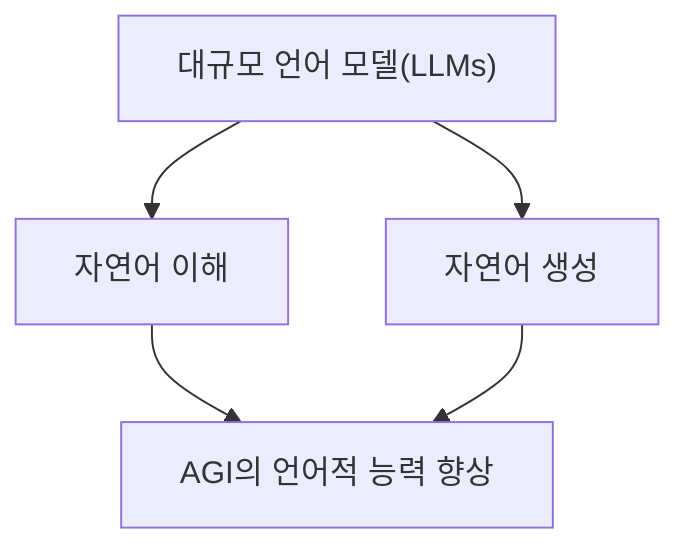
```mermaid
graph TD
    LlmNode["대규모 언어 모델(LLMs)"]
    Nlu["자연어 이해"]
    Nlg["자연어 생성"]
    AgiLang["AGI의 언어적 능력 향상"]
    LlmNode --> Nlu
    LlmNode --> Nlg
    Nlu --> AgiLang
    Nlg --> AgiLang
```

**Transfer Learning의 역할**

Transfer Learning은 한 작업에서 학습한 지식을 다른 작업에 적용하는 기법이다. AGI의 개발에 있어 Transfer Learning은 매우 중요한 역할을 한다. 이는 모델이 특정 작업에서 학습한 정보를 다른 유사한 작업에 쉽게 전이할 수 있도록 하여, 학습 효율성을 높이고 데이터 부족 문제를 해결하는 데 기여한다.

예를 들어, 이미지 인식 모델이 특정 객체를 인식하는 데 학습한 후, 이를 기반으로 다른 객체를 인식하는 데 필요한 추가 학습을 최소화할 수 있다. 이러한 방식은 AGI가 다양한 작업을 수행하는 데 필요한 유연성을 제공한다.

```python
# Transfer Learning 예제 코드
from tensorflow.keras.applications import VGG16
from tensorflow.keras.models import Model

# VGG16 모델 불러오기 (사전 학습된 가중치 사용)
base_model = VGG16(weights='imagenet', include_top=False)

# 새로운 분류기 추가
x = base_model.output
x = Flatten()(x)
x = Dense(256, activation='relu')(x)
predictions = Dense(num_classes, activation='softmax')(x)

# 새로운 모델 생성
model = Model(inputs=base_model.input, outputs=predictions)
```

**AGI의 신경망 구조**

AGI의 신경망 구조는 다양한 형태로 설계될 수 있으며, 이는 AGI의 기능과 성능에 큰 영향을 미친다. 일반적으로 AGI는 여러 층의 신경망으로 구성되며, 각 층은 입력 데이터를 처리하고, 특징을 추출하며, 최종적으로 의사 결정을 내리는 역할을 한다.

AGI의 신경망 구조는 다음과 같은 요소로 구성될 수 있다:

1. **입력층(Input Layer)**: 원시 데이터를 입력받는 층이다.
2. **은닉층(Hidden Layers)**: 입력 데이터를 처리하고 특징을 추출하는 여러 층이다.
3. **출력층(Output Layer)**: 최종 결과를 출력하는 층이다.

AGI의 신경망 구조는 복잡한 문제를 해결하기 위해 다양한 아키텍처를 사용할 수 있으며, 이는 AGI의 성능을 극대화하는 데 기여한다.

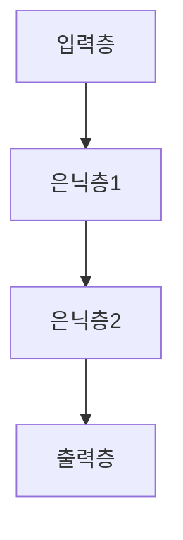
```mermaid
graph TD
    InputLayer["입력층"]
    Hidden1["은닉층1"]
    Hidden2["은닉층2"]
    OutputLayer["출력층"]
    InputLayer --> Hidden1
    Hidden1 --> Hidden2
    Hidden2 --> OutputLayer
```

이와 같이 AGI의 기술적 기반은 대규모 언어 모델, Transfer Learning, 신경망 구조 등 다양한 요소로 구성되어 있으며, 이는 AGI의 발전과 응용 가능성을 높이는 데 중요한 역할을 한다.

<!--
## AGI의 응용 사례
   - 4.1. 비즈니스에서의 AGI 활용
   - 4.2. 의료 분야에서의 AGI
   - 4.3. 교육 및 학습에서의 AGI
-->

## AGI의 응용 사례

인공 일반 지능(AGI)은 다양한 분야에서 혁신적인 변화를 가져올 수 있는 잠재력을 지니고 있다. 이 섹션에서는 비즈니스, 의료, 교육 및 학습 분야에서 AGI의 활용 사례를 살펴보겠다.

**4.1. 비즈니스에서의 AGI 활용**

AGI는 비즈니스 환경에서 의사결정 지원, 고객 서비스, 데이터 분석 등 여러 방면에서 활용될 수 있다. 예를 들어, AGI 기반의 시스템은 고객의 요구를 이해하고, 맞춤형 솔루션을 제공함으로써 고객 만족도를 높일 수 있다. 또한, AGI는 대량의 데이터를 분석하여 시장 트렌드를 예측하고, 기업의 전략적 결정을 지원할 수 있다.

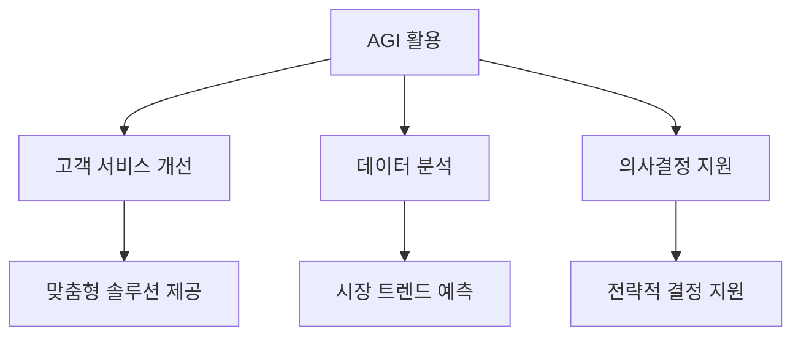
```mermaid
graph TD
    AgiUse["AGI 활용"]
    CustSvc["고객 서비스 개선"]
    DataAna["데이터 분석"]
    DecisionSupport["의사결정 지원"]
    CustomSol["맞춤형 솔루션 제공"]
    MarketPred["시장 트렌드 예측"]
    StrategyDec["전략적 결정 지원"]
    AgiUse --> CustSvc
    AgiUse --> DataAna
    AgiUse --> DecisionSupport
    CustSvc --> CustomSol
    DataAna --> MarketPred
    DecisionSupport --> StrategyDec
```

**4.2. 의료 분야에서의 AGI**

의료 분야에서도 AGI는 큰 변화를 가져올 수 있다. AGI는 환자의 데이터를 분석하여 진단을 지원하고, 치료 계획을 제안하는 데 활용될 수 있다. 예를 들어, AGI는 환자의 유전자 정보를 분석하여 개인 맞춤형 치료를 제공할 수 있으며, 이를 통해 치료의 효율성을 높일 수 있다. 또한, AGI는 의료 연구에 있어서도 새로운 발견을 이끌어낼 수 있는 가능성을 지니고 있다.

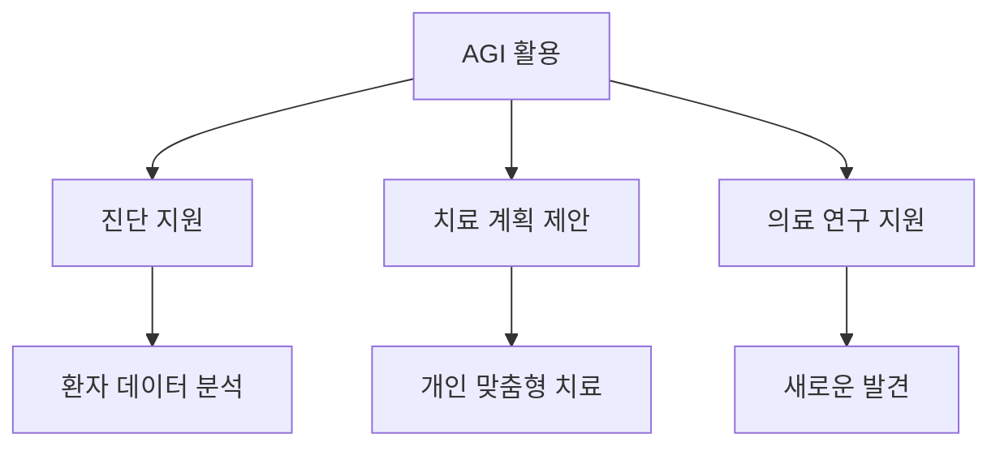
```mermaid
graph TD
    AgiMed["AGI 활용"]
    DiagSupport["진단 지원"]
    TreatmentPlan["치료 계획 제안"]
    ResearchSupport["의료 연구 지원"]
    PatientData["환자 데이터 분석"]
    PersonalRx["개인 맞춤형 치료"]
    NewFindings["새로운 발견"]
    AgiMed --> DiagSupport
    AgiMed --> TreatmentPlan
    AgiMed --> ResearchSupport
    DiagSupport --> PatientData
    TreatmentPlan --> PersonalRx
    ResearchSupport --> NewFindings
```

**4.3. 교육 및 학습에서의 AGI**

AGI는 교육 및 학습 분야에서도 혁신적인 변화를 가져올 수 있다. AGI 기반의 학습 시스템은 학생의 학습 스타일과 진도를 분석하여 개인 맞춤형 학습 경로를 제공할 수 있다. 또한, AGI는 교육 콘텐츠를 자동으로 생성하고, 학생의 질문에 실시간으로 답변함으로써 학습 효과를 극대화할 수 있다. 이러한 방식으로 AGI는 교육의 접근성과 효율성을 높이는 데 기여할 수 있다.

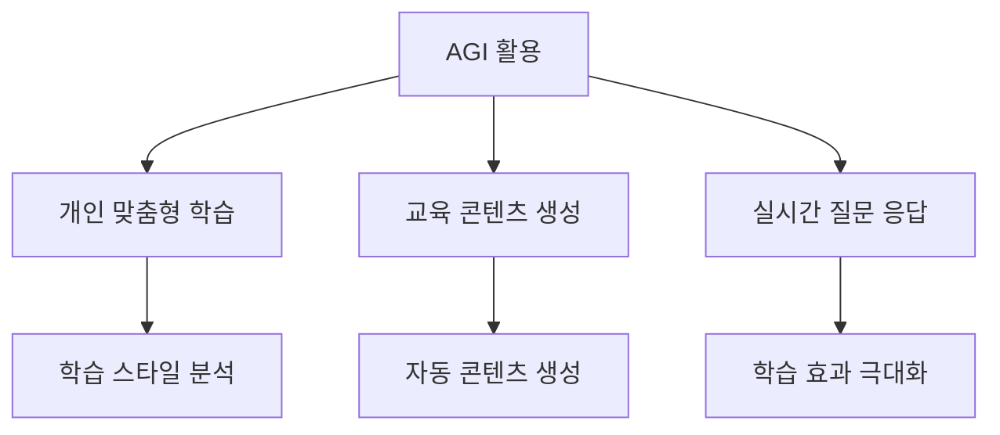
```mermaid
graph TD
    AgiEdu["AGI 활용"]
    PersonalLearn["개인 맞춤형 학습"]
    ContentGen["교육 콘텐츠 생성"]
    RealtimeQ["실시간 질문 응답"]
    StyleAnalyze["학습 스타일 분석"]
    AutoContent["자동 콘텐츠 생성"]
    EffectMax["학습 효과 극대화"]
    AgiEdu --> PersonalLearn
    AgiEdu --> ContentGen
    AgiEdu --> RealtimeQ
    PersonalLearn --> StyleAnalyze
    ContentGen --> AutoContent
    RealtimeQ --> EffectMax
```

AGI는 비즈니스, 의료, 교육 등 다양한 분야에서 그 가능성을 보여주고 있으며, 앞으로의 발전이 기대된다. 이러한 응용 사례들은 AGI가 우리의 삶을 어떻게 변화시킬 수 있는지를 잘 보여준다.

<!--
## AGI의 윤리적 고려사항
   - 5.1. AI의 윤리적 사용
   - 5.2. 일자리 변화와 사회적 영향
   - 5.3. AI 안전성 및 규제
-->

## AGI의 윤리적 고려사항

인공 일반 지능(AGI)의 발전은 많은 기대를 모으고 있지만, 그에 따른 윤리적 고려사항도 무시할 수 없다. AGI의 윤리적 사용, 일자리 변화와 사회적 영향, AI 안전성 및 규제는 중요한 이슈로 부각되고 있다.

**AI의 윤리적 사용**

AGI의 윤리적 사용은 기술이 인간의 삶에 미치는 영향을 고려해야 한다. AI 시스템이 공정하고 투명하게 작동하도록 보장하는 것이 중요하다. 예를 들어, AGI가 의사결정 과정에 개입할 때, 그 과정이 어떻게 이루어지는지에 대한 명확한 기준이 필요하다. 이를 위해 AI의 결정 과정이 설명 가능해야 하며, 편향(bias)을 최소화하는 방법이 강구되어야 한다.

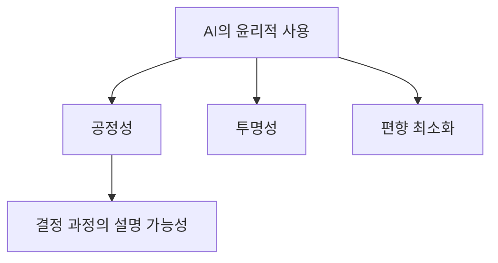
```mermaid
graph TD
    EthicsUse["AI의 윤리적 사용"]
    Fairness["공정성"]
    Transparency["투명성"]
    BiasMin["편향 최소화"]
    Explainability["결정 과정의 설명 가능성"]
    EthicsUse --> Fairness
    EthicsUse --> Transparency
    EthicsUse --> BiasMin
    Fairness --> Explainability
```

**일자리 변화와 사회적 영향**

AGI의 도입은 일자리의 변화와 사회적 영향을 초래할 것이다. 자동화가 진행됨에 따라 일부 직업은 사라질 수 있으며, 새로운 직업이 생겨날 가능성도 있다. 이러한 변화는 노동 시장에 큰 영향을 미치며, 이에 대한 사회적 준비가 필요하다. 정부와 기업은 재교육 프로그램을 통해 노동자들이 새로운 기술에 적응할 수 있도록 지원해야 한다.

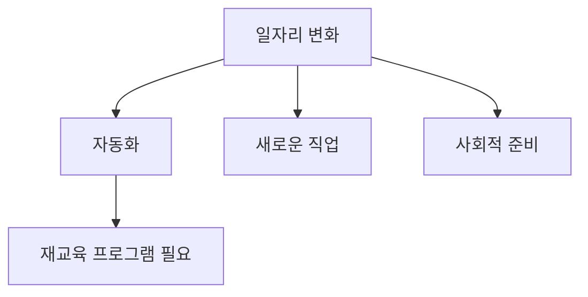
```mermaid
graph TD
    JobChange["일자리 변화"]
    Automation["자동화"]
    NewJobs["새로운 직업"]
    SocialPrep["사회적 준비"]
    Retrain["재교육 프로그램 필요"]
    JobChange --> Automation
    JobChange --> NewJobs
    JobChange --> SocialPrep
    Automation --> Retrain
```

**AI 안전성 및 규제**

AGI의 안전성은 기술이 잘못 사용되거나 오작동할 경우 발생할 수 있는 위험을 최소화하는 것을 의미한다. 따라서 AGI 시스템의 개발과 운영에 있어 규제가 필요하다. 이는 기술의 발전을 저해하지 않으면서도 안전성을 보장할 수 있는 균형을 찾아야 한다. 규제 기관은 AGI의 개발과 사용에 대한 명확한 가이드라인을 제시해야 하며, 이를 통해 사회가 AGI의 혜택을 안전하게 누릴 수 있도록 해야 한다.

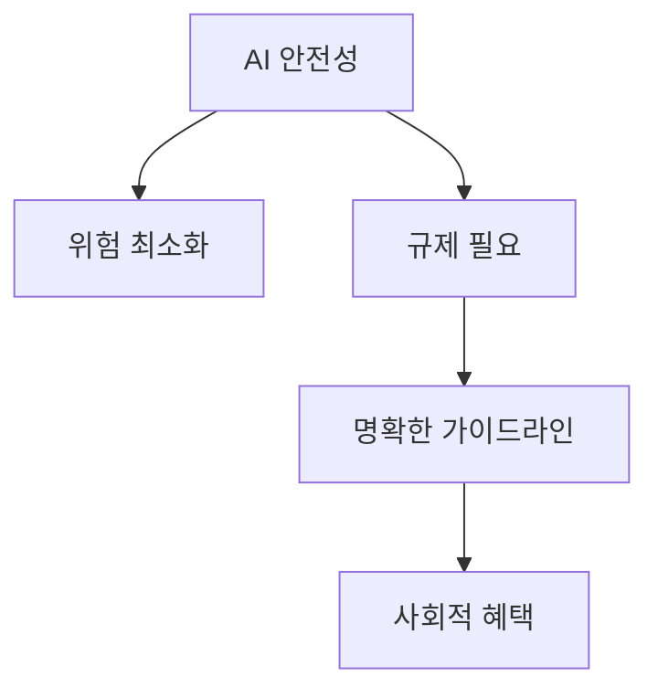
```mermaid
graph TD
    SafetyNode["AI 안전성"]
    RiskMin["위험 최소화"]
    RegNeed["규제 필요"]
    Guidelines["명확한 가이드라인"]
    SocialBenefit["사회적 혜택"]
    SafetyNode --> RiskMin
    SafetyNode --> RegNeed
    RegNeed --> Guidelines
    Guidelines --> SocialBenefit
```

AGI의 윤리적 고려사항은 기술 발전과 함께 지속적으로 논의되어야 하며, 이를 통해 인류가 안전하고 공정한 방식으로 AGI를 활용할 수 있는 기반을 마련해야 한다.

<!--
## AGI의 미래 전망
   - 6.1. AGI 개발의 도전과제
   - 6.2. AGI가 가져올 혁신적 변화
   - 6.3. AGI와 인류의 공존 가능성
-->

## AGI의 미래 전망

인공 일반 지능(AGI)의 발전은 인류의 미래에 중대한 영향을 미칠 것으로 예상된다. 이 섹션에서는 AGI 개발의 도전과제, AGI가 가져올 혁신적 변화, 그리고 AGI와 인류의 공존 가능성에 대해 논의할 것이다.

**6.1. AGI 개발의 도전과제**

AGI 개발에는 여러 가지 도전과제가 존재한다. 첫째, 기술적 도전이 있다. AGI는 인간의 지능을 모방해야 하므로, 복잡한 문제 해결 능력, 창의성, 그리고 감정 인식 등을 포함해야 한다. 이러한 기능을 구현하기 위해서는 고도화된 알고리즘과 대규모 데이터셋이 필요하다.

둘째, 윤리적 및 사회적 도전이 있다. AGI의 발전은 일자리의 변화, 개인 정보 보호, 그리고 AI의 윤리적 사용과 같은 문제를 동반한다. 이러한 문제를 해결하기 위해서는 사회적 합의와 규제가 필요하다.

셋째, 안전성 문제도 중요한 도전과제이다. AGI가 잘못된 결정을 내리거나 예기치 않은 행동을 할 경우, 그 결과는 심각할 수 있다. 따라서 AGI의 안전성을 보장하기 위한 연구가 필수적이다.

**6.2. AGI가 가져올 혁신적 변화**

AGI는 다양한 분야에서 혁신적 변화를 가져올 것으로 기대된다. 예를 들어, 비즈니스 분야에서는 AGI가 데이터 분석과 의사결정을 자동화하여 효율성을 극대화할 수 있다. 의료 분야에서는 AGI가 진단 및 치료 계획을 수립하는 데 도움을 줄 수 있으며, 이는 환자의 생존율을 높이는 데 기여할 것이다.

교육 분야에서도 AGI는 개인 맞춤형 학습 경험을 제공하여 학습 효과를 극대화할 수 있다. AGI는 학생의 학습 스타일과 진도를 분석하여 최적의 학습 경로를 제시할 수 있다.

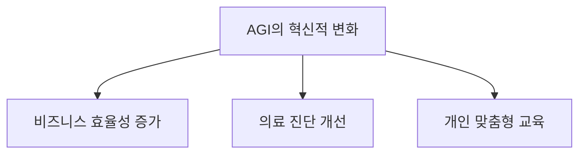
```mermaid
graph TD
    InnovChange["AGI의 혁신적 변화"]
    BizEff["비즈니스 효율성 증가"]
    MedDiag["의료 진단 개선"]
    CustomEdu["개인 맞춤형 교육"]
    InnovChange --> BizEff
    InnovChange --> MedDiag
    InnovChange --> CustomEdu
```

**6.3. AGI와 인류의 공존 가능성**

AGI와 인류의 공존은 중요한 주제이다. AGI가 인간의 삶을 향상시키는 도구로 작용할 수 있다면, 인류와 AGI는 상호 보완적인 관계를 형성할 수 있다. 그러나 AGI가 인간의 역할을 대체하거나, 인간의 통제를 벗어날 경우, 심각한 사회적 갈등이 발생할 수 있다.

따라서 AGI와 인류의 공존을 위해서는 AGI의 개발 과정에서 윤리적 기준과 사회적 책임을 고려해야 한다. AGI가 인간의 가치와 목표를 존중하며 발전할 수 있도록 하는 것이 중요하다. 이를 위해서는 다양한 이해관계자들이 참여하는 논의와 협력이 필요하다. 

결론적으로, AGI의 미래는 도전과 기회가 공존하는 복잡한 상황이다. AGI의 발전이 인류에게 긍정적인 영향을 미치기 위해서는 기술적, 윤리적, 사회적 측면에서의 지속적인 노력이 필요하다.

<!--
## 예제
   - 7.1. AGI 모델의 실제 사례
   - 7.2. AGI를 활용한 프로젝트 예시
-->

## 예제

**7.1. AGI 모델의 실제 사례**

인공 일반 지능(AGI) 모델은 다양한 분야에서 실제로 활용되고 있다. 그 중 하나는 대화형 AI 시스템이다. 이러한 시스템은 사용자의 질문에 대해 자연스럽고 유의미한 답변을 제공할 수 있는 능력을 갖추고 있다. 예를 들어, OpenAI의 ChatGPT는 대화형 AI의 대표적인 사례로, 사용자의 요청에 따라 다양한 주제에 대해 대화할 수 있는 능력을 보여준다.

또한, AGI 모델은 의료 분야에서도 활용되고 있다. IBM의 Watson은 환자의 데이터를 분석하고, 진단 및 치료 방법을 제안하는 데 사용된다. 이러한 시스템은 방대한 양의 의료 데이터를 처리하여 의사결정을 지원하는 데 큰 도움을 준다.

다음은 AGI 모델의 작동 방식을 간단히 나타낸 다이어그램이다.

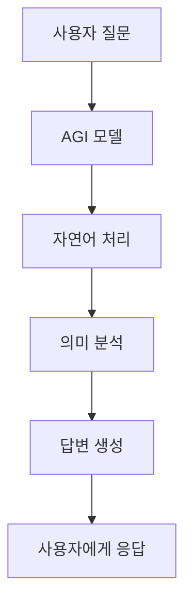
```mermaid
graph TD
    UserQuery["사용자 질문"]
    AgiModel["AGI 모델"]
    NlpStep["자연어 처리"]
    SemAnalyze["의미 분석"]
    AnswerGen["답변 생성"]
    UserResp["사용자에게 응답"]
    UserQuery --> AgiModel
    AgiModel --> NlpStep
    NlpStep --> SemAnalyze
    SemAnalyze --> AnswerGen
    AnswerGen --> UserResp
```

**7.2. AGI를 활용한 프로젝트 예시**

AGI를 활용한 프로젝트는 여러 가지 형태로 진행되고 있다. 예를 들어, 교육 분야에서는 개인 맞춤형 학습 시스템이 개발되고 있다. 이러한 시스템은 학생의 학습 스타일과 진도를 분석하여 최적의 학습 경로를 제시한다. 

또한, 비즈니스 환경에서는 AGI를 활용한 고객 서비스 챗봇이 도입되고 있다. 이 챗봇은 고객의 질문에 실시간으로 응답하고, 문제를 해결하는 데 도움을 준다. 이러한 시스템은 고객 만족도를 높이고, 운영 비용을 절감하는 데 기여하고 있다.

아래는 AGI를 활용한 프로젝트의 흐름을 나타낸 다이어그램이다.

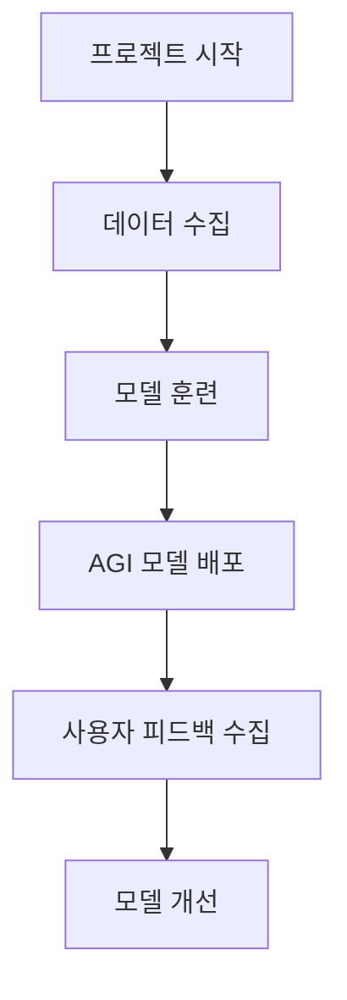
```mermaid
graph TD
    ProjStart["프로젝트 시작"]
    DataGather["데이터 수집"]
    ModelTrain["모델 훈련"]
    ModelDeploy["AGI 모델 배포"]
    FeedbackCollect["사용자 피드백 수집"]
    ModelImprove["모델 개선"]
    ProjStart --> DataGather
    DataGather --> ModelTrain
    ModelTrain --> ModelDeploy
    ModelDeploy --> FeedbackCollect
    FeedbackCollect --> ModelImprove
```

이와 같이 AGI는 다양한 분야에서 실제 사례와 프로젝트를 통해 그 가능성을 보여주고 있으며, 앞으로도 더욱 발전할 것으로 기대된다.

<!--
## FAQ
   - AGI와 AI의 차이는 무엇인가요?
   - AGI가 실현되면 어떤 변화가 있을까요?
   - AGI의 개발에 있어 가장 큰 도전은 무엇인가요?
-->

## FAQ

**AGI와 AI의 차이는 무엇인가요?**  

AGI(Artificial General Intelligence)와 AI(Artificial Intelligence)는 서로 다른 개념이다. AI는 특정 작업을 수행하는 데 최적화된 시스템으로, 약인공지능(Narrow AI)이라고도 불린다. 반면 AGI는 인간과 유사한 수준의 지능을 갖춘 시스템으로, 다양한 작업을 수행할 수 있는 능력을 지닌다. AGI는 특정 분야에 국한되지 않고, 여러 분야에서의 문제 해결 능력을 요구한다. 

예를 들어, Narrow AI는 이미지 인식, 음성 인식 등 특정 작업에 특화되어 있지만, AGI는 이러한 작업을 포함하여 새로운 문제를 스스로 학습하고 해결할 수 있는 능력을 갖추고 있다.

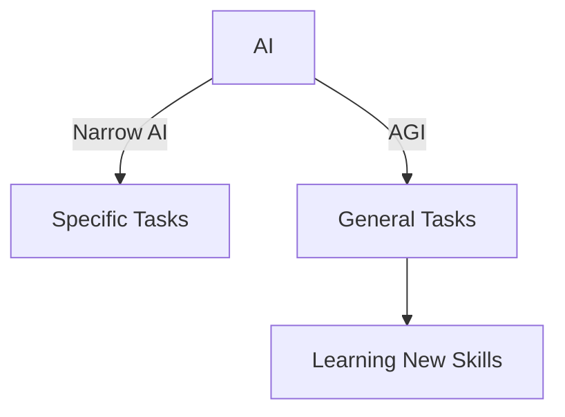
```mermaid
graph TD
    AiRoot["AI"]
    SpecificTasks["Specific Tasks"]
    GeneralTasks["General Tasks"]
    LearnNew["Learning New Skills"]
    AiRoot -->|"Narrow AI"| SpecificTasks
    AiRoot -->|"AGI"| GeneralTasks
    GeneralTasks --> LearnNew
```

**AGI가 실현되면 어떤 변화가 있을까요?** 

AGI의 실현은 여러 분야에 걸쳐 혁신적인 변화를 가져올 것으로 예상된다. 첫째, 비즈니스 환경에서는 AGI가 데이터 분석, 의사결정 지원, 고객 서비스 등에서 효율성을 극대화할 수 있다. 둘째, 의료 분야에서는 AGI가 진단 및 치료 계획 수립에 도움을 줄 수 있으며, 개인 맞춤형 의료 서비스를 제공할 수 있다. 셋째, 교육 분야에서는 AGI가 학습자의 수준에 맞춘 맞춤형 교육을 제공하고, 학습 효율성을 높일 수 있다.

이러한 변화는 사회 전반에 걸쳐 일자리의 형태와 역할을 변화시킬 것이며, 새로운 직업군이 생겨날 가능성도 있다.

**AGI의 개발에 있어 가장 큰 도전은 무엇인가요?**  

AGI 개발의 가장 큰 도전은 기술적, 윤리적, 사회적 문제를 모두 해결해야 한다는 점이다. 기술적으로는 AGI가 인간과 유사한 수준의 지능을 갖추기 위해서는 복잡한 신경망 구조와 대규모 데이터가 필요하다. 또한, AGI의 안전성과 신뢰성을 보장하기 위한 연구가 필수적이다.

윤리적 측면에서는 AGI의 결정이 인간의 가치와 윤리에 부합해야 하며, 사회적 영향에 대한 고려가 필요하다. AGI가 일자리를 대체할 경우, 이에 대한 사회적 합의와 정책 마련이 중요하다. 이러한 도전 과제를 해결하기 위해서는 다양한 분야의 전문가들이 협력하여 연구하고 논의해야 한다.

<!--
## 관련 기술
   - 9.1. 머신러닝(Machine Learning)
   - 9.2. 딥러닝(Deep Learning)
   - 9.3. 자연어 처리(Natural Language Processing)
-->

## 관련 기술

인공 일반 지능(AGI)의 발전을 위해서는 여러 관련 기술들이 필수적이다. 이 섹션에서는 머신러닝, 딥러닝, 자연어 처리의 개념과 이들이 AGI와 어떻게 연결되는지를 살펴보겠다.

**머신러닝(Machine Learning)**

머신러닝은 데이터로부터 학습하여 예측이나 결정을 내리는 알고리즘을 개발하는 분야이다. 머신러닝은 AGI의 기초가 되는 기술로, 다양한 데이터에서 패턴을 인식하고 이를 기반으로 새로운 데이터를 처리하는 능력을 제공한다. 머신러닝의 주요 알고리즘으로는 회귀 분석(Regression), 의사결정 나무(Decision Trees), 서포트 벡터 머신(Support Vector Machines) 등이 있다.

샘플 코드로는 Python의 Scikit-learn 라이브러리를 사용한 간단한 회귀 분석 예제를 들 수 있다.

```python
import numpy as np
from sklearn.model_selection import train_test_split
from sklearn.linear_model import LinearRegression

# 데이터 생성
X = np.array([[1], [2], [3], [4], [5]])
y = np.array([2, 3, 5, 7, 11])

# 데이터 분할
X_train, X_test, y_train, y_test = train_test_split(X, y, test_size=0.2, random_state=42)

# 모델 학습
model = LinearRegression()
model.fit(X_train, y_train)

# 예측
predictions = model.predict(X_test)
print(predictions)
```

**딥러닝(Deep Learning)**

딥러닝은 인공신경망(Artificial Neural Networks)을 기반으로 한 머신러닝의 한 분야로, 복잡한 데이터의 패턴을 인식하는 데 뛰어난 성능을 보인다. AGI의 발전에 있어 딥러닝은 이미지 인식, 음성 인식, 자연어 처리 등 다양한 분야에서 중요한 역할을 한다. 특히, 대규모 데이터셋을 처리할 수 있는 능력 덕분에 AGI의 학습 효율성을 크게 향상시킬 수 있다.

다음은 간단한 딥러닝 모델을 구축하는 예제 코드이다.

```python
import tensorflow as tf
from tensorflow import keras

# 데이터셋 로드
mnist = keras.datasets.mnist
(X_train, y_train), (X_test, y_test) = mnist.load_data()

# 데이터 전처리
X_train = X_train / 255.0
X_test = X_test / 255.0

# 모델 정의
model = keras.Sequential([
    keras.layers.Flatten(input_shape=(28, 28)),
    keras.layers.Dense(128, activation='relu'),
    keras.layers.Dense(10, activation='softmax')
])

# 모델 컴파일
model.compile(optimizer='adam', loss='sparse_categorical_crossentropy', metrics=['accuracy'])

# 모델 학습
model.fit(X_train, y_train, epochs=5)

# 모델 평가
test_loss, test_acc = model.evaluate(X_test, y_test)
print('Test accuracy:', test_acc)
```

**자연어 처리(Natural Language Processing)**

자연어 처리는 컴퓨터가 인간의 언어를 이해하고 해석하는 기술이다. AGI의 발전에 있어 자연어 처리는 필수적인 요소로, 인간과의 상호작용을 가능하게 한다. 자연어 처리 기술은 텍스트 분석, 기계 번역, 감정 분석 등 다양한 분야에서 활용된다. 최근에는 Transformer 모델과 같은 혁신적인 아키텍처가 등장하여 자연어 처리의 성능을 크게 향상시켰다.

다음은 자연어 처리를 위한 간단한 텍스트 전처리 예제이다.

```python
import nltk
from nltk.tokenize import word_tokenize

# NLTK 데이터 다운로드
nltk.download('punkt')

# 텍스트 데이터
text = "AGI는 인공지능의 미래를 이끌 기술이다."

# 단어 토큰화
tokens = word_tokenize(text)
print(tokens)
```

이와 같이 머신러닝, 딥러닝, 자연어 처리는 AGI의 발전에 있어 중요한 기술적 기반을 제공하며, 이들 기술의 발전이 AGI의 실현 가능성을 높이고 있다.

<!--
## 결론
   - AGI의 중요성과 미래에 대한 기대
   - AGI 연구의 지속적인 필요성
-->

## 결론

**AGI의 중요성과 미래에 대한 기대**  

인공 일반 지능(AGI)은 인류의 미래에 중대한 영향을 미칠 기술로 자리 잡고 있다. AGI는 인간과 유사한 수준의 인지 능력을 갖춘 시스템으로, 다양한 분야에서 혁신을 이끌어낼 잠재력을 지니고 있다. 예를 들어, AGI는 복잡한 문제 해결, 창의적인 작업 수행, 그리고 인간과의 자연스러운 상호작용을 가능하게 하여, 비즈니스, 의료, 교육 등 여러 분야에서 효율성을 극대화할 수 있다. 이러한 가능성은 AGI가 단순한 도구를 넘어, 인간의 삶을 향상시키는 동반자로 자리매김할 수 있음을 시사한다.

AGI의 발전은 또한 사회적, 경제적 변화를 가져올 것으로 예상된다. AGI가 실현되면, 일자리의 형태가 변화하고 새로운 산업이 등장할 것이며, 이는 인류의 삶의 질을 높이는 데 기여할 것이다. 그러나 이러한 변화는 동시에 윤리적, 사회적 도전 과제를 동반할 수 있으므로, AGI의 개발과 활용에 있어 신중한 접근이 필요하다.

**AGI 연구의 지속적인 필요성**  

AGI의 발전은 단순히 기술적 진보에 그치지 않고, 인류의 미래를 형성하는 중요한 요소로 작용할 것이다. 따라서 AGI 연구는 지속적으로 이루어져야 하며, 이를 통해 AGI의 안전성, 윤리성, 그리고 사회적 수용성을 확보해야 한다. AGI의 연구는 다양한 분야의 전문가들이 협력하여 이루어져야 하며, 이는 기술적 진보뿐만 아니라 사회적 합의와 규제의 필요성을 반영하는 과정이기도 하다.

AGI 연구의 지속적인 필요성을 강조하기 위해, 다음과 같은 다이어그램을 통해 AGI 연구의 주요 요소를 시각적으로 표현할 수 있다.

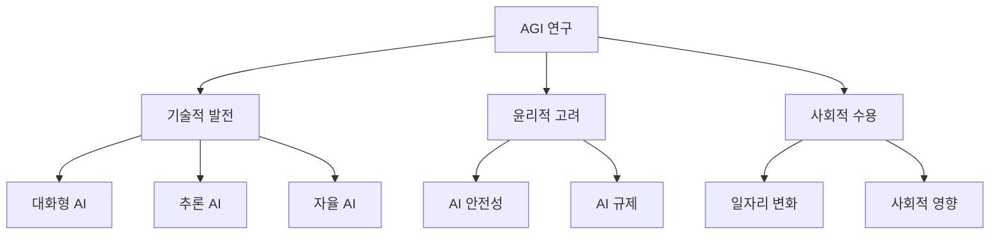
```mermaid
graph TD
    ResearchNode["AGI 연구"]
    TechProgress["기술적 발전"]
    EthicsConsider["윤리적 고려"]
    SocialAccept["사회적 수용"]
    ConversationalAi["대화형 AI"]
    ReasoningAi["추론 AI"]
    AutonomousAi["자율 AI"]
    AiSafety["AI 안전성"]
    AiRegulation["AI 규제"]
    JobShift["일자리 변화"]
    SocialImpact["사회적 영향"]
    ResearchNode --> TechProgress
    ResearchNode --> EthicsConsider
    ResearchNode --> SocialAccept
    TechProgress --> ConversationalAi
    TechProgress --> ReasoningAi
    TechProgress --> AutonomousAi
    EthicsConsider --> AiSafety
    EthicsConsider --> AiRegulation
    SocialAccept --> JobShift
    SocialAccept --> SocialImpact
```

이 다이어그램은 AGI 연구가 기술적 발전, 윤리적 고려, 그리고 사회적 수용이라는 세 가지 주요 요소로 구성되어 있음을 보여준다. 이러한 요소들은 AGI의 성공적인 발전과 사회적 통합을 위해 필수적이다. AGI의 미래는 이러한 연구와 논의의 결과에 달려 있으며, 인류가 AGI와 함께 공존할 수 있는 길을 모색해야 한다.

<!--
## 참고 자료
   - 관련 논문 및 연구 자료
   - AGI 관련 서적 및 웹사이트
-->

## 참고 자료

**AGI 관련 서적 및 웹사이트**  
AGI에 대한 심층적인 이해를 위해 다음의 서적과 웹사이트를 추천한다.

1. **"Superintelligence: Paths, Dangers, Strategies" by Nick Bostrom**  
   AGI의 미래와 그에 따른 위험 요소를 다룬 책으로, AGI의 발전이 인류에 미치는 잠재적 영향을 탐구한다.

2. **"Artificial General Intelligence" by Ben Goertzel and Cassio Pennachin**  
   AGI의 이론과 실제 사례를 다룬 포괄적인 서적이다. AGI의 다양한 접근 방식과 기술적 기초를 이해하는 데 도움이 된다.

3. **AGI Society (https://www.agi-society.org)**  
   AGI 연구자와 개발자들이 모여 AGI의 발전을 논의하고 정보를 공유하는 플랫폼이다. 최신 연구 결과와 이벤트 정보를 확인할 수 있다.

4. **OpenAI (https://www.openai.com)**  
   AGI 연구에 대한 다양한 자료와 프로젝트를 제공하는 웹사이트로, AGI의 발전 방향과 기술적 기반에 대한 정보를 얻을 수 있다.

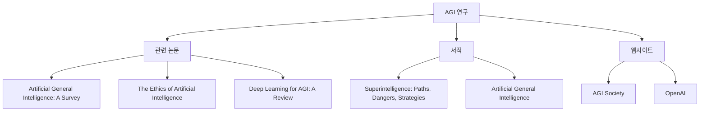
```mermaid
graph TD
    AgiResearch["AGI 연구"]
    Papers["관련 논문"]
    Books["서적"]
    Websites["웹사이트"]
    SurveyPaper["Artificial General Intelligence: A Survey"]
    EthicsPaper["The Ethics of Artificial Intelligence"]
    DeepReview["Deep Learning for AGI: A Review"]
    BostromBook["Superintelligence: Paths, Dangers, Strategies"]
    GoertzelBook["Artificial General Intelligence"]
    AgiSociety["AGI Society"]
    OpenAiSite["OpenAI"]
    AgiResearch --> Papers
    AgiResearch --> Books
    AgiResearch --> Websites
    Papers --> SurveyPaper
    Papers --> EthicsPaper
    Papers --> DeepReview
    Books --> BostromBook
    Books --> GoertzelBook
    Websites --> AgiSociety
    Websites --> OpenAiSite
```

위의 자료들은 AGI에 대한 깊이 있는 이해를 돕고, 연구 및 개발에 있어 유용한 참고 자료가 될 것이다. AGI의 발전을 위해 지속적인 학습과 연구가 필요하다.

<!--
##### Reference #####
-->

## Reference

1. **OpenAI** — [OpenAI 공식 사이트](https://www.openai.com): AGI 연구·제품·논문 소개.
2. **Google DeepMind** — [Levels of AGI for Operationalizing Progress on the Path to AGI](https://deepmind.google/research/publications/66938/): AGI 단계 분류 프레임워크(성능·일반성·자율성), 벤치마크 요구사항.
3. **연합뉴스** — [오픈AI "현재 AI기술, AGI로 가는 5단계 중 2단계 직전 수준"](https://www.yna.co.kr/view/AKR20240712054300009): OpenAI 5단계 분류체계 보도(2024.07).
4. **Nick Bostrom** — *Superintelligence: Paths, Dangers, Strategies*: AGI·초지능 위험과 전략.
5. **Ben Goertzel & Cassio Pennachin** — *Artificial General Intelligence*: AGI 이론과 접근법.
