정규 표현식(Regular Expressions)은 텍스트 처리에서 매우 유용한 도구이다. 특히 .NET 환경에서 정규 표현식 엔진은 패턴 매칭을 통해 텍스트를 처리하는 강력한 기능을 제공한다. 그러나 정규 표현식의 성능은 입력 데이터의 특성과 패턴의 복잡성에 따라 크게 달라질 수 있다. 이 글에서는 정규 표현식의 성능을 최적화하기 위한 몇 가지 모범 사례를 소개하고자 한다. 첫째, 입력 소스를 고려해야 한다. 입력이 신뢰할 수 있는 경우와 그렇지 않은 경우에 따라 정규 표현식 패턴을 다르게 설계해야 한다. 둘째, 정규 표현식의 백트래킹을 최소화하는 것이 중요하다. 백트래킹이 과도하게 발생하면 성능 저하를 초래할 수 있다. 셋째, 정규 표현식 객체의 인스턴스를 재사용하여 성능을 향상시킬 수 있다. 정적 메서드를 사용하거나, 정규 표현식 객체를 미리 컴파일하여 사용하는 것이 좋다. 넷째, 정규 표현식의 패턴을 최적화하여 불필요한 캡처를 피하고, 가능한 한 구체적인 문자 클래스를 사용하는 것이 성능을 높이는 데 도움이 된다. 마지막으로, 정규 표현식의 타임아웃 값을 설정하여 과도한 백트래킹으로 인한 성능 저하를 방지할 수 있다. 이러한 기법들을 통해 개발자는 정규 표현식의 성능을 극대화하고, 보다 효율적인 텍스트 처리를 구현할 수 있다.


||
|:---:|
||


<!--
##### Outline #####
-->

<!--
# 정규 표현식 최적화를 위한 .NET의 모범 사례

## 개요
- 정규 표현식의 중요성
- .NET에서의 정규 표현식 엔진 개요
- 성능 문제의 원인

## 입력 소스 고려하기
- 제약된 입력 vs 비제약 입력
- 정규 표현식 패턴 작성 시 고려사항
- 비제약 입력 처리의 중요성

## 객체 인스턴스화 적절히 처리하기
- `System.Text.RegularExpressions.Regex` 클래스 소개
- 정규 표현식 객체의 성능에 미치는 영향
- 정적 메서드 호출 vs 인스턴스 메서드 호출

## 정적 정규 표현식
- 정적 메서드 사용의 장점
- 성능 개선 사례

## 해석된 정규 표현식 vs 소스 생성 정규 표현식 vs 컴파일된 정규 표현식
- 각 정규 표현식 유형의 특징
- 성능 비교 및 사용 권장 사항

## 백트래킹 관리하기
- 백트래킹의 개념과 성능에 미치는 영향
- 백트래킹을 피하는 방법
- 타임아웃 값 사용하기

## 필요할 때만 캡처하기
- 그룹화 구조의 사용과 성능 비용
- 캡처를 비활성화하는 방법

## 스레드 안전성
- `Regex` 클래스의 스레드 안전성
- 결과 객체의 스레드 안전성 관리

## 관련 기술
- 정규 표현식 성능 최적화 기법
  - 문자 클래스 사용
  - 소유적 수량자 및 원자 그룹
  - 게으른 수량자
  - 앵커 및 경계 사용
  - 정규 표현식의 순서 최적화
- 정규 표현식 성능 벤치마킹 방법

## FAQ
- 정규 표현식의 성능을 개선하기 위한 일반적인 질문
- 정규 표현식에서 자주 발생하는 성능 문제와 해결 방법

## 결론
- 정규 표현식 최적화의 중요성
- 성능 개선을 위한 지속적인 테스트와 벤치마킹의 필요성
- 정규 표현식 사용 시 주의사항 및 모범 사례 요약

## 추가 자료
- [정규 표현식 동작의 세부 사항](details-of-regular-expression-behavior)
- [백트래킹](backtracking-in-regular-expressions)
- [정규 표현식 언어 - 빠른 참조](regular-expression-language-quick-reference) 

이 목차는 정규 표현식의 성능 최적화에 대한 포괄적인 가이드를 제공하며, 각 섹션은 관련된 기술과 모범 사례를 포함하여 독자가 실질적인 정보를 얻을 수 있도록 구성되었습니다.
-->

<!--
## 개요
- 정규 표현식의 중요성
- .NET에서의 정규 표현식 엔진 개요
- 성능 문제의 원인
-->

## 개요

정규 표현식(Regular Expression)은 문자열 검색 및 조작을 위한 강력한 도구이다. 다양한 프로그래밍 언어에서 지원되며, 특히 .NET 환경에서는 `System.Text.RegularExpressions` 네임스페이스를 통해 정규 표현식을 손쉽게 사용할 수 있다. 정규 표현식은 데이터 유효성 검사, 텍스트 파싱, 문자열 치환 등 여러 용도로 활용되며, 그 중요성은 날로 증가하고 있다.

**정규 표현식의 중요성**  

정규 표현식은 복잡한 문자열 패턴을 간단하게 표현할 수 있는 방법을 제공한다. 예를 들어, 이메일 주소, 전화번호, 특정 형식의 데이터 등을 검증하는 데 유용하다. 정규 표현식을 사용하면 코드의 가독성을 높이고, 반복적인 문자열 처리 작업을 간소화할 수 있다.

**.NET에서의 정규 표현식 엔진 개요**  

.NET의 정규 표현식 엔진은 Perl과 유사한 문법을 사용하며, 다양한 기능을 지원한다. 이 엔진은 정규 표현식 패턴을 컴파일하여 성능을 최적화하고, 다양한 메서드를 통해 문자열 검색 및 조작을 수행할 수 있다. 다음은 .NET에서 정규 표현식을 사용하는 기본적인 예시이다.

```csharp
using System;
using System.Text.RegularExpressions;

class Program
{
    static void Main()
    {
        string input = "example@example.com";
        string pattern = @"^[^@\s]+@[^@\s]+\.[^@\s]+$";
        
        bool isValidEmail = Regex.IsMatch(input, pattern);
        Console.WriteLine($"Is valid email: {isValidEmail}");
    }
}
```

**성능 문제의 원인**  

정규 표현식의 성능 문제는 여러 요인에 의해 발생할 수 있다. 복잡한 패턴, 비효율적인 백트래킹, 불필요한 캡처 그룹 등이 성능 저하의 주된 원인이다. 특히, 비제약 입력을 처리할 때는 성능 문제가 더욱 두드러질 수 있다. 따라서 정규 표현식을 최적화하는 것이 중요하다.

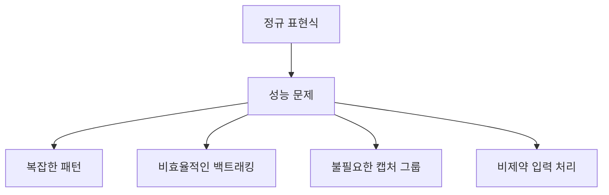

정규 표현식의 성능을 최적화하기 위해서는 이러한 문제의 원인을 이해하고, 적절한 패턴 작성 및 최적화 기법을 적용해야 한다. 이를 통해 성능을 개선하고, 보다 효율적인 문자열 처리를 구현할 수 있다.

<!--
## 입력 소스 고려하기
- 제약된 입력 vs 비제약 입력
- 정규 표현식 패턴 작성 시 고려사항
- 비제약 입력 처리의 중요성
-->

## 입력 소스 고려하기

정규 표현식을 사용할 때 입력 소스의 특성을 고려하는 것은 매우 중요하다. 입력 소스에 따라 정규 표현식의 성능과 효율성이 크게 달라질 수 있기 때문이다. 이 섹션에서는 제약된 입력과 비제약 입력의 차이, 정규 표현식 패턴 작성 시 고려해야 할 사항, 그리고 비제약 입력 처리의 중요성에 대해 다룬다.

**제약된 입력 vs 비제약 입력**

제약된 입력(Restricted Input)은 특정 형식이나 규칙을 따르는 입력을 의미한다. 예를 들어, 이메일 주소, 전화번호, 또는 특정 포맷의 날짜 등이 이에 해당한다. 이러한 입력은 정규 표현식 패턴을 작성할 때 명확한 규칙을 제공하므로, 성능 최적화가 상대적으로 용이하다.

반면, 비제약 입력(Unrestricted Input)은 사용자가 입력할 수 있는 형식이 다양하고 예측할 수 없는 경우를 말한다. 예를 들어, 사용자로부터 받는 자유 텍스트 입력은 비제약 입력에 해당한다. 이러한 경우, 정규 표현식은 다양한 패턴을 처리해야 하므로 성능 저하가 발생할 수 있다.

**정규 표현식 패턴 작성 시 고려사항**

정규 표현식 패턴을 작성할 때는 입력 소스의 특성을 고려하여 최적화된 패턴을 설계해야 한다. 다음은 몇 가지 고려사항이다:

1. **입력의 특성 파악**: 입력 데이터의 형식과 범위를 이해하고, 이를 기반으로 정규 표현식을 설계해야 한다.
2. **패턴의 복잡성 최소화**: 가능한 한 간단한 패턴을 사용하여 성능을 개선할 수 있다. 복잡한 패턴은 백트래킹을 유발할 수 있다.
3. **고정된 길이의 입력 사용**: 입력의 길이가 고정되어 있다면, 이를 활용하여 성능을 개선할 수 있다.

**비제약 입력 처리의 중요성**

비제약 입력을 처리할 때는 성능 저하를 방지하기 위해 몇 가지 전략을 사용할 수 있다. 예를 들어, 입력을 사전 처리하여 불필요한 데이터를 제거하거나, 정규 표현식의 사용을 최소화하는 방법이 있다. 또한, 비제약 입력을 처리할 때는 정규 표현식의 성능을 모니터링하고, 필요에 따라 패턴을 조정하는 것이 중요하다.

다음은 비제약 입력을 처리하기 위한 샘플 코드이다:

```csharp
using System;
using System.Text.RegularExpressions;

class Program
{
    static void Main()
    {
        string input = "사용자 입력 텍스트";
        string pattern = @"[a-zA-Z0-9]+";

        // 비제약 입력 처리
        MatchCollection matches = Regex.Matches(input, pattern);
        foreach (Match match in matches)
        {
            Console.WriteLine(match.Value);
        }
    }
}
```

이 코드는 비제약 입력에서 알파벳과 숫자를 추출하는 예시이다. 정규 표현식을 사용하여 입력을 필터링하고, 필요한 데이터를 추출할 수 있다.

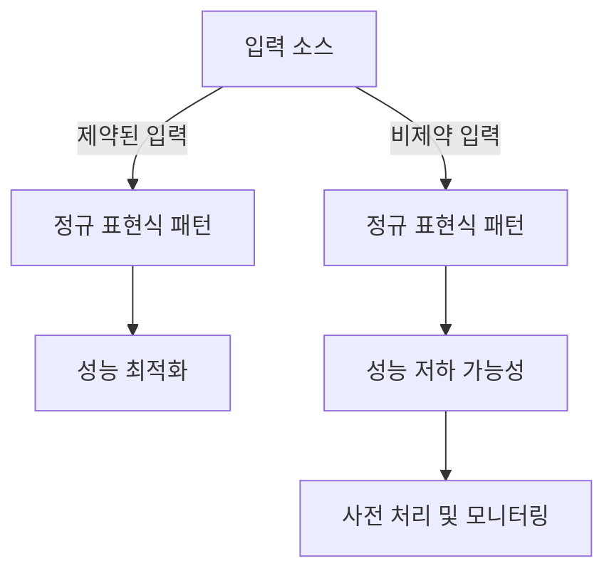

위의 다이어그램은 입력 소스에 따라 정규 표현식 패턴이 어떻게 달라지는지를 보여준다. 제약된 입력은 성능 최적화에 유리하지만, 비제약 입력은 성능 저하의 위험이 있다. 따라서 비제약 입력을 처리할 때는 사전 처리와 모니터링이 필요하다.

<!--
## 객체 인스턴스화 적절히 처리하기
- `System.Text.RegularExpressions.Regex` 클래스 소개
- 정규 표현식 객체의 성능에 미치는 영향
- 정적 메서드 호출 vs 인스턴스 메서드 호출
-->

## 객체 인스턴스화 적절히 처리하기

정규 표현식을 사용할 때, 객체 인스턴스화는 성능에 큰 영향을 미칠 수 있다. 특히, .NET의 `System.Text.RegularExpressions.Regex` 클래스를 사용할 때, 이 클래스의 특성과 인스턴스화 방법을 이해하는 것이 중요하다.

**`System.Text.RegularExpressions.Regex` 클래스 소개**

`Regex` 클래스는 .NET에서 정규 표현식을 처리하기 위한 기본 클래스이다. 이 클래스는 정규 표현식 패턴을 컴파일하고, 입력 문자열에 대해 패턴을 적용하여 일치 여부를 검사하는 기능을 제공한다. `Regex` 클래스는 정적 메서드와 인스턴스 메서드를 모두 제공하며, 각각의 사용 방식에 따라 성능 차이가 발생할 수 있다.

**정규 표현식 객체의 성능에 미치는 영향**

정규 표현식 객체를 매번 새로 인스턴스화하는 것은 성능 저하를 초래할 수 있다. 매번 인스턴스화할 경우, 정규 표현식 패턴이 매번 컴파일되기 때문에 불필요한 오버헤드가 발생한다. 따라서, 동일한 정규 표현식을 여러 번 사용할 경우, 객체를 재사용하는 것이 성능을 개선하는 데 도움이 된다.

다음은 정규 표현식 객체를 재사용하는 예시 코드이다.

```csharp
using System;
using System.Text.RegularExpressions;

class Program
{
    static void Main()
    {
        // 정규 표현식 객체를 한 번만 생성
        Regex regex = new Regex(@"^\d{3}-\d{2}-\d{4}$");

        // 여러 입력 문자열에 대해 정규 표현식 적용
        string[] inputs = { "123-45-6789", "123-45-678", "abc-def-ghij" };
        foreach (var input in inputs)
        {
            bool isMatch = regex.IsMatch(input);
            Console.WriteLine($"Input: {input}, Match: {isMatch}");
        }
    }
}
```

**정적 메서드 호출 vs 인스턴스 메서드 호출**

정규 표현식의 성능을 최적화하기 위해서는 정적 메서드 호출과 인스턴스 메서드 호출의 차이를 이해해야 한다. 정적 메서드는 클래스 수준에서 호출되며, 인스턴스 메서드는 객체 수준에서 호출된다. 정적 메서드를 사용하면, 정규 표현식 객체를 매번 생성할 필요가 없으므로 성능이 개선될 수 있다.

다음은 정적 메서드를 사용하는 예시 코드이다.

```csharp
using System;
using System.Text.RegularExpressions;

class Program
{
    static void Main()
    {
        // 정적 메서드 사용
        string pattern = @"^\d{3}-\d{2}-\d{4}$";
        string input = "123-45-6789";

        bool isMatch = Regex.IsMatch(input, pattern);
        Console.WriteLine($"Input: {input}, Match: {isMatch}");
    }
}
```

이와 같이, 정규 표현식 객체의 인스턴스화와 메서드 호출 방식은 성능에 큰 영향을 미친다. 따라서, 정규 표현식을 사용할 때는 이러한 요소들을 고려하여 최적의 성능을 이끌어내는 것이 중요하다.

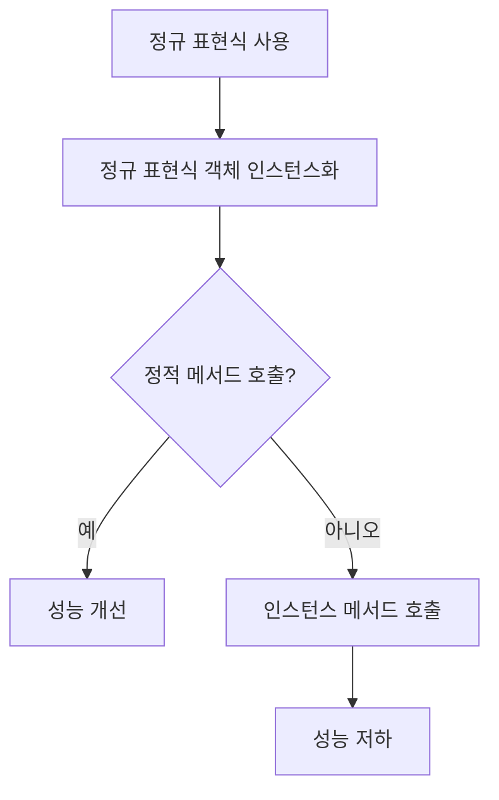

위의 다이어그램은 정규 표현식 사용 시 객체 인스턴스화와 메서드 호출 방식에 따른 성능 차이를 시각적으로 나타낸 것이다. 정적 메서드를 활용하여 성능을 최적화하는 것이 바람직하다.

<!--
## 정적 정규 표현식
- 정적 메서드 사용의 장점
- 성능 개선 사례
-->

## 정적 정규 표현식

**정적 메서드 사용의 장점**  

정적 정규 표현식은 성능 최적화에 있어 여러 가지 장점을 제공한다. 첫째, 정적 메서드를 사용하면 정규 표현식 객체를 매번 생성할 필요가 없으므로 메모리 사용량을 줄일 수 있다. 이는 특히 동일한 정규 표현식을 여러 번 사용할 경우 유리하다. 정적 메서드는 정규 표현식이 한 번 컴파일된 후 재사용되기 때문에, 매번 컴파일하는 오버헤드를 피할 수 있다.

둘째, 정적 메서드는 코드의 가독성을 높인다. 정규 표현식을 정적 메서드로 정의하면, 코드의 의도를 명확히 할 수 있으며, 유지보수 시에도 유리하다. 예를 들어, 다음과 같은 정적 메서드를 정의할 수 있다.

```csharp
public static class RegexPatterns
{
    public static readonly Regex EmailRegex = new Regex(@"^[^@\s]+@[^@\s]+\.[^@\s]+$", RegexOptions.Compiled);
}
```

이렇게 정의된 정규 표현식은 다음과 같이 사용할 수 있다.

```csharp
bool isValidEmail = RegexPatterns.EmailRegex.IsMatch("example@example.com");
```

**성능 개선 사례**  

정적 정규 표현식을 사용하여 성능을 개선한 사례로는 대량의 데이터에서 이메일 주소를 검증하는 경우를 들 수 있다. 예를 들어, 수천 개의 이메일 주소를 검증해야 할 때, 매번 정규 표현식 객체를 생성하는 대신 정적 메서드를 사용하여 성능을 크게 향상시킬 수 있다.

다음은 정적 정규 표현식을 사용하여 이메일 주소를 검증하는 성능 비교를 나타내는 다이어그램이다.

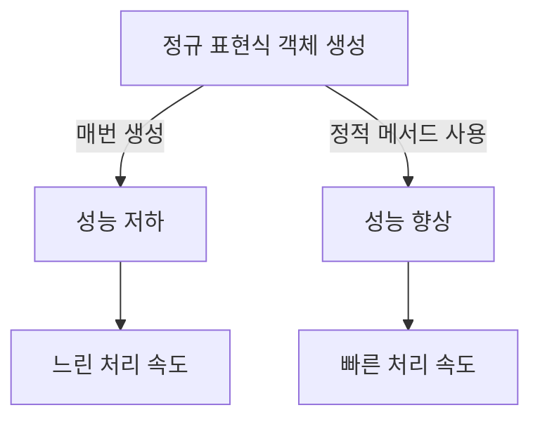

위의 다이어그램에서 볼 수 있듯이, 정적 메서드를 사용하면 성능이 향상되어 빠른 처리 속도를 유지할 수 있다. 이러한 방식은 특히 대량의 데이터를 처리할 때 유용하며, 정규 표현식의 성능 최적화에 있어 중요한 전략 중 하나이다.

<!--
## 해석된 정규 표현식 vs 소스 생성 정규 표현식 vs 컴파일된 정규 표현식
- 각 정규 표현식 유형의 특징
- 성능 비교 및 사용 권장 사항
-->

## 해석된 정규 표현식 vs 소스 생성 정규 표현식 vs 컴파일된 정규 표현식

정규 표현식은 다양한 방식으로 해석되고 실행될 수 있으며, 각 방식은 성능과 사용 용도에 따라 차별화된다. 이 섹션에서는 해석된 정규 표현식, 소스 생성 정규 표현식, 그리고 컴파일된 정규 표현식의 특징과 성능 비교를 다룬다.

**각 정규 표현식 유형의 특징**

1. **해석된 정규 표현식 (Interpreted Regular Expressions)**  
   해석된 정규 표현식은 런타임에 문자열 패턴을 해석하여 매칭을 수행하는 방식이다. 이 방식은 간단하고 유연하지만, 성능이 떨어질 수 있다. 특히 복잡한 패턴을 사용할 경우, 해석 과정에서 시간이 많이 소요될 수 있다.

2. **소스 생성 정규 표현식 (Source Generated Regular Expressions)**  
   소스 생성 정규 표현식은 정규 표현식 패턴을 문자열로 정의하고, 이를 소스 코드로 변환하여 실행하는 방식이다. 이 방식은 해석된 정규 표현식보다 성능이 개선될 수 있지만, 여전히 런타임에 해석이 필요하다. 주로 동적으로 생성된 패턴에 유용하다.

3. **컴파일된 정규 표현식 (Compiled Regular Expressions)**  
   컴파일된 정규 표현식은 정규 표현식 패턴을 미리 컴파일하여 실행하는 방식이다. 이 방식은 성능이 가장 뛰어나며, 반복적으로 사용되는 패턴에 적합하다. .NET에서는 `Regex.CompileToAssembly` 메서드를 사용하여 정규 표현식을 컴파일할 수 있다.

**성능 비교 및 사용 권장 사항**

각 정규 표현식 유형의 성능은 사용 사례에 따라 다르다. 다음은 각 유형에 대한 성능 비교와 사용 권장 사항이다.

- **해석된 정규 표현식**은 간단한 패턴이나 일회성 매칭에 적합하다. 성능이 중요한 경우에는 피하는 것이 좋다.
  
- **소스 생성 정규 표현식**은 동적으로 생성되는 패턴에 유용하지만, 성능이 중요한 경우에는 컴파일된 정규 표현식을 고려해야 한다.

- **컴파일된 정규 표현식**은 성능이 중요한 경우에 가장 적합하다. 반복적으로 사용되는 패턴이나 대량의 데이터에 대해 매칭을 수행할 때 추천된다.

다음은 각 정규 표현식 유형의 성능을 비교하는 다이어그램이다.

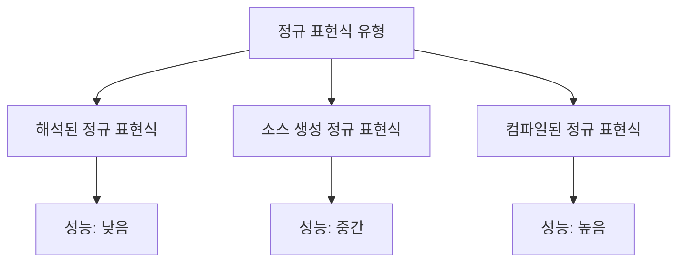

이와 같이 각 정규 표현식 유형은 특정 상황에서 장단점이 있으며, 성능을 고려하여 적절한 유형을 선택하는 것이 중요하다.

<!--
## 백트래킹 관리하기
- 백트래킹의 개념과 성능에 미치는 영향
- 백트래킹을 피하는 방법
- 타임아웃 값 사용하기
-->

## 백트래킹 관리하기

정규 표현식에서 백트래킹(Backtracking)은 패턴 매칭 과정에서 발생하는 중요한 개념이다. 백트래킹은 정규 표현식 엔진이 입력 문자열을 처리할 때, 특정 경로에서 매칭이 실패할 경우 이전 상태로 돌아가 다른 경로를 시도하는 과정을 의미한다. 이 과정은 때때로 성능 저하를 초래할 수 있다. 특히, 복잡한 패턴이나 비제약 입력을 처리할 때 백트래킹이 과도하게 발생하면, 성능이 급격히 떨어질 수 있다.

**백트래킹의 개념과 성능에 미치는 영향**

백트래킹은 정규 표현식 엔진이 입력 문자열을 처리하는 방식에 큰 영향을 미친다. 예를 들어, 다음과 같은 정규 표현식이 있다고 가정하자.

```regex
(a|b)*c
```

이 정규 표현식은 'a' 또는 'b'가 0회 이상 반복된 후 'c'가 오는 패턴을 찾는다. 만약 입력 문자열이 "aaac"라면, 엔진은 'a'를 선택한 후 'c'를 찾기 위해 여러 번 백트래킹을 수행해야 한다. 이 과정에서 성능이 저하될 수 있다.

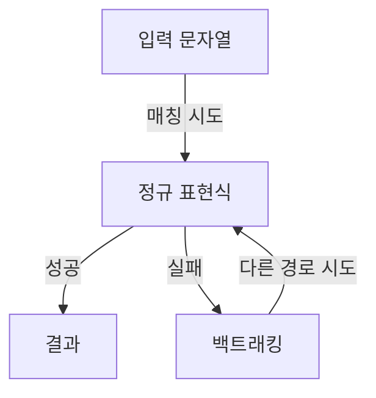

**백트래킹을 피하는 방법**

백트래킹을 피하기 위해서는 정규 표현식 패턴을 신중하게 설계해야 한다. 다음은 백트래킹을 줄이는 몇 가지 방법이다.

1. **비제약 수량자 사용 피하기**: `*` 또는 `+`와 같은 비제약 수량자는 백트래킹을 유발할 수 있다. 대신, 가능한 경우 `{n}`과 같은 제약 수량자를 사용하는 것이 좋다.
   
   예시:
   ```regex
   a{2,3}c
   ```

2. **원자 그룹 사용**: 원자 그룹(Atomic Grouping)을 사용하면 백트래킹을 방지할 수 있다. 원자 그룹은 매칭이 실패할 경우 이전 상태로 돌아가지 않도록 한다.

   예시:
   ```regex
   (?>a|b)*c
   ```

3. **정규 표현식 최적화**: 정규 표현식의 순서를 최적화하여 매칭이 실패할 가능성을 줄인다. 자주 매칭되는 패턴을 앞쪽에 배치하는 것이 좋다.

**타임아웃 값 사용하기**

정규 표현식의 성능을 관리하기 위해 타임아웃 값을 설정하는 것도 좋은 방법이다. .NET에서는 `Regex` 클래스의 `Match` 메서드에 타임아웃 값을 설정할 수 있다. 이를 통해 정규 표현식이 특정 시간 내에 매칭을 완료하지 못할 경우, 자동으로 예외를 발생시켜 성능 저하를 방지할 수 있다.

예시 코드:
```csharp
using System;
using System.Text.RegularExpressions;

class Program
{
    static void Main()
    {
        string input = "aaac";
        string pattern = @"(a|b)*c";
        TimeSpan timeout = TimeSpan.FromSeconds(1);

        try
        {
            Regex regex = new Regex(pattern, RegexOptions.None, timeout);
            Match match = regex.Match(input);
            Console.WriteLine(match.Success ? "매칭 성공" : "매칭 실패");
        }
        catch (RegexMatchTimeoutException)
        {
            Console.WriteLine("타임아웃 발생");
        }
    }
}
```

위의 코드에서는 정규 표현식의 매칭 과정에서 1초의 타임아웃을 설정하였다. 만약 매칭이 1초를 초과하면 `RegexMatchTimeoutException` 예외가 발생하여 성능 저하를 방지할 수 있다. 

이와 같이 백트래킹을 관리하고 타임아웃 값을 설정함으로써 정규 표현식의 성능을 최적화할 수 있다.

<!--
## 필요할 때만 캡처하기
- 그룹화 구조의 사용과 성능 비용
- 캡처를 비활성화하는 방법
-->

## 필요할 때만 캡처하기

정규 표현식에서 캡처는 특정 패턴을 찾고 그 결과를 저장하는 기능이다. 그러나 캡처를 사용할 때는 성능 비용이 발생할 수 있으므로, 필요할 때만 캡처하는 것이 중요하다. 이 섹션에서는 그룹화 구조의 사용과 성능 비용, 그리고 캡처를 비활성화하는 방법에 대해 설명하겠다.

**그룹화 구조의 사용과 성능 비용**

정규 표현식에서 그룹화는 패턴의 일부를 묶어주는 역할을 한다. 그룹화는 캡처 그룹과 비캡처 그룹으로 나눌 수 있으며, 캡처 그룹은 매칭된 내용을 저장하는 반면, 비캡처 그룹은 매칭된 내용을 저장하지 않는다. 캡처 그룹을 사용할 경우, 정규 표현식 엔진은 매칭된 내용을 저장하고 관리해야 하므로 추가적인 메모리와 처리 시간이 소모된다.

예를 들어, 다음과 같은 정규 표현식이 있다고 가정하자.

```csharp
string pattern = "(\\d{3})-(\\d{2})-(\\d{4})";
```

위의 패턴은 세 개의 캡처 그룹을 포함하고 있으며, 각각의 그룹은 전화번호 형식의 일부를 캡처한다. 이 경우, 캡처 그룹이 필요하지 않다면 비캡처 그룹으로 변경하는 것이 성능을 개선할 수 있다.

```csharp
string pattern = "(?:\\d{3})-(?:\\d{2})-(?:\\d{4})";
```

위의 패턴에서 `(?:...)`를 사용하여 비캡처 그룹으로 변경하였다. 이렇게 하면 불필요한 캡처를 피할 수 있어 성능이 개선된다.

**캡처를 비활성화하는 방법**

캡처를 비활성화하는 방법은 비캡처 그룹을 사용하는 것 외에도, 정규 표현식의 특정 기능을 활용하여 캡처를 최소화할 수 있다. 예를 들어, `Regex` 클래스의 `Match` 메서드를 사용할 때, 캡처가 필요 없는 경우에는 `RegexOptions`를 설정하여 성능을 최적화할 수 있다.

다음은 캡처를 비활성화하는 예시 코드이다.

```csharp
using System;
using System.Text.RegularExpressions;

class Program
{
    static void Main()
    {
        string input = "123-45-6789";
        string pattern = @"(?:\d{3})-(?:\d{2})-(?:\d{4})";
        
        Regex regex = new Regex(pattern);
        Match match = regex.Match(input);
        
        if (match.Success)
        {
            Console.WriteLine("매칭 성공!");
        }
    }
}
```

위의 코드에서 비캡처 그룹을 사용하여 성능을 최적화하였다. 이처럼 필요할 때만 캡처를 사용하고, 비캡처 그룹을 활용함으로써 성능 비용을 줄일 수 있다.

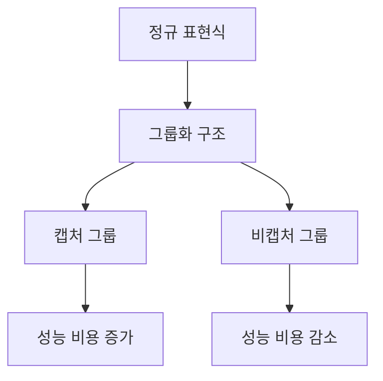

위의 다이어그램은 정규 표현식에서 그룹화 구조의 사용과 그에 따른 성능 비용의 관계를 나타낸다. 캡처 그룹을 사용할 경우 성능 비용이 증가하는 반면, 비캡처 그룹을 사용할 경우 성능 비용이 감소함을 보여준다. 

결론적으로, 정규 표현식에서 캡처를 필요할 때만 사용하는 것이 성능 최적화에 중요한 요소임을 기억해야 한다.

<!--
## 스레드 안전성
- `Regex` 클래스의 스레드 안전성
- 결과 객체의 스레드 안전성 관리
-->

## 스레드 안전성

정규 표현식을 사용할 때, 특히 멀티스레드 환경에서는 스레드 안전성을 고려하는 것이 매우 중요하다. .NET의 `Regex` 클래스는 스레드 안전성을 보장하지 않기 때문에, 여러 스레드가 동일한 `Regex` 인스턴스를 동시에 사용할 경우 예기치 않은 동작이 발생할 수 있다. 따라서, 스레드 안전성을 확보하기 위해서는 몇 가지 주의사항을 지켜야 한다.

**`Regex` 클래스의 스레드 안전성**

`Regex` 클래스는 기본적으로 스레드 안전하지 않다. 이는 `Regex` 객체가 내부적으로 상태를 유지하기 때문에, 여러 스레드가 동시에 접근할 경우 데이터 경합이 발생할 수 있다. 예를 들어, 다음과 같은 코드에서 두 개의 스레드가 동일한 `Regex` 인스턴스를 사용하면 문제가 발생할 수 있다.

```csharp
using System;
using System.Text.RegularExpressions;
using System.Threading;

class Program
{
    static void Main()
    {
        Regex regex = new Regex(@"(\d+)");
        
        Thread thread1 = new Thread(() => Console.WriteLine(regex.IsMatch("123")));
        Thread thread2 = new Thread(() => Console.WriteLine(regex.IsMatch("456")));
        
        thread1.Start();
        thread2.Start();
        
        thread1.Join();
        thread2.Join();
    }
}
```

위의 코드에서 `regex` 인스턴스는 두 개의 스레드에서 동시에 사용되고 있다. 이 경우, `IsMatch` 메서드가 호출될 때 예상치 못한 결과가 나올 수 있다.

**결과 객체의 스레드 안전성 관리**

정규 표현식의 결과 객체는 스레드 안전성을 보장하지 않기 때문에, 결과 객체를 여러 스레드에서 공유할 경우에도 주의가 필요하다. 결과 객체는 `Match`, `MatchCollection`, `Group` 등으로 구성되며, 이들 객체는 상태를 유지하고 있기 때문에 동기화가 필요하다.

다음은 결과 객체를 안전하게 관리하기 위한 방법 중 하나이다. 각 스레드가 독립적인 `Match` 객체를 사용하도록 하여 스레드 간의 충돌을 방지할 수 있다.

```csharp
using System;
using System.Text.RegularExpressions;
using System.Threading;

class Program
{
    static void Main()
    {
        string input = "123 456 789";
        string pattern = @"(\d+)";
        
        Thread thread1 = new Thread(() => ProcessMatches(input, pattern));
        Thread thread2 = new Thread(() => ProcessMatches(input, pattern));
        
        thread1.Start();
        thread2.Start();
        
        thread1.Join();
        thread2.Join();
    }

    static void ProcessMatches(string input, string pattern)
    {
        Regex regex = new Regex(pattern);
        MatchCollection matches = regex.Matches(input);
        
        foreach (Match match in matches)
        {
            Console.WriteLine(match.Value);
        }
    }
}
```

위의 코드에서는 각 스레드가 독립적인 `Regex` 인스턴스를 생성하고, 이를 통해 `MatchCollection`을 얻는다. 이렇게 하면 각 스레드가 서로의 결과 객체에 영향을 미치지 않게 된다.

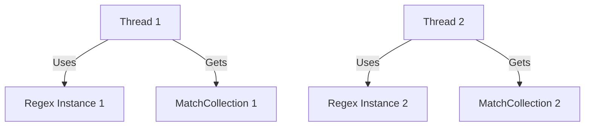

위의 다이어그램은 각 스레드가 독립적인 `Regex` 인스턴스를 사용하여 결과 객체를 생성하는 구조를 보여준다. 이러한 방식으로 스레드 안전성을 확보할 수 있다. 

결론적으로, 멀티스레드 환경에서 `Regex` 클래스를 사용할 때는 스레드 안전성을 항상 고려해야 하며, 각 스레드가 독립적인 인스턴스를 사용하도록 설계하는 것이 중요하다.

<!--
## 관련 기술
- 정규 표현식 성능 최적화 기법
  - 문자 클래스 사용
  - 소유적 수량자 및 원자 그룹
  - 게으른 수량자
  - 앵커 및 경계 사용
  - 정규 표현식의 순서 최적화
- 정규 표현식 성능 벤치마킹 방법
-->

## 관련 기술

정규 표현식의 성능 최적화는 애플리케이션의 전반적인 효율성을 높이는 데 중요한 역할을 한다. 이 섹션에서는 정규 표현식 성능을 최적화하기 위한 다양한 기법과 벤치마킹 방법에 대해 설명하겠다.

**정규 표현식 성능 최적화 기법**

정규 표현식의 성능을 개선하기 위해 사용할 수 있는 몇 가지 기법이 있다.

- **문자 클래스 사용**  
  문자 클래스는 특정 문자 집합을 정의하여 정규 표현식의 복잡성을 줄이는 데 도움을 준다. 예를 들어, `[abc]`는 'a', 'b', 또는 'c' 중 하나와 일치한다. 이를 통해 패턴을 간결하게 만들 수 있다.

  ```csharp
  string pattern = "[a-zA-Z0-9]";
  ```

- **소유적 수량자 및 원자 그룹**  
  소유적 수량자(`*?`, `+?`, `{n,m}?`)는 백트래킹을 줄여 성능을 개선할 수 있다. 원자 그룹은 패턴의 일부를 그룹화하여 성능을 향상시킬 수 있다.

  ```csharp
  string pattern = "(?>abc)+";
  ```

- **게으른 수량자**  
  게으른 수량자는 가능한 한 적은 문자를 일치시키도록 하여 성능을 개선할 수 있다. 예를 들어, `.*?`는 가능한 한 적은 문자를 일치시킨다.

  ```csharp
  string pattern = ".*?abc";
  ```

- **앵커 및 경계 사용**  
  앵커(`^`, `$`)와 경계(`\b`)를 사용하면 패턴의 시작과 끝을 명확히 하여 성능을 개선할 수 있다. 이는 불필요한 검색을 줄이는 데 도움을 준다.

  ```csharp
  string pattern = @"^\d{3}-\d{2}-\d{4}$";
  ```

- **정규 표현식의 순서 최적화**  
  정규 표현식의 패턴을 최적화하여 가장 가능성이 높은 일치를 먼저 검사하도록 순서를 조정하면 성능을 개선할 수 있다.

  ```csharp
  string pattern = "abc|def|ghi"; // 'abc'가 가장 먼저 검사됨
  ```

**정규 표현식 성능 벤치마킹 방법**

정규 표현식의 성능을 벤치마킹하기 위해서는 다음과 같은 방법을 사용할 수 있다.

1. **테스트 데이터 준비**  
   다양한 크기와 복잡성을 가진 테스트 데이터를 준비하여 정규 표현식의 성능을 평가한다.

2. **측정 도구 사용**  
   `Stopwatch` 클래스를 사용하여 정규 표현식의 실행 시간을 측정할 수 있다.

   ```csharp
   var stopwatch = new Stopwatch();
   stopwatch.Start();
   Regex.IsMatch(input, pattern);
   stopwatch.Stop();
   Console.WriteLine($"Execution Time: {stopwatch.ElapsedMilliseconds} ms");
   ```

3. **결과 분석**  
   여러 패턴과 입력 데이터에 대해 성능을 비교하고, 가장 효율적인 패턴을 선택한다.

다음은 정규 표현식 성능 벤치마킹을 위한 다이어그램이다.

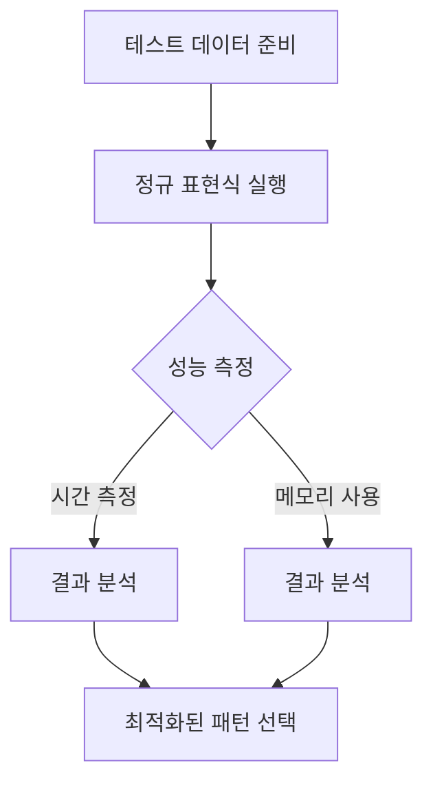

이와 같은 기법과 벤치마킹 방법을 통해 정규 표현식의 성능을 최적화할 수 있으며, 이는 애플리케이션의 전반적인 성능 향상에 기여할 것이다.

<!--
## FAQ
- 정규 표현식의 성능을 개선하기 위한 일반적인 질문
- 정규 표현식에서 자주 발생하는 성능 문제와 해결 방법
-->

## FAQ

**정규 표현식의 성능을 개선하기 위한 일반적인 질문**

정규 표현식의 성능을 개선하기 위해 자주 묻는 질문 중 하나는 "어떤 패턴이 더 효율적인가?"이다. 일반적으로, 간단하고 명확한 패턴이 더 나은 성능을 보인다. 예를 들어, `\d{3}`와 같은 패턴은 `\d{1,3}`보다 더 효율적이다. 이는 정규 표현식 엔진이 패턴을 해석하고 매칭하는 데 필요한 계산량이 줄어들기 때문이다.

또한, 정규 표현식에서 사용되는 메타문자와 수량자는 성능에 큰 영향을 미친다. 예를 들어, `.*`와 같은 패턴은 백트래킹을 유발할 수 있으므로, 가능한 한 사용을 피하는 것이 좋다. 대신, 구체적인 패턴을 사용하는 것이 성능을 개선하는 데 도움이 된다.

**정규 표현식에서 자주 발생하는 성능 문제와 해결 방법**

정규 표현식에서 자주 발생하는 성능 문제 중 하나는 백트래킹이다. 백트래킹은 정규 표현식 엔진이 가능한 모든 경로를 탐색해야 할 때 발생하며, 이는 성능 저하를 초래할 수 있다. 이를 해결하기 위해서는 다음과 같은 방법을 고려할 수 있다.

1. **패턴 최적화**: 불필요한 메타문자 사용을 피하고, 가능한 한 구체적인 패턴을 작성한다.
2. **캡처 그룹 비활성화**: 캡처 그룹이 필요하지 않은 경우, 비캡처 그룹 `(?:...)`를 사용하여 성능을 개선할 수 있다.
3. **타임아웃 설정**: 정규 표현식의 실행 시간을 제한하기 위해 타임아웃 값을 설정할 수 있다. 이는 무한 루프에 빠지는 것을 방지하는 데 유용하다.

아래는 정규 표현식의 성능 문제를 해결하기 위한 샘플 코드이다.

```csharp
using System;
using System.Text.RegularExpressions;

class Program
{
    static void Main()
    {
        string input = "Sample text with numbers 123 and 456.";
        string pattern = @"(?:\d{3})"; // 비캡처 그룹 사용

        // 타임아웃 설정
        Regex regex = new Regex(pattern, RegexOptions.None, TimeSpan.FromMilliseconds(100));

        Match match = regex.Match(input);
        if (match.Success)
        {
            Console.WriteLine("Match found: " + match.Value);
        }
        else
        {
            Console.WriteLine("No match found.");
        }
    }
}
```

다음은 정규 표현식의 성능 문제를 시각적으로 설명하는 다이어그램이다.

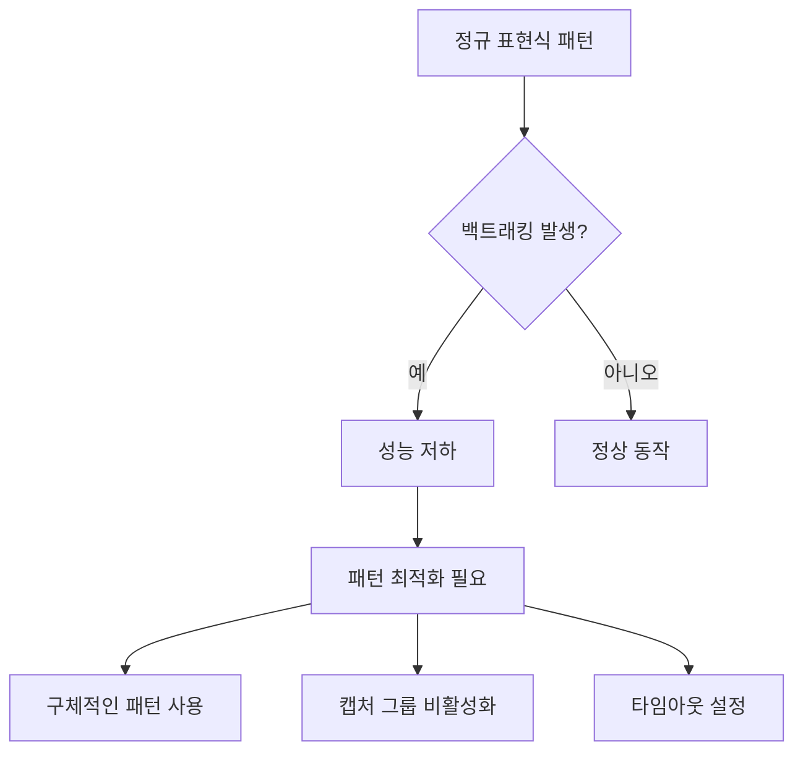

이와 같은 방법들을 통해 정규 표현식의 성능을 개선할 수 있으며, 성능 문제를 사전에 예방하는 것이 중요하다.

<!--
## 결론
- 정규 표현식 최적화의 중요성
- 성능 개선을 위한 지속적인 테스트와 벤치마킹의 필요성
- 정규 표현식 사용 시 주의사항 및 모범 사례 요약
-->

## 결론

**정규 표현식 최적화의 중요성**  
정규 표현식은 문자열 처리에서 매우 강력한 도구이다. 그러나 잘못 사용될 경우 성능 저하를 초래할 수 있다. 따라서 정규 표현식을 최적화하는 것은 애플리케이션의 전반적인 성능을 향상시키는 데 필수적이다. 최적화된 정규 표현식은 CPU 사용량을 줄이고, 메모리 소비를 최소화하며, 응답 시간을 단축시킨다. 이러한 이유로 정규 표현식의 최적화는 개발자에게 중요한 과제가 된다.

**성능 개선을 위한 지속적인 테스트와 벤치마킹의 필요성**  
정규 표현식의 성능을 개선하기 위해서는 지속적인 테스트와 벤치마킹이 필요하다. 정규 표현식의 성능은 입력 데이터의 특성에 따라 달라질 수 있으므로, 다양한 입력 시나리오에 대해 성능을 측정해야 한다. 이를 통해 어떤 패턴이 가장 효율적인지, 어떤 경우에 성능 문제가 발생하는지를 파악할 수 있다. 다음은 성능 벤치마킹을 위한 샘플 코드이다.

```csharp
using System;
using System.Diagnostics;
using System.Text.RegularExpressions;

class Program
{
    static void Main()
    {
        string input = "Sample input string for testing.";
        string pattern = @"\b\w+\b"; // 단어 경계 패턴

        Stopwatch stopwatch = new Stopwatch();
        stopwatch.Start();

        MatchCollection matches = Regex.Matches(input, pattern);
        
        stopwatch.Stop();
        Console.WriteLine($"Matches found: {matches.Count}");
        Console.WriteLine($"Time taken: {stopwatch.ElapsedMilliseconds} ms");
    }
}
```

**정규 표현식 사용 시 주의사항 및 모범 사례 요약**  
정규 표현식을 사용할 때는 몇 가지 주의사항을 염두에 두어야 한다. 첫째, 복잡한 패턴은 성능 저하를 초래할 수 있으므로 가능한 간단한 패턴을 사용하는 것이 좋다. 둘째, 캡처 그룹을 필요할 때만 사용하고, 불필요한 캡처는 피해야 한다. 셋째, 정규 표현식의 성능을 최적화하기 위해 정적 메서드를 활용하는 것이 좋다. 마지막으로, 정규 표현식의 성능을 정기적으로 테스트하고, 필요에 따라 패턴을 수정하는 것이 중요하다.

다음은 정규 표현식 사용 시 주의사항을 요약한 다이어그램이다.

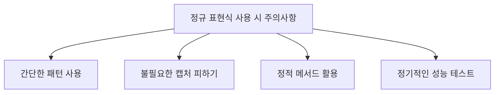

정규 표현식의 최적화는 성능 향상뿐만 아니라 코드의 가독성 및 유지보수성에도 긍정적인 영향을 미친다. 따라서 개발자는 정규 표현식을 사용할 때 이러한 모범 사례를 항상 염두에 두어야 한다.

<!--
## 추가 자료
- [정규 표현식 동작의 세부 사항](details-of-regular-expression-behavior)
- [백트래킹](backtracking-in-regular-expressions)
- [정규 표현식 언어 - 빠른 참조](regular-expression-language-quick-reference) 
-->

## 추가 자료

정규 표현식의 성능 최적화와 관련된 추가 자료는 독자가 더 깊이 있는 이해를 돕기 위해 제공된다. 이 자료들은 정규 표현식의 동작 원리, 백트래킹의 개념, 그리고 정규 표현식 언어의 빠른 참조를 포함한다.

**정규 표현식 동작의 세부 사항**  
정규 표현식의 동작 방식에 대한 세부 사항은 정규 표현식이 어떻게 작동하는지를 이해하는 데 필수적이다. 이 자료에서는 정규 표현식 엔진의 내부 작동 원리, 패턴 매칭 과정, 그리고 다양한 메타 문자와 그 의미에 대해 설명한다. 

예를 들어, 다음은 정규 표현식의 기본적인 패턴 매칭 과정을 설명하는 다이어그램이다.

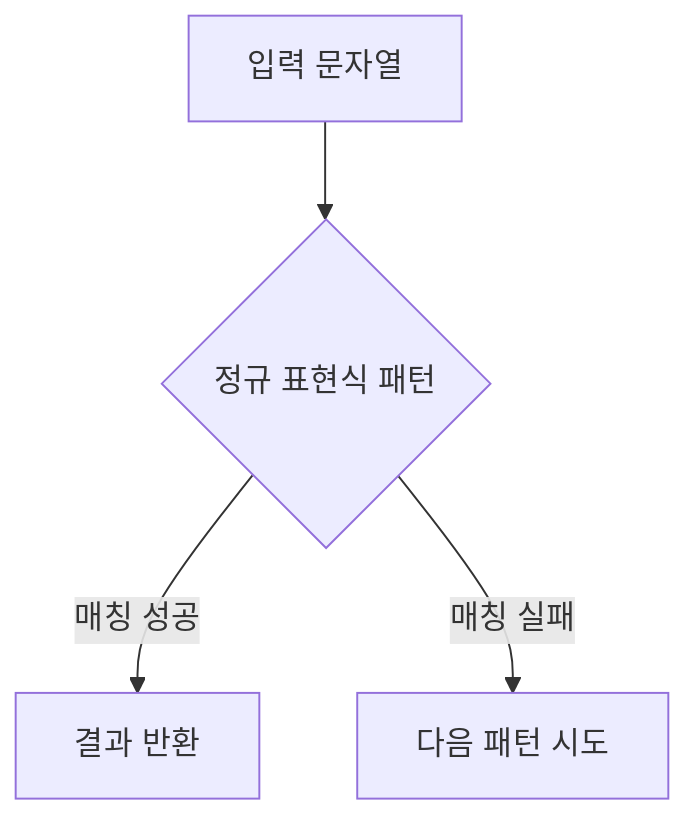

**백트래킹**  
백트래킹은 정규 표현식에서 성능 문제를 일으킬 수 있는 주요 원인 중 하나이다. 이 자료에서는 백트래킹의 개념과 그것이 성능에 미치는 영향을 설명하며, 백트래킹을 피하기 위한 다양한 기법을 제시한다. 

예를 들어, 다음은 백트래킹이 발생하는 상황을 설명하는 코드 샘플이다.

```csharp
string pattern = "(a|aa|aaa)";
string input = "aaaaaa";
Match match = Regex.Match(input, pattern);
```

위의 코드에서 입력 문자열이 "aaaaaa"일 때, 정규 표현식은 여러 번의 백트래킹을 수행하게 된다. 이는 성능 저하를 초래할 수 있다.

**정규 표현식 언어 - 빠른 참조**  
정규 표현식 언어의 빠른 참조 자료는 다양한 메타 문자, 수량자, 그리고 그룹화 구조에 대한 간단한 설명을 제공한다. 이 자료는 정규 표현식을 작성할 때 유용한 참고 자료로 활용될 수 있다. 

예를 들어, 다음은 정규 표현식에서 자주 사용되는 메타 문자의 간단한 목록이다.

| 메타 문자 | 설명                     |
|------------|--------------------------|
| `.`        | 임의의 문자 1개         |
| `*`        | 0회 이상 반복            |
| `+`        | 1회 이상 반복            |
| `?`        | 0회 또는 1회 발생       |
| `[]`       | 문자 클래스             |
| `()`       | 그룹화                  |

이러한 자료들은 정규 표현식의 성능 최적화와 관련된 다양한 주제를 이해하는 데 큰 도움이 될 것이다.

<!--
##### Reference #####
-->

## Reference


* [https://learn.microsoft.com/en-us/dotnet/standard/base-types/best-practices-regex](https://learn.microsoft.com/en-us/dotnet/standard/base-types/best-practices-regex)
* [https://stackoverflow.com/questions/1252194/regex-performance-optimization-tips-and-tricks](https://stackoverflow.com/questions/1252194/regex-performance-optimization-tips-and-tricks)
* [https://blog.aliencube.org/ko/2013/10/15/improving-performances-while-using-regular-expressions/](https://blog.aliencube.org/ko/2013/10/15/improving-performances-while-using-regular-expressions/)
* [https://www.syncfusion.com/succinctly-free-ebooks/regularexpressions/optimizing-your-regex](https://www.syncfusion.com/succinctly-free-ebooks/regularexpressions/optimizing-your-regex)
* [https://www.loggly.com/blog/five-invaluable-techniques-to-improve-regex-performance/](https://www.loggly.com/blog/five-invaluable-techniques-to-improve-regex-performance/)
* [https://library.humio.com/kb/kb-regex-vs-string-performance.html](https://library.humio.com/kb/kb-regex-vs-string-performance.html)
* [https://jack-vanlightly.com/blog/2016/2/25/optimizing-regex-performance-with-regexoptionsrighttoleft](https://jack-vanlightly.com/blog/2016/2/25/optimizing-regex-performance-with-regexoptionsrighttoleft)


<!--
#  Best practices for regular expressions in .NET

  * Article 
  * 06/20/2024 
  * 2 contributors 

Feedback

##  In this article

The regular expression engine in .NET is a powerful, full-featured tool that
processes text based on pattern matches rather than on comparing and matching
literal text. In most cases, it performs pattern matching rapidly and
efficiently. However, in some cases, the regular expression engine can appear
to be slow. In extreme cases, it can even appear to stop responding as it
processes a relatively small input over the course of hours or even days.

This article outlines some of the best practices that developers can adopt to
ensure that their regular expressions achieve optimal performance.

##  Consider the input source

In general, regular expressions can accept two types of input: constrained or
unconstrained. Constrained input is a text that originates from a known or
reliable source and follows a predefined format. Unconstrained input is a text
that originates from an unreliable source, such as a web user, and might not
follow a predefined or expected format.

Regular expression patterns are often written to match valid input. That is,
developers examine the text that they want to match and then write a regular
expression pattern that matches it. Developers then determine whether this
pattern requires correction or further elaboration by testing it with multiple
valid input items. When the pattern matches all presumed valid inputs, it's
declared to be production-ready, and can be included in a released
application. This approach makes a regular expression pattern suitable for
matching constrained input. However, it doesn't make it suitable for matching
unconstrained input.

To match unconstrained input, a regular expression must handle three kinds of
text efficiently:

  * Text that matches the regular expression pattern. 
  * Text that doesn't match the regular expression pattern. 
  * Text that nearly matches the regular expression pattern. 

The last text type is especially problematic for a regular expression that has
been written to handle constrained input. If that regular expression also
relies on extensive [ backtracking ](backtracking-in-regular-expressions) ,
the regular expression engine can spend an inordinate amount of time (in some
cases, many hours or days) processing seemingly innocuous text.

Warning

The following example uses a regular expression that's prone to excessive
backtracking and that's likely to reject valid email addresses. You shouldn't
use it in an email validation routine. If you would like a regular expression
that validates email addresses, see [ How to: Verify that Strings Are in Valid
Email Format ](how-to-verify-that-strings-are-in-valid-email-format) .

For example, consider a commonly used but problematic regular expression for
validating the alias of an email address. The regular expression `
^[0-9A-Z]([-.\w]*[0-9A-Z])*$ ` is written to process what is considered to be
a valid email address. A valid email address consists of an alphanumeric
character, followed by zero or more characters that can be alphanumeric,
periods, or hyphens. The regular expression must end with an alphanumeric
character. However, as the following example shows, although this regular
expression handles valid input easily, its performance is inefficient when
it's processing nearly valid input:

    
    
    using System;
    using System.Diagnostics;
    using System.Text.RegularExpressions;
    
    public class DesignExample
    {
        public static void Main()
        {
            Stopwatch sw;
            string[] addresses = { "AAAAAAAAAAA@contoso.com",
                                 "AAAAAAAAAAaaaaaaaaaa!@contoso.com" };
            // The following regular expression should not actually be used to
            // validate an email address.
            string pattern = @"^[0-9A-Z]([-.\w]*[0-9A-Z])*$";
            string input;
    
            foreach (var address in addresses)
            {
                string mailBox = address.Substring(0, address.IndexOf("@"));
                int index = 0;
                for (int ctr = mailBox.Length - 1; ctr >= 0; ctr--)
                {
                    index++;
    
                    input = mailBox.Substring(ctr, index);
                    sw = Stopwatch.StartNew();
                    Match m = Regex.Match(input, pattern, RegexOptions.IgnoreCase);
                    sw.Stop();
                    if (m.Success)
                        Console.WriteLine("{0,2}. Matched '{1,25}' in {2}",
                                          index, m.Value, sw.Elapsed);
                    else
                        Console.WriteLine("{0,2}. Failed  '{1,25}' in {2}",
                                          index, input, sw.Elapsed);
                }
                Console.WriteLine();
            }
        }
    }
    
    // The example displays output similar to the following:
    //     1. Matched '                        A' in 00:00:00.0007122
    //     2. Matched '                       AA' in 00:00:00.0000282
    //     3. Matched '                      AAA' in 00:00:00.0000042
    //     4. Matched '                     AAAA' in 00:00:00.0000038
    //     5. Matched '                    AAAAA' in 00:00:00.0000042
    //     6. Matched '                   AAAAAA' in 00:00:00.0000042
    //     7. Matched '                  AAAAAAA' in 00:00:00.0000042
    //     8. Matched '                 AAAAAAAA' in 00:00:00.0000087
    //     9. Matched '                AAAAAAAAA' in 00:00:00.0000045
    //    10. Matched '               AAAAAAAAAA' in 00:00:00.0000045
    //    11. Matched '              AAAAAAAAAAA' in 00:00:00.0000045
    //
    //     1. Failed  '                        !' in 00:00:00.0000447
    //     2. Failed  '                       a!' in 00:00:00.0000071
    //     3. Failed  '                      aa!' in 00:00:00.0000071
    //     4. Failed  '                     aaa!' in 00:00:00.0000061
    //     5. Failed  '                    aaaa!' in 00:00:00.0000081
    //     6. Failed  '                   aaaaa!' in 00:00:00.0000126
    //     7. Failed  '                  aaaaaa!' in 00:00:00.0000359
    //     8. Failed  '                 aaaaaaa!' in 00:00:00.0000414
    //     9. Failed  '                aaaaaaaa!' in 00:00:00.0000758
    //    10. Failed  '               aaaaaaaaa!' in 00:00:00.0001462
    //    11. Failed  '              aaaaaaaaaa!' in 00:00:00.0002885
    //    12. Failed  '             Aaaaaaaaaaa!' in 00:00:00.0005780
    //    13. Failed  '            AAaaaaaaaaaa!' in 00:00:00.0011628
    //    14. Failed  '           AAAaaaaaaaaaa!' in 00:00:00.0022851
    //    15. Failed  '          AAAAaaaaaaaaaa!' in 00:00:00.0045864
    //    16. Failed  '         AAAAAaaaaaaaaaa!' in 00:00:00.0093168
    //    17. Failed  '        AAAAAAaaaaaaaaaa!' in 00:00:00.0185993
    //    18. Failed  '       AAAAAAAaaaaaaaaaa!' in 00:00:00.0366723
    //    19. Failed  '      AAAAAAAAaaaaaaaaaa!' in 00:00:00.1370108
    //    20. Failed  '     AAAAAAAAAaaaaaaaaaa!' in 00:00:00.1553966
    //    21. Failed  '    AAAAAAAAAAaaaaaaaaaa!' in 00:00:00.3223372
    
    
    
    Imports System.Diagnostics
    Imports System.Text.RegularExpressions
    
    Module Example
        Public Sub Main()
            Dim sw As Stopwatch
            Dim addresses() As String = {"AAAAAAAAAAA@contoso.com",
                                       "AAAAAAAAAAaaaaaaaaaa!@contoso.com"}
            ' The following regular expression should not actually be used to 
            ' validate an email address.
            Dim pattern As String = "^[0-9A-Z]([-.\w]*[0-9A-Z])*$"
            Dim input As String
    
            For Each address In addresses
                Dim mailBox As String = address.Substring(0, address.IndexOf("@"))
                Dim index As Integer = 0
                For ctr As Integer = mailBox.Length - 1 To 0 Step -1
                    index += 1
                    input = mailBox.Substring(ctr, index)
                    sw = Stopwatch.StartNew()
                    Dim m As Match = Regex.Match(input, pattern, RegexOptions.IgnoreCase)
                    sw.Stop()
                    if m.Success Then
                        Console.WriteLine("{0,2}. Matched '{1,25}' in {2}",
                                          index, m.Value, sw.Elapsed)
                    Else
                        Console.WriteLine("{0,2}. Failed  '{1,25}' in {2}",
                                          index, input, sw.Elapsed)
                    End If
                Next
                Console.WriteLine()
            Next
        End Sub
    End Module
    ' The example displays output similar to the following:
    '     1. Matched '                        A' in 00:00:00.0007122
    '     2. Matched '                       AA' in 00:00:00.0000282
    '     3. Matched '                      AAA' in 00:00:00.0000042
    '     4. Matched '                     AAAA' in 00:00:00.0000038
    '     5. Matched '                    AAAAA' in 00:00:00.0000042
    '     6. Matched '                   AAAAAA' in 00:00:00.0000042
    '     7. Matched '                  AAAAAAA' in 00:00:00.0000042
    '     8. Matched '                 AAAAAAAA' in 00:00:00.0000087
    '     9. Matched '                AAAAAAAAA' in 00:00:00.0000045
    '    10. Matched '               AAAAAAAAAA' in 00:00:00.0000045
    '    11. Matched '              AAAAAAAAAAA' in 00:00:00.0000045
    '    
    '     1. Failed  '                        !' in 00:00:00.0000447
    '     2. Failed  '                       a!' in 00:00:00.0000071
    '     3. Failed  '                      aa!' in 00:00:00.0000071
    '     4. Failed  '                     aaa!' in 00:00:00.0000061
    '     5. Failed  '                    aaaa!' in 00:00:00.0000081
    '     6. Failed  '                   aaaaa!' in 00:00:00.0000126
    '     7. Failed  '                  aaaaaa!' in 00:00:00.0000359
    '     8. Failed  '                 aaaaaaa!' in 00:00:00.0000414
    '     9. Failed  '                aaaaaaaa!' in 00:00:00.0000758
    '    10. Failed  '               aaaaaaaaa!' in 00:00:00.0001462
    '    11. Failed  '              aaaaaaaaaa!' in 00:00:00.0002885
    '    12. Failed  '             Aaaaaaaaaaa!' in 00:00:00.0005780
    '    13. Failed  '            AAaaaaaaaaaa!' in 00:00:00.0011628
    '    14. Failed  '           AAAaaaaaaaaaa!' in 00:00:00.0022851
    '    15. Failed  '          AAAAaaaaaaaaaa!' in 00:00:00.0045864
    '    16. Failed  '         AAAAAaaaaaaaaaa!' in 00:00:00.0093168
    '    17. Failed  '        AAAAAAaaaaaaaaaa!' in 00:00:00.0185993
    '    18. Failed  '       AAAAAAAaaaaaaaaaa!' in 00:00:00.0366723
    '    19. Failed  '      AAAAAAAAaaaaaaaaaa!' in 00:00:00.1370108
    '    20. Failed  '     AAAAAAAAAaaaaaaaaaa!' in 00:00:00.1553966
    '    21. Failed  '    AAAAAAAAAAaaaaaaaaaa!' in 00:00:00.3223372
    

As the output from the preceding example shows, the regular expression engine
processes the valid email alias in about the same time interval regardless of
its length. On the other hand, when the nearly valid email address has more
than five characters, processing time approximately doubles for each extra
character in the string. Therefore, a nearly valid 28-character string would
take over an hour to process, and a nearly valid 33-character string would
take nearly a day to process.

Because this regular expression was developed solely by considering the format
of input to be matched, it fails to take account of input that doesn't match
the pattern. This oversight, in turn, can allow unconstrained input that
nearly matches the regular expression pattern to significantly degrade
performance.

To solve this problem, you can do the following:

  * When developing a pattern, you should consider how backtracking might affect the performance of the regular expression engine, particularly if your regular expression is designed to process unconstrained input. For more information, see the  Take Charge of Backtracking  section. 

  * Thoroughly test your regular expression using invalid, near-valid, and valid input. You can use [ Rex ](https://www.microsoft.com/research/project/rex-regular-expression-exploration/) to randomly generate input for a particular regular expression. [ Rex ](https://www.microsoft.com/research/project/rex-regular-expression-exploration/) is a regular expression exploration tool from Microsoft Research. 

##  Handle object instantiation appropriately

At the heart of .NET's regular expression object model is the [
System.Text.RegularExpressions.Regex ](/en-
us/dotnet/api/system.text.regularexpressions.regex) class, which represents
the regular expression engine. Often, the single greatest factor that affects
regular expression performance is the way in which the [ Regex ](/en-
us/dotnet/api/system.text.regularexpressions.regex) engine is used. Defining a
regular expression involves tightly coupling the regular expression engine
with a regular expression pattern. That coupling process is expensive, whether
it involves instantiating a [ Regex ](/en-
us/dotnet/api/system.text.regularexpressions.regex) object by passing its
constructor a regular expression pattern or calling a static method by passing
it the regular expression pattern and the string to be analyzed.

You can couple the regular expression engine with a particular regular
expression pattern and then use the engine to match the text in several ways:

  * You can call a static pattern-matching method, such as [ Regex.Match(String, String) ](/en-us/dotnet/api/system.text.regularexpressions.regex.match#system-text-regularexpressions-regex-match\(system-string-system-string\)) . This method doesn't require instantiation of a regular expression object. 

  * You can instantiate a [ Regex ](/en-us/dotnet/api/system.text.regularexpressions.regex) object and call an instance pattern-matching method of an interpreted regular expression, which is the default method for binding the regular expression engine to a regular expression pattern. It results when a [ Regex ](/en-us/dotnet/api/system.text.regularexpressions.regex) object is instantiated without an ` options ` argument that includes the [ Compiled ](/en-us/dotnet/api/system.text.regularexpressions.regexoptions#system-text-regularexpressions-regexoptions-compiled) flag. 

  * You can instantiate a [ Regex ](/en-us/dotnet/api/system.text.regularexpressions.regex) object and call an instance pattern-matching method of a source-generated regular expression. This technique is recommended in most cases. To do so, place the [ GeneratedRegexAttribute ](/en-us/dotnet/api/system.text.regularexpressions.generatedregexattribute) attribute on a partial method that returns ` Regex ` . 

  * You can instantiate a [ Regex ](/en-us/dotnet/api/system.text.regularexpressions.regex) object and call an instance pattern-matching method of a compiled regular expression. Regular expression objects represent compiled patterns when a [ Regex ](/en-us/dotnet/api/system.text.regularexpressions.regex) object is instantiated with an ` options ` argument that includes the [ Compiled ](/en-us/dotnet/api/system.text.regularexpressions.regexoptions#system-text-regularexpressions-regexoptions-compiled) flag. 

The particular way in which you call regular expression matching methods can
affect your application's performance. The following sections discuss when to
use static method calls, source-generated regular expressions, interpreted
regular expressions, and compiled regular expressions to improve your
application's performance.

Important

The form of the method call (static, interpreted, source-generated, compiled)
affects performance if the same regular expression is used repeatedly in
method calls, or if an application makes extensive use of regular expression
objects.

###  Static regular expressions

Static regular expression methods are recommended as an alternative to
repeatedly instantiating a regular expression object with the same regular
expression. Unlike regular expression patterns used by regular expression
objects, either the operation codes (opcodes) or the compiled common
intermediate language (CIL) from patterns used in static method calls is
cached internally by the regular expression engine.

For example, an event handler frequently calls another method to validate user
input. This example is reflected in the following code, in which a [ Button
](/en-us/dotnet/api/system.windows.forms.button) control's [ Click ](/en-
us/dotnet/api/system.windows.forms.control.click#system-windows-forms-control-
click) event is used to call a method named ` IsValidCurrency ` , which checks
whether the user has entered a currency symbol followed by at least one
decimal digit.

    
    
    public void OKButton_Click(object sender, EventArgs e)
    {
       if (! String.IsNullOrEmpty(sourceCurrency.Text))
          if (RegexLib.IsValidCurrency(sourceCurrency.Text))
             PerformConversion();
          else
             status.Text = "The source currency value is invalid.";
    }
    
    
    
    Public Sub OKButton_Click(sender As Object, e As EventArgs) _
               Handles OKButton.Click
    
        If Not String.IsNullOrEmpty(sourceCurrency.Text) Then
            If RegexLib.IsValidCurrency(sourceCurrency.Text) Then
                PerformConversion()
            Else
                status.Text = "The source currency value is invalid."
            End If
        End If
    End Sub
    

An inefficient implementation of the ` IsValidCurrency ` method is shown in
the following example:

Note

Each method call reinstantiates a [ Regex ](/en-
us/dotnet/api/system.text.regularexpressions.regex) object with the same
pattern. This, in turn, means that the regular expression pattern must be
recompiled each time the method is called.

    
    
    using System;
    using System.Text.RegularExpressions;
    
    public class RegexLib
    {
       public static bool IsValidCurrency(string currencyValue)
       {
          string pattern = @"\p{Sc}+\s*\d+";
          Regex currencyRegex = new Regex(pattern);
          return currencyRegex.IsMatch(currencyValue);
       }
    }
    
    
    
    Imports System.Text.RegularExpressions
    
    Public Module RegexLib
        Public Function IsValidCurrency(currencyValue As String) As Boolean
            Dim pattern As String = "\p{Sc}+\s*\d+"
            Dim currencyRegex As New Regex(pattern)
            Return currencyRegex.IsMatch(currencyValue)
        End Function
    End Module
    

You should replace the preceding inefficient code with a call to the static [
Regex.IsMatch(String, String) ](/en-
us/dotnet/api/system.text.regularexpressions.regex.ismatch#system-text-
regularexpressions-regex-ismatch\(system-string-system-string\)) method. This
approach eliminates the need to instantiate a [ Regex ](/en-
us/dotnet/api/system.text.regularexpressions.regex) object each time you want
to call a pattern-matching method, and enables the regular expression engine
to retrieve a compiled version of the regular expression from its cache.

    
    
    using System;
    using System.Text.RegularExpressions;
    
    public class RegexLib2
    {
       public static bool IsValidCurrency(string currencyValue)
       {
          string pattern = @"\p{Sc}+\s*\d+";
          return Regex.IsMatch(currencyValue, pattern);
       }
    }
    
    
    
    Imports System.Text.RegularExpressions
    
    Public Module RegexLib
        Public Function IsValidCurrency(currencyValue As String) As Boolean
            Dim pattern As String = "\p{Sc}+\s*\d+"
            Return Regex.IsMatch(currencyValue, pattern)
        End Function
    End Module
    

By default, the last 15 most recently used static regular expression patterns
are cached. For applications that require a larger number of cached static
regular expressions, the size of the cache can be adjusted by setting the [
Regex.CacheSize ](/en-
us/dotnet/api/system.text.regularexpressions.regex.cachesize) property.

The regular expression ` \p{Sc}+\s*\d+ ` that's used in this example verifies
that the input string has a currency symbol and at least one decimal digit.
The pattern is defined as shown in the following table:

Pattern  |  Description   
---|---  
` \p{Sc}+ ` |  Matches one or more characters in the Unicode Symbol, Currency category.   
` \s* ` |  Matches zero or more white-space characters.   
` \d+ ` |  Matches one or more decimal digits.   
  
###  Interpreted vs. source-generated vs. compiled regular expressions

Regular expression patterns that aren't bound to the regular expression engine
through the specification of the [ Compiled ](/en-
us/dotnet/api/system.text.regularexpressions.regexoptions#system-text-
regularexpressions-regexoptions-compiled) option are _interpreted_ . When a
regular expression object is instantiated, the regular expression engine
converts the regular expression to a set of operation codes. When an instance
method is called, the operation codes are converted to CIL and executed by the
JIT compiler. Similarly, when a static regular expression method is called and
the regular expression can't be found in the cache, the regular expression
engine converts the regular expression to a set of operation codes and stores
them in the cache. It then converts these operation codes to CIL so that the
JIT compiler can execute them. Interpreted regular expressions reduce startup
time at the cost of slower execution time. Because of this process, they're
best used when the regular expression is used in a small number of method
calls, or if the exact number of calls to regular expression methods is
unknown but is expected to be small. As the number of method calls increases,
the performance gain from reduced startup time is outstripped by the slower
execution speed.

Regular expression patterns that are bound to the regular expression engine
through the specification of the [ Compiled ](/en-
us/dotnet/api/system.text.regularexpressions.regexoptions#system-text-
regularexpressions-regexoptions-compiled) option are _compiled_ . Therefore,
when a regular expression object is instantiated, or when a static regular
expression method is called and the regular expression can't be found in the
cache, the regular expression engine converts the regular expression to an
intermediary set of operation codes. These codes are then converted to CIL.
When a method is called, the JIT compiler executes the CIL. In contrast to
interpreted regular expressions, compiled regular expressions increase startup
time but execute individual pattern-matching methods faster. As a result, the
performance benefit that results from compiling the regular expression
increases in proportion to the number of regular expression methods called.

Regular expression patterns that are bound to the regular expression engine
through the adornment of a ` Regex ` -returning method with the [
GeneratedRegexAttribute ](/en-
us/dotnet/api/system.text.regularexpressions.generatedregexattribute)
attribute are _source generated_ . The source generator, which plugs into the
compiler, emits as C# code a custom ` Regex ` -derived implementation with
logic similar to what ` RegexOptions.Compiled ` emits in CIL. You get all the
throughput performance benefits of ` RegexOptions.Compiled ` (more, in fact)
and the start-up benefits of ` Regex.CompileToAssembly ` , but without the
complexity of ` CompileToAssembly ` . The source that's emitted is part of
your project, which means it's also easily viewable and debuggable.

To summarize, we recommend that you:

  * Use _interpreted_ regular expressions when you call regular expression methods with a specific regular expression relatively infrequently. 
  * Use _source-generated_ regular expressions if you're using ` Regex ` in C# with arguments known at compile time, and you're using a specific regular expression relatively frequently. 
  * Use _compiled_ regular expressions when you call regular expression methods with a specific regular expression relatively frequently and you're using .NET 6 or an earlier version. 

It's difficult to determine the exact threshold at which the slower execution
speeds of interpreted regular expressions outweigh gains from their reduced
startup time. It's also difficult to determine the threshold at which the
slower startup times of source-generated or compiled regular expressions
outweigh gains from their faster execution speeds. The thresholds depend on
various factors, including the complexity of the regular expression and the
specific data that it processes. To determine which regular expressions offer
the best performance for your particular application scenario, you can use the
[ Stopwatch ](/en-us/dotnet/api/system.diagnostics.stopwatch) class to compare
their execution times.

The following example compares the performance of compiled, source-generated,
and interpreted regular expressions when reading the first 10 sentences and
when reading all the sentences in the text of William D. Guthrie's _Magna
Carta, and Other Addresses_ . As the output from the example shows, when only
10 calls are made to regular expression matching methods, an interpreted or
source-generated regular expression offers better performance than a compiled
regular expression. However, a compiled regular expression offers better
performance when a large number of calls (in this case, over 13,000) are made.

    
    
    const string Pattern = @"\b(\w+((\r?\n)|,?\s))*\w+[.?:;!]";
    
    static readonly HttpClient s_client = new();
    
    [GeneratedRegex(Pattern, RegexOptions.Singleline)]
    private static partial Regex GeneratedRegex();
    
    public async static Task RunIt()
    {
        Stopwatch sw;
        Match match;
        int ctr;
    
        string text =
                await s_client.GetStringAsync("https://www.gutenberg.org/cache/epub/64197/pg64197.txt");
    
        // Read first ten sentences with interpreted regex.
        Console.WriteLine("10 Sentences with Interpreted Regex:");
        sw = Stopwatch.StartNew();
        Regex int10 = new(Pattern, RegexOptions.Singleline);
        match = int10.Match(text);
        for (ctr = 0; ctr <= 9; ctr++)
        {
            if (match.Success)
                // Do nothing with the match except get the next match.
                match = match.NextMatch();
            else
                break;
        }
        sw.Stop();
        Console.WriteLine("   {0} matches in {1}", ctr, sw.Elapsed);
    
        // Read first ten sentences with compiled regex.
        Console.WriteLine("10 Sentences with Compiled Regex:");
        sw = Stopwatch.StartNew();
        Regex comp10 = new Regex(Pattern,
                     RegexOptions.Singleline | RegexOptions.Compiled);
        match = comp10.Match(text);
        for (ctr = 0; ctr <= 9; ctr++)
        {
            if (match.Success)
                // Do nothing with the match except get the next match.
                match = match.NextMatch();
            else
                break;
        }
        sw.Stop();
        Console.WriteLine("   {0} matches in {1}", ctr, sw.Elapsed);
    
        // Read first ten sentences with source-generated regex.
        Console.WriteLine("10 Sentences with Source-generated Regex:");
        sw = Stopwatch.StartNew();
    
        match = GeneratedRegex().Match(text);
        for (ctr = 0; ctr <= 9; ctr++)
        {
            if (match.Success)
                // Do nothing with the match except get the next match.
                match = match.NextMatch();
            else
                break;
        }
        sw.Stop();
        Console.WriteLine("   {0} matches in {1}", ctr, sw.Elapsed);
    
        // Read all sentences with interpreted regex.
        Console.WriteLine("All Sentences with Interpreted Regex:");
        sw = Stopwatch.StartNew();
        Regex intAll = new(Pattern, RegexOptions.Singleline);
        match = intAll.Match(text);
        int matches = 0;
        while (match.Success)
        {
            matches++;
            // Do nothing with the match except get the next match.
            match = match.NextMatch();
        }
        sw.Stop();
        Console.WriteLine("   {0:N0} matches in {1}", matches, sw.Elapsed);
    
        // Read all sentences with compiled regex.
        Console.WriteLine("All Sentences with Compiled Regex:");
        sw = Stopwatch.StartNew();
        Regex compAll = new(Pattern,
                        RegexOptions.Singleline | RegexOptions.Compiled);
        match = compAll.Match(text);
        matches = 0;
        while (match.Success)
        {
            matches++;
            // Do nothing with the match except get the next match.
            match = match.NextMatch();
        }
        sw.Stop();
        Console.WriteLine("   {0:N0} matches in {1}", matches, sw.Elapsed);
    
        // Read all sentences with source-generated regex.
        Console.WriteLine("All Sentences with Source-generated Regex:");
        sw = Stopwatch.StartNew();
        match = GeneratedRegex().Match(text);
        matches = 0;
        while (match.Success)
        {
            matches++;
            // Do nothing with the match except get the next match.
            match = match.NextMatch();
        }
        sw.Stop();
        Console.WriteLine("   {0:N0} matches in {1}", matches, sw.Elapsed);
    
        return;
    }
    /* The example displays output similar to the following:
    
       10 Sentences with Interpreted Regex:
           10 matches in 00:00:00.0104920
       10 Sentences with Compiled Regex:
           10 matches in 00:00:00.0234604
       10 Sentences with Source-generated Regex:
           10 matches in 00:00:00.0060982
       All Sentences with Interpreted Regex:
           3,427 matches in 00:00:00.1745455
       All Sentences with Compiled Regex:
           3,427 matches in 00:00:00.0575488
       All Sentences with Source-generated Regex:
           3,427 matches in 00:00:00.2698670
    */
    

The regular expression pattern used in the example, `
\b(\w+((\r?\n)|,?\s))*\w+[.?:;!] ` , is defined as shown in the following
table:

Pattern  |  Description   
---|---  
` \b ` |  Begin the match at a word boundary.   
` \w+ ` |  Matches one or more word characters.   
` (\r?\n)|,?\s) ` |  Matches either zero or one carriage return followed by a newline character, or zero or one comma followed by a white-space character.   
` (\w+((\r?\n)|,?\s))* ` |  Matches zero or more occurrences of one or more word characters that are followed either by zero or one carriage return and a newline character, or by zero or one comma followed by a white-space character.   
` \w+ ` |  Matches one or more word characters.   
` [.?:;!] ` |  Matches a period, question mark, colon, semicolon, or exclamation point.   
  
##  Take charge of backtracking

Ordinarily, the regular expression engine uses linear progression to move
through an input string and compare it to a regular expression pattern.
However, when indeterminate quantifiers such as ` * ` , ` + ` , and ` ? ` are
used in a regular expression pattern, the regular expression engine might give
up a portion of successful partial matches and return to a previously saved
state in order to search for a successful match for the entire pattern. This
process is known as backtracking.

Support for backtracking gives regular expressions power and flexibility. It
also places the responsibility for controlling the operation of the regular
expression engine in the hands of regular expression developers. Because
developers are often not aware of this responsibility, their misuse of
backtracking or reliance on excessive backtracking often plays the most
significant role in degrading regular expression performance. In a worst-case
scenario, execution time can double for each additional character in the input
string. In fact, by using backtracking excessively, it's easy to create the
programmatic equivalent of an endless loop if input nearly matches the regular
expression pattern. The regular expression engine might take hours or even
days to process a relatively short input string.

Often, applications pay a performance penalty for using backtracking even
though backtracking isn't essential for a match. For example, the regular
expression ` \b\p{Lu}\w*\b ` matches all words that begin with an uppercase
character, as the following table shows:

Pattern  |  Description   
---|---  
` \b ` |  Begin the match at a word boundary.   
` \p{Lu} ` |  Matches an uppercase character.   
` \w* ` |  Matches zero or more word characters.   
` \b ` |  End the match at a word boundary.   
  
Because a word boundary isn't the same as, or a subset of, a word character,
there's no possibility that the regular expression engine will cross a word
boundary when matching word characters. Therefore for this regular expression,
backtracking can never contribute to the overall success of any match. It can
only degrade performance because the regular expression engine is forced to
save its state for each successful preliminary match of a word character.

If you determine that backtracking isn't necessary, you can disable it in a
couple of ways:

  * By setting the [ RegexOptions.NonBacktracking ](/en-us/dotnet/api/system.text.regularexpressions.regexoptions#system-text-regularexpressions-regexoptions-nonbacktracking) option (introduced in .NET 7). For more information, see [ Nonbacktracking mode ](regular-expression-options#nonbacktracking-mode) . 

  * By using the ` (?>subexpression) ` language element, known as an atomic group. The following example parses an input string by using two regular expressions. The first, ` \b\p{Lu}\w*\b ` , relies on backtracking. The second, ` \b\p{Lu}(?>\w*)\b ` , disables backtracking. As the output from the example shows, they both produce the same result: 
    
        using System;
    using System.Text.RegularExpressions;
    
    public class BackTrack2Example
    {
        public static void Main()
        {
            string input = "This this word Sentence name Capital";
            string pattern = @"\b\p{Lu}\w*\b";
            foreach (Match match in Regex.Matches(input, pattern))
                Console.WriteLine(match.Value);
    
            Console.WriteLine();
    
            pattern = @"\b\p{Lu}(?>\w*)\b";
            foreach (Match match in Regex.Matches(input, pattern))
                Console.WriteLine(match.Value);
        }
    }
    // The example displays the following output:
    //       This
    //       Sentence
    //       Capital
    //
    //       This
    //       Sentence
    //       Capital
    
    
        Imports System.Text.RegularExpressions
    
    Module Example
        Public Sub Main()
            Dim input As String = "This this word Sentence name Capital"
            Dim pattern As String = "\b\p{Lu}\w*\b"
            For Each match As Match In Regex.Matches(input, pattern)
                Console.WriteLine(match.Value)
            Next
            Console.WriteLine()
    
            pattern = "\b\p{Lu}(?>\w*)\b"
            For Each match As Match In Regex.Matches(input, pattern)
                Console.WriteLine(match.Value)
            Next
        End Sub
    End Module
    ' The example displays the following output:
    '       This
    '       Sentence
    '       Capital
    '       
    '       This
    '       Sentence
    '       Capital
    

In many cases, backtracking is essential for matching a regular expression
pattern to input text. However, excessive backtracking can severely degrade
performance and create the impression that an application has stopped
responding. In particular, this problem arises when quantifiers are nested and
the text that matches the outer subexpression is a subset of the text that
matches the inner subexpression.

Warning

In addition to avoiding excessive backtracking, you should use the timeout
feature to ensure that excessive backtracking doesn't severely degrade regular
expression performance. For more information, see the  Use time-out values
section.

For example, the regular expression pattern ` ^[0-9A-Z]([-.\w]*[0-9A-Z])*\$ `
is intended to match a part number that consists of at least one alphanumeric
character. Any additional characters can consist of an alphanumeric character,
a hyphen, an underscore, or a period, though the last character must be
alphanumeric. A dollar sign terminates the part number. In some cases, this
regular expression pattern can exhibit poor performance because quantifiers
are nested, and because the subexpression ` [0-9A-Z] ` is a subset of the
subexpression ` [-.\w]* ` .

In these cases, you can optimize regular expression performance by removing
the nested quantifiers and replacing the outer subexpression with a zero-width
lookahead or lookbehind assertion. Lookahead and lookbehind assertions are
anchors. They don't move the pointer in the input string but instead look
ahead or behind to check whether a specified condition is met. For example,
the part number regular expression can be rewritten as `
^[0-9A-Z][-.\w]*(?<=[0-9A-Z])\$ ` . This regular expression pattern is
defined as shown in the following table:

Pattern  |  Description   
---|---  
` ^ ` |  Begin the match at the beginning of the input string.   
` [0-9A-Z] ` |  Match an alphanumeric character. The part number must consist of at least this character.   
` [-.\w]* ` |  Match zero or more occurrences of any word character, hyphen, or period.   
` \$ ` |  Match a dollar sign.   
` (?<=[0-9A-Z]) ` |  Look behind the ending dollar sign to ensure that the previous character is alphanumeric.   
` $ ` |  End the match at the end of the input string.   
  
The following example illustrates the use of this regular expression to match
an array containing possible part numbers:

    
    
    using System;
    using System.Text.RegularExpressions;
    
    public class BackTrack4Example
    {
        public static void Main()
        {
            string pattern = @"^[0-9A-Z][-.\w]*(?<=[0-9A-Z])\$";
            string[] partNos = { "A1C$", "A4", "A4$", "A1603D$", "A1603D#" };
    
            foreach (var input in partNos)
            {
                Match match = Regex.Match(input, pattern);
                if (match.Success)
                    Console.WriteLine(match.Value);
                else
                    Console.WriteLine("Match not found.");
            }
        }
    }
    // The example displays the following output:
    //       A1C$
    //       Match not found.
    //       A4$
    //       A1603D$
    //       Match not found.
    
    
    
    Imports System.Text.RegularExpressions
    
    Module Example
        Public Sub Main()
            Dim pattern As String = "^[0-9A-Z][-.\w]*(?<=[0-9A-Z])\$"
            Dim partNos() As String = {"A1C$", "A4", "A4$", "A1603D$",
                                        "A1603D#"}
    
            For Each input As String In partNos
                Dim match As Match = Regex.Match(input, pattern)
                If match.Success Then
                    Console.WriteLine(match.Value)
                Else
                    Console.WriteLine("Match not found.")
                End If
            Next
        End Sub
    End Module
    ' The example displays the following output:
    '       A1C$
    '       Match not found.
    '       A4$
    '       A1603D$
    '       Match not found.
    

The regular expression language in .NET includes the following language
elements that you can use to eliminate nested quantifiers. For more
information, see [ Grouping constructs ](grouping-constructs-in-regular-
expressions) .

Language element  |  Description   
---|---  
` (?= ` ` subexpression ` ` ) ` |  Zero-width positive lookahead. Looks ahead of the current position to determine whether ` subexpression ` matches the input string.   
` (?! ` ` subexpression ` ` ) ` |  Zero-width negative lookahead. Looks ahead of the current position to determine whether ` subexpression ` doesn't match the input string.   
` (?<= ` ` subexpression ` ` ) ` |  Zero-width positive lookbehind. Looks behind the current position to determine whether ` subexpression ` matches the input string.   
` (?<! ` ` subexpression ` ` ) ` |  Zero-width negative lookbehind. Looks behind the current position to determine whether ` subexpression ` doesn't match the input string.   
  
##  Use time-out values

If your regular expressions processes input that nearly matches the regular
expression pattern, it can often rely on excessive backtracking, which impacts
its performance significantly. In addition to carefully considering your use
of backtracking and testing the regular expression against near-matching
input, you should always set a time-out value to minimize the effect of
excessive backtracking, if it occurs.

The regular expression time-out interval defines the period of time that the
regular expression engine will look for a single match before it times out.
Depending on the regular expression pattern and the input text, the execution
time might exceed the specified time-out interval, but it won't spend more
time backtracking than the specified time-out interval. The default time-out
interval is [ Regex.InfiniteMatchTimeout ](/en-
us/dotnet/api/system.text.regularexpressions.regex.infinitematchtimeout#system-
text-regularexpressions-regex-infinitematchtimeout) , which means that the
regular expression won't time out. You can override this value and define a
time-out interval as follows:

  * Call the [ Regex(String, RegexOptions, TimeSpan) ](/en-us/dotnet/api/system.text.regularexpressions.regex.-ctor#system-text-regularexpressions-regex-ctor\(system-string-system-text-regularexpressions-regexoptions-system-timespan\)) constructor to provide a time-out value when you instantiate a [ Regex ](/en-us/dotnet/api/system.text.regularexpressions.regex) object. 

  * Call a static pattern matching method, such as [ Regex.Match(String, String, RegexOptions, TimeSpan) ](/en-us/dotnet/api/system.text.regularexpressions.regex.match#system-text-regularexpressions-regex-match\(system-string-system-string-system-text-regularexpressions-regexoptions-system-timespan\)) or [ Regex.Replace(String, String, String, RegexOptions, TimeSpan) ](/en-us/dotnet/api/system.text.regularexpressions.regex.replace#system-text-regularexpressions-regex-replace\(system-string-system-string-system-string-system-text-regularexpressions-regexoptions-system-timespan\)) , that includes a ` matchTimeout ` parameter. 

  * Set a process-wide or app domain-wide value with code such as ` AppDomain.CurrentDomain.SetData("REGEX_DEFAULT_MATCH_TIMEOUT", TimeSpan.FromMilliseconds(100)); ` . 

If you've defined a time-out interval and a match isn't found at the end of
that interval, the regular expression method throws a [
RegexMatchTimeoutException ](/en-
us/dotnet/api/system.text.regularexpressions.regexmatchtimeoutexception)
exception. In your exception handler, you can choose to retry the match with a
longer time-out interval, abandon the match attempt and assume that there's no
match, or abandon the match attempt and log the exception information for
future analysis.

The following example defines a ` GetWordData ` method that instantiates a
regular expression with a time-out interval of 350 milliseconds to calculate
the number of words and average number of characters in a word in a text
document. If the matching operation times out, the time-out interval is
increased by 350 milliseconds and the [ Regex ](/en-
us/dotnet/api/system.text.regularexpressions.regex) object is reinstantiated.
If the new time-out interval exceeds one second, the method rethrows the
exception to the caller.

    
    
    using System;
    using System.Collections.Generic;
    using System.IO;
    using System.Text.RegularExpressions;
    
    public class TimeoutExample
    {
        public static void Main()
        {
            RegexUtilities util = new RegexUtilities();
            string title = "Doyle - The Hound of the Baskervilles.txt";
            try
            {
                var info = util.GetWordData(title);
                Console.WriteLine("Words:               {0:N0}", info.Item1);
                Console.WriteLine("Average Word Length: {0:N2} characters", info.Item2);
            }
            catch (IOException e)
            {
                Console.WriteLine("IOException reading file '{0}'", title);
                Console.WriteLine(e.Message);
            }
            catch (RegexMatchTimeoutException e)
            {
                Console.WriteLine("The operation timed out after {0:N0} milliseconds",
                                  e.MatchTimeout.TotalMilliseconds);
            }
        }
    }
    
    public class RegexUtilities
    {
        public Tuple<int, double> GetWordData(string filename)
        {
            const int MAX_TIMEOUT = 1000;   // Maximum timeout interval in milliseconds.
            const int INCREMENT = 350;      // Milliseconds increment of timeout.
    
            List<string> exclusions = new List<string>(new string[] { "a", "an", "the" });
            int[] wordLengths = new int[29];        // Allocate an array of more than ample size.
            string input = null;
            StreamReader sr = null;
            try
            {
                sr = new StreamReader(filename);
                input = sr.ReadToEnd();
            }
            catch (FileNotFoundException e)
            {
                string msg = String.Format("Unable to find the file '{0}'", filename);
                throw new IOException(msg, e);
            }
            catch (IOException e)
            {
                throw new IOException(e.Message, e);
            }
            finally
            {
                if (sr != null) sr.Close();
            }
    
            int timeoutInterval = INCREMENT;
            bool init = false;
            Regex rgx = null;
            Match m = null;
            int indexPos = 0;
            do
            {
                try
                {
                    if (!init)
                    {
                        rgx = new Regex(@"\b\w+\b", RegexOptions.None,
                                        TimeSpan.FromMilliseconds(timeoutInterval));
                        m = rgx.Match(input, indexPos);
                        init = true;
                    }
                    else
                    {
                        m = m.NextMatch();
                    }
                    if (m.Success)
                    {
                        if (!exclusions.Contains(m.Value.ToLower()))
                            wordLengths[m.Value.Length]++;
    
                        indexPos += m.Length + 1;
                    }
                }
                catch (RegexMatchTimeoutException e)
                {
                    if (e.MatchTimeout.TotalMilliseconds < MAX_TIMEOUT)
                    {
                        timeoutInterval += INCREMENT;
                        init = false;
                    }
                    else
                    {
                        // Rethrow the exception.
                        throw;
                    }
                }
            } while (m.Success);
    
            // If regex completed successfully, calculate number of words and average length.
            int nWords = 0;
            long totalLength = 0;
    
            for (int ctr = wordLengths.GetLowerBound(0); ctr <= wordLengths.GetUpperBound(0); ctr++)
            {
                nWords += wordLengths[ctr];
                totalLength += ctr * wordLengths[ctr];
            }
            return new Tuple<int, double>(nWords, totalLength / nWords);
        }
    }
    
    
    
    Imports System.Collections.Generic
    Imports System.IO
    Imports System.Text.RegularExpressions
    
    Module Example
        Public Sub Main()
            Dim util As New RegexUtilities()
            Dim title As String = "Doyle - The Hound of the Baskervilles.txt"
            Try
                Dim info = util.GetWordData(title)
                Console.WriteLine("Words:               {0:N0}", info.Item1)
                Console.WriteLine("Average Word Length: {0:N2} characters", info.Item2)
            Catch e As IOException
                Console.WriteLine("IOException reading file '{0}'", title)
                Console.WriteLine(e.Message)
            Catch e As RegexMatchTimeoutException
                Console.WriteLine("The operation timed out after {0:N0} milliseconds",
                                  e.MatchTimeout.TotalMilliseconds)
            End Try
        End Sub
    End Module
    
    Public Class RegexUtilities
        Public Function GetWordData(filename As String) As Tuple(Of Integer, Double)
            Const MAX_TIMEOUT As Integer = 1000  ' Maximum timeout interval in milliseconds.
            Const INCREMENT As Integer = 350     ' Milliseconds increment of timeout.
    
            Dim exclusions As New List(Of String)({"a", "an", "the"})
            Dim wordLengths(30) As Integer        ' Allocate an array of more than ample size.
            Dim input As String = Nothing
            Dim sr As StreamReader = Nothing
            Try
                sr = New StreamReader(filename)
                input = sr.ReadToEnd()
            Catch e As FileNotFoundException
                Dim msg As String = String.Format("Unable to find the file '{0}'", filename)
                Throw New IOException(msg, e)
            Catch e As IOException
                Throw New IOException(e.Message, e)
            Finally
                If sr IsNot Nothing Then sr.Close()
            End Try
    
            Dim timeoutInterval As Integer = INCREMENT
            Dim init As Boolean = False
            Dim rgx As Regex = Nothing
            Dim m As Match = Nothing
            Dim indexPos As Integer = 0
            Do
                Try
                    If Not init Then
                        rgx = New Regex("\b\w+\b", RegexOptions.None,
                                        TimeSpan.FromMilliseconds(timeoutInterval))
                        m = rgx.Match(input, indexPos)
                        init = True
                    Else
                        m = m.NextMatch()
                    End If
                    If m.Success Then
                        If Not exclusions.Contains(m.Value.ToLower()) Then
                            wordLengths(m.Value.Length) += 1
                        End If
                        indexPos += m.Length + 1
                    End If
                Catch e As RegexMatchTimeoutException
                    If e.MatchTimeout.TotalMilliseconds < MAX_TIMEOUT Then
                        timeoutInterval += INCREMENT
                        init = False
                    Else
                        ' Rethrow the exception.
                        Throw
                    End If
                End Try
            Loop While m.Success
    
            ' If regex completed successfully, calculate number of words and average length.
            Dim nWords As Integer
            Dim totalLength As Long
    
            For ctr As Integer = wordLengths.GetLowerBound(0) To wordLengths.GetUpperBound(0)
                nWords += wordLengths(ctr)
                totalLength += ctr * wordLengths(ctr)
            Next
            Return New Tuple(Of Integer, Double)(nWords, totalLength / nWords)
        End Function
    End Class
    

##  Capture only when necessary

Regular expressions in .NET support grouping constructs, which let you group a
regular expression pattern into one or more subexpressions. The most commonly
used grouping constructs in .NET regular expression language are ` ( `
_subexpression_ ` ) ` , which defines a numbered capturing group, and ` (?< `
_name_ ` > ` _subexpression_ ` ) ` , which defines a named capturing group.
Grouping constructs are essential for creating backreferences and for defining
a subexpression to which a quantifier is applied.

However, the use of these language elements has a cost. They cause the [
GroupCollection ](/en-
us/dotnet/api/system.text.regularexpressions.groupcollection) object returned
by the [ Match.Groups ](/en-
us/dotnet/api/system.text.regularexpressions.match.groups) property to be
populated with the most recent unnamed or named captures. If a single grouping
construct has captured multiple substrings in the input string, they also
populate the [ CaptureCollection ](/en-
us/dotnet/api/system.text.regularexpressions.capturecollection) object
returned by the [ Group.Captures ](/en-
us/dotnet/api/system.text.regularexpressions.group.captures) property of a
particular capturing group with multiple [ Capture ](/en-
us/dotnet/api/system.text.regularexpressions.capture) objects.

Often, grouping constructs are used in a regular expression only so that
quantifiers can be applied to them. The groups captured by these
subexpressions aren't used later. For example, the regular expression `
\b(\w+[;,]?\s?)+[.?!] ` is designed to capture an entire sentence. The
following table describes the language elements in this regular expression
pattern and their effect on the [ Match ](/en-
us/dotnet/api/system.text.regularexpressions.match) object's [ Match.Groups
](/en-us/dotnet/api/system.text.regularexpressions.match.groups) and [
Group.Captures ](/en-
us/dotnet/api/system.text.regularexpressions.group.captures) collections:

Pattern  |  Description   
---|---  
` \b ` |  Begin the match at a word boundary.   
` \w+ ` |  Matches one or more word characters.   
` [;,]? ` |  Matches zero or one comma or semicolon.   
` \s? ` |  Matches zero or one white-space character.   
` (\w+[;,]?\s?)+ ` |  Matches one or more occurrences of one or more word characters followed by an optional comma or semicolon followed by an optional white-space character. This pattern defines the first capturing group, which is necessary so that the combination of multiple word characters (that is, a word) followed by an optional punctuation symbol will be repeated until the regular expression engine reaches the end of a sentence.   
` [.?!] ` |  Matches a period, question mark, or exclamation point.   
  
As the following example shows, when a match is found, both the [
GroupCollection ](/en-
us/dotnet/api/system.text.regularexpressions.groupcollection) and [
CaptureCollection ](/en-
us/dotnet/api/system.text.regularexpressions.capturecollection) objects are
populated with captures from the match. In this case, the capturing group `
(\w+[;,]?\s?) ` exists so that the ` + ` quantifier can be applied to it,
which enables the regular expression pattern to match each word in a sentence.
Otherwise, it would match the last word in a sentence.

    
    
    using System;
    using System.Text.RegularExpressions;
    
    public class Group1Example
    {
        public static void Main()
        {
            string input = "This is one sentence. This is another.";
            string pattern = @"\b(\w+[;,]?\s?)+[.?!]";
    
            foreach (Match match in Regex.Matches(input, pattern))
            {
                Console.WriteLine("Match: '{0}' at index {1}.",
                                  match.Value, match.Index);
                int grpCtr = 0;
                foreach (Group grp in match.Groups)
                {
                    Console.WriteLine("   Group {0}: '{1}' at index {2}.",
                                      grpCtr, grp.Value, grp.Index);
                    int capCtr = 0;
                    foreach (Capture cap in grp.Captures)
                    {
                        Console.WriteLine("      Capture {0}: '{1}' at {2}.",
                                          capCtr, cap.Value, cap.Index);
                        capCtr++;
                    }
                    grpCtr++;
                }
                Console.WriteLine();
            }
        }
    }
    // The example displays the following output:
    //       Match: 'This is one sentence.' at index 0.
    //          Group 0: 'This is one sentence.' at index 0.
    //             Capture 0: 'This is one sentence.' at 0.
    //          Group 1: 'sentence' at index 12.
    //             Capture 0: 'This ' at 0.
    //             Capture 1: 'is ' at 5.
    //             Capture 2: 'one ' at 8.
    //             Capture 3: 'sentence' at 12.
    //
    //       Match: 'This is another.' at index 22.
    //          Group 0: 'This is another.' at index 22.
    //             Capture 0: 'This is another.' at 22.
    //          Group 1: 'another' at index 30.
    //             Capture 0: 'This ' at 22.
    //             Capture 1: 'is ' at 27.
    //             Capture 2: 'another' at 30.
    
    
    
    Imports System.Text.RegularExpressions
    
    Module Example
        Public Sub Main()
            Dim input As String = "This is one sentence. This is another."
            Dim pattern As String = "\b(\w+[;,]?\s?)+[.?!]"
    
            For Each match As Match In Regex.Matches(input, pattern)
                Console.WriteLine("Match: '{0}' at index {1}.",
                                  match.Value, match.Index)
                Dim grpCtr As Integer = 0
                For Each grp As Group In match.Groups
                    Console.WriteLine("   Group {0}: '{1}' at index {2}.",
                                      grpCtr, grp.Value, grp.Index)
                    Dim capCtr As Integer = 0
                    For Each cap As Capture In grp.Captures
                        Console.WriteLine("      Capture {0}: '{1}' at {2}.",
                                          capCtr, cap.Value, cap.Index)
                        capCtr += 1
                    Next
                    grpCtr += 1
                Next
                Console.WriteLine()
            Next
        End Sub
    End Module
    ' The example displays the following output:
    '       Match: 'This is one sentence.' at index 0.
    '          Group 0: 'This is one sentence.' at index 0.
    '             Capture 0: 'This is one sentence.' at 0.
    '          Group 1: 'sentence' at index 12.
    '             Capture 0: 'This ' at 0.
    '             Capture 1: 'is ' at 5.
    '             Capture 2: 'one ' at 8.
    '             Capture 3: 'sentence' at 12.
    '       
    '       Match: 'This is another.' at index 22.
    '          Group 0: 'This is another.' at index 22.
    '             Capture 0: 'This is another.' at 22.
    '          Group 1: 'another' at index 30.
    '             Capture 0: 'This ' at 22.
    '             Capture 1: 'is ' at 27.
    '             Capture 2: 'another' at 30.
    

When you use subexpressions only to apply quantifiers to them and you aren't
interested in the captured text, you should disable group captures. For
example, the ` (?:subexpression) ` language element prevents the group to
which it applies from capturing matched substrings. In the following example,
the regular expression pattern from the previous example is changed to `
\b(?:\w+[;,]?\s?)+[.?!] ` . As the output shows, it prevents the regular
expression engine from populating the [ GroupCollection ](/en-
us/dotnet/api/system.text.regularexpressions.groupcollection) and [
CaptureCollection ](/en-
us/dotnet/api/system.text.regularexpressions.capturecollection) collections:

    
    
    using System;
    using System.Text.RegularExpressions;
    
    public class Group2Example
    {
        public static void Main()
        {
            string input = "This is one sentence. This is another.";
            string pattern = @"\b(?:\w+[;,]?\s?)+[.?!]";
    
            foreach (Match match in Regex.Matches(input, pattern))
            {
                Console.WriteLine("Match: '{0}' at index {1}.",
                                  match.Value, match.Index);
                int grpCtr = 0;
                foreach (Group grp in match.Groups)
                {
                    Console.WriteLine("   Group {0}: '{1}' at index {2}.",
                                      grpCtr, grp.Value, grp.Index);
                    int capCtr = 0;
                    foreach (Capture cap in grp.Captures)
                    {
                        Console.WriteLine("      Capture {0}: '{1}' at {2}.",
                                          capCtr, cap.Value, cap.Index);
                        capCtr++;
                    }
                    grpCtr++;
                }
                Console.WriteLine();
            }
        }
    }
    // The example displays the following output:
    //       Match: 'This is one sentence.' at index 0.
    //          Group 0: 'This is one sentence.' at index 0.
    //             Capture 0: 'This is one sentence.' at 0.
    //
    //       Match: 'This is another.' at index 22.
    //          Group 0: 'This is another.' at index 22.
    //             Capture 0: 'This is another.' at 22.
    
    
    
    Imports System.Text.RegularExpressions
    
    Module Example
        Public Sub Main()
            Dim input As String = "This is one sentence. This is another."
            Dim pattern As String = "\b(?:\w+[;,]?\s?)+[.?!]"
    
            For Each match As Match In Regex.Matches(input, pattern)
                Console.WriteLine("Match: '{0}' at index {1}.",
                                  match.Value, match.Index)
                Dim grpCtr As Integer = 0
                For Each grp As Group In match.Groups
                    Console.WriteLine("   Group {0}: '{1}' at index {2}.",
                                      grpCtr, grp.Value, grp.Index)
                    Dim capCtr As Integer = 0
                    For Each cap As Capture In grp.Captures
                        Console.WriteLine("      Capture {0}: '{1}' at {2}.",
                                          capCtr, cap.Value, cap.Index)
                        capCtr += 1
                    Next
                    grpCtr += 1
                Next
                Console.WriteLine()
            Next
        End Sub
    End Module
    ' The example displays the following output:
    '       Match: 'This is one sentence.' at index 0.
    '          Group 0: 'This is one sentence.' at index 0.
    '             Capture 0: 'This is one sentence.' at 0.
    '       
    '       Match: 'This is another.' at index 22.
    '          Group 0: 'This is another.' at index 22.
    '             Capture 0: 'This is another.' at 22.
    

You can disable captures in one of the following ways:

  * Use the ` (?:subexpression) ` language element. This element prevents the capture of matched substrings in the group to which it applies. It doesn't disable substring captures in any nested groups. 

  * Use the [ ExplicitCapture ](/en-us/dotnet/api/system.text.regularexpressions.regexoptions#system-text-regularexpressions-regexoptions-explicitcapture) option. It disables all unnamed or implicit captures in the regular expression pattern. When you use this option, only substrings that match named groups defined with the ` (?<name>subexpression) ` language element can be captured. The [ ExplicitCapture ](/en-us/dotnet/api/system.text.regularexpressions.regexoptions#system-text-regularexpressions-regexoptions-explicitcapture) flag can be passed to the ` options ` parameter of a [ Regex ](/en-us/dotnet/api/system.text.regularexpressions.regex) class constructor or to the ` options ` parameter of a [ Regex ](/en-us/dotnet/api/system.text.regularexpressions.regex) static matching method. 

  * Use the ` n ` option in the ` (?imnsx) ` language element. This option disables all unnamed or implicit captures from the point in the regular expression pattern at which the element appears. Captures are disabled either until the end of the pattern or until the ` (-n) ` option enables unnamed or implicit captures. For more information, see [ Miscellaneous Constructs ](miscellaneous-constructs-in-regular-expressions) . 

  * Use the ` n ` option in the ` (?imnsx:subexpression) ` language element. This option disables all unnamed or implicit captures in ` subexpression ` . Captures by any unnamed or implicit nested capturing groups are disabled as well. 

##  Thread safety

The [ Regex ](/en-us/dotnet/api/system.text.regularexpressions.regex) class
itself is thread safe and immutable (read-only). That is, ` Regex ` objects
can be created on any thread and shared between threads; matching methods can
be called from any thread and never alter any global state.

However, result objects ( ` Match ` and ` MatchCollection ` ) returned by `
Regex ` should be used on a single thread. Although many of these objects are
logically immutable, their implementations could delay computation of some
results to improve performance, and as a result, callers must serialize access
to them.

If you have a need to share ` Regex ` result objects on multiple threads,
these objects can be converted to thread-safe instances by calling their
synchronized methods. With the exception of enumerators, all regular
expression classes are thread safe or can be converted into thread-safe
objects by a synchronized method.

Enumerators are the only exception. You must serialize calls to collection
enumerators. The rule is that if a collection can be enumerated on more than
one thread simultaneously, you should synchronize enumerator methods on the
root object of the collection traversed by the enumerator.

##  Related articles

Title  |  Description   
---|---  
[ Details of Regular Expression Behavior ](details-of-regular-expression-behavior) |  Examines the implementation of the regular expression engine in .NET. The article focuses on the flexibility of regular expressions and explains the developer's responsibility for ensuring the efficient and robust operation of the regular expression engine.   
[ Backtracking ](backtracking-in-regular-expressions) |  Explains what backtracking is and how it affects regular expression performance, and examines language elements that provide alternatives to backtracking.   
[ Regular Expression Language - Quick Reference ](regular-expression-language-quick-reference) |  Describes the elements of the regular expression language in .NET and provides links to detailed documentation for each language element. 


-->

<!--


-->

<!--
Use the any (dot) operator sparingly, if you can do it any other way, do it,
dot will always bite you...

i'm not sure whether PCRE is NFA and i'm only familiar with PCRE but + and *
are usually greedy by default, they will match as much as possible to turn
this around use +? and *? to match the least possible, bear these two clauses
in mind while writing your regexp.


-->

<!--


-->

<!--
데이터 웨어하우징에 ETL 프로세스는 반드시 필요하다. 이 과정에서 데이터 클렌징을 포함한 텍스트 프로세싱을 진행하게 되는데, 정규표현식은
이 텍스트 프로세싱의 핵심 요소들 중 하나이다. 일반적인 상황에서 정규표현식은 아래와 같은 형태로 사용한다.

    
    
    var value = "abcdefg";
    var pattern = @"^abc";
    if (Regex.IsMatch(value, pattern))
    {
      Console.WriteLine("Match found");
    }

위의 예제와 같이 정규표현식은 정적 메소드인 ` Regex.Ismatch() ` 의 형태로 쓰였다. 물론 아래와 같은 형태로 쓰일 수도
있다.

    
    
    var value = "abcdefg";
    var pattern = @"^abc";
    var regex = new Regex(pattern);
    if (regex.IsMatch(value))
    {
      Console.WriteLine("Match found");
    }

위의 예제 코드는 정적 메소드인 ` Regex.IsMatch() ` 를 사용하는 대신 ` Regex ` 인스턴스를 사용한다. 그렇다면 이
둘의 차이는 무엇일까? 바로 성능의 차이라고 할 수 있다. 컴파일 시점에 이미 정규표현식 객체를 포함하고 있는가, 런타임 시점에 그때그때
정규표현식 객체를 초기화 시켜 사용하는가의 차이라고도 할 수 있는데, 일반적인 용도로 사용한다면 두 가지 방법들 사이에는 큰 차이가 없다.
하지만, 대용량의 데이터를 처리하는데 있어서는 조그마한 차이가 엄청난 성능의 향상 혹은 저하를 가져올 수 있다.

` Regex.IsMatch() ` 메소드는 정적 메소드로서 내부적으로 아래와 같은 형태로 구현된다.

    
    
    public static IsMatch(string input, string pattern)
    {
        var regex = new Regex(pattern);
        return regex.IsMatch(input);
    }

즉, 정적 메소드를 호출할 때마다 ` Regex ` 인스턴스가 만들어지고, 쓰이고, 없어지기를 반복한다. 따라서, 동일한 반복작업을 하는
경우 동일한 ` Regex ` 인스턴스를 한 번 만들어두고 재활용을 한다면 엄청난 성능의 향상을 볼 수 있다. [
](http://www.dotnetperls.com/regex-performance) [
http://www.dotnetperls.com/regex-performance
](http://www.dotnetperls.com/regex-performance) 에서는 컴파일을 하게 된다면 대략 30%의 성능 향상을
나타낸다고 한다.

개발자들의 세계에서는 **If you are doing something repeatedly, you are doing it wrong**
이라는 금언이 있다. 즉, 뭔가 동일한 작업을 반복적으로 한다면, 그건 뭔가 잘못된 것이라는 것이다. 결국 그부분에서 성능 향상을 꾀할 수
있다는 말과 동일하다. 위의 정규표현식 예제도 마찬가지로, 동일한 정규표현식을 여러번 사용한다면, 그것은 미리 컴파일을 해놓고 재활용할 수
있게끔 하는 것이 성능 향상에 유리하다는 말과 동일하다.

참조:


-->

<!--


-->

<!--
We use cookies to give you the best experience on our website. If you continue
to browse, then you agree to our

[ privacy policy ](/privacy)

and

[ cookie policy ](/cookie-policy)

. (Last updated on: August 25, 2022).


-->

<!--


-->

<!--
[ 
](https://twitter.com/intent/tweet?text=What+can+you+do+about+slow+%23regexes%3F+Read+these+5+techniques+to+help+improve+%23Regex+performance+%28via+%40Loggly%29+http%3A%2F%2Fbit.ly%2F1g82qZU+%23DevOps)

Regular expressions are powerful, but with great power comes great
responsibility. Because of the way most regex engines work, it is surprisingly
easy to construct a regular expression that can take a very long time to run.
In [ my previous post ](https://www.loggly.com/blog/regexes-the-bad-better-
best/) on regex performance, I discussed why and under what conditions certain
regexes take forever to match their input. If my last post answered the
question of why regexes are sometimes slow, this post aims to answer the
question of what to do about it, as well as show how much faster certain
techniques can make your regexes  1  .

Like my previous post, this post assumes you are somewhat familiar with
regexes. Check out [ this excellent site ](https://www.rexegg.com) if you need
an intro, a refresher, or clarification on some of the techniques discussed
below.

Finally, keep in mind that different regex engines work in different ways and
incorporate different optimizations. The following tricks will likely help the
performance of your regexes. To avoid needlessly obfuscating your regexes with
performance enhancements that make no real difference, I urge you to benchmark
your regular expressions with a set of your expected input. Don’t forget to
include matching and non-matching input if you expect to have both. Try each
of the techniques and see for yourself which one offers the best performance
boost.

Without further ado, here are five regular expression techniques that can
dramatically reduce processing time:

  1. Character classes 
  2. Possessive quantifiers (and atomic groups) 
  3. Lazy quantifiers 
  4. Anchors and boundaries 
  5. Optimizing regex order 

##  **Character Classes**

This is the most important thing to keep in mind when crafting performant
regexes. Character classes specify what characters you are trying, or not
trying, to match. The more specific you can be here, the better. You should
almost always aim to replace the . in your .*s with something more specific.
The .* will invariably shoot to the end of your line (or even your whole input
if you have dot all enabled) and will then backtrack. When using a specific
character class, you have control over how many characters the * will cause
the regex engine to consume, giving you the power to stop the rampant
backtracking.

To demonstrate this, let’s consider the two regular expressions:

  1. ` field1=(.*) field2=(.*) field3=(.*) field4=(.*).* `
  2. ` field1=([^ ]*) field2=([^ ]*) field3=([^ ]*) field4=([^ ]*).* `

I ran a (quick and dirty) benchmark against the following inputs  2  :

  1. ` field1=cat field2=dog field3=parrot field4=mouse field5=hamster `
  2. ` field1=cat dog parrot mouse `
  3. ` field1=cat field2=dog field3=parrot field5=mouse `

This benchmark and all the other benchmarks in this post were conducted in the
same way. Each regex was fed each input 1,000,000 times and the overall time
was measured on average. These are the numbers I got for this particular
experiment:

|  Regex 1 (the .* one)  |  Regex 2 (the character class one)  |  Performance improvement   
---|---|---|---  
Input 1 (matching)  |  3606ms  |  736ms  |  79.6%   
Input 2 (not matching)  |  591ms  |  225ms  |  61.9%   
Input 3 (almost matching)  |  2520ms  |  597ms  |  76.3%   
  
Here we can see that even with matching input, the vague dot starry regex
takes way longer. In all cases, the specific regex performed way better. This
will almost always be the case no matter what your regex is and no matter what
your input is. **Specificity is the number one way to improve the performance
of your regexes.** Just say that over and over again. Like a mantra.

[ 
](https://twitter.com/intent/tweet?text=Say+it+with+me%3A+Specificity+is+the+number+one+way+to+improve+the+performance+of+your+%23regexes+%28via+%40Loggly%29+http%3A%2F%2Fbit.ly%2F1g82qZU+%23DevOps)

##  **Possessive Quantifiers (and Atomic Groups)**

Possessive quantifiers (denoted with a +) and atomic groups (?>…) both do the
same thing: once they consume text, they will never let it go. This can be
nice for performance reasons because it cuts down on the backtracking that
regexes are wont to do so much of. Generally speaking, though, you may be hard
pressed to find a use case where atomic groups will be a real game changer in
terms of performance. This is because the main performance heavy hitter is the
infamous .* that causes lots of backtracking. If you changed the .* to a .*+
to make it possessive, you eliminate all backtracking, but you can’t matching
anything else after that point since the + never gives back any text. Thus,
your regex already has to be fairly specific in order to even use atomic
groups; therefore, your performance boost will be incremental. Nonetheless,
the possessive quantifier can still be surprisingly helpful. Consider these
two regexes to match an IPv4 address:

  1. ` ^(\d{1,3}\.\d{1,3}\.\d{1,3}\.\d{1,3}).* `
  2. ` ^(\d{1,3}+\.\d{1,3}+\.\d{1,3}+\.\d{1,3}+).* `

on the following two inputs:

  1. ` 107.21.20.1 - - [07/Dec/2012:18:55:53 -0500] "GET /" 200 2144 `
  2. ` 9.21.2015 non matching text that kind of matches `

When matching the non-matching text, the regex without the possessive
quantifier consumes the first few characters and, on not seeing a match, it
backtracks all the characters one by one hoping to still find a match. With
the possessive quantifier, as soon as the regex doesn’t find a match, it stops
looking and doesn’t bother backtracking.

When running my benchmark on these regexes, I got the following results:

|  Regex 1 (greedy)  |  Regex 2 (atomic)  |  Performance improvement   
---|---|---|---  
Input 1 (matching)  |  703ms  |  687ms  |  2.2%   
Input 2 (non-matching)  |  187ms  |  142ms  |  24.0%   
  
How much of a boost in performance you’ll get from this is use-case specific,
but if you can use the atomic quantifier, then you should as it can pretty
much only help  3  .

[ 
](https://twitter.com/intent/tweet?text=What+can+you+do+about+slow+%23regexes%3F+Read+these+5+techniques+to+help+improve+%23Regex+performance+%28via+%40Loggly%29+http%3A%2F%2Fbit.ly%2F1g82qZU+%23DevOps)

##  **Lazy Quantifiers**

The lazy quantifier is a powerful performance booster. In many naive regexes,
greedy quantifiers (*’s) can be safely replaced by lazy quantifiers (*?’s),
giving the regex a performance kick without changing the result.

Consider the following example. When given the input

` # Query_time: 0.304 Lock_time: 0.81 Rows_sent: 1 Rows_examined: 1
Rows_affected: 0 Rows_read: 4505295 `

and the greedy regex:

` .* Lock_time: (\d\.\d+) .* `

the regex engine would first shoot to the end of the string. It then
backtracks until it gets to Lock_time, where it can consume the rest of the
input. The alternative lazy regex

` .*? Lock_time: (\d\.\d+) .* `

would consume starting from the beginning of the string until it reaches
Lock_time, at which point it could proceed to match the rest of the string. If
the Lock_time field appears toward the beginning of the string, the lazy
quantifier should be used. If the Lock_time field appears toward the end, it
might be appropriate to use the greedy quantifier.

Some regex performance guides will advise you to be wary when using the lazy
quantifier because it does its own kind of backtracking. It consumes one
character at a time and then attempts to match the rest of the regex. If that
fails, it “backtracks” and moves the cursor one character over and repeats.
This can sometimes make the lazy star not at all faster or even slower than
the greedy star. I saw this slight performance degradation in only one of my
benchmarks.

I ran my benchmark on the following three inputs. The first input matches
toward the beginning, the second input matches toward the end, and the third
input doesn’t match at all.

  1. ` # Query_time: 0.304 Lock_time: 0.81 Rows_sent: 1 Rows_read: 4505295 Rows_affected: 0 Rows_examined: 1 `
  2. ` # Query_time: 0.304 Rows_sent: 1 Rows_read: 4505295 Rows_affected: 0 Lock_time: 0.81 Rows_examined: 1 `
  3. ` # Query_time: 0.304 Rows_sent: 1 Query_time: 0.304 Rows_sent: 1 Query_time: 0.304 Rows_sent: 1 Rows_examined: 1 `

I matched against the two regexes mentioned above:

  1. ` .*Lock_time: (\d\.\d+).* `
  2. ` .*?Lock_time: (\d\.\d+).* `

|  Regex 1 (greedy)  |  Regex 2 (lazy)  |  Performance improvement over greedy regex   
---|---|---|---  
Input 1 (matches at the beginning)  |  1946ms  |  820ms  |  57.9%   
Input 2 (matches at the end)  |  999ms  |  1014ms  |  -1.5%   
Input 3 (non-matching)  |  1395ms  |  1277ms  |  8.5%   
  
The performance characteristics change when you add more .*s. Consider these
regexes which match two fields:

  3. ` .*Lock_time: (\d\.\d+).*Rows_examined: (\d+).* `
  4. ` .*?Lock_time: (\d\.\d+).*?Rows_examined: (\d+).* `

I ran the benchmark against the same inputs and got these results:

|  Regex 3 (greedy)  |  Regex 4 (lazy)  |  Performance improvement over greedy regex   
---|---|---|---  
Input 1 (matching at the beginning and end)  |  2484ms  |  1057ms  |  57.4%   
Input 2 (matches at the end)  |  1582ms  |  1112ms  |  29.7%   
Input 3 (non-matching)  |  1921ms  |  1253ms  |  34.8%   
  
Given these results, I’d say it’s generally a good idea to use the lazy
quantifier wherever possible, but it is still important to benchmark just to
be sure, as different regex engines optimize in different ways.

[ 
](https://twitter.com/intent/tweet?text=What+can+you+do+about+slow+%23regexes%3F+Read+these+5+techniques+to+help+improve+%23Regex+performance+%28via+%40Loggly%29+http%3A%2F%2Fbit.ly%2F1g82qZU+%23DevOps)

##  **Anchors and Boundaries**

Anchors and boundaries tell the regex engine that you intend the cursor to be
in a particular place in the string. The most common anchors are ^ and $,
indicating the beginning and end of the line (as opposed to \A and \Z which
match the beginning and end of the input). Common boundaries include the word
boundary \b and non-word boundary \B. For example, \bhttp\b matches http but
not https. These techniques are useful when crafting regexes that are as
specific as possible.

This is a pretty simple example, but it should serve as a reminder to use
anchors whenever possible considering the impact it has on performance.

Here are two regexes to find an IPv4 address.

  1. ` \d{1,3}\.\d{1,3}\.\d{1,3}\.\d{1,3} `
  2. ` ^\d{1,3}\.\d{1,3}\.\d{1,3}\.\d{1,3} `

The second regex is specific about the IP address appearing at the beginning
of the string.

We’re searching for the regex in input that looks like this:

  1. ` 107.21.20.1 - - [07/Dec/2012:18:55:53 -0500] "GET /extension/bsupport/design/cl/images/btn_letschat.png HTTP/1.1" 200 2144 `

Non-matching input would look something like this:

  1. ` [07/Dec/2012:23:57:13 +0000] 1354924633 GET "/favicon.ico" "" HTTP/1.1 200 82726 "-" "ELB-HealthChecker/1.0" `

Here are the results of my benchmark:

|  Regex 1 (non-anchored)  |  Regex 2 (anchored)  |  Performance improvement   
---|---|---|---  
Input 1 (matching)  |  190ms  |  196ms  |  -3.0%   
Input 2 (non-matching)  |  2284ms  |  64ms  |  97.2%   
  
Regex 2 of course runs _much_ faster on non-matching input because it throws
out the non-matching input almost immediately. In short, if you can use an
anchor or a boundary, then you should because they can pretty much only help
the performance of your regex.

[ 
](https://twitter.com/intent/tweet?text=What+can+you+do+about+slow+%23regexes%3F+Read+these+5+techniques+to+help+improve+%23Regex+performance+%28via+%40Loggly%29+http%3A%2F%2Fbit.ly%2F1g82qZU+%23DevOps)

##  **Order Matters**

Here I am talking about the ordering of alternations—when a regex has two or more valid options separated by a | character. Order will also matter if you have multiple lookaheads or lookbehinds. The idea is to order each option in the way that will minimize the amount of work the regex engine will need to do. For alternations, you want the most common option to be first, followed by the rarer options. If the rarer options are first, the regex engine will waste time checking those before checking the more common options which are likelier to succeed. For multiple lookaheads and lookbehinds, you want the _rarest_ to be first, since all lookaheads and lookbehinds must match for the regex to proceed. If you start with the one that is least likely to match, the regex will fail faster. 

This one is a bit of a micro-optimization, but it can give you a decent boost
depending on your use case, and it can’t possibly hurt because the two
expressions are equivalent. I ran a benchmark on the following two regexes:

  1. ` .*(?<='field5' : '|"field5" : ")([^'"]*).* `
  2. ` .*(?<="field5" : "|'field5' : ')([^"']*).* `

On the following input:

  1. ` {"field1" : "wool", "field2" : “silk", "field3" : "linen", "field4" : "merino", "field5" : "alpaca"}" `

I’m searching for a json field “field5” and I check to see if the json is
formatted with double quotes or single quotes. Since double quotes are far
more common in json, the option to check double quotes should be first. The
benchmark showed the following performance difference:

|  Regex 1 (bad ordered)  |  Regex 2 (good ordered)  |  Perf impact   
---|---|---|---  
Input 1  |  1481ms  |  1402ms  |  5.3%   
  
###  **Concluding Thoughts**

Regex performance is an interesting topic. For most people, regexes are
whipped out only in special circumstances to solve a very specific type of
problem. Normally, it doesn’t matter if a regex is a bit slower than it could
be. Many people who develop very latency-sensitive applications avoid regexes
as they are notoriously slow. If a regex is really the only tool to get the
job done but it must be blazingly fast, your options are to use a regex engine
that is backed by the Thompson NFA algorithm  4  (and, consequently, to say
goodbye to back references) or to live and breathe the time-saving regex
techniques in this post. Lastly, as is always the case when optimizing
performance, benchmarking is key. Regex performance depends heavily on the
input and the regex. Your benchmark should use the same regex engine and
should measure against input that is similar to what you expect to match in
your production application.

I hope that these posts have made you wiser and that your regexes are now much
defter. You are blessed now with the knowledge of what makes a good regex and
what makes a bad regex. Equipped with these new instruments and knowledge, you
are ready to craft your own powerful, yet efficient regular expressions. Happy
regexing!

[ 
](https://twitter.com/intent/tweet?text=What+can+you+do+about+slow+%23regexes%3F+Read+these+5+techniques+to+help+improve+%23Regex+performance+%28via+%40Loggly%29+http%3A%2F%2Fbit.ly%2F1g82qZU+%23DevOps)

* * *

1  Of course, these techniques are necessary performance boosters only if you
are using regexes liberally in a very latency-sensitive application. If you
are using them only now and then and you don’t mind taking an extra
millisecond to parse your input, you may not need the optimizations here,
although these techniques will make your regexes more precise, which you may
want anyway in order to avoid false matches.

2  All of the benchmarks in this post were run on a Macbook with Java 1.7
HotSpot JVM. The code for the benchmarks can be found here: [
https://github.com/zzbennett/RegexPerfTest/blob/master/RegexTricksExperiments.java
](https://github.com/zzbennett/RegexPerfTest/blob/master/RegexTricksExperiments.java)

3  The possessive quantifier can drastically change the way your regex matches
its input so some care must be taken to ensure the regex is still matching
what it should be matching.

4  The best performance boost of all will be to use a regex engine that uses
the Thompson NFA algorithm, such as grep, awk, or Re2. Most languages
implement their regex engines using the recursive backtracking algorithm,
however, which has performance caveats that should be understood and worked
around if performance is a concern of yours. For more information, check out
this fascinating article: [ https://swtch.com/~rsc/regexp/regexp1.html
](https://swtch.com/~rsc/regexp/regexp1.html) .

######  _The Loggly and SolarWinds trademarks, service marks, and logos are
the exclusive property of SolarWinds Worldwide, LLC or its affiliates. All
other trademarks are the property of their respective owners._


-->

<!--


-->

<!--


###  Best Practice:  **Optimizing string and regular expression (regex) search
performance**

LogScale supports free term searching (FTS) of events, and also regular-
expression based searching for information. This is supported both the
original imported event (as [ @rawstring  ](https://library.humio.com/data-
analysis/searching-data-event-fields.html#searching-data-event-fields-
metadata-rawstring) ) and specific fields. LogScale searches information based
on the importing of data into specific fields, rather than relying on querying
the original string events.

This implies a difference to searching compared other log event systems, in
that events can be loaded that involve only the field/value pairs, with no raw
event log line. The effect is to improve the performance of searches by
enabling searches to occur only within specific fields. However, when a search
is performed against the original raw data, and this impact is felt when
performing different searches using the language syntax for string or regex
searches, or performing a [ ` regex() ` ](https://library.humio.com/data-
analysis/functions-regex.html) function search.

Consider the following very simple searches and corresponding "Work" values,
which correlate with the time taken for the searches. The data searched was
Falcon Telemetry over a period of 1 year, against a total database size of 2.8
TB uncompressed. Falcon Telemetry data is sent in JSON format, which means
that just about every element of the raw data is extracted into individual
fields in LogScale. The "field density" has substantial implications on
performance when using various search constructs:

Search  |  Work   
---|---  
` mimikatz ` |  4.1k   
` *mimikatz* ` |  4.1k   
` @rawstring=*mimikatz* ` |  3.4k   
` /mimikatz/ ` |  43.7k   
` @rawstring=/mimikatz/ ` |  8.0k   
  
The different searches operate as follows:

  * The first search is the only true full-text search, as there are no syntactical elements to declare a specific field to be searched. This search will search all fields for the term ` mimikatz ` , and will match substrings (i.e. the search has an implied glob operation, meaning it will match wherever the string occurs). This search will search all field values that match the supplied term, including those derived from parsing operations. 

  * The second search is identical, but introduces language elements in the form of the wildcard "glob" characters ( ` * ` ). As noted above, this search is identical to the first, and will include matches from all fields. 

  * The third search limits the search to the raw event field ( [ @rawstring  ](https://library.humio.com/data-analysis/searching-data-event-fields.html#searching-data-event-fields-metadata-rawstring) ), and therefore excludes matches with any additional (derived or sent) metadata fields. For this third search, the glob characters are required, and cannot be implied as in the first search. If you omit them, it will search only for the full string ` mimikatz ` , which cannot be part of a substring. You see about a 17% improvement in speed due to the fact that not all fields are being searched. For most users, this 17% improvement is not worth giving up the ability to quickly type simple term searches into the search bar, and indeed "true FTS" will have minimal detrimental effect for most use cases. 

  * In the fourth search, the slash (/) characters introduce additional language syntax in the form of regex string delimiters. The fourth search is similar in thought to the first one, and is hence referred to as a "Free Regex" search. Though more flexible than simple glob patterns, regex processing without a field declaration searches all parsed fields including the original [ @rawstring  ](https://library.humio.com/data-analysis/searching-data-event-fields.html#searching-data-event-fields-metadata-rawstring) , and is a far more complex operation for any search engine to perform; the extra overhead required to search all fields can be considerable. This can be seen in the Work Value of the fourth search, which is roughly 5.5 times slower than that of the fifth rawstring-specific one. Therefore, for "field-rich" sources such as Falcon Telemetry, it is essential to consider which fields you wish to include in the search when using regex, or better yet revert to glob patterns if those will suit your needs. 

  * In the fifth search, the regex query is performed only against the [ @rawstring  ](https://library.humio.com/data-analysis/searching-data-event-fields.html#searching-data-event-fields-metadata-rawstring) field, but not any of the parsed or declared fields. This is slower than a string search, but faster than searching every field. 

From this, there some best practices for Free Term and Free Regex searches:

  * Use Free Term search only for simple full strings or substrings. Performance impact will be minimal, even over long timeframes. 

  * Always use glob (wildcard) patterns rather than regex if that will meet your needs. There is far less overhead, even when using simple regex patterns as in the searches above. In other words, the fourth and fifth regex-based searches are not examples of good search hygiene as the search parameter is just a string and could be complete. 

  * If using a FTS in the collection portion of a larger, more complex, or saved search, consider using field restrictions even with simple terms (the 3rd and 5th examples above). 

  * "Free Regex" searches are in general not recommended (unless the dataset you are searching against does not contain @rawstring). Running these against field-rich datasets, such as Falcon Telemetry, will be noticeably slower than field-restricted searches. 


-->

<!--


-->

<!--
Regex is fast when it is scanning text that doesn't match it's pattern at all.
However, when finding text that almost matches, things can start to slow down.
You really want the Regex to either match a text or discard it as soon as
possible. Building up large potential matches and finding that they don't fit
towards the end can end up being very costly.

For patterns that are string literals, the Regex will run in linear time. So
if you get lots of partial matches that get discarded after 20 characters and
another Regex discards potential matches after 2 characters then the first
will be in the order of ten times slower.

However for patterns that involve optional quantifiers and alternation
constructs the performance can degrade exponentially.

So you really want your long and complex patterns to discard potential matches
as soon as possible.

So how does RegexOptions.RightToLeft come into it? What if multiple patterns
all start with the same pattern but their endings are different? Or what if
your pattern initially finds potential matches of 20+ characters but discards
99% of these potential matches based on the last few characters? In these
cases reversing the scan order from right to left can avoid all this costly
effort of building up potential matches that end up being discarded.

Let's take an example.

##  Finding Exceptions and Stack Frames in a a Stack Trace

An exception might be: MyCompany.MyApplication.SomeBusinessException

A stack frame might be: MyCompany.MyApplication.SomeClass.SomeMethod(string
someString)

We can identify exceptions with the pattern "\b(?:\w+\\.)+\w+Exception" and
identify stack frames with the pattern "\bat \b[^()\s=']+\\((?:.*)\\)"

The problem is the exception pattern. Stack traces often have a large number
of stack frames in them and every stack frame will be identified initially by
the exception pattern as a potential match and be discarded once it reaches
the (.

However if you reverse the scan order when looking for exceptions then no
stack frames will ever be contenders in the first place.

Running this exception regex over a stack trace 10000 times took 38 seconds
when scanning left to right. After passing the RegexOptions.RightToLeft option
to the regex it took 25 milliseconds.

So next time you use regex and performance is important, think about which
scan order will allow the regex engine to discard potential matches sooner or
even avoid potential matches at all.


-->

<!--


-->

