IoT(Internet of Things) 기기는 산업 환경에서 점점 더 보편화되고 있으며, 사용자에게 더 나은 가시성, 제어 및 기능을 제공하고 있다. 그러나 IoT 제품이 원활하게 작동하기 위해서는 소프트웨어와 하드웨어 관련 측면을 최적화하는 방법을 아는 것이 필수적이다. 첫 번째로, IoT 기기를 어떻게 사용할 것인지 고려한 후, 해당 기기가 현재 및 미래의 요구를 충족할 수 있는 적절한 하드웨어 기능을 갖추고 있는지 평가해야 한다. 저장소, 메모리 및 처리 성능을 검토하고 제안된 사용 사례와 일치하는지 확인하는 것이 좋은 출발점이다. 또한, IoT 기기가 고온, 습기, 충격 등과 같은 환경적 도전에 직면할 수 있는 경우, 해당 기기가 이러한 환경적 요인을 견딜 수 있는 내구성을 갖추고 있는지 결정해야 한다. 전원 요구 사항을 이해하고, 소프트웨어 업데이트 및 관리를 간소화하는 방법을 모색하는 것도 중요하다. 마지막으로, 사이버 보안을 우선시하여 IoT 기기를 최적화하는 것이 필요하다. 이러한 모든 요소를 종합적으로 고려하여 IoT 기기를 최적화하면, 다양한 산업에서 의미 있는 성과를 얻을 수 있다.

<!--
##### Outline #####
-->

<!--
# 목차

## 1. 개요
   - IoT의 정의 및 중요성
   - 산업 환경에서의 IoT 기기 활용

## 2. IoT 기기 최적화를 위한 하드웨어 고려사항
   - 2.1. 적절한 하드웨어 성능 확보
   - 2.2. 내구성 있는 기능의 필요성
   - 2.3. 전원 요구 사항 이해하기
   - 2.4. 배터리 기술 및 선택 (리튬 이온 배터리 등)

## 3. 소프트웨어 업데이트 및 관리
   - 3.1. 소프트웨어 업데이트의 중요성
   - 3.2. 자동 업데이트 기능
   - 3.3. IoT 기기 관리 플랫폼의 활용

## 4. 사이버 보안의 우선순위
   - 4.1. IoT 기기의 보안 위협
   - 4.2. 사이버 공격의 증가 추세
   - 4.3. 보안 강화 방안

## 5. 연결성 관리의 중요성
   - 5.1. 연결성 문제의 영향
   - 5.2. 데이터 전송 시간 및 지연
   - 5.3. 장치 응답성 및 배터리 수명

## 6. 효과적인 IoT 연결성 관리의 이점
   - 6.1. 장치 가동 시간 개선
   - 6.2. 데이터 보안 강화
   - 6.3. 장치 수명 연장
   - 6.4. 실시간 데이터 수집

## 7. Ultraviolet SIM의 기여
   - 7.1. 글로벌 네트워크 커버리지
   - 7.2. 동적 네트워크 선택
   - 7.3. 안전한 연결성
   - 7.4. 확장성과 유연성
   - 7.5. 관리 플랫폼의 기능

## 8. 예제
   - IoT 기기 최적화 사례 연구
   - Ultraviolet SIM을 활용한 성공 사례

## 9. FAQ
   - IoT 기기 최적화에 대한 자주 묻는 질문
   - Ultraviolet SIM의 서비스에 대한 질문

## 10. 관련 기술
   - IoT와 클라우드 컴퓨팅
   - 엣지 컴퓨팅과 IoT
   - 5G와 IoT의 미래

## 11. 결론
   - IoT 기기 최적화의 중요성 요약
   - Ultraviolet SIM의 역할과 향후 전망

## 12. 추가 자료
   - 참고 문헌 및 링크
   - 관련 블로그 및 기사 추천
-->

<!--
## 1. 개요
   - IoT의 정의 및 중요성
   - 산업 환경에서의 IoT 기기 활용
-->

## 개요

### IoT의 정의 및 중요성

IoT(Internet of Things)는 인터넷에 연결된 다양한 기기들이 서로 데이터를 수집하고 교환하는 기술을 의미한다. 이러한 기기들은 센서, 소프트웨어, 그리고 다른 기술을 통해 상호작용하며, 이를 통해 실시간으로 정보를 수집하고 분석할 수 있다. IoT는 스마트 홈, 헬스케어, 산업 자동화 등 다양한 분야에서 활용되고 있으며, 데이터 기반의 의사결정을 가능하게 하여 효율성을 극대화하는 데 기여하고 있다.

IoT의 중요성은 다음과 같은 몇 가지 측면에서 나타난다. 첫째, IoT는 데이터 수집의 용이성을 제공하여 기업이 더 나은 비즈니스 결정을 내릴 수 있도록 돕는다. 둘째, IoT 기기를 통해 실시간 모니터링이 가능해져, 문제를 조기에 발견하고 대응할 수 있는 능력이 향상된다. 셋째, IoT는 자동화를 통해 인력 비용을 절감하고 생산성을 높이는 데 기여한다.

### 산업 환경에서의 IoT 기기 활용

산업 환경에서 IoT 기기는 다양한 방식으로 활용되고 있다. 예를 들어, 제조업에서는 IoT 센서를 통해 기계의 상태를 모니터링하고, 이를 기반으로 예측 유지보수(Predictive Maintenance)를 수행할 수 있다. 이러한 접근은 기계 고장을 사전에 예방하고, 생산 중단 시간을 최소화하는 데 도움을 준다.

또한, 물류 및 공급망 관리에서도 IoT 기기가 중요한 역할을 한다. RFID 태그와 GPS를 활용하여 물품의 위치를 실시간으로 추적하고, 이를 통해 재고 관리 및 배송 효율성을 높일 수 있다. 이러한 IoT 기기의 활용은 기업의 운영 비용을 절감하고, 고객 만족도를 향상시키는 데 기여한다.

다음은 IoT 기기의 활용을 나타내는 다이어그램이다.

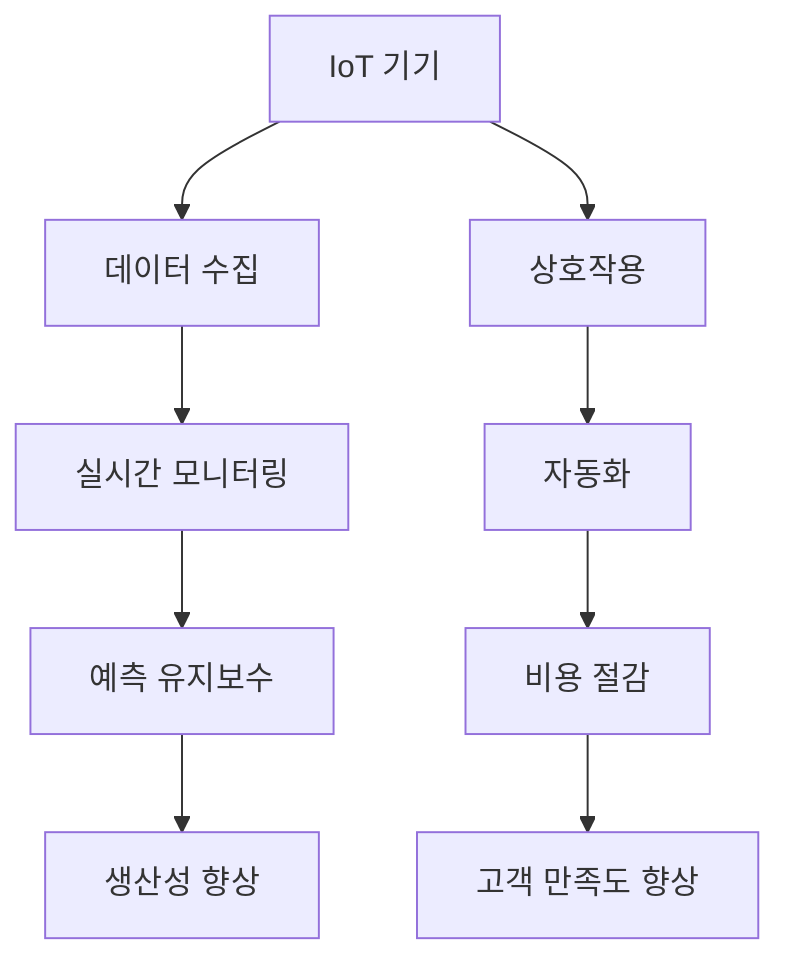

이와 같이 IoT는 다양한 산업 분야에서 혁신을 이끌고 있으며, 앞으로도 그 중요성은 더욱 커질 것으로 예상된다. IoT의 발전은 기업의 경쟁력을 높이는 데 필수적인 요소가 되고 있다.

<!--
## 2. IoT 기기 최적화를 위한 하드웨어 고려사항
   - 2.1. 적절한 하드웨어 성능 확보
   - 2.2. 내구성 있는 기능의 필요성
   - 2.3. 전원 요구 사항 이해하기
   - 2.4. 배터리 기술 및 선택 (리튬 이온 배터리 등)
-->

## IoT 기기 최적화를 위한 하드웨어 고려사항

IoT 기기를 최적화하기 위해서는 하드웨어의 여러 가지 요소를 고려해야 한다. 이 섹션에서는 적절한 하드웨어 성능 확보, 내구성 있는 기능의 필요성, 전원 요구 사항 이해하기, 그리고 배터리 기술 및 선택에 대해 다룰 것이다.

### 적절한 하드웨어 성능 확보

IoT 기기의 성능은 하드웨어의 사양에 크게 의존한다. CPU, 메모리, 저장 장치 등은 기기의 처리 속도와 데이터 처리 능력에 직접적인 영향을 미친다. 따라서, IoT 기기를 설계할 때는 사용될 애플리케이션의 요구 사항에 맞는 하드웨어 성능을 확보하는 것이 중요하다. 예를 들어, 실시간 데이터 처리가 필요한 경우, 고성능의 프로세서와 충분한 RAM을 갖춘 하드웨어가 필요하다.

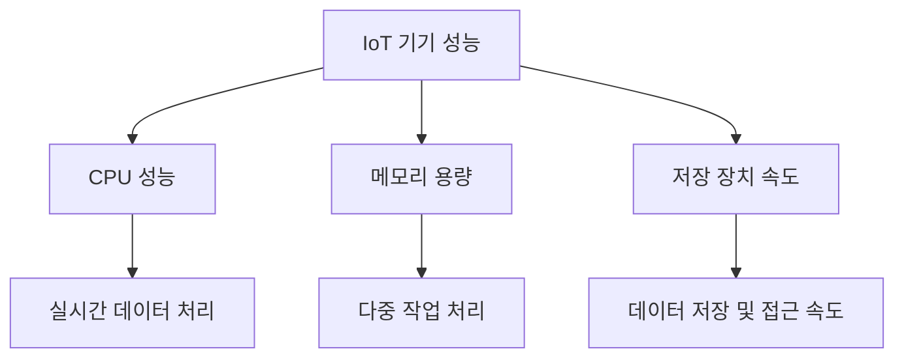

### 내구성 있는 기능의 필요성

IoT 기기는 다양한 환경에서 사용되기 때문에 내구성이 중요한 요소로 작용한다. 기기가 물리적 충격, 온도 변화, 습기 등 다양한 환경적 요인에 견딜 수 있어야 한다. 이를 위해서는 내구성이 높은 재료를 사용하고, 기기의 설계를 견고하게 해야 한다. 예를 들어, 산업용 IoT 기기는 방수 및 방진 기능을 갖추어야 하며, 이러한 기능은 기기의 수명을 연장하는 데 기여한다.

### 전원 요구 사항 이해하기

IoT 기기의 전원 요구 사항은 기기의 설계와 운영에 중요한 영향을 미친다. 전원 공급 방식에 따라 기기의 사용 가능성이 달라지기 때문에, 전원 요구 사항을 명확히 이해하는 것이 필수적이다. 예를 들어, 배터리로 작동하는 기기는 배터리 수명과 충전 주기를 고려해야 하며, AC 전원으로 작동하는 기기는 전원 안정성을 확보해야 한다.

### 배터리 기술 및 선택 (리튬 이온 배터리 등)

IoT 기기의 배터리 선택은 기기의 성능과 수명에 큰 영향을 미친다. 리튬 이온 배터리는 높은 에너지 밀도와 긴 수명으로 인해 IoT 기기에서 널리 사용된다. 그러나, 배터리의 용량, 충전 속도, 그리고 온도에 따른 성능 변화 등을 고려해야 한다. 또한, 배터리 관리 시스템(BMS)을 통해 배터리의 상태를 모니터링하고, 최적의 성능을 유지할 수 있도록 해야 한다.

이와 같은 하드웨어 고려사항을 통해 IoT 기기의 최적화를 이루어낼 수 있으며, 이는 궁극적으로 기기의 성능과 신뢰성을 높이는 데 기여한다.

<!--
## 3. 소프트웨어 업데이트 및 관리
   - 3.1. 소프트웨어 업데이트의 중요성
   - 3.2. 자동 업데이트 기능
   - 3.3. IoT 기기 관리 플랫폼의 활용
-->

## 소프트웨어 업데이트 및 관리

IoT 기기의 소프트웨어 업데이트 및 관리는 기기의 성능과 보안을 유지하는 데 필수적이다. 이 섹션에서는 소프트웨어 업데이트의 중요성, 자동 업데이트 기능, 그리고 IoT 기기 관리 플랫폼의 활용에 대해 다룰 것이다.

### 소프트웨어 업데이트의 중요성

소프트웨어 업데이트는 IoT 기기의 기능 개선, 보안 취약점 수정, 그리고 새로운 기능 추가를 위해 필요하다. IoT 기기는 다양한 환경에서 운영되며, 이로 인해 보안 위협에 노출될 가능성이 높다. 따라서 정기적인 소프트웨어 업데이트는 기기의 안전성을 높이고, 해킹이나 데이터 유출과 같은 사이버 공격으로부터 보호하는 데 중요한 역할을 한다.

예를 들어, 특정 IoT 기기에서 발견된 보안 취약점이 패치되지 않으면, 해커는 이를 악용하여 기기에 접근할 수 있다. 따라서 소프트웨어 업데이트는 단순한 기능 개선을 넘어, 기기의 생명과 직결되는 중요한 요소이다.

### 자동 업데이트 기능

자동 업데이트 기능은 IoT 기기의 소프트웨어를 사용자가 수동으로 업데이트할 필요 없이 자동으로 최신 버전으로 유지할 수 있도록 돕는다. 이 기능은 사용자의 편의성을 높이고, 보안 취약점을 신속하게 해결할 수 있는 장점이 있다.

자동 업데이트 기능을 구현하기 위해서는 다음과 같은 절차가 필요하다:

1. **업데이트 확인**: 기기가 정기적으로 서버에 접속하여 최신 소프트웨어 버전을 확인한다.
2. **다운로드**: 새로운 버전이 발견되면, 기기는 이를 자동으로 다운로드한다.
3. **설치**: 다운로드가 완료되면, 기기는 소프트웨어를 자동으로 설치하고 재부팅한다.

아래는 자동 업데이트 프로세스를 나타내는 다이어그램이다.

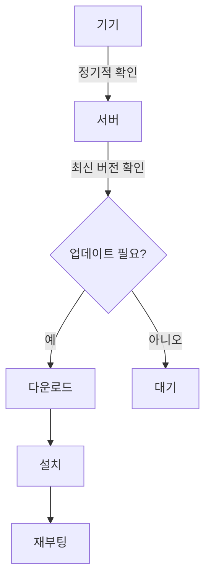

### IoT 기기 관리 플랫폼의 활용

IoT 기기 관리 플랫폼은 여러 IoT 기기를 중앙에서 관리하고 모니터링할 수 있는 시스템이다. 이러한 플랫폼은 소프트웨어 업데이트, 기기 상태 모니터링, 데이터 수집 및 분석 등의 기능을 제공한다. 이를 통해 기업은 기기의 성능을 최적화하고, 문제 발생 시 신속하게 대응할 수 있다.

IoT 기기 관리 플랫폼의 주요 기능은 다음과 같다:

- **원격 모니터링**: 기기의 상태를 실시간으로 확인할 수 있다.
- **소프트웨어 배포**: 여러 기기에 동시에 소프트웨어 업데이트를 배포할 수 있다.
- **데이터 분석**: 수집된 데이터를 분석하여 기기의 성능을 개선할 수 있는 인사이트를 제공한다.

이러한 플랫폼을 활용하면 IoT 기기의 관리 효율성을 높이고, 운영 비용을 절감할 수 있다. 따라서 IoT 기기 관리 플랫폼은 현대 IoT 생태계에서 필수적인 요소로 자리 잡고 있다.

<!--
## 4. 사이버 보안의 우선순위
   - 4.1. IoT 기기의 보안 위협
   - 4.2. 사이버 공격의 증가 추세
   - 4.3. 보안 강화 방안
-->

## 사이버 보안의 우선순위

IoT(Internet of Things) 기기는 다양한 산업 분야에서 널리 사용되고 있으며, 이로 인해 사이버 보안의 중요성이 더욱 부각되고 있다. IoT 기기는 서로 연결되어 데이터를 주고받기 때문에, 보안 위협에 노출될 가능성이 높다. 본 절에서는 IoT 기기의 보안 위협, 사이버 공격의 증가 추세, 그리고 보안 강화 방안에 대해 살펴보겠다.

### IoT 기기의 보안 위협

IoT 기기는 다양한 형태와 기능을 가지고 있지만, 그만큼 보안 취약점도 존재한다. 대표적인 보안 위협으로는 다음과 같은 것들이 있다.

- **데이터 유출**: IoT 기기가 수집한 데이터가 해커에 의해 유출될 수 있다. 이는 개인 정보나 기업의 기밀 정보가 포함될 수 있어 심각한 문제를 초래할 수 있다.
- **서비스 거부 공격(DoS)**: 해커가 IoT 기기에 과도한 요청을 보내 서비스가 중단되도록 할 수 있다. 이는 기업의 운영에 큰 영향을 미칠 수 있다.
- **악성 소프트웨어 감염**: IoT 기기가 악성 소프트웨어에 감염되면, 해커는 이를 통해 네트워크에 접근하거나 다른 기기를 공격할 수 있다.

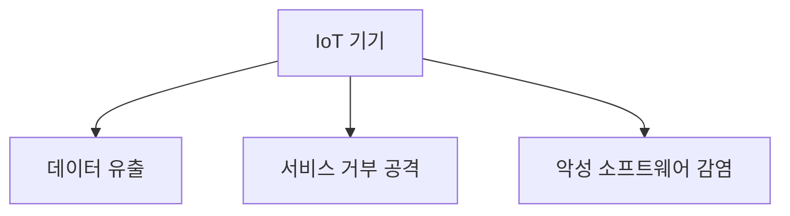

### 사이버 공격의 증가 추세

최근 몇 년간 IoT 기기를 겨냥한 사이버 공격이 급증하고 있다. 이는 IoT 기기의 보급이 증가함에 따라 해커들이 새로운 공격 벡터를 찾고 있기 때문이다. 특히, 다음과 같은 경향이 두드러진다.

- **봇넷 공격**: IoT 기기를 이용한 대규모 봇넷 공격이 증가하고 있다. 해커는 여러 IoT 기기를 감염시켜 이를 통해 대규모 공격을 감행할 수 있다.
- **랜섬웨어 공격**: IoT 기기를 대상으로 한 랜섬웨어 공격이 증가하고 있으며, 이는 기업의 운영에 심각한 영향을 미칠 수 있다.
- **취약점 악용**: IoT 기기의 보안 취약점을 악용하여 공격하는 사례가 늘어나고 있다. 이는 제조사에서 보안 패치를 제공하지 않거나, 사용자가 업데이트를 하지 않는 경우에 발생할 수 있다.

### 보안 강화 방안

IoT 기기의 보안을 강화하기 위해서는 여러 가지 방안을 고려해야 한다. 다음은 효과적인 보안 강화 방안이다.

- **정기적인 소프트웨어 업데이트**: IoT 기기의 소프트웨어를 정기적으로 업데이트하여 보안 취약점을 최소화해야 한다. 자동 업데이트 기능을 활용하는 것이 좋다.
- **강력한 인증 및 암호화**: IoT 기기에 강력한 인증 방식을 적용하고, 데이터 전송 시 암호화를 통해 보안을 강화해야 한다.
- **네트워크 분리**: IoT 기기를 별도의 네트워크에 분리하여, 해커가 접근하기 어렵도록 해야 한다. 이를 통해 공격의 범위를 제한할 수 있다.

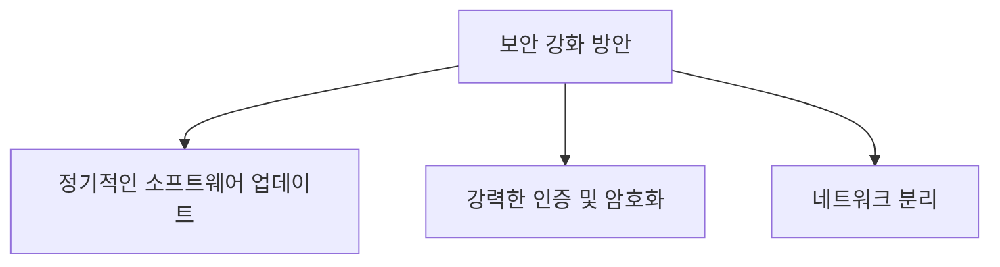

IoT 기기의 보안은 단순히 기술적인 문제를 넘어 기업의 신뢰성과 직결되는 중요한 요소이다. 따라서, 기업과 개인 모두가 보안에 대한 인식을 높이고, 적극적으로 대응해야 할 필요성이 있다.

<!--
## 5. 연결성 관리의 중요성
   - 5.1. 연결성 문제의 영향
   - 5.2. 데이터 전송 시간 및 지연
   - 5.3. 장치 응답성 및 배터리 수명
-->

## 연결성 관리의 중요성

IoT(Internet of Things) 기기들은 다양한 환경에서 서로 연결되어 데이터를 수집하고 전송하는 역할을 한다. 이러한 연결성 관리는 IoT 시스템의 성능과 효율성에 큰 영향을 미친다. 이 장에서는 연결성 관리의 중요성과 그로 인해 발생할 수 있는 문제들에 대해 살펴보겠다.

### 연결성 문제의 영향

연결성 문제는 IoT 기기의 성능에 직접적인 영향을 미친다. 불안정한 연결은 데이터 전송의 지연을 초래하고, 이는 실시간 데이터 수집 및 분석에 부정적인 영향을 미친다. 예를 들어, 스마트 홈 기기가 인터넷에 연결되지 않으면 사용자는 원격으로 기기를 제어할 수 없게 된다. 이러한 문제는 사용자 경험을 저하시킬 뿐만 아니라, IoT 시스템의 신뢰성을 떨어뜨린다.

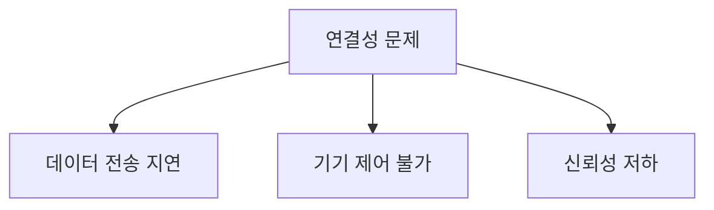

### 데이터 전송 시간 및 지연

데이터 전송 시간은 IoT 기기의 성능을 평가하는 중요한 지표 중 하나이다. 데이터가 수집된 후 클라우드 서버나 다른 기기로 전송되는 과정에서 지연이 발생할 수 있다. 이 지연은 네트워크의 대역폭, 지리적 거리, 그리고 사용 중인 프로토콜에 따라 달라진다. 예를 들어, 5G 네트워크를 활용하면 데이터 전송 시간이 크게 단축될 수 있지만, 여전히 연결이 불안정하다면 지연이 발생할 수 있다.

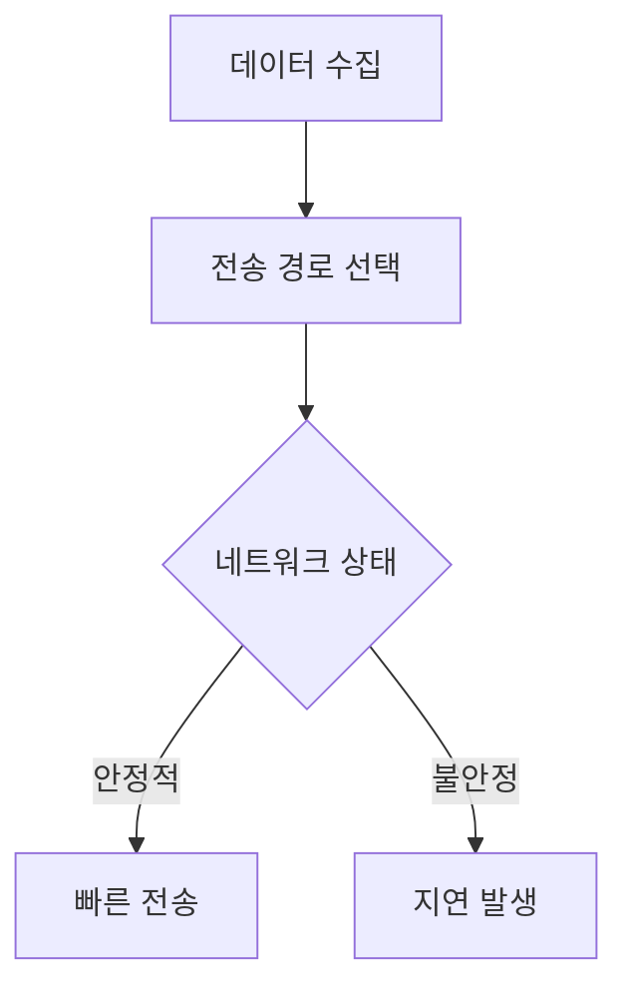

### 장치 응답성 및 배터리 수명

장치의 응답성은 사용자가 IoT 기기를 얼마나 빠르게 제어할 수 있는지를 나타낸다. 연결성이 불안정하면 장치의 응답성이 떨어져 사용자가 원하는 작업을 즉시 수행할 수 없게 된다. 또한, 연결을 유지하기 위해 지속적으로 전력을 소모하게 되면 배터리 수명에도 악영향을 미친다. 따라서, 효율적인 연결성 관리는 장치의 응답성을 높이고 배터리 수명을 연장하는 데 필수적이다.

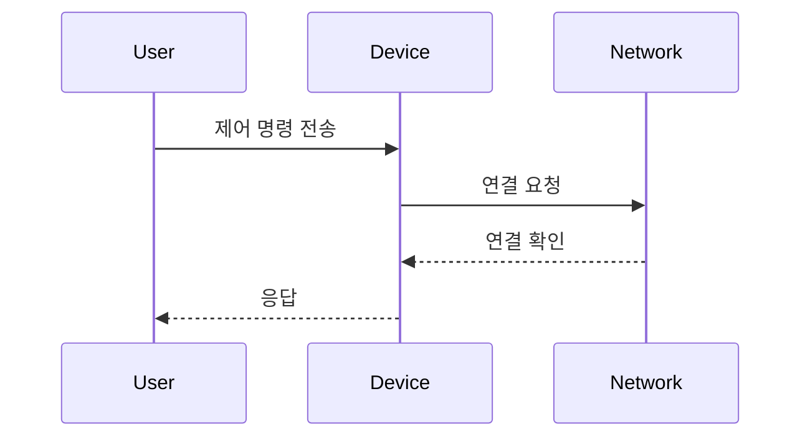

결론적으로, IoT 기기의 연결성 관리는 시스템의 전반적인 성능과 사용자 경험에 중대한 영향을 미친다. 따라서, 안정적이고 효율적인 연결성을 유지하기 위한 전략이 필요하다.

<!--
## 6. 효과적인 IoT 연결성 관리의 이점
   - 6.1. 장치 가동 시간 개선
   - 6.2. 데이터 보안 강화
   - 6.3. 장치 수명 연장
   - 6.4. 실시간 데이터 수집
-->

## 효과적인 IoT 연결성 관리의 이점

IoT 기기의 연결성 관리는 전체 시스템의 성능과 효율성에 큰 영향을 미친다. 효과적인 연결성 관리를 통해 얻을 수 있는 여러 가지 이점에 대해 살펴보겠다.

### 장치 가동 시간 개선

효과적인 연결성 관리는 IoT 기기의 가동 시간을 크게 개선할 수 있다. 안정적인 네트워크 연결을 유지함으로써 기기가 중단 없이 작동할 수 있으며, 이는 전체 시스템의 신뢰성을 높인다. 예를 들어, 스마트 공장에서는 기계가 지속적으로 데이터를 수집하고 전송해야 하므로, 연결성이 떨어지면 생산성이 저하될 수 있다.

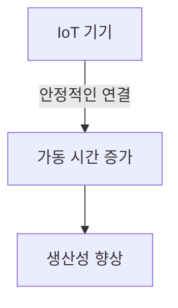

### 데이터 보안 강화

연결성 관리가 잘 이루어지면 데이터 보안도 강화된다. 안전한 연결을 통해 데이터 전송 중 발생할 수 있는 해킹이나 데이터 유출의 위험을 줄일 수 있다. 예를 들어, VPN(Virtual Private Network)이나 TLS(Transport Layer Security)와 같은 보안 프로토콜을 사용하여 데이터 전송을 암호화하면, 외부 공격으로부터 데이터를 보호할 수 있다.

### 장치 수명 연장

효과적인 연결성 관리는 장치의 수명도 연장할 수 있다. 불필요한 데이터 전송이나 연결 시도를 줄임으로써 배터리 소모를 최소화할 수 있다. 예를 들어, IoT 기기가 필요할 때만 데이터를 전송하도록 설정하면, 배터리 수명을 늘릴 수 있다. 이를 위해서는 적절한 전원 관리 전략이 필요하다.

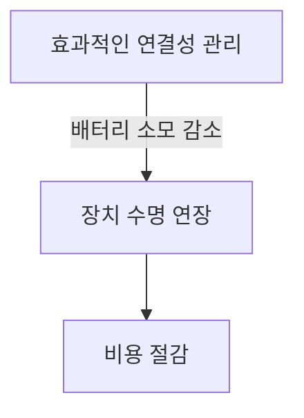

### 실시간 데이터 수집

효과적인 연결성 관리는 실시간 데이터 수집을 가능하게 한다. IoT 기기가 안정적으로 연결되어 있을 때, 데이터는 즉시 클라우드나 데이터베이스로 전송될 수 있다. 이는 데이터 분석 및 의사 결정 과정에서 중요한 역할을 하며, 기업이 신속하게 대응할 수 있도록 돕는다. 예를 들어, 스마트 시티에서는 교통 데이터를 실시간으로 수집하여 교통 혼잡을 줄이는 데 기여할 수 있다.

이와 같이, 효과적인 IoT 연결성 관리는 장치의 가동 시간 개선, 데이터 보안 강화, 장치 수명 연장, 실시간 데이터 수집 등 여러 가지 이점을 제공한다. 이러한 이점들은 IoT 시스템의 전반적인 성능을 향상시키고, 기업의 경쟁력을 높이는 데 기여한다.

<!--
## 7. Ultraviolet SIM의 기여
   - 7.1. 글로벌 네트워크 커버리지
   - 7.2. 동적 네트워크 선택
   - 7.3. 안전한 연결성
   - 7.4. 확장성과 유연성
   - 7.5. 관리 플랫폼의 기능
-->


<!--
## 8. 예제
   - IoT 기기 최적화 사례 연구
   - Ultraviolet SIM을 활용한 성공 사례
-->

## 예제

### IoT 기기 최적화 사례 연구

IoT 기기의 최적화는 다양한 산업에서 중요한 역할을 한다. 예를 들어, 스마트 농업 분야에서는 IoT 센서를 활용하여 토양의 수분, 온도 및 pH 수준을 실시간으로 모니터링할 수 있다. 이러한 데이터는 농작물의 성장에 최적화된 환경을 제공하는 데 기여한다. 

아래는 IoT 기기 최적화를 위한 간단한 아키텍처 다이어그램이다.

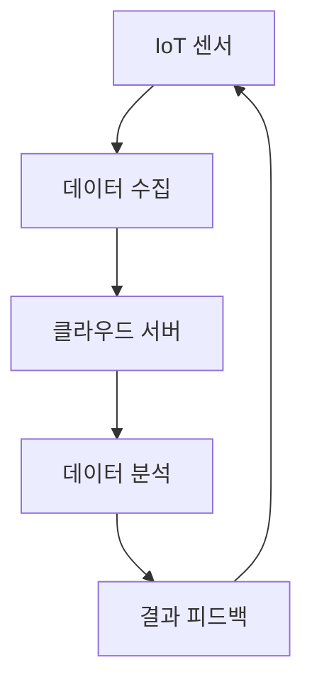

이러한 시스템은 데이터 수집과 분석을 통해 농부에게 실시간으로 정보를 제공하고, 이를 바탕으로 자동으로 관개 시스템을 조정할 수 있다. 이로 인해 물 사용량을 줄이고, 농작물의 생산성을 높일 수 있다.

<!--
## 9. FAQ
   - IoT 기기 최적화에 대한 자주 묻는 질문
   - Ultraviolet SIM의 서비스에 대한 질문
-->

## FAQ

### IoT 기기 최적화에 대한 자주 묻는 질문

**Q1: IoT 기기 최적화란 무엇인가요?**  
A1: IoT 기기 최적화는 기기의 성능, 전력 소비, 데이터 전송 효율성을 개선하여 전체 시스템의 효율성을 높이는 과정을 의미한다. 이를 통해 기기의 수명 연장과 운영 비용 절감이 가능하다.

**Q2: IoT 기기를 최적화하기 위해 어떤 하드웨어를 선택해야 하나요?**  
A2: IoT 기기를 최적화하기 위해서는 적절한 하드웨어 성능을 갖춘 기기를 선택해야 한다. 예를 들어, 저전력 소모와 높은 처리 능력을 가진 프로세서와 센서를 선택하는 것이 중요하다.

**Q3: 소프트웨어 업데이트는 왜 중요한가요?**  
A3: 소프트웨어 업데이트는 보안 취약점을 수정하고 새로운 기능을 추가하는 데 필수적이다. 정기적인 업데이트를 통해 IoT 기기의 안정성과 보안을 유지할 수 있다.

**Q4: IoT 기기의 배터리 수명을 늘리기 위한 방법은 무엇인가요?**  
A4: IoT 기기의 배터리 수명을 늘리기 위해서는 전원 관리 기술을 활용하고, 저전력 모드와 같은 기능을 구현하는 것이 중요하다. 또한, 배터리 기술 선택 시 리튬 이온 배터리와 같은 고효율 배터리를 고려해야 한다.

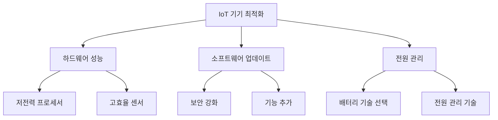


<!--
## 10. 관련 기술
   - IoT와 클라우드 컴퓨팅
   - 엣지 컴퓨팅과 IoT
   - 5G와 IoT의 미래
-->

## 관련 기술

### IoT와 클라우드 컴퓨팅

IoT(Internet of Things) 기기는 대량의 데이터를 생성하고 이를 처리하기 위해 클라우드 컴퓨팅을 활용한다. 클라우드 컴퓨팅은 데이터 저장, 처리 및 분석을 위한 유연한 인프라를 제공하며, IoT 기기에서 수집된 데이터를 중앙에서 관리할 수 있도록 한다. 이를 통해 기업은 데이터에 대한 접근성을 높이고, 실시간 분석을 통해 의사 결정을 지원할 수 있다.

예를 들어, 스마트 홈 기기는 클라우드 서버에 데이터를 전송하여 사용자에게 실시간 상태를 제공하고, 사용자는 모바일 애플리케이션을 통해 언제 어디서나 기기를 제어할 수 있다. 이러한 구조는 IoT 기기의 효율성을 극대화하고, 사용자 경험을 향상시키는 데 기여한다.

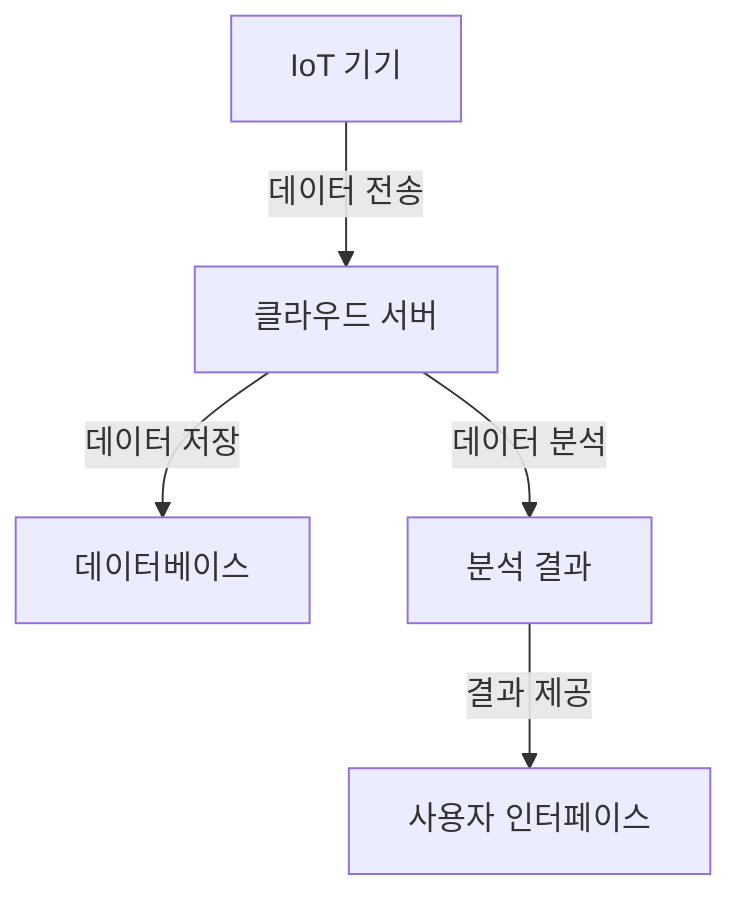

### 엣지 컴퓨팅과 IoT

엣지 컴퓨팅(Edge Computing)은 IoT 기기와 클라우드 서버 간의 데이터 처리 방식을 변화시키는 기술이다. 데이터가 생성되는 위치에서 가까운 곳에서 처리함으로써 지연 시간을 줄이고, 대역폭을 절약할 수 있다. 이는 특히 실시간 데이터 처리가 중요한 IoT 애플리케이션에서 큰 장점을 제공한다.

예를 들어, 자율주행차는 주변 환경을 실시간으로 인식하고 반응해야 하므로, 엣지 컴퓨팅을 통해 차량 내에서 데이터를 즉시 처리하고 의사 결정을 내릴 수 있다. 이를 통해 안전성을 높이고, 빠른 반응 속도를 유지할 수 있다.

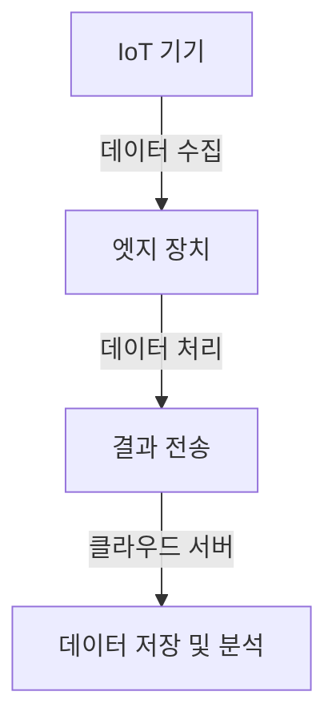

### 5G와 IoT의 미래

5G 네트워크는 IoT 기기의 연결성을 혁신적으로 변화시킬 것으로 기대된다. 5G는 높은 데이터 전송 속도, 낮은 지연 시간, 그리고 대량의 기기를 동시에 연결할 수 있는 능력을 제공한다. 이러한 특성은 IoT 기기가 더욱 원활하게 통신하고, 실시간 데이터 전송을 가능하게 한다.

예를 들어, 스마트 시티에서는 5G를 통해 다양한 IoT 기기가 실시간으로 데이터를 주고받으며, 교통 관리, 에너지 효율성, 공공 안전 등을 개선할 수 있다. 5G의 도입은 IoT의 발전을 가속화하고, 새로운 비즈니스 모델과 서비스의 출현을 촉진할 것이다.

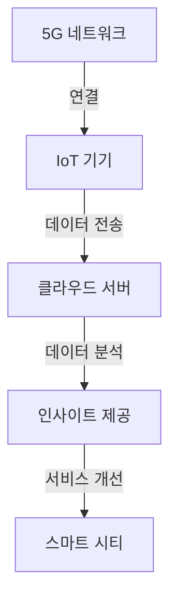

이와 같이 IoT는 클라우드 컴퓨팅, 엣지 컴퓨팅, 5G와 같은 관련 기술과의 융합을 통해 더욱 발전하고 있으며, 이는 다양한 산업 분야에서 혁신을 이끌어낼 것이다.

<!--
## 11. 결론
   - IoT 기기 최적화의 중요성 요약
   - Ultraviolet SIM의 역할과 향후 전망
-->

## 결론

IoT 기기 최적화는 현대 산업 환경에서 필수적인 요소이다. IoT 기기가 다양한 환경에서 효과적으로 작동하기 위해서는 하드웨어와 소프트웨어의 최적화가 필요하다. 이를 통해 기기의 성능을 극대화하고, 데이터 전송의 효율성을 높이며, 보안성을 강화할 수 있다. 특히, IoT 기기의 수가 증가함에 따라 연결성 관리와 보안의 중요성이 더욱 부각되고 있다. 


<!--
## 12. 추가 자료
   - 참고 문헌 및 링크
   - 관련 블로그 및 기사 추천
-->

## 추가 자료

IoT 기기 최적화와 관련된 내용을 더 깊이 이해하기 위해서는 다양한 참고 자료와 블로그, 기사를 활용하는 것이 중요하다. 이 섹션에서는 유용한 참고 문헌 및 링크, 그리고 관련 블로그와 기사를 추천하고자 한다.

### 참고 문헌 및 링크

1. **"Internet of Things: A Comprehensive Guide"** - 이 책은 IoT의 기본 개념부터 시작하여, 다양한 응용 사례와 기술적 세부 사항을 다룬다. IoT 기기 최적화에 대한 심도 있는 이해를 제공한다.
   
2. **IEEE Xplore** - IoT와 관련된 최신 연구 논문과 기술 문서를 찾을 수 있는 플랫폼이다. 다양한 분야의 연구 결과를 통해 IoT 기기 최적화에 대한 최신 동향을 파악할 수 있다.

3. **"The IoT Handbook"** - 이 핸드북은 IoT 기기의 설계, 구현 및 최적화에 대한 실용적인 가이드를 제공한다. 특히 하드웨어와 소프트웨어의 통합적인 접근 방식을 강조한다.

4. **IoT Analytics** - IoT 시장과 기술에 대한 분석 보고서를 제공하는 웹사이트로, 최신 트렌드와 통계 자료를 통해 IoT 기기 최적화의 필요성을 이해하는 데 도움을 준다.

### 관련 블로그 및 기사 추천

1. **"Optimizing IoT Devices for Performance"** - 이 블로그 포스트에서는 IoT 기기의 성능을 최적화하기 위한 다양한 전략과 기술을 소개한다. 실제 사례를 통해 이해를 돕는다.

2. **"The Importance of Software Updates in IoT"** - IoT 기기의 소프트웨어 업데이트의 중요성을 다룬 기사로, 보안과 성능 향상에 미치는 영향을 설명한다.

3. **"Understanding Battery Technologies for IoT Devices"** - IoT 기기에 적합한 배터리 기술에 대한 블로그 포스트로, 리튬 이온 배터리의 장단점과 선택 기준을 제시한다.

### 샘플 코드

아래는 IoT 기기에서 소프트웨어 업데이트를 자동으로 수행하는 간단한 Python 코드 예제이다.

```python
import requests

def check_for_updates(current_version):
    response = requests.get("https://api.example.com/latest-version")
    latest_version = response.json().get("version")
    
    if latest_version > current_version:
        print("New update available!")
        download_update(latest_version)
    else:
        print("You are using the latest version.")

def download_update(version):
    print(f"Downloading version {version}...")
    # 다운로드 로직 추가
    print("Update downloaded successfully.")

current_version = "1.0.0"
check_for_updates(current_version)
```

### 다이어그램

아래는 IoT 기기 최적화 프로세스를 나타내는 다이어그램이다.

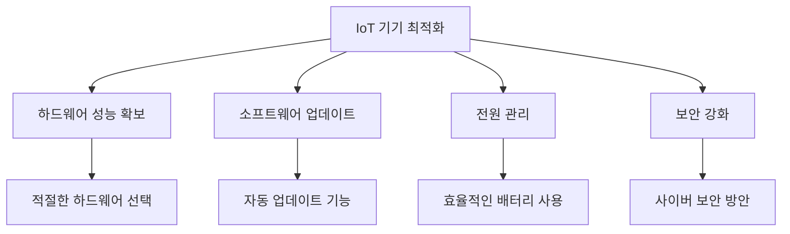

이와 같은 자료들은 IoT 기기 최적화에 대한 이해를 높이고, 실제 적용에 있어 유용한 정보를 제공할 것이다.

<!--
##### Reference #####
-->

## Reference


* [https://dzone.com/articles/optimizing-iot-performance-in-industrial-environments](https://dzone.com/articles/optimizing-iot-performance-in-industrial-environments)
* [https://upfiv.com/optimizing-iot-device-performance-tips-and-techniques/](https://upfiv.com/optimizing-iot-device-performance-tips-and-techniques/)
* [https://ultravioletsim.com/maximizing-optimizing-iot-device-performance/](https://ultravioletsim.com/maximizing-optimizing-iot-device-performance/)

