이 글에서는 Python에서 System V IPC를 활용하여 공유 메모리와 세마포어를 사용하는 방법에 대해 설명한다. System V IPC는 Unix 계열 운영체제에서 프로세스 간 통신을 위한 메커니즘으로, 공유 메모리, 세마포어, 메시지 큐를 포함한다. Python 3.7 환경에서 추가 라이브러리 없이도 C의 System V API를 사용할 수 있도록 ctypes를 활용한 간단한 래퍼를 작성하였다. 이 래퍼는 shmget, shmat, shmdt, shmctl과 같은 C 함수를 Python에서 호출할 수 있게 해준다. 공유 메모리 세그먼트를 생성하고, 이를 프로세스의 메모리에 매핑하여 데이터를 읽고 쓸 수 있는 방법을 보여준다. 또한, 세마포어를 사용하여 프로세스 간의 동기화를 관리하는 방법도 다룬다. 이 글은 향후 참고를 위해 작성되었으며, 코드 예제와 함께 System V IPC의 기본 개념을 이해하는 데 도움이 될 것이다. Python의 ctypes 모듈을 통해 C API를 호출하는 과정은 다소 복잡할 수 있지만, 이를 통해 프로세스 간의 데이터 공유와 동기화를 효과적으로 구현할 수 있다.


<!--
##### Outline #####
-->

<!--
# 목차

## 개요
   - System V IPC와 POSIX IPC 소개
   - Python에서의 공유 메모리 사용 필요성
   - 제약 사항: Python 3.7 및 추가 라이브러리 없음

## System V 공유 메모리 API
   - `shmget(2)` 함수 설명
   - `shmat(2)`, `shmdt(2)`, `shmctl(2)` 함수 설명
   - C와 Python 간의 데이터 타입 변환

## Python에서의 System V 공유 메모리 래퍼
   - ctypes를 이용한 라이브러리 로딩
   - `shmget` 함수 래핑
   - `shmat`, `shmdt`, `shmctl` 함수 래핑
   - void 포인터 처리 방법

## 공유 메모리 세그먼트 생성 및 관리
   - 공유 메모리 세그먼트 생성 예제
   - 세그먼트 ID 확인 및 삭제 방법
   - 세그먼트 파괴를 위한 `shmctl` 래퍼

## 메시지 전송 실험
   - 공유 메모리를 통한 메시지 전송 방법
   - Pascal 스타일 문자열 작성 및 읽기
   - 예제 코드: 메시지 쓰기 및 읽기

## System V IPC 모듈
   - `sysv_ipc` 모듈 소개
   - 세마포어, 공유 메모리, 메시지 큐 기능
   - 모듈 함수 및 상수 설명
   - 모듈 오류 처리

## 세마포어 및 메시지 큐
   - 세마포어 클래스 및 메서드
   - 메시지 큐 클래스 및 메서드
   - 세마포어 및 메시지 큐의 사용 예제

## 관련 기술
   - POSIX IPC와의 비교
   - Python 3.8 이후의 공유 메모리 추상화
   - Cygwin을 통한 Windows에서의 IPC 사용

## FAQ
   - System V IPC와 POSIX IPC의 차이점은 무엇인가요?
   - Python에서 공유 메모리를 사용할 때 주의할 점은 무엇인가요?
   - 세마포어와 메시지 큐의 차이점은 무엇인가요?

## 결론
   - Python에서 System V IPC를 사용하는 장점
   - 향후 개선 사항 및 추가 기능 제안
   - 개인 GitHub 저장소 및 코드 공유 안내

## 참고 자료
   - 관련 문서 및 링크
   - `man` 페이지 및 시스템 API 문서
   - Python 패키지 설치 및 사용법 안내
-->

<!--
## 개요
   - System V IPC와 POSIX IPC 소개
   - Python에서의 공유 메모리 사용 필요성
   - 제약 사항: Python 3.7 및 추가 라이브러리 없음
-->

## 개요

**System V IPC와 POSIX IPC 소개**  
Inter-Process Communication(IPC)은 여러 프로세스 간의 데이터 전송 및 통신을 가능하게 하는 메커니즘이다. IPC의 두 가지 주요 구현 방식은 System V IPC와 POSIX IPC이다. System V IPC는 오래된 UNIX 시스템에서 유래된 방식으로, 세마포어, 메시지 큐, 공유 메모리와 같은 다양한 IPC 메커니즘을 제공한다. 반면, POSIX IPC는 더 현대적인 접근 방식을 제공하며, POSIX 표준을 준수하는 시스템에서 사용된다. 두 방식 모두 프로세스 간의 효율적인 데이터 공유를 가능하게 하지만, 사용법과 API가 다르다.

**Python에서의 공유 메모리 사용 필요성**  
Python은 다양한 데이터 처리 및 분석 작업에 널리 사용되지만, 멀티프로세싱 환경에서의 데이터 공유는 종종 도전 과제가 된다. 공유 메모리는 여러 프로세스가 동일한 메모리 공간에 접근할 수 있도록 하여, 데이터 전송의 오버헤드를 줄이고 성능을 향상시킬 수 있다. 특히 대량의 데이터를 처리하는 경우, 공유 메모리를 사용하면 메모리 복사 비용을 줄일 수 있어 효율적이다.

**제약 사항: Python 3.7 및 추가 라이브러리 없음**  
이번 글에서는 Python 3.7을 기준으로 하며, 추가적인 라이브러리 없이 System V IPC를 활용하는 방법에 대해 설명할 것이다. 이는 Python의 기본 기능만을 사용하여 IPC를 구현하는 방법을 보여주기 위함이다. 따라서, 사용자는 Python 3.7 환경에서 직접 코드를 실행하고 테스트할 수 있다.

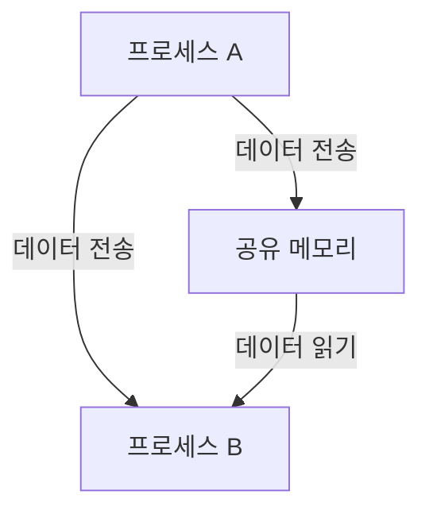

위의 다이어그램은 프로세스 A와 프로세스 B가 공유 메모리를 통해 데이터를 전송하는 과정을 나타낸다. 공유 메모리는 두 프로세스 간의 데이터 전송을 효율적으로 처리할 수 있는 매개체 역할을 한다.

<!--
## System V 공유 메모리 API
   - `shmget(2)` 함수 설명
   - `shmat(2)`, `shmdt(2)`, `shmctl(2)` 함수 설명
   - C와 Python 간의 데이터 타입 변환
-->

## System V 공유 메모리 API

System V IPC(Inter-Process Communication)에서 공유 메모리를 사용하기 위해서는 몇 가지 주요 API를 이해해야 한다. 이 섹션에서는 `shmget`, `shmat`, `shmdt`, `shmctl` 함수에 대해 설명하고, C와 Python 간의 데이터 타입 변환 방법에 대해 다룬다.

**`shmget(2)` 함수 설명**

`shmget` 함수는 공유 메모리 세그먼트를 생성하거나 기존의 세그먼트를 가져오는 데 사용된다. 이 함수는 다음과 같은 매개변수를 가진다:

- `key`: 공유 메모리 세그먼트를 식별하는 키 값
- `size`: 세그먼트의 크기(바이트 단위)
- `shmflg`: 세그먼트의 생성 플래그

이 함수는 성공적으로 호출되면 공유 메모리 세그먼트의 식별자(세그먼트 ID)를 반환하며, 실패할 경우 -1을 반환한다. 아래는 `shmget` 함수의 사용 예제이다.

```c
#include <sys/ipc.h>
#include <sys/shm.h>
#include <stdio.h>

int main() {
    key_t key = 1234; // 공유 메모리 키
    int shmid = shmget(key, 1024, IPC_CREAT | 0666); // 1KB 크기의 공유 메모리 생성

    if (shmid < 0) {
        perror("shmget failed");
        return 1;
    }
    printf("Shared memory ID: %d\n", shmid);
    return 0;
}
```

**`shmat(2)`, `shmdt(2)`, `shmctl(2)` 함수 설명**

- `shmat`: 이 함수는 공유 메모리 세그먼트를 프로세스의 주소 공간에 첨부하는 데 사용된다. 반환값은 세그먼트의 시작 주소이다.
- `shmdt`: 이 함수는 프로세스의 주소 공간에서 공유 메모리 세그먼트를 분리하는 데 사용된다.
- `shmctl`: 이 함수는 공유 메모리 세그먼트에 대한 제어 작업을 수행하는 데 사용된다. 예를 들어, 세그먼트를 삭제하거나 상태 정보를 조회할 수 있다.

아래는 이들 함수의 사용 예제이다.

```c
#include <sys/ipc.h>
#include <sys/shm.h>
#include <stdio.h>
#include <string.h>

int main() {
    key_t key = 1234;
    int shmid = shmget(key, 1024, IPC_CREAT | 0666);
    char *data = (char *)shmat(shmid, NULL, 0); // 공유 메모리 첨부

    strcpy(data, "Hello, Shared Memory!"); // 데이터 쓰기
    printf("Data in shared memory: %s\n", data);

    shmdt(data); // 공유 메모리 분리
    shmctl(shmid, IPC_RMID, NULL); // 공유 메모리 삭제
    return 0;
}
```

**C와 Python 간의 데이터 타입 변환**

C와 Python 간의 데이터 타입 변환은 공유 메모리를 사용할 때 중요한 부분이다. C에서는 기본적으로 바이트 배열을 사용하지만, Python에서는 다양한 데이터 타입을 지원한다. Python의 `ctypes` 모듈을 사용하여 C의 데이터 타입을 Python에서 사용할 수 있도록 변환할 수 있다.

예를 들어, C의 `int` 타입은 Python의 `ctypes.c_int`로 변환할 수 있으며, C의 `char` 배열은 `ctypes.create_string_buffer`를 사용하여 처리할 수 있다. 아래는 Python에서 C의 데이터 타입을 사용하는 예제이다.

```python
import ctypes
import sysv_ipc

key = 1234
shm = sysv_ipc.SharedMemory(key, sysv_ipc.IPC_CREAT, size=1024)

# C의 int 타입을 Python에서 사용
data = ctypes.c_int(42)
shm.write(data)

# 공유 메모리에서 데이터 읽기
read_data = ctypes.c_int.from_buffer_copy(shm.read(ctypes.sizeof(data)))
print(f"Data from shared memory: {read_data.value}")

shm.remove()  # 공유 메모리 삭제
```

이와 같이 System V 공유 메모리 API를 활용하면 프로세스 간의 데이터 공유가 가능해지며, C와 Python 간의 데이터 타입 변환을 통해 두 언어 간의 원활한 통신이 이루어질 수 있다. 

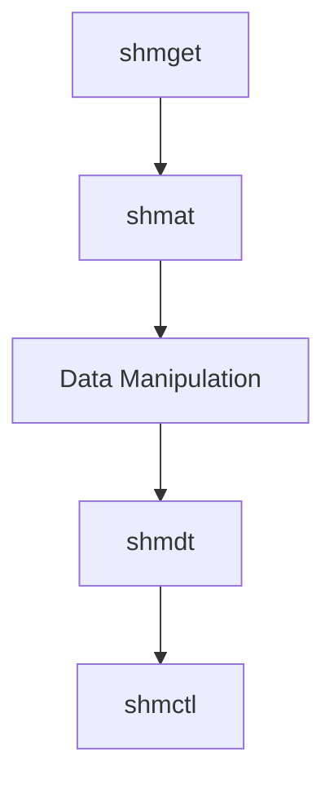

위의 다이어그램은 System V 공유 메모리 API의 흐름을 나타낸다. `shmget`으로 세그먼트를 생성하고, `shmat`으로 첨부한 후, 데이터를 조작하고, `shmdt`로 분리하며, 마지막으로 `shmctl`로 세그먼트를 관리하는 과정을 보여준다.

<!--
## Python에서의 System V 공유 메모리 래퍼
   - ctypes를 이용한 라이브러리 로딩
   - `shmget` 함수 래핑
   - `shmat`, `shmdt`, `shmctl` 함수 래핑
   - void 포인터 처리 방법
-->

## Python에서의 System V 공유 메모리 래퍼

Python에서 System V IPC를 사용하기 위해서는 C 언어로 작성된 시스템 호출을 호출할 수 있는 방법이 필요하다. 이를 위해 `ctypes` 라이브러리를 사용하여 C 라이브러리를 로딩하고, 필요한 함수들을 래핑하는 과정을 설명하겠다.

**ctypes를 이용한 라이브러리 로딩**

`ctypes`는 Python에서 C 라이브러리를 호출할 수 있도록 해주는 라이브러리이다. System V IPC의 공유 메모리 관련 함수들은 C 라이브러리에 정의되어 있으므로, 이를 로딩하여 사용할 수 있다. 다음은 `ctypes`를 이용하여 C 라이브러리를 로딩하는 예제 코드이다.

```python
import ctypes

# C 라이브러리 로딩
libc = ctypes.CDLL("libc.so.6")
```

**shmget 함수 래핑**

`shmget` 함수는 공유 메모리 세그먼트를 생성하거나 기존 세그먼트를 가져오는 함수이다. 이 함수를 Python에서 사용하기 위해 래핑하는 방법은 다음과 같다.

```python
def shmget(key, size, shmflg):
    return libc.shmget(key, size, shmflg)
```

**shmat, shmdt, shmctl 함수 래핑**

`shmat`, `shmdt`, `shmctl` 함수도 마찬가지로 래핑하여 사용할 수 있다. 이 함수들은 각각 공유 메모리 세그먼트를 프로세스의 주소 공간에 첨부하거나 분리하고, 세그먼트의 제어 작업을 수행하는 함수이다.

```python
def shmat(shmid, shmaddr, shmflg):
    return libc.shmat(shmid, shmaddr, shmflg)

def shmdt(shmaddr):
    return libc.shmdt(shmaddr)

def shmctl(shmid, cmd, buf):
    return libc.shmctl(shmid, cmd, buf)
```

**void 포인터 처리 방법**

C 언어에서의 `void*` 포인터는 특정한 데이터 타입이 없는 포인터를 의미한다. Python에서는 이러한 포인터를 처리하기 위해 `ctypes`의 `c_void_p`를 사용할 수 있다. 다음은 `void*` 포인터를 처리하는 방법의 예시이다.

```python
from ctypes import c_void_p

# void 포인터를 사용하여 공유 메모리 주소를 처리
shm_addr = shmat(shmid, 0, 0)
data = ctypes.cast(shm_addr, c_void_p)
```

이와 같이 `ctypes`를 이용하여 System V IPC의 공유 메모리 관련 함수를 래핑하고, Python에서 사용할 수 있도록 준비할 수 있다. 이러한 래퍼를 통해 Python에서도 C의 성능을 활용하여 효율적인 IPC를 구현할 수 있다.

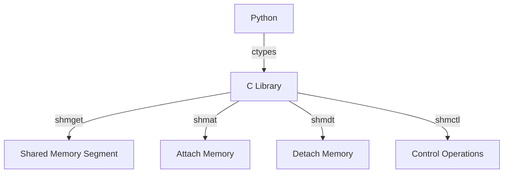

위의 다이어그램은 Python에서 `ctypes`를 사용하여 C 라이브러리의 공유 메모리 관련 함수들을 호출하는 과정을 나타낸다. 이러한 구조를 통해 Python에서도 효율적인 IPC를 구현할 수 있다.

<!--
## 공유 메모리 세그먼트 생성 및 관리
   - 공유 메모리 세그먼트 생성 예제
   - 세그먼트 ID 확인 및 삭제 방법
   - 세그먼트 파괴를 위한 `shmctl` 래퍼
-->

## 공유 메모리 세그먼트 생성 및 관리

공유 메모리 세그먼트는 프로세스 간의 데이터 공유를 가능하게 하는 중요한 구성 요소이다. 이 섹션에서는 공유 메모리 세그먼트를 생성하고 관리하는 방법에 대해 설명하겠다.

**공유 메모리 세그먼트 생성 예제**

공유 메모리 세그먼트를 생성하기 위해서는 `shmget` 함수를 사용해야 한다. 이 함수는 공유 메모리 세그먼트를 생성하고, 해당 세그먼트에 대한 식별자(세그먼트 ID)를 반환한다. 아래는 Python에서 `ctypes`를 사용하여 공유 메모리 세그먼트를 생성하는 예제 코드이다.

```python
import ctypes
import os

# 공유 메모리 세그먼트 생성
def create_shared_memory(size):
    # shmget 호출을 위한 C 함수 정의
    libc = ctypes.CDLL("libc.so.6")
    key = 1234  # 임의의 키 값
    shm_id = libc.shmget(key, size, 0o600 | 0o2000)  # IPC_CREAT | S_IRUSR | S_IWUSR
    if shm_id < 0:
        raise Exception("Failed to create shared memory segment")
    return shm_id

# 예제 실행
if __name__ == "__main__":
    shm_id = create_shared_memory(1024)  # 1024 바이트 크기의 공유 메모리 생성
    print(f"Created shared memory segment with ID: {shm_id}")
```

**세그먼트 ID 확인 및 삭제 방법**

생성된 공유 메모리 세그먼트의 ID를 확인하고, 필요에 따라 삭제할 수 있다. 세그먼트 ID는 `shmget` 호출의 반환값으로 얻을 수 있으며, 삭제는 `shmctl` 함수를 사용하여 수행한다. 아래는 세그먼트 ID를 확인하고 삭제하는 예제 코드이다.

```python
def delete_shared_memory(shm_id):
    libc = ctypes.CDLL("libc.so.6")
    result = libc.shmctl(shm_id, 0, None)  # IPC_RMID
    if result < 0:
        raise Exception("Failed to delete shared memory segment")

# 예제 실행
if __name__ == "__main__":
    shm_id = create_shared_memory(1024)
    print(f"Created shared memory segment with ID: {shm_id}")
    delete_shared_memory(shm_id)
    print(f"Deleted shared memory segment with ID: {shm_id}")
```

**세그먼트 파괴를 위한 `shmctl` 래퍼**

`shmctl` 함수는 공유 메모리 세그먼트의 제어 작업을 수행하는 데 사용된다. 이 함수는 세그먼트의 삭제, 상태 확인 등의 작업을 지원한다. 아래는 `shmctl`을 래핑한 간단한 함수 예제이다.

```python
def shmctl_wrapper(shm_id, cmd):
    libc = ctypes.CDLL("libc.so.6")
    result = libc.shmctl(shm_id, cmd, None)
    if result < 0:
        raise Exception("Failed to control shared memory segment")
    return result

# 예제 실행
if __name__ == "__main__":
    shm_id = create_shared_memory(1024)
    print(f"Created shared memory segment with ID: {shm_id}")
    shmctl_wrapper(shm_id, 0)  # IPC_RMID
    print(f"Controlled shared memory segment with ID: {shm_id}")
```

아래는 공유 메모리 세그먼트 생성 및 관리 과정을 나타내는 다이어그램이다.

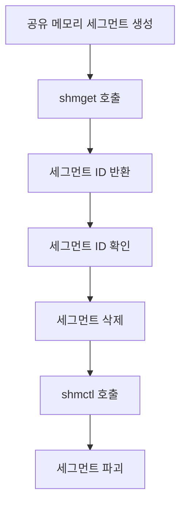

이와 같이 공유 메모리 세그먼트를 생성하고 관리하는 방법을 이해하면, 프로세스 간의 효율적인 데이터 공유가 가능해진다.

<!--
## 메시지 전송 실험
   - 공유 메모리를 통한 메시지 전송 방법
   - Pascal 스타일 문자열 작성 및 읽기
   - 예제 코드: 메시지 쓰기 및 읽기
-->

## 메시지 전송 실험

**공유 메모리를 통한 메시지 전송 방법** 
공유 메모리는 프로세스 간의 데이터 공유를 위한 효율적인 방법이다. 이를 통해 여러 프로세스가 동일한 메모리 공간에 접근하여 데이터를 읽고 쓸 수 있다. 메시지 전송을 위해 공유 메모리를 사용할 때는 먼저 공유 메모리 세그먼트를 생성하고, 해당 세그먼트에 데이터를 작성한 후, 다른 프로세스가 이를 읽는 방식으로 진행된다. 이 과정은 다음과 같은 단계로 이루어진다.

1. 공유 메모리 세그먼트 생성
2. 데이터 작성
3. 데이터 읽기
4. 세그먼트 해제

**Pascal 스타일 문자열 작성 및 읽기** 
Pascal 스타일 문자열은 문자열의 길이를 포함하는 형식으로, 문자열의 시작 부분에 길이를 저장한다. 이 방식은 문자열의 끝을 찾기 위해 추가적인 탐색이 필요 없으므로 효율적이다. 공유 메모리에서 Pascal 스타일 문자열을 작성하고 읽는 방법은 다음과 같다.

- 문자열의 길이를 첫 번째 바이트에 저장
- 문자열 데이터를 그 뒤에 저장

예를 들어, "Hello"라는 문자열을 공유 메모리에 저장할 경우, 메모리 구조는 다음과 같다.

```
| Length | Character Data |
|--------|----------------|
|   5    | H  e  l  l  o  |
```

**예제 코드: 메시지 쓰기 및 읽기** 
아래는 Python에서 공유 메모리를 사용하여 메시지를 쓰고 읽는 예제 코드이다. 이 코드는 `ctypes` 라이브러리를 사용하여 System V IPC의 공유 메모리 기능을 활용한다.

```python
import ctypes
import sysv_ipc

# 공유 메모리 세그먼트 생성
key = 1234
size = 256
shm = sysv_ipc.SharedMemory(key, sysv_ipc.IPC_CREAT, size)

# 메시지 작성 (Pascal 스타일)
message = "Hello"
length = len(message)
data = ctypes.create_string_buffer(size)
data[0] = length  # 첫 바이트에 길이 저장
data[1:length + 1] = message.encode('utf-8')  # 문자열 저장

# 공유 메모리에 데이터 쓰기
shm.write(data.raw)

# 공유 메모리에서 데이터 읽기
read_data = shm.read(size)
read_length = read_data[0]  # 첫 바이트에서 길이 읽기
read_message = read_data[1:read_length + 1].decode('utf-8')  # 문자열 읽기

print(f"읽은 메시지: {read_message}")

# 공유 메모리 해제
shm.remove()
```

위의 코드는 공유 메모리를 생성하고, 메시지를 작성한 후, 이를 읽어 출력하는 과정을 보여준다. 이와 같은 방식으로 여러 프로세스 간에 메시지를 전송할 수 있다.

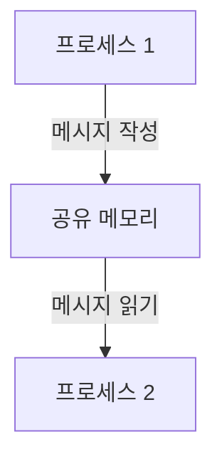

위의 다이어그램은 프로세스 1이 공유 메모리에 메시지를 작성하고, 프로세스 2가 이를 읽는 과정을 나타낸다. 공유 메모리를 통해 두 프로세스 간의 데이터 전송이 이루어지는 구조이다.

<!--
## System V IPC 모듈
   - `sysv_ipc` 모듈 소개
   - 세마포어, 공유 메모리, 메시지 큐 기능
   - 모듈 함수 및 상수 설명
   - 모듈 오류 처리
-->

## System V IPC 모듈

**`sysv_ipc` 모듈 소개** 
`sysv_ipc` 모듈은 Python에서 System V IPC(Inter-Process Communication) 기능을 사용할 수 있도록 해주는 라이브러리이다. 이 모듈은 세마포어, 공유 메모리, 메시지 큐와 같은 IPC 메커니즘을 지원하여 프로세스 간의 데이터 공유 및 동기화를 가능하게 한다. Python에서 System V IPC를 쉽게 사용할 수 있도록 다양한 클래스와 메서드를 제공한다.

**세마포어, 공유 메모리, 메시지 큐 기능** 
`sysv_ipc` 모듈은 다음과 같은 주요 기능을 제공한다:

1.**세마포어(Semaphore)**: 프로세스 간의 동기화를 위해 사용되며, 특정 자원에 대한 접근을 제어하는 데 유용하다.
2.**공유 메모리(Shared Memory)**: 여러 프로세스가 동일한 메모리 공간에 접근할 수 있도록 하여 데이터 공유를 가능하게 한다.
3.**메시지 큐(Message Queue)**: 프로세스 간에 메시지를 전송할 수 있는 큐를 제공하여 비동기 통신을 지원한다.

**모듈 함수 및 상수 설명** 
`sysv_ipc` 모듈에서 제공하는 주요 클래스와 메서드는 다음과 같다:

-**Semaphore**: 
  - `Semaphore(key, flags=0)`: 세마포어 객체를 생성한다.
  - `P()`: 세마포어를 감소시켜 자원에 대한 접근을 제어한다.
  - `V()`: 세마포어를 증가시켜 자원에 대한 접근을 허용한다.

-**Shared Memory**: 
  - `SharedMemory(key, size, flags=0)`: 공유 메모리 세그먼트를 생성한다.
  - `write(data)`: 공유 메모리에 데이터를 쓴다.
  - `read(size)`: 공유 메모리에서 데이터를 읽는다.

-**Message Queue**: 
  - `MessageQueue(key, flags=0)`: 메시지 큐를 생성한다.
  - `send(message)`: 메시지를 큐에 전송한다.
  - `receive()`: 큐에서 메시지를 수신한다.

**모듈 오류 처리** 
`sysv_ipc` 모듈을 사용할 때 발생할 수 있는 오류는 `sysv_ipc.ExistentialError`, `sysv_ipc.KeyError`, `sysv_ipc.PermissionError` 등이 있다. 이러한 오류는 IPC 자원에 대한 접근 권한이 없거나, 자원이 존재하지 않을 때 발생한다. 오류 처리를 위해 try-except 블록을 사용하여 적절한 예외 처리를 구현하는 것이 중요하다.

```python
import sysv_ipc

try:
    # 공유 메모리 생성
    shm = sysv_ipc.SharedMemory(1234, 1024)
    shm.write(b'Hello, World!')
    print(shm.read(1024))
except sysv_ipc.ExistentialError:
    print("공유 메모리가 존재하지 않습니다.")
except sysv_ipc.PermissionError:
    print("접근 권한이 없습니다.")
```

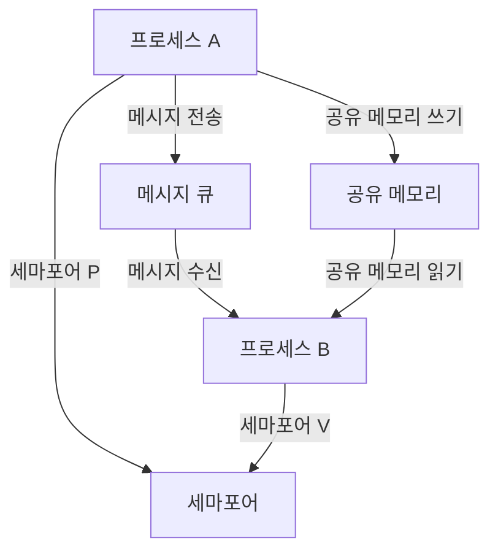

위의 다이어그램은 프로세스 간의 IPC 흐름을 나타내며, 메시지 큐와 공유 메모리, 세마포어의 상호작용을 보여준다. `sysv_ipc` 모듈을 통해 이러한 IPC 메커니즘을 효과적으로 활용할 수 있다.

<!--
## 세마포어 및 메시지 큐
   - 세마포어 클래스 및 메서드
   - 메시지 큐 클래스 및 메서드
   - 세마포어 및 메시지 큐의 사용 예제
-->

## 세마포어 및 메시지 큐

**세마포어 클래스 및 메서드**

세마포어(Semaphore)는 프로세스 간의 동기화를 위해 사용되는 동기화 객체이다. Python에서 세마포어를 사용하기 위해 `sysv_ipc` 모듈을 활용할 수 있다. 이 모듈은 System V IPC를 위한 다양한 기능을 제공하며, 세마포어를 생성하고 관리하는 데 필요한 클래스와 메서드를 포함하고 있다.

세마포어 클래스는 다음과 같은 주요 메서드를 제공한다:

- `acquire()`: 세마포어의 값을 감소시키고, 값이 0일 경우 대기한다.
- `release()`: 세마포어의 값을 증가시킨다.
- `get_value()`: 현재 세마포어의 값을 반환한다.

**메시지 큐 클래스 및 메서드**

메시지 큐(Message Queue)는 프로세스 간에 메시지를 전송하기 위한 큐이다. `sysv_ipc` 모듈을 사용하여 메시지 큐를 생성하고 관리할 수 있다. 메시지 큐 클래스는 다음과 같은 주요 메서드를 제공한다:

- `send(message)`: 큐에 메시지를 추가한다.
- `receive()`: 큐에서 메시지를 읽고 제거한다.
- `remove()`: 메시지 큐를 삭제한다.

**세마포어 및 메시지 큐의 사용 예제**

아래는 세마포어와 메시지 큐를 사용하는 간단한 예제 코드이다. 이 코드는 두 개의 프로세스가 세마포어를 통해 동기화되고, 메시지 큐를 통해 데이터를 전송하는 구조이다.

```python
import sysv_ipc
import time
import os

# 세마포어 생성
semaphore = sysv_ipc.Semaphore(1234, sysv_ipc.IPC_CREAT, initial_value=1)

# 메시지 큐 생성
message_queue = sysv_ipc.MessageQueue(1235, sysv_ipc.IPC_CREAT)

def producer():
    for i in range(5):
        semaphore.acquire()  # 세마포어 획득
        message = f"Message {i}"
        message_queue.send(message.encode())  # 메시지 전송
        print(f"Produced: {message}")
        semaphore.release()  # 세마포어 해제
        time.sleep(1)

def consumer():
    for _ in range(5):
        semaphore.acquire()  # 세마포어 획득
        message, _ = message_queue.receive()  # 메시지 수신
        print(f"Consumed: {message.decode()}")
        semaphore.release()  # 세마포어 해제
        time.sleep(1)

if __name__ == "__main__":
    pid = os.fork()
    if pid == 0:
        consumer()  # 자식 프로세스에서 소비자 실행
    else:
        producer()  # 부모 프로세스에서 생산자 실행
```

위의 코드는 생산자-소비자 문제를 해결하기 위한 간단한 예제이다. 생산자는 세마포어를 사용하여 메시지를 큐에 추가하고, 소비자는 세마포어를 사용하여 메시지를 큐에서 읽어온다.

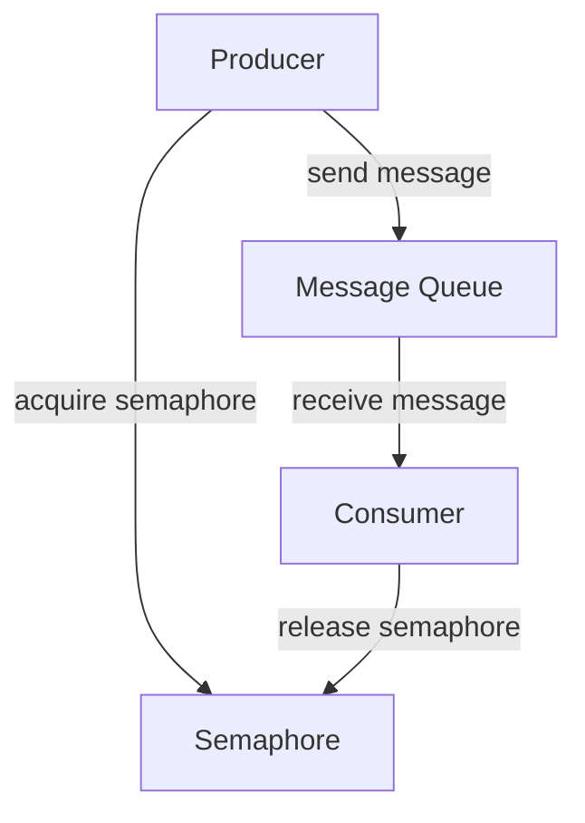

위의 다이어그램은 생산자와 소비자 간의 메시지 전송 흐름을 나타낸다. 세마포어는 두 프로세스 간의 동기화를 보장하여 데이터의 일관성을 유지하는 역할을 한다.

<!--
## 관련 기술
   - POSIX IPC와의 비교
   - Python 3.8 이후의 공유 메모리 추상화
   - Cygwin을 통한 Windows에서의 IPC 사용
-->

## 관련 기술

**POSIX IPC와의 비교** 
POSIX IPC(Inter-Process Communication)는 System V IPC와 유사한 기능을 제공하지만, 더 현대적이고 사용하기 쉬운 API를 제공한다. POSIX IPC는 세마포어, 메시지 큐, 공유 메모리와 같은 다양한 IPC 메커니즘을 지원하며, POSIX 표준을 준수하는 시스템에서 일관된 동작을 보장한다. 반면, System V IPC는 오래된 API로, 사용법이 복잡하고 다양한 시스템에서의 호환성 문제가 발생할 수 있다. 다음은 두 IPC 방식의 주요 차이점이다.

| 특징               | System V IPC         | POSIX IPC            |
|------------------|---------------------|---------------------|
| API 스타일        | 복잡하고 다양한 함수 | 간단하고 일관된 함수 |
| 메모리 관리      | 수동 관리 필요      | 자동 관리 가능      |
| 호환성            | 제한적              | 널리 사용됨         |

**Python 3.8 이후의 공유 메모리 추상화** 
Python 3.8부터는 `multiprocessing.shared_memory` 모듈이 도입되어, 공유 메모리를 보다 쉽게 사용할 수 있게 되었다. 이 모듈은 POSIX와 System V IPC의 복잡성을 숨기고, Python 객체를 공유 메모리에 저장하고 읽을 수 있는 간단한 인터페이스를 제공한다. 이를 통해 개발자는 IPC를 구현할 때 더 적은 코드로 더 많은 기능을 사용할 수 있다.

다음은 Python 3.8의 `shared_memory` 모듈을 사용하는 간단한 예제 코드이다.

```python
from multiprocessing import shared_memory

# 공유 메모리 생성
shm = shared_memory.SharedMemory(create=True, size=10)

# 데이터 쓰기
shm.buf[:5] = b'Hello'

# 데이터 읽기
print(bytes(shm.buf[:5]))  # 출력: b'Hello'

# 공유 메모리 해제
shm.close()
shm.unlink()
```

**Cygwin을 통한 Windows에서의 IPC 사용** 
Cygwin은 Windows에서 Linux와 유사한 환경을 제공하는 도구로, System V IPC와 POSIX IPC를 사용할 수 있게 해준다. Cygwin을 통해 개발자는 Windows에서도 Unix-like 시스템에서 사용하는 IPC 메커니즘을 활용할 수 있다. Cygwin을 설치한 후, 필요한 패키지를 설치하면 System V IPC와 POSIX IPC를 사용할 수 있다.

다음은 Cygwin에서 IPC를 사용하는 간단한 다이어그램이다.

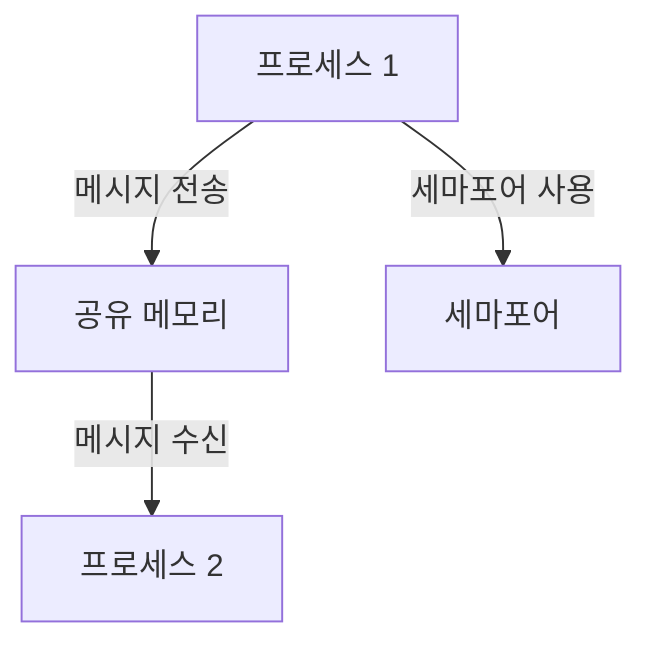

이와 같이 Cygwin을 통해 Windows에서도 IPC를 구현할 수 있으며, 다양한 IPC 메커니즘을 활용하여 프로세스 간의 통신을 원활하게 할 수 있다.

<!--
## FAQ
   - System V IPC와 POSIX IPC의 차이점은 무엇인가요?
   - Python에서 공유 메모리를 사용할 때 주의할 점은 무엇인가요?
   - 세마포어와 메시지 큐의 차이점은 무엇인가요?
-->

## FAQ

**System V IPC와 POSIX IPC의 차이점은 무엇인가요?**

System V IPC와 POSIX IPC는 두 가지 주요 IPC(Inter-Process Communication) 메커니즘이다. System V IPC는 오래된 방식으로, 주로 UNIX 시스템에서 사용되며, 세마포어, 메시지 큐, 공유 메모리와 같은 기능을 제공한다. 반면, POSIX IPC는 더 현대적인 접근 방식으로, POSIX 표준을 따르는 시스템에서 사용된다. POSIX IPC는 더 간단한 API를 제공하며, 더 나은 이식성을 지원한다. 예를 들어, POSIX 공유 메모리는 `shm_open`과 `mmap`을 사용하여 구현되며, System V IPC는 `shmget`과 `shmat`을 사용한다.

**Python에서 공유 메모리를 사용할 때 주의할 점은 무엇인가요?**

Python에서 공유 메모리를 사용할 때는 몇 가지 주의할 점이 있다. 첫째, 공유 메모리는 여러 프로세스 간에 데이터를 공유하기 때문에 데이터의 일관성을 유지하는 것이 중요하다. 이를 위해 적절한 동기화 메커니즘을 사용해야 한다. 둘째, Python의 GIL(Global Interpreter Lock)로 인해 멀티스레딩 환경에서 성능 저하가 발생할 수 있다. 따라서 멀티프로세싱을 고려하는 것이 좋다. 마지막으로, 공유 메모리의 크기와 데이터 구조를 신중하게 설계해야 하며, 메모리 누수를 방지하기 위해 사용이 끝난 후 적절히 해제해야 한다.

**세마포어와 메시지 큐의 차이점은 무엇인가요?**

세마포어와 메시지 큐는 IPC에서 서로 다른 목적을 가진 두 가지 메커니즘이다. 세마포어는 주로 동기화에 사용되며, 여러 프로세스가 공유 자원에 접근할 때 충돌을 방지하는 역할을 한다. 세마포어는 카운팅 세마포어와 이진 세마포어로 나뉘며, 자원의 사용 가능 여부를 나타낸다. 반면, 메시지 큐는 프로세스 간에 메시지를 전송하는 데 사용된다. 메시지 큐는 비동기적으로 작동하며, 프로세스가 메시지를 보내고 받을 수 있는 구조를 제공한다. 

다음은 세마포어와 메시지 큐의 간단한 예제 코드이다.

```python
import sysv_ipc

# 세마포어 생성
semaphore = sysv_ipc.Semaphore(1234, sysv_ipc.IPC_CREAT, initial_value=1)

# 메시지 큐 생성
message_queue = sysv_ipc.MessageQueue(1234, sysv_ipc.IPC_CREAT)

# 세마포어 사용 예
semaphore.acquire()  # 세마포어 획득
# 공유 자원 접근 코드
semaphore.release()  # 세마포어 해제

# 메시지 큐 사용 예
message_queue.send(b'Hello, World!')  # 메시지 전송
message, _ = message_queue.receive()  # 메시지 수신
print(message.decode())  # 메시지 출력
```

다음은 세마포어와 메시지 큐의 관계를 나타내는 다이어그램이다.

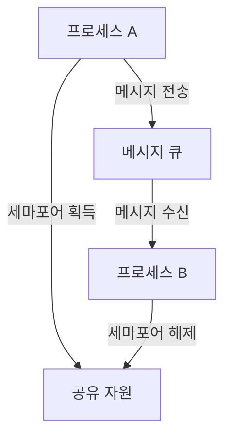

이와 같이 세마포어와 메시지 큐는 서로 다른 역할을 수행하며, IPC를 통해 프로세스 간의 효율적인 통신과 동기화를 가능하게 한다.

<!--
## 결론
   - Python에서 System V IPC를 사용하는 장점
   - 향후 개선 사항 및 추가 기능 제안
   - 개인 GitHub 저장소 및 코드 공유 안내
-->

## 결론

**Python에서 System V IPC를 사용하는 장점** 
Python에서 System V IPC를 사용하는 주요 장점은 프로세스 간의 효율적인 데이터 공유가 가능하다는 점이다. System V IPC는 메모리 세그먼트를 통해 여러 프로세스가 동일한 메모리 공간에 접근할 수 있도록 하여, 데이터 전송 속도를 크게 향상시킨다. 또한, Python의 ctypes 라이브러리를 활용하면 C로 작성된 API를 손쉽게 호출할 수 있어, 시스템 자원에 대한 접근이 용이하다. 이러한 특성 덕분에 대규모 데이터 처리나 실시간 시스템에서 유용하게 사용될 수 있다.

**향후 개선 사항 및 추가 기능 제안** 
향후 개선 사항으로는 Python 3.8 이후에 도입된 새로운 공유 메모리 API를 활용하여, 보다 직관적이고 사용하기 쉬운 인터페이스를 제공하는 것이 필요하다. 또한, 에러 처리 및 예외 처리를 강화하여, 개발자가 보다 안정적으로 IPC를 사용할 수 있도록 하는 것이 중요하다. 추가 기능으로는, 다양한 데이터 구조를 지원하는 고급 래퍼를 제공하여, 사용자가 복잡한 데이터 타입을 쉽게 다룰 수 있도록 하는 방안이 있다.

**개인 GitHub 저장소 및 코드 공유 안내** 
개인 GitHub 저장소를 통해 본 블로그에서 다룬 예제 코드 및 추가 자료를 공유할 예정이다. GitHub 저장소에는 System V IPC를 활용한 다양한 예제와 함께, 코드에 대한 설명 및 사용법을 포함할 계획이다. 이를 통해 독자들이 실제로 코드를 실행해보고, IPC의 작동 방식을 이해하는 데 도움이 될 것이다.

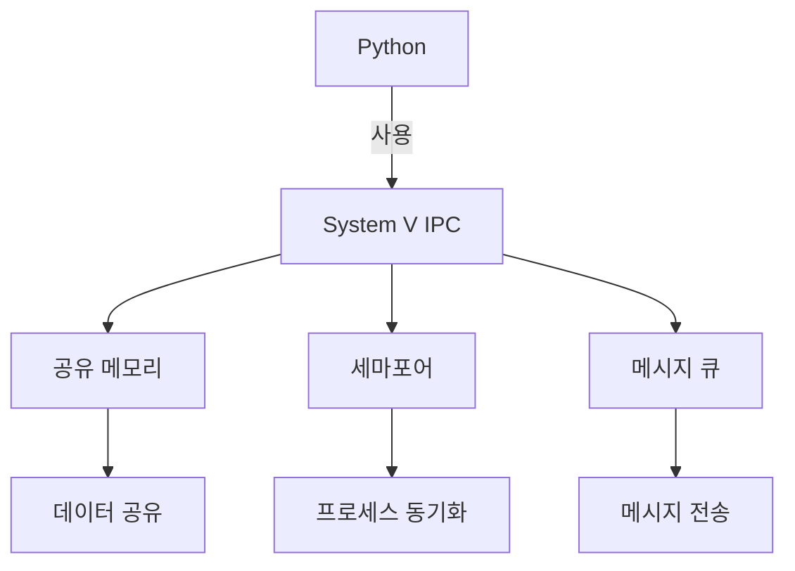

위의 다이어그램은 Python에서 System V IPC를 사용하여 공유 메모리, 세마포어, 메시지 큐를 통해 데이터 공유 및 프로세스 동기화를 어떻게 수행하는지를 시각적으로 나타낸 것이다. 이러한 구조를 통해 Python 개발자들이 IPC를 보다 쉽게 이해하고 활용할 수 있을 것이다.

<!--
## 참고 자료
   - 관련 문서 및 링크
   - `man` 페이지 및 시스템 API 문서
   - Python 패키지 설치 및 사용법 안내
-->

## 참고 자료

**관련 문서 및 링크** 
System V IPC와 관련된 다양한 자료를 찾을 수 있는 링크는 다음과 같다.  
- [Linux Programmer's Manual](https://man7.org/linux/man-pages/): Linux 시스템 프로그래밍에 대한 포괄적인 문서이다. IPC 관련 API에 대한 설명을 포함하고 있다.  
- [The Linux Documentation Project](https://www.tldp.org/): Linux 관련 문서와 가이드가 모여 있는 사이트로, IPC에 대한 여러 자료를 제공한다.  
- [Python 공식 문서](https://docs.python.org/3/): Python의 다양한 기능과 라이브러리에 대한 공식 문서이다.  

**`man` 페이지 및 시스템 API 문서** 
Linux에서 제공하는 `man` 페이지는 각 시스템 호출에 대한 상세한 정보를 제공한다. 예를 들어, `shmget`, `shmat`, `shmdt`, `shmctl`와 같은 System V IPC 관련 함수에 대한 설명을 확인할 수 있다. 다음은 몇 가지 유용한 `man` 페이지 링크이다.  
- `man 2 shmget`: 공유 메모리 세그먼트를 생성하는 함수에 대한 설명이다.  
- `man 2 shmat`: 공유 메모리 세그먼트를 프로세스의 주소 공간에 첨부하는 함수에 대한 설명이다.  
- `man 2 shmctl`: 공유 메모리 세그먼트의 제어를 위한 함수에 대한 설명이다.  

**Python 패키지 설치 및 사용법 안내** 
Python에서 System V IPC를 사용하기 위해 필요한 패키지 설치 방법은 다음과 같다. 기본적으로 Python 표준 라이브러리만으로도 IPC를 사용할 수 있지만, 추가적인 기능을 위해 `sysv_ipc` 패키지를 설치할 수 있다.  

```bash
pip install sysv_ipc
```

설치 후, 다음과 같이 패키지를 임포트하여 사용할 수 있다.

```python
import sysv_ipc

# 공유 메모리 생성
key = 1234
memory = sysv_ipc.SharedMemory(key, sysv_ipc.IPC_CREAT, size=1024)

# 데이터 쓰기
memory.write(b'Hello, World!')

# 데이터 읽기
data = memory.read()
print(data)
```

**다이어그램** 
다음은 System V IPC의 기본 구조를 나타내는 다이어그램이다. 이 다이어그램은 공유 메모리 세그먼트와 프로세스 간의 관계를 보여준다.

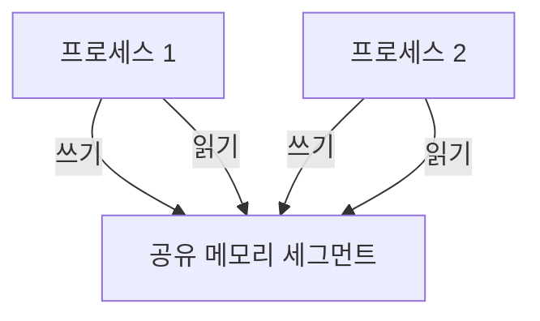

이와 같은 자료를 통해 System V IPC에 대한 이해를 높이고, Python에서의 활용 방법을 익힐 수 있다.

<!--
##### Reference #####
-->

## Reference


* [https://euroquis.nl//blabla/2024/10/08/shm.html](https://euroquis.nl//blabla/2024/10/08/shm.html)
* [https://semanchuk.com/philip/sysv_ipc/](https://semanchuk.com/philip/sysv_ipc/)
* [https://pypi.org/project/sysv-ipc/](https://pypi.org/project/sysv-ipc/)


<!--
At work-work the system uses, for historical reasons, a lot of SystemV shared
memory. The SysV shared memory API has C functions like [ ` shmat(2) `
](https://linux.die.net/man/2/shmat) . There is also a different shared memory
API, POSIX shared memory, which has functions like [ ` shm_open(3) `
](https://www.man7.org/linux/man-pages/man3/shm_open.3.html) . For**reasons**
, on some work-work systems we’re constrained to Python 3.7 and no additional
libraries. I wanted to mess with the shared memory on such a system, from
Python for convenience, so I wrote some very simple wrappers. Here’s a recap.

> As usual, corrections are welcome, or tips (by email). I write these notes
> as much for future me as anyone else.

Here is the core of the story (I have also added this to my personal GitHub
repository, which I won’t link because it’s not future-proof storage).

    
    
    import ctypes
    
    lib = ctypes.cdll.LoadLibrary(None)
    
    shmget = lib.shmget
    shmget.argtypes = [ctypes.c_int, ctypes.c_size_t, ctypes.c_int]
    shmget.restype = ctypes.c_int
    shmget.__doc__ = """See shmget(2)"""
    

This works on FreeBSD, where SysV shmem is in the core libraries. On Linux, I
think you need to call ` LoadLibrary("librt") ` . Anyway, wrapping the
library-loading to be safe isn’t the point here.

Once _ctypes_ has loaded a library, you can extract function pointers from the
library. By adding annotations, you can give the Python function the same
prototype as the C [ manpage for shmget ](https://www.man7.org/linux/man-
pages/man2/shmget.2.html) .

Note that the manpage points to some special flag values. For those, you need
to dig into the C headers. On FreeBSD, the special value ` IPC_PRIVATE ` is
equal to 0, so that’s easy enough to write in Python. The following snippet is
then sufficient to create a shared memory segment (one that is 1024 bytes
large and world-readable) and print out its ID. The returned value is -1 on
error.

    
    
    print(shmget(0, 1024, 0o644))
    

The ID can be cross-checked with command ` ipcs -m ` (it’s installed by
default on FreeBSD and in my KDE Neon machine, so seems like a common tool).
To get rid of the segment, ` ipcrm -m <id> ` does the trick.

Similar wrappers are there for ` shmat ` , ` shmdt ` and ` shmctl ` – but
those wrangle ` void * ` in C, and how does that work with Python?

##  The void pointer

CTypes has a ` c_void_p ` type, which can be created from ` None ` (a null
pointer, seems reasonable) and returned from C functions. It can cast to-and-
fro (in classic C style, the thing in memory is what I say is in memory) to
other pointer types, and without a typed-pointer type at the machine level
that _just works (but don’t ask me how)_ .

So the C function ` int shmctl(int shmid, int cmd, struct shmid_ds *buf) `
gets these types in Python: ` shmctl.argtypes = [ctypes.c_int, ctypes.c_int,
ctypes.c_void_p] ` , which presents the struct-pointer as a void-pointer.

The function ` void *shmat(int shmid, const void *addr, int flag) ` works
similarly. When calling it, unless you have specific address needs, parameter
` addr ` can be ` nullptr ` (er .. ok, this is C, so ` NULL ` and in Python `
None ` ). The pointer it returns is where the shared memory is attached.

Actually**doing**something with a ` void * ` takes work in C, it also takes
work in Python with _ctypes_ . You can cast to an ` int * ` for instance, with
` iaddr = ctypes.cast(addr, ctypes.POINTER(ctypes.c_int)) ` (a cast to ` char
* ` is also readily available).

A special case is when you need to**provide**a ` void * ` to some C
function. Where do they come from? In C you would just declare a (character)
buffer of some size and pass it in. In Python, ` ctypes.create_string_buffer()
` does the job. Give it a size and get a memory-managed buffer.

##  Wrangling shared-memory segment destruction

There’s ` shmget() ` to create a segment, ` shmat() ` to attach (map it into
memory of a process) to it, ` shmdt() ` to detach from a segment, but
destroying a shared-memory segment does not have a simple C call to do it.
There is ` shmctl() ` which does special-control-actions on a shared-memory
segement, and destruction is one of them.

I ended up writing this little wrapper.

    
    
    def shmrm(shmid : int) -> int:
        return shmctl(shmid, 0, None)
    

##  Sending messages

As an experiment, I wrote a program that can create, read, write and destroy a
shared-memory segment. By writing (from one invocation) and then reading (from
another invocation) I can “send” messages from the past! Or to the future! It
is nearly as convenient as writing the messages to a file.

Here’s the write function. It attaches the shared-memory segment and then
writes a Pascal-style string to that memory (Pascal-style in the sense of
“starts with a length, followed by the actual data, no NUL-termination”). For
bloggy purposes I have removed error-handling.

    
    
    def write(shmid : int, v : str):
        addr = shmat(shmid, ctypes.c_void_p(None), 0)
        iaddr = ctypes.cast(addr, ctypes.POINTER(ctypes.c_int))
        caddr = ctypes.cast(addr, ctypes.POINTER(ctypes.c_char))
    
        ustring = v.encode("utf-8")
        iaddr[0] = len(ustring)
        for i in range(len(ustring)):
            caddr[4+i] = ustring[i]
    
        return shmdt(addr)
    

Here, ` shmat() ` returns a ` void * ` and I cast that to two typed pointers
to the segment. I haven’t figured out how to do pointer arithmetic, so on the
assumption there are 32-bit integers, the integer goes first and then the
message goes starting at byte (char) number 4.

##  Takeaways

CTypes is really cool! It makes wrangling C APIs in Python .. well, let’s call
it “acceptable”.

Starting with Python 3.8, everything I’ve written above is unnecessary because
there is a good shared-memory abstraction in the standard Python library, but
for my work-work purposes in a very restricted environment, this particular
tool has turned out to be really useful.


-->

<!--


-->

<!--
#  System V IPC for Python - Semaphores, Shared Memory and Message Queues

This describes the ` sysv_ipc ` module which gives Python access to System V
inter-process semaphores, shared memory and message queues on most (all?) *nix
flavors. Examples include macOS/OS X, Linux, FreeBSD, OpenSolaris 2008.11,
HPUX, and AIX. It might also work under Windows with a library like [ Cygwin
](http://www.cygwin.com/) .

It works with Python ≥ 3.6. It's released under a [ BSD license
](http://creativecommons.org/licenses/BSD/) .

You can**download[ sysv_ipc version 1.1.0 ](sysv_ipc-1.1.0.tar.gz)**( [
[md5 sum] ](sysv_ipc-1.1.0.md5.txt) , [ [sha1 sum] ](sysv_ipc-1.1.0.sha1.txt)
, [ [sha256 sum] ](sysv_ipc-1.1.0.sha256.txt) ) which contains the source
code, setup.py, installation instructions and  sample code  . You can read
about [ all of the changes in this version ](history.html#current) .

You might also want to read about some  known bugs  .

You might be interested in the very similar module [ ` posix_ipc `
](/philip/posix_ipc/) which provides Python access to POSIX IPC primitives.
POSIX IPC is a little easier to use than SysV IPC, but not all operating
systems support it completely.

##  Module ` sysv_ipc `

Jump to  semaphores  ,  shared memory  , or  message queues  .

###  Module Functions

attach(id, [address = None, [flags = 0]])

     Attaches the (existing) shared memory that has the given ` id ` and returns a new SharedMemory object. See  SharedMemory.attach()  for details on the ` address ` and ` flags ` parameters. 

This method is useful only under fairly unusual circumstances. You probably
don't need it.

ftok(path, id, [silence_warning = False])

     Calls ` ftok(path, id) ` . Note that  ` ftok() ` has limitations  , and this function will issue a warning to that effect unless ` silence_warning ` is True. 
remove_semaphore(id)

     Removes the semaphore with the given ` id ` . 
remove_shared_memory(id)

     Removes the shared memory with the given ` id ` . 
remove_message_queue(id)

     Removes the message queue with the given ` id ` . 

###  Module Constants

IPC_CREAT, IPC_EXCL and IPC_CREX

     ` IPC_CREAT ` and ` IPC_EXCL ` are flags used when creating IPC objects. They're bitwise unique and can be ORed together. ` IPC_CREX ` is shorthand for ` IPC_CREAT | IPC_EXCL ` . 

When passed to an IPC object's constructor, ` IPC_CREAT ` indicates that you
want to create a new object or open an existing one. If you want the call to
fail if an object with that key already exists, specify the ` IPC_EXCL ` flag,
too.

IPC_PRIVATE

     This is a special value that can be passed in place of a key. It implies that the IPC object should be available only to the creating process or its child processes (e.g. those created with ` fork() ` ). 
KEY_MIN and KEY_MAX

     Denote the range of keys that this module accepts. Your OS might limit keys to a smaller range depending on the typedef of ` key_t ` . 

Keys randomly generated by this module are in the range ` 1 ≤ key ≤ SHRT_MAX `
. That's type-safe unless your OS has a very bizarre definition of ` key_t ` .

SEMAPHORE_VALUE_MAX

     The maximum value of a semaphore. 
PAGE_SIZE

     The operating system's memory page size, in bytes. It's probably a good idea to make shared memory segments some multiple of this size. 
SEMAPHORE_TIMEOUT_SUPPORTED

     True if the platform supports timed semaphore waits, False otherwise. 
SHM_RDONLY

     Pass this flag to ` SharedMemory.attach() ` to attach the segment read-only. 
SHM_RND

     You probably don't need this, but it can be used when attaching shared memory to force the address to be rounded down to SHMLBA. See your system's man page for ` shmat() ` for more information. 
SHM_HUGETLB, SHM_NORESERVE and SHM_REMAP

     You probably don't need these. They're Linux-specific flags that can be passed to the SharedMemory constructor, or to the ` .attach() ` function in the case of SHM_REMAP. See your system's man page for ` shmget() ` and ` shmat() ` for more information. 

###  Module Errors

In addition to standard Python errors (e.g. ` ValueError ` ), this module
raises custom errors. These errors cover situations specific to IPC.

Error

     The base error class for all the custom errors in this module. This error is occasionally raised on its own but you'll almost always see a more specific error. 
InternalError

     Indicates that something has gone very wrong in the module code. Please report this to the maintainer. 
PermissionsError

     Indicates that you've attempted something that the permissions on the IPC object don't allow. 
ExistentialError

     Indicates an error related to the existence or non-existence of an IPC object. 
BusyError

     Raised when a semaphore call to ` .P() ` or ` .Z() ` either times out or would be forced to wait when its ` block ` attribute is False. 
NotAttachedError

     Raised when a process attempts to read from or write to a shared memory segment to which it is not attached. 

###  The Semaphore Class

This is a handle to a semaphore.

####  Methods

Semaphore(key, [flags = 0, [mode = 0600, [initial_value = 0]]])

     Creates a new semaphore or opens an existing one. 

key  must be ` None ` , ` IPC_PRIVATE ` or an integer > ` KEY_MIN ` and ≤ `
KEY_MAX ` . If the key is ` None ` , the module chooses a random unused key.

The  flags  specify whether you want to create a new semaphore or open an
existing one.

  * With  flags  set to the**default**of ` 0 ` , the module attempts to**open an existing**semaphore identified by  key  and raises a ` ExistentialError ` if that semaphore doesn't exist. 
  * With  flags  set to ` IPC_CREAT ` , the module**opens**the semaphore identified by  key **or creates** a new one if no such semaphore exists. Using ` IPC_CREAT ` by itself is not recommended. (See  Semaphore Initialization  .) 
  * With  flags  set to ` IPC_CREX ` ( ` IPC_CREAT | IPC_EXCL ` ), the module**creates a new semaphore** identified by  key  . If a semaphore with that key already exists, the call raises an ` ExistentialError ` .**The initial_value  is ignored unless both of these flags are specified** or if the semaphore is read-only. 

When opening an existing semaphore,  mode  is ignored.

acquire([timeout = None, [delta = 1]])

     Waits (conditionally) until the semaphore's value is > 0 and then returns, decrementing the semaphore. 

The  timeout  (which can be a float) specifies how many seconds this call
should wait, if at all.

The semantics of the timeout  changed a little in version 0.3  .

  * A  timeout  of None (the default) implies no time limit. The call will not return until its wait condition is satisfied. 
  * When  timeout  is 0, the call raises a ` BusyError ` if it can't immediately acquire the semaphore. Since it will return immediately if _not_ asked to wait, this can be thought of as "non-blocking" mode. 
  * When the  timeout  is > 0, the call will wait no longer than  timeout  seconds before either returning (having acquired the semaphore) or raising a ` BusyError ` . 

When the call returns, the semaphore's value decreases by  delta  (or more
precisely, ` abs(  delta  ) ` ) which defaults to 1.

On platforms that don't support the ` semtimedop() ` API call, all timeouts
(including zero) are treated as infinite. The call will not return until its
wait condition is satisfied.

Most platforms provide ` semtimedop() ` . macOS is a notable exception. The
module's Boolean constant ` SEMAPHORE_TIMEOUT_SUPPORTED ` is True on platforms
that support ` semtimedop() ` .

release([delta = 1])

     Releases (increments) the semaphore. 

The semaphore's value increases by  delta  (or more precisely, ` abs(  delta
) ` ) which defaults to 1.

P()

     A synonym for ` .acquire() ` that takes the same parameters. 

"P" stands for  prolaag  or  probeer te verlagen  (try to decrease), the
original name given by [ Edsger Dijkstra
](http://en.wikipedia.org/wiki/Semaphore_\(programming\)) .

V()

     A synonym for ` .release() ` that takes the same parameters. 

"V" stands for  verhoog  (increase), the original name given by [ Edsger
Dijkstra ](http://en.wikipedia.org/wiki/Semaphore_\(programming\)) .

Z([timeout = None])

     Blocks until zee zemaphore is zero. 

Timeout  has the same meaning as described in ` .acquire() ` .

remove()

     Removes (deletes) the semaphore from the system. 

As far as I can tell, the effect of deleting a semaphore that other processes
are still using is OS-dependent. Check your system's man pages for `
semctl(IPC_RMID) ` .

####  Attributes

key (read-only)

     The key passed in the call to the constructor. 
id (read-only)

     The id assigned to this semaphore by the OS. 
value

     The integer value of the semaphore. 
undo

     Defaults to False. 

When True, operations that change the semaphore's value will be undone
(reversed) when the process exits. Note that when a process exits, an undo
operation may imply that a semaphore's value should become negative or exceed
its maximum. Behavior in this case is system-dependent, which means that
**using this flag can make your code non-portable** .

block

     Defaults to True, which means that calls to ` acquire() ` and ` release() ` will not return until their wait conditions are satisfied. 

When False, these calls will not block but will instead raise an error if they
are unable to return immediately.

mode

     The semaphore's permission bits. 

Tip: the following Python code will display the mode in octal:  
` print int(str(my_sem.mode), 8) `

uid

     The semaphore's user id. 
gid

     The semaphore's group id. 
cuid (read-only)

     The semaphore creator's user id. 
cgid (read-only)

     The semaphore creator's group id. 
last_pid (read-only)

     The PID of the process that last called ` semop() ` ( ` .P() ` , ` .V() ` or ` .Z() ` ) on this semaphore. 

Linux and macOS also set this when the semaphore's value is changed, although
doing so disagrees with the POSIX specification. See [ Linux kernel bug 112271
](https://bugzilla.kernel.org/show_bug.cgi?id=112271) .

waiting_for_nonzero (read-only)

     The number of processes waiting for the value of the semaphore to become non-zero (i.e. the number waiting in a call to ` .P() ` ). 
waiting_for_zero (read-only)

     The number of processes waiting for the value of the semaphore to become zero (i.e. the number waiting in a call to ` .Z() ` ). 
o_time (read-only)

     The last time ` semop() ` (i.e. ` .P() ` , ` .V() ` or ` .Z() ` ) was called on this semaphore. 

####  Context Manager Support

These semaphores provide ` __enter__() ` and ` __exit__() ` methods so they
can be used in context managers. For instance --

    
    
    with sysv_ipc.Semaphore(name) as sem:
        # Do something...
    

Entering the context acquires the semaphore, exiting the context releases the
semaphore. See ` demo4/child.py ` for a complete example.

###  The SharedMemory Class

This is a handle to a shared memory segment.

####  Buffer Protocol Support

In addition to the methods and attributes described below, ` SharedMemory `
supports Python's buffer protocol, which means you can create ` bytearray `
and ` memoryview ` objects based on a ` SharedMemory ` segment. See `
demos/buffer_protocol ` for an example.

####  Methods

SharedMemory(key, [flags = 0, [mode = 0600, [size = 0 or PAGE_SIZE,
[init_character = ' ']]]])

     Creates a new shared memory segment or opens an existing one. The memory is automatically attached. 

key  must be ` None ` , ` IPC_PRIVATE ` or an integer > ` 0 ` and ≤ ` KEY_MAX
` . If the key is ` None ` , the module chooses a random unused key.

The  flags  specify whether you want to create a new shared memory segment or
open an existing one.

The value of  size  depends on whether one is opening an existing segment or
creating a new one.

  * When opening an existing segment,  size  must be ≤ the existing segment's size. Zero is always valid. 
  * When creating an new segment, many (most? all?) operating systems insist on a  size  > ` 0 ` . In addition, some round the size up to the next multiple of PAGE_SIZE. 

This module supplies a default  size  of ` PAGE_SIZE ` when ` IPC_CREX ` is
specified and ` 0 ` otherwise.

attach([address = None, [flags = 0]])

     Attaches this process to the shared memory. The memory must be attached before calling ` .read() ` or ` .write() ` . Note that the constructor automatically attaches the memory so you won't need to call this method unless you explicitly detach it and then want to use it again. 

The address parameter allows one to specify (as a Python long) a memory
address at which to attach the segment. Passing None (the default) is
equivalent to passing NULL to ` shmat() ` . See that function's man page for
details.

The flags are mostly only relevant if one specifies a specific address. One
exception is the flag ` SHM_RDONLY ` which, surprisingly, attaches the segment
read-only.

Note that on some (and perhaps all) platforms, each call to ` .attach() `
increments the system's "attached" count. Thus, if each call to ` .attach() `
isn't paired with a call to ` .detach() ` , the system's "attached" count for
the shared memory segment will not go to zero when the process exits. As a
result, the shared memory segment may not disappear even when its creator
calls ` .remove() ` and exits.

detach()

     Detaches this process from the shared memory. 
read([byte_count = 0, [offset = 0]])

     Reads up to  byte_count  bytes from the shared memory segment starting at  offset  and returns them as a bytes object (which is the same as a ` str ` under Python 2). 

If  byte_count  is zero (the default) the entire buffer is returned.

This method will never attempt to read past the end of the shared memory
segment, even when  offset  \+  byte_count  exceeds the memory segment's size.
In that case, the bytes from  offset  to the end of the segment are returned.

write(some_bytes, [offset = 0])

     Writes bytes (i.e. ` str ` in Python 2) to the shared memory, starting at  offset  . Passing a Unicode object may work, but doing so is unsupported and may be explicitly deprecated in a future version. 

If the offset + data would write outside of the segment, this function raises
` ValueError ` .

The bytes may contain embedded NULL bytes ( ` '\0' ` ).

remove()

     Removes (destroys) the shared memory. Note that actual destruction of the segment only occurs when all processes have detached. 

####  Attributes

key (read-only)

     The key provided in the constructor. 
id (read-only)

     The id assigned to this segment by the OS. 
size (read-only)

     The size of the segment in bytes. 
address (read-only)

     The address of the segment as Python long. 
attached (read-only)

     If True, this segment is currently attached. 
last_attach_time (read-only)

     The last time a process attached this segment. 
last_detach_time (read-only)

     The last time a process detached this segment. 
last_change_time (read-only)

     The last time a process changed the uid, gid or mode on this segment. 
creator_pid (read-only)

     The PID of the process that created this segment. 
last_pid (read-only)

     The PID of the most last process to attach or detach this segment. 
number_attached (read-only)

     The number of processes attached to this segment. 
uid

     The segment's user id. 
gid

     The segment's group id. 
mode

     The shared memory's permission bits. 

Tip: the following Python code will display the mode in octal:  
` print int(str(my_mem.mode), 8) `

cuid (read-only)

     The segment creator's user id. 
cgid (read-only)

     The segment creator's group id. 

###  The MessageQueue Class

This is a handle to a FIFO message queue.

####  Methods

MessageQueue(key, [flags = 0, [mode = 0600, [max_message_size = 2048]]])

     Creates a new message queue or opens an existing one. 

key  must be ` None ` , ` IPC_PRIVATE ` or an integer > ` 0 ` and ≤ ` KEY_MAX
` . If the key is ` None ` , the module chooses a random unused key.

The  flags  specify whether you want to create a new queue or open an existing
one.

  * With  flags  set to the**default** of ` 0 ` , the module attempts to**open an existing** message queue identified by  key  and raises a ` ExistentialError ` if it doesn't exist. 
  * With  flags  set to**` IPC_CREAT `** , the module**opens** the message queue identified by  key **or creates** a new one if no such queue exists. 
  * With  flags  set to**` IPC_CREX `** ( ` IPC_CREAT | IPC_EXCL ` ), the module**creates** a new message queue identified by  key  . If a queue with that key already exists, the call raises a ` ExistentialError ` . 

The  max_message_size  can be increased from the default, but be aware of the
issues discussed in  Message Queue Limits  .

send(message, [block = True, [type = 1]])

     Puts a message on the queue. 

The  message  should be a bytes object (a.k.a. ` str ` in Python 2) and can
contain embedded NULLs (ASCII ` 0x00 ` ). Passing a Unicode object may work,
but doing so is unsupported and may be explicitly deprecated in a future
version.

The  block  flag specifies whether or not the call should wait if the message
can't be sent (if, for example, the queue is full). When  block  is ` False `
, the call will raise a ` BusyError ` if the message can't be sent
immediately.

The  type  is associated with the message and is relevant when calling `
receive() ` . It must be > 0\.

receive([block = True, [type = 0]])

     Receives a message from the queue, returning a tuple of ` (message, type) ` . The message is a bytes object (a.k.a. ` str ` in Python 2). 

The  block  flag specifies whether or not the call should wait if there's no
messages of the specified type to retrieve. When  block  is ` False ` , the
call will raise a ` BusyError ` if a message can't be received immediately.

The  type  permits some control over which messages are retrieved.

  * When  type  ` == 0 ` , the call returns the first message on the queue regardless of its type. 
  * When  type  ` > 0 ` , the call returns the first message of that type. 
  * When  type  ` < 0 ` , the call returns the first message of the lowest type that is ≤ the absolute value of  type  . 

remove()

     Removes (deletes) the message queue. 

####  Attributes

key (read-only)

     The key provided in the constructor. 
id (read-only)

     The id assigned to this queue by the OS. 
max_size

     The maximum size of the queue in bytes. Only a process with "appropriate privileges" can increase this value, and on some systems even that won't work. See  Message Queue Limits  for details. 
last_send_time (read-only)

     The last time a message was placed on the queue. 
last_receive_time (read-only)

     The last time a message was received from the queue. 
last_change_time (read-only)

     The last time a process changed the queue's attributes. 
last_send_pid (read-only)

     The id of the most recent process to send a message. 
last_receive_pid (read-only)

     The id of the most recent process to receive a message. 
current_messages (read-only)

     The number of messages currently in the queue. 
uid

     The queue's user id. 
gid

     The queue's group id. 
mode

     The queue's permission bits. 

Tip: the following Python code will display the mode in octal:  
` print int(str(my_mem.mode), 8) `

cuid (read-only)

     The queue creator's user id. 
cgid (read-only)

     The queue creator's group id. 

###  Usage Tips

####  Sample Code

This module comes with four sets of demonstration code in the directory `
demos ` .

  * ` sem_and_shm ` demonstrates using semaphores and shared memory to share data between processes. 
  * ` message_queues ` demonstrates using message queues to share data between processes. 
  * ` buffer_protocol ` demonstrates creating ` bytearray ` and ` memoryview ` objects atop shared memory. 
  * ` semaphore_context_manager ` demonstrates using semaphore instances in a context manager ( ` with ` statement). 

####  The Weakness of ` ftok() `

Most System V IPC sample code recommends ` ftok() ` for generating an integer
key that's more-or-less random. It does not, however, guarantee that the key
it generates is unused. If ` ftok() ` gives your application a key that some
other application is already using, your app is in trouble unless it has a
reliable second mechanism for generating a key. And if that's the case, why
not just abandon ` ftok() ` and use the second mechanism exclusively?

This is the weakness of ` ftok() ` \-- it isn't guaranteed to give you what
you want. The [ BSD man page for ` ftok ` ](http://www.unix.com/man-
page/FreeBSD/3/ftok/) says it is "quite possible for the routine to return
duplicate keys". The term "quite possible" isn't quantified, but suppose it
means one-tenth of one percent. Who wants to have 1-in-1000 odds of a
catastrophic failure in their program, or even 1-in-10000?

This module obviates the need for ` ftok() ` by generating random keys for
you. If your application can't use ` sysv_ipc ` 's automatically generated
keys because it needs to know the key in advance, hardcoding a random number
like 123456 in your app might be no worse than using ` ftok() ` and has the
advantage of not hiding its limitations.

This module provides ` ftok() ` in case you want to experiment with it.
However, to emphasize its weakness, this version of ` ftok() ` raises a
warning with every call unless you explicitly pass a flag to silence it.

This package also provides ` ftok_experiment.py ` so that you can observe how
often ` ftok() ` generates duplicate keys on your system.

####  Semaphore Initialization

When a System V sempahore is created at the C API level, the OS is not
required to initialize the semaphore's value. (This per [ the SUSv3 standard
for ` semget() `
](http://www.opengroup.org/onlinepubs/009695399/functions/semget.html) .) Some
(most? all?) operating systems initialize it to zero, but this behavior is
non-standard and therefore can't be relied upon.

If sempahore creation happens in an predictable, orderly fashion, this isn't a
problem. But a race condition arises when multiple processes vie to
create/open the same semaphore. The problem lies in the fact that when an
application calls ` semget() ` with only the ` IPC_CREAT ` flag, the caller
can't tell whether or not he has created a new semaphore or opened an existing
one.**This makes it difficult to create reliable code without using` IPC_EXCL
` .** W. Richard Stevens'  Unix Network Programming Volume 2  calls this "a
fatal flaw in the design of System V semaphores" (p 284).

For instance, imagine processes P1 and P2. They're executing the same code,
and that code intends to share a binary semaphore. Consider the following
sequence of events at the startup of P1 and P2 –

  1. P1 calls ` semget(IPC_CREAT) ` to create the semaphore S. 
  2. P2 calls ` semget(IPC_CREAT) ` to open S. 
  3. P1 initializes the semaphore's value to 1. 
  4. P1 calls ` acquire() ` , decrementing the value to 0. 
  5. P2, assuming S is a newly-created semaphore that needs to be initialized, incorrectly sets the semaphore's value to 1. 
  6. P2 calls ` acquire() ` , decrementing the value to 0. Both processes now think they own the lock. 

W. Richard Stevens' solution for this race condition is to check the value of
` sem_otime ` (an element in the ` semid_ds ` struct that's populated on the
call to ` semctl(IPC_STAT) ` and which is exposed to Python by this module)
which is initialized to zero when the semaphore is created and otherwise holds
the time of the last call to ` semop() ` (which is called by ` P() ` / `
acquire() ` , ` V() ` / ` release() ` , and ` Z() ` ).

In Python, each process would run something like this:

    
    
    try:
        sem = sysv_ipc.Semaphore(42, sysv_ipc.IPC_CREX)
    except sysv_ipc.ExistentialError:
        # One of my peers created the semaphore already
        sem = sysv_ipc.Semaphore(42)
        # Waiting for that peer to do the first acquire or release
        while not sem.o_time:
            time.sleep(.1)
    else:
        # Initializing sem.o_time to nonzero value
        sem.release()
    # Now the semaphore is safe to use.
    

####  Shared Memory Initialization

With shared memory, using the ` IPC_CREAT ` flag without ` IPC_EXCL ` is
problematic _unless you know the size of the segment you're potentially
opening_ .

Why? Because when creating a new segment, many (most? all?) operating systems
demand a non-zero size. However, when opening an existing segment, zero is the
only guaranteed safe value (again, assuming one doesn't know the size of the
segment in advance). Since ` IPC_CREAT ` can open or create a segment, there's
no safe value for the size under this circumstance.

As a (sort of) side note, the [ SUSv3 specification for ` shmget() `
](http://www.opengroup.org/onlinepubs/009695399/functions/shmget.html) says
only that the size of a new segment must not be less than "the system-imposed
minimum". I gather that at one time, some systems set the minimum at zero
despite the fact that it doesn't make much sense to create a zero-length
shared memory segment. I think most modern systems do the sensible thing and
insist on a minimum length of 1.

####  Message Queue Limits

Python programmers can usually remain blissfully ignorant of memory allocation
issues. Unfortunately, a combination of factors makes them relevant when
dealing with System V message queues.

**Some implementations impose extremely stingy limits.** For instance, many
BSDish systems (macOS, FreeBSD, [ NetBSD
](http://fxr.watson.org/fxr/source/sys/msg.h?v=NETBSD) , and [ OpenBSD
](http://fxr.watson.org/fxr/source/sys/msg.h?v=OPENBSD) ) limit queues to 2048
bytes. Note that that's the _total queue size_ , not the message size. Two 1k
messages would fill the queue.

**Those limits can be very difficult to change.** At best, only privileged
processes can increase the limit. At worst, the limit is a kernel parameter
and requires a kernel change via a tunable or a recompile.

**This module can't figure out what the limits are** , so it can't cushion
them or even report them to you. On some systems the limits are expressed in
header files, on others they're available through kernel interfaces (like
FreeBSD's ` sysctl ` ). Under macOS and to some extent OpenSolaris I can't
figure out where they're defined and what I report here is the result of
experimentation and educated guesses formed by Googling.

The good news is that this module will still behave as advertised no matter
what these limits are. Nevertheless you might be surprised when a call to `
.send() ` get stuck because a queue is full even though you've only put 2048
bytes of messages in it.

Here are the limits I've been able to find under my test operating systems,
ordered from best (most generous) to worst (most stingy).**This information
was current as of 2009** when I wrote the message queue code. It's getting
pretty stale now. I hope the situation has improved over the 2009 numbers I
describe below.

Under**OpenSolaris 2008.05** each queue's maximum size defaults to 64k. A
privileged process (e.g. root) can change this through the ` max_size `
attribute of a ` sysv_ipc.MessageQueue ` object. I was able to increase it to
16M and successfully sent sixteen 1M messages to the queue.

Under**Ubuntu 8.04** (and perhaps other Linuxes) each queue's maximum size
defaults to 16k. As with OpenSolaris, I was able to increase this to 16M, but
only for a privileged process.

Under**FreeBSD 7** and I think NetBSD and OpenBSD, each queue's maximum size
defaults to 2048 bytes. Furthermore, one can (as root) set ` max_size ` to
something larger and FreeBSD doesn't complain, but it also ignores the change.

**macOS** is the worst of the lot. Each queue is limited to 2048 bytes and
macOS silently ignores attempts to increase this (just like FreeBSD). To add
insult to injury, there appears to be no way to increase this limit short of
recompiling the kernel. I'm guessing at this based on the [ Darwin message
queue limits
](http://www.google.com/search?q=site%3Aopensource.apple.com+%22msg.h%22) .

If you want to search for these limits on your operating system, the key
constants are ` MSGSEG ` , ` MSGSSZ ` , ` MSGTQL ` , ` MSGMNB ` , ` MSGMNI `
and ` MSGMAX ` . Under BSD, ` sysctl kern.ipc ` should tell you what you need
to know and may allow you to change these parameters.

####  Nobody Likes a Mr. Messy

Semaphores and especially shared memory are a little different from most
Python objects and therefore require a little more care on the part of the
programmer. When a program creates a semaphore or shared memory object, it
creates something that resides _outside of its own process_ , just like a file
on a hard drive. It won't go away when your process ends unless you explicitly
remove it.

In short, remember to clean up after yourself.

####  Consult Your Local ` man ` Pages

The sysv_ipc module is just a wrapper around your system's API. If your
system's implementation has quirks, the ` man ` pages for ` semget, semctl,
semop shmget, shmat, shmdt ` and ` shmctl ` will probably cover them.

####  Interesting Tools

Many systems (although not some older versions of OS X) come with ` ipcs ` and
` ipcrm ` . The former shows existing shared memory, semaphores and message
queues on your system and the latter allows you to remove them.

####  Last But Not Least

For Pythonistas –

###  Known Bugs

Bugs? My code never has bugs! There are, however, some suboptimal anomalies...

###  Future Features/Changes

These are features that may or may not be added depending on technical
difficulty, user interest and so forth.

  * Update this documentation with a list of platforms that support semtimedop(). 
  * Find a way to make ` SEMAPHORE_VALUE_MAX ` more accurate. 

I don't plan on adding support for semaphore sets.


-->

<!--


-->

<!--
##  Project description

Sysv_ipc gives Python programs access to System V semaphores, shared memory
and message queues. Most (all?) Unixes (including OS X) support System V IPC.
Windows+Cygwin 1.7 might also work.

Sample code is included.

sysv_ipc is free software (free as in speech and free as in beer) released
under a 3-clause BSD license. Complete licensing information is available in
the LICENSE file.

You might also be interested in the similar POSIX IPC module at: [
http://semanchuk.com/philip/posix_ipc/
](http://semanchuk.com/philip/posix_ipc/)

##  Download files

Download the file for your platform. If you're not sure which to choose, learn
more about [ installing packages
](https://packaging.python.org/tutorials/installing-packages/ "External link")
.

###  Source Distribution

###  Built Distributions


-->

<!--


-->

