이 글에서는 Python에서 System V IPC를 활용하여 공유 메모리와 세마포어를 사용하는 방법에 대해 설명한다. System V IPC는 Unix 계열 운영체제에서 프로세스 간 통신을 위한 메커니즘으로, 공유 메모리, 세마포어, 메시지 큐를 포함한다. Python 3.7 환경에서 추가 라이브러리 없이도 C의 System V API를 사용할 수 있도록 ctypes를 활용한 간단한 래퍼를 작성하였다. 이 래퍼는 shmget, shmat, shmdt, shmctl과 같은 C 함수를 Python에서 호출할 수 있게 해준다. 공유 메모리 세그먼트를 생성하고, 이를 프로세스의 메모리에 매핑하여 데이터를 읽고 쓸 수 있는 방법을 보여준다. 또한, 세마포어를 사용하여 프로세스 간의 동기화를 관리하는 방법도 다룬다. 이 글은 향후 참고를 위해 작성되었으며, 코드 예제와 함께 System V IPC의 기본 개념을 이해하는 데 도움이 될 것이다. Python의 ctypes 모듈을 통해 C API를 호출하는 과정은 다소 복잡할 수 있지만, 이를 통해 프로세스 간의 데이터 공유와 동기화를 효과적으로 구현할 수 있다.


<!--
##### Outline #####
-->

<!--
# 목차

## 개요
   - System V IPC와 POSIX IPC 소개
   - Python에서의 공유 메모리 사용 필요성
   - 제약 사항: Python 3.7 및 추가 라이브러리 없음

## System V 공유 메모리 API
   - `shmget(2)` 함수 설명
   - `shmat(2)`, `shmdt(2)`, `shmctl(2)` 함수 설명
   - C와 Python 간의 데이터 타입 변환

## Python에서의 System V 공유 메모리 래퍼
   - ctypes를 이용한 라이브러리 로딩
   - `shmget` 함수 래핑
   - `shmat`, `shmdt`, `shmctl` 함수 래핑
   - void 포인터 처리 방법

## 공유 메모리 세그먼트 생성 및 관리
   - 공유 메모리 세그먼트 생성 예제
   - 세그먼트 ID 확인 및 삭제 방법
   - 세그먼트 파괴를 위한 `shmctl` 래퍼

## 메시지 전송 실험
   - 공유 메모리를 통한 메시지 전송 방법
   - Pascal 스타일 문자열 작성 및 읽기
   - 예제 코드: 메시지 쓰기 및 읽기

## System V IPC 모듈
   - `sysv_ipc` 모듈 소개
   - 세마포어, 공유 메모리, 메시지 큐 기능
   - 모듈 함수 및 상수 설명
   - 모듈 오류 처리

## 세마포어 및 메시지 큐
   - 세마포어 클래스 및 메서드
   - 메시지 큐 클래스 및 메서드
   - 세마포어 및 메시지 큐의 사용 예제

## 관련 기술
   - POSIX IPC와의 비교
   - Python 3.8 이후의 공유 메모리 추상화
   - Cygwin을 통한 Windows에서의 IPC 사용

## FAQ
   - System V IPC와 POSIX IPC의 차이점은 무엇인가요?
   - Python에서 공유 메모리를 사용할 때 주의할 점은 무엇인가요?
   - 세마포어와 메시지 큐의 차이점은 무엇인가요?

## 결론
   - Python에서 System V IPC를 사용하는 장점
   - 향후 개선 사항 및 추가 기능 제안
   - 개인 GitHub 저장소 및 코드 공유 안내

## 참고 자료
   - 관련 문서 및 링크
   - `man` 페이지 및 시스템 API 문서
   - Python 패키지 설치 및 사용법 안내
-->

<!--
## 개요
   - System V IPC와 POSIX IPC 소개
   - Python에서의 공유 메모리 사용 필요성
   - 제약 사항: Python 3.7 및 추가 라이브러리 없음
-->

## 개요

**System V IPC와 POSIX IPC 소개**  
Inter-Process Communication(IPC)은 여러 프로세스 간의 데이터 전송 및 통신을 가능하게 하는 메커니즘이다. IPC의 두 가지 주요 구현 방식은 System V IPC와 POSIX IPC이다. System V IPC는 오래된 UNIX 시스템에서 유래된 방식으로, 세마포어, 메시지 큐, 공유 메모리와 같은 다양한 IPC 메커니즘을 제공한다. 반면, POSIX IPC는 더 현대적인 접근 방식을 제공하며, POSIX 표준을 준수하는 시스템에서 사용된다. 두 방식 모두 프로세스 간의 효율적인 데이터 공유를 가능하게 하지만, 사용법과 API가 다르다.

**Python에서의 공유 메모리 사용 필요성**  
Python은 다양한 데이터 처리 및 분석 작업에 널리 사용되지만, 멀티프로세싱 환경에서의 데이터 공유는 종종 도전 과제가 된다. 공유 메모리는 여러 프로세스가 동일한 메모리 공간에 접근할 수 있도록 하여, 데이터 전송의 오버헤드를 줄이고 성능을 향상시킬 수 있다. 특히 대량의 데이터를 처리하는 경우, 공유 메모리를 사용하면 메모리 복사 비용을 줄일 수 있어 효율적이다.

**제약 사항: Python 3.7 및 추가 라이브러리 없음**  
이번 글에서는 Python 3.7을 기준으로 하며, 추가적인 라이브러리 없이 System V IPC를 활용하는 방법에 대해 설명할 것이다. 이는 Python의 기본 기능만을 사용하여 IPC를 구현하는 방법을 보여주기 위함이다. 따라서, 사용자는 Python 3.7 환경에서 직접 코드를 실행하고 테스트할 수 있다.

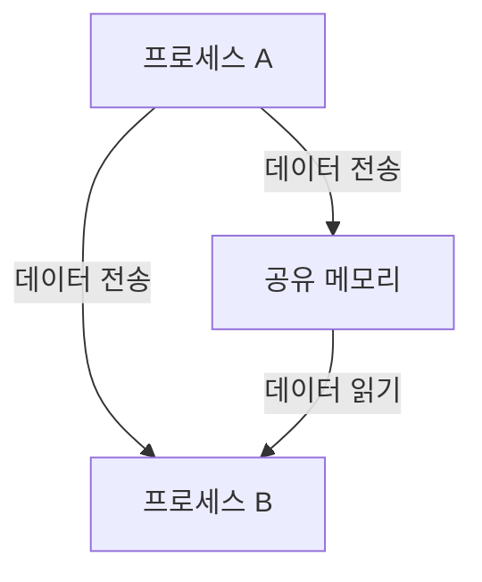
```mermaid
graph TD;
    processA["프로세스 A"] -->|"데이터 전송"| sharedMem["공유 메모리"]
    processA -->|"데이터 전송"| processB["프로세스 B"]
    sharedMem -->|"데이터 읽기"| processB
```

위의 다이어그램은 프로세스 A와 프로세스 B가 공유 메모리를 통해 데이터를 전송하는 과정을 나타낸다. 공유 메모리는 두 프로세스 간의 데이터 전송을 효율적으로 처리할 수 있는 매개체 역할을 한다.

<!--
## System V 공유 메모리 API
   - `shmget(2)` 함수 설명
   - `shmat(2)`, `shmdt(2)`, `shmctl(2)` 함수 설명
   - C와 Python 간의 데이터 타입 변환
-->

## System V 공유 메모리 API

System V IPC(Inter-Process Communication)에서 공유 메모리를 사용하기 위해서는 몇 가지 주요 API를 이해해야 한다. 이 섹션에서는 `shmget`, `shmat`, `shmdt`, `shmctl` 함수에 대해 설명하고, C와 Python 간의 데이터 타입 변환 방법에 대해 다룬다.

**`shmget(2)` 함수 설명**

`shmget` 함수는 공유 메모리 세그먼트를 생성하거나 기존의 세그먼트를 가져오는 데 사용된다. 이 함수는 다음과 같은 매개변수를 가진다:

- `key`: 공유 메모리 세그먼트를 식별하는 키 값
- `size`: 세그먼트의 크기(바이트 단위)
- `shmflg`: 세그먼트의 생성 플래그

이 함수는 성공적으로 호출되면 공유 메모리 세그먼트의 식별자(세그먼트 ID)를 반환하며, 실패할 경우 -1을 반환한다. 아래는 `shmget` 함수의 사용 예제이다.

```c
#include <sys/ipc.h>
#include <sys/shm.h>
#include <stdio.h>

int main() {
    key_t key = 1234; // 공유 메모리 키
    int shmid = shmget(key, 1024, IPC_CREAT | 0666); // 1KB 크기의 공유 메모리 생성

    if (shmid < 0) {
        perror("shmget failed");
        return 1;
    }
    printf("Shared memory ID: %d\n", shmid);
    return 0;
}
```

**`shmat(2)`, `shmdt(2)`, `shmctl(2)` 함수 설명**

- `shmat`: 이 함수는 공유 메모리 세그먼트를 프로세스의 주소 공간에 첨부하는 데 사용된다. 반환값은 세그먼트의 시작 주소이다.
- `shmdt`: 이 함수는 프로세스의 주소 공간에서 공유 메모리 세그먼트를 분리하는 데 사용된다.
- `shmctl`: 이 함수는 공유 메모리 세그먼트에 대한 제어 작업을 수행하는 데 사용된다. 예를 들어, 세그먼트를 삭제하거나 상태 정보를 조회할 수 있다.

아래는 이들 함수의 사용 예제이다.

```c
#include <sys/ipc.h>
#include <sys/shm.h>
#include <stdio.h>
#include <string.h>

int main() {
    key_t key = 1234;
    int shmid = shmget(key, 1024, IPC_CREAT | 0666);
    char *data = (char *)shmat(shmid, NULL, 0); // 공유 메모리 첨부

    strcpy(data, "Hello, Shared Memory!"); // 데이터 쓰기
    printf("Data in shared memory: %s\n", data);

    shmdt(data); // 공유 메모리 분리
    shmctl(shmid, IPC_RMID, NULL); // 공유 메모리 삭제
    return 0;
}
```

**C와 Python 간의 데이터 타입 변환**

C와 Python 간의 데이터 타입 변환은 공유 메모리를 사용할 때 중요한 부분이다. C에서는 기본적으로 바이트 배열을 사용하지만, Python에서는 다양한 데이터 타입을 지원한다. Python의 `ctypes` 모듈을 사용하여 C의 데이터 타입을 Python에서 사용할 수 있도록 변환할 수 있다.

예를 들어, C의 `int` 타입은 Python의 `ctypes.c_int`로 변환할 수 있으며, C의 `char` 배열은 `ctypes.create_string_buffer`를 사용하여 처리할 수 있다. 아래는 Python에서 C의 데이터 타입을 사용하는 예제이다.

```python
import ctypes
import sysv_ipc

key = 1234
shm = sysv_ipc.SharedMemory(key, sysv_ipc.IPC_CREAT, size=1024)

# C의 int 타입을 Python에서 사용
data = ctypes.c_int(42)
shm.write(data)

# 공유 메모리에서 데이터 읽기
read_data = ctypes.c_int.from_buffer_copy(shm.read(ctypes.sizeof(data)))
print(f"Data from shared memory: {read_data.value}")

shm.remove()  # 공유 메모리 삭제
```

이와 같이 System V 공유 메모리 API를 활용하면 프로세스 간의 데이터 공유가 가능해지며, C와 Python 간의 데이터 타입 변환을 통해 두 언어 간의 원활한 통신이 이루어질 수 있다. 

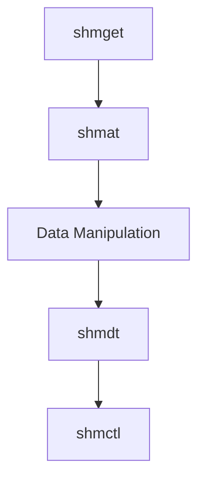
```mermaid
graph TD;
    shmGet["shmget"] --> shmAttach["shmat"]
    shmAttach --> dataManip["Data Manipulation"]
    dataManip --> shmDetach["shmdt"]
    shmDetach --> shmCtl["shmctl"]
```

위의 다이어그램은 System V 공유 메모리 API의 흐름을 나타낸다. `shmget`으로 세그먼트를 생성하고, `shmat`으로 첨부한 후, 데이터를 조작하고, `shmdt`로 분리하며, 마지막으로 `shmctl`로 세그먼트를 관리하는 과정을 보여준다.

<!--
## Python에서의 System V 공유 메모리 래퍼
   - ctypes를 이용한 라이브러리 로딩
   - `shmget` 함수 래핑
   - `shmat`, `shmdt`, `shmctl` 함수 래핑
   - void 포인터 처리 방법
-->

## Python에서의 System V 공유 메모리 래퍼

Python에서 System V IPC를 사용하기 위해서는 C 언어로 작성된 시스템 호출을 호출할 수 있는 방법이 필요하다. 이를 위해 `ctypes` 라이브러리를 사용하여 C 라이브러리를 로딩하고, 필요한 함수들을 래핑하는 과정을 설명하겠다.

**ctypes를 이용한 라이브러리 로딩**

`ctypes`는 Python에서 C 라이브러리를 호출할 수 있도록 해주는 라이브러리이다. System V IPC의 공유 메모리 관련 함수들은 C 라이브러리에 정의되어 있으므로, 이를 로딩하여 사용할 수 있다. 다음은 `ctypes`를 이용하여 C 라이브러리를 로딩하는 예제 코드이다.

```python
import ctypes

# C 라이브러리 로딩
libc = ctypes.CDLL("libc.so.6")
```

**shmget 함수 래핑**

`shmget` 함수는 공유 메모리 세그먼트를 생성하거나 기존 세그먼트를 가져오는 함수이다. 이 함수를 Python에서 사용하기 위해 래핑하는 방법은 다음과 같다.

```python
def shmget(key, size, shmflg):
    return libc.shmget(key, size, shmflg)
```

**shmat, shmdt, shmctl 함수 래핑**

`shmat`, `shmdt`, `shmctl` 함수도 마찬가지로 래핑하여 사용할 수 있다. 이 함수들은 각각 공유 메모리 세그먼트를 프로세스의 주소 공간에 첨부하거나 분리하고, 세그먼트의 제어 작업을 수행하는 함수이다.

```python
def shmat(shmid, shmaddr, shmflg):
    return libc.shmat(shmid, shmaddr, shmflg)

def shmdt(shmaddr):
    return libc.shmdt(shmaddr)

def shmctl(shmid, cmd, buf):
    return libc.shmctl(shmid, cmd, buf)
```

**void 포인터 처리 방법**

C 언어에서의 `void*` 포인터는 특정한 데이터 타입이 없는 포인터를 의미한다. Python에서는 이러한 포인터를 처리하기 위해 `ctypes`의 `c_void_p`를 사용할 수 있다. 다음은 `void*` 포인터를 처리하는 방법의 예시이다.

```python
from ctypes import c_void_p

# void 포인터를 사용하여 공유 메모리 주소를 처리
shm_addr = shmat(shmid, 0, 0)
data = ctypes.cast(shm_addr, c_void_p)
```

이와 같이 `ctypes`를 이용하여 System V IPC의 공유 메모리 관련 함수를 래핑하고, Python에서 사용할 수 있도록 준비할 수 있다. 이러한 래퍼를 통해 Python에서도 C의 성능을 활용하여 효율적인 IPC를 구현할 수 있다.

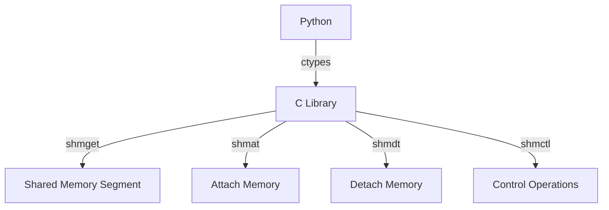
```mermaid
graph TD;
    pythonNode["Python"] -->|ctypes| cLib["C Library"]
    cLib -->|shmget| shmSeg["Shared Memory Segment"]
    cLib -->|shmat| attachMem["Attach Memory"]
    cLib -->|shmdt| detachMem["Detach Memory"]
    cLib -->|shmctl| ctrlOps["Control Operations"]
```

위의 다이어그램은 Python에서 `ctypes`를 사용하여 C 라이브러리의 공유 메모리 관련 함수들을 호출하는 과정을 나타낸다. 이러한 구조를 통해 Python에서도 효율적인 IPC를 구현할 수 있다.

<!--
## 공유 메모리 세그먼트 생성 및 관리
   - 공유 메모리 세그먼트 생성 예제
   - 세그먼트 ID 확인 및 삭제 방법
   - 세그먼트 파괴를 위한 `shmctl` 래퍼
-->

## 공유 메모리 세그먼트 생성 및 관리

공유 메모리 세그먼트는 프로세스 간의 데이터 공유를 가능하게 하는 중요한 구성 요소이다. 이 섹션에서는 공유 메모리 세그먼트를 생성하고 관리하는 방법에 대해 설명하겠다.

**공유 메모리 세그먼트 생성 예제**

공유 메모리 세그먼트를 생성하기 위해서는 `shmget` 함수를 사용해야 한다. 이 함수는 공유 메모리 세그먼트를 생성하고, 해당 세그먼트에 대한 식별자(세그먼트 ID)를 반환한다. 아래는 Python에서 `ctypes`를 사용하여 공유 메모리 세그먼트를 생성하는 예제 코드이다.

```python
import ctypes
import os

# 공유 메모리 세그먼트 생성
def create_shared_memory(size):
    # shmget 호출을 위한 C 함수 정의
    libc = ctypes.CDLL("libc.so.6")
    key = 1234  # 임의의 키 값
    shm_id = libc.shmget(key, size, 0o600 | 0o2000)  # IPC_CREAT | S_IRUSR | S_IWUSR
    if shm_id < 0:
        raise Exception("Failed to create shared memory segment")
    return shm_id

# 예제 실행
if __name__ == "__main__":
    shm_id = create_shared_memory(1024)  # 1024 바이트 크기의 공유 메모리 생성
    print(f"Created shared memory segment with ID: {shm_id}")
```

**세그먼트 ID 확인 및 삭제 방법**

생성된 공유 메모리 세그먼트의 ID를 확인하고, 필요에 따라 삭제할 수 있다. 세그먼트 ID는 `shmget` 호출의 반환값으로 얻을 수 있으며, 삭제는 `shmctl` 함수를 사용하여 수행한다. 아래는 세그먼트 ID를 확인하고 삭제하는 예제 코드이다.

```python
def delete_shared_memory(shm_id):
    libc = ctypes.CDLL("libc.so.6")
    result = libc.shmctl(shm_id, 0, None)  # IPC_RMID
    if result < 0:
        raise Exception("Failed to delete shared memory segment")

# 예제 실행
if __name__ == "__main__":
    shm_id = create_shared_memory(1024)
    print(f"Created shared memory segment with ID: {shm_id}")
    delete_shared_memory(shm_id)
    print(f"Deleted shared memory segment with ID: {shm_id}")
```

**세그먼트 파괴를 위한 `shmctl` 래퍼**

`shmctl` 함수는 공유 메모리 세그먼트의 제어 작업을 수행하는 데 사용된다. 이 함수는 세그먼트의 삭제, 상태 확인 등의 작업을 지원한다. 아래는 `shmctl`을 래핑한 간단한 함수 예제이다.

```python
def shmctl_wrapper(shm_id, cmd):
    libc = ctypes.CDLL("libc.so.6")
    result = libc.shmctl(shm_id, cmd, None)
    if result < 0:
        raise Exception("Failed to control shared memory segment")
    return result

# 예제 실행
if __name__ == "__main__":
    shm_id = create_shared_memory(1024)
    print(f"Created shared memory segment with ID: {shm_id}")
    shmctl_wrapper(shm_id, 0)  # IPC_RMID
    print(f"Controlled shared memory segment with ID: {shm_id}")
```

아래는 공유 메모리 세그먼트 생성 및 관리 과정을 나타내는 다이어그램이다.

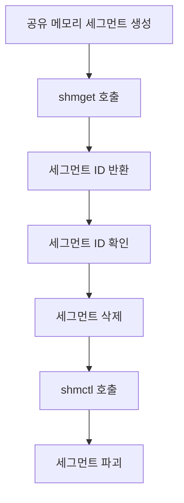
```mermaid
graph TD;
    createSeg["공유 메모리 세그먼트 생성"] --> callShmget["shmget 호출"]
    callShmget --> returnId["세그먼트 ID 반환"]
    returnId --> checkId["세그먼트 ID 확인"]
    checkId --> deleteSeg["세그먼트 삭제"]
    deleteSeg --> callShmctl["shmctl 호출"]
    callShmctl --> destroySeg["세그먼트 파괴"]
```

이와 같이 공유 메모리 세그먼트를 생성하고 관리하는 방법을 이해하면, 프로세스 간의 효율적인 데이터 공유가 가능해진다.

<!--
## 메시지 전송 실험
   - 공유 메모리를 통한 메시지 전송 방법
   - Pascal 스타일 문자열 작성 및 읽기
   - 예제 코드: 메시지 쓰기 및 읽기
-->

## 메시지 전송 실험

**공유 메모리를 통한 메시지 전송 방법** 
공유 메모리는 프로세스 간의 데이터 공유를 위한 효율적인 방법이다. 이를 통해 여러 프로세스가 동일한 메모리 공간에 접근하여 데이터를 읽고 쓸 수 있다. 메시지 전송을 위해 공유 메모리를 사용할 때는 먼저 공유 메모리 세그먼트를 생성하고, 해당 세그먼트에 데이터를 작성한 후, 다른 프로세스가 이를 읽는 방식으로 진행된다. 이 과정은 다음과 같은 단계로 이루어진다.

1. 공유 메모리 세그먼트 생성
2. 데이터 작성
3. 데이터 읽기
4. 세그먼트 해제

**Pascal 스타일 문자열 작성 및 읽기** 
Pascal 스타일 문자열은 문자열의 길이를 포함하는 형식으로, 문자열의 시작 부분에 길이를 저장한다. 이 방식은 문자열의 끝을 찾기 위해 추가적인 탐색이 필요 없으므로 효율적이다. 공유 메모리에서 Pascal 스타일 문자열을 작성하고 읽는 방법은 다음과 같다.

- 문자열의 길이를 첫 번째 바이트에 저장
- 문자열 데이터를 그 뒤에 저장

예를 들어, "Hello"라는 문자열을 공유 메모리에 저장할 경우, 메모리 구조는 다음과 같다.

```
| Length | Character Data |
|--------|----------------|
|   5    | H  e  l  l  o  |
```

**예제 코드: 메시지 쓰기 및 읽기** 
아래는 Python에서 공유 메모리를 사용하여 메시지를 쓰고 읽는 예제 코드이다. 이 코드는 `ctypes` 라이브러리를 사용하여 System V IPC의 공유 메모리 기능을 활용한다.

```python
import ctypes
import sysv_ipc

# 공유 메모리 세그먼트 생성
key = 1234
size = 256
shm = sysv_ipc.SharedMemory(key, sysv_ipc.IPC_CREAT, size)

# 메시지 작성 (Pascal 스타일)
message = "Hello"
length = len(message)
data = ctypes.create_string_buffer(size)
data[0] = length  # 첫 바이트에 길이 저장
data[1:length + 1] = message.encode('utf-8')  # 문자열 저장

# 공유 메모리에 데이터 쓰기
shm.write(data.raw)

# 공유 메모리에서 데이터 읽기
read_data = shm.read(size)
read_length = read_data[0]  # 첫 바이트에서 길이 읽기
read_message = read_data[1:read_length + 1].decode('utf-8')  # 문자열 읽기

print(f"읽은 메시지: {read_message}")

# 공유 메모리 해제
shm.remove()
```

위의 코드는 공유 메모리를 생성하고, 메시지를 작성한 후, 이를 읽어 출력하는 과정을 보여준다. 이와 같은 방식으로 여러 프로세스 간에 메시지를 전송할 수 있다.

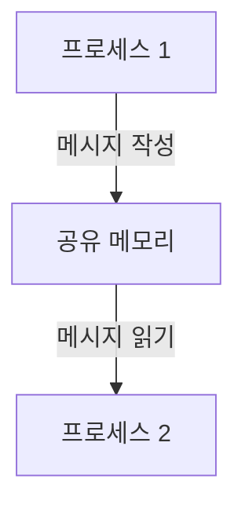
```mermaid
graph TD;
    proc1["프로세스 1"] -->|"메시지 작성"| shmMsg["공유 메모리"]
    shmMsg -->|"메시지 읽기"| proc2["프로세스 2"]
```

위의 다이어그램은 프로세스 1이 공유 메모리에 메시지를 작성하고, 프로세스 2가 이를 읽는 과정을 나타낸다. 공유 메모리를 통해 두 프로세스 간의 데이터 전송이 이루어지는 구조이다.

<!--
## System V IPC 모듈
   - `sysv_ipc` 모듈 소개
   - 세마포어, 공유 메모리, 메시지 큐 기능
   - 모듈 함수 및 상수 설명
   - 모듈 오류 처리
-->

## System V IPC 모듈

**`sysv_ipc` 모듈 소개** 
`sysv_ipc` 모듈은 Python에서 System V IPC(Inter-Process Communication) 기능을 사용할 수 있도록 해주는 라이브러리이다. 이 모듈은 세마포어, 공유 메모리, 메시지 큐와 같은 IPC 메커니즘을 지원하여 프로세스 간의 데이터 공유 및 동기화를 가능하게 한다. Python에서 System V IPC를 쉽게 사용할 수 있도록 다양한 클래스와 메서드를 제공한다.

**세마포어, 공유 메모리, 메시지 큐 기능** 
`sysv_ipc` 모듈은 다음과 같은 주요 기능을 제공한다:

1.**세마포어(Semaphore)**: 프로세스 간의 동기화를 위해 사용되며, 특정 자원에 대한 접근을 제어하는 데 유용하다.
2.**공유 메모리(Shared Memory)**: 여러 프로세스가 동일한 메모리 공간에 접근할 수 있도록 하여 데이터 공유를 가능하게 한다.
3.**메시지 큐(Message Queue)**: 프로세스 간에 메시지를 전송할 수 있는 큐를 제공하여 비동기 통신을 지원한다.

**모듈 함수 및 상수 설명** 
`sysv_ipc` 모듈에서 제공하는 주요 클래스와 메서드는 다음과 같다:

-**Semaphore**: 
  - `Semaphore(key, flags=0)`: 세마포어 객체를 생성한다.
  - `P()`: 세마포어를 감소시켜 자원에 대한 접근을 제어한다.
  - `V()`: 세마포어를 증가시켜 자원에 대한 접근을 허용한다.

-**Shared Memory**: 
  - `SharedMemory(key, size, flags=0)`: 공유 메모리 세그먼트를 생성한다.
  - `write(data)`: 공유 메모리에 데이터를 쓴다.
  - `read(size)`: 공유 메모리에서 데이터를 읽는다.

-**Message Queue**: 
  - `MessageQueue(key, flags=0)`: 메시지 큐를 생성한다.
  - `send(message)`: 메시지를 큐에 전송한다.
  - `receive()`: 큐에서 메시지를 수신한다.

**모듈 오류 처리** 
`sysv_ipc` 모듈을 사용할 때 발생할 수 있는 오류는 `sysv_ipc.ExistentialError`, `sysv_ipc.KeyError`, `sysv_ipc.PermissionError` 등이 있다. 이러한 오류는 IPC 자원에 대한 접근 권한이 없거나, 자원이 존재하지 않을 때 발생한다. 오류 처리를 위해 try-except 블록을 사용하여 적절한 예외 처리를 구현하는 것이 중요하다.

```python
import sysv_ipc

try:
    # 공유 메모리 생성
    shm = sysv_ipc.SharedMemory(1234, 1024)
    shm.write(b'Hello, World!')
    print(shm.read(1024))
except sysv_ipc.ExistentialError:
    print("공유 메모리가 존재하지 않습니다.")
except sysv_ipc.PermissionError:
    print("접근 권한이 없습니다.")
```

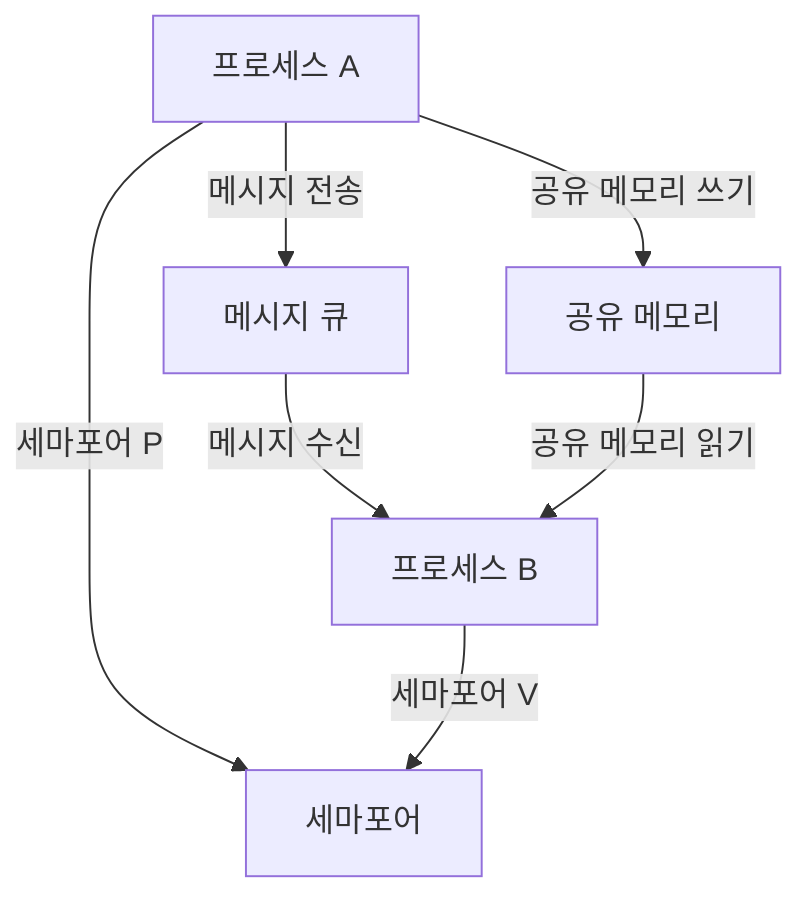
```mermaid
graph TD;
    procA["프로세스 A"] -->|"메시지 전송"| msgQueue["메시지 큐"]
    msgQueue -->|"메시지 수신"| procB["프로세스 B"]
    procA -->|"공유 메모리 쓰기"| shmNode["공유 메모리"]
    shmNode -->|"공유 메모리 읽기"| procB
    procA -->|"세마포어 P"| semNode["세마포어"]
    procB -->|"세마포어 V"| semNode
```

위의 다이어그램은 프로세스 간의 IPC 흐름을 나타내며, 메시지 큐와 공유 메모리, 세마포어의 상호작용을 보여준다. `sysv_ipc` 모듈을 통해 이러한 IPC 메커니즘을 효과적으로 활용할 수 있다.

<!--
## 세마포어 및 메시지 큐
   - 세마포어 클래스 및 메서드
   - 메시지 큐 클래스 및 메서드
   - 세마포어 및 메시지 큐의 사용 예제
-->

## 세마포어 및 메시지 큐

**세마포어 클래스 및 메서드**

세마포어(Semaphore)는 프로세스 간의 동기화를 위해 사용되는 동기화 객체이다. Python에서 세마포어를 사용하기 위해 `sysv_ipc` 모듈을 활용할 수 있다. 이 모듈은 System V IPC를 위한 다양한 기능을 제공하며, 세마포어를 생성하고 관리하는 데 필요한 클래스와 메서드를 포함하고 있다.

세마포어 클래스는 다음과 같은 주요 메서드를 제공한다:

- `acquire()`: 세마포어의 값을 감소시키고, 값이 0일 경우 대기한다.
- `release()`: 세마포어의 값을 증가시킨다.
- `get_value()`: 현재 세마포어의 값을 반환한다.

**메시지 큐 클래스 및 메서드**

메시지 큐(Message Queue)는 프로세스 간에 메시지를 전송하기 위한 큐이다. `sysv_ipc` 모듈을 사용하여 메시지 큐를 생성하고 관리할 수 있다. 메시지 큐 클래스는 다음과 같은 주요 메서드를 제공한다:

- `send(message)`: 큐에 메시지를 추가한다.
- `receive()`: 큐에서 메시지를 읽고 제거한다.
- `remove()`: 메시지 큐를 삭제한다.

**세마포어 및 메시지 큐의 사용 예제**

아래는 세마포어와 메시지 큐를 사용하는 간단한 예제 코드이다. 이 코드는 두 개의 프로세스가 세마포어를 통해 동기화되고, 메시지 큐를 통해 데이터를 전송하는 구조이다.

```python
import sysv_ipc
import time
import os

# 세마포어 생성
semaphore = sysv_ipc.Semaphore(1234, sysv_ipc.IPC_CREAT, initial_value=1)

# 메시지 큐 생성
message_queue = sysv_ipc.MessageQueue(1235, sysv_ipc.IPC_CREAT)

def producer():
    for i in range(5):
        semaphore.acquire()  # 세마포어 획득
        message = f"Message {i}"
        message_queue.send(message.encode())  # 메시지 전송
        print(f"Produced: {message}")
        semaphore.release()  # 세마포어 해제
        time.sleep(1)

def consumer():
    for _ in range(5):
        semaphore.acquire()  # 세마포어 획득
        message, _ = message_queue.receive()  # 메시지 수신
        print(f"Consumed: {message.decode()}")
        semaphore.release()  # 세마포어 해제
        time.sleep(1)

if __name__ == "__main__":
    pid = os.fork()
    if pid == 0:
        consumer()  # 자식 프로세스에서 소비자 실행
    else:
        producer()  # 부모 프로세스에서 생산자 실행
```

위의 코드는 생산자-소비자 문제를 해결하기 위한 간단한 예제이다. 생산자는 세마포어를 사용하여 메시지를 큐에 추가하고, 소비자는 세마포어를 사용하여 메시지를 큐에서 읽어온다.

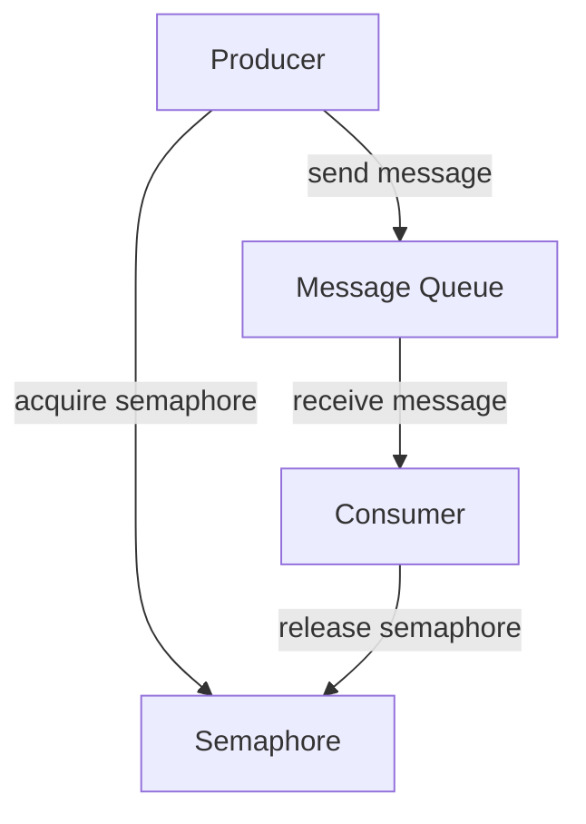
```mermaid
graph TD;
    producer["Producer"] -->|"send message"| msgQ["Message Queue"]
    msgQ -->|"receive message"| consumer["Consumer"]
    producer -->|"acquire semaphore"| sem["Semaphore"]
    consumer -->|"release semaphore"| sem
```

위의 다이어그램은 생산자와 소비자 간의 메시지 전송 흐름을 나타낸다. 세마포어는 두 프로세스 간의 동기화를 보장하여 데이터의 일관성을 유지하는 역할을 한다.

<!--
## 관련 기술
   - POSIX IPC와의 비교
   - Python 3.8 이후의 공유 메모리 추상화
   - Cygwin을 통한 Windows에서의 IPC 사용
-->

## 관련 기술

**POSIX IPC와의 비교** 
POSIX IPC(Inter-Process Communication)는 System V IPC와 유사한 기능을 제공하지만, 더 현대적이고 사용하기 쉬운 API를 제공한다. POSIX IPC는 세마포어, 메시지 큐, 공유 메모리와 같은 다양한 IPC 메커니즘을 지원하며, POSIX 표준을 준수하는 시스템에서 일관된 동작을 보장한다. 반면, System V IPC는 오래된 API로, 사용법이 복잡하고 다양한 시스템에서의 호환성 문제가 발생할 수 있다. 다음은 두 IPC 방식의 주요 차이점이다.

| 특징               | System V IPC         | POSIX IPC            |
|------------------|---------------------|---------------------|
| API 스타일        | 복잡하고 다양한 함수 | 간단하고 일관된 함수 |
| 메모리 관리      | 수동 관리 필요      | 자동 관리 가능      |
| 호환성            | 제한적              | 널리 사용됨         |

**Python 3.8 이후의 공유 메모리 추상화** 
Python 3.8부터는 `multiprocessing.shared_memory` 모듈이 도입되어, 공유 메모리를 보다 쉽게 사용할 수 있게 되었다. 이 모듈은 POSIX와 System V IPC의 복잡성을 숨기고, Python 객체를 공유 메모리에 저장하고 읽을 수 있는 간단한 인터페이스를 제공한다. 이를 통해 개발자는 IPC를 구현할 때 더 적은 코드로 더 많은 기능을 사용할 수 있다.

다음은 Python 3.8의 `shared_memory` 모듈을 사용하는 간단한 예제 코드이다.

```python
from multiprocessing import shared_memory

# 공유 메모리 생성
shm = shared_memory.SharedMemory(create=True, size=10)

# 데이터 쓰기
shm.buf[:5] = b'Hello'

# 데이터 읽기
print(bytes(shm.buf[:5]))  # 출력: b'Hello'

# 공유 메모리 해제
shm.close()
shm.unlink()
```

**Cygwin을 통한 Windows에서의 IPC 사용** 
Cygwin은 Windows에서 Linux와 유사한 환경을 제공하는 도구로, System V IPC와 POSIX IPC를 사용할 수 있게 해준다. Cygwin을 통해 개발자는 Windows에서도 Unix-like 시스템에서 사용하는 IPC 메커니즘을 활용할 수 있다. Cygwin을 설치한 후, 필요한 패키지를 설치하면 System V IPC와 POSIX IPC를 사용할 수 있다.

다음은 Cygwin에서 IPC를 사용하는 간단한 다이어그램이다.

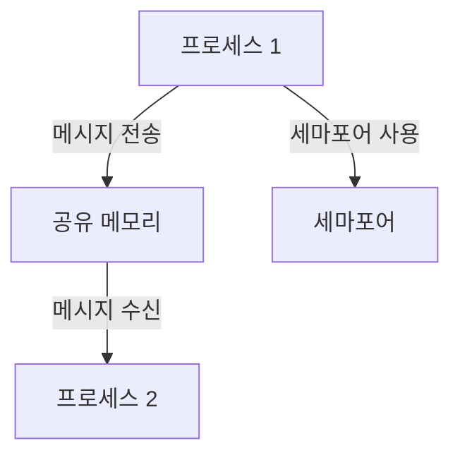
```mermaid
graph TD;
    p1["프로세스 1"] -->|"메시지 전송"| shmCyg["공유 메모리"]
    p1 -->|"세마포어 사용"| semCyg["세마포어"]
    shmCyg -->|"메시지 수신"| p2["프로세스 2"]
```

이와 같이 Cygwin을 통해 Windows에서도 IPC를 구현할 수 있으며, 다양한 IPC 메커니즘을 활용하여 프로세스 간의 통신을 원활하게 할 수 있다.

<!--
## FAQ
   - System V IPC와 POSIX IPC의 차이점은 무엇인가요?
   - Python에서 공유 메모리를 사용할 때 주의할 점은 무엇인가요?
   - 세마포어와 메시지 큐의 차이점은 무엇인가요?
-->

## FAQ

**System V IPC와 POSIX IPC의 차이점은 무엇인가요?**

System V IPC와 POSIX IPC는 두 가지 주요 IPC(Inter-Process Communication) 메커니즘이다. System V IPC는 오래된 방식으로, 주로 UNIX 시스템에서 사용되며, 세마포어, 메시지 큐, 공유 메모리와 같은 기능을 제공한다. 반면, POSIX IPC는 더 현대적인 접근 방식으로, POSIX 표준을 따르는 시스템에서 사용된다. POSIX IPC는 더 간단한 API를 제공하며, 더 나은 이식성을 지원한다. 예를 들어, POSIX 공유 메모리는 `shm_open`과 `mmap`을 사용하여 구현되며, System V IPC는 `shmget`과 `shmat`을 사용한다.

**Python에서 공유 메모리를 사용할 때 주의할 점은 무엇인가요?**

Python에서 공유 메모리를 사용할 때는 몇 가지 주의할 점이 있다. 첫째, 공유 메모리는 여러 프로세스 간에 데이터를 공유하기 때문에 데이터의 일관성을 유지하는 것이 중요하다. 이를 위해 적절한 동기화 메커니즘을 사용해야 한다. 둘째, Python의 GIL(Global Interpreter Lock)로 인해 멀티스레딩 환경에서 성능 저하가 발생할 수 있다. 따라서 멀티프로세싱을 고려하는 것이 좋다. 마지막으로, 공유 메모리의 크기와 데이터 구조를 신중하게 설계해야 하며, 메모리 누수를 방지하기 위해 사용이 끝난 후 적절히 해제해야 한다.

**세마포어와 메시지 큐의 차이점은 무엇인가요?**

세마포어와 메시지 큐는 IPC에서 서로 다른 목적을 가진 두 가지 메커니즘이다. 세마포어는 주로 동기화에 사용되며, 여러 프로세스가 공유 자원에 접근할 때 충돌을 방지하는 역할을 한다. 세마포어는 카운팅 세마포어와 이진 세마포어로 나뉘며, 자원의 사용 가능 여부를 나타낸다. 반면, 메시지 큐는 프로세스 간에 메시지를 전송하는 데 사용된다. 메시지 큐는 비동기적으로 작동하며, 프로세스가 메시지를 보내고 받을 수 있는 구조를 제공한다. 

다음은 세마포어와 메시지 큐의 간단한 예제 코드이다.

```python
import sysv_ipc

# 세마포어 생성
semaphore = sysv_ipc.Semaphore(1234, sysv_ipc.IPC_CREAT, initial_value=1)

# 메시지 큐 생성
message_queue = sysv_ipc.MessageQueue(1234, sysv_ipc.IPC_CREAT)

# 세마포어 사용 예
semaphore.acquire()  # 세마포어 획득
# 공유 자원 접근 코드
semaphore.release()  # 세마포어 해제

# 메시지 큐 사용 예
message_queue.send(b'Hello, World!')  # 메시지 전송
message, _ = message_queue.receive()  # 메시지 수신
print(message.decode())  # 메시지 출력
```

다음은 세마포어와 메시지 큐의 관계를 나타내는 다이어그램이다.

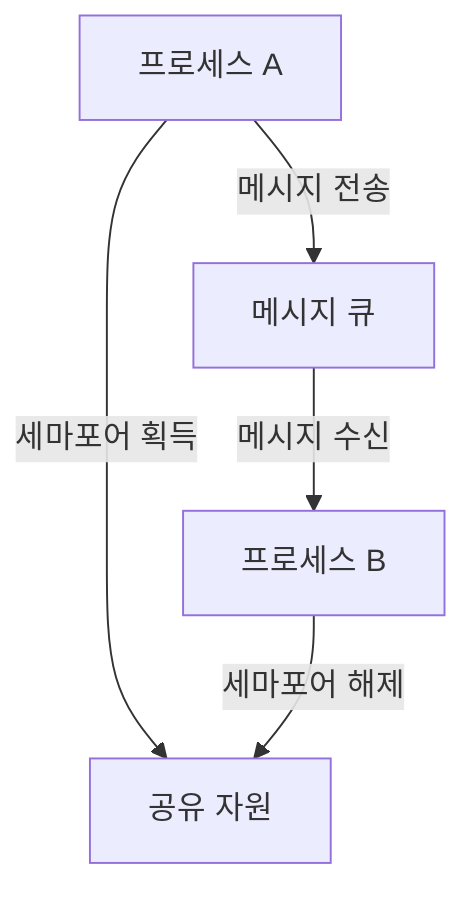
```mermaid
graph TD;
    procA3["프로세스 A"] -->|"세마포어 획득"| sharedRes["공유 자원"]
    procA3 -->|"메시지 전송"| mq["메시지 큐"]
    mq -->|"메시지 수신"| procB3["프로세스 B"]
    procB3 -->|"세마포어 해제"| sharedRes
```

이와 같이 세마포어와 메시지 큐는 서로 다른 역할을 수행하며, IPC를 통해 프로세스 간의 효율적인 통신과 동기화를 가능하게 한다.

<!--
## 결론
   - Python에서 System V IPC를 사용하는 장점
   - 향후 개선 사항 및 추가 기능 제안
   - 개인 GitHub 저장소 및 코드 공유 안내
-->

## 결론

**Python에서 System V IPC를 사용하는 장점** 
Python에서 System V IPC를 사용하는 주요 장점은 프로세스 간의 효율적인 데이터 공유가 가능하다는 점이다. System V IPC는 메모리 세그먼트를 통해 여러 프로세스가 동일한 메모리 공간에 접근할 수 있도록 하여, 데이터 전송 속도를 크게 향상시킨다. 또한, Python의 ctypes 라이브러리를 활용하면 C로 작성된 API를 손쉽게 호출할 수 있어, 시스템 자원에 대한 접근이 용이하다. 이러한 특성 덕분에 대규모 데이터 처리나 실시간 시스템에서 유용하게 사용될 수 있다.

**향후 개선 사항 및 추가 기능 제안** 
향후 개선 사항으로는 Python 3.8 이후에 도입된 새로운 공유 메모리 API를 활용하여, 보다 직관적이고 사용하기 쉬운 인터페이스를 제공하는 것이 필요하다. 또한, 에러 처리 및 예외 처리를 강화하여, 개발자가 보다 안정적으로 IPC를 사용할 수 있도록 하는 것이 중요하다. 추가 기능으로는, 다양한 데이터 구조를 지원하는 고급 래퍼를 제공하여, 사용자가 복잡한 데이터 타입을 쉽게 다룰 수 있도록 하는 방안이 있다.

**개인 GitHub 저장소 및 코드 공유 안내** 
개인 GitHub 저장소를 통해 본 블로그에서 다룬 예제 코드 및 추가 자료를 공유할 예정이다. GitHub 저장소에는 System V IPC를 활용한 다양한 예제와 함께, 코드에 대한 설명 및 사용법을 포함할 계획이다. 이를 통해 독자들이 실제로 코드를 실행해보고, IPC의 작동 방식을 이해하는 데 도움이 될 것이다.

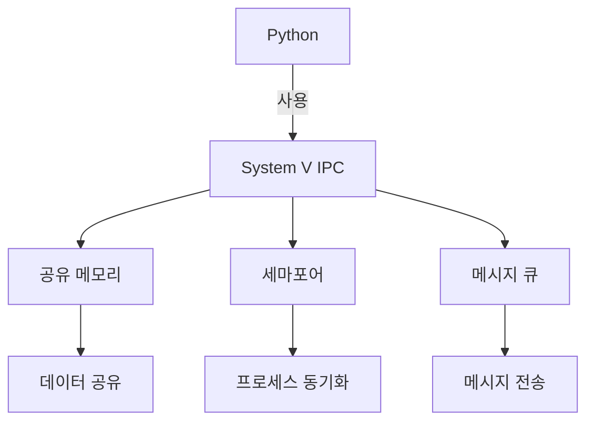
```mermaid
graph TD;
    py["Python"] -->|"사용"| sysvIpc["System V IPC"]
    sysvIpc --> shm["공유 메모리"]
    sysvIpc --> sem2["세마포어"]
    sysvIpc --> mq2["메시지 큐"]
    shm --> dataShare["데이터 공유"]
    sem2 --> sync["프로세스 동기화"]
    mq2 --> msgSend["메시지 전송"]
```

위의 다이어그램은 Python에서 System V IPC를 사용하여 공유 메모리, 세마포어, 메시지 큐를 통해 데이터 공유 및 프로세스 동기화를 어떻게 수행하는지를 시각적으로 나타낸 것이다. 이러한 구조를 통해 Python 개발자들이 IPC를 보다 쉽게 이해하고 활용할 수 있을 것이다.

<!--
## 참고 자료
   - 관련 문서 및 링크
   - `man` 페이지 및 시스템 API 문서
   - Python 패키지 설치 및 사용법 안내
-->

## 참고 자료

**관련 문서 및 링크**  
System V IPC와 관련된 자료는 아래 링크에서 확인할 수 있다. 본문에 넣은 링크는 접근 가능한 URL만 사용하였다.

- [Linux Programmer's Manual (man7.org)](https://man7.org/linux/man-pages/): Linux 시스템 콜 및 IPC API 공식 매뉴얼.
- [The Linux Documentation Project](https://www.tldp.org/): Linux 문서·HOWTO 모음.
- [Python 공식 문서](https://docs.python.org/3/): Python 3 표준 라이브러리; [ctypes](https://docs.python.org/3/library/ctypes.html) 등.

**시스템 API `man` 페이지**  
- [shmget(2)](https://man7.org/linux/man-pages/man2/shmget.2.html): 공유 메모리 세그먼트 생성.
- [shmat(2)](https://man7.org/linux/man-pages/man2/shmat.2.html), [shmdt(2)](https://man7.org/linux/man-pages/man2/shmdt.2.html): 세그먼트 첨부/분리.
- [shmctl(2)](https://man7.org/linux/man-pages/man2/shmctl.2.html): 세그먼트 제어 및 삭제.  

**Python 패키지 설치 및 사용법 안내** 
Python에서 System V IPC를 사용하기 위해 필요한 패키지 설치 방법은 다음과 같다. 기본적으로 Python 표준 라이브러리만으로도 IPC를 사용할 수 있지만, 추가적인 기능을 위해 `sysv_ipc` 패키지를 설치할 수 있다.  

```bash
pip install sysv_ipc
```

설치 후, 다음과 같이 패키지를 임포트하여 사용할 수 있다.

```python
import sysv_ipc

# 공유 메모리 생성
key = 1234
memory = sysv_ipc.SharedMemory(key, sysv_ipc.IPC_CREAT, size=1024)

# 데이터 쓰기
memory.write(b'Hello, World!')

# 데이터 읽기
data = memory.read()
print(data)
```

**다이어그램** 
다음은 System V IPC의 기본 구조를 나타내는 다이어그램이다. 이 다이어그램은 공유 메모리 세그먼트와 프로세스 간의 관계를 보여준다.

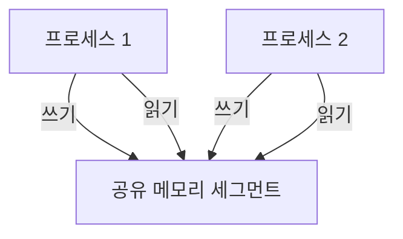
```mermaid
graph TD;
    writer["프로세스 1"] -->|"쓰기"| seg["공유 메모리 세그먼트"]
    writer -->|"읽기"| seg
    reader["프로세스 2"] -->|"쓰기"| seg
    reader -->|"읽기"| seg
```

**참고 문헌**  
- [Python and SysV shared memory (euroquis.nl)](https://euroquis.nl/blabla/2024/10/08/shm.html): ctypes로 shmget·shmat·shmctl 래핑 및 Pascal 스타일 문자열 예제.
- [SysV IPC for Python (semanchuk.com)](https://semanchuk.com/philip/sysv_ipc/): sysv_ipc 모듈 소개; 최신 코드·문서는 [GitHub osvenskan/sysv_ipc](https://github.com/osvenskan/sysv_ipc/) 참고.
- [sysv-ipc (PyPI)](https://pypi.org/project/sysv-ipc/): System V 세마포어·공유 메모리·메시지 큐 Python 패키지.

이와 같은 자료를 통해 System V IPC에 대한 이해를 높이고, Python에서의 활용 방법을 익힐 수 있다.
