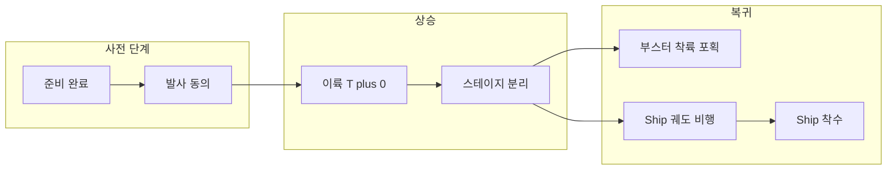

## 개요

2024년 10월 13일, SpaceX는 텍사스 남부 **스타베이스(Starbase)**에서 **스타쉽(Starship)** 5번째 비행을 성공시켰다. 이번 임무의 핵심은 1단 **슈퍼 헤비(Super Heavy)** 부스터를 발사대 타워의 **메카질라(Mechazilla)** "젓가락(chopsticks)" 팔로 포획하는 것이었으며, **세계 최초**로 계획대로 달성되었다. 상단 스테이지(Ship)는 궤도에 진입한 뒤 인도양 착수까지 완료했고, 일부 엔진 점화 후 의도된 폭발로 임무를 마쳤다.

**추천 대상**: 우주 발사·재사용 로켓·SpaceX 스타쉽에 관심 있는 독자, 임무 타임라인과 기술·규제 배경을 한 번에 보고 싶은 이.

---

## 임무 타임라인 (Flight 5)

Flight 5의 주요 구간을 단순화한 흐름은 아래와 같다.

| 시점 | 이벤트 |
|------|--------|
| **T+0** | 스타베이스에서 스타쉽 발사 (EDT 08:25, 현지 07:25) |
| **T+약 2~3분** | 슈퍼 헤비·Ship 스테이지 분리 |
| **T+약 7분** | 슈퍼 헤비, 메카질라 타워 "젓가락" 팔로 포획 성공 |
| **T+약 65분** | Ship 인도양 착수 (엔진 점화 후 계획된 폭발) |

---

## 스타쉽·슈퍼 헤비 개요

- **스타쉽**: 현재 인류가 만든 **가장 크고 강력한** 우주 발사체. 전고 약 **122 m**, 1단 슈퍼 헤비 + 2단 Ship(상단 스테이지) 구성.
- **슈퍼 헤비**: 1단 부스터. 다수의 **랩터(Raptor)** 엔진으로 이륙·상승을 담당. 재사용을 위해 **발사대 인근 타워**로 복귀해 착륙하는 방식을 채택.
- **메카질라·젓가락**: 발사대에 있는 타워와 두 개의 큰 금속 팔. 부스터가 **직접 착륙하지 않고**, 공중에서 팔이 부스터를 **포획(catch)**하는 방식으로, 해상 착륙 플랫폼 없이 빠른 재사용을 목표로 한다.

---

## Flight 5 기술 요약

- **열차폐 개선**: Flight 5 전에 열차폐(heat shield)를 전면 교체. 12,000시간 이상 투입해 새 세대 타일·백업 소산층·플랩 구조 보강을 적용했다([SpaceX Flight 5 mission description](https://www.spacex.com/launches/mission/?missionId=starship-flight-5)).
- **부스터 포획**: 발사 후 약 7분 만에 슈퍼 헤비가 타워 근처에서 호버링하며 메카질라 팔에 포획되었고, SpaceX는 이를 "첫 시도에서 성공"으로 평가했다.
- **Ship 복귀**: 50 m급 상단 스테이지는 궤도에 진입한 뒤 대기권 재진입, 인도양 착수. 착수 직전 6개 엔진 중 3개를 점화해 제어한 뒤 기울어지며 폭발했으며, 이는 **회수하지 않는** 이번 프로필에서 의도된 종료 방식이다.

---

## 현장 반응·평가

- **Kate Tice**(SpaceX 품질 시스템 엔지니어링 매니저): "기술 역사에 남을 날", "첫 시도에서 슈퍼 헤비 부스터를 발사 타워에서 성공적으로 포획했다."
- **Dan Huot**(현장 대변인): "마법 같다."
- **Elon Musk**: [X 발문](https://x.com/elonmusk/status/1845463518671466934)에서 "오늘 다행성 종족으로 가는 큰 한 걸음을 내딛었다"고 평가.

---

## 규제·FAA 배경

Flight 5는 기술적으로는 2024년 8월 초에 준비되었으나, **미국 연방항공청(FAA)** 승인이 필요했다. SpaceX가 **기체 구성과 임무 프로필을 변경**하면서 기존 Flight 4 라이선스와 다른 심사가 필요했고, 8월 중순 제출 자료에서 **Flight 5의 환경 영향 범위가 이전 검토보다 넓어져** 타 기관과의 협의가 필요했다. FAA는 한때 11월 말 이전 승인은 어렵다고 했으나, 실제로는 10월 13일 발사가 이루어졌다. SpaceX는 블로그 "[Starships Are Meant to Fly](https://www.spacex.com/updates/#starships-fly)"에서 승인 지연과 규제 프로세스에 대한 불만을 밝힌 바 있다.

---

## 스타쉽의 목표·다음 단계

- **목표**: 달·화성 탐사 및 인류의 다행성 거주. **완전·신속 재사용**을 통해 발사 비용과 주기를 혁신하는 것이 핵심이다.
- **NASA**: 아티미스 프로그램의 **첫 유인 달 착륙선**으로 스타쉽을 선정했으며, **Artemis 3**(현재 2026년 9월 목표)에서 달 착륙에 사용할 계획이다.
- **이후 비행**: Flight 6용 Ship의 정지 연소(static fire) 등이 이어지며, 스타쉽은 계속 개선·재설계 후 시험 비행을 반복하는 전략이다.

---

## 영상·원문

- **YouTube**: 아래 임베드(공식 발사 영상).



- **원문 기사**: [Space.com – SpaceX catches giant Starship booster with 'Chopsticks' on historic Flight 5 (video)](https://www.space.com/spacex-starship-flight-5-launch-super-heavy-booster-catch-success-video)

---

## 참고 문헌

1. **SpaceX**, *Starship Flight 5 mission description*, [spacex.com/launches/mission/?missionId=starship-flight-5](https://www.spacex.com/launches/mission/?missionId=starship-flight-5)  
2. **Space.com**, *SpaceX catches giant Starship booster with 'Chopsticks' on historic Flight 5 rocket launch and landing (video)*, Mike Wall, 2024-10-13, [space.com/spacex-starship-flight-5-launch-super-heavy-booster-catch-success-video](https://www.space.com/spacex-starship-flight-5-launch-super-heavy-booster-catch-success-video)  
3. **SpaceX**, *Starships Are Meant to Fly* (업데이트 블로그), [spacex.com/updates/#starships-fly](https://www.spacex.com/updates/#starships-fly)
