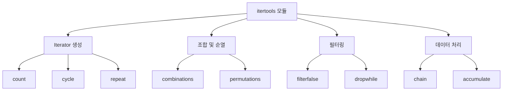
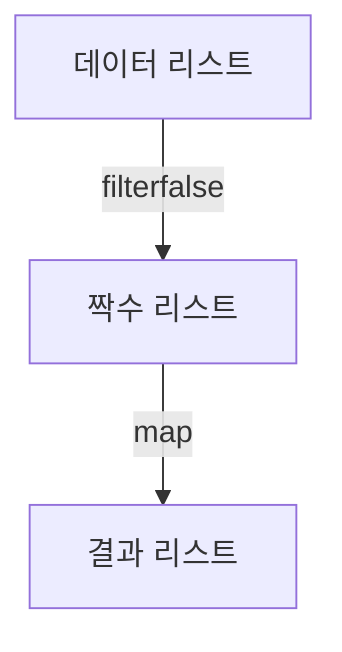
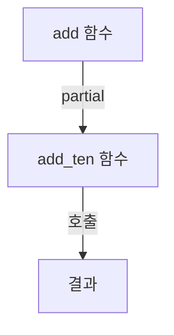
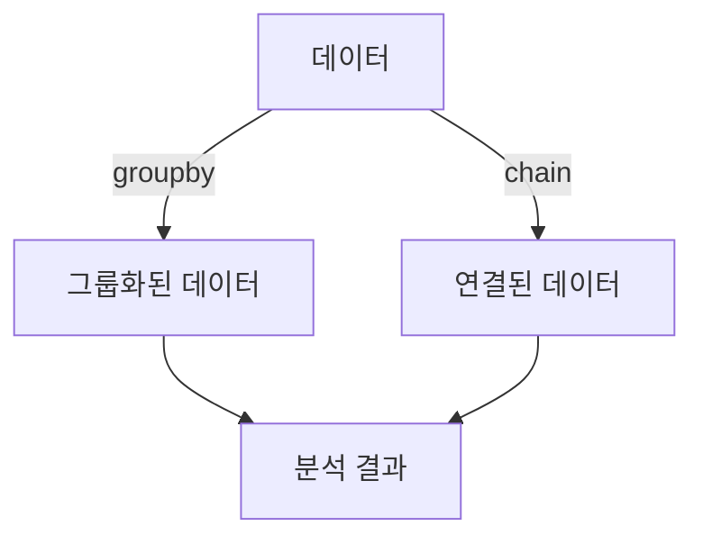
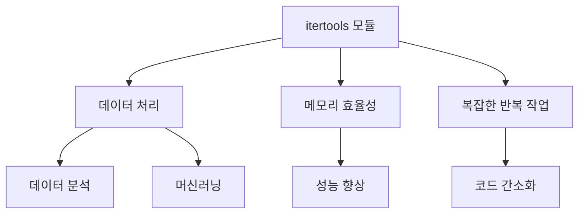

`itertools` 모듈은 파이썬에서 효율적으로 반복 가능한 객체(Iterator)를 생성하는 데 유용한 도구이다. 이 모듈은 다양한 반복자 생성 함수를 제공하여, 데이터 처리 및 알고리즘 구현 시 코드의 효율성을 높여준다. 특히, `itertools`의 함수들은 함수형 프로그래밍의 개념을 바탕으로 설계되어 있어, 고차 함수(Higher-Order Functions), 지연 평가(Lazy Evaluation), 커링(Currying) 및 부분 함수(Partial Functions)와 같은 개념을 활용할 수 있다. 이러한 기능들은 코드의 재사용성을 높이고, 모듈화된 구조를 통해 복잡한 문제를 간단하게 해결할 수 있도록 돕는다. 예를 들어, `takewhile`과 `dropwhile` 함수는 조건에 따라 요소를 선택하거나 제외하는 데 사용되며, `groupby` 함수는 연속적인 요소를 그룹화하는 데 유용하다. 이 외에도 `partial` 함수는 특정 인자를 고정하여 새로운 함수를 생성하는 데 사용되며, 이는 코드의 중복을 줄이고 가독성을 높이는 데 기여한다. 이러한 `itertools` 모듈의 다양한 기능을 활용하면, 파이썬 프로그래밍에서 더 나은 성능과 효율성을 달성할 수 있다.

<!--
##### Outline #####
-->

<!--
# 목차

## 1. 개요
   - itertools 모듈 소개
   - 함수형 프로그래밍의 중요성

## 2. itertools 모듈의 주요 기능
   - 2.1. Iterator의 개념
   - 2.2. 주요 함수 설명
     - count
     - cycle
     - repeat
     - accumulate
     - chain
     - compress
     - dropwhile
     - filterfalse
     - groupby
     - islice
     - starmap
     - takewhile
     - tee
     - zip_longest
     - product
     - permutations
     - combinations
     - combinations_with_replacement

## 3. 함수형 프로그래밍 개념
   - 3.1. 고차 함수 (Higher-Order Functions)
     - 3.1.1. 고차 함수의 정의
     - 3.1.2. 예제: 고차 함수로서의 apply_operation
     - 3.1.3. 예제: 고차 함수로서의 get_func
   - 3.2. 커링 (Currying)
     - 3.2.1. 커링의 정의
     - 3.2.2. 예제: 커링을 통한 함수 재사용
   - 3.3. 부분 함수 (Partial Functions)
     - 3.3.1. 부분 함수의 정의
     - 3.3.2. 예제: partial을 이용한 이메일 생성기
   - 3.4. 지연 평가 (Lazy Evaluation)
     - 3.4.1. 지연 평가의 개념
     - 3.4.2. itertools에서의 지연 평가 활용

## 4. itertools의 주요 함수 심화
   - 4.1. takewhile과 dropwhile
     - 4.1.1. takewhile의 동작 원리
     - 4.1.2. dropwhile의 동작 원리
   - 4.2. groupby
     - 4.2.1. groupby의 사용 예
     - 4.2.2. groupby의 기능적 프로그래밍 개념
   - 4.3. partial
     - 4.3.1. partial의 사용 예
     - 4.3.2. partial의 기능적 프로그래밍 개념

## 5. 예제
   - 5.1. itertools를 활용한 데이터 처리 예제
   - 5.2. 고차 함수와 부분 함수를 활용한 예제

## 6. FAQ
   - 6.1. itertools 모듈은 언제 사용해야 하나요?
   - 6.2. 고차 함수와 일반 함수의 차이는 무엇인가요?
   - 6.3. 커링과 부분 함수의 차이는 무엇인가요?
   - 6.4. 지연 평가의 장점은 무엇인가요?

## 7. 관련 기술
   - 7.1. Python의 함수형 프로그래밍
   - 7.2. 다른 프로그래밍 언어에서의 itertools 유사 기능
   - 7.3. 데이터 처리 및 분석에서의 itertools 활용

## 8. 결론
   - itertools 모듈의 중요성 요약
   - 함수형 프로그래밍 개념의 실용성 강조
   - 향후 학습 방향 제안
-->

<!--
## 1. 개요
   - itertools 모듈 소개
   - 함수형 프로그래밍의 중요성
-->

## 개요

### itertools 모듈 소개

itertools 모듈은 Python의 표준 라이브러리 중 하나로, 반복자(iterator)와 관련된 다양한 기능을 제공하는 모듈이다. 이 모듈은 효율적인 데이터 처리와 조합 생성에 유용한 도구들을 포함하고 있으며, 특히 대량의 데이터를 다룰 때 메모리 사용을 최소화할 수 있는 장점이 있다. itertools 모듈은 다양한 반복자 생성 함수와 조합, 순열, 필터링 등의 기능을 제공하여, 복잡한 데이터 처리 작업을 간결하게 수행할 수 있도록 돕는다.

다음은 itertools 모듈의 주요 기능을 시각적으로 나타낸 다이어그램이다.



### 함수형 프로그래밍의 중요성

함수형 프로그래밍은 프로그래밍 패러다임 중 하나로, 프로그램을 수학적 함수의 조합으로 구성하는 방식이다. 이 접근 방식은 코드의 가독성을 높이고, 유지보수를 용이하게 하며, 버그 발생 가능성을 줄이는 데 기여한다. 함수형 프로그래밍의 주요 특징 중 하나는 상태를 변경하지 않고, 입력에 대한 출력을 생성하는 순수 함수(pure function)를 사용하는 것이다.

함수형 프로그래밍은 다음과 같은 장점을 제공한다:

- **모듈화**: 함수는 독립적으로 작성되고 테스트될 수 있어, 코드의 재사용성을 높인다.
- **병렬 처리**: 상태를 변경하지 않기 때문에, 여러 함수가 동시에 실행될 수 있어 성능을 향상시킬 수 있다.
- **디버깅 용이성**: 순수 함수는 입력이 동일하면 항상 동일한 출력을 반환하므로, 디버깅이 용이하다.

이러한 이유로, 함수형 프로그래밍은 데이터 처리 및 분석, 웹 개발 등 다양한 분야에서 점점 더 중요해지고 있다. itertools 모듈은 이러한 함수형 프로그래밍의 개념을 활용하여, 효율적이고 간결한 데이터 처리를 가능하게 한다.

<!--
## 2. itertools 모듈의 주요 기능
   - 2.1. Iterator의 개념
   - 2.2. 주요 함수 설명
     - count
     - cycle
     - repeat
     - accumulate
     - chain
     - compress
     - dropwhile
     - filterfalse
     - groupby
     - islice
     - starmap
     - takewhile
     - tee
     - zip_longest
     - product
     - permutations
     - combinations
     - combinations_with_replacement
-->

## itertools 모듈의 주요 기능

itertools 모듈은 Python에서 반복자(iterator)를 생성하고 조작하는 데 유용한 다양한 함수를 제공하는 모듈이다. 이 모듈은 메모리 효율적인 데이터 처리를 가능하게 하며, 특히 대량의 데이터를 다룰 때 유용하다. 이번 섹션에서는 iterator의 개념과 itertools 모듈의 주요 함수들에 대해 살펴보겠다.

### Iterator의 개념

Iterator는 데이터를 순차적으로 접근할 수 있는 객체이다. Python에서는 `__iter__()`와 `__next__()` 메서드를 구현하여 iterator를 정의할 수 있다. iterator는 메모리를 효율적으로 사용하며, 필요한 데이터만을 생성하기 때문에 대량의 데이터를 처리할 때 유리하다.

```python
class MyIterator:
    def __init__(self, limit):
        self.limit = limit
        self.current = 0

    def __iter__(self):
        return self

    def __next__(self):
        if self.current < self.limit:
            self.current += 1
            return self.current
        else:
            raise StopIteration

# 사용 예
for number in MyIterator(5):
    print(number)
```

### 주요 함수 설명

itertools 모듈은 다양한 유용한 함수를 제공한다. 아래는 그 중 일부를 설명한다.

**count**

`count` 함수는 지정된 시작 값부터 무한히 증가하는 숫자를 생성하는 iterator를 반환한다.

```python
import itertools

for number in itertools.count(start=10, step=2):
    if number > 20:
        break
    print(number)
```

**cycle**

`cycle` 함수는 주어진 iterable의 요소를 무한히 반복하는 iterator를 생성한다.

```python
import itertools

colors = ['red', 'green', 'blue']
for color in itertools.cycle(colors):
    if color == 'blue':
        break
    print(color)
```

**repeat**

`repeat` 함수는 주어진 값을 무한히 반복하는 iterator를 생성한다.

```python
import itertools

for value in itertools.repeat('hello', 3):
    print(value)
```

**accumulate**

`accumulate` 함수는 주어진 iterable의 누적 합계를 계산하는 iterator를 반환한다.

```python
import itertools

numbers = [1, 2, 3, 4]
result = list(itertools.accumulate(numbers))
print(result)  # [1, 3, 6, 10]
```

**chain**

`chain` 함수는 여러 iterable을 연결하여 하나의 iterator로 반환한다.

```python
import itertools

iter1 = [1, 2, 3]
iter2 = ['a', 'b', 'c']
result = list(itertools.chain(iter1, iter2))
print(result)  # [1, 2, 3, 'a', 'b', 'c']
```

**compress**

`compress` 함수는 두 iterable을 받아 첫 번째 iterable의 요소 중 두 번째 iterable의 요소가 True인 것만 반환하는 iterator를 생성한다.

```python
import itertools

data = ['a', 'b', 'c', 'd']
selectors = [1, 0, 1, 0]
result = list(itertools.compress(data, selectors))
print(result)  # ['a', 'c']
```

**dropwhile**

`dropwhile` 함수는 주어진 조건이 True인 동안 요소를 건너뛰고, 조건이 False가 되는 첫 번째 요소부터 iterator를 반환한다.

```python
import itertools

data = [1, 4, 6, 8, 10]
result = list(itertools.dropwhile(lambda x: x < 5, data))
print(result)  # [6, 8, 10]
```

**filterfalse**

`filterfalse` 함수는 주어진 조건이 False인 요소만 반환하는 iterator를 생성한다.

```python
import itertools

data = [1, 2, 3, 4, 5]
result = list(itertools.filterfalse(lambda x: x % 2 == 0, data))
print(result)  # [1, 3, 5]
```

**groupby**

`groupby` 함수는 주어진 iterable의 연속된 동일한 요소를 그룹화하여 반환한다.

```python
import itertools

data = [('a', 1), ('a', 2), ('b', 1), ('b', 2)]
result = {key: list(group) for key, group in itertools.groupby(data, key=lambda x: x[0])}
print(result)  # {'a': [('a', 1), ('a', 2)], 'b': [('b', 1), ('b', 2)]}
```

**islice**

`islice` 함수는 주어진 iterable의 특정 범위의 요소를 반환하는 iterator를 생성한다.

```python
import itertools

data = [1, 2, 3, 4, 5]
result = list(itertools.islice(data, 1, 4))
print(result)  # [2, 3, 4]
```

**starmap**

`starmap` 함수는 주어진 함수를 iterable의 요소에 적용하여 결과를 반환하는 iterator를 생성한다.

```python
import itertools

data = [(1, 2), (3, 4), (5, 6)]
result = list(itertools.starmap(lambda x, y: x + y, data))
print(result)  # [3, 7, 11]
```

**takewhile**

`takewhile` 함수는 주어진 조건이 True인 동안 요소를 반환하는 iterator를 생성한다.

```python
import itertools

data = [1, 2, 3, 4, 5]
result = list(itertools.takewhile(lambda x: x < 4, data))
print(result)  # [1, 2, 3]
```

**tee**

`tee` 함수는 주어진 iterable을 n개의 독립적인 iterator로 분리한다.

```python
import itertools

data = [1, 2, 3]
iter1, iter2 = itertools.tee(data, 2)
print(list(iter1))  # [1, 2, 3]
print(list(iter2))  # [1, 2, 3]
```

**zip_longest**

`zip_longest` 함수는 여러 iterable을 병합하여 가장 긴 iterable의 길이에 맞춰 결과를 반환한다.

```python
import itertools

iter1 = [1, 2, 3]
iter2 = ['a', 'b']
result = list(itertools.zip_longest(iter1, iter2, fillvalue='missing'))
print(result)  # [(1, 'a'), (2, 'b'), (3, 'missing')]
```

**product**

`product` 함수는 주어진 iterable의 카르테시안 곱을 반환하는 iterator를 생성한다.

```python
import itertools

iter1 = [1, 2]
iter2 = ['a', 'b']
result = list(itertools.product(iter1, iter2))
print(result)  # [(1, 'a'), (1, 'b'), (2, 'a'), (2, 'b')]
```

**permutations**

`permutations` 함수는 주어진 iterable의 모든 순열을 반환하는 iterator를 생성한다.

```python
import itertools

data = [1, 2, 3]
result = list(itertools.permutations(data))
print(result)  # [(1, 2, 3), (1, 3, 2), (2, 1, 3), (2, 3, 1), (3, 1, 2), (3, 2, 1)]
```

**combinations**

`combinations` 함수는 주어진 iterable의 모든 조합을 반환하는 iterator를 생성한다.

```python
import itertools

data = [1, 2, 3]
result = list(itertools.combinations(data, 2))
print(result)  # [(1, 2), (1, 3), (2, 3)]
```

**combinations_with_replacement**

`combinations_with_replacement` 함수는 주어진 iterable의 조합을 중복을 허용하여 반환하는 iterator를 생성한다.

```python
import itertools

data = [1, 2]
result = list(itertools.combinations_with_replacement(data, 2))
print(result)  # [(1, 1), (1, 2), (2, 2)]
```

이와 같이 itertools 모듈은 다양한 반복자 생성 함수를 제공하여 데이터 처리 및 조작을 효율적으로 수행할 수 있도록 돕는다. 이러한 함수들은 특히 함수형 프로그래밍 패러다임과 잘 어울리며, 코드의 가독성과 재사용성을 높이는 데 기여한다.

<!--
## 3. 함수형 프로그래밍 개념
   - 3.1. 고차 함수 (Higher-Order Functions)
     - 3.1.1. 고차 함수의 정의
     - 3.1.2. 예제: 고차 함수로서의 apply_operation
     - 3.1.3. 예제: 고차 함수로서의 get_func
   - 3.2. 커링 (Currying)
     - 3.2.1. 커링의 정의
     - 3.2.2. 예제: 커링을 통한 함수 재사용
   - 3.3. 부분 함수 (Partial Functions)
     - 3.3.1. 부분 함수의 정의
     - 3.3.2. 예제: partial을 이용한 이메일 생성기
   - 3.4. 지연 평가 (Lazy Evaluation)
     - 3.4.1. 지연 평가의 개념
     - 3.4.2. itertools에서의 지연 평가 활용
-->

## 함수형 프로그래밍 개념

함수형 프로그래밍은 프로그래밍 패러다임 중 하나로, 함수를 일급 객체로 취급하고, 상태와 가변 데이터를 피하는 것을 강조한다. 이 개념은 코드의 재사용성과 가독성을 높이는 데 기여한다.

### 고차 함수 (Higher-Order Functions)

** 고차 함수의 정의 **  
고차 함수는 다른 함수를 인자로 받거나, 함수를 반환하는 함수를 의미한다. 이러한 특성 덕분에 고차 함수는 코드의 유연성을 높이고, 복잡한 로직을 간결하게 표현할 수 있다.

** 예제: 고차 함수로서의 apply_operation **  
다음은 두 숫자와 연산을 받아 결과를 반환하는 고차 함수의 예제이다.

```python
def apply_operation(x, y, operation):
    return operation(x, y)

# 덧셈 함수
def add(a, b):
    return a + b

# 곱셈 함수
def multiply(a, b):
    return a * b

result_add = apply_operation(5, 3, add)  # 결과: 8
result_multiply = apply_operation(5, 3, multiply)  # 결과: 15
```

** 예제: 고차 함수로서의 get_func **  
다음은 특정 연산을 수행하는 함수를 반환하는 고차 함수의 예제이다.

```python
def get_func(operation):
    if operation == 'add':
        return add
    elif operation == 'multiply':
        return multiply
    else:
        return None

func = get_func('add')
result = func(5, 3)  # 결과: 8
```

### 커링 (Currying)

** 커링의 정의 **  
커링은 여러 개의 인자를 받는 함수를 단일 인자를 받는 함수의 연속으로 변환하는 기법이다. 이를 통해 함수의 재사용성을 높이고, 특정 인자를 고정하여 새로운 함수를 생성할 수 있다.

** 예제: 커링을 통한 함수 재사용 **  
다음은 두 숫자를 더하는 커링 함수의 예제이다.

```python
def curried_add(x):
    def add_y(y):
        return x + y
    return add_y

add_five = curried_add(5)
result = add_five(3)  # 결과: 8
```

### 부분 함수 (Partial Functions)

** 부분 함수의 정의 **  
부분 함수는 함수의 일부 인자를 고정하여 새로운 함수를 생성하는 기법이다. 이를 통해 코드의 가독성을 높이고, 반복적인 작업을 줄일 수 있다.

** 예제: partial을 이용한 이메일 생성기 **  
다음은 `functools.partial`을 사용하여 이메일 생성기를 만드는 예제이다.

```python
from functools import partial

def create_email(domain, username):
    return f"{username}@{domain}"

create_gmail_email = partial(create_email, "gmail.com")
email = create_gmail_email("user123")  # 결과: user123@gmail.com
```

### 지연 평가 (Lazy Evaluation)

** 지연 평가의 개념 **  
지연 평가는 필요할 때까지 계산을 미루는 기법이다. 이를 통해 메모리 사용을 최적화하고, 불필요한 계산을 피할 수 있다.

** itertools에서의 지연 평가 활용 **  
`itertools` 모듈은 지연 평가를 활용하여 큰 데이터 집합을 효율적으로 처리할 수 있는 다양한 함수를 제공한다. 예를 들어, `count` 함수는 무한히 증가하는 숫자를 생성하지만, 실제로는 필요할 때만 값을 생성한다.

```python
import itertools

counter = itertools.count(start=0, step=1)
for i in itertools.islice(counter, 10):
    print(i)  # 0부터 9까지 출력
```

이와 같이 함수형 프로그래밍의 개념은 코드의 재사용성과 가독성을 높이는 데 중요한 역할을 한다. 각 개념을 이해하고 활용함으로써 더 나은 소프트웨어 개발이 가능해진다.

<!--
## 4. itertools의 주요 함수 심화
   - 4.1. takewhile과 dropwhile
     - 4.1.1. takewhile의 동작 원리
     - 4.1.2. dropwhile의 동작 원리
   - 4.2. groupby
     - 4.2.1. groupby의 사용 예
     - 4.2.2. groupby의 기능적 프로그래밍 개념
   - 4.3. partial
     - 4.3.1. partial의 사용 예
     - 4.3.2. partial의 기능적 프로그래밍 개념
-->

## itertools의 주요 함수 심화

### takewhile과 dropwhile

**takewhile의 동작 원리**  
`takewhile` 함수는 주어진 조건이 참인 동안 요소를 반환하는 이터레이터를 생성한다. 즉, 조건이 거짓이 되는 순간까지의 요소들만을 포함한다. 이 함수는 데이터 스트림에서 특정 조건을 만족하는 요소들을 필터링할 때 유용하다.

예를 들어, 다음과 같은 코드를 살펴보자.

```python
from itertools import takewhile

data = [1, 2, 3, 4, 5, 6]
result = list(takewhile(lambda x: x < 4, data))
print(result)  # 출력: [1, 2, 3]
```

위의 코드에서 `takewhile`은 4보다 작은 요소들만을 반환한다. 조건이 거짓이 되는 순간, 즉 4에 도달했을 때 더 이상 요소를 반환하지 않는다.

**dropwhile의 동작 원리**  
`dropwhile` 함수는 주어진 조건이 참인 동안 요소를 무시하고, 조건이 거짓이 되는 순간부터 나머지 요소들을 반환하는 이터레이터를 생성한다. 이 함수는 특정 조건을 만족하는 요소들을 건너뛰고 나머지 요소들을 처리할 때 유용하다.

다음은 `dropwhile`의 사용 예이다.

```python
from itertools import dropwhile

data = [1, 2, 3, 4, 5, 6]
result = list(dropwhile(lambda x: x < 4, data))
print(result)  # 출력: [4, 5, 6]
```

위의 코드에서 `dropwhile`은 4보다 작은 요소들을 무시하고, 4부터 시작하는 나머지 요소들을 반환한다.

### groupby

**groupby의 사용 예**  
`groupby` 함수는 연속된 동일한 값을 그룹화하여 이터레이터를 생성한다. 이 함수는 데이터의 패턴을 분석하거나 집계할 때 유용하다. 

다음은 `groupby`의 사용 예이다.

```python
from itertools import groupby

data = [('A', 1), ('A', 2), ('B', 1), ('B', 2), ('C', 1)]
result = {key: list(group) for key, group in groupby(data, key=lambda x: x[0])}
print(result)  # 출력: {'A': [('A', 1), ('A', 2)], 'B': [('B', 1), ('B', 2)], 'C': [('C', 1)]}
```

위의 코드에서 `groupby`는 첫 번째 요소를 기준으로 데이터를 그룹화하여 딕셔너리 형태로 반환한다.

**groupby의 기능적 프로그래밍 개념**  
`groupby`는 기능적 프로그래밍의 개념을 활용하여 데이터를 그룹화하는 데 사용된다. 이 함수는 입력 데이터의 순서에 따라 그룹을 형성하므로, 데이터가 정렬되어 있어야 올바르게 작동한다. 

### partial

**partial의 사용 예**  
`partial` 함수는 기존 함수를 부분적으로 적용하여 새로운 함수를 생성하는 데 사용된다. 이 기능은 함수의 인자를 미리 설정하여 재사용성을 높이는 데 유용하다.

다음은 `partial`의 사용 예이다.

```python
from functools import partial

def multiply(x, y):
    return x * y

double = partial(multiply, 2)
result = double(5)
print(result)  # 출력: 10
```

위의 코드에서 `partial`을 사용하여 `multiply` 함수의 첫 번째 인자를 2로 고정한 `double` 함수를 생성하였다. 이후 `double(5)`를 호출하면 2와 5를 곱한 결과인 10이 반환된다.

**partial의 기능적 프로그래밍 개념**  
`partial`은 함수형 프로그래밍의 중요한 개념 중 하나로, 함수의 재사용성을 높이고 코드의 가독성을 향상시킨다. 이를 통해 복잡한 함수를 간단하게 사용할 수 있으며, 코드의 유지보수성을 높이는 데 기여한다.

<!--
## 5. 예제
   - 5.1. itertools를 활용한 데이터 처리 예제
   - 5.2. 고차 함수와 부분 함수를 활용한 예제
-->

## 예제

### itertools를 활용한 데이터 처리 예제

itertools 모듈은 반복자(iterator)를 생성하고 조작하는 데 유용한 여러 함수를 제공한다. 이 모듈을 활용하여 데이터 처리 작업을 간편하게 수행할 수 있다. 다음은 itertools를 사용한 데이터 처리 예제이다.

**예제: 데이터 필터링과 변환**

아래의 코드는 주어진 리스트에서 짝수만 필터링하고, 각 짝수에 2를 곱한 결과를 생성하는 예제이다.

```python
import itertools

data = [1, 2, 3, 4, 5, 6, 7, 8, 9, 10]

# 짝수 필터링
even_numbers = itertools.filterfalse(lambda x: x % 2 != 0, data)

# 각 짝수에 2를 곱하기
result = list(map(lambda x: x * 2, even_numbers))

print(result)  # 출력: [4, 8, 12, 16, 20]
```

위의 코드에서 `filterfalse` 함수를 사용하여 짝수를 필터링하고, `map` 함수를 통해 각 짝수에 2를 곱하는 과정을 보여준다. 이처럼 itertools를 활용하면 데이터 처리 작업을 간결하게 수행할 수 있다.



### 고차 함수와 부분 함수를 활용한 예제

고차 함수와 부분 함수는 함수형 프로그래밍의 중요한 개념으로, 코드의 재사용성과 가독성을 높이는 데 기여한다. 다음은 고차 함수와 부분 함수를 활용한 예제이다.

**예제: 부분 함수를 이용한 간단한 계산기**

아래의 코드는 `functools.partial`을 사용하여 두 숫자를 더하는 부분 함수를 생성하는 예제이다.

```python
from functools import partial

def add(x, y):
    return x + y

# x가 10인 부분 함수 생성
add_ten = partial(add, 10)

# 10에 5를 더하기
result = add_ten(5)

print(result)  # 출력: 15
```

위의 코드에서 `partial`을 사용하여 `add` 함수의 첫 번째 인자를 고정하고, 두 번째 인자만 변경하여 새로운 함수를 생성하였다. 이를 통해 코드의 재사용성을 높일 수 있다.



이와 같이 itertools와 고차 함수, 부분 함수를 활용하면 데이터 처리 및 함수 재사용을 효율적으로 수행할 수 있다. 이러한 기법들은 코드의 가독성을 높이고, 유지보수를 용이하게 한다.

<!--
## 6. FAQ
   - 6.1. itertools 모듈은 언제 사용해야 하나요?
   - 6.2. 고차 함수와 일반 함수의 차이는 무엇인가요?
   - 6.3. 커링과 부분 함수의 차이는 무엇인가요?
   - 6.4. 지연 평가의 장점은 무엇인가요?
-->

## FAQ

### itertools 모듈은 언제 사용해야 하나요?

itertools 모듈은 반복 가능한 객체를 다루는 데 매우 유용한 도구이다. 특히 대량의 데이터 처리나 조합, 순열 생성과 같은 작업을 수행할 때 성능을 극대화할 수 있다. 예를 들어, 데이터 스트림을 처리할 때 메모리 사용을 최소화하면서도 효율적으로 데이터를 생성하고 변환할 수 있다. 다음은 itertools 모듈을 활용한 간단한 예제이다.

```python
import itertools

# 1부터 10까지의 숫자 중에서 3개를 조합하여 출력
combinations = itertools.combinations(range(1, 11), 3)
for combo in combinations:
    print(combo)
```

### 고차 함수와 일반 함수의 차이는 무엇인가요?

고차 함수(Higher-Order Function)는 다른 함수를 인자로 받거나, 함수를 반환하는 함수이다. 반면, 일반 함수는 단순히 입력값을 받아서 결과를 반환하는 함수이다. 고차 함수는 함수형 프로그래밍에서 중요한 개념으로, 코드의 재사용성과 가독성을 높이는 데 기여한다. 다음은 고차 함수의 예제이다.

```python
def apply_operation(func, x, y):
    return func(x, y)

# 덧셈 함수
def add(a, b):
    return a + b

result = apply_operation(add, 5, 3)  # 8이 반환된다.
print(result)
```

### 커링과 부분 함수의 차이는 무엇인가요?

커링(Currying)은 여러 개의 인자를 받는 함수를 단일 인자를 받는 함수의 연속으로 변환하는 기법이다. 반면, 부분 함수(Partial Function)는 주어진 함수의 일부 인자를 고정하여 새로운 함수를 생성하는 기법이다. 커링은 함수의 인자를 단계적으로 제공할 수 있게 해주며, 부분 함수는 특정 인자를 미리 설정하여 재사용할 수 있게 해준다. 다음은 커링의 예제이다.

```python
def multiply(x):
    def inner(y):
        return x * y
    return inner

double = multiply(2)  # 2로 고정된 함수
result = double(5)  # 10이 반환된다.
print(result)
```

### 지연 평가의 장점은 무엇인가요?

지연 평가(Lazy Evaluation)는 필요할 때까지 계산을 미루는 기법이다. 이로 인해 메모리 사용을 최적화하고, 불필요한 계산을 피할 수 있다. itertools 모듈은 지연 평가를 활용하여 큰 데이터 집합을 효율적으로 처리할 수 있도록 돕는다. 예를 들어, 다음과 같이 무한한 수열을 생성할 수 있다.

```python
import itertools

# 무한한 자연수 생성
natural_numbers = itertools.count(1)

# 처음 10개의 자연수 출력
for number in itertools.islice(natural_numbers, 10):
    print(number)
```

이와 같이 지연 평가는 성능을 향상시키고, 메모리 사용을 줄이는 데 큰 장점을 제공한다.

<!--
## 7. 관련 기술
   - 7.1. Python의 함수형 프로그래밍
   - 7.2. 다른 프로그래밍 언어에서의 itertools 유사 기능
   - 7.3. 데이터 처리 및 분석에서의 itertools 활용
-->

## 관련 기술

### Python의 함수형 프로그래밍

Python은 객체 지향 프로그래밍(Object-Oriented Programming)과 함수형 프로그래밍(Functional Programming) 두 가지 패러다임을 지원하는 언어이다. 함수형 프로그래밍은 함수를 일급 시민으로 취급하며, 이를 통해 코드의 재사용성과 가독성을 높일 수 있다. Python에서는 `map`, `filter`, `reduce`와 같은 고차 함수(Higher-Order Functions)를 제공하여 함수형 프로그래밍을 쉽게 구현할 수 있다.

**예제: map과 filter 사용하기**

```python
# 리스트의 각 요소에 2를 곱하는 예제
numbers = [1, 2, 3, 4, 5]
doubled = list(map(lambda x: x * 2, numbers))

# 짝수만 필터링하는 예제
even_numbers = list(filter(lambda x: x % 2 == 0, numbers))

print(doubled)       # [2, 4, 6, 8, 10]
print(even_numbers)  # [2, 4]
```

### 다른 프로그래밍 언어에서의 itertools 유사 기능

다양한 프로그래밍 언어에서 Python의 `itertools` 모듈과 유사한 기능을 제공하는 라이브러리나 모듈이 존재한다. 예를 들어, JavaScript에서는 `lodash` 라이브러리를 통해 배열의 조작 및 반복 작업을 쉽게 수행할 수 있다. 또한, Haskell은 기본적으로 함수형 프로그래밍 언어로, 리스트 조작을 위한 강력한 기능을 제공한다.

**JavaScript의 lodash 예제**

```javascript
const _ = require('lodash');

// 배열의 중복 제거
const array = [1, 2, 2, 3, 4, 4];
const uniqueArray = _.uniq(array);

console.log(uniqueArray); // [1, 2, 3, 4]
```

### 데이터 처리 및 분석에서의 itertools 활용

`itertools` 모듈은 데이터 처리 및 분석에서 매우 유용하게 사용된다. 대량의 데이터를 처리할 때 메모리 효율성을 높이기 위해 지연 평가(Lazy Evaluation)를 활용할 수 있다. 예를 들어, `chain` 함수를 사용하여 여러 iterable을 연결하거나, `groupby`를 사용하여 데이터를 그룹화할 수 있다.

**예제: 데이터 그룹화**

```python
from itertools import groupby

data = [('A', 1), ('B', 2), ('A', 3), ('B', 4)]
data.sort(key=lambda x: x[0])  # groupby는 정렬된 데이터에서 작동

grouped_data = {key: list(group) for key, group in groupby(data, key=lambda x: x[0])}

print(grouped_data)  # {'A': [('A', 1), ('A', 3)], 'B': [('B', 2), ('B', 4)]}
```



이와 같이 `itertools` 모듈은 데이터 처리 및 분석에서 매우 유용하게 활용될 수 있으며, 다양한 프로그래밍 언어에서도 유사한 기능을 제공하여 개발자들이 효율적으로 작업할 수 있도록 돕는다.

<!--
## 8. 결론
   - itertools 모듈의 중요성 요약
   - 함수형 프로그래밍 개념의 실용성 강조
   - 향후 학습 방향 제안
-->

## 결론

**itertools 모듈의 중요성 요약**  
itertools 모듈은 Python에서 반복자(iterator)를 생성하고 조작하는 데 매우 유용한 도구이다. 이 모듈은 메모리 효율적인 데이터 처리를 가능하게 하며, 복잡한 반복 작업을 간단하게 수행할 수 있도록 도와준다. 특히, 대량의 데이터를 처리할 때 itertools의 기능을 활용하면 성능을 크게 향상시킬 수 있다. 예를 들어, `chain` 함수를 사용하여 여러 iterable을 연결하거나, `combinations`와 `permutations`를 통해 조합과 순열을 쉽게 생성할 수 있다. 이러한 기능들은 데이터 분석, 머신러닝, 그리고 다양한 알고리즘 구현에 필수적이다.

**함수형 프로그래밍 개념의 실용성 강조**  
함수형 프로그래밍은 코드의 재사용성과 가독성을 높이는 데 기여한다. 고차 함수, 커링, 부분 함수와 같은 개념들은 복잡한 문제를 단순화하고, 코드의 유지보수를 용이하게 한다. 예를 들어, 고차 함수를 사용하여 특정 작업을 수행하는 함수를 동적으로 생성할 수 있으며, 이는 코드의 유연성을 증가시킨다. 또한, 지연 평가를 통해 필요할 때만 계산을 수행함으로써 성능을 최적화할 수 있다. 이러한 함수형 프로그래밍의 원칙들은 Python의 itertools 모듈과 잘 결합되어, 더욱 강력한 데이터 처리 도구를 제공한다.

**향후 학습 방향 제안**  
향후에는 itertools 모듈의 다양한 기능을 심화 학습하고, 이를 활용한 실제 프로젝트를 진행하는 것이 좋다. 예를 들어, 데이터 분석 프로젝트에서 itertools를 사용하여 데이터를 전처리하거나, 알고리즘 문제를 해결하는 데 적용해 볼 수 있다. 또한, 다른 프로그래밍 언어에서의 유사한 기능을 비교해보는 것도 유익하다. 이를 통해 함수형 프로그래밍의 개념을 더욱 깊이 이해하고, 다양한 상황에서 적절히 활용할 수 있는 능력을 기를 수 있다.



이와 같은 방향으로 학습을 진행하면, Python의 itertools 모듈과 함수형 프로그래밍의 개념을 보다 효과적으로 활용할 수 있을 것이다.

<!--
##### Reference #####
-->

## Reference


* [https://docs.python.org/ko/3/library/itertools.html](https://docs.python.org/ko/3/library/itertools.html)
* [https://dzone.com/articles/functional-programming-principles-in-python-itertools](https://dzone.com/articles/functional-programming-principles-in-python-itertools)
* [https://m.blog.naver.com/dldudcks1779/222881837830](https://m.blog.naver.com/dldudcks1779/222881837830)


<!--

    import collections
    import contextlib
    import functools
    import math
    import operator
    import random
    
    def take(n, iterable):
        "Return first n items of the iterable as a list."
        return list(islice(iterable, n))
    
    def prepend(value, iterable):
        "Prepend a single value in front of an iterable."
        # prepend(1, [2, 3, 4]) → 1 2 3 4
        return chain([value], iterable)
    
    def tabulate(function, start=0):
        "Return function(0), function(1), ..."
        return map(function, count(start))
    
    def repeatfunc(func, times=None, *args):
        "Repeat calls to func with specified arguments."
        if times is None:
            return starmap(func, repeat(args))
        return starmap(func, repeat(args, times))
    
    def flatten(list_of_lists):
        "Flatten one level of nesting."
        return chain.from_iterable(list_of_lists)
    
    def ncycles(iterable, n):
        "Returns the sequence elements n times."
        return chain.from_iterable(repeat(tuple(iterable), n))
    
    def tail(n, iterable):
        "Return an iterator over the last n items."
        # tail(3, 'ABCDEFG') → E F G
        return iter(collections.deque(iterable, maxlen=n))
    
    def consume(iterator, n=None):
        "Advance the iterator n-steps ahead. If n is None, consume entirely."
        # Use functions that consume iterators at C speed.
        if n is None:
            collections.deque(iterator, maxlen=0)
        else:
            next(islice(iterator, n, n), None)
    
    def nth(iterable, n, default=None):
        "Returns the nth item or a default value."
        return next(islice(iterable, n, None), default)
    
    def quantify(iterable, predicate=bool):
        "Given a predicate that returns True or False, count the True results."
        return sum(map(predicate, iterable))
    
    def first_true(iterable, default=False, predicate=None):
        "Returns the first true value or the *default* if there is no true value."
        # first_true([a,b,c], x) → a or b or c or x
        # first_true([a,b], x, f) → a if f(a) else b if f(b) else x
        return next(filter(predicate, iterable), default)
    
    def all_equal(iterable, key=None):
        "Returns True if all the elements are equal to each other."
        # all_equal('4٤௪౪໔', key=int) → True
        return len(take(2, groupby(iterable, key))) <= 1
    
    def unique_justseen(iterable, key=None):
        "Yield unique elements, preserving order. Remember only the element just seen."
        # unique_justseen('AAAABBBCCDAABBB') → A B C D A B
        # unique_justseen('ABBcCAD', str.casefold) → A B c A D
        if key is None:
            return map(operator.itemgetter(0), groupby(iterable))
        return map(next, map(operator.itemgetter(1), groupby(iterable, key)))
    
    def unique_everseen(iterable, key=None):
        "Yield unique elements, preserving order. Remember all elements ever seen."
        # unique_everseen('AAAABBBCCDAABBB') → A B C D
        # unique_everseen('ABBcCAD', str.casefold) → A B c D
        seen = set()
        if key is None:
            for element in filterfalse(seen.__contains__, iterable):
                seen.add(element)
                yield element
        else:
            for element in iterable:
                k = key(element)
                if k not in seen:
                    seen.add(k)
                    yield element
    
    def unique(iterable, key=None, reverse=False):
       "Yield unique elements in sorted order. Supports unhashable inputs."
       # unique([[1, 2], [3, 4], [1, 2]]) → [1, 2] [3, 4]
       return unique_justseen(sorted(iterable, key=key, reverse=reverse), key=key)
    
    def sliding_window(iterable, n):
        "Collect data into overlapping fixed-length chunks or blocks."
        # sliding_window('ABCDEFG', 4) → ABCD BCDE CDEF DEFG
        iterator = iter(iterable)
        window = collections.deque(islice(iterator, n - 1), maxlen=n)
        for x in iterator:
            window.append(x)
            yield tuple(window)
    
    def grouper(iterable, n, *, incomplete='fill', fillvalue=None):
        "Collect data into non-overlapping fixed-length chunks or blocks."
        # grouper('ABCDEFG', 3, fillvalue='x') → ABC DEF Gxx
        # grouper('ABCDEFG', 3, incomplete='strict') → ABC DEF ValueError
        # grouper('ABCDEFG', 3, incomplete='ignore') → ABC DEF
        iterators = [iter(iterable)] * n
        match incomplete:
            case 'fill':
                return zip_longest(*iterators, fillvalue=fillvalue)
            case 'strict':
                return zip(*iterators, strict=True)
            case 'ignore':
                return zip(*iterators)
            case _:
                raise ValueError('Expected fill, strict, or ignore')
    
    def roundrobin(*iterables):
        "Visit input iterables in a cycle until each is exhausted."
        # roundrobin('ABC', 'D', 'EF') → A D E B F C
        # Algorithm credited to George Sakkis
        iterators = map(iter, iterables)
        for num_active in range(len(iterables), 0, -1):
            iterators = cycle(islice(iterators, num_active))
            yield from map(next, iterators)
    
    def subslices(seq):
        "Return all contiguous non-empty subslices of a sequence."
        # subslices('ABCD') → A AB ABC ABCD B BC BCD C CD D
        slices = starmap(slice, combinations(range(len(seq) + 1), 2))
        return map(operator.getitem, repeat(seq), slices)
    
    def iter_index(iterable, value, start=0, stop=None):
        "Return indices where a value occurs in a sequence or iterable."
        # iter_index('AABCADEAF', 'A') → 0 1 4 7
        seq_index = getattr(iterable, 'index', None)
        if seq_index is None:
            iterator = islice(iterable, start, stop)
            for i, element in enumerate(iterator, start):
                if element is value or element == value:
                    yield i
        else:
            stop = len(iterable) if stop is None else stop
            i = start
            with contextlib.suppress(ValueError):
                while True:
                    yield (i := seq_index(value, i, stop))
                    i += 1
    
    def iter_except(func, exception, first=None):
        "Convert a call-until-exception interface to an iterator interface."
        # iter_except(d.popitem, KeyError) → non-blocking dictionary iterator
        with contextlib.suppress(exception):
            if first is not None:
                yield first()
            while True:
                yield func()
    


-->

<!--


-->

<!--
Understanding some of the concepts of [ functional programming
](https://dzone.com/articles/functional-programming-is-not-what-you-probably-
th) that form the basis for the functions within the ` itertools ` module
helps in understanding how such functions work. These concepts provide insight
into the way the module functions operate and their conformance with regard to
the paradigm that makes them powerful and efficient tools in [ Python
](https://dzone.com/refcardz/core-python) . This article is going to explain
some concepts related to functional programming through specific functions of
the ` itertools ` module. The article can't possibly talk about all the
methods in detail. Instead, it will show how the ideas work in functions like:

  * ` takewhile `
  * ` dropwhile `
  * ` groupby `
  * ` partial `

##  **Higher-Order Functions (HOF)**

A higher-order function is a function that does at least one of the following:

  * Accepts one or more functions as an argument 
  * Returns a function as a result 

All other functions are first-order functions.

###  **Example 1: HOF Accepting a Function**

In the code below, the ` apply_operation ` function accepts another function
named ` operation ` that can be any mathematical operation like add, subtract,
or multiply and applies it to variables ` x ` and ` y ` :

    
    
    def apply_operation(operation, x, y):
        return operation(x, y)
    
    def add(a, b):
        return a + b
    
    def multiply(a, b):
        return a * b
    
    print(apply_operation(add, 5, 3)) # 8
    print(apply_operation(multiply, 5, 3)) # 15
    

  

###  **Example 2: HOF Returning a Function**

    
    
    def get_func(func_type: str):
        if func_type == 'add':
            return lambda a, b: a + b
        elif func_type == 'multiply':
            return lambda a, b: a * b
        else:
            raise ValueError("Unknown function type")
    
    def apply_operation(func, a, b):
        return func(a, b)
    
    func = get_func('add')
    print(apply_operation(func, 2, 3)) # 5

  

##  **Advantages of Higher-Order Functions**

###  **Reusability**

Higher-order functions help avoid code duplication. In the ` apply_operation `
example, the function is reusable as it currently accepts ` add ` and `
multiply ` ; similarly, we can pass the ` subtract ` function to it without
any changes.

    
    
    def subtract(a, b): 
    return a – b
    
    print(apply_operation(subtract, 5, 3)) # 2
    

  

###  **Functional Composition**

Since higher-order [ functions ](https://dzone.com/articles/functools-useful-
decorators-amp-functions-1) can return functions that can help in function
composition, my other [ article ](https://dzone.com/articles/python-function-
pipelines-streamlining-data-proces) also discusses it. This is useful for
creating flexible, modular code.

    
    
    def add_one(x):
        return x + 1
    
    def square(x):
        return x * x
    
    def compose(f, g):
        return lambda x: f(g(x))
    
    composed_function = compose(square, add_one)
    
    print(composed_function(2)) # 9
    
    

  

Here, ` add_one ` is applied first, and then the ` square ` is applied to the
result, producing ` 9 ` ` (square(add_one(2))) ` .

###  **Lazy Evaluation**

Lazy evaluation is about delaying the evaluation of an expression until its
value is actually needed. This allows for optimized memory usage and can
handle very large datasets efficiently by only processing elements on demand.
In some cases, you may only need a few elements from an iterable before a
condition is met or a result is obtained. Lazy evaluation allows you to stop
the iteration process as soon as the desired outcome is achieved, saving
computational resources. In the ` itertools ` module, functions like `
takeWhile ` , ` dropWhile ` , ` chain ` , etc. all support lazy evaluation.

###  **Currying**

Currying is all about breaking a function that takes multiple arguments into a
sequence of functions, each of which takes one argument. This enables such a
function to be partially applied and forms the basis of the ` partial `
function in the ` itertools ` module.

Python does not natively support currying like Haskell, but we can emulate
currying in Python by either using lambda functions or ` functools.partial ` .

    
    
    def add_three(a, b, c):
        return a + b + c
    
    add_curried = lambda a: lambda b: lambda c: a + b + c
    
    result = add_curried(1)(2)(3)  # Output: 6
    

  

Currying breaks down a function into smaller steps, making it easier to reuse
parts of a function in different contexts.

###  **Partial Functions**

A partial function fixes a certain number of arguments to a function,
producing a new function with fewer arguments. This is similar to currying,
but in partial functions, you fix some arguments of the function and get back
a function with fewer parameters.

The  benefits of both currying and partial application help with  code
reusability and modularity, allowing functions to be easily reused in
different contexts.

These techniques facilitate function composition, where simpler functions can
be combined to build more complex ones. This makes it easier to create modular
and adaptable systems, as demonstrated in the article through the use of the
partial function.

##  **takewhile and dropwhile**

Both ` takewhile ` and ` dropwhile ` are lazy evaluation functions from the `
itertools ` module, which operate on iterables based on a predicate function.
They are designed to either include or skip elements from an iterable based on
a condition.

###  1\. **takewhile**

The ` takewhile ` function returns elements from the iterable as long as the
predicate function returns ` True ` . Once the predicate returns ` False ` ,
it stops and does not yield any more elements, even if subsequent elements
would satisfy the predicate.

    
    
    from itertools import takewhile
    
    numbers = [1,2,3,4,5,6,7]
    list(takewhile(lambda x: x < 3, numbers)) # [1,2]
    

  

###  2\. **dropwhile**

The ` dropwhile ` function is the opposite of ` takewhile ` . It skips
elements as long as the predicate returns ` True ` , and once the predicate
returns ` False ` , it yields the remaining elements (without further checking
the predicate).

    
    
    from itertools import dropwhile
    
    numbers = [1,2,3,4,5,6,7]
    list(dropwhile(lambda x: x < 3, numbers)) #  [3, 4, 5, 6, 7]
    

  

###  **Functional Programming Concepts**

Both ` takewhile ` and ` dropwhile ` are higher-order functions because they
take a predicate function ( a lambda function) as an argument, demonstrating
how functions can be passed as arguments to other functions.

They also support lazy evaluation; in ` takewhile ` , the evaluation stops as
soon as the first element fails the predicate.  For example, when ` 3 ` is
encountered, no further elements are processed. In ` dropwhile ` , elements
are skipped while the predicate is ` True ` . Once the first element fails the
predicate, all subsequent elements are yielded without further checks.

##  **groupby**

The ` groupby ` function from the ` itertools ` module groups consecutive
elements in an iterable based on a key function. It returns an iterator that
produces groups of elements, where each group shares the same key (the result
of applying the key function to each element).

Unlike database-style ` GROUP BY ` operations, which group all similar
elements regardless of their position, ` groupby ` only groups consecutive
elements that share the same key. If non-consecutive elements have the same
key, they will be in separate groups.

    
    
    from itertools import groupby
    
    people = [
        {"name": "Alice", "age": 30},
        {"name": "Bob", "age": 30},
        {"name": "Charlie", "age": 25},
        {"name": "David", "age": 25},
        {"name": "Eve", "age": 35}
    ]
    
    grouped_people = groupby(people, key=lambda person: person['age'])
    
    for age, group in grouped_people:
        print(f"Age: {age}")
        for person in group:
            print(f"  Name: {person['name']}")
    

  

###  **Functional Programming Concepts**

  * **Higher-order function** : ` groupby ` accepts a key function as an argument, which determines how elements are grouped, making it a higher-order function. 
  * **Lazy evaluation** : Like most ` itertools ` functions, ` groupby ` yields groups lazily as the iterable is consumed. 

##  **partial**

As explained above, ` partial ` allows you to fix a certain number of
arguments in a function, returning a new function with fewer arguments.

    
    
    from functools import partial
    
    def create_email(username, domain):
        return f"{username}@{domain}"
    
    create_gmail = partial(create_email, domain="gmail.com")
    
    create_yahoo = partial(create_email, domain="yahoo.com")
    
    email1 = create_gmail("alice")
    email2 = create_yahoo("bob")
    
    print(email1)  # Output: alice@gmail.com
    print(email2)  # Output: bob@yahoo.com
    

  

` partial ` is used to fix the domain part of the email (gmail.com or
yahoo.com), so you only need to provide the username when calling the
function. This reduces redundancy when generating email addresses with
specific domains.

###  **Functional Programming Concepts**

  * **Function currying:** ` partial ` is a form of currying, where a function is transformed into a series of functions with fewer arguments. It allows pre-setting of arguments, creating a new function that "remembers" the initial values. 
  * **Higher-order function:** Since ` partial ` returns a new function, it qualifies as a higher-order function. 

##  **Conclusion**

Exploring concepts like higher-order functions, currying, and lazy evaluation
can [ help Python developers ](https://dzone.com/articles/modern-python-
patterns-features-and-strategies) make better use of the ` itertools `
functions. These fundamental principles help developers understand the
workings of functions such as ` takewhile ` , ` dropwhile ` , ` groupby ` ,
and ` partial ` , enabling them to create more organized and streamlined code.


-->

<!--


-->

<!--
[ 
](/PostList.naver?blogId=dldudcks1779)

2022\. 9. 23. 0:41

**1\. itertools 모듈**

**​**

  * **효율적으로** **Iterator(값을 차례대로 꺼낼 수 있는 객체)를 생성해 주는** **모듈**

**​**

**count : 시작 값부터 일정 간격의 값을 반환하는 Iterator 생성**

# 효율적으로 Iterator(값을 차례대로 꺼낼 수 있는 객체)를 생성해 주는 모듈 import itertools # count : 시작
값부터 일정 간격의 값을 반환하는 Iterator 생성 iterator = itertools.count(5, 2.5) # 값을 차례대로 출력
print(next(iterator)) print(next(iterator)) print(next(iterator)) # ...

**​**

**​**

**cycle : Iterable의 요소들이 순환하여 반환하는 Iterator 생성**

# 효율적으로 Iterator(값을 차례대로 꺼낼 수 있는 객체)를 생성해 주는 모듈 import itertools # cycle :
Iterable의 요소들이 순환하여 반환하는 Iterator 생성 iterator = itertools.cycle('ABC') # 값을
차례대로 출력 print(next(iterator)) print(next(iterator)) print(next(iterator))
print(next(iterator)) print(next(iterator)) # ...

**​**

**​**

**repeat : 객체를 반복해서 반환하는 Iterator 생성**

# 효율적으로 Iterator(값을 차례대로 꺼낼 수 있는 객체)를 생성해 주는 모듈 import itertools # repeat :
객체를 반복해서 반환하는 Iterator 생성 iterator = itertools.repeat("생각을 코딩하다", 3) # 값을 차례대로
출력 print(next(iterator)) print(next(iterator)) print(next(iterator))

**​**

**​**

**accumulate : 누적 결과를 반환하는 Iterator 생성**

# 효율적으로 Iterator(값을 차례대로 꺼낼 수 있는 객체)를 생성해 주는 모듈 import itertools # accumulate
: 누적 결과를 반환하는 Iterator 생성 iterator = itertools.accumulate(range(1, 11)) #
Iterator 리스트로 출력 print(list(iterator))

**​**

**​**

**chain, chain.from_iterable : 1개 이상의 Iterable을 연결한 Iterator 생성**

# 효율적으로 Iterator(값을 차례대로 꺼낼 수 있는 객체)를 생성해 주는 모듈 import itertools # chain,
chain.from_iterable : 1개 이상의 Iterable을 연결한 Iterator 생성 iterator1 =
itertools.chain(range(5), 'ABCDE') iterator2 =
itertools.chain(enumerate('ABCDE')) iterator3 =
itertools.chain.from_iterable([range(5), 'ABCDE']) iterator4 =
itertools.chain.from_iterable([enumerate('ABCDE')]) # Iterator를 리스트로 출력
print(list(iterator1)) print(list(iterator2)) print(list(iterator3))
print(list(iterator4))

**​**

**​**

**compress : Iterable에서 요소들을 필터링하여 True인 요소들만 반환하는 Iterator 생성**

# 효율적으로 Iterator(값을 차례대로 꺼낼 수 있는 객체)를 생성해 주는 모듈 import itertools # compress :
Iterable에서 요소들을 필터링하여 True인 요소들만 반환하는 Iterator 생성 iterator =
itertools.compress('ABCDE', [1, 0, 1, 1, 0]) # Iterator를 리스트로 출력
print(list(iterator))

**​**

**​**

**dropwhile : Iterable에서 조건이 참인 요소들을 걸러낸 요소들만 반환하는 Iterator 생성**

# 효율적으로 Iterator(값을 차례대로 꺼낼 수 있는 객체)를 생성해주는 모듈 import itertools # dropwhile :
Iterable에서 조건이 참인 요소들을 걸러낸 요소들만 반환하는 Iterator 생성 iterator =
itertools.dropwhile(lambda x : x < 5, range(10)) # Iterator 객체의 요소를 차례대로 출력
print(list(iterator))

**​**

**​**

**filterfalse : Iterable에서 조건이 거짓인 요소들만 반환하는 Iterator 생성**

# 효율적으로 Iterator(값을 차례대로 꺼낼 수 있는 객체)를 생성해 주는 모듈 import itertools # filterfalse
: Iterable에서 조건이 거짓인 요소들만 반환하는 Iterator 생성 iterator =
itertools.filterfalse(lambda x : x < 5, range(10)) # Iterator 객체의 요소를 차례대로 출력
print(list(iterator))

**​**

**​**

**groupby : Iterable에서 연속적인 key와 group을 반환하는 Iterator 생성**

# 효율적으로 Iterator(값을 차례대로 꺼낼 수 있는 객체)를 생성해 주는 모듈 import itertools # groupby :
Iterable에서 연속적인 key와 group을 반환하는 Iterator 생성 iterator1 = itertools.groupby([1,
2, 3, 3, 3, 2, 2]) iterator2 = itertools.groupby('ABBCCC') # Iterator 출력 for
key, group in iterator1: print(key, ':', list(group)) print() for key, group
in iterator2: print(key, ':', list(group))

**​**

**​**

**islice : Iterable에서 선택된 요소를 반환하는 Iterator 생성**

# 효율적으로 Iterator(값을 차례대로 꺼낼 수 있는 객체)를 생성해 주는 모듈 import itertools # islice :
Iterable에서 선택된 요소를 반환하는 Iterator 생성 iterator1 = itertools.islice(range(10), 5)
iterator2 = itertools.islice(range(100), 10, 90, 10) # Iterator를 리스트로 출력
print(list(iterator1)) print(list(iterator2))

**​**

**​**

**startmap : Iterable 요소들을 인자로 하여 함수를 계산하는 Iterator 생성**

# 효율적으로 Iterator(값을 차례대로 꺼낼 수 있는 객체)를 생성해 주는 모듈 import itertools # starmap :
Iterable 요소들을 인자로 하여 함수를 계산하는 Iterator 생성 iterator = itertools.starmap(pow,
[(1, 1), (2, 2), (3, 2)]) # Iterator를 리스트로 출력 print(list(iterator))

**​**

**​**

**takewhile : Iterable에서 조건이 참인 요소들만 반환하는 Iterator 생성**

# 효율적으로 Iterator(값을 차례대로 꺼낼 수 있는 객체)를 생성해 주는 모듈 import itertools # takewhile :
Iterable에서 조건이 참인 요소들만 반환하는 Iterator 생성 iterator = itertools.takewhile(lambda
x : x < 5, range(10)) # Iterator를 리스트로 출력 print(list(iterator))

**​**

**​**

**tee : 단일 Iterable에서 여러 개의 독립된 Iterator 생성**

# 효율적으로 Iterator(값을 차례대로 꺼낼 수 있는 객체)를 생성해 주는 모듈 import itertools # tee : 단일
Iterable에서 여러 개의 독립된 Iterator 생성 iterator1, iterator2, iterator3 =
itertools.tee("ABC", 3) # Iterator를 리스트로 출력 print(list(iterator1))
print(list(iterator2)) print(list(iterator3))

**​**

**​**

**zip_longest : 각 Iterable 요소들을 zip 하여 반환하는 Iterator 생성**

**-** **fillvalue** **: Iterable의 길이가 다른 경우 요소들의 값(설정하지 않을 경우 None)**

# 효율적으로 Iterator(값을 차례대로 꺼낼 수 있는 객체)를 생성해 주는 모듈 import itertools # zip_longest
: 각 Iterable 요소들을 zip하여 반환하는 Iterator 생성 # - fillvalue : Iterable의 길이가 다른 경우
요소들의 값(설정하지 않을 경우 None) iterator1 = itertools.zip_longest('ABC', [1, 2, 3])
iterator2 = itertools.zip_longest('ABC', [1, 2, 3, 4]) iterator3 =
itertools.zip_longest('ABC', [1, 2, 3, 4], fillvalue='*') # Iterator를 리스트로 출력
print(list(iterator1)) print(list(iterator2)) print(list(iterator3))

**​**

**​**

**product : 여러 Iterable 요소들의 순서쌍을 반환하는 Iterator 생성**

**-** **repeat** **: 하나의 Iterable에서 반복할 횟수**

# 효율적으로 Iterator(값을 차례대로 꺼낼 수 있는 객체)를 생성해 주는 모듈 import itertools # product :
여러 Iterable 요소들의 순서쌍을 반환하는 Iterator 생성 # - repeat : 하나의 Iterable에서 반복할 횟수
iterator1 = itertools.product('ABC', 'DEF') iterator2 =
itertools.product('ABC', repeat=3) # Iterator 리스트로 출력 print(list(iterator1))
print() print(list(iterator2))

**​**

**​**

**permutations : Iterable에서 순열을 반환하는 Iterator 생성**

# 효율적으로 Iterator(값을 차례대로 꺼낼 수 있는 객체)를 생성해 주는 모듈 import itertools #
permutations : Iterable에서 순열을 반환하는 Iterator 생성 iterator1 =
itertools.permutations("ABC") iterator2 = itertools.permutations("ABC", 2) #
Iterator 리스트로 출력 print(list(iterator1)) print() print(list(iterator2))

**​**

**​**

**combinations : Iterable에서 조합을 반환하는 Iterator 생성**

# 효율적으로 Iterator(값을 차례대로 꺼낼 수 있는 객체)를 생성해 주는 모듈 import itertools #
combinations : Iterable에서 조합을 반환하는 Iterator 생성 iterator =
itertools.combinations("ABC", 2) # Iterator 리스트로 출력 print(list(iterator))

**​**

**​**

**combinations_with_replacement :**

# 효율적으로 Iterator(값을 차례대로 꺼낼 수 있는 객체)를 생성해 주는 모듈 import itertools #
combinations_with_replacement : Iterable에서 중복 조합을 반환하는 Iterator 생성 iterator =
itertools.combinations_with_replacement("ABC", 2) # Iterator 리스트로 출력
print(list(iterator))

{"title":"[Python] itertools
모듈","source":"https://blog.naver.com/dldudcks1779/222881837830","blogName":"생각을코딩..","blogId":"dldudcks1779","domainIdOrBlogId":"dldudcks1779","nicknameOrBlogId":"생각을코딩하다","logNo":222881837830,"smartEditorVersion":4,"meDisplay":true,"lineDisplay":true,"outsideDisplay":true,"cafeDisplay":true,"blogDisplay":true}


-->

<!--


-->

