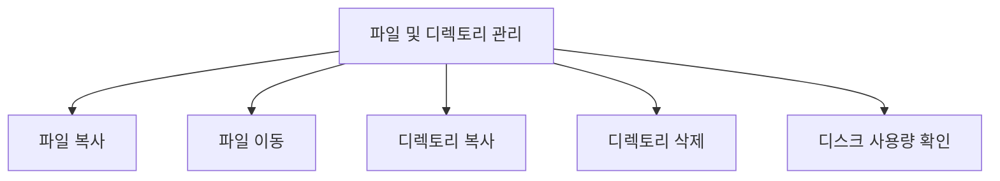
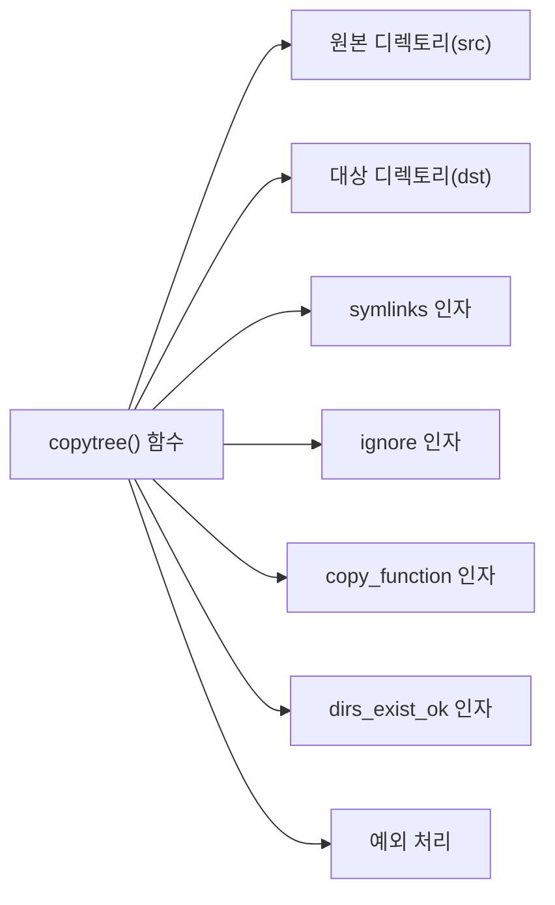
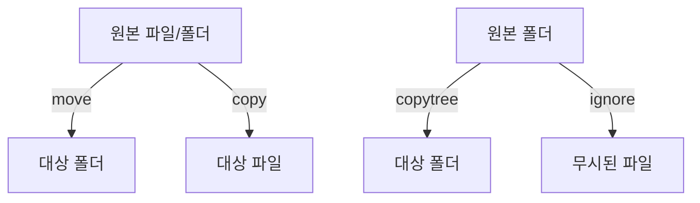
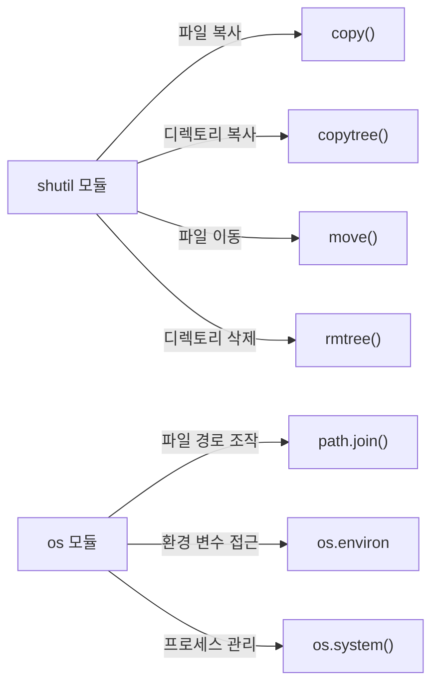
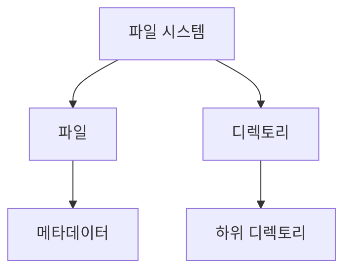
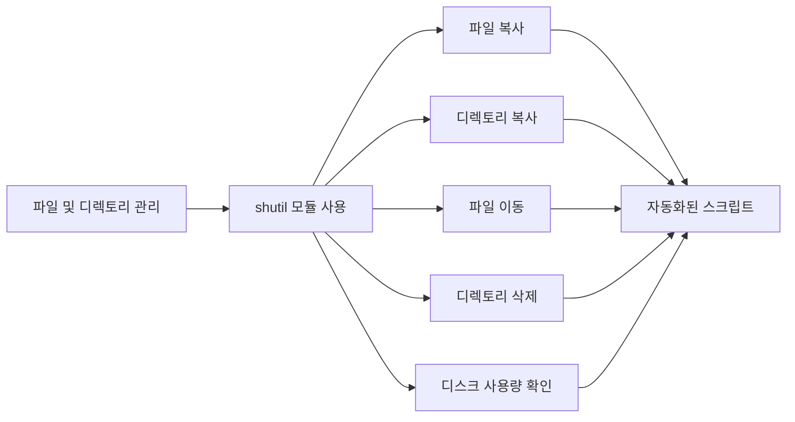
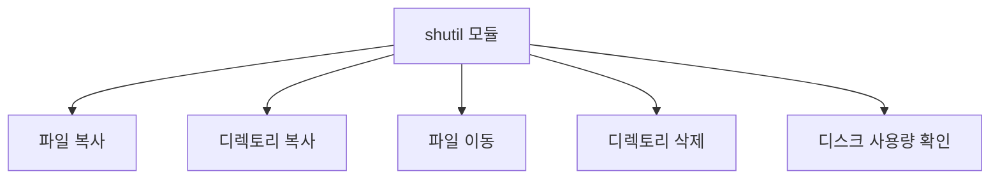

오늘은 파일과 폴더를 이동하거나 복사하고 싶을 때 사용하는 shutil 모듈에 대해서 공부해 보겠다. shutil 모듈은 파이썬의 표준 라이브러리 중 하나로, 파일 및 디렉토리 관리 작업을 보다 쉽게 수행할 수 있도록 도와준다. 이 모듈을 사용하면 파일을 복사하거나 이동하는 등의 작업을 간단한 함수 호출로 처리할 수 있다. 예를 들어, `shutil.copy()` 함수를 사용하면 특정 파일을 지정한 경로로 복사할 수 있으며, `shutil.move()` 함수를 통해 파일이나 폴더를 다른 위치로 이동할 수 있다. 또한, `shutil.copytree()` 함수를 사용하면 디렉토리 전체를 재귀적으로 복사할 수 있다. 이때, 복사할 디렉토리의 경로와 새로 생성할 디렉토리의 경로를 인자로 전달하면 된다. shutil 모듈은 파일의 메타데이터를 유지하면서 복사할 수 있는 기능도 제공하므로, 파일의 권한이나 수정 시간을 그대로 유지할 수 있다. 이러한 기능들은 파일 시스템을 다루는 데 있어 매우 유용하며, 특히 대량의 파일을 처리해야 할 때 그 진가를 발휘한다. 따라서, shutil 모듈을 활용하면 파일 및 디렉토리 관리 작업을 보다 효율적으로 수행할 수 있다.

<!--
##### Outline #####
-->

<!--
# 목차

## 1. 개요
   - shutil 모듈 소개
   - 파일 및 디렉토리 관리의 중요성

## 2. shutil 모듈의 주요 기능
   - 2.1. 파일 복사 (copy)
   - 2.2. 디렉토리 복사 (copytree)
   - 2.3. 파일 이동 (move)
   - 2.4. 디렉토리 삭제 (rmtree)
   - 2.5. 디스크 사용량 확인 (disk_usage)

## 3. copytree() 함수 상세 설명
   - 3.1. 함수 시그니처 및 인자 설명
   - 3.2. symlinks 인자 사용법
   - 3.3. ignore 인자 사용법
   - 3.4. copy_function 인자 사용법
   - 3.5. dirs_exist_ok 인자 사용법
   - 3.6. 예외 처리 및 Error 클래스

## 4. 예제
   - 4.1. 파일을 특정 폴더로 이동하기
   - 4.2. 폴더를 특정 폴더로 이동하기
   - 4.3. 파일을 특정 폴더로 복사하기
   - 4.4. 폴더를 특정 폴더로 복사하기
   - 4.5. symlinks와 ignore 사용 예제

## 5. FAQ
   - 5.1. copytree() 사용 시 FileExistsError 해결 방법
   - 5.2. symlink가 있는 경우 어떻게 처리하나요?
   - 5.3. shutil 모듈과 os 모듈의 차이점은 무엇인가요?
   - 5.4. copytree()에서 메타데이터는 어떻게 복사되나요?

## 6. 관련 기술
   - 6.1. os 모듈
   - 6.2. glob 모듈
   - 6.3. 파일 시스템의 개념
   - 6.4. Python의 예외 처리

## 7. 결론
   - shutil 모듈의 유용성 요약
   - 파일 및 디렉토리 관리의 자동화 필요성

## 8. 참고 자료
   - 공식 문서 링크
   - 관련 블로그 및 튜토리얼 링크
-->

<!--
## 1. 개요
   - shutil 모듈 소개
   - 파일 및 디렉토리 관리의 중요성
-->

## 개요

### shutil 모듈 소개

shutil 모듈은 Python의 표준 라이브러리 중 하나로, 파일 및 디렉토리 작업을 보다 쉽게 수행할 수 있도록 다양한 기능을 제공하는 모듈이다. 이 모듈은 파일 복사, 이동, 삭제, 디렉토리 복사 등과 같은 작업을 간편하게 처리할 수 있는 함수들을 포함하고 있다. 특히, 대량의 파일이나 디렉토리를 관리해야 하는 경우, shutil 모듈을 활용하면 코드의 간결성과 효율성을 높일 수 있다.

**shutil 모듈의 주요 기능:**

- 파일 복사 (copy)
- 디렉토리 복사 (copytree)
- 파일 이동 (move)
- 디렉토리 삭제 (rmtree)
- 디스크 사용량 확인 (disk_usage)

이러한 기능들은 파일 시스템을 다루는 데 있어 매우 유용하며, 특히 자동화된 스크립트나 프로그램에서 자주 사용된다.

### 파일 및 디렉토리 관리의 중요성

파일 및 디렉토리 관리는 소프트웨어 개발 및 시스템 관리에서 매우 중요한 요소이다. 데이터의 저장, 이동, 삭제는 모든 애플리케이션에서 필수적인 작업이며, 이를 효율적으로 처리하지 않으면 시스템의 성능 저하나 데이터 손실과 같은 문제가 발생할 수 있다. 

효율적인 파일 및 디렉토리 관리는 다음과 같은 이점을 제공한다:
- **데이터 무결성 유지:** 파일을 안전하게 복사하거나 이동함으로써 데이터 손실을 방지할 수 있다.
- **작업 자동화:** 반복적인 파일 작업을 자동화하여 개발자의 생산성을 높일 수 있다.
- **시스템 성능 향상:** 불필요한 파일을 정리하고 관리함으로써 시스템의 성능을 최적화할 수 있다.

아래는 파일 및 디렉토리 관리의 흐름을 나타낸 다이어그램이다.



이와 같이, shutil 모듈을 활용한 파일 및 디렉토리 관리는 소프트웨어 개발에서 필수적인 요소이며, 이를 통해 효율적이고 안전한 데이터 관리를 실현할 수 있다.

<!--
## 2. shutil 모듈의 주요 기능
   - 2.1. 파일 복사 (copy)
   - 2.2. 디렉토리 복사 (copytree)
   - 2.3. 파일 이동 (move)
   - 2.4. 디렉토리 삭제 (rmtree)
   - 2.5. 디스크 사용량 확인 (disk_usage)
-->

## shutil 모듈의 주요 기능

shutil 모듈은 파일 및 디렉토리 작업을 간편하게 수행할 수 있도록 다양한 기능을 제공하는 Python의 표준 라이브러리이다. 이 모듈을 사용하면 파일 복사, 이동, 삭제 및 디스크 사용량 확인과 같은 작업을 쉽게 처리할 수 있다. 아래에서는 shutil 모듈의 주요 기능에 대해 살펴보겠다.

### 파일 복사 (copy)

**shutil.copy(src, dst)** 함수를 사용하면 지정한 파일을 복사할 수 있다. 이 함수는 원본 파일의 내용을 대상 경로에 복사하며, 메타데이터(예: 파일의 수정 시간)는 복사하지 않는다. 

```python
import shutil

# 파일 복사 예제
shutil.copy('source.txt', 'destination.txt')
```

### 디렉토리 복사 (copytree)

**shutil.copytree(src, dst)** 함수는 디렉토리와 그 안의 모든 파일 및 서브디렉토리를 복사하는 데 사용된다. 이 함수는 원본 디렉토리의 구조를 그대로 유지하면서 새로운 위치에 복사한다.

```python
import shutil

# 디렉토리 복사 예제
shutil.copytree('source_directory', 'destination_directory')
```

### 파일 이동 (move)

**shutil.move(src, dst)** 함수는 파일이나 디렉토리를 지정한 위치로 이동시킨다. 이 함수는 원본 파일을 삭제하고, 새로운 위치에 파일을 생성한다.

```python
import shutil

# 파일 이동 예제
shutil.move('source.txt', 'new_location.txt')
```

### 디렉토리 삭제 (rmtree)

**shutil.rmtree(path)** 함수는 지정한 디렉토리와 그 안의 모든 내용을 삭제한다. 이 함수는 주의해서 사용해야 하며, 삭제된 데이터는 복구할 수 없다.

```python
import shutil

# 디렉토리 삭제 예제
shutil.rmtree('directory_to_delete')
```

### 디스크 사용량 확인 (disk_usage)

**shutil.disk_usage(path)** 함수는 지정한 경로의 디스크 사용량을 확인할 수 있다. 이 함수는 전체 용량, 사용 중인 용량, 남은 용량을 반환한다.

```python
import shutil

# 디스크 사용량 확인 예제
usage = shutil.disk_usage('/')
print(f"Total: {usage.total}, Used: {usage.used}, Free: {usage.free}")
```

```mermaid
graph TD;
    A[shutil 모듈] --> B[파일 복사 (copy)]
    A --> C[디렉토리 복사 (copytree)]
    A --> D[파일 이동 (move)]
    A --> E[디렉토리 삭제 (rmtree)]
    A --> F[디스크 사용량 확인 (disk_usage)]
```

shutil 모듈은 파일 및 디렉토리 관리에 있어 매우 유용한 도구이다. 위에서 설명한 기능들을 활용하면 다양한 파일 시스템 작업을 효율적으로 수행할 수 있다.

<!--
## 3. copytree() 함수 상세 설명
   - 3.1. 함수 시그니처 및 인자 설명
   - 3.2. symlinks 인자 사용법
   - 3.3. ignore 인자 사용법
   - 3.4. copy_function 인자 사용법
   - 3.5. dirs_exist_ok 인자 사용법
   - 3.6. 예외 처리 및 Error 클래스
-->

## copytree() 함수 상세 설명

shutil 모듈의 copytree() 함수는 디렉토리와 그 하위 파일 및 디렉토리를 재귀적으로 복사하는 데 사용된다. 이 함수는 다양한 인자를 통해 복사 동작을 세밀하게 조정할 수 있다.

### 함수 시그니처 및 인자 설명

copytree() 함수의 기본 시그니처는 다음과 같다.

```python
shutil.copytree(src, dst, symlinks=False, ignore=None, copy_function=shutil.copy2, dirs_exist_ok=False)
```

- **src**: 복사할 원본 디렉토리의 경로이다.
- **dst**: 복사된 디렉토리가 생성될 경로이다.
- **symlinks**: True로 설정하면 심볼릭 링크를 복사한다.
- **ignore**: 복사할 때 무시할 파일이나 디렉토리를 지정하는 함수이다.
- **copy_function**: 파일 복사에 사용할 함수를 지정할 수 있다. 기본값은 shutil.copy2이다.
- **dirs_exist_ok**: True로 설정하면 대상 디렉토리가 존재할 경우에도 복사를 진행한다.

### symlinks 인자 사용법

symlinks 인자는 심볼릭 링크를 복사할지 여부를 결정한다. 기본값은 False로, 이 경우 심볼릭 링크는 원본 파일로 복사된다. True로 설정하면 심볼릭 링크가 그대로 복사된다.

```python
shutil.copytree('source_dir', 'destination_dir', symlinks=True)
```

### ignore 인자 사용법

ignore 인자는 복사할 때 특정 파일이나 디렉토리를 무시할 수 있는 기능을 제공한다. 이 인자는 함수를 받아들이며, 이 함수는 디렉토리 이름과 그 안의 파일 목록을 인자로 받아 무시할 파일 목록을 반환해야 한다.

```python
def ignore_pyc(dir, files):
    return [f for f in files if f.endswith('.pyc')]

shutil.copytree('source_dir', 'destination_dir', ignore=ignore_pyc)
```

### copy_function 인자 사용법

copy_function 인자는 파일 복사에 사용할 함수를 지정할 수 있다. 기본적으로 shutil.copy2가 사용되지만, 다른 복사 방법을 사용하고 싶다면 이 인자를 통해 변경할 수 있다.

```python
shutil.copytree('source_dir', 'destination_dir', copy_function=shutil.copy)
```

### dirs_exist_ok 인자 사용법

dirs_exist_ok 인자는 대상 디렉토리가 이미 존재할 경우의 동작을 설정한다. 기본값은 False로, 이 경우 대상 디렉토리가 존재하면 FileExistsError가 발생한다. True로 설정하면 기존 디렉토리에 파일을 추가하는 방식으로 복사가 진행된다.

```python
shutil.copytree('source_dir', 'destination_dir', dirs_exist_ok=True)
```

### 예외 처리 및 Error 클래스

copytree() 함수는 다양한 예외를 발생시킬 수 있다. 예를 들어, 원본 디렉토리가 존재하지 않거나, 대상 디렉토리에 파일이 이미 존재하는 경우 등이다. 이러한 예외를 처리하기 위해 try-except 블록을 사용할 수 있다.

```python
import shutil

try:
    shutil.copytree('source_dir', 'destination_dir')
except FileNotFoundError as e:
    print(f"Error: {e}")
except FileExistsError as e:
    print(f"Error: {e}")
```



이와 같이 copytree() 함수는 다양한 인자를 통해 유연하게 디렉토리 복사를 수행할 수 있는 강력한 도구이다. 이를 통해 파일 및 디렉토리 관리의 효율성을 높일 수 있다.

<!--
## 4. 예제
   - 4.1. 파일을 특정 폴더로 이동하기
   - 4.2. 폴더를 특정 폴더로 이동하기
   - 4.3. 파일을 특정 폴더로 복사하기
   - 4.4. 폴더를 특정 폴더로 복사하기
   - 4.5. symlinks와 ignore 사용 예제
-->

## 예제

### 파일을 특정 폴더로 이동하기

파일을 특정 폴더로 이동하는 것은 `shutil` 모듈의 `move()` 함수를 사용하여 간단하게 수행할 수 있다. 이 함수는 원본 파일의 경로와 이동할 대상 폴더의 경로를 인자로 받는다. 아래는 파일을 이동하는 예제 코드이다.

```python
import shutil

# 원본 파일 경로
source_file = 'path/to/source/file.txt'
# 이동할 대상 폴더 경로
destination_folder = 'path/to/destination/'

# 파일 이동
shutil.move(source_file, destination_folder)
```

### 폴더를 특정 폴더로 이동하기

폴더를 이동하는 방법도 파일을 이동하는 것과 유사하다. `move()` 함수를 사용하여 폴더를 이동할 수 있다. 아래는 폴더를 이동하는 예제 코드이다.

```python
import shutil

# 원본 폴더 경로
source_folder = 'path/to/source/folder'
# 이동할 대상 폴더 경로
destination_folder = 'path/to/destination/'

# 폴더 이동
shutil.move(source_folder, destination_folder)
```

### 파일을 특정 폴더로 복사하기

파일을 복사할 때는 `shutil` 모듈의 `copy()` 함수를 사용한다. 이 함수는 원본 파일의 경로와 복사할 대상 경로를 인자로 받는다. 아래는 파일을 복사하는 예제 코드이다.

```python
import shutil

# 원본 파일 경로
source_file = 'path/to/source/file.txt'
# 복사할 대상 경로
destination_file = 'path/to/destination/file_copy.txt'

# 파일 복사
shutil.copy(source_file, destination_file)
```

### 폴더를 특정 폴더로 복사하기

폴더를 복사할 때는 `shutil` 모듈의 `copytree()` 함수를 사용한다. 이 함수는 원본 폴더의 경로와 복사할 대상 폴더의 경로를 인자로 받는다. 아래는 폴더를 복사하는 예제 코드이다.

```python
import shutil

# 원본 폴더 경로
source_folder = 'path/to/source/folder'
# 복사할 대상 폴더 경로
destination_folder = 'path/to/destination/folder_copy'

# 폴더 복사
shutil.copytree(source_folder, destination_folder)
```

### symlinks와 ignore 사용 예제

`copytree()` 함수는 `symlinks`와 `ignore` 인자를 사용하여 복사할 때의 동작을 조정할 수 있다. `symlinks` 인자는 심볼릭 링크를 복사할지 여부를 결정하고, `ignore` 인자는 특정 파일이나 폴더를 무시할 수 있도록 한다. 아래는 이 두 인자를 사용하는 예제 코드이다.

```python
import shutil
import os

# 원본 폴더 경로
source_folder = 'path/to/source/folder'
# 복사할 대상 폴더 경로
destination_folder = 'path/to/destination/folder_copy'

# 무시할 파일 패턴
ignore_patterns = ['*.tmp', '*.log']

# 폴더 복사 (symlinks=True, ignore=ignore)
shutil.copytree(source_folder, destination_folder, symlinks=True, ignore=shutil.ignore_patterns(*ignore_patterns))
```



위의 예제들은 `shutil` 모듈을 사용하여 파일 및 폴더를 이동하고 복사하는 방법을 보여준다. 이러한 기능들은 파일 및 디렉토리 관리를 자동화하는 데 매우 유용하다.

<!--
## 5. FAQ
   - 5.1. copytree() 사용 시 FileExistsError 해결 방법
   - 5.2. symlink가 있는 경우 어떻게 처리하나요?
   - 5.3. shutil 모듈과 os 모듈의 차이점은 무엇인가요?
   - 5.4. copytree()에서 메타데이터는 어떻게 복사되나요?
-->

## FAQ

### 5.1. copytree() 사용 시 FileExistsError 해결 방법

`copytree()` 함수는 기본적으로 대상 디렉토리가 이미 존재할 경우 `FileExistsError`를 발생시킨다. 이 문제를 해결하기 위해서는 `dirs_exist_ok` 인자를 `True`로 설정하면 된다. 이 인자를 사용하면 대상 디렉토리가 존재할 경우에도 복사가 가능하다. 

아래는 `dirs_exist_ok` 인자를 사용하는 예제 코드이다.

```python
import shutil

source_dir = 'source_folder'
destination_dir = 'destination_folder'

shutil.copytree(source_dir, destination_dir, dirs_exist_ok=True)
```

이 코드는 `source_folder`의 내용을 `destination_folder`로 복사하며, 만약 `destination_folder`가 이미 존재한다면 그 안에 내용을 추가하게 된다.

### 5.2. symlink가 있는 경우 어떻게 처리하나요?

`copytree()` 함수는 기본적으로 심볼릭 링크(symlink)를 복사하지 않는다. 그러나 `symlinks` 인자를 `True`로 설정하면 심볼릭 링크를 복사할 수 있다. 이 경우, 원본의 링크를 그대로 유지하게 된다.

아래는 `symlinks` 인자를 사용하는 예제 코드이다.

```python
import shutil

source_dir = 'source_folder_with_symlinks'
destination_dir = 'destination_folder'

shutil.copytree(source_dir, destination_dir, symlinks=True)
```

이 코드는 `source_folder_with_symlinks`의 심볼릭 링크를 `destination_folder`로 복사한다.

### 5.3. shutil 모듈과 os 모듈의 차이점은 무엇인가요?

`shutil` 모듈과 `os` 모듈은 모두 파일 및 디렉토리 작업을 수행하는 데 사용되지만, 그 목적과 기능이 다르다. 

- **shutil 모듈**: 파일 및 디렉토리의 고수준 작업을 위한 함수들을 제공한다. 예를 들어, 파일 복사, 이동, 삭제, 디렉토리 복사 등의 기능이 포함되어 있다.
- **os 모듈**: 운영 체제와 상호작용하기 위한 저수준 기능을 제공한다. 파일 경로 조작, 환경 변수 접근, 프로세스 관리 등의 기능이 포함되어 있다.

아래는 두 모듈의 사용 예시를 비교한 다이어그램이다.



### 5.4. copytree()에서 메타데이터는 어떻게 복사되나요?

`copytree()` 함수는 기본적으로 파일의 메타데이터(예: 수정 시간, 접근 시간 등)를 복사하지 않는다. 그러나 `copy_function` 인자를 사용하여 사용자 정의 복사 함수를 지정하면 메타데이터를 포함한 복사를 수행할 수 있다. 

아래는 메타데이터를 복사하는 사용자 정의 함수의 예제 코드이다.

```python
import shutil
import os
import time

def copy_with_metadata(src, dst):
    shutil.copy2(src, dst)  # 메타데이터를 포함하여 복사

source_dir = 'source_folder'
destination_dir = 'destination_folder'

shutil.copytree(source_dir, destination_dir, copy_function=copy_with_metadata)
```

이 코드는 `source_folder`의 내용을 `destination_folder`로 복사하며, 파일의 메타데이터도 함께 복사한다.

<!--
## 6. 관련 기술
   - 6.1. os 모듈
   - 6.2. glob 모듈
   - 6.3. 파일 시스템의 개념
   - 6.4. Python의 예외 처리
-->

## 관련 기술

### os 모듈

os 모듈은 운영 체제와 상호작용할 수 있는 다양한 기능을 제공하는 Python의 표준 라이브러리이다. 이 모듈을 사용하면 파일 및 디렉토리의 생성, 삭제, 이동, 이름 변경 등의 작업을 수행할 수 있다. 또한, 환경 변수에 접근하거나 프로세스를 관리하는 기능도 포함되어 있다.

**예제 코드:**

```python
import os

# 현재 작업 디렉토리 출력
current_directory = os.getcwd()
print("현재 작업 디렉토리:", current_directory)

# 새로운 디렉토리 생성
os.mkdir("new_directory")

# 디렉토리 삭제
os.rmdir("new_directory")
```

### glob 모듈

glob 모듈은 파일 경로 패턴 매칭을 위한 기능을 제공하는 모듈이다. 이 모듈을 사용하면 특정 패턴에 맞는 파일 목록을 쉽게 가져올 수 있다. 예를 들어, 특정 확장자를 가진 파일만 선택하거나, 특정 디렉토리 내의 모든 파일을 검색하는 데 유용하다.

**예제 코드:**

```python
import glob

# 현재 디렉토리의 모든 .txt 파일 목록 가져오기
txt_files = glob.glob("*.txt")
print("현재 디렉토리의 .txt 파일:", txt_files)
```

### 파일 시스템의 개념

파일 시스템은 데이터를 저장하고 관리하는 방법을 정의하는 시스템이다. 파일 시스템은 파일과 디렉토리의 구조를 정의하고, 데이터의 저장 위치, 접근 권한, 메타데이터 등을 관리한다. 다양한 파일 시스템이 존재하며, 각 파일 시스템은 특정 운영 체제나 장치에 최적화되어 있다.

**파일 시스템 구조 다이어그램:**



### Python의 예외 처리

Python의 예외 처리는 프로그램 실행 중 발생할 수 있는 오류를 관리하는 방법이다. try-except 블록을 사용하여 예외를 처리할 수 있으며, 이를 통해 프로그램의 비정상적인 종료를 방지하고, 오류 발생 시 적절한 대처를 할 수 있다. 예외 처리는 코드의 안정성을 높이는 데 중요한 역할을 한다.

**예제 코드:**

```python
try:
    # 0으로 나누기 시도
    result = 10 / 0
except ZeroDivisionError:
    print("0으로 나눌 수 없습니다.")
finally:
    print("예외 처리 완료.")
```

이와 같이 os 모듈, glob 모듈, 파일 시스템의 개념, 그리고 Python의 예외 처리에 대한 이해는 shutil 모듈을 효과적으로 활용하는 데 큰 도움이 된다. 각 기술의 특성을 잘 이해하고 활용하면 파일 및 디렉토리 관리 작업을 더욱 효율적으로 수행할 수 있다.

<!--
## 7. 결론
   - shutil 모듈의 유용성 요약
   - 파일 및 디렉토리 관리의 자동화 필요성
-->

## 결론

### shutil 모듈의 유용성 요약

shutil 모듈은 Python에서 파일 및 디렉토리 관리를 간편하게 수행할 수 있도록 도와주는 유용한 도구이다. 이 모듈은 파일 복사, 이동, 삭제와 같은 기본적인 작업을 지원하며, 특히 디렉토리 복사와 같은 복잡한 작업을 간단한 함수 호출로 처리할 수 있게 해준다. 이러한 기능들은 개발자들이 파일 시스템을 다룰 때 발생할 수 있는 많은 수고를 덜어주며, 코드의 가독성과 유지보수성을 높이는 데 기여한다.

shutil 모듈의 주요 기능을 요약하면 다음과 같다:

- **파일 복사**: `copy()` 함수를 사용하여 파일을 손쉽게 복사할 수 있다.
- **디렉토리 복사**: `copytree()` 함수를 통해 디렉토리와 그 하위 파일들을 한 번에 복사할 수 있다.
- **파일 이동**: `move()` 함수를 사용하여 파일이나 디렉토리를 다른 위치로 이동할 수 있다.
- **디렉토리 삭제**: `rmtree()` 함수를 통해 디렉토리와 그 하위 내용을 삭제할 수 있다.
- **디스크 사용량 확인**: `disk_usage()` 함수를 사용하여 특정 경로의 디스크 사용량을 확인할 수 있다.

이러한 기능들은 파일 및 디렉토리 관리 작업을 자동화하고, 반복적인 작업을 줄여주는 데 큰 도움이 된다.

### 파일 및 디렉토리 관리의 자동화 필요성

현대의 소프트웨어 개발 환경에서는 파일 및 디렉토리 관리의 자동화가 필수적이다. 수많은 파일과 디렉토리를 다루는 프로젝트에서는 수작업으로 관리하기 어려운 경우가 많다. 이때 shutil 모듈과 같은 도구를 활용하면, 반복적인 작업을 자동화하여 개발자의 생산성을 높일 수 있다.

자동화의 이점은 다음과 같다:

- **시간 절약**: 반복적인 작업을 자동화함으로써 개발자는 더 중요한 작업에 집중할 수 있다.
- **오류 감소**: 수작업으로 인한 실수를 줄일 수 있으며, 코드의 일관성을 유지할 수 있다.
- **유지보수 용이성**: 자동화된 스크립트는 코드로 관리되므로, 변경 사항을 쉽게 적용할 수 있다.

아래는 shutil 모듈을 사용하여 파일을 복사하는 간단한 예제 코드이다.

```python
import shutil

# 파일 복사
shutil.copy('source.txt', 'destination.txt')
```

또한, 파일 및 디렉토리 관리의 자동화를 시각적으로 표현한 다이어그램은 다음과 같다.



결론적으로, shutil 모듈은 파일 및 디렉토리 관리를 효율적으로 수행할 수 있는 강력한 도구이며, 이를 통해 자동화의 필요성을 더욱 강조할 수 있다.

<!--
## 8. 참고 자료
   - 공식 문서 링크
   - 관련 블로그 및 튜토리얼 링크
-->

## 참고 자료

**공식 문서 링크**

shutil 모듈에 대한 가장 신뢰할 수 있는 정보는 Python의 공식 문서에서 확인할 수 있다. 공식 문서에서는 각 함수의 사용법, 인자 설명, 예제 코드 등을 상세히 제공하고 있어, 개발자들이 필요할 때 참고하기에 매우 유용하다. 다음은 shutil 모듈의 공식 문서 링크이다.

[shutil 모듈 공식 문서](https://docs.python.org/3/library/shutil.html)

**샘플 코드**

아래는 shutil 모듈을 사용하여 파일을 복사하는 간단한 예제 코드이다.

```python
import shutil

# 파일 복사
shutil.copy('source.txt', 'destination.txt')
```

**다이어그램**

다음은 shutil 모듈의 주요 기능을 시각적으로 나타낸 다이어그램이다.



이 자료들은 shutil 모듈을 효과적으로 활용하는 데 큰 도움이 될 것이다. 다양한 예제와 문서를 통해 실력을 향상시키길 바란다.

<!--
##### Reference #####
-->

## Reference


* [https://docs.python.org/ko/3/library/shutil.html](https://docs.python.org/ko/3/library/shutil.html)
* [https://wikidocs.net/149330](https://wikidocs.net/149330)
* [https://m.blog.naver.com/youndok/222044609067](https://m.blog.naver.com/youndok/222044609067)
* [https://wikidocs.net/231399](https://wikidocs.net/231399)

