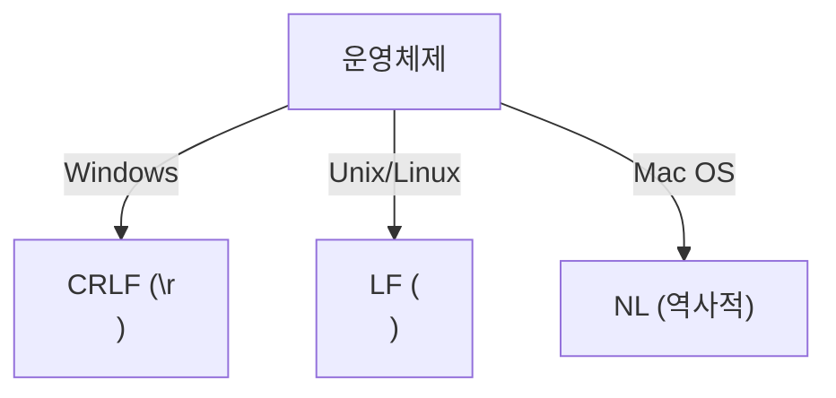
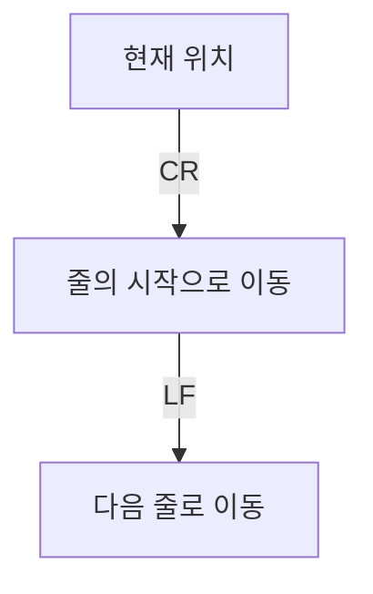
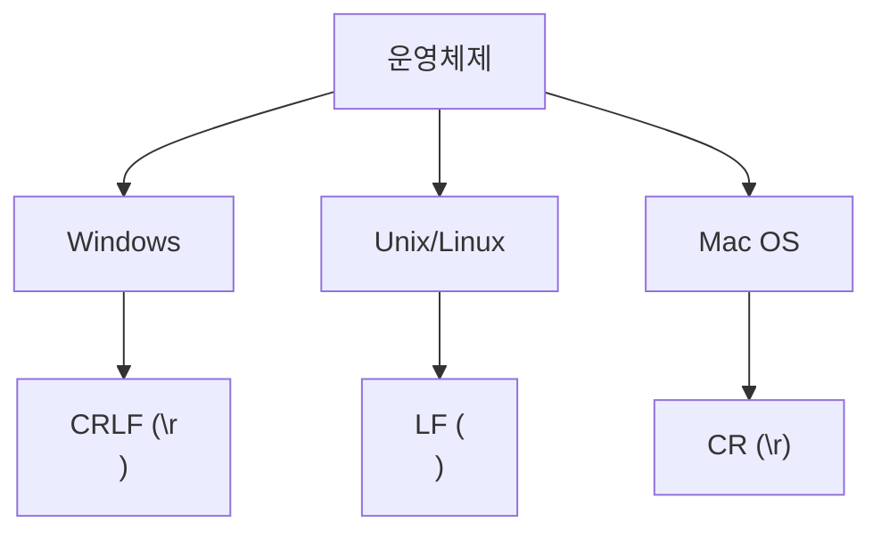
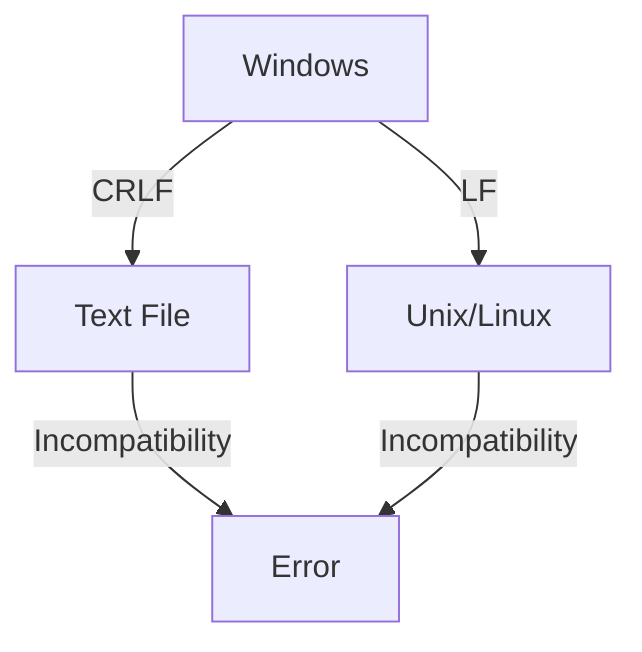
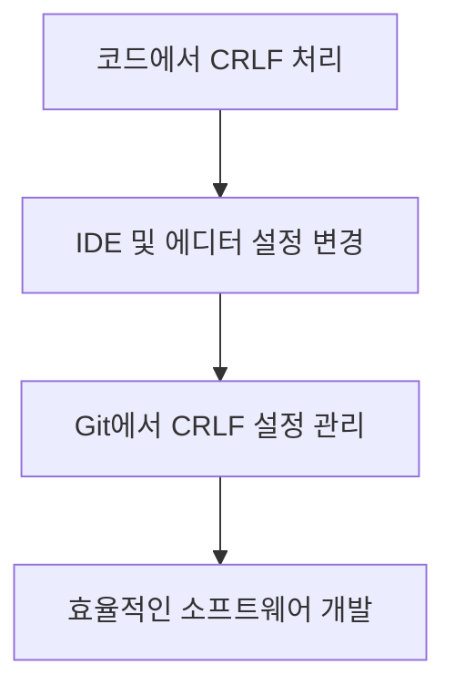
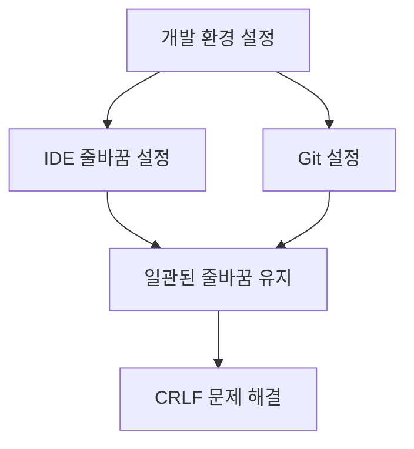
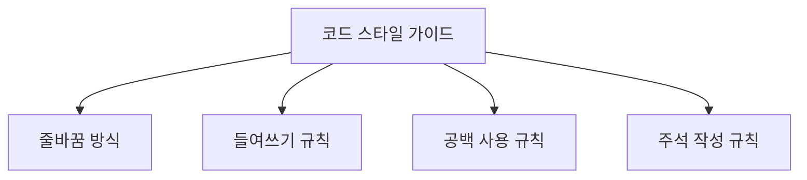
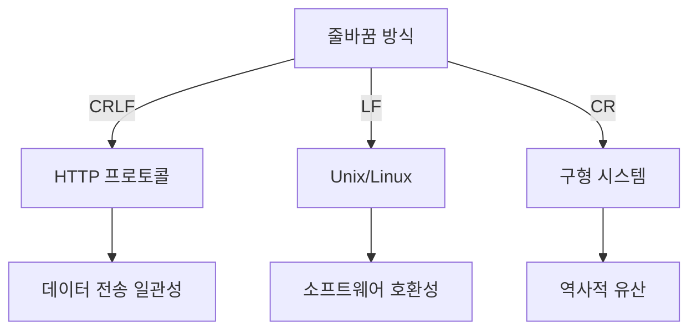

CR(Carriage Return)과 LF(Line Feed)는 컴퓨터 프로그래밍에서 줄바꿈을 처리하는 두 가지 중요한 제어 문자이다. CR은 커서를 현재 줄의 시작으로 이동시키는 역할을 하며, LF는 커서를 한 줄 아래로 이동시키는 기능을 한다. 이 두 문자는 타자기 시대부터 사용되어 왔으며, 각각의 의미는 그 시절의 기계적 한계에서 비롯되었다. 현대의 운영체제에서는 줄바꿈을 처리하는 방식이 다르다. 예를 들어, Windows는 CRLF(\r\n)를 사용하고, Unix 및 Linux 계열은 LF(\n)만을 사용한다. 이러한 차이는 협업 시 코드의 호환성 문제를 일으킬 수 있으며, 특히 다양한 운영체제에서 작업하는 개발자들 사이에서 문제가 발생할 수 있다. 따라서, CR과 LF의 차이를 이해하고 적절한 줄바꿈 문자를 사용하는 것이 중요하다. 이를 통해 코드의 가독성을 높이고, 불필요한 오류를 방지할 수 있다. CRLF와 LF의 사용에 대한 명확한 이해는 소프트웨어 개발의 품질을 높이는 데 기여할 것이다.

<!--
##### Outline #####
-->

<!--
## 개요
- CRLF, LF, NL의 정의와 역사
- CRLF의 필요성과 현대적 관점

## CRLF와 관련된 기술
- Carriage Return (CR)과 Line Feed (LF)의 차이
- New Line (NL)의 개념
- CRLF의 역사적 배경과 기원

## 운영체제별 줄바꿈 방식
- Windows의 CRLF (\r\n)
- Unix/Linux의 LF (\n)
- Mac OS의 역사적 줄바꿈 방식

## CRLF의 문제점
- CRLF 사용의 비효율성
- 소프트웨어 호환성 문제
- CRLF로 인한 에러 사례

## CRLF를 다루는 방법
- 코드에서 CRLF 처리하기
- IDE 및 에디터에서 줄바꿈 설정 변경하기
- Git에서 CRLF 설정 관리하기

## 예제
- CRLF와 LF의 사용 예시
- 다양한 운영체제에서의 줄바꿈 처리 예제
- CRLF 문제 해결을 위한 코드 스니펫

## FAQ
- CRLF와 LF의 차이는 무엇인가요?
- 왜 일부 프로토콜에서 CRLF를 요구하나요?
- CRLF를 사용해야 하는 경우는 언제인가요?
- CRLF 문제를 해결하기 위한 최선의 방법은 무엇인가요?

## 관련 기술
- 텍스트 파일 포맷 (CSV, JSON 등)
- 프로그래밍 언어에서의 줄바꿈 처리
- 소프트웨어 개발에서의 코드 스타일 가이드

## 결론
- CRLF의 역사적 의미와 현대적 필요성
- 줄바꿈 방식의 통일성과 소프트웨어 개발의 효율성
- 미래의 줄바꿈 방식에 대한 전망
-->

<!--
## 개요
- CRLF, LF, NL의 정의와 역사
- CRLF의 필요성과 현대적 관점
-->

## 개요

### CRLF, LF, NL의 정의와 역사

CRLF, LF, NL은 텍스트 파일에서 줄바꿈을 나타내는 방식으로, 각각의 정의와 역사적 배경이 있다. 

- **CRLF (Carriage Return Line Feed)**: Windows 운영체제에서 사용되는 줄바꿈 방식으로, 두 개의 제어 문자인 Carriage Return (CR, \r)과 Line Feed (LF, \n)를 조합하여 사용한다. 이는 프린터에서 줄을 바꾸기 위해 사용되던 방식에서 유래되었다.
  
- **LF (Line Feed)**: Unix 및 Linux 운영체제에서 사용되는 줄바꿈 방식으로, 단일 제어 문자 LF (\n)만을 사용한다. 이는 텍스트 파일의 간결성을 추구하는 Unix 철학에 기인한다.

- **NL (New Line)**: 일반적으로 줄바꿈을 의미하는 용어로, 특정한 제어 문자를 지칭하지 않는다. 다양한 운영체제에서 줄바꿈을 처리하는 방식에 따라 다르게 해석될 수 있다.

이러한 줄바꿈 방식은 각 운영체제의 역사와 발전 과정에 따라 다르게 채택되었으며, 이는 소프트웨어 개발 및 데이터 처리에 있어 중요한 요소로 작용한다.



### CRLF의 필요성과 현대적 관점

CRLF는 현대 소프트웨어 개발에서 여전히 중요한 역할을 한다. 특히, 다양한 운영체제 간의 호환성을 유지하기 위해 CRLF의 이해는 필수적이다. 예를 들어, Windows에서 개발된 소프트웨어가 Unix/Linux 환경에서 실행될 때, 줄바꿈 방식의 차이로 인해 발생할 수 있는 문제를 사전에 인지하고 해결하는 것이 중요하다.

또한, 클라우드 기반의 개발 환경과 협업 도구의 발전으로 인해, 다양한 운영체제에서 작업하는 개발자들이 늘어나고 있다. 이로 인해 CRLF와 LF의 차이를 이해하고, 이를 적절히 처리하는 것이 소프트웨어의 품질과 안정성을 높이는 데 기여할 수 있다.

결론적으로, CRLF는 단순한 줄바꿈 방식 이상의 의미를 가지며, 현대 소프트웨어 개발에서의 효율성과 호환성을 확보하기 위한 필수 요소로 자리잡고 있다.

<!--
## CRLF와 관련된 기술
- Carriage Return (CR)과 Line Feed (LF)의 차이
- New Line (NL)의 개념
- CRLF의 역사적 배경과 기원
-->

## CRLF와 관련된 기술

### Carriage Return (CR)과 Line Feed (LF)의 차이

Carriage Return (CR)과 Line Feed (LF)은 텍스트 파일에서 줄바꿈을 처리하는 두 가지 주요 제어 문자이다. CR은 커서를 현재 줄의 시작으로 이동시키는 역할을 하며, LF는 커서를 다음 줄로 이동시키는 역할을 한다. 이 두 문자는 각각의 운영체제에서 줄바꿈을 처리하는 방식에 따라 다르게 사용된다.

- **CR (Carriage Return)**: ASCII 코드 13에 해당하며, 주로 Mac OS에서 사용되었다.
- **LF (Line Feed)**: ASCII 코드 10에 해당하며, Unix/Linux 시스템에서 사용된다.

이 두 문자의 조합인 CRLF (\r\n)는 Windows 운영체제에서 줄바꿈을 나타내는 데 사용된다. 아래의 다이어그램은 CR과 LF의 작동 방식을 시각적으로 설명한다.



### New Line (NL)의 개념

New Line (NL)은 줄바꿈을 나타내는 일반적인 용어로, CR과 LF의 조합을 포함한다. NL은 다양한 운영체제에서 줄바꿈을 처리하는 방식에 따라 다르게 해석될 수 있다. 예를 들어, Unix/Linux에서는 NL이 LF와 동일하게 처리되며, Windows에서는 NL이 CRLF로 해석된다. 이러한 차이는 소프트웨어 개발 및 파일 전송 시 호환성 문제를 일으킬 수 있다.

### CRLF의 역사적 배경과 기원

CRLF의 기원은 초기 컴퓨터 시스템으로 거슬러 올라간다. 1960년대에 개발된 타자기와 초기 컴퓨터는 CR과 LF를 사용하여 텍스트를 출력하는 방식을 채택하였다. 이 시기에 CR은 타자기의 롤러를 원래 위치로 되돌리는 역할을 하였고, LF는 다음 줄로 이동하는 역할을 하였다. 

이후, 이러한 방식은 컴퓨터 운영체제에 통합되었고, Windows는 CRLF를 줄바꿈 방식으로 채택하게 되었다. 반면, Unix/Linux는 LF만을 사용하여 줄바꿈을 처리하게 되었다. 이러한 역사적 배경은 현재의 소프트웨어 개발 환경에서 CRLF와 LF의 사용에 큰 영향을 미치고 있다. 

이와 같은 줄바꿈 방식의 차이는 다양한 플랫폼 간의 호환성 문제를 야기할 수 있으며, 개발자들은 이를 염두에 두고 코드를 작성해야 한다.

<!--
## 운영체제별 줄바꿈 방식
- Windows의 CRLF (\r\n)
- Unix/Linux의 LF (\n)
- Mac OS의 역사적 줄바꿈 방식
-->

## 운영체제별 줄바꿈 방식

줄바꿈 방식은 운영체제에 따라 다르게 구현되어 있으며, 이는 텍스트 파일의 호환성과 가독성에 큰 영향을 미친다. 각 운영체제에서 사용하는 줄바꿈 방식에 대해 살펴보겠다.

### Windows의 CRLF (\r\n)

Windows 운영체제에서는 줄바꿈을 위해 Carriage Return (CR)과 Line Feed (LF)를 조합하여 사용한다. 이 조합은 `\r\n`으로 표현되며, CR은 커서를 줄의 시작으로 이동시키고, LF는 다음 줄로 이동하는 역할을 한다. 이러한 방식은 초기의 프린터와의 호환성을 고려하여 설계되었다.

```plaintext
Hello, World!\r\n
This is a new line.\r\n
```

### Unix/Linux의 LF (\n)

Unix 및 Linux 운영체제에서는 줄바꿈을 위해 Line Feed (LF)만을 사용한다. 이 방식은 `\n`으로 표현되며, 줄의 끝을 나타내는 간단한 방법으로, 텍스트 파일의 크기를 줄이는 데 기여한다. Unix 시스템에서의 줄바꿈은 다음과 같이 표현된다.

```plaintext
Hello, World!\n
This is a new line.\n
```

### Mac OS의 역사적 줄바꿈 방식

Mac OS는 초기 버전에서 줄바꿈을 위해 Carriage Return (CR)만을 사용하였다. 이 방식은 `\r`으로 표현되며, Mac OS의 초기 버전에서 텍스트 파일을 작성할 때 사용되었다. 그러나 Mac OS X 이후로는 Unix 기반으로 전환되면서 LF 방식으로 변경되었다. 초기 Mac OS에서의 줄바꿈은 다음과 같이 표현된다.

```plaintext
Hello, World!\r
This is a new line.\r
```

### 다이어그램

아래의 다이어그램은 각 운영체제에서 사용하는 줄바꿈 방식을 시각적으로 나타낸 것이다.



이와 같이 각 운영체제는 서로 다른 줄바꿈 방식을 사용하고 있으며, 이는 소프트웨어 개발 및 파일 호환성에 중요한 요소로 작용한다. 이러한 차이를 이해하고 적절히 처리하는 것이 소프트웨어 개발에서 필수적이다.

<!--
## CRLF의 문제점
- CRLF 사용의 비효율성
- 소프트웨어 호환성 문제
- CRLF로 인한 에러 사례
-->

## CRLF의 문제점

### CRLF 사용의 비효율성

CRLF(Carriage Return Line Feed) 방식은 줄바꿈을 위해 두 개의 문자를 사용한다. 이는 단순히 하나의 문자(LF)로 줄바꿈을 처리하는 방식에 비해 비효율적이다. 특히, 대량의 텍스트 데이터를 처리할 때 CRLF는 불필요한 데이터 용량을 증가시킬 수 있다. 예를 들어, 1,000줄의 텍스트 파일에서 CRLF를 사용하면 2,000바이트의 줄바꿈 문자가 추가되지만, LF만 사용하면 1,000바이트만 필요하다. 이러한 비효율성은 저장 공간과 전송 대역폭을 낭비하게 만든다.

```plaintext
# CRLF 사용 예시
Hello, World!<CR><LF>
This is a test.<CR><LF>
```

### 소프트웨어 호환성 문제

CRLF는 다양한 운영체제에서 줄바꿈 방식을 다르게 처리하기 때문에 소프트웨어 호환성 문제를 일으킬 수 있다. 예를 들어, Windows에서는 CRLF를 사용하지만, Unix/Linux에서는 LF만 사용한다. 이로 인해 서로 다른 운영체제 간에 파일을 공유할 때 줄바꿈이 올바르게 인식되지 않아 코드가 제대로 작동하지 않을 수 있다. 이러한 문제는 특히 협업 환경에서 코드의 가독성과 유지보수성을 저하시킬 수 있다.



### CRLF로 인한 에러 사례

CRLF로 인한 에러는 다양한 상황에서 발생할 수 있다. 예를 들어, 웹 서버에서 HTTP 요청을 처리할 때 CRLF가 잘못 사용되면 요청이 제대로 인식되지 않아 400 Bad Request와 같은 에러가 발생할 수 있다. 또한, 프로그래밍 언어에 따라 줄바꿈 문자를 다르게 처리하는 경우, 코드가 예상치 못한 동작을 하거나 컴파일 에러가 발생할 수 있다. 이러한 문제는 개발자에게 큰 스트레스를 주며, 디버깅 시간을 증가시킨다.

```plaintext
# CRLF로 인한 에러 예시
GET /index.html<CR><LF>
Host: example.com<CR><LF>
<CR><LF>
```

이와 같이 CRLF의 사용은 비효율성과 호환성 문제, 그리고 다양한 에러를 초래할 수 있다. 따라서 개발자들은 이러한 문제를 인식하고, 적절한 줄바꿈 방식을 선택하는 것이 중요하다.

<!--
## CRLF를 다루는 방법
- 코드에서 CRLF 처리하기
- IDE 및 에디터에서 줄바꿈 설정 변경하기
- Git에서 CRLF 설정 관리하기
-->

## CRLF를 다루는 방법

소프트웨어 개발에서 CRLF(Carriage Return Line Feed) 문제를 효과적으로 다루기 위해서는 코드, IDE 및 에디터, 그리고 버전 관리 시스템인 Git에서의 설정을 적절히 관리해야 한다. 아래에서는 각 항목에 대해 구체적으로 설명하겠다.

### 코드에서 CRLF 처리하기

코드에서 CRLF를 처리하는 방법은 주로 파일을 읽고 쓸 때 줄바꿈 문자를 명시적으로 지정하는 것이다. 예를 들어, Python에서는 `newline` 매개변수를 사용하여 파일을 열 수 있다. 아래는 Python에서 CRLF를 처리하는 간단한 예제이다.

```python
# CRLF로 파일 쓰기
with open('example.txt', 'w', newline='\r\n') as file:
    file.write("Hello, World!\r\nThis is a test.\r\n")

# LF로 파일 읽기
with open('example.txt', 'r', newline='') as file:
    content = file.read()
    print(content)
```

이 코드는 `example.txt` 파일에 CRLF로 줄바꿈된 내용을 작성하고, 이를 읽어 출력하는 예제이다. `newline` 매개변수를 통해 줄바꿈 방식을 명시적으로 설정할 수 있다.

### IDE 및 에디터에서 줄바꿈 설정 변경하기

많은 IDE와 텍스트 에디터는 줄바꿈 방식을 설정할 수 있는 기능을 제공한다. 예를 들어, Visual Studio Code에서는 다음과 같은 방법으로 줄바꿈 방식을 변경할 수 있다.

1. **파일 메뉴**에서 `Preferences`를 선택한다.
2. `Settings`를 클릭한 후, 검색창에 `end of line`을 입력한다.
3. `Files: Eol` 설정에서 원하는 줄바꿈 방식을 선택한다 (CRLF 또는 LF).

이와 같은 설정을 통해 개발자는 프로젝트의 줄바꿈 방식을 통일할 수 있으며, 이는 코드의 가독성과 유지보수성을 높이는 데 기여한다.

### Git에서 CRLF 설정 관리하기

Git에서는 CRLF와 LF의 처리를 관리하기 위한 설정을 제공한다. `.gitattributes` 파일을 사용하여 특정 파일 형식에 대한 줄바꿈 방식을 지정할 수 있다. 아래는 `.gitattributes` 파일의 예시이다.

```
# 모든 텍스트 파일에 대해 LF로 변환
*.txt text eol=lf

# Windows에서 CRLF로 유지
*.bat text eol=crlf
```

이 설정은 `.txt` 파일은 LF로 변환하고, `.bat` 파일은 CRLF로 유지하도록 지정한다. 이를 통해 다양한 운영체제에서의 호환성을 유지할 수 있다.



위의 다이어그램은 CRLF 문제를 다루는 방법의 흐름을 나타낸다. 각 단계에서 적절한 처리를 통해 소프트웨어 개발의 효율성을 높일 수 있다. CRLF 문제를 효과적으로 관리하는 것은 코드의 일관성을 유지하고, 다양한 환경에서의 호환성을 보장하는 데 필수적이다.

<!--
## 예제
- CRLF와 LF의 사용 예시
- 다양한 운영체제에서의 줄바꿈 처리 예제
- CRLF 문제 해결을 위한 코드 스니펫
-->

## 예제

### CRLF와 LF의 사용 예시

CRLF와 LF는 텍스트 파일에서 줄바꿈을 나타내는 방식으로, 각각의 사용 예시는 다음과 같다. 

- **CRLF (\r\n)**: Windows 운영체제에서 주로 사용되며, 텍스트 파일에서 줄바꿈을 나타낼 때 Carriage Return (CR)과 Line Feed (LF)를 함께 사용한다. 예를 들어, 다음과 같은 텍스트 파일이 있을 때:

```
Hello, World!\r\n
This is a test.\r\n
```

- **LF (\n)**: Unix/Linux 및 현대의 Mac OS에서 사용되며, 줄바꿈을 나타내기 위해 Line Feed (LF)만 사용한다. 같은 텍스트 파일을 LF 방식으로 표현하면 다음과 같다:

```
Hello, World!\n
This is a test.\n
```

### 다양한 운영체제에서의 줄바꿈 처리 예제

운영체제에 따라 줄바꿈 방식이 다르기 때문에, 이를 처리하는 방법도 달라진다. 아래는 각 운영체제에서 줄바꿈을 처리하는 예제이다.

```python
# Python 예제: 줄바꿈 처리
def read_file(file_path):
    with open(file_path, 'r', newline='') as file:
        content = file.read()
    return content

# Windows에서 CRLF 처리
windows_file = 'example_windows.txt'  # CRLF 사용
print(read_file(windows_file))

# Unix/Linux에서 LF 처리
unix_file = 'example_unix.txt'  # LF 사용
print(read_file(unix_file))
```

### CRLF 문제 해결을 위한 코드 스니펫

CRLF로 인한 문제를 해결하기 위해, 파일을 읽고 쓸 때 줄바꿈 방식을 통일하는 것이 중요하다. 아래는 Python을 사용하여 CRLF를 LF로 변환하는 코드 스니펫이다.

```python
# CRLF를 LF로 변환하는 예제
def convert_crlf_to_lf(file_path):
    with open(file_path, 'r', newline='') as file:
        content = file.read()
    
    # CRLF를 LF로 변환
    content = content.replace('\r\n', '\n')
    
    with open(file_path, 'w', newline='') as file:
        file.write(content)

# 사용 예
convert_crlf_to_lf('example_windows.txt')
```

이 코드는 Windows에서 생성된 CRLF 파일을 읽어들여 LF로 변환한 후, 다시 파일에 저장하는 방식이다. 이를 통해 다양한 운영체제에서의 호환성을 높일 수 있다. 

이와 같은 예제들은 CRLF와 LF의 차이를 이해하고, 운영체제별 줄바꿈 방식을 효과적으로 처리하는 데 도움을 줄 것이다.

<!--
## FAQ
- CRLF와 LF의 차이는 무엇인가요?
- 왜 일부 프로토콜에서 CRLF를 요구하나요?
- CRLF를 사용해야 하는 경우는 언제인가요?
- CRLF 문제를 해결하기 위한 최선의 방법은 무엇인가요?
-->

## FAQ

### CRLF와 LF의 차이는 무엇인가요?
CRLF(Carriage Return Line Feed)와 LF(Line Feed)는 줄바꿈을 나타내는 두 가지 방식이다. CRLF는 두 개의 제어 문자, 즉 Carriage Return(`\r`)과 Line Feed(`\n`)로 구성되어 있으며, 주로 Windows 운영체제에서 사용된다. 반면, LF는 단일 제어 문자(`\n`)로 구성되어 있으며, Unix/Linux 시스템에서 일반적으로 사용된다. 이 두 방식의 차이는 주로 줄바꿈을 처리하는 방식과 관련이 있다.

```plaintext
# CRLF
Hello, World!\r\nThis is a new line.

# LF
Hello, World!\nThis is a new line.
```

### 왜 일부 프로토콜에서 CRLF를 요구하나요?
일부 프로토콜, 특히 네트워크 프로토콜에서는 CRLF를 줄바꿈의 표준으로 요구한다. 이는 프로토콜의 설계에서 일관성을 유지하고, 다양한 운영체제 간의 호환성을 보장하기 위함이다. 예를 들어, HTTP 프로토콜에서는 헤더와 본문을 구분하기 위해 CRLF를 사용한다. 이러한 요구는 데이터 전송의 신뢰성을 높이고, 다양한 클라이언트와 서버 간의 상호작용을 원활하게 한다.

```plaintext
GET /index.html HTTP/1.1\r\n
Host: www.example.com\r\n
\r\n
```

### CRLF를 사용해야 하는 경우는 언제인가요?
CRLF를 사용해야 하는 경우는 주로 Windows 환경에서 작업할 때와 특정 프로토콜을 준수해야 할 때이다. 예를 들어, Windows에서 텍스트 파일을 생성하거나 수정할 때 CRLF를 사용하는 것이 일반적이다. 또한, HTTP와 같은 네트워크 프로토콜을 구현할 때 CRLF를 사용해야 한다. 이 외에도, 특정 소프트웨어나 라이브러리가 CRLF를 요구하는 경우에도 사용해야 한다.

### CRLF 문제를 해결하기 위한 최선의 방법은 무엇인가요?
CRLF 문제를 해결하기 위한 최선의 방법은 개발 환경에서 줄바꿈 방식을 일관되게 설정하는 것이다. IDE나 텍스트 에디터에서 줄바꿈 방식을 설정할 수 있으며, Git에서는 `.gitattributes` 파일을 사용하여 CRLF와 LF의 처리를 관리할 수 있다. 아래는 Git에서 CRLF 처리를 설정하는 예시이다.

```plaintext
# .gitattributes
* text=auto
```

이 설정은 Git이 자동으로 줄바꿈 방식을 감지하고, 적절하게 변환하도록 한다. 이를 통해 다양한 운영체제 간의 호환성을 유지할 수 있다. 



이와 같은 방법을 통해 CRLF와 LF 간의 문제를 효과적으로 해결할 수 있다.

<!--
## 관련 기술
- 텍스트 파일 포맷 (CSV, JSON 등)
- 프로그래밍 언어에서의 줄바꿈 처리
- 소프트웨어 개발에서의 코드 스타일 가이드
-->

## 관련 기술

### 텍스트 파일 포맷 (CSV, JSON 등)

텍스트 파일 포맷은 데이터를 저장하고 교환하는 데 널리 사용되는 형식이다. CSV (Comma-Separated Values)와 JSON (JavaScript Object Notation)은 가장 일반적인 텍스트 파일 포맷 중 두 가지이다. 이들 포맷은 줄바꿈 방식에 따라 데이터의 가독성과 호환성에 영향을 미칠 수 있다.

CSV 파일은 각 행이 데이터 레코드를 나타내며, 각 필드는 쉼표로 구분된다. 줄바꿈 방식이 다르면 CSV 파일을 읽는 프로그램에서 데이터가 올바르게 인식되지 않을 수 있다. 예를 들어, Windows에서 생성된 CSV 파일이 Unix/Linux 환경에서 열릴 경우, CRLF (\r\n) 줄바꿈이 LF (\n)로 변환되지 않으면 데이터가 잘못 해석될 수 있다.

JSON은 구조화된 데이터를 표현하는 데 사용되며, 줄바꿈 방식에 대한 명확한 규칙이 없다. 그러나 JSON 파일의 가독성을 높이기 위해 줄바꿈을 적절히 사용하는 것이 좋다. JSON 파일을 작성할 때는 일관된 줄바꿈 방식을 유지하는 것이 중요하다.

```json
{
  "name": "John Doe",
  "age": 30,
  "city": "New York"
}
```

### 프로그래밍 언어에서의 줄바꿈 처리

프로그래밍 언어는 줄바꿈을 처리하는 방식이 다르다. 예를 들어, Python에서는 줄바꿈을 나타내기 위해 `\n`을 사용하며, Windows 환경에서 파일을 열 때는 `newline` 매개변수를 통해 줄바꿈 방식을 지정할 수 있다. JavaScript에서도 `\n`을 사용하지만, 문자열 내에서 줄바꿈을 처리할 때는 주의가 필요하다.

아래는 Python에서 줄바꿈을 처리하는 간단한 예제이다.

```python
with open('example.txt', 'w', newline='') as file:
    file.write("Hello, World!\n")
    file.write("This is a new line.\n")
```

이 코드에서는 `newline=''`을 사용하여 운영체제에 따라 적절한 줄바꿈 방식이 적용되도록 한다.

### 소프트웨어 개발에서의 코드 스타일 가이드

코드 스타일 가이드는 소프트웨어 개발에서 일관성을 유지하기 위해 중요한 역할을 한다. 줄바꿈 방식은 코드 스타일 가이드의 중요한 요소 중 하나로, 팀 내에서 일관된 줄바꿈 방식을 사용하는 것이 좋다. 예를 들어, Google의 Java 스타일 가이드에서는 LF (\n)를 사용하도록 권장하고 있다.

코드 스타일 가이드는 다음과 같은 내용을 포함할 수 있다:

- 줄바꿈 방식 (CRLF 또는 LF)
- 들여쓰기 규칙
- 공백 사용 규칙
- 주석 작성 규칙

일관된 코드 스타일을 유지하면 코드의 가독성이 높아지고, 팀원 간의 협업이 원활해진다. 아래는 코드 스타일 가이드의 예시를 나타내는 다이어그램이다.



이와 같이 관련 기술을 이해하고 적용하는 것은 소프트웨어 개발의 효율성을 높이는 데 기여한다.

<!--
## 결론
- CRLF의 역사적 의미와 현대적 필요성
- 줄바꿈 방식의 통일성과 소프트웨어 개발의 효율성
- 미래의 줄바꿈 방식에 대한 전망
-->

## 결론

### CRLF의 역사적 의미와 현대적 필요성
CRLF(Carriage Return Line Feed)는 컴퓨터 역사에서 중요한 역할을 해왔다. 초기 컴퓨터 시스템에서 줄바꿈을 처리하기 위해 CR과 LF가 필요했으며, 이는 프린터와 같은 하드웨어 장치와의 호환성을 위해 설계되었다. 현대에 들어서도 CRLF는 여전히 많은 프로토콜과 파일 포맷에서 사용되고 있으며, 이는 과거의 유산이 현재의 시스템에서도 여전히 필요하다는 것을 의미한다. 특히, 웹 프로토콜인 HTTP에서는 CRLF가 필수적으로 요구되며, 이는 데이터 전송의 일관성을 보장하는 데 기여한다.

### 줄바꿈 방식의 통일성과 소프트웨어 개발의 효율성
소프트웨어 개발에서 줄바꿈 방식의 통일성은 매우 중요하다. 다양한 운영체제에서 서로 다른 줄바꿈 방식을 사용함에 따라, 코드의 호환성 문제가 발생할 수 있다. 이를 해결하기 위해 팀 내에서 일관된 줄바꿈 방식을 정하고, 이를 코드 리뷰 및 CI/CD 파이프라인에서 강제하는 것이 필요하다. 예를 들어, Git에서는 `.gitattributes` 파일을 사용하여 줄바꿈 방식을 설정할 수 있다.

```plaintext
# .gitattributes
* text=auto
```

이 설정은 Git이 자동으로 줄바꿈 방식을 관리하도록 하여, 팀원 간의 코드 호환성을 높이는 데 기여한다.

### 미래의 줄바꿈 방식에 대한 전망
미래의 줄바꿈 방식은 현재의 CRLF와 LF의 사용을 넘어서는 방향으로 발전할 가능성이 있다. 클라우드 기반의 개발 환경과 다양한 플랫폼 간의 통합이 증가함에 따라, 줄바꿈 방식의 통일성이 더욱 중요해질 것이다. 또한, 새로운 프로그래밍 언어나 프레임워크가 등장하면서 줄바꿈 처리 방식도 변화할 수 있다. 이러한 변화는 개발자들이 코드의 가독성과 유지보수성을 높이는 데 기여할 것으로 예상된다.



결론적으로, CRLF는 역사적 의미를 지니며 현대 소프트웨어 개발에서도 여전히 중요한 요소이다. 줄바꿈 방식의 통일성은 개발의 효율성을 높이며, 미래의 기술 발전에 따라 새로운 줄바꿈 방식이 등장할 가능성도 존재한다.

<!--
##### Reference #####
-->

## Reference


* [https://fossil-scm.org/home/ext/crlf-harmful.md](https://fossil-scm.org/home/ext/crlf-harmful.md)
* [https://velog.io/@junho5336/%EC%9A%B4%EC%98%81%EC%B2%B4%EC%A0%9C%EB%B3%84-%EA%B0%9C%ED%96%89-%ED%91%9C%ED%98%84%EC%97%90-%EA%B4%80%ED%95%98%EC%97%AC-CR-LF](https://velog.io/@junho5336/%EC%9A%B4%EC%98%81%EC%B2%B4%EC%A0%9C%EB%B3%84-%EA%B0%9C%ED%96%89-%ED%91%9C%ED%98%84%EC%97%90-%EA%B4%80%ED%95%98%EC%97%AC-CR-LF)
* [https://brunch.co.kr/@hongjyoun/97](https://brunch.co.kr/@hongjyoun/97)
* [https://technote.kr/300](https://technote.kr/300)
* [https://m.blog.naver.com/taeil34/221325864981](https://m.blog.naver.com/taeil34/221325864981)


<!--
##  Update 2024-10-14

It seems that (1) there is still more software in circulation that depends on
archaic CRLF line endings than I originally thought and (2) many people do not
share my enthusiasm for creating a CRLF-free world. Alas. This makes me sad,
but it is what it is. Thanks to everyone who was willing to give the idea a
test run. It _almost_ worked!

I hereby withdraw the proposal and have reverted all my systems to generate
CRLFs when required by spec. Bummer.

One unexpected benefits of this experiment is that I found and fixed cases in
Fossil and althttpd where those programs were requiring CRLF and would not
allowing a bare NL as a substitute.

The original document follows:

* * *

##  Definitions

  * **Carriage-Return (CR)** → Move the cursor to the left margin but keep it on the same row. 

  * **LineFeed (LF)** → Move the cursor down one row, causing all prior rows to scroll upwards, but keep the cursor on the same column. 

  * **NewLine (NL)** → Move the cursor down one row and to the left margin. 

##  Observations

CR and NL are both useful control characters. NL is the most common operation
- start a new line of text at the left margin. CR by itself is occasionally
useful for when you want to overwrite a line of text you have just written.
LF, on the other hand, is completely useless. Nobody ever wants to be in the
middle of a line, then move down to the next line and continue writing in the
next column from where you left off. No real-world program ever wants to do
that.

LF originated about 70 years ago in the age of mechanical teletype machines.
Teletypes had no transistors. They were constructed purely of gears, cams,
motors, relays, and servos. There were amazing, able to convert binary codes
received over a twisted pair of copper wires into printed text on paper.

Teletypes (technically "teleprinters" - "teletype" was just the most popular
brand name) would print about 5 characters per second. The print head was a
cylindrical or oval ball containing the letters to be printed. In between the
ball and the paper was an cloth ribbon embedded with ink. To print one
character, the ball would twist to the correct position for that letter and
bang forward, causing ink from the ribbon to mark the paper in the shape of
the desired letter. After each letter, the whole print-head mechanism (the
ball and the ink ribbon and various control cams and gears) would shift to the
right by one letter. This was happening five times per second. These machines
made a lot of noise and shook noticeably when in operation.

At the end of a line of text, the print head would have to traverse all the
way back to the left margin. The print head moved fast, but moving all the way
to the left still took time. There was no memory, and so the print head had to
get all the way over the left before the next printing character arrived. To
facilitate that, the NL operation was divided into two sub-operations: CR and
LF. The CR would go first and start the print head in motion to the left.
While it was still in flight, the LF would arrive and cause the paper cylinder
to rotate up one row. That extra LF character gave the print head sufficient
time to make it all the way over to the left margin before the next printing
character arrived.

Thus, the tradition of ending a line of text with CRLF goes back to the
mechanical limitations of teleprinters from the the 1950s. It is a classic
example of the implementation showing through into the interface.

By the age of Multix and Unix in the late 1960s and early 1970s, most people
recognized that using CRLF as a NL was silly, and so the task of sending
separate CR and LF characters was relegated to the device drivers for
teleprinters, since that is where work-arounds for hardware quirks belong. The
computer sending the text would hold only a single NL character - adopting the
same code for NL as the teleprinters used for LF, because a true LF is useless
in every practical sense and so its numeric code was available for reuse as
NL.

Today, CR is represented by U+000d and both LF and NL are represented by
U+000a. Almost all modern machines use U+000a to mean NL exclusively. That
meaning is embedded in most programming languages as the backslash escape ` \n
` . Nevertheless, a minority of machines still insist on sending a CR together
with their NLs, the official Unicode name for U+000a is still LF, and various
protocols (HTTP, SMTP, CSV) still "require" CRLF at the end of each line.
Almost all software these days will accept a single NL character without a
preceding CR to mean end-of-line. You need to search really, really hard to
find a device or application that actually interprets U+000a as a true
linefeed.

This tradition of sending useless CR characters before every NL, a tradition
that dates back to the era of rotary-dial phones, and before the invention of
integrated circuits, needs to end. There is no reason in our modern world to
continue sending CRLF. The extra CR serves no useful purpose. It is just a
needless complication, a vexation to programmers, and a waste of bandwidth.

##  Call To Action

Therefore, let everyone who seeks peace and simplicity and the flourishing of
humanity join with me in opposing the use of CRLF and helping CRLF move
swiftly towards its ultimate end as an historical curiosity, by agreeing as
follows:

  1. Stop using "linefeed" as the name for the U+000a code point. Nearly all tech built within the past two decades, and a majority of tech from the past half century understands U+000a as a "newline", not "linefeed". "Linefeed" might be its historical name, but who cares. In near universal practice, it is used as a newline so call it "newline". 

  2. Stop sending unnecessary CRs. Use CR only when you really do want to overwrite the current line with something new. CR before NL is a pointless waste of bandwidth. Use CR before NL only in the extreme case of having to communicate with obstinate systems over which you have no control and that insist on living in the 1950s. 

  3. Even if an established protocol (HTTP, SMTP, CSV, FTP) technically requires CRLF as a line ending, do not comply. Send only NL. Almost all implementations of these protocols will accept a bare NL as an end-of-line mark, even if it is technically incorrect. Give no quarter to the tyranny of CRLF. 

  4. Fix software that misbehaves or raises errors when it receives a NL without a preceding CR. All modern software should accept a bare U+000a character as a valid end-of-line mark. Systems may accept a CR before NL, for backwards compatibility. But software that requires a CR before NL is broken. 

##  Summary And Authorship

The end of CRLF is long overdue. Let's work together to put this anachronism
to rest. Let's make CRLF one less thing that your grandchildren need to know
about or worry about.

Written by D. Richard Hipp, creator of SQLite, Fossil, Althttpd, et cetera, in
Charlotte, NC, USA on 2024-10-10 with minor edits thereafter.


-->

<!--


-->

<!--
#  ì„œë¡

우아한 테�코스 미션� 수행하� �중 �료 �루�게 ` \n
` � OS� 따� 다르게 보� 수 �다는 피드백� 받았다.

    
    
    private void validateName(final String name) {
    	if (name.length() > MAX_NAME_LENGTH) {
    	throw new IllegalArgumentException("참여�� �름� 최대 " + MAX_NAME_LENGTH + "글�를 넘� 수 없습니다.\n" + "Name : " + name);
    }

\nì�´ 왜 ë¬¸ì œê°€ë� 까?

#  CRLFì�˜ ìœ ë�˜


CRLFì—� 대해 ì�´ì•¼ê¸°í•˜ê¸° ì „ì—� ì� ì‹œ 타ì��기 ì�´ì•¼ê¸°ë¥¼ í•´ë³´ë
¤ê³ 한다.

##  타�기?

타�기를 사용하는 모습� 보면 종�를 밀어 �으로
��하는 모습� 볼 수 �다.  
ì�´ 행위를 ` Carriage Return ` ì�´ë�¼ê³ 한다.

종�를 왼쪽으로 밀었� 때 한 줄 위로 올�오면서
줄바꿈ì�´ ì�¼ì–´ë‚˜ëŠ”ë�° ì�´ 행위를 ` Line Feed ` ë�¼ê³ 한다.

##  윈�우� 개행

윈�우�서� 개행 표현방�� **CRLF** 는

  * **Carriage Return** ` \r ` , 
  * **Line Feed** ` \n `

ë‘� ë°©ì‹�ì�„ 합하여 í‘œí˜„í–ˆë‹¤ê³ ì�´í•´í• 수 ì�ˆë‹¤.

ì •ë¦¬í•˜ì��ë©´ 윈ë�„ìš°ì—�서는 타ì��기ì�˜ 행위를 기준으로
개행ì�„ 표현했기 때문ì—� 하나ì�˜ 개행ì�„ í‘œí˜„í• ë•Œ ` \r\n `
으로 í‘œí˜„í•œë‹¤ê³ í• ìˆ˜ ì�ˆë‹¤.

##  Unix/Mac� 개행

리눅스, Macê³¼ ê°™ì�€ Unix 기반 ìš´ì˜�ì²´ì œëŠ” **Line Feed` \n ` ** 만
사용하여 개행� 표현한다.

따�서 윈�우�서 LF만으로 �성� 개행� �� 때 개행�
êº ì§€ëŠ” 현ìƒ�ì�´ ìƒ�길 수 ì�ˆìœ¼ë¯€ë¡œ 주ì�˜ê°€ 필요하다.

#  ê³ ì°°

솔ì§�í�ˆ 다ì�Œ í•œ 문ì�¥ìœ¼ë¡œ ì •ë¦¬í•˜ê³ ë��낼 수ë�„ ì�ˆë‹¤.

> 윈ë�„ìš°ì—�서는 개행ì�„ í‘œí˜„í• ë•Œ \n ë¿�만 아니ë�¼ \rë�„ ê°™ì�´
> 붙여서 ìš´ì˜�ì²´ì œë³„ 호환ì—� ë¬¸ì œê°€ ìƒ�길 수 ì�ˆë‹¤!
> 조심하�!

##  CRLF를 왜 ì•Œì•„ì•¼í•˜ì£ ?

ìµœì‹ ì—�디터들ì�€ CRLF ë¬¸ì œë¥¼ 대부분 호환해주기 때문ì—�
ì�¼ë°˜ì �으로 ì‚¬ìš©í• ë•Œ í�¬ê²Œ ì–´ë ¤ì›€ì�„ ëŠ�ë‚„ 기회가 ì—†ì�„
것�다.

MacOS, Linux 사용ì��ë�¼ë©´ ë�”ë�”ìš± ì²´ê°�í• ì�¼ì�´ ì—†ì�„지ë�„ 모른다.

하지만 다�과 같� �황� �� 수 �다.

` 서버ì�˜ 스í�¬ë¦½íŠ¸ë¥¼ Window 메모ì�¥ì—�ì„œ ì�‘ì„±í•˜ê³ Linux 환경ì�¸
서버� 복사-붙여넣기를 했다. `

위와 같� �황�서 Linux 환경� 서버�서 스�립트를 ��
ë•Œ 개행문ì��ë¡œ ì�¸í•´ ë¬¸ì œê°€ ë°œìƒ�í• ìˆ˜ë�„ ì�ˆë‹¤.

ì�´ëŸ¬í•œ ìƒ�황ì—�ì„œ CRLF를 í•œ 번쯤 ì�˜ì‹¬í• 수 ì�ˆëŠ” 키워드를
얻어가면 보다 ë¹ ë¥¸ 오류 íƒ�색ì�„ ê¸°ëŒ€í• ìˆ˜ ì�ˆì§€ ì•Šì�„까?

> CRLF를 소개하는 글�기 때문� 위 �황�서� 해결방법�
> 여러분ì�˜ 몫으로 ë§¡ê¸°ê² ìŠµë‹ˆë‹¤.

##  IntelliJ� CRLF

IntelliJì�˜ 우측 하단ì�„ ë³´ë©´ LF 혹ì�€ CRLFë�¼ê³ ì“°ì—¬ì ¸ ì�ˆëŠ”
모습� 볼 수 �다.


` 해당 ì„¤ì •ì—� ë”°ë�¼ 개행ì�„ 어떻게 í‘œí˜„í• ì§€ë¥¼ ì§€ì •í•
것ì�¸ì§€ë¥¼ ì„ íƒ�í• ìˆ˜ ì�ˆë‹¤. `

ì •ë�„ë¡œ ì�´í•´í• 수 ì�ˆê² 다. 만약 githubì—� 올릴 ë•Œ 해당 í�¬ë©§ì�´
다르면 í�¬ë©§ì�´ 조금 달ë�¼ì§ˆ 것ì�´ ìš°ë ¤ë�˜ë‹ˆ ê°œì�¸ì �으로는
LF를 ì„ í˜¸í•˜ëŠ” í�¸ì�´ë‹¤.

##  왜 CRLF?

왼쪽으로 종ì�´ë¥¼ 옮기는 행위가 컴퓨터ì—�ì„œ ì •ë§�
필요했�까?  
겨우 줄바꿈 하나를 하는 � 2byte나 사용하는게 너무
ì•„ê¹�다는 ìƒ�ê°�ì�´ ë“ ë‹¤.

기능ì�„ ìƒ�ê°� í• ë•Œ 현실세계ì�˜ 행위를 너무 깊ì�´ ë°˜ì˜�í•œ
사례가 아�까 싶다.

최근 우테코ì�˜ 미션ì�„ 진행하면서 ê°�체를 ì„¤ê³„í• ë•Œ 나
�한 현실세계를 너무 깊� 반�했었기 때문� 눈�
밟�는 부분�다.

프로그ë�˜ë°�ì�„ í• ë•Œ 현실세계와 ì–´ëŠ�ì •ë�„ì�˜ 경계를
둬야한다는 êµ�훈ì�„ 리마ì�¸ë“œí•˜ê³ 간다.

#  Reference

[ https://technote.kr/300 ](https://technote.kr/300)

[ https://jw910911.tistory.com/90 ](https://jw910911.tistory.com/90)


-->

<!--


-->

<!--
  

##  **타자기로 글을 쓰던 시절, 줄바꿈을 하는 2가지 방법**

  

옛날에 컴퓨터가 나오기 이전에 타자기로 글을 쓰다가 종이 끝까지 다 썼을 때 줄바꿈을 해야 됐다. 그때 일어나는 2가지 행위가 있는데 하나가
Carriage Return(CR)이고 다른 하나가 Line Feed(LF)이다.

  

###  Carriage Return(CR) (프로그래밍 언어로 \r)

말 그대로 캐리지를 리턴한다는 뜻이다. 타자기를 사용하는 모습을 보면 움직이던 부분을 다시 앞으로 이동시키는 모습을 볼 수 있다. 이 행동을
Carriage Return이라고 한다. 이때 커서가 해당 라인의 제일 앞쪽으로 이동하게 된다. 우리가 글을 쓰다가 [Home] 버튼을
누르게 되는 상황과 비슷하다.

  

###  Line Feed(LF) (프로그래밍 언어로 \n)

커서는 그대로 있으면서 종이만 올린다. 즉, 줄을 바꾼다는 뜻이다. 우리가 키보드로 [아래쪽 방향키]를 누를때의 느낌과 비슷하다고 볼 수
있다.

  

우리가 흔히 줄바꿈을 할때 많이 쓰는 [ENTER] 엔터키는 캐리지 리턴과 라인 피드가 합쳐진 것이다. (CRLF) 아랫줄로 내려가서 제일
앞쪽으로 이동하는 것. 이게 엔터이다.

  

  

##  **코딩할때 중요하게 체크해야 하는 이유**

  

지금은 운영체제별로 줄 바꿈 문자를 채택한 게 다르다. Windows 운영체제는 CRLF 이고, UNIX와 Mac OS 계열은 LF를
채택하고 있다. 간혹 협업을 하다 보면 어떤 사람이 맥 OS에서 작업한 코드를 내가 받아서 실행시키려고 하면 에러가 나는 경우가 있다. 오늘
그런 일이 있었다. 맥 OS에서 작업했던 gradlew 파일을 내 PC에서 docker 빌드를 하면서 실행되다가 자꾸 에러가 뜨는 거였다.
문제는 기본 줄바꿈의 포맷이 달랐던 거였다.

  


오늘 만났던 에러

  

해결 방법은 매우 간단했다. VS code 하단에 보면 LF와 CRLF를 선택하는 부분이 있다. gradlew 파일을 열고 에디터 하단의
설정에서 CRLF를 LF로 바꿔주었더니 바로 해결되었다. 간단하게 해결할 수 있는 문제였지만 원인을 몰랐다면 1주일은 헤매고도 남을
문제였다.

  

  

그리고 CRLF는 \r\n 로 처리되기 때문에 줄바꿈을 할때마다 4바이트를 사용하고 LF는 \n로 처리되어 2바이트를 사용한다. 줄바꿈을
할때마다 2배정도 차이가 나기 때문에 보통 LF를 권하고 있다.

  

  

##  **미리 설정을 통일하는 4가지 방법**

  

혼자서 작업할 때는 상관 없지만 여러 사람이 여러 OS에서 작업하게 될 경우, 에러가 날 수도 있다. 만약 react나 vue 프로젝트라면
빌드시 이런 에러를 만나기도 하기에 미리 설정을 통일하는 부분이 필요하다.

> Expected linebreaks to be 'LF' but found 'CRLF'

  

  

###  1\. lint 설정해주기

  

해당 언어의 lint 설정을 해주는 방법이 있다. 대표적으로 eslintrc.js 파일에 아래와 'linebreak-style' 규칙을 직접
추가해주거 [ 설정을 해주는 방법 ](https://eslint.style/rules/js/linebreak-style) 이다.

> // .eslintrc.js  
>  rules:  
>  {  
>  'linebreak-style': 0, // 0으로 하면 아예 무시  
>  }

  

  

###  2\. 파일 전체를 변경해주기

  

에디터의 하단의 설정을 바꿔줄 수 있다. 하지만 파일의 개수가 많을 경우 일일이 해야 하는 번거로움이 있다. 문자 일괄 변경을 통해 모든
파일을 한번에 LF나 CRLF로 변경해줄 수도 있지만 전체 프로젝트가 변경되는 부분이니 조심스럽게 바꾸는 것이 좋겠다.

  

  

  

  

###  3\. IDE 에디터에서 프로젝트 설정 변경하기

  

VScode :

기본 설정을 변경하고 싶다면, File - Preferences - Settings에 들어가서 Eol 부분을 변경합니다.

  

앱 전체가 아닌, 특정 워크스페이스에서 설정을 변경하고 싶다면, .vscode settings.json 파일에 다음 설정값을 추가합니다.

  

IntelliJ:

기본 설정을 변경하려면 Settings - Editor - Code Style 에서 "Line Separator"를 원하는 걸로 변경해주면
된다.

인텔리제이에서 기존 파일의 설정을 변경하는 방법은 [ 이 글 ](https://velog.io/@dailylifecoding/how-to-
convert-file-line-separtors-at-once-in-intellij) 을 참고하면 좋을 것 같다.

  

  

  

###  4\. Git 에서 설정 변경하기

  

이건 [ 이 글 ](https://www.lesstif.com/gitbook/git-crlf-20776404.html) 에서 자세히
설명해주고 있다. 포스팅을 확인하자! (절대 귀찮아서 그런거 아님 ;-D )

  

  

  


-->

<!--


-->

<!--


** CR : Carriage Return (\r)  **  
** LF : Line Feed (\n)  **

* * *

해당 용어(CR, LF)와 이 용어들의 조합(CRLF)은 새로운 줄 (New line) 으로 바꾸는 방식을 의미한다.  
  
CR 과 LF 는 타자기 시절 부터  줄바꿈을 위해  사용하던 방식인데 각각의 의미는 다음과 같다.  
  
**CR : 현재 커서를 줄 올림 없이 가장 앞으로 옮기는 동작**  
**LF : 커서는 그 자리에 그대로 둔 상황에서 종이만 한 줄 올려 줄을 바꾸는 동작**  
  
이 방식(CR + LF)은 타자기 이후 컴퓨터에서도 줄바꿈을 의미할 때도 사용되었으나, 줄바꿈을 할 때 굳이 2 byte 를 사용할 필요가
없기에 메모리/Storage 절약을 위해 CR 혹은 LF 만 사용하기도 하였다.  
  
대표적으로 Microsoft 사의 Windows 는 CRLF (\r\n) 을 기본으로 사용하는 반면  
Unix/Linux 에서는 LF (\n) 만으로 줄바꿈을 하고 있다.  
(Mac 의 초기 버전, 9 버전 이하는 CR (\r) 을 줄바꿈으로 사용)  
  
좀 더 명확히 얘기하자면 해당 시스템에서 사용하는 default (기본) 방식이 그렇다는 것이지 반드시 해당 시스템에서는 해당 방식을
사용해야한다는 것은 아니다. 아래와 같이 application에서 적절히 처리할 수 있다.  
  


-->

<!--


-->

<!--
[ 
](/PostList.naver?blogId=taeil34)

2018\. 7. 25. 0:23

프로그래밍을 하다 보면 문자열의 줄 내림을 위해서 \n을 쓰는 경우가 있을 것이다.  
그런데 윈도우즈에서 이것저것 하다 보면 단순히 \n만이 아닌 \r\n을 만나게 된다.  
과연 이것은 무엇일까?  
  
일단  **\r** 이라는 탈출 문자(Escape Character)는  **Carriage Return(CR)** 이란 의미를 가지며  
**\n** 은  **Line Feed(LF)** 란 의미를 가지며 일반적으로 New Line이라고 읽는다.  
  
케리지(마차)리턴(되돌림)...? 라인(한 줄) 피드(먹이다)...? 이게 도대체 뭔가??  
이것들은 바로 타자기(Typewriter)에서 온 유물이다.

위 사진에서 볼 수 있는 것이 바로 Typewirter 타자기이다.  
이 타자기에 종이를 끼워 넣고  원하는 문자를 누르면 활자가 튀어나가 종이에 잉크를 찍어낸다.  
글자는 정확히 타자기의 중앙에 찍히며 종이가 정해진 간격만큼 왼쪽으로 움직이게 된다.  
이때 이 종이를 움직이게 만드는 것이 바로 Carriage이다.  
그리고 종이에 한 줄을 다 채우게 되면 다음 줄을 작성하기 위해서 종이를 위로 올려줘야 하는데 이 작업을 Line Feed라고 하는 것이다.
또한 종이가 단순히 위로 올라가기만 해서는 안된다. 종이를 다시 오른쪽 끝으로 보내줘야 한다. 이를 Carriage Return이라고 한다.


http://penguinpetes.com/b2evo/index.php?title=argh_microsoft_notepad_crlf_argh

우리가 프로그래밍 언어를 처음 배울 때 탈출 문자를 배우면 \a(Bell), \b(Backspace)와 같은 것을 배우게 되는데 이것 또한
타자기에서 온 것이다. 타자기에서 벨이 울리게 하고, 타자기의 캐리지를 한 칸 뒤로 옮기는 작업을 하게 된다. 그런데 타자기는 사람이 치는
것인데 어째서 이런 문자(Character)가 있는지 모르겠다는 사람들도 있을 수 있다. 그 이유는 바로 처음에는 타자기를 사람이 쳤지만
나중에는 타자기를 컴퓨터 프로그램을 통해서 사용했기 때문이다.

TWO TELETYPE MODEL 37s LINK FOR RELAY CHAT AT 150 BAUD

물론 위 영상에서 볼 수 있는 장비는 typewriter라고 하지 않고 teletype라고 한다. 타건(type)를 하지 않고,
tele(전화)를 하기 때문인 것인데 실제로 이를 통해서 작성해야 하는 문자열이 전달된다.  
우리가 사용하고 있는 인터넷도 초기에는 전화를 통해서 모든 데이터를 전달받았다.  
  
서론이 길었다.  
본론으로 돌아와서 CR과 LF에 대해서 다시 얘기해보자.  
  
teletype를 제어할 시절에는 작성하고 있는 문서를 한 줄 내려 작성하기 위해서 우선 CR(커서를 맨 앞으로 되돌리기)을 하고
LF(종이를 한 칸 올리기)를 해야만 했다. 그래서 한 줄을 내리기 위해서 CRLF(\r\n,  정확히 ASCII 코드로는 13번과 10번
)을 해줘야만 했다.  
  
그런데 나중에는 글을 출력하기 위해서 teletype를 사용하지 않고 화면(display)를 사용했고 더 이상 CR의 동작이 의미가
없어졌다. 물론 의미를 가지라면 가질 수 있다. 실제 C언어로 console application을 만들고 LF를 하지 않고 CR만 한 다음
글을 출력하면 화면 젤 왼쪽부터 기존에 출력했던 문자 위에 글자들을 출력한다.  
어찌 됐든 LF만 가지 고도 충분히 한 줄을 내린다는 것을 표현할 수 있었다.  
그래서 Unix-like OS에서는 한 줄 내림을 LF만 가지고 표시한다.  
재미있는 점은 Windows OS에서는 한 줄 내림을 전통적인 방식의 CRLF를 쓴다는 점이다.  
  
이러한 이유로 한 줄 내림을 CRLF로만 인식하는 notepad(메모장)의 경우 unix-like os에서 작성한 문서를 열었을 때 모두 한
줄로 나오고 깨져 보이는 현상을 겪게 된다.

위와 같이 리눅스에서 작성한 글이 윈도우즈에서 깨져 보이게 된다. 이유는 윈도우즈는 LF만 있는 것은 한 줄 내림으로 인식하지 않기
때문이다.  
물론 메모장이 꾸저서 그런 것이다. 최신 에디터를 사용하면 당연히 여러 os를 호환하기 위해서 LF나 CRLF나 똑같이 인식한다.  
반대로 linux에서는 CRLF에 LF가 포함돼 있기 때문에 당연히 한 줄 내림으로 인식한다.

**결론:**  
1\. CR은 Carriage Return, LF는 Line Feed  
2\. typewriter의 유물, teletype에서 사용하기 위한 제어 코드  
3\. unix-like는 LF, windows는 CRLF

{"title":"CR(\\\r), LF(\\\n)이란
무엇인가?","source":"https://blog.naver.com/taeil34/221325864981","blogName":"수란의
공..","blogId":"taeil34","domainIdOrBlogId":"taeil34","nicknameOrBlogId":"수란","logNo":221325864981,"smartEditorVersion":3,"meDisplay":true,"lineDisplay":true,"outsideDisplay":true,"cafeDisplay":true,"blogDisplay":true}


-->

<!--


-->

