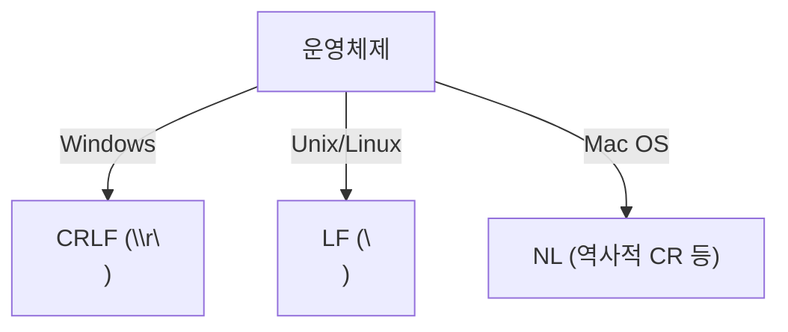
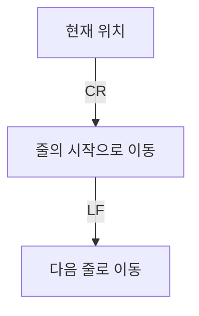
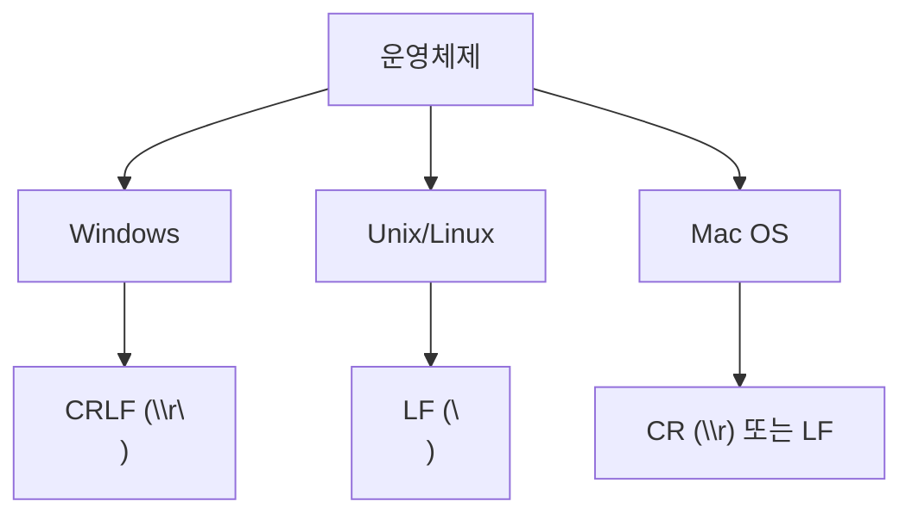
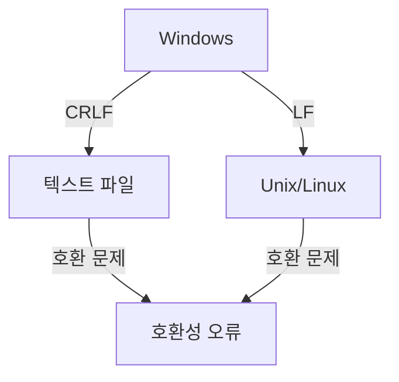
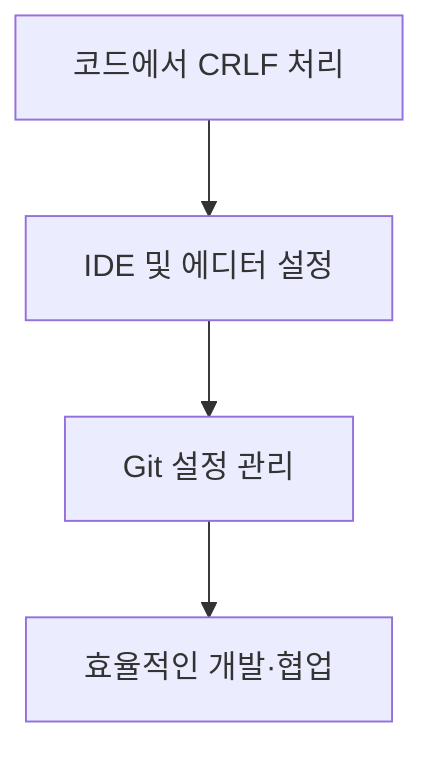
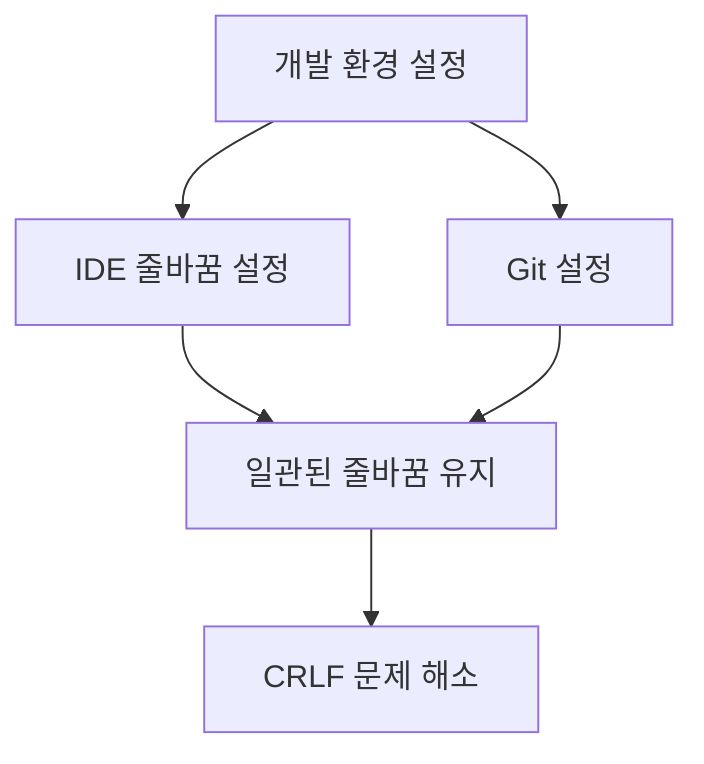
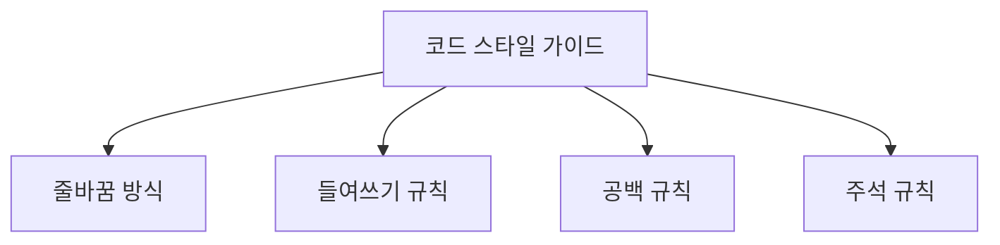
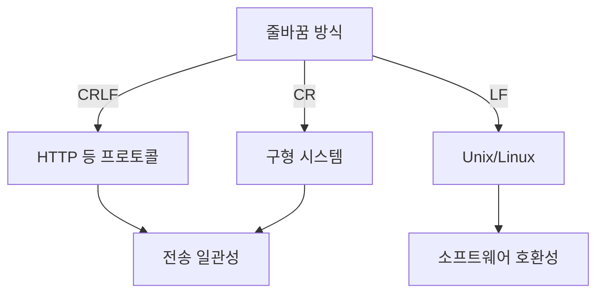

CR(Carriage Return)과 LF(Line Feed)는 텍스트에서 줄바꿈을 나타내는 제어 문자다. CR은 커서를 현재 줄의 맨 앞으로 보내고, LF는 한 줄 아래로 내린다. 타자기·텔레타이프 시대의 유산으로, Windows는 CRLF(`\r\n`), Unix·Linux·현대 macOS는 LF(`\n`)를 기본으로 쓴다. 이 차이는 크로스 플랫폼 개발·협업 시 호환성 문제와 예기치 않은 오류를 일으킬 수 있으므로, 정의·역사·대응 방법을 정리해 둔다.

## 개요

### CRLF, LF, NL의 정의와 역사

- **CRLF (Carriage Return Line Feed)**: Windows에서 쓰는 줄바꿈 방식으로, CR(`\r`, ASCII 13)과 LF(`\n`, ASCII 10)를 연속으로 사용한다. 타자기에서 캐리지를 맨 앞으로 보낸 뒤(CR) 종이를 한 줄 올리는(LF) 동작에서 유래했다.
- **LF (Line Feed)**: Unix·Linux·현대 macOS에서 쓰는 방식으로, LF(`\n`) 하나로 줄 끝을 나타낸다. 한 문자로 줄바꿈을 표현해 간결하다.
- **NL (New Line)**: 줄바꿈을 통칭하는 말로, 구현에 따라 CR, LF, CRLF 중 하나로 해석된다. 많은 프로그래밍 언어에서 `\n`이 NL 역할을 한다.

아래 다이어그램은 운영체제별 기본 줄바꿈 방식을 요약한다.


```mermaid
graph TD
    Os["운영체제"]
    WinCrlf["CRLF (\\r\\n)"]
    UnixLf["LF (\\n)"]
    MacNl["NL (역사적 CR 등)"]
    Os -->|"Windows"| WinCrlf
    Os -->|"Unix/Linux"| UnixLf
    Os -->|"Mac OS"| MacNl
```

### CRLF의 필요성과 현대적 관점

CRLF는 특정 프로토콜(HTTP, SMTP 등)과 레거시 환경에서 여전히 요구된다. 반면 대부분의 최신 소프트웨어는 LF만으로도 줄 끝을 인식한다. 크로스 플랫폼 개발·협업에서는 팀이 한 가지 줄바꿈 방식을 정하고, Git·IDE로 일관되게 적용하는 것이 중요하다.

## CRLF와 관련된 기술

### Carriage Return (CR)과 Line Feed (LF)의 차이

- **CR (Carriage Return, `\r`)**: 커서를 같은 줄에서 맨 왼쪽(줄의 시작)으로 이동시킨다. 과거 Mac OS(9 이하)는 줄바꿈에 CR만 사용했다.
- **LF (Line Feed, `\n`)**: 커서를 한 줄 아래로 내리되, 가로 위치는 유지한다. Unix 계열은 줄바꿈에 LF만 사용한다.

줄바꿈 한 번을 하려면 “맨 앞으로 이동 + 다음 줄로”가 필요하므로, 타자기·텔레타이프 시절에는 CR과 LF를 순서대로 보냈다(CRLF). 아래는 그 동작 순서를 나타낸다.


```mermaid
graph TD
    CurrentPos["현재 위치"]
    LineStart["줄의 시작으로 이동"]
    NextLine["다음 줄로 이동"]
    CurrentPos -->|"CR"| LineStart
    LineStart -->|"LF"| NextLine
```

### New Line (NL)의 개념

NL은 “새 줄”을 의미하는 추상 개념이고, 실제 인코딩은 플랫폼·프로토콜에 따라 CR, LF, CRLF 중 하나로 매핑된다. 대부분의 언어에서 이스케이프 시퀀스 `\n`은 NL을 나타내며, Windows에서는 파일 입출력 시 CRLF로 변환되는 경우가 많다.

### CRLF의 역사적 배경과 기원

1950년대 텔레타이프에서는 인쇄 헤더가 한 줄 끝에서 왼쪽으로 돌아가는 데 시간이 걸렸기 때문에, CR과 LF를 따로 보내서 그 사이에 헤더가 제자리로 돌아갈 시간을 확보했다. 1960~70년대 Unix 등에서는 “줄 끝 = 하나의 문자”로 단순화해 LF를 NL로 재사용했고, Windows는 호환성을 위해 CRLF를 유지했다.

## 운영체제별 줄바꿈 방식

| 운영체제 | 기본 줄바꿈 | 표현 |
|----------|-------------|------|
| Windows | CRLF | `\r\n` |
| Unix / Linux | LF | `\n` |
| macOS (과거 9 이하) | CR | `\r` |
| macOS (OS X 이후) | LF | `\n` |

### Windows의 CRLF (`\r\n`)

Windows는 줄 끝에 CR과 LF를 함께 사용한다. 텍스트 예시는 다음과 같다.

```plaintext
Hello, World!\r\n
This is a new line.\r\n
```

### Unix/Linux의 LF (`\n`)

Unix·Linux는 LF 하나로 줄 끝을 나타낸다.

```plaintext
Hello, World!\n
This is a new line.\n
```

### Mac OS의 역사적 줄바꿈 방식

Mac OS 9 이하는 CR(`\r`)만 사용했고, OS X(Unix 기반) 이후에는 LF를 사용한다.


```mermaid
graph TD
    OsRoot["운영체제"]
    WinNode["Windows"]
    UnixNode["Unix/Linux"]
    MacNode["Mac OS"]
    WinEol["CRLF (\\r\\n)"]
    UnixEol["LF (\\n)"]
    MacEol["CR (\\r) 또는 LF"]
    OsRoot --> WinNode
    OsRoot --> UnixNode
    OsRoot --> MacNode
    WinNode --> WinEol
    UnixNode --> UnixEol
    MacNode --> MacEol
```

## CRLF의 문제점

### CRLF 사용의 비효율성

CRLF는 줄바꿈 한 번에 2바이트를 쓰고, LF는 1바이트다. 줄 수가 많은 파일에서는 저장 용량과 전송량 차이가 커질 수 있다. 대부분의 현대 환경에서는 LF만으로 충분하므로, 불필요한 CR은 제거하는 편이 낫다.

### 소프트웨어 호환성 문제

Windows에서 만든 CRLF 파일을 Unix/Linux 스크립트나 도구가 그대로 읽으면, `\r`이 예상치 못한 문자로 해석되어 스크립트 실행 오류(예: `bad interpreter`)나 파싱 오류가 날 수 있다. 반대로 LF만 있는 파일을 구형 Windows 메모장으로 열면 한 줄로 이어져 보일 수 있다.


```mermaid
graph TD
    WinEnv["Windows"]
    TextFile["텍스트 파일"]
    UnixEnv["Unix/Linux"]
    Incompat["호환성 오류"]
    WinEnv -->|"CRLF"| TextFile
    WinEnv -->|"LF"| UnixEnv
    TextFile -->|"호환 문제"| Incompat
    UnixEnv -->|"호환 문제"| Incompat
```

### CRLF로 인한 에러 사례

- **스크립트 실행 실패**: `gradlew` 등 셸 스크립트가 Windows에서 편집되면 CRLF가 들어가고, Linux에서 실행 시 `\r`: command not found 같은 오류가 난다. 해결은 해당 파일을 LF로 저장하는 것이다.
- **HTTP 파싱**: HTTP 스펙은 헤더 줄 끝에 CRLF를 요구한다. LF만 보내도 대부분 서버·클라이언트가 받아들이지만, 엄격한 구현에서는 400 Bad Request가 날 수 있다.
- **Lint/포맷터**: ESLint 등에서 `Expected linebreaks to be 'LF' but found 'CRLF'` 경고가 나올 수 있다. 프로젝트에서 줄바꿈 규칙을 LF로 통일하고, 에디터·Git 설정을 맞추면 해소된다.

## CRLF를 다루는 방법

### 코드에서 CRLF 처리하기

파일을 읽고 쓸 때 줄바꿈을 명시하면 혼선을 줄일 수 있다. Python 예시는 아래와 같다.

```python
# CRLF로 파일 쓰기
with open('example.txt', 'w', newline='\r\n') as file:
    file.write("Hello, World!\r\nThis is a test.\r\n")

# 줄바꿈을 통일해서 읽기 (newline='' 이면 기본 동작)
with open('example.txt', 'r', newline='') as file:
    content = file.read()
    print(content)
```

### IDE 및 에디터에서 줄바꿈 설정 변경하기

- **VS Code**: 상태 표시줄 오른쪽의 "CRLF" 또는 "LF"를 클릭해 현재 파일·기본 줄바꿈을 바꿀 수 있다. `Files: Eol` 설정으로 기본값을 지정할 수 있다.
- **IntelliJ**: Settings → Editor → Code Style → Line separator에서 LF/CRLF를 선택하고, 기존 파일은 일괄 변환 기능으로 한 번에 바꿀 수 있다.

프로젝트 루트에 `.editorconfig`를 두어 팀 전체의 줄바꿈을 통일하는 것도 좋다.

### Git에서 CRLF 설정 관리하기

`.gitattributes`로 저장소 기준 줄바꿈을 고정할 수 있다.

```gitattributes
# 기본: 체크아웃 시 OS 기본, 커밋 시 LF로 정규화
* text=auto

# 텍스트 파일은 저장소에는 LF로
*.txt text eol=lf
*.md text eol=lf

# Windows 배치·스크립트는 CRLF 유지
*.bat text eol=crlf
*.cmd text eol=crlf
```

`core.autocrlf`보다 `.gitattributes`로 관리하면 프로젝트별로 일관되게 유지하기 쉽다.


```mermaid
graph TD
    CodeHandle["코드에서 CRLF 처리"]
    IdeSetting["IDE 및 에디터 설정"]
    GitSetting["Git 설정 관리"]
    EfficientDev["효율적인 개발·협업"]
    CodeHandle --> IdeSetting
    IdeSetting --> GitSetting
    GitSetting --> EfficientDev
```

## 예제

### CRLF와 LF 사용 예시

- **CRLF**: Windows 기본, HTTP 헤더 등  
  `Hello, World!\r\nThis is a test.\r\n`
- **LF**: Unix/Linux·macOS·대부분의 코드베이스  
  `Hello, World!\nThis is a test.\n`

### 다양한 운영체제에서의 줄바꿈 처리 (Python)

```python
def read_file(file_path):
    with open(file_path, 'r', newline='') as file:
        return file.read()

# CRLF를 LF로 변환
def convert_crlf_to_lf(file_path):
    with open(file_path, 'r', newline='') as f:
        content = f.read()
    content = content.replace('\r\n', '\n')
    with open(file_path, 'w', newline='\n') as f:
        f.write(content)
```

### ESLint 줄바꿈 규칙 예시

프로젝트에서 LF를 강제하려면:

```javascript
// .eslintrc.js - linebreak-style 규칙
module.exports = {
  rules: {
    'linebreak-style': ['error', 'unix']  // LF 강제
  }
};
```

## FAQ

### CRLF와 LF의 차이는 무엇인가요?

CRLF는 CR(`\r`)과 LF(`\n`) 두 문자로 줄 끝을 나타내고, Windows·일부 프로토콜에서 사용한다. LF는 `\n` 하나로 줄 끝을 나타내며, Unix·Linux·macOS·대부분의 코드에서 사용한다.

### 왜 일부 프로토콜에서 CRLF를 요구하나요?

HTTP, SMTP 등은 역사적으로 텔레타이프 규격을 이어받아 줄 끝을 CRLF로 정의했다. 실제로는 대부분의 구현이 LF만 있어도 허용한다.

### CRLF를 꼭 써야 하는 경우는 언제인가요?

Windows 전용 배치/스크립트, 또는 CRLF를 명시적으로 요구하는 레거시·프로토콜과 연동할 때만 필요하다. 새로 작성하는 코드·설정 파일은 LF로 통일하는 것을 권장한다.

### CRLF 문제 해결의 베스트 프랙티스는?

1. 팀·프로젝트에서 **LF로 통일**하고, `.gitattributes`와 `.editorconfig`로 강제한다.  
2. IDE에서 **기본 줄바꿈을 LF**로 두고, 기존 파일은 일괄 변환한다.  
3. CI에서 **linebreak-style** 등 린트로 CRLF 혼입을 막는다.


```mermaid
graph TD
    DevEnv["개발 환경 설정"]
    IdeEol["IDE 줄바꿈 설정"]
    GitConfig["Git 설정"]
    ConsistentEol["일관된 줄바꿈 유지"]
    ProblemSolved["CRLF 문제 해소"]
    DevEnv --> IdeEol
    DevEnv --> GitConfig
    IdeEol --> ConsistentEol
    GitConfig --> ConsistentEol
    ConsistentEol --> ProblemSolved
```

## 관련 기술

### 텍스트 포맷 (CSV, JSON 등)

CSV는 줄바꿈으로 레코드를 구분하므로, CRLF/LF 혼용 시 파서에 따라 필드가 잘못 나뉠 수 있다. JSON은 줄바꿈에 대한 스펙이 없지만, 가독성을 위해 일관되게 LF를 쓰는 편이 좋다.

### 프로그래밍 언어에서의 줄바꿈 처리

- **Python**: `open(..., newline='')` 로 읽으면 줄바꿈이 `\n`으로 정규화된다. 쓸 때 `newline='\n'` 또는 `'\r\n'`으로 명시 가능.  
- **JavaScript/Node**: `\n`이 기본이며, Windows 경로·파일 처리 시 `\r\n`을 `\n`으로 치환하는 경우가 많다.  
- **C/C++**: `\n`은 실행 환경에 따라 LF 또는 CRLF로 변환될 수 있다(예: Windows 텍스트 모드).

### 코드 스타일 가이드

많은 스타일 가이드(Google, Airbnb 등)가 저장소 내 텍스트 파일은 LF를 쓰도록 권장한다. 팀 규칙으로 줄바꿈 방식과 함께 들여쓰기·공백·주석 규칙을 정해 두면 협업 시 유리하다.


```mermaid
graph TD
    CodeStyle["코드 스타일 가이드"]
    EolStyle["줄바꿈 방식"]
    IndentRule["들여쓰기 규칙"]
    SpaceRule["공백 규칙"]
    CommentRule["주석 규칙"]
    CodeStyle --> EolStyle
    CodeStyle --> IndentRule
    CodeStyle --> SpaceRule
    CodeStyle --> CommentRule
```

## 결론

- **역사**: CRLF는 타자기·텔레타이프의 CR+LF 조합에서 왔고, Windows와 일부 프로토콜이 이어받았다. Unix 계열은 LF 하나로 NL을 표현한다.  
- **통일의 중요성**: 팀·저장소 단위로 LF를 기준으로 하고, `.gitattributes`, `.editorconfig`, 린트로 일관성을 유지하면 크로스 플랫폼 오류를 크게 줄일 수 있다.  
- **전망**: 대부분의 도구와 프로토콜이 LF만으로도 동작하며, 새 코드·설정은 LF로 통일하는 흐름이 지속될 것이다. 레거시·스펙 요구가 있는 경우에만 CRLF를 사용하면 된다.


```mermaid
graph TD
    EolType["줄바꿈 방식"]
    HttpProto["HTTP 등 프로토콜"]
    UnixLinux["Unix/Linux"]
    LegacySys["구형 시스템"]
    DataConsistency["전송 일관성"]
    SwCompat["소프트웨어 호환성"]
    EolType -->|"CRLF"| HttpProto
    EolType -->|"LF"| UnixLinux
    EolType -->|"CR"| LegacySys
    HttpProto --> DataConsistency
    UnixLinux --> SwCompat
    LegacySys --> DataConsistency
```

## Reference

- [Fossil: CRLF Is Obsolete And Should Be Abolished](https://fossil-scm.org/home/ext/crlf-harmful.md) — CR/LF/NL 정의, 텔레타이프 유래, 현대 관점 정리 (D. Richard Hipp).
- [운영체제별 개행 표현에 관하여 (CRLF, CR, LF)](https://velog.io/@junho5336/%EC%9A%B4%EC%98%81%EC%B2%B4%EC%A0%9C%EB%B3%84-%EA%B0%9C%ED%96%89-%ED%91%9C%ED%98%84%EC%97%90-%EA%B4%80%ED%95%98%EC%97%AC-CR-LF) — Velog, 타자기 비유·IntelliJ 설정.
- [CRLF / LF / CR 에 대한 이해](https://technote.kr/300) — TechNote.kr, 정의·OS별 방식.
- [CR(\\r), LF(\\n)이란 무엇인가?](https://m.blog.naver.com/taeil34/221325864981) — 네이버 블로그, 타자기·텔레타이프 유래.
