클래스는 객체 지향 프로그래밍의 핵심 개념 중 하나로, 데이터와 동작을 정의하는 사용자 정의 형식이다. 클래스는 객체의 형식을 정의하며, 이를 통해 프로그래머는 복잡한 시스템을 구성하는 데 필요한 다양한 개체를 생성할 수 있다. 클래스는 `class` 키워드를 사용하여 선언되며, 이때 선택적으로 접근 한정자를 지정할 수 있다. 클래스의 인스턴스를 생성하기 위해서는 `new` 연산자를 사용하여 메모리에 객체를 할당하고, 이 객체에 대한 참조를 변수에 저장한다. 객체가 생성되면 해당 객체에 대한 메모리가 힙에 할당되며, 이 메모리는 가비지 수집을 통해 자동으로 관리된다. 클래스는 필드, 속성, 메서드 및 이벤트와 같은 멤버를 포함할 수 있으며, 이러한 멤버는 클래스의 동작과 데이터를 정의하는 데 사용된다. 또한, 클래스는 상속을 통해 다른 클래스의 기능을 재사용할 수 있으며, 이를 통해 코드의 재사용성과 유지보수성을 높일 수 있다. 클래스의 생성자는 객체가 생성될 때 필드와 속성을 초기화하는 데 사용되며, 다양한 초기화 방법이 존재한다. 이러한 클래스의 특성은 객체 지향 프로그래밍의 기본 원칙인 캡슐화, 상속, 다형성을 지원하여 소프트웨어 개발의 효율성을 극대화하는 데 기여한다.

<!--
##### Outline #####
-->

<!--
# 클래스 소개 목차

## 1. 개요
   - 클래스의 정의 및 중요성
   - 참조 형식과 값 형식의 차이

## 2. 이 문서의 내용
   - 문서의 목적 및 구성

## 3. 참조 형식
   - 참조 형식의 개념
   - `new` 연산자와 `null` 값
   - 가비지 수집(Garbage Collection) 개요

## 4. 클래스 선언
   - 클래스 선언 구문
   - 액세스 한정자(Access Modifiers)
   - 클래스 멤버(Fields, Properties, Methods, Events)

## 5. 개체 만들기
   - 클래스와 개체의 차이
   - 개체 생성 방법
   - 개체 참조의 중요성

## 6. 생성자 및 초기화
   - 생성자의 역할
   - 필드 이니셜라이저(Field Initializers)
   - 생성자 매개 변수(Constructor Parameters)
   - 개체 이니셜라이저(Object Initializers)
   - `required` 한정자 사용법

## 7. 클래스 상속
   - 상속의 개념
   - 기본 클래스와 파생 클래스
   - `sealed` 및 `abstract` 클래스
   - 인터페이스 구현(Interface Implementation)

## 8. 클래스 멤버
   - 필드, 속성, 메서드, 이벤트의 정의 및 사용법
   - 접근 제어 및 캡슐화(Encapsulation)

## 9. 클래스 정의의 분할
   - Partial 클래스 및 메서드의 개념
   - 여러 파일로 클래스 정의하기

## 10. C# 언어 사양
   - C# 언어 사양의 중요성
   - 신뢰할 수 있는 자료 출처

## 11. 예제
   - 클래스 선언 및 개체 생성 예제
   - 생성자 및 초기화 예제
   - 상속 및 다형성(Polymorphism) 예제

## 12. FAQ
   - 클래스와 개체의 차이는 무엇인가요?
   - 가비지 수집은 어떻게 작동하나요?
   - `abstract` 클래스와 `sealed` 클래스의 차이는 무엇인가요?

## 13. 관련 기술
   - 객체 지향 프로그래밍(Object-Oriented Programming)
   - 디자인 패턴(Design Patterns)
   - SOLID 원칙(SOLID Principles)

## 14. 결론
   - 클래스의 중요성 요약
   - 향후 학습 방향 및 참고 자료

## 15. 참고 자료
   - 관련 문서 및 링크
   - 추천 도서 및 온라인 강좌
-->

<!--
## 1. 개요
   - 클래스의 정의 및 중요성
   - 참조 형식과 값 형식의 차이
-->

## 개요

### 클래스의 정의 및 중요성

클래스는 객체 지향 프로그래밍(Object-Oriented Programming)에서 데이터와 그 데이터를 처리하는 메서드를 하나의 단위로 묶는 구조이다. 클래스는 객체를 생성하기 위한 청사진(blueprint) 역할을 하며, 객체는 클래스의 인스턴스(instance)로서 실제로 메모리에 할당된 데이터 구조이다. 클래스는 코드의 재사용성을 높이고, 유지보수를 용이하게 하며, 프로그램의 구조를 명확하게 하는 데 중요한 역할을 한다.

클래스를 사용함으로써 개발자는 복잡한 시스템을 더 작은 단위로 나누어 관리할 수 있으며, 각 클래스는 특정한 책임(responsibility)을 가지게 된다. 이러한 구조는 코드의 가독성을 높이고, 협업 시에도 각 개발자가 맡은 부분을 명확히 할 수 있도록 돕는다.

### 참조 형식과 값 형식의 차이

C#에서는 데이터 타입을 크게 두 가지로 나눌 수 있다: 참조 형식(reference type)과 값 형식(value type)이다. 이 두 가지는 메모리에서의 저장 방식과 동작 방식에서 큰 차이를 보인다.

**참조 형식**은 객체의 주소를 저장하며, 객체가 메모리에 할당될 때 해당 객체의 참조(reference)가 생성된다. 따라서 참조 형식의 변수를 다른 변수에 할당하면, 두 변수는 동일한 객체를 참조하게 된다. 예를 들어, 클래스는 참조 형식에 해당한다.

```csharp
class Person
{
    public string Name { get; set; }
}

Person person1 = new Person { Name = "Alice" };
Person person2 = person1; // person2는 person1과 같은 객체를 참조함
person2.Name = "Bob"; // person1의 Name도 "Bob"으로 변경됨
```

**값 형식**은 실제 데이터를 저장하며, 변수에 값을 직접 할당한다. 값 형식의 변수를 다른 변수에 할당하면, 두 변수는 서로 다른 메모리 공간에 값을 가지게 된다. 예를 들어, 구조체(struct)는 값 형식에 해당한다.

```csharp
struct Point
{
    public int X;
    public int Y;
}

Point point1 = new Point { X = 1, Y = 2 };
Point point2 = point1; // point2는 point1의 복사본을 가짐
point2.X = 3; // point1의 X는 여전히 1
```

이와 같이 참조 형식과 값 형식은 메모리 관리와 데이터 처리 방식에서 중요한 차이를 보인다. 이러한 차이를 이해하는 것은 객체 지향 프로그래밍에서 클래스와 개체를 효과적으로 활용하는 데 필수적이다.

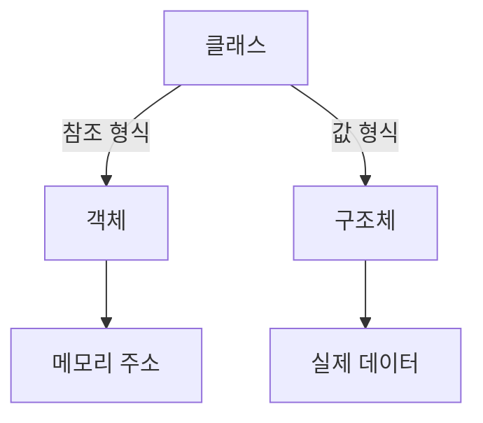

위의 다이어그램은 클래스와 구조체의 관계를 시각적으로 나타낸 것이다. 클래스는 참조 형식으로 메모리 주소를 통해 객체를 참조하며, 구조체는 값 형식으로 실제 데이터를 직접 저장한다. 이러한 이해는 프로그래밍에서 메모리 관리와 성능 최적화에 큰 도움이 된다.

<!--
## 3. 참조 형식
   - 참조 형식의 개념
   - `new` 연산자와 `null` 값
   - 가비지 수집(Garbage Collection) 개요
-->

## 참조 형식

참조 형식은 객체 지향 프로그래밍에서 중요한 개념으로, 객체의 메모리 주소를 참조하는 방식이다. 이는 값 형식(Value Type)과는 달리, 객체의 실제 데이터가 아닌 객체의 위치를 가리키는 포인터와 같은 역할을 한다. 참조 형식은 주로 클래스, 배열, 인터페이스와 같은 복합 데이터 구조에서 사용된다.

**참조 형식의 개념**

참조 형식은 메모리에서 객체를 생성할 때, 해당 객체의 주소를 저장하는 방식이다. 이로 인해 여러 변수가 동일한 객체를 참조할 수 있으며, 하나의 변수를 통해 객체의 상태를 변경하면 다른 변수에서도 그 변경 사항을 확인할 수 있다. 이는 메모리 사용의 효율성을 높이고, 객체 간의 상호작용을 용이하게 한다.

```csharp
class Person
{
    public string Name { get; set; }
}

Person person1 = new Person { Name = "Alice" };
Person person2 = person1; // person2는 person1과 같은 객체를 참조

person2.Name = "Bob"; // person1의 Name도 "Bob"으로 변경됨
Console.WriteLine(person1.Name); // 출력: Bob
```

**`new` 연산자와 `null` 값**

`new` 연산자는 참조 형식의 객체를 생성할 때 사용된다. 이 연산자를 통해 메모리에 새로운 객체를 할당하고, 해당 객체의 주소를 반환한다. 만약 객체가 생성되지 않거나, 명시적으로 초기화되지 않은 경우, 해당 변수는 `null` 값을 가지게 된다. `null` 값은 객체가 존재하지 않음을 나타내며, 이를 통해 객체의 유효성을 검사할 수 있다.

```csharp
Person person3 = null; // person3는 null로 초기화됨
if (person3 == null)
{
    Console.WriteLine("person3는 null입니다."); // 출력: person3는 null입니다.
}

person3 = new Person { Name = "Charlie" }; // 이제 person3는 유효한 객체를 참조
```

**가비지 수집(Garbage Collection) 개요**

가비지 수집은 메모리 관리의 한 형태로, 더 이상 사용되지 않는 객체를 자동으로 감지하고 메모리에서 해제하는 프로세스이다. C#에서는 가비지 수집이 자동으로 이루어지며, 개발자는 메모리 해제를 직접 관리할 필요가 없다. 이는 메모리 누수를 방지하고, 프로그램의 안정성을 높이는 데 기여한다.

가비지 수집의 작동 방식은 다음과 같다:

1. 객체가 더 이상 참조되지 않으면, 가비지 수집의 대상이 된다.
2. 가비지 수집기가 메모리에서 해당 객체를 찾아 해제한다.
3. 해제된 메모리는 다시 사용할 수 있도록 시스템에 반환된다.

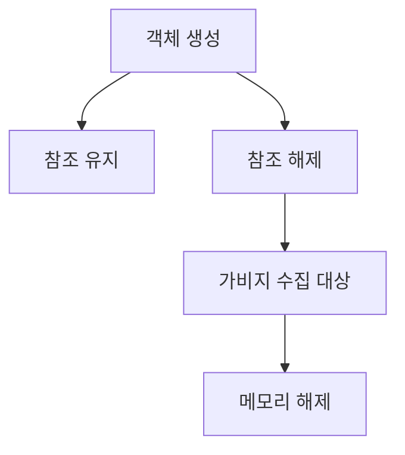

위의 다이어그램은 객체가 생성되고 참조가 유지되는 과정을 보여준다. 참조가 해제되면 가비지 수집의 대상이 되어 메모리가 해제되는 과정을 나타낸다. 이러한 메모리 관리 방식은 개발자가 메모리 관리를 신경 쓰지 않고도 안정적인 프로그램을 작성할 수 있도록 돕는다.

<!--
## 4. 클래스 선언
   - 클래스 선언 구문
   - 액세스 한정자(Access Modifiers)
   - 클래스 멤버(Fields, Properties, Methods, Events)
-->

## 클래스 선언

클래스 선언은 객체 지향 프로그래밍에서 중요한 개념으로, 프로그램에서 사용할 데이터 구조와 그 데이터에 대한 동작을 정의하는 방법이다. 클래스는 객체를 생성하기 위한 청사진 역할을 하며, 클래스의 선언 구문은 다음과 같다.

### 클래스 선언 구문

클래스를 선언하기 위해서는 `class` 키워드를 사용하고, 클래스의 이름을 지정한 후 중괄호 `{}`로 클래스의 내용을 감싸면 된다. 기본적인 클래스 선언 구문은 다음과 같다.

```csharp
public class MyClass
{
    // 클래스 멤버 정의
}
```

위의 예제에서 `public`은 액세스 한정자(Access Modifier)로, 클래스의 접근 수준을 정의한다. 클래스 이름은 `MyClass`이며, 이 클래스 안에는 필드, 속성, 메서드, 이벤트 등의 클래스 멤버가 정의될 수 있다.

### 액세스 한정자(Access Modifiers)

액세스 한정자는 클래스 및 클래스 멤버의 접근 수준을 제어하는 데 사용된다. C#에서 제공하는 주요 액세스 한정자는 다음과 같다.

- **public**: 모든 코드에서 접근 가능하다.
- **private**: 해당 클래스 내에서만 접근 가능하다.
- **protected**: 해당 클래스와 파생 클래스에서 접근 가능하다.
- **internal**: 같은 어셈블리 내에서 접근 가능하다.
- **protected internal**: 같은 어셈블리 내에서 또는 파생 클래스에서 접근 가능하다.

이러한 액세스 한정자를 적절히 사용함으로써 클래스의 캡슐화(Encapsulation)를 강화할 수 있다.

### 클래스 멤버(Fields, Properties, Methods, Events)

클래스는 여러 종류의 멤버로 구성될 수 있으며, 각 멤버는 클래스의 기능을 정의하는 데 중요한 역할을 한다.

- **Fields**: 클래스의 상태를 저장하는 변수이다. 일반적으로 private으로 선언하여 외부에서 직접 접근하지 못하도록 한다.
  
  ```csharp
  private int myField;
  ```

- **Properties**: 필드에 대한 접근을 제어하는 방법으로, getter와 setter를 통해 값을 읽고 쓸 수 있다.
  
  ```csharp
  public int MyProperty
  {
      get { return myField; }
      set { myField = value; }
  }
  ```

- **Methods**: 클래스의 동작을 정의하는 함수이다. 메서드는 특정 작업을 수행하고, 필요에 따라 값을 반환할 수 있다.
  
  ```csharp
  public void MyMethod()
  {
      // 메서드의 동작
  }
  ```

- **Events**: 클래스에서 발생하는 사건을 다른 객체에 알리기 위해 사용된다. 이벤트는 주로 delegate를 사용하여 정의된다.
  
  ```csharp
  public event EventHandler MyEvent;
  ```

다음은 클래스 선언의 구조를 나타내는 다이어그램이다.

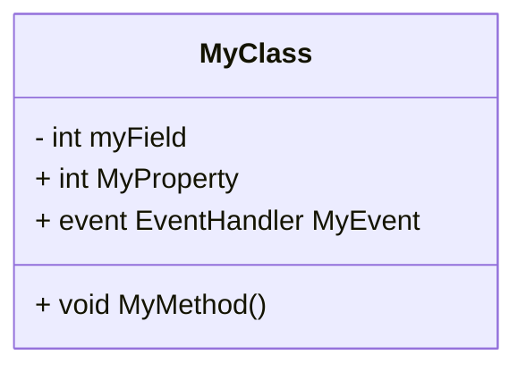

위의 다이어그램은 `MyClass`라는 클래스의 구조를 보여준다. 클래스는 필드, 속성, 메서드, 이벤트로 구성되어 있으며, 각 멤버의 접근 수준을 통해 클래스의 기능을 정의하고 있다. 클래스 선언은 객체 지향 프로그래밍의 기본이므로, 이를 잘 이해하고 활용하는 것이 중요하다.

<!--
## 5. 개체 만들기
   - 클래스와 개체의 차이
   - 개체 생성 방법
   - 개체 참조의 중요성
-->

## 개체 만들기

### 클래스와 개체의 차이

클래스(Class)와 개체(Object)는 객체 지향 프로그래밍에서 매우 중요한 개념이다. 클래스는 객체를 생성하기 위한 설계도 또는 청사진으로, 속성과 메서드를 정의한다. 반면, 개체는 클래스의 인스턴스(instance)로, 실제로 메모리에 할당된 데이터와 동작을 포함한다. 즉, 클래스는 개체를 만들기 위한 틀이며, 개체는 그 틀을 바탕으로 생성된 구체적인 실체이다.

### 개체 생성 방법

C#에서 개체를 생성하는 방법은 주로 `new` 연산자를 사용하는 것이다. `new` 연산자는 클래스의 인스턴스를 생성하고, 해당 인스턴스의 생성자를 호출하여 초기화한다. 아래는 개체를 생성하는 간단한 예제 코드이다.

```csharp
public class Car
{
    public string Model { get; set; }
    public int Year { get; set; }

    public Car(string model, int year)
    {
        Model = model;
        Year = year;
    }
}

// 개체 생성
Car myCar = new Car("Tesla Model S", 2022);
```

위의 코드에서 `Car` 클래스는 자동차의 모델과 연도를 속성으로 가지고 있으며, `myCar`라는 개체를 생성하여 초기화하였다.

### 개체 참조의 중요성

개체 참조(Object Reference)는 메모리에서 개체의 위치를 가리키는 포인터와 같은 역할을 한다. 개체를 생성할 때, `new` 연산자는 메모리에 개체를 할당하고, 그 주소를 반환하여 개체 참조를 생성한다. 이 개체 참조를 통해 개체의 속성과 메서드에 접근할 수 있다.

개체 참조의 중요성은 다음과 같다:

1. **메모리 관리**: 개체 참조를 사용하면 메모리에서 개체를 효율적으로 관리할 수 있다. 여러 개체가 동일한 데이터를 참조할 수 있어 메모리 사용을 최적화할 수 있다.
2. **다형성**: 개체 참조를 통해 상위 클래스의 참조 변수를 사용하여 하위 클래스의 개체를 참조할 수 있다. 이는 다형성을 가능하게 하여 코드의 유연성을 높인다.
3. **가비지 수집**: 개체 참조가 더 이상 사용되지 않으면, 가비지 수집(Garbage Collection) 시스템이 해당 메모리를 자동으로 해제할 수 있다.

아래는 개체 참조의 개념을 설명하는 다이어그램이다.

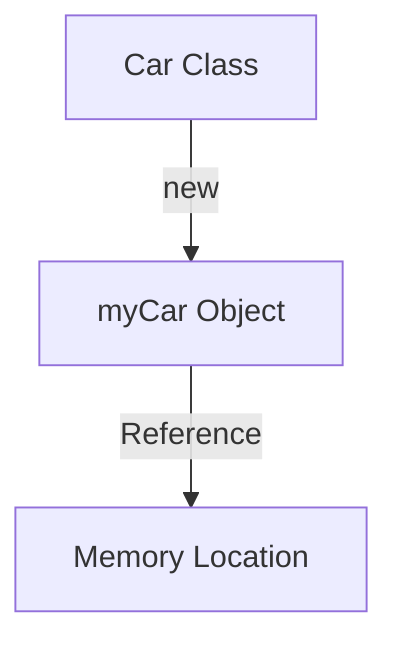

위의 다이어그램에서 `Car Class`는 `myCar Object`를 생성하고, 이 개체는 메모리의 특정 위치를 참조한다. 이러한 개체 참조는 객체 지향 프로그래밍에서 매우 중요한 역할을 한다.

<!--
## 6. 생성자 및 초기화
   - 생성자의 역할
   - 필드 이니셜라이저(Field Initializers)
   - 생성자 매개 변수(Constructor Parameters)
   - 개체 이니셜라이저(Object Initializers)
   - `required` 한정자 사용법
-->

## 생성자 및 초기화

클래스에서 생성자는 개체가 생성될 때 호출되는 특별한 메서드이다. 생성자는 개체의 초기 상태를 설정하는 데 중요한 역할을 하며, 필드의 초기값을 설정하거나 필요한 리소스를 할당하는 등의 작업을 수행한다.

### **생성자의 역할**

생성자는 클래스의 인스턴스가 생성될 때 자동으로 호출되며, 주로 다음과 같은 역할을 한다.

- 필드 초기화: 생성자는 클래스의 필드를 초기화하는 데 사용된다.
- 리소스 할당: 데이터베이스 연결이나 파일 핸들 등과 같은 리소스를 초기화할 수 있다.
- 유효성 검사: 생성자 내에서 매개변수의 유효성을 검사하여 잘못된 값이 설정되지 않도록 할 수 있다.

```csharp
public class Person
{
    public string Name { get; set; }
    public int Age { get; set; }

    // 생성자
    public Person(string name, int age)
    {
        Name = name;
        Age = age;
    }
}
```

### **필드 이니셜라이저(Field Initializers)**

필드 이니셜라이저는 클래스의 필드를 선언할 때 초기값을 설정하는 방법이다. 생성자를 사용하지 않고도 필드를 초기화할 수 있는 간편한 방법이다.

```csharp
public class Car
{
    public string Model { get; set; } = "Unknown Model";
    public int Year { get; set; } = 2020;
}
```

### **생성자 매개 변수(Constructor Parameters)**

생성자 매개 변수는 생성자가 호출될 때 전달되는 인자이다. 이를 통해 개체의 초기 상태를 설정할 수 있다. 생성자 매개 변수를 사용하면 다양한 초기값을 가진 개체를 생성할 수 있다.

```csharp
public class Book
{
    public string Title { get; set; }
    public string Author { get; set; }

    // 생성자 매개 변수 사용
    public Book(string title, string author)
    {
        Title = title;
        Author = author;
    }
}
```

### **개체 이니셜라이저(Object Initializers)**

개체 이니셜라이저는 개체를 생성한 후에 필드를 초기화하는 방법이다. 생성자를 호출한 후에 중괄호 `{}`를 사용하여 필드를 설정할 수 있다.

```csharp
var book = new Book("C# Programming", "John Doe")
{
    Author = "Jane Doe" // Author를 다시 설정
};
```

### **`required` 한정자 사용법**

C# 11부터 도입된 `required` 한정자는 개체 초기화 시 필수로 설정해야 하는 속성을 정의하는 데 사용된다. 이를 통해 개체가 생성될 때 필수 속성이 누락되지 않도록 보장할 수 있다.

```csharp
public class Employee
{
    public required string Name { get; set; }
    public required int Id { get; set; }
}

// 사용 예
var employee = new Employee
{
    Name = "Alice",
    Id = 1
};
```

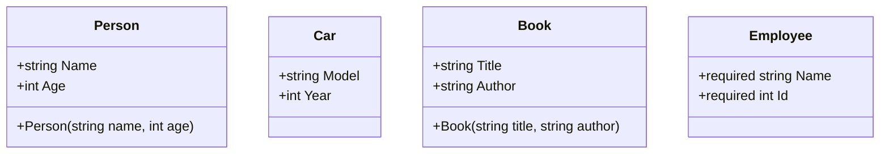

위의 다이어그램은 생성자 및 초기화와 관련된 클래스들의 관계를 나타낸다. 생성자는 개체의 초기 상태를 설정하는 데 중요한 역할을 하며, 다양한 초기화 방법을 통해 유연하게 개체를 생성할 수 있다.

<!--
## 7. 클래스 상속
   - 상속의 개념
   - 기본 클래스와 파생 클래스
   - `sealed` 및 `abstract` 클래스
   - 인터페이스 구현(Interface Implementation)
-->

## 클래스 상속

클래스 상속은 객체 지향 프로그래밍에서 중요한 개념으로, 기존 클래스의 속성과 메서드를 새로운 클래스에서 재사용할 수 있도록 해준다. 이를 통해 코드의 재사용성을 높이고, 유지보수를 용이하게 할 수 있다. 상속을 통해 파생 클래스는 기본 클래스의 모든 기능을 상속받으며, 추가적인 기능을 정의할 수 있다.

### **상속의 개념**

상속은 기본 클래스(Base Class)로부터 파생 클래스(Derived Class)가 속성과 메서드를 물려받는 구조이다. 기본 클래스는 공통적인 특성을 정의하고, 파생 클래스는 이를 확장하거나 수정하여 사용할 수 있다. 이러한 구조는 코드의 중복을 줄이고, 계층적인 관계를 형성하는 데 도움을 준다.

### **기본 클래스와 파생 클래스**

기본 클래스는 다른 클래스가 상속할 수 있는 클래스이며, 파생 클래스는 기본 클래스를 상속받아 기능을 확장한 클래스이다. 예를 들어, `Animal`이라는 기본 클래스가 있을 때, `Dog`와 `Cat`은 `Animal` 클래스를 상속받아 각각의 특성을 추가할 수 있다.

```csharp
public class Animal
{
    public void Eat()
    {
        Console.WriteLine("Eating...");
    }
}

public class Dog : Animal
{
    public void Bark()
    {
        Console.WriteLine("Barking...");
    }
}

public class Cat : Animal
{
    public void Meow()
    {
        Console.WriteLine("Meowing...");
    }
}
```

위의 코드에서 `Dog`와 `Cat` 클래스는 `Animal` 클래스를 상속받아 `Eat` 메서드를 사용할 수 있으며, 각각의 고유한 메서드인 `Bark`와 `Meow`를 추가하였다.

### **sealed 및 abstract 클래스**

`sealed` 클래스는 더 이상 상속될 수 없는 클래스를 의미한다. 즉, `sealed`로 선언된 클래스는 다른 클래스가 이를 상속할 수 없으므로, 해당 클래스의 기능을 변경할 수 없다. 반면, `abstract` 클래스는 인스턴스를 생성할 수 없으며, 반드시 파생 클래스에서 구현해야 하는 메서드를 정의할 수 있다. 이는 공통적인 기능을 정의하면서도, 각 파생 클래스에서 구체적인 구현을 강제할 수 있는 방법이다.

```csharp
public abstract class Shape
{
    public abstract double Area();
}

public class Circle : Shape
{
    public double Radius { get; set; }

    public override double Area()
    {
        return Math.PI * Radius * Radius;
    }
}

public sealed class Square : Shape
{
    public double Side { get; set; }

    public override double Area()
    {
        return Side * Side;
    }
}
```

위의 코드에서 `Shape` 클래스는 `abstract`로 선언되어 있으며, `Area` 메서드는 파생 클래스에서 반드시 구현해야 한다. `Square` 클래스는 `sealed`로 선언되어 있어 더 이상 상속될 수 없다.

### **인터페이스 구현**

인터페이스는 클래스가 구현해야 하는 메서드의 집합을 정의하는 계약이다. 클래스는 하나 이상의 인터페이스를 구현할 수 있으며, 이를 통해 다형성을 제공한다. 인터페이스는 클래스가 특정 기능을 수행할 수 있도록 강제하는 역할을 한다.

```csharp
public interface IDrawable
{
    void Draw();
}

public class Circle : IDrawable
{
    public void Draw()
    {
        Console.WriteLine("Drawing a circle.");
    }
}

public class Square : IDrawable
{
    public void Draw()
    {
        Console.WriteLine("Drawing a square.");
    }
}
```

위의 코드에서 `IDrawable` 인터페이스는 `Draw` 메서드를 정의하고 있으며, `Circle`과 `Square` 클래스는 이를 구현하고 있다. 이를 통해 다양한 도형을 그릴 수 있는 기능을 제공할 수 있다.

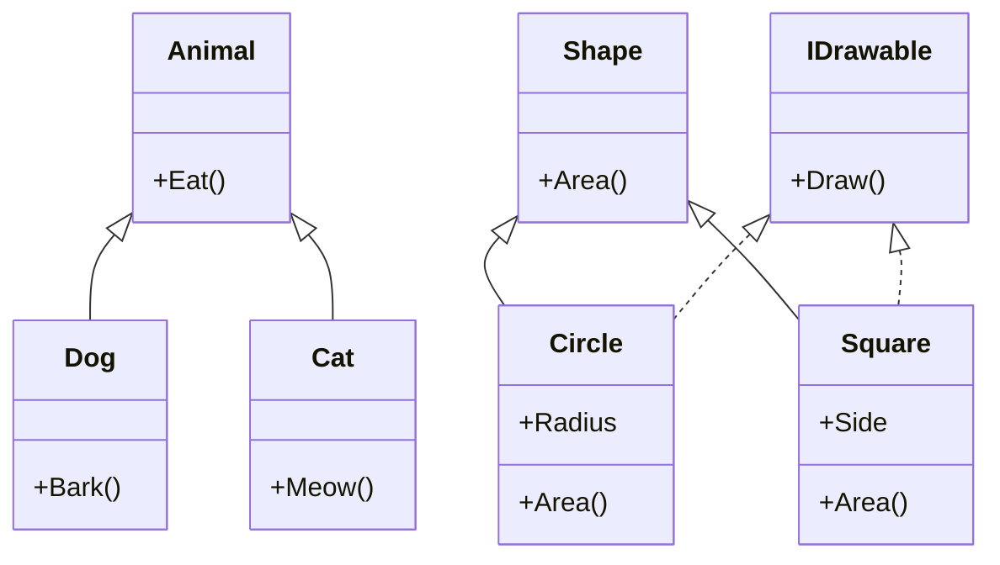

위의 다이어그램은 클래스 상속 및 인터페이스 구현의 관계를 나타낸다. `Animal` 클래스는 `Dog`와 `Cat` 클래스에 의해 상속되며, `Shape` 클래스는 `Circle`과 `Square` 클래스에 의해 상속된다. 또한, `Circle`과 `Square` 클래스는 `IDrawable` 인터페이스를 구현하고 있다. 

이와 같이 클래스 상속은 객체 지향 프로그래밍에서 중요한 역할을 하며, 코드의 재사용성과 유지보수성을 높이는 데 기여한다.

<!--
## 8. 클래스 멤버
   - 필드, 속성, 메서드, 이벤트의 정의 및 사용법
   - 접근 제어 및 캡슐화(Encapsulation)
-->

## 클래스 멤버

클래스는 객체 지향 프로그래밍에서 중요한 개념으로, 클래스의 멤버는 클래스의 상태와 행동을 정의하는 요소들이다. 클래스 멤버는 크게 필드(Field), 속성(Property), 메서드(Method), 이벤트(Event)로 나눌 수 있다.

### 필드, 속성, 메서드, 이벤트의 정의 및 사용법

**필드**는 클래스의 상태를 저장하는 변수이다. 필드는 클래스의 인스턴스가 가지는 데이터로, 일반적으로 private 접근 제어자를 사용하여 외부에서 직접 접근하지 못하도록 한다.

**속성**은 필드에 대한 접근을 제어하는 방법으로, getter와 setter를 통해 필드의 값을 읽고 쓸 수 있게 해준다. 속성을 사용하면 데이터의 유효성을 검사하거나 추가적인 로직을 구현할 수 있다.

**메서드**는 클래스의 행동을 정의하는 함수이다. 메서드는 특정 작업을 수행하며, 매개변수를 받아들이고 결과를 반환할 수 있다.

**이벤트**는 클래스가 특정 작업을 수행할 때 발생하는 알림이다. 이벤트는 주로 사용자 인터페이스와 관련된 작업에서 사용되며, 다른 객체가 해당 이벤트에 반응할 수 있도록 한다.

다음은 필드, 속성, 메서드, 이벤트의 간단한 예제 코드이다.

```csharp
public class Car
{
    // 필드
    private string model;
    private int year;

    // 속성
    public string Model
    {
        get { return model; }
        set { model = value; }
    }

    public int Year
    {
        get { return year; }
        set
        {
            if (value > 1885) // 자동차의 최초 발명 연도
            {
                year = value;
            }
            else
            {
                throw new ArgumentException("Year must be greater than 1885");
            }
        }
    }

    // 메서드
    public void Start()
    {
        Console.WriteLine($"{model} is starting.");
    }

    // 이벤트
    public event EventHandler CarStarted;

    public void StartCar()
    {
        Start();
        CarStarted?.Invoke(this, EventArgs.Empty);
    }
}
```

위의 코드에서 `Car` 클래스는 `model`과 `year`라는 두 개의 필드를 가지고 있으며, 각각에 대한 속성을 정의하고 있다. `Start` 메서드는 자동차를 시작하는 행동을 정의하고, `CarStarted` 이벤트는 자동차가 시작될 때 발생한다.

### 접근 제어 및 캡슐화(Encapsulation)

접근 제어는 클래스의 멤버에 대한 접근을 제한하는 방법이다. C#에서는 `public`, `private`, `protected`, `internal`과 같은 접근 제어자를 사용하여 멤버의 가시성을 설정할 수 있다. 

**캡슐화**는 객체 지향 프로그래밍의 핵심 원칙 중 하나로, 객체의 내부 상태를 외부에서 직접 접근하지 못하도록 숨기는 것이다. 이를 통해 데이터의 무결성을 유지하고, 클래스의 사용자가 내부 구현에 의존하지 않도록 한다.

다음은 접근 제어와 캡슐화의 개념을 설명하는 다이어그램이다.

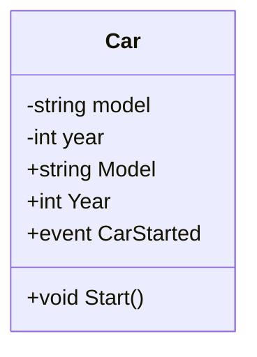

위의 다이어그램에서 `Car` 클래스는 `model`과 `year` 필드를 private으로 설정하여 외부에서 직접 접근할 수 없도록 하고, public 속성과 메서드를 통해 안전하게 접근할 수 있도록 하고 있다. 이러한 접근 제어와 캡슐화는 클래스의 설계를 더욱 견고하게 만들어준다.

<!--
## 9. 클래스 정의의 분할
   - Partial 클래스 및 메서드의 개념
   - 여러 파일로 클래스 정의하기
-->

## 클래스 정의의 분할

클래스 정의의 분할은 대규모 프로젝트에서 코드의 가독성과 유지보수성을 높이기 위해 매우 유용한 기법이다. 이 섹션에서는 Partial 클래스 및 메서드의 개념과 여러 파일로 클래스 정의하는 방법에 대해 설명하겠다.

### Partial 클래스 및 메서드의 개념

Partial 클래스는 하나의 클래스를 여러 파일에 나누어 정의할 수 있는 기능을 제공한다. 이를 통해 개발자는 팀원들과 협업할 때 각자 다른 파일에서 클래스를 수정할 수 있으며, 코드 충돌을 최소화할 수 있다. Partial 클래스는 `partial` 키워드를 사용하여 정의된다.

예를 들어, 다음과 같이 두 개의 파일에서 동일한 Partial 클래스를 정의할 수 있다.

**File1.cs**

```csharp
public partial class SampleClass
{
    public void MethodA()
    {
        Console.WriteLine("Method A");
    }
}
```

**File2.cs**

```csharp
public partial class SampleClass
{
    public void MethodB()
    {
        Console.WriteLine("Method B");
    }
}
```

위의 예제에서 `SampleClass`는 두 개의 파일에 나누어 정의되었지만, 컴파일 시 하나의 클래스로 합쳐진다. 따라서 `MethodA`와 `MethodB`를 모두 사용할 수 있다.

### 여러 파일로 클래스 정의하기

여러 파일로 클래스를 정의하는 것은 대규모 애플리케이션에서 코드의 구조를 명확하게 하고, 각 파일의 책임을 분리하는 데 도움을 준다. 이를 통해 코드의 재사용성과 테스트 용이성을 높일 수 있다.

다음은 Partial 클래스를 사용하여 여러 파일로 클래스를 정의하는 방법을 보여주는 다이어그램이다.

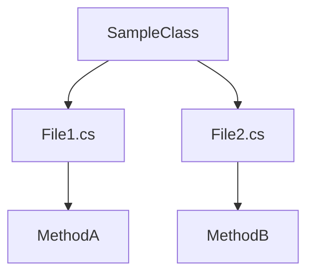

위의 다이어그램에서 `SampleClass`는 `File1.cs`와 `File2.cs`에 나누어 정의되어 있으며, 각 파일에서 메서드를 추가하고 있다. 이러한 구조는 코드의 모듈화를 촉진하고, 팀원들이 각자의 작업을 독립적으로 진행할 수 있도록 한다.

Partial 클래스는 특히 대규모 프로젝트에서 유용하며, 코드의 가독성을 높이고 협업을 원활하게 하는 데 기여한다.

<!--
## 10. C# 언어 사양
   - C# 언어 사양의 중요성
   - 신뢰할 수 있는 자료 출처
-->

## C# 언어 사양

C# 언어 사양은 C# 프로그래밍 언어의 문법, 구문, 의미론을 정의하는 공식 문서이다. 이 문서는 C# 언어의 모든 기능과 규칙을 명확하게 설명하고 있어, 개발자들이 언어를 올바르게 이해하고 사용할 수 있도록 돕는다. C# 언어 사양의 중요성은 다음과 같다.

**C# 언어 사양의 중요성**

C# 언어 사양은 다음과 같은 이유로 중요하다.

1. **일관성 유지**: 언어 사양은 C#의 모든 구현체가 동일한 규칙을 따르도록 보장한다. 이를 통해 다양한 플랫폼에서의 코드 호환성을 유지할 수 있다.

2. **기능 이해**: 개발자는 언어 사양을 통해 C#의 다양한 기능과 그 사용법을 명확히 이해할 수 있다. 이는 코드 작성 시 발생할 수 있는 오류를 줄이는 데 기여한다.

3. **최신 정보 제공**: C# 언어는 지속적으로 발전하고 있으며, 언어 사양은 이러한 변화에 대한 최신 정보를 제공한다. 개발자는 이를 통해 새로운 기능을 신속하게 학습하고 적용할 수 있다.

4. **문서화 및 참조**: 언어 사양은 C#의 공식 문서로서, 개발자들이 필요할 때 언제든지 참조할 수 있는 신뢰할 수 있는 자료를 제공한다.

**신뢰할 수 있는 자료 출처**

C# 언어 사양을 포함한 신뢰할 수 있는 자료 출처는 다음과 같다.

- **Microsoft 공식 문서**: Microsoft의 공식 웹사이트에서는 C# 언어 사양을 포함한 다양한 자료를 제공한다. 이곳은 C#에 대한 가장 권위 있는 정보 출처 중 하나이다. [Microsoft C# Language Specification](https://docs.microsoft.com/en-us/dotnet/csharp/language-reference/language-specification/)

- **GitHub**: C# 언어의 소스 코드와 관련 문서가 GitHub에 공개되어 있다. 이를 통해 개발자들은 C#의 내부 동작을 이해하고, 언어의 발전에 기여할 수 있다. [C# GitHub Repository](https://github.com/dotnet/csharplang)

- **기술 서적**: C#에 대한 다양한 기술 서적이 출판되어 있으며, 이들 서적은 언어 사양을 기반으로 한 깊이 있는 내용을 제공한다. 예를 들어, "C# in a Nutshell"과 같은 서적은 C#의 핵심 개념을 잘 설명하고 있다.

다음은 C# 언어 사양의 구조를 간단히 나타낸 다이어그램이다.

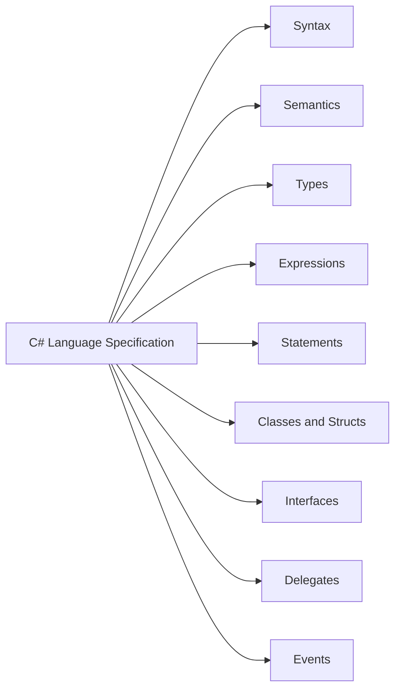

이 다이어그램은 C# 언어 사양의 주요 구성 요소를 시각적으로 나타내며, 각 요소가 언어의 전반적인 구조에 어떻게 기여하는지를 보여준다. C# 언어 사양을 이해하는 것은 개발자에게 필수적인 요소이며, 이를 통해 더 나은 코드 작성과 유지보수가 가능해진다.

<!--
## 11. 예제
   - 클래스 선언 및 개체 생성 예제
   - 생성자 및 초기화 예제
   - 상속 및 다형성(Polymorphism) 예제
-->

## 예제

### 클래스 선언 및 개체 생성 예제

클래스를 선언하고 개체를 생성하는 과정은 객체 지향 프로그래밍의 기본이다. 아래는 간단한 `Car` 클래스를 선언하고, 이를 통해 개체를 생성하는 예제이다.

```csharp
public class Car
{
    public string Model { get; set; }
    public string Color { get; set; }

    public void Drive()
    {
        Console.WriteLine($"{Model} is driving.");
    }
}

// 개체 생성
Car myCar = new Car();
myCar.Model = "Tesla Model S";
myCar.Color = "Red";
myCar.Drive();
```

위의 코드에서 `Car` 클래스는 `Model`과 `Color`라는 두 개의 속성을 가지고 있으며, `Drive`라는 메서드를 통해 자동차가 주행하는 모습을 출력한다. `myCar`라는 개체를 생성하고, 속성을 설정한 후 `Drive` 메서드를 호출하여 결과를 확인할 수 있다.

### 생성자 및 초기화 예제

생성자는 클래스의 개체가 생성될 때 호출되는 특별한 메서드이다. 아래는 생성자를 사용하여 `Car` 클래스를 초기화하는 예제이다.

```csharp
public class Car
{
    public string Model { get; set; }
    public string Color { get; set; }

    // 생성자
    public Car(string model, string color)
    {
        Model = model;
        Color = color;
    }

    public void Drive()
    {
        Console.WriteLine($"{Model} is driving.");
    }
}

// 개체 생성
Car myCar = new Car("Tesla Model S", "Red");
myCar.Drive();
```

위의 코드에서 `Car` 클래스는 생성자를 통해 `Model`과 `Color`를 초기화한다. 개체를 생성할 때 생성자에 인자를 전달하여 속성을 설정할 수 있다.

### 상속 및 다형성(Polymorphism) 예제

상속은 클래스가 다른 클래스로부터 속성과 메서드를 물려받는 기능이다. 아래는 `Vehicle` 클래스를 상속받은 `Car` 클래스의 예제이다.

```csharp
public class Vehicle
{
    public virtual void Drive()
    {
        Console.WriteLine("Vehicle is driving.");
    }
}

public class Car : Vehicle
{
    public override void Drive()
    {
        Console.WriteLine("Car is driving.");
    }
}

// 다형성 예제
Vehicle myVehicle = new Car();
myVehicle.Drive();
```

위의 코드에서 `Vehicle` 클래스는 `Drive` 메서드를 가지고 있으며, `Car` 클래스는 이를 오버라이드하여 자신만의 구현을 제공한다. `Vehicle` 타입의 변수에 `Car` 개체를 할당하고 `Drive` 메서드를 호출하면, `Car` 클래스의 구현이 실행된다.

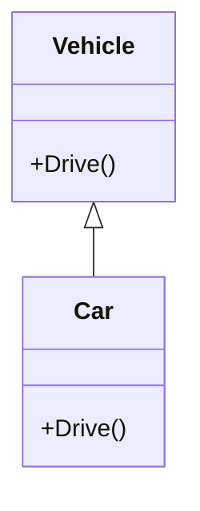

위의 다이어그램은 `Vehicle` 클래스와 `Car` 클래스 간의 상속 관계를 나타낸다. `Car` 클래스는 `Vehicle` 클래스를 상속받아 다형성을 구현하고 있다. 이러한 구조는 코드의 재사용성을 높이고, 유지보수를 용이하게 한다.

<!--
## 12. FAQ
   - 클래스와 개체의 차이는 무엇인가요?
   - 가비지 수집은 어떻게 작동하나요?
   - `abstract` 클래스와 `sealed` 클래스의 차이는 무엇인가요?
-->

## FAQ

### 클래스와 개체의 차이는 무엇인가요?

클래스(Class)와 개체(Object)는 객체 지향 프로그래밍에서 중요한 개념이다. 클래스는 객체를 생성하기 위한 설계도 또는 청사진으로, 속성과 메서드를 정의한다. 반면, 개체는 클래스의 인스턴스(instance)로, 실제로 메모리에 할당된 데이터와 기능을 포함한다. 즉, 클래스는 개체를 만들기 위한 틀이고, 개체는 그 틀을 바탕으로 생성된 구체적인 실체이다.

아래는 클래스와 개체의 관계를 나타내는 다이어그램이다.

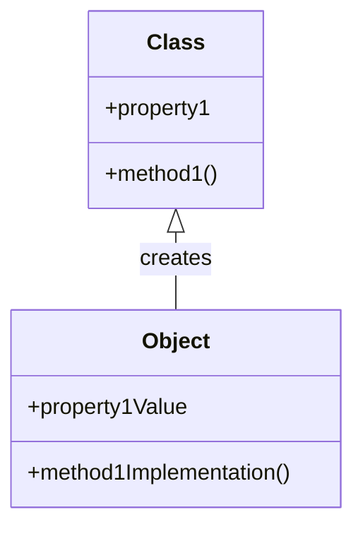

### 가비지 수집은 어떻게 작동하나요?

가비지 수집(Garbage Collection)은 메모리 관리의 한 형태로, 더 이상 사용되지 않는 개체를 자동으로 식별하고 메모리에서 해제하는 과정이다. C#에서는 가비지 수집이 자동으로 이루어지며, 개발자는 메모리 해제를 직접 관리할 필요가 없다. 가비지 수집기는 주기적으로 실행되어 사용되지 않는 개체를 찾아 메모리를 회수한다. 이 과정은 성능 최적화와 메모리 누수를 방지하는 데 중요한 역할을 한다.

가비지 수집의 작동 방식은 다음과 같다:

1. **개체의 참조 카운트**: 개체가 생성될 때 참조 카운트가 증가하고, 참조가 해제될 때 감소한다.
2. **가비지 수집기 실행**: 참조 카운트가 0이 된 개체는 가비지 수집의 대상이 된다.
3. **메모리 회수**: 가비지 수집기가 해당 개체의 메모리를 해제한다.

### `abstract` 클래스와 `sealed` 클래스의 차이는 무엇인가요?

`abstract` 클래스와 `sealed` 클래스는 클래스의 상속과 관련된 두 가지 중요한 개념이다. 

- **`abstract` 클래스**: 이 클래스는 인스턴스를 생성할 수 없으며, 다른 클래스에서 상속받아 구현해야 하는 메서드를 포함할 수 있다. `abstract` 클래스는 기본적인 기능을 정의하고, 파생 클래스에서 구체적인 구현을 제공하도록 강제한다.

- **`sealed` 클래스**: 이 클래스는 더 이상 상속될 수 없는 클래스이다. 즉, `sealed` 클래스를 상속받으려는 시도가 있을 경우 컴파일 오류가 발생한다. `sealed` 클래스는 특정 기능을 고정하고, 그 기능을 변경할 수 없도록 보호하는 데 사용된다.

아래는 두 클래스의 차이를 나타내는 간단한 코드 예제이다.

```csharp
// Abstract class example
public abstract class Animal {
    public abstract void Speak();
}

public class Dog : Animal {
    public override void Speak() {
        Console.WriteLine("Woof!");
    }
}

// Sealed class example
public sealed class FinalClass {
    public void Display() {
        Console.WriteLine("This is a sealed class.");
    }
}

// Attempting to inherit from a sealed class will result in a compile-time error
// public class InheritedClass : FinalClass { } // Error: cannot derive from sealed class
```

이와 같이 `abstract` 클래스는 상속을 통해 기능을 확장할 수 있도록 하고, `sealed` 클래스는 상속을 차단하여 기능을 고정하는 역할을 한다.

<!--
## 13. 관련 기술
   - 객체 지향 프로그래밍(Object-Oriented Programming)
   - 디자인 패턴(Design Patterns)
   - SOLID 원칙(SOLID Principles)
-->

## 관련 기술

### 객체 지향 프로그래밍(Object-Oriented Programming)

객체 지향 프로그래밍은 소프트웨어 설계 및 개발의 패러다임 중 하나로, 데이터와 그 데이터를 처리하는 메서드를 객체라는 단위로 묶어 관리하는 방식이다. 이 접근 방식은 코드의 재사용성과 유지보수성을 높이는 데 기여한다. 객체 지향 프로그래밍의 주요 개념으로는 클래스, 객체, 상속, 다형성, 캡슐화가 있다.

**클래스**는 객체의 설계도 역할을 하며, **객체**는 클래스의 인스턴스이다. 상속을 통해 기존 클래스의 기능을 확장할 수 있으며, 다형성을 통해 동일한 인터페이스를 사용하여 다양한 객체를 처리할 수 있다.

```csharp
public class Animal
{
    public virtual void Speak()
    {
        Console.WriteLine("Animal speaks");
    }
}

public class Dog : Animal
{
    public override void Speak()
    {
        Console.WriteLine("Woof");
    }
}

public class Cat : Animal
{
    public override void Speak()
    {
        Console.WriteLine("Meow");
    }
}
```

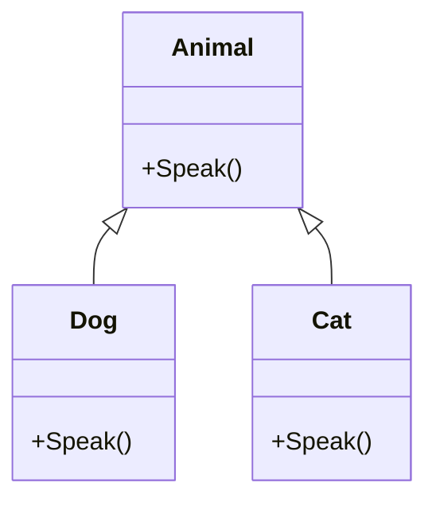

### 디자인 패턴(Design Patterns)

디자인 패턴은 소프트웨어 설계에서 자주 발생하는 문제를 해결하기 위한 일반적인 솔루션이다. 디자인 패턴은 코드의 구조와 상호작용을 개선하여 유지보수성과 확장성을 높인다. 대표적인 디자인 패턴으로는 생성 패턴(Creational Patterns), 구조 패턴(Structural Patterns), 행동 패턴(Behavioral Patterns)이 있다.

**생성 패턴**은 객체 생성과 관련된 패턴으로, 객체의 생성 과정을 단순화하고 유연하게 만든다. **구조 패턴**은 클래스나 객체의 조합을 통해 더 큰 구조를 형성하는 방법을 제공하며, **행동 패턴**은 객체 간의 상호작용을 정의한다.

```csharp
// Singleton Pattern 예제
public class Singleton
{
    private static Singleton instance;

    private Singleton() { }

    public static Singleton Instance
    {
        get
        {
            if (instance == null)
            {
                instance = new Singleton();
            }
            return instance;
        }
    }
}
```

### SOLID 원칙(SOLID Principles)

SOLID 원칙은 객체 지향 프로그래밍에서 소프트웨어 설계를 개선하기 위한 다섯 가지 원칙이다. 이 원칙들은 코드의 가독성, 유지보수성, 확장성을 높이는 데 도움을 준다. SOLID는 다음과 같은 다섯 가지 원칙의 약어이다.

- **S**: Single Responsibility Principle (단일 책임 원칙)
- **O**: Open/Closed Principle (개방-폐쇄 원칙)
- **L**: Liskov Substitution Principle (리스코프 치환 원칙)
- **I**: Interface Segregation Principle (인터페이스 분리 원칙)
- **D**: Dependency Inversion Principle (의존 역전 원칙)

이 원칙들을 준수하면 코드의 품질이 향상되고, 변경에 대한 저항력이 강해진다. 예를 들어, 단일 책임 원칙을 따르면 각 클래스는 하나의 책임만 가지게 되어, 클래스의 변경이 다른 클래스에 미치는 영향을 최소화할 수 있다.

```csharp
// 단일 책임 원칙 예제
public class Report
{
    public string Title { get; set; }
    public string Content { get; set; }
}

public class ReportPrinter
{
    public void Print(Report report)
    {
        Console.WriteLine(report.Title);
        Console.WriteLine(report.Content);
    }
}
```

이와 같이 객체 지향 프로그래밍, 디자인 패턴, SOLID 원칙은 소프트웨어 개발에서 중요한 역할을 하며, 이들을 잘 이해하고 활용하는 것이 좋은 소프트웨어를 만드는 데 기여한다.

<!--
## 14. 결론
   - 클래스의 중요성 요약
   - 향후 학습 방향 및 참고 자료
-->

## 결론

클래스는 객체 지향 프로그래밍(Object-Oriented Programming)에서 핵심적인 개념이다. 클래스는 데이터와 그 데이터를 처리하는 메서드를 하나의 단위로 묶어주는 역할을 하며, 이를 통해 코드의 재사용성과 유지보수성을 높일 수 있다. 클래스의 정의와 사용법을 이해하는 것은 소프트웨어 개발에 있어 필수적이다. 

**클래스의 중요성 요약**

클래스는 다음과 같은 이유로 중요하다:

- **캡슐화(Encapsulation)**: 클래스는 데이터와 메서드를 하나의 단위로 묶어 외부에서 접근을 제한할 수 있다. 이를 통해 데이터의 무결성을 유지할 수 있다.
- **상속(Inheritance)**: 클래스는 다른 클래스로부터 속성과 메서드를 상속받을 수 있어 코드의 재사용성을 높인다.
- **다형성(Polymorphism)**: 같은 메서드 이름으로 다양한 동작을 수행할 수 있어 코드의 유연성을 제공한다.

아래는 클래스의 구조를 나타내는 간단한 다이어그램이다:

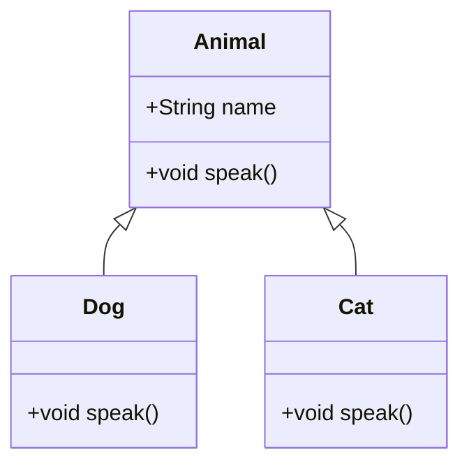

위의 다이어그램은 `Animal`이라는 기본 클래스와 이를 상속받은 `Dog`와 `Cat` 클래스를 보여준다. 각 클래스는 `speak` 메서드를 가지고 있으며, 이를 통해 다형성을 구현할 수 있다.

**향후 학습 방향 및 참고 자료**

클래스에 대한 이해를 바탕으로 다음과 같은 주제를 학습하는 것이 좋다:

- **디자인 패턴(Design Patterns)**: 객체 지향 프로그래밍에서 자주 발생하는 문제를 해결하기 위한 일반적인 솔루션을 학습할 수 있다.
- **SOLID 원칙(SOLID Principles)**: 객체 지향 설계의 원칙을 이해하고 적용함으로써 더 나은 소프트웨어를 개발할 수 있다.
- **고급 C# 기능**: 비동기 프로그래밍, LINQ, 이벤트 및 델리게이트와 같은 고급 기능을 학습하여 C#의 활용도를 높일 수 있다.

참고 자료로는 다음과 같은 자료를 추천한다:

- **책**: "C# in Depth" by Jon Skeet
- **온라인 강좌**: Coursera, Udemy에서 제공하는 C# 관련 강좌
- **문서**: Microsoft의 공식 C# 문서

클래스와 객체 지향 프로그래밍에 대한 깊은 이해는 소프트웨어 개발의 기초를 다지는 데 큰 도움이 될 것이다.

<!--
## 15. 참고 자료
   - 관련 문서 및 링크
   - 추천 도서 및 온라인 강좌
-->

## 참고 자료

### 관련 문서 및 링크

클래스와 객체 지향 프로그래밍에 대한 깊이 있는 이해를 위해 다음의 자료를 참고하는 것이 좋다. 

- [C# Programming Guide](https://docs.microsoft.com/en-us/dotnet/csharp/programming-guide/)
- [Object-Oriented Programming in C#](https://www.tutorialspoint.com/csharp/csharp_object_oriented.htm)

이 외에도 다양한 블로그와 포럼에서 클래스와 관련된 주제를 다루고 있으니, 검색을 통해 추가 자료를 찾아보는 것도 추천한다.

### 추천 도서 및 온라인 강좌

클래스와 객체 지향 프로그래밍에 대한 이해를 높이기 위해 다음의 도서와 온라인 강좌를 추천한다.

- **도서**

  - "C# in a Nutshell" - 이 책은 C# 언어의 전반적인 내용을 다루며, 클래스와 객체 지향 프로그래밍에 대한 깊이 있는 설명을 제공한다.
  - "Head First Object-Oriented Analysis and Design" - 객체 지향 설계의 기초를 다루며, 클래스의 개념을 이해하는 데 도움을 준다.

- **온라인 강좌**

  - [Udemy - C# Basics for Beginners: Learn C# Fundamentals by Coding](https://www.udemy.com/course/csharp-tutorial-for-beginners/)

### 샘플 코드

아래는 간단한 클래스 선언 및 개체 생성 예제이다.

```csharp
public class Car
{
    public string Model { get; set; }
    public int Year { get; set; }

    public Car(string model, int year)
    {
        Model = model;
        Year = year;
    }

    public void DisplayInfo()
    {
        Console.WriteLine($"Model: {Model}, Year: {Year}");
    }
}

// 개체 생성
Car myCar = new Car("Toyota Camry", 2020);
myCar.DisplayInfo();
```

### 다이어그램

아래는 클래스와 개체의 관계를 나타내는 다이어그램이다.

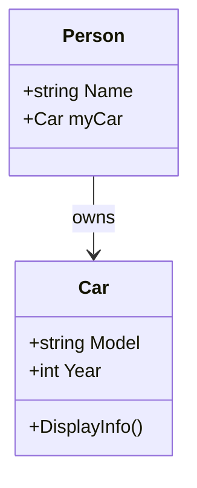

이 자료들은 클래스와 객체 지향 프로그래밍에 대한 이해를 높이는 데 큰 도움이 될 것이다.

<!--
##### Reference #####
-->

## Reference


* [https://learn.microsoft.com/ko-kr/dotnet/csharp/fundamentals/types/classes](https://learn.microsoft.com/ko-kr/dotnet/csharp/fundamentals/types/classes)

