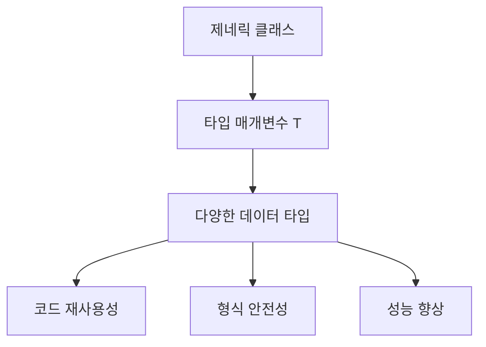
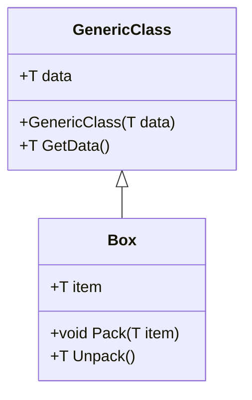
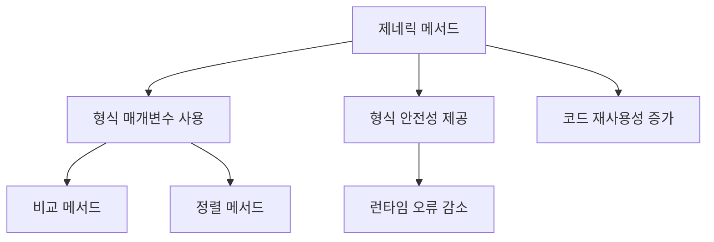
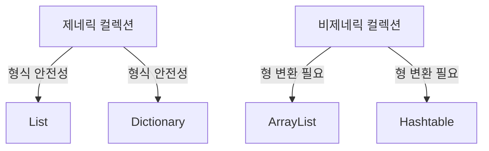
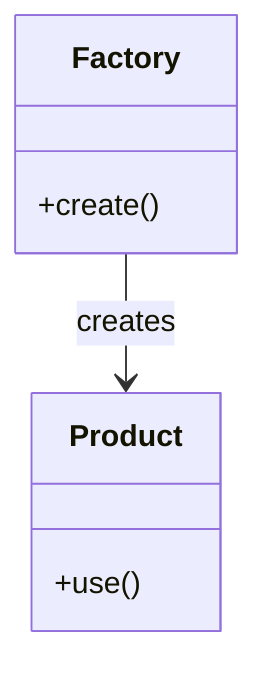
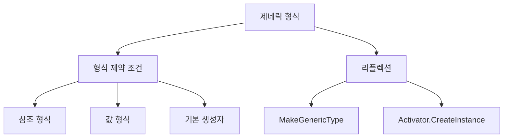
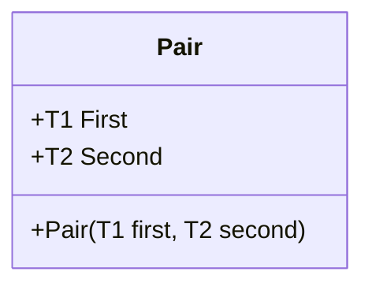
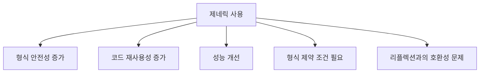
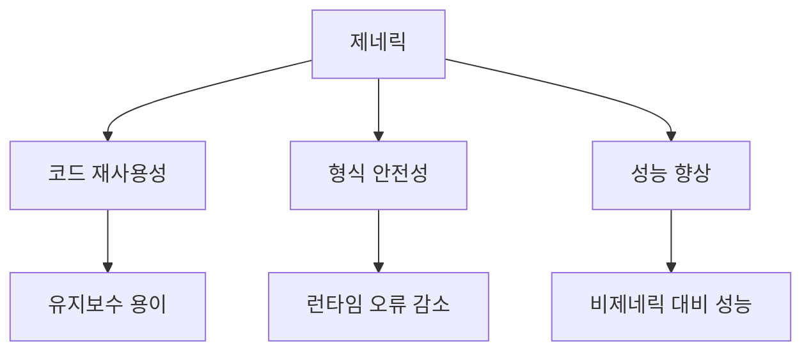
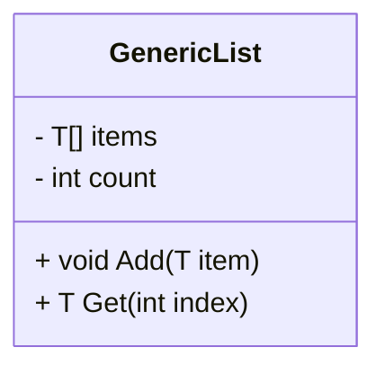

제네릭은 .NET에서 형식 매개변수의 개념을 도입하여 코드의 재사용성과 형식 안전성을 높이는 중요한 기능이다. 제네릭을 사용하면 클래스나 메서드를 정의할 때 특정 형식을 지정하지 않고도 다양한 데이터 타입을 처리할 수 있는 유연한 코드를 작성할 수 있다. 예를 들어, 제네릭 형식 매개변수 `T`를 사용하여 다양한 타입의 데이터를 저장할 수 있는 단일 클래스를 만들 수 있으며, 이는 런타임에서의 캐스팅이나 boxing 작업에 따른 비용과 위험을 줄여준다. 제네릭 클래스와 메서드는 재사용성, 형식 안전성 및 효율성을 결합하여 비제네릭 클래스에서는 얻을 수 없는 장점을 제공한다. 제네릭은 주로 컬렉션 클래스에서 사용되며, .NET의 `System.Collections.Generic` 네임스페이스에는 여러 제네릭 기반 컬렉션 클래스가 포함되어 있다. 사용자 지정 제네릭 형식 및 메서드를 만들어 형식 안전하고 효율적인 솔루션을 제공할 수 있으며, 이는 다양한 디자인 패턴을 구현하는 데 유용하다. 제네릭 클래스는 특정 데이터 형식의 메서드에 접근할 수 있도록 제한할 수 있으며, 리플렉션을 통해 런타임에 제네릭 데이터 형식에 대한 정보를 가져올 수 있다. 이러한 특성 덕분에 제네릭은 현대 소프트웨어 개발에서 필수적인 요소로 자리 잡고 있다.

<!--
##### Outline #####
-->

<!--
# 제네릭 클래스 및 메서드 목차

## 개요
   - 제네릭의 정의 및 필요성
   - 제네릭의 장점: 코드 재사용성, 형식 안전성, 성능
   - 제네릭의 일반적인 사용 사례

## 제네릭 클래스
   - 제네릭 클래스의 구조
   - 제네릭 클래스의 예제
   - 제네릭 클래스의 사용 시나리오

## 제네릭 메서드
   - 제네릭 메서드의 정의
   - 제네릭 메서드의 예제
   - 제네릭 메서드의 활용

## 제네릭 컬렉션
   - .NET의 제네릭 컬렉션 소개
   - System.Collections.Generic 네임스페이스
   - 제네릭 컬렉션과 비제네릭 컬렉션의 차이점

## 사용자 정의 제네릭
   - 사용자 정의 제네릭 클래스 및 메서드 생성
   - 제네릭 인터페이스 및 대리자
   - 제네릭을 활용한 디자인 패턴

## 제네릭의 제한
   - 제네릭 형식의 제한 사항
   - 형식 제약 조건 (Type Constraints)
   - 제네릭과 리플렉션

## 예제
   - 제네릭 클래스 및 메서드의 실제 코드 예제
   - 제네릭 컬렉션 사용 예제
   - 사용자 정의 제네릭 클래스 예제

## FAQ
   - 제네릭을 사용할 때의 일반적인 질문과 답변
   - 제네릭과 비제네릭의 성능 차이
   - 제네릭을 사용할 때 주의해야 할 점

## 관련 기술
   - C# 언어 사양
   - LINQ와 제네릭
   - 비동기 프로그래밍과 제네릭

## 결론
   - 제네릭의 중요성 요약
   - 제네릭을 활용한 코드 작성의 모범 사례
   - 향후 제네릭의 발전 방향

## 참고 문헌
   - C# 언어 사양 링크
   - .NET 제네릭 관련 공식 문서
   - 제네릭 관련 서적 및 자료

이 목차는 제네릭 클래스 및 메서드에 대한 포괄적인 이해를 돕기 위해 구성되었습니다. 각 섹션은 제네릭의 다양한 측면을 다루며, 예제와 FAQ를 통해 실용적인 정보를 제공합니다.
-->

<!--
## 개요
   - 제네릭의 정의 및 필요성
   - 제네릭의 장점: 코드 재사용성, 형식 안전성, 성능
   - 제네릭의 일반적인 사용 사례
-->

## 개요

제네릭(Generics)은 프로그래밍 언어에서 데이터 타입을 일반화하여 코드의 재사용성을 높이고, 형식 안전성을 제공하는 기능이다. 제네릭을 사용하면 특정 데이터 타입에 의존하지 않고, 다양한 데이터 타입에 대해 동일한 로직을 적용할 수 있다. 이는 코드의 유지보수성을 높이고, 오류를 줄이는 데 기여한다.

**제네릭의 정의 및 필요성**

제네릭은 클래스, 메서드, 인터페이스 등을 정의할 때 데이터 타입을 매개변수로 받아들이는 기능이다. 이를 통해 개발자는 특정 타입에 국한되지 않고, 다양한 타입에 대해 동일한 알고리즘을 적용할 수 있다. 예를 들어, 리스트(List)와 같은 데이터 구조를 정의할 때, 제네릭을 사용하면 정수, 문자열, 사용자 정의 객체 등 다양한 타입의 데이터를 저장할 수 있다.

**제네릭의 장점: 코드 재사용성, 형식 안전성, 성능**

1. **코드 재사용성**: 제네릭을 사용하면 동일한 코드를 여러 데이터 타입에 대해 재사용할 수 있다. 이는 코드의 중복을 줄이고, 유지보수를 용이하게 한다.
   
2. **형식 안전성**: 제네릭은 컴파일 타임에 타입 검사를 수행하므로, 런타임 오류를 줄일 수 있다. 이는 개발자가 의도하지 않은 타입의 데이터를 처리하는 것을 방지한다.

3. **성능**: 제네릭을 사용하면 박싱(Boxing)과 언박싱(Unboxing) 과정을 줄일 수 있다. 이는 성능을 향상시키고, 메모리 사용을 최적화하는 데 기여한다.

**제네릭의 일반적인 사용 사례**

제네릭은 다양한 상황에서 활용될 수 있다. 일반적인 사용 사례는 다음과 같다:

- **컬렉션 클래스**: List<T>, Dictionary<TKey, TValue>와 같은 제네릭 컬렉션은 다양한 데이터 타입을 저장할 수 있는 유연성을 제공한다.
  
- **알고리즘 구현**: 정렬(Sorting), 검색(Search) 등의 알고리즘을 제네릭으로 구현하면, 다양한 데이터 타입에 대해 동일한 알고리즘을 적용할 수 있다.

- **API 설계**: 제네릭을 사용하여 API를 설계하면, 사용자에게 더 많은 유연성을 제공할 수 있다. 예를 들어, 제네릭 메서드를 사용하여 다양한 타입의 데이터를 처리하는 API를 만들 수 있다.

다음은 제네릭 클래스를 사용하는 간단한 예제 코드이다.

```csharp
public class GenericList<T>
{
    private List<T> items = new List<T>();

    public void Add(T item)
    {
        items.Add(item);
    }

    public T Get(int index)
    {
        return items[index];
    }
}
```

위의 코드에서 `GenericList<T>` 클래스는 제네릭 타입 매개변수 `T`를 사용하여 다양한 타입의 데이터를 저장할 수 있는 리스트를 구현하고 있다.

다이어그램을 통해 제네릭의 개념을 시각적으로 표현할 수 있다.



이와 같이 제네릭은 프로그래밍에서 매우 중요한 개념으로, 코드의 재사용성과 안전성을 높이는 데 기여한다.

<!--
## 제네릭 클래스
   - 제네릭 클래스의 구조
   - 제네릭 클래스의 예제
   - 제네릭 클래스의 사용 시나리오
-->

## 제네릭 클래스

### 제네릭 클래스의 구조

제네릭 클래스는 형식 매개변수(type parameter)를 사용하여 다양한 데이터 타입을 처리할 수 있는 클래스이다. 이러한 구조는 코드의 재사용성을 높이고, 형식 안전성을 제공한다. 제네릭 클래스는 다음과 같은 기본 구조를 가진다.

```csharp
public class GenericClass<T>
{
    private T data;

    public GenericClass(T data)
    {
        this.data = data;
    }

    public T GetData()
    {
        return data;
    }
}
```

위의 코드에서 `T`는 형식 매개변수로, 클래스가 인스턴스화될 때 실제 데이터 타입으로 대체된다. 이를 통해 다양한 타입의 데이터를 처리할 수 있는 유연성을 제공한다.

### 제네릭 클래스의 예제

아래는 제네릭 클래스를 사용하여 다양한 타입의 데이터를 저장하고 반환하는 예제이다.

```csharp
public class Box<T>
{
    private T item;

    public void Pack(T item)
    {
        this.item = item;
    }

    public T Unpack()
    {
        return item;
    }
}

// 사용 예
Box<int> intBox = new Box<int>();
intBox.Pack(123);
int item = intBox.Unpack();

Box<string> strBox = new Box<string>();
strBox.Pack("Hello, World!");
string message = strBox.Unpack();
```

위의 예제에서 `Box<T>` 클래스는 정수형과 문자열형 데이터를 모두 처리할 수 있다. 이는 제네릭 클래스의 장점을 잘 보여준다.

### 제네릭 클래스의 사용 시나리오

제네릭 클래스는 다양한 상황에서 유용하게 사용될 수 있다. 다음은 몇 가지 사용 시나리오이다.

1. **컬렉션 클래스**: 리스트, 스택, 큐와 같은 데이터 구조를 구현할 때 제네릭 클래스를 사용하면 다양한 데이터 타입을 처리할 수 있다.
2. **데이터베이스 모델링**: 다양한 데이터 타입을 가진 엔티티를 모델링할 때 제네릭 클래스를 활용하여 코드의 중복을 줄일 수 있다.
3. **API 설계**: 클라이언트와 서버 간의 데이터 전송을 위한 API를 설계할 때, 제네릭 클래스를 사용하여 다양한 데이터 타입을 지원할 수 있다.



위의 다이어그램은 `GenericClass`와 `Box` 간의 관계를 나타낸다. `Box` 클래스는 제네릭 클래스를 상속받아 다양한 타입의 데이터를 처리할 수 있는 구조를 보여준다. 

제네릭 클래스는 코드의 재사용성을 높이고, 형식 안전성을 제공하는 강력한 도구이다. 다양한 시나리오에서 활용할 수 있는 제네릭 클래스를 이해하고 활용하는 것은 소프트웨어 개발에 있어 매우 중요하다.

<!--
## 제네릭 메서드
   - 제네릭 메서드의 정의
   - 제네릭 메서드의 예제
   - 제네릭 메서드의 활용
-->

## 제네릭 메서드

### 제네릭 메서드의 정의

제네릭 메서드는 메서드의 매개변수나 반환 타입에 형식 매개변수(type parameter)를 사용하는 메서드이다. 이를 통해 다양한 데이터 타입에 대해 동일한 메서드를 재사용할 수 있으며, 형식 안전성을 제공한다. 제네릭 메서드는 메서드 호출 시 실제 타입이 결정되므로, 컴파일 타임에 타입 검사가 이루어져 런타임 오류를 줄일 수 있다.

### 제네릭 메서드의 예제

아래는 제네릭 메서드의 간단한 예제이다. 이 메서드는 두 개의 값을 비교하여 더 큰 값을 반환한다.

```csharp
public T GetMax<T>(T a, T b) where T : IComparable
{
    return (a.CompareTo(b) > 0) ? a : b;
}
```

위의 `GetMax` 메서드는 형식 매개변수 `T`를 사용하여 두 개의 값을 비교한다. `where T : IComparable` 제약 조건을 통해 `T`가 `IComparable` 인터페이스를 구현해야 함을 명시하여, 비교가 가능하도록 한다.

### 제네릭 메서드의 활용

제네릭 메서드는 다양한 상황에서 유용하게 활용될 수 있다. 예를 들어, 데이터 정렬, 검색 알고리즘, 또는 데이터 변환과 같은 작업에서 제네릭 메서드를 사용하면 코드의 재사용성을 높이고, 형식 안전성을 유지할 수 있다.

아래는 제네릭 메서드를 활용한 배열의 최대값을 찾는 예제이다.

```csharp
public static T FindMax<T>(T[] array) where T : IComparable
{
    T max = array[0];
    foreach (T item in array)
    {
        if (item.CompareTo(max) > 0)
        {
            max = item;
        }
    }
    return max;
}
```

이 메서드는 배열을 입력받아 최대값을 찾아 반환한다. 다양한 데이터 타입의 배열에 대해 동일한 메서드를 사용할 수 있어 코드의 재사용성이 높아진다.



위의 다이어그램은 제네릭 메서드의 주요 특징과 이점을 시각적으로 나타낸 것이다. 제네릭 메서드는 다양한 데이터 타입을 처리할 수 있는 유연성을 제공하며, 코드의 품질을 높이는 데 기여한다.

<!--
## 제네릭 컬렉션
   - .NET의 제네릭 컬렉션 소개
   - System.Collections.Generic 네임스페이스
   - 제네릭 컬렉션과 비제네릭 컬렉션의 차이점
-->

## 제네릭 컬렉션

### .NET의 제네릭 컬렉션 소개

제네릭 컬렉션은 .NET에서 제공하는 데이터 구조로, 다양한 데이터 형식을 안전하게 저장하고 관리할 수 있도록 설계되었다. 제네릭 컬렉션을 사용하면 형식 안전성을 확보할 수 있으며, 코드의 재사용성을 높일 수 있다. 일반적으로 사용되는 제네릭 컬렉션으로는 `List<T>`, `Dictionary<TKey, TValue>`, `HashSet<T>` 등이 있다. 이러한 컬렉션은 특정 형식의 데이터를 저장할 수 있도록 타입 매개변수를 사용하여 정의된다.

### System.Collections.Generic 네임스페이스

`System.Collections.Generic` 네임스페이스는 제네릭 컬렉션을 포함하고 있는 .NET의 기본 네임스페이스이다. 이 네임스페이스에는 다양한 제네릭 클래스와 인터페이스가 정의되어 있으며, 이를 통해 개발자는 형식 안전한 컬렉션을 쉽게 사용할 수 있다. 예를 들어, `List<T>`는 동적 배열을 제공하며, `Dictionary<TKey, TValue>`는 키-값 쌍을 저장하는 해시 테이블을 제공한다.

```csharp
using System;
using System.Collections.Generic;

class Program
{
    static void Main()
    {
        // List<T> 사용 예제
        List<int> numbers = new List<int> { 1, 2, 3, 4, 5 };
        foreach (var number in numbers)
        {
            Console.WriteLine(number);
        }

        // Dictionary<TKey, TValue> 사용 예제
        Dictionary<string, int> ages = new Dictionary<string, int>
        {
            { "Alice", 30 },
            { "Bob", 25 }
        };
        foreach (var kvp in ages)
        {
            Console.WriteLine($"{kvp.Key}: {kvp.Value}");
        }
    }
}
```

### 제네릭 컬렉션과 비제네릭 컬렉션의 차이점

제네릭 컬렉션과 비제네릭 컬렉션의 가장 큰 차이점은 형식 안전성이다. 비제네릭 컬렉션은 `System.Collections` 네임스페이스에 정의되어 있으며, `ArrayList`, `Hashtable` 등의 클래스를 포함한다. 이러한 비제네릭 컬렉션은 객체(Object) 타입으로 데이터를 저장하므로, 형 변환이 필요하고 런타임 시 오류가 발생할 수 있다. 반면, 제네릭 컬렉션은 특정 형식으로 데이터를 저장하므로, 컴파일 타임에 형식 검사를 수행하여 안전성을 높인다.



이와 같이 제네릭 컬렉션은 비제네릭 컬렉션에 비해 더 안전하고 효율적인 데이터 관리를 가능하게 하며, 개발자가 보다 직관적으로 코드를 작성할 수 있도록 돕는다.

<!--
## 사용자 정의 제네릭
   - 사용자 정의 제네릭 클래스 및 메서드 생성
   - 제네릭 인터페이스 및 대리자
   - 제네릭을 활용한 디자인 패턴
-->

## 사용자 정의 제네릭

**사용자 정의 제네릭 클래스 및 메서드 생성**

사용자 정의 제네릭 클래스는 특정 형식에 구애받지 않고 다양한 데이터 타입을 처리할 수 있는 클래스를 생성할 수 있게 해준다. 이를 통해 코드의 재사용성을 높이고, 형식 안전성을 유지할 수 있다. 사용자 정의 제네릭 메서드 또한 비슷한 원리로 작동하며, 메서드의 매개변수와 반환 타입에 제네릭 형식을 사용할 수 있다.

다음은 사용자 정의 제네릭 클래스를 생성하는 간단한 예제이다.

```csharp
public class Box<T>
{
    private T item;

    public void Pack(T item)
    {
        this.item = item;
    }

    public T Unpack()
    {
        return item;
    }
}
```

위의 `Box<T>` 클래스는 제네릭 형식 `T`를 사용하여 다양한 타입의 아이템을 포장하고 풀 수 있는 기능을 제공한다. 

**제네릭 인터페이스 및 대리자**

제네릭 인터페이스는 다양한 데이터 타입을 처리할 수 있는 인터페이스를 정의할 수 있게 해준다. 이를 통해 코드의 유연성을 높일 수 있다. 예를 들어, 다음과 같은 제네릭 인터페이스를 정의할 수 있다.

```csharp
public interface IRepository<T>
{
    void Add(T item);
    T Get(int id);
}
```

위의 `IRepository<T>` 인터페이스는 제네릭 형식 `T`를 사용하여 다양한 데이터 타입에 대해 추가 및 조회 기능을 제공한다.

대리자(Delegate) 또한 제네릭을 사용할 수 있으며, 이를 통해 다양한 형식의 메서드를 참조할 수 있다. 다음은 제네릭 대리자의 예제이다.

```csharp
public delegate T Operation<T>(T a, T b);

public class Calculator
{
    public T Add<T>(T a, T b)
    {
        dynamic x = a;
        dynamic y = b;
        return x + y;
    }
}
```

**제네릭을 활용한 디자인 패턴**

제네릭은 다양한 디자인 패턴을 구현하는 데 유용하게 사용될 수 있다. 예를 들어, 팩토리 패턴(Factory Pattern)에서 제네릭을 활용하면 다양한 타입의 객체를 생성할 수 있는 유연한 구조를 만들 수 있다.

다음은 제네릭 팩토리 패턴의 간단한 예제이다.

```csharp
public class Factory<T> where T : new()
{
    public T Create()
    {
        return new T();
    }
}
```

위의 `Factory<T>` 클래스는 제네릭 형식 `T`에 대해 기본 생성자가 있는 타입만을 허용하여, 다양한 객체를 생성할 수 있는 기능을 제공한다.



위의 다이어그램은 `Factory` 클래스가 `Product` 객체를 생성하는 관계를 나타낸다. 제네릭을 활용한 디자인 패턴은 코드의 재사용성을 높이고, 유지보수를 용이하게 한다. 

이와 같이 사용자 정의 제네릭 클래스 및 메서드, 제네릭 인터페이스 및 대리자, 그리고 제네릭을 활용한 디자인 패턴은 소프트웨어 개발에서 매우 유용하게 사용될 수 있다.

<!--
## 제네릭의 제한
   - 제네릭 형식의 제한 사항
   - 형식 제약 조건 (Type Constraints)
   - 제네릭과 리플렉션
-->

## 제네릭의 제한

제네릭은 강력한 기능을 제공하지만, 사용 시 몇 가지 제한 사항이 존재한다. 이러한 제한 사항을 이해하는 것은 제네릭을 효과적으로 활용하는 데 필수적이다.

### 제네릭 형식의 제한 사항

제네릭 형식은 특정한 제한 사항을 가지고 있다. 예를 들어, 제네릭 형식 매개변수는 기본 생성자를 가질 수 없으며, 특정 형식의 인스턴스를 생성할 수 없다. 또한, 제네릭 형식 매개변수는 `static` 멤버를 가질 수 없고, `sealed` 클래스나 `abstract` 클래스의 인스턴스를 생성할 수 없다. 이러한 제한은 제네릭의 유연성을 감소시킬 수 있지만, 형식 안전성을 보장하는 데 기여한다.

### 형식 제약 조건 (Type Constraints)

형식 제약 조건은 제네릭 형식 매개변수에 대해 특정 조건을 설정할 수 있는 기능이다. 이를 통해 제네릭 클래스나 메서드가 특정 형식의 인스턴스만을 허용하도록 제한할 수 있다. 형식 제약 조건은 다음과 같은 형태로 정의할 수 있다:

- `where T : class` : 참조 형식만 허용
- `where T : struct` : 값 형식만 허용
- `where T : new()` : 기본 생성자가 있는 형식만 허용
- `where T : BaseClass` : 특정 클래스의 하위 클래스만 허용
- `where T : IInterface` : 특정 인터페이스를 구현한 형식만 허용

아래는 형식 제약 조건을 사용하는 예제 코드이다.

```csharp
public class Repository<T> where T : EntityBase, new()
{
    public T GetEntity()
    {
        return new T();
    }
}
```

이 예제에서 `Repository` 클래스는 `EntityBase` 클래스를 상속받은 형식만을 허용하며, 기본 생성자가 필요하다.

### 제네릭과 리플렉션

리플렉션(Reflection)은 런타임에 형식 정보를 검사하고 조작할 수 있는 기능이다. 제네릭 형식은 리플렉션을 통해 동적으로 생성할 수 있지만, 몇 가지 주의할 점이 있다. 제네릭 형식의 인스턴스를 생성할 때는 `MakeGenericType` 메서드를 사용해야 하며, 이 과정에서 형식 매개변수를 제공해야 한다.

아래는 리플렉션을 사용하여 제네릭 형식의 인스턴스를 생성하는 예제 코드이다.

```csharp
Type genericType = typeof(Repository<>);
Type specificType = genericType.MakeGenericType(typeof(MyEntity));
object instance = Activator.CreateInstance(specificType);
```

이 코드는 `Repository<MyEntity>` 형식의 인스턴스를 동적으로 생성하는 방법을 보여준다.



제네릭의 제한 사항과 형식 제약 조건, 리플렉션을 이해하는 것은 제네릭을 효과적으로 활용하는 데 중요한 요소이다. 이러한 내용을 바탕으로 제네릭을 보다 안전하고 효율적으로 사용할 수 있다.

<!--
## 예제
   - 제네릭 클래스 및 메서드의 실제 코드 예제
   - 제네릭 컬렉션 사용 예제
   - 사용자 정의 제네릭 클래스 예제
-->

## 예제

### 제네릭 클래스 및 메서드의 실제 코드 예제

제네릭 클래스와 메서드는 다양한 데이터 타입을 처리할 수 있는 유연성을 제공한다. 아래는 제네릭 클래스를 사용하여 간단한 스택(Stack) 클래스를 구현한 예제이다.

```csharp
public class Stack<T>
{
    private List<T> elements = new List<T>();

    public void Push(T item)
    {
        elements.Add(item);
    }

    public T Pop()
    {
        if (elements.Count == 0)
            throw new InvalidOperationException("Stack is empty.");
        T item = elements[elements.Count - 1];
        elements.RemoveAt(elements.Count - 1);
        return item;
    }

    public int Count => elements.Count;
}
```

위의 코드에서 `Stack<T>` 클래스는 제네릭 타입 `T`를 사용하여 다양한 데이터 타입의 스택을 생성할 수 있다. `Push` 메서드는 스택에 아이템을 추가하고, `Pop` 메서드는 스택에서 아이템을 제거하여 반환한다.

### 제네릭 컬렉션 사용 예제

.NET에서는 제네릭 컬렉션을 제공하여 형식 안전성을 높이고 성능을 개선할 수 있다. 아래는 `List<T>`를 사용한 예제이다.

```csharp
List<int> numbers = new List<int>();
numbers.Add(1);
numbers.Add(2);
numbers.Add(3);

foreach (var number in numbers)
{
    Console.WriteLine(number);
}
```

위의 예제에서 `List<int>`는 정수형 데이터를 저장하는 제네릭 컬렉션이다. `Add` 메서드를 사용하여 요소를 추가하고, `foreach` 루프를 통해 모든 요소를 출력한다.

### 사용자 정의 제네릭 클래스 예제

사용자 정의 제네릭 클래스를 통해 특정 요구 사항에 맞는 클래스를 만들 수 있다. 아래는 두 개의 값을 쌍으로 저장하는 `Pair<T1, T2>` 클래스를 구현한 예제이다.

```csharp
public class Pair<T1, T2>
{
    public T1 First { get; set; }
    public T2 Second { get; set; }

    public Pair(T1 first, T2 second)
    {
        First = first;
        Second = second;
    }
}
```

위의 `Pair<T1, T2>` 클래스는 두 개의 서로 다른 타입의 값을 저장할 수 있다. 이를 통해 다양한 데이터 타입의 쌍을 쉽게 관리할 수 있다.



위의 다이어그램은 `Pair` 클래스의 구조를 나타낸다. `First`와 `Second` 속성은 각각 제네릭 타입 `T1`과 `T2`를 사용하여 정의된다. 이러한 방식으로 제네릭을 활용하면 코드의 재사용성과 가독성을 높일 수 있다.

<!--
## FAQ
   - 제네릭을 사용할 때의 일반적인 질문과 답변
   - 제네릭과 비제네릭의 성능 차이
   - 제네릭을 사용할 때 주의해야 할 점
-->

## FAQ

### 제네릭을 사용할 때의 일반적인 질문과 답변

제네릭을 사용할 때 자주 묻는 질문 중 하나는 "제네릭을 사용해야 하는 이유는 무엇인가?"이다. 제네릭은 코드의 재사용성을 높이고, 형식 안전성을 제공하며, 성능을 개선하는 데 기여한다. 예를 들어, 제네릭을 사용하면 다양한 데이터 타입에 대해 동일한 알고리즘을 적용할 수 있어 코드 중복을 줄일 수 있다.

또한, "제네릭을 사용할 때의 단점은 무엇인가?"라는 질문도 자주 발생한다. 제네릭은 복잡성을 증가시킬 수 있으며, 특히 형식 제약 조건을 설정할 때 코드가 복잡해질 수 있다. 따라서, 제네릭을 사용할 때는 이러한 점을 고려해야 한다.

### 제네릭과 비제네릭의 성능 차이

제네릭과 비제네릭의 성능 차이는 주로 형식 안전성과 메모리 사용 측면에서 나타난다. 비제네릭 컬렉션은 객체를 저장할 때 박싱(Boxing)과 언박싱(Unboxing) 과정이 필요하므로 성능 저하가 발생할 수 있다. 반면, 제네릭 컬렉션은 이러한 과정을 피할 수 있어 성능이 더 우수하다.

다음은 제네릭과 비제네릭의 성능 차이를 보여주는 간단한 코드 예제이다.

```csharp
using System;
using System.Collections;
using System.Collections.Generic;

class Program
{
    static void Main()
    {
        // 비제네릭 ArrayList
        ArrayList arrayList = new ArrayList();
        for (int i = 0; i < 1000000; i++)
        {
            arrayList.Add(i);
        }

        // 제네릭 List<int>
        List<int> genericList = new List<int>();
        for (int i = 0; i < 1000000; i++)
        {
            genericList.Add(i);
        }
    }
}
```

위의 코드에서 비제네릭 `ArrayList`는 객체를 저장할 때 박싱이 필요하지만, 제네릭 `List<int>`는 이러한 과정을 피할 수 있어 성능이 더 좋다.

### 제네릭을 사용할 때 주의해야 할 점

제네릭을 사용할 때 주의해야 할 점은 형식 제약 조건(Type Constraints)이다. 형식 제약 조건을 설정하지 않으면, 제네릭 타입 매개변수가 어떤 형식이든 허용되므로, 코드의 안전성이 떨어질 수 있다. 따라서, 필요한 경우 적절한 형식 제약 조건을 설정하여 코드의 안전성을 높여야 한다.

또한, 제네릭을 사용할 때는 리플렉션(Reflection)과의 호환성 문제도 고려해야 한다. 제네릭 타입은 런타임에 구체화되므로, 리플렉션을 사용할 때는 제네릭 타입을 다루는 방법에 대해 충분히 이해하고 있어야 한다.



위의 다이어그램은 제네릭 사용 시 고려해야 할 요소들을 시각적으로 나타낸 것이다. 제네릭을 효과적으로 활용하기 위해서는 이러한 요소들을 충분히 이해하고 적용해야 한다.

<!--
## 관련 기술
   - C# 언어 사양
   - LINQ와 제네릭
   - 비동기 프로그래밍과 제네릭
-->

## 관련 기술

### C# 언어 사양

C# 언어 사양은 C# 프로그래밍 언어의 문법, 구문, 그리고 기능을 정의하는 공식 문서이다. 제네릭은 C#의 중요한 기능 중 하나로, 언어 사양에서 제네릭의 사용법과 제약 조건에 대한 명확한 규정을 제공한다. 제네릭을 통해 개발자는 형식 안전성을 유지하면서도 코드의 재사용성을 높일 수 있다. C# 언어 사양에서는 제네릭 형식, 제네릭 메서드, 그리고 제네릭 인터페이스에 대한 정의와 예제를 포함하고 있다.

**샘플 코드:**

```csharp
public class GenericList<T>
{
    private T[] items;
    private int count;

    public GenericList(int size)
    {
        items = new T[size];
        count = 0;
    }

    public void Add(T item)
    {
        if (count < items.Length)
        {
            items[count++] = item;
        }
    }

    public T Get(int index)
    {
        return items[index];
    }
}
```

### LINQ와 제네릭

LINQ(언어 통합 쿼리)는 C#에서 데이터 쿼리를 간편하게 수행할 수 있도록 도와주는 기능이다. LINQ는 제네릭 컬렉션과 함께 사용될 때 더욱 강력한 성능을 발휘한다. 제네릭 컬렉션은 형식 안전성을 제공하며, LINQ 쿼리를 통해 데이터에 대한 다양한 조작을 가능하게 한다. LINQ의 메서드들은 제네릭을 활용하여 다양한 데이터 타입에 대해 일관된 방식으로 작동할 수 있다.

**샘플 코드:**

```csharp
List<int> numbers = new List<int> { 1, 2, 3, 4, 5 };
var evenNumbers = numbers.Where(n => n % 2 == 0).ToList();
```

### 비동기 프로그래밍과 제네릭

비동기 프로그래밍은 프로그램의 성능을 향상시키기 위해 중요한 기술이다. C#에서는 `async`와 `await` 키워드를 사용하여 비동기 메서드를 쉽게 작성할 수 있다. 제네릭은 비동기 프로그래밍에서도 유용하게 사용된다. 예를 들어, 비동기 메서드가 제네릭 형식을 반환할 수 있어, 다양한 데이터 타입에 대해 비동기 작업을 수행할 수 있다.

**샘플 코드:**

```csharp
public async Task<T> GetDataAsync<T>(string url)
{
    using (HttpClient client = new HttpClient())
    {
        var response = await client.GetStringAsync(url);
        return JsonConvert.DeserializeObject<T>(response);
    }
}
```

이와 같이 C# 언어 사양, LINQ, 비동기 프로그래밍은 제네릭과 밀접한 관계를 가지고 있으며, 제네릭을 활용함으로써 코드의 재사용성과 형식 안전성을 높일 수 있다. 이러한 기술들은 현대 소프트웨어 개발에서 필수적인 요소로 자리 잡고 있다.

<!--
## 결론
   - 제네릭의 중요성 요약
   - 제네릭을 활용한 코드 작성의 모범 사례
   - 향후 제네릭의 발전 방향
-->

## 결론

### 제네릭의 중요성 요약

제네릭은 소프트웨어 개발에서 매우 중요한 개념이다. 이는 코드의 재사용성을 높이고, 형식 안전성을 제공하며, 성능을 향상시키는 데 기여한다. 제네릭을 사용하면 다양한 데이터 타입에 대해 동일한 코드를 작성할 수 있어, 코드의 중복을 줄이고 유지보수를 용이하게 한다. 또한, 컴파일 타임에 형식 검사를 수행함으로써 런타임 오류를 줄일 수 있다.

### 제네릭을 활용한 코드 작성의 모범 사례

제네릭을 활용할 때는 몇 가지 모범 사례를 따르는 것이 좋다. 첫째, 제네릭 타입 매개변수의 이름은 일반적으로 T, U, V와 같은 단일 문자로 표현하는 것이 관례이다. 둘째, 제네릭 클래스나 메서드를 설계할 때는 가능한 한 구체적인 형식 제약 조건을 설정하여, 사용자가 잘못된 타입을 전달하지 않도록 해야 한다. 셋째, 제네릭 컬렉션을 사용할 때는 비제네릭 컬렉션보다 성능이 우수하므로, 가능한 한 제네릭 컬렉션을 사용하는 것이 좋다.

아래는 제네릭 클래스를 활용한 간단한 예제이다.

```csharp
public class GenericList<T>
{
    private List<T> items = new List<T>();

    public void Add(T item)
    {
        items.Add(item);
    }

    public T Get(int index)
    {
        return items[index];
    }
}
```

### 향후 제네릭의 발전 방향

제네릭은 앞으로도 계속 발전할 것으로 예상된다. 특히, 언어의 발전과 함께 제네릭의 사용이 더욱 다양해질 것이다. 예를 들어, C# 9.0에서는 `covariant`와 `contravariant`를 지원하여 제네릭의 유연성을 높였다. 또한, 제네릭을 활용한 비동기 프로그래밍의 필요성이 증가함에 따라, 제네릭과 비동기 프로그래밍의 통합이 더욱 중요해질 것이다.



이와 같은 발전 방향은 제네릭을 사용하는 개발자들에게 더 많은 기회를 제공할 것이며, 소프트웨어 개발의 효율성을 높이는 데 기여할 것이다. 제네릭을 적절히 활용하여 더 나은 코드를 작성하는 것이 중요하다.

<!--
## 참고 문헌
   - C# 언어 사양 링크
   - .NET 제네릭 관련 공식 문서
   - 제네릭 관련 서적 및 자료
-->

## 참고 문헌

### C# 언어 사양 링크
C# 언어 사양은 C# 프로그래밍 언어의 문법, 구문, 그리고 기능에 대한 공식적인 문서이다. 이 문서는 C#의 모든 버전에서의 언어 규칙을 상세히 설명하고 있으며, 제네릭에 대한 내용도 포함되어 있다. C# 언어 사양은 다음 링크에서 확인할 수 있다: [C# Language Specification](https://docs.microsoft.com/en-us/dotnet/csharp/language-reference/language-specification/)

### .NET 제네릭 관련 공식 문서
.NET 프레임워크에서 제네릭을 사용하는 방법에 대한 공식 문서는 매우 유용하다. 이 문서에서는 제네릭 클래스, 메서드, 그리고 컬렉션에 대한 설명과 함께 다양한 예제를 제공한다. .NET 제네릭 관련 공식 문서는 다음 링크에서 확인할 수 있다: [Generics in .NET](https://docs.microsoft.com/en-us/dotnet/csharp/programming-guide/generics/)

### 제네릭 관련 서적 및 자료
제네릭에 대한 깊이 있는 이해를 원한다면, 다음과 같은 서적을 추천한다:

- **C# in Depth** by Jon Skeet: 이 책은 C#의 다양한 기능을 깊이 있게 다루며, 제네릭에 대한 장도 포함되어 있다.
- **CLR via C#** by Jeffrey Richter: 이 책은 .NET의 내부 구조와 C#의 고급 기능을 설명하며, 제네릭의 성능과 사용 사례에 대해서도 다룬다.

이 외에도 다양한 온라인 자료와 블로그 포스트가 존재하므로, 검색을 통해 추가적인 정보를 얻는 것이 좋다.

### 샘플 코드
아래는 제네릭 클래스를 사용하는 간단한 예제이다.

```csharp
public class GenericList<T>
{
    private T[] items;
    private int count;

    public GenericList(int size)
    {
        items = new T[size];
        count = 0;
    }

    public void Add(T item)
    {
        if (count < items.Length)
        {
            items[count] = item;
            count++;
        }
    }

    public T Get(int index)
    {
        if (index < count)
        {
            return items[index];
        }
        throw new IndexOutOfRangeException();
    }
}
```

### 다이어그램
아래는 제네릭 클래스의 구조를 나타내는 다이어그램이다.



이와 같은 자료들은 제네릭에 대한 이해를 돕고, 실제 코드 작성 시 유용하게 활용될 수 있다.

<!--
##### Reference #####
-->

## Reference


* [https://learn.microsoft.com/ko-kr/dotnet/csharp/fundamentals/types/generics](https://learn.microsoft.com/ko-kr/dotnet/csharp/fundamentals/types/generics)

