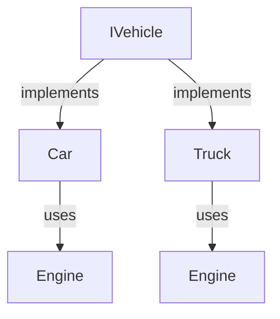
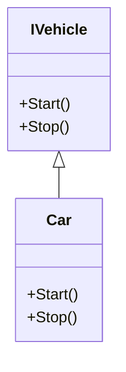
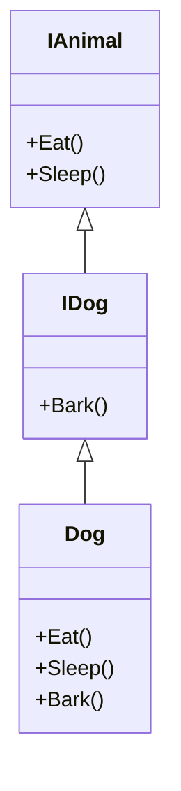
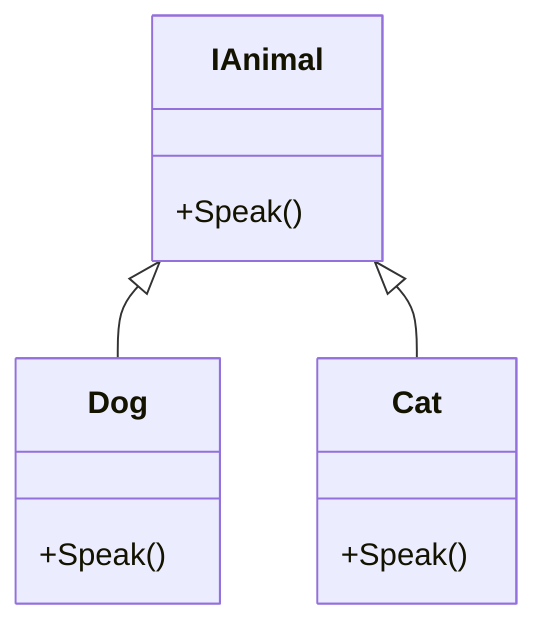
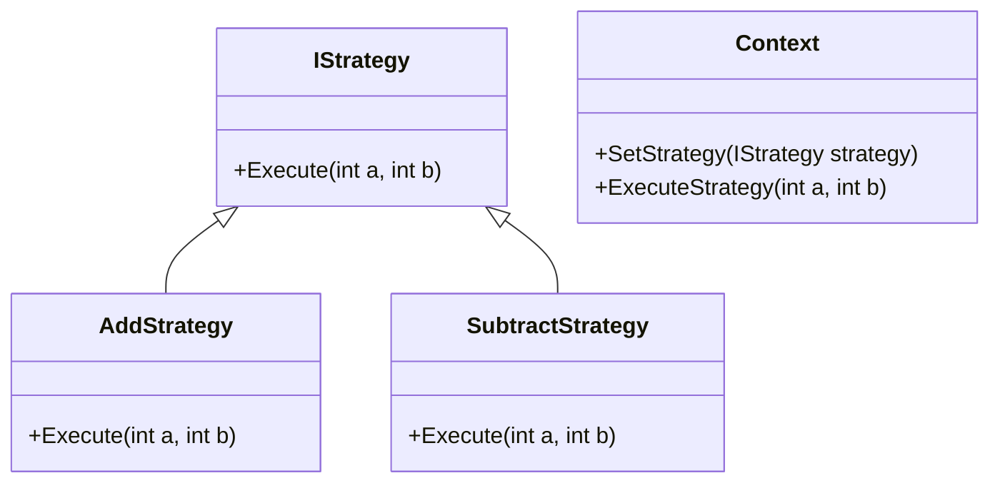
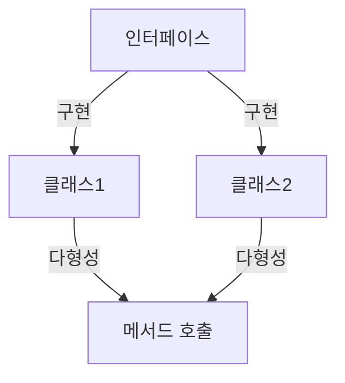
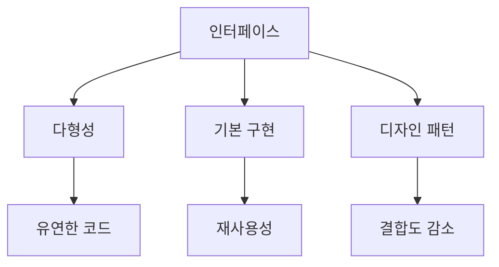

인터페이스는 여러 형식에 대한 동작을 정의하는 중요한 개념이다. C#에서 인터페이스는 비추상 클래스나 구조체가 구현해야 하는 기능의 집합을 정의하며, 이를 통해 다양한 소스의 동작을 클래스에 포함할 수 있다. 인터페이스는 멤버에 대한 기본 구현을 제공할 수 있으며, 이는 C#의 다중 상속을 지원하지 않는 특성으로 인해 더욱 중요하다. 예를 들어, `IEquatable<T>` 인터페이스는 두 객체가 동일한지를 비교하는 `Equals` 메서드를 정의하고, 이를 구현하는 클래스는 해당 메서드를 반드시 구현해야 한다. 인터페이스는 인스턴스 메서드, 속성, 이벤트, 인덱서 등을 포함할 수 있으며, C# 11부터는 정적 멤버도 정의할 수 있다. 인터페이스는 직접 인스턴스화할 수 없으며, 이를 구현하는 클래스나 구조체가 해당 멤버를 구현해야 한다. 또한, 클래스는 여러 인터페이스를 구현할 수 있지만, 단일 클래스에서만 상속할 수 있다. 이러한 특성 덕분에 인터페이스는 코드의 재사용성과 유지보수성을 높이는 데 기여하며, 소프트웨어 설계에서 중요한 역할을 한다. 인터페이스를 통해 개발자는 명확한 계약을 정의하고, 이를 통해 다양한 구현체가 일관된 방식으로 동작하도록 보장할 수 있다.

<!--
##### Outline #####
-->

<!--
# 목차

## 개요
   - 인터페이스의 정의
   - 인터페이스의 중요성
   - C#에서의 인터페이스 사용 이유

## 인터페이스의 기본 개념
   - 인터페이스와 클래스의 차이
   - 인터페이스의 구성 요소
     - 메서드
     - 속성
     - 이벤트
     - 인덱서
   - 접근성 한정자

## 인터페이스 정의 및 구현
   - 인터페이스 정의 방법
   - 인터페이스 구현 예제
     - `IEquatable<T>` 인터페이스 예제
     - `Car` 클래스의 구현
   - 명시적 인터페이스 구현

## 인터페이스의 상속
   - 인터페이스 상속의 개념
   - 파생 인터페이스의 구현
   - 기본 클래스와 인터페이스의 관계

## 기본 구현
   - C# 8.0 이전과 이후의 차이
   - 기본 구현의 정의 및 사용
   - 기본 구현을 사용하는 클래스의 예

## 인터페이스와 다형성
   - 다형성의 개념
   - 인터페이스를 통한 다형성 구현
   - 가상 멤버와 인터페이스의 관계

## 예제
   - 다양한 인터페이스 구현 예제
   - 인터페이스를 활용한 디자인 패턴 예제

## FAQ
   - 인터페이스와 추상 클래스의 차이는 무엇인가요?
   - 인터페이스는 어떻게 인스턴스화할 수 있나요?
   - 인터페이스에서 필드를 선언할 수 있나요?
   - C#에서 인터페이스를 사용할 때의 장점은 무엇인가요?

## 관련 기술
   - C#의 객체 지향 프로그래밍
   - SOLID 원칙과 인터페이스
   - 디자인 패턴에서의 인터페이스 활용

## 결론
   - 인터페이스의 중요성 요약
   - C# 프로그래밍에서의 인터페이스 활용 방안
   - 향후 인터페이스의 발전 방향

## 참고 자료
   - 공식 문서 링크
   - 관련 서적 및 온라인 강의 추천
-->

<!--
## 개요
   - 인터페이스의 정의
   - 인터페이스의 중요성
   - C#에서의 인터페이스 사용 이유
-->

## 개요

### 인터페이스의 정의

인터페이스(Interface)는 C#에서 클래스가 구현해야 하는 메서드, 속성, 이벤트 등을 정의하는 계약이다. 인터페이스는 객체 지향 프로그래밍에서 다형성을 지원하며, 서로 다른 클래스들이 동일한 메서드 시그니처를 가지도록 강제할 수 있다. 인터페이스는 구현을 포함하지 않으며, 오직 메서드의 시그니처만을 정의한다.

### 인터페이스의 중요성

인터페이스는 여러 가지 이유로 중요하다. 첫째, 코드의 재사용성을 높인다. 인터페이스를 사용하면 다양한 클래스가 동일한 인터페이스를 구현할 수 있어, 코드의 일관성을 유지할 수 있다. 둘째, 다형성을 제공하여, 클라이언트 코드가 특정 클래스에 의존하지 않고 인터페이스에 의존하도록 할 수 있다. 이는 코드의 유연성을 증가시키고, 유지보수를 용이하게 한다. 셋째, 테스트 용이성을 높인다. 인터페이스를 사용하면 Mock 객체를 쉽게 생성할 수 있어, 단위 테스트를 수행할 때 유용하다.

### C#에서의 인터페이스 사용 이유

C#에서 인터페이스를 사용하는 이유는 다음과 같다. 첫째, C#은 다중 상속을 지원하지 않지만, 인터페이스를 통해 다중 구현을 가능하게 한다. 둘째, 인터페이스는 코드의 명확성을 높인다. 인터페이스를 통해 클래스의 기능을 명확하게 정의할 수 있어, 다른 개발자들이 코드를 이해하기 쉽게 만든다. 셋째, SOLID 원칙 중 하나인 '인터페이스 분리 원칙(Interface Segregation Principle)'을 준수할 수 있다. 이는 클라이언트가 사용하지 않는 메서드에 의존하지 않도록 인터페이스를 작게 나누는 것을 의미한다.

```csharp
// 인터페이스 정의
public interface IVehicle
{
    void Start();
    void Stop();
}

// 인터페이스 구현
public class Car : IVehicle
{
    public void Start()
    {
        Console.WriteLine("Car started.");
    }

    public void Stop()
    {
        Console.WriteLine("Car stopped.");
    }
}
```



위의 다이어그램은 `IVehicle` 인터페이스를 구현하는 `Car`와 `Truck` 클래스를 보여준다. 두 클래스는 동일한 인터페이스를 구현하여, 클라이언트 코드에서 다형성을 활용할 수 있도록 한다.

<!--
## 인터페이스의 기본 개념
   - 인터페이스와 클래스의 차이
   - 인터페이스의 구성 요소
     - 메서드
     - 속성
     - 이벤트
     - 인덱서
   - 접근성 한정자
-->

## 인터페이스의 기본 개념

인터페이스는 객체 지향 프로그래밍에서 중요한 개념으로, 클래스가 구현해야 하는 메서드와 속성의 집합을 정의하는 계약이다. 인터페이스는 클래스와는 다르게 인스턴스를 생성할 수 없으며, 오직 구현을 통해서만 사용될 수 있다. 이번 섹션에서는 인터페이스와 클래스의 차이, 인터페이스의 구성 요소, 그리고 접근성 한정자에 대해 살펴보겠다.

### 인터페이스와 클래스의 차이

인터페이스와 클래스는 여러 면에서 다르다. 클래스는 객체의 상태와 행동을 정의하는 반면, 인터페이스는 행동만을 정의한다. 클래스는 인스턴스를 생성할 수 있지만, 인터페이스는 인스턴스를 생성할 수 없다. 또한, 클래스는 구현을 포함할 수 있지만, 인터페이스는 메서드의 시그니처만을 포함하고 구현은 포함하지 않는다. 이러한 차이로 인해 인터페이스는 다형성을 제공하고, 여러 클래스가 동일한 인터페이스를 구현함으로써 일관된 방식으로 상호작용할 수 있게 한다.

```csharp
public interface IAnimal
{
    void Speak();
}

public class Dog : IAnimal
{
    public void Speak()
    {
        Console.WriteLine("Woof!");
    }
}

public class Cat : IAnimal
{
    public void Speak()
    {
        Console.WriteLine("Meow!");
    }
}
```

### 인터페이스의 구성 요소

인터페이스는 여러 구성 요소로 이루어져 있으며, 주요 구성 요소는 다음과 같다.

**메서드**

인터페이스에서 메서드는 구현 없이 선언만 되어 있다. 클래스가 인터페이스를 구현할 때, 이 메서드를 반드시 구현해야 한다.

**속성**

인터페이스는 속성을 정의할 수 있으며, 속성의 getter와 setter를 포함할 수 있다. 속성은 클래스에서 구현될 때, 해당 속성의 값을 읽거나 쓸 수 있는 방법을 제공한다.

**이벤트**

인터페이스는 이벤트를 정의할 수 있으며, 이를 통해 클래스가 특정 이벤트를 발생시키고 구독할 수 있도록 한다.

**인덱서**

인덱서는 인터페이스에서 정의할 수 있는 또 다른 구성 요소로, 배열처럼 객체에 접근할 수 있는 방법을 제공한다.

```csharp
public interface IShape
{
    double Area { get; }
    void Draw();
}

public class Circle : IShape
{
    public double Radius { get; set; }
    
    public double Area => Math.PI * Radius * Radius;

    public void Draw()
    {
        Console.WriteLine("Drawing a Circle");
    }
}
```

### 접근성 한정자

인터페이스의 구성 요소는 기본적으로 public 접근성 한정자를 가진다. 이는 인터페이스를 구현하는 클래스가 해당 메서드와 속성을 외부에서 접근할 수 있도록 하기 위함이다. C#에서는 인터페이스의 구성 요소에 다른 접근성 한정자를 사용할 수 없으며, 모든 구성 요소는 public으로 선언되어야 한다.

```csharp
public interface IExample
{
    void Method(); // public 접근성
}
```

이와 같이 인터페이스는 객체 지향 프로그래밍에서 중요한 역할을 하며, 클래스 간의 일관된 상호작용을 가능하게 한다. 인터페이스를 통해 다양한 클래스가 동일한 메서드와 속성을 구현함으로써, 코드의 재사용성과 유지보수성을 높일 수 있다.

<!--
## 인터페이스 정의 및 구현
   - 인터페이스 정의 방법
   - 인터페이스 구현 예제
     - `IEquatable<T>` 인터페이스 예제
     - `Car` 클래스의 구현
   - 명시적 인터페이스 구현
-->

## 인터페이스 정의 및 구현

### 인터페이스 정의 방법

인터페이스는 C#에서 클래스가 구현해야 하는 메서드, 속성, 이벤트 등을 정의하는 계약이다. 인터페이스는 `interface` 키워드를 사용하여 정의하며, 다음과 같은 형식을 따른다.

```csharp
public interface IExample
{
    void MethodA();
    int PropertyB { get; set; }
}
```

위의 예제에서 `IExample` 인터페이스는 `MethodA`라는 메서드와 `PropertyB`라는 속성을 정의하고 있다. 인터페이스는 다중 상속을 지원하므로, 여러 인터페이스를 동시에 구현할 수 있다.

### 인터페이스 구현 예제

#### IEquatable<T> 인터페이스 예제

`IEquatable<T>` 인터페이스는 두 객체가 같은지를 비교하는 메서드를 정의한다. 이 인터페이스를 구현하면, 객체의 동등성을 비교할 수 있는 기능을 제공할 수 있다. 다음은 `IEquatable<T>`를 구현한 예제이다.

```csharp
public class Person : IEquatable<Person>
{
    public string Name { get; set; }
    public int Age { get; set; }

    public bool Equals(Person other)
    {
        if (other == null) return false;
        return this.Name == other.Name && this.Age == other.Age;
    }
}
```

위의 코드에서 `Person` 클래스는 `IEquatable<Person>` 인터페이스를 구현하고 있으며, `Equals` 메서드를 통해 두 `Person` 객체의 동등성을 비교하는 로직을 정의하고 있다.

#### Car 클래스의 구현

다음은 `Car` 클래스를 정의하고, `IVehicle`이라는 인터페이스를 구현하는 예제이다.

```csharp
public interface IVehicle
{
    void Start();
    void Stop();
}

public class Car : IVehicle
{
    public void Start()
    {
        Console.WriteLine("Car is starting.");
    }

    public void Stop()
    {
        Console.WriteLine("Car is stopping.");
    }
}
```

위의 예제에서 `IVehicle` 인터페이스는 `Start`와 `Stop` 메서드를 정의하고 있으며, `Car` 클래스는 이 인터페이스를 구현하여 자동차의 동작을 정의하고 있다.



### 명시적 인터페이스 구현

명시적 인터페이스 구현은 클래스가 인터페이스의 메서드를 구현할 때, 해당 메서드를 클래스의 공용(public) 멤버로 노출하지 않고, 인터페이스 타입으로만 접근할 수 있도록 하는 방법이다. 다음은 명시적 인터페이스 구현의 예제이다.

```csharp
public interface IAnimal
{
    void Speak();
}

public class Dog : IAnimal
{
    void IAnimal.Speak()
    {
        Console.WriteLine("Woof!");
    }
}
```

위의 코드에서 `Dog` 클래스는 `IAnimal` 인터페이스를 명시적으로 구현하고 있으며, `Speak` 메서드는 `IAnimal` 타입으로만 호출할 수 있다. 이를 통해 클래스의 공용 인터페이스와 내부 구현을 분리할 수 있다. 

이와 같이 인터페이스를 정의하고 구현하는 방법은 C# 프로그래밍에서 중요한 개념이며, 코드의 재사용성과 유지보수성을 높이는 데 기여한다.

<!--
## 인터페이스의 상속
   - 인터페이스 상속의 개념
   - 파생 인터페이스의 구현
   - 기본 클래스와 인터페이스의 관계
-->

## 인터페이스의 상속

인터페이스 상속은 객체 지향 프로그래밍에서 중요한 개념 중 하나이다. 인터페이스는 다른 인터페이스로부터 상속받을 수 있으며, 이를 통해 코드의 재사용성과 유연성을 높일 수 있다. 인터페이스 상속을 통해 여러 인터페이스를 조합하여 새로운 인터페이스를 정의할 수 있으며, 이는 다형성을 더욱 강화하는 데 기여한다.

**인터페이스 상속의 개념**

인터페이스 상속은 하나의 인터페이스가 다른 인터페이스를 상속받는 것을 의미한다. 상속받은 인터페이스는 부모 인터페이스의 모든 멤버를 포함하며, 추가적인 멤버를 정의할 수 있다. 이를 통해 인터페이스 간의 관계를 명확히 하고, 코드의 일관성을 유지할 수 있다.

예를 들어, `IAnimal`이라는 기본 인터페이스가 있다고 가정하자. 이 인터페이스는 `Eat()`과 `Sleep()` 메서드를 정의하고 있다. `IAnimal` 인터페이스를 상속받는 `IDog` 인터페이스는 `Bark()` 메서드를 추가로 정의할 수 있다.

```csharp
public interface IAnimal
{
    void Eat();
    void Sleep();
}

public interface IDog : IAnimal
{
    void Bark();
}
```

**파생 인터페이스의 구현**

파생 인터페이스는 부모 인터페이스의 모든 멤버를 구현해야 한다. 이를 통해 파생 인터페이스를 사용하는 클래스는 부모 인터페이스의 기능을 모두 사용할 수 있으며, 추가적인 기능도 구현할 수 있다. 다음은 `IDog` 인터페이스를 구현하는 `Dog` 클래스의 예이다.

```csharp
public class Dog : IDog
{
    public void Eat()
    {
        Console.WriteLine("Dog is eating.");
    }

    public void Sleep()
    {
        Console.WriteLine("Dog is sleeping.");
    }

    public void Bark()
    {
        Console.WriteLine("Dog is barking.");
    }
}
```

**기본 클래스와 인터페이스의 관계**

기본 클래스는 인터페이스를 구현할 수 있으며, 인터페이스는 기본 클래스의 기능을 확장하는 데 사용될 수 있다. 기본 클래스는 인터페이스의 모든 멤버를 구현해야 하며, 이를 통해 인터페이스의 계약을 준수하게 된다. 기본 클래스는 또한 다른 기본 클래스를 상속받을 수 있지만, 인터페이스는 다중 상속이 가능하다는 점에서 차이가 있다.

다음은 기본 클래스와 인터페이스 간의 관계를 나타내는 다이어그램이다.



이와 같이 인터페이스의 상속은 코드의 재사용성을 높이고, 다양한 기능을 조합하여 유연한 설계를 가능하게 한다. 인터페이스를 통해 다형성을 구현하고, 기본 클래스와의 관계를 명확히 함으로써 객체 지향 프로그래밍의 장점을 극대화할 수 있다.

<!--
## 기본 구현
   - C# 8.0 이전과 이후의 차이
   - 기본 구현의 정의 및 사용
   - 기본 구현을 사용하는 클래스의 예
-->

## 기본 구현

### C# 8.0 이전과 이후의 차이

C# 8.0 이전에는 인터페이스에서 메서드의 기본 구현을 제공할 수 없었다. 즉, 인터페이스는 메서드의 시그니처만 정의할 수 있었고, 이를 구현하는 클래스는 반드시 해당 메서드를 구현해야 했다. 그러나 C# 8.0부터는 인터페이스 내에서 기본 구현을 제공할 수 있는 기능이 추가되었다. 이를 통해 인터페이스를 구현하는 클래스는 기본 구현을 그대로 사용할 수 있으며, 필요에 따라 이를 오버라이드할 수 있다.

### 기본 구현의 정의 및 사용

기본 구현은 인터페이스 내에서 메서드의 기본 동작을 정의하는 기능이다. 이를 통해 인터페이스를 구현하는 클래스는 기본 동작을 재사용할 수 있으며, 코드 중복을 줄일 수 있다. 기본 구현은 다음과 같이 정의할 수 있다.

```csharp
public interface IAnimal
{
    void Speak()
    {
        Console.WriteLine("Animal speaks");
    }
}

public class Dog : IAnimal
{
    public void Speak()
    {
        Console.WriteLine("Bark");
    }
}

public class Cat : IAnimal
{
    // 기본 구현을 사용
}
```

위의 예제에서 `IAnimal` 인터페이스는 `Speak` 메서드의 기본 구현을 제공한다. `Dog` 클래스는 이 메서드를 오버라이드하여 "Bark"를 출력하고, `Cat` 클래스는 기본 구현을 그대로 사용하여 "Animal speaks"를 출력한다.

### 기본 구현을 사용하는 클래스의 예

기본 구현을 사용하는 클래스의 예를 통해 이 기능의 유용성을 살펴보자. 다음은 기본 구현을 활용한 예제이다.

```csharp
public interface IShape
{
    double Area()
    {
        return 0; // 기본 구현
    }
}

public class Circle : IShape
{
    public double Radius { get; set; }

    public Circle(double radius)
    {
        Radius = radius;
    }

    public double Area()
    {
        return Math.PI * Radius * Radius; // 오버라이드
    }
}

public class Square : IShape
{
    public double Side { get; set; }

    public Square(double side)
    {
        Side = side;
    }

    // 기본 구현을 사용
}
```

위의 예제에서 `IShape` 인터페이스는 `Area` 메서드의 기본 구현을 제공한다. `Circle` 클래스는 이 메서드를 오버라이드하여 원의 면적을 계산하고, `Square` 클래스는 기본 구현을 그대로 사용한다. 이러한 방식으로 기본 구현을 활용하면 코드의 일관성을 유지하면서도 유연성을 높일 수 있다.

```mermaid
graph TD;
    A[IShape] -->|implements| B[Circle]
    A -->|implements| C[Square]
    B -->|overrides| D[Area()]
    C -->|uses| E[Area() = 0]
```

위의 다이어그램은 `IShape` 인터페이스와 이를 구현하는 `Circle` 및 `Square` 클래스를 나타낸다. `Circle` 클래스는 `Area` 메서드를 오버라이드하고, `Square` 클래스는 기본 구현을 사용한다. 이러한 구조는 기본 구현의 유용성을 잘 보여준다.

<!--
## 인터페이스와 다형성
   - 다형성의 개념
   - 인터페이스를 통한 다형성 구현
   - 가상 멤버와 인터페이스의 관계
-->

## 인터페이스와 다형성

다형성(Polymorphism)은 객체 지향 프로그래밍의 핵심 개념 중 하나로, 동일한 인터페이스를 통해 서로 다른 객체를 다룰 수 있는 능력을 의미한다. 이는 코드의 유연성과 재사용성을 높여주며, 다양한 객체를 동일한 방식으로 처리할 수 있게 해준다. C#에서 인터페이스는 다형성을 구현하는 중요한 수단으로 사용된다.

### **다형성의 개념**

다형성은 크게 두 가지 형태로 나눌 수 있다. 첫 번째는 컴파일 타임 다형성(Compile-time Polymorphism)으로, 메서드 오버로딩(Method Overloading)과 연관된다. 두 번째는 런타임 다형성(Run-time Polymorphism)으로, 주로 메서드 오버라이딩(Method Overriding)과 관련이 있다. 인터페이스는 런타임 다형성을 구현하는 데 매우 유용하다. 

### **인터페이스를 통한 다형성 구현**

인터페이스를 사용하면 서로 다른 클래스들이 동일한 메서드를 구현할 수 있다. 이를 통해 클라이언트 코드는 인터페이스 타입으로 객체를 다루게 되며, 실제 객체의 타입에 관계없이 동일한 방식으로 메서드를 호출할 수 있다. 다음은 인터페이스를 통한 다형성 구현의 예제이다.

```csharp
public interface IAnimal
{
    void Speak();
}

public class Dog : IAnimal
{
    public void Speak()
    {
        Console.WriteLine("Woof!");
    }
}

public class Cat : IAnimal
{
    public void Speak()
    {
        Console.WriteLine("Meow!");
    }
}

public class Program
{
    public static void Main(string[] args)
    {
        IAnimal myDog = new Dog();
        IAnimal myCat = new Cat();

        myDog.Speak(); // 출력: Woof!
        myCat.Speak(); // 출력: Meow!
    }
}
```

위의 예제에서 `IAnimal` 인터페이스를 구현한 `Dog`와 `Cat` 클래스는 각각의 방식으로 `Speak` 메서드를 구현하고 있다. 클라이언트 코드는 `IAnimal` 타입으로 객체를 다루기 때문에, 실제 객체의 타입에 관계없이 동일한 메서드를 호출할 수 있다.

### **가상 멤버와 인터페이스의 관계**

가상 멤버(Virtual Member)는 기본 클래스에서 정의된 메서드로, 파생 클래스에서 오버라이드할 수 있는 메서드를 의미한다. 인터페이스는 기본적으로 모든 멤버가 추상적이며, 구현을 강제한다. 따라서 인터페이스를 통해 다형성을 구현할 때는 가상 멤버의 개념이 필요하지 않다. 인터페이스를 구현한 클래스는 반드시 해당 메서드를 구현해야 하므로, 다형성을 보장할 수 있다.

다음은 가상 멤버와 인터페이스의 관계를 설명하는 다이어그램이다.



위의 다이어그램에서 `IAnimal` 인터페이스는 `Dog`와 `Cat` 클래스에 의해 구현되고 있다. 각 클래스는 `Speak` 메서드를 자신만의 방식으로 구현하여 다형성을 제공한다. 

이와 같이 인터페이스는 다형성을 구현하는 데 있어 중요한 역할을 하며, 코드의 유연성과 확장성을 높이는 데 기여한다.

<!--
## 예제
   - 다양한 인터페이스 구현 예제
   - 인터페이스를 활용한 디자인 패턴 예제
-->

## 예제

### 다양한 인터페이스 구현 예제

인터페이스는 C#에서 객체 간의 계약을 정의하는 중요한 요소이다. 다양한 인터페이스를 구현함으로써 코드의 재사용성과 유지보수성을 높일 수 있다. 아래는 간단한 인터페이스와 이를 구현한 클래스의 예제이다.

```csharp
public interface IAnimal
{
    void Speak();
}

public class Dog : IAnimal
{
    public void Speak()
    {
        Console.WriteLine("Woof!");
    }
}

public class Cat : IAnimal
{
    public void Speak()
    {
        Console.WriteLine("Meow!");
    }
}
```

위의 예제에서 `IAnimal` 인터페이스는 `Speak` 메서드를 정의하고 있다. `Dog`와 `Cat` 클래스는 이 인터페이스를 구현하여 각각의 동물 소리를 출력하도록 한다. 이러한 방식으로 인터페이스를 활용하면 다양한 동물 클래스가 동일한 계약을 따르도록 할 수 있다.


### 인터페이스를 활용한 디자인 패턴 예제

인터페이스는 디자인 패턴에서도 중요한 역할을 한다. 특히, 전략 패턴(Strategy Pattern)에서 인터페이스를 사용하여 알고리즘을 캡슐화하고 클라이언트 코드와의 결합도를 낮출 수 있다. 아래는 전략 패턴을 구현한 예제이다.

```csharp
public interface IStrategy
{
    int Execute(int a, int b);
}

public class AddStrategy : IStrategy
{
    public int Execute(int a, int b)
    {
        return a + b;
    }
}

public class SubtractStrategy : IStrategy
{
    public int Execute(int a, int b)
    {
        return a - b;
    }
}

public class Context
{
    private IStrategy _strategy;

    public void SetStrategy(IStrategy strategy)
    {
        _strategy = strategy;
    }

    public int ExecuteStrategy(int a, int b)
    {
        return _strategy.Execute(a, b);
    }
}
```

위의 예제에서 `IStrategy` 인터페이스는 다양한 전략을 정의하고, `AddStrategy`와 `SubtractStrategy` 클래스는 이 인터페이스를 구현하여 각각 덧셈과 뺄셈을 수행한다. `Context` 클래스는 현재 전략을 설정하고 실행하는 역할을 한다.



이와 같이 인터페이스를 활용한 다양한 구현 예제와 디자인 패턴을 통해 C# 프로그래밍에서의 인터페이스의 중요성을 이해할 수 있다. 인터페이스는 코드의 유연성과 확장성을 높이는 데 기여하는 중요한 요소이다.

<!--
## FAQ
   - 인터페이스와 추상 클래스의 차이는 무엇인가요?
   - 인터페이스는 어떻게 인스턴스화할 수 있나요?
   - 인터페이스에서 필드를 선언할 수 있나요?
   - C#에서 인터페이스를 사용할 때의 장점은 무엇인가요?
-->

## FAQ

### 인터페이스와 추상 클래스의 차이는 무엇인가요?

인터페이스(Interface)와 추상 클래스(Abstract Class)는 모두 객체 지향 프로그래밍에서 다형성을 지원하는 중요한 개념이다. 그러나 이 둘은 몇 가지 중요한 차이점이 있다.

**인터페이스**는 메서드, 속성, 이벤트 등을 정의하지만, 구현을 포함하지 않는다. 즉, 인터페이스는 계약(Contract)으로서, 이를 구현하는 클래스는 반드시 인터페이스에 정의된 모든 멤버를 구현해야 한다. 

반면, **추상 클래스**는 일부 메서드에 대한 구현을 제공할 수 있으며, 다른 메서드는 추상 메서드로 남겨둘 수 있다. 추상 클래스는 상태(필드)를 가질 수 있으며, 이를 통해 공통적인 기능을 여러 클래스에서 재사용할 수 있다.

```csharp
// 인터페이스 예제
public interface IAnimal
{
    void Speak();
}

// 추상 클래스 예제
public abstract class Animal
{
    public abstract void Speak();
    public void Sleep()
    {
        Console.WriteLine("Sleeping...");
    }
}
```

### 인터페이스는 어떻게 인스턴스화할 수 있나요?

인터페이스는 직접적으로 인스턴스화할 수 없다. 인터페이스는 구현을 제공하지 않기 때문에, 이를 구현한 클래스를 통해 인스턴스를 생성해야 한다. 

예를 들어, `IAnimal` 인터페이스를 구현한 `Dog` 클래스를 정의하고, 이를 통해 인스턴스를 생성할 수 있다.

```csharp
public class Dog : IAnimal
{
    public void Speak()
    {
        Console.WriteLine("Woof!");
    }
}

// 사용 예
IAnimal myDog = new Dog();
myDog.Speak(); // 출력: Woof!
```

### 인터페이스에서 필드를 선언할 수 있나요?

인터페이스에서는 필드를 선언할 수 없다. 인터페이스는 메서드, 속성, 이벤트, 인덱서와 같은 멤버만을 정의할 수 있으며, 상태를 저장하는 필드는 포함할 수 없다. 

대신, 인터페이스에서 속성을 정의하여 상태를 관리할 수 있다. 예를 들어, 다음과 같이 속성을 정의할 수 있다.

```csharp
public interface ICar
{
    string Model { get; set; }
    void Drive();
}
```

### C#에서 인터페이스를 사용할 때의 장점은 무엇인가요?

C#에서 인터페이스를 사용하는 장점은 다음과 같다.

1. **다형성**: 인터페이스를 통해 다양한 클래스가 동일한 메서드를 구현할 수 있어, 코드의 유연성을 높인다.
2. **유지보수성**: 인터페이스를 사용하면 코드의 변경이 용이해지며, 구현체를 변경하더라도 인터페이스를 사용하는 코드는 영향을 받지 않는다.
3. **테스트 용이성**: 인터페이스를 사용하면 Mock 객체를 쉽게 생성할 수 있어, 단위 테스트를 수행하기 용이하다.
4. **SOLID 원칙 준수**: 인터페이스는 SOLID 원칙 중 하나인 '인터페이스 분리 원칙(Interface Segregation Principle)'을 준수하는 데 도움을 준다.



위의 다이어그램은 인터페이스가 여러 클래스에 의해 구현되고, 이를 통해 다형성을 제공하는 구조를 나타낸다.

<!--
## 관련 기술
   - C#의 객체 지향 프로그래밍
   - SOLID 원칙과 인터페이스
   - 디자인 패턴에서의 인터페이스 활용
-->

## 관련 기술

### C#의 객체 지향 프로그래밍

C#은 객체 지향 프로그래밍(Object-Oriented Programming, OOP) 언어로, 클래스와 객체를 기반으로 한 프로그래밍 패러다임을 지원한다. 객체 지향 프로그래밍의 주요 개념은 캡슐화(encapsulation), 상속(inheritance), 다형성(polymorphism)이다. 이러한 개념들은 C#에서 인터페이스와 함께 사용되어 코드의 재사용성과 유지보수성을 높인다.

객체 지향 프로그래밍에서 인터페이스는 클래스가 구현해야 하는 계약을 정의하며, 이를 통해 다양한 클래스가 동일한 메서드 집합을 제공할 수 있도록 한다. 예를 들어, 여러 종류의 동물 클래스가 `IAnimal` 인터페이스를 구현하여 `Speak` 메서드를 정의할 수 있다.

```csharp
public interface IAnimal
{
    void Speak();
}

public class Dog : IAnimal
{
    public void Speak()
    {
        Console.WriteLine("Woof!");
    }
}

public class Cat : IAnimal
{
    public void Speak()
    {
        Console.WriteLine("Meow!");
    }
}
```

### SOLID 원칙과 인터페이스

SOLID 원칙은 객체 지향 프로그래밍에서 소프트웨어 설계를 개선하기 위한 다섯 가지 원칙을 의미한다. 이 원칙들은 다음과 같다:

1. **단일 책임 원칙(SRP)**: 클래스는 하나의 책임만 가져야 한다.
2. **개방-폐쇄 원칙(OCP)**: 소프트웨어 개체는 확장에 대해 열려 있어야 하고, 수정에 대해서는 닫혀 있어야 한다.
3. **리스코프 치환 원칙(LSP)**: 서브타입은 언제나 자신의 기반 타입으로 교체할 수 있어야 한다.
4. **인터페이스 분리 원칙(ISP)**: 클라이언트는 자신이 사용하지 않는 인터페이스에 의존하지 않아야 한다.
5. **의존성 역전 원칙(DIP)**: 고수준 모듈은 저수준 모듈에 의존해서는 안 되며, 둘 다 추상화에 의존해야 한다.

인터페이스는 SOLID 원칙 중 특히 ISP와 OCP를 구현하는 데 중요한 역할을 한다. 인터페이스를 사용하면 클라이언트가 필요로 하는 메서드만 포함된 인터페이스를 정의할 수 있으며, 이는 코드의 유연성과 확장성을 높인다.

```csharp
public interface IShape
{
    double Area();
}

public class Circle : IShape
{
    public double Radius { get; set; }

    public double Area()
    {
        return Math.PI * Radius * Radius;
    }
}

public class Rectangle : IShape
{
    public double Width { get; set; }
    public double Height { get; set; }

    public double Area()
    {
        return Width * Height;
    }
}
```

### 디자인 패턴에서의 인터페이스 활용

디자인 패턴은 소프트웨어 설계에서 자주 발생하는 문제를 해결하기 위한 일반적인 솔루션이다. 인터페이스는 다양한 디자인 패턴에서 중요한 역할을 하며, 특히 전략 패턴(Strategy Pattern), 팩토리 패턴(Factory Pattern), 옵저버 패턴(Observer Pattern) 등에서 자주 사용된다.

예를 들어, 전략 패턴에서는 인터페이스를 통해 다양한 알고리즘을 정의하고, 클라이언트는 이 알고리즘을 런타임에 선택할 수 있다. 이를 통해 코드의 유연성을 높이고, 알고리즘을 쉽게 교체할 수 있다.

```csharp
public interface ISortingStrategy
{
    void Sort(List<int> list);
}

public class BubbleSort : ISortingStrategy
{
    public void Sort(List<int> list)
    {
        // Bubble sort implementation
    }
}

public class QuickSort : ISortingStrategy
{
    public void Sort(List<int> list)
    {
        // Quick sort implementation
    }
}

public class Sorter
{
    private ISortingStrategy _strategy;

    public Sorter(ISortingStrategy strategy)
    {
        _strategy = strategy;
    }

    public void Sort(List<int> list)
    {
        _strategy.Sort(list);
    }
}
```

이와 같이 인터페이스는 다양한 디자인 패턴에서 핵심적인 역할을 하며, 코드의 재사용성과 유지보수성을 높이는 데 기여한다.

<!--
## 결론
   - 인터페이스의 중요성 요약
   - C# 프로그래밍에서의 인터페이스 활용 방안
   - 향후 인터페이스의 발전 방향
-->

## 결론

### 인터페이스의 중요성 요약

인터페이스는 C# 프로그래밍에서 중요한 역할을 한다. 이는 코드의 재사용성을 높이고, 다양한 클래스 간의 일관성을 유지하는 데 기여한다. 인터페이스를 사용함으로써 개발자는 서로 다른 클래스들이 동일한 메서드 시그니처를 갖도록 강제할 수 있으며, 이는 코드의 가독성과 유지보수성을 향상시킨다. 또한, 인터페이스는 다형성을 지원하여, 다양한 객체를 동일한 방식으로 처리할 수 있게 해준다.

### C# 프로그래밍에서의 인터페이스 활용 방안

C#에서 인터페이스를 활용하는 방법은 다양하다. 예를 들어, 디자인 패턴에서 인터페이스를 사용하여 객체 간의 결합도를 낮출 수 있다. 또한, 인터페이스를 통해 의존성 주입(Dependency Injection)을 구현하면, 코드의 유연성과 테스트 용이성을 높일 수 있다. 다음은 인터페이스를 활용한 간단한 예제이다.

```csharp
public interface IAnimal
{
    void Speak();
}

public class Dog : IAnimal
{
    public void Speak()
    {
        Console.WriteLine("Woof!");
    }
}

public class Cat : IAnimal
{
    public void Speak()
    {
        Console.WriteLine("Meow!");
    }
}

public class AnimalSound
{
    public void MakeSound(IAnimal animal)
    {
        animal.Speak();
    }
}
```

위의 예제에서 `IAnimal` 인터페이스는 `Speak` 메서드를 정의하고, `Dog`와 `Cat` 클래스는 이를 구현한다. `AnimalSound` 클래스는 `IAnimal` 타입의 객체를 받아서 해당 객체의 `Speak` 메서드를 호출한다. 이를 통해 다양한 동물 객체를 동일한 방식으로 처리할 수 있다.

### 향후 인터페이스의 발전 방향

향후 인터페이스는 더욱 발전할 것으로 예상된다. C# 8.0에서 도입된 기본 구현( Default Implementations) 기능은 인터페이스의 유연성을 높이는 데 기여하고 있다. 앞으로는 인터페이스가 더 많은 기능을 지원하게 되어, 개발자들이 보다 직관적으로 코드를 작성할 수 있는 환경이 조성될 것이다. 또한, 인터페이스와 관련된 새로운 패턴이나 기술이 등장함에 따라, 객체 지향 프로그래밍의 패러다임이 더욱 확장될 것으로 기대된다.



위의 다이어그램은 인터페이스가 다형성, 기본 구현, 디자인 패턴과 어떻게 연결되는지를 보여준다. 이러한 요소들은 모두 코드의 유연성과 재사용성을 높이는 데 기여한다. 인터페이스는 앞으로도 C# 프로그래밍에서 중요한 역할을 계속할 것이다.

<!--
## 참고 자료
   - 공식 문서 링크
   - 관련 서적 및 온라인 강의 추천
-->

## 참고 자료

### 공식 문서 링크
C#에서 인터페이스에 대한 공식 문서는 Microsoft의 [C# Documentation](https://docs.microsoft.com/en-us/dotnet/csharp/)에서 확인할 수 있다. 이 문서에서는 인터페이스의 정의, 사용법, 예제 등을 상세히 설명하고 있어 C# 프로그래밍에 대한 깊이 있는 이해를 돕는다.

### 관련 서적 및 온라인 강의 추천
- **서적**

  - "C# in Depth" by Jon Skeet: 이 책은 C#의 다양한 기능을 깊이 있게 다루며, 인터페이스에 대한 내용도 포함되어 있다.
  - "Pro C# 9 with .NET 5" by Andrew Troelsen: C#의 최신 버전과 함께 인터페이스의 활용에 대한 실용적인 예제를 제공한다.

- **온라인 강의**

  - Udemy의 "C# Basics for Beginners: Learn C# Fundamentals by Coding": 이 강의는 C#의 기초부터 시작하여 인터페이스와 같은 고급 개념까지 다룬다.
  - Coursera의 "Programming in C#": 이 과정은 C# 프로그래밍의 전반적인 내용을 다루며, 인터페이스에 대한 실습도 포함되어 있다.

### 샘플 코드
아래는 간단한 인터페이스와 이를 구현한 클래스의 예제 코드이다.

```csharp
public interface IAnimal
{
    void Speak();
}

public class Dog : IAnimal
{
    public void Speak()
    {
        Console.WriteLine("Woof!");
    }
}

public class Cat : IAnimal
{
    public void Speak()
    {
        Console.WriteLine("Meow!");
    }
}
```

이 코드는 `IAnimal`이라는 인터페이스를 정의하고, 이를 구현한 `Dog`와 `Cat` 클래스를 보여준다. 각 클래스는 `Speak` 메서드를 통해 자신만의 소리를 출력한다.

### 다이어그램
아래는 인터페이스와 이를 구현한 클래스 간의 관계를 나타내는 다이어그램이다.


이 다이어그램은 `IAnimal` 인터페이스가 `Dog`와 `Cat` 클래스에 의해 구현되는 구조를 시각적으로 나타낸다. 인터페이스는 공통된 메서드를 정의하고, 각 클래스는 이를 구체적으로 구현한다.

<!--
##### Reference #####
-->

## Reference


* [https://learn.microsoft.com/ko-kr/dotnet/csharp/fundamentals/types/interfaces](https://learn.microsoft.com/ko-kr/dotnet/csharp/fundamentals/types/interfaces)


<!--
#  인터페이스 - 여러 형식에 대한 동작 정의

##  이 문서의 내용

인터페이스에는 비추상 클래스 [ ` class ` ](../../language-reference/keywords/class) 또는 [ `
struct ` ](../../language-reference/builtin-types/struct) 이(가) 구현해야 하는 관련 기능
그룹에 대한 정의가 포함되어 있습니다. 인터페이스에서는 구현이 있어야 하는 ` static ` 메서드를 정의할 수 있습니다. 인터페이스는
멤버에 대한 기본 구현을 정의할 수 있습니다. 인터페이스에서는 필드, 자동 구현 속성, 속성과 유사한 이벤트 등과 같은 인스턴스 데이터를
선언할 수 없습니다.

예를 들어 인터페이스를 사용하면 여러 소스의 동작을 클래스에 포함할 수 있습니다. 해당 기능은 언어가 클래스의 여러 상속을 지원하지 않기
때문에 C#에서 중요합니다. 또한 구조체는 다른 구조체나 클래스에서 실제로 상속할 수 없기 때문에 구조체에 대한 상속을 시뮬레이트하려는 경우
인터페이스를 사용해야 합니다.

다음 예제와 같이 [ ` interface ` ](../../language-reference/keywords/interface) 키워드를
사용하여 인터페이스를 정의합니다.

    
    
    interface IEquatable<T>
    {
        bool Equals(T obj);
    }
    

인터페이스 이름은 유효한 C# [ 식별자 이름 ](../coding-style/identifier-names) 이어야 합니다. 규칙에 따라
인터페이스 이름은 대문자 ` I ` 로 시작합니다.

[ IEquatable<T> ](/ko-kr/dotnet/api/system.iequatable-1) 인터페이스를 구현하는 모든 클래스나
구조체에는 인터페이스에서 지정한 서명과 일치하는 [ Equals ](/ko-
kr/dotnet/api/system.iequatable-1.equals) 메서드에 대한 정의가 포함되어 있어야 합니다. 결과적으로 `
IEquatable<T> ` 을(를) 구현하는 ` T ` 유형의 클래스는 이 클래스의 인스턴스가 같은 클래스의 다른 인스턴스와 동일한지
여부를 확인할 수 있는 ` Equals ` 메서드를 포함할 수 있습니다.

` IEquatable<T> ` 의 정의에서는 ` Equals ` 에 대한 구현을 제공하지 않습니다. 클래스 또는 구조체는 여러 인터페이스를
구현할 수 있지만 클래스는 단일 클래스에서만 상속할 수 있습니다.

추상 클래스에 대한 자세한 내용은 [ 추상 및 봉인 클래스와 클래스 멤버 ](../../programming-guide/classes-
and-structs/abstract-and-sealed-classes-and-class-members) 를 참조하세요.

인터페이스에는 인스턴스 메서드, 속성, 이벤트, 인덱서 또는 이러한 네 가지 멤버 형식의 조합이 포함될 수 있습니다. 인터페이스에는 정적
생성자, 필드, 상수 또는 연산자가 포함될 수 있습니다. C# 11부터는 필드가 아닌 인터페이스 멤버는 ` static abstract `
일 수 있습니다. 인터페이스에는 인스턴스 필드, 인스턴스 생성자 또는 종료자가 포함될 수 없습니다. 인터페이스 멤버는 기본적으로 공용이며,
` public ` , ` protected ` , ` internal ` , ` private ` , ` protected internal
` 또는 ` private protected ` 등의 접근성 한정자를 명시적으로 지정할 수 있습니다. ` private ` 멤버에는 기본
구현이 있어야 합니다.

인터페이스 멤버를 구현하려면 구현 클래스의 해당 멤버가 공용이고 비정적이어야 하며 인터페이스 멤버와 동일한 이름 및 서명을 사용해야 합니다.

참고 항목

인터페이스가 정적 멤버를 선언하는 경우 해당 인터페이스를 구현하는 형식은 동일한 서명을 가진 정적 멤버를 선언할 수도 있습니다. 멤버는 이를
선언하는 형식에 의해 구분되고 고유하게 식별됩니다. 형식에서 선언된 정적 멤버는 인터페이스에서 선언된 정적 멤버를 재정의하지 _않습니다_ .

인터페이스를 구현하는 클래스 또는 구조체는 인터페이스에서 제공하는 기본 구현 없이 선언된 모든 멤버에 대한 구현을 제공해야 합니다. 그러나
기본 클래스에서 인터페이스를 구현하는 경우에는 기본 클래스에서 파생되는 모든 클래스가 해당 구현을 상속합니다.

다음 예제에서는 [ IEquatable<T> ](/ko-kr/dotnet/api/system.iequatable-1) 인터페이스의 구현을
보여 줍니다. 구현 클래스 ` Car ` 는 [ Equals ](/ko-
kr/dotnet/api/system.iequatable-1.equals) 메서드의 구현을 제공해야 합니다.

    
    
    public class Car : IEquatable<Car>
    {
        public string? Make { get; set; }
        public string? Model { get; set; }
        public string? Year { get; set; }
    
        // Implementation of IEquatable<T> interface
        public bool Equals(Car? car)
        {
            return (this.Make, this.Model, this.Year) ==
                (car?.Make, car?.Model, car?.Year);
        }
    }
    

클래스의 속성 및 인덱서는 인터페이스에 정의된 속성이나 인덱서에 대해 추가 접근자를 정의할 수 있습니다. 예를 들어 인터페이스는 [ get
](../../language-reference/keywords/get) 접근자가 있는 속성을 선언할 수 있습니다. 인터페이스를 구현하는
클래스는 ` get ` 및 [ set ](../../language-reference/keywords/set) 접근자를 둘 다 사용하는
동일한 속성을 선언할 수 있습니다. 그러나 속성 또는 인덱서에서 명시적 구현을 사용하는 경우에는 접근자가 일치해야 합니다. 명시적 구현에
대한 자세한 내용은 [ 명시적 인터페이스 구현 ](../../programming-guide/interfaces/explicit-
interface-implementation) 및 [ 인터페이스 속성(C# 프로그래밍 가이드) ](../../programming-
guide/classes-and-structs/interface-properties) 을 참조하세요.

인터페이스는 하나 이상의 인터페이스에서 상속할 수 있습니다. 파생 인터페이스는 기본 인터페이스에서 멤버를 상속합니다. 파생 인터페이스를
구현하는 클래스는 파생 인터페이스의 기본 인터페이스 멤버 모두를 포함해 파생 인터페이스의 모든 멤버를 구현해야 합니다. 이 클래스는 파생
인터페이스나 해당하는 기본 인터페이스로 암시적으로 변환될 수 있습니다. 클래스는 상속하는 기본 클래스 또는 다른 인터페이스에서 상속하는
인터페이스를 통해 인터페이스를 여러 번 포함할 수 있습니다. 그러나 클래스는 인터페이스의 구현을 한 번만 제공할 수 있으며 클래스가
인터페이스를 클래스 정의의 일부로 선언하는 경우에만 제공할 수 있습니다( ` class ClassName : InterfaceName `
). 인터페이스를 구현하는 기본 클래스를 상속했기 때문에 인터페이스가 상속되는 경우 기본 클래스는 인터페이스 멤버의 구현을 제공합니다.
그러나 파생 클래스는 상속된 구현을 사용하는 대신 가상 인터페이스 멤버를 다시 구현할 수 있습니다. 인터페이스가 메서드의 기본 구현을
선언하면 해당 인터페이스를 구현하는 모든 클래스가 해당 구현을 상속합니다(인터페이스 멤버의 기본 구현에 액세스하려면 클래스 인스턴스를
인터페이스 형식으로 캐스팅해야 합니다).

또한 기본 클래스는 가상 멤버를 사용하여 인터페이스 멤버를 구현할 수 있습니다. 이 경우 파생 클래스는 가상 멤버를 재정의하여 인터페이스
동작을 변경할 수 있습니다. 가상 멤버에 대한 자세한 내용은 [ 다형성 ](../object-oriented/polymorphism) 을
참조하세요.

##  인터페이스 요약

인터페이스에는 다음과 같은 속성이 있습니다.

  * 8.0 이전 C# 버전에서 인터페이스는 추상 멤버만 있는 추상 기본 클래스와 유사합니다. 인터페이스를 구현하는 클래스 또는 구조체는 해당 멤버를 모두 구현해야 합니다. 
  * C# 8.0부터 인터페이스에서 해당 멤버 일부 또는 모두의 기본 구현을 정의할 수 있습니다. 인터페이스를 구현하는 클래스 또는 구조체는 기본 구현이 있는 멤버를 구현할 필요가 없습니다. 자세한 내용은 [ 기본 인터페이스 메서드 ](../../advanced-topics/interface-implementation/default-interface-methods-versions) 를 참조하세요. 
  * 인터페이스는 직접 인스턴스화할 수 없습니다. 해당 멤버는 인터페이스를 구현하는 클래스 또는 구조체에 의해 구현됩니다. 
  * 클래스 또는 구조체는 여러 인터페이스를 구현할 수 있습니다. 클래스는 기본 클래스를 상속할 수 있으며 하나 이상의 인터페이스를 제공할 수도 있습니다. 


-->

<!--


-->

