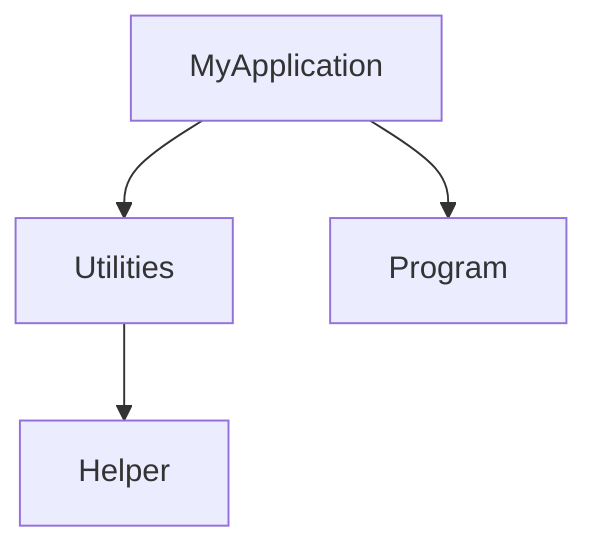
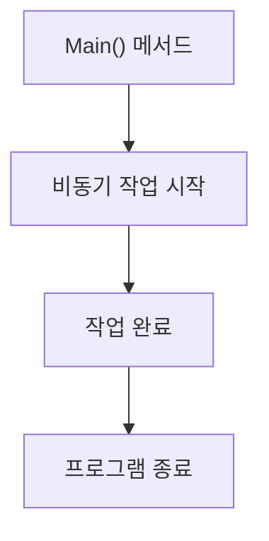
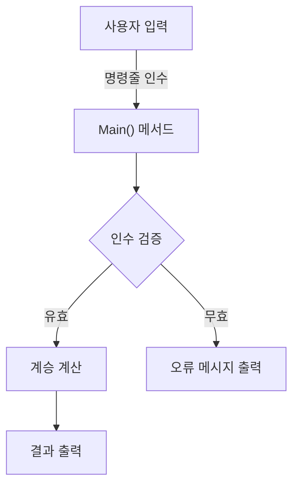
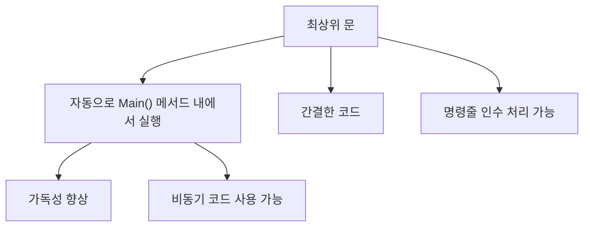
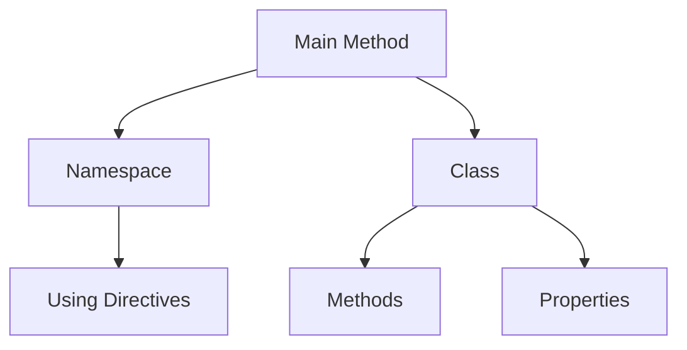
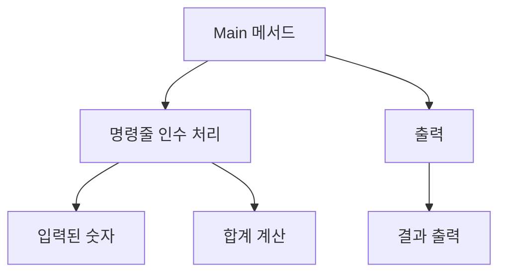
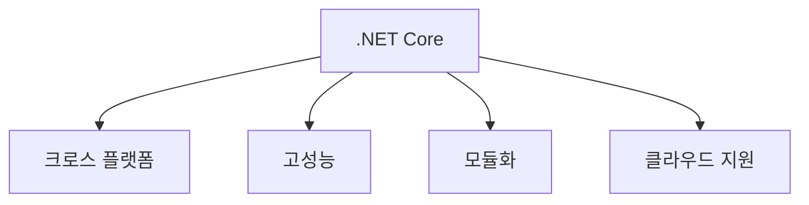
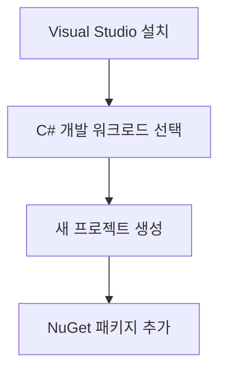
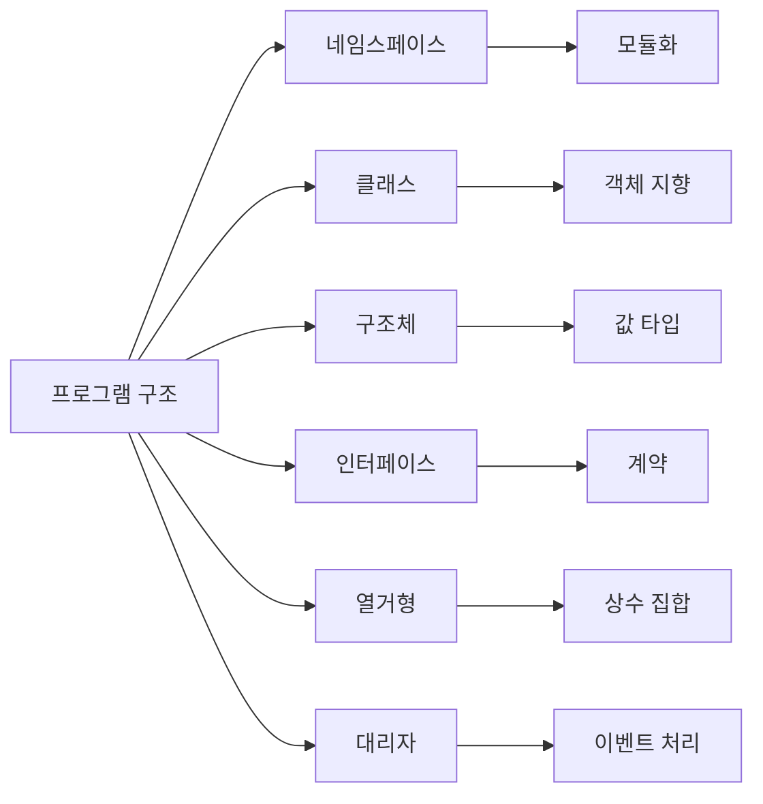

C# 프로그램은 여러 파일로 구성되며, 각 파일은 0개 이상의 네임스페이스를 포함할 수 있다. 네임스페이스는 클래스, 구조체, 인터페이스, 열거형 및 대리자와 같은 형식이나 다른 네임스페이스를 포함할 수 있다. C# 프로그램의 기본 구조는 진입점인 `Main` 메서드를 포함하며, 이 메서드는 프로그램이 시작될 때 호출되는 첫 번째 메서드이다. C#에서는 하나의 진입점만 존재할 수 있으며, 여러 개의 `Main` 메서드가 있을 경우 컴파일러 옵션을 통해 진입점을 지정해야 한다. `Main` 메서드는 다양한 형태로 선언될 수 있으며, 명령줄 인수를 받을 수 있는 기능도 제공한다. 또한, C# 10부터는 최상위 문을 사용하여 `Main` 메서드를 명시적으로 포함하지 않고도 프로그램을 작성할 수 있는 기능이 추가되었다. 이러한 구조는 개발자가 코드를 더 간결하게 작성할 수 있도록 도와주며, 특히 초보자에게 유용하다. C#의 다양한 기능과 문법을 이해하고 활용하는 것은 소프트웨어 개발에 있어 중요한 요소이다.

<!--
##### Outline #####
-->

<!--
# C# 프로그램의 일반적인 구조체

## 개요
- C# 프로그램의 기본 구조
- 네임스페이스, 클래스, 구조체, 인터페이스, 열거형, 대리자 개념 소개

## C# 프로그램의 기본 요소
- 네임스페이스 (Namespace)
- 클래스 (Class)
- 구조체 (Struct)
- 인터페이스 (Interface)
- 열거형 (Enum)
- 대리자 (Delegate)
- 중첩 네임스페이스 (Nested Namespace)

## Main() 메서드
- Main() 메서드의 역할과 중요성
- Main() 메서드의 다양한 선언 방법
- Main() 메서드의 반환 값
- 비동기 Main() 메서드의 사용법

## 명령줄 인수 처리
- 명령줄 인수의 개념
- Main() 메서드에서 명령줄 인수 사용하기
- 명령줄 인수의 변환 및 검증
- 예제: 명령줄 인수를 통한 계승 계산

## 최상위 문 (Top-level Statements)
- 최상위 문 개념 소개
- 최상위 문 사용 시 장점
- 최상위 문의 제한 사항
- 최상위 문에서의 명령줄 인수 처리

## C# 언어 사양
- C# 언어 사양의 중요성
- C# 구문 및 사용법에 대한 신뢰할 수 있는 출처

## 예제
- C# 프로그램의 기본 예제
- Main() 메서드와 명령줄 인수를 사용하는 예제
- 최상위 문을 사용하는 간단한 예제

## FAQ
- C# 프로그램에서 Main() 메서드는 몇 개가 될 수 있나요?
- 비동기 Main() 메서드는 어떻게 선언하나요?
- 명령줄 인수는 어떻게 처리하나요?
- 최상위 문을 사용할 때 주의할 점은 무엇인가요?

## 관련 기술
- .NET Core
- 비동기 프로그래밍 (Asynchronous Programming)
- C# 언어 사양 (C# Language Specification)
- Visual Studio 및 개발 환경 설정

## 결론
- C# 프로그램 구조의 중요성
- C# 프로그래밍의 기본 개념 정리
- 향후 학습 방향 및 추가 자료 안내
-->

<!--
## 개요
- C# 프로그램의 기본 구조
- 네임스페이스, 클래스, 구조체, 인터페이스, 열거형, 대리자 개념 소개
-->

## 개요

C#은 마이크로소프트에서 개발한 객체 지향 프로그래밍 언어로, .NET 플랫폼에서 주로 사용된다. C# 프로그램은 여러 구성 요소로 이루어져 있으며, 이들 요소는 프로그램의 구조를 형성한다. 이 글에서는 C# 프로그램의 기본 구조와 주요 개념에 대해 살펴보겠다.

<!--
## C# 프로그램의 기본 요소
- 네임스페이스 (Namespace)
- 클래스 (Class)
- 구조체 (Struct)
- 인터페이스 (Interface)
- 열거형 (Enum)
- 대리자 (Delegate)
- 중첩 네임스페이스 (Nested Namespace)
-->

## C# 프로그램의 기본 요소

C# 프로그램은 다양한 기본 요소로 구성되어 있으며, 이 요소들은 프로그램의 구조와 기능을 정의하는 데 중요한 역할을 한다. 이번 섹션에서는 네임스페이스, 클래스, 구조체, 인터페이스, 열거형, 대리자, 중첩 네임스페이스에 대해 살펴보겠다.

### 네임스페이스 (Namespace)

**네임스페이스**는 클래스, 구조체, 인터페이스 등을 그룹화하여 이름 충돌을 방지하는 데 사용된다. 네임스페이스를 사용하면 코드의 조직화가 용이해지고, 대규모 프로젝트에서 관리가 쉬워진다.

```csharp
namespace MyApplication
{
    class Program
    {
        static void Main(string[] args)
        {
            // 프로그램 시작
        }
    }
}
```

### 클래스 (Class)

**클래스**는 객체 지향 프로그래밍의 기본 단위로, 데이터와 메서드를 포함하는 사용자 정의 데이터 형식이다. 클래스는 객체를 생성하는 템플릿 역할을 하며, 상속, 캡슐화, 다형성과 같은 OOP의 원칙을 지원한다.

```csharp
public class Car
{
    public string Model { get; set; }
    public int Year { get; set; }

    public void Drive()
    {
        Console.WriteLine("Driving the car.");
    }
}
```

### 구조체 (Struct)

**구조체**는 클래스와 유사하지만 값 형식으로, 주로 간단한 데이터 구조를 정의하는 데 사용된다. 구조체는 메모리 할당 방식이 다르며, 일반적으로 작은 데이터 집합을 다룰 때 유용하다.

```csharp
public struct Point
{
    public int X { get; set; }
    public int Y { get; set; }
}
```

### 인터페이스 (Interface)

**인터페이스**는 클래스가 구현해야 하는 메서드의 계약을 정의한다. 인터페이스는 다중 상속을 지원하며, 서로 다른 클래스 간의 상호작용을 가능하게 한다.

```csharp
public interface IDriveable
{
    void Drive();
}

public class Car : IDriveable
{
    public void Drive()
    {
        Console.WriteLine("Car is driving.");
    }
}
```

### 열거형 (Enum)

**열거형**은 관련된 상수 집합을 정의하는 데 사용된다. 열거형을 사용하면 코드의 가독성을 높이고, 특정 값의 집합을 명확하게 표현할 수 있다.

```csharp
public enum Days
{
    Sunday,
    Monday,
    Tuesday,
    Wednesday,
    Thursday,
    Friday,
    Saturday
}
```

### 대리자 (Delegate)

**대리자**는 메서드에 대한 참조를 저장할 수 있는 형식이다. 대리자를 사용하면 메서드를 매개변수로 전달하거나 이벤트를 처리하는 데 유용하다.

```csharp
public delegate void Notify(string message);

public class Process
{
    public event Notify ProcessCompleted;

    public void StartProcess()
    {
        // 프로세스 시작
        ProcessCompleted?.Invoke("Process completed successfully.");
    }
}
```

### 중첩 네임스페이스 (Nested Namespace)

**중첩 네임스페이스**는 네임스페이스 내에 또 다른 네임스페이스를 정의하는 기능이다. 이를 통해 코드의 구조를 더욱 세분화하고, 관련된 기능을 그룹화할 수 있다.

```csharp
namespace MyApplication
{
    namespace Utilities
    {
        public class Helper
        {
            public static void PrintMessage(string message)
            {
                Console.WriteLine(message);
            }
        }
    }
}
```



위의 다이어그램은 중첩 네임스페이스의 구조를 나타낸다. 이러한 기본 요소들은 C# 프로그램의 기초를 형성하며, 각 요소의 이해는 효과적인 프로그래밍을 위한 첫걸음이 된다.

<!--
## Main() 메서드
- Main() 메서드의 역할과 중요성
- Main() 메서드의 다양한 선언 방법
- Main() 메서드의 반환 값
- 비동기 Main() 메서드의 사용법
-->

## Main() 메서드

### Main() 메서드의 역할과 중요성
Main() 메서드는 C# 프로그램의 진입점으로, 프로그램이 시작되는 위치를 정의한다. 모든 C# 애플리케이션은 반드시 하나의 Main() 메서드를 포함해야 하며, 이 메서드가 호출되면서 프로그램의 실행이 시작된다. Main() 메서드는 프로그램의 흐름을 제어하고, 초기화 작업을 수행하며, 다른 메서드를 호출하는 역할을 한다. 따라서 Main() 메서드는 C# 프로그램에서 매우 중요한 위치를 차지하고 있다.

### Main() 메서드의 다양한 선언 방법
Main() 메서드는 여러 가지 방식으로 선언할 수 있다. 가장 일반적인 형태는 다음과 같다:

```csharp
static void Main(string[] args)
{
    // 프로그램의 시작 지점
}
```

여기서 `string[] args`는 명령줄 인수를 받을 수 있는 매개변수이다. Main() 메서드는 반환형에 따라 다음과 같이 선언할 수도 있다:

```csharp
static int Main(string[] args)
{
    // 프로그램의 시작 지점
    return 0; // 성공적으로 종료
}
```

또한, C# 7.0부터는 비동기 Main() 메서드도 지원한다. 이 경우 다음과 같이 선언할 수 있다:

```csharp
static async Task Main(string[] args)
{
    // 비동기 작업 수행
}
```

### Main() 메서드의 반환 값
Main() 메서드는 `void` 또는 `int` 타입으로 선언할 수 있으며, 반환 값은 프로그램의 종료 상태를 나타낸다. `int` 타입으로 선언된 경우, 0은 성공적인 종료를 의미하고, 0이 아닌 값은 오류를 나타낸다. 비동기 Main() 메서드는 `Task`를 반환하며, 이 경우에도 프로그램의 종료 상태를 나타내기 위해 `Task<int>`를 사용할 수 있다.

### 비동기 Main() 메서드의 사용법
비동기 Main() 메서드는 비동기 작업을 수행할 수 있는 유용한 방법이다. 다음은 비동기 Main() 메서드의 예시이다:

```csharp
using System;
using System.Threading.Tasks;

class Program
{
    static async Task Main(string[] args)
    {
        await PerformAsyncOperation();
    }

    static async Task PerformAsyncOperation()
    {
        // 비동기 작업 수행
        await Task.Delay(1000); // 1초 대기
        Console.WriteLine("비동기 작업 완료");
    }
}
```

위의 예제에서 `PerformAsyncOperation` 메서드는 비동기 작업을 수행하며, Main() 메서드는 이 작업이 완료될 때까지 기다린다. 이를 통해 프로그램의 흐름을 비동기적으로 처리할 수 있다.



위의 다이어그램은 Main() 메서드가 비동기 작업을 시작하고, 작업이 완료된 후 프로그램이 종료되는 과정을 나타낸다. 비동기 Main() 메서드를 사용하면 프로그램의 응답성을 높일 수 있다.

<!--
## 명령줄 인수 처리
- 명령줄 인수의 개념
- Main() 메서드에서 명령줄 인수 사용하기
- 명령줄 인수의 변환 및 검증
- 예제: 명령줄 인수를 통한 계승 계산
-->

## 명령줄 인수 처리

### 명령줄 인수의 개념
명령줄 인수는 프로그램 실행 시 사용자로부터 입력받는 데이터로, 프로그램의 동작을 제어하는 데 사용된다. C# 프로그램에서는 `Main()` 메서드의 매개변수로 명령줄 인수를 받을 수 있으며, 이를 통해 다양한 입력을 처리할 수 있다. 명령줄 인수는 문자열 배열 형태로 전달되며, 각 인수는 공백으로 구분된다.

### Main() 메서드에서 명령줄 인수 사용하기
C#의 `Main()` 메서드는 명령줄 인수를 처리하기 위해 `string[] args` 매개변수를 사용할 수 있다. 이 매개변수는 프로그램 실행 시 전달된 모든 인수를 포함하는 배열이다. 예를 들어, 사용자가 프로그램을 실행할 때 `MyProgram.exe arg1 arg2`와 같이 입력하면, `args` 배열은 `["arg1", "arg2"]`로 구성된다.

```csharp
using System;

class Program
{
    static void Main(string[] args)
    {
        Console.WriteLine("전달된 인수의 수: " + args.Length);
        foreach (var arg in args)
        {
            Console.WriteLine("인수: " + arg);
        }
    }
}
```

### 명령줄 인수의 변환 및 검증
명령줄 인수는 항상 문자열 형태로 전달되므로, 필요한 경우 적절한 데이터 타입으로 변환해야 한다. 예를 들어, 숫자형 인수를 처리할 때는 `int.Parse()` 또는 `int.TryParse()` 메서드를 사용하여 문자열을 정수로 변환할 수 있다. 또한, 인수의 유효성을 검증하는 과정이 필요하다. 예를 들어, 인수가 비어 있거나 예상한 형식이 아닐 경우 적절한 오류 메시지를 출력할 수 있다.

```csharp
using System;

class Program
{
    static void Main(string[] args)
    {
        if (args.Length == 0)
        {
            Console.WriteLine("인수를 입력하세요.");
            return;
        }

        if (int.TryParse(args[0], out int number))
        {
            Console.WriteLine("입력한 숫자: " + number);
        }
        else
        {
            Console.WriteLine("유효하지 않은 숫자입니다.");
        }
    }
}
```

### 예제: 명령줄 인수를 통한 계승 계산
명령줄 인수를 사용하여 계승(factorial)을 계산하는 간단한 프로그램을 작성할 수 있다. 사용자가 입력한 숫자의 계승을 계산하여 출력하는 예제는 다음과 같다.

```csharp
using System;

class Program
{
    static void Main(string[] args)
    {
        if (args.Length == 0 || !int.TryParse(args[0], out int number) || number < 0)
        {
            Console.WriteLine("양의 정수를 입력하세요.");
            return;
        }

        long factorial = 1;
        for (int i = 1; i <= number; i++)
        {
            factorial *= i;
        }

        Console.WriteLine($"{number}의 계승은 {factorial}입니다.");
    }
}
```



위의 다이어그램은 명령줄 인수를 처리하는 흐름을 나타낸다. 사용자가 입력한 인수가 유효한 경우 계승을 계산하고, 그렇지 않은 경우 오류 메시지를 출력하는 구조이다. 이러한 방식으로 명령줄 인수를 효과적으로 처리할 수 있다.

<!--
## 최상위 문 (Top-level Statements)
- 최상위 문 개념 소개
- 최상위 문 사용 시 장점
- 최상위 문의 제한 사항
- 최상위 문에서의 명령줄 인수 처리
-->

## 최상위 문 (Top-level Statements)

최상위 문(Top-level Statements)은 C# 9.0에서 도입된 기능으로, 프로그램의 진입점을 간소화하고 코드의 가독성을 높이는 데 기여한다. 전통적인 C# 프로그램에서는 `Main()` 메서드가 필수적이었으나, 최상위 문을 사용하면 `Main()` 메서드를 명시적으로 작성하지 않고도 코드를 작성할 수 있다. 이는 특히 간단한 스크립트나 예제 코드를 작성할 때 유용하다.

### **최상위 문 개념 소개**

최상위 문은 프로그램의 최상위 레벨에서 실행되는 코드 블록을 의미한다. 이 코드는 자동으로 `Main()` 메서드 내에서 실행되는 것처럼 처리된다. 즉, 최상위 문에 작성된 코드는 프로그램이 시작될 때 자동으로 실행된다.

예를 들어, 다음과 같은 코드를 작성할 수 있다:

```csharp
using System;

Console.WriteLine("Hello, World!");
```

위 코드는 `Main()` 메서드 없이도 "Hello, World!"를 출력한다.

### **최상위 문 사용 시 장점**

1. **간결함**: 최상위 문을 사용하면 코드가 간결해지고, 불필요한 메서드 선언을 피할 수 있다.
2. **가독성**: 코드의 흐름이 명확해져 가독성이 향상된다. 특히 짧은 스크립트나 예제에서 유용하다.
3. **신속한 프로토타이핑**: 개발자가 빠르게 아이디어를 테스트하고 프로토타입을 작성할 수 있도록 돕는다.

### **최상위 문의 제한 사항**

최상위 문은 몇 가지 제한 사항이 있다. 

- **변수 범위**: 최상위 문에서 선언된 변수는 해당 문 내에서만 유효하다. 즉, 다른 메서드나 클래스에서 접근할 수 없다.
- **비동기 코드**: 최상위 문에서 비동기 코드를 사용할 수 있지만, `async` 키워드를 사용하여 비동기 메서드를 정의해야 한다. 최상위 문 자체는 비동기 메서드로 선언할 수 없다.

### **최상위 문에서의 명령줄 인수 처리**

최상위 문에서도 명령줄 인수를 처리할 수 있다. `args` 배열을 사용하여 명령줄 인수를 받을 수 있으며, 이를 통해 프로그램의 동작을 제어할 수 있다.

예를 들어, 다음과 같이 명령줄 인수를 처리할 수 있다:

```csharp
using System;

if (args.Length > 0)
{
    Console.WriteLine($"명령줄 인수: {string.Join(", ", args)}");
}
else
{
    Console.WriteLine("명령줄 인수가 없습니다.");
}
```

위 코드는 명령줄 인수가 있을 경우 이를 출력하고, 없을 경우 적절한 메시지를 출력한다.



최상위 문은 C# 프로그래밍의 새로운 패러다임을 제시하며, 개발자에게 더 많은 유연성과 편리함을 제공한다. 이를 통해 간단한 프로그램을 작성할 때의 부담을 줄이고, 코드의 가독성을 높일 수 있다.

<!--
## C# 언어 사양
- C# 언어 사양의 중요성
- C# 구문 및 사용법에 대한 신뢰할 수 있는 출처
-->

## C# 언어 사양

C# 언어 사양은 C# 프로그래밍 언어의 문법, 구문, 그리고 사용법에 대한 공식적인 규정을 제공하는 문서이다. 이 문서는 C# 언어의 모든 기능과 특성을 정의하며, 개발자들이 언어를 올바르게 이해하고 사용할 수 있도록 돕는다. C# 언어 사양의 중요성은 다음과 같다.

**C# 언어 사양의 중요성**

C# 언어 사양은 다음과 같은 이유로 중요하다.

1. **일관성 유지**: C# 언어 사양은 언어의 일관성을 유지하는 데 기여한다. 개발자들은 사양을 통해 언어의 기능과 동작 방식을 이해하고, 이를 기반으로 코드를 작성할 수 있다.

2. **표준화**: C# 언어 사양은 C#의 표준을 정의하여, 다양한 플랫폼과 환경에서 일관된 동작을 보장한다. 이는 코드의 이식성과 유지보수성을 높인다.

3. **문서화**: C# 언어 사양은 언어의 모든 기능을 문서화하여, 개발자들이 필요할 때 참고할 수 있는 신뢰할 수 있는 자료를 제공한다. 이는 학습과 문제 해결에 큰 도움이 된다.

4. **신뢰성**: C# 언어 사양은 Microsoft에서 공식적으로 제공하는 문서이므로, 개발자들은 이 문서를 통해 언어의 정확한 동작을 신뢰할 수 있다.

**C# 구문 및 사용법에 대한 신뢰할 수 있는 출처**

C# 언어 사양을 포함하여 C#의 구문 및 사용법에 대한 신뢰할 수 있는 출처는 다음과 같다.

- **Microsoft Docs**: Microsoft의 공식 문서 사이트인 [Microsoft Docs](https://docs.microsoft.com/en-us/dotnet/csharp/)는 C# 언어에 대한 포괄적인 정보를 제공한다. 여기에는 언어 사양, 예제 코드, API 문서 등이 포함되어 있다.

- **C# Language Specification**: C# 언어 사양의 공식 문서는 [C# Language Specification](https://docs.microsoft.com/en-us/dotnet/csharp/language-reference/language-specification/)에서 확인할 수 있다. 이 문서는 C#의 모든 문법과 규칙을 상세히 설명하고 있다.

- **Stack Overflow**: 개발자들이 자주 사용하는 Q&A 사이트인 [Stack Overflow](https://stackoverflow.com/)는 C# 관련 질문과 답변이 활발히 이루어지는 곳이다. 다양한 문제 해결 방법과 팁을 얻을 수 있다.

- **GitHub**: C# 관련 오픈 소스 프로젝트와 라이브러리를 찾을 수 있는 [GitHub](https://github.com/)는 실제 코드 예제를 통해 C#의 사용법을 배울 수 있는 좋은 자료이다.

다음은 C#의 기본 구문을 보여주는 간단한 예제 코드이다.

```csharp
using System;

namespace HelloWorld
{
    class Program
    {
        static void Main(string[] args)
        {
            Console.WriteLine("Hello, World!");
        }
    }
}
```

위의 코드는 C# 프로그램의 기본 구조를 보여준다. `using` 지시문을 통해 필요한 네임스페이스를 포함하고, `Main` 메서드에서 프로그램의 시작점을 정의한다.

다이어그램을 통해 C# 프로그램의 구조를 시각적으로 표현할 수 있다. 아래는 Mermaid를 사용한 다이어그램 예시이다.



이 다이어그램은 C# 프로그램의 기본 구조를 간단히 나타내며, `Main` 메서드가 네임스페이스와 클래스, 그리고 클래스의 메서드와 속성으로 구성되어 있음을 보여준다. C# 언어 사양을 이해하고 활용하는 것은 효과적인 프로그래밍을 위한 중요한 첫걸음이다.

<!--
## 예제
- C# 프로그램의 기본 예제
- Main() 메서드와 명령줄 인수를 사용하는 예제
- 최상위 문을 사용하는 간단한 예제
-->

## 예제

### C# 프로그램의 기본 예제

C# 프로그램의 기본 구조를 이해하기 위해 간단한 예제를 살펴보겠다. 아래의 코드는 "Hello, World!"를 출력하는 가장 기본적인 C# 프로그램이다.

```csharp
using System;

class Program
{
    static void Main()
    {
        Console.WriteLine("Hello, World!");
    }
}
```

위의 코드는 `using` 지시문을 통해 `System` 네임스페이스를 포함하고, `Program`이라는 클래스를 정의한 후, `Main` 메서드에서 "Hello, World!"라는 문자열을 콘솔에 출력하는 구조이다. 

### Main() 메서드와 명령줄 인수를 사용하는 예제

명령줄 인수를 활용하여 프로그램을 실행할 수 있는 예제를 살펴보겠다. 아래의 코드는 두 개의 숫자를 입력받아 그 합을 계산하는 프로그램이다.

```csharp
using System;

class Program
{
    static void Main(string[] args)
    {
        if (args.Length < 2)
        {
            Console.WriteLine("두 개의 숫자를 입력하세요.");
            return;
        }

        int num1 = int.Parse(args[0]);
        int num2 = int.Parse(args[1]);
        int sum = num1 + num2;

        Console.WriteLine($"입력한 숫자의 합: {sum}");
    }
}
```

이 프로그램은 명령줄에서 두 개의 숫자를 입력받아 그 합을 계산하여 출력한다. `args` 배열을 통해 명령줄 인수를 받아오며, 입력된 인수가 두 개 미만일 경우 경고 메시지를 출력한다.

### 최상위 문을 사용하는 간단한 예제

C# 9.0부터 도입된 최상위 문을 사용하여 간단한 프로그램을 작성할 수 있다. 아래의 코드는 최상위 문을 사용하여 "Hello, World!"를 출력하는 예제이다.

```csharp
using System;

Console.WriteLine("Hello, World!");
```

위의 코드는 클래스나 메서드를 정의하지 않고도 직접적으로 코드를 실행할 수 있는 구조이다. 이는 코드의 가독성을 높이고, 간단한 스크립트 작성 시 유용하다.



위의 다이어그램은 프로그램의 흐름을 시각적으로 나타낸 것이다. `Main` 메서드에서 명령줄 인수를 처리하고, 입력된 숫자를 바탕으로 합계를 계산한 후 결과를 출력하는 과정을 보여준다. 

이와 같은 예제들은 C# 프로그래밍의 기본 개념을 이해하는 데 큰 도움이 된다.

<!--
## FAQ
- C# 프로그램에서 Main() 메서드는 몇 개가 될 수 있나요?
- 비동기 Main() 메서드는 어떻게 선언하나요?
- 명령줄 인수는 어떻게 처리하나요?
- 최상위 문을 사용할 때 주의할 점은 무엇인가요?
-->

## FAQ

### C# 프로그램에서 Main() 메서드는 몇 개가 될 수 있나요?
C# 프로그램에서는 Main() 메서드가 하나만 존재해야 한다. 이는 프로그램의 진입점으로, 실행 시 가장 먼저 호출되는 메서드이기 때문이다. 만약 여러 개의 Main() 메서드가 존재한다면, 컴파일러는 어떤 메서드를 진입점으로 사용할지 결정할 수 없으므로 오류가 발생한다. 

### 비동기 Main() 메서드는 어떻게 선언하나요?
비동기 Main() 메서드는 `async` 키워드를 사용하여 선언할 수 있다. 이를 통해 비동기 작업을 수행할 수 있으며, `Task` 또는 `Task<int>`를 반환 타입으로 지정할 수 있다. 아래는 비동기 Main() 메서드의 예시이다.

```csharp
using System;
using System.Threading.Tasks;

class Program
{
    static async Task Main(string[] args)
    {
        await Task.Delay(1000); // 1초 대기
        Console.WriteLine("비동기 Main 메서드 실행 완료");
    }
}
```

### 명령줄 인수는 어떻게 처리하나요?
명령줄 인수는 Main() 메서드의 매개변수로 전달된다. `string[] args` 배열을 통해 명령줄에서 입력된 인수를 받을 수 있으며, 이를 통해 프로그램의 동작을 제어할 수 있다. 아래는 명령줄 인수를 처리하는 예시이다.

```csharp
using System;

class Program
{
    static void Main(string[] args)
    {
        if (args.Length > 0)
        {
            Console.WriteLine("입력된 인수: " + string.Join(", ", args));
        }
        else
        {
            Console.WriteLine("인수가 없습니다.");
        }
    }
}
```

### 최상위 문을 사용할 때 주의할 점은 무엇인가요?
최상위 문을 사용할 때는 몇 가지 주의할 점이 있다. 첫째, 최상위 문은 파일 내에서 단일 스코프를 가지므로, 변수를 선언할 때 이름 충돌에 주의해야 한다. 둘째, 최상위 문은 클래스나 메서드 없이 직접 실행되는 코드이므로, 코드의 구조가 복잡해질 수 있다. 마지막으로, 최상위 문에서는 비동기 작업을 수행할 수 있지만, `async` 키워드를 사용해야 하며, 이를 통해 비동기 메서드를 호출할 수 있다.

```csharp
using System;
using System.Threading.Tasks;

await Task.Delay(1000); // 1초 대기
Console.WriteLine("최상위 문에서 비동기 작업 완료");
```

이와 같은 주의사항을 염두에 두고 최상위 문을 활용하면, 코드의 가독성과 유지보수성을 높일 수 있다.

<!--
## 관련 기술
- .NET Core
- 비동기 프로그래밍 (Asynchronous Programming)
- C# 언어 사양 (C# Language Specification)
- Visual Studio 및 개발 환경 설정
-->

## 관련 기술

### .NET Core
.NET Core는 Microsoft에서 개발한 오픈 소스 크로스 플랫폼 프레임워크이다. 이 프레임워크는 다양한 운영 체제에서 C# 애플리케이션을 개발하고 실행할 수 있도록 지원한다. .NET Core는 성능이 뛰어나고, 모듈화된 아키텍처를 제공하여 필요한 구성 요소만 선택하여 사용할 수 있는 장점이 있다. 또한, .NET Core는 클라우드 기반 애플리케이션 개발에 최적화되어 있어, 현대적인 웹 애플리케이션 및 마이크로서비스 아키텍처에 적합하다.

**장점:**

- 크로스 플랫폼 지원
- 높은 성능
- 모듈화된 아키텍처
- 클라우드 친화적



### 비동기 프로그래밍 (Asynchronous Programming)
비동기 프로그래밍은 프로그램의 실행 흐름을 차단하지 않고, 다른 작업을 동시에 수행할 수 있도록 하는 프로그래밍 패러다임이다. C#에서는 `async`와 `await` 키워드를 사용하여 비동기 메서드를 쉽게 작성할 수 있다. 이를 통해 I/O 작업이나 네트워크 요청과 같은 시간이 오래 걸리는 작업을 효율적으로 처리할 수 있다.

**예제: 비동기 메서드**

```csharp
public async Task<string> FetchDataAsync(string url)
{
    using (HttpClient client = new HttpClient())
    {
        var response = await client.GetStringAsync(url);
        return response;
    }
}
```

### C# 언어 사양 (C# Language Specification)
C# 언어 사양은 C# 프로그래밍 언어의 문법, 의미론, 그리고 사용법에 대한 공식 문서이다. 이 문서는 C# 언어의 모든 기능과 규칙을 정의하고 있으며, 개발자들이 언어를 올바르게 이해하고 사용할 수 있도록 돕는다. C# 언어 사양은 Microsoft의 공식 웹사이트에서 확인할 수 있으며, 최신 버전의 C#에 대한 정보를 제공한다.

**중요성:**

- 언어의 규칙과 문법을 명확히 이해할 수 있음
- 새로운 기능에 대한 정보 제공
- 코드의 일관성과 품질 향상

### Visual Studio 및 개발 환경 설정
Visual Studio는 Microsoft에서 제공하는 통합 개발 환경(IDE)으로, C# 개발에 최적화된 도구이다. 이 IDE는 코드 편집기, 디버거, 빌드 도구 등을 포함하고 있어 개발자가 효율적으로 작업할 수 있도록 지원한다. Visual Studio를 사용하면 프로젝트 템플릿, NuGet 패키지 관리, Git 통합 등 다양한 기능을 활용할 수 있다.

**설정 방법:**

1. Visual Studio 설치
2. C# 개발 워크로드 선택
3. 새 프로젝트 생성
4. 필요한 NuGet 패키지 추가



이와 같이 관련 기술들은 C# 프로그래밍을 보다 효율적이고 효과적으로 수행할 수 있도록 돕는 중요한 요소들이다. 각 기술의 이해와 활용은 개발자의 역량을 한층 더 높여줄 것이다.

<!--
## 결론
- C# 프로그램 구조의 중요성
- C# 프로그래밍의 기본 개념 정리
- 향후 학습 방향 및 추가 자료 안내
-->

## 결론

C# 프로그램의 구조는 소프트웨어 개발에서 매우 중요한 요소이다. 프로그램의 구조가 명확하고 일관되면, 코드의 가독성이 높아지고 유지보수가 용이해진다. 또한, 팀원 간의 협업이 원활해지며, 새로운 기능 추가나 버그 수정 시에도 효율적으로 작업할 수 있다. 

**C# 프로그램 구조의 중요성**

C#은 객체 지향 프로그래밍 언어로, 클래스와 객체를 중심으로 설계된다. 이러한 구조는 코드의 재사용성을 높이고, 복잡한 문제를 더 작은 단위로 나누어 해결할 수 있게 해준다. 네임스페이스, 클래스, 구조체 등 다양한 요소들이 조화를 이루어 프로그램을 구성하며, 이는 개발자가 프로그램의 흐름을 이해하고 관리하는 데 큰 도움이 된다.

**C# 프로그래밍의 기본 개념 정리**

C# 프로그래밍의 기본 개념은 다음과 같다:

- **네임스페이스 (Namespace)**: 코드의 논리적 그룹화를 제공하여 충돌을 방지한다.
- **클래스 (Class)**: 객체 지향 프로그래밍의 기본 단위로, 속성과 메서드를 포함한다.
- **구조체 (Struct)**: 값 타입으로, 간단한 데이터 구조를 정의하는 데 사용된다.
- **인터페이스 (Interface)**: 클래스가 구현해야 하는 메서드의 집합을 정의한다.
- **열거형 (Enum)**: 관련된 상수 집합을 정의하여 코드의 가독성을 높인다.
- **대리자 (Delegate)**: 메서드를 참조할 수 있는 타입으로, 이벤트 처리에 주로 사용된다.

이러한 기본 개념들은 C# 프로그래밍을 이해하는 데 필수적이며, 각 요소의 역할과 사용법을 숙지하는 것이 중요하다.

**향후 학습 방향 및 추가 자료 안내**

C#을 더 깊이 있게 학습하기 위해서는 다음과 같은 방향으로 나아가는 것이 좋다:

1. **비동기 프로그래밍 (Asynchronous Programming)**: 비동기 프로그래밍의 개념을 이해하고, async/await 패턴을 활용하여 효율적인 프로그램을 작성하는 방법을 배운다.
2. **.NET Core**: C#과 함께 사용하는 .NET Core의 구조와 기능을 익혀, 크로스 플랫폼 애플리케이션 개발에 도전한다.
3. **디자인 패턴**: 객체 지향 프로그래밍의 원칙을 바탕으로 다양한 디자인 패턴을 학습하여, 코드의 재사용성과 유지보수성을 높인다.

추가 자료로는 공식 문서, 온라인 강의, 그리고 커뮤니티 포럼을 활용하여 지속적으로 학습할 수 있다. 



위의 다이어그램은 C# 프로그램 구조의 주요 요소들을 시각적으로 나타낸 것이다. 각 요소가 어떻게 연결되어 있는지를 이해하는 데 도움이 된다. C# 프로그래밍의 기본 개념을 잘 이해하고, 지속적으로 학습해 나간다면, 더욱 효과적인 소프트웨어 개발이 가능할 것이다.

<!--
##### Reference #####
-->

## Reference


* [https://learn.microsoft.com/ko-kr/dotnet/csharp/fundamentals/program-structure/](https://learn.microsoft.com/ko-kr/dotnet/csharp/fundamentals/program-structure/)
* [https://learn.microsoft.com/ko-kr/dotnet/csharp/fundamentals/program-structure/main-command-line](https://learn.microsoft.com/ko-kr/dotnet/csharp/fundamentals/program-structure/main-command-line)
* [https://learn.microsoft.com/ko-kr/dotnet/csharp/fundamentals/program-structure/top-level-statements](https://learn.microsoft.com/ko-kr/dotnet/csharp/fundamentals/program-structure/top-level-statements)

