C#은 강력한 형식의 언어로, 모든 변수와 상수는 특정 형식을 가지며, 이는 값으로 계산되는 모든 식을 실행하는 데 필수적이다. C#의 형식 시스템은 각 메서드 선언에서 입력 매개변수와 반환 값의 이름, 형식, 종류(값, 참조 또는 출력)를 명확히 정의한다. .NET 클래스 라이브러리는 기본 제공 숫자 형식과 다양한 구문을 나타내는 복합 형식을 정의하고 있으며, 파일 시스템, 네트워크 연결, 개체의 컬렉션과 배열, 날짜 등을 포함한다. 일반적인 C# 프로그램에서는 클래스 라이브러리의 형식과 프로그램의 문제 도메인에 관련된 개념을 모델링하기 위해 사용자 정의 형식을 사용한다. 형식에 저장된 정보는 형식 변수에 필요한 스토리지 공간, 형식이 나타낼 수 있는 최대값 및 최소값, 형식에 포함된 멤버(메서드, 필드, 이벤트 등), 형식이 상속하는 기본 형식, 구현하는 인터페이스, 허용되는 작업 유형 등을 포함한다. 컴파일러는 이러한 형식 정보를 사용하여 코드에서 수행되는 모든 작업이 형식이 안전한지 확인하며, 이는 C#의 강력한 형식 시스템의 핵심이다.

<!--
##### Outline #####
-->

<!--
# C# 형식 시스템 목차

## 개요
   - C#의 형식 시스템 소개
   - 형식의 중요성 및 역할

## 형식 정보
   - 형식 변수의 스토리지 공간
   - 최대값 및 최소값
   - 형식 멤버(메서드, 필드, 이벤트 등)
   - 기본 형식 및 인터페이스
   - 허용되는 작업 유형

## 변수 선언에서 형식 지정
   - 형식 지정 방법
   - `var` 키워드 사용 예제
   - 메서드 매개 변수 및 반환 값의 형식

## 기본 제공 형식
   - C#의 기본 제공 형식 목록
   - 각 기본 제공 형식의 설명

## 사용자 정의 형식
   - `struct`, `class`, `interface`, `enum`, `record`의 정의 및 사용법
   - 사용자 정의 형식의 예제

## CTS(공용 형식 시스템)
   - CTS의 개념 및 중요성
   - 값 형식과 참조 형식의 차이
   - CTS의 상속 원칙

## 값 형식
   - 값 형식의 정의 및 특징
   - `struct`와 `enum`의 사용 예제
   - Boxing 및 Unboxing 개념

## 참조 형식
   - 참조 형식의 정의 및 특징
   - 클래스, 레코드, 델리게이트, 배열, 인터페이스의 설명
   - 가비지 수집 및 메모리 관리

## 리터럴 값 형식
   - 리터럴 값의 형식화
   - 숫자 리터럴의 입력 방법

## 제네릭 형식
   - 제네릭 형식의 개념 및 사용법
   - 강력한 형식의 컬렉션 예제

## 암시적 형식, 무명 형식 및 nullable 값 형식
   - 암시적 형식의 정의 및 사용 예제
   - 무명 형식의 개념
   - nullable 값 형식의 사용법

## 컴파일 시간 형식 및 런타임 형식
   - 컴파일 시간 형식과 런타임 형식의 차이
   - 두 형식의 상호작용 및 중요성

## C# 언어 사양
   - C# 언어 사양의 중요성
   - 참고할 수 있는 자료 및 링크

## FAQ
   - C# 형식 시스템에 대한 자주 묻는 질문
   - 형식 관련 오류 해결 방법

## 관련 기술
   - .NET Framework 및 .NET Core
   - C#의 객체 지향 프로그래밍(OOP) 개념
   - 메모리 관리 및 가비지 수집

## 결론
   - C# 형식 시스템의 요약
   - 향후 학습 방향 및 참고 자료

이 목차는 C# 형식 시스템에 대한 포괄적인 이해를 돕기 위해 구성되었습니다. 각 섹션은 관련된 주제를 포함하여 독자가 C#의 형식 시스템을 깊이 있게 이해할 수 있도록 돕습니다.
-->

<!--
## 개요
   - C#의 형식 시스템 소개
   - 형식의 중요성 및 역할
-->

## 개요

C#의 형식 시스템은 프로그래밍 언어의 핵심 요소 중 하나로, 데이터의 구조와 동작을 정의하는 데 중요한 역할을 한다. 형식은 변수, 메서드, 클래스 등 다양한 프로그래밍 요소의 데이터 유형을 명시하며, 이를 통해 컴파일러는 코드의 유효성을 검사하고 최적화할 수 있다. C#에서는 형식이 값 형식(value type)과 참조 형식(reference type)으로 나뉘며, 각 형식은 메모리에서의 저장 방식과 동작 방식이 다르다.

**형식의 중요성 및 역할**

형식 시스템은 다음과 같은 여러 가지 중요한 역할을 수행한다:

1. **데이터 무결성 보장**: 형식을 통해 변수에 저장될 수 있는 데이터의 유형을 제한함으로써, 잘못된 데이터가 저장되는 것을 방지할 수 있다. 예를 들어, 정수형 변수에 문자열을 할당하려고 하면 컴파일 오류가 발생한다.

2. **코드 가독성 향상**: 형식을 명시적으로 지정함으로써, 코드의 의도를 명확히 할 수 있다. 이는 다른 개발자가 코드를 이해하는 데 도움을 준다.

3. **성능 최적화**: C#의 형식 시스템은 컴파일러가 최적화 작업을 수행할 수 있도록 돕는다. 형식이 명확하게 정의되어 있으면, 컴파일러는 메모리 할당 및 접근 방식을 최적화할 수 있다.

4. **다형성 지원**: C#의 형식 시스템은 객체 지향 프로그래밍의 다형성을 지원한다. 인터페이스와 상속을 통해 다양한 형식 간의 관계를 정의할 수 있으며, 이는 코드의 재사용성을 높인다.

다음은 C#의 형식 시스템을 간단히 나타낸 다이어그램이다:

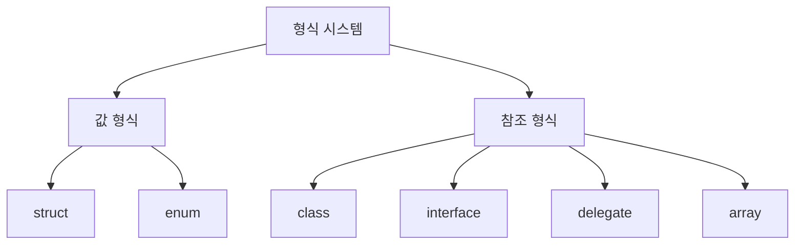

이와 같이 C#의 형식 시스템은 프로그래밍의 기본적인 구조를 형성하며, 개발자가 보다 안전하고 효율적인 코드를 작성할 수 있도록 돕는다.

<!--
## 형식 정보
   - 형식 변수의 스토리지 공간
   - 최대값 및 최소값
   - 형식 멤버(메서드, 필드, 이벤트 등)
   - 기본 형식 및 인터페이스
   - 허용되는 작업 유형
-->

## 형식 정보

C#의 형식 시스템에서 형식 정보는 프로그래밍의 기본적인 요소로, 각 형식이 어떻게 저장되고, 어떤 멤버를 가지며, 어떤 작업을 수행할 수 있는지를 이해하는 데 중요한 역할을 한다. 이 섹션에서는 형식 변수의 스토리지 공간, 최대값 및 최소값, 형식 멤버, 기본 형식 및 인터페이스, 허용되는 작업 유형에 대해 살펴보겠다.

### 형식 변수의 스토리지 공간

형식 변수는 메모리에서 특정한 스토리지 공간을 차지한다. 값 형식은 스택(Stack)에 저장되며, 참조 형식은 힙(Heap)에 저장된다. 값 형식의 경우, 변수에 직접 값이 저장되므로 메모리 사용이 효율적이다. 반면, 참조 형식은 객체의 주소를 저장하므로, 메모리 관리에 있어 가비지 수집(Garbage Collection)의 영향을 받는다.

```csharp
int valueType = 10; // 값 형식
string referenceType = "Hello"; // 참조 형식
```

### 최대값 및 최소값

C#의 각 형식은 최대값과 최소값을 가지며, 이는 형식의 범위를 정의한다. 예를 들어, `int` 형식의 최대값은 `Int32.MaxValue`로 2,147,483,647이며, 최소값은 `Int32.MinValue`로 -2,147,483,648이다. 이러한 값들은 `System` 네임스페이스에 정의되어 있다.

```csharp
int maxValue = int.MaxValue; // 2147483647
int minValue = int.MinValue; // -2147483648
```

### 형식 멤버(메서드, 필드, 이벤트 등)

형식은 다양한 멤버를 가질 수 있으며, 이들은 형식의 기능을 확장하는 데 사용된다. 메서드(Method)는 특정 작업을 수행하는 기능을 제공하고, 필드(Field)는 데이터를 저장하는 역할을 한다. 이벤트(Event)는 특정 조건이 발생했을 때 발생하는 알림을 제공한다.

```csharp
public class SampleClass
{
    public int Field; // 필드

    public void Method() // 메서드
    {
        // 메서드 내용
    }

    public event EventHandler SampleEvent; // 이벤트
}
```

### 기본 형식 및 인터페이스

C#에서는 여러 기본 제공 형식이 있으며, 이들은 프로그래밍에서 자주 사용된다. 기본 형식으로는 `int`, `double`, `char`, `bool` 등이 있으며, 인터페이스는 클래스가 구현해야 하는 계약을 정의한다. 인터페이스는 다중 상속을 지원하므로, 여러 인터페이스를 구현할 수 있다.

```csharp
public interface ISampleInterface
{
    void SampleMethod();
}

public class SampleClass : ISampleInterface
{
    public void SampleMethod()
    {
        // 구현 내용
    }
}
```

### 허용되는 작업 유형

형식에 따라 허용되는 작업 유형이 다르다. 값 형식은 주로 값의 복사 및 비교 작업을 지원하며, 참조 형식은 객체의 참조를 통해 작업을 수행한다. 또한, 형식에 따라 연산자 오버로딩(Operator Overloading)이나 형변환(Casting) 등의 작업이 가능하다.

```csharp
int a = 5;
int b = 10;
int sum = a + b; // 값 형식의 덧셈

string str = "Hello";
string upperStr = str.ToUpper(); // 참조 형식의 메서드 호출
```

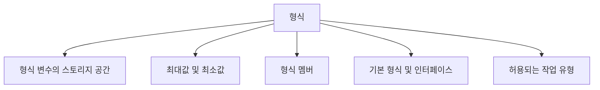

이와 같이 형식 정보는 C#의 형식 시스템을 이해하는 데 필수적인 요소이며, 각 형식의 특성과 기능을 명확히 이해하는 것이 중요하다.

<!--
## 변수 선언에서 형식 지정
   - 형식 지정 방법
   - `var` 키워드 사용 예제
   - 메서드 매개 변수 및 반환 값의 형식
-->

## 변수 선언에서 형식 지정

C#에서 변수 선언 시 형식을 지정하는 것은 매우 중요한 과정이다. 형식을 명확히 지정함으로써 코드의 가독성을 높이고, 컴파일러가 타입 검사를 통해 오류를 사전에 방지할 수 있다.

### 형식 지정 방법

변수를 선언할 때는 다음과 같은 형식 지정 방법을 사용할 수 있다.

```csharp
int number = 10; // 정수형 변수
string text = "Hello, World!"; // 문자열형 변수
bool isActive = true; // 불리언형 변수
```

위의 예제에서 각 변수는 특정 형식으로 선언되었으며, 이는 해당 변수에 저장될 수 있는 값의 유형을 정의한다.

### `var` 키워드 사용 예제

C#에서는 `var` 키워드를 사용하여 컴파일러가 변수의 형식을 자동으로 추론하도록 할 수 있다. 이 방법은 코드의 간결성을 높여준다.

```csharp
var number = 10; // int로 추론됨
var text = "Hello, World!"; // string으로 추론됨
var isActive = true; // bool로 추론됨
```

`var` 키워드를 사용할 때는 초기화 시점에 반드시 값을 할당해야 하며, 이후에는 해당 변수의 형식을 변경할 수 없다.

### 메서드 매개 변수 및 반환 값의 형식

메서드를 정의할 때 매개 변수와 반환 값의 형식을 명시하는 것은 필수적이다. 이는 메서드의 사용 방법을 명확히 하고, 호출하는 측에서 올바른 인자를 전달하도록 돕는다.

```csharp
public int Add(int a, int b) // 매개 변수의 형식 지정
{
    return a + b; // 반환 값의 형식 지정
}
```

위의 예제에서 `Add` 메서드는 두 개의 정수형 매개 변수를 받아 정수형 값을 반환한다. 이러한 형식 지정은 메서드의 사용을 명확하게 하며, 코드의 안정성을 높인다.

### 다이어그램

다음은 변수 선언 및 형식 지정의 흐름을 나타내는 다이어그램이다.

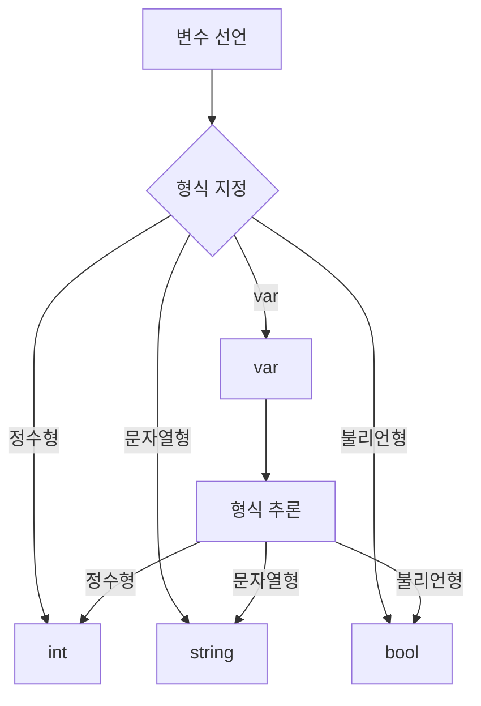

이 다이어그램은 변수 선언 시 형식 지정의 다양한 방법을 시각적으로 표현하고 있다. 각 형식은 변수의 데이터 유형을 정의하며, `var` 키워드를 통해 형식을 자동으로 추론할 수 있음을 보여준다. 

이와 같이 C#에서 변수 선언 시 형식 지정은 코드의 명확성과 안정성을 높이는 중요한 요소이다.

<!--
## 기본 제공 형식
   - C#의 기본 제공 형식 목록
   - 각 기본 제공 형식의 설명
-->

## 기본 제공 형식

C#은 다양한 기본 제공 형식을 제공하여 개발자가 데이터를 효율적으로 처리할 수 있도록 돕는다. 이러한 형식들은 각각의 용도와 특성에 따라 구분되며, 개발자는 필요에 따라 적절한 형식을 선택하여 사용할 수 있다.

### C#의 기본 제공 형식 목록

C#의 기본 제공 형식은 다음과 같다:

- **정수형 (Integer Types)**

  - `byte`
  - `sbyte`
  - `short`
  - `ushort`
  - `int`
  - `uint`
  - `long`
  - `ulong`

- **부동 소수점형 (Floating Point Types)**

  - `float`
  - `double`
  - `decimal`

- **문자형 (Character Type)**

  - `char`

- **불리언형 (Boolean Type)**

  - `bool`

- **문자열형 (String Type)**

  - `string`

### 각 기본 제공 형식의 설명

- **정수형 (Integer Types)**: 정수형은 정수 값을 저장하는 데 사용된다. 각 형식은 저장할 수 있는 값의 범위가 다르며, 메모리 사용량도 다르다. 예를 들어, `int`는 4바이트의 메모리를 사용하며, -2,147,483,648에서 2,147,483,647까지의 값을 저장할 수 있다.

- **부동 소수점형 (Floating Point Types)**: 부동 소수점형은 소수점을 포함한 숫자를 저장하는 데 사용된다. `float`는 4바이트, `double`은 8바이트, `decimal`은 16바이트를 사용하며, 각각의 형식은 소수점 이하의 정밀도가 다르다. `decimal`은 금융 계산에 적합한 형식이다.

- **문자형 (Character Type)**: `char` 형식은 단일 문자를 저장하는 데 사용된다. 2바이트의 메모리를 사용하며, Unicode 문자를 지원한다.

- **불리언형 (Boolean Type)**: `bool` 형식은 true 또는 false 값을 저장하는 데 사용된다. 조건문에서 주로 사용된다.

- **문자열형 (String Type)**: `string` 형식은 문자열을 저장하는 데 사용된다. 문자열은 불변(immutable)이며, 다양한 문자열 조작 메서드를 제공한다.

### 샘플 코드

다음은 C#의 기본 제공 형식을 사용하는 간단한 예제이다.

```csharp
using System;

class Program
{
    static void Main()
    {
        int integerValue = 42;
        float floatValue = 3.14f;
        double doubleValue = 2.71828;
        char charValue = 'A';
        bool boolValue = true;
        string stringValue = "Hello, C#";

        Console.WriteLine($"Integer: {integerValue}");
        Console.WriteLine($"Float: {floatValue}");
        Console.WriteLine($"Double: {doubleValue}");
        Console.WriteLine($"Char: {charValue}");
        Console.WriteLine($"Boolean: {boolValue}");
        Console.WriteLine($"String: {stringValue}");
    }
}
```

### 다이어그램

다음은 C#의 기본 제공 형식을 나타내는 다이어그램이다.

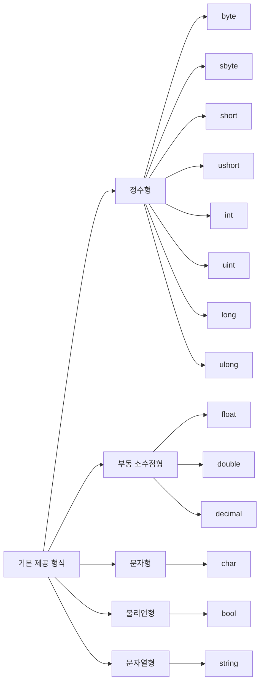

이와 같이 C#의 기본 제공 형식은 다양한 데이터 유형을 지원하여 개발자가 효율적으로 프로그래밍할 수 있도록 돕는다. 각 형식의 특성을 이해하고 적절히 활용하는 것이 중요하다.

<!--
## 사용자 정의 형식
   - `struct`, `class`, `interface`, `enum`, `record`의 정의 및 사용법
   - 사용자 정의 형식의 예제
-->

## 사용자 정의 형식

C#에서는 개발자가 필요에 따라 형식을 정의할 수 있는 기능을 제공한다. 이러한 사용자 정의 형식은 코드의 재사용성을 높이고, 복잡한 데이터 구조를 보다 쉽게 관리할 수 있도록 돕는다. 이번 섹션에서는 `struct`, `class`, `interface`, `enum`, `record`의 정의 및 사용법에 대해 살펴보겠다.

### **struct**

`struct`는 값 형식으로, 주로 간단한 데이터 구조를 정의하는 데 사용된다. `struct`는 메모리에서 직접 값을 저장하며, 복사할 때 값이 복사된다. 다음은 `struct`의 예제이다.

```csharp
public struct Point
{
    public int X { get; set; }
    public int Y { get; set; }

    public Point(int x, int y)
    {
        X = x;
        Y = y;
    }
}
```

### **class**

`class`는 참조 형식으로, 객체 지향 프로그래밍의 기본 단위이다. `class`는 메모리에서 객체의 참조를 저장하며, 복사할 때 참조가 복사된다. 다음은 `class`의 예제이다.

```csharp
public class Circle
{
    public double Radius { get; set; }

    public Circle(double radius)
    {
        Radius = radius;
    }

    public double GetArea()
    {
        return Math.PI * Radius * Radius;
    }
}
```

### **interface**

`interface`는 클래스가 구현해야 하는 메서드, 속성, 이벤트 등을 정의하는 계약이다. `interface`는 다중 상속을 지원하며, 여러 클래스에서 동일한 인터페이스를 구현할 수 있다. 다음은 `interface`의 예제이다.

```csharp
public interface IShape
{
    double GetArea();
}
```

### **enum**

`enum`은 관련된 상수 집합을 정의하는 데 사용된다. `enum`을 사용하면 코드의 가독성을 높이고, 특정 값의 집합을 명확하게 표현할 수 있다. 다음은 `enum`의 예제이다.

```csharp
public enum Color
{
    Red,
    Green,
    Blue
}
```

### **record**

`record`는 C# 9.0에서 도입된 새로운 형식으로, 불변 데이터 구조를 정의하는 데 최적화되어 있다. `record`는 자동으로 `Equals`, `GetHashCode`, `ToString` 메서드를 생성하여 데이터 비교 및 출력이 용이하다. 다음은 `record`의 예제이다.

```csharp
public record Person(string Name, int Age);
```

### 사용자 정의 형식의 예제

아래는 위에서 설명한 사용자 정의 형식을 활용한 간단한 예제이다. 이 예제에서는 `Circle` 클래스를 사용하여 원의 면적을 계산하고, `Color` 열거형을 사용하여 색상을 출력한다.

```csharp
public class Program
{
    public static void Main(string[] args)
    {
        Circle circle = new Circle(5);
        Console.WriteLine($"Circle Area: {circle.GetArea()}");

        Color favoriteColor = Color.Green;
        Console.WriteLine($"Favorite Color: {favoriteColor}");
    }
}
```

이와 같이 C#의 사용자 정의 형식은 다양한 데이터 구조를 정의하고, 코드의 가독성과 재사용성을 높이는 데 중요한 역할을 한다.

<!--
## CTS(공용 형식 시스템)
   - CTS의 개념 및 중요성
   - 값 형식과 참조 형식의 차이
   - CTS의 상속 원칙
-->

## CTS(공용 형식 시스템)

C#에서 형식 시스템은 공용 형식 시스템(CTS, Common Type System)에 의해 정의된다. CTS는 .NET Framework의 핵심 구성 요소로, 다양한 프로그래밍 언어 간의 형식 호환성을 보장하는 역할을 한다. 이를 통해 서로 다른 언어로 작성된 코드가 동일한 형식을 사용할 수 있도록 하여, 개발자들이 다양한 언어를 혼합하여 사용할 수 있게 한다.

### **CTS의 개념 및 중요성**

CTS는 모든 .NET 언어에서 사용할 수 있는 형식의 집합을 정의한다. 이는 값 형식(value type)과 참조 형식(reference type)으로 나뉘며, 각 형식은 특정한 규칙을 따른다. CTS의 주요 목적은 다음과 같다.

- **형식의 일관성**: 서로 다른 언어에서 동일한 형식을 사용할 수 있도록 하여, 코드의 재사용성을 높인다.
- **형식 안전성**: 형식 검사를 통해 런타임 오류를 줄이고, 안정적인 코드를 작성할 수 있도록 돕는다.
- **상호 운용성**: 다양한 언어 간의 상호 운용성을 제공하여, 개발자들이 다양한 언어를 자유롭게 사용할 수 있게 한다.

### **값 형식과 참조 형식의 차이**

값 형식과 참조 형식은 CTS에서 중요한 두 가지 형식이다. 이들은 메모리에서의 저장 방식과 동작 방식에서 차이를 보인다.

- **값 형식**: 값 형식은 실제 데이터를 저장하며, 스택(stack) 메모리에 저장된다. 값 형식의 예로는 `int`, `float`, `struct` 등이 있다. 값 형식은 복사할 때 실제 값이 복사된다.

- **참조 형식**: 참조 형식은 데이터의 주소를 저장하며, 힙(heap) 메모리에 저장된다. 참조 형식의 예로는 `class`, `string`, `array` 등이 있다. 참조 형식은 복사할 때 주소가 복사되므로, 두 변수는 동일한 객체를 참조하게 된다.

```csharp
// 값 형식 예제
int a = 10;
int b = a; // b는 a의 값을 복사
b = 20; // a는 여전히 10

// 참조 형식 예제
class Person {
    public string Name { get; set; }
}

Person person1 = new Person { Name = "Alice" };
Person person2 = person1; // person2는 person1을 참조
person2.Name = "Bob"; // person1의 Name도 "Bob"으로 변경됨
```

### **CTS의 상속 원칙**

CTS는 형식 간의 상속을 지원하여, 개발자가 새로운 형식을 정의할 때 기존 형식을 기반으로 할 수 있도록 한다. 이는 객체 지향 프로그래밍의 상속 개념과 유사하다. 상속을 통해 새로운 형식은 기존 형식의 멤버(메서드, 속성 등)를 상속받아 사용할 수 있으며, 이를 통해 코드의 재사용성을 높인다.

```csharp
// 상속 예제
class Animal {
    public void Speak() {
        Console.WriteLine("Animal speaks");
    }
}

class Dog : Animal {
    public void Bark() {
        Console.WriteLine("Dog barks");
    }
}

Dog dog = new Dog();
dog.Speak(); // Animal speaks
dog.Bark(); // Dog barks
```

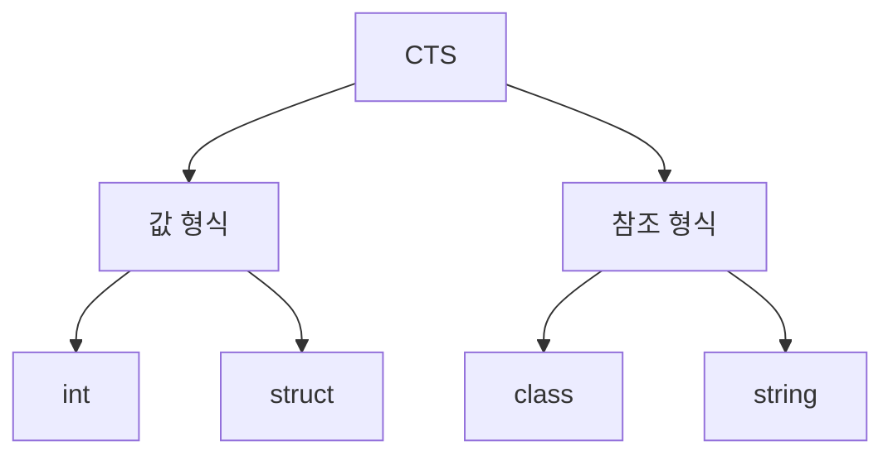

위의 다이어그램은 CTS의 구조를 간단히 나타낸 것이다. CTS는 값 형식과 참조 형식으로 나뉘며, 각 형식은 다양한 데이터 타입을 포함하고 있다. 이러한 구조는 C#의 형식 시스템을 이해하는 데 중요한 기초가 된다.

<!--
## 값 형식
   - 값 형식의 정의 및 특징
   - `struct`와 `enum`의 사용 예제
   - Boxing 및 Unboxing 개념
-->

## 값 형식

값 형식은 C#에서 데이터를 저장하는 방식 중 하나로, 변수에 직접 값을 저장하는 형식이다. 값 형식은 메모리의 스택(stack) 영역에 저장되며, 각 변수는 고유한 값을 가지게 된다. 이러한 특성으로 인해 값 형식은 성능이 뛰어나고, 메모리 관리가 용이하다.

**값 형식의 정의 및 특징**

값 형식은 다음과 같은 특징을 가진다.

- **독립성**: 각 값 형식 변수는 독립적인 메모리 공간을 가지므로, 한 변수의 값을 변경해도 다른 변수에는 영향을 미치지 않는다.
- **스택 메모리**: 값 형식은 스택 메모리에 저장되며, 메모리 할당과 해제가 빠르다.
- **기본형식**: C#의 기본 제공 형식인 `int`, `float`, `bool`, `char` 등이 값 형식에 해당한다.

**`struct`와 `enum`의 사용 예제**

`struct`와 `enum`은 C#에서 값 형식을 정의하는 두 가지 방법이다. 

- **`struct`**: 사용자 정의 값 형식으로, 여러 개의 필드를 포함할 수 있다. 예를 들어, 2D 좌표를 나타내는 `Point` 구조체를 정의할 수 있다.

```csharp
struct Point
{
    public int X;
    public int Y;

    public Point(int x, int y)
    {
        X = x;
        Y = y;
    }
}

// 사용 예
Point p1 = new Point(10, 20);
```

- **`enum`**: 열거형으로, 관련된 상수 집합을 정의하는 데 사용된다. 예를 들어, 요일을 나타내는 `DayOfWeek` 열거형을 정의할 수 있다.

```csharp
enum DayOfWeek
{
    Sunday,
    Monday,
    Tuesday,
    Wednesday,
    Thursday,
    Friday,
    Saturday
}

// 사용 예
DayOfWeek today = DayOfWeek.Monday;
```

**Boxing 및 Unboxing 개념**

Boxing은 값 형식을 참조 형식으로 변환하는 과정이다. 값 형식은 스택에 저장되지만, 참조 형식은 힙(heap)에 저장되므로, 값 형식을 참조 형식으로 변환할 때는 메모리 할당이 필요하다. 이 과정은 성능에 영향을 미칠 수 있다.

Unboxing은 박싱된 참조 형식을 다시 값 형식으로 변환하는 과정이다. 이 과정은 명시적으로 수행해야 하며, 잘못된 형식으로 변환할 경우 `InvalidCastException`이 발생할 수 있다.

```csharp
int number = 42; // 값 형식
object boxedNumber = number; // Boxing
int unboxedNumber = (int)boxedNumber; // Unboxing
```

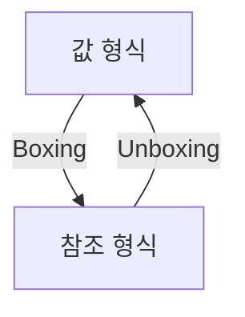

위의 다이어그램은 값 형식이 박싱을 통해 참조 형식으로 변환되고, 다시 언박싱을 통해 원래의 값 형식으로 돌아가는 과정을 나타낸다. 이러한 과정은 C#의 형식 시스템에서 중요한 개념으로, 성능 최적화에 유의해야 한다.

<!--
## 참조 형식
   - 참조 형식의 정의 및 특징
   - 클래스, 레코드, 델리게이트, 배열, 인터페이스의 설명
   - 가비지 수집 및 메모리 관리
-->

## 참조 형식

참조 형식은 C#에서 객체를 참조하는 방식으로, 메모리의 힙(Heap) 영역에 저장된다. 이는 값 형식과는 달리, 변수에 저장된 값이 아닌 객체의 주소를 저장하는 방식이다. 참조 형식의 주요 특징은 다음과 같다.

**참조 형식의 정의 및 특징**

- 참조 형식은 객체의 주소를 저장하며, 동일한 객체를 여러 변수에서 참조할 수 있다.
- 참조 형식의 변수는 null 값을 가질 수 있으며, 이는 객체가 존재하지 않음을 나타낸다.
- 참조 형식의 변경은 모든 참조 변수에 영향을 미친다. 즉, 한 변수에서 객체의 속성을 변경하면, 이를 참조하는 다른 변수에서도 변경된 값을 확인할 수 있다.

**클래스, 레코드, 델리게이트, 배열, 인터페이스의 설명**

- **클래스(Class)**: 클래스는 객체 지향 프로그래밍의 기본 단위로, 속성과 메서드를 포함할 수 있다. 클래스는 인스턴스를 생성하여 사용할 수 있으며, 상속을 통해 다른 클래스에서 기능을 확장할 수 있다.

- **레코드(Record)**: 레코드는 C# 9.0에서 도입된 새로운 참조 형식으로, 불변성을 기본으로 하며, 데이터 전송 객체(Data Transfer Object)로 주로 사용된다. 레코드는 자동으로 Equals, GetHashCode, ToString 메서드를 생성하여 데이터 비교 및 출력에 유용하다.

- **델리게이트(Delegate)**: 델리게이트는 메서드에 대한 참조를 저장할 수 있는 형식으로, 이벤트 처리 및 콜백 메서드에 주로 사용된다. 델리게이트를 사용하면 메서드를 매개변수로 전달할 수 있어 유연한 프로그래밍이 가능하다.

- **배열(Array)**: 배열은 동일한 형식의 요소를 저장하는 고정 크기의 참조 형식이다. 배열은 인덱스를 통해 요소에 접근할 수 있으며, 다차원 배열도 지원한다.

- **인터페이스(Interface)**: 인터페이스는 클래스가 구현해야 하는 메서드와 속성의 집합을 정의한다. 인터페이스는 다중 상속을 지원하며, 서로 다른 클래스 간의 일관된 계약을 제공한다.

```csharp
// 클래스 예제
public class Person
{
    public string Name { get; set; }
    public int Age { get; set; }

    public void Introduce()
    {
        Console.WriteLine($"안녕하세요, 제 이름은 {Name}이고, 나이는 {Age}입니다.");
    }
}

// 레코드 예제
public record Employee(string Name, int Age);

// 델리게이트 예제
public delegate void Notify(string message);

public class Process
{
    public event Notify ProcessCompleted;

    public void StartProcess()
    {
        // 프로세스 로직
        OnProcessCompleted("프로세스가 완료되었습니다.");
    }

    protected virtual void OnProcessCompleted(string message)
    {
        ProcessCompleted?.Invoke(message);
    }
}

// 배열 예제
int[] numbers = { 1, 2, 3, 4, 5 };

// 인터페이스 예제
public interface IAnimal
{
    void Speak();
}

public class Dog : IAnimal
{
    public void Speak()
    {
        Console.WriteLine("멍멍!");
    }
}
```

**가비지 수집 및 메모리 관리**

C#에서는 가비지 수집(Garbage Collection, GC) 메커니즘을 통해 메모리를 자동으로 관리한다. 가비지 수집은 더 이상 사용되지 않는 객체를 자동으로 감지하고 메모리에서 해제하여 메모리 누수를 방지한다. 이는 개발자가 메모리 관리를 수동으로 수행할 필요가 없도록 하여, 코드의 안정성과 효율성을 높인다.

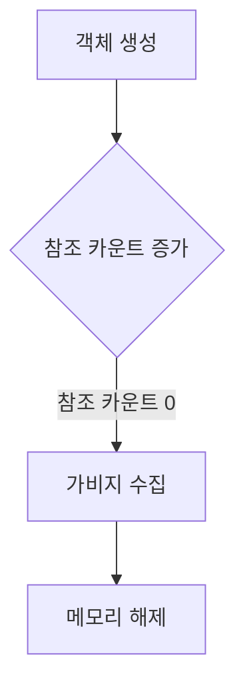

위의 다이어그램은 객체가 생성되고 참조 카운트가 증가하는 과정을 보여준다. 참조 카운트가 0이 되면 가비지 수집이 발생하여 메모리가 해제된다. 이러한 메커니즘 덕분에 C# 개발자는 메모리 관리에 대한 부담을 덜 수 있다.

<!--
## 리터럴 값 형식
   - 리터럴 값의 형식화
   - 숫자 리터럴의 입력 방법
-->

## 리터럴 값 형식

리터럴 값 형식은 프로그래밍에서 고정된 값을 나타내는 중요한 개념이다. C#에서는 다양한 리터럴 값 형식을 지원하며, 이를 통해 개발자는 코드에서 직접 값을 표현할 수 있다. 리터럴 값은 변수에 할당되기 전의 고정된 값으로, 코드의 가독성을 높이고 오류를 줄이는 데 기여한다.

### **리터럴 값의 형식화**

리터럴 값은 여러 형식으로 존재하며, 각 형식은 특정한 데이터 타입을 나타낸다. C#에서 지원하는 주요 리터럴 값 형식은 다음과 같다:

- **정수 리터럴 (Integer Literals)**: 정수 값을 나타내며, 10진수, 16진수, 8진수, 2진수로 표현할 수 있다.
- **부동 소수점 리터럴 (Floating-point Literals)**: 소수점을 포함한 숫자를 나타내며, `float`와 `double` 형식으로 구분된다.
- **문자 리터럴 (Character Literals)**: 단일 문자를 나타내며, 작은 따옴표로 감싸서 표현한다.
- **문자열 리터럴 (String Literals)**: 문자열을 나타내며, 큰 따옴표로 감싸서 표현한다.
- **부울 리터럴 (Boolean Literals)**: `true` 또는 `false` 값을 나타낸다.

리터럴 값은 코드에서 직접 사용되므로, 각 형식에 맞는 올바른 표현을 사용하는 것이 중요하다.

### **숫자 리터럴의 입력 방법**

숫자 리터럴은 다양한 형식으로 입력할 수 있으며, 다음은 그 예시이다:

1. **10진수**: 일반적인 정수 표현
   ```csharp
   int decimalNumber = 42;
   ```

2. **16진수**: `0x` 접두사를 사용하여 표현
   ```csharp
   int hexNumber = 0x2A; // 42 in decimal
   ```

3. **8진수**: `0` 접두사를 사용하여 표현
   ```csharp
   int octalNumber = 052; // 42 in decimal
   ```

4. **2진수**: `0b` 접두사를 사용하여 표현
   ```csharp
   int binaryNumber = 0b101010; // 42 in decimal
   ```

5. **부동 소수점**: `f` 또는 `d` 접미사를 사용하여 표현
   ```csharp
   float floatNumber = 42.0f;
   double doubleNumber = 42.0; // 기본적으로 double
   ```

이와 같은 다양한 입력 방법을 통해 개발자는 필요에 따라 적절한 형식의 숫자 리터럴을 사용할 수 있다.

### 샘플 코드

아래는 다양한 리터럴 값 형식을 사용하는 C# 코드의 예시이다.

```csharp
using System;

class Program
{
    static void Main()
    {
        // 정수 리터럴
        int decimalNumber = 42;
        int hexNumber = 0x2A;
        int octalNumber = 052;
        int binaryNumber = 0b101010;

        // 부동 소수점 리터럴
        float floatNumber = 42.0f;
        double doubleNumber = 42.0;

        // 출력
        Console.WriteLine($"Decimal: {decimalNumber}, Hex: {hexNumber}, Octal: {octalNumber}, Binary: {binaryNumber}");
        Console.WriteLine($"Float: {floatNumber}, Double: {doubleNumber}");
    }
}
```

### 다이어그램

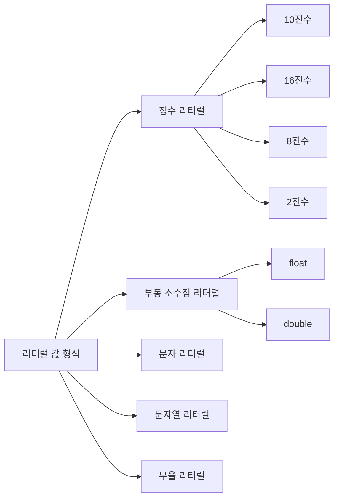

리터럴 값 형식은 C# 프로그래밍에서 필수적인 요소로, 이를 이해하고 활용하는 것은 코드 작성에 있어 매우 중요하다.

<!--
## 제네릭 형식
   - 제네릭 형식의 개념 및 사용법
   - 강력한 형식의 컬렉션 예제
-->

## 제네릭 형식

제네릭 형식은 C#에서 형식의 재사용성을 높이고, 타입 안전성을 제공하는 중요한 기능이다. 제네릭을 사용하면 특정 형식에 대한 코드를 작성할 필요 없이, 다양한 형식에 대해 동일한 로직을 적용할 수 있다. 이는 코드의 중복을 줄이고, 유지보수를 용이하게 한다.

### **제네릭 형식의 개념 및 사용법**

제네릭 형식은 클래스, 메서드, 인터페이스 등에서 사용할 수 있으며, 형식 매개변수를 통해 다양한 데이터 타입을 처리할 수 있다. 예를 들어, `List<T>`는 제네릭 컬렉션으로, `T`는 리스트에 저장할 데이터의 형식을 나타낸다. 이를 통해 다양한 형식의 리스트를 생성할 수 있다.

제네릭 형식을 정의하는 방법은 다음과 같다:

```csharp
public class GenericClass<T>
{
    private T data;

    public GenericClass(T data)
    {
        this.data = data;
    }

    public T GetData()
    {
        return data;
    }
}
```

위의 예제에서 `GenericClass`는 형식 매개변수 `T`를 사용하여 다양한 형식의 데이터를 저장할 수 있다. 이를 통해 `int`, `string`, `CustomClass` 등 다양한 형식의 객체를 생성할 수 있다.

### **강력한 형식의 컬렉션 예제**

제네릭 형식은 강력한 형식의 컬렉션을 만들 때 유용하다. 예를 들어, `List<T>`를 사용하여 강력한 형식의 리스트를 생성할 수 있다. 아래는 `List<int>`를 사용한 예제이다.

```csharp
List<int> numbers = new List<int>();
numbers.Add(1);
numbers.Add(2);
numbers.Add(3);

foreach (var number in numbers)
{
    Console.WriteLine(number);
}
```

위의 코드는 `int` 형식의 리스트를 생성하고, 숫자를 추가한 후 출력하는 예제이다. 제네릭을 사용함으로써, 리스트에 저장되는 데이터의 형식을 명확히 할 수 있으며, 형식 안전성을 보장할 수 있다.

### **다이어그램**

아래는 제네릭 형식의 개념을 설명하는 다이어그램이다.

```mermaid
graph TD;
    A[제네릭 형식] --> B[형식 매개변수 T]
    A --> C[다양한 형식의 데이터]
    B --> D[GenericClass<T>]
    C --> E[List<T>]
    D --> F[GetData() 메서드]
    E --> G[Add() 메서드]
```

이 다이어그램은 제네릭 형식이 형식 매개변수를 통해 다양한 형식의 데이터를 처리할 수 있음을 보여준다. 제네릭 형식을 활용하면 코드의 재사용성과 타입 안전성을 높일 수 있다.

<!--
## 암시적 형식, 무명 형식 및 nullable 값 형식
   - 암시적 형식의 정의 및 사용 예제
   - 무명 형식의 개념
   - nullable 값 형식의 사용법
-->

## 암시적 형식, 무명 형식 및 nullable 값 형식

### 암시적 형식의 정의 및 사용 예제

암시적 형식(Implicit Type)은 C#에서 `var` 키워드를 사용하여 변수의 형식을 컴파일러가 자동으로 추론하도록 하는 기능이다. 이 기능은 코드의 가독성을 높이고, 형식을 명시적으로 지정할 필요가 없기 때문에 편리하다. 그러나 암시적 형식을 사용할 때는 변수의 초기화가 필수적이며, 초기화된 값의 형식에 따라 변수의 형식이 결정된다.

**예제 코드:**

```csharp
var number = 10; // number는 int 형식으로 추론된다.
var name = "C#"; // name은 string 형식으로 추론된다.
var list = new List<string>(); // list는 List<string> 형식으로 추론된다.
```

### 무명 형식의 개념

무명 형식(Anonymous Type)은 C#에서 이름이 없는 형식을 정의할 수 있는 기능이다. 주로 LINQ 쿼리 결과를 반환할 때 사용되며, 여러 개의 속성을 가진 객체를 간편하게 생성할 수 있다. 무명 형식은 `new` 키워드와 함께 중괄호 `{}`를 사용하여 정의된다.

**예제 코드:**

```csharp
var person = new { Name = "Alice", Age = 30 }; // Name과 Age 속성을 가진 무명 형식
Console.WriteLine($"Name: {person.Name}, Age: {person.Age}");
```

### nullable 값 형식의 사용법

Nullable 값 형식(Nullable Value Type)은 값 형식이 null 값을 가질 수 있도록 하는 기능이다. 일반적으로 값 형식은 null을 허용하지 않지만, Nullable<T>를 사용하면 값 형식에 null을 할당할 수 있다. 이는 데이터베이스와의 상호작용 시 유용하게 사용된다.

**예제 코드:**

```csharp
int? nullableInt = null; // nullableInt는 null 값을 가질 수 있다.
if (nullableInt.HasValue)
{
    Console.WriteLine($"Value: {nullableInt.Value}");
}
else
{
    Console.WriteLine("Value is null");
}
```

**다이어그램:**

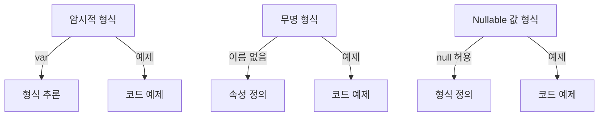

이와 같이 암시적 형식, 무명 형식, nullable 값 형식은 C#에서 코드의 간결성과 유연성을 높이는 데 기여하는 중요한 기능이다. 각 기능을 적절히 활용하면 더욱 효율적인 프로그래밍이 가능하다.

<!--
## 컴파일 시간 형식 및 런타임 형식
   - 컴파일 시간 형식과 런타임 형식의 차이
   - 두 형식의 상호작용 및 중요성
-->

## 컴파일 시간 형식 및 런타임 형식

C#에서 형식은 컴파일 시간과 런타임에 따라 다르게 처리된다. 이 두 가지 형식은 각각의 역할과 중요성이 있으며, 이를 이해하는 것은 C# 프로그래밍에서 매우 중요하다.

### 컴파일 시간 형식과 런타임 형식의 차이

**컴파일 시간 형식**은 코드가 컴파일될 때 결정되는 형식이다. 즉, 변수나 메서드의 형식이 컴파일러에 의해 확인되고, 이 시점에서 형식 검사가 이루어진다. 예를 들어, 다음과 같은 코드에서 `x`의 형식은 `int`로 컴파일 시간에 결정된다.

```csharp
int x = 10;
```

반면에 **런타임 형식**은 프로그램이 실행되는 동안 결정되는 형식이다. 이는 주로 다형성(polymorphism)과 관련이 있으며, 런타임에 객체의 실제 형식이 확인된다. 예를 들어, 다음과 같은 코드에서 `obj`의 형식은 런타임에 결정된다.

```csharp
object obj = "Hello, World!";
```

이 경우, `obj`는 `string` 형식의 객체를 참조하고 있으며, 이는 런타임에 확인된다.

### 두 형식의 상호작용 및 중요성

컴파일 시간 형식과 런타임 형식은 서로 상호작용하며, 이로 인해 C#의 강력한 형식 시스템이 형성된다. 컴파일 시간 형식은 코드의 안전성을 높이고, 형식 오류를 사전에 방지하는 데 기여한다. 반면에 런타임 형식은 유연성을 제공하여 다양한 형식의 객체를 처리할 수 있게 한다.

다음은 컴파일 시간 형식과 런타임 형식의 상호작용을 나타내는 다이어그램이다.

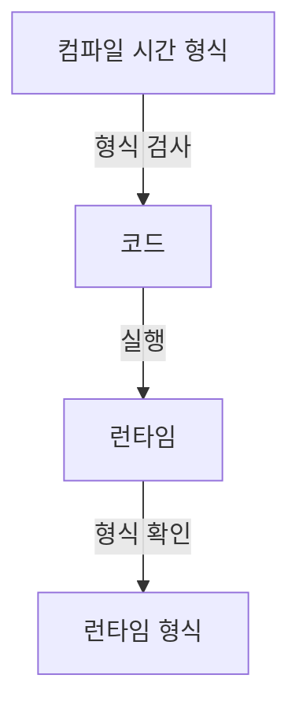

이 다이어그램은 컴파일 시간 형식이 코드의 안전성을 보장하고, 런타임에 형식이 확인되는 과정을 보여준다. 이러한 상호작용은 C#의 형식 시스템이 강력하고 유연하게 작동하도록 돕는다.

결론적으로, 컴파일 시간 형식과 런타임 형식은 C# 프로그래밍에서 중요한 개념이며, 이 두 형식의 차이와 상호작용을 이해하는 것은 효과적인 프로그래밍을 위한 기초가 된다.

<!--
## C# 언어 사양
   - C# 언어 사양의 중요성
   - 참고할 수 있는 자료 및 링크
-->

## C# 언어 사양

C# 언어 사양은 C# 프로그래밍 언어의 문법, 구문, 의미론 및 사용 규칙을 정의하는 공식 문서이다. 이 사양은 C# 언어의 모든 기능과 동작 방식을 명확하게 설명하고 있어, 개발자들이 언어를 올바르게 이해하고 사용할 수 있도록 돕는다. 

**C# 언어 사양의 중요성**

C# 언어 사양은 다음과 같은 이유로 중요하다:

1. **표준화**: C# 언어의 표준을 제공하여, 다양한 플랫폼과 환경에서 일관된 동작을 보장한다.
2. **명확한 이해**: 언어의 기능과 동작 방식을 명확히 이해할 수 있도록 도와준다. 이는 코드 작성 시 오류를 줄이고, 유지보수를 용이하게 한다.
3. **호환성**: C#의 다양한 버전 간의 호환성을 이해하는 데 도움을 준다. 새로운 기능이 추가되거나 기존 기능이 변경될 때, 사양을 통해 그 변화를 파악할 수 있다.
4. **문서화**: C# 언어의 모든 기능이 문서화되어 있어, 개발자들이 필요할 때 참고할 수 있는 자료를 제공한다.

**참고할 수 있는 자료 및 링크**

C# 언어 사양에 대한 공식 문서는 Microsoft의 공식 웹사이트에서 확인할 수 있다. 다음은 유용한 링크들이다:

- [C# Language Specification](https://docs.microsoft.com/en-us/dotnet/csharp/language-reference/language-specification/)
- [C# Documentation](https://docs.microsoft.com/en-us/dotnet/csharp/)
- [C# GitHub Repository](https://github.com/dotnet/csharplang)

이 외에도 C# 관련 서적이나 온라인 강의, 커뮤니티 포럼 등에서 다양한 자료를 찾아볼 수 있다. 

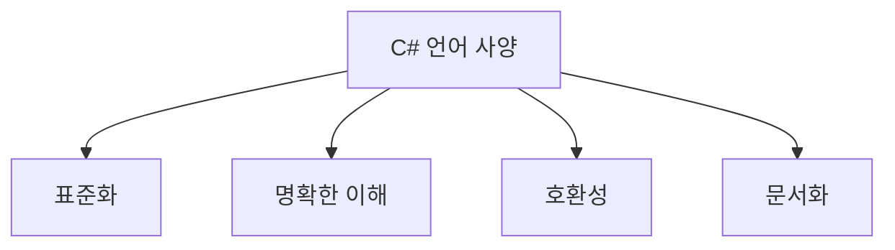

위의 다이어그램은 C# 언어 사양의 중요성을 시각적으로 나타낸 것이다. 각 요소는 C# 언어 사양이 개발자에게 제공하는 이점을 설명하고 있다. C# 언어 사양을 잘 이해하고 활용하는 것은 성공적인 프로그래밍의 기초가 된다.

<!--
## FAQ
   - C# 형식 시스템에 대한 자주 묻는 질문
   - 형식 관련 오류 해결 방법
-->

## FAQ

### C# 형식 시스템에 대한 자주 묻는 질문

**C#에서 형식이란 무엇인가?**

형식은 데이터의 종류를 정의하는 것으로, 변수나 메서드의 매개변수, 반환 값 등에 사용된다. C#에서는 기본 제공 형식과 사용자 정의 형식이 있으며, 각 형식은 특정한 데이터 구조와 동작을 정의한다.

**값 형식과 참조 형식의 차이는 무엇인가?**

값 형식은 데이터를 직접 저장하며, 스택 메모리에 할당된다. 반면, 참조 형식은 데이터의 주소를 저장하고, 힙 메모리에 할당된다. 이로 인해 값 형식은 복사 시 데이터가 복사되지만, 참조 형식은 주소가 복사되어 동일한 데이터를 참조하게 된다.

**Nullable 형식은 무엇인가?**

Nullable 형식은 값 형식에 null 값을 허용하는 형식이다. 이를 통해 데이터베이스와의 상호작용 시, 값이 없음을 명시적으로 표현할 수 있다. 예를 들어, `int?`는 null 값을 가질 수 있는 정수형이다.

```csharp
int? nullableInt = null;
if (nullableInt.HasValue)
{
    Console.WriteLine(nullableInt.Value);
}
else
{
    Console.WriteLine("값이 없습니다.");
}
```

### 형식 관련 오류 해결 방법

**형식 불일치 오류**

형식 불일치 오류는 변수에 잘못된 형식의 값을 할당할 때 발생한다. 이 오류를 해결하기 위해서는 변수의 형식을 확인하고, 올바른 형식의 값을 할당해야 한다.

```csharp
int number = "123"; // 형식 불일치 오류 발생
```

위의 코드는 문자열을 정수형 변수에 할당하려고 하여 오류가 발생한다. 이를 해결하기 위해서는 형변환을 사용해야 한다.

```csharp
int number = int.Parse("123"); // 올바른 형변환
```

**NullReferenceException**

NullReferenceException은 참조 형식 변수가 null인 상태에서 해당 변수를 사용하려고 할 때 발생한다. 이를 방지하기 위해서는 변수를 사용하기 전에 null 체크를 수행해야 한다.

```csharp
string text = null;
Console.WriteLine(text.Length); // NullReferenceException 발생
```

위의 코드는 text가 null이기 때문에 Length 속성에 접근할 수 없다. 이를 방지하기 위해서는 다음과 같이 null 체크를 수행해야 한다.

```csharp
if (text != null)
{
    Console.WriteLine(text.Length);
}
else
{
    Console.WriteLine("text는 null입니다.");
}
```

### 다이어그램


위의 다이어그램은 C# 형식 시스템의 기본 구조를 나타낸다. 값 형식과 참조 형식의 하위 형식들이 어떻게 구성되어 있는지를 시각적으로 보여준다.

<!--
## 관련 기술
   - .NET Framework 및 .NET Core
   - C#의 객체 지향 프로그래밍(OOP) 개념
   - 메모리 관리 및 가비지 수집
-->

## 관련 기술

### .NET Framework 및 .NET Core

.NET Framework와 .NET Core는 C#을 포함한 다양한 프로그래밍 언어를 지원하는 플랫폼이다. .NET Framework는 Windows 운영 체제에서만 실행되는 반면, .NET Core는 크로스 플랫폼을 지원하여 Windows, macOS, Linux에서 실행될 수 있다. 이러한 차이점은 개발자가 애플리케이션을 배포할 때 선택할 수 있는 유연성을 제공한다.

.NET Core는 성능과 모듈화 측면에서 개선된 점이 많아, 클라우드 기반 애플리케이션 및 마이크로서비스 아키텍처에 적합하다. 또한, .NET 5부터는 .NET Framework와 .NET Core의 기능이 통합되어 단일 플랫폼으로 발전하고 있다.

**다이어그램: .NET 플랫폼 구조**

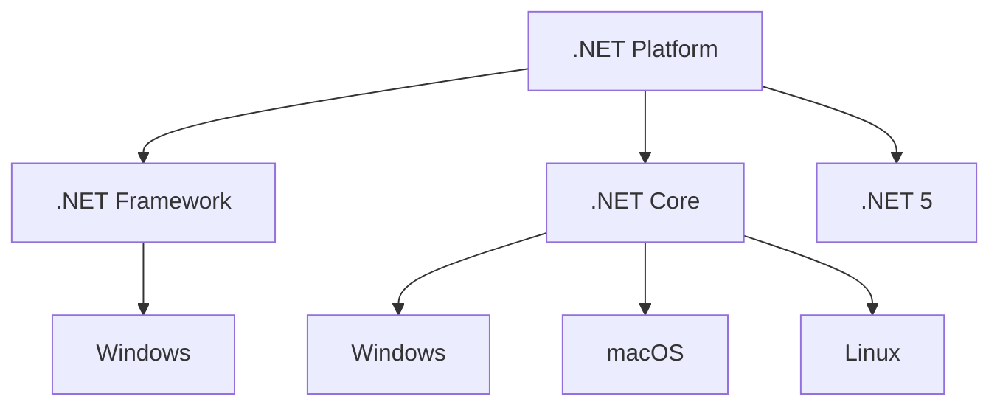

### C#의 객체 지향 프로그래밍(OOP) 개념

C#은 객체 지향 프로그래밍(OOP) 언어로, 코드의 재사용성과 유지보수성을 높이기 위해 객체와 클래스를 중심으로 설계되었다. OOP의 주요 개념은 다음과 같다:

- **캡슐화(Encapsulation)**: 데이터와 메서드를 하나의 단위로 묶어 외부에서 접근을 제한하는 기법이다. 이를 통해 데이터의 무결성을 유지할 수 있다.
  
- **상속(Inheritance)**: 기존 클래스의 속성과 메서드를 새로운 클래스가 물려받는 기능이다. 이를 통해 코드의 중복을 줄이고, 계층 구조를 형성할 수 있다.

- **다형성(Polymorphism)**: 동일한 메서드 이름이지만 서로 다른 동작을 수행할 수 있는 능력이다. 이는 오버로딩(Overloading)과 오버라이딩(Overriding)을 통해 구현된다.

**샘플 코드: OOP 개념**

```csharp
public class Animal
{
    public virtual void Speak()
    {
        Console.WriteLine("Animal speaks");
    }
}

public class Dog : Animal
{
    public override void Speak()
    {
        Console.WriteLine("Woof");
    }
}

public class Cat : Animal
{
    public override void Speak()
    {
        Console.WriteLine("Meow");
    }
}

// 사용 예
Animal myDog = new Dog();
myDog.Speak(); // 출력: Woof

Animal myCat = new Cat();
myCat.Speak(); // 출력: Meow
```

### 메모리 관리 및 가비지 수집

C#은 자동 메모리 관리를 제공하여 개발자가 메모리 할당과 해제를 직접 관리할 필요가 없다. 가비지 수집(Garbage Collection, GC)은 사용되지 않는 객체를 자동으로 감지하고 메모리를 해제하는 프로세스이다. 이를 통해 메모리 누수를 방지하고, 애플리케이션의 성능을 향상시킬 수 있다.

가비지 수집은 주기적으로 실행되며, 다음과 같은 단계를 포함한다:

1. **마크(Mark)**: 사용 중인 객체와 사용되지 않는 객체를 구분한다.
2. **스윕(Sweep)**: 사용되지 않는 객체의 메모리를 해제한다.
3. **컴팩션(Compaction)**: 메모리의 단편화를 줄이기 위해 사용 중인 객체를 이동시킨다.

이러한 메모리 관리 방식은 개발자가 메모리 관리를 신경 쓰지 않고도 안정적인 애플리케이션을 개발할 수 있도록 돕는다.

<!--
## 결론
   - C# 형식 시스템의 요약
   - 향후 학습 방향 및 참고 자료
-->

## 결론

C# 형식 시스템은 프로그래밍 언어의 핵심 요소로, 데이터의 구조와 동작을 정의하는 데 중요한 역할을 한다. 형식 시스템은 값 형식과 참조 형식으로 나뉘며, 각 형식은 메모리 관리 및 성능에 영향을 미친다. C#의 형식 시스템은 강력한 형식 검사와 타입 안전성을 제공하여 개발자가 오류를 줄이고, 코드의 가독성을 높이는 데 기여한다.

**C# 형식 시스템의 요약**

C#의 형식 시스템은 다음과 같은 주요 요소로 구성된다:

- **형식 정보**: 형식 변수의 스토리지 공간, 최대값 및 최소값, 형식 멤버, 기본 형식 및 인터페이스, 허용되는 작업 유형 등을 포함한다.
- **변수 선언에서 형식 지정**: 변수의 형식을 명시적으로 지정하거나 `var` 키워드를 사용하여 암시적으로 지정할 수 있다.
- **기본 제공 형식**: C#에서 제공하는 다양한 기본 형식이 있으며, 각 형식은 특정한 데이터 유형을 나타낸다.
- **사용자 정의 형식**: 개발자는 `struct`, `class`, `interface`, `enum`, `record` 등을 사용하여 자신만의 형식을 정의할 수 있다.
- **CTS(공용 형식 시스템)**: C#의 형식 시스템은 CTS에 기반하여 다양한 언어 간의 상호 운용성을 지원한다.

다음은 C#의 형식 시스템을 간단히 요약한 다이어그램이다:

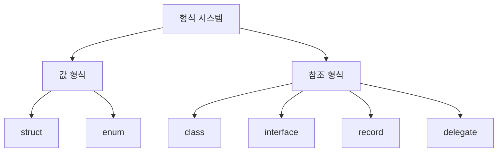

**향후 학습 방향 및 참고 자료**

C# 형식 시스템에 대한 이해를 심화하기 위해 다음과 같은 방향으로 학습을 진행할 수 있다:

1. **고급 형식 개념**: 제네릭 형식, nullable 형식, 암시적 형식 등 고급 개념을 학습하여 코드의 유연성과 재사용성을 높인다.
2. **메모리 관리**: 가비지 수집 및 메모리 관리에 대한 이해를 통해 성능 최적화를 도모한다.
3. **객체 지향 프로그래밍(OOP)**: C#의 OOP 개념을 깊이 있게 학습하여 형식 시스템과의 관계를 이해한다.

참고 자료로는 Microsoft의 공식 문서와 C# 관련 서적을 추천한다. 이러한 자료들은 C# 형식 시스템을 보다 깊이 있게 이해하는 데 큰 도움이 될 것이다.

<!--
##### Reference #####
-->

## Reference


* [https://learn.microsoft.com/ko-kr/dotnet/csharp/fundamentals/types/](https://learn.microsoft.com/ko-kr/dotnet/csharp/fundamentals/types/)

