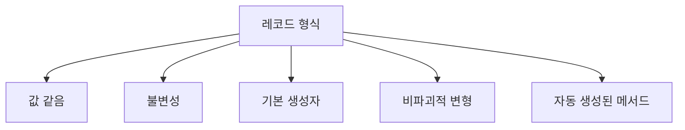
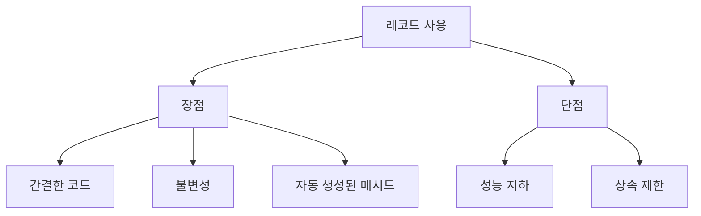
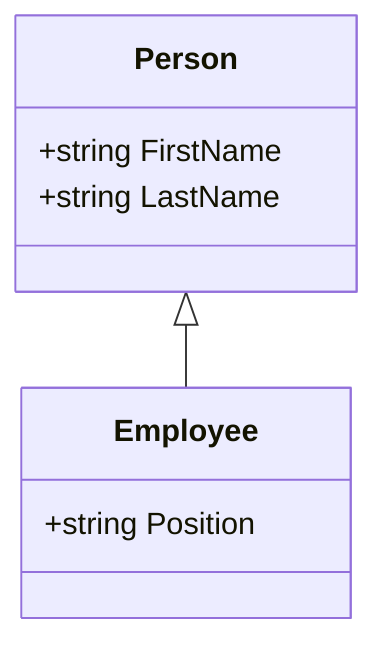
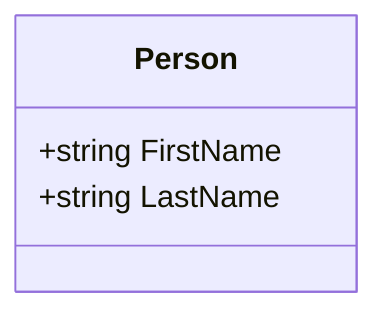
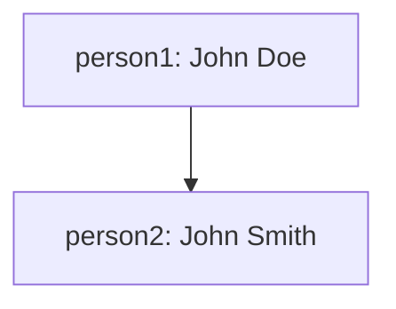
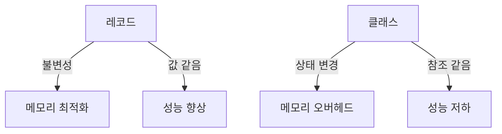
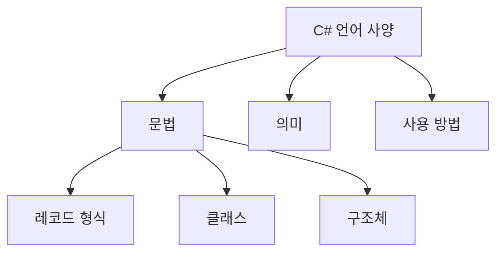
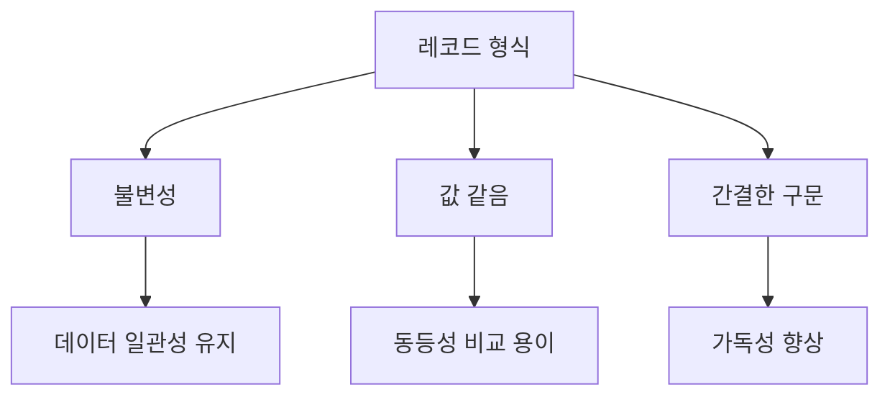
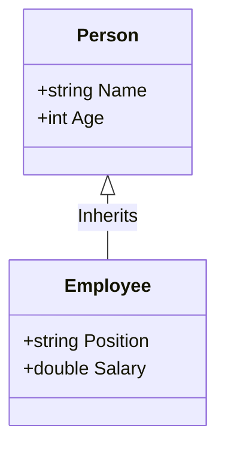

C#의 레코드 형식은 데이터 모델 작업을 위한 특별한 구문과 동작을 제공하는 클래스 또는 구조체이다. 레코드는 데이터 저장을 위한 유용한 멤버를 합성하도록 컴파일러에 지시하는 `record` 한정자를 사용한다. 이러한 멤버에는 값 같음을 지원하는 `ToString()` 메서드와 멤버의 오버로드가 포함된다. 레코드는 값 같음 여부에 따라 달라지는 데이터 모델을 정의하거나 변경할 수 없는 개체의 형식을 정의할 때 유용하다. 레코드의 경우 값 같음은 형식이 일치하고 모든 속성 및 필드 값이 동일한 경우 두 변수가 같음을 의미한다. 이는 클래스와 같은 다른 참조 형식과는 다르게 동작한다. 레코드는 불변성을 제공하여 인스턴스화된 후 개체의 속성이나 필드 값을 변경할 수 없도록 하며, 이는 스레드 안전성을 보장하거나 해시 테이블에서 해시 코드를 동일하게 유지하는 데 유용하다. 레코드는 클래스 또는 구조체와 동일한 구문을 사용하여 선언하고 인스턴스화할 수 있으며, 기본 생성자에서 위치 매개변수를 사용하여 변경할 수 없는 속성을 정의할 수 있다. 또한, `with` 식을 사용하여 선택된 속성에 새 값을 포함하는 변경할 수 없는 개체의 복사본을 만들 수 있는 기능도 제공한다. 이러한 특성 덕분에 레코드는 데이터 모델링에 있어 매우 유용한 도구로 자리 잡고 있다.

<!--
##### Outline #####
-->

<!--
# C#의 레코드 형식 소개 목차

## 1. 개요
   - C# 레코드 형식의 정의
   - 레코드 형식의 주요 특징

## 2. 레코드를 사용하는 경우
   - 2.1 값 같음(Value Equality)
   - 2.2 불변성(Immutability)
   - 2.3 레코드 사용의 장점과 단점

## 3. 레코드가 클래스 및 구조체와 다른 방식
   - 3.1 기본 생성자(Primary Constructor)와 위치 매개 변수(Positional Parameters)
   - 3.2 값 같음과 참조 같음의 차이
   - 3.3 `with` 식을 통한 비파괴적 변형(Nondestructive Mutation)
   - 3.4 `ToString` 메서드의 동작
   - 3.5 레코드의 상속(Inheritance) 규칙

## 4. 예제
   - 4.1 레코드 선언 및 인스턴스화 예제
   - 4.2 값 같음 비교 예제
   - 4.3 `with` 식을 사용한 개체 복사 예제

## 5. FAQ
   - 5.1 레코드와 클래스의 성능 차이는 무엇인가요?
   - 5.2 레코드를 사용해야 하는 이유는 무엇인가요?
   - 5.3 Entity Framework Core에서 레코드를 사용할 수 있나요?
   - 5.4 레코드의 불변성을 어떻게 보장하나요?

## 6. 관련 기술
   - 6.1 C# 클래스(Class)
   - 6.2 C# 구조체(Struct)
   - 6.3 Entity Framework Core
   - 6.4 C# 언어 사양(Language Specification)

## 7. 결론
   - 레코드 형식의 요약
   - 향후 C# 개발에서의 레코드 형식의 중요성

## 8. 참고 자료
   - C# 레코드(C# Reference)
   - C# 언어 사양(Language Specification)
-->

<!--
## 1. 개요
   - C# 레코드 형식의 정의
   - 레코드 형식의 주요 특징
-->

## 개요

C# 레코드 형식은 C# 9.0에서 도입된 새로운 데이터 구조로, 주로 데이터 전송 객체(Data Transfer Object)나 불변 객체를 생성하는 데 유용하다. 레코드 형식은 클래스와 유사하지만, 데이터 중심의 설계를 위해 최적화되어 있다. 이 형식은 값 같음(Value Equality)과 불변성(Immutability)을 기본으로 하여, 데이터의 안전성과 일관성을 보장한다.

**C# 레코드 형식의 정의**

레코드 형식은 `record` 키워드를 사용하여 정의되며, 주로 데이터의 집합을 표현하는 데 사용된다. 레코드는 기본적으로 불변성을 가지며, 생성 시에 모든 속성을 초기화해야 한다. 레코드 형식은 다음과 같이 선언할 수 있다.

```csharp
public record Person(string FirstName, string LastName);
```

위의 예제에서 `Person` 레코드는 두 개의 속성인 `FirstName`과 `LastName`을 가진다. 이 레코드는 자동으로 `ToString`, `Equals`, `GetHashCode` 메서드를 생성하여 값 비교를 쉽게 할 수 있도록 한다.

**레코드 형식의 주요 특징**

레코드 형식은 다음과 같은 주요 특징을 가진다:

1. **값 같음(Value Equality)**: 레코드는 기본적으로 값 같음을 지원하여, 두 레코드 인스턴스의 속성이 동일하면 동일한 것으로 간주된다. 이는 클래스와의 주요 차이점 중 하나이다.

2. **불변성(Immutability)**: 레코드는 생성 후 속성을 변경할 수 없으며, 이는 데이터의 일관성을 유지하는 데 도움을 준다. 속성을 변경하려면 `with` 식을 사용하여 새로운 인스턴스를 생성해야 한다.

3. **기본 생성자(Primary Constructor)**: 레코드는 기본 생성자를 지원하여, 속성을 선언할 때 생성자 매개변수를 함께 정의할 수 있다. 이는 코드의 간결성을 높인다.

4. **비파괴적 변형(Nondestructive Mutation)**: `with` 식을 사용하여 기존 레코드의 속성을 변경한 새로운 레코드를 생성할 수 있다. 이는 불변성을 유지하면서도 데이터의 변형을 가능하게 한다.

5. **자동 생성된 메서드**: 레코드는 `ToString`, `Equals`, `GetHashCode` 메서드를 자동으로 생성하여, 데이터 비교 및 출력이 용이하다.

다음은 레코드 형식의 주요 특징을 시각적으로 나타낸 다이어그램이다:



이와 같은 특징 덕분에 C# 레코드 형식은 데이터 중심의 프로그래밍에서 매우 유용하게 사용될 수 있다.

<!--
## 2. 레코드를 사용하는 경우
   - 2.1 값 같음(Value Equality)
   - 2.2 불변성(Immutability)
   - 2.3 레코드 사용의 장점과 단점
-->

## 레코드를 사용하는 경우

### 값 같음(Value Equality)

C#의 레코드 형식은 값 같음(Value Equality)을 기본으로 지원한다. 이는 두 개의 레코드 인스턴스가 동일한 값을 가지면 동일한 것으로 간주된다는 의미이다. 일반적인 클래스에서는 참조 같음(Reference Equality)이 적용되지만, 레코드에서는 모든 속성의 값을 비교하여 동등성을 판단한다. 

예를 들어, 다음과 같은 레코드가 있다고 가정해보자.

```csharp
public record Person(string Name, int Age);
```

이 경우, 두 개의 `Person` 인스턴스가 동일한 값을 가지면 다음과 같이 비교할 수 있다.

```csharp
var person1 = new Person("Alice", 30);
var person2 = new Person("Alice", 30);

bool areEqual = person1 == person2; // true
```

이처럼 레코드는 값 같음을 통해 데이터의 동등성을 쉽게 비교할 수 있다.

### 불변성(Immutability)

레코드 형식은 기본적으로 불변성(Immutability)을 제공한다. 즉, 레코드의 속성은 생성 후 변경할 수 없다. 이는 데이터의 일관성을 유지하고, 멀티스레드 환경에서 안전하게 사용할 수 있도록 돕는다. 

레코드를 정의할 때, 속성을 `init` 접근자를 사용하여 초기화할 수 있다. 예를 들어:

```csharp
public record Person(string Name, int Age)
{
    public string Name { get; init; } = Name;
    public int Age { get; init; } = Age;
}
```

이렇게 정의된 레코드는 다음과 같이 인스턴스를 생성할 수 있지만, 속성을 변경할 수는 없다.

```csharp
var person = new Person("Alice", 30);
// person.Age = 31; // 컴파일 오류 발생
```

### 레코드 사용의 장점과 단점

레코드를 사용하는 데에는 여러 가지 장점과 단점이 있다.

**장점:**

- **간결한 코드**: 레코드는 기본 생성자와 값 같음 비교를 자동으로 제공하므로 코드가 간결해진다.
- **불변성**: 데이터의 불변성을 통해 안전한 멀티스레드 프로그래밍이 가능하다.
- **자동 생성된 메서드**: `ToString`, `GetHashCode`, `Equals` 메서드가 자동으로 생성되어 편리하다.

**단점:**

- **성능**: 값 같음 비교를 위해 모든 속성을 비교하므로, 성능이 저하될 수 있다.
- **상속 제한**: 레코드는 기본적으로 상속을 지원하지 않으며, 상속을 사용해야 할 경우에는 클래스나 구조체를 고려해야 한다.

다음은 레코드의 장점과 단점을 정리한 다이어그램이다.



이와 같이 레코드는 다양한 상황에서 유용하게 사용될 수 있으며, 그 특성을 이해하고 적절히 활용하는 것이 중요하다.

<!--
## 3. 레코드가 클래스 및 구조체와 다른 방식
   - 3.1 기본 생성자(Primary Constructor)와 위치 매개 변수(Positional Parameters)
   - 3.2 값 같음과 참조 같음의 차이
   - 3.3 `with` 식을 통한 비파괴적 변형(Nondestructive Mutation)
   - 3.4 `ToString` 메서드의 동작
   - 3.5 레코드의 상속(Inheritance) 규칙
-->

## 레코드가 클래스 및 구조체와 다른 방식

C#의 레코드 형식은 클래스와 구조체와는 몇 가지 중요한 차이점이 있다. 이 섹션에서는 이러한 차이점들을 살펴보겠다.

### 기본 생성자(Primary Constructor)와 위치 매개 변수(Positional Parameters)

레코드는 기본 생성자(Primary Constructor)를 지원하여, 객체를 생성할 때 매개 변수를 간편하게 정의할 수 있다. 위치 매개 변수(Positional Parameters)는 레코드의 속성을 정의하는 데 사용되며, 생성자와 함께 사용된다. 다음은 레코드의 기본 생성자와 위치 매개 변수를 사용하는 예제이다.

```csharp
public record Person(string FirstName, string LastName);
```

위의 코드에서 `Person` 레코드는 `FirstName`과 `LastName`이라는 두 개의 위치 매개 변수를 가진 기본 생성자를 정의하고 있다. 이를 통해 객체를 생성할 때 매개 변수를 간단하게 전달할 수 있다.

```csharp
var person = new Person("John", "Doe");
```

### 값 같음과 참조 같음의 차이

레코드는 기본적으로 값 같음(Value Equality)을 지원한다. 이는 두 개의 레코드 인스턴스가 동일한 값을 가지면 동일한 것으로 간주된다는 의미이다. 반면, 클래스는 참조 같음(Reference Equality)을 사용하여 두 인스턴스가 동일한 메모리 주소를 가리킬 때만 동일하다고 판단한다. 다음은 이 차이를 보여주는 예제이다.

```csharp
var person1 = new Person("John", "Doe");
var person2 = new Person("John", "Doe");

bool areEqual = person1 == person2; // true
```

위의 코드에서 `person1`과 `person2`는 서로 다른 인스턴스이지만, 값이 동일하므로 `areEqual`은 `true`가 된다.

### `with` 식을 통한 비파괴적 변형(Nondestructive Mutation)

레코드는 `with` 식을 사용하여 기존 인스턴스를 변경하지 않고 새로운 인스턴스를 생성할 수 있는 기능을 제공한다. 이를 통해 불변성을 유지하면서도 객체의 속성을 변경할 수 있다. 다음은 `with` 식을 사용하는 예제이다.

```csharp
var person1 = new Person("John", "Doe");
var person2 = person1 with { LastName = "Smith" };
```

위의 코드에서 `person1`은 변경되지 않고, `person2`는 `LastName`이 "Smith"로 변경된 새로운 인스턴스가 생성된다.

### `ToString` 메서드의 동작

레코드는 기본적으로 `ToString` 메서드를 오버라이드하여, 레코드의 속성을 문자열로 표현할 수 있다. 이는 디버깅이나 로깅 시 유용하게 사용된다. 다음은 `ToString` 메서드의 동작을 보여주는 예제이다.

```csharp
var person = new Person("John", "Doe");
Console.WriteLine(person); // Person { FirstName = John, LastName = Doe }
```

위의 코드에서 `person` 객체를 출력하면, 레코드의 속성이 포함된 문자열이 출력된다.

### 레코드의 상속(Inheritance) 규칙

레코드는 클래스와 마찬가지로 상속을 지원하지만, 몇 가지 규칙이 있다. 레코드는 다른 레코드로부터 상속받을 수 있으며, 기본 생성자와 위치 매개 변수를 상속받는다. 그러나 레코드는 클래스와 달리 다중 상속을 지원하지 않는다. 다음은 레코드 상속의 예제이다.

```csharp
public record Employee(string FirstName, string LastName, string Position) : Person(FirstName, LastName);
```

위의 코드에서 `Employee` 레코드는 `Person` 레코드를 상속받고 있으며, 추가적인 속성 `Position`을 정의하고 있다.



위의 다이어그램은 `Person` 레코드와 `Employee` 레코드 간의 상속 관계를 나타낸다. `Employee`는 `Person`의 속성을 상속받아 사용할 수 있다. 

이와 같이 C#의 레코드는 클래스 및 구조체와는 다른 여러 가지 특성을 가지고 있으며, 이를 통해 개발자는 더 간결하고 안전한 코드를 작성할 수 있다.

<!--
## 4. 예제
   - 4.1 레코드 선언 및 인스턴스화 예제
   - 4.2 값 같음 비교 예제
   - 4.3 `with` 식을 사용한 개체 복사 예제
-->

## 예제

### 레코드 선언 및 인스턴스화 예제

C#에서 레코드를 선언하는 방법은 매우 간단하다. 레코드는 `record` 키워드를 사용하여 정의할 수 있으며, 다음과 같은 형식으로 선언할 수 있다.

```csharp
public record Person(string FirstName, string LastName);
```

위의 예제에서 `Person` 레코드는 두 개의 위치 매개변수인 `FirstName`과 `LastName`을 가진다. 이 레코드를 인스턴스화하려면 다음과 같이 할 수 있다.

```csharp
var person = new Person("John", "Doe");
```

이제 `person` 객체는 `FirstName`과 `LastName` 속성을 가지며, 이를 통해 객체의 데이터를 쉽게 관리할 수 있다.



### 값 같음 비교 예제

레코드는 기본적으로 값 같음(Value Equality)을 지원한다. 즉, 두 개의 레코드 인스턴스가 동일한 값을 가지면 동일한 것으로 간주된다. 다음은 값 같음 비교의 예제이다.

```csharp
var person1 = new Person("John", "Doe");
var person2 = new Person("John", "Doe");

bool areEqual = person1 == person2; // true
```

위의 코드에서 `person1`과 `person2`는 동일한 값을 가지므로 `areEqual` 변수는 `true`가 된다. 이는 레코드의 중요한 특징 중 하나이다.

### `with` 식을 사용한 개체 복사 예제

레코드는 `with` 식을 사용하여 기존 객체를 기반으로 새로운 객체를 생성할 수 있다. 이 방법은 비파괴적 변형(Nondestructive Mutation)을 가능하게 한다. 다음은 `with` 식을 사용한 개체 복사의 예제이다.

```csharp
var person1 = new Person("John", "Doe");
var person2 = person1 with { LastName = "Smith" };
```

위의 코드에서 `person2`는 `person1`의 모든 속성을 복사하되, `LastName` 속성만 "Smith"로 변경된다. 이로 인해 `person1`은 여전히 "Doe"를 가지며, `person2`는 "Smith"를 가지게 된다.



이와 같이 레코드를 사용하면 객체의 불변성을 유지하면서도 필요한 경우 쉽게 복사하고 수정할 수 있다.

<!--
## 5. FAQ
   - 5.1 레코드와 클래스의 성능 차이는 무엇인가요?
   - 5.2 레코드를 사용해야 하는 이유는 무엇인가요?
   - 5.3 Entity Framework Core에서 레코드를 사용할 수 있나요?
   - 5.4 레코드의 불변성을 어떻게 보장하나요?
-->

## FAQ

### 레코드와 클래스의 성능 차이는 무엇인가요?

C#의 레코드 형식과 클래스는 각각의 용도에 따라 성능 차이가 존재한다. 레코드는 주로 데이터 전송 객체(Data Transfer Object)로 사용되며, 불변성을 기본으로 하여 값 같음(Value Equality)을 지원한다. 이러한 특성으로 인해 레코드는 메모리 할당과 해제를 최적화할 수 있다. 반면, 클래스는 참조 타입으로, 객체의 상태를 변경할 수 있어 더 많은 메모리 오버헤드를 발생시킬 수 있다. 

일반적으로 레코드는 불변성을 유지하기 때문에 멀티스레드 환경에서 안전하게 사용할 수 있으며, 이는 성능 향상으로 이어질 수 있다. 그러나 레코드의 불변성으로 인해 객체를 변경할 때마다 새로운 인스턴스를 생성해야 하므로, 대량의 데이터를 처리할 때는 성능 저하가 발생할 수 있다.



### 레코드를 사용해야 하는 이유는 무엇인가요?

레코드를 사용하는 이유는 여러 가지가 있다. 첫째, 레코드는 불변성을 제공하여 데이터의 무결성을 보장한다. 둘째, 값 같음(Value Equality)을 지원하여 두 개체의 내용을 쉽게 비교할 수 있다. 셋째, 기본 생성자(Primary Constructor)와 위치 매개 변수(Positional Parameters)를 통해 간결한 코드 작성을 가능하게 한다. 

또한, 레코드는 `with` 식을 통해 비파괴적 변형(Nondestructive Mutation)을 지원하여 기존 개체를 변경하지 않고 새로운 개체를 생성할 수 있다. 이러한 특성들은 특히 데이터 중심의 애플리케이션에서 유용하다.

### Entity Framework Core에서 레코드를 사용할 수 있나요?

Entity Framework Core는 레코드를 지원한다. 레코드는 불변성을 가지므로, 데이터베이스와의 매핑에 적합하다. 레코드를 사용하면 데이터베이스에서 가져온 데이터를 쉽게 매핑할 수 있으며, LINQ 쿼리와 함께 사용할 때도 유용하다. 

다만, 레코드를 사용할 때는 주의할 점이 있다. 레코드의 속성은 기본적으로 불변이므로, 데이터베이스에서 가져온 후 속성을 변경하려면 `with` 식을 사용하여 새로운 인스턴스를 생성해야 한다. 이러한 점을 고려하여 설계하면, Entity Framework Core와 함께 레코드를 효과적으로 사용할 수 있다.

### 레코드의 불변성을 어떻게 보장하나요?

레코드의 불변성은 주로 속성을 `init` 접근자로 선언함으로써 보장된다. `init` 접근자는 객체가 생성될 때만 속성을 설정할 수 있도록 하여, 이후에는 변경할 수 없게 만든다. 이를 통해 레코드의 상태가 변경되지 않도록 보장할 수 있다.

예를 들어, 다음과 같은 레코드 선언을 통해 불변성을 유지할 수 있다.

```csharp
public record Person(string Name, int Age);
```

위의 코드에서 `Name`과 `Age` 속성은 생성자에서만 설정할 수 있으며, 이후에는 변경할 수 없다. 이러한 방식으로 레코드는 불변성을 유지하며, 데이터의 무결성을 보장할 수 있다.

<!--
## 6. 관련 기술
   - 6.1 C# 클래스(Class)
   - 6.2 C# 구조체(Struct)
   - 6.3 Entity Framework Core
   - 6.4 C# 언어 사양(Language Specification)
-->

## 관련 기술

### C# 클래스(Class)

C# 클래스는 객체 지향 프로그래밍의 기본 단위로, 데이터와 메서드를 포함하는 사용자 정의 형식이다. 클래스는 인스턴스를 생성할 수 있으며, 상속을 통해 다른 클래스에서 기능을 확장할 수 있다. 클래스는 상태(state)와 행동(behavior)을 정의하는 데 유용하다.

**클래스의 기본 구조:**

```csharp
public class Person
{
    public string Name { get; set; }
    public int Age { get; set; }

    public void Introduce()
    {
        Console.WriteLine($"안녕하세요, 제 이름은 {Name}이고, 나이는 {Age}입니다.");
    }
}
```

### C# 구조체(Struct)

C# 구조체는 값 형식으로, 클래스와 유사하지만 메모리 할당 방식이 다르다. 구조체는 주로 간단한 데이터 구조를 정의하는 데 사용되며, 값 복사가 이루어진다. 구조체는 기본적으로 불변성을 가지며, 메서드와 속성을 포함할 수 있다.

**구조체의 기본 구조:**

```csharp
public struct Point
{
    public int X { get; set; }
    public int Y { get; set; }

    public void Display()
    {
        Console.WriteLine($"Point({X}, {Y})");
    }
}
```

### Entity Framework Core

Entity Framework Core는 .NET의 ORM(Object-Relational Mapping) 프레임워크로, 데이터베이스와의 상호작용을 쉽게 해준다. EF Core는 LINQ(Language Integrated Query)를 사용하여 데이터베이스 쿼리를 작성할 수 있으며, 데이터 모델을 클래스 형태로 정의할 수 있다. 레코드 형식은 EF Core와 함께 사용할 수 있으며, 데이터베이스의 불변성을 유지하는 데 유리하다.

**EF Core를 사용한 간단한 데이터 모델:**

```csharp
public class Product
{
    public int Id { get; set; }
    public string Name { get; set; }
    public decimal Price { get; set; }
}
```

### C# 언어 사양(Language Specification)

C# 언어 사양은 C# 프로그래밍 언어의 문법, 의미 및 사용 방법을 정의하는 공식 문서이다. 이 문서는 C#의 모든 기능과 규칙을 상세히 설명하며, 개발자가 언어를 올바르게 사용할 수 있도록 돕는다. 레코드 형식은 C# 9.0에서 도입된 기능으로, 언어 사양에 명시된 규칙에 따라 정의된다.

**C# 언어 사양의 주요 내용:**



이와 같이 C#의 클래스, 구조체, Entity Framework Core, 그리고 언어 사양은 레코드 형식과 함께 C# 프로그래밍의 중요한 구성 요소이다. 각 기술은 서로 다른 목적과 사용 사례를 가지고 있으며, 개발자는 이를 적절히 활용하여 효율적인 코드를 작성할 수 있다.

<!--
## 7. 결론
   - 레코드 형식의 요약
   - 향후 C# 개발에서의 레코드 형식의 중요성
-->

## 결론

### 레코드 형식의 요약

C#의 레코드 형식은 데이터 중심의 프로그래밍을 지원하기 위해 설계된 새로운 타입이다. 레코드는 불변성을 기본으로 하며, 값 같음(Value Equality)을 통해 두 개체의 동등성을 쉽게 비교할 수 있다. 또한, 기본 생성자(Primary Constructor)와 위치 매개 변수(Positional Parameters)를 통해 간결한 구문으로 객체를 생성할 수 있는 장점이 있다. 레코드는 `with` 식을 사용하여 비파괴적 변형(Nondestructive Mutation)을 지원하며, 이를 통해 기존 객체를 변경하지 않고 새로운 객체를 생성할 수 있다.

레코드 형식은 다음과 같은 주요 특징을 가진다:

- **불변성**: 레코드는 기본적으로 불변성을 가지며, 객체의 상태를 변경할 수 없다.
- **값 같음**: 레코드는 값 같음에 기반하여 동등성을 비교하므로, 두 레코드가 동일한 값을 가지면 동일한 것으로 간주된다.
- **간결한 구문**: 레코드는 간단한 구문으로 선언 및 초기화할 수 있어 코드의 가독성을 높인다.

아래는 레코드 형식의 간단한 예제 코드이다.

```csharp
public record Person(string Name, int Age);
```

이 코드는 `Person`이라는 레코드를 정의하며, 이름과 나이를 속성으로 가진다. 레코드를 사용하면 다음과 같이 객체를 생성하고 비교할 수 있다.

```csharp
var person1 = new Person("Alice", 30);
var person2 = new Person("Alice", 30);

bool areEqual = person1 == person2; // true
```

### 향후 C# 개발에서의 레코드 형식의 중요성

C#의 레코드 형식은 데이터 중심의 애플리케이션에서 점점 더 중요해지고 있다. 특히, 불변성을 요구하는 상황이나 데이터 전송 객체(Data Transfer Object, DTO)를 설계할 때 레코드는 매우 유용하다. 레코드는 코드의 간결성과 가독성을 높이며, 데이터의 동등성을 쉽게 비교할 수 있는 기능을 제공한다.

향후 C# 개발에서는 레코드 형식이 더욱 널리 사용될 것으로 예상된다. 특히, 마이크로서비스 아키텍처나 클라우드 기반 애플리케이션에서 데이터의 일관성을 유지하는 데 큰 도움이 될 것이다. 레코드 형식은 데이터 모델링을 단순화하고, 유지보수성을 높이며, 코드의 명확성을 향상시키는 데 기여할 것이다.



이와 같은 이유로, C# 개발자들은 레코드 형식을 적극적으로 활용하여 더 나은 소프트웨어를 개발할 수 있을 것이다.

<!--
## 8. 참고 자료
   - C# 레코드(C# Reference)
   - C# 언어 사양(Language Specification)
-->

## 참고 자료

C# 레코드 형식에 대한 이해를 깊이 있게 하기 위해 다음의 참고 자료를 활용할 수 있다.

### C# 레코드(C# Reference)

C# 레코드에 대한 공식 문서는 Microsoft의 C# Reference에서 확인할 수 있다. 이 문서에서는 레코드 형식의 정의, 사용법, 예제 등을 상세히 설명하고 있다. 특히, 레코드의 불변성, 값 같음, 그리고 `with` 식을 통한 비파괴적 변형에 대한 내용을 포함하고 있어, 레코드 형식을 처음 접하는 개발자에게 유용하다.

**샘플 코드:**

```csharp
public record Person(string Name, int Age);
```

위의 코드는 `Person`이라는 레코드를 정의하는 예제이다. `Name`과 `Age`라는 두 개의 위치 매개 변수를 가진 기본 생성자를 사용하고 있다.

### C# 언어 사양(Language Specification)

C# 언어 사양은 C#의 모든 기능과 문법을 포괄적으로 설명하는 문서이다. 이 문서에서는 레코드 형식뿐만 아니라 클래스, 구조체, 인터페이스 등 다양한 C#의 구성 요소에 대한 규칙과 사용법을 제공한다. 레코드 형식의 세부 사항을 이해하고, 다른 C# 기능과의 관계를 파악하는 데 큰 도움이 된다.

**다이어그램:**



위의 다이어그램은 `Person` 레코드가 `Employee` 클래스로 상속되는 구조를 보여준다. 레코드는 클래스와 유사하게 상속을 지원하므로, 이러한 관계를 이해하는 것이 중요하다.

이와 같은 자료를 통해 C# 레코드 형식에 대한 깊이 있는 이해를 도모할 수 있다.

<!--
##### Reference #####
-->

## Reference


* [https://learn.microsoft.com/ko-kr/dotnet/csharp/fundamentals/types/records](https://learn.microsoft.com/ko-kr/dotnet/csharp/fundamentals/types/records)

