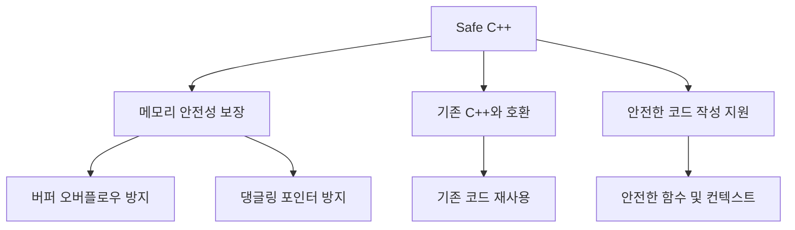
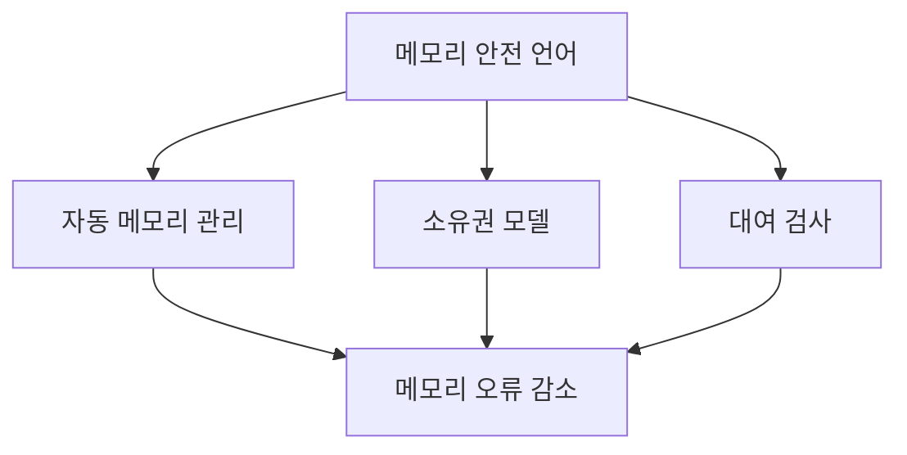
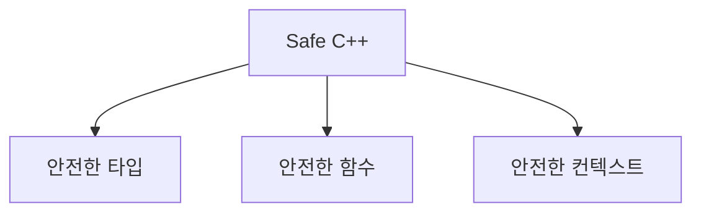
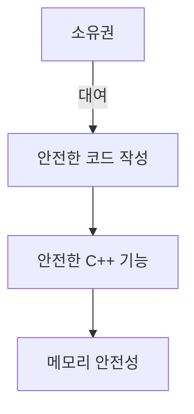
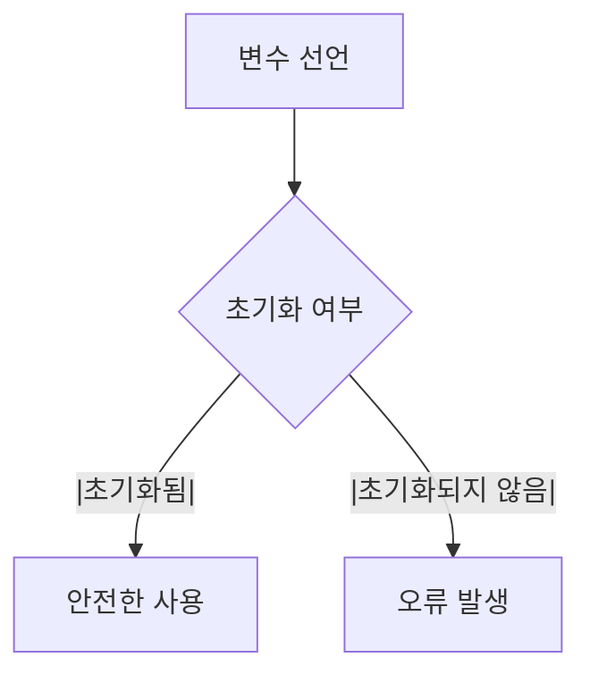
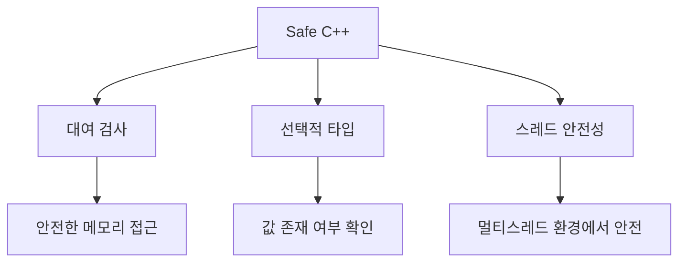
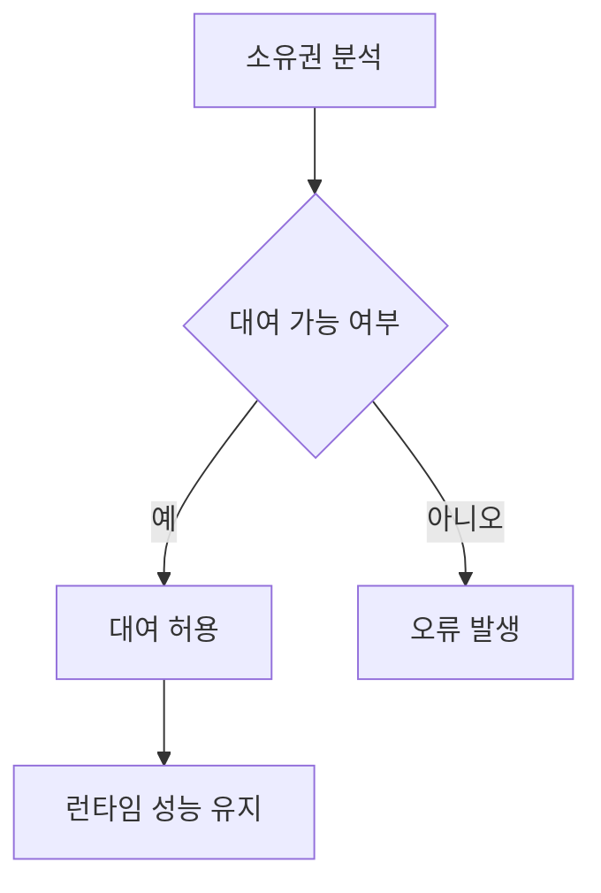
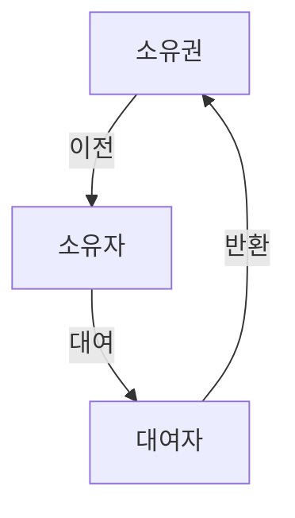
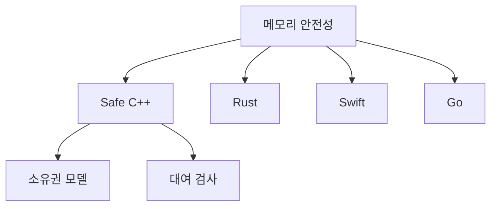
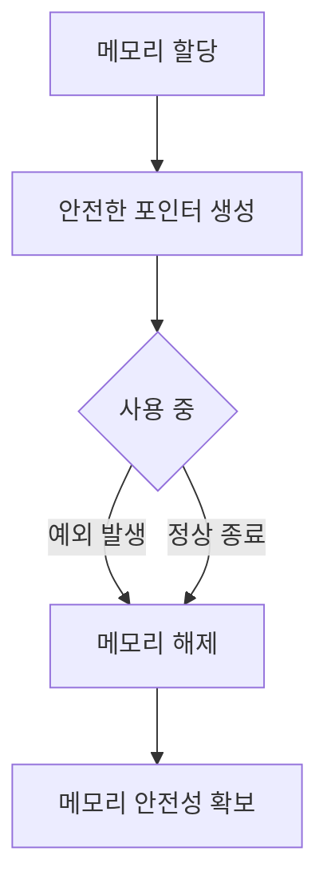

최근 몇 년 동안 미국 정부는 메모리 안전성이 보장되지 않은 프로그래밍 언어에 대한 경고를 점점 더 강하게 발신하고 있다. C와 C++로 작성된 소프트웨어는 국가의 중요한 인프라에 의존하고 있으며, 이러한 언어들은 메모리 안전성이 결여되어 있어 시스템이 적대자에 의해 악용될 위험이 크다. 이러한 문제를 해결하기 위해, Microsoft와 Google을 비롯한 여러 기업들은 메모리 안전성을 보장하는 언어로의 전환을 촉구하고 있다. 특히, Microsoft는 Azure의 핵심 구성 요소에서 Rust를 채택하기 시작했으며, 이는 C++의 대안으로서 메모리 안전성과 스레드 안전성을 보장하는 현대적인 언어로 주목받고 있다. 그러나 C++의 광범위한 사용과 기존 코드의 방대한 양으로 인해, 산업계는 소프트웨어 품질을 개선하고 취약점을 줄이기 위한 실질적인 조치를 취하는 데 어려움을 겪고 있다. 이러한 상황에서 Safe C++라는 새로운 접근 방식이 제안되었으며, 이는 C++의 안전성을 높이기 위한 확장으로, 메모리 안전성을 보장하는 강력한 모델을 제공하고자 한다. Safe C++는 기존 C++ 코드와의 호환성을 유지하면서도, 메모리 안전성을 확보할 수 있는 다양한 기능을 포함하고 있다. 이러한 변화는 C++의 미래를 밝히고, 소프트웨어 개발자들이 보다 안전하고 신뢰할 수 있는 코드를 작성할 수 있도록 도와줄 것이다.

<!--
##### Outline #####
-->

<!--
# 목차

## 개요
- 메모리 안전성의 필요성
- C++의 메모리 안전성 문제
- Safe C++의 목표와 접근 방식

## 메모리 안전성의 필요성
- 미국 정부의 경고 및 권고
- 메모리 안전 언어의 중요성
- C/C++의 취약점과 대안

## Safe C++의 설계
- Safe C++의 기본 개념
- C++의 안전한 확장: Safe C++의 구조
- 메모리 안전성을 위한 새로운 언어 기능

## 메모리 안전성의 원칙
- 소유권 및 대여 모델
- 안전한 코드 작성의 원칙
- 안전한 C++의 기능 및 키워드

## Safe C++의 주요 기능
- 안전한 함수 및 안전한 컨텍스트
- 대여 검사 및 초기화 분석
- 선택적 타입 및 패턴 매칭
- 내부 가변성 및 스레드 안전성

## 예제
- Safe C++의 기본 사용 예제
- 대여 검사 및 오류 처리 예제
- 선택적 타입 및 패턴 매칭 예제
- 내부 가변성 및 스레드 안전성 예제

## FAQ
- Safe C++는 기존 C++ 코드와 어떻게 호환되나요?
- Safe C++의 성능은 어떻게 되나요?
- Safe C++를 사용하여 기존 C++ 프로젝트를 어떻게 개선할 수 있나요?

## 관련 기술
- Rust 언어와의 비교
- 메모리 안전성을 위한 다른 언어들 (예: Swift, Go)
- C++의 메모리 안전성 관련 라이브러리 및 도구

## 결론
- Safe C++의 필요성과 미래
- 메모리 안전성을 위한 지속적인 노력
- Safe C++의 발전 방향 및 커뮤니티 참여 방법

## 참고 문헌
- 관련 연구 및 문서 링크
- 메모리 안전성 관련 자료 및 리소스

이 목차는 Safe C++의 개념과 기능을 포괄적으로 다루며, 독자가 메모리 안전성의 중요성과 Safe C++의 필요성을 이해하는 데 도움을 줄 것입니다.
-->

<!--
## 개요
- 메모리 안전성의 필요성
- C++의 메모리 안전성 문제
- Safe C++의 목표와 접근 방식
-->

## 개요

메모리 안전성은 현대 소프트웨어 개발에서 매우 중요한 요소이다. 특히 C++와 같은 저수준 언어에서는 메모리 관리의 복잡성으로 인해 다양한 취약점이 발생할 수 있다. 이러한 취약점은 보안 문제를 초래하고, 프로그램의 안정성을 저하시킬 수 있다. 따라서 메모리 안전성을 확보하는 것은 필수적이다.

**메모리 안전성의 필요성**

메모리 안전성은 프로그램이 메모리를 안전하게 관리할 수 있도록 보장하는 것이다. 메모리 누수, 버퍼 오버플로우, 댕글링 포인터와 같은 문제는 프로그램의 예기치 않은 동작을 초래할 수 있으며, 이는 보안 취약점으로 이어질 수 있다. 미국 정부는 이러한 문제를 인식하고, 메모리 안전성을 확보하기 위한 언어의 필요성을 강조하고 있다.

**C++의 메모리 안전성 문제**

C++는 강력한 성능과 유연성을 제공하지만, 메모리 관리에 대한 책임이 개발자에게 있다. 이는 메모리 안전성 문제를 야기할 수 있으며, 특히 대규모 프로젝트에서 이러한 문제는 더욱 두드러진다. C++의 포인터와 동적 메모리 할당은 개발자가 실수할 여지를 남기며, 이로 인해 프로그램의 안정성이 저하될 수 있다.

**Safe C++의 목표와 접근 방식**

Safe C++는 C++의 메모리 안전성 문제를 해결하기 위해 설계된 새로운 언어이다. 이 언어는 기존 C++의 문법과 호환성을 유지하면서도, 메모리 안전성을 보장하는 기능을 추가한다. Safe C++의 주요 목표는 개발자가 메모리 관리에 대한 걱정 없이 안전하게 코드를 작성할 수 있도록 돕는 것이다.

다음은 Safe C++의 기본 개념을 설명하는 다이어그램이다.



Safe C++는 이러한 목표를 달성하기 위해 소유권 및 대여 모델, 안전한 코드 작성의 원칙, 그리고 새로운 언어 기능을 도입한다. 이를 통해 개발자는 메모리 안전성을 확보하면서도 C++의 강력한 기능을 활용할 수 있다.

<!--
## 메모리 안전성의 필요성
- 미국 정부의 경고 및 권고
- 메모리 안전 언어의 중요성
- C/C++의 취약점과 대안
-->

## 메모리 안전성의 필요성

메모리 안전성은 현대 소프트웨어 개발에서 매우 중요한 요소이다. 특히 C/C++와 같은 저수준 언어에서는 메모리 관리의 복잡성으로 인해 다양한 취약점이 발생할 수 있다. 이러한 취약점은 보안 문제를 초래하고, 시스템의 안정성을 저하시킬 수 있다. 따라서 메모리 안전성을 확보하기 위한 노력이 필요하다.

### 미국 정부의 경고 및 권고

미국 정부는 소프트웨어의 메모리 안전성 문제에 대해 여러 차례 경고를 해왔다. 특히, 사이버 보안 위협이 증가함에 따라, 정부 기관들은 메모리 안전성을 보장하는 언어의 사용을 권장하고 있다. 이러한 권고는 공공 및 민간 부문 모두에 적용되며, 안전한 소프트웨어 개발을 위한 기준으로 자리 잡고 있다.

### 메모리 안전 언어의 중요성

메모리 안전 언어는 메모리 관리의 오류를 방지하기 위해 설계된 프로그래밍 언어이다. 이러한 언어는 자동 메모리 관리, 소유권 모델, 대여 검사 등의 기능을 제공하여 개발자가 메모리 관련 오류를 줄일 수 있도록 돕는다. 예를 들어, Rust 언어는 소유권 및 대여 모델을 통해 메모리 안전성을 보장하며, 이는 C/C++와 같은 언어에서 발생할 수 있는 버퍼 오버플로우와 같은 문제를 예방하는 데 큰 도움이 된다.



### C/C++의 취약점과 대안

C/C++는 성능이 뛰어나고 시스템 프로그래밍에 적합한 언어이지만, 메모리 관리의 복잡성으로 인해 여러 가지 취약점이 존재한다. 예를 들어, 포인터를 잘못 사용하거나 메모리를 해제하지 않는 경우, 프로그램의 비정상 종료나 보안 취약점이 발생할 수 있다. 이러한 문제를 해결하기 위해 Safe C++와 같은 새로운 접근 방식이 필요하다. Safe C++는 기존 C++의 문법을 유지하면서도 메모리 안전성을 강화하는 기능을 제공하여, 개발자가 보다 안전한 코드를 작성할 수 있도록 돕는다. 

이와 같은 메모리 안전성의 필요성은 소프트웨어 개발의 모든 단계에서 고려되어야 하며, 이를 통해 보다 안전하고 신뢰할 수 있는 시스템을 구축할 수 있다.

<!--
## Safe C++의 설계
- Safe C++의 기본 개념
- C++의 안전한 확장: Safe C++의 구조
- 메모리 안전성을 위한 새로운 언어 기능
-->

## Safe C++의 설계

Safe C++는 C++ 언어의 메모리 안전성을 강화하기 위해 설계된 확장 언어이다. 기존 C++의 특성을 유지하면서도 메모리 안전성을 보장하는 새로운 기능을 도입하여 개발자들이 보다 안전한 코드를 작성할 수 있도록 돕는다. 이 섹션에서는 Safe C++의 기본 개념, 구조, 그리고 메모리 안전성을 위한 새로운 언어 기능에 대해 살펴보겠다.

### Safe C++의 기본 개념

Safe C++의 기본 개념은 메모리 안전성을 보장하는 것이다. 이를 위해 Safe C++는 소유권(Ownership)과 대여(Borrowing) 모델을 도입하여 메모리 관리의 명확성을 제공한다. 소유권 모델은 객체의 소유자가 누구인지 명확히 하여 메모리 누수와 같은 문제를 방지하고, 대여 모델은 객체의 안전한 접근을 보장한다. 이러한 개념은 Rust 언어에서 영감을 받아 설계되었으며, C++ 개발자들이 메모리 안전성을 보다 쉽게 관리할 수 있도록 돕는다.

### C++의 안전한 확장: Safe C++의 구조

Safe C++는 기존 C++의 문법과 구조를 유지하면서도 새로운 안전 기능을 추가한다. Safe C++의 구조는 다음과 같은 주요 요소로 구성된다:

- **안전한 타입(Safe Types)**: Safe C++는 메모리 안전성을 보장하는 새로운 타입 시스템을 도입한다. 이 타입 시스템은 안전한 대여와 소유권 관리를 지원한다.
- **안전한 함수(Safe Functions)**: Safe C++에서는 함수의 매개변수와 반환값에 대해 안전성을 보장하는 기능이 추가된다. 이를 통해 함수 호출 시 발생할 수 있는 메모리 오류를 예방할 수 있다.
- **안전한 컨텍스트(Safe Contexts)**: Safe C++는 코드 블록 내에서 안전한 메모리 접근을 보장하는 컨텍스트를 제공한다. 이를 통해 개발자는 안전한 코드 작성에 집중할 수 있다.



### 메모리 안전성을 위한 새로운 언어 기능

Safe C++는 메모리 안전성을 강화하기 위해 여러 새로운 언어 기능을 도입한다. 이 기능들은 다음과 같다:

- **대여 검사(Borrow Checking)**: Safe C++는 대여 검사 기능을 통해 객체의 대여가 안전하게 이루어지는지를 검사한다. 이를 통해 데이터 경쟁(Data Race)과 같은 문제를 예방할 수 있다.
- **초기화 분석(Initialization Analysis)**: Safe C++는 변수가 사용되기 전에 반드시 초기화되도록 강제하는 기능을 제공한다. 이를 통해 초기화되지 않은 변수를 사용하는 오류를 방지할 수 있다.
- **선택적 타입(Optional Types)**: Safe C++는 선택적 타입을 도입하여 값이 존재하지 않을 수 있는 경우를 안전하게 처리할 수 있도록 한다. 이를 통해 Null Pointer Dereference와 같은 오류를 예방할 수 있다.

이러한 새로운 언어 기능들은 Safe C++가 메모리 안전성을 보장하는 데 중요한 역할을 하며, 개발자들이 보다 안전한 코드를 작성할 수 있도록 지원한다. Safe C++의 설계는 메모리 안전성을 위한 지속적인 노력의 일환으로, C++ 언어의 발전에 기여할 것이다.

<!--
## 메모리 안전성의 원칙
- 소유권 및 대여 모델
- 안전한 코드 작성의 원칙
- 안전한 C++의 기능 및 키워드
-->

## 메모리 안전성의 원칙

메모리 안전성을 확보하기 위해서는 몇 가지 중요한 원칙을 이해하고 적용해야 한다. 이 원칙들은 안전한 코드 작성과 메모리 관리의 기초가 된다.

### 소유권 및 대여 모델

소유권(Ownership)과 대여(Borrowing) 모델은 메모리 안전성을 보장하는 핵심 개념이다. 소유권은 특정 데이터에 대한 유일한 소유자를 정의하며, 대여는 소유자가 아닌 다른 코드가 해당 데이터를 안전하게 사용할 수 있도록 허용한다. 이러한 모델은 데이터의 생명 주기를 명확히 하여 메모리 누수와 데이터 경합을 방지하는 데 기여한다.

```cpp
struct Data {
    int value;
};

void processData(Data& data) {
    // 데이터에 대한 대여
    data.value += 1;
}

int main() {
    Data myData{10};
    processData(myData); // myData에 대한 대여
    return 0;
}
```

위의 코드에서 `processData` 함수는 `Data` 구조체에 대한 대여를 통해 안전하게 값을 수정한다. 이처럼 소유권과 대여 모델을 통해 데이터의 안전한 사용을 보장할 수 있다.

### 안전한 코드 작성의 원칙

안전한 코드를 작성하기 위해서는 다음과 같은 원칙을 준수해야 한다.

- **불변성(Immutable)**: 가능한 한 불변 객체를 사용하여 데이터의 변경을 방지한다.
- **명시적 초기화(Explicit Initialization)**: 모든 변수를 사용하기 전에 명시적으로 초기화하여 예기치 않은 동작을 방지한다.
- **예외 처리(Exception Handling)**: 오류 발생 시 적절한 예외 처리를 통해 프로그램의 안정성을 높인다.

이러한 원칙들은 코드의 가독성을 높이고, 유지보수를 용이하게 하며, 버그를 줄이는 데 도움을 준다.

### 안전한 C++의 기능 및 키워드

Safe C++에서는 메모리 안전성을 보장하기 위해 몇 가지 새로운 기능과 키워드를 도입한다. 이들 기능은 다음과 같다.

- **`safe` 키워드**: 안전한 함수나 변수를 정의할 때 사용된다.
- **`borrow` 키워드**: 대여를 명시적으로 나타내어 소유권을 관리한다.
- **`immutable` 키워드**: 불변 객체를 정의하여 데이터의 변경을 방지한다.

이러한 기능들은 코드의 안전성을 높이고, 개발자가 메모리 관리에 대한 부담을 덜 수 있도록 돕는다.

```cpp
safe struct SafeData {
    immutable int value;
};

safe void processSafeData(SafeData& data) {
    // data.value는 변경할 수 없다.
}

int main() {
    SafeData mySafeData{10};
    processSafeData(mySafeData); // 안전한 데이터 처리
    return 0;
}
```

위의 예제에서 `SafeData` 구조체는 `immutable` 키워드를 사용하여 값의 변경을 방지한다. 이러한 방식으로 Safe C++는 메모리 안전성을 강화한다.



위의 다이어그램은 소유권, 안전한 코드 작성, 안전한 C++ 기능이 어떻게 메모리 안전성으로 이어지는지를 보여준다. 이러한 원칙들을 통해 개발자는 보다 안전하고 신뢰할 수 있는 코드를 작성할 수 있다.

<!--
## Safe C++의 주요 기능
- 안전한 함수 및 안전한 컨텍스트
- 대여 검사 및 초기화 분석
- 선택적 타입 및 패턴 매칭
- 내부 가변성 및 스레드 안전성
-->

## Safe C++의 주요 기능

Safe C++는 메모리 안전성을 보장하기 위해 다양한 기능을 제공한다. 이 기능들은 안전한 프로그래밍을 지원하며, 개발자가 보다 신뢰할 수 있는 코드를 작성할 수 있도록 돕는다.

### 안전한 함수 및 안전한 컨텍스트

Safe C++에서는 함수와 컨텍스트의 안전성을 보장하기 위해 특별한 규칙을 적용한다. 안전한 함수는 메모리 접근을 안전하게 관리하며, 함수 호출 시 발생할 수 있는 오류를 최소화한다. 안전한 컨텍스트는 특정 코드 블록 내에서만 유효한 메모리 접근을 허용하여, 외부에서의 잘못된 접근을 방지한다.

**예제 코드:**

```cpp
safe_function() {
    // 안전한 메모리 접근
    SafePointer<int> ptr = new SafePointer<int>(10);
    // ...
}
```

### 대여 검사 및 초기화 분석

대여 검사(Rent Check)는 Safe C++의 핵심 기능 중 하나로, 메모리의 소유권과 대여 상태를 추적하여 안전성을 높인다. 초기화 분석(Initialization Analysis)은 변수가 사용되기 전에 반드시 초기화되도록 보장하여, 초기화되지 않은 변수를 사용하는 오류를 방지한다.

**다이어그램:**



### 선택적 타입 및 패턴 매칭

Safe C++는 선택적 타입(Optional Type)과 패턴 매칭(Pattern Matching) 기능을 통해 코드의 가독성과 안전성을 높인다. 선택적 타입은 값이 존재할 수도 있고 존재하지 않을 수도 있는 경우를 처리할 수 있게 해주며, 패턴 매칭은 다양한 경우의 수를 간결하게 처리할 수 있도록 돕는다.

**예제 코드:**

```cpp
Optional<int> maybeValue = getValue();
if (maybeValue) {
    // 값이 존재할 때 처리
    int value = *maybeValue;
} else {
    // 값이 존재하지 않을 때 처리
}
```

### 내부 가변성 및 스레드 안전성

Safe C++는 내부 가변성(Interior Mutability) 개념을 도입하여, 불변성을 유지하면서도 내부 상태를 안전하게 변경할 수 있도록 한다. 또한, 스레드 안전성(Thread Safety)을 보장하여 멀티스레드 환경에서도 안전하게 동작할 수 있도록 설계되었다.

**예제 코드:**

```cpp
class SafeContainer {
    mutable std::mutex mtx; // 스레드 안전성을 위한 뮤텍스
    std::vector<int> data;

public:
    void add(int value) {
        std::lock_guard<std::mutex> lock(mtx); // 안전한 접근
        data.push_back(value);
    }
};
```

Safe C++의 이러한 주요 기능들은 개발자가 메모리 안전성을 확보하면서도 효율적인 코드를 작성할 수 있도록 지원한다. 이를 통해 소프트웨어의 품질과 안정성을 높일 수 있다.

<!--
## 예제
- Safe C++의 기본 사용 예제
- 대여 검사 및 오류 처리 예제
- 선택적 타입 및 패턴 매칭 예제
- 내부 가변성 및 스레드 안전성 예제
-->

## 예제

### Safe C++의 기본 사용 예제

Safe C++는 메모리 안전성을 보장하기 위해 설계된 언어로, 기본적인 사용 예제를 통해 그 특징을 살펴보겠다. 아래의 코드는 Safe C++의 기본적인 문법을 보여준다.

```cpp
#include <safe_cpp/safe.h>

void safeFunction() {
    Safe<int> safeInt = 10; // Safe 타입으로 정수 초기화
    Safe<int> safeInt2 = safeInt + 5; // 안전한 덧셈
    std::cout << "Safe Int: " << safeInt2.get() << std::endl; // 안전하게 값 출력
}
```

위의 예제에서 `Safe<int>`는 메모리 안전성을 보장하는 타입으로, 일반적인 C++의 `int`와는 다르게 메모리 접근을 안전하게 관리한다.

### 대여 검사 및 오류 처리 예제

Safe C++는 대여 검사(Rent Check)를 통해 메모리 안전성을 강화한다. 아래의 예제는 대여 검사를 활용한 코드이다.

```cpp
#include <safe_cpp/safe.h>

void borrowExample() {
    Safe<std::vector<int>> safeVector = {1, 2, 3, 4, 5};
    auto borrowed = safeVector.borrow(); // 대여
    borrowed->push_back(6); // 대여된 객체에 안전하게 접근
    std::cout << "Borrowed Vector Size: " << borrowed->size() << std::endl;
}
```

이 예제에서 `borrow()` 메서드는 안전하게 대여된 객체에 접근할 수 있도록 하며, 대여된 객체가 사용되는 동안 메모리 안전성을 보장한다.

### 선택적 타입 및 패턴 매칭 예제

Safe C++는 선택적 타입(Optional Type)과 패턴 매칭(Pattern Matching)을 지원하여 코드의 안전성을 높인다. 아래의 예제는 이러한 기능을 활용한 코드이다.

```cpp
#include <safe_cpp/safe.h>

void optionalExample() {
    Safe<Optional<int>> safeOptional = None; // 선택적 타입 초기화
    if (safeOptional.has_value()) {
        std::cout << "Value: " << safeOptional.value() << std::endl;
    } else {
        std::cout << "No Value Present" << std::endl;
    }
}
```

위의 예제에서 `Optional<int>`는 값이 있을 수도 있고 없을 수도 있는 타입으로, 안전하게 값을 처리할 수 있도록 돕는다.

### 내부 가변성 및 스레드 안전성 예제

Safe C++는 내부 가변성(Interior Mutability)과 스레드 안전성(Thread Safety)을 지원하여 멀티스레드 환경에서도 안전하게 사용할 수 있다. 아래의 예제는 이러한 기능을 보여준다.

```cpp
#include <safe_cpp/safe.h>
#include <thread>

Safe<int> sharedValue = 0; // 공유 변수

void increment() {
    for (int i = 0; i < 1000; ++i) {
        sharedValue += 1; // 안전하게 값 증가
    }
}

void threadSafetyExample() {
    std::thread t1(increment);
    std::thread t2(increment);
    
    t1.join();
    t2.join();
    
    std::cout << "Final Value: " << sharedValue.get() << std::endl; // 최종 값 출력
}
```

이 예제에서 `sharedValue`는 여러 스레드에서 안전하게 접근할 수 있는 변수로, 스레드 안전성을 보장한다.



위의 다이어그램은 Safe C++의 주요 기능과 그로 인해 얻는 이점을 시각적으로 나타낸 것이다. Safe C++는 메모리 안전성을 보장하며, 개발자가 보다 안전한 코드를 작성할 수 있도록 돕는다.

<!--
## FAQ
- Safe C++는 기존 C++ 코드와 어떻게 호환되나요?
- Safe C++의 성능은 어떻게 되나요?
- Safe C++를 사용하여 기존 C++ 프로젝트를 어떻게 개선할 수 있나요?
-->

## FAQ

### Safe C++는 기존 C++ 코드와 어떻게 호환되나요?

Safe C++는 기존 C++ 코드와의 호환성을 고려하여 설계되었다. 기존 C++ 코드와 Safe C++ 코드는 동일한 컴파일러와 빌드 시스템을 사용할 수 있으며, Safe C++의 기능을 선택적으로 사용할 수 있다. 즉, 기존 C++ 코드에 Safe C++의 기능을 점진적으로 통합할 수 있는 유연성을 제공한다. 

예를 들어, 기존 C++ 코드에서 Safe C++의 안전한 함수 기능을 사용하고자 할 경우, 다음과 같이 기존 함수를 Safe C++ 함수로 래핑할 수 있다.

```cpp
#include <iostream>
#include <safe_cpp.h> // Safe C++ 헤더 파일

// 기존 C++ 함수
void legacyFunction(int* ptr) {
    std::cout << *ptr << std::endl;
}

// Safe C++로 래핑한 함수
safe_function<void(int*)> safeFunction = [](int* ptr) {
    legacyFunction(ptr);
};
```

이와 같이 Safe C++의 기능을 기존 코드에 통합함으로써, 점진적으로 메모리 안전성을 높일 수 있다.

### Safe C++의 성능은 어떻게 되나요?

Safe C++는 메모리 안전성을 보장하면서도 성능 저하를 최소화하도록 설계되었다. Safe C++의 주요 기능들은 컴파일 타임에 많은 검사를 수행하여 런타임 성능에 미치는 영향을 줄인다. 

예를 들어, 대여 검사(Rental Checking)는 컴파일 타임에 소유권과 대여 관계를 분석하여, 런타임에서의 추가적인 오버헤드를 줄인다. 아래의 다이어그램은 Safe C++의 대여 검사 과정과 성능 최적화를 보여준다.



이러한 방식으로 Safe C++는 메모리 안전성을 유지하면서도 성능을 최적화할 수 있다.

### Safe C++를 사용하여 기존 C++ 프로젝트를 어떻게 개선할 수 있나요?

기존 C++ 프로젝트에서 Safe C++를 도입하면 메모리 안전성을 높이고, 코드의 가독성과 유지보수성을 향상시킬 수 있다. Safe C++의 기능을 활용하여 기존 코드의 취약점을 점진적으로 개선할 수 있다.

예를 들어, 기존 코드에서 포인터를 사용하여 메모리를 관리하는 대신, Safe C++의 안전한 타입을 사용하여 메모리 관리를 자동화할 수 있다. 아래는 기존 포인터를 Safe C++의 안전한 타입으로 변경하는 예시이다.

```cpp
#include <iostream>
#include <safe_cpp.h> // Safe C++ 헤더 파일

// 기존 C++ 코드
void processData(int* data) {
    // 데이터 처리
}

// Safe C++로 개선한 코드
safe_pointer<int> safeData = make_safe_pointer<int>(new int[10]);
processData(safeData.get());
```

이와 같이 Safe C++를 도입함으로써, 기존 C++ 프로젝트의 메모리 안전성을 높이고, 코드의 품질을 개선할 수 있다.

<!--
## 관련 기술
- Rust 언어와의 비교
- 메모리 안전성을 위한 다른 언어들 (예: Swift, Go)
- C++의 메모리 안전성 관련 라이브러리 및 도구
-->

## 관련 기술

### Rust 언어와의 비교

Rust는 메모리 안전성을 보장하기 위해 설계된 시스템 프로그래밍 언어이다. Rust의 주요 특징 중 하나는 소유권(Ownership) 시스템으로, 이는 메모리 관리에서 발생할 수 있는 오류를 컴파일 타임에 방지하는 데 도움을 준다. Rust는 대여(Borrowing)와 소유권 이전(Ownership Transfer) 개념을 통해 메모리 안전성을 확보하며, 이러한 특성은 C++와의 큰 차별점이다.

C++는 개발자가 메모리 관리를 직접 수행해야 하며, 이로 인해 메모리 누수(Memory Leak)나 댕글링 포인터(Dangling Pointer)와 같은 문제가 발생할 수 있다. 반면, Rust는 이러한 문제를 컴파일러가 사전에 체크하여 방지할 수 있도록 설계되었다. 아래의 다이어그램은 Rust의 소유권 모델을 간단히 설명한다.



### 메모리 안전성을 위한 다른 언어들 (예: Swift, Go)

Swift와 Go는 메모리 안전성을 강조하는 현대적인 프로그래밍 언어이다. Swift는 ARC(Automatic Reference Counting)를 사용하여 메모리 관리를 자동으로 수행하며, 이는 개발자가 메모리 해제를 신경 쓰지 않아도 되도록 한다. Go는 가비지 컬렉션(Garbage Collection)을 통해 메모리를 자동으로 관리하며, 이는 메모리 누수 문제를 줄이는 데 기여한다.

이러한 언어들은 C++와 비교할 때 메모리 안전성을 보다 쉽게 확보할 수 있는 장점을 제공한다. 아래는 Swift와 Go의 메모리 관리 방식을 비교한 표이다.

| 언어   | 메모리 관리 방식          | 메모리 안전성 특징                     |
|--------|--------------------------|-------------------------------------|
| Swift  | ARC                      | 자동으로 참조 카운트를 관리하여 메모리 해제를 수행 |
| Go     | 가비지 컬렉션           | 사용하지 않는 메모리를 자동으로 회수          |
| C++    | 수동 메모리 관리        | 개발자가 직접 메모리 할당 및 해제를 수행해야 함 |

### C++의 메모리 안전성 관련 라이브러리 및 도구

C++의 메모리 안전성을 높이기 위해 여러 라이브러리와 도구가 개발되었다. 예를 들어, **AddressSanitizer**는 메모리 오류를 탐지하는 도구로, 메모리 누수 및 버퍼 오버플로우와 같은 문제를 찾아내는 데 유용하다. 또한, **Valgrind**는 메모리 사용을 분석하고, 메모리 누수 및 잘못된 메모리 접근을 감지하는 데 도움을 준다.

이 외에도 **Smart Pointers**와 같은 C++의 표준 라이브러리 기능은 메모리 관리를 보다 안전하게 수행할 수 있도록 지원한다. Smart Pointer는 메모리의 소유권을 관리하여, 메모리 누수를 방지하는 데 기여한다. 아래는 Smart Pointer의 사용 예시이다.

```cpp
#include <iostream>
#include <memory>

class MyClass {
public:
    MyClass() { std::cout << "Constructor called" << std::endl; }
    ~MyClass() { std::cout << "Destructor called" << std::endl; }
};

int main() {
    std::unique_ptr<MyClass> ptr = std::make_unique<MyClass>();
    // ptr이 범위를 벗어나면 자동으로 메모리가 해제된다.
    return 0;
}
```

이와 같이 C++에서도 메모리 안전성을 높이기 위한 다양한 방법과 도구가 존재하며, 이를 통해 개발자는 보다 안전한 코드를 작성할 수 있다.

<!--
## 결론
- Safe C++의 필요성과 미래
- 메모리 안전성을 위한 지속적인 노력
- Safe C++의 발전 방향 및 커뮤니티 참여 방법
-->

## 결론

### Safe C++의 필요성과 미래

Safe C++는 메모리 안전성을 보장하기 위해 설계된 새로운 접근 방식이다. C++ 언어의 특성상 발생할 수 있는 메모리 관련 오류는 소프트웨어의 안정성과 보안에 심각한 위협이 될 수 있다. 이러한 문제를 해결하기 위해 Safe C++는 소유권 및 대여 모델을 도입하여 메모리 관리의 안전성을 높인다. 앞으로 Safe C++는 메모리 안전성을 중시하는 소프트웨어 개발 환경에서 필수적인 도구로 자리 잡을 것으로 예상된다.

### 메모리 안전성을 위한 지속적인 노력

메모리 안전성을 확보하기 위한 노력은 단순히 Safe C++의 개발에 그치지 않는다. 다양한 언어와 도구들이 메모리 안전성을 강화하기 위해 지속적으로 발전하고 있으며, 개발자들은 이러한 기술을 적극적으로 활용해야 한다. 예를 들어, Rust와 같은 언어는 메모리 안전성을 기본으로 설계되었으며, C++ 개발자들은 이러한 언어의 원칙을 참고하여 Safe C++를 더욱 발전시킬 수 있다.



### Safe C++의 발전 방향 및 커뮤니티 참여 방법

Safe C++의 발전은 커뮤니티의 참여에 크게 의존한다. 개발자들은 Safe C++의 기능을 개선하고 새로운 아이디어를 제안함으로써 이 언어의 발전에 기여할 수 있다. GitHub와 같은 플랫폼에서 프로젝트에 기여하거나, 포럼과 커뮤니티에서 의견을 나누는 것이 좋은 방법이다. 또한, Safe C++의 사용 사례를 공유하고, 교육 자료를 제작하여 다른 개발자들에게 알리는 것도 중요한 역할을 한다. 이러한 노력들이 모여 Safe C++의 생태계를 더욱 풍부하게 만들 것이다.

<!--
## 참고 문헌
- 관련 연구 및 문서 링크
- 메모리 안전성 관련 자료 및 리소스
-->

## 참고 문헌

메모리 안전성과 Safe C++에 대한 이해를 돕기 위해 다양한 연구 및 자료를 참고할 수 있다. 아래는 메모리 안전성 관련 자료 및 리소스를 정리한 것이다.

### 메모리 안전성 관련 자료 및 리소스

- **"C++ Core Guidelines"**: C++의 안전한 프로그래밍을 위한 가이드라인으로, 메모리 안전성을 포함한 다양한 주제를 다룬다. [링크](https://isocpp.github.io/CppCoreGuidelines/CppCoreGuidelines)

- **"Valgrind"**: 메모리 오류를 탐지하고 디버깅하는 데 유용한 도구로, C/C++ 프로그램의 메모리 사용을 분석할 수 있다. [링크](http://valgrind.org/)

- **"AddressSanitizer"**: 메모리 오류를 탐지하기 위한 컴파일러 도구로, C/C++ 코드에서 메모리 안전성을 확보하는 데 도움을 준다. [링크](https://clang.llvm.org/docs/AddressSanitizer.html)

### 샘플 코드

아래는 Safe C++의 메모리 안전성을 보여주는 간단한 예제이다. 이 코드는 안전한 메모리 할당과 해제를 보여준다.

```cpp
#include <safe_cpp/safe_ptr.h>

void safeMemoryExample() {
    safe_cpp::SafePtr<int> ptr = safe_cpp::make_safe<int>(42); // 안전한 메모리 할당
    // ptr을 사용하여 안전하게 작업 수행
    std::cout << *ptr << std::endl; // 42 출력
} // ptr의 범위가 끝나면 자동으로 메모리 해제
```

### 다이어그램

아래는 Safe C++의 메모리 안전성 모델을 설명하는 다이어그램이다.



위의 자료들은 Safe C++와 메모리 안전성에 대한 깊이 있는 이해를 제공하며, 개발자들이 안전한 코드를 작성하는 데 큰 도움이 될 것이다.

<!--
##### Reference #####
-->

## Reference


* [https://safecpp.org/draft.html](https://safecpp.org/draft.html)
