익명 형식은 C#에서 매우 유용한 기능으로, 명시적으로 형식을 정의하지 않고도 읽기 전용 속성 집합을 단일 개체로 캡슐화할 수 있는 방법이다. 이러한 형식은 컴파일러에 의해 생성되며, 소스 코드 수준에서 직접 사용할 수는 없다. 익명 형식의 각 속성은 컴파일러에 의해 유추되며, 이는 개발자가 코드 작성 시 더 간결하고 효율적인 방법으로 데이터를 처리할 수 있게 해준다. 예를 들어, `new` 연산자와 개체 이니셜라이저를 함께 사용하여 익명 형식을 생성할 수 있다. 이때 속성의 초기화는 간단하게 이루어지며, 개발자는 복잡한 클래스나 구조체를 정의할 필요 없이 필요한 데이터만을 포함하는 객체를 생성할 수 있다. 익명 형식은 주로 LINQ 쿼리에서 사용되며, 쿼리의 `select` 절에서 특정 속성만을 반환하는 데 유용하다. 이러한 방식으로 데이터의 양을 줄이고, 필요한 정보만을 효율적으로 처리할 수 있다. 그러나 익명 형식은 public 읽기 전용 속성만을 포함할 수 있으며, 메서드나 이벤트와 같은 다른 클래스 멤버는 포함할 수 없다. 또한, 익명 형식의 속성 이름은 컴파일러가 자동으로 지정하므로, 개발자는 속성의 이름을 명시적으로 지정할 필요가 없다. 이러한 특성 덕분에 익명 형식은 코드의 가독성을 높이고, 데이터 처리의 유연성을 제공한다. 하지만 익명 형식은 `object`에서 직접 파생되며, 다른 형식으로 캐스팅될 수 없기 때문에, 특정 상황에서는 일반적인 명명된 구조체나 클래스를 사용하는 것이 더 적합할 수 있다.

<!--
##### Outline #####
-->

<!--
# 무명 형식 (Anonymous Types)

## 개요
- 무명 형식의 정의 및 사용 목적
- 컴파일러에 의해 생성되는 형식 이름

## 무명 형식의 생성
- `new` 연산자와 개체 이니셜라이저
- 예제: 기본적인 무명 형식 생성

## 무명 형식의 속성
- 읽기 전용 속성의 정의
- 속성 초기화 시 유의사항
- 예제: 속성 초기화 및 타입 유추

## LINQ와 무명 형식
- 쿼리 식에서의 사용
- 예제: LINQ 쿼리에서 무명 형식 활용

## 무명 형식의 멤버 이름
- 컴파일러에 의한 멤버 이름 지정
- 예제: 멤버 이름 지정 및 사용

## 무명 형식과 다른 형식의 결합
- 클래스 및 구조체와의 조합
- 예제: 무명 형식과 사용자 정의 형식의 결합

## 암시적 형식 지역 변수
- `var` 키워드의 사용
- 예제: 암시적 형식 지역 변수와 배열

## 무명 형식의 특성
- `object`에서의 파생 및 캐스팅 제한
- 동일한 형식의 인스턴스 처리
- 비파괴적 변경 지원 (`with` 식)
- 예제: `with` 식을 통한 인스턴스 생성

## 무명 형식의 제약
- 필드, 속성, 이벤트, 메서드의 반환 형식으로 사용 불가
- 메서드 매개변수로의 사용 제한
- 강력한 형식화의 중요성

## 무명 형식의 동등성
- `Equals` 및 `GetHashCode` 메서드의 동작
- 예제: 동등성 비교

## 접근성 및 범위
- 무명 형식의 접근성 수준
- 서로 다른 어셈블리 간의 비교

## 무명 형식의 문자열 표현
- `ToString` 메서드의 재정의
- 예제: 무명 형식의 문자열 출력

## FAQ
- 무명 형식은 언제 사용해야 하나요?
- 무명 형식과 일반 클래스의 차이점은 무엇인가요?
- LINQ에서 무명 형식을 사용할 때의 장점은 무엇인가요?

## 관련 기술
- C#의 LINQ (Language Integrated Query)
- C#의 타입 시스템
- C#의 메모리 관리 및 가비지 컬렉션

## 결론
- 무명 형식의 유용성 및 활용 방안
- 향후 개발 시 고려해야 할 사항
-->

<!--
## 개요
- 무명 형식의 정의 및 사용 목적
- 컴파일러에 의해 생성되는 형식 이름
-->

## 개요

무명 형식(Anonymous Types)은 C#에서 제공하는 기능으로, 이름이 없는 형식을 정의할 수 있게 해준다. 주로 데이터 구조를 간단하게 표현하고, 일회성으로 사용할 때 유용하다. 무명 형식은 주로 LINQ 쿼리 결과를 저장하거나, 특정 데이터 집합을 임시로 구성할 때 사용된다.

**무명 형식의 정의 및 사용 목적**

무명 형식은 `new` 연산자와 개체 이니셜라이저를 사용하여 생성된다. 이 형식은 속성의 이름과 값을 정의할 수 있으며, 컴파일러가 자동으로 형식 이름을 생성한다. 이를 통해 개발자는 복잡한 클래스를 정의하지 않고도 간단하게 데이터를 그룹화할 수 있다. 예를 들어, 여러 속성을 가진 객체를 생성할 때, 무명 형식을 사용하면 코드의 가독성을 높이고, 불필요한 클래스를 만들지 않아도 된다.

**컴파일러에 의해 생성되는 형식 이름**

무명 형식은 컴파일 시점에 컴파일러에 의해 생성되는 형식 이름을 가진다. 이 형식 이름은 개발자가 직접 접근할 수 없으며, 오직 해당 무명 형식의 인스턴스에서만 사용된다. 이러한 특성 덕분에 무명 형식은 일회성 데이터 구조를 정의하는 데 적합하다.

다음은 무명 형식을 생성하는 간단한 예제이다.

```csharp
var person = new { Name = "John", Age = 30 };
Console.WriteLine($"Name: {person.Name}, Age: {person.Age}");
```

위의 코드에서 `person`은 이름과 나이를 가진 무명 형식의 인스턴스이다. 이처럼 무명 형식은 간단한 데이터 구조를 정의하는 데 매우 유용하다.

다이어그램을 통해 무명 형식의 개념을 시각적으로 표현할 수 있다.

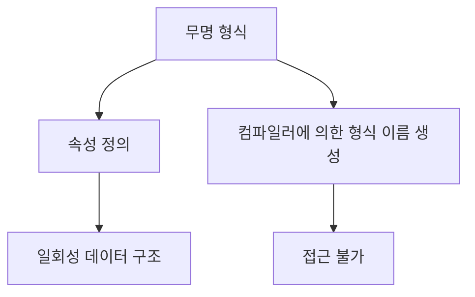

이 다이어그램은 무명 형식의 주요 특징과 사용 목적을 간단하게 나타낸다. 무명 형식은 속성을 정의하고, 컴파일러에 의해 형식 이름이 생성되며, 일회성 데이터 구조로 활용된다. 이러한 특성 덕분에 무명 형식은 C#에서 매우 유용한 기능으로 자리 잡고 있다.

<!--
## 무명 형식의 생성
- `new` 연산자와 개체 이니셜라이저
- 예제: 기본적인 무명 형식 생성
-->

## 무명 형식의 생성

무명 형식은 C#에서 간편하게 데이터를 그룹화할 수 있는 방법을 제공한다. 이 형식은 주로 `new` 연산자와 개체 이니셜라이저를 사용하여 생성된다. 무명 형식은 이름이 없기 때문에, 주로 일회성 데이터 구조를 만들 때 유용하다.

### **`new` 연산자와 개체 이니셜라이저**

무명 형식을 생성하기 위해서는 `new` 연산자를 사용하고, 그 뒤에 중괄호 `{}`를 사용하여 개체 이니셜라이저를 정의한다. 이때, 각 속성의 이름과 값을 지정하여 초기화할 수 있다. 다음은 무명 형식을 생성하는 기본적인 예제이다.

```csharp
var person = new 
{
    Name = "John Doe",
    Age = 30,
    IsEmployed = true
};
```

위의 코드에서 `person`은 무명 형식의 인스턴스이다. `Name`, `Age`, `IsEmployed`는 각각 문자열, 정수, 불리언 타입의 속성으로 초기화되었다. 이와 같이 무명 형식을 사용하면 간단하게 여러 속성을 가진 객체를 생성할 수 있다.

### **예제: 기본적인 무명 형식 생성**

아래는 무명 형식을 사용하여 학생 정보를 저장하는 예제이다. 이 예제에서는 학생의 이름, 나이, 전공을 포함하는 무명 형식을 생성한다.

```csharp
var student = new 
{
    Name = "Alice",
    Age = 22,
    Major = "Computer Science"
};

// 무명 형식의 속성에 접근
Console.WriteLine($"Name: {student.Name}, Age: {student.Age}, Major: {student.Major}");
```

위의 코드에서 `student`는 학생 정보를 담고 있는 무명 형식의 인스턴스이다. `Console.WriteLine`을 통해 각 속성에 접근하여 출력할 수 있다.

### **다이어그램**

아래는 무명 형식의 생성 과정을 나타내는 다이어그램이다.

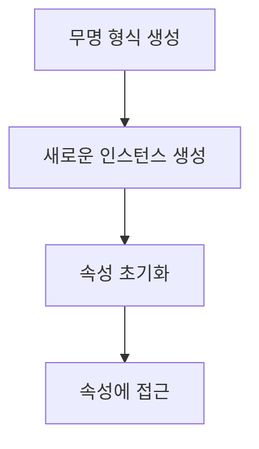

이와 같이 무명 형식은 간단하게 데이터를 그룹화하고, 필요할 때마다 쉽게 사용할 수 있는 유용한 도구이다. 무명 형식을 활용하면 코드의 가독성을 높이고, 불필요한 클래스를 정의하지 않아도 되므로 개발 효율성을 향상시킬 수 있다.

<!--
## 무명 형식의 속성
- 읽기 전용 속성의 정의
- 속성 초기화 시 유의사항
- 예제: 속성 초기화 및 타입 유추
-->

## 무명 형식의 속성

무명 형식은 간단한 데이터 구조를 정의할 수 있는 유용한 기능이다. 이 섹션에서는 무명 형식의 속성에 대해 살펴보겠다.

### 읽기 전용 속성의 정의

무명 형식의 속성은 기본적으로 읽기 전용이다. 이는 속성이 초기화된 후 변경할 수 없음을 의미한다. 읽기 전용 속성은 주로 데이터의 불변성을 보장하기 위해 사용된다. 무명 형식의 속성은 생성자에서 초기화되며, 이후에는 값을 변경할 수 없다.

### 속성 초기화 시 유의사항

무명 형식의 속성을 초기화할 때는 몇 가지 유의사항이 있다. 첫째, 속성의 타입은 컴파일러에 의해 자동으로 유추된다. 둘째, 속성 초기화는 생성자에서만 가능하며, 이후에는 값을 변경할 수 없다. 이러한 특성은 무명 형식의 사용을 간편하게 하지만, 초기화 시 주의가 필요하다.

### 예제: 속성 초기화 및 타입 유추

다음은 무명 형식을 사용하여 속성을 초기화하는 예제이다.

```csharp
var person = new 
{
    Name = "John Doe",
    Age = 30
};

// 속성에 접근
Console.WriteLine($"Name: {person.Name}, Age: {person.Age}");
```

위의 코드에서 `person`이라는 무명 형식의 인스턴스를 생성하고, `Name`과 `Age`라는 두 개의 속성을 정의하였다. 이 속성들은 각각 문자열과 정수로 초기화되며, 컴파일러는 이 타입을 자동으로 유추한다.

### 다이어그램

다음은 무명 형식의 속성 초기화 과정을 나타내는 다이어그램이다.

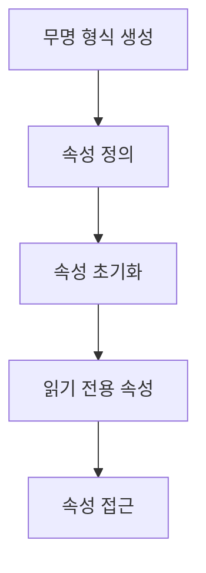

이 다이어그램은 무명 형식의 생성부터 속성 정의, 초기화, 읽기 전용 속성의 특성, 그리고 속성 접근까지의 과정을 시각적으로 나타낸다. 무명 형식의 속성은 이러한 과정을 통해 간편하게 데이터를 표현할 수 있도록 돕는다.

<!--
## LINQ와 무명 형식
- 쿼리 식에서의 사용
- 예제: LINQ 쿼리에서 무명 형식 활용
-->

## LINQ와 무명 형식

LINQ (Language Integrated Query)는 C#에서 데이터 쿼리를 보다 간편하게 작성할 수 있도록 도와주는 기능이다. 무명 형식은 LINQ 쿼리에서 매우 유용하게 사용될 수 있으며, 특히 쿼리 결과를 간단하게 표현할 수 있는 방법을 제공한다. 무명 형식을 사용하면 복잡한 데이터 구조를 정의하지 않고도 필요한 데이터만을 쉽게 추출할 수 있다.

**쿼리 식에서의 사용**

LINQ 쿼리 식에서 무명 형식을 사용하면, 쿼리 결과를 간단하게 표현할 수 있다. 예를 들어, 데이터베이스에서 특정 조건을 만족하는 데이터의 일부 속성만을 선택하여 반환할 때 무명 형식을 활용할 수 있다. 이 경우, 별도의 클래스를 정의할 필요 없이, 쿼리 결과를 무명 형식으로 직접 생성할 수 있다.

**예제: LINQ 쿼리에서 무명 형식 활용**

다음은 LINQ 쿼리에서 무명 형식을 활용하는 간단한 예제이다. 이 예제에서는 학생 목록에서 이름과 점수만을 선택하여 무명 형식으로 반환한다.

```csharp
using System;
using System.Collections.Generic;
using System.Linq;

public class Student
{
    public string Name { get; set; }
    public int Score { get; set; }
}

public class Program
{
    public static void Main()
    {
        List<Student> students = new List<Student>
        {
            new Student { Name = "Alice", Score = 85 },
            new Student { Name = "Bob", Score = 92 },
            new Student { Name = "Charlie", Score = 78 }
        };

        var query = from student in students
                    where student.Score > 80
                    select new { student.Name, student.Score };

        foreach (var result in query)
        {
            Console.WriteLine($"Name: {result.Name}, Score: {result.Score}");
        }
    }
}
```

위의 코드에서 `select new { student.Name, student.Score }` 부분이 무명 형식을 생성하는 부분이다. 이 쿼리는 점수가 80점 이상인 학생의 이름과 점수를 포함하는 무명 형식의 객체를 반환한다. 결과적으로, 각 학생의 이름과 점수를 출력하게 된다.

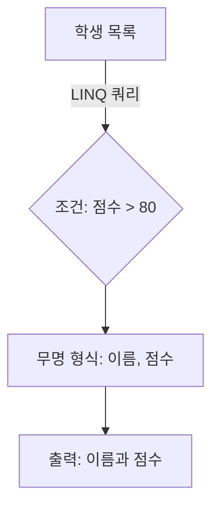

위의 다이어그램은 LINQ 쿼리의 흐름을 나타낸다. 학생 목록에서 조건을 만족하는 데이터를 필터링하고, 무명 형식으로 결과를 생성하여 출력하는 과정을 보여준다. 이처럼 LINQ와 무명 형식을 결합하면 코드의 가독성을 높이고, 필요한 데이터만을 간편하게 처리할 수 있다.

<!--
## 무명 형식의 멤버 이름
- 컴파일러에 의한 멤버 이름 지정
- 예제: 멤버 이름 지정 및 사용
-->

## 무명 형식의 멤버 이름

무명 형식(Anonymous Types)은 C#에서 주로 데이터 구조를 간단하게 표현하기 위해 사용된다. 이 형식의 멤버 이름은 컴파일러에 의해 자동으로 지정되며, 개발자가 직접 이름을 지정할 수 없다. 이러한 특성은 무명 형식의 사용을 간편하게 하지만, 동시에 멤버 이름의 의미를 명확히 이해하는 것이 중요하다.

**컴파일러에 의한 멤버 이름 지정**

무명 형식의 멤버 이름은 컴파일러가 생성하는데, 일반적으로 속성의 이름은 초기화할 때 사용한 변수 이름을 기반으로 한다. 예를 들어, 다음과 같은 코드에서 `Name`과 `Age`라는 속성이 자동으로 생성된다.

```csharp
var person = new { Name = "Alice", Age = 30 };
```

위 코드에서 `person` 객체는 `Name`과 `Age`라는 두 개의 속성을 가지며, 이들은 각각 "Alice"와 30이라는 값을 갖는다. 이러한 방식으로 컴파일러는 속성 이름을 자동으로 지정하여 개발자가 별도로 명명할 필요가 없도록 한다.

**예제: 멤버 이름 지정 및 사용**

아래의 예제는 무명 형식을 사용하여 여러 개의 속성을 가진 객체를 생성하고, 이를 출력하는 방법을 보여준다.

```csharp
var student = new { FirstName = "John", LastName = "Doe", Grade = "A" };

Console.WriteLine($"Student Name: {student.FirstName} {student.LastName}, Grade: {student.Grade}");
```

이 코드는 `FirstName`, `LastName`, `Grade`라는 세 개의 속성을 가진 `student` 객체를 생성하고, 이를 출력하는 예제이다. 출력 결과는 다음과 같다.

```
Student Name: John Doe, Grade: A
```

이처럼 무명 형식의 멤버 이름은 컴파일러에 의해 자동으로 지정되며, 개발자는 이를 통해 간편하게 데이터를 표현할 수 있다.

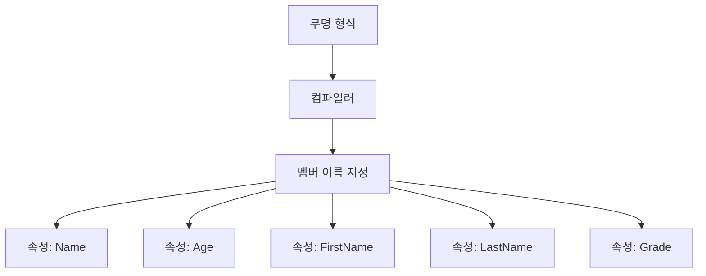

위 다이어그램은 무명 형식이 컴파일러에 의해 멤버 이름이 지정되는 과정을 시각적으로 나타낸 것이다. 이처럼 무명 형식은 간편한 데이터 구조 표현을 가능하게 하며, 개발자는 이를 통해 코드의 가독성을 높일 수 있다.

<!--
## 무명 형식과 다른 형식의 결합
- 클래스 및 구조체와의 조합
- 예제: 무명 형식과 사용자 정의 형식의 결합
-->

## 무명 형식과 다른 형식의 결합

무명 형식은 클래스 및 구조체와 결합하여 사용할 수 있는 유연한 방법을 제공한다. 이를 통해 개발자는 간단한 데이터 구조를 정의하고, 이를 다른 형식과 조합하여 보다 복잡한 데이터 모델을 구성할 수 있다. 

**클래스 및 구조체와의 조합**

무명 형식은 클래스나 구조체와 함께 사용될 수 있다. 예를 들어, 무명 형식을 사용하여 특정 속성을 가진 객체를 생성하고, 이를 클래스의 속성으로 포함시킬 수 있다. 이러한 조합은 코드의 가독성을 높이고, 데이터 구조를 보다 명확하게 표현할 수 있는 장점이 있다.

다음은 무명 형식을 클래스와 결합하여 사용하는 예제이다.

```csharp
public class Person
{
    public string Name { get; set; }
    public int Age { get; set; }
    public object Address { get; set; } // 무명 형식으로 주소 정보를 저장
}

var person = new Person
{
    Name = "John Doe",
    Age = 30,
    Address = new { Street = "123 Main St", City = "Anytown" } // 무명 형식 사용
};
```

위의 예제에서 `Address` 속성은 무명 형식으로 정의된 객체를 포함하고 있다. 이 객체는 `Street`과 `City`라는 두 개의 속성을 가지며, 이를 통해 주소 정보를 간단하게 표현할 수 있다.

**예제: 무명 형식과 사용자 정의 형식의 결합**

무명 형식은 사용자 정의 형식과 결합하여 더욱 복잡한 데이터 구조를 만들 수 있다. 다음은 사용자 정의 형식과 무명 형식을 결합한 예제이다.

```csharp
public class Order
{
    public int OrderId { get; set; }
    public string ProductName { get; set; }
    public object CustomerInfo { get; set; } // 무명 형식으로 고객 정보를 저장
}

var order = new Order
{
    OrderId = 1,
    ProductName = "Laptop",
    CustomerInfo = new { Name = "Alice", Email = "alice@example.com" } // 무명 형식 사용
};
```

위의 코드에서 `CustomerInfo` 속성은 무명 형식으로 정의된 객체를 포함하고 있다. 이 객체는 고객의 이름과 이메일 정보를 담고 있으며, 이를 통해 주문과 관련된 고객 정보를 간단하게 관리할 수 있다.

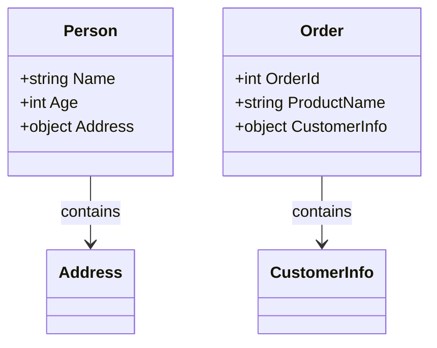

위의 다이어그램은 `Person` 클래스와 `Order` 클래스가 각각 무명 형식을 포함하고 있음을 보여준다. 이러한 구조는 데이터의 관계를 명확하게 표현하며, 코드의 유지보수성을 높이는 데 기여한다. 

무명 형식과 다른 형식의 결합은 코드의 유연성을 높이고, 복잡한 데이터 구조를 간단하게 표현할 수 있는 강력한 도구이다. 이를 통해 개발자는 보다 효율적으로 데이터를 관리하고, 가독성이 높은 코드를 작성할 수 있다.

<!--
## 암시적 형식 지역 변수
- `var` 키워드의 사용
- 예제: 암시적 형식 지역 변수와 배열
-->

## 암시적 형식 지역 변수

C#에서는 `var` 키워드를 사용하여 암시적 형식 지역 변수를 선언할 수 있다. 이 기능은 변수의 타입을 명시적으로 지정하지 않고도 컴파일러가 변수의 타입을 자동으로 유추하도록 한다. 이를 통해 코드의 가독성을 높이고, 타입 선언의 번거로움을 줄일 수 있다.

**`var` 키워드의 사용**

`var` 키워드는 지역 변수의 타입을 컴파일 타임에 결정하도록 하며, 변수의 초기화 시점에 타입이 결정된다. 따라서 `var`를 사용할 때는 반드시 초기화가 필요하며, 초기화된 값의 타입에 따라 변수의 타입이 결정된다. 예를 들어, 다음과 같은 코드가 있다.

```csharp
var number = 10; // number는 int 타입으로 유추된다.
var name = "C#"; // name은 string 타입으로 유추된다.
var numbers = new int[] { 1, 2, 3, 4, 5 }; // numbers는 int[] 타입으로 유추된다.
```

이와 같이 `var`를 사용하면 코드가 간결해지며, 타입을 명시적으로 지정할 필요가 없어 코드 작성 시 편리함을 제공한다.

**예제: 암시적 형식 지역 변수와 배열**

다음은 `var` 키워드를 사용하여 배열을 선언하고 초기화하는 예제이다. 이 예제에서는 정수형 배열을 생성하고, 배열의 요소를 출력하는 방법을 보여준다.

```csharp
var numbers = new int[] { 1, 2, 3, 4, 5 };

foreach (var number in numbers)
{
    Console.WriteLine(number);
}
```

위의 코드에서 `numbers`는 `int[]` 타입으로 유추되며, `foreach` 루프를 통해 배열의 각 요소를 출력한다. 이처럼 `var`를 사용하면 배열의 타입을 명시적으로 지정하지 않고도 쉽게 작업할 수 있다.

**다이어그램**

다음은 `var` 키워드의 사용을 설명하는 간단한 다이어그램이다.

```mermaid
graph TD;
    A[변수 선언] -->|var| B[타입 유추]
    B --> C{초기화}
    C -->|int| D[정수형 변수]
    C -->|string| E[문자열 변수]
    C -->|int[]| F[정수형 배열]
```

이 다이어그램은 `var` 키워드를 사용하여 변수를 선언할 때, 컴파일러가 초기화된 값에 따라 타입을 유추하는 과정을 보여준다. `var`는 코드의 간결함을 제공하며, 타입을 명시적으로 지정하지 않아도 되는 장점을 가지고 있다.

<!--
## 무명 형식의 특성
- `object`에서의 파생 및 캐스팅 제한
- 동일한 형식의 인스턴스 처리
- 비파괴적 변경 지원 (`with` 식)
- 예제: `with` 식을 통한 인스턴스 생성
-->

## 무명 형식의 특성

무명 형식은 C#에서 매우 유용한 기능으로, 여러 가지 특성을 가지고 있다. 이 특성들은 무명 형식을 사용할 때 고려해야 할 중요한 요소들이다.

**`object`에서의 파생 및 캐스팅 제한**

무명 형식은 `object`에서 파생될 수 없으며, 명시적인 캐스팅이 제한된다. 이는 무명 형식이 특정한 형식 이름을 가지지 않기 때문에 발생하는 제약이다. 따라서 무명 형식의 인스턴스를 `object`로 캐스팅할 수는 있지만, 다시 원래의 무명 형식으로 캐스팅하는 것은 불가능하다. 이러한 제한은 무명 형식의 사용을 더욱 안전하게 만들어준다.

**동일한 형식의 인스턴스 처리**

무명 형식의 인스턴스는 동일한 속성과 값을 가진 경우에만 동일한 형식으로 간주된다. 즉, 두 개의 무명 형식 인스턴스가 동일한 속성과 값을 가지고 있다면, 이들은 동등하다고 판단된다. 이는 무명 형식의 유용성을 높이는 요소 중 하나이다.

**비파괴적 변경 지원 (`with` 식)**

C# 9.0부터 도입된 `with` 식을 사용하면 무명 형식의 인스턴스를 비파괴적으로 변경할 수 있다. 즉, 기존의 인스턴스를 변경하지 않고 새로운 인스턴스를 생성할 수 있다. 이는 불변성을 유지하면서도 필요한 변경을 가능하게 해준다.

다음은 `with` 식을 사용하여 무명 형식의 인스턴스를 생성하는 예제이다.

```csharp
var person = new { Name = "Alice", Age = 30 };
var updatedPerson = person with { Age = 31 };

Console.WriteLine($"Name: {person.Name}, Age: {person.Age}"); // Name: Alice, Age: 30
Console.WriteLine($"Name: {updatedPerson.Name}, Age: {updatedPerson.Age}"); // Name: Alice, Age: 31
```

위의 예제에서 `updatedPerson`은 `person`의 속성 중 `Age`만 변경된 새로운 인스턴스이다. 기존의 `person` 인스턴스는 변경되지 않았다.

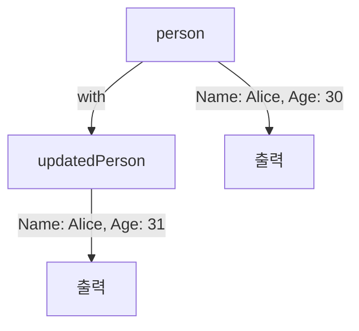

무명 형식의 이러한 특성들은 개발자가 코드를 작성할 때 유용하게 활용할 수 있는 요소들이다. 비파괴적 변경을 지원함으로써 코드의 가독성과 유지보수성을 높일 수 있다.

<!--
## 무명 형식의 제약
- 필드, 속성, 이벤트, 메서드의 반환 형식으로 사용 불가
- 메서드 매개변수로의 사용 제한
- 강력한 형식화의 중요성
-->

## 무명 형식의 제약

무명 형식은 C#에서 유용하게 사용될 수 있지만, 몇 가지 제약 사항이 존재한다. 이러한 제약 사항을 이해하는 것은 무명 형식을 효과적으로 활용하는 데 중요하다.

### 필드, 속성, 이벤트, 메서드의 반환 형식으로 사용 불가

무명 형식은 필드, 속성, 이벤트, 메서드의 반환 형식으로 사용할 수 없다. 이는 무명 형식이 이름이 없는 형식이기 때문에, 해당 형식을 참조할 수 있는 방법이 없기 때문이다. 예를 들어, 다음과 같은 코드는 컴파일 오류를 발생시킨다.

```csharp
public class Example
{
    // 무명 형식을 필드로 사용하려고 시도
    private var myField = new { Name = "John", Age = 30 }; // 오류 발생
}
```

이와 같은 제약은 무명 형식의 사용을 제한하지만, 대신에 다른 방법으로 데이터를 전달하거나 처리할 수 있다.

### 메서드 매개변수로의 사용 제한

무명 형식은 메서드의 매개변수로도 사용할 수 없다. 이는 메서드 호출 시 매개변수의 형식을 명확히 정의해야 하기 때문이다. 다음은 무명 형식을 매개변수로 사용하려고 시도한 예제이다.

```csharp
public void ProcessData(var data) // 오류 발생
{
    // 처리 로직
}
```

이와 같은 경우, 명시적인 형식을 사용해야 하며, 일반적으로는 클래스를 정의하여 사용해야 한다.

### 강력한 형식화의 중요성

무명 형식의 제약 사항은 강력한 형식화의 중요성을 강조한다. 강력한 형식화는 코드의 가독성을 높이고, 컴파일 타임에 오류를 발견할 수 있도록 도와준다. 무명 형식은 주로 간단한 데이터 구조를 표현하는 데 유용하지만, 복잡한 로직이나 데이터 구조를 다룰 때는 명시적인 형식을 사용하는 것이 바람직하다.

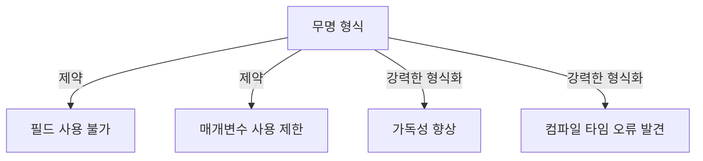

이와 같은 제약 사항을 이해하고, 적절한 상황에서 무명 형식을 활용하는 것이 중요하다. 무명 형식은 간단한 데이터 구조를 표현하는 데 유용하지만, 복잡한 로직을 다룰 때는 명시적인 형식을 사용하는 것이 더 효과적이다.

<!--
## 무명 형식의 동등성
- `Equals` 및 `GetHashCode` 메서드의 동작
- 예제: 동등성 비교
-->

## 무명 형식의 동등성

무명 형식은 C#에서 객체를 생성할 때 유용하게 사용되며, 동등성 비교에 있어서도 중요한 역할을 한다. 무명 형식의 동등성은 `Equals` 및 `GetHashCode` 메서드의 동작에 의해 결정된다. 이 두 메서드는 객체의 동등성을 판단하는 데 필수적인 요소로 작용한다.

**Equals 메서드의 동작**

`Equals` 메서드는 두 객체가 동일한지를 비교하는 데 사용된다. 무명 형식의 경우, 이 메서드는 해당 객체의 모든 속성을 비교하여 동등성을 판단한다. 즉, 두 무명 형식 인스턴스의 속성 값이 모두 동일할 경우, `Equals` 메서드는 `true`를 반환한다.

**GetHashCode 메서드의 동작**

`GetHashCode` 메서드는 객체의 해시 코드를 반환한다. 이 해시 코드는 객체를 해시 테이블과 같은 데이터 구조에 저장할 때 사용된다. 무명 형식의 경우, `GetHashCode` 메서드는 속성 값에 기반하여 해시 코드를 생성하므로, 동일한 속성 값을 가진 두 무명 형식 인스턴스는 동일한 해시 코드를 반환한다.

### 예제: 동등성 비교

다음은 무명 형식의 동등성을 비교하는 간단한 예제이다.

```csharp
var person1 = new { Name = "Alice", Age = 30 };
var person2 = new { Name = "Alice", Age = 30 };
var person3 = new { Name = "Bob", Age = 25 };

bool areEqual1 = person1.Equals(person2); // true
bool areEqual2 = person1.Equals(person3); // false

Console.WriteLine($"person1과 person2는 동등한가? {areEqual1}");
Console.WriteLine($"person1과 person3는 동등한가? {areEqual2}");
```

위의 코드에서 `person1`과 `person2`는 동일한 속성 값을 가지므로 `Equals` 메서드는 `true`를 반환한다. 반면, `person1`과 `person3`는 속성 값이 다르기 때문에 `false`를 반환한다.

### 다이어그램

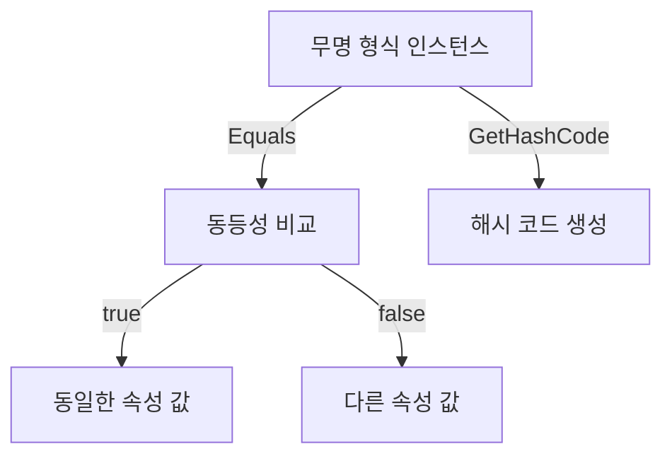

위의 다이어그램은 무명 형식 인스턴스가 `Equals` 및 `GetHashCode` 메서드를 통해 동등성을 비교하는 과정을 나타낸다. 동등성 비교의 결과에 따라 동일한 속성 값을 가진 경우와 다른 속성 값을 가진 경우로 나뉘어 진다. 

무명 형식의 동등성은 데이터 구조에서의 효율적인 검색 및 비교를 가능하게 하며, 이를 통해 개발자는 더욱 간결하고 명확한 코드를 작성할 수 있다.

<!--
## 접근성 및 범위
- 무명 형식의 접근성 수준
- 서로 다른 어셈블리 간의 비교
-->

## 접근성 및 범위

무명 형식은 C#에서 매우 유용한 기능으로, 주로 데이터 구조를 간단하게 정의할 때 사용된다. 그러나 무명 형식의 접근성 수준과 서로 다른 어셈블리 간의 비교에 대한 이해는 중요하다.

### 무명 형식의 접근성 수준

무명 형식은 기본적으로 `private` 접근성을 가진다. 이는 무명 형식이 정의된 컨텍스트 내에서만 접근할 수 있음을 의미한다. 따라서 무명 형식은 클래스나 메서드 내부에서만 사용 가능하며, 외부에서 접근할 수 없다. 이러한 특성은 무명 형식이 주로 임시 데이터 구조로 사용되도록 설계되었음을 나타낸다.

예를 들어, 다음과 같은 코드에서 무명 형식은 `Main` 메서드 내에서만 사용될 수 있다.

```csharp
class Program
{
    static void Main(string[] args)
    {
        var person = new { Name = "John", Age = 30 };
        Console.WriteLine($"Name: {person.Name}, Age: {person.Age}");
    }
}
```

위의 코드에서 `person`은 무명 형식으로, `Main` 메서드 내에서만 접근 가능하다. 다른 메서드나 클래스에서는 이 형식에 접근할 수 없다.

### 서로 다른 어셈블리 간의 비교

무명 형식은 동일한 어셈블리 내에서만 사용 가능하므로, 서로 다른 어셈블리 간에 무명 형식을 비교하는 것은 불가능하다. 이는 무명 형식이 컴파일러에 의해 생성된 임시 형식이기 때문이다. 따라서 서로 다른 어셈블리에서 동일한 무명 형식을 정의하더라도, 이들은 서로 다른 형식으로 간주된다.

다음은 서로 다른 어셈블리에서 무명 형식을 정의한 예시이다.

```csharp
// Assembly A
public class ClassA
{
    public void MethodA()
    {
        var data = new { Value = 10 };
        // ...
    }
}

// Assembly B
public class ClassB
{
    public void MethodB()
    {
        var data = new { Value = 10 };
        // ...
    }
}
```

위의 코드에서 `ClassA`와 `ClassB`는 각각 다른 어셈블리에 속하며, 두 메서드에서 정의된 무명 형식은 서로 다른 형식으로 간주된다. 따라서 이 두 형식은 비교할 수 없으며, 이는 무명 형식의 접근성과 범위의 중요한 제약 사항이다.

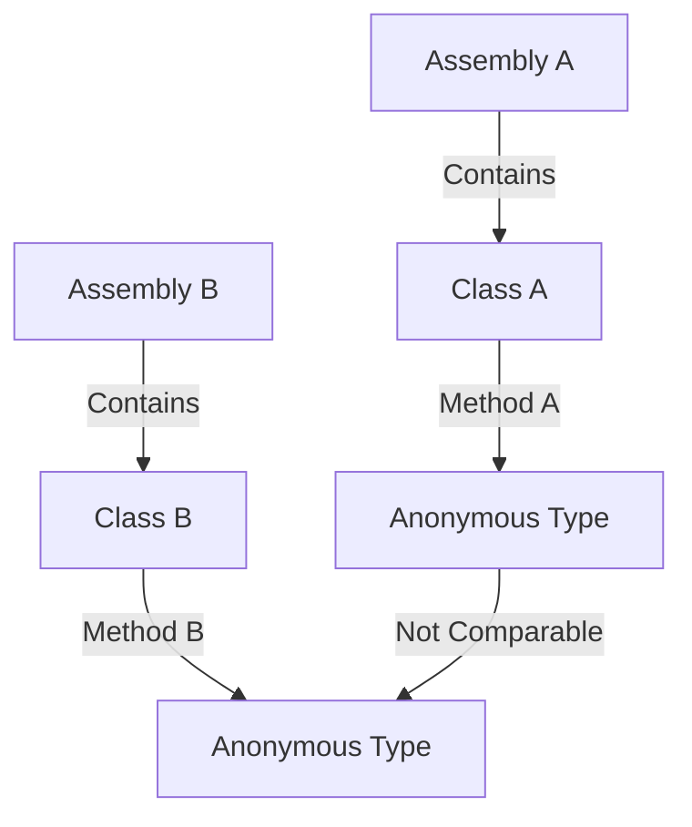

위의 다이어그램은 서로 다른 어셈블리에서 정의된 무명 형식이 비교할 수 없음을 나타낸다. 이러한 특성은 무명 형식이 주로 임시 데이터 구조로 사용되도록 설계되었음을 강조한다. 

무명 형식의 접근성과 범위에 대한 이해는 이 형식을 효과적으로 활용하는 데 중요한 요소이다.

<!--
## 무명 형식의 문자열 표현
- `ToString` 메서드의 재정의
- 예제: 무명 형식의 문자열 출력
-->

## 무명 형식의 문자열 표현

무명 형식은 간단한 데이터 구조를 정의할 수 있는 유용한 기능이다. 이 형식의 인스턴스를 문자열로 표현할 때, 기본적으로 `ToString` 메서드가 호출된다. 그러나 무명 형식의 기본 `ToString` 구현은 형식의 이름을 반환하므로, 보다 유용한 정보를 제공하기 위해 `ToString` 메서드를 재정의하는 것이 좋다.

**`ToString` 메서드의 재정의**

무명 형식에서 `ToString` 메서드를 재정의하면, 해당 인스턴스의 속성 값을 포함한 문자열을 반환할 수 있다. 이를 통해 디버깅이나 로깅 시 유용한 정보를 제공할 수 있다. 다음은 무명 형식의 `ToString` 메서드를 재정의하는 예제이다.

```csharp
var person = new 
{
    Name = "John Doe",
    Age = 30
};

string ToString()
{
    return $"Name: {Name}, Age: {Age}";
}

// 사용 예
Console.WriteLine(person.ToString());
```

위의 예제에서 `ToString` 메서드는 `Name`과 `Age` 속성의 값을 포함한 문자열을 반환한다. 이와 같이 무명 형식의 `ToString` 메서드를 재정의하면, 인스턴스의 상태를 쉽게 확인할 수 있다.

**예제: 무명 형식의 문자열 출력**

다음은 무명 형식을 사용하여 여러 속성을 가진 객체를 생성하고, 이를 문자열로 출력하는 예제이다.

```csharp
var product = new 
{
    ProductName = "Laptop",
    Price = 1200,
    Quantity = 5
};

Console.WriteLine($"Product: {product.ProductName}, Price: {product.Price}, Quantity: {product.Quantity}");
```

위의 코드에서 `product`라는 무명 형식의 인스턴스를 생성하고, 각 속성의 값을 문자열로 출력하고 있다. 이와 같은 방식으로 무명 형식의 속성을 쉽게 접근하고 출력할 수 있다.

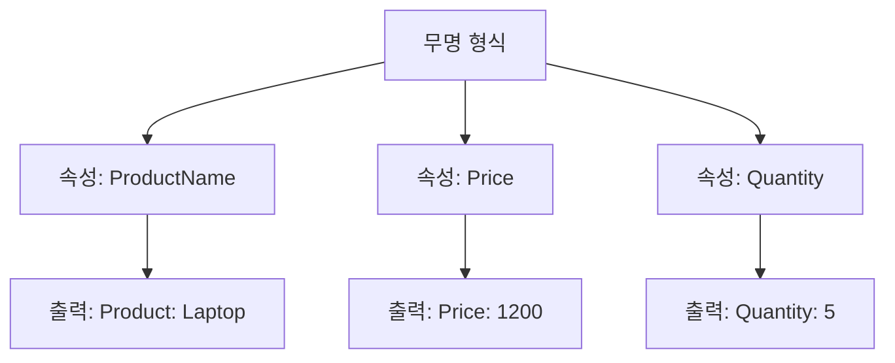

위의 다이어그램은 무명 형식의 구조를 시각적으로 나타내고 있다. 각 속성이 어떻게 연결되어 있는지를 보여주며, 최종적으로 출력되는 문자열을 이해하는 데 도움을 준다. 

무명 형식의 `ToString` 메서드를 적절히 재정의하고 활용하면, 코드의 가독성을 높이고 디버깅을 용이하게 할 수 있다.

<!--
## FAQ
- 무명 형식은 언제 사용해야 하나요?
- 무명 형식과 일반 클래스의 차이점은 무엇인가요?
- LINQ에서 무명 형식을 사용할 때의 장점은 무엇인가요?
-->

## FAQ

### 무명 형식은 언제 사용해야 하나요?

무명 형식은 주로 간단한 데이터 구조를 정의할 필요가 있을 때 유용하다. 예를 들어, 특정 데이터의 집합을 임시로 저장하고자 할 때, 별도의 클래스를 정의하는 것보다 무명 형식을 사용하는 것이 더 간편하다. 특히, LINQ 쿼리 결과를 처리할 때 무명 형식을 활용하면 코드의 가독성을 높일 수 있다.

**예제: 무명 형식 사용**

```csharp
var person = new { Name = "John", Age = 30 };
Console.WriteLine($"Name: {person.Name}, Age: {person.Age}");
```

### 무명 형식과 일반 클래스의 차이점은 무엇인가요?

무명 형식과 일반 클래스는 몇 가지 중요한 차이점이 있다. 첫째, 무명 형식은 이름이 없고, 컴파일러에 의해 자동으로 생성된 형식 이름을 가진다. 둘째, 무명 형식은 읽기 전용 속성만을 가질 수 있으며, 필드나 메서드를 정의할 수 없다. 반면, 일반 클래스는 다양한 멤버를 정의할 수 있어 더 복잡한 구조를 가질 수 있다.

**다이어그램: 무명 형식과 일반 클래스의 차이점**

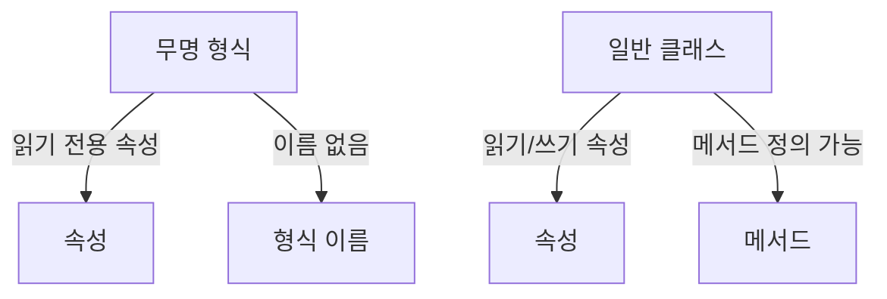

### LINQ에서 무명 형식을 사용할 때의 장점은 무엇인가요?

LINQ에서 무명 형식을 사용할 때의 주요 장점은 쿼리 결과를 간편하게 처리할 수 있다는 점이다. 무명 형식을 사용하면 쿼리 결과를 별도의 클래스를 정의하지 않고도 쉽게 다룰 수 있으며, 필요한 속성만을 포함할 수 있어 메모리 사용을 최적화할 수 있다. 또한, 코드의 가독성을 높이고 유지보수를 용이하게 한다.

**예제: LINQ 쿼리에서 무명 형식 활용**

```csharp
var people = new List<Person>
{
    new Person { Name = "Alice", Age = 25 },
    new Person { Name = "Bob", Age = 30 }
};

var result = from p in people
             select new { p.Name, p.Age };

foreach (var person in result)
{
    Console.WriteLine($"Name: {person.Name}, Age: {person.Age}");
}
```

무명 형식은 이러한 방식으로 LINQ 쿼리의 결과를 간편하게 처리할 수 있도록 도와준다.

<!--
## 관련 기술
- C#의 LINQ (Language Integrated Query)
- C#의 타입 시스템
- C#의 메모리 관리 및 가비지 컬렉션
-->

## 관련 기술

### C#의 LINQ (Language Integrated Query)

C#의 LINQ는 데이터 쿼리를 보다 간결하고 직관적으로 작성할 수 있도록 도와주는 기능이다. LINQ를 사용하면 데이터 소스에 대한 쿼리를 C# 코드 내에서 직접 작성할 수 있으며, 이는 코드의 가독성을 높이고 유지보수를 용이하게 한다. LINQ는 다양한 데이터 소스, 예를 들어 배열, 리스트, XML, 데이터베이스 등에서 사용할 수 있다.

**LINQ 쿼리 예제:**

```csharp
using System;
using System.Collections.Generic;
using System.Linq;

class Program
{
    static void Main()
    {
        var numbers = new List<int> { 1, 2, 3, 4, 5 };
        var evenNumbers = from n in numbers
                         where n % 2 == 0
                         select n;

        foreach (var num in evenNumbers)
        {
            Console.WriteLine(num);
        }
    }
}
```

위의 예제에서는 리스트에서 짝수만 필터링하여 출력하는 LINQ 쿼리를 보여준다. LINQ를 사용하면 복잡한 데이터 조작을 간단하게 수행할 수 있다.

### C#의 타입 시스템

C#의 타입 시스템은 강력한 형식 검사와 다양한 데이터 타입을 지원하는 구조로 되어 있다. C#은 기본 데이터 타입, 사용자 정의 타입, 제네릭 타입 등을 포함하여 다양한 형식을 제공한다. 이러한 타입 시스템은 코드의 안정성을 높이고, 컴파일 타임에 오류를 발견할 수 있도록 도와준다.

**타입 시스템의 예:**

```csharp
public class Person
{
    public string Name { get; set; }
    public int Age { get; set; }
}

var person = new Person { Name = "Alice", Age = 30 };
```

위의 코드에서는 `Person`이라는 사용자 정의 타입을 생성하고, 이를 통해 객체를 생성하는 예를 보여준다. C#의 타입 시스템은 이러한 사용자 정의 타입을 통해 복잡한 데이터 구조를 쉽게 표현할 수 있게 해준다.

### C#의 메모리 관리 및 가비지 컬렉션

C#은 자동 메모리 관리를 제공하며, 이를 통해 개발자는 메모리 할당과 해제를 수동으로 관리할 필요가 없다. 가비지 컬렉션(Garbage Collection)은 사용되지 않는 객체를 자동으로 감지하고 메모리를 해제하는 프로세스이다. 이는 메모리 누수를 방지하고, 애플리케이션의 성능을 향상시키는 데 기여한다.

**가비지 컬렉션의 작동 방식:**

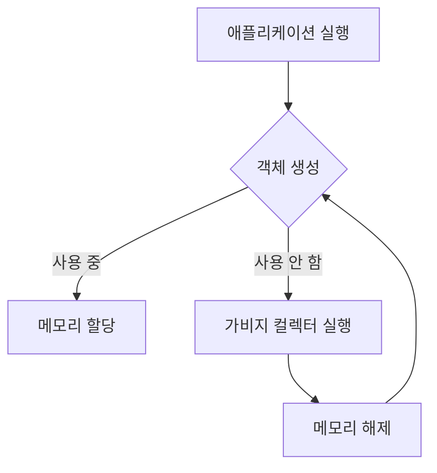

위의 다이어그램은 애플리케이션 실행 중 객체가 생성되고, 사용되지 않는 객체가 가비지 컬렉터에 의해 메모리에서 해제되는 과정을 보여준다. 이러한 자동 메모리 관리는 개발자가 메모리 관리에 대한 부담을 덜어주고, 더 나은 개발 경험을 제공한다.

<!--
## 결론
- 무명 형식의 유용성 및 활용 방안
- 향후 개발 시 고려해야 할 사항
-->

## 결론

무명 형식은 C#에서 매우 유용한 기능으로, 간단한 데이터 구조를 정의할 때 특히 유용하다. 이 형식은 코드의 가독성을 높이고, 불필요한 클래스를 생성하지 않으면서도 필요한 데이터를 그룹화할 수 있는 방법을 제공한다. 무명 형식의 활용 방안은 다음과 같다.

**무명 형식의 유용성 및 활용 방안**

무명 형식은 주로 다음과 같은 상황에서 유용하게 사용된다.

1. **간단한 데이터 구조**: 무명 형식은 간단한 데이터 구조를 정의할 때 유용하다. 예를 들어, LINQ 쿼리 결과를 저장할 때 무명 형식을 사용하면 코드가 간결해진다.

   ```csharp
   var result = from student in students
                select new { student.Name, student.Age };
   ```

2. **일회성 데이터**: 특정 메서드나 쿼리에서만 사용되는 일회성 데이터 구조를 정의할 때 무명 형식을 활용할 수 있다. 이 경우, 별도의 클래스를 정의할 필요가 없어 코드가 깔끔해진다.

3. **속성 초기화**: 무명 형식은 속성을 초기화할 때 유용하다. 예를 들어, 여러 속성을 가진 객체를 생성할 때, 무명 형식을 사용하면 초기화가 간편해진다.

   ```csharp
   var person = new { Name = "John", Age = 30 };
   ```

**향후 개발 시 고려해야 할 사항**

무명 형식을 사용할 때는 몇 가지 고려해야 할 사항이 있다.

1. **형식의 제한**: 무명 형식은 필드, 속성, 이벤트, 메서드의 반환 형식으로 사용할 수 없다. 따라서, 이러한 경우에는 일반 클래스를 사용하는 것이 좋다.

2. **유지보수성**: 무명 형식은 코드의 가독성을 높이지만, 지나치게 많은 무명 형식을 사용하면 코드의 유지보수성이 떨어질 수 있다. 따라서, 적절한 사용이 필요하다.

3. **타입 안전성**: 무명 형식은 강력한 형식화의 장점을 제공하지만, 타입 안전성을 유지하기 위해서는 사용 시 주의가 필요하다. 특히, 무명 형식의 속성에 대한 접근은 컴파일 타임에 결정되므로, 잘못된 접근은 런타임 오류를 초래할 수 있다.

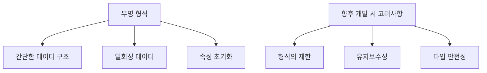

무명 형식은 C#의 강력한 기능 중 하나로, 적절히 활용하면 코드의 효율성과 가독성을 높일 수 있다. 그러나, 사용 시 주의해야 할 점도 많으므로, 상황에 맞게 적절히 활용하는 것이 중요하다.

<!--
##### Reference #####
-->

## Reference


* [https://learn.microsoft.com/ko-kr/dotnet/csharp/fundamentals/types/anonymous-types](https://learn.microsoft.com/ko-kr/dotnet/csharp/fundamentals/types/anonymous-types)

