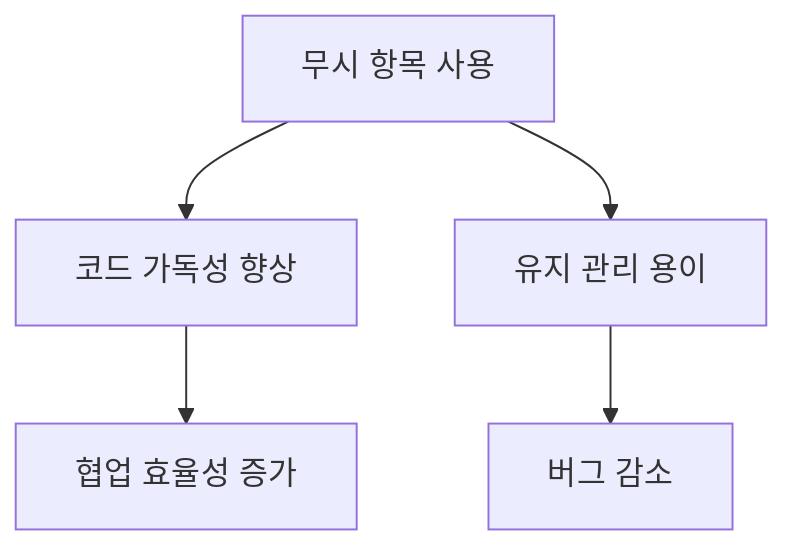
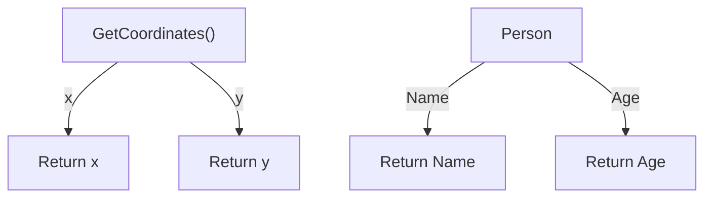
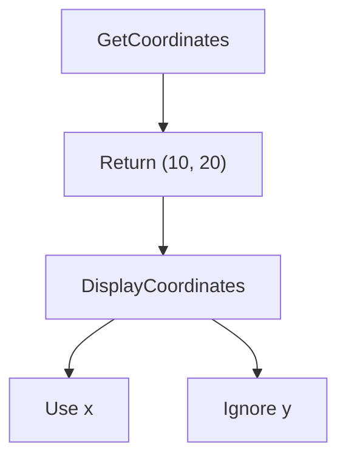
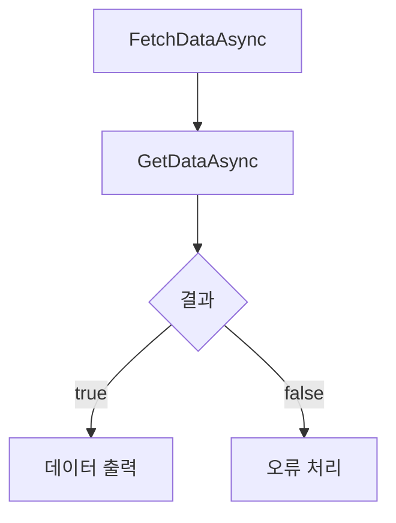
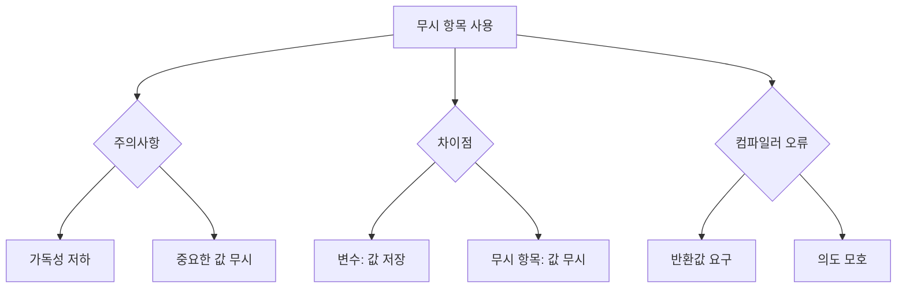
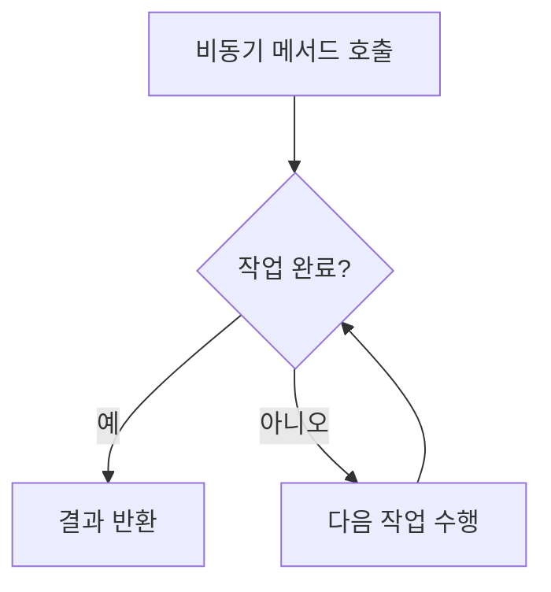
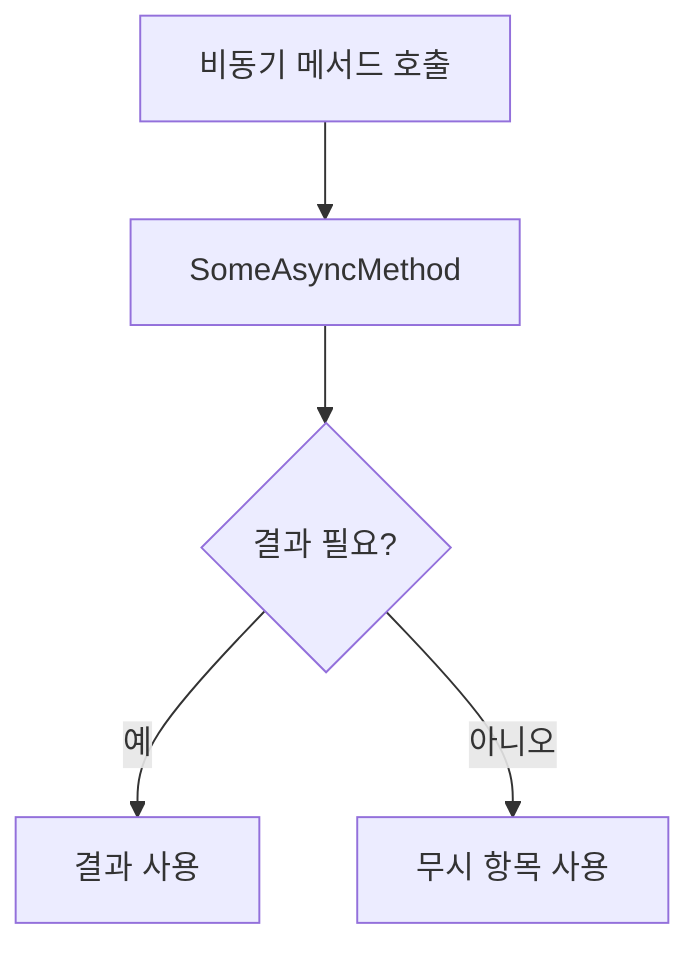
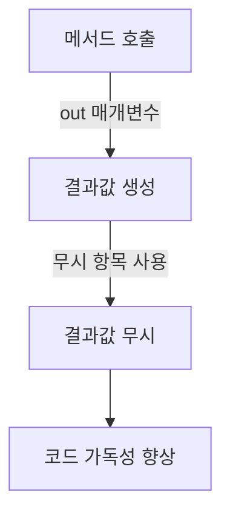

무시 항목은 C# 프로그래밍에서 중요한 개념으로, 애플리케이션 코드에서 의도적으로 사용하지 않는 자리 표시자를 의미한다. 이러한 무시 항목은 할당되지 않은 변수와 유사하게 작용하며, 값이 존재하지 않음을 나타낸다. 무시 항목을 사용함으로써 코드의 의도를 명확히 하고, 다른 개발자나 컴파일러에게 사용자가 특정 결과를 무시하고자 했음을 전달할 수 있다. 예를 들어, 튜플의 일부 요소를 무시하거나, 람다 식의 입력 매개 변수를 지정할 때 유용하게 활용된다. 무시 항목을 지정하기 위해서는 변수 이름 앞에 밑줄(`_`)을 붙여 사용하면 된다. 이와 같은 방식은 코드의 가독성을 높이고 유지 관리를 용이하게 한다. 또한, 무시 항목은 패턴 일치와 같은 다양한 프로그래밍 패턴에서도 활용되며, `out` 매개 변수를 사용하는 메서드 호출 시에도 유용하다. 이러한 무시 항목의 사용은 코드의 효율성을 높이고, 불필요한 변수 할당을 피하는 데 기여한다. C#에서 무시 항목을 적절히 활용하면, 코드의 품질과 성능을 향상시킬 수 있다.

<!--
##### Outline #####
-->

<!--
# C# 무시 항목 (Discard) 기본 사항

## 1. 개요
   - 무시 항목의 정의 및 목적
   - 코드 가독성 및 유지 관리의 중요성

## 2. 무시 항목 사용법
   - 2.1. 무시 항목의 기본 사용법
   - 2.2. 튜플 및 개체 분해에서의 무시 항목
       - 튜플 분해 예제
       - 사용자 정의 형식 분해 예제
   - 2.3. `out` 매개 변수를 사용한 메서드 호출에서의 무시 항목
   - 2.4. 독립 실행형 무시 항목의 사용
       - null 병합 연산자와의 조합
       - 비동기 작업에서의 사용

## 3. 패턴 일치와 무시 항목
   - 3.1. `switch` 식을 사용한 패턴 일치
   - 3.2. 무시 패턴의 활용

## 4. 예제
   - 4.1. 튜플을 사용한 인구 변화 예제
   - 4.2. 사용자 정의 형식 분해 예제
   - 4.3. 날짜 문자열 유효성 검사 예제
   - 4.4. 비동기 작업 예제

## 5. FAQ
   - 5.1. 무시 항목을 사용할 때의 주의사항
   - 5.2. 무시 항목과 변수의 차이점
   - 5.3. 무시 항목 사용 시 발생할 수 있는 컴파일러 오류

## 6. 관련 기술
   - 6.1. C# 튜플 (Tuple)
   - 6.2. C# 람다 식 (Lambda Expressions)
   - 6.3. C# 패턴 일치 (Pattern Matching)
   - 6.4. C# 비동기 프로그래밍 (Asynchronous Programming)

## 7. 결론
   - 무시 항목의 유용성 및 코드 품질 향상에 대한 요약
   - 향후 C# 개발에서의 무시 항목 활용 방안

## 8. 참고 항목
   - 관련 문서 및 자료 링크
   - C# 공식 문서 및 튜토리얼

이 목차는 C#의 무시 항목에 대한 포괄적인 이해를 돕기 위해 구성되었습니다. 각 섹션은 무시 항목의 개념, 사용법, 예제 및 관련 기술을 포함하여 독자가 이 주제를 깊이 있게 학습할 수 있도록 돕습니다.
-->

<!--
## 1. 개요
   - 무시 항목의 정의 및 목적
   - 코드 가독성 및 유지 관리의 중요성
-->

## 개요

**무시 항목의 정의 및 목적**

C#에서 무시 항목(Discard)은 사용하지 않는 값을 나타내기 위해 사용되는 특별한 변수이다. 주로 메서드 호출이나 데이터 구조 분해에서 필요하지 않은 값을 무시할 때 유용하다. 무시 항목은 `_` 기호로 표현되며, 이는 코드에서 해당 값을 사용하지 않겠다는 의도를 명확히 한다. 이러한 기능은 코드의 가독성을 높이고, 불필요한 변수를 선언하지 않음으로써 코드의 유지 관리성을 향상시킨다.

예를 들어, 다음과 같은 메서드가 있다고 가정해보자.

```csharp
public (int, int) GetCoordinates()
{
    return (10, 20);
}
```

이 메서드를 호출할 때, 두 번째 값을 무시하고 싶다면 다음과 같이 사용할 수 있다.

```csharp
var (x, _) = GetCoordinates();
```

위 코드에서 `_`는 두 번째 값을 무시하겠다는 의미이다.

**코드 가독성 및 유지 관리의 중요성**

코드의 가독성은 소프트웨어 개발에서 매우 중요한 요소이다. 가독성이 높은 코드는 다른 개발자들이 이해하기 쉽고, 유지 보수 작업을 수행할 때도 효율적이다. 무시 항목을 사용함으로써 불필요한 변수를 줄이고, 코드의 의도를 명확히 할 수 있다. 이는 코드 리뷰 및 협업 과정에서 큰 장점으로 작용한다.

또한, 무시 항목은 코드의 복잡성을 줄이는 데 기여한다. 예를 들어, 튜플 분해나 `out` 매개변수를 사용할 때, 필요하지 않은 값을 명시적으로 무시함으로써 코드의 흐름을 더 명확하게 할 수 있다. 이는 특히 비동기 프로그래밍이나 복잡한 데이터 구조를 다룰 때 더욱 중요하다.



위 다이어그램은 무시 항목 사용이 코드 가독성과 유지 관리에 미치는 긍정적인 영향을 시각적으로 나타낸 것이다. 무시 항목을 적절히 활용하면 코드 품질을 높이고, 개발 프로세스를 더욱 원활하게 할 수 있다.

<!--
## 2. 무시 항목 사용법
   - 2.1. 무시 항목의 기본 사용법
   - 2.2. 튜플 및 개체 분해에서의 무시 항목
       - 튜플 분해 예제
       - 사용자 정의 형식 분해 예제
   - 2.3. `out` 매개 변수를 사용한 메서드 호출에서의 무시 항목
   - 2.4. 독립 실행형 무시 항목의 사용
       - null 병합 연산자와의 조합
       - 비동기 작업에서의 사용
-->

## 무시 항목 사용법

무시 항목(Discard)은 C# 7.0에서 도입된 기능으로, 사용하지 않는 값을 명시적으로 무시할 수 있는 방법을 제공한다. 이를 통해 코드의 가독성을 높이고, 불필요한 변수 선언을 줄일 수 있다. 이번 섹션에서는 무시 항목의 다양한 사용법에 대해 살펴보겠다.

### 무시 항목의 기본 사용법

무시 항목은 `_` 기호로 표현되며, 주로 사용하지 않는 값을 나타낼 때 사용된다. 예를 들어, 메서드에서 반환되는 여러 값 중 일부를 무시하고 싶을 때 유용하다.

```csharp
var (x, _) = GetCoordinates(); // y 값은 무시
```

위의 코드에서 `GetCoordinates()` 메서드는 두 개의 값을 반환하지만, 두 번째 값인 `y`는 무시하고 `x`만 사용한다.

### 튜플 및 개체 분해에서의 무시 항목

#### **튜플 분해 예제**

튜플을 분해할 때도 무시 항목을 사용할 수 있다. 다음은 튜플을 분해하면서 특정 값을 무시하는 예제이다.

```csharp
var person = ("John", 30, "Engineer");
var (name, _, occupation) = person; // 나이는 무시
```

이 예제에서 `person` 튜플의 두 번째 요소인 나이는 무시되고, 이름과 직업만 사용된다.

#### **사용자 정의 형식 분해 예제**

사용자 정의 형식에서도 무시 항목을 사용할 수 있다. 다음은 사용자 정의 형식을 분해하면서 특정 값을 무시하는 예제이다.

```csharp
public class Person
{
    public string Name { get; set; }
    public int Age { get; set; }
}

var person = new Person { Name = "Alice", Age = 25 };
var (_, age) = (person.Name, person.Age); // 이름은 무시
```

이 경우, `Person` 클래스의 `Name` 속성은 무시되고, `Age`만 사용된다.

### `out` 매개 변수를 사용한 메서드 호출에서의 무시 항목

`out` 매개 변수를 사용하는 메서드 호출에서도 무시 항목을 활용할 수 있다. 예를 들어, 다음과 같은 메서드가 있다고 가정하자.

```csharp
bool TryParse(string input, out int result);
```

이 메서드를 호출할 때, 결과값을 무시하고 싶다면 다음과 같이 작성할 수 있다.

```csharp
if (TryParse("123", out _)) // 결과값은 무시
{
    Console.WriteLine("Parsing succeeded.");
}
```

이렇게 하면, `result` 값은 무시되고, 메서드 호출의 성공 여부만 확인할 수 있다.

### 독립 실행형 무시 항목의 사용

#### **null 병합 연산자와의 조합**

무시 항목은 null 병합 연산자(`??`)와 함께 사용할 수 있다. 다음은 이 조합을 활용한 예제이다.

```csharp
string value = null;
var result = value ?? _; // value가 null일 경우 무시
```

이 경우, `value`가 null일 때 무시 항목이 사용되며, 다른 대체 값을 제공할 수 있다.

#### **비동기 작업에서의 사용**

비동기 작업에서도 무시 항목을 사용할 수 있다. 다음은 비동기 메서드 호출에서 무시 항목을 사용하는 예제이다.

```csharp
async Task ProcessDataAsync()
{
    await SomeAsyncMethod(out _); // 결과값은 무시
}
```

이렇게 하면, 비동기 메서드의 결과값을 무시하고, 메서드 호출만 수행할 수 있다.



위의 다이어그램은 무시 항목을 사용하는 다양한 예제를 시각적으로 나타낸 것이다. 무시 항목은 코드의 가독성을 높이고, 불필요한 변수 선언을 줄이는 데 유용한 기능이다.

<!--
## 3. 패턴 일치와 무시 항목
   - 3.1. `switch` 식을 사용한 패턴 일치
   - 3.2. 무시 패턴의 활용
-->

## 패턴 일치와 무시 항목

C#에서 패턴 일치는 코드의 가독성을 높이고, 조건부 로직을 간결하게 작성할 수 있는 강력한 기능이다. 특히, 무시 항목(Discard)과 결합하여 사용하면 불필요한 변수를 선언하지 않고도 필요한 정보를 추출할 수 있다. 이 섹션에서는 `switch` 식을 사용한 패턴 일치와 무시 패턴의 활용에 대해 살펴보겠다.

### `switch` 식을 사용한 패턴 일치

`switch` 식은 다양한 조건을 간결하게 처리할 수 있는 방법을 제공한다. C# 8.0부터 도입된 패턴 일치 기능을 활용하면, 특정 조건에 따라 다양한 타입의 데이터를 처리할 수 있다. 무시 항목을 사용하면, 특정 값에 대해서는 관심이 없음을 명시적으로 나타낼 수 있다.

다음은 `switch` 식을 사용하여 패턴 일치를 구현한 예제이다.

```csharp
public void ProcessShape(object shape)
{
    switch (shape)
    {
        case Circle c:
            Console.WriteLine($"Circle with radius: {c.Radius}");
            break;
        case Rectangle r:
            Console.WriteLine($"Rectangle with width: {r.Width} and height: {r.Height}");
            break;
        case null:
            Console.WriteLine("Shape is null");
            break;
        case var _:
            Console.WriteLine("Unknown shape");
            break;
    }
}
```

위의 코드에서 `case var _:`는 모든 다른 타입의 경우를 처리하는 패턴이다. 이 경우, 무시 항목을 사용하여 특정 타입이 아닌 경우를 처리할 수 있다.

### 무시 패턴의 활용

무시 패턴은 특정 값이나 변수를 사용하지 않을 때 유용하게 활용된다. 예를 들어, 메서드에서 반환된 여러 값 중 일부만 필요할 때, 나머지 값을 무시할 수 있다. 이는 코드의 가독성을 높이고, 불필요한 변수를 선언하지 않도록 도와준다.

다음은 무시 패턴을 활용한 예제이다.

```csharp
public (int, int) GetCoordinates()
{
    return (10, 20);
}

public void DisplayCoordinates()
{
    var (x, _) = GetCoordinates(); // y 값은 무시
    Console.WriteLine($"X Coordinate: {x}");
}
```

위의 코드에서 `var (x, _) = GetCoordinates();`는 `GetCoordinates` 메서드에서 반환된 두 번째 값을 무시하고, 첫 번째 값만 사용한다. 이와 같이 무시 패턴을 활용하면, 코드가 더욱 간결해지고 가독성이 향상된다.



위의 다이어그램은 `GetCoordinates` 메서드가 호출되어 `(10, 20)`을 반환하고, `DisplayCoordinates` 메서드에서 x 값만 사용하고 y 값은 무시되는 과정을 나타낸다. 

이와 같이 패턴 일치와 무시 항목을 적절히 활용하면, C# 코드의 품질과 가독성을 크게 향상시킬 수 있다.

<!--
## 4. 예제
   - 4.1. 튜플을 사용한 인구 변화 예제
   - 4.2. 사용자 정의 형식 분해 예제
   - 4.3. 날짜 문자열 유효성 검사 예제
   - 4.4. 비동기 작업 예제
-->

## 예제

### 튜플을 사용한 인구 변화 예제

C#에서 튜플(Tuple)은 여러 값을 하나의 단위로 묶어주는 데이터 구조이다. 인구 변화 예제를 통해 무시 항목을 활용하는 방법을 살펴보겠다. 아래의 코드는 인구 통계 데이터를 튜플로 표현하고, 무시 항목을 사용하여 특정 값을 무시하는 예시이다.

```csharp
var populationData = (2023, 1000000, "서울");
var (year, _, city) = populationData; // 인구 수는 무시하고 연도와 도시만 사용

Console.WriteLine($"도시: {city}, 연도: {year}");
```

위의 코드에서 인구 수는 무시하고 연도와 도시만을 출력한다. 이처럼 무시 항목을 사용하면 코드의 가독성을 높일 수 있다.

### 사용자 정의 형식 분해 예제

사용자 정의 형식에서도 무시 항목을 활용할 수 있다. 아래의 예제는 `Person` 클래스를 정의하고, 객체 분해 시 무시 항목을 사용하는 방법을 보여준다.

```csharp
public class Person
{
    public string Name { get; set; }
    public int Age { get; set; }
}

var person = new Person { Name = "홍길동", Age = 30 };
var (name, _) = (person.Name, person.Age); // 나이는 무시

Console.WriteLine($"이름: {name}");
```

이 예제에서는 `Person` 객체에서 나이를 무시하고 이름만 출력한다. 사용자 정의 형식에서도 무시 항목을 통해 필요한 정보만을 간편하게 추출할 수 있다.

### 날짜 문자열 유효성 검사 예제

날짜 문자열의 유효성을 검사할 때도 무시 항목을 활용할 수 있다. 아래의 코드는 날짜 문자열을 파싱하고, 유효성 검사 결과를 무시하는 예시이다.

```csharp
string dateString = "2023-10-01";
bool isValidDate = DateTime.TryParse(dateString, out DateTime _); // 날짜는 무시

if (isValidDate)
{
    Console.WriteLine("유효한 날짜입니다.");
}
else
{
    Console.WriteLine("유효하지 않은 날짜입니다.");
}
```

위의 코드에서 날짜는 무시하고 유효성 검사 결과만을 사용한다. 이처럼 무시 항목을 사용하면 불필요한 변수를 선언하지 않고도 코드를 간결하게 유지할 수 있다.

### 비동기 작업 예제

비동기 작업에서도 무시 항목을 활용할 수 있다. 아래의 예제는 비동기 메서드에서 결과를 무시하는 방법을 보여준다.

```csharp
public async Task FetchDataAsync()
{
    var result = await GetDataAsync();
    var (_, data) = result; // 첫 번째 값은 무시하고 데이터만 사용

    Console.WriteLine($"데이터: {data}");
}

private async Task<(bool, string)> GetDataAsync()
{
    // 비동기 작업 수행
    await Task.Delay(1000);
    return (true, "샘플 데이터");
}
```

이 예제에서는 비동기 메서드에서 결과의 첫 번째 값을 무시하고 데이터만을 출력한다. 비동기 작업에서도 무시 항목을 통해 필요한 정보만을 간편하게 처리할 수 있다.



위의 다이어그램은 비동기 작업의 흐름을 나타낸다. 무시 항목을 활용하여 코드의 가독성을 높이고, 필요한 정보만을 간편하게 처리할 수 있다.

<!--
## 5. FAQ
   - 5.1. 무시 항목을 사용할 때의 주의사항
   - 5.2. 무시 항목과 변수의 차이점
   - 5.3. 무시 항목 사용 시 발생할 수 있는 컴파일러 오류
-->

## FAQ

### 무시 항목을 사용할 때의 주의사항

무시 항목(Discard)은 코드의 가독성을 높이고 불필요한 변수를 줄이는 데 유용하지만, 사용 시 몇 가지 주의사항이 있다. 첫째, 무시 항목을 남용하면 코드의 의도를 명확히 전달하지 못할 수 있다. 예를 들어, 메서드 호출에서 반환값을 무시하는 경우, 해당 메서드가 어떤 중요한 정보를 반환하는지 알기 어려워질 수 있다. 둘째, 무시 항목은 주로 사용하지 않는 값을 나타내기 위해 사용되므로, 실제로 필요한 값을 무시하지 않도록 주의해야 한다.

```csharp
// 무시 항목 사용 예
public void ProcessData(out int result)
{
    result = 42; // 중요한 값
}

// 호출 시 무시 항목 사용
ProcessData(out _); // 결과를 무시함
```

### 무시 항목과 변수의 차이점

무시 항목과 변수는 사용 목적이 다르다. 변수는 값을 저장하고 사용할 수 있는 반면, 무시 항목은 특정 값을 무시하고자 할 때 사용된다. 즉, 무시 항목은 값이 필요하지 않음을 명시적으로 나타내는 방법이다. 이로 인해 코드의 의도를 더욱 명확하게 전달할 수 있다.

```csharp
// 변수 사용 예
int value = GetValue(); // 값을 저장하고 사용

// 무시 항목 사용 예
_ = GetValue(); // 값을 무시하고자 할 때
```

### 무시 항목 사용 시 발생할 수 있는 컴파일러 오류

무시 항목을 사용할 때 주의해야 할 점 중 하나는 컴파일러 오류가 발생할 수 있다는 것이다. 예를 들어, 무시 항목을 사용하여 반환값을 무시할 때, 해당 메서드가 반환값을 요구하는 경우 컴파일러는 오류를 발생시킨다. 또한, 무시 항목을 잘못 사용하면 코드의 의도가 모호해질 수 있으므로, 항상 주의 깊게 사용해야 한다.

```csharp
// 잘못된 무시 항목 사용 예
int result = GetValue(); // 컴파일러 오류 발생
_ = GetValue(); // 올바른 사용
```



이와 같이 무시 항목을 사용할 때는 주의사항을 잘 숙지하고, 변수와의 차이를 이해하며, 컴파일러 오류를 피하기 위해 신중하게 사용해야 한다.

<!--
## 6. 관련 기술
   - 6.1. C# 튜플 (Tuple)
   - 6.2. C# 람다 식 (Lambda Expressions)
   - 6.3. C# 패턴 일치 (Pattern Matching)
   - 6.4. C# 비동기 프로그래밍 (Asynchronous Programming)
-->

## 관련 기술

### C# 튜플 (Tuple)

C#에서 튜플은 여러 값을 하나의 단위로 묶어주는 데이터 구조이다. 튜플을 사용하면 여러 개의 값을 반환하거나, 관련된 데이터를 그룹화하여 코드의 가독성을 높일 수 있다. 튜플은 `ValueTuple`을 사용하여 쉽게 생성할 수 있으며, 각 요소에 이름을 부여할 수도 있다.

**튜플 생성 예제:**

```csharp
var person = (Name: "John", Age: 30);
Console.WriteLine($"Name: {person.Name}, Age: {person.Age}");
```

### C# 람다 식 (Lambda Expressions)

람다 식은 익명 메서드를 정의하는 간결한 방법으로, 주로 LINQ 쿼리에서 사용된다. 람다 식을 사용하면 코드의 간결성을 높이고, 가독성을 향상시킬 수 있다. 람다 식은 입력 매개변수와 본문으로 구성되며, 여러 줄의 코드도 포함할 수 있다.

**람다 식 예제:**

```csharp
var numbers = new List<int> { 1, 2, 3, 4, 5 };
var evenNumbers = numbers.Where(n => n % 2 == 0).ToList();
```

### C# 패턴 일치 (Pattern Matching)

패턴 일치는 C# 7.0에서 도입된 기능으로, 객체의 형식이나 값을 검사하여 조건에 따라 분기할 수 있는 강력한 방법이다. `switch` 문과 함께 사용하면 코드의 가독성을 높이고, 복잡한 조건문을 간결하게 표현할 수 있다.

**패턴 일치 예제:**

```csharp
object obj = "Hello, World!";
switch (obj)
{
    case string s:
        Console.WriteLine($"String: {s}");
        break;
    case int i:
        Console.WriteLine($"Integer: {i}");
        break;
    default:
        Console.WriteLine("Unknown type");
        break;
}
```

### C# 비동기 프로그래밍 (Asynchronous Programming)

비동기 프로그래밍은 프로그램의 응답성을 높이고, I/O 작업을 효율적으로 처리할 수 있는 방법이다. C#에서는 `async`와 `await` 키워드를 사용하여 비동기 메서드를 쉽게 작성할 수 있다. 이를 통해 UI 스레드를 차단하지 않고도 긴 작업을 수행할 수 있다.

**비동기 메서드 예제:**

```csharp
public async Task<string> FetchDataAsync()
{
    using (var client = new HttpClient())
    {
        var response = await client.GetStringAsync("https://api.example.com/data");
        return response;
    }
}
```



이와 같이 C#의 관련 기술들은 무시 항목과 함께 사용될 때 코드의 가독성과 유지 보수성을 높이는 데 기여한다. 각 기술의 특성을 이해하고 적절히 활용하는 것이 중요하다.

<!--
## 7. 결론
   - 무시 항목의 유용성 및 코드 품질 향상에 대한 요약
   - 향후 C# 개발에서의 무시 항목 활용 방안
-->

## 결론

**무시 항목의 유용성 및 코드 품질 향상에 대한 요약**

C#의 무시 항목(Discard)은 코드에서 사용하지 않는 값을 간편하게 처리할 수 있는 기능이다. 이를 통해 개발자는 불필요한 변수를 선언하지 않고도 코드의 가독성을 높일 수 있다. 무시 항목을 사용하면 코드가 간결해지고, 유지 관리가 용이해지며, 특히 튜플 분해나 `out` 매개 변수를 사용할 때 유용하다. 이러한 특성은 코드 품질을 향상시키고, 개발자가 더 명확한 의도를 가지고 코드를 작성할 수 있도록 돕는다.

무시 항목을 활용하면 다음과 같은 이점이 있다:

- **가독성 향상**: 불필요한 변수를 제거하여 코드가 더 깔끔해진다.
- **유지 관리 용이**: 코드의 의도가 명확해져, 다른 개발자가 이해하기 쉬워진다.
- **성능 최적화**: 불필요한 메모리 할당을 줄여 성능을 개선할 수 있다.

**향후 C# 개발에서의 무시 항목 활용 방안**

향후 C# 개발에서는 무시 항목을 더욱 적극적으로 활용할 수 있는 방안이 있다. 예를 들어, 비동기 프로그래밍에서의 사용이나 패턴 일치와 결합하여 더욱 효율적인 코드를 작성할 수 있다. 또한, 팀 내에서 코드 스타일 가이드라인에 무시 항목 사용을 포함시켜 일관된 코드 작성 문화를 조성할 수 있다.

다음은 무시 항목을 활용한 비동기 메서드 호출의 예시 코드이다:

```csharp
public async Task ProcessDataAsync()
{
    // 비동기 작업에서 무시 항목 사용
    await SomeAsyncMethod(out _);
}

private async Task SomeAsyncMethod(out int result)
{
    // 비동기 작업 수행
    result = await Task.FromResult(42);
}
```

위의 코드에서 `out _`을 사용하여 `SomeAsyncMethod`의 결과를 무시하고, 필요한 경우에만 결과를 사용할 수 있다. 이러한 방식은 코드의 명확성을 높이고, 불필요한 변수를 줄이는 데 기여한다.



이와 같이 무시 항목은 C# 개발에서 코드 품질을 높이고, 개발자의 생산성을 향상시키는 데 중요한 역할을 할 수 있다. 앞으로도 무시 항목을 적절히 활용하여 더 나은 코드를 작성하는 것이 필요하다.

<!--
## 8. 참고 항목
   - 관련 문서 및 자료 링크
   - C# 공식 문서 및 튜토리얼
-->

## 참고 항목

### 관련 문서 및 자료 링크

C#의 무시 항목(Discard)에 대한 이해를 돕기 위해 다음과 같은 자료를 참고할 수 있다.

- [C# Programming Guide](https://docs.microsoft.com/en-us/dotnet/csharp/programming-guide/)  
  C# 프로그래밍에 대한 포괄적인 가이드를 제공하며, 다양한 주제를 다루고 있다.

- [C# 7.0 Features](https://docs.microsoft.com/en-us/dotnet/csharp/whats-new/csharp-7)  
  C# 7.0에서 도입된 새로운 기능들에 대한 설명이 포함되어 있으며, 무시 항목도 이 중 하나이다.

### C# 공식 문서 및 튜토리얼

C#의 공식 문서와 튜토리얼은 개발자들이 언어를 배우고 활용하는 데 큰 도움이 된다. 다음은 유용한 링크들이다.

- [C# Documentation](https://docs.microsoft.com/en-us/dotnet/csharp/)  
  C#의 공식 문서로, 언어의 기본부터 고급 기능까지 다양한 내용을 포함하고 있다.

### 샘플 코드

아래는 무시 항목을 사용하는 간단한 예제 코드이다.

```csharp
public void ProcessData(out int result)
{
    result = 42; // 실제 처리 로직
}

// 메서드 호출 시 무시 항목 사용
ProcessData(out _);
```

이 코드는 `ProcessData` 메서드를 호출할 때 결과값을 무시하고, `_`를 사용하여 가독성을 높인다.

### 다이어그램

아래는 무시 항목의 사용을 설명하는 다이어그램이다.



이 다이어그램은 메서드 호출 시 무시 항목을 사용하여 결과값을 무시하는 과정을 시각적으로 나타낸다. 이를 통해 코드의 가독성을 높일 수 있음을 알 수 있다.

<!--
##### Reference #####
-->

## Reference


* [https://learn.microsoft.com/ko-kr/dotnet/csharp/fundamentals/functional/discards](https://learn.microsoft.com/ko-kr/dotnet/csharp/fundamentals/functional/discards)

