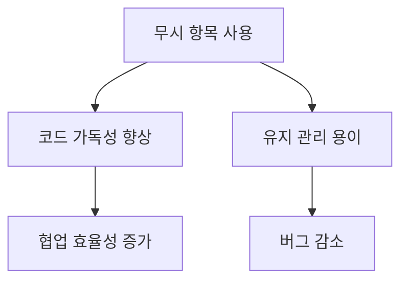
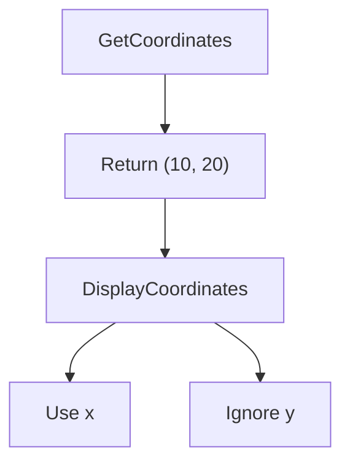
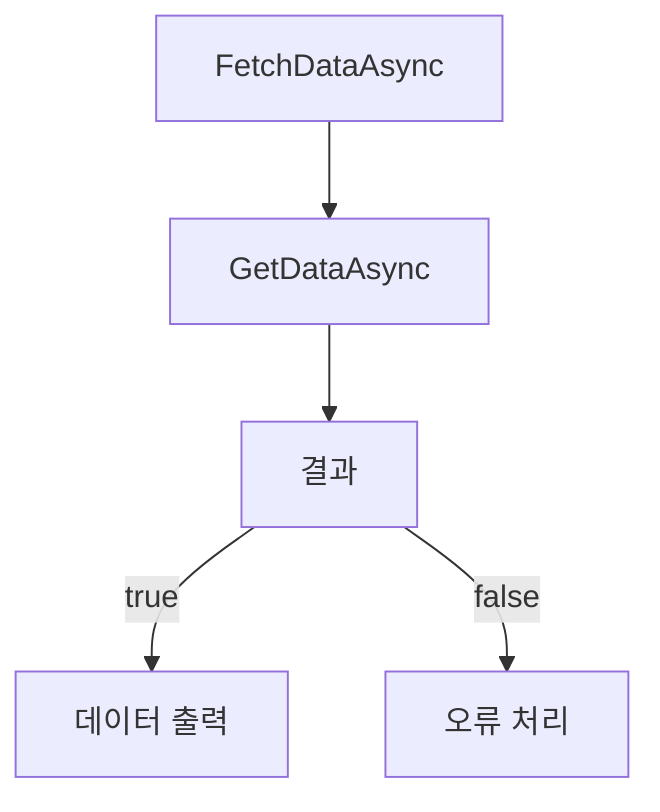
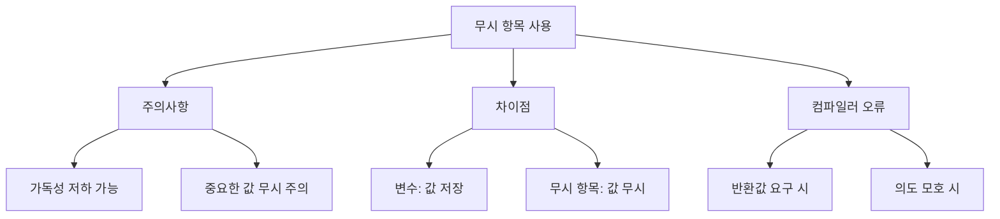
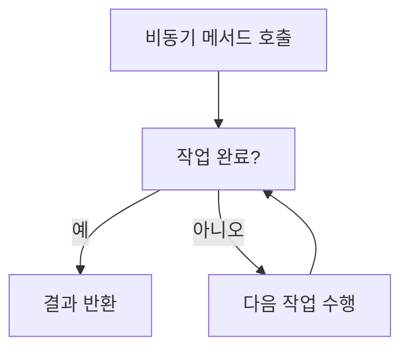
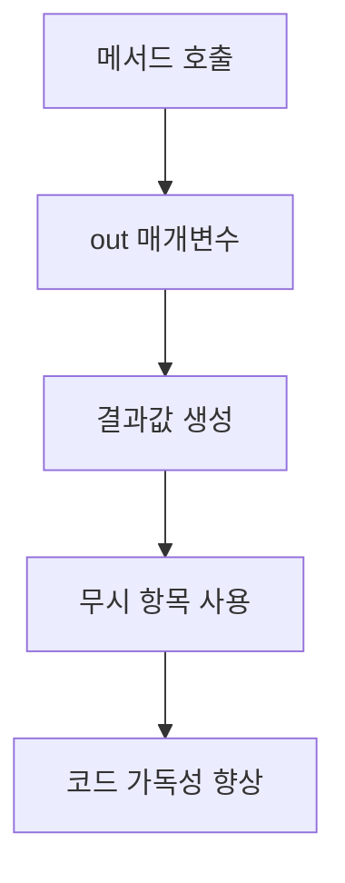

C#의 **무시 항목(Discard)**은 애플리케이션 코드에서 의도적으로 사용하지 않는 자리 표시자를 나타내는 특별한 변수이다. 할당되지 않은 변수와 같이 값이 없으며, 컴파일러와 다른 개발자에게 "이 식의 결과는 의도적으로 무시한다"는 의도를 전달한다. 밑줄(`_`) 하나로 표현하며, 튜플 분해·`out` 매개 변수·패턴 일치·람다 식 등 다양한 상황에서 불필요한 변수 선언을 줄이고 가독성과 유지 보수성을 높인다.

## 개요

### 무시 항목의 정의 및 목적

무시 항목은 C# 7.0에서 도입된 기능으로, **사용하지 않는 값을 명시적으로 무시**하기 위한 문법이다. 변수 이름으로 `_`를 사용하면 해당 위치의 값은 할당·참조되지 않으며, "필요 없음"을 코드로 표현할 수 있다.

- **목적**: 불필요한 변수 선언 제거, 의도 전달, 컴파일러 경고 억제(예: 사용하지 않는 `out` 결과).
- **적용 맥락**: 튜플·객체 분해, `TryParse` 등 `out` 인자, `switch`/패턴 일치, 람다의 사용하지 않는 인자, 독립 실행형 무시(할당만 하고 값은 사용하지 않음).

다음은 튜플에서 두 번째 값만 무시하는 기본 예이다.

```csharp
public (int, int) GetCoordinates()
{
    return (10, 20);
}

var (x, _) = GetCoordinates(); // y는 무시
```

### 코드 가독성 및 유지 관리

가독성이 높은 코드는 팀 협업과 유지 보수에 유리하다. 무시 항목을 쓰면 "이 값은 쓰지 않는다"는 것이 명확해져, 불필요한 변수 이름을 만들지 않아도 되고, 코드 리뷰 시 의도가 잘 전달된다. 특히 튜플·`Deconstruct`·`out`을 많이 쓰는 코드에서 노이즈가 줄어든다.


```mermaid
graph TD
    UseDiscard["무시 항목 사용"]
    Readability["코드 가독성 향상"]
    Maintainability["유지 관리 용이"]
    CollabEfficiency["협업 효율성 증가"]
    BugReduction["버그 감소"]
    UseDiscard --> Readability
    UseDiscard --> Maintainability
    Readability --> CollabEfficiency
    Maintainability --> BugReduction
```

---

## 무시 항목 사용법

### 기본 사용법

무시 항목은 `_` 한 개로 표현한다. 튜플 분해·메서드 반환값·`out` 인자 등에서 "이 자리는 사용하지 않음"을 나타낼 때 쓴다.

```csharp
var (x, _) = GetCoordinates(); // y 값은 무시
```

동일 스코프에서 여러 개의 무시 항목을 쓸 수 있으며, 각각 별도의 "무시"로 취급된다(실제 변수는 하나만 선언 가능하므로 구분이 된다).

### 튜플 및 개체 분해에서의 무시 항목

#### 튜플 분해 예제

튜플을 분해할 때 관심 없는 요소는 `_`로 건너뛴다.

```csharp
var person = ("John", 30, "Engineer");
var (name, _, occupation) = person; // 나이는 무시
```

#### 사용자 정의 형식 분해 예제

`Deconstruct`가 정의된 타입에서도 분해 시 일부만 받고 나머지는 무시할 수 있다.

```csharp
public class Person
{
    public string Name { get; set; }
    public int Age { get; set; }
}

var person = new Person { Name = "Alice", Age = 25 };
var (_, age) = (person.Name, person.Age); // 이름은 무시, 나이만 사용
```

`Deconstruct(out string fname, out string lname, out string city, out string state)`처럼 여러 `out`을 반환하는 경우에도 필요한 것만 변수로 받고 나머지는 `_`로 무시할 수 있다.

#### 인구 변화 예제(튜플)

여러 요소 중 일부만 쓰는 전형적인 예는 인구 통계 튜플이다.

```csharp
var (_, _, _, pop1, _, pop2) = QueryCityDataForYears("New York City", 1960, 2010);
Console.WriteLine($"Population change, 1960 to 2010: {pop2 - pop1:N0}");
```

### `out` 매개 변수를 사용한 메서드 호출

`out` 인자의 값을 사용하지 않고 성공 여부만 보고 싶을 때 무시 항목을 쓰면, 불필요한 변수 선언과 컴파일러 경고를 피할 수 있다.

```csharp
if (DateTime.TryParse("2023-10-01", out _))
{
    Console.WriteLine("유효한 날짜입니다.");
}
```

### 독립 실행형 무시 항목

**독립 실행형 무시**는 할당문에서 왼쪽에 `_`만 두어 "이 식은 부수 효과만 필요하고 결과값은 쓰지 않는다"를 나타낼 때 사용한다.

#### null 검사와 함께 사용

인자가 null이면 예외를 던지고, null이 아니면 다음 로직을 수행하는 패턴에서 할당 결과는 필요 없으므로 무시한다.

```csharp
public static void Method(string arg)
{
    _ = arg ?? throw new ArgumentNullException(paramName: nameof(arg), message: "arg can't be null");
    // arg 사용
}
```

#### 비동기 작업에서의 사용

`Task`를 반환하는 비동기 메서드를 기다리지 않고 실행만 시키고 싶을 때, 반환된 `Task`를 변수에 담지 않으면 "미기다림" 경고(CS4014)가 날 수 있다. 이때 `_ = Task.Run(...);`처럼 독립 실행형 무시에 할당하면 "의도적으로 기다리지 않음"을 표현하고 경고를 없앨 수 있다.

```csharp
private static async Task ExecuteAsyncMethods()
{
    Console.WriteLine("About to launch a task...");
    _ = Task.Run(() =>
    {
        // 장시간 작업; 예외는 관찰되지 않음에 유의
        Console.WriteLine("Completed looping operation...");
    });
    await Task.Delay(5000);
    Console.WriteLine("Exiting after 5 second delay");
}
```


```mermaid
graph TD
    GetCoords["GetCoordinates"]
    ReturnTuple["Return (10, 20)"]
    DisplayCoords["DisplayCoordinates"]
    UseX["Use x"]
    IgnoreY["Ignore y"]
    GetCoords --> ReturnTuple
    ReturnTuple --> DisplayCoords
    DisplayCoords --> UseX
    DisplayCoords --> IgnoreY
```

---

## 패턴 일치와 무시 항목

### switch 식·switch 문에서의 무시 패턴

`switch` 식이나 `switch` 문에서 **무시 패턴** `_`는 "그 외 모든 경우"를 처리할 때 사용한다. `null`을 포함한 모든 식이 무시 패턴과 일치한다.

```csharp
static void ProvidesFormatInfo(object? obj) =>
    Console.WriteLine(obj switch
    {
        IFormatProvider fmt => $"{fmt.GetType()} object",
        null => "A null object reference",
        _ => "Some object type without format information"
    });
```

`case var _:` 형태로도 사용할 수 있다(구문에 따라 다름).

### 무시 패턴의 활용

튜플·메서드 반환값 등에서 필요한 부분만 변수로 받고 나머지는 `_`로 무시하는 패턴을 일관되게 적용하면 조건 분기와 데이터 추출이 간결해진다.

```csharp
var (x, _) = GetCoordinates();
Console.WriteLine($"X Coordinate: {x}");
```


```mermaid
graph TD
    GetCoordsNode["GetCoordinates"]
    ReturnTupleNode["Return (10, 20)"]
    DisplayNode["DisplayCoordinates"]
    UseXNode["Use x"]
    IgnoreYNode["Ignore y"]
    GetCoordsNode --> ReturnTupleNode
    ReturnTupleNode --> DisplayNode
    DisplayNode --> UseXNode
    DisplayNode --> IgnoreYNode
```

---

## 실전 예제

### 날짜 문자열 유효성 검사

여러 날짜 문자열에 대해 유효성만 검사하고, 파싱된 `DateTime` 값은 쓰지 않을 때 `out _`를 사용한다.

```csharp
string[] dateStrings = { "05/01/2018 14:57:32.8", "5/01/2018", "16-05-2018 1:00:32 PM" };
foreach (string dateString in dateStrings)
{
    if (DateTime.TryParse(dateString, out _))
        Console.WriteLine($"'{dateString}': valid");
    else
        Console.WriteLine($"'{dateString}': invalid");
}
```

### 비동기 메서드에서 튜플 결과 일부만 사용

비동기 메서드가 `(bool success, string data)` 같은 튜플을 반환할 때, 성공 여부는 무시하고 데이터만 쓰는 경우다.

```csharp
public async Task FetchDataAsync()
{
    var result = await GetDataAsync();
    var (_, data) = result; // 첫 번째 값(성공 여부)은 무시
    Console.WriteLine($"데이터: {data}");
}

private async Task<(bool, string)> GetDataAsync()
{
    await Task.Delay(1000);
    return (true, "샘플 데이터");
}
```


```mermaid
graph TD
    FetchAsync["FetchDataAsync"]
    GetAsync["GetDataAsync"]
    ResultNode["결과"]
    OutputData["데이터 출력"]
    ErrorHandling["오류 처리"]
    FetchAsync --> GetAsync
    GetAsync --> ResultNode
    ResultNode -->|"true"| OutputData
    ResultNode -->|"false"| ErrorHandling
```

---

## FAQ 및 주의사항

### 무시 항목 사용 시 주의사항

- **남용 금지**: 필요한 값을 잘못 무시하면 버그로 이어질 수 있으므로, 정말 사용하지 않는 값만 `_`로 표시한다.
- **독립 실행형 무시**: `_`가 이미 같은 스코프에서 일반 변수로 선언되어 있으면, `_ = ...`는 그 변수에 할당된다. 무시 항목으로 인식되는 컨텍스트에서만 `_`를 사용해야 한다.
- **비동기 `_ = Task.Run(...)`**: 예외가 발생해도 호출 쪽에서 기다리지 않으므로 예외가 관찰되지 않을 수 있다. 화재 후 망각(fire-and-forget) 시 의도적으로 사용할 때만 적용한다.

### 무시 항목과 변수의 차이

| 구분 | 변수 | 무시 항목 |
|------|------|-----------|
| 목적 | 값을 저장하고 이후 참조 | 해당 자리의 값을 사용하지 않음을 표시 |
| 선언 | 이름을 부여해 재사용 | `_`만 사용, 재참조 불가 |
| 스코프 | 변수 스코프 내에서 유효 | 해당 식/문맥에서만 "무시"로 처리 |

```csharp
int value = GetValue();   // 변수: 저장 후 사용
_ = GetValue();            // 무시: 결과는 사용하지 않음
```

### 컴파일러 오류·경고

- `_`를 무시 항목이 아닌 일반 변수처럼 읽거나 재할당하려 하면 CS0103 등이 발생할 수 있다. "이름 '_'이(가) 현재 컨텍스트에 없습니다"는 무시된 값에 접근하려 할 때 흔히 나온다.
- 무시 항목이 허용되지 않는 위치(예: 일부 오버로드 해결·람다 매개변수 제한)에서 `_`를 쓰면 해당 컨텍스트의 오류나 경고를 유의해서 확인한다.


```mermaid
graph TD
    UseDiscardFAQ["무시 항목 사용"]
    CautionBranch["주의사항"]
    ReadabilityDown["가독성 저하 가능"]
    ImportantIgnore["중요한 값 무시 주의"]
    DiffBranch["차이점"]
    VarStore["변수: 값 저장"]
    DiscardIgnore["무시 항목: 값 무시"]
    ErrorBranch["컴파일러 오류"]
    ReturnRequired["반환값 요구 시"]
    IntentAmbiguous["의도 모호 시"]
    UseDiscardFAQ --> CautionBranch
    UseDiscardFAQ --> DiffBranch
    UseDiscardFAQ --> ErrorBranch
    CautionBranch --> ReadabilityDown
    CautionBranch --> ImportantIgnore
    DiffBranch --> VarStore
    DiffBranch --> DiscardIgnore
    ErrorBranch --> ReturnRequired
    ErrorBranch --> IntentAmbiguous
```

---

## 관련 기술

- **C# 튜플(Tuple)**  
  여러 값을 한 단위로 다룰 때 사용하며, 분해 시 무시 항목과 함께 쓰면 필요한 요소만 골라 쓸 수 있다.

- **C# 람다 식**  
  사용하지 않는 매개 변수는 `_`로 표시할 수 있다(예: `(_, x) => x * 2`). 람다 입력 매개 변수에서의 무시 항목은 언어/버전별로 지원 범위가 다르므로 문서를 참고한다.

- **C# 패턴 일치**  
  `switch` 식·`is` 패턴·무시 패턴 `_`를 함께 사용하면 타입·값 분기가 간결해진다.

- **C# 비동기 프로그래밍**  
  `async`/`await`와 `Task` 반환값을 기다리지 않을 때 `_ = Task.Run(...)` 형태로 의도를 드러낼 수 있다.


```mermaid
graph TD
    AsyncCall["비동기 메서드 호출"]
    WorkDone["작업 완료?"]
    ReturnResult["결과 반환"]
    NextWork["다음 작업 수행"]
    AsyncCall --> WorkDone
    WorkDone -->|"예"| ReturnResult
    WorkDone -->|"아니오"| NextWork
    NextWork --> WorkDone
```

---

## 결론

- **요약**  
  무시 항목(`_`)은 "사용하지 않는 값"을 명시하는 C# 문법으로, 튜플·객체 분해·`out`·패턴 일치·독립 실행형 할당 등에서 불필요한 변수를 줄이고 의도를 분명히 한다. 가독성·유지 보수성 향상과 불필요한 할당 감소에 도움이 된다.

- **활용 방안**  
  팀 코드 스타일에서 "사용하지 않는 반환값·`out`·튜플 요소는 무시 항목으로 표시한다"는 규칙을 두면 일관성이 생긴다. 비동기 화재 후 망각·null 검사 등에서는 독립 실행형 무시를 적절히 사용하고, 예외 관찰·스레드 안전성은 별도로 고려한다.


```mermaid
graph TD
    MethodCall["메서드 호출"]
    OutParam["out 매개변수"]
    ResultCreated["결과값 생성"]
    DiscardUse["무시 항목 사용"]
    ReadabilityUp["코드 가독성 향상"]
    MethodCall --> OutParam
    OutParam --> ResultCreated
    ResultCreated --> DiscardUse
    DiscardUse --> ReadabilityUp
```

---

## Reference

- [무시 항목 - C# 기본 사항](https://learn.microsoft.com/ko-kr/dotnet/csharp/fundamentals/functional/discards)  
  C# 공식 문서: 무시 항목의 정의, 튜플·객체 분해·`out`·switch·독립 실행형 무시 설명.

- [switch 식 - C# 참조](https://learn.microsoft.com/ko-kr/dotnet/csharp/language-reference/operators/switch-expression)  
  `switch` 식과 무시 패턴(`_`)을 사용한 패턴 일치.

- [튜플 및 기타 형식 분해 - C#](https://learn.microsoft.com/ko-kr/dotnet/csharp/fundamentals/functional/deconstruct)  
  튜플·사용자 정의 형식 분해와 무시 항목을 함께 사용하는 방법.
