C#에서 형식(클래스, 구조체 또는 레코드)의 정의는 형식이 수행할 수 있는 작업을 지정하는 청사진과 같다. 개체는 기본적으로 청사진에 따라 구성 및 할당된 메모리 블록이다. 이 문서에서는 이러한 청사진과 해당 기능에 대한 개요를 제공한다. 캡슐화는 경우에 따라 개체 지향 프로그래밍의 첫 번째 원리로 인식된다. 클래스 또는 구조체는 클래스 또는 구조체 외부의 코드에 각 멤버가 액세스하는 방법을 지정할 수 있다. 클래스 또는 어셈블리 외부에서 사용하지 않으려는 메서드 및 변수를 숨겨 코딩 오류 또는 악의적인 악용 가능성을 제한할 수 있다. 형식의 ‘멤버’는 모든 메서드, 필드, 상수, 속성, 이벤트를 포함한다. C#에는 전역 변수 또는 메서드가 없으며, 프로그램의 진입점인 Main 메서드까지도 클래스나 구조체 내에 선언되어야 한다. 클래스는 상속 개념을 지원하며, 다른 클래스에서 파생되는 클래스는 기본 클래스의 모든 public, protected, internal 멤버를 자동으로 포함한다. 또한, 클래스, 구조체, 레코드는 여러 인터페이스를 구현할 수 있으며, 제네릭 형식으로 정의할 수 있다. 정적 형식은 static으로 선언할 수 있으며, 중첩 형식은 다른 클래스, 구조체 또는 레코드 내에 중첩될 수 있다. 이러한 다양한 형식의 특성과 사용법을 이해하는 것은 C# 프로그래밍의 핵심이다.

<!--
##### Outline #####
-->

<!--
# C#의 클래스, 구조체 및 레코드 개요 목차

## 1. 개요
   - C#에서 형식의 정의
   - 개체와 인스턴스의 개념

## 2. 캡슐화
   - 캡슐화의 정의
   - 접근 제어자 (Access Modifiers)
   - 관련 개념: 객체 지향 프로그래밍 (OOP)

## 3. 멤버
   - 멤버의 종류
     - 필드 (Fields)
     - 상수 (Constants)
     - 속성 (Properties)
     - 메서드 (Methods)
     - 생성자 (Constructors)
     - 이벤트 (Events)
     - 종료자 (Finalizers)
     - 인덱서 (Indexers)
     - 연산자 (Operators)
     - 중첩 형식 (Nested Types)

## 4. 접근성
   - 접근 한정자 (Access Modifiers)
   - 기본 접근성: private
   - 클라이언트 코드와의 관계

## 5. 상속
   - 상속의 개념
   - 기본 클래스와 파생 클래스
   - 추상 클래스 (Abstract Classes)
   - sealed 클래스
   - 관련 개념: 다형성 (Polymorphism)

## 6. 인터페이스
   - 인터페이스의 정의
   - 인터페이스 구현
   - 관련 개념: 다중 상속

## 7. 제네릭 형식
   - 제네릭의 정의
   - 제네릭 클래스 및 메서드
   - 예제: List<T>

## 8. 정적 형식
   - static 클래스의 정의
   - static 멤버의 사용

## 9. 중첩 형식
   - 중첩 클래스, 구조체 및 레코드의 정의

## 10. 부분 형식 (Partial Type)
   - 부분 클래스 및 메서드의 정의

## 11. 개체 이니셜라이저
   - 개체 초기화 방법

## 12. 익명 형식
   - 익명 형식의 정의 및 사용 사례

## 13. 확장 메서드
   - 확장 메서드의 정의
   - 사용 방법 및 예제

## 14. 암시적 형식 지역 변수
   - var 키워드의 사용
   - 암시적 형식의 장점

## 15. 레코드
   - 레코드의 정의
   - 값 기반 같음
   - 비파괴적 변형 (Non-destructive Mutation)
   - 레코드 클래스와 구조체의 차이

## 16. C# 언어 사양
   - C# 언어 사양의 중요성
   - 신뢰할 수 있는 소스

## 17. 개체 - 형식의 인스턴스 만들기
   - 클래스와 구조체 인스턴스의 차이
   - 메모리 할당 및 관리

## 18. 개체 ID와 값 같음 비교
   - 참조 같음과 값 같음의 차이
   - Equals 메서드의 사용

## 19. 다형성
   - 다형성의 정의
   - 가상 메서드와 재정의
   - 다형성의 예제

## 20. 결론
   - C#의 클래스, 구조체 및 레코드의 중요성
   - 객체 지향 프로그래밍의 원칙 요약

## 21. FAQ
   - C#에서 클래스와 구조체의 차이는 무엇인가요?
   - 레코드는 언제 사용해야 하나요?
   - C#에서 다형성을 어떻게 활용할 수 있나요?

## 22. 관련 기술
   - 객체 지향 프로그래밍 (OOP)
   - 디자인 패턴 (Design Patterns)
   - SOLID 원칙
   - C#의 최신 기능 (C# 9.0, C# 10.0 등)
-->

<!--
## 1. 개요
   - C#에서 형식의 정의
   - 개체와 인스턴스의 개념
-->

## 개요

C#은 객체 지향 프로그래밍(Object-Oriented Programming, OOP) 언어로, 형식(Types)을 정의하고 이를 통해 개체(Objects)를 생성하는 데 중점을 둔다. 형식은 클래스(Class), 구조체(Struct), 레코드(Record) 등 다양한 형태로 존재하며, 이러한 형식들은 프로그램에서 데이터를 구조화하고 관리하는 데 필수적이다.

**C#에서 형식의 정의**

C#에서 형식은 데이터의 구조와 동작을 정의하는 청사진이다. 형식은 두 가지 주요 카테고리로 나눌 수 있다: 값 형식(Value Types)과 참조 형식(Reference Types). 값 형식은 데이터를 직접 저장하며, 일반적으로 스택(Stack)에 저장된다. 반면, 참조 형식은 데이터의 주소를 저장하며, 힙(Heap)에 저장된다. 

예를 들어, 다음은 C#에서 클래스와 구조체를 정의하는 간단한 코드이다.

```csharp
// 클래스 정의
public class Person
{
    public string Name { get; set; }
    public int Age { get; set; }
}

// 구조체 정의
public struct Point
{
    public int X;
    public int Y;
}
```

**개체와 인스턴스의 개념**

개체는 형식의 인스턴스(instance)로, 메모리에서 실제로 존재하는 데이터 구조를 의미한다. 즉, 클래스나 구조체와 같은 형식이 메모리에 할당되어 사용될 때, 이를 개체라고 한다. 인스턴스는 형식의 구체적인 구현으로, 각 인스턴스는 고유한 상태(state)를 가질 수 있다.

다음은 개체와 인스턴스의 관계를 나타내는 다이어그램이다.

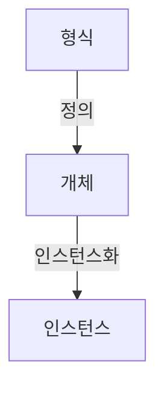

위의 다이어그램에서 형식은 개체를 정의하고, 개체는 인스턴스화되어 메모리에 할당된다. 이러한 관계를 통해 C#의 객체 지향 프로그래밍의 기본 개념을 이해할 수 있다. 

C#에서 형식과 개체의 개념은 프로그램의 구조와 설계를 이해하는 데 중요한 요소이며, 이를 통해 개발자는 더 나은 소프트웨어를 작성할 수 있다.

<!--
## 2. 캡슐화
   - 캡슐화의 정의
   - 접근 제어자 (Access Modifiers)
   - 관련 개념: 객체 지향 프로그래밍 (OOP)
-->

## 캡슐화

캡슐화는 객체 지향 프로그래밍에서 중요한 개념으로, 데이터와 그 데이터를 조작하는 메서드를 하나의 단위로 묶는 것을 의미한다. 이를 통해 객체의 내부 상태를 외부에서 직접 접근하지 못하도록 보호하고, 객체의 상태를 안전하게 유지할 수 있다. 캡슐화는 코드의 유지보수성과 재사용성을 높이는 데 기여한다.

**캡슐화의 정의**

캡슐화는 객체의 속성과 행동을 하나의 단위로 묶어 외부에서의 접근을 제한하는 기법이다. 이를 통해 객체의 내부 구현을 숨기고, 객체의 상태를 안전하게 관리할 수 있다. 캡슐화는 데이터 은닉(data hiding)과 밀접한 관련이 있으며, 객체의 속성을 직접 수정하는 것을 방지하여 데이터의 무결성을 유지할 수 있다.

**접근 제어자 (Access Modifiers)**

C#에서는 접근 제어자를 사용하여 클래스의 멤버에 대한 접근 수준을 정의할 수 있다. 주요 접근 제어자는 다음과 같다:

- **public**: 모든 코드에서 접근 가능하다.
- **private**: 해당 클래스 내에서만 접근 가능하다.
- **protected**: 해당 클래스와 파생 클래스에서 접근 가능하다.
- **internal**: 같은 어셈블리 내에서 접근 가능하다.
- **protected internal**: 같은 어셈블리 내에서 또는 파생 클래스에서 접근 가능하다.

아래는 접근 제어자를 사용하는 간단한 예제이다.

```csharp
public class Person
{
    private string name; // private 접근 제어자
    public int Age { get; set; } // public 접근 제어자

    public Person(string name, int age)
    {
        this.name = name;
        this.Age = age;
    }

    public string GetName() // public 메서드
    {
        return name; // private 멤버에 접근
    }
}
```

**관련 개념: 객체 지향 프로그래밍 (OOP)**

캡슐화는 객체 지향 프로그래밍의 핵심 원칙 중 하나로, OOP의 다른 원칙인 상속(inheritance)과 다형성(polymorphism)과 함께 사용된다. OOP는 현실 세계의 개체를 모델링하여 소프트웨어를 설계하는 방법론으로, 캡슐화를 통해 객체의 복잡성을 줄이고, 코드의 재사용성을 높일 수 있다.

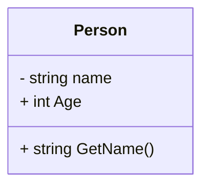

위의 다이어그램은 `Person` 클래스의 구조를 나타내며, `name` 필드는 private으로 설정되어 외부에서 직접 접근할 수 없음을 보여준다. `Age` 속성과 `GetName()` 메서드는 public으로 설정되어 외부에서 접근할 수 있다. 이러한 구조는 캡슐화의 원칙을 잘 나타내고 있다.

<!--
## 3. 멤버
   - 멤버의 종류
     - 필드 (Fields)
     - 상수 (Constants)
     - 속성 (Properties)
     - 메서드 (Methods)
     - 생성자 (Constructors)
     - 이벤트 (Events)
     - 종료자 (Finalizers)
     - 인덱서 (Indexers)
     - 연산자 (Operators)
     - 중첩 형식 (Nested Types)
-->

## 멤버

C#에서 클래스와 구조체는 다양한 멤버를 포함할 수 있으며, 이러한 멤버들은 객체의 상태와 동작을 정의하는 데 중요한 역할을 한다. 이번 섹션에서는 C#의 멤버의 종류에 대해 살펴보겠다.

### **필드 (Fields)**

필드는 클래스나 구조체의 데이터 저장소로 사용된다. 필드는 객체의 상태를 나타내며, 일반적으로 private 접근 제한자를 사용하여 캡슐화하는 것이 좋다. 필드는 다음과 같이 정의할 수 있다.

```csharp
public class Person
{
    private string name; // 필드
    private int age;     // 필드
}
```

### **상수 (Constants)**

상수는 변경할 수 없는 값을 저장하는 데 사용된다. C#에서는 `const` 키워드를 사용하여 상수를 정의할 수 있으며, 상수는 컴파일 타임에 결정된다.

```csharp
public class MathConstants
{
    public const double Pi = 3.14159; // 상수
}
```

### **속성 (Properties)**

속성은 필드에 대한 접근을 제어하는 방법으로, getter와 setter를 통해 값을 읽고 쓸 수 있다. 속성을 사용하면 데이터의 유효성을 검사하거나 추가 로직을 구현할 수 있다.

```csharp
public class Person
{
    private string name;

    public string Name // 속성
    {
        get { return name; }
        set { name = value; }
    }
}
```

### **메서드 (Methods)**

메서드는 클래스나 구조체의 동작을 정의하는 함수이다. 메서드는 매개변수를 받을 수 있으며, 반환 값을 가질 수 있다.

```csharp
public class Calculator
{
    public int Add(int a, int b) // 메서드
    {
        return a + b;
    }
}
```

### **생성자 (Constructors)**

생성자는 객체가 생성될 때 호출되는 특별한 메서드이다. 생성자는 클래스의 이름과 동일하며, 객체의 초기 상태를 설정하는 데 사용된다.

```csharp
public class Person
{
    public string Name { get; set; }
    public int Age { get; set; }

    public Person(string name, int age) // 생성자
    {
        Name = name;
        Age = age;
    }
}
```

### **이벤트 (Events)**

이벤트는 객체 간의 통신을 위한 메커니즘으로, 특정 작업이 발생했을 때 다른 객체에 알리는 데 사용된다. 이벤트는 delegate를 사용하여 정의된다.

```csharp
public class Button
{
    public event EventHandler Click; // 이벤트

    public void OnClick()
    {
        Click?.Invoke(this, EventArgs.Empty);
    }
}
```

### **종료자 (Finalizers)**

종료자는 객체가 가비지 컬렉션에 의해 수거될 때 호출되는 메서드이다. C#에서는 `~ClassName` 형식으로 정의된다. 종료자는 주로 unmanaged 리소스를 해제하는 데 사용된다.

```csharp
public class ResourceHolder
{
    ~ResourceHolder() // 종료자
    {
        // 리소스 해제 코드
    }
}
```

### **인덱서 (Indexers)**

인덱서는 객체를 배열처럼 사용할 수 있게 해주는 멤버이다. 인덱서를 사용하면 객체의 데이터를 쉽게 접근할 수 있다.

```csharp
public class StringCollection
{
    private List<string> strings = new List<string>();

    public string this[int index] // 인덱서
    {
        get { return strings[index]; }
        set { strings[index] = value; }
    }
}
```

### **연산자 (Operators)**

연산자는 클래스의 인스턴스 간의 연산을 정의하는 데 사용된다. C#에서는 연산자를 오버로딩하여 사용자 정의 연산을 구현할 수 있다.

```csharp
public class Point
{
    public int X { get; set; }
    public int Y { get; set; }

    public static Point operator +(Point p1, Point p2) // 연산자 오버로딩
    {
        return new Point { X = p1.X + p2.X, Y = p1.Y + p2.Y };
    }
}
```

### **중첩 형식 (Nested Types)**

중첩 형식은 다른 클래스나 구조체 내부에 정의된 형식이다. 중첩 형식은 외부 형식과 밀접하게 관련된 경우에 유용하다.

```csharp
public class OuterClass
{
    public class NestedClass // 중첩 클래스
    {
        public void Display()
        {
            Console.WriteLine("Hello from NestedClass");
        }
    }
}
```

### 다이어그램

다음은 C#의 멤버를 시각적으로 나타낸 다이어그램이다.

```mermaid
classDiagram
    class Person {
        - string name
        - int age
        + string Name
        + int Age
        + Person(string name, int age)
    }
    class Calculator {
        + int Add(int a, int b)
    }
    class Button {
        + event EventHandler Click
        + void OnClick()
    }
    class ResourceHolder {
        ~ResourceHolder()
    }
    class StringCollection {
        + string this[int index]
    }
    class Point {
        + int X
        + int Y
        + static Point operator +(Point p1, Point p2)
    }
    class OuterClass {
        class NestedClass {
            + void Display()
        }
    }
```

이와 같이 C#의 멤버는 다양한 형태로 객체의 상태와 동작을 정의하며, 객체 지향 프로그래밍의 핵심 요소로 작용한다.

<!--
## 4. 접근성
   - 접근 한정자 (Access Modifiers)
   - 기본 접근성: private
   - 클라이언트 코드와의 관계
-->

## 접근성

C#에서 접근성은 클래스, 구조체 및 레코드의 멤버에 대한 접근을 제어하는 중요한 개념이다. 접근 한정자(Access Modifiers)를 사용하여 멤버의 가시성을 설정할 수 있으며, 이를 통해 데이터 보호 및 캡슐화를 구현할 수 있다.

### 접근 한정자 (Access Modifiers)

C#에서는 다음과 같은 접근 한정자를 제공한다:

- **public**: 모든 코드에서 접근 가능하다.
- **private**: 해당 클래스 또는 구조체 내에서만 접근 가능하다.
- **protected**: 해당 클래스 또는 구조체와 그 파생 클래스에서 접근 가능하다.
- **internal**: 같은 어셈블리 내에서만 접근 가능하다.
- **protected internal**: 같은 어셈블리 내에서 또는 파생 클래스에서 접근 가능하다.

이러한 접근 한정자는 멤버의 가시성을 조절하여, 외부에서의 불필요한 접근을 방지하고, 클래스의 내부 구현을 숨길 수 있도록 돕는다.

```csharp
public class ExampleClass
{
    private int privateField; // 외부에서 접근 불가
    public int PublicField; // 모든 곳에서 접근 가능
    protected int ProtectedField; // 파생 클래스에서 접근 가능
    internal int InternalField; // 같은 어셈블리 내에서 접근 가능
}
```

### 기본 접근성: private

C#에서 접근 한정자를 명시하지 않으면 기본적으로 private 접근성이 적용된다. 이는 해당 멤버가 클래스 내부에서만 접근 가능하다는 것을 의미한다. 기본 접근성을 이해하는 것은 클래스 설계 시 매우 중요하다.

```csharp
public class DefaultAccess
{
    int defaultField; // 기본적으로 private
}
```

### 클라이언트 코드와의 관계

클라이언트 코드란 클래스 또는 구조체의 인스턴스를 사용하는 외부 코드를 의미한다. 접근 한정자는 클라이언트 코드가 클래스의 멤버에 어떻게 접근할 수 있는지를 결정한다. 예를 들어, public 멤버는 클라이언트 코드에서 자유롭게 접근할 수 있지만, private 멤버는 접근할 수 없다. 이러한 관계는 객체 지향 프로그래밍의 원칙 중 하나인 캡슐화의 핵심 요소이다.

```csharp
public class Client
{
    public void AccessExample()
    {
        ExampleClass example = new ExampleClass();
        example.PublicField = 10; // 접근 가능
        // example.privateField = 20; // 오류: private 멤버에 접근 불가
    }
}
```

### 다이어그램

아래는 접근 한정자에 따른 멤버 접근성을 나타내는 다이어그램이다.

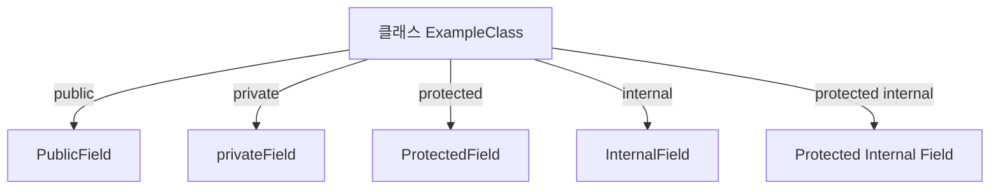

이와 같이 접근성은 클래스의 설계와 클라이언트 코드 간의 관계를 정의하는 중요한 요소이다. 적절한 접근 한정자를 사용하여 데이터 보호 및 코드의 유지보수성을 높일 수 있다.

<!--
## 5. 상속
   - 상속의 개념
   - 기본 클래스와 파생 클래스
   - 추상 클래스 (Abstract Classes)
   - sealed 클래스
   - 관련 개념: 다형성 (Polymorphism)
-->

## 상속

상속은 객체 지향 프로그래밍에서 중요한 개념으로, 기존 클래스의 속성과 메서드를 새로운 클래스에서 재사용할 수 있도록 해준다. 이를 통해 코드의 재사용성을 높이고, 유지보수를 용이하게 할 수 있다. 상속을 통해 파생 클래스는 기본 클래스의 모든 멤버를 상속받으며, 추가적인 멤버를 정의할 수 있다.

### **상속의 개념**

상속은 "is-a" 관계를 표현한다. 즉, 파생 클래스는 기본 클래스의 특성을 가지며, 기본 클래스의 기능을 확장하거나 수정할 수 있다. 예를 들어, `Animal`이라는 기본 클래스가 있을 때, `Dog`와 `Cat`은 `Animal`의 파생 클래스가 될 수 있다.

### **기본 클래스와 파생 클래스**

기본 클래스는 다른 클래스가 상속할 수 있는 클래스이며, 파생 클래스는 기본 클래스를 상속받아 기능을 확장하거나 변경하는 클래스이다. 기본 클래스는 공통된 속성과 메서드를 정의하고, 파생 클래스는 이를 기반으로 추가적인 기능을 구현한다.

```csharp
public class Animal
{
    public void Speak()
    {
        Console.WriteLine("Animal speaks");
    }
}

public class Dog : Animal
{
    public void Bark()
    {
        Console.WriteLine("Dog barks");
    }
}
```

위의 예제에서 `Dog` 클래스는 `Animal` 클래스를 상속받아 `Speak` 메서드를 사용할 수 있으며, 추가로 `Bark` 메서드를 정의하고 있다.

### **추상 클래스 (Abstract Classes)**

추상 클래스는 인스턴스를 생성할 수 없는 클래스이며, 다른 클래스에서 상속받아 사용해야 한다. 추상 클래스는 하나 이상의 추상 메서드를 포함할 수 있으며, 이 메서드는 파생 클래스에서 반드시 구현해야 한다. 이를 통해 공통된 인터페이스를 제공하면서도, 각 파생 클래스에서 구체적인 구현을 강제할 수 있다.

```csharp
public abstract class Shape
{
    public abstract double Area();
}

public class Circle : Shape
{
    public double Radius { get; set; }

    public override double Area()
    {
        return Math.PI * Radius * Radius;
    }
}
```

위의 예제에서 `Shape`는 추상 클래스이며, `Area` 메서드는 추상 메서드로 정의되어 있다. `Circle` 클래스는 `Shape`를 상속받아 `Area` 메서드를 구현하고 있다.

### **sealed 클래스**

`sealed` 클래스는 더 이상 상속될 수 없는 클래스를 의미한다. 즉, `sealed`로 선언된 클래스는 다른 클래스가 이를 상속받을 수 없으며, 이를 통해 클래스의 설계를 보호할 수 있다. 

```csharp
public sealed class FinalClass
{
    public void Display()
    {
        Console.WriteLine("This is a sealed class.");
    }
}
```

위의 예제에서 `FinalClass`는 `sealed`로 선언되어 있어, 다른 클래스가 이를 상속받을 수 없다.

### **관련 개념: 다형성 (Polymorphism)**

다형성은 객체 지향 프로그래밍의 중요한 원칙 중 하나로, 동일한 인터페이스를 통해 다양한 객체를 다룰 수 있는 능력을 의미한다. 상속을 통해 기본 클래스의 참조 변수를 사용하여 파생 클래스의 객체를 다룰 수 있으며, 이를 통해 코드의 유연성을 높일 수 있다.

```csharp
public void MakeAnimalSpeak(Animal animal)
{
    animal.Speak();
}

MakeAnimalSpeak(new Dog()); // "Animal speaks"
```

위의 예제에서 `MakeAnimalSpeak` 메서드는 `Animal` 타입의 매개변수를 받아, 다양한 동물 객체를 전달할 수 있다. 이는 다형성을 활용한 예시로, 코드의 재사용성과 유연성을 높이는 데 기여한다.

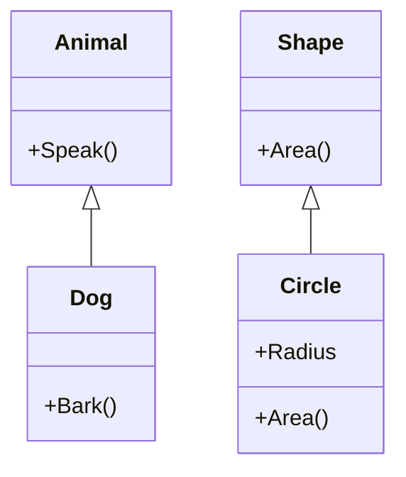

위의 다이어그램은 `Animal`과 `Shape` 클래스의 상속 관계를 나타내며, `Dog`와 `Circle`이 각각의 기본 클래스를 상속받고 있음을 보여준다. 상속을 통해 클래스 간의 관계를 명확히 하고, 코드의 구조를 이해하기 쉽게 만든다.

<!--
## 6. 인터페이스
   - 인터페이스의 정의
   - 인터페이스 구현
   - 관련 개념: 다중 상속
-->

## 인터페이스

### 인터페이스의 정의

인터페이스(Interface)는 C#에서 클래스가 구현해야 하는 메서드, 속성, 이벤트 등을 정의하는 계약이다. 인터페이스는 구현을 포함하지 않으며, 오직 메서드의 시그니처만을 정의한다. 이를 통해 서로 다른 클래스들이 동일한 메서드를 구현할 수 있도록 하여, 코드의 일관성과 재사용성을 높인다.

인터페이스는 다음과 같은 형식으로 정의된다.

```csharp
public interface IAnimal
{
    void Speak();
}
```

위의 예제에서 `IAnimal` 인터페이스는 `Speak` 메서드를 정의하고 있다. 이 인터페이스를 구현하는 클래스는 `Speak` 메서드를 반드시 구현해야 한다.

### 인터페이스 구현

클래스는 인터페이스를 구현하기 위해 `:` 기호를 사용한다. 인터페이스를 구현한 클래스는 인터페이스에서 정의한 모든 메서드를 구현해야 한다. 다음은 `IAnimal` 인터페이스를 구현한 `Dog` 클래스의 예이다.

```csharp
public class Dog : IAnimal
{
    public void Speak()
    {
        Console.WriteLine("Woof!");
    }
}
```

위의 코드에서 `Dog` 클래스는 `IAnimal` 인터페이스를 구현하고 있으며, `Speak` 메서드를 정의하여 "Woof!"라는 출력을 생성한다.

### 관련 개념: 다중 상속

C#에서는 클래스가 여러 클래스를 상속받을 수 없지만, 인터페이스는 여러 개를 구현할 수 있다. 이를 통해 다중 상속의 장점을 활용할 수 있다. 다음은 다중 상속을 사용하는 예제이다.

```csharp
public interface IFlyable
{
    void Fly();
}

public class Bird : IAnimal, IFlyable
{
    public void Speak()
    {
        Console.WriteLine("Chirp!");
    }

    public void Fly()
    {
        Console.WriteLine("Flying high!");
    }
}
```

위의 예제에서 `Bird` 클래스는 `IAnimal`과 `IFlyable` 두 개의 인터페이스를 구현하고 있다. 이를 통해 `Bird` 클래스는 `Speak`와 `Fly` 두 가지 기능을 가질 수 있다.

### 다이어그램

다음은 인터페이스와 클래스 간의 관계를 나타내는 다이어그램이다.

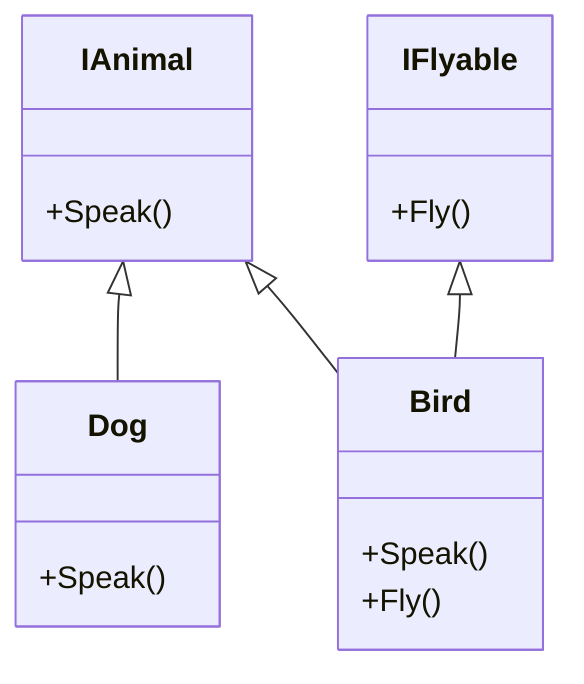

위의 다이어그램에서 `IAnimal`과 `IFlyable` 인터페이스는 각각 `Dog`와 `Bird` 클래스에 의해 구현되고 있다. `Bird` 클래스는 두 개의 인터페이스를 모두 구현하여 다중 상속의 효과를 보여준다. 

인터페이스는 코드의 유연성과 확장성을 높이는 중요한 요소이며, 객체 지향 프로그래밍에서 매우 중요한 개념이다.

<!--
## 7. 제네릭 형식
   - 제네릭의 정의
   - 제네릭 클래스 및 메서드
   - 예제: List<T>
-->

## 제네릭 형식

제네릭 형식은 C#에서 형식의 재사용성을 높이고, 타입 안전성을 제공하는 중요한 기능이다. 제네릭을 사용하면 특정 데이터 형식에 의존하지 않고, 다양한 데이터 형식에 대해 동일한 코드를 사용할 수 있다. 이는 코드의 중복을 줄이고, 유지보수를 용이하게 한다.

**제네릭의 정의**

제네릭은 클래스, 메서드, 인터페이스 등에서 타입 매개변수를 사용하는 기능이다. 이를 통해 개발자는 특정 타입에 대한 제약 없이 코드를 작성할 수 있으며, 컴파일 시에 타입이 결정된다. 제네릭을 사용하면 런타임에서 발생할 수 있는 타입 관련 오류를 컴파일 타임에 미리 방지할 수 있다.

**제네릭 클래스 및 메서드**

제네릭 클래스는 타입 매개변수를 사용하는 클래스를 의미한다. 예를 들어, `List<T>`는 제네릭 클래스로, `T`는 리스트에 저장될 데이터의 타입을 나타낸다. 제네릭 메서드 또한 비슷한 방식으로 정의할 수 있으며, 메서드의 매개변수나 반환 타입에 제네릭 타입을 사용할 수 있다.

다음은 제네릭 클래스를 사용하는 간단한 예제이다.

```csharp
public class GenericList<T>
{
    private List<T> items = new List<T>();

    public void Add(T item)
    {
        items.Add(item);
    }

    public T Get(int index)
    {
        return items[index];
    }
}
```

위의 코드에서 `GenericList<T>` 클래스는 제네릭 타입 `T`를 사용하여 다양한 데이터 형식을 저장할 수 있는 리스트를 구현하고 있다. `Add` 메서드는 리스트에 아이템을 추가하고, `Get` 메서드는 특정 인덱스의 아이템을 반환한다.

**예제: List<T>**

`List<T>`는 C#에서 가장 많이 사용되는 제네릭 클래스 중 하나이다. 이 클래스는 동적 배열을 구현하며, 다양한 데이터 형식을 저장할 수 있다. 다음은 `List<T>`를 사용하는 예제이다.

```csharp
List<int> intList = new List<int>();
intList.Add(1);
intList.Add(2);
intList.Add(3);

foreach (int number in intList)
{
    Console.WriteLine(number);
}
```

위의 예제에서는 `List<int>`를 사용하여 정수형 데이터를 저장하고, foreach 루프를 통해 리스트의 모든 요소를 출력하고 있다.

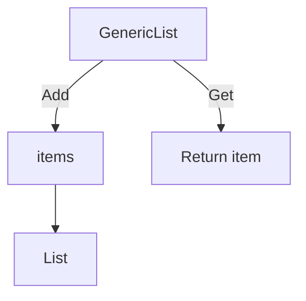

위의 다이어그램은 `GenericList<T>` 클래스의 구조를 나타내고 있다. `Add` 메서드는 `items` 리스트에 아이템을 추가하고, `Get` 메서드는 특정 인덱스의 아이템을 반환하는 과정을 보여준다.

제네릭 형식은 코드의 재사용성을 높이고, 타입 안전성을 제공하는 강력한 도구이다. 이를 통해 개발자는 더 효율적이고 안전한 코드를 작성할 수 있다.

<!--
## 8. 정적 형식
   - static 클래스의 정의
   - static 멤버의 사용
-->

## 정적 형식

C#에서 정적 형식은 프로그램의 구조를 단순화하고, 메모리 관리를 효율적으로 할 수 있도록 돕는 중요한 개념이다. 정적 형식은 주로 `static` 키워드를 사용하여 정의되며, 클래스와 멤버에 적용할 수 있다.

### **static 클래스의 정의**

`static` 클래스는 인스턴스를 생성할 수 없는 클래스이다. 즉, `static` 클래스는 오직 정적 멤버만 포함할 수 있으며, 이를 통해 클래스의 상태를 유지할 필요 없이 관련된 메서드나 속성을 그룹화할 수 있다. `static` 클래스는 주로 유틸리티 메서드나 헬퍼 메서드를 정의하는 데 사용된다.

다음은 `static` 클래스를 정의하는 예제이다.

```csharp
public static class MathUtilities
{
    public static int Add(int a, int b)
    {
        return a + b;
    }

    public static int Subtract(int a, int b)
    {
        return a - b;
    }
}
```

위의 예제에서 `MathUtilities` 클래스는 `static`으로 정의되어 있으며, 두 개의 정적 메서드 `Add`와 `Subtract`를 포함하고 있다. 이 클래스는 인스턴스를 생성할 필요 없이 직접 호출할 수 있다.

### **static 멤버의 사용**

`static` 멤버는 클래스의 인스턴스와 관계없이 클래스 자체에 속하는 멤버이다. 이러한 멤버는 클래스가 메모리에 로드될 때 한 번만 생성되며, 모든 인스턴스가 동일한 값을 공유한다. `static` 멤버는 주로 클래스 수준에서 공유해야 하는 데이터나 메서드를 정의하는 데 사용된다.

다음은 `static` 멤버를 사용하는 예제이다.

```csharp
public class Counter
{
    private static int count = 0;

    public static void Increment()
    {
        count++;
    }

    public static int GetCount()
    {
        return count;
    }
}
```

위의 예제에서 `Counter` 클래스는 `count`라는 정적 필드를 가지고 있으며, `Increment` 메서드를 통해 이 값을 증가시킬 수 있다. `GetCount` 메서드는 현재 카운트를 반환한다. 이 클래스의 모든 인스턴스는 동일한 `count` 값을 공유하게 된다.

### 다이어그램

다음은 `static` 클래스와 멤버의 관계를 나타내는 다이어그램이다.

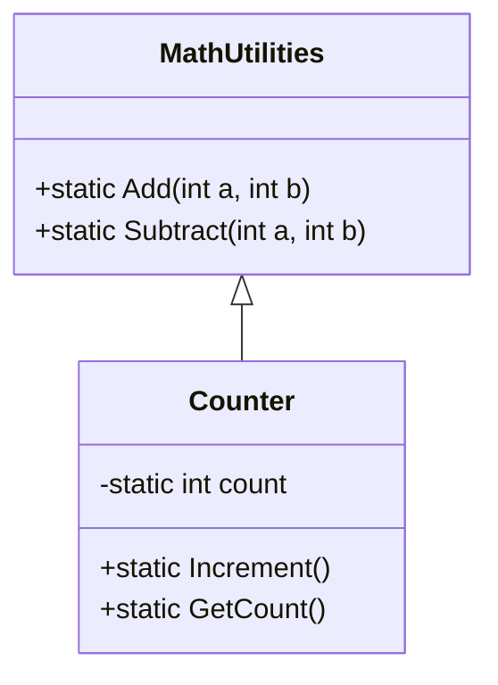

위의 다이어그램에서 `MathUtilities`와 `Counter` 클래스는 각각의 정적 메서드를 가지고 있으며, 인스턴스 없이 호출될 수 있는 구조를 보여준다. `static` 클래스와 멤버는 프로그램의 구조를 간결하게 유지하고, 메모리 사용을 최적화하는 데 기여한다.

<!--
## 13. 확장 메서드
   - 확장 메서드의 정의
   - 사용 방법 및 예제
-->

## 확장 메서드

확장 메서드는 기존 클래스에 새로운 메서드를 추가할 수 있는 기능을 제공하는 C#의 강력한 기능이다. 이를 통해 기존 클래스의 소스 코드를 수정하지 않고도 새로운 기능을 추가할 수 있다. 확장 메서드는 정적 클래스 내에 정적 메서드로 정의되며, 첫 번째 매개변수에 `this` 키워드를 사용하여 확장할 타입을 지정한다.

**확장 메서드의 정의**

확장 메서드는 다음과 같은 형식으로 정의된다.

```csharp
public static class StringExtensions
{
    public static int WordCount(this string str)
    {
        return string.IsNullOrWhiteSpace(str) ? 0 : str.Split(' ').Length;
    }
}
```

위의 예제에서 `StringExtensions`라는 정적 클래스 내에 `WordCount`라는 확장 메서드를 정의하였다. 이 메서드는 문자열의 단어 수를 반환한다. `this` 키워드를 사용하여 `string` 타입을 확장하고 있다.

**사용 방법 및 예제**

확장 메서드를 사용하기 위해서는 해당 메서드를 정의한 네임스페이스를 포함해야 한다. 아래는 확장 메서드를 사용하는 예제이다.

```csharp
using System;

class Program
{
    static void Main()
    {
        string text = "Hello, how are you today?";
        int count = text.WordCount();
        Console.WriteLine($"단어 수: {count}");
    }
}
```

위의 코드에서 `text.WordCount()`를 호출하여 문자열의 단어 수를 계산하고 출력하고 있다. 이처럼 확장 메서드를 사용하면 기존 클래스의 인스턴스에서 새로운 메서드를 호출할 수 있게 된다.

**다이어그램**

아래는 확장 메서드의 구조를 나타내는 다이어그램이다.

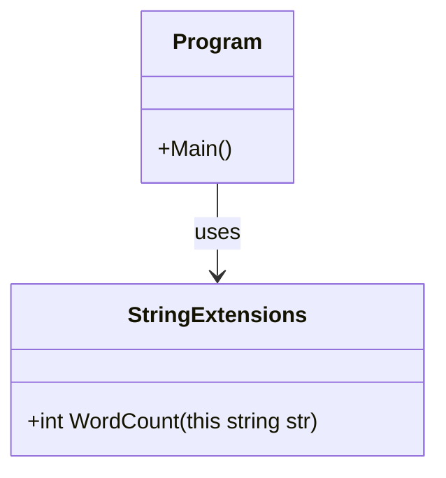

이 다이어그램은 `Program` 클래스가 `StringExtensions` 클래스를 사용하여 확장 메서드를 호출하는 구조를 보여준다. 확장 메서드는 기존 클래스의 기능을 확장하는 유용한 방법으로, 코드의 재사용성과 가독성을 높이는 데 기여한다.

<!--
## 14. 암시적 형식 지역 변수
   - var 키워드의 사용
   - 암시적 형식의 장점
-->

## 암시적 형식 지역 변수

C#에서는 `var` 키워드를 사용하여 암시적 형식의 지역 변수를 선언할 수 있다. 이 기능은 변수의 형식을 컴파일러가 자동으로 추론하도록 하여 코드의 가독성을 높이고, 개발자가 형식을 명시적으로 지정할 필요를 줄여준다.

### **var 키워드의 사용**

`var` 키워드는 지역 변수의 선언 시 사용되며, 변수의 초기화 시점에 형식이 결정된다. 예를 들어, 다음과 같은 코드가 있다.

```csharp
var number = 10; // int 형식으로 추론됨
var name = "C#"; // string 형식으로 추론됨
var list = new List<string>(); // List<string> 형식으로 추론됨
```

위의 예제에서 `number`는 `int` 형식으로, `name`은 `string` 형식으로, `list`는 `List<string>` 형식으로 각각 추론된다. 이처럼 `var`를 사용하면 코드가 간결해지고, 형식이 명확한 경우에는 더욱 유용하다.

### **암시적 형식의 장점**

암시적 형식의 사용은 여러 가지 장점을 제공한다.

1. **가독성 향상**: 코드가 간결해져서 읽기 쉬워진다. 특히 복잡한 형식의 경우, 명시적으로 형식을 적는 것보다 `var`를 사용하는 것이 더 직관적일 수 있다.
   
2. **유연성**: 형식이 변경될 경우, 변수 선언부를 수정할 필요가 없으므로 유지보수가 용이하다. 예를 들어, LINQ 쿼리 결과를 사용할 때 `var`를 사용하면 반환 형식이 변경되더라도 코드 수정이 필요 없다.

3. **타입 안전성**: `var`를 사용하더라도 컴파일 타임에 형식이 결정되므로, 타입 안전성을 유지할 수 있다. 즉, 잘못된 형식의 값을 할당하려고 하면 컴파일 오류가 발생한다.

다음은 `var`를 사용한 LINQ 쿼리의 예시이다.

```csharp
var numbers = new List<int> { 1, 2, 3, 4, 5 };
var evenNumbers = numbers.Where(n => n % 2 == 0).ToList();
```

위의 코드에서 `evenNumbers`는 `List<int>` 형식으로 추론되며, `var`를 사용함으로써 코드가 더욱 간결해진다.

### 다이어그램

다음은 `var` 키워드의 사용을 설명하는 다이어그램이다.

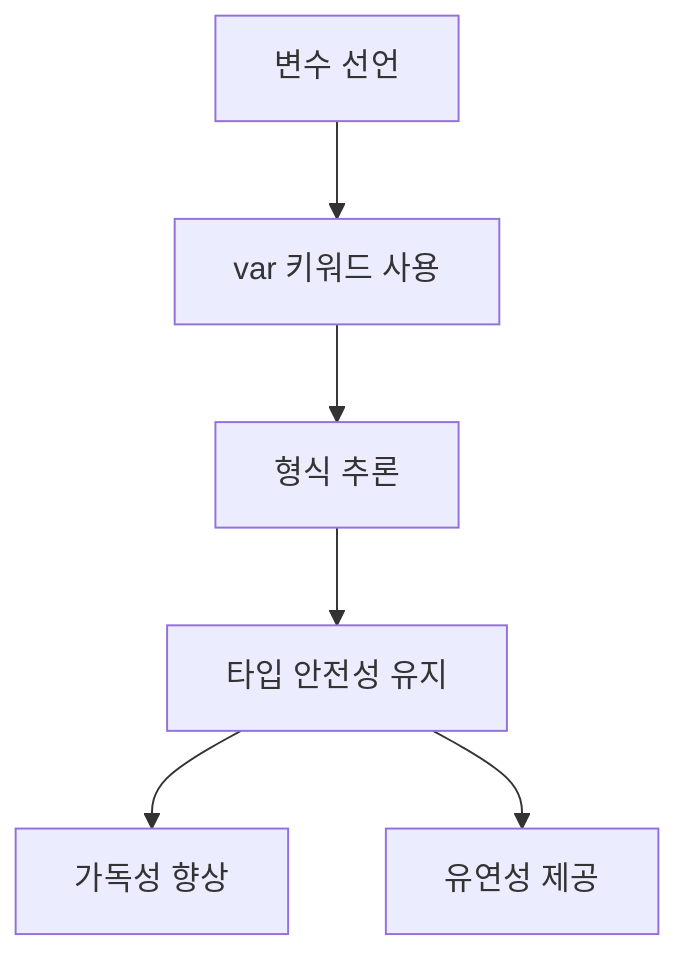

이와 같이 암시적 형식 지역 변수는 C#에서 코드의 가독성과 유연성을 높이는 데 기여하며, 개발자가 보다 효율적으로 코드를 작성할 수 있도록 돕는다.

<!--
## 15. 레코드
   - 레코드의 정의
   - 값 기반 같음
   - 비파괴적 변형 (Non-destructive Mutation)
   - 레코드 클래스와 구조체의 차이
-->

## 레코드

### 레코드의 정의
레코드는 C# 9.0에서 도입된 새로운 형식으로, 주로 데이터 전송 객체(Data Transfer Object)로 사용된다. 레코드는 불변성을 기본으로 하며, 데이터의 구조를 정의하는 데 최적화되어 있다. 레코드는 클래스와 유사하지만, 주로 데이터의 저장과 전송을 목적으로 사용되며, 자동으로 생성되는 메서드와 속성을 통해 값 기반의 동등성을 제공한다.

### 값 기반 같음
레코드는 값 기반 같음을 지원한다. 이는 두 개의 레코드 인스턴스가 동일한 값을 가지면 동일한 것으로 간주된다는 의미이다. 이를 통해 레코드는 데이터의 동등성을 쉽게 비교할 수 있다. 예를 들어, 다음과 같은 레코드 정의가 있을 때:

```csharp
public record Person(string Name, int Age);
```

아래와 같이 두 인스턴스를 비교할 수 있다.

```csharp
var person1 = new Person("Alice", 30);
var person2 = new Person("Alice", 30);

bool areEqual = person1 == person2; // true
```

### 비파괴적 변형 (Non-destructive Mutation)
레코드는 비파괴적 변형을 지원하여, 기존의 인스턴스를 변경하지 않고 새로운 인스턴스를 생성할 수 있다. 이는 `with` 키워드를 사용하여 구현할 수 있다. 예를 들어, 다음과 같이 기존 인스턴스를 기반으로 새로운 인스턴스를 생성할 수 있다.

```csharp
var person3 = person1 with { Age = 31 };
```

이 경우, `person1`은 여전히 30세로 남아 있으며, `person3`는 31세로 생성된다.

### 레코드 클래스와 구조체의 차이
레코드는 클래스와 유사하지만 몇 가지 중요한 차이점이 있다. 레코드는 기본적으로 참조 형식이며, 불변성을 기본으로 한다. 반면, 구조체는 값 형식으로, 메모리에서 직접 값을 저장한다. 레코드는 값 기반 같음을 제공하지만, 구조체는 기본적으로 참조 같음을 제공한다. 다음은 레코드와 구조체의 간단한 비교를 나타내는 다이어그램이다.

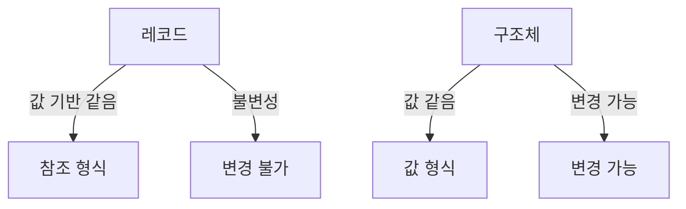

이와 같이 레코드는 데이터 중심의 프로그래밍을 보다 간편하게 만들어 주며, 불변성과 값 기반 같음을 통해 코드의 안정성을 높이는 데 기여한다.

<!--
## 16. C# 언어 사양
   - C# 언어 사양의 중요성
   - 신뢰할 수 있는 소스
-->

## C# 언어 사양

C# 언어 사양은 C# 프로그래밍 언어의 문법, 의미 및 사용 방법을 정의하는 공식 문서이다. 이 문서는 C# 언어의 모든 기능과 규칙을 상세히 설명하고 있으며, 개발자들이 언어를 올바르게 이해하고 사용할 수 있도록 돕는다. C# 언어 사양의 중요성은 다음과 같다.

**C# 언어 사양의 중요성**

C# 언어 사양은 다음과 같은 이유로 중요하다.

1. **일관성 유지**: 언어 사양은 C#의 모든 구현체가 동일한 규칙을 따르도록 보장한다. 이를 통해 다양한 플랫폼에서의 코드 호환성을 높인다.
   
2. **기능 이해**: 개발자들은 언어 사양을 통해 C#의 다양한 기능과 그 사용 방법을 명확히 이해할 수 있다. 이는 코드 작성 시 발생할 수 있는 오류를 줄이는 데 기여한다.

3. **최신 기능 반영**: C# 언어 사양은 새로운 기능이 추가될 때마다 업데이트된다. 따라서 개발자들은 최신 기능을 활용하여 더 나은 코드를 작성할 수 있다.

4. **문서화**: 언어 사양은 C#의 모든 기능에 대한 공식 문서로서, 개발자들이 참고할 수 있는 신뢰할 수 있는 자료를 제공한다.

**신뢰할 수 있는 소스**

C# 언어 사양을 참조할 때는 신뢰할 수 있는 소스를 사용하는 것이 중요하다. Microsoft의 공식 문서가 가장 권위 있는 자료로 여겨지며, 다음과 같은 링크에서 확인할 수 있다.

- [C# Language Specification](https://docs.microsoft.com/en-us/dotnet/csharp/language-reference/language-specification/)

이 외에도 C# 관련 서적이나 온라인 강의, 커뮤니티 포럼 등도 유용한 자료가 될 수 있다. 그러나 항상 공식 문서를 우선적으로 참고하는 것이 좋다.

### 샘플 코드

아래는 C# 언어 사양에 따라 정의된 간단한 클래스의 예제이다.

```csharp
public class Person
{
    public string Name { get; set; }
    public int Age { get; set; }

    public void Introduce()
    {
        Console.WriteLine($"안녕하세요, 제 이름은 {Name}이고, 나이는 {Age}세입니다.");
    }
}
```

### 다이어그램

다음은 C# 클래스의 구조를 나타내는 다이어그램이다.

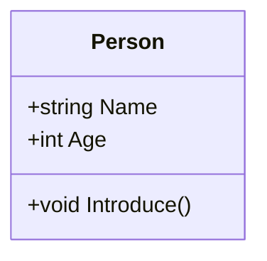

이와 같이 C# 언어 사양은 개발자들이 언어를 이해하고 활용하는 데 필수적인 자료이다. 신뢰할 수 있는 소스를 통해 지속적으로 업데이트된 정보를 확인하는 것이 중요하다.

<!--
## 17. 개체 - 형식의 인스턴스 만들기
   - 클래스와 구조체 인스턴스의 차이
   - 메모리 할당 및 관리
-->

## 개체 - 형식의 인스턴스 만들기

C#에서 클래스와 구조체는 모두 형식(type)으로, 인스턴스를 생성하여 사용할 수 있다. 그러나 이 두 형식 간에는 몇 가지 중요한 차이점이 존재한다. 

### 클래스와 구조체 인스턴스의 차이

클래스는 참조 형식(reference type)이며, 구조체는 값 형식(value type)이다. 이로 인해 인스턴스의 생성 및 메모리 관리 방식이 다르다. 

- **클래스 인스턴스**: 클래스의 인스턴스는 힙(Heap) 메모리에 할당되며, 해당 인스턴스에 대한 참조가 스택(Stack) 메모리에 저장된다. 따라서 클래스 인스턴스를 다른 변수에 할당하면, 원본 인스턴스에 대한 참조가 복사된다. 이로 인해 두 변수는 동일한 인스턴스를 가리키게 된다.

- **구조체 인스턴스**: 구조체의 인스턴스는 스택 메모리에 직접 할당된다. 구조체를 다른 변수에 할당하면, 해당 구조체의 값이 복사된다. 이로 인해 두 변수는 서로 다른 인스턴스를 가리키게 된다.

다음은 클래스와 구조체의 인스턴스를 생성하는 간단한 예제이다.

```csharp
public class MyClass
{
    public int Value;
}

public struct MyStruct
{
    public int Value;
}

class Program
{
    static void Main()
    {
        // 클래스 인스턴스 생성
        MyClass classInstance1 = new MyClass();
        classInstance1.Value = 10;

        MyClass classInstance2 = classInstance1; // 참조 복사
        classInstance2.Value = 20;

        Console.WriteLine(classInstance1.Value); // 출력: 20

        // 구조체 인스턴스 생성
        MyStruct structInstance1 = new MyStruct();
        structInstance1.Value = 10;

        MyStruct structInstance2 = structInstance1; // 값 복사
        structInstance2.Value = 20;

        Console.WriteLine(structInstance1.Value); // 출력: 10
    }
}
```

위의 예제에서 `classInstance1`과 `classInstance2`는 동일한 클래스 인스턴스를 참조하므로, 하나의 인스턴스에서 값을 변경하면 다른 인스턴스에도 영향을 미친다. 반면, `structInstance1`과 `structInstance2`는 서로 다른 구조체 인스턴스이므로, 하나의 인스턴스에서 값을 변경해도 다른 인스턴스에는 영향을 미치지 않는다.

### 메모리 할당 및 관리

클래스와 구조체의 메모리 할당 방식은 성능에 큰 영향을 미칠 수 있다. 클래스는 힙 메모리에 할당되므로, 가비지 컬렉터(Garbage Collector)에 의해 관리된다. 이는 메모리 누수를 방지하는 데 도움이 되지만, 가비지 컬렉션이 발생할 때 성능 저하가 발생할 수 있다.

반면, 구조체는 스택 메모리에 할당되므로, 메모리 할당과 해제가 빠르다. 그러나 구조체의 크기가 크거나, 자주 복사되는 경우에는 성능 저하가 발생할 수 있다. 따라서 구조체는 작은 데이터 집합을 표현할 때 적합하며, 클래스는 더 복잡한 데이터 구조를 표현할 때 적합하다.

다음은 메모리 할당을 시각적으로 나타낸 다이어그램이다.

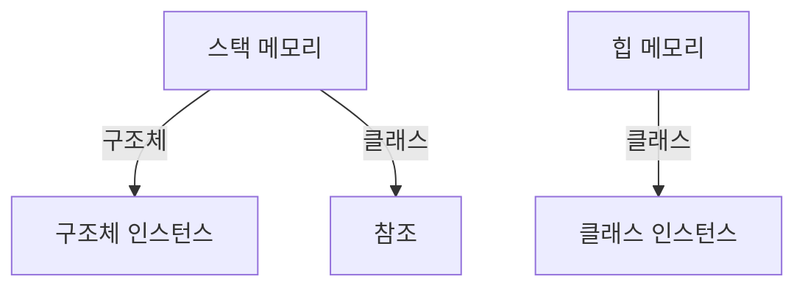

이 다이어그램은 스택 메모리와 힙 메모리 간의 관계를 보여준다. 구조체는 스택에 직접 할당되며, 클래스는 힙에 할당되고 참조가 스택에 저장된다. 이러한 차이를 이해하는 것은 C#에서 메모리 관리 및 성능 최적화에 중요한 요소이다.

<!--
## 18. 개체 ID와 값 같음 비교
   - 참조 같음과 값 같음의 차이
   - Equals 메서드의 사용
-->

## 개체 ID와 값 같음 비교

C#에서 개체의 비교는 두 가지 주요 개념인 참조 같음(Reference Equality)과 값 같음(Value Equality)으로 나눌 수 있다. 이 두 개념은 개체의 동작과 메모리 관리에 중요한 역할을 한다.

### 참조 같음과 값 같음의 차이

**참조 같음**은 두 개체가 동일한 메모리 주소를 참조하는지를 확인하는 방법이다. 즉, 두 개체가 동일한 인스턴스를 가리키고 있는지를 판단한다. 반면, **값 같음**은 두 개체의 내용이 동일한지를 비교하는 방법이다. 이 경우, 두 개체가 서로 다른 인스턴스일지라도 그 내부의 데이터가 같다면 값 같음으로 간주된다.

다음은 참조 같음과 값 같음의 차이를 보여주는 간단한 코드 예제이다.

```csharp
class Program
{
    class Person
    {
        public string Name { get; set; }
    }

    static void Main(string[] args)
    {
        Person person1 = new Person { Name = "Alice" };
        Person person2 = new Person { Name = "Alice" };
        Person person3 = person1;

        // 참조 같음
        Console.WriteLine(object.ReferenceEquals(person1, person2)); // false
        Console.WriteLine(object.ReferenceEquals(person1, person3)); // true

        // 값 같음
        Console.WriteLine(person1.Name == person2.Name); // true
    }
}
```

위의 코드에서 `person1`과 `person2`는 서로 다른 인스턴스이므로 참조 같음은 false를 반환하지만, 두 개체의 `Name` 속성은 동일하므로 값 같음은 true를 반환한다. 반면, `person3`는 `person1`을 참조하므로 참조 같음은 true를 반환한다.

### Equals 메서드의 사용

C#에서는 `Equals` 메서드를 사용하여 값 같음을 비교할 수 있다. 기본적으로 `Object` 클래스에서 제공하는 `Equals` 메서드는 참조 같음을 비교하지만, 이를 오버라이드하여 값 같음을 비교하도록 구현할 수 있다.

다음은 `Equals` 메서드를 오버라이드한 예제이다.

```csharp
class Person
{
    public string Name { get; set; }

    public override bool Equals(object obj)
    {
        if (obj is Person other)
        {
            return this.Name == other.Name;
        }
        return false;
    }

    public override int GetHashCode()
    {
        return Name.GetHashCode();
    }
}

class Program
{
    static void Main(string[] args)
    {
        Person person1 = new Person { Name = "Alice" };
        Person person2 = new Person { Name = "Alice" };

        // Equals 메서드 사용
        Console.WriteLine(person1.Equals(person2)); // true
    }
}
```

위의 코드에서 `Person` 클래스는 `Equals` 메서드를 오버라이드하여 두 개체의 `Name` 속성을 비교하도록 구현하였다. 이로 인해 `person1`과 `person2`는 서로 다른 인스턴스이지만, 값 같음으로 true를 반환한다.

### 다이어그램

다음은 참조 같음과 값 같음의 개념을 시각적으로 나타낸 다이어그램이다.

```mermaid
graph TD;
    A[person1] -->|참조 같음| B[메모리 주소]
    C[person2] -->|참조 같음| D[다른 메모리 주소]
    E[person3] -->|참조 같음| B[메모리 주소]
    F[Name: "Alice"] -->|값 같음| G[Name: "Alice"]
```

이 다이어그램은 `person1`과 `person3`가 동일한 메모리 주소를 참조하고 있으며, `person2`는 다른 메모리 주소를 참조하고 있음을 보여준다. 그러나 `person1`과 `person2`의 `Name` 속성은 동일하므로 값 같음으로 간주된다.

이와 같이 C#에서 개체의 ID와 값 같음 비교는 메모리 관리와 개체의 동작을 이해하는 데 중요한 요소이다.

<!--
## 19. 다형성
   - 다형성의 정의
   - 가상 메서드와 재정의
   - 다형성의 예제
-->

## 다형성

다형성(Polymorphism)은 객체 지향 프로그래밍의 핵심 개념 중 하나로, 동일한 인터페이스를 통해 서로 다른 데이터 타입의 객체를 처리할 수 있는 능력을 의미한다. 이는 코드의 유연성과 재사용성을 높여주며, 다양한 객체를 동일한 방식으로 다룰 수 있게 해준다.

### **다형성의 정의**

다형성은 크게 두 가지 형태로 나뉜다. 첫 번째는 컴파일 타임 다형성(Compile-time Polymorphism)으로, 주로 메서드 오버로딩(Method Overloading)과 연산자 오버로딩(Operator Overloading)을 통해 구현된다. 두 번째는 런타임 다형성(Runtime Polymorphism)으로, 주로 가상 메서드(Virtual Method)와 메서드 재정의(Method Overriding)를 통해 구현된다.

### **가상 메서드와 재정의**

가상 메서드는 기본 클래스에서 정의되며, 파생 클래스에서 재정의할 수 있는 메서드이다. 이를 통해 런타임에 객체의 실제 타입에 따라 적절한 메서드가 호출된다. 가상 메서드를 사용하기 위해서는 `virtual` 키워드를 사용하여 기본 클래스에서 메서드를 정의하고, `override` 키워드를 사용하여 파생 클래스에서 메서드를 재정의해야 한다.

다음은 가상 메서드와 재정의의 예제이다.

```csharp
public class Animal
{
    public virtual void Speak()
    {
        Console.WriteLine("Animal speaks");
    }
}

public class Dog : Animal
{
    public override void Speak()
    {
        Console.WriteLine("Dog barks");
    }
}

public class Cat : Animal
{
    public override void Speak()
    {
        Console.WriteLine("Cat meows");
    }
}
```

위의 코드에서 `Animal` 클래스는 `Speak`라는 가상 메서드를 정의하고, `Dog`와 `Cat` 클래스는 이를 재정의하여 각기 다른 방식으로 동작한다.

### **다형성의 예제**

다형성을 활용하면 다음과 같이 다양한 객체를 동일한 방식으로 처리할 수 있다. 아래의 예제에서는 `Animal` 타입의 리스트를 사용하여 각 동물의 소리를 출력한다.

```csharp
List<Animal> animals = new List<Animal>
{
    new Dog(),
    new Cat()
};

foreach (var animal in animals)
{
    animal.Speak(); // 각 동물의 Speak 메서드가 호출된다.
}
```

이 코드는 `Dog`와 `Cat` 객체를 `Animal` 타입의 리스트에 추가하고, 반복문을 통해 각 객체의 `Speak` 메서드를 호출한다. 이때, 실제 객체의 타입에 따라 적절한 메서드가 호출되는 것이 다형성의 특징이다.

### 다이어그램

다음은 다형성을 설명하는 다이어그램이다.

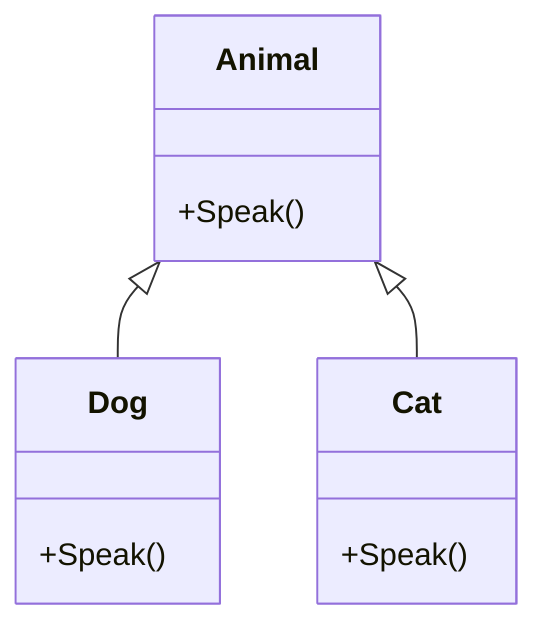

위의 다이어그램에서 `Animal` 클래스는 기본 클래스이며, `Dog`와 `Cat` 클래스는 이를 상속받아 각기 다른 방식으로 `Speak` 메서드를 구현하고 있다. 이처럼 다형성을 통해 다양한 객체를 동일한 인터페이스로 다룰 수 있는 장점을 제공한다.

<!--
## 20. 결론
   - C#의 클래스, 구조체 및 레코드의 중요성
   - 객체 지향 프로그래밍의 원칙 요약
-->

## 결론

C#의 클래스, 구조체 및 레코드는 객체 지향 프로그래밍(OOP)에서 중요한 역할을 한다. 이들은 데이터와 기능을 하나의 단위로 묶어 관리할 수 있게 해주며, 코드의 재사용성과 유지보수성을 높여준다. 특히, 클래스는 복잡한 데이터 구조를 정의하고, 구조체는 값 타입으로 간단한 데이터 구조를 정의하는 데 유용하다. 레코드는 불변성을 제공하여 데이터의 안전성을 높이는 데 기여한다.

**C#의 클래스, 구조체 및 레코드의 중요성**

C#에서 클래스, 구조체 및 레코드는 다음과 같은 이유로 중요하다:

- **데이터 캡슐화**: 클래스와 구조체는 데이터를 보호하고, 외부에서 직접 접근하지 못하도록 하여 데이터 무결성을 유지한다.
- **코드 재사용성**: 상속과 다형성을 통해 기존 코드를 재사용할 수 있어 개발 효율성을 높인다.
- **유지보수성**: 객체 지향 프로그래밍의 원칙을 따름으로써 코드의 구조가 명확해지고, 변경이 용이해진다.

다음은 클래스와 구조체의 간단한 예제 코드이다.

```csharp
// 클래스 정의
public class Person
{
    public string Name { get; set; }
    public int Age { get; set; }

    public void Introduce()
    {
        Console.WriteLine($"안녕하세요, 제 이름은 {Name}이고, 나이는 {Age}입니다.");
    }
}

// 구조체 정의
public struct Point
{
    public int X { get; set; }
    public int Y { get; set; }
}
```

**객체 지향 프로그래밍의 원칙 요약**

객체 지향 프로그래밍은 다음과 같은 원칙을 기반으로 한다:

- **캡슐화(Encapsulation)**: 데이터와 메서드를 하나의 단위로 묶어 외부에서의 접근을 제한한다.
- **상속(Inheritance)**: 기존 클래스를 기반으로 새로운 클래스를 정의하여 코드의 재사용성을 높인다.
- **다형성(Polymorphism)**: 동일한 인터페이스를 통해 다양한 객체를 처리할 수 있게 해준다.

다음은 객체 지향 프로그래밍의 원칙을 설명하는 다이어그램이다.

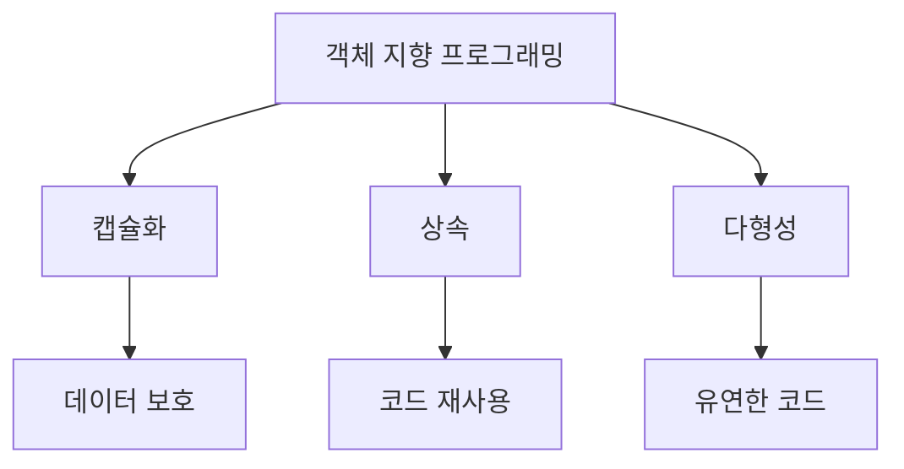

결론적으로, C#의 클래스, 구조체 및 레코드는 객체 지향 프로그래밍의 핵심 요소로, 소프트웨어 개발에서 중요한 역할을 한다. 이들을 적절히 활용함으로써 더 나은 코드 품질과 유지보수성을 확보할 수 있다.

<!--
## 21. FAQ
   - C#에서 클래스와 구조체의 차이는 무엇인가요?
   - 레코드는 언제 사용해야 하나요?
   - C#에서 다형성을 어떻게 활용할 수 있나요?
-->

## FAQ

### C#에서 클래스와 구조체의 차이는 무엇인가요?

C#에서 클래스(Class)와 구조체(Struct)는 모두 사용자 정의 형식을 정의하는 데 사용되지만, 몇 가지 중요한 차이점이 있다. 

**메모리 할당 방식**: 클래스는 참조 형식(Reference Type)으로, 객체가 생성될 때 힙(Heap) 메모리에 할당된다. 반면, 구조체는 값 형식(Value Type)으로, 스택(Stack) 메모리에 할당된다. 이로 인해 클래스는 null 값을 가질 수 있지만, 구조체는 기본적으로 값을 가지므로 null이 될 수 없다.

**상속**: 클래스는 상속을 지원하지만, 구조체는 상속을 지원하지 않는다. 즉, 클래스는 다른 클래스로부터 파생될 수 있지만, 구조체는 다른 구조체로부터 파생될 수 없다.

**기본 생성자**: 클래스는 기본 생성자를 가질 수 있지만, 구조체는 항상 기본 생성자를 제공하며, 사용자가 정의할 수 없다.

다음은 클래스와 구조체의 차이를 보여주는 간단한 코드 예제이다.

```csharp
public class MyClass
{
    public int Value;

    public MyClass(int value)
    {
        Value = value;
    }
}

public struct MyStruct
{
    public int Value;

    public MyStruct(int value)
    {
        Value = value;
    }
}
```

### 레코드는 언제 사용해야 하나요?

레코드(Record)는 C# 9.0에서 도입된 새로운 형식으로, 주로 불변(Immutable) 데이터 구조를 정의하는 데 사용된다. 레코드는 값 기반 같음(Value-based equality)을 제공하므로, 두 레코드 인스턴스의 속성이 동일하면 같은 것으로 간주된다. 

레코드는 다음과 같은 경우에 사용하면 좋다:

- **데이터 전송 객체(DTO)**: API와의 데이터 전송 시, 레코드를 사용하여 간결하고 명확한 데이터 구조를 정의할 수 있다.
- **불변 객체**: 객체의 상태가 변경되지 않아야 하는 경우, 레코드를 사용하여 불변성을 보장할 수 있다.
- **패턴 매칭**: 레코드는 패턴 매칭과 함께 사용하기에 적합하여, 코드의 가독성을 높일 수 있다.

다음은 레코드를 사용하는 예제이다.

```csharp
public record Person(string Name, int Age);
```

### C#에서 다형성을 어떻게 활용할 수 있나요?

다형성(Polymorphism)은 객체 지향 프로그래밍의 핵심 개념 중 하나로, 동일한 인터페이스를 통해 서로 다른 객체를 다룰 수 있게 해준다. C#에서는 주로 가상 메서드(Virtual Method)와 인터페이스(Interface)를 통해 다형성을 구현할 수 있다.

**가상 메서드**: 기본 클래스에서 가상 메서드를 정의하고, 파생 클래스에서 이를 재정의(Override)하여 다형성을 구현할 수 있다. 이를 통해 클라이언트 코드는 기본 클래스의 타입으로 파생 클래스의 인스턴스를 사용할 수 있다.

**인터페이스**: 여러 클래스가 동일한 인터페이스를 구현함으로써, 클라이언트 코드는 인터페이스 타입으로 다양한 객체를 처리할 수 있다.

다음은 다형성을 활용한 간단한 예제이다.

```csharp
public class Animal
{
    public virtual void Speak()
    {
        Console.WriteLine("Animal speaks");
    }
}

public class Dog : Animal
{
    public override void Speak()
    {
        Console.WriteLine("Dog barks");
    }
}

public class Cat : Animal
{
    public override void Speak()
    {
        Console.WriteLine("Cat meows");
    }
}

// 다형성 사용 예
Animal myDog = new Dog();
Animal myCat = new Cat();

myDog.Speak(); // Dog barks
myCat.Speak(); // Cat meows
```

이와 같이 C#에서 클래스와 구조체의 차이, 레코드의 사용 시기, 다형성의 활용 방법에 대해 알아보았다. 이러한 개념들은 객체 지향 프로그래밍을 이해하고 활용하는 데 중요한 요소이다.

<!--
## 22. 관련 기술
   - 객체 지향 프로그래밍 (OOP)
   - 디자인 패턴 (Design Patterns)
   - SOLID 원칙
   - C#의 최신 기능 (C# 9.0, C# 10.0 등)
-->

## 관련 기술

### 객체 지향 프로그래밍 (OOP)

객체 지향 프로그래밍(Object-Oriented Programming, OOP)은 소프트웨어 설계 패러다임으로, 데이터를 객체로 캡슐화하고 이 객체 간의 상호작용을 통해 프로그램을 구성하는 방식이다. OOP의 주요 개념으로는 클래스, 상속, 다형성, 캡슐화가 있다. 이러한 개념들은 코드의 재사용성과 유지보수성을 높이는 데 기여한다.

OOP의 기본 구조를 나타내는 다이어그램은 다음과 같다.

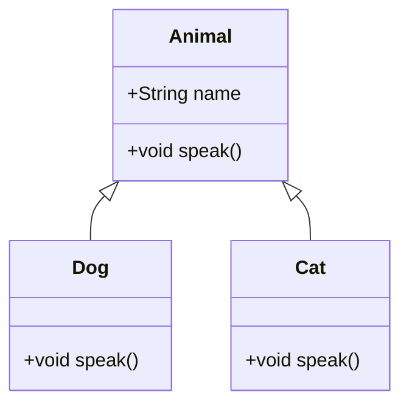

위의 다이어그램에서 `Animal` 클래스는 기본 클래스이며, `Dog`와 `Cat` 클래스는 이를 상속받아 각각의 `speak` 메서드를 구현한다.

### 디자인 패턴 (Design Patterns)

디자인 패턴은 소프트웨어 설계에서 자주 발생하는 문제를 해결하기 위한 일반적인 솔루션이다. 디자인 패턴은 코드의 재사용성을 높이고, 유지보수를 용이하게 하며, 팀 간의 의사소통을 개선하는 데 도움을 준다. 대표적인 디자인 패턴으로는 싱글턴(Singleton), 팩토리(Factory), 옵저버(Observer) 패턴 등이 있다.

예를 들어, 싱글턴 패턴은 클래스의 인스턴스가 오직 하나만 존재하도록 보장하는 패턴이다. 아래는 C#에서 싱글턴 패턴을 구현한 예제 코드이다.

```csharp
public class Singleton
{
    private static Singleton instance;

    private Singleton() { }

    public static Singleton Instance
    {
        get
        {
            if (instance == null)
            {
                instance = new Singleton();
            }
            return instance;
        }
    }
}
```

### SOLID 원칙

SOLID 원칙은 객체 지향 프로그래밍에서 소프트웨어 설계를 개선하기 위한 다섯 가지 원칙을 의미한다. 이 원칙들은 다음과 같다.

- **S**: Single Responsibility Principle (단일 책임 원칙)
- **O**: Open/Closed Principle (개방-폐쇄 원칙)
- **L**: Liskov Substitution Principle (리스코프 치환 원칙)
- **I**: Interface Segregation Principle (인터페이스 분리 원칙)
- **D**: Dependency Inversion Principle (의존성 역전 원칙)

이 원칙들을 준수하면 코드의 유연성과 확장성을 높일 수 있다.

### C#의 최신 기능 (C# 9.0, C# 10.0 등)

C# 9.0과 C# 10.0은 여러 가지 새로운 기능을 도입하여 개발자들이 더 효율적으로 코드를 작성할 수 있도록 지원한다. C# 9.0에서는 레코드(Record) 타입, init 접근자, 패턴 매칭(Pattern Matching) 개선 등이 추가되었다. C# 10.0에서는 전역 using 지시문, 파일 범위 네임스페이스, 개선된 성능 등이 도입되었다.

예를 들어, C# 9.0의 레코드 타입을 사용한 코드 예시는 다음과 같다.

```csharp
public record Person(string Name, int Age);
```

이와 같이 C#의 최신 기능들은 개발자들이 더 간결하고 명확한 코드를 작성할 수 있도록 돕는다.

<!--
##### Reference #####
-->

## Reference


* [https://learn.microsoft.com/ko-kr/dotnet/csharp/fundamentals/object-oriented/](https://learn.microsoft.com/ko-kr/dotnet/csharp/fundamentals/object-oriented/)
* [https://learn.microsoft.com/ko-kr/dotnet/csharp/fundamentals/object-oriented/objects](https://learn.microsoft.com/ko-kr/dotnet/csharp/fundamentals/object-oriented/objects)
* [https://learn.microsoft.com/ko-kr/dotnet/csharp/fundamentals/object-oriented/inheritance](https://learn.microsoft.com/ko-kr/dotnet/csharp/fundamentals/object-oriented/inheritance)
* [https://learn.microsoft.com/ko-kr/dotnet/csharp/fundamentals/object-oriented/polymorphism](https://learn.microsoft.com/ko-kr/dotnet/csharp/fundamentals/object-oriented/polymorphism)

